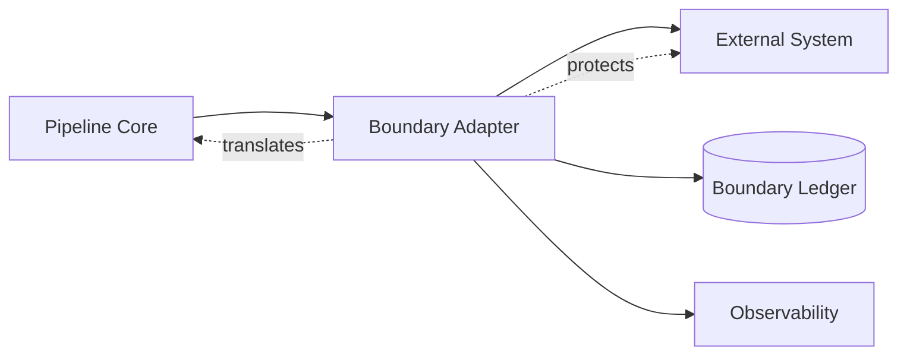
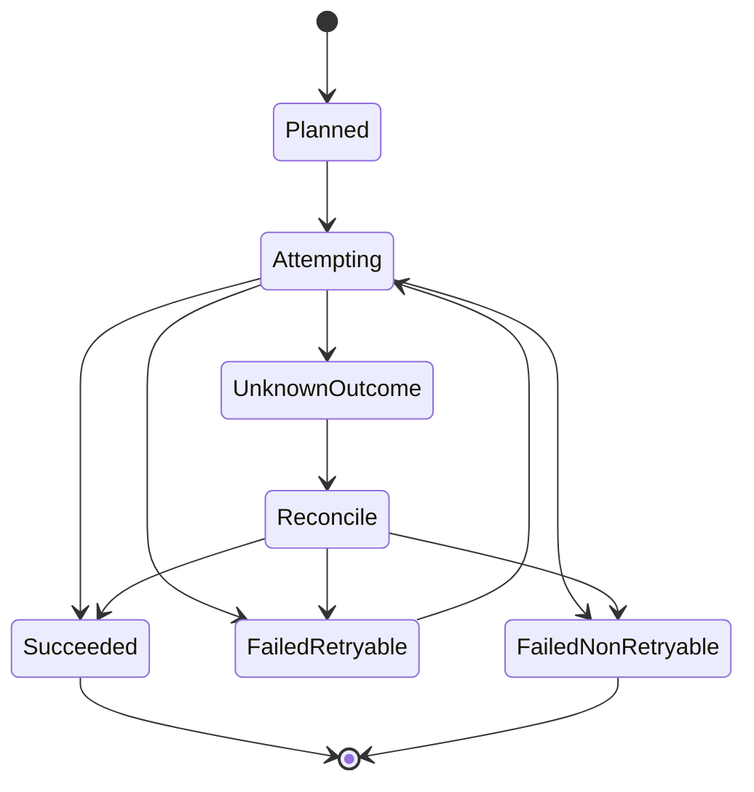
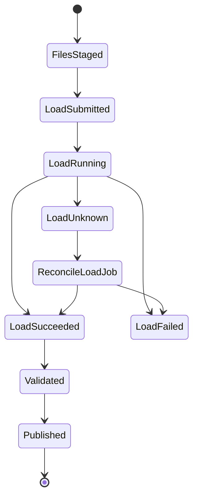
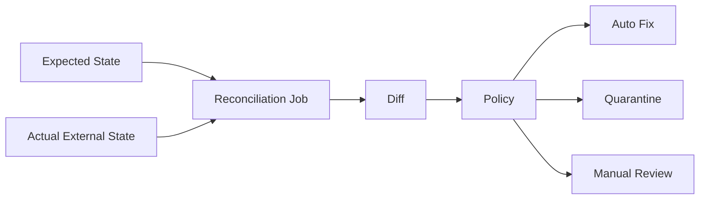
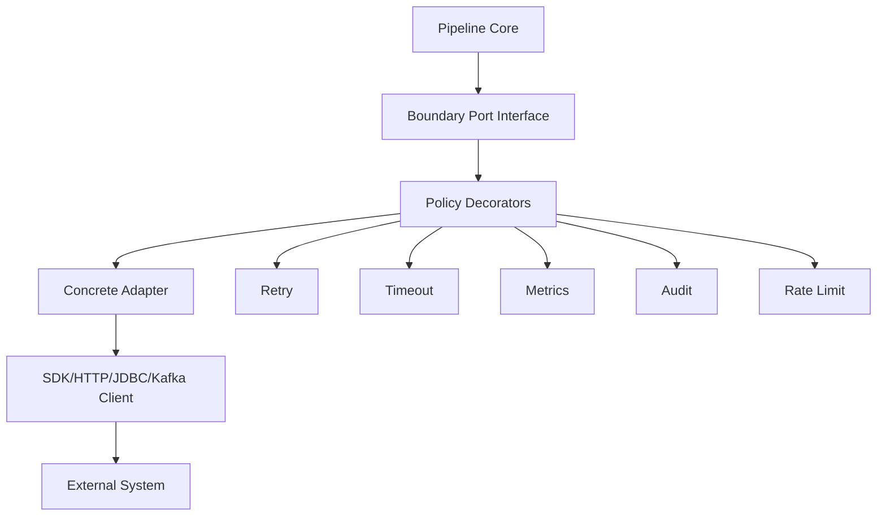
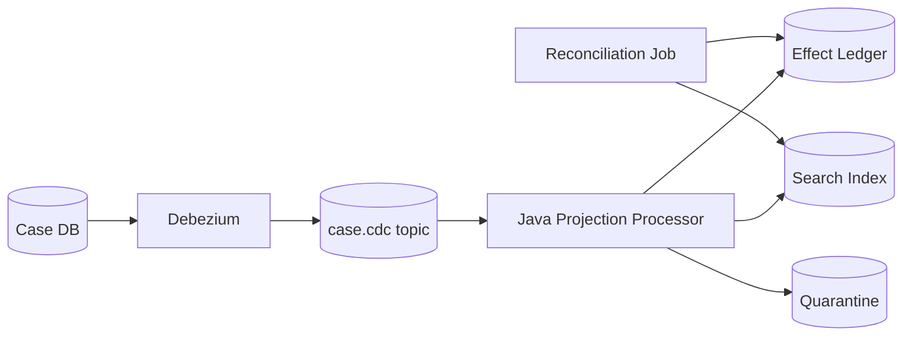

# Part 063 — External System Boundaries

A data pipeline rarely fails in the pure transform code.

It fails at boundaries.

A source is slow. A sink partially commits. An API rate-limits. A warehouse accepts a batch but times out before returning. An object-store listing is stale. A search index acknowledges a bulk request where only 93% of records succeeded. A database deadlocks. Kafka accepts a transactional write but your process dies before committing offsets. A vendor file arrives twice with the same name and different content.

The production rule is simple:

```text
Every external system boundary is a protocol boundary.
```

Not an SDK call.
Not a repository class.
Not a connector checkbox.

A boundary has:

- identity model
- read contract
- write contract
- commit semantics
- retry semantics
- timeout semantics
- ordering semantics
- consistency model
- rate/backpressure behavior
- observability surface
- security surface
- recovery procedure

If these are not explicitly designed, the pipeline will borrow the accidental behavior of the external system.

That is how data loss becomes a configuration bug.

---

## 1. Boundary Thinking

A mature Java data pipeline should not treat external systems as implementation details.

It should treat each system as a state machine with a contract.



The boundary adapter is responsible for translating between pipeline semantics and external system semantics.

The pipeline core wants stable concepts:

```java
interface Source<T, C extends Checkpoint> {
    ReadBatch<T, C> read(C checkpoint, ReadBudget budget) throws SourceUnavailableException;
}

interface Sink<T> {
    SinkResult write(WriteBatch<T> batch, WriteContext context) throws SinkUnavailableException;
}
```

But external systems have messy behavior:

- object storage has files, prefixes, listings, multipart uploads, and eventual operational edge cases
- RDBMS has transactions, isolation levels, locks, deadlocks, sequences, and constraint errors
- Kafka has partitions, offsets, consumer groups, producer transactions, retention, and rebalances
- warehouses have staged loads, asynchronous jobs, quotas, and partial file ingestion
- APIs have pagination, tokens, rate limits, idempotency headers, and inconsistent retry behavior
- search indexes have bulk APIs, refresh intervals, version conflicts, and partial success
- SFTP has file arrival races, overwrite risk, and weak metadata

The boundary adapter exists because the pipeline should not leak all of this everywhere.

---

## 2. The Boundary Contract

Before integrating any external system, write down the contract.

A useful boundary contract has this shape:

```yaml
boundary: enforcement-case-db
kind: rdbms-source
owner: case-platform-team
purpose: source of operational case state
read_model:
  mode: incremental_high_watermark
  cursor: updated_at,id
  isolation: repeatable_read
  lookback_window: PT10M
write_model:
  mode: none
identity:
  record_key: case_id
  source_position: updated_at,id
freshness_slo:
  target: PT5M
  breach_after: PT15M
failure_policy:
  deadlock: retry
  timeout: retry_with_budget
  schema_change: block_and_alert
  invalid_row: quarantine
security:
  credential: service_account
  access: read_only
observability:
  metrics:
    - rows_read
    - max_source_lag_seconds
    - query_duration_ms
    - checkpoint_age_seconds
```

This is not bureaucracy.

It prevents vague integration statements like:

> We read from Postgres and write to Kafka.

That sentence says nothing about correctness.

A production boundary statement is more like:

> We read case rows from a read replica using a composite cursor `(updated_at, id)` with a 10-minute lookback, deduplicate by `(case_id, source_version)`, commit checkpoint only after Kafka publish succeeds, and quarantine rows that violate the canonical case contract.

Now you have an engineering system.

---

## 3. Boundary Types

Most Java data pipelines interact with these boundary classes:

| Boundary | Examples | Main Risk |
|---|---|---|
| Durable log | Kafka, Pulsar | offset/transaction/replay semantics misunderstood |
| RDBMS | PostgreSQL, MySQL, Oracle | isolation, locking, CDC gap, partial state read |
| Object storage | S3, ADLS, GCS, MinIO | partial files, listing, commit protocol, small files |
| Warehouse/lakehouse | Snowflake, BigQuery, Redshift, Iceberg | load job state, partition overwrite, schema drift |
| External API | REST, GraphQL, SaaS APIs | pagination, rate limit, cursor drift, token expiry |
| Search/index | Elasticsearch, OpenSearch, Solr | partial bulk failure, refresh delay, version conflict |
| File transfer | SFTP, shared folder, vendor drop | file completeness, duplicate, encoding, manifest |
| Notification/side effect | email, webhook, ticket, alert | irreversible effect, duplicate, unknown outcome |
| Secrets/config | Vault, KMS, config service | rotation, access drift, accidental exposure |
| Metadata/catalog | schema registry, lineage, asset registry | stale contract, missing ownership, impact blindness |

The mistake is to design one generic connector abstraction that hides all differences.

A good abstraction normalizes only what is truly common:

- lifecycle
- timeout
- retry budget
- idempotency key
- metrics
- tracing
- audit event
- health check

It does not pretend Kafka offset and object-store file marker are the same thing.

---

## 4. The Boundary State Machine

Every boundary operation should be modeled as a state transition.



The dangerous state is `UnknownOutcome`.

Examples:

- database commit succeeded, but client timed out
- object uploaded, but process crashed before writing manifest
- Kafka transaction may have committed, but app did not observe result
- API call returned 502, but vendor actually applied the change
- search index bulk request timed out after applying some records

Unknown outcome is not the same as failure.

A retry after unknown outcome can duplicate effects unless the boundary is idempotent.

Therefore, every write boundary needs one of these:

1. native idempotency key
2. unique constraint/effect ledger
3. deterministic overwrite/upsert
4. transaction with read-your-write reconciliation
5. compensating correction model
6. manual quarantine when safety cannot be automated

---

## 5. Commit Protocol: The Core Boundary Problem

A pipeline does three things:

```text
read input
produce effect
record progress
```

If those three are not atomic, you need a commit protocol.

The canonical loop:

```java
while (running) {
    ReadBatch<InputRecord, Checkpoint> batch = source.read(checkpointStore.current(), budget);

    List<OutputCommand> commands = transform(batch.records());

    SinkResult result = sink.write(new WriteBatch<>(commands), context);

    if (result.isDurablyCommitted()) {
        checkpointStore.commit(batch.nextCheckpoint(), result.auditRef());
    }
}
```

This looks safe, but only if `sink.write()` is idempotent.

If the process crashes after sink commit but before checkpoint commit, the same input will be replayed.

That is normal.

So the invariant becomes:

```text
A checkpoint may lag behind effects, but replay must not create incorrect additional effects.
```

This is why external sink design is not optional.

---

## 6. Object Storage Boundary

Object storage looks simple because the API is simple.

But object storage is where many batch pipelines become non-deterministic.

Common operations:

- list files under prefix
- read object
- write object
- copy/rename by copy+delete
- write marker file
- delete temporary files
- expire old files

Design questions:

| Question | Why It Matters |
|---|---|
| How do you know a file is complete? | Prevent reading partial upload |
| How do you identify a file? | Name alone is often insufficient |
| Can a file be overwritten? | Overwrite destroys auditability |
| Is listing trusted? | Listing-based discovery can miss race windows |
| Is commit atomic? | Multi-file output must not be partially visible |
| How are corrupt files quarantined? | Avoid blocking all ingestion |
| How is output published? | Consumers need stable visibility semantics |

### 6.1 File Arrival Protocol

A robust inbound file protocol uses at least one of these:

- done marker: `cases_2026-07-04.csv` + `cases_2026-07-04.done`
- manifest file listing expected files, size, checksum, row count
- atomic rename from temporary path to final path when available
- vendor-side upload to staging prefix, then copy to final prefix
- object metadata with checksum and generation ID

Bad pattern:

```text
Read any *.csv that appears in the prefix.
```

Better pattern:

```text
Only ingest a file when its manifest is present, checksum matches, size is stable, and import ledger has no successful record for the file content hash.
```

### 6.2 Object Identity

Do not use filename as the only identity.

Use:

```java
public record ObjectIdentity(
    String bucket,
    String key,
    long sizeBytes,
    String contentHash,
    Instant observedAt,
    Optional<String> generation,
    Optional<String> etag
) {}
```

A vendor can send the same filename twice.

Possible meanings:

- duplicate resend
- corrected file
- accidental overwrite
- different tenant file with same naming pattern
- partial upload replaced by complete upload

Filename cannot disambiguate that.

### 6.3 Multi-File Commit

A partition output often consists of many files.

Do not expose partially written files as committed output.

Use a staged publish protocol:

```text
/tmp/run_id=abc/part-000.parquet
/tmp/run_id=abc/part-001.parquet
/tmp/run_id=abc/_manifest.json

validate manifest
publish metadata pointer
or move/copy to final partition
```

For lakehouse formats, let the table format handle commit through metadata snapshots where possible.

For raw object output, use a manifest as the commit artifact:

```json
{
  "runId": "bf-20260704-001",
  "asset": "silver.case_daily_snapshot",
  "partition": "business_date=2026-07-04",
  "files": [
    {"path": ".../part-000.parquet", "rows": 100000, "sha256": "..."},
    {"path": ".../part-001.parquet", "rows": 98000, "sha256": "..."}
  ],
  "recordCount": 198000,
  "schemaVersion": "case-snapshot@4.2.0",
  "transformVersion": "case-snapshot-transform@9.1.0",
  "publishedAt": "2026-07-04T10:15:00Z"
}
```

Consumers read only files referenced by the committed manifest.

---

## 7. RDBMS Boundary

A relational database boundary has two very different personalities:

1. source of operational truth
2. sink for pipeline output/projections

Do not mix the contracts.

### 7.1 RDBMS as Source

Risk areas:

- isolation level
- long-running query impact
- read replica lag
- high-watermark correctness
- delete detection
- schema drift
- timezone interpretation
- lock contention
- pagination gaps

A source adapter should expose source position explicitly:

```java
public record DbCursor(
    Instant updatedAt,
    long id,
    String snapshotId
) implements Checkpoint {}
```

The query should be deterministic:

```sql
SELECT *
FROM cases
WHERE (updated_at, id) > (?, ?)
ORDER BY updated_at, id
LIMIT ?;
```

But this has a caveat:

If `updated_at` can be modified backward, or if multiple updates happen with coarse timestamp precision, rows can be skipped.

Safer design often uses:

- monotonic sequence
- database transaction log/CDC
- composite cursor with lookback window
- source-side version column
- ingestion ledger with dedupe

### 7.2 RDBMS as Sink

Common sink patterns:

| Pattern | Use Case | Key Requirement |
|---|---|---|
| Upsert projection | latest state table | deterministic key and version rule |
| Append ledger | immutable facts/audit | unique event/effect ID |
| Aggregate table | counters/summaries | contribution ID or recompute model |
| Work queue | task handoff | claim/lease/fencing |
| Control table | run/checkpoint state | CAS update and audit trail |

Example idempotent upsert:

```sql
INSERT INTO case_projection (
  case_id,
  source_version,
  status,
  assigned_team,
  updated_at
)
VALUES (?, ?, ?, ?, ?)
ON CONFLICT (case_id)
DO UPDATE SET
  source_version = EXCLUDED.source_version,
  status = EXCLUDED.status,
  assigned_team = EXCLUDED.assigned_team,
  updated_at = EXCLUDED.updated_at
WHERE case_projection.source_version < EXCLUDED.source_version;
```

This protects against stale replay.

### 7.3 Unknown Commit Outcome

Suppose Java executes:

```java
connection.commit();
```

Then the network fails.

Did commit happen?

The only safe answer is: unknown.

A robust DB sink must be able to reconcile:

```sql
SELECT effect_id
FROM pipeline_effect_ledger
WHERE effect_id = ?;
```

If the effect ledger exists, do not retry as new.

If it does not exist, retry.

This is more reliable than guessing from exception type.

---

## 8. Kafka Boundary

Kafka boundaries appear in two forms:

- Kafka as source
- Kafka as sink

Kafka has strong semantics, but only inside its boundary.

### 8.1 Kafka as Source

Source position is:

```text
topic + partition + offset
```

Do not collapse this into one global number.

```java
public record KafkaCheckpoint(
    Map<TopicPartition, Long> nextOffsets
) implements Checkpoint {}
```

A consumer offset points to the next record to read, not the last processed record.

Commit only after effects are durable.

If using a normal external sink:

```text
poll records
write idempotently to sink
commit offsets
```

If process crashes after sink write but before offset commit, records replay.

Therefore, sink idempotency is mandatory.

### 8.2 Kafka as Sink

Producer concerns:

- key selection
- partition ordering
- batching
- compression
- idempotence
- transactions
- callback handling
- delivery timeout
- schema serialization
- header propagation

An event publish should produce an audit result:

```java
public record KafkaPublishResult(
    String topic,
    int partition,
    long offset,
    String key,
    String eventId,
    Instant acknowledgedAt
) {}
```

This becomes evidence.

Not just logging.

### 8.3 Kafka Transaction Boundary

Kafka transactions can atomically write to Kafka topics and commit consumed Kafka offsets as part of the transaction.

This is powerful for consume-transform-produce pipelines:

```text
Kafka input -> transform -> Kafka output
```

It does not automatically make an external database, API, warehouse, or search index exactly-once.

Boundary rule:

```text
Kafka exactly-once semantics stop at Kafka's transaction boundary.
```

When the sink is external, use outbox/inbox/effect-ledger/idempotent sink.

---

## 9. Warehouse and Lakehouse Boundary

Warehouses and lakehouse tables are usually batch or micro-batch sinks.

Their danger is not a single row failure.

Their danger is publishing a logically incomplete dataset.

### 9.1 Load Job Boundary

A warehouse load is often asynchronous:

```text
stage files
submit load job
poll job status
validate row counts
publish/mark complete
```

State machine:



Never assume submit success means data is usable.

### 9.2 Partition Replace

For daily batch output, prefer replace-partition semantics when applicable:

```text
compute partition D in staging
validate partition D
atomically replace partition D
record run manifest
```

This avoids consumers reading half a recomputed partition.

### 9.3 Append vs Replace vs Merge

| Mode | Good For | Risk |
|---|---|---|
| Append | immutable events/facts | duplicate if no event ID |
| Replace partition | deterministic daily/hourly outputs | accidental overwrite of valid prior output |
| Merge/upsert | current state tables | complex conflict/version rules |
| Delete + insert | simple systems | non-atomic visibility gap |
| Snapshot publish | lakehouse table formats | requires snapshot retention policy |

For regulatory pipelines, prefer outputs that can answer:

- which input created this output?
- which transform version created it?
- which run published it?
- what was superseded?
- can we reconstruct the old answer?

---

## 10. API Boundary

External APIs are the least trustworthy data boundary because they often lack database-like transaction semantics.

Source risks:

- pagination changes while reading
- cursor expires
- records updated during scan
- rate limit
- token expiry
- inconsistent sorting
- silent field addition/removal
- partial outage by tenant
- eventual consistency
- vendor replay/backfill gaps

Sink risks:

- duplicate side effect
- no idempotency key
- timeout after applying change
- partial bulk success
- hidden validation rules
- asynchronous processing
- vendor-specific retry behavior

### 10.1 API Source Contract

A good API source contract declares:

```yaml
read_mode: incremental_cursor
cursor_field: updated_at
sort_order: updated_at,id
lookback_window: PT15M
page_size: 500
rate_limit:
  max_requests_per_minute: 120
  burst: 10
retry:
  retryable_status: [429, 500, 502, 503, 504]
  max_attempts: 5
  jitter: true
dedupe:
  key: external_id,updated_at,payload_hash
reconciliation:
  full_scan_frequency: P1D
```

API ingestion should usually combine:

- incremental sync
- lookback window
- dedupe ledger
- periodic reconciliation

Without reconciliation, cursor bugs become permanent data loss.

### 10.2 API Sink Contract

If API supports idempotency keys, use them.

```java
HttpRequest request = HttpRequest.newBuilder()
    .uri(uri)
    .header("Idempotency-Key", command.idempotencyKey())
    .header("Content-Type", "application/json")
    .POST(BodyPublishers.ofString(payload))
    .timeout(Duration.ofSeconds(10))
    .build();
```

If it does not, build an effect ledger on your side, but understand the limitation:

```text
A local effect ledger cannot prevent duplicate side effects if the remote system applied the effect and you cannot detect it.
```

In that case, prefer:

- remote natural key PUT/upsert instead of POST create
- remote lookup before create
- deterministic external reference ID
- manual reconciliation lane
- compensation/correction event

### 10.3 Rate Limit as Backpressure

Rate limit is not an error.

It is a backpressure signal.

Bad behavior:

```text
429 -> retry immediately from 100 workers
```

Better behavior:

```text
429 -> reduce tenant token bucket -> pause source partition -> resume after retry-after/budget
```

For Java services, use a central limiter per external account/tenant/vendor:

```java
public interface RateLimiter {
    Permit acquire(String boundaryName, String tenantId, Duration maxWait);
    void penalize(String boundaryName, String tenantId, Duration cooldown);
}
```

---

## 11. Search Index Boundary

Search indexes are often used as materialized serving views.

They are not usually systems of record.

Boundary risks:

- refresh delay
- partial bulk success
- version conflict
- mapping conflict
- analyzer changes
- index alias swap
- delete/update ordering
- replay causing stale overwrite

### 11.1 Bulk Write Handling

A bulk API can return HTTP 200 while individual items fail.

So success must be item-level:

```java
public record BulkItemResult(
    String documentId,
    boolean success,
    Optional<String> errorCode,
    Optional<String> errorMessage,
    Optional<Long> version
) {}
```

Do not treat transport success as data success.

### 11.2 Versioned Upsert

Search projection should usually use external versioning or explicit source version logic where supported.

Mental model:

```text
Only apply document update if incoming source_version is newer than indexed source_version.
```

If the index cannot enforce it natively, include version in document and periodically reconcile.

### 11.3 Alias Publish

For large rebuilds, avoid updating live index document-by-document when correctness matters.

Use rebuild + alias swap:

```text
index_v42 -> live alias
build index_v43 in background
validate counts/checksums/sample queries
swap live alias to index_v43
retain index_v42 for rollback window
```

This mirrors staged publish in batch pipelines.

---

## 12. File Transfer Boundary

SFTP/shared-folder ingestion is common in enterprise and regulatory systems.

It is also fragile.

Problems:

- no atomic upload guarantee across systems
- weak metadata
- files overwritten in place
- line endings vary
- encoding varies
- date format varies
- vendor resends corrected file with same name
- file appears before upload completes
- timezone embedded in filename only

A defensive protocol:

```text
/vendor/drop/incoming/*.tmp     # uploading
/vendor/drop/ready/*.csv       # ready files
/vendor/drop/ready/*.manifest  # row count, checksum, schema version
/vendor/drop/archive/...       # immutable archive after ingestion
/vendor/drop/error/...         # quarantined files
```

Import ledger:

```sql
CREATE TABLE file_import_ledger (
  file_hash        text PRIMARY KEY,
  file_name        text NOT NULL,
  vendor_id        text NOT NULL,
  size_bytes       bigint NOT NULL,
  row_count        bigint,
  schema_version   text,
  first_seen_at    timestamptz NOT NULL,
  imported_at      timestamptz,
  status           text NOT NULL,
  run_id           text,
  error_code       text,
  error_message    text
);
```

The ledger separates:

- duplicate file
- corrected file
- failed file
- partial file
- schema-invalid file
- imported file

---

## 13. Notification and Irreversible Side-Effect Boundaries

Some pipeline outputs are not data assets.

They are side effects:

- send email
- create ticket
- trigger enforcement escalation
- notify regulator
- call payment/refund API
- push webhook
- create task in external case system

These require stricter design.

A duplicate table row is bad.

A duplicate regulatory notice can be catastrophic.

### 13.1 Command vs Fact

Do not let arbitrary transform code send side effects directly.

Transform should emit a command:

```java
public record CreateEscalationTaskCommand(
    String commandId,
    String caseId,
    String escalationReason,
    String idempotencyKey,
    Instant decidedAt,
    String evidenceRunId
) {}
```

A side-effect executor then handles:

- dedupe
- idempotency
- retry
- unknown outcome
- reconciliation
- audit
- manual approval if required

### 13.2 Effect Ledger

```sql
CREATE TABLE external_effect_ledger (
  effect_id          text PRIMARY KEY,
  boundary_name      text NOT NULL,
  target_system      text NOT NULL,
  idempotency_key    text NOT NULL,
  command_hash       text NOT NULL,
  status             text NOT NULL,
  attempt_count      int NOT NULL,
  last_attempt_at    timestamptz,
  remote_reference   text,
  evidence_run_id    text NOT NULL,
  created_at         timestamptz NOT NULL,
  updated_at         timestamptz NOT NULL,
  UNIQUE(boundary_name, idempotency_key)
);
```

This lets a replay ask:

```text
Have we already attempted or completed this exact effect?
```

---

## 14. Secrets, Credentials, and Config Boundary

External system boundaries require credentials.

A pipeline platform must avoid embedding secrets in:

- DAG files
- job arguments
- logs
- manifests
- DLQ payloads
- traces
- exception messages
- generated markdown/docs
- Kubernetes env dumps

Boundary config should separate:

```text
static config: endpoint, region, dataset name, topic name
secret config: credential, token, private key
runtime config: run id, checkpoint, partition range
policy config: timeout, retry, rate limit, quality action
```

Java adapter construction should avoid passing raw secrets deep into business code.

```java
public final class BoundaryClientFactory {
    public CaseApiClient create(CaseApiBoundaryConfig config, SecretRef secretRef) {
        Credential credential = secretProvider.resolve(secretRef);
        return new CaseApiClient(config.endpoint(), credential, config.timeoutPolicy());
    }
}
```

Never put resolved credential values in `toString()`.

---

## 15. Metadata and Catalog Boundary

A pipeline also interacts with metadata systems:

- schema registry
- data catalog
- lineage backend
- asset registry
- quality report store
- run manifest store
- service ownership registry

Metadata is not optional documentation.

It is operational state.

When a job writes an asset, it should also write:

- run id
- input assets and versions
- output asset and version
- schema version
- transform version
- row count
- quality result
- freshness timestamp
- data classification
- owner
- downstream impact if known

A simple Java interface:

```java
public interface MetadataPublisher {
    void publishRunStarted(PipelineRunStarted event);
    void publishInputObserved(InputAssetObserved event);
    void publishOutputMaterialized(OutputAssetMaterialized event);
    void publishQualityResult(QualityResultPublished event);
    void publishRunFinished(PipelineRunFinished event);
}
```

This should be best-effort only if metadata is not required for commit.

But for regulated outputs, metadata publication may be part of the publish gate.

---

## 16. Timeout Policy

Timeouts are boundary contracts.

Do not use one global timeout.

Different operations need different policies:

| Operation | Timeout Style |
|---|---|
| API GET page | short request timeout + retry |
| API POST side effect | request timeout + unknown outcome reconciliation |
| DB query | statement timeout + circuit breaker |
| DB transaction | transaction timeout + rollback/reconcile |
| object upload | long timeout + resumable/multipart awareness |
| Kafka send | delivery timeout + callback inspection |
| warehouse load | submit timeout + async polling |
| search bulk | request timeout + item-level result inspection |

Timeout classification:

```java
public enum TimeoutMeaning {
    NO_EFFECT_ASSUMED_SAFE_TO_RETRY,
    POSSIBLE_EFFECT_RECONCILE_BEFORE_RETRY,
    PARTIAL_EFFECT_INSPECT_RESULT,
    CONTROL_PLANE_TIMEOUT_DATA_PLANE_MAY_CONTINUE
}
```

A timeout without semantic classification is not enough.

---

## 17. Retry Policy

Retry policy belongs to the boundary, not to random call sites.

A good retry policy defines:

- retryable errors
- non-retryable errors
- unknown-outcome errors
- max attempts
- max elapsed time
- exponential backoff
- jitter
- tenant/vendor rate limiter
- circuit breaker
- retry budget
- observability

Example:

```java
public record BoundaryRetryPolicy(
    int maxAttempts,
    Duration maxElapsed,
    Duration initialBackoff,
    Duration maxBackoff,
    boolean jitter,
    Set<String> retryableCodes,
    Set<String> nonRetryableCodes,
    Set<String> unknownOutcomeCodes
) {}
```

Retry is not a correctness mechanism.

Retry is a liveness mechanism.

Correctness still comes from idempotency, commit protocol, and reconciliation.

---

## 18. Reconciliation at the Boundary

Every important boundary needs reconciliation.

Reconciliation answers:

```text
Does the external system state match the pipeline's expected state?
```

Types:

| Type | Example |
|---|---|
| Count reconciliation | source rows vs ingested rows |
| Checksum reconciliation | source hash vs sink hash |
| Key reconciliation | missing/extra IDs |
| Version reconciliation | stale projection detection |
| Effect reconciliation | remote side-effect status by idempotency key |
| Manifest reconciliation | files in manifest vs files physically present |
| Offset reconciliation | Kafka committed offset vs sink ledger |

Reconciliation should be a normal job, not only a fire drill.



---

## 19. Observability Per Boundary

Generic metrics are insufficient.

Each boundary needs tailored metrics.

### 19.1 Common Boundary Metrics

```text
boundary_request_count
boundary_request_duration_ms
boundary_error_count
boundary_retry_count
boundary_timeout_count
boundary_unknown_outcome_count
boundary_rate_limited_count
boundary_circuit_open
boundary_inflight_requests
boundary_bytes_read
boundary_bytes_written
boundary_records_read
boundary_records_written
boundary_lag_seconds
boundary_reconcile_diff_count
```

### 19.2 Boundary Logs

Logs should include:

- boundary name
- operation
- run id
- attempt id
- tenant id if applicable
- idempotency key
- source checkpoint
- sink effect id
- external reference
- outcome classification
- duration

Logs should not include:

- access token
- password
- private key
- full PII payload
- raw vendor response if sensitive

### 19.3 Boundary Tracing

Trace spans should mark boundary calls:

```text
pipeline.run
  source.read[case-db]
  transform[case-canonicalize]
  sink.write[kafka-case-events]
  checkpoint.commit
```

Tracing is especially useful for API and database boundaries where latency varies.

---

## 20. Boundary Health Checks

A boundary health check should not only say “TCP connection works”.

Useful checks:

| Boundary | Health Check |
|---|---|
| Kafka | metadata fetch, topic exists, ACL can produce/consume, consumer lag |
| DB | read-only query, replica lag, migration version, required columns |
| object store | list/read/write test path if allowed, prefix access, encryption policy |
| API | auth check, quota endpoint, low-cost read endpoint |
| warehouse | submit dry-run/query, table access, quota, load history |
| search | cluster/index health, mapping version, alias points to active index |
| SFTP | login, list directory, write test only in controlled path |

But health checks must not create uncontrolled side effects.

For side-effect APIs, prefer explicit test/sandbox endpoints or read-only checks.

---

## 21. Boundary Adapter Design in Java

A practical boundary adapter has layers:



Example interface:

```java
public interface BoundaryOperation<I, O> {
    O execute(I input, BoundaryCallContext context) throws BoundaryException;
}
```

Policy wrapper:

```java
public final class RetryingBoundaryOperation<I, O> implements BoundaryOperation<I, O> {
    private final BoundaryOperation<I, O> delegate;
    private final BoundaryRetryPolicy retryPolicy;
    private final BoundaryMetrics metrics;

    @Override
    public O execute(I input, BoundaryCallContext context) throws BoundaryException {
        int attempt = 0;
        Instant started = Instant.now();

        while (true) {
            attempt++;
            try {
                return delegate.execute(input, context.withAttempt(attempt));
            } catch (BoundaryException ex) {
                metrics.recordFailure(context.boundaryName(), ex.outcome());

                if (!retryPolicy.shouldRetry(ex, attempt, Duration.between(started, Instant.now()))) {
                    throw ex;
                }

                sleep(retryPolicy.nextDelay(attempt));
            }
        }
    }
}
```

Keep policy wrappers boring.

The value is not clever code.

The value is consistent behavior across boundaries.

---

## 22. Boundary Error Taxonomy

Use a stable taxonomy.

```java
public enum BoundaryFailureKind {
    AUTHENTICATION_FAILED,
    AUTHORIZATION_FAILED,
    RATE_LIMITED,
    TIMEOUT_NO_EFFECT_ASSUMED,
    TIMEOUT_UNKNOWN_OUTCOME,
    PARTIAL_SUCCESS,
    VALIDATION_FAILED,
    SCHEMA_MISMATCH,
    CONFLICT,
    DEADLOCK,
    RESOURCE_EXHAUSTED,
    UNAVAILABLE,
    CORRUPT_RESPONSE,
    BUG,
    POLICY_BLOCKED
}
```

A raw exception is not an operational decision.

A classified boundary failure can drive:

- retry
- pause
- quarantine
- circuit open
- alert
- manual reconciliation
- fail run
- continue degraded

---

## 23. Security Boundary

Each external system boundary has a security contract.

Minimum fields:

```yaml
boundary: case-search-index
identity: svc-case-pipeline-prod
permissions:
  - index:case-search-v*
  - write_documents
  - read_alias
forbidden:
  - delete_index
  - update_mapping_without_approval
data_classification:
  input: restricted
  output: restricted
secrets:
  rotation_period: P30D
  owner: platform-security
logging:
  pii_payload_allowed: false
```

Do not use one powerful shared service account for all pipelines.

Boundary identity should support blast-radius control.

---

## 24. Boundary Review Checklist

Before approving a new boundary, ask:

### Identity and Contract

- What is the boundary name?
- Who owns the external system?
- Is the pipeline source, sink, or both?
- What is the record identity?
- What is the checkpoint/effect identity?
- What is the schema/version contract?

### Commit and Recovery

- What does success mean?
- Can success be partial?
- Can outcome be unknown?
- What happens if the process crashes after external success but before checkpoint?
- How is retry made safe?
- How is duplicate detected?
- How is reconciliation performed?

### Ordering and Freshness

- Does the boundary preserve ordering?
- What is the ordering scope?
- What is acceptable lag?
- How is source lag measured?
- What happens when data arrives late?

### Backpressure and Quota

- What are rate limits?
- What happens when the boundary is slow?
- Can the pipeline pause upstream work?
- Is there a retry storm risk?
- Are tenants isolated?

### Security and Compliance

- What credentials are used?
- What permissions are required?
- Is PII crossing the boundary?
- Are logs/traces safe?
- Is an audit trail required?

### Operations

- What metrics exist?
- What alerts exist?
- What runbook exists?
- How are credentials rotated?
- How is schema drift detected?
- How is the boundary tested?

---

## 25. End-to-End Example: CDC to Search Index

Scenario:

```text
Operational case DB -> Debezium/Kafka -> Java processor -> search index
```

Naive design:

```text
consume Kafka event
transform to search document
bulk index
commit Kafka offset
```

Hidden risks:

- bulk indexing partial failure
- stale event overwrites newer document
- delete event missed
- mapping conflict blocks entire batch
- offset committed despite failed item
- replay duplicates side effects
- index refresh delay misread as failure

Production design:



Rules:

- Kafka offset committed only after all items in that partition batch are either indexed or quarantined according to policy.
- Each document has `case_id`, `source_lsn`, `source_updated_at`, `event_id`, `projection_version`.
- Search update is version-aware; stale replay cannot overwrite newer document.
- Bulk item failures are inspected individually.
- Mapping conflict sends item to quarantine and blocks publish if severity is high.
- Reconciliation compares latest Kafka compacted state or DB snapshot against index.
- Index rebuild uses alias swap for large projection version changes.

---

## 26. Anti-Patterns

### Anti-Pattern 1: SDK Call as Boundary

```java
client.write(payload);
```

No timeout classification.
No idempotency.
No retry budget.
No audit.
No reconciliation.

This is not a production boundary.

### Anti-Pattern 2: Checkpoint Before Effect

```text
commit checkpoint
write sink
```

If process dies between the two, data is lost.

### Anti-Pattern 3: Infinite Retry Against External System

A broken record or unavailable vendor can consume all workers forever.

Use retry budget, DLQ/quarantine, and circuit breaker.

### Anti-Pattern 4: Treating HTTP 200 as Success

Bulk and async APIs can accept a request while individual items fail or jobs continue running.

Inspect semantic result.

### Anti-Pattern 5: No Unknown Outcome Handling

Timeout after commit is common.

If the design cannot reconcile unknown outcome, the boundary is unsafe for non-idempotent effects.

### Anti-Pattern 6: Shared Superuser Credential

One compromised or buggy pipeline can damage every system.

Use boundary-specific least privilege.

### Anti-Pattern 7: Listing-Based File Ingestion Without Manifest

You will eventually ingest partial files or miss corrected files.

### Anti-Pattern 8: External System as Hidden State

If important pipeline state lives only in a vendor system and you cannot reconcile it, your pipeline is not explainable.

---

## 27. Mental Model Summary

External systems are not passive endpoints.

They are independent state machines.

A production Java data pipeline must translate between its own correctness model and each external system's actual behavior.

The key invariants:

```text
1. Effects may be replayed, so effects must be idempotent or reconciled.
2. Checkpoints may lag effects, so replay must be safe.
3. Success must be semantic, not just transport-level.
4. Partial success must be visible at item level.
5. Unknown outcome must have a reconciliation path.
6. Rate limits are backpressure, not noise.
7. Boundary metadata is operational evidence.
8. Security is per-boundary, not global.
```

The boundary is where pipeline theory meets production reality.

Design it explicitly.

---

## 28. What Comes Next

Part 064 closes the orchestration/platform phase by separating **control plane** and **data plane**.

That distinction is critical when building an internal pipeline platform.

The control plane owns definitions, runs, assets, policies, lineage, approvals, scheduling, and governance.

The data plane moves and transforms records.

Mix them too much, and the platform becomes fragile.

Separate them well, and teams can build many pipelines without each pipeline reinventing operational discipline.
