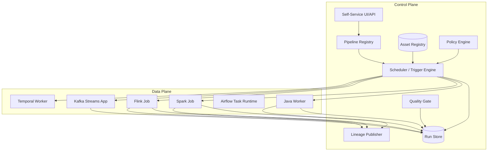
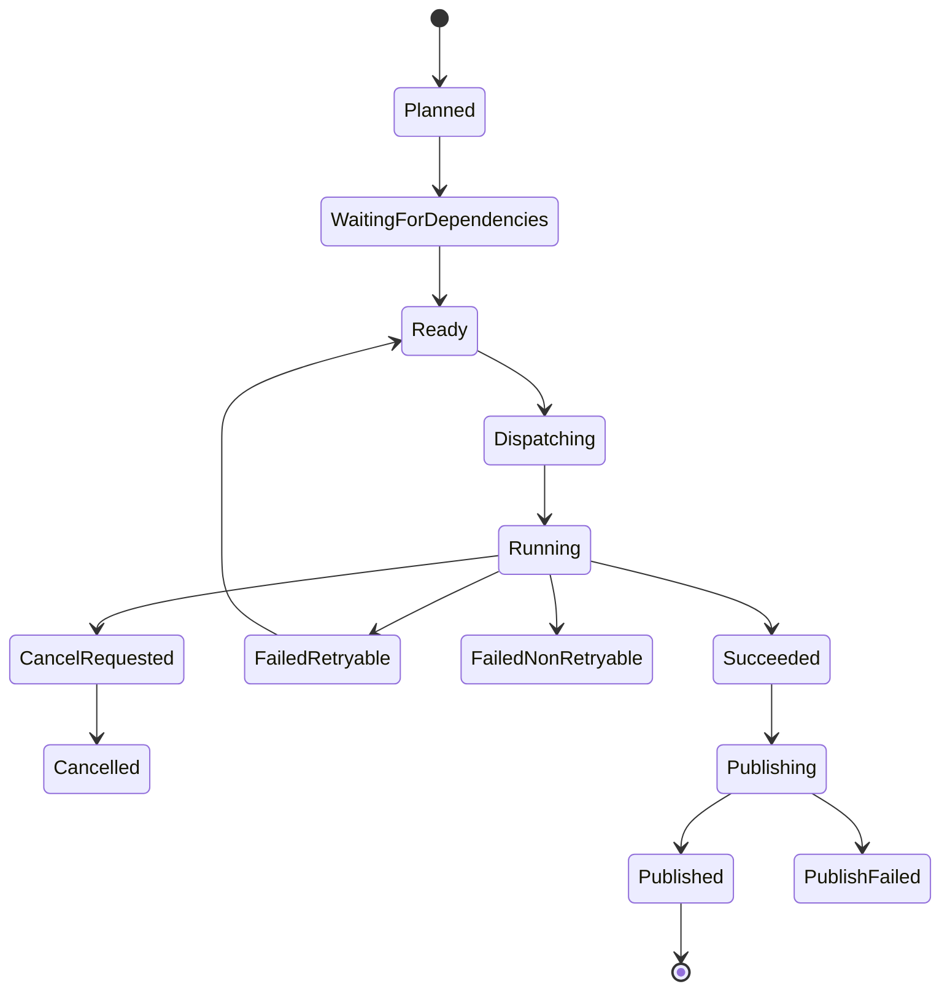
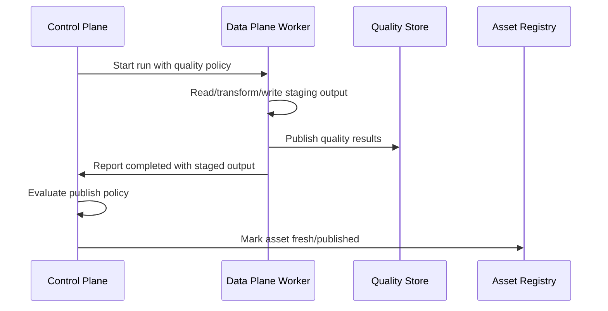
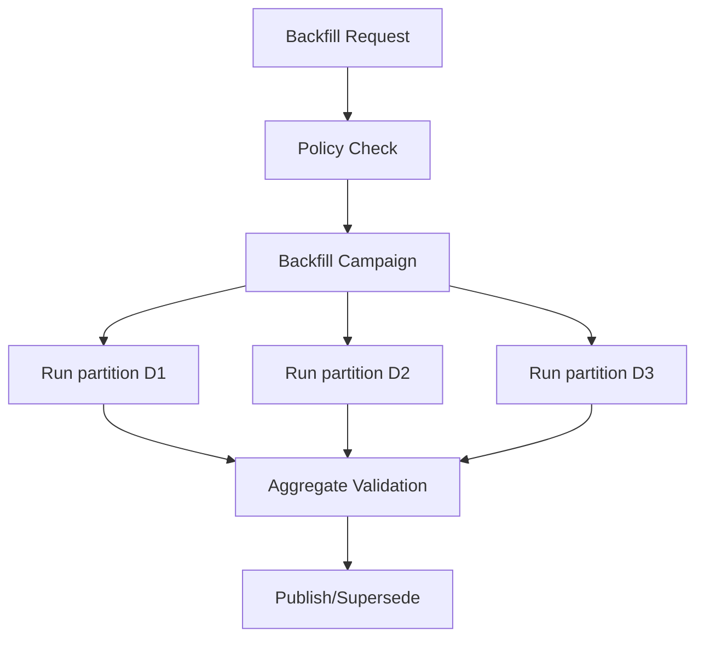
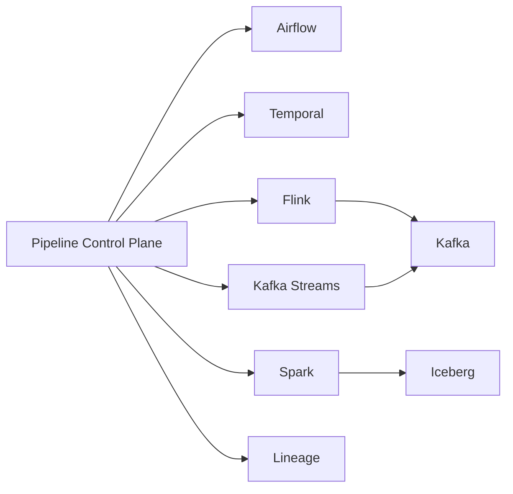
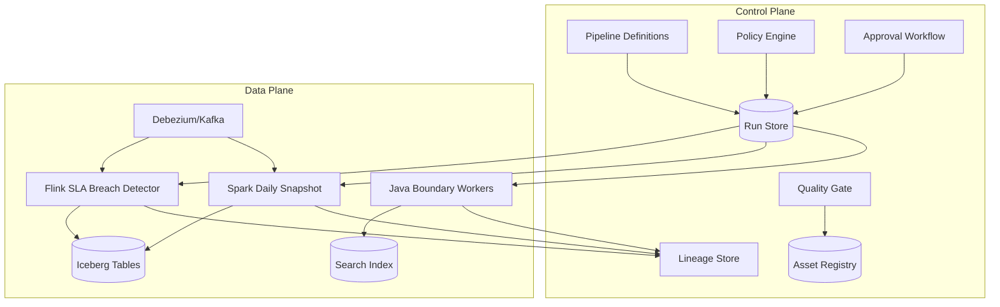

# Part 064 — Control Plane vs Data Plane

A pipeline platform fails when every pipeline owns its own operational brain.

One job implements retries this way.
Another stores checkpoints differently.
A third has no run manifest.
A fourth writes lineage only when it succeeds.
A fifth sends Slack alerts from transform code.
A sixth has manual backfill scripts known by one engineer.

This is not a platform.

It is a pile of jobs.

The architectural move is to separate:

```text
Control plane = decides, records, governs, schedules, observes.
Data plane = reads, transforms, writes, and moves data.
```

This separation is not cosmetic.

It determines whether your organization can scale from ten pipelines to hundreds without losing correctness, ownership, auditability, and operational control.

---

## 1. The Mental Model

Think of a pipeline platform as two cooperating systems.



The control plane does not process every record.

The data plane does not decide global policy.

That is the boundary.

---

## 2. Why the Separation Exists

Without separation, business logic, operational policy, and execution mechanics become tangled.

Example bad Java job:

```java
public static void main(String[] args) {
    readConfig();
    checkIfHoliday();
    queryDatabase();
    transformRows();
    validateOutput();
    writeParquet();
    updateRunStatus();
    sendSlackAlert();
    updateLineage();
    triggerDownstreamJobs();
}
```

This job knows too much.

It owns:

- scheduling policy
- business calendar
- source integration
- transformation
- validation
- output publishing
- run state
- notification
- lineage
- downstream triggering

That makes every job a platform clone.

A better split:

```text
Control plane:
  - create run
  - enforce policy
  - pass run context
  - monitor state
  - publish lineage/asset state
  - trigger downstream

Data plane:
  - read assigned input
  - transform deterministically
  - write output through declared boundary
  - report progress and evidence
```

The job becomes smaller and safer.

---

## 3. Control Plane Responsibilities

The control plane owns metadata and decisions.

Core responsibilities:

| Responsibility | Meaning |
|---|---|
| Pipeline registry | What pipelines exist and who owns them |
| Version registry | Which code/config/schema version is active |
| Run creation | When a run exists and why |
| Scheduling/triggering | Cron, asset events, manual, SLA, webhook |
| Policy enforcement | Access, data classification, approval, quality gate |
| Run state | Planned/running/succeeded/failed/cancelled/superseded |
| Asset state | Fresh/stale/invalid/partial/degraded |
| Lineage | Inputs, outputs, run, code, schema, transform version |
| Backfill control | What historical range is allowed and isolated |
| Retry/rerun control | What can be retried safely |
| Observability | Metrics, alerts, logs correlation, dashboard |
| Governance | Ownership, retention, sensitive-data rules, audit evidence |
| Self-service | Developer-facing API/UI/scaffold |

The control plane is the operational memory of the platform.

If the control plane does not know it happened, it is not operationally real.

---

## 4. Data Plane Responsibilities

The data plane owns execution.

Core responsibilities:

| Responsibility | Meaning |
|---|---|
| Source read | Pull or receive input records/assets |
| Transform | Apply deterministic or declared stateful logic |
| Sink write | Write output/effects using boundary contracts |
| Local resource management | CPU, memory, parallelism, batching, backpressure |
| Worker lifecycle | startup, graceful shutdown, heartbeat |
| Checkpointing | engine-specific progress and recoverability |
| Runtime metrics | records, bytes, lag, error, latency |
| Evidence emission | run facts, quality facts, output facts |
| Failure classification | retryable/non-retryable/unknown outcome |

The data plane must be allowed to move fast.

But it should not be allowed to invent platform semantics.

---

## 5. What Belongs Where

A useful rule:

```text
If the decision affects multiple pipelines or consumers, it belongs in the control plane.
If the decision is about processing records inside one run, it belongs in the data plane.
```

Examples:

| Concern | Plane |
|---|---|
| Transforming `CaseUpdated` into `CaseSnapshot` | Data plane |
| Deciding whether `CaseSnapshot` is publishable | Control plane + quality policy |
| Reading Kafka partition offsets | Data plane |
| Recording which offsets were processed by a run | Control plane metadata |
| Flink keyed state | Data plane |
| Asset freshness status | Control plane |
| Spark executor sizing | Data plane runtime/config |
| Maximum backfill range allowed for PII asset | Control plane policy |
| DLQ item serialization | Data plane |
| DLQ replay approval | Control plane |
| Retry transient API timeout | Data plane/boundary policy |
| Retry failed regulatory report publication | Control plane decision |

---

## 6. Pipeline Definition Model

A pipeline definition should be declarative enough for the control plane to reason about it.

Example:

```yaml
pipeline: case-daily-snapshot
owner: enforcement-data-platform
runtime: java-batch
entrypoint: com.acme.pipeline.case.snapshot.CaseDailySnapshotJob
version: 9.4.1
inputs:
  - asset: silver.case
    freshness_required: PT2H
    mode: read_snapshot
  - asset: silver.case_assignment
    freshness_required: PT2H
    mode: read_snapshot
outputs:
  - asset: gold.case_daily_snapshot
    mode: replace_partition
    partition_key: business_date
contracts:
  output_schema: case_daily_snapshot@3.2.0
  quality_contract: case_daily_snapshot_quality@2.1.0
schedule:
  type: cron
  expression: "0 2 * * *"
  timezone: Asia/Singapore
policies:
  data_classification: restricted
  requires_quality_gate: true
  max_backfill_days_without_approval: 31
  publish_requires_reconciliation: true
runtime_config:
  memory: 4Gi
  max_parallelism: 8
  timeout: PT2H
```

This definition is not only for documentation.

The control plane can use it to:

- create runs
- check dependencies
- enforce access
- validate schema compatibility
- determine rerun scope
- create lineage edges
- publish asset state
- display ownership
- constrain backfill

---

## 7. Run Model

A run is a first-class entity.

Do not rely only on logs.

```java
public record PipelineRun(
    String runId,
    String pipelineId,
    String pipelineVersion,
    RunReason reason,
    RunStatus status,
    Instant plannedAt,
    Optional<Instant> startedAt,
    Optional<Instant> finishedAt,
    Map<String, String> parameters,
    List<InputAssetRef> inputs,
    List<OutputAssetRef> expectedOutputs,
    Optional<String> parentRunId,
    Optional<String> approvalId
) {}
```

Run status should be explicit:



Do not collapse `Succeeded` and `Published`.

A data plane job may finish successfully while quality gate or publish gate fails.

---

## 8. Run Context Passed to Data Plane

Every job should receive a run context.

```json
{
  "runId": "run-20260704-000183",
  "pipelineId": "case-daily-snapshot",
  "pipelineVersion": "9.4.1",
  "attempt": 1,
  "reason": "SCHEDULED",
  "dataIntervalStart": "2026-07-03T00:00:00+08:00",
  "dataIntervalEnd": "2026-07-04T00:00:00+08:00",
  "inputAssets": [
    {"asset": "silver.case", "version": "snapshot-9012"}
  ],
  "outputAssets": [
    {"asset": "gold.case_daily_snapshot", "partition": "business_date=2026-07-03"}
  ],
  "policy": {
    "qualityGate": "blocking",
    "piiLoggingAllowed": false
  }
}
```

The job should not infer this from wall-clock time.

Use the control plane's assigned data interval and input asset versions.

That makes reruns deterministic.

---

## 9. Asset Registry

The asset registry is the control plane's model of outputs.

An asset is not just a table name.

```java
public record DataAsset(
    String assetId,
    String name,
    AssetKind kind,
    String owner,
    DataClassification classification,
    SchemaRef schema,
    QualityContractRef qualityContract,
    RetentionPolicy retentionPolicy,
    List<AssetDependency> dependencies,
    AssetFreshnessPolicy freshnessPolicy
) {}
```

Asset state:

```java
public enum AssetState {
    UNKNOWN,
    MATERIALIZING,
    FRESH,
    STALE,
    INVALID,
    PARTIAL,
    DEGRADED,
    DEPRECATED
}
```

The registry answers:

- Who owns this asset?
- What schema does it promise?
- Is it fresh enough?
- Which run produced the current version?
- Which inputs created it?
- What downstream assets depend on it?
- Is it allowed to contain PII?
- Is it publishable?

---

## 10. Data Plane Execution Modes

The platform should support multiple data plane modes.

| Mode | Good For | Control Plane Role |
|---|---|---|
| Java batch worker | bounded jobs, custom integration | create run, dispatch command, capture output |
| Java streaming service | continuous Kafka consumers | deploy config, monitor lag, manage version rollout |
| Kafka Streams app | Kafka-native stream/table processing | register topology, monitor state, manage reset/replay |
| Flink job | stateful event-time stream processing | submit job, manage savepoint, observe checkpoint/state |
| Spark job | large batch/micro-batch processing | submit job, track application, validate outputs |
| Airflow task | workflow-level task execution | orchestrate tasks, pass run context |
| Temporal worker | durable workflow and side-effect control | start workflow, observe workflow history |

A mature platform does not force one runtime for everything.

It standardizes the contracts around all runtimes.

---

## 11. Control Plane API

A pipeline control plane usually needs APIs like:

```http
POST /pipelines
GET  /pipelines/{pipelineId}
POST /pipelines/{pipelineId}/runs
GET  /runs/{runId}
POST /runs/{runId}/cancel
POST /runs/{runId}/retry
POST /runs/{runId}/approve
GET  /assets/{assetId}
GET  /assets/{assetId}/lineage
POST /assets/{assetId}/materializations
POST /quality-results
POST /lineage-events
```

Internal Java model:

```java
public interface PipelineControlPlane {
    PipelineRun createRun(CreateRunCommand command);
    void markRunStarted(String runId, RunStartedEvidence evidence);
    void reportProgress(String runId, RunProgress progress);
    void publishQualityResult(String runId, QualityResult result);
    void publishMaterialization(String runId, AssetMaterialization materialization);
    void markRunFinished(String runId, RunOutcome outcome);
}
```

The API should be boring and stable.

The platform should not require every pipeline to invent a new metadata protocol.

---

## 12. Worker Contract

Every data plane worker should implement a consistent contract.

Input:

- run context
- pipeline version
- input asset references
- output target references
- policy bundle
- secrets references
- resource limits

Output:

- status
- metrics
- materialization evidence
- quality evidence
- lineage evidence
- error classification
- checkpoint/effect references

Worker result example:

```json
{
  "runId": "run-20260704-000183",
  "status": "SUCCEEDED",
  "outputs": [
    {
      "asset": "gold.case_daily_snapshot",
      "partition": "business_date=2026-07-03",
      "recordCount": 188392,
      "schemaVersion": "case_daily_snapshot@3.2.0",
      "storageRef": "iceberg://warehouse/gold/case_daily_snapshot@snapshot-9182"
    }
  ],
  "quality": {
    "status": "PASSED",
    "checksPassed": 41,
    "checksFailed": 0
  },
  "metrics": {
    "durationMs": 482000,
    "recordsRead": 190104,
    "recordsWritten": 188392
  }
}
```

This result is more valuable than a log line saying `job complete`.

---

## 13. Policy Engine

The control plane needs policy enforcement.

Policy examples:

```yaml
policy: restricted-asset-publish
rules:
  - output.classification in [restricted, confidential] requires quality_gate == passed
  - output.classification == restricted requires lineage_complete == true
  - backfill.days > 31 requires approval
  - pii_logging_allowed must be false
  - source.owner must approve schema breaking change
  - consumer_count > 0 requires deprecation_notice before deletion
```

Policy belongs in the control plane because it affects more than one job.

The data plane can enforce local policy checks, but the canonical decision should be centralized.

---

## 14. Quality Gate as Control Plane Decision

Quality checks often run in the data plane.

But publish decision should be visible in the control plane.



This allows consistent behavior:

- fail publish on critical quality breach
- allow degraded publish for low-severity warning
- require approval for override
- record why output was blocked or allowed

---

## 15. Lineage and Evidence

Lineage should be emitted by the platform, not manually reconstructed from code.

Minimum lineage event:

```java
public record LineageEvent(
    String runId,
    String jobName,
    String jobVersion,
    List<DatasetRef> inputs,
    List<DatasetRef> outputs,
    Instant eventTime,
    Map<String, String> facets
) {}
```

Useful facets:

- schema version
- transform version
- source offsets
- source snapshots
- row counts
- data quality summary
- code git SHA
- container image digest
- environment
- owner
- classification

For regulated systems, lineage is evidence.

It answers:

```text
Why did this report say what it said on that day?
```

---

## 16. Scheduling in the Control Plane

The scheduler should create runs.

It should not directly mutate business data.

Run creation reasons:

```java
public enum RunReason {
    SCHEDULED,
    ASSET_TRIGGERED,
    MANUAL,
    BACKFILL,
    RETRY,
    REPROCESSING,
    CORRECTION,
    DEPENDENCY_REFRESH,
    SLA_RECOVERY
}
```

This matters because different reasons imply different policies.

A manual backfill over two years of restricted data may require approval.

A retry of a transient API timeout may not.

A correction run may need to supersede prior output.

A scheduled run may be blocked by upstream freshness.

---

## 17. Backfill Control Plane

Backfill is where platform governance becomes necessary.

A backfill request should include:

```java
public record BackfillRequest(
    String pipelineId,
    LocalDate startDate,
    LocalDate endDate,
    String requestedBy,
    String reason,
    BackfillMode mode,
    boolean isolateOutputs,
    Optional<String> approvalId
) {}
```

Backfill policy questions:

- Is the date range allowed?
- Are inputs still retained?
- Are schemas compatible historically?
- Will output overwrite current data?
- Should output go to isolated namespace?
- Are downstream consumers auto-triggered?
- Is approval required?
- What cost limit applies?

The data plane executes chunks.

The control plane owns the backfill campaign.



---

## 18. Retry and Rerun Control

Retry is not always safe.

The control plane should know the difference between:

| Action | Meaning |
|---|---|
| Retry attempt | Same run, same inputs, same output target, transient failure |
| Rerun | New run for same logical interval/output |
| Reprocess | Recompute with possibly new code or contract |
| Backfill | Historical range run |
| Correction | Apply correction semantics and supersede prior output |
| Replay | Re-read event log from offsets/time |

Each action has different safety rules.

Example:

```text
Retry Java task after DB timeout: maybe safe.
Retry side-effect notification: safe only if idempotency/effect ledger exists.
Rerun replace-partition output: safe if staged publish is atomic.
Replay Kafka topic into search index: safe if index write is version-aware.
Reprocess regulatory report: requires supersession record.
```

The control plane should encode this.

---

## 19. Continuous Streaming Jobs

Batch jobs map naturally to runs.

Streaming jobs are different.

A streaming job may run for weeks.

Control plane concepts:

- deployment version
- job instance
- checkpoint/savepoint
- input lag
- watermark lag
- error rate
- state size
- current topology version
- restart history
- upgrade history

A streaming job can still emit logical materialization events:

```text
case_breach_alert_stream processed up to event_time=2026-07-04T10:00:00Z
silver.case_current updated through source_lsn=18499200
```

Do not force streaming into fake daily run semantics.

Use:

```text
job lifecycle state + periodic progress/materialization state
```

---

## 20. Versioning Across Planes

A pipeline output depends on many versions:

- pipeline definition version
- code version
- transform version
- schema version
- quality contract version
- input asset version
- runtime image version
- config version
- reference data version
- platform policy version

The control plane should record them.

Example materialization:

```json
{
  "asset": "gold.case_daily_snapshot",
  "assetVersion": "snapshot-9182",
  "runId": "run-20260704-000183",
  "codeVersion": "git:1a2b3c4",
  "imageDigest": "sha256:...",
  "schemaVersion": "case_daily_snapshot@3.2.0",
  "qualityContractVersion": "2.1.0",
  "transformVersion": "9.4.1",
  "inputVersions": [
    {"asset": "silver.case", "version": "snapshot-9012"}
  ]
}
```

This enables reproducibility.

---

## 21. Platform Database Model

A minimal control plane can start with tables like:

```sql
CREATE TABLE pipeline_definition (
  pipeline_id       text PRIMARY KEY,
  name              text NOT NULL,
  owner             text NOT NULL,
  runtime           text NOT NULL,
  active_version    text NOT NULL,
  definition_json   jsonb NOT NULL,
  created_at        timestamptz NOT NULL,
  updated_at        timestamptz NOT NULL
);

CREATE TABLE pipeline_run (
  run_id            text PRIMARY KEY,
  pipeline_id       text NOT NULL,
  pipeline_version  text NOT NULL,
  reason            text NOT NULL,
  status            text NOT NULL,
  data_interval_start timestamptz,
  data_interval_end   timestamptz,
  parameters_json   jsonb NOT NULL,
  created_at        timestamptz NOT NULL,
  started_at        timestamptz,
  finished_at       timestamptz,
  parent_run_id     text,
  approval_id       text
);

CREATE TABLE asset_materialization (
  materialization_id text PRIMARY KEY,
  asset_id           text NOT NULL,
  asset_version      text NOT NULL,
  run_id             text NOT NULL,
  status             text NOT NULL,
  storage_ref        text,
  schema_version     text,
  record_count       bigint,
  data_interval_start timestamptz,
  data_interval_end   timestamptz,
  materialized_at    timestamptz NOT NULL,
  metadata_json      jsonb NOT NULL
);
```

Add more only when needed.

The important point is not the exact schema.

The important point is that control-plane facts are persisted as first-class state.

---

## 22. Control Plane State Transitions

Use compare-and-swap style updates for run state.

Bad:

```sql
UPDATE pipeline_run SET status = 'SUCCEEDED' WHERE run_id = ?;
```

Better:

```sql
UPDATE pipeline_run
SET status = 'SUCCEEDED', finished_at = now()
WHERE run_id = ?
  AND status = 'RUNNING';
```

If no row is updated, your worker is stale or the run was cancelled.

This prevents accidental transitions like:

```text
CANCELLED -> SUCCEEDED
FAILED -> RUNNING
PUBLISHED -> FAILED
```

Model the state machine explicitly.

---

## 23. Dispatch Model

The control plane can dispatch work in several ways:

| Dispatch | Good For | Trade-Off |
|---|---|---|
| HTTP call to worker | simple services | timeout/availability coupling |
| Queue command | async workers | need command dedupe/lease |
| Kubernetes job | batch isolation | startup overhead |
| Airflow DAG/task | workflow ecosystem | Airflow state must be reconciled |
| Spark submit | large batch | external app tracking needed |
| Flink job submit | streaming/stateful | savepoint/upgrade lifecycle |
| Temporal workflow | durable process | deterministic workflow constraints |

A dispatch command should be idempotent.

```java
public record DispatchCommand(
    String commandId,
    String runId,
    String pipelineId,
    String runtime,
    String workerRef,
    RunContext runContext
) {}
```

If the control plane retries dispatch after timeout, it must not start duplicate unsafe runs.

---

## 24. Heartbeats and Leases

For long-running workers, use heartbeat/lease.

```java
public record WorkerHeartbeat(
    String runId,
    String workerId,
    Instant heartbeatAt,
    RunProgress progress,
    Map<String, String> runtimeStats
) {}
```

Lease model:

```sql
UPDATE pipeline_run
SET leased_by = ?, lease_expires_at = now() + interval '2 minutes'
WHERE run_id = ?
  AND status IN ('READY', 'RUNNING')
  AND (lease_expires_at IS NULL OR lease_expires_at < now());
```

Leases prevent two workers from owning the same run.

But leases alone do not protect external side effects.

Use fencing tokens for write boundaries where needed.

---

## 25. Fencing Tokens

A fencing token prevents stale workers from committing after losing ownership.

Example:

```java
public record RunLease(
    String runId,
    String workerId,
    long fencingToken,
    Instant expiresAt
) {}
```

External publish operation includes token:

```sql
UPDATE asset_publish_pointer
SET asset_version = ?, fencing_token = ?
WHERE asset_id = ?
  AND fencing_token < ?;
```

If stale worker tries to publish with old token, update fails.

This matters in distributed systems because cancellation and restart are not instantaneous.

---

## 26. Self-Service Platform API

The platform should make the right path easy.

A developer should be able to define:

- source
- transform
- sink
- contract
- schedule
- quality gate
- ownership
- data classification

without hand-writing all operational glue.

Self-service does not mean no governance.

It means governance is embedded.

Example developer flow:

```text
pipeline init case-daily-snapshot --runtime java-batch
pipeline add-input silver.case
pipeline add-output gold.case_daily_snapshot --mode replace-partition
pipeline add-quality-contract case_daily_snapshot_quality.yaml
pipeline deploy --env staging
pipeline run --date 2026-07-03
pipeline promote --env prod
```

Behind the scenes, the control plane creates:

- pipeline definition
- CI checks
- schema compatibility gate
- deployment metadata
- run configuration
- lineage hooks
- standard alerts
- standard dashboards

---

## 27. Control Plane vs Frameworks

Do not confuse a framework with the control plane.

Airflow can be part of a control plane, but Airflow alone may not be your full platform model.

Flink has job management and checkpointing, but Flink is primarily data plane for stream processing.

Kafka has consumer group state, but Kafka is not an asset registry.

Temporal has durable workflow history, but Temporal does not automatically know data contracts or lineage.

Spark has application tracking, but Spark does not decide whether an asset is publishable.

The platform may compose them:



The control plane is the system that makes cross-runtime decisions.

---

## 28. Platform Evolution Stages

Most organizations do not build the final platform first.

A practical evolution:

### Stage 1 — Standard Library

Provide Java libraries for:

- run context
- metrics
- logging
- retry policy
- boundary adapters
- quality result emission
- lineage emission

### Stage 2 — Run Registry

Persist:

- pipeline definitions
- run state
- materialization facts
- quality results
- basic lineage

### Stage 3 — Controlled Scheduling

Move from ad hoc cron to:

- run creation
- dependency checks
- backfill tracking
- retry/rerun semantics

### Stage 4 — Policy Enforcement

Add:

- data classification
- approval workflow
- schema gate
- quality gate
- publish gate

### Stage 5 — Self-Service Platform

Add:

- API/UI
- templates
- scaffolding
- ownership model
- cost controls
- consumer registry
- impact analysis

Do not start with a huge platform rewrite.

Start by making metadata and run semantics explicit.

---

## 29. Regulatory Enforcement Case Study

Consider a regulatory enforcement data platform.

Data sources:

- case management database
- assignment history
- breach events
- decision records
- document metadata
- external regulator submissions

Outputs:

- case current state
- SLA breach alert stream
- daily enforcement report
- investigator workload dashboard
- audit evidence bundle
- external submission status projection

Control plane responsibilities:

- enforce restricted data policy
- prevent report publish if quality checks fail
- track lineage from operational case changes to report rows
- require approval for correction backfills over closed reporting periods
- record which run superseded prior report output
- manage asset freshness for dashboards
- block downstream gold assets when silver canonical case is invalid

Data plane responsibilities:

- consume CDC events
- run Flink breach detection
- run Spark daily snapshot
- write Iceberg tables
- update search projection
- emit quality metrics
- emit lineage events

Architecture:



This is where the control-plane/data-plane separation pays off.

The organization can prove:

- what ran
- why it ran
- which data it used
- which version of code produced output
- which quality gates passed
- who approved exceptional actions
- which downstream assets were affected

That is regulatory defensibility.

---

## 30. Anti-Patterns

### Anti-Pattern 1: Every Pipeline Has Its Own Control Plane

Each job stores status differently, retries differently, and alerts differently.

This does not scale.

### Anti-Pattern 2: Control Plane Processes Records

A central service tries to transform every record for every pipeline.

This becomes bottleneck and coupling point.

Keep high-volume processing in the data plane.

### Anti-Pattern 3: Data Plane Decides Governance

A Spark job decides to ignore quality failure and publish anyway.

That decision must be visible and governed.

### Anti-Pattern 4: No Run ID Everywhere

Without run id propagation, debugging becomes archaeology.

Every log, metric, lineage event, materialization, and quality result should carry run context where applicable.

### Anti-Pattern 5: Wall-Clock Driven Jobs

A job computes “yesterday” internally.

Reruns become ambiguous.

The control plane should pass explicit data intervals.

### Anti-Pattern 6: One Runtime to Rule Them All

Forcing every pipeline into one engine creates unnatural designs.

Use standard contracts across runtimes instead.

### Anti-Pattern 7: Platform Metadata as Afterthought

Lineage and quality are emitted only on success or only from some jobs.

Then impact analysis is incomplete exactly when needed most.

### Anti-Pattern 8: No Publish State

Job success is treated as asset freshness.

But a job can succeed and publish can fail.

Model materialization and publication explicitly.

---

## 31. Implementation Blueprint

A minimal internal platform can be implemented incrementally.

### 31.1 Java Library

Provide:

```text
pipeline-runtime-core
pipeline-boundary-core
pipeline-quality-core
pipeline-lineage-client
pipeline-controlplane-client
pipeline-testkit
```

### 31.2 Control Plane Service

Build a Java service with:

- pipeline definition API
- run API
- asset API
- materialization API
- quality result API
- lineage sink integration
- policy evaluation
- backfill campaign API

### 31.3 Worker SDK

Every job uses:

```java
public final class PipelineJobMain {
    public static void main(String[] args) {
        RunContext context = RunContextLoader.fromArgs(args);
        PipelineControlClient control = PipelineControlClient.fromEnv();

        control.markStarted(context.runId());

        try {
            JobResult result = new CaseDailySnapshotJob().run(context);
            control.publishQualityResult(context.runId(), result.quality());
            control.publishMaterialization(context.runId(), result.materialization());
            control.markSucceeded(context.runId(), result.outcome());
        } catch (PipelineException ex) {
            control.markFailed(context.runId(), FailureReport.from(ex));
            throw ex;
        }
    }
}
```

### 31.4 Metadata First

Before building a UI, make sure the platform records:

- run state
- input/output assets
- materialization
- quality result
- lineage event
- failure classification

A small truthful platform is better than a large dashboard over unreliable metadata.

---

## 32. Production Checklist

Before calling something a pipeline platform, verify:

### Control Plane

- Pipeline definitions are versioned.
- Runs are first-class records.
- Run state transitions are guarded.
- Data intervals are explicit.
- Backfills are tracked as campaigns.
- Asset materializations are recorded.
- Asset freshness is computed from materializations.
- Quality gate decisions are visible.
- Policy decisions are auditable.
- Ownership is explicit.
- Sensitive-data classification is explicit.
- Lineage is emitted consistently.

### Data Plane

- Jobs receive run context.
- Jobs do not infer logical dates from wall-clock time.
- Boundary adapters classify failures.
- Sink writes are idempotent or reconciled.
- Metrics include run id and boundary names.
- Logs avoid sensitive payloads.
- Workers support graceful shutdown.
- Streaming jobs expose lag/watermark/state metrics.
- Batch jobs produce materialization evidence.

### Cross-Plane

- Dispatch is idempotent.
- Heartbeats exist for long-running work.
- Fencing prevents stale publish.
- Retry/rerun/reprocess/backfill are distinct.
- Publish state is separate from job success.
- Manual overrides are recorded.
- Downstream impact can be queried.
- Operators have runbooks.

---

## 33. Mental Model Summary

The control plane is the platform's memory and governance brain.

The data plane is the execution muscle.

Do not put all memory in logs.
Do not put governance in transform code.
Do not put record processing in the control service.
Do not let every runtime invent its own semantics.

The invariant:

```text
The data plane may vary by engine.
The control-plane contract must remain stable.
```

That is how a Java data pipeline platform grows without becoming operationally incoherent.

---

## 34. What Comes Next

Part 065 begins the reliability and operational excellence phase.

We will define pipeline SLOs in practical terms:

- freshness
- completeness
- accuracy
- availability
- cost
- recovery time
- replayability
- auditability

This is where pipeline engineering moves from implementation patterns to operating promises.
