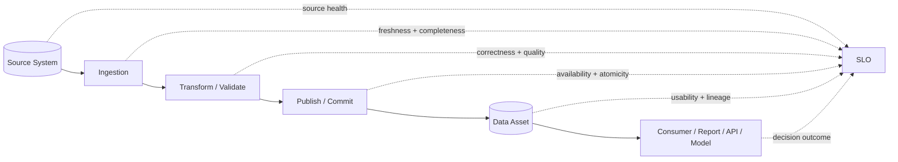
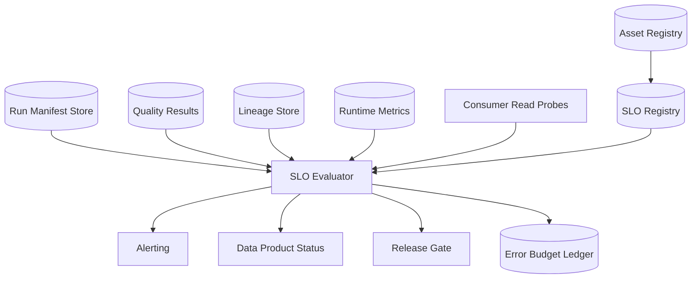

# Part 065 — Pipeline SLO and Error Budget

A production data pipeline is not reliable because the job is green.

It is reliable when consumers can depend on its output within explicit promises:

- the data arrives before it is needed,
- the data is complete enough for the decision being made,
- the data is accurate enough for the risk being accepted,
- the pipeline can be recovered without corrupting output,
- the cost of producing the data is bounded,
- and violations are visible before users discover them.

That set of promises is the pipeline SLO.

For online services, an SLO often starts with request availability or latency. For data pipelines, the primitive unit is different. The user does not care whether a DAG task succeeded. The user cares whether a dataset, stream, projection, report, feature table, search index, or regulatory evidence table is usable at the expected time and quality.

So the SLO must be attached to the **data product** or **pipeline effect**, not merely to the scheduler task.

```text
Bad SLO:  "DAG success rate >= 99%"
Better:   "case_daily_summary is available by 07:00 SGT with >= 99.95% expected cases represented"
Best:     "case_daily_summary for business date D is published by 07:00 SGT, contains all committed case lifecycle events up to D 23:59:59 SGT except approved exclusions, has zero critical quality violations, and is traceable to source snapshots/run manifests"
```

The job may be green while output is stale.
The job may be green while 5% of records are missing.
The job may be green while schema drift silently nulls a critical field.
The job may be green while a downstream index was never updated.

A task status is a symptom.
An SLO is a contract.

---

## 1. The Core Mental Model

A data pipeline has several reliability surfaces.



The SLO should measure the consumer-visible asset, but the causes of failure are spread across source, pipeline, storage, runtime, and governance.

That distinction matters:

```text
SLO = promise visible to consumer.
SLI = measurement used to evaluate the promise.
Alert = operational signal indicating current or predicted violation.
Error budget = allowed amount of badness over a window.
Policy = what engineering must do when budget is being burned.
```

A top-tier engineer does not stop at “define metrics.” They define the decision loop:

```text
measure -> classify -> budget -> alert -> triage -> remediate -> learn -> harden
```

A pipeline SLO without a policy becomes dashboard decoration.

---

## 2. Why Pipeline SLOs Are Different From Service SLOs

A request-serving API usually has a request/response boundary. The user action produces an immediate observable result.

A pipeline has delayed, derived, and sometimes aggregated effects.

This creates different failure modes:

| Service Reliability | Pipeline Reliability |
|---|---|
| Request fails now | Data missing later |
| Latency is per request | Freshness is per asset/window/key |
| Error is usually visible to caller | Error may be silently embedded in output |
| Retry may fix one request | Replay may mutate large historical ranges |
| Availability is endpoint-centric | Availability is asset-centric |
| Logs show failed call | Need lineage/run manifest/reconciliation |

The hard part of pipeline reliability is that the consumer often sees only the final artifact.

A dashboard cell is wrong.
A regulatory report is incomplete.
A model feature is stale.
A search index shows a deleted entity.
A case escalation SLA calculation excludes late events.

The pipeline may have hundreds of successful technical operations behind one wrong business answer.

So the SLO must be phrased in business-data terms.

---

## 3. Pipeline Reliability Dimensions

Most production pipeline SLOs combine five dimensions.

```text
Freshness      = is data available soon enough?
Completeness   = did expected data arrive and publish?
Accuracy       = is the data correct according to contract/reconciliation?
Availability   = can consumers read/use the asset?
Cost           = can the SLO be met within bounded resource spend?
```

You can add security, privacy, and governance constraints, but those usually operate as hard policy gates rather than numeric SLOs.

Example:

```text
No PII leakage into public dataset = hard invariant.
99.9% freshness within 15 minutes = SLO.
```

Do not turn non-negotiable compliance rules into budgets unless the organization has explicitly accepted that risk.

---

## 4. Freshness SLO

Freshness answers:

```text
How old is the data visible to the consumer compared to the source truth boundary?
```

Freshness is not only “job finished time.” It is a relation between a source position and a published asset.

For streaming:

```text
freshness_lag = now - max(event_time_or_source_commit_time_processed_and_published)
```

For batch:

```text
freshness_lag = publish_time(asset for period D) - expected_publish_deadline(D)
```

For CDC:

```text
cdc_lag = source_current_lsn_time - last_published_lsn_time
```

For regulatory reports:

```text
business_freshness = report_available_at - business_deadline
```

Freshness SLO examples:

| Asset Type | Example SLO |
|---|---|
| Kafka-derived projection | 99.9% of minutes have end-to-end lag < 2 minutes |
| Daily report | Published by 07:00 SGT on business days, 99.5% monthly |
| Search index | 99% of accepted case updates searchable within 60 seconds |
| Lakehouse silver table | Partition D available within 30 minutes after source cutoff |
| Regulatory breach alerts | Critical breach events evaluated within 5 minutes of source commit |

The most common freshness mistake is measuring scheduler success instead of source-to-consumer lag.

```text
Bad:  DAG ended at 06:53.
Good: Output contains source changes through 06:45 and was published at 06:53.
Best: Output contains all eligible source changes through cutoff C, with reconciliation evidence and consumer-visible publish time P.
```

### Java freshness probe

A pipeline should publish a freshness marker as part of the asset manifest.

```java
public record FreshnessMarker(
        String assetName,
        String assetVersion,
        Instant publishedAt,
        Instant sourceHighWatermarkTime,
        String sourceHighWatermarkPosition,
        Duration freshnessLag,
        String runId
) {}
```

The marker must be written transactionally with the output or immediately after an atomic publish step.

If the marker is updated before output is visible, the SLO lies.

---

## 5. Completeness SLO

Completeness answers:

```text
Did the asset include the expected set of records/events for the declared scope?
```

Completeness is not “row count greater than zero.” It is a comparison between expected and observed data.

Sources of expectedness:

- source high-watermark,
- file manifest,
- CDC transaction boundary,
- source count query,
- upstream asset manifest,
- business calendar,
- known partition list,
- reconciliation ledger,
- consumer registry expectation.

Completeness examples:

```text
All files listed in manifest M are imported exactly once.
All source rows where updated_at <= cutoff C are reflected in silver table partition D.
All Kafka events up to offset O per partition are included in aggregate version V.
All active cases at close of business are present in daily case summary.
```

Completeness SLI examples:

| SLI | Formula |
|---|---|
| File manifest completion | imported_files / manifest_files |
| Source row completion | observed_target_rows / expected_source_rows |
| Offset completion | published_offset / target_offset per partition |
| Entity completion | present_entity_keys / expected_entity_keys |
| Partition completion | successful_partitions / expected_partitions |

Completeness is often impossible to prove exactly in real time. That is fine. Use layered confidence.

```text
Level 1: source declared manifest
Level 2: count reconciliation
Level 3: checksum reconciliation
Level 4: key-level reconciliation
Level 5: semantic reconciliation
```

The deeper the business risk, the stronger the evidence required.

A dashboard may tolerate count-level evidence.
A financial ledger needs balance-level evidence.
A regulatory evidence table may require key-level and lineage-level evidence.

---

## 6. Accuracy SLO

Accuracy answers:

```text
Is the data semantically correct enough for its consumer decision?
```

Accuracy is the hardest pipeline SLO because many correctness errors are domain-specific.

Examples:

- case status transition is invalid,
- SLA breach calculation uses wrong calendar,
- dedupe collapsed two different persons,
- late correction was ignored,
- timezone conversion moved event to wrong business date,
- null source value was interpreted as delete,
- schema change silently changed enum meaning,
- outbox event version was decoded with old semantics.

A useful accuracy SLO usually combines contract validation and reconciliation.

```text
Critical quality violations = 0 per published partition.
High-severity quality violations <= 0.01% of records over 30 days.
Reconciliation mismatch amount = 0 for financial/control totals.
Case status projection mismatch <= 0.001% against source snapshot, excluding approved late corrections.
```

Accuracy is where “top 1% engineer” thinking matters most: you must separate **technical validity** from **business validity**.

```text
Technical validity: field is non-null, enum is known, timestamp parses.
Business validity: event transition is allowed, obligation date matches policy calendar, actor has authority, correction supersedes prior assertion correctly.
```

### Accuracy severity model

```java
public enum QualitySeverity {
    INFO,        // visible metadata, no data rejection
    WARNING,     // suspicious but publishable
    HIGH,        // publishable only with explicit policy
    CRITICAL     // publish blocked or quarantined
}

public record QualityViolation(
        String ruleId,
        QualitySeverity severity,
        String assetName,
        String recordKey,
        String fieldPath,
        String message,
        Instant detectedAt,
        String runId
) {}
```

The severity should drive action.

```text
INFO      -> metric + sample log
WARNING   -> metric + owner notification if threshold exceeded
HIGH      -> publish only in degraded mode or with explicit waiver
CRITICAL  -> block publish or quarantine record/partition
```

Do not alert humans for every row-level violation. Alert on breached policy thresholds and critical asset states.

---

## 7. Availability SLO

Availability for pipelines means the consumer can read or use the published asset.

For a serving API, availability is endpoint success.
For a pipeline, availability may mean:

- table can be queried,
- partition exists,
- index alias points to published version,
- Kafka topic is readable,
- materialized view is current,
- report is generated and accessible,
- API projection returns expected version,
- downstream job can consume the declared asset.

Availability SLO examples:

```text
99.95% of reads to case_projection API succeed over 30 days.
99.9% of scheduled daily reports are accessible by 07:00 SGT.
99.99% of Kafka topic partitions have ISR >= configured minimum.
99.5% of warehouse queries against gold_case_summary complete under 30 seconds.
```

Be careful: data asset availability without freshness may be misleading.

```text
A stale dashboard is available.
A stale index is available.
A stale feature table is available.
```

That is why availability should be paired with freshness and version metadata.

---

## 8. Cost SLO

Cost is not usually called an SLO, but production pipelines need cost constraints.

Without cost constraints, teams over-solve freshness by brute force:

- too many tiny Spark jobs,
- uncontrolled Kafka replay,
- unbounded Flink state,
- warehouse scans over full history,
- backfills running at peak hours,
- expensive cross-region transfer,
- duplicate derived tables for every consumer.

Cost SLO examples:

```text
Daily pipeline cost for gold_case_summary <= $X except approved backfill windows.
Backfill campaign must not exceed Y compute-hours/day.
Streaming job checkpoint size growth <= Z% week-over-week.
Warehouse scan bytes per daily run <= B unless input volume increased proportionally.
```

Cost SLOs should not be weaponized against reliability. They make trade-offs explicit.

```text
Freshness < 1 minute with strict completeness may cost 10x.
Daily batch with key-level reconciliation may be cheaper and more defensible.
```

A senior engineer makes the cost of correctness visible.

---

## 9. Defining SLIs Correctly

An SLI must be measurable, scoped, and tied to the user-visible asset.

Bad SLI:

```text
pipeline_success = DAG success
```

Better:

```text
fresh_asset_minutes = minutes where asset_lag_seconds <= threshold
```

Better still:

```text
fresh_complete_asset_minutes = minutes where:
  published_asset_version is readable
  and source_high_watermark_lag <= threshold
  and critical_quality_violations = 0
  and completeness_ratio >= threshold
```

A useful SLI has four attributes:

```text
subject: what asset or stream is measured?
window: over what time or partition range?
predicate: what condition is good?
evidence: what data proves it?
```

Example:

```yaml
sli:
  name: case_projection_freshness
  subject: case_projection_v3
  window: rolling_30_days
  predicate: source_commit_lag_seconds <= 120
  evidence:
    - projection_manifest.source_high_watermark_time
    - projection_manifest.published_at
    - kafka_consumer_group_lag
    - consumer_read_probe
```

---

## 10. Asset-Level SLO Manifest

Put SLOs close to asset definitions. Do not bury them in a dashboard query known only by the platform team.

```yaml
asset: gold.case_daily_summary
owner: case-analytics-platform
criticality: high
consumers:
  - enforcement-ops-dashboard
  - regulatory-reporting
freshness:
  type: deadline
  deadline: "07:00 Asia/Singapore"
  calendar: business_days_sg
  target: 99.5%
completeness:
  expected_source: silver.case_lifecycle_events
  threshold: 99.95%
  evidence: key_level_reconciliation
accuracy:
  critical_violations: 0
  high_violation_rate_max: 0.01%
availability:
  read_probe_success: 99.9%
cost:
  daily_compute_hours_max: 40
error_budget_policy:
  burn_fast: page
  burn_slow: ticket
  exhausted: freeze_non_urgent_changes
```

A manifest like this makes reliability review concrete.

The platform can generate:

- dashboards,
- alerts,
- runbook links,
- release gates,
- backfill risk checks,
- consumer-facing status pages,
- ownership reports.

---

## 11. Error Budget for Data Pipelines

An error budget is the allowed amount of SLO violation in a measurement window.

For availability:

```text
budget = 1 - SLO target
```

For data pipelines, the budget unit may be:

- minutes stale,
- missed partitions,
- late reports,
- incomplete entities,
- invalid records,
- failed materializations,
- query unavailability minutes,
- unreconciled amounts,
- unprocessed offsets beyond lag threshold.

Example freshness SLO:

```text
SLO: case_projection source lag <= 120s for 99.9% of minutes in 30 days.
Window: 30 days = 43,200 minutes.
Allowed bad minutes: 0.1% * 43,200 = 43.2 minutes.
```

Example daily report SLO:

```text
SLO: report published by 07:00 on 99.5% of business days quarterly.
Assume 65 business days.
Allowed misses: 0.5% * 65 = 0.325 days.
Practical policy: zero unapproved misses; one miss triggers review.
```

Not all SLO math maps cleanly to small sample sizes. For low-frequency assets, use policy-based thresholds rather than pretending the percentage is statistically meaningful.

---

## 12. Burn Rate

Burn rate measures how quickly the pipeline is consuming its error budget.

```text
burn_rate = observed_error_rate / allowed_error_rate
```

If an SLO allows 0.1% bad minutes and the current error rate is 1%, the burn rate is 10x.

This matters because alerting on only absolute violations is too slow.

```text
Freshness SLO: 99.9% over 30 days.
Allowed bad minutes: ~43 minutes.
If the pipeline is stale for 10 continuous minutes, it has already burned ~23% of the monthly budget.
```

A burn-rate alert detects active budget destruction.

### Multi-window alerting

Use different windows for different urgency.

```text
Fast burn:  high burn rate over short window -> page
Slow burn:  moderate burn rate over long window -> ticket
```

Example:

```yaml
alerts:
  - name: case_projection_fast_burn
    condition: burn_rate_5m > 14 and burn_rate_1h > 14
    action: page_oncall
  - name: case_projection_slow_burn
    condition: burn_rate_6h > 2 and burn_rate_1d > 2
    action: create_ticket
```

The exact thresholds depend on criticality and operational tolerance. The principle is stable: page when human action is needed now to protect budget, not because one metric twitched.

---

## 13. Pipeline SLO Taxonomy

Use different SLO templates for different asset types.

### 13.1 Streaming projection SLO

```yaml
asset: serving.case_projection
mode: streaming
freshness:
  predicate: source_commit_lag_seconds <= 120
  target: 99.9%
completeness:
  predicate: kafka_committed_offset >= topic_high_watermark - tolerated_lag
accuracy:
  predicate: critical_projection_mismatches == 0
availability:
  predicate: read_probe_success == true
```

### 13.2 Batch partition SLO

```yaml
asset: gold.case_daily_summary
mode: batch
freshness:
  predicate: partition_published_at <= deadline
completeness:
  predicate: expected_case_count == observed_case_count
accuracy:
  predicate: critical_quality_violations == 0
availability:
  predicate: partition_read_probe_success == true
```

### 13.3 CDC replica SLO

```yaml
asset: silver.case_current_replica
mode: cdc
freshness:
  predicate: source_lsn_lag_seconds <= 60
completeness:
  predicate: all_committed_transactions_up_to_lsn_visible == true
accuracy:
  predicate: snapshot_reconciliation_mismatch_rate <= 0.001%
```

### 13.4 Lakehouse table SLO

```yaml
asset: lakehouse.silver_case_events
mode: table
freshness:
  predicate: latest_snapshot_source_high_watermark >= expected_cutoff
completeness:
  predicate: manifest_file_count_matches_expected == true
availability:
  predicate: catalog_points_to_snapshot == true
```

### 13.5 Search index SLO

```yaml
asset: search.case_index
mode: materialized_index
freshness:
  predicate: accepted_update_to_searchable_seconds <= 60
completeness:
  predicate: index_document_count_matches_projection_count
accuracy:
  predicate: sampled_index_documents_match_source_projection
```

---

## 14. SLOs for Backfill and Reprocessing

Backfills need separate SLOs.

Do not mix backfill reliability with steady-state reliability unless the backfill directly impacts consumers.

Backfill SLO dimensions:

- throughput per hour,
- completion deadline,
- validation pass rate,
- replay determinism,
- cost budget,
- production impact budget,
- rollback/supersession readiness.

Example:

```yaml
backfill_campaign: recompute_case_breach_status_2024
scope: 2024-01-01..2024-12-31
throughput:
  target_partitions_per_hour: 12
impact:
  max_streaming_lag_added_seconds: 30
quality:
  critical_violations: 0
  diff_approval_required: true
publish:
  mode: staged_then_atomic_alias_switch
rollback:
  previous_snapshot_retention_days: 30
```

Backfill SLOs prevent the classic incident:

```text
A historical recompute was launched to fix data quality.
It starved the streaming job.
Freshness SLO burned.
The fix caused a new production outage.
```

---

## 15. SLO by Criticality Class

Not every asset deserves the same reliability investment.

| Class | Examples | SLO Style |
|---|---|---|
| Tier 0 | legal/regulatory evidence, financial ledger | strict correctness, strong reconciliation, low tolerance for unapproved misses |
| Tier 1 | operational dashboards, breach alerts, customer-facing projections | strong freshness and availability, defined error budget |
| Tier 2 | analytical tables, weekly reports | batch deadline, completeness checks, delayed remediation acceptable |
| Tier 3 | exploratory datasets | best effort, lineage and owner still required |

Avoid two bad extremes:

```text
Everything is Tier 0 -> platform becomes too slow and expensive.
Nothing is Tier 0 -> organization discovers risk during audit/incidents.
```

Criticality should be reviewed with consumers, compliance, and product owners.

---

## 16. Run Manifest as SLO Evidence

The run manifest is the evidence object that proves what happened.

```java
public record PipelineRunManifest(
        String runId,
        String pipelineName,
        String assetName,
        String assetVersion,
        Instant startedAt,
        Instant finishedAt,
        String triggerType,
        String codeVersion,
        String transformVersion,
        String sourceSnapshotId,
        Map<String, String> sourcePositions,
        Map<String, Long> inputCounts,
        Map<String, Long> outputCounts,
        Map<String, Long> rejectedCounts,
        List<String> qualityGateResults,
        String publishedSnapshotId,
        String status
) {}
```

The manifest should be immutable after finalization.

If a field must be corrected, write a new manifest revision with causality:

```text
manifest_revision_2 supersedes manifest_revision_1 because quality rule Q-217 was reclassified.
```

For regulatory systems, the run manifest is not just debugging metadata. It is evidence.

---

## 17. Deriving SLO Status From Manifests

A simple SLO evaluator can be built from manifests and probes.

```java
public enum SloStatus {
    GOOD,
    WARNING,
    VIOLATED,
    UNKNOWN
}

public record SloEvaluation(
        String assetName,
        String sloName,
        Instant evaluatedAt,
        SloStatus status,
        double sliValue,
        double targetValue,
        String evidenceRef,
        String explanation
) {}
```

Example evaluator:

```java
public final class FreshnessSloEvaluator {
    private final Duration maxLag;

    public FreshnessSloEvaluator(Duration maxLag) {
        this.maxLag = maxLag;
    }

    public SloEvaluation evaluate(FreshnessMarker marker, Instant now) {
        Duration lag = Duration.between(marker.sourceHighWatermarkTime(), now);
        boolean good = lag.compareTo(maxLag) <= 0;

        return new SloEvaluation(
                marker.assetName(),
                "freshness_lag",
                now,
                good ? SloStatus.GOOD : SloStatus.VIOLATED,
                lag.toSeconds(),
                maxLag.toSeconds(),
                marker.runId(),
                "source high-watermark lag is " + lag.toSeconds() + " seconds"
        );
    }
}
```

In real systems, use monotonic source positions where possible. Wall-clock time alone can mislead when source timestamps are delayed or skewed.

---

## 18. Alerting Principles

A pipeline alert should be actionable.

Bad alerts:

```text
Task failed.
Lag high.
Rows changed.
Quality rule warning.
```

Better alerts:

```text
case_projection freshness SLO fast burn: 28% monthly budget consumed in 12 minutes.
gold_case_daily_summary missed 07:00 publish deadline; current status blocked by critical rule Q-104.
CDC replica lag exceeds 10 minutes because connector stopped at LSN X; source WAL retention risk in 2 hours.
```

An alert should include:

- asset name,
- SLO violated or burning,
- current SLI value,
- budget consumed,
- affected consumers,
- suspected failing boundary,
- last good run/version,
- runbook link,
- remediation options,
- rollback/supersession instructions.

Alert humans on symptoms that require humans.
Let automation handle expected transient failures.

---

## 19. SLO Policy

Error budget policy converts reliability measurement into engineering behavior.

Example policy:

```yaml
policy:
  if_fast_burn:
    action: page_oncall
    allowed_changes: incident_fixes_only
  if_slow_burn:
    action: reliability_review
    allowed_changes: normal_with_owner_approval
  if_budget_exhausted:
    action: freeze_non_urgent_pipeline_changes
    required:
      - postmortem
      - remediation_plan
      - consumer_notice
      - leadership_ack_for_exception
```

For data pipelines, policy must include data correction behavior:

```text
If inaccurate data was published, do we overwrite, retract, restate, supersede, or publish correction events?
```

Do not improvise this during an incident.

---

## 20. Incident Classification for Pipelines

Pipeline incidents should be classified by user/data effect, not only root cause.

| Class | Meaning | Example |
|---|---|---|
| Freshness incident | data too old | streaming projection lagged 45 minutes |
| Completeness incident | expected data missing | source partition skipped |
| Accuracy incident | wrong data published | business rule bug changed breach status |
| Availability incident | asset unreadable | table snapshot commit corrupted/catalog unavailable |
| Privacy incident | restricted data exposed | PII landed in public gold table |
| Cost incident | budget runaway | backfill scanned full lake repeatedly |

Accuracy and privacy incidents need stronger evidence handling than simple failed jobs.

---

## 21. SLOs and Release Management

Pipeline changes should be gated by SLO risk.

Before deploy:

```text
Does this change affect source coverage?
Does this change affect output grain?
Does this change alter partitioning?
Does this change alter event-time semantics?
Does this change modify state shape?
Does this change require replay/backfill?
Does this change affect Tier 0/Tier 1 assets?
```

If yes, require one or more:

- shadow run,
- dual output,
- golden dataset diff,
- bounded rollout,
- consumer approval,
- rollback plan,
- backfill rehearsal,
- quality gate update,
- manifest version bump.

SLOs should influence deploy velocity. That is the point of error budgets.

---

## 22. SLO Anti-Patterns

### Anti-pattern 1: Task success as reliability

```text
DAG success rate = 100%, but output is semantically wrong.
```

Fix: measure asset freshness/completeness/accuracy.

### Anti-pattern 2: One global pipeline SLO

```text
All pipelines must be 99.9% reliable.
```

Fix: classify assets by criticality and consumer risk.

### Anti-pattern 3: SLO without ownership

```text
Dashboard shows violation, nobody owns it.
```

Fix: every asset has owner, escalation path, and consumer registry.

### Anti-pattern 4: Alert on every rule failure

```text
On-call receives 3,000 row-level alerts.
```

Fix: aggregate by asset, severity, budget impact, and remediation action.

### Anti-pattern 5: Hiding exclusions

```text
“We exclude those records” but no evidence or approval.
```

Fix: approved exclusion registry with expiry and owner.

### Anti-pattern 6: No stale-success state

```text
Last run succeeded yesterday. Dashboard still green.
```

Fix: freshness and heartbeat SLO independent of job success.

### Anti-pattern 7: Over-promising exactness

```text
Exactly-once pipeline, therefore no duplicates anywhere.
```

Fix: define boundary-specific guarantees and sink idempotency evidence.

---

## 23. Regulatory Enforcement Example

Suppose we operate a regulatory enforcement lifecycle platform.

Assets:

```text
silver.case_lifecycle_events
silver.case_current_state
gold.case_daily_summary
gold.breach_sla_report
serving.case_search_index
serving.active_breach_alerts
```

Potential SLOs:

```yaml
asset: serving.active_breach_alerts
criticality: tier_0
freshness:
  source_commit_lag_seconds_p99: 300
completeness:
  all_case_status_change_events_processed: true
accuracy:
  critical_quality_violations: 0
  policy_calendar_version_declared: true
availability:
  read_probe_success_30d: 99.95%
auditability:
  run_manifest_required: true
  lineage_required: true
  source_position_required: true
```

Why this matters:

- If freshness fails, enforcement action may be delayed.
- If completeness fails, a case may not be escalated.
- If accuracy fails, an entity may be incorrectly flagged.
- If auditability fails, the organization may not prove why a decision was made.

This is not a “data team metric.” It is an operational risk control.

---

## 24. Implementation Blueprint

A pragmatic architecture:



Minimal platform tables:

```sql
pipeline_asset(asset_name, owner_team, criticality, description)
pipeline_run(run_id, pipeline_name, asset_name, started_at, finished_at, status, code_version)
pipeline_run_source_position(run_id, source_name, position_type, position_value, position_time)
pipeline_run_count(run_id, count_name, count_value)
pipeline_quality_result(run_id, rule_id, severity, violation_count, status)
asset_publication(asset_name, asset_version, run_id, published_at, snapshot_ref)
slo_definition(slo_id, asset_name, dimension, target, window, predicate_json)
slo_evaluation(slo_id, evaluated_at, status, sli_value, evidence_ref)
error_budget_ledger(slo_id, window_start, window_end, budget_total, budget_consumed)
```

This is intentionally boring. Reliability systems should be boring.

---

## 25. Java SLO Evaluation Skeleton

```java
public interface SloRule {
    String id();
    SloEvaluation evaluate(SloContext context);
}

public record SloContext(
        String assetName,
        Instant now,
        Optional<PipelineRunManifest> latestSuccessfulRun,
        Optional<FreshnessMarker> freshnessMarker,
        List<QualityViolation> recentViolations,
        Map<String, Long> runtimeMetrics,
        Map<String, Boolean> readProbeResults
) {}

public final class CriticalQualitySloRule implements SloRule {
    @Override
    public String id() {
        return "critical_quality_zero";
    }

    @Override
    public SloEvaluation evaluate(SloContext context) {
        long critical = context.recentViolations().stream()
                .filter(v -> v.severity() == QualitySeverity.CRITICAL)
                .count();

        return new SloEvaluation(
                context.assetName(),
                id(),
                context.now(),
                critical == 0 ? SloStatus.GOOD : SloStatus.VIOLATED,
                critical,
                0,
                context.latestSuccessfulRun().map(PipelineRunManifest::runId).orElse("none"),
                "critical quality violations=" + critical
        );
    }
}
```

This evaluator is simple by design. Complexity belongs in the evidence and policy model, not in hidden dashboard queries.

---

## 26. Review Checklist

Before approving a pipeline SLO, ask:

```text
1. Is the SLO attached to a consumer-visible asset/effect?
2. Is the SLI measurable from reliable evidence?
3. Does the SLO distinguish freshness, completeness, accuracy, availability, and cost?
4. Does the SLO declare its window and target?
5. Does it have an owner and affected consumer registry?
6. Does it have an error budget policy?
7. Does it define what happens when bad data was already published?
8. Does it include backfill/reprocessing behavior?
9. Does alerting page only for actionable conditions?
10. Does the run manifest provide enough evidence for audit/reconstruction?
11. Are exclusions explicit, approved, and expiring?
12. Can the SLO be evaluated automatically?
```

If the answer to 1, 2, 5, or 7 is no, the SLO is not production-grade.

---

## 27. Key Takeaways

A pipeline SLO is not a metric dashboard.

It is a reliability contract for data products.

The mature model is:

```text
asset -> consumer expectation -> SLI -> SLO -> error budget -> policy -> operational action
```

For Java data pipelines, the implementation should produce first-class evidence:

- source positions,
- run manifests,
- publication markers,
- quality results,
- reconciliation results,
- consumer probes,
- lineage events,
- budget evaluations.

The core discipline:

```text
Do not ask “did the job succeed?”
Ask “can the consumer safely use the published data, and can we prove it?”
```

That question is the bridge from pipeline engineering to production reliability.
