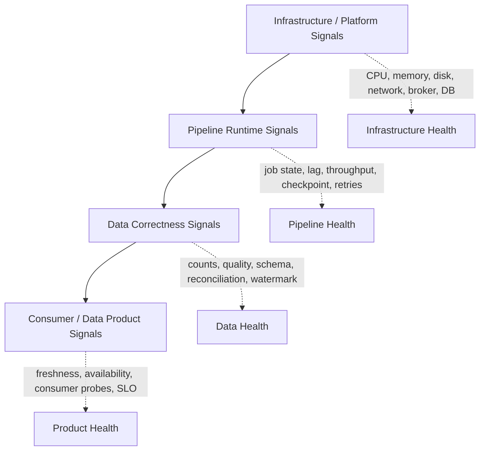
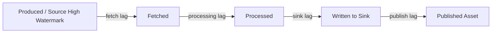

# Part 066 — Observability for Data Pipelines

A pipeline is observable when you can answer why a data product is wrong, late, incomplete, expensive, or unavailable without guessing.

Not merely:

```text
Is the job running?
```

But:

```text
Which source position has been processed?
Which asset version is published?
Which records were rejected?
Which transform version produced this output?
Which consumers are affected?
Which upstream asset caused the delay?
Which checkpoint restored this job?
Which partition/key/window is hot?
Which data quality rule blocked publication?
Which lineage path explains this field value?
```

Classic application observability uses logs, metrics, and traces. Data pipeline observability needs those, but also needs data-specific signals:

- source lag,
- freshness,
- completeness,
- watermark,
- checkpoint health,
- output count,
- rejection rate,
- schema drift,
- state size,
- partition skew,
- file counts,
- lineage,
- run manifest,
- data quality results,
- reconciliation results,
- publication state.

A pipeline without these signals is not operable. It may run, but it cannot be trusted.

---

## 1. Observability Mental Model

Think in four layers.



Most immature systems stop at L1 and L2.

They know the pod is healthy.
They know the Airflow task succeeded.
They know the Kafka consumer is running.

But they do not know the published table is missing 12% of expected records.

Production-grade pipeline observability starts from the consumer-visible data product and works backward.

---

## 2. The Debugging Questions

Every observability design should be tested against actual incident questions.

### Freshness incident

```text
Why is case_projection 45 minutes stale?
```

You need:

- current published source position,
- source high-watermark,
- consumer group lag,
- processor throughput,
- retry/DLQ volume,
- sink latency,
- checkpoint duration,
- backpressure status,
- deployment/version timeline,
- upstream availability.

### Completeness incident

```text
Why is partition 2026-07-03 missing 4,211 cases?
```

You need:

- expected count evidence,
- observed output count,
- rejected count,
- quarantine count,
- source extraction manifest,
- transform filtering counts,
- join miss counts,
- publish manifest,
- run ID and transform version.

### Accuracy incident

```text
Why does case C-9001 show status CLOSED instead of ESCALATED?
```

You need:

- source event history for key,
- pipeline event envelope metadata,
- transform decision log or audit rule trace,
- reference data version,
- correction/retraction events,
- sink write history,
- lineage path to output field,
- data quality rule results.

### Cost incident

```text
Why did yesterday's job cost 9x more?
```

You need:

- input volume,
- output volume,
- partition count,
- file count,
- shuffle/read/write bytes,
- state size growth,
- retry count,
- query plan changes,
- skew metrics,
- backfill/replay markers.

If your telemetry cannot answer these, you do not have observability. You have monitoring fragments.

---

## 3. Signals: Logs, Metrics, Traces, Events, Manifests

A mature pipeline emits five classes of telemetry.

| Signal | Purpose | Example |
|---|---|---|
| Logs | local narrative for specific events/errors | record rejected because enum unknown |
| Metrics | aggregated behavior over time | lag, throughput, failure rate |
| Traces | causal path across services/operators | API ingest -> transform -> sink write |
| Domain events | significant state changes | asset published, quality gate failed |
| Manifests | immutable run/publication evidence | source offsets, counts, version, snapshot |

Do not force all observability into logs.

Logs are expensive to query, hard to aggregate, and often missing structure.

Use metrics for trends and alerts.
Use traces for causality.
Use manifests for audit and replay evidence.
Use logs for detailed local context.

---

## 4. The Pipeline Observability Taxonomy

```text
Runtime metrics       = is the machinery healthy?
Data metrics          = is the data healthy?
Control-plane events  = what did the platform decide?
Lineage metadata      = what produced what?
Audit evidence        = can we reconstruct the output?
```

Examples:

```text
Runtime: records_per_second, checkpoint_duration, retry_count, sink_latency
Data: input_count, output_count, reject_count, null_rate, duplicate_count
Control: run_started, run_blocked, backfill_approved, asset_published
Lineage: job -> input dataset -> output dataset, column mapping, code version
Audit: run manifest, source position, quality gate result, reconciliation result
```

A pipeline may be runtime-healthy and data-unhealthy.

That is the central reason pipeline observability differs from ordinary service observability.

---

## 5. Metrics Design

Metrics should be low-cardinality, stable, and tied to action.

Bad metric labels:

```text
record_id
user_id
full_error_message
raw_file_name
SQL query text
```

Good labels:

```text
pipeline
asset
stage
source
sink
partition
quality_rule_id
severity
tenant_class
processing_mode
```

For high-cardinality debugging, use logs, traces, manifests, or sampled diagnostic stores.

### Core metric groups

```text
pipeline_runtime_*
pipeline_source_*
pipeline_transform_*
pipeline_sink_*
pipeline_checkpoint_*
pipeline_quality_*
pipeline_reconciliation_*
pipeline_asset_*
pipeline_slo_*
```

### Example metric names

```text
pipeline_records_in_total
pipeline_records_out_total
pipeline_records_rejected_total
pipeline_processing_duration_seconds
pipeline_source_lag_seconds
pipeline_sink_write_duration_seconds
pipeline_checkpoint_duration_seconds
pipeline_checkpoint_failures_total
pipeline_watermark_lag_seconds
pipeline_quality_violations_total
pipeline_reconciliation_mismatch_total
pipeline_asset_publish_total
pipeline_asset_freshness_lag_seconds
pipeline_slo_budget_consumed_ratio
```

Metric names should encode units.

```text
Good: pipeline_source_lag_seconds
Bad:  source_lag
```

---

## 6. Java Metrics Instrumentation

Keep instrumentation at pipeline boundaries.

```java
public interface PipelineMetrics {
    void recordInput(String pipeline, String stage, long count);
    void recordOutput(String pipeline, String stage, long count);
    void recordRejected(String pipeline, String ruleId, String severity, long count);
    void recordSourceLag(String pipeline, Duration lag);
    void recordSinkLatency(String pipeline, String sink, Duration latency);
    void recordCheckpointDuration(String pipeline, Duration duration);
    void recordAssetFreshness(String asset, Duration lag);
}
```

A simple adapter can later map this interface to Micrometer, OpenTelemetry Metrics, Prometheus, CloudWatch, or another backend.

Do not scatter vendor-specific metric calls throughout transform logic.

```java
public final class InstrumentedProcessor<I, O> implements Processor<I, O> {
    private final String pipelineName;
    private final String stageName;
    private final Processor<I, O> delegate;
    private final PipelineMetrics metrics;

    public InstrumentedProcessor(
            String pipelineName,
            String stageName,
            Processor<I, O> delegate,
            PipelineMetrics metrics
    ) {
        this.pipelineName = pipelineName;
        this.stageName = stageName;
        this.delegate = delegate;
        this.metrics = metrics;
    }

    @Override
    public List<Envelope<O>> process(Envelope<I> input) throws Exception {
        metrics.recordInput(pipelineName, stageName, 1);
        long started = System.nanoTime();
        try {
            List<Envelope<O>> out = delegate.process(input);
            metrics.recordOutput(pipelineName, stageName, out.size());
            return out;
        } catch (ValidationException ex) {
            metrics.recordRejected(pipelineName, ex.ruleId(), ex.severity().name(), 1);
            throw ex;
        } finally {
            long elapsed = System.nanoTime() - started;
            // record processing duration via histogram in concrete adapter
        }
    }
}
```

Instrumentation should be composable. The business transform should not need to know the metrics backend.

---

## 7. Logs: Structured, Sparse, Useful

Pipeline logs should be structured and correlated.

Minimum fields:

```json
{
  "timestamp": "2026-07-04T04:12:33.000Z",
  "level": "WARN",
  "pipeline": "case-cdc-to-projection",
  "runId": "run-20260704-001",
  "asset": "serving.case_projection",
  "stage": "validate-status-transition",
  "recordKey": "case-9001",
  "eventId": "evt-abc",
  "sourcePosition": "lsn:16/B374D848",
  "traceId": "...",
  "ruleId": "CASE_STATUS_TRANSITION_004",
  "message": "invalid transition CLOSED -> ESCALATED; record quarantined"
}
```

Do not log raw payload by default.

Reasons:

- PII leakage,
- high cost,
- noisy incidents,
- retention risk,
- hard-to-control access.

Use safe diagnostic references:

```text
record_key_hash
payload_hash
source_position
quarantine_ref
manifest_ref
trace_id
```

### Log levels

```text
DEBUG = local development or short-lived diagnostic mode
INFO  = lifecycle event: run started, asset published, checkpoint committed
WARN  = recoverable anomaly: retry, quarantine, schema drift warning
ERROR = pipeline effect failed or record permanently rejected
```

Do not log every successful record in production.

---

## 8. Tracing Pipeline Work

Tracing is useful when a pipeline crosses process boundaries:

- API ingestion service,
- Kafka producer,
- Kafka consumer,
- transform service,
- sink writer,
- metadata store,
- quality service,
- publication service.

For batch jobs, traces can also model large steps:

```text
run -> extract partition -> transform stage -> quality gate -> publish snapshot
```

Trace spans should not be created for every record in high-throughput streams unless sampled carefully.

### Span model

```text
pipeline.run
  source.read
  transform.validate
  transform.enrich
  sink.write
  checkpoint.commit
  asset.publish
```

Attributes:

```text
pipeline.name
run.id
asset.name
asset.version
source.name
source.position
processing.mode
partition.id
transform.version
quality.rule.id
```

### Java trace context in envelope

```java
public record TraceContext(
        String traceId,
        String spanId,
        String traceparent,
        Map<String, String> baggage
) {}

public record Envelope<T>(
        String eventId,
        String key,
        T payload,
        RecordPosition position,
        Instant eventTime,
        Instant ingestionTime,
        TraceContext traceContext,
        Map<String, String> headers
) {}
```

Trace propagation matters across Kafka and file boundaries. Put `traceparent` or equivalent context in headers/metadata where appropriate.

---

## 9. OpenTelemetry in Pipeline Systems

OpenTelemetry gives a vendor-neutral model for telemetry: traces, metrics, and logs.

A practical Java setup often has:

```text
Java app/instrumentation -> OpenTelemetry SDK/agent -> Collector -> backend(s)
```

Why this matters for data platforms:

- one telemetry model across services and jobs,
- correlation between ingest API, Kafka, processor, sink, and metadata store,
- vendor neutrality,
- ability to enrich telemetry with pipeline attributes,
- consistent context propagation.

But OpenTelemetry alone does not give data observability. You still need pipeline-specific semantic signals.

```text
OpenTelemetry tells you how operations behaved.
Pipeline metadata tells you what data was produced and whether it is trustworthy.
```

Use both.

---

## 10. Lag Metrics

Lag is not one metric.

```text
Offset lag       = broker high-watermark offset - consumer committed/processed offset
Time lag         = now - event/source timestamp of last processed record
Watermark lag    = now/event-time frontier - current watermark
Sink lag         = last transformed position - last published position
Consumer lag     = producer-visible progress - consumer-visible progress
Business lag     = deadline - actual publication time
```

Kafka offset lag can be high during backfill and not indicate an incident.
Time lag can be low while offset lag is high if old partitions are being replayed.
Watermark lag can reveal idle or late sources.
Sink lag can reveal slow external writes even when transform keeps up.

So dashboards should show lag decomposition.



Alert on consumer-impacting lag, not every backlog.

---

## 11. Throughput Metrics

Throughput tells whether the pipeline can keep up.

Track:

```text
records_in_per_second
records_out_per_second
bytes_in_per_second
bytes_out_per_second
records_rejected_per_second
records_retried_per_second
records_quarantined_per_second
sink_writes_per_second
```

Throughput must be interpreted with lag.

| Throughput | Lag | Meaning |
|---|---|---|
| high | low | healthy high volume |
| low | low | low source volume or idle |
| high | high | catching up, but maybe insufficient capacity |
| low | high | bottleneck, blocked source/sink, backpressure, failure |

For batch:

```text
records_per_partition
partitions_per_hour
bytes_scanned
bytes_written
shuffle_bytes
files_written
```

For stateful streaming:

```text
records_per_key_distribution
hot_key_count
state_reads_per_second
state_writes_per_second
state_size_bytes
```

---

## 12. Watermark Observability

Watermarks are the most misunderstood stream-processing signal.

A watermark is not “current time.”
It is the pipeline's belief about event-time progress.

Track:

```text
current_watermark_timestamp
watermark_lag_seconds
late_events_total
late_events_by_reason
idle_partitions
allowed_lateness_drops_total
side_output_late_events_total
```

Questions watermark metrics answer:

```text
Are windows closing?
Is one partition holding back event-time progress?
Are events arriving later than expected?
Did a source become idle without being marked idle?
Is allowed lateness too strict?
```

For regulatory systems, late event handling must be explicit:

```text
late_but_accepted
late_and_corrected
late_and_quarantined
late_and_dropped_by_policy
```

Dropping late data silently is an audit risk.

---

## 13. Checkpoint Observability

Checkpoint health is reliability health for stateful pipelines.

Track:

```text
checkpoint_completed_total
checkpoint_failed_total
last_checkpoint_duration_seconds
last_checkpoint_size_bytes
checkpoint_alignment_time_seconds
checkpoint_start_delay_seconds
checkpoint_restore_duration_seconds
checkpoint_age_seconds
state_backend_size_bytes
savepoint_created_total
```

Important patterns:

| Symptom | Possible Cause |
|---|---|
| duration increasing | state growth, slow storage, backpressure |
| size increasing unexpectedly | state leak, missing TTL, key explosion |
| frequent failures | unstable storage, sink coordination issue, timeout too low |
| old checkpoint age | job cannot complete checkpoint, recovery risk rising |
| restore slow | state too large, bad state backend/configuration |

Checkpoint metrics should be linked to deploys and backfills.

A new code version that doubles state size is a release risk.

---

## 14. Data Quality Observability

Quality checks need metrics, logs, sample evidence, and policy state.

Track:

```text
quality_rule_evaluations_total
quality_violations_total{rule_id,severity}
quality_violation_rate{rule_id,severity}
quality_gate_status{asset}
quarantined_records_total
null_rate{field}
unknown_enum_total{field}
referential_miss_total{reference_asset}
duplicate_key_total
schema_drift_total
```

Do not create a metric label for every field in a huge schema if it explodes cardinality. Use a controlled registry of monitored fields.

Quality observability should answer:

```text
Which rule changed?
Which input caused the spike?
Which asset publication was blocked?
Which consumers are affected?
Is this a real source issue or a transform bug?
```

### Quality gate event

```json
{
  "eventType": "quality_gate_failed",
  "asset": "gold.case_daily_summary",
  "runId": "run-20260704-001",
  "gateId": "case_summary_publish_gate",
  "criticalViolations": 2,
  "highViolations": 17,
  "blockedPublication": true,
  "evidenceRef": "quality-results/run-20260704-001"
}
```

Quality telemetry should be part of publish evidence, not separate side notes.

---

## 15. Reconciliation Observability

Reconciliation is where pipeline correctness becomes provable.

Track:

```text
reconciliation_checks_total
reconciliation_failures_total
expected_count
observed_count
count_difference
expected_checksum
observed_checksum
balance_difference
missing_key_count
extra_key_count
```

Do not only show pass/fail. Store evidence.

```java
public record ReconciliationResult(
        String runId,
        String assetName,
        String checkName,
        long expectedCount,
        long observedCount,
        BigDecimal expectedAmount,
        BigDecimal observedAmount,
        String expectedChecksum,
        String observedChecksum,
        boolean passed,
        String evidenceRef
) {}
```

For high-risk assets, reconciliation results should be immutable.

---

## 16. Lineage Observability

Lineage tells what produced what.

Minimum lineage for each asset publication:

```text
output asset name/version
input asset names/versions
pipeline/job name
run ID
code version
transform version
source positions
schema versions
quality gate results
publication time
owner
```

Lineage enables:

- impact analysis,
- root cause analysis,
- audit reconstruction,
- schema change review,
- backfill planning,
- consumer notification,
- deletion/privacy propagation.

A useful lineage graph is not just pretty.

It must answer operational questions:

```text
If silver.case_lifecycle_events is wrong for 2026-07-01, which gold assets and reports are affected?
If field case_status changes semantics, which consumers assume the old meaning?
If backfill run B supersedes run A, which downstream assets need restatement?
```

---

## 17. Run and Publication Events

Emit structured control-plane events.

```text
pipeline_run_requested
pipeline_run_started
pipeline_run_heartbeat
pipeline_run_succeeded
pipeline_run_failed
pipeline_run_cancelled
quality_gate_passed
quality_gate_failed
asset_publish_started
asset_published
asset_publish_failed
backfill_campaign_started
backfill_campaign_completed
slo_violation_detected
```

These events should not be hidden inside logs only.

They should be queryable by platform APIs.

Example:

```json
{
  "eventType": "asset_published",
  "asset": "silver.case_current_state",
  "assetVersion": "snapshot-928102",
  "runId": "run-20260704-003",
  "publishedAt": "2026-07-04T05:00:00Z",
  "sourcePositions": {
    "case_db": "lsn:16/B374D848"
  },
  "inputCounts": {
    "case_lifecycle_events": 901233
  },
  "outputCounts": {
    "case_current_state": 120044
  }
}
```

---

## 18. Dashboards That Actually Help

A good dashboard follows the incident workflow.

### Asset overview dashboard

Shows:

- asset status,
- freshness lag,
- completeness status,
- quality gate status,
- latest published version,
- latest source position,
- affected consumers,
- current SLO budget burn,
- last successful run,
- last failed run.

### Runtime dashboard

Shows:

- throughput,
- lag decomposition,
- error/retry/DLQ rate,
- sink latency,
- checkpoint health,
- JVM memory/GC,
- backpressure,
- worker restarts,
- partition skew.

### Data quality dashboard

Shows:

- critical/high violation counts,
- rule trends,
- source-specific failures,
- quarantine backlog,
- drift detection,
- top affected fields,
- release/change correlation.

### Backfill dashboard

Shows:

- campaign progress,
- partitions completed,
- validation status,
- cost/compute usage,
- production impact,
- publish readiness,
- rollback target.

Dashboards should move from symptom to cause.

A wall of charts without decision flow creates operational blindness.

---

## 19. Alert Design

Alerts should correspond to SLO risk or data loss risk.

Good alert categories:

```text
SLO fast burn
SLO violation
source lag approaching retention limit
checkpoint not completing
critical quality gate failure
asset publish failed after successful compute
reconciliation mismatch
DLQ/quarantine backlog exceeds threshold
schema drift on critical source
state size growth abnormal
sink error budget burning
```

Bad alert categories:

```text
one retry happened
one record rejected
DAG task failed but automatic retry is running
consumer lag briefly above fixed threshold during expected backfill
CPU high for one minute with no SLO impact
```

Alert payload should include context:

```text
asset
pipeline
run_id
stage
current_sli
slo_target
budget_consumed
affected_consumers
last_good_version
source_position
runbook
suggested_triage_steps
```

---

## 20. Correlation IDs and Causality

Every meaningful telemetry item should correlate to one or more identifiers.

```text
run_id
pipeline_name
asset_name
asset_version
source_position
event_id
record_key_hash
trace_id
transform_version
schema_version
backfill_campaign_id
```

For a single record investigation, you want to traverse:

```text
record key -> source event -> envelope -> transform logs -> quality result -> sink write -> asset version -> consumer read
```

For a batch investigation, you want:

```text
asset version -> run manifest -> input manifests -> quality results -> reconciliation -> lineage -> publish event
```

For a streaming incident, you want:

```text
consumer-visible lag -> topic partition lag -> operator throughput -> checkpoint/backpressure -> sink latency -> external dependency
```

This traversal only works if IDs are propagated deliberately.

---

## 21. Observability for Different Pipeline Types

### File ingestion

Track:

```text
files_discovered_total
files_imported_total
files_rejected_total
partial_files_detected_total
manifest_files_expected
manifest_files_imported
file_bytes_imported
file_age_seconds
```

Important dimensions:

```text
source_system
landing_zone
file_type
business_date
```

### API ingestion

Track:

```text
api_requests_total
api_errors_total
rate_limit_remaining
cursor_lag_seconds
pages_fetched_total
entities_upserted_total
entities_deleted_total
token_refresh_failures_total
```

### CDC ingestion

Track:

```text
source_lsn_lag_seconds
snapshot_rows_scanned_total
snapshot_completed
transactions_processed_total
ddl_events_total
heartbeat_age_seconds
schema_history_errors_total
```

### Kafka stream processing

Track:

```text
consumer_offset_lag
records_consumed_rate
records_produced_rate
commit_latency
rebalance_total
partition_assignment_count
state_store_size
restore_duration
```

### Flink

Track:

```text
num_records_in_per_second
num_records_out_per_second
current_input_watermark
checkpoint_duration
checkpoint_size
backpressured_time_ratio
busy_time_ratio
idle_time_ratio
state_size
late_records
```

### Spark batch/structured streaming

Track:

```text
input_rows
processed_rows_per_second
batch_duration
state_operator_rows
watermark
shuffle_read_bytes
shuffle_write_bytes
files_written
query_progress
```

### Lakehouse table

Track:

```text
snapshot_created_total
snapshot_age_seconds
data_files_count
small_files_count
manifest_count
orphan_files_count
compaction_duration
snapshot_expiration_events
```

---

## 22. JVM and Runtime Signals

Java pipeline code must still expose normal JVM signals.

Track:

```text
heap_used
non_heap_used
gc_pause_seconds
gc_count
thread_count
blocked_threads
classloader_metrics
executor_queue_depth
executor_active_threads
connection_pool_active
connection_pool_wait_time
http_client_latency
db_pool_exhaustion
```

Why it matters:

- GC pauses can create Kafka consumer poll issues.
- Thread pool saturation can look like sink latency.
- Connection pool exhaustion can cause retry storms.
- Memory growth can indicate unbounded dedupe/state/cache.
- Blocking calls inside async pipelines can collapse throughput.

Pipeline observability is still application observability plus data semantics.

---

## 23. Sampling Strategy

High-volume pipelines cannot trace/log every record deeply.

Use sampling intentionally:

```text
Always sample: errors, quarantines, critical records, publish events, quality gate failures
Probabilistic sample: successful records
Key-based sample: specific tenant/case/customer under investigation
Window sample: diagnostic mode for limited duration
Backfill sample: per partition summary + selected record traces
```

Diagnostic sampling must have expiration.

```yaml
diagnostic_mode:
  enabled: true
  pipeline: case-cdc-to-projection
  key_filter_hashes:
    - a8f44...
  expires_at: 2026-07-04T08:00:00Z
  approved_by: platform-oncall
```

Never leave verbose payload logging enabled indefinitely.

---

## 24. Privacy and Security in Observability

Telemetry can leak data.

Risks:

- raw payload in logs,
- PII in metric labels,
- sensitive IDs in traces,
- unrestricted DLQ access,
- quality sample records exposed broadly,
- lineage revealing restricted datasets,
- debug mode exporting payloads to third-party tools.

Controls:

```text
hash record keys in logs
separate diagnostic store access
redact payload fields by classification
prohibit high-cardinality PII labels
set retention by sensitivity
encrypt evidence stores
link telemetry access to asset classification
review observability exports as data flows
```

Observability is part of the data platform attack surface.

---

## 25. Observability as Code

Define telemetry expectations with the pipeline definition.

```yaml
pipeline: case-cdc-to-projection
asset: serving.case_projection
telemetry:
  required_metrics:
    - pipeline_source_lag_seconds
    - pipeline_records_in_total
    - pipeline_records_out_total
    - pipeline_records_rejected_total
    - pipeline_sink_write_duration_seconds
    - pipeline_checkpoint_duration_seconds
    - pipeline_asset_freshness_lag_seconds
  required_events:
    - pipeline_run_started
    - pipeline_run_succeeded
    - pipeline_run_failed
    - asset_published
    - quality_gate_failed
  required_manifest_fields:
    - sourcePositions
    - inputCounts
    - outputCounts
    - rejectedCounts
    - transformVersion
    - publishedSnapshotId
```

CI can validate instrumentation coverage.

A production pipeline should not launch without required observability.

---

## 26. Minimal Java Observability Kit

A practical Java kit can include:

```text
PipelineLogger
PipelineMetrics
PipelineTracer
RunManifestWriter
QualityResultWriter
LineageEmitter
PublicationEventEmitter
SloMarkerWriter
```

Example façade:

```java
public interface PipelineTelemetry {
    PipelineRunScope startRun(PipelineRunStart start);
    void recordQualityResult(QualityResult result);
    void recordReconciliation(ReconciliationResult result);
    void publishAssetEvent(AssetPublicationEvent event);
    void recordSloMarker(SloMarker marker);
}

public interface PipelineRunScope extends AutoCloseable {
    String runId();
    void heartbeat(Map<String, String> sourcePositions);
    void recordInputCount(String name, long value);
    void recordOutputCount(String name, long value);
    void recordRejectedCount(String name, long value);
    void fail(Throwable error);
    void succeed(PipelineRunCompletion completion);
    @Override void close();
}
```

Usage:

```java
try (PipelineRunScope run = telemetry.startRun(start)) {
    ExtractResult extracted = extractor.extract(run.runId());
    run.recordInputCount("source_rows", extracted.count());

    TransformResult transformed = transformer.transform(extracted);
    run.recordOutputCount("valid_rows", transformed.validCount());
    run.recordRejectedCount("invalid_rows", transformed.rejectedCount());

    QualityResult quality = qualityGate.evaluate(transformed);
    telemetry.recordQualityResult(quality);
    quality.throwIfBlocking();

    Publication publication = publisher.publish(transformed);
    telemetry.publishAssetEvent(publication.toEvent());

    run.succeed(publication.toCompletion());
} catch (Throwable t) {
    // fail is ideally called before close if exception path needs structured info
    throw t;
}
```

This keeps observability in the runner/control boundary, not buried inside business logic.

---

## 27. Incident Workflow

A mature incident workflow uses telemetry in a predictable order.

### Step 1: Identify user-visible impact

```text
Which asset/SLO/consumer is affected?
```

### Step 2: Locate failing boundary

```text
source -> ingest -> transform -> quality -> sink -> publish -> consumer
```

### Step 3: Determine data effect

```text
late, missing, wrong, duplicate, inaccessible, private-data exposure, cost runaway
```

### Step 4: Find last good version

```text
asset version, run ID, source position, transform version
```

### Step 5: Choose remediation

```text
resume, retry, replay, backfill, quarantine, rollback, restate, publish correction
```

### Step 6: Preserve evidence

```text
manifests, quality results, source positions, decision logs, incident notes
```

### Step 7: Update controls

```text
new metric, quality rule, SLO, runbook, test, contract, capacity limit
```

Observability should shorten this path.

---

## 28. Anti-Patterns

### Anti-pattern 1: Logs as the only evidence

Logs are not a reliable source of truth for published data.

Fix: write run manifests and publication events.

### Anti-pattern 2: Green job dashboard

A green job dashboard can hide stale or wrong data.

Fix: asset-level freshness/completeness/quality status.

### Anti-pattern 3: High-cardinality metric explosion

Putting record IDs or raw keys in metric labels kills metric systems.

Fix: use controlled labels and diagnostic stores.

### Anti-pattern 4: No source position

Without source position, you cannot prove what data was included.

Fix: persist source offset/cursor/LSN/manifest ID.

### Anti-pattern 5: No publish event

Without publish events, you cannot distinguish computed output from consumer-visible output.

Fix: explicit asset publication telemetry.

### Anti-pattern 6: Trace everything forever

Full per-record tracing for high-volume streams is usually unaffordable and risky.

Fix: sampling and targeted diagnostic mode.

### Anti-pattern 7: Observability afterthought

Adding telemetry after incidents leads to inconsistent signals.

Fix: observability-as-code in pipeline definitions.

---

## 29. Production Dashboard Layout

A useful top-level page for one asset:

```text
[Asset] serving.case_projection
Owner: case-platform
Criticality: Tier 1
Latest Published Version: snapshot-928102
Latest Source Position: lsn:16/B374D848
Freshness Lag: 48s / target 120s
Completeness: pass
Quality Gate: pass
Availability Probe: pass
SLO Budget Consumed: 12% monthly
Affected Consumers: ops-dashboard, search-api, breach-alerts
```

Then sections:

```text
1. SLO status
2. Source lag decomposition
3. Runtime health
4. Quality and reconciliation
5. Recent runs/publications
6. Lineage upstream/downstream
7. Recent deploys/config changes
8. Backfill/replay activity
9. Runbook and owner contact
```

The dashboard should answer: “Is it safe? If not, where do I go next?”

---

## 30. Review Checklist

Before promoting a pipeline to production, verify:

```text
1. Every run has a unique run_id.
2. Every output asset version has a publication event.
3. Source positions are persisted.
4. Input/output/rejected counts are captured.
5. Quality rule results are queryable.
6. Reconciliation evidence exists for critical assets.
7. Freshness metrics are asset-level, not just job-level.
8. Lag is decomposed by source, processing, sink, and publish boundary.
9. Checkpoint/state metrics are visible for stateful jobs.
10. Watermark/late event metrics exist for event-time jobs.
11. DLQ/quarantine backlog is visible.
12. Logs are structured and do not leak sensitive payloads.
13. Metrics use safe cardinality.
14. Traces propagate run/asset/context across services.
15. Dashboards map to incident workflows.
16. Alerts are tied to SLO risk or data loss risk.
17. Observability requirements are declared as code.
18. Access to diagnostic data follows data classification.
```

If source positions, publication events, and quality results are missing, the pipeline is not meaningfully observable.

---

## 31. Key Takeaways

Pipeline observability is not just application observability applied to batch jobs.

It is the ability to explain data product state.

The essential shift:

```text
from: pod/job/task health
  to: asset/data/consumer health
```

Use logs, metrics, and traces, but do not stop there.

A production Java pipeline should emit:

- runtime metrics,
- data quality metrics,
- source position markers,
- checkpoint/watermark signals,
- run manifests,
- publication events,
- reconciliation results,
- lineage events,
- SLO evaluations.

The final test is simple:

```text
When a consumer says “this data is wrong,” can you reconstruct why, how far the impact goes, and what version should replace it?
```

If yes, your pipeline is observable.
If no, your pipeline is merely instrumented.
