# Part 067 — Lineage and Impact Analysis

A data pipeline without lineage is a distributed system with amnesia.

It may be able to produce data, but when the data is wrong, late, sensitive, stale, duplicated, or structurally changed, the platform cannot answer the important questions:

```text
Where did this value come from?
Which job wrote this table?
Which source position was used?
Which transform version produced this field?
Which downstream reports depend on this column?
Which assets become invalid if this upstream dataset changes?
Which consumers see PII derived from this source?
Which pipeline run introduced the bad output?
Which backfill superseded the previous result?
```

Lineage is not a pretty diagram. It is the evidence graph of a data platform.

Impact analysis is the operational use of that graph.

A top-tier engineer does not implement lineage as an afterthought. They treat it as part of the pipeline control plane, observability model, contract system, and compliance evidence trail.

---

## 1. The Core Model

Data lineage answers:

```text
What produced what, from what, when, using which code/config/schema, under which run context?
```

Impact analysis answers:

```text
If this thing changes or fails, what else is affected, how badly, and what action should be taken?
```

They are two sides of the same graph.

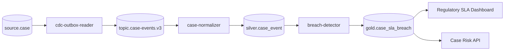

Lineage is the graph.

Impact analysis is asking:

```text
If source.case.status changes type from string to enum, who breaks?
If case-normalizer v8 produced wrong event_time, which published assets are tainted?
If gold.case_sla_breach fails freshness SLO, which dashboards and APIs are degraded?
```

---

## 2. Lineage Is Not Just Dependency

Many systems confuse these:

| Thing | Meaning | Example |
|---|---|---|
| Dependency | Static relation | `gold.case_sla_breach` depends on `silver.case_event` |
| Lineage | Runtime evidence of production | Run `2026-07-04T01:00Z` read snapshot `s-189` and produced snapshot `s-190` |
| Provenance | Origin of a specific value/record | `sla_deadline` derived from `case.accepted_at + policy.response_days` |
| Impact analysis | Downstream blast radius | `policy.response_days` change affects `gold.case_sla_breach`, dashboard, alerts |
| Data catalog | Inventory and description | Table owner, schema, tags, description |
| Observability | Runtime state and signals | Freshness, row count, rejected records, lag |

A dependency graph says what *should* depend on what.

Runtime lineage says what *actually happened*.

For production systems, static dependency is insufficient. You need run-level evidence.

---

## 3. Lineage Granularity Levels

Lineage has levels. Each level answers a different class of question.

| Level | Unit | Questions Answered |
|---|---|---|
| System lineage | System/service | Which platform writes to the warehouse? |
| Pipeline/job lineage | Job/DAG/workflow | Which job produces this asset? |
| Run lineage | Execution instance | Which run produced this version? |
| Dataset lineage | Table/topic/file asset | Which datasets are inputs/outputs? |
| Partition lineage | Date/hour/tenant shard | Which partition is affected? |
| Column lineage | Field/column | Which downstream columns use this field? |
| Record lineage | Record/event | Where did this specific case event come from? |
| Value lineage | Cell/value | How was this value calculated? |

Do not try to implement value-level lineage everywhere. It is expensive and often unnecessary.

Use the least expensive level that can answer the operational question.

A practical enterprise setup usually needs:

- dataset-level lineage for platform navigation,
- run-level lineage for incident investigation,
- partition-level lineage for backfill and invalidation,
- column-level lineage for schema impact and privacy,
- record-level lineage only for regulated/audited workflows.

---

## 4. The Minimum Useful Lineage Event

A lineage event should capture:

```text
run identity
job identity
input datasets
output datasets
code version
config version
schema versions
source positions or snapshots
quality result
publication state
owner/service identity
timestamp
```

Minimal event shape:

```json
{
  "eventType": "COMPLETE",
  "eventTime": "2026-07-04T02:10:12Z",
  "run": {
    "runId": "run-20260704-0200-case-normalizer"
  },
  "job": {
    "namespace": "regulatory-data-platform",
    "name": "case-normalizer"
  },
  "inputs": [
    {
      "namespace": "kafka://prod-cluster",
      "name": "case-events.v3"
    }
  ],
  "outputs": [
    {
      "namespace": "iceberg://prod-catalog/enforcement",
      "name": "silver.case_event"
    }
  ]
}
```

This is close to the OpenLineage mental model: run, job, input dataset, output dataset, and facets.

The event by itself is not enough for a serious platform, but it is the correct primitive.

---

## 5. OpenLineage Mental Model

OpenLineage is useful because it gives a shared vocabulary:

```text
Job    = abstract process that consumes/produces datasets
Run    = one execution instance of a job
Dataset = input or output data asset
Facet  = additional metadata attached to run/job/dataset
```

OpenLineage events are emitted as runs transition through lifecycle states.

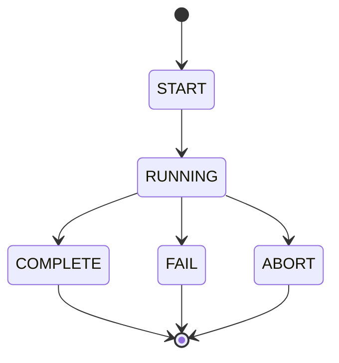

In a pipeline platform, OpenLineage should not be treated as a diagramming feature. Treat it as a standard event protocol for metadata emission.

### Useful facets for production pipelines

| Facet Type | Example |
|---|---|
| Source version | Kafka offsets, Iceberg snapshot ID, API cursor |
| Schema | Input/output schema version |
| Code | Git SHA, artifact version, container digest |
| Config | config version, feature flags |
| Quality | checks run, severity, pass/fail count |
| Error | exception class, stage, error code |
| Ownership | team, service account, on-call group |
| Security | classification, PII tags, tenant boundary |
| Performance | row count, bytes, duration, cost estimate |

The standard facets rarely cover every internal requirement. That is normal. Extend carefully, keep extensions stable, and document them.

---

## 6. Asset Graph vs Run Graph

Lineage often needs two graphs.

### Asset graph

Long-lived relation between data assets.

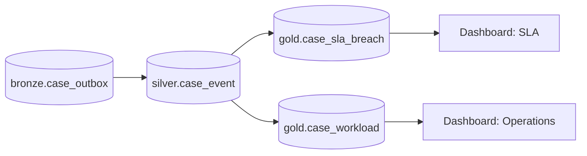

Asset graph is used for:

- dependency navigation,
- ownership mapping,
- contract review,
- schema impact,
- downstream notification,
- access review,
- documentation.

### Run graph

Concrete execution evidence.

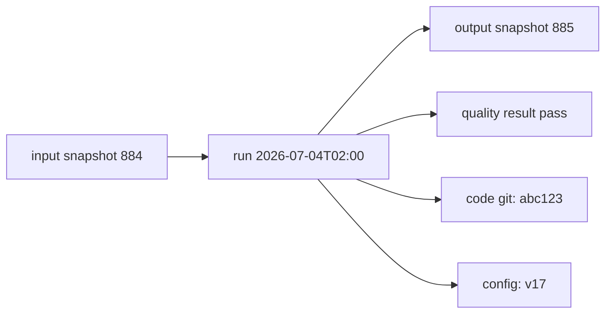

Run graph is used for:

- incident diagnosis,
- rollback/supersession,
- audit evidence,
- backfill tracking,
- reproducibility,
- root cause analysis.

A serious platform stores both.

---

## 7. Lineage as Evidence, Not Decoration

The lineage system must support evidence-grade questions.

Poor lineage record:

```text
job A produced table B
```

Better lineage record:

```text
runId=case-normalizer/2026-07-04T02:00
job=case-normalizer
codeVersion=git:abc123
artifact=case-normalizer:2.8.1
configVersion=normalizer-config:v17
input=topic case-events.v3 offsets {0: 8001-9110, 1: 7010-8022}
inputSchema=case-event-avro:3.2.0
output=iceberg silver.case_event snapshot 885
outputSchema=silver-case-event:5.1.0
qualityResult=PASS
rowCount=17_812
rejected=21
publishedAt=2026-07-04T02:07:18Z
```

This is enough to investigate.

The lineage event should not rely only on log parsing. Logs are helpful, but lineage must be explicit, structured, and queryable.

---

## 8. Java Domain Model for Lineage

Start with stable domain objects.

```java
public record DatasetRef(
        String namespace,
        String name,
        DatasetType type,
        Optional<String> version
) {}

public enum DatasetType {
    KAFKA_TOPIC,
    ICEBERG_TABLE,
    POSTGRES_TABLE,
    OBJECT_PREFIX,
    API_ENDPOINT,
    SEARCH_INDEX,
    DASHBOARD,
    REPORT,
    MODEL,
    UNKNOWN
}

public record JobRef(
        String namespace,
        String name,
        String owner,
        String service
) {}

public record RunRef(
        String runId,
        Instant startedAt,
        Optional<String> parentRunId,
        Optional<String> backfillId
) {}

public record CodeRef(
        String gitSha,
        String artifactName,
        String artifactVersion,
        Optional<String> containerDigest
) {}

public record LineageEvent(
        LineageEventType type,
        Instant eventTime,
        RunRef run,
        JobRef job,
        List<DatasetRef> inputs,
        List<DatasetRef> outputs,
        CodeRef code,
        Map<String, Object> facets
) {}

public enum LineageEventType {
    START,
    RUNNING,
    COMPLETE,
    FAIL,
    ABORT
}
```

Keep the internal model richer than the external protocol.

Then build adapters:

```text
Internal LineageEvent
    -> OpenLineage JSON
    -> platform lineage store
    -> audit store
    -> observability event
```

Do not let an external spec dictate every internal invariant.

---

## 9. Dataset Naming

Lineage becomes useless when dataset identity is inconsistent.

Bad:

```text
case_event
prod.case_event
silver.case_event
s3://bucket/path/case_event
iceberg.case_event
Case Event Silver
```

Good:

```text
namespace = iceberg://prod-catalog/enforcement
name      = silver.case_event
```

For Kafka:

```text
namespace = kafka://prod-msk-a
name      = regulatory.case-events.v3
```

For PostgreSQL:

```text
namespace = postgres://case-db-prod
name      = public.case
```

For S3/Object storage prefix:

```text
namespace = s3://regulatory-prod-landing
name      = vendor-a/cases/YYYY/MM/DD/
```

Rules:

- Dataset identity must be stable.
- Environment must be explicit.
- Do not put run ID in dataset name.
- Do not put snapshot ID in logical dataset name.
- Version belongs in metadata/facet unless version is part of logical contract.
- PII classification belongs in metadata, not name.

---

## 10. Source Position Lineage

Dataset-level lineage is not enough. You often need source position.

For Kafka:

```json
{
  "kafka": {
    "topic": "case-events.v3",
    "partitions": {
      "0": {"from": 882001, "toExclusive": 883120},
      "1": {"from": 450010, "toExclusive": 451004}
    }
  }
}
```

For CDC:

```json
{
  "cdc": {
    "connector": "case-db-postgres",
    "sourceLsnFrom": "16/B374D848",
    "sourceLsnTo": "16/B389FF20",
    "snapshot": false
  }
}
```

For Iceberg:

```json
{
  "iceberg": {
    "table": "silver.case_event",
    "snapshotId": 884,
    "sequenceNumber": 1901
  }
}
```

For API ingestion:

```json
{
  "api": {
    "endpoint": "GET /cases",
    "cursorFrom": "eyJwYWdlIjo1MDA...",
    "cursorTo": "eyJwYWdlIjo1MjA...",
    "watermark": "2026-07-04T01:59:59Z"
  }
}
```

For file ingestion:

```json
{
  "file": {
    "manifestId": "vendor-a-20260704-0200",
    "files": [
      {"path": "landing/vendor-a/cases/2026-07-04/file-01.csv", "sha256": "..."}
    ]
  }
}
```

This lets you reproduce or bound the run.

---

## 11. Column-Level Lineage

Column-level lineage answers:

```text
If input column X changes, which output columns break?
Which output column contains derived PII?
Which metric depends on policy table field response_days?
```

Example:

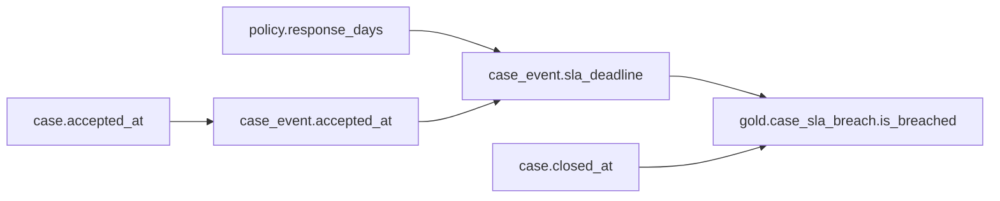

Column lineage can be:

- manually declared,
- inferred from SQL AST,
- inferred from Spark/Flink plan,
- emitted by transformation code,
- approximated through mapping metadata.

For Java pipelines, explicit declaration is often more reliable than magical inference.

```java
public record ColumnLineage(
        DatasetColumn output,
        List<DatasetColumn> inputs,
        TransformationKind kind,
        String expressionId,
        String description
) {}

public record DatasetColumn(
        DatasetRef dataset,
        String column
) {}

public enum TransformationKind {
    COPY,
    RENAME,
    CAST,
    HASH,
    MASK,
    DERIVE,
    AGGREGATE,
    FILTER_DEPENDENCY,
    JOIN_DEPENDENCY,
    CONSTANT,
    UNKNOWN
}
```

Example declaration:

```java
List<ColumnLineage> lineage = List.of(
    new ColumnLineage(
        col(silverCaseEvent, "sla_deadline"),
        List.of(col(sourceCase, "accepted_at"), col(policyTable, "response_days")),
        TransformationKind.DERIVE,
        "sla_deadline_v2",
        "accepted_at plus policy response days using business calendar"
    ),
    new ColumnLineage(
        col(goldBreach, "is_breached"),
        List.of(col(silverCaseEvent, "sla_deadline"), col(silverCaseEvent, "closed_at")),
        TransformationKind.DERIVE,
        "breach_flag_v4",
        "closed_at after sla_deadline or still open after deadline"
    )
);
```

Column lineage should be versioned with the transformation.

---

## 12. Record-Level Lineage

Record-level lineage is costly but valuable in regulated workflows.

Example envelope fields:

```java
public record RecordProvenance(
        String sourceSystem,
        String sourceEntity,
        String sourceRecordId,
        Optional<String> sourceVersion,
        Optional<String> sourcePosition,
        String producingRunId,
        String transformVersion,
        List<String> inputEventIds
) {}
```

For a regulatory enforcement case:

```json
{
  "outputRecordId": "case-sla-breach:CASE-9001:2026-07-04",
  "sourceRecordId": "CASE-9001",
  "inputEventIds": [
    "case-accepted:CASE-9001:9",
    "policy-updated:POLICY-ENF-2026:2"
  ],
  "producingRunId": "breach-detector/20260704T0200",
  "transformVersion": "breach-detector-v4.3.1"
}
```

Use record-level lineage when:

- auditors ask for “why did this decision happen?”
- downstream action is high-impact,
- output must be explainable,
- correction propagation must be precise,
- legal/regulatory defensibility matters.

Avoid storing full sensitive input values unless necessary. Store references, hashes, and evidence pointers.

---

## 13. Lineage Emission Points

Emit lineage at important lifecycle transitions.

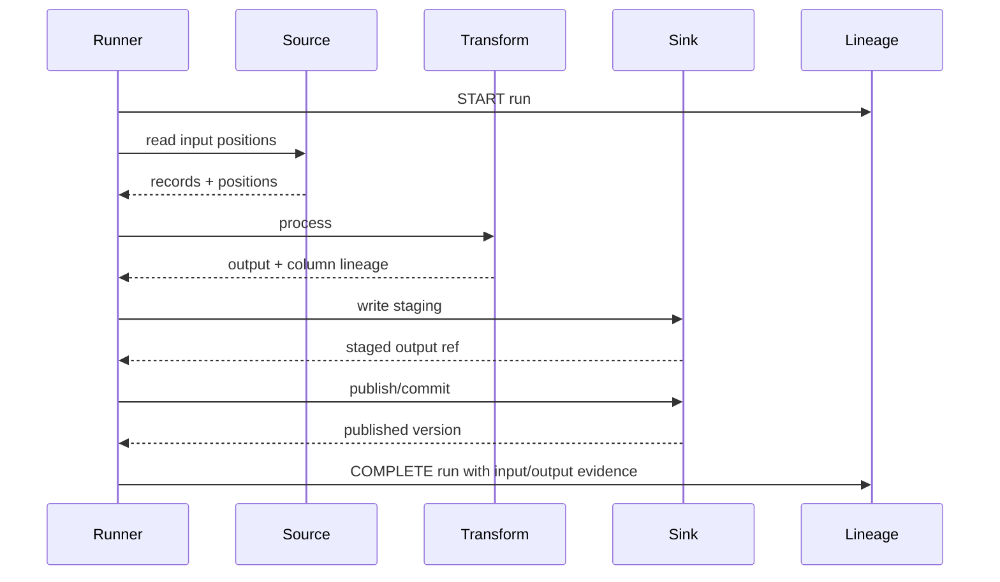

Do not wait until the end to emit everything. Emit:

- `START` when run begins,
- `RUNNING` progress events for long runs,
- `COMPLETE` after output is committed,
- `FAIL` with failure stage and partial evidence,
- `ABORT` for cancelled/superseded runs.

The final event must reflect committed reality, not intention.

---

## 14. The Commit Boundary Problem

Lineage must not claim output exists before it is safely published.

Bad sequence:

```text
emit COMPLETE lineage
write output fails
```

Now metadata lies.

Better sequence:

```text
write staging
validate staging
publish output atomically
observe published version
emit COMPLETE lineage with published version
```

For Iceberg:

```text
write data files
commit snapshot
record snapshot id
emit COMPLETE lineage with snapshot id
```

For Kafka output:

```text
produce events
transaction commit succeeds
record output topic + partition offset range if available
emit COMPLETE lineage
```

For external API side effect:

```text
write effect ledger
perform idempotent API call
confirm outcome or mark unknown
emit lineage with side effect status
```

Lineage should match durable side effects.

---

## 15. Java Lineage Emitter

A simple interface:

```java
public interface LineageEmitter {
    void emit(LineageEvent event) throws LineageEmissionException;
}

public final class CompositeLineageEmitter implements LineageEmitter {
    private final List<LineageEmitter> delegates;

    public CompositeLineageEmitter(List<LineageEmitter> delegates) {
        this.delegates = List.copyOf(delegates);
    }

    @Override
    public void emit(LineageEvent event) {
        RuntimeException failure = null;

        for (LineageEmitter delegate : delegates) {
            try {
                delegate.emit(event);
            } catch (RuntimeException e) {
                if (failure == null) failure = e;
                else failure.addSuppressed(e);
            }
        }

        if (failure != null) {
            throw failure;
        }
    }
}
```

But decide carefully: should lineage emission failure fail the pipeline?

The answer depends on the asset criticality.

| Asset Type | Lineage Emission Failure Policy |
|---|---|
| Experimental analytics | warn and continue |
| Internal operational table | warn, alert, retry async |
| Regulatory report | fail publication or mark output non-certified |
| Legal/audit evidence | fail closed |
| Backfill campaign | continue only if run manifest is durable elsewhere |

Do not use one global policy.

---

## 16. Durable Lineage Outbox

Lineage emission itself can fail.

If the pipeline commits output but fails to send lineage to the metadata service, you need recovery.

Use a lineage outbox.

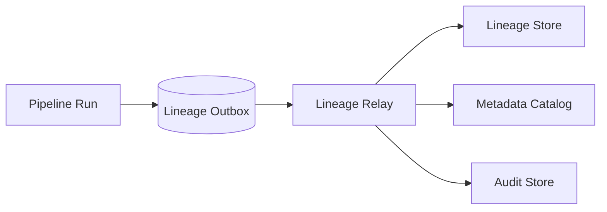

Outbox table shape:

```sql
CREATE TABLE pipeline_lineage_outbox (
    id UUID PRIMARY KEY,
    run_id TEXT NOT NULL,
    event_type TEXT NOT NULL,
    event_time TIMESTAMPTZ NOT NULL,
    payload JSONB NOT NULL,
    status TEXT NOT NULL,
    attempts INT NOT NULL DEFAULT 0,
    last_error TEXT,
    created_at TIMESTAMPTZ NOT NULL DEFAULT now(),
    sent_at TIMESTAMPTZ
);
```

Pipeline:

```text
commit output
insert lineage outbox event in same durable control transaction if possible
relay sends to lineage sink
```

For lakehouse jobs where output commit and DB outbox are not in the same transaction, use run manifest as the recovery source.

---

## 17. Run Manifest as Lineage Source of Truth

Every serious pipeline run should produce a run manifest.

```json
{
  "runId": "gold-sla-breach/20260704T0200",
  "job": "gold-sla-breach",
  "status": "PUBLISHED",
  "startedAt": "2026-07-04T02:00:00Z",
  "finishedAt": "2026-07-04T02:06:42Z",
  "inputs": [
    {
      "dataset": "iceberg://prod/enforcement/silver.case_event",
      "snapshotId": 884
    }
  ],
  "outputs": [
    {
      "dataset": "iceberg://prod/enforcement/gold.case_sla_breach",
      "snapshotId": 885
    }
  ],
  "code": {
    "gitSha": "abc123",
    "artifact": "breach-detector:4.3.1"
  },
  "config": {
    "version": "breach-config:17"
  },
  "quality": {
    "status": "PASS",
    "failedCriticalChecks": 0
  },
  "metrics": {
    "inputRows": 1200041,
    "outputRows": 9904,
    "rejectedRows": 31
  }
}
```

The manifest can be:

- stored in object storage,
- indexed into a run store,
- emitted as OpenLineage facets,
- attached to audit evidence,
- used for rerun/reproduce operations.

If lineage service is down, the run manifest lets you reconstruct lineage later.

---

## 18. Impact Analysis Use Cases

Impact analysis should be designed around concrete decisions.

### Schema change impact

```text
Field case.priority renamed to risk_priority.
Who breaks?
```

Need:

- column lineage,
- schema contract registry,
- consumer assumption registry,
- downstream asset graph,
- severity classification.

### Data incident impact

```text
Normalizer v8 parsed timezone incorrectly for accepted_at.
Which outputs are tainted?
```

Need:

- run lineage,
- code version,
- output snapshot/version,
- downstream materialization runs,
- time window affected,
- partition lineage.

### Freshness impact

```text
silver.case_event is 4 hours late.
Which SLA dashboards or alerting services are degraded?
```

Need:

- asset dependency graph,
- SLO registry,
- consumer criticality,
- dashboard/API lineage.

### Privacy impact

```text
Source field subject_national_id is reclassified as restricted PII.
Which downstream assets contain direct or derived values?
```

Need:

- column lineage,
- transformation kind,
- masking/hash annotations,
- access policy registry,
- retention rules.

### Backfill impact

```text
Backfill campaign BF-20260704 will rewrite 180 days of gold assets.
Who must be notified?
```

Need:

- downstream consumers,
- publication windows,
- dashboard refresh dependencies,
- external exports,
- restatement policy.

---

## 19. Impact Analysis Algorithm

At its simplest, impact analysis is graph traversal.

```java
public record ImpactRequest(
        AssetNode changedAsset,
        Optional<String> changedColumn,
        ChangeType changeType,
        Severity sourceSeverity,
        Instant effectiveAt
) {}

public enum ChangeType {
    SCHEMA_BREAKING,
    SCHEMA_COMPATIBLE,
    DATA_INCORRECT,
    FRESHNESS_BREACH,
    PRIVACY_RECLASSIFICATION,
    ASSET_DEPRECATED,
    BACKFILL_RESTATEMENT
}

public record ImpactResult(
        AssetNode asset,
        ImpactPath path,
        ImpactSeverity severity,
        RecommendedAction action,
        String reason
) {}
```

Traversal:

```java
public final class ImpactAnalyzer {
    private final LineageGraph graph;
    private final PolicyEvaluator policyEvaluator;

    public List<ImpactResult> downstreamImpact(ImpactRequest request) {
        var results = new ArrayList<ImpactResult>();
        var queue = new ArrayDeque<ImpactPath>();
        var visited = new HashSet<AssetNode>();

        queue.add(ImpactPath.start(request.changedAsset()));

        while (!queue.isEmpty()) {
            ImpactPath path = queue.removeFirst();
            AssetNode current = path.last();

            if (!visited.add(current)) {
                continue;
            }

            for (LineageEdge edge : graph.outgoing(current)) {
                var next = edge.to();
                var nextPath = path.extend(edge, next);

                ImpactResult result = policyEvaluator.evaluate(request, nextPath);
                results.add(result);

                if (result.severity().shouldPropagate()) {
                    queue.addLast(nextPath);
                }
            }
        }

        return results;
    }
}
```

The hard part is not traversal. The hard part is policy.

---

## 20. Impact Severity

Not every downstream node is equally affected.

| Severity | Meaning | Example Action |
|---|---|---|
| Informational | Potentially relevant, no immediate break | notify owner |
| Warning | Data may be stale or partial | mark degraded |
| Blocking | Publication should stop | block downstream publish |
| Tainted | Output may be wrong | quarantine or supersede |
| Restricted | Privacy/security classification changed | revoke access / reclassify |
| Critical | External/regulatory impact | incident + management/audit notification |

Example policy:

```java
public enum ImpactSeverity {
    INFO,
    WARNING,
    BLOCKING,
    TAINTED,
    RESTRICTED,
    CRITICAL;

    public boolean shouldPropagate() {
        return this != INFO;
    }
}
```

Severity should consider:

- asset criticality,
- consumer type,
- freshness SLO,
- quality gate result,
- transformation semantics,
- column usage,
- privacy classification,
- publication status,
- external reporting deadlines.

---

## 21. Column-Level Impact Propagation

Dataset-level traversal overestimates impact.

If `case.internal_notes` changes, not every downstream table breaks.

Column-level impact needs field mapping.

```java
public boolean edgeUsesColumn(LineageEdge edge, String column) {
    return edge.columnLineage().stream()
        .anyMatch(cl -> cl.inputs().stream()
            .anyMatch(input -> input.column().equals(column)));
}
```

Example:

| Changed Column | Downstream Field | Impact |
|---|---|---|
| `case.accepted_at` | `case_event.sla_deadline` | high |
| `case.internal_notes` | none | no direct impact |
| `case.subject_national_id` | `case_subject_hash` | privacy-derived impact |
| `case.priority` | `risk_bucket` | semantic impact |

Column-level impact should account for transformation kind.

| Transformation Kind | Impact Behavior |
|---|---|
| COPY | direct propagation |
| CAST | schema/value risk |
| MASK | privacy impact may be reduced but not removed |
| HASH | derived sensitive data may remain sensitive |
| AGGREGATE | many input records affect one output |
| FILTER_DEPENDENCY | input controls inclusion even if not output |
| JOIN_DEPENDENCY | input affects enrichment or cardinality |

A field that is used in a filter but not emitted can still have downstream impact.

---

## 22. Schema Change Impact Matrix

| Change | Dataset-Level Impact | Column-Level Impact | Typical Action |
|---|---|---|---|
| Add nullable field | low | none unless consumed | notify |
| Add required field | high for producers/writers | downstream schema parser risk | compatibility gate |
| Remove field | high | consumers using field break | block until migrated |
| Rename field | breaking unless alias supported | old field consumers break | dual-write/alias |
| Type widening | medium | parser/semantics risk | test consumers |
| Type narrowing | high | potential loss/rejection | block |
| Enum value added | medium/high | consumers with exhaustive match break | compatibility test |
| Meaning changed | high | not detectable by schema alone | contract review |
| Unit changed | critical | silent data corruption | new field/version |

Lineage alone cannot detect semantic changes. It must integrate with data contracts.

---

## 23. Impact Analysis for Data Quality Failures

Quality failure should propagate differently based on rule type.

| Failed Rule | Example | Propagation |
|---|---|---|
| Completeness | row count lower than expected | downstream count/aggregate assets tainted |
| Uniqueness | duplicate case ID | joins/projections may be wrong |
| Referential integrity | missing policy ID | enrichment outputs tainted |
| Freshness | source late | downstream assets degraded |
| Validity | invalid status value | semantic outputs tainted |
| Distribution drift | priority mix changed | warning unless business-critical |
| Privacy | unmasked PII present | restricted/critical propagation |

Quality result should be attached to lineage.

```java
public record QualityFacet(
        String suiteId,
        String suiteVersion,
        QualityStatus status,
        int totalChecks,
        int failedChecks,
        List<QualityFailure> failures
) {}
```

Then impact analysis can answer:

```text
Quality gate failed on silver.case_event partition 2026-07-04.
Which gold assets depend on that partition?
Which dashboards should be marked degraded?
```

---

## 24. Partition-Level Impact

Partition lineage prevents overreaction.

If only one date partition is tainted, do not invalidate a whole table unless necessary.

```java
public record PartitionRef(
        DatasetRef dataset,
        Map<String, String> spec
) {}
```

Examples:

```json
{"dataset":"silver.case_event", "partition":{"event_date":"2026-07-04"}}
{"dataset":"gold.case_sla_breach", "partition":{"report_date":"2026-07-04"}}
{"dataset":"case_events.v3", "partition":{"kafka_partition":"4"}}
```

Partition lineage is tricky because transformation can expand or compress partitions:

| Transform | Input Partition | Output Partition |
|---|---|---|
| daily normalize | same day | same day |
| 7-day rolling metric | last 7 days | one report day |
| monthly aggregation | all days in month | month |
| late correction | old event day | current correction partition and old effective partition |
| bitemporal table | valid date + recorded date | multiple query views |

Record the partition mapping in the run manifest.

---

## 25. Lineage for Streaming Pipelines

Streaming lineage cannot emit one lineage event per record at high volume.

Use interval lineage.

```text
job=case-normalizer
run=stream-run-20260704
interval=2026-07-04T02:00:00Z/PT5M
input topic offsets:
  p0: 8001-9200
  p1: 7010-8112
output topic offsets:
  p0: 10001-11202
checkpoint=chk-9002
watermark=2026-07-04T01:58:00Z
quality=pass-with-warnings
```

For long-running Flink jobs, lineage can be emitted:

- at job start,
- periodically per checkpoint interval,
- per committed sink transaction,
- when savepoint is taken,
- when job version changes,
- when quality status changes.

Do not model an infinite stream as one run with no structure. Introduce logical intervals.

---

## 26. Lineage for Kafka Topics

Kafka topics are datasets.

Important lineage metadata:

- topic name,
- cluster namespace,
- partitions,
- offset range,
- key schema,
- value schema,
- header contract,
- retention policy,
- compaction policy,
- producer service,
- consumer group,
- transactional ID where relevant.

Producer lineage:

```text
source dataset(s) -> producer job -> output topic offset range
```

Consumer lineage:

```text
input topic offset range -> consumer job -> output dataset(s)
```

Kafka lineage should not rely only on consumer group names. Consumer group names are runtime identities, not semantic ownership.

---

## 27. Lineage for CDC

CDC lineage should capture:

- source database,
- source schema/table,
- transaction log position,
- connector name/version,
- snapshot vs streaming phase,
- transaction metadata if enabled,
- schema history version,
- topic output,
- operation type semantics.

CDC lineage is not the same as domain event lineage.

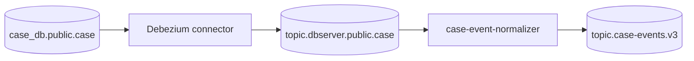

The raw CDC topic tells you database row changes.

The canonical event topic tells you domain facts.

Both can be lineage nodes, but they mean different things.

---

## 28. Lineage for Lakehouse Tables

Lakehouse lineage should capture snapshot IDs.

For Iceberg-like table formats:

```text
input table snapshot(s)
output table snapshot
operation: append / overwrite / merge / delete / compact
manifest/run id
```

Example:

```json
{
  "inputSnapshots": [
    {"table": "silver.case_event", "snapshotId": 884},
    {"table": "reference.policy", "snapshotId": 102}
  ],
  "outputSnapshots": [
    {"table": "gold.case_sla_breach", "snapshotId": 885}
  ],
  "operation": "REPLACE_PARTITIONS",
  "partitions": ["report_date=2026-07-04"]
}
```

This allows time-travel debugging:

```text
Which input snapshots produced output snapshot 885?
```

Without snapshot-level lineage, reproducibility is often impossible.

---

## 29. Lineage for Airflow, Spark, Flink, and Beam

### Airflow

Airflow controls task execution. It can emit DAG/task-level lineage.

Good for:

- DAG run lineage,
- task dependency,
- scheduling evidence,
- task-level input/output metadata.

Not enough for:

- record-level provenance,
- detailed Spark/Flink operator lineage,
- exact output snapshot unless job reports it.

### Spark

Spark jobs should emit:

- input table/file snapshots,
- output table snapshots,
- SQL plan or transform version,
- row counts,
- quality results,
- partition write info.

### Flink

Flink jobs should emit:

- job ID,
- checkpoint/savepoint ID,
- source offset/watermark range,
- sink commit ID,
- operator version,
- state schema version.

### Beam

Beam jobs should emit:

- runner/job identity,
- transform graph identity,
- input/output PCollections mapped to real datasets,
- window/trigger semantics,
- state/timer metadata if relevant.

Never assume the orchestrator knows all data lineage. Often the worker knows the real datasets and positions.

---

## 30. Manual Lineage Is Not Evil

Automatic lineage is attractive but incomplete.

Manual lineage is acceptable when:

- transformation is in Java code,
- SQL parser cannot infer complex UDF behavior,
- API output becomes a data asset,
- dashboard/report dependencies are outside pipeline engine,
- external side effects matter,
- privacy semantics need human annotation.

But manual lineage must be code-reviewed and versioned.

Example manifest:

```yaml
job: breach-detector
version: 4.3.1
inputs:
  - dataset: iceberg://prod/enforcement/silver.case_event
  - dataset: iceberg://prod/reference/policy_calendar
outputs:
  - dataset: iceberg://prod/enforcement/gold.case_sla_breach
columnLineage:
  - output: gold.case_sla_breach.case_id
    inputs:
      - silver.case_event.case_id
    kind: COPY
  - output: gold.case_sla_breach.is_breached
    inputs:
      - silver.case_event.sla_deadline
      - silver.case_event.closed_at
    kind: DERIVE
```

This file should be validated in CI.

---

## 31. Lineage Drift

Lineage can become wrong.

Common causes:

- job reads new input but manifest not updated,
- table renamed without alias,
- SQL dynamic string escapes parser,
- Java transform changes but column lineage manifest is stale,
- dashboard connects directly to raw table,
- ad hoc notebook writes production table,
- backfill writes output without lineage emission,
- failed run emits incomplete lineage as success.

Detect drift with:

- runtime observed datasets vs declared datasets,
- query logs vs catalog dependencies,
- table write audit logs,
- object storage write events,
- schema registry usage,
- CI checks comparing transform manifest to code/config,
- periodic lineage reconciliation.

Lineage itself needs quality checks.

---

## 32. Lineage Quality Checks

Lineage quality rules:

```text
Every published asset version must have a producing run.
Every producing run must have at least one code version.
Every certified asset must have owner and SLO.
Every sensitive output must have upstream sensitive lineage or documented derivation.
Every gold asset must have at least one quality result.
Every backfill output must link to a backfill campaign.
Every table write outside platform must be flagged.
```

Java validator:

```java
public final class LineageQualityValidator {
    public List<LineageViolation> validate(AssetPublication publication) {
        var violations = new ArrayList<LineageViolation>();

        if (publication.producingRun().isEmpty()) {
            violations.add(error("MISSING_PRODUCING_RUN"));
        }
        if (publication.codeRef().isEmpty()) {
            violations.add(error("MISSING_CODE_REF"));
        }
        if (publication.asset().certified() && publication.owner().isEmpty()) {
            violations.add(error("CERTIFIED_ASSET_MISSING_OWNER"));
        }
        if (publication.asset().classification().isSensitive()
                && publication.privacyLineage().isEmpty()) {
            violations.add(error("SENSITIVE_ASSET_MISSING_PRIVACY_LINEAGE"));
        }

        return violations;
    }
}
```

Lineage quality should be part of publication gates.

---

## 33. Privacy and Sensitive Data Lineage

Privacy lineage asks:

```text
Where did sensitive data go?
Was it copied, masked, hashed, aggregated, tokenized, or leaked?
```

Model field classification:

```java
public enum Sensitivity {
    PUBLIC,
    INTERNAL,
    CONFIDENTIAL,
    PII,
    RESTRICTED_PII,
    SECRET
}

public record PrivacyTransform(
        DatasetColumn output,
        List<DatasetColumn> inputs,
        Sensitivity outputSensitivity,
        PrivacyOperation operation
) {}

public enum PrivacyOperation {
    COPY,
    MASK,
    TOKENIZE,
    HASH,
    ENCRYPT,
    AGGREGATE,
    DROP,
    DERIVE,
    UNKNOWN
}
```

Important rule:

```text
Hashed PII may still be sensitive.
```

A stable hash of national ID can still be linkable. Do not mark it public by default.

Privacy impact analysis:

```text
source.subject_national_id reclassified as RESTRICTED_PII
-> case_subject_hash derives from it via HASH
-> gold.case_subject_risk contains derived restricted identifier
-> export.daily_case_risk is sent to external vendor
-> access/export policy review required
```

This is where lineage becomes governance-critical.

---

## 34. Consumer Registry

Impact analysis is incomplete without consumers.

A table can be healthy, but if no one knows who uses it, you cannot manage change.

Consumer registry should track:

- asset consumers,
- consumer type,
- owner,
- criticality,
- expected freshness,
- contract assumptions,
- access mode,
- notification channel,
- breakage tolerance,
- regulatory exposure.

Example:

```yaml
asset: iceberg://prod/enforcement/gold.case_sla_breach
consumers:
  - name: regulatory-sla-dashboard
    type: DASHBOARD
    owner: enforcement-analytics
    criticality: HIGH
    freshnessSlo: PT2H
  - name: case-risk-api
    type: API
    owner: case-platform
    criticality: CRITICAL
    freshnessSlo: PT15M
  - name: monthly-regulatory-report
    type: REPORT
    owner: compliance-reporting
    criticality: CRITICAL
    deadline: business-day-3
```

Consumers are lineage leaves.

Do not stop lineage at warehouse tables.

---

## 35. Change Review Workflow

When a producer changes an asset, impact analysis should run before merge/deploy.

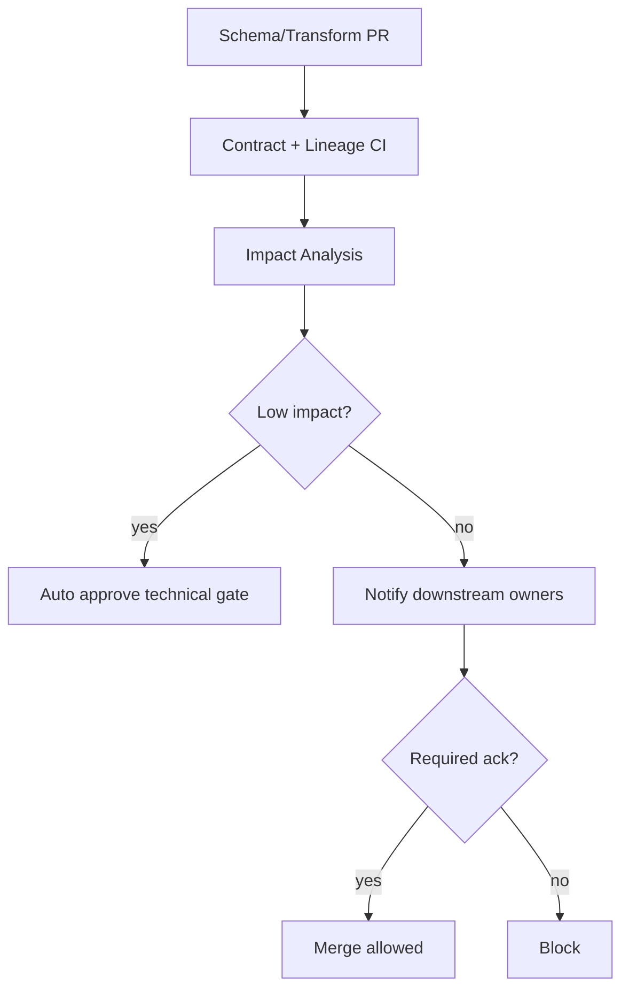

Inputs:

- changed schema,
- changed transform manifest,
- changed quality contract,
- changed privacy tag,
- changed retention policy,
- changed output asset.

Outputs:

- affected consumers,
- required migrations,
- rollout plan,
- dual-run requirement,
- backfill requirement,
- notification list.

---

## 36. Incident Workflow

When an incident happens:

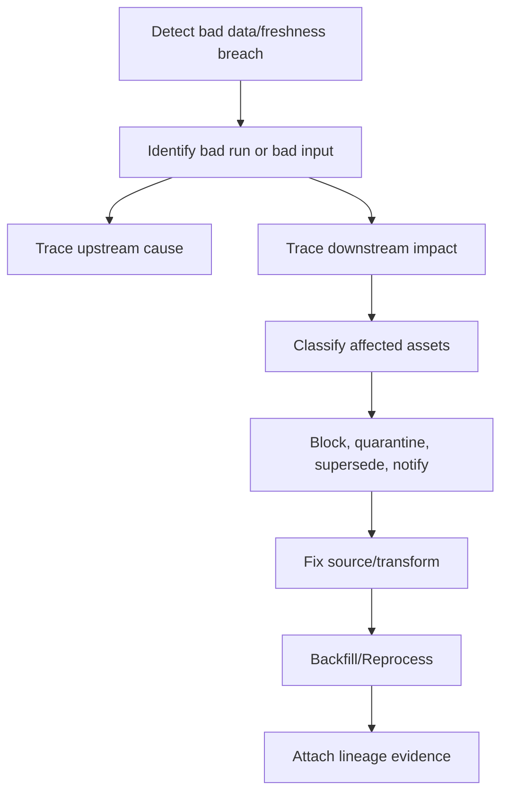

Lineage must answer quickly:

- first bad run,
- last good run,
- affected input range,
- affected output versions,
- downstream assets produced from bad output,
- external consumers notified,
- replacement/superseding runs.

If lineage cannot answer these, incident response becomes manual archaeology.

---

## 37. Supersession and Tainted Data

Wrong output is not always deleted. In regulated platforms, it is often superseded.

Model supersession:

```java
public record Supersession(
        DatasetVersion badVersion,
        DatasetVersion replacementVersion,
        String reason,
        String incidentId,
        Instant supersededAt
) {}
```

Graph:

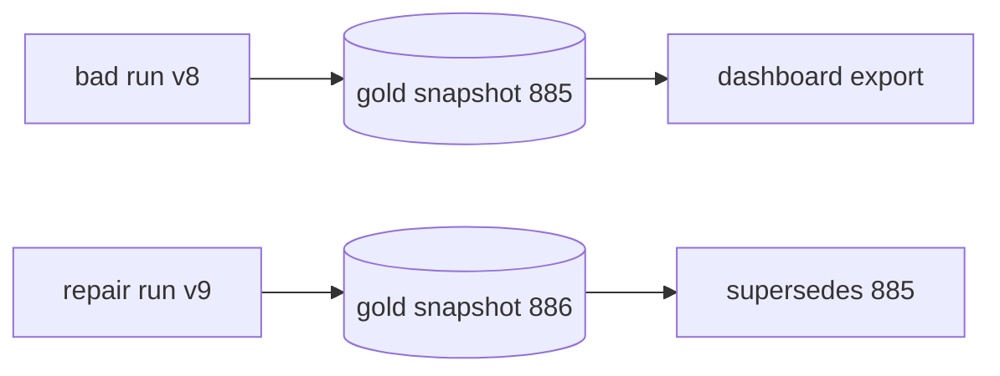

Do not pretend bad data never existed. Record:

- what was wrong,
- who saw it,
- when it was replaced,
- what replacement version should be used,
- whether external reports must be corrected.

---

## 38. Lineage Storage Architecture

A lineage platform commonly has:

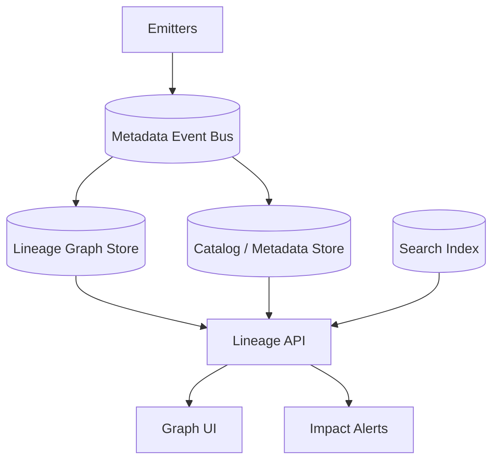

Implementation choices:

| Component | Options |
|---|---|
| Event protocol | OpenLineage, internal JSON, protobuf |
| Transport | HTTP, Kafka, queue, outbox relay |
| Store | relational DB, graph DB, document store, metadata platform |
| Query | REST/GraphQL, SQL, graph traversal API |
| UI | metadata platform UI, custom impact view |
| Governance | policy engine, approvals, tickets |

Do not over-optimize storage before defining questions and invariants.

---

## 39. Relational Lineage Store Shape

A relational store can go far.

```sql
CREATE TABLE dataset (
    dataset_id UUID PRIMARY KEY,
    namespace TEXT NOT NULL,
    name TEXT NOT NULL,
    type TEXT NOT NULL,
    owner TEXT,
    classification TEXT,
    UNIQUE(namespace, name)
);

CREATE TABLE pipeline_job (
    job_id UUID PRIMARY KEY,
    namespace TEXT NOT NULL,
    name TEXT NOT NULL,
    owner TEXT,
    service TEXT,
    UNIQUE(namespace, name)
);

CREATE TABLE pipeline_run (
    run_id TEXT PRIMARY KEY,
    job_id UUID NOT NULL REFERENCES pipeline_job(job_id),
    status TEXT NOT NULL,
    started_at TIMESTAMPTZ NOT NULL,
    finished_at TIMESTAMPTZ,
    code_version TEXT,
    config_version TEXT,
    backfill_id TEXT
);

CREATE TABLE run_input (
    run_id TEXT NOT NULL REFERENCES pipeline_run(run_id),
    dataset_id UUID NOT NULL REFERENCES dataset(dataset_id),
    version_ref TEXT,
    position JSONB,
    PRIMARY KEY(run_id, dataset_id)
);

CREATE TABLE run_output (
    run_id TEXT NOT NULL REFERENCES pipeline_run(run_id),
    dataset_id UUID NOT NULL REFERENCES dataset(dataset_id),
    version_ref TEXT,
    position JSONB,
    publication_status TEXT NOT NULL,
    PRIMARY KEY(run_id, dataset_id, version_ref)
);

CREATE TABLE dataset_edge (
    from_dataset_id UUID NOT NULL REFERENCES dataset(dataset_id),
    to_dataset_id UUID NOT NULL REFERENCES dataset(dataset_id),
    edge_type TEXT NOT NULL,
    confidence TEXT NOT NULL,
    updated_at TIMESTAMPTZ NOT NULL,
    PRIMARY KEY(from_dataset_id, to_dataset_id, edge_type)
);
```

Column lineage:

```sql
CREATE TABLE column_lineage (
    id UUID PRIMARY KEY,
    from_dataset_id UUID NOT NULL,
    from_column TEXT NOT NULL,
    to_dataset_id UUID NOT NULL,
    to_column TEXT NOT NULL,
    transform_kind TEXT NOT NULL,
    transform_version TEXT NOT NULL,
    expression_id TEXT,
    updated_at TIMESTAMPTZ NOT NULL
);
```

This is enough to build useful impact analysis without starting with a graph database.

---

## 40. Graph Traversal Queries

Downstream assets:

```sql
WITH RECURSIVE downstream(depth, from_dataset_id, to_dataset_id, path) AS (
    SELECT
        1,
        from_dataset_id,
        to_dataset_id,
        ARRAY[from_dataset_id, to_dataset_id]
    FROM dataset_edge
    WHERE from_dataset_id = :changed_dataset_id

    UNION ALL

    SELECT
        d.depth + 1,
        e.from_dataset_id,
        e.to_dataset_id,
        d.path || e.to_dataset_id
    FROM downstream d
    JOIN dataset_edge e ON e.from_dataset_id = d.to_dataset_id
    WHERE d.depth < 10
      AND NOT e.to_dataset_id = ANY(d.path)
)
SELECT * FROM downstream;
```

Column impact:

```sql
WITH RECURSIVE col_downstream AS (
    SELECT
        from_dataset_id,
        from_column,
        to_dataset_id,
        to_column,
        1 AS depth
    FROM column_lineage
    WHERE from_dataset_id = :dataset_id
      AND from_column = :column

    UNION ALL

    SELECT
        cl.from_dataset_id,
        cl.from_column,
        cl.to_dataset_id,
        cl.to_column,
        cd.depth + 1
    FROM col_downstream cd
    JOIN column_lineage cl
      ON cl.from_dataset_id = cd.to_dataset_id
     AND cl.from_column = cd.to_column
    WHERE cd.depth < 10
)
SELECT * FROM col_downstream;
```

Keep a depth limit and cycle protection.

---

## 41. Lineage API Design

Useful API endpoints:

```text
GET /assets/{id}/upstream
GET /assets/{id}/downstream
GET /assets/{id}/runs?from=&to=
GET /runs/{runId}
GET /runs/{runId}/inputs
GET /runs/{runId}/outputs
POST /impact/analyze
POST /lineage/events
POST /lineage/reconcile
GET /columns/{asset}/{column}/downstream
GET /incidents/{incidentId}/affected-assets
```

Impact request:

```json
{
  "asset": "iceberg://prod/enforcement/silver.case_event",
  "column": "accepted_at",
  "changeType": "DATA_INCORRECT",
  "effectiveWindow": {
    "from": "2026-07-01T00:00:00Z",
    "to": "2026-07-04T02:00:00Z"
  },
  "sourceSeverity": "TAINTED"
}
```

Impact response:

```json
{
  "affected": [
    {
      "asset": "iceberg://prod/enforcement/gold.case_sla_breach",
      "severity": "CRITICAL",
      "path": ["silver.case_event", "gold.case_sla_breach"],
      "reason": "uses accepted_at to compute sla_deadline and breach flag",
      "recommendedAction": "block publication and reprocess affected partitions"
    }
  ]
}
```

---

## 42. Lineage and Access Control

Lineage APIs expose sensitive architecture and data relationships.

Protect them.

Rules:

- Users should only see assets they are allowed to know exist.
- Sensitive column lineage should respect classification.
- PII paths should require elevated permission.
- Audit access to lineage for regulated assets.
- Do not leak secret names, credentials, or full URLs with tokens.
- External vendor lineage must be sanitized.

Impact analysis may need privileged computation but filtered presentation.

```text
System computes full blast radius.
User sees only assets they are authorized to view.
Privileged incident commander sees restricted paths.
```

---

## 43. Anti-Patterns

### Anti-pattern: lineage as a static diagram

Problem:

```text
Architecture diagram says A -> B -> C, but no run evidence exists.
```

Fix:

```text
Emit run-level lineage with input/output versions.
```

### Anti-pattern: table-only lineage

Problem:

```text
No downstream dashboard/API/report consumers are tracked.
```

Fix:

```text
Add consumer registry and non-table assets.
```

### Anti-pattern: ignoring failed runs

Problem:

```text
Only successful runs are recorded. Incident root cause disappears.
```

Fix:

```text
Emit START/FAIL/ABORT events with partial evidence.
```

### Anti-pattern: lineage after publication only

Problem:

```text
Lineage service outage causes permanent metadata gap.
```

Fix:

```text
Use run manifest and lineage outbox.
```

### Anti-pattern: no column-level privacy lineage

Problem:

```text
Sensitive data is copied/derived downstream without visibility.
```

Fix:

```text
Track column lineage and privacy operations.
```

### Anti-pattern: trusting inference blindly

Problem:

```text
SQL parser misses UDF/API/dynamic transformation.
```

Fix:

```text
Combine automatic capture with versioned manual declarations.
```

---

## 44. Production Checklist

Before calling lineage production-grade, verify:

- [ ] Every certified asset has owner, classification, and SLO.
- [ ] Every published asset version has producing run.
- [ ] Every run records code version and config version.
- [ ] Every run records input datasets and output datasets.
- [ ] Kafka pipelines record topic and offset ranges or logical intervals.
- [ ] CDC pipelines record source table and log position/snapshot state.
- [ ] Lakehouse pipelines record input/output snapshot IDs.
- [ ] Backfill runs link to backfill campaign ID.
- [ ] Failed runs emit failure lineage.
- [ ] Lineage emission is retried or recoverable through outbox/manifest.
- [ ] Column-level lineage exists for critical and sensitive assets.
- [ ] Privacy lineage tracks copy/mask/hash/tokenize/drop/derive.
- [ ] Consumer registry includes dashboards, reports, APIs, exports, ML features.
- [ ] Impact analysis can traverse downstream and upstream.
- [ ] Schema changes run impact analysis in CI.
- [ ] Data incidents can identify affected output versions.
- [ ] Supersession is modeled for wrong outputs.
- [ ] Access to lineage is permissioned and audited.
- [ ] Lineage quality checks run regularly.

---

## 45. Mental Model Recap

Lineage is not:

```text
a diagram generated by a catalog tool
```

Lineage is:

```text
a queryable evidence graph of dataset production, transformation, ownership, quality, code version, runtime execution, and downstream usage
```

Impact analysis is not:

```text
manually asking five teams who might be affected
```

Impact analysis is:

```text
policy-driven traversal of the evidence graph to determine blast radius, severity, and required action
```

The engineering invariant:

```text
No important data output should be published without enough lineage to explain how it was produced and who may be affected if it is wrong.
```

---

## 46. Further Reading

Use these as factual anchors, not as substitutes for internal design:

- OpenLineage specification and facets: `https://openlineage.io/docs/spec/`
- OpenLineage facets: `https://openlineage.io/docs/spec/facets/`
- Airflow OpenLineage provider: `https://airflow.apache.org/docs/apache-airflow-providers-openlineage/stable/index.html`
- OpenMetadata lineage guides: `https://docs.open-metadata.org/`
- Apache Iceberg metadata and snapshots: `https://iceberg.apache.org/spec/`
- OpenTelemetry: `https://opentelemetry.io/docs/`

---

# End of Part 067
