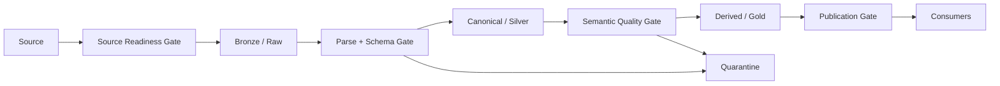
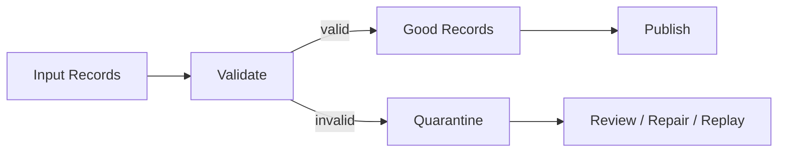
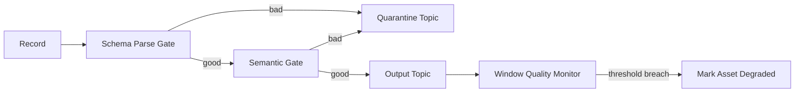
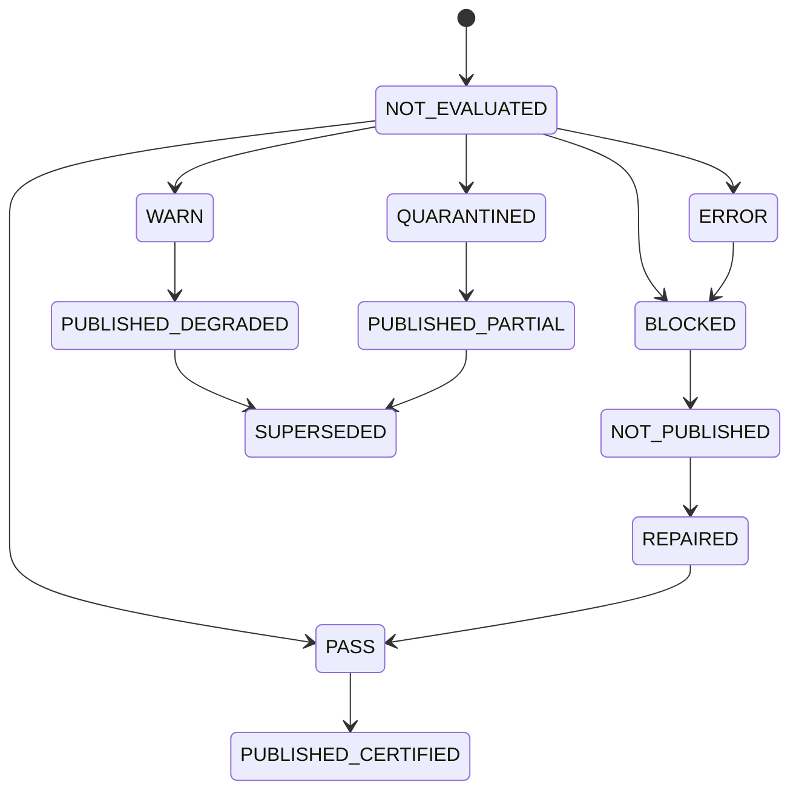
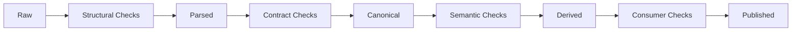
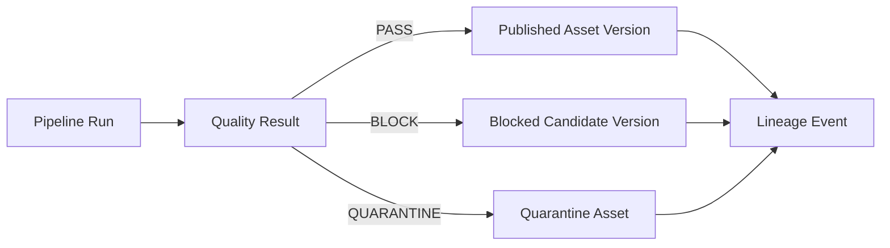

# Part 068 — Data Quality Gates

A data quality check tells you whether data looks wrong.

A data quality gate decides what the platform is allowed to do next.

That distinction matters.

A junior pipeline often has checks like this:

```text
run SQL query
print failed count
send Slack alert
continue publishing anyway
```

A production pipeline needs gates like this:

```text
Validate source completeness.
If critical source completeness fails, block publish.
If non-critical optional field drift occurs, warn and continue.
If record-level validity fails below threshold, quarantine bad records and continue.
If privacy rule fails, fail closed.
Attach quality result to run manifest and lineage.
Propagate degraded status to downstream consumers.
```

Data quality gates are control decisions over data state.

They are not decorative assertions.

---

## 1. The Core Mental Model

A quality gate has five components:

```text
scope + rule + measurement + threshold + action
```

Example:

```text
scope       = silver.case_event partition event_date=2026-07-04
rule        = case_id must be unique
measurement = duplicate case_id count
threshold   = 0 duplicates
action      = block publication
```

Another example:

```text
scope       = bronze.vendor_case_import file batch vendor-a-20260704
rule        = optional field middle_name may be null
measurement = null percentage
threshold   = <= 90%
action      = warn if exceeded, do not block
```

Quality gate output must be machine-readable:

```text
PASS
WARN
QUARANTINE
BLOCK
FAIL_CLOSED
```

---

## 2. Quality Checks vs Quality Gates

| Concept | Purpose | Example |
|---|---|---|
| Check | Measures a condition | `case_id is not null` |
| Expectation | Declares desired property | `status in allowed set` |
| Rule | Business/data invariant | `closed case must have closed_at` |
| Suite | Group of checks | `silver.case_event required checks` |
| Gate | Makes control decision | block publish if critical failures exist |
| Policy | Maps failure to action | privacy failure -> fail closed |
| Result | Evidence of execution | 2 failures, 31 rejected records |
| Quarantine | Isolate invalid data | write rejected rows to quarantine table |

Checks without gates create noise.

Gates without evidence create distrust.

A serious pipeline needs both.

---

## 3. Where Gates Exist in a Pipeline

Quality gates are not only at the end.



Common gate points:

| Gate Point | Purpose |
|---|---|
| Source readiness gate | avoid processing incomplete source |
| File integrity gate | detect partial/corrupt file |
| Schema gate | reject incompatible structure |
| Parse gate | isolate malformed records |
| Contract gate | enforce producer/consumer contract |
| Semantic gate | enforce business invariants |
| Join/enrichment gate | detect missing reference data |
| Reconciliation gate | compare source vs target counts/balances |
| Privacy gate | block unmasked sensitive data |
| Publication gate | decide whether asset becomes certified/current |
| Backfill gate | prevent bad historical rewrite |

Do not push every rule into one final gate. Late detection increases blast radius.

---

## 4. Gate Action Taxonomy

A gate must choose an action.

| Action | Meaning | Example |
|---|---|---|
| PASS | continue normally | all critical checks pass |
| WARN | continue but mark degraded | distribution drift above warning threshold |
| QUARANTINE_RECORDS | isolate bad records, continue good records | 0.02% malformed rows |
| QUARANTINE_BATCH | isolate entire input batch | source manifest incomplete |
| BLOCK_PUBLICATION | do not publish output | uniqueness failure in gold table |
| FAIL_CLOSED | stop and require human approval | privacy leak detected |
| SUPERSEDE | replace previous output with corrected version | repair run after bad output |
| DEGRADE_CONSUMER | mark downstream asset/API/dashboard degraded | freshness SLO breach |

The action must be explicit in the quality policy. Engineers should not decide manually during incidents unless policy is missing.

---

## 5. Severity Is Not the Same as Action

Severity describes the problem. Action describes what to do.

| Severity | Meaning |
|---|---|
| INFO | informational signal |
| LOW | minor issue, no immediate consumer risk |
| MEDIUM | potential consumer degradation |
| HIGH | likely wrong or incomplete output |
| CRITICAL | regulatory/security/customer-impacting risk |

Example mapping:

| Rule | Severity | Action |
|---|---|---|
| Optional description null rate increased | LOW | WARN |
| Case ID missing | HIGH | QUARANTINE_RECORDS or BLOCK |
| Duplicate case ID in current projection | HIGH | BLOCK_PUBLICATION |
| Unmasked national ID in gold table | CRITICAL | FAIL_CLOSED |
| Source file missing trailer | HIGH | QUARANTINE_BATCH |
| Row count changed by 2% | MEDIUM | WARN |
| Row count changed by 80% | HIGH | BLOCK_PUBLICATION |

Do not hardcode severity == action. Use policy.

---

## 6. Quality Rule Categories

### Structural rules

```text
schema exists
required columns exist
type is compatible
field can be parsed
record envelope has required metadata
```

### Completeness rules

```text
row count above lower bound
all expected partitions arrived
mandatory fields non-null
all expected source files present
all expected tenants processed
```

### Validity rules

```text
status in allowed set
date not in impossible range
amount non-negative
email format valid
country code known
```

### Uniqueness rules

```text
case_id unique in current projection
event_id unique within dedupe horizon
natural key unique per effective time
```

### Consistency rules

```text
closed case has closed_at
closed_at >= opened_at
breach flag agrees with SLA deadline
case status transition is legal
```

### Referential rules

```text
case.policy_id exists in policy reference table
case.assignee_id exists in user dimension
court_id exists in reference.court
```

### Freshness rules

```text
latest event time within 15 minutes
source watermark not older than threshold
asset published by deadline
```

### Distribution/drift rules

```text
status distribution within expected range
null rate did not spike
vendor volume within historical band
priority mix not impossible
```

### Reconciliation rules

```text
source count equals target count after filters
financial balance matches source ledger
checksums match for imported file
accepted + rejected = input
```

### Privacy/security rules

```text
PII fields masked in gold layer
restricted fields absent from external export
tenant ID is preserved and enforced
classification tag exists
```

---

## 7. Quality Gate Design Principle

The strongest rule:

```text
A data quality gate must protect consumer trust without destroying pipeline operability.
```

Too weak:

```text
always publish and alert
```

Result: bad data leaks.

Too strict:

```text
block entire pipeline for every minor anomaly
```

Result: platform becomes brittle.

Better:

```text
critical invariant failure blocks publication
record-level defects are quarantined when safe
statistical anomalies warn unless known consumer risk
privacy failures fail closed
reconciliation failures block certified outputs
```

Quality gate engineering is policy design, not just validation code.

---

## 8. Java Quality Model

Start with stable types.

```java
public record QualityScope(
        DatasetRef dataset,
        Optional<PartitionRef> partition,
        Optional<String> runId,
        Optional<String> backfillId
) {}

public record QualityRule(
        String ruleId,
        String version,
        String description,
        QualityDimension dimension,
        QualitySeverity severity,
        GatePolicy policy
) {}

public enum QualityDimension {
    STRUCTURE,
    COMPLETENESS,
    VALIDITY,
    UNIQUENESS,
    CONSISTENCY,
    REFERENTIAL_INTEGRITY,
    FRESHNESS,
    DISTRIBUTION,
    RECONCILIATION,
    PRIVACY,
    SECURITY
}

public enum QualitySeverity {
    INFO,
    LOW,
    MEDIUM,
    HIGH,
    CRITICAL
}

public enum GateAction {
    PASS,
    WARN,
    QUARANTINE_RECORDS,
    QUARANTINE_BATCH,
    BLOCK_PUBLICATION,
    FAIL_CLOSED,
    DEGRADE_CONSUMER
}
```

Result:

```java
public record QualityCheckResult(
        QualityRule rule,
        QualityScope scope,
        CheckStatus status,
        long checkedCount,
        long failedCount,
        Optional<Double> observedValue,
        Optional<Double> threshold,
        List<BadRecordRef> sampleFailures,
        Instant evaluatedAt
) {}

public enum CheckStatus {
    PASS,
    FAIL,
    ERROR,
    SKIPPED
}

public record QualityGateDecision(
        QualityScope scope,
        GateAction action,
        QualitySeverity maxSeverity,
        List<QualityCheckResult> results,
        String explanation
) {}
```

A quality system should produce a decision object, not just throw exceptions.

---

## 9. Quality Evaluator Interface

```java
public interface QualityCheck<T> {
    QualityRule rule();
    QualityCheckResult evaluate(QualityScope scope, T data) throws Exception;
}

public interface QualityGatePolicy {
    QualityGateDecision decide(QualityScope scope, List<QualityCheckResult> results);
}

public final class QualityGate<T> {
    private final List<QualityCheck<T>> checks;
    private final QualityGatePolicy policy;

    public QualityGate(List<QualityCheck<T>> checks, QualityGatePolicy policy) {
        this.checks = List.copyOf(checks);
        this.policy = policy;
    }

    public QualityGateDecision evaluate(QualityScope scope, T data) {
        var results = new ArrayList<QualityCheckResult>();

        for (QualityCheck<T> check : checks) {
            try {
                results.add(check.evaluate(scope, data));
            } catch (Exception e) {
                results.add(QualityResults.error(check.rule(), scope, e));
            }
        }

        return policy.decide(scope, results);
    }
}
```

The policy decides whether a check error blocks the pipeline.

For example, if the check engine fails:

- fail closed for regulatory export,
- warn for exploratory dataset,
- block publish if data cannot be certified,
- retry if external reference check timed out.

---

## 10. Policy Evaluation

Example policy:

```java
public final class DefaultQualityGatePolicy implements QualityGatePolicy {
    @Override
    public QualityGateDecision decide(QualityScope scope, List<QualityCheckResult> results) {
        boolean privacyFailed = results.stream().anyMatch(r ->
            r.status() == CheckStatus.FAIL
                && r.rule().dimension() == QualityDimension.PRIVACY);

        if (privacyFailed) {
            return decision(scope, GateAction.FAIL_CLOSED, results,
                "Privacy rule failed; fail closed.");
        }

        boolean criticalFailed = results.stream().anyMatch(r ->
            r.status() == CheckStatus.FAIL
                && r.rule().severity() == QualitySeverity.CRITICAL);

        if (criticalFailed) {
            return decision(scope, GateAction.BLOCK_PUBLICATION, results,
                "Critical quality rule failed.");
        }

        boolean quarantineable = results.stream().anyMatch(r ->
            r.status() == CheckStatus.FAIL
                && r.rule().policy().supportsRecordQuarantine());

        if (quarantineable) {
            return decision(scope, GateAction.QUARANTINE_RECORDS, results,
                "Record-level failures can be isolated.");
        }

        boolean warning = results.stream().anyMatch(r -> r.status() == CheckStatus.FAIL);

        if (warning) {
            return decision(scope, GateAction.WARN, results,
                "Non-blocking quality failures detected.");
        }

        return decision(scope, GateAction.PASS, results, "All checks passed.");
    }
}
```

This is intentionally simple. Production policy often uses asset criticality, consumer criticality, historical behavior, and backfill mode.

---

## 11. Record-Level Quarantine

Quarantine is not a trash bin. It is a controlled lane for invalid data.



Quarantine record should contain:

```java
public record QuarantineRecord(
        String quarantineId,
        String sourceRunId,
        DatasetRef sourceDataset,
        Optional<String> sourcePosition,
        String recordKey,
        Optional<String> eventId,
        String ruleId,
        String ruleVersion,
        QualitySeverity severity,
        String reasonCode,
        String reasonMessage,
        String payloadRef,
        String payloadHash,
        Instant quarantinedAt
) {}
```

Do not always store raw payload inline. For sensitive data, store encrypted payload references or masked payload.

---

## 12. Quarantine Safety Rules

You can quarantine records and continue only when:

- bad records are independent,
- downstream output can represent partial acceptance,
- completeness impact is within threshold,
- no aggregate correctness is silently corrupted,
- consumer contract allows partial data,
- rejected count is visible and auditable,
- replay/repair path exists.

You should block the batch when:

- file manifest is incomplete,
- schema is incompatible,
- primary key generation is broken,
- reference table is missing,
- high percentage of records are invalid,
- privacy/security invariant fails,
- aggregate output would be misleading,
- rejected records cannot be safely separated.

Quarantine is a scalpel, not a blanket excuse to publish bad data.

---

## 13. Batch Gate Example

A batch publication gate:

```java
public final class BatchPublicationGate {
    private final QualityGate<TableBatch> qualityGate;
    private final Publisher publisher;
    private final QuarantineWriter quarantineWriter;

    public PublicationResult publishIfAllowed(QualityScope scope, TableBatch batch) {
        QualityGateDecision decision = qualityGate.evaluate(scope, batch);

        return switch (decision.action()) {
            case PASS -> publisher.publish(batch, decision);
            case WARN -> publisher.publishDegraded(batch, decision);
            case QUARANTINE_RECORDS -> {
                var split = batch.splitByValidity(decision.results());
                quarantineWriter.write(split.invalidRecords(), decision);
                yield publisher.publish(split.validRecords(), decision);
            }
            case QUARANTINE_BATCH -> {
                quarantineWriter.writeBatch(batch, decision);
                yield PublicationResult.notPublished(decision);
            }
            case BLOCK_PUBLICATION, FAIL_CLOSED -> PublicationResult.blocked(decision);
            case DEGRADE_CONSUMER -> publisher.markDegraded(batch, decision);
        };
    }
}
```

Every path records the quality decision.

---

## 14. Streaming Gate Example

Streaming quality gates cannot block forever.

They need local decisions and aggregate windows.



Per-record gates:

- schema parse,
- required key,
- event timestamp valid,
- enum value allowed,
- tenant present,
- PII not in forbidden field.

Window-level gates:

- error rate,
- duplicate rate,
- source lag,
- watermark delay,
- distribution drift,
- output volume anomaly.

Streaming publication is continuous, so actions include:

- route bad record to DLQ/quarantine,
- pause source partition,
- mark asset degraded,
- trip circuit breaker,
- fail job for critical invariant,
- alert owner.

---

## 15. Gate State Machine



This state should appear in asset/run metadata.

Consumers should know whether they are reading:

```text
certified data
degraded data
partial data
uncertified data
superseded data
```

---

## 16. Publication Gate

The publication gate is the final guard before an asset becomes current/certified.

It should check:

- all required upstream assets are available,
- input versions are known,
- transform version is approved,
- schema is compatible,
- critical quality rules pass,
- reconciliation passes,
- lineage manifest exists,
- sensitive fields are classified,
- access policy exists,
- output was written to staging,
- output row count and partition count are plausible,
- backfill/rewrite is authorized.

Publication gate output:

```json
{
  "asset": "gold.case_sla_breach",
  "candidateVersion": "iceberg-snapshot-885",
  "decision": "PUBLISHED_CERTIFIED",
  "qualityStatus": "PASS",
  "lineageStatus": "COMPLETE",
  "reconciliationStatus": "PASS",
  "decidedAt": "2026-07-04T02:08:31Z"
}
```

Do not let a job write directly to the public/current location without passing the publication gate.

---

## 17. Progressive Validation

Validate progressively as data gains trust.



Layer-specific gates:

| Layer | Gate Focus |
|---|---|
| Raw/Bronze | arrival, integrity, parseability, preservation |
| Parsed | schema, type, required metadata |
| Canonical/Silver | domain invariants, identity, time semantics, dedupe |
| Derived/Gold | aggregation correctness, business rules, consumer contract |
| Export | privacy, authorization, row-level policy, external contract |

Each layer should reduce uncertainty.

---

## 18. Reconciliation Gates

Reconciliation gates compare independent views of the same data.

Examples:

```text
input rows = accepted rows + rejected rows
source count = bronze count for file batch
CDC event count = applied mutations + ignored no-op mutations
case ledger balance = sum(case movements)
source vendor total = imported total
```

Reconciliation check model:

```java
public record ReconciliationCheck(
        String checkId,
        DatasetRef leftDataset,
        DatasetRef rightDataset,
        String measurement,
        Tolerance tolerance
) {}

public record Tolerance(
        double absolute,
        double percentage
) {}
```

Example decision:

```text
source_count=1,000,000
target_count=999,996
rejected_count=4
accepted + rejected = 1,000,000
=> PASS
```

Another:

```text
source_count=1,000,000
target_count=945,000
rejected_count=10
missing=54,990
=> BLOCK_PUBLICATION
```

Reconciliation is often more important than sophisticated statistical checks.

---

## 19. Freshness Gates

Freshness is a quality dimension.

Freshness gate examples:

```text
latest_event_time >= now - 15 minutes
latest_source_commit_time >= now - 10 minutes
asset_published_at <= expected_deadline
watermark >= now - 30 minutes
```

Freshness result:

```java
public record FreshnessMeasurement(
        Instant observedTime,
        Duration maxAllowedDelay,
        Duration actualDelay
) {}
```

Action policy:

| Asset | Freshness Breach | Action |
|---|---|---|
| internal exploration | warn | WARN |
| daily dashboard | past deadline | DEGRADE_CONSUMER |
| real-time risk API | > 15 min | BLOCK dependent publication / alert |
| regulatory report | deadline miss | incident |

Freshness gates must use the correct time:

- event time,
- source commit time,
- ingestion time,
- publication time,
- business effective time.

Do not use processing time as a proxy without thinking.

---

## 20. Schema Gates

Schema gate answers:

```text
Can this data be safely parsed and interpreted by downstream consumers?
```

It should check:

- schema ID exists,
- schema compatibility mode passes,
- required fields exist,
- field type is compatible,
- enum changes are allowed,
- removed fields are not used by consumers,
- semantic version transition is approved,
- unknown fields handling is clear,
- default values are safe,
- schema registry and contract registry agree.

Schema gate action:

| Situation | Action |
|---|---|
| compatible additive nullable field | PASS/WARN |
| required field removed | BLOCK |
| type changed string -> int | BLOCK unless explicitly migrated |
| enum value added | WARN or BLOCK depending consumer exhaustiveness |
| schema registry unavailable | policy-dependent |
| schema ID missing | BLOCK |

Do not confuse “can deserialize” with “semantically compatible”.

---

## 21. Semantic Gates

Semantic gates encode domain truth.

For enforcement lifecycle:

```text
case cannot be CLOSED before OPENED
case cannot move from CLOSED to UNDER_REVIEW without REOPEN event
sla_deadline must be calculated from accepted_at using policy active at accepted_at
breach event must not be emitted before sla_deadline
assigned officer must belong to active enforcement unit at assignment time
```

These rules are not generic data quality. They are domain invariants.

Example:

```java
public final class CaseStatusTransitionCheck implements QualityCheck<List<CaseEvent>> {
    @Override
    public QualityRule rule() {
        return Rules.caseStatusTransitionV1();
    }

    @Override
    public QualityCheckResult evaluate(QualityScope scope, List<CaseEvent> events) {
        long failures = events.stream()
            .filter(e -> !StatusTransitions.isLegal(e.previousStatus(), e.newStatus()))
            .count();

        return failures == 0
            ? QualityResults.pass(rule(), scope, events.size())
            : QualityResults.fail(rule(), scope, events.size(), failures);
    }
}
```

Domain gates are where software engineering and data engineering meet.

---

## 22. Temporal Gates

Temporal correctness requires dedicated checks.

Rules:

```text
event_time is present
event_time is not too far in the future
event_time is not before source system existence
effective_time is valid for business rule
recorded_time >= event_time for normal events
watermark progress is within SLO
late event rate is within threshold
```

Temporal check example:

```java
public final class EventTimeBoundsCheck implements QualityCheck<List<Envelope<?>>> {
    private final Clock clock;
    private final Duration allowedFutureSkew;
    private final Instant minimumBusinessDate;

    @Override
    public QualityCheckResult evaluate(QualityScope scope, List<Envelope<?>> records) {
        Instant now = clock.instant();
        long failures = records.stream().filter(r -> {
            Instant eventTime = r.eventTime();
            return eventTime.isAfter(now.plus(allowedFutureSkew))
                || eventTime.isBefore(minimumBusinessDate);
        }).count();

        return QualityResults.fromFailureCount(rule(), scope, records.size(), failures);
    }
}
```

Temporal gates protect windowing, backfill, bitemporal reporting, and SLA detection.

---

## 23. Join and Enrichment Gates

Enrichment can silently corrupt data.

Rules:

```text
reference table version is known
lookup hit rate above threshold
missing reference keys quarantined or defaulted explicitly
temporal join uses reference version valid at event time
broadcast/reference data not stale
```

Example:

| Enrichment Failure | Risk | Action |
|---|---|---|
| 0.01% optional country lookup missing | low | WARN |
| 30% policy lookup missing | high | BLOCK |
| reference snapshot unknown | high | BLOCK |
| stale risk policy | critical | FAIL_CLOSED for regulated decision |

Never silently default important reference data.

Bad:

```java
String policy = policyMap.getOrDefault(policyId, "STANDARD");
```

Better:

```java
Optional<Policy> policy = policyRepository.find(policyId, eventTime);
if (policy.isEmpty()) {
    return ValidationResult.reject("MISSING_POLICY_REFERENCE");
}
```

---

## 24. Distribution and Drift Gates

Distribution gates detect unexpected shape changes.

Examples:

```text
case volume by vendor not below historical p5
priority distribution not shifted beyond threshold
null rate of accepted_at not above 0.1%
rejected record rate not above 0.5%
unknown enum value rate not above 0
```

Use with care.

Distribution checks are not proof of correctness. They are anomaly signals.

Action policy:

- warn for statistical anomaly,
- block only when anomaly violates known consumer contract,
- require human review for suspicious but not structurally invalid data,
- suppress or adjust during known business events/backfill/migration.

False positives destroy trust in gates.

False negatives allow silent corruption.

Design thresholds with historical context and owner review.

---

## 25. Privacy Gates

Privacy gates should be fail-closed.

Rules:

```text
restricted PII must not appear in gold public table
external export must not contain direct identifiers
hashed identifiers must use approved salt/key policy
masking transform version must be approved
classification tags must exist for all fields
row-level tenant filter must be enforced
```

Example:

```java
public final class RestrictedFieldExportCheck implements QualityCheck<SchemaContract> {
    @Override
    public QualityCheckResult evaluate(QualityScope scope, SchemaContract contract) {
        long restrictedFields = contract.fields().stream()
            .filter(f -> f.classification() == Sensitivity.RESTRICTED_PII)
            .filter(f -> contract.destination() == Destination.EXTERNAL_VENDOR)
            .count();

        return restrictedFields == 0
            ? QualityResults.pass(rule(), scope, contract.fields().size())
            : QualityResults.fail(rule(), scope, contract.fields().size(), restrictedFields);
    }
}
```

Privacy gate failures should not be downgraded to warnings without formal exception.

---

## 26. Gate Evidence

Every gate decision should be stored.

Quality result event:

```json
{
  "runId": "gold-sla-breach/20260704T0200",
  "asset": "gold.case_sla_breach",
  "scope": {"partition": {"report_date": "2026-07-04"}},
  "suiteId": "gold-case-sla-breach-publication",
  "suiteVersion": "3.1.0",
  "decision": "PASS",
  "evaluatedAt": "2026-07-04T02:08:00Z",
  "checks": [
    {
      "ruleId": "case_id_not_null",
      "status": "PASS",
      "checkedCount": 9904,
      "failedCount": 0
    },
    {
      "ruleId": "breach_flag_consistent",
      "status": "PASS",
      "checkedCount": 9904,
      "failedCount": 0
    }
  ]
}
```

Attach this to:

- run manifest,
- lineage event,
- asset version metadata,
- observability metrics,
- audit evidence store,
- incident records.

A gate decision without evidence is hard to trust.

---

## 27. Metrics From Gates

Gate outputs should produce metrics:

```text
quality_check_total{rule_id,status,asset}
quality_failed_records_total{rule_id,asset}
quality_gate_decision_total{decision,asset}
quality_gate_duration_seconds{suite_id,asset}
quarantine_records_total{reason_code,asset}
publication_block_total{asset,reason_code}
certified_asset_age_seconds{asset}
```

Do not label metrics with high-cardinality values like record ID, full exception message, or file path.

Use logs/events for high-cardinality detail.

---

## 28. Quality Gate and Lineage Integration

Quality gates should affect lineage.



Lineage should show:

- input asset,
- candidate output asset,
- quality result,
- final publication action,
- quarantine output if any,
- downstream degraded status.

Quality failure is lineage-relevant. It changes the graph of trustworthy data.

---

## 29. Quality Gates and Impact Analysis

A failed gate should trigger impact analysis.

Examples:

```text
silver.case_event quality failed for event_date=2026-07-04
-> gold.case_sla_breach depends on this partition
-> regulatory dashboard is degraded
-> case-risk-api has critical freshness risk
```

Gate decision can emit an impact event:

```json
{
  "type": "QUALITY_GATE_BLOCKED",
  "asset": "silver.case_event",
  "partition": {"event_date": "2026-07-04"},
  "failedRules": ["case_id_unique"],
  "recommendedImpactAnalysis": true
}
```

Then the control plane can:

- block dependent jobs,
- mark downstream assets stale/degraded,
- notify owners,
- create incident,
- schedule reprocessing after repair.

---

## 30. Gate Configuration as Code

Quality gates should be versioned.

Example YAML:

```yaml
suiteId: silver-case-event-core
version: 2.4.0
asset: iceberg://prod/enforcement/silver.case_event
owner: enforcement-data-platform
rules:
  - id: case_id_not_null
    dimension: COMPLETENESS
    severity: HIGH
    expression: case_id IS NOT NULL
    actionOnFail: QUARANTINE_RECORDS
  - id: event_id_unique
    dimension: UNIQUENESS
    severity: HIGH
    expression: event_id UNIQUE WITHIN partition
    actionOnFail: BLOCK_PUBLICATION
  - id: status_allowed
    dimension: VALIDITY
    severity: HIGH
    allowedValues: [OPENED, ACCEPTED, ASSIGNED, CLOSED, REOPENED]
    actionOnFail: QUARANTINE_RECORDS
  - id: restricted_pii_absent
    dimension: PRIVACY
    severity: CRITICAL
    actionOnFail: FAIL_CLOSED
```

Rules should go through review like code.

Changing a gate can be as dangerous as changing the transform.

---

## 31. Gate Versioning

A quality result must know which rules were used.

```text
asset version 885 passed suite silver-case-event-core:2.4.0
asset version 886 passed suite silver-case-event-core:2.5.0
```

This matters for:

- audit,
- reproducibility,
- comparing historical quality,
- avoiding false regression,
- backfill consistency,
- proving what was certified at the time.

Do not overwrite quality rules without version history.

---

## 32. CI Gates vs Runtime Gates

| Gate Type | Runs When | Protects Against |
|---|---|---|
| CI schema gate | pull request | incompatible schema changes |
| CI contract gate | pull request | producer/consumer assumption break |
| CI golden dataset gate | pull request | transform behavior regression |
| Runtime source gate | job start | missing/incomplete input |
| Runtime quality gate | during run | invalid records/data anomalies |
| Runtime publication gate | before publish | bad asset becoming current |
| Post-publication monitor | after publish | delayed anomaly detection |

You need both CI and runtime gates.

CI cannot detect bad production data.

Runtime cannot replace code review and compatibility checks.

---

## 33. Golden Dataset Quality Gate

Golden datasets prevent accidental behavior changes.

```text
input fixture + expected output + expected quality result
```

Example:

```java
@Test
void breachDetectorShouldRejectImpossibleClosedCase() {
    var input = GoldenDatasets.loadCaseEvents("closed_before_opened.jsonl");
    var output = breachDetector.transform(input);
    var decision = qualityGate.evaluate(scope, output);

    assertThat(decision.action()).isEqualTo(GateAction.QUARANTINE_RECORDS);
    assertThat(decision.results())
        .anyMatch(r -> r.rule().ruleId().equals("case_status_transition_legal")
            && r.failedCount() == 1);
}
```

Golden tests should include:

- normal data,
- malformed data,
- boundary time data,
- duplicate data,
- late correction,
- missing reference,
- privacy leak,
- schema evolution case,
- backfill case.

---

## 34. Great Expectations, Deequ, Soda, and Custom Java

Tools can help, but they do not remove design responsibility.

| Tool/Approach | Strength | Caveat |
|---|---|---|
| Great Expectations / GX | expressive expectations, validation workflows, docs | Python-centered ecosystem; integrate evidence with Java platform |
| Deequ | Spark-scale data quality checks, metrics/analyzers | Scala/Spark ecosystem; good for large batch datasets |
| Soda Core | YAML checks/contracts and scans | external tool integration and governance needed |
| Custom Java checks | deep domain logic, service integration | must avoid reinventing full quality platform badly |
| SQL checks | simple and portable | weak for complex domain/record logic |

For Java-heavy platforms, a practical design is:

```text
Java pipeline emits run manifest and candidate dataset.
Spark/SQL/GX/Deequ/Soda/custom validators evaluate checks.
Control plane normalizes results into one QualityGateDecision model.
Publication gate uses normalized decision.
```

Do not let each tool invent a different quality result schema.

---

## 35. Normalized Quality Result Schema

Even if checks come from multiple tools, normalize results.

```java
public record NormalizedQualityResult(
        String tool,
        String toolVersion,
        String suiteId,
        String suiteVersion,
        String ruleId,
        QualityDimension dimension,
        QualitySeverity severity,
        CheckStatus status,
        long checkedCount,
        long failedCount,
        Map<String, Object> measurements,
        List<BadRecordRef> examples
) {}
```

Adapters:

```text
GX result      -> NormalizedQualityResult
Deequ result   -> NormalizedQualityResult
SQL result     -> NormalizedQualityResult
Java result    -> NormalizedQualityResult
Soda scan      -> NormalizedQualityResult
```

This keeps the control plane independent from validation tooling.

---

## 36. Data Quality Result Store

Store quality results separately from logs.

Basic tables:

```sql
CREATE TABLE quality_suite (
    suite_id TEXT NOT NULL,
    suite_version TEXT NOT NULL,
    asset_namespace TEXT NOT NULL,
    asset_name TEXT NOT NULL,
    owner TEXT NOT NULL,
    created_at TIMESTAMPTZ NOT NULL,
    PRIMARY KEY (suite_id, suite_version)
);

CREATE TABLE quality_gate_result (
    gate_result_id UUID PRIMARY KEY,
    run_id TEXT NOT NULL,
    asset_namespace TEXT NOT NULL,
    asset_name TEXT NOT NULL,
    asset_version TEXT,
    suite_id TEXT NOT NULL,
    suite_version TEXT NOT NULL,
    decision TEXT NOT NULL,
    max_severity TEXT NOT NULL,
    evaluated_at TIMESTAMPTZ NOT NULL,
    payload JSONB NOT NULL
);

CREATE TABLE quality_check_result (
    gate_result_id UUID NOT NULL REFERENCES quality_gate_result(gate_result_id),
    rule_id TEXT NOT NULL,
    rule_version TEXT NOT NULL,
    dimension TEXT NOT NULL,
    severity TEXT NOT NULL,
    status TEXT NOT NULL,
    checked_count BIGINT,
    failed_count BIGINT,
    observed_value DOUBLE PRECISION,
    threshold_value DOUBLE PRECISION,
    PRIMARY KEY (gate_result_id, rule_id, rule_version)
);
```

This supports audit and trend analysis.

---

## 37. Bad Record Sampling

For high-volume pipelines, do not store every bad record inline.

Store:

- count,
- reason code,
- sample records,
- payload references,
- hash/fingerprint,
- partition/source position,
- replay instructions.

Sampling strategy:

```text
store first N per reason code
store random sample per partition
store all critical privacy failures in secure quarantine
store aggregate counts for high-volume repeated failures
```

Bad record examples should be sanitized by default.

---

## 38. Handling Check Engine Failure

A quality check can fail because the data is bad or because the checker broke.

Separate:

```text
CHECK_FAIL = data violates rule
CHECK_ERROR = rule could not be evaluated
```

Policy examples:

| Check Error Scenario | Action |
|---|---|
| optional distribution checker timeout | WARN |
| schema registry unavailable | BLOCK if schema unknown |
| privacy scanner unavailable | FAIL_CLOSED |
| reference DB timeout | retry then BLOCK/DEGRADE depending asset |
| quality service unavailable for experimental asset | WARN |
| quality service unavailable for regulatory report | BLOCK |

Do not convert check errors into passes.

---

## 39. Backfill Quality Gates

Backfill has special risk.

Backfill gates should check:

- backfill campaign is approved,
- transform version is pinned,
- input snapshot/window is declared,
- output mutation mode is explicit,
- expected affected partitions are known,
- quality thresholds are adjusted intentionally if historical data differs,
- comparison against current output is available,
- downstream notification is prepared,
- rollback/supersession plan exists.

Backfill decision:

```json
{
  "backfillId": "BF-20260704-SLA-RECALC",
  "asset": "gold.case_sla_breach",
  "partitions": ["2026-01-01..2026-06-30"],
  "decision": "BLOCK_PUBLICATION",
  "reason": "recomputed breach_count differs by 18% without approved correction manifest"
}
```

Backfill gates should be stricter than normal daily runs.

---

## 40. Thresholds and Tolerances

Thresholds are dangerous when arbitrary.

Bad:

```text
row count must not change by more than 10%
```

Why 10%?

Better:

```text
For vendor-a daily case file:
- warn if count below trailing 28-day p5 unless known holiday
- block if count below 50% of expected manifest count
- block if accepted + rejected != manifest declared count
```

Threshold types:

| Type | Use |
|---|---|
| absolute | small datasets, exact count |
| percentage | proportional tolerance |
| historical percentile | seasonal variation |
| business calendar aware | holidays/weekends |
| manifest-driven | file/API source declares count |
| reference-driven | compare to independent system |
| zero-tolerance | privacy, uniqueness, critical validity |

Critical invariants should not use fuzzy thresholds.

---

## 41. Quality Gates for Different Pipeline Types

### File ingestion

Gate focus:

- file arrived completely,
- manifest matches files,
- checksum matches,
- header/trailer valid,
- row count matches declared count,
- parse error threshold,
- duplicate file detection.

### API ingestion

Gate focus:

- response schema,
- pagination completeness,
- cursor monotonicity,
- rate limit handling,
- deletion semantics,
- freshness of sync.

### CDC ingestion

Gate focus:

- connector heartbeat,
- log position progress,
- snapshot completion,
- schema history availability,
- outbox payload parseability,
- duplicate event ID.

### Kafka streaming

Gate focus:

- schema ID,
- key presence,
- event-time bounds,
- poison rate,
- duplicate rate,
- lag and watermark.

### Flink

Gate focus:

- state growth,
- late event rate,
- checkpoint health,
- side output rejection count,
- sink commit success.

### Spark batch

Gate focus:

- input snapshot known,
- row/partition count,
- null/validity/uniqueness checks,
- reconciliation,
- output staging validation.

### Lakehouse

Gate focus:

- snapshot commit,
- expected partitions replaced,
- small file count,
- schema/partition evolution,
- orphan write detection,
- time-travel reproducibility.

---

## 42. Quality Gate UX

A gate is operational only if humans can understand it.

Bad message:

```text
Validation failed.
```

Good message:

```text
Publication blocked for gold.case_sla_breach partition report_date=2026-07-04.
Rule case_id_unique failed.
9904 rows checked, 12 duplicate case_id values found.
Severity HIGH.
Action BLOCK_PUBLICATION.
Input silver.case_event snapshot 884.
Producing run gold-sla-breach/20260704T0200.
Recommended action: inspect duplicate case_id sample, repair upstream dedupe, rerun partition.
```

Gate output should include:

- what failed,
- where it failed,
- how bad it is,
- why action was taken,
- what data is affected,
- how to investigate,
- who owns it.

---

## 43. Runbook Template

Every critical gate should have a runbook.

```md
# Runbook: case_id_unique failure

## Meaning
The current projection contains duplicate case_id values.

## Impact
Downstream SLA breach and workload reports may double-count cases.

## Immediate Action
Do not publish gold.case_sla_breach.

## Investigation
1. Open quality result for failed run.
2. Inspect duplicate samples.
3. Trace duplicate records to source event_id and source position.
4. Check whether duplicate is source duplicate, replay duplicate, or transform bug.
5. Check dedupe state/version.

## Repair
- Source duplicate: quarantine duplicate source events and rerun affected partition.
- Replay duplicate: verify idempotency key and sink upsert logic.
- Transform bug: patch transform, run golden dataset tests, backfill affected window.

## Evidence
Attach run manifest, quality result, lineage impact analysis, and supersession record.
```

Runbooks reduce incident improvisation.

---

## 44. Anti-Patterns

### Anti-pattern: alert-only quality

Problem:

```text
Bad data is published; alert arrives later.
```

Fix:

```text
Critical gates block publication.
```

### Anti-pattern: all-or-nothing validation

Problem:

```text
One bad optional record blocks a million valid records.
```

Fix:

```text
Use record quarantine when safe.
```

### Anti-pattern: warn everything

Problem:

```text
Warnings become noise; no one acts.
```

Fix:

```text
Map severity to action and ownership.
```

### Anti-pattern: no quality result history

Problem:

```text
Cannot prove which checks passed for a published report.
```

Fix:

```text
Store versioned quality results linked to asset version.
```

### Anti-pattern: quality rules outside code review

Problem:

```text
Someone relaxes rule in UI to make pipeline green.
```

Fix:

```text
Quality gates as code with approval workflow.
```

### Anti-pattern: blocking on statistical drift by default

Problem:

```text
Legitimate business seasonality causes false incidents.
```

Fix:

```text
Use drift as warning unless tied to a hard consumer contract.
```

### Anti-pattern: privacy as warning

Problem:

```text
Sensitive data leak continues while team investigates.
```

Fix:

```text
Privacy/security gates fail closed.
```

---

## 45. Production Checklist

Before calling data quality gates production-grade, verify:

- [ ] Each gate has scope, rule, measurement, threshold, and action.
- [ ] Critical rules are separated from warning/anomaly rules.
- [ ] Gate results are stored as structured evidence.
- [ ] Gate decisions attach to run manifest and lineage.
- [ ] Publication cannot bypass required gates.
- [ ] Quarantine records include reason, source position, rule ID, and replay path.
- [ ] Quarantine does not silently corrupt aggregates.
- [ ] Schema gates run in CI and runtime.
- [ ] Golden datasets cover normal, malformed, duplicate, temporal, privacy, and backfill cases.
- [ ] Backfill has stricter gates and approved campaign metadata.
- [ ] Privacy/security failures fail closed.
- [ ] Check engine errors are distinct from data failures.
- [ ] Gate thresholds are justified and owned.
- [ ] Quality result history is versioned.
- [ ] Quality rules are reviewed like code.
- [ ] Alerts include owner, affected asset, severity, and action.
- [ ] Impact analysis runs on critical gate failures.
- [ ] Runbooks exist for critical gates.

---

## 46. Mental Model Recap

Data quality checks answer:

```text
Does the data violate an expectation?
```

Data quality gates answer:

```text
Given this violation, what is the platform allowed to do?
```

The most important invariant:

```text
Bad or uncertified data must not silently become trusted data.
```

The second most important invariant:

```text
Quality gates must protect trust without making the platform unusably brittle.
```

That balance is what makes quality gates engineering, not just validation.

---

## 47. Further Reading

Use these as factual anchors:

- Great Expectations / GX Core: `https://greatexpectations.io/`
- Great Expectations docs: `https://docs.greatexpectations.io/`
- Deequ: `https://github.com/awslabs/deequ`
- Soda Core: `https://github.com/sodadata/soda-core`
- OpenLineage: `https://openlineage.io/docs/spec/`
- OpenTelemetry: `https://opentelemetry.io/docs/`

---

# End of Part 068
