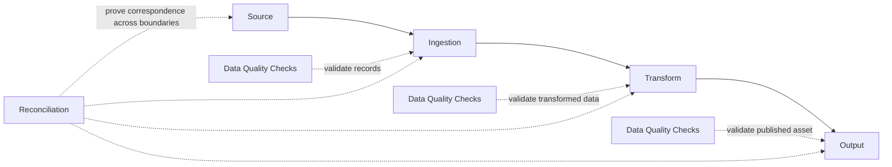
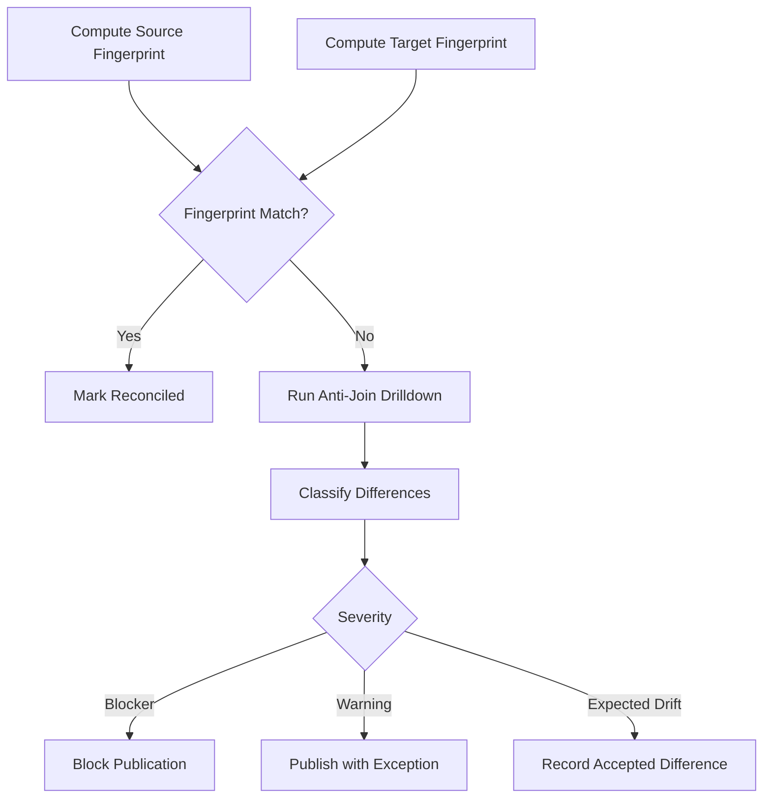
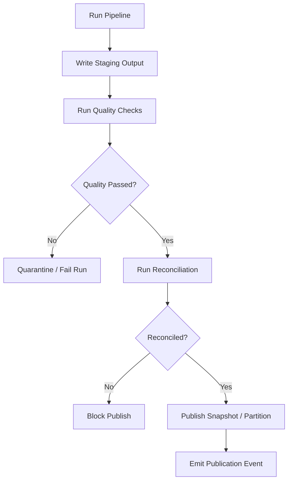

# Part 069 — Reconciliation Patterns

> A pipeline is not correct because it ran successfully.  
> A pipeline is correct when you can prove that the output corresponds to the intended input under a declared transformation, time window, and version.

In earlier parts we built contracts, quality gates, lineage, SLOs, and operational observability. Those are necessary, but they still leave one dangerous question unanswered:

**How do we know the pipeline output is actually the right output?**

A job may finish. The Airflow task may be green. Kafka lag may be zero. The Flink checkpoint may be healthy. The Iceberg snapshot may commit. Yet the business result can still be wrong.

Common examples:

- 1.2 million source records existed, but only 1.19 million reached the sink.
- A CDC connector skipped deletes because tombstones were mishandled.
- A backfill overwrote a partition with a partial result.
- A stream aggregation double-counted retry events.
- A late correction arrived after a report was published.
- A join silently dropped events because reference data was stale.
- A sink succeeded for rows but failed for the checkpoint update.
- A manual rerun reprocessed the wrong source window.

Reconciliation is the discipline of making these failures visible.

It is not one check. It is a family of proof techniques.

---

## 1. The Core Mental Model

A data pipeline transforms an input set into an output set.

```text
Input Dataset + Transform Version + Run Context -> Output Dataset
```

Reconciliation asks:

```text
Can we prove that Output Dataset is the expected consequence of Input Dataset?
```

That proof can be exact, approximate, statistical, semantic, or operational. The correct choice depends on the asset.

For a payment ledger, approximate proof is not enough. For a clickstream trend chart, exact row-level matching may be too expensive. For regulatory enforcement lifecycle reports, you usually need partition-level and entity-level evidence, because auditors ask why a specific case appeared or did not appear in a report.

A reconciliation design should declare:

| Dimension | Question |
|---|---|
| Scope | Which source range, partition, topic offset, file batch, API cursor, or DB snapshot is being reconciled? |
| Grain | Are we reconciling files, partitions, records, entities, amounts, windows, or snapshots? |
| Method | Count, checksum, hash, balance, anti-join, sample, invariant, or ledger verification? |
| Tolerance | Must it match exactly, or is bounded drift allowed? |
| Timing | Before publish, after publish, continuously, or during audit? |
| Action | Block, warn, quarantine, restate, rollback, or open incident? |
| Evidence | Where is the reconciliation result stored? |

A pipeline without reconciliation is a trust request. A pipeline with reconciliation is an evidence-producing system.

---

## 2. Reconciliation Is Not the Same as Data Quality

Data quality checks ask whether the data satisfies rules.

Examples:

```text
case_id must not be null
amount must be >= 0
status must be one of OPEN, CLOSED, ESCALATED
assigned_officer_id must exist in officer reference table
```

Reconciliation asks whether movement and transformation preserved the intended truth.

Examples:

```text
All source cases updated between T1 and T2 are represented in the canonical case table.
The total penalty amount in the gold report equals the sum of validated silver penalty facts.
Every Kafka input offset up to N has either produced a sink effect or a quarantine record.
Every source file in the manifest has exactly one import ledger entry.
```

Quality checks validate shape and meaning. Reconciliation validates continuity and accounting.

Both are required.



A useful heuristic:

```text
Data quality asks: Is this data valid?
Reconciliation asks: Is this the complete and correct consequence of the prior state?
```

---

## 3. The Reconciliation Boundary

Never say “we reconcile the pipeline” without naming the boundary.

A boundary is a point where loss, duplication, mutation, or misalignment can occur.

Common boundaries:

| Boundary | Typical Reconciliation Question |
|---|---|
| Source DB -> CDC topic | Did every committed source change become a CDC event? |
| CDC topic -> canonical topic | Did every relevant CDC event become exactly one canonical event, correction, or rejection? |
| Kafka topic -> Flink state | Did every consumed event affect state or produce a declared skip/quarantine? |
| Flink state -> sink table | Did every emitted result reach the sink idempotently? |
| Bronze -> silver | Did every accepted raw record map to a canonical record or rejection? |
| Silver -> gold | Do aggregated totals match source fact tables? |
| File landing -> archive | Did every landed file get imported, rejected, or expired? |
| API sync -> target table | Did every page/cursor range produce expected entities and deletion states? |
| Backfill staging -> publish | Does staged output match expected partition count/checksum before replacing production? |

The worse the failure mode, the stronger the reconciliation needs to be.

For example, **Kafka lag zero** proves only that a consumer group has advanced offsets. It does not prove that each record produced the intended sink effect. If sink writes and offset commits are not atomic, lag can be zero while output is wrong.

---

## 4. Reconciliation Result as a First-Class Artifact

Do not bury reconciliation in logs.

A reconciliation result should be a durable artifact, queryable by run, asset, partition, and time range.

A minimal model:

```java
public record ReconciliationResult(
    String reconciliationId,
    String pipelineId,
    String runId,
    String assetName,
    ReconciliationScope scope,
    ReconciliationMethod method,
    ReconciliationStatus status,
    Map<String, MetricValue> expected,
    Map<String, MetricValue> actual,
    List<ReconciliationDifference> differences,
    String transformVersion,
    Instant evaluatedAt
) {}

public enum ReconciliationStatus {
    PASSED,
    PASSED_WITH_TOLERANCE,
    FAILED,
    INCONCLUSIVE,
    SKIPPED
}

public record ReconciliationScope(
    String sourceDataset,
    String targetDataset,
    Instant sourceFromInclusive,
    Instant sourceToExclusive,
    Map<String, String> partitions,
    Map<String, String> sourcePositions
) {}

public enum ReconciliationMethod {
    COUNT,
    CHECKSUM,
    HASH_TOTAL,
    BALANCE_TOTAL,
    ANTI_JOIN,
    LEDGER,
    SAMPLE,
    INVARIANT,
    WATERMARK_COMPLETENESS
}
```

This artifact becomes part of the evidence trail:

```text
run_manifest
  -> input_manifest
  -> transform_manifest
  -> output_manifest
  -> reconciliation_result
  -> publication_decision
```

If a stakeholder asks, “Why was yesterday’s report published?”, the answer should not be “because the job was green.”

The answer should be:

```text
Because run R processed source snapshot S, transform version V, produced output snapshot O,
passed contract C, passed quality gate Q, passed reconciliation result K,
and publication event P promoted O at time T.
```

---

## 5. Count Reconciliation

Count reconciliation is the simplest and most commonly used method.

```text
expected_count == actual_count
```

But naïve count checks are often misleading.

### Bad Count Check

```text
source_count = count(*) from source_table where updated_at >= T1 and updated_at < T2
sink_count   = count(*) from target_table where updated_at >= T1 and updated_at < T2
```

Problems:

- Source `updated_at` may change after extraction.
- Sink `updated_at` may represent processing time, not source update time.
- Deletes may not exist in the sink.
- One source record may produce zero, one, or many sink records.
- Late corrections may belong to old business time but new processing time.
- Retries may duplicate sink records.

### Better Count Check

Declare the expected cardinality relationship.

```text
source accepted records == canonical records + rejected records
```

Example:

```sql
-- Source ingestion ledger
select count(*) as source_records
from ingestion_record_ledger
where run_id = :run_id
  and decision in ('ACCEPTED', 'REJECTED');

-- Canonical output
select count(*) as canonical_records
from canonical_case_event
where run_id = :run_id;

-- Rejections
select count(*) as rejected_records
from ingestion_rejection
where run_id = :run_id;
```

Invariant:

```text
source_records = canonical_records + rejected_records
```

This is stronger because every source record must end in a declared terminal state.

### Cardinality Contract

Every transform should declare cardinality:

| Transform Type | Expected Cardinality |
|---|---|
| Parser | 1 raw record -> 0 or 1 parsed record + optional rejection |
| Filter | 1 input -> 0 or 1 output + skip reason |
| Splitter | 1 input -> N outputs |
| Join enrichment | 1 input -> 1 output or quarantine if required reference missing |
| Aggregation | N inputs -> 1 output per group/window |
| CDC current projection | N changes -> 1 current state per key |

Make it explicit:

```java
public enum CardinalityMode {
    ONE_TO_ONE,
    ZERO_OR_ONE,
    ONE_TO_MANY,
    MANY_TO_ONE,
    MANY_TO_MANY
}

public record TransformContract(
    String transformName,
    String version,
    CardinalityMode cardinalityMode,
    boolean requiresTerminalDecisionForEveryInput
) {}
```

Count reconciliation is powerful when paired with a terminal-decision ledger.

---

## 6. Checksum Reconciliation

Counts prove quantity, not identity.

If one record is missing and another duplicate exists, counts still match.

Checksum reconciliation helps detect that.

A simple pattern:

```text
source_count == target_count
source_checksum == target_checksum
```

The checksum must be based on stable, canonical fields.

Bad checksum input:

```text
JSON string as received
```

Why bad?

- Field order may differ.
- Whitespace may differ.
- Equivalent numbers may serialize differently.
- Non-semantic metadata may differ.
- Timestamp formatting may differ.

Better checksum input:

```text
canonical key + canonical payload fields + source version + business effective time
```

Example Java canonical hash:

```java
import java.nio.charset.StandardCharsets;
import java.security.MessageDigest;
import java.security.NoSuchAlgorithmException;
import java.time.Instant;
import java.util.HexFormat;
import java.util.List;
import java.util.Objects;

public final class StableHash {
    private StableHash() {}

    public static String sha256(List<String> fields) {
        try {
            MessageDigest digest = MessageDigest.getInstance("SHA-256");
            for (String field : fields) {
                String normalized = normalize(field);
                digest.update(normalized.getBytes(StandardCharsets.UTF_8));
                digest.update((byte) 0x1F); // unit separator
            }
            return HexFormat.of().formatHex(digest.digest());
        } catch (NoSuchAlgorithmException e) {
            throw new IllegalStateException("SHA-256 unavailable", e);
        }
    }

    private static String normalize(String value) {
        return Objects.toString(value, "<NULL>").trim();
    }

    public static String caseEventHash(
        String caseId,
        String eventType,
        String status,
        Instant businessEffectiveAt,
        String schemaVersion
    ) {
        return sha256(List.of(
            caseId,
            eventType,
            status,
            businessEffectiveAt.toString(),
            schemaVersion
        ));
    }
}
```

At partition level, you usually do not store one giant hash of all rows as concatenated strings. Instead, store per-record hashes and aggregate them deterministically.

Options:

| Method | Use Case | Caveat |
|---|---|---|
| Sum of numeric hash | Fast partition-level comparison | Possible collision; use strong hash and large numeric type |
| XOR hash | Detect changed membership cheaply | Duplicate even-count records can cancel out |
| Sorted hash chain | Stronger identity proof | More expensive; requires stable ordering |
| Merkle tree | Large partition diff localization | More complex implementation |

For critical systems, use count + strong checksum + anti-join drilldown.

---

## 7. Hash Total Pattern

The hash total pattern is old but still useful.

Instead of comparing business totals, you compute a numeric total over hashed identifiers.

Example:

```text
sum(hash(case_id))
```

This detects membership mismatch better than count alone.

A practical reconciliation tuple:

```text
count_rows
count_distinct_keys
sum_hash_key
sum_hash_payload
min_event_time
max_event_time
```

Java model:

```java
import java.math.BigInteger;
import java.time.Instant;

public record PartitionFingerprint(
    long rowCount,
    long distinctKeyCount,
    BigInteger keyHashTotal,
    BigInteger payloadHashTotal,
    Instant minEventTime,
    Instant maxEventTime
) {
    public boolean sameAs(PartitionFingerprint other) {
        return rowCount == other.rowCount
            && distinctKeyCount == other.distinctKeyCount
            && keyHashTotal.equals(other.keyHashTotal)
            && payloadHashTotal.equals(other.payloadHashTotal)
            && minEventTime.equals(other.minEventTime)
            && maxEventTime.equals(other.maxEventTime);
    }
}
```

Hash totals are not a substitute for row-level verification where exact audit is required, but they are excellent as a first-pass partition guard.

---

## 8. Balance Reconciliation

For financial, inventory, quota, enforcement penalty, or obligation systems, business amounts matter.

Count and checksum can match while totals are wrong because numeric semantics changed.

Balance reconciliation checks business aggregates.

Examples:

```text
sum(source.penalty_amount) == sum(gold.penalty_amount)
sum(opening_balance + debits - credits) == closing_balance
sum(case_obligation_created) - sum(case_obligation_resolved) == active_obligation_balance
```

A regulatory enforcement example:

```text
For every enforcement case in report month M:
  total_assessed_penalty
  - total_withdrawn_penalty
  - total_reduced_penalty
  + total_increased_penalty
  = currently_enforceable_penalty
```

Balance reconciliation requires semantic classification.

```java
public enum AmountEffect {
    INCREASE,
    DECREASE,
    NEUTRAL
}

public record AmountFact(
    String factId,
    String caseId,
    String amountType,
    AmountEffect effect,
    long amountMinorUnits,
    String currency,
    Instant effectiveAt
) {
    public long signedAmount() {
        return switch (effect) {
            case INCREASE -> amountMinorUnits;
            case DECREASE -> -amountMinorUnits;
            case NEUTRAL -> 0L;
        };
    }
}
```

The common anti-pattern is reconciling raw numeric columns without understanding whether they represent deltas, balances, replacements, or corrections.

A penalty amount column might mean:

- assessed amount at decision time,
- current amount after variation,
- delta amount in an adjustment event,
- display amount in a report snapshot,
- historical amount valid at a previous time.

Balance reconciliation fails unless these meanings are explicit.

---

## 9. Anti-Join Reconciliation

Count and checksum tell you that something differs. Anti-join tells you what differs.

Typical checks:

```sql
-- Source keys missing from target
select s.case_id
from source_keys s
left join target_keys t on t.case_id = s.case_id
where t.case_id is null;

-- Target keys not explainable by source
select t.case_id
from target_keys t
left join source_keys s on s.case_id = t.case_id
where s.case_id is null;
```

For large datasets, do this at partition level and sample or limit differences for alert payloads.

Do not run unlimited anti-joins in hot production paths.

A practical pattern:

```text
1. Compute partition fingerprints.
2. If fingerprints match, mark partition reconciled.
3. If fingerprints differ, run anti-join drilldown for that partition.
4. Store first N differences plus difference counts.
5. Open incident or block publication depending on severity.
```

Mermaid flow:



---

## 10. Ledger-Style Reconciliation

Ledger reconciliation is the strongest pattern for operational pipelines.

The idea:

```text
Every input receives a terminal accounting state.
```

Terminal states:

| State | Meaning |
|---|---|
| ACCEPTED | Input produced intended output. |
| REJECTED | Input was invalid and rejection was recorded. |
| SKIPPED | Input was intentionally ignored with reason. |
| QUARANTINED | Input cannot be safely processed yet. |
| DUPLICATE | Input was duplicate of already-accounted input. |
| SUPERSEDED | Input was replaced by a newer correction or version. |

A ledger table:

```sql
create table pipeline_effect_ledger (
    ledger_id uuid primary key,
    pipeline_id text not null,
    run_id text not null,
    source_system text not null,
    source_position text not null,
    source_record_id text not null,
    idempotency_key text not null,
    terminal_state text not null,
    target_asset text,
    target_key text,
    output_fingerprint text,
    error_code text,
    error_message text,
    transform_version text not null,
    recorded_at timestamptz not null,
    unique (pipeline_id, idempotency_key)
);
```

Invariant:

```text
For every source input in scope,
there exists exactly one terminal ledger state for the active transform version and run mode.
```

This is especially useful when:

- source data contains duplicates,
- transform can reject records,
- sink is external,
- processing is retried,
- replay/backfill is frequent,
- audit evidence matters.

A Java writer:

```java
public interface EffectLedger {
    LedgerDecision recordSuccess(EffectSuccess success);
    LedgerDecision recordRejection(EffectRejection rejection);
    LedgerDecision recordQuarantine(EffectQuarantine quarantine);
    boolean alreadyRecorded(String pipelineId, String idempotencyKey);
}

public record EffectSuccess(
    String pipelineId,
    String runId,
    String sourcePosition,
    String sourceRecordId,
    String idempotencyKey,
    String targetAsset,
    String targetKey,
    String outputFingerprint,
    String transformVersion,
    Instant recordedAt
) {}

public enum LedgerDecision {
    INSERTED,
    ALREADY_EXISTS_SAME_EFFECT,
    CONFLICT_DIFFERENT_EFFECT
}
```

The dangerous case is `CONFLICT_DIFFERENT_EFFECT`.

It means the same idempotency key attempted to produce a different output. That is not just a duplicate. It is evidence of non-deterministic transformation, bad key design, or changed input semantics.

---

## 11. Offset-to-Effect Reconciliation

For Kafka pipelines, a common failure is confusing offset commit with effect completion.

A robust consumer should be able to answer:

```text
For partition P and offsets [A..B], what happened to each record?
```

Possible states:

```text
PROCESSED_TO_SINK
REJECTED_TO_DLQ
QUARANTINED
SKIPPED_BY_RULE
DUPLICATE_ALREADY_APPLIED
FAILED_RETRYABLE
FAILED_NON_RETRYABLE
```

Model:

```java
public record OffsetEffect(
    String topic,
    int partition,
    long offset,
    String eventId,
    String effectState,
    String sinkAsset,
    String sinkKey,
    String errorCode,
    Instant processedAt
) {}
```

Offset reconciliation query:

```sql
select
    topic,
    partition,
    min(offset) as min_offset,
    max(offset) as max_offset,
    count(*) as accounted_offsets,
    count(*) filter (where effect_state = 'PROCESSED_TO_SINK') as sink_success,
    count(*) filter (where effect_state = 'QUARANTINED') as quarantined,
    count(*) filter (where effect_state like 'FAILED%') as failed
from kafka_offset_effect_ledger
where topic = :topic
  and partition = :partition
  and offset between :from_offset and :to_offset
group by topic, partition;
```

If Kafka committed offset is 10,000 but the effect ledger only accounts for 9,990 offsets, you have a correctness gap.

Do not hide it behind consumer lag.

---

## 12. File Manifest Reconciliation

File ingestion needs reconciliation because file systems and object stores are full of ambiguous states:

- file is visible before complete,
- file is overwritten,
- file appears twice,
- file is renamed,
- file has wrong row count,
- file has valid format but wrong trailer,
- archive failed after import,
- manifest and actual files disagree.

A strong pattern uses a manifest.

```json
{
  "batchId": "batch-2026-07-04-001",
  "producer": "case-management-exporter",
  "files": [
    {
      "path": "landing/cases-0001.csv",
      "rowCount": 250000,
      "sha256": "...",
      "schemaVersion": "case-export.v3"
    }
  ]
}
```

Reconciliation checks:

```text
manifest_file_count == discovered_file_count
manifest_row_count == parsed_row_count
manifest_hash == actual_file_hash
parsed_row_count == accepted + rejected
accepted == canonical_output + skipped_with_reason
```

File ledger:

```sql
create table file_import_ledger (
    batch_id text not null,
    file_path text not null,
    file_hash text not null,
    declared_row_count bigint not null,
    parsed_row_count bigint,
    accepted_row_count bigint,
    rejected_row_count bigint,
    import_status text not null,
    imported_at timestamptz,
    archived_at timestamptz,
    primary key (batch_id, file_path)
);
```

A file is not “done” because a parser read it. It is done when it has an accounting state and archive/disposition evidence.

---

## 13. CDC Reconciliation

CDC reconciliation is harder than batch reconciliation because the source is moving.

You usually need multiple layers:

### 13.1 Snapshot Reconciliation

During initial load:

```text
source table snapshot count == target snapshot count
source table key hash == target key hash
source max primary key / source commit position recorded
```

### 13.2 Change Stream Reconciliation

For CDC events:

```text
source log position range -> CDC events -> canonical events -> sink effects
```

Metrics:

| Metric | Meaning |
|---|---|
| Source LSN/binlog position | Database log progress |
| Connector offset | CDC engine progress |
| Topic offset | Kafka durability progress |
| Consumer offset | Pipeline read progress |
| Sink effect count | Actual applied output |
| Delete/tombstone count | Deletion handling evidence |
| Schema change count | Evolution events observed |

### 13.3 Current State Reconciliation

For CDC current projection:

```text
select count(*) from source_table where not deleted
==
select count(*) from target_current_table where is_current = true
```

But count alone is insufficient.

Better:

```text
count + key hash + payload hash + delete count + max source position
```

### 13.4 Delete Reconciliation

Deletes are a common source of silent divergence.

Declare delete semantics:

| Source Delete | Target Action |
|---|---|
| Hard delete | Tombstone target record |
| Soft delete flag | Update current state with deleted marker |
| Retraction event | Append correction/retraction fact |
| Regulatory archive | Retain historical row, remove from active view |

Reconcile delete counts separately.

```sql
select count(*) from cdc_event
where op = 'DELETE'
  and source_lsn between :from and :to;

select count(*) from target_current
where deleted_at is not null
  and source_lsn between :from and :to;
```

---

## 14. Window Reconciliation for Streaming Aggregates

Streaming aggregations are difficult because windows close over time, late data can arrive, and corrections can restate output.

A window output should include a reconciliation envelope:

```java
public record WindowAggregateOutput(
    String windowId,
    Instant windowStart,
    Instant windowEnd,
    Instant watermarkAtEmission,
    long inputEventCount,
    long distinctBusinessKeyCount,
    long rejectedEventCount,
    long lateEventCount,
    String aggregateFingerprint,
    String transformVersion,
    boolean finalForWatermark,
    boolean subjectToCorrection
) {}
```

Window reconciliation asks:

```text
For window W:
  input events assigned to W
  - rejected events
  - duplicates
  + valid correction effects
  = aggregate contribution count
```

For regulatory reporting, never treat a streaming aggregate as eternally final unless the source domain provides a finality signal.

Better states:

```text
PRELIMINARY
WATERMARK_FINAL
BUSINESS_FINAL
RESTATED
SUPERSEDED
```

---

## 15. Reconciliation for Backfill

Backfill reconciliation must be stronger than normal daily processing because it intentionally rewrites history.

A backfill should have:

```text
backfill_campaign_id
source_scope
transform_version
target_scope
expected_mutation
staging_location
validation_result
reconciliation_result
approval_record
publication_event
rollback_or_supersession_plan
```

Before publish:

```text
source fingerprint == staged output explainability fingerprint
old output is not mutated directly
staged output passes quality and reconciliation
publication is atomic at partition/snapshot boundary
```

Backfill reconciliation checklist:

| Check | Why |
|---|---|
| Input scope recorded | Prevent accidental wider/narrower reprocessing |
| Transform version pinned | Prevent non-reproducible outputs |
| Reference data version pinned | Prevent invisible enrichment drift |
| Output partition fingerprint stored | Enables rollback comparison |
| Prior output fingerprint stored | Enables before/after review |
| Difference summary generated | Helps reviewers understand impact |
| Publication event stored | Provides evidence of promotion |

Backfill is not just a technical rerun. It is a controlled data mutation campaign.

---

## 16. Reconciliation Severity

Not every mismatch has the same severity.

A practical severity model:

| Severity | Meaning | Action |
|---|---|---|
| P0 | Published data is materially wrong or unsafe | Stop publication, incident, rollback/restatement |
| P1 | Critical asset has unexplained mismatch before publish | Block publish, investigate |
| P2 | Non-critical mismatch within contained partition | Quarantine affected scope, continue unaffected partitions |
| P3 | Known tolerated drift | Record exception, monitor |
| P4 | Inconclusive due to missing evidence | Fail closed for critical assets, warn for exploratory assets |

Make severity policy data-driven:

```yaml
asset: gold.enforcement_monthly_report
reconciliation:
  required: true
  failClosed: true
  checks:
    - method: COUNT
      tolerance: 0
      severityOnFailure: P1
    - method: BALANCE_TOTAL
      fields: [assessed_penalty_minor_units]
      tolerance: 0
      severityOnFailure: P0
    - method: CHECKSUM
      tolerance: 0
      severityOnFailure: P1
```

---

## 17. Java Reconciliation Engine Skeleton

A simple reconciliation engine should separate:

- definition,
- metric extraction,
- comparison,
- decision,
- evidence storage.

```java
public interface ReconciliationCheck {
    ReconciliationMethod method();
    ReconciliationScope scope();
    MetricSet expected(ReconciliationContext context);
    MetricSet actual(ReconciliationContext context);
    ReconciliationDecision compare(MetricSet expected, MetricSet actual);
}

public record ReconciliationContext(
    String pipelineId,
    String runId,
    String assetName,
    String transformVersion,
    Map<String, String> parameters
) {}

public record MetricSet(Map<String, MetricValue> values) {}

public sealed interface MetricValue permits LongMetric, DecimalMetric, StringMetric, HashMetric {}

public record LongMetric(long value) implements MetricValue {}
public record DecimalMetric(java.math.BigDecimal value) implements MetricValue {}
public record StringMetric(String value) implements MetricValue {}
public record HashMetric(String algorithm, String value) implements MetricValue {}

public record ReconciliationDecision(
    ReconciliationStatus status,
    List<ReconciliationDifference> differences,
    String explanation
) {}

public record ReconciliationDifference(
    String metricName,
    String expected,
    String actual,
    String severity,
    String explanation
) {}
```

Runner:

```java
import java.util.ArrayList;
import java.util.List;

public final class ReconciliationRunner {
    private final ReconciliationResultStore resultStore;

    public ReconciliationRunner(ReconciliationResultStore resultStore) {
        this.resultStore = resultStore;
    }

    public List<ReconciliationResult> run(
        ReconciliationContext context,
        List<ReconciliationCheck> checks
    ) {
        List<ReconciliationResult> results = new ArrayList<>();

        for (ReconciliationCheck check : checks) {
            MetricSet expected = check.expected(context);
            MetricSet actual = check.actual(context);
            ReconciliationDecision decision = check.compare(expected, actual);

            ReconciliationResult result = new ReconciliationResult(
                java.util.UUID.randomUUID().toString(),
                context.pipelineId(),
                context.runId(),
                context.assetName(),
                check.scope(),
                check.method(),
                decision.status(),
                expected.values(),
                actual.values(),
                decision.differences(),
                context.transformVersion(),
                java.time.Instant.now()
            );

            resultStore.save(result);
            results.add(result);
        }

        return results;
    }
}

public interface ReconciliationResultStore {
    void save(ReconciliationResult result);
}
```

This is intentionally small. The hard part is not the interface; the hard part is choosing the correct scope, grain, metric, and action.

---

## 18. Reconciliation and Publication Gates

For production assets, reconciliation should often be a publication gate.



Important: reconcile staging output before publishing it.

Bad pattern:

```text
overwrite production partition
then reconcile
then discover mismatch
```

Better pattern:

```text
write staging partition
reconcile staging against source
publish atomically
store publication event
```

For Iceberg-style table formats, snapshot-based publication makes this much safer because a snapshot can represent a coherent table state.

---

## 19. Reconciliation for Regulatory Defensibility

In regulatory systems, reconciliation must answer entity-specific questions.

For example:

> Why is case `CASE-2026-00931` in the monthly enforcement report?

A defensible answer should include:

```text
case_id: CASE-2026-00931
source events:
  - CASE_OPENED at valid time T1, recorded time R1
  - CASE_ESCALATED at valid time T2, recorded time R2
  - PENALTY_ASSESSED at valid time T3, recorded time R3
transform version: enforcement-report-transform:4.2.1
reporting rule version: monthly-enforcement-rules:2026.07
window: 2026-07-01T00:00:00Z to 2026-08-01T00:00:00Z
output row fingerprint: sha256:...
reconciliation status: PASSED
publication snapshot: iceberg snapshot 918273645
```

For the opposite question:

> Why is case `CASE-2026-00412` not in the report?

You need skip/rejection evidence:

```text
case_id: CASE-2026-00412
terminal decision: SKIPPED
reason: case did not reach reportable status before business cutoff
rule version: monthly-enforcement-rules:2026.07
validated_at: 2026-08-01T03:01:12Z
```

Without terminal decisions, absence is hard to explain.

---

## 20. Reconciliation Anti-Patterns

### Anti-Pattern 1: “Job Succeeded, Therefore Data Is Correct”

A successful job proves execution, not correctness.

### Anti-Pattern 2: Count Only

Count checks miss swapped, duplicated, or mutated records.

### Anti-Pattern 3: Reconcile with Different Time Semantics

Source uses business time, target uses processing time. The check is meaningless.

### Anti-Pattern 4: Reconcile After Destructive Publish

If reconciliation fails, you already damaged production data.

### Anti-Pattern 5: No Difference Drilldown

A red reconciliation check with no examples slows incident response.

### Anti-Pattern 6: No Exception Registry

Known accepted differences become tribal knowledge.

### Anti-Pattern 7: No Reconciliation Version

When rules change, old results become impossible to interpret.

### Anti-Pattern 8: Treating Quarantine as Data Loss

Quarantine is valid if it is explicitly accounted for and resolved.

### Anti-Pattern 9: Ignoring Deletes

Deletes must be reconciled separately because they often vanish from current-state views.

### Anti-Pattern 10: Sampling Critical Data

Sampling is useful for exploratory or low-risk assets. It is not sufficient for ledger, regulatory, or financial correctness.

---

## 21. Production Checklist

Before calling a pipeline production-grade, ask:

```text
[ ] Does every critical asset have declared reconciliation methods?
[ ] Is reconciliation scope explicit and tied to run manifest?
[ ] Are source positions recorded?
[ ] Are transform and contract versions recorded?
[ ] Are source, target, and exception counts compared?
[ ] Are checksums/fingerprints used where counts are insufficient?
[ ] Are business balances reconciled for amount-bearing facts?
[ ] Are deletes/retractions/corrections reconciled separately?
[ ] Is reconciliation performed before destructive publication?
[ ] Are failed reconciliations tied to block/warn/quarantine policy?
[ ] Are differences stored with enough examples to debug?
[ ] Are results queryable by asset, run, partition, time, and source position?
[ ] Is reconciliation evidence retained according to audit policy?
[ ] Are backfills reconciled more strictly than normal runs?
[ ] Are known exceptions explicit, approved, and expiring?
```

---

## 22. Key Takeaways

Reconciliation is the difference between a data pipeline and a data accounting system.

The deeper lesson:

```text
A pipeline should not merely move data.
It should produce evidence that the movement was complete, correct, bounded, and explainable.
```

Use count checks for basic volume. Use checksum and hash totals for identity. Use balance checks for business amounts. Use anti-joins for drilldown. Use ledger-style accounting for critical pipelines. Use offset-to-effect reconciliation for Kafka. Use manifest reconciliation for files. Use snapshot and delete reconciliation for CDC. Use window reconciliation for streaming aggregates. Use stricter reconciliation for backfill.

A production-grade pipeline does not say:

```text
Trust me, I ran.
```

It says:

```text
Here is the input scope, output scope, transform version, reconciliation proof, exceptions, and publication evidence.
```

That is the standard you should build toward.

