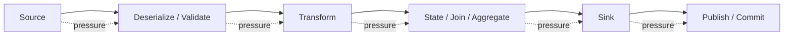
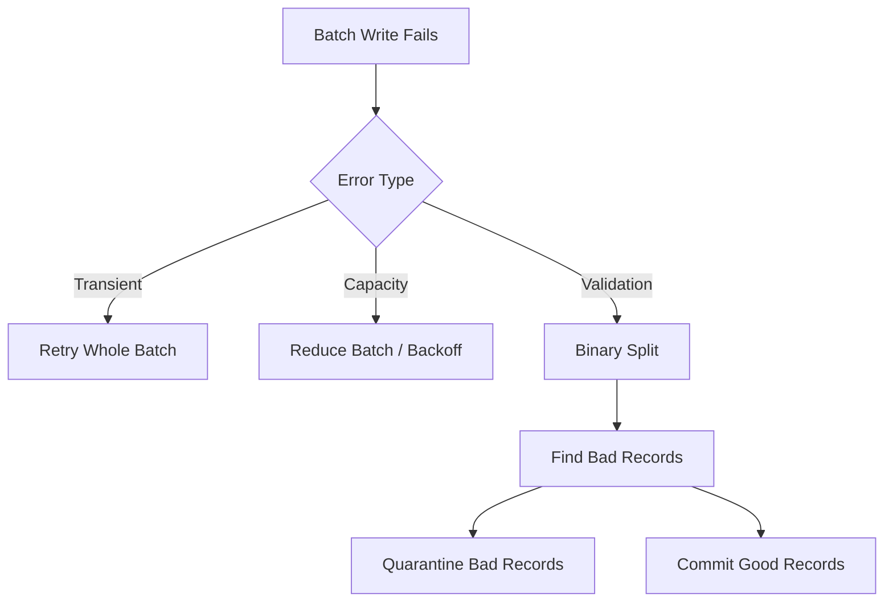
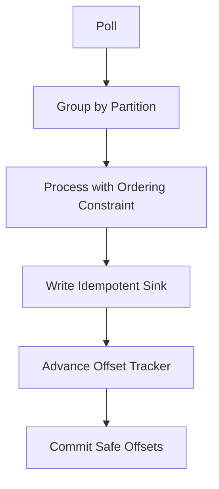
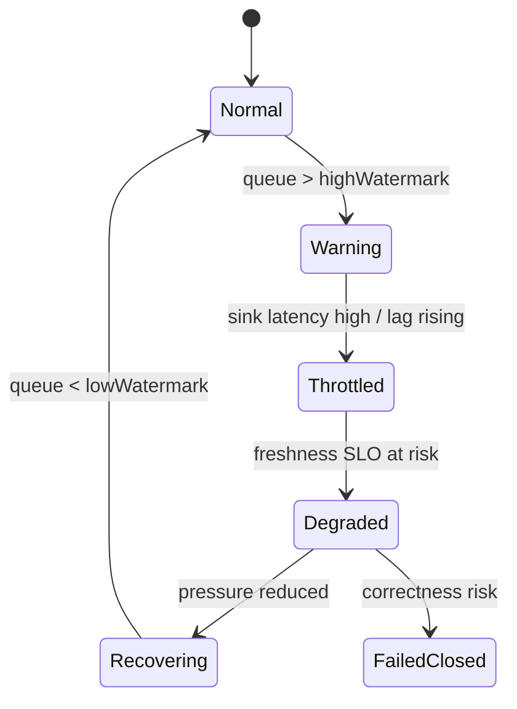
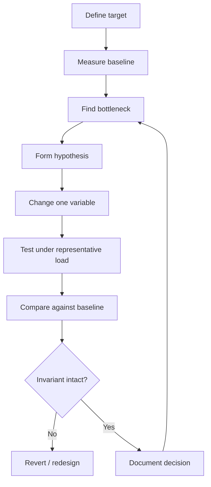

# Part 071 — Performance Engineering

> Pipeline performance is not “make it faster”.  
> It is the discipline of preserving correctness while increasing useful work per unit time, reducing waiting, and keeping resource pressure inside safe limits.

A slow pipeline is easy to notice. A dangerous pipeline is harder: it looks fast until it drops records, corrupts state, saturates a sink, or creates latency spikes during replay.

Performance engineering for Java data pipelines must answer five questions:

1. **What is the target?** Throughput, latency, freshness, recovery time, or cost?
2. **Where is the bottleneck?** Source, network, serialization, transform, state store, sink, checkpoint, scheduler, or downstream system?
3. **What invariant must not break?** Ordering, idempotency, exactly/effectively-once, auditability, or quality gates?
4. **What pressure is accumulating?** Queue depth, consumer lag, checkpoint duration, GC pause, heap growth, disk spill, small files, or database locks?
5. **What is the safe knob?** Batch size, parallelism, partitioning, memory, backpressure, cache, compression, fetch size, window size, or sink concurrency?

The top engineer does not start by changing random configs. They build a performance model first.

---

## 1. Performance Is a Constraint System

A pipeline is a chain of stages. Each stage has capacity, latency, resource usage, and correctness constraints.



The throughput of the pipeline is bounded by the slowest effective stage.

```text
pipeline_capacity = min(stage_capacity_1, stage_capacity_2, ..., stage_capacity_n)
```

But latency is cumulative and often nonlinear:

```text
end_to_end_latency = source_wait
                   + queue_wait
                   + processing_time
                   + state_access_time
                   + sink_wait
                   + commit_wait
                   + scheduler_delay
```

Throughput tuning can increase latency. Latency tuning can reduce throughput. Cost tuning can hurt both. Correctness constraints may forbid the fastest implementation.

Example:

- Increasing Kafka producer `linger.ms` improves batching and compression efficiency.
- It also intentionally waits longer before sending records.
- This may reduce network overhead but increase per-record latency.

That trade-off is not a bug. It is the actual design surface.

---

## 2. The Four Performance Axes

Do not say “the pipeline is slow” without specifying which axis is failing.

| Axis | Meaning | Common Metric | Typical Bottleneck |
|---|---|---:|---|
| Throughput | Records/bytes processed per second | `records/s`, `MB/s` | CPU, sink, partition count, serialization |
| Latency | Time per record/window/run | p50/p95/p99 latency | queueing, batching, downstream wait |
| Freshness | Delay between source reality and published output | max/avg data age | schedule delay, source lag, checkpointing |
| Recovery | Time to return to correctness after failure | RTO, catch-up time | replay rate, state restore, backfill capacity |

A system can have high throughput but bad freshness if it waits for a daily batch. It can have low p50 latency but terrible p99 if checkpoints or GC pause the job. It can process normal traffic but fail recovery after a backlog.

Production review question:

> What performance axis does this pipeline optimize, and which axis is allowed to degrade under load?

If the team cannot answer, the tuning will be accidental.

---

## 3. Start With a Queueing Model

Most pipeline performance bugs are queueing bugs.

A queue appears whenever production rate exceeds consumption rate for a period of time.

```text
backlog_growth_per_second = incoming_rate - processing_rate
```

If incoming rate is `50,000 records/s` and the sink can persist `35,000 records/s`, backlog grows by `15,000 records/s`.

If backlog is 90 million records:

```text
catch_up_time = backlog / (processing_rate - incoming_rate)
```

If incoming is still `50k/s` and tuned processing is `80k/s`:

```text
catch_up_time = 90,000,000 / 30,000 = 3,000 seconds ≈ 50 minutes
```

This simple math prevents fantasy tuning.

### Queueing locations

| Location | Symptom | Consequence |
|---|---|---|
| Kafka topic | consumer lag grows | freshness breach |
| JVM queue | heap grows, GC increases | latency spikes, OOM |
| Flink network buffer | backpressure | checkpoint delay |
| Sink connection pool | threads block | retry storm |
| Object storage output | small files accumulate | query/read cost spike |
| Airflow worker queue | task start delay | schedule SLO breach |

The invariant:

> Every queue must be bounded, observable, and have a deliberate overload behavior.

---

## 4. Performance Budget

A performance budget converts “fast enough” into a design contract.

Example target:

```yaml
pipeline: case-event-enrichment
input_rate_normal: 5_000 records/s
input_rate_peak: 25_000 records/s
freshness_slo_p95: 120s
recovery_slo_after_1h_outage: 30m
max_duplicate_effects: 0
max_record_loss: 0
max_heap_per_worker: 6GiB
max_checkpoint_duration_p95: 45s
max_sink_cpu: 70%
max_db_connections: 20
```

This forces trade-offs:

- If peak input is `25k/s`, sink capacity must exceed it or backlog is expected.
- If recovery after a one-hour outage must complete in 30 minutes, replay capacity must be at least 3× normal rate.
- If heap is limited, state size and queue depth must be bounded.
- If DB connections are limited, concurrency must be controlled even if CPU is idle.

---

## 5. Bottleneck Taxonomy

Pipeline bottlenecks usually fall into one of these categories.

### 5.1 Source bottleneck

Examples:

- API rate limit.
- Database read locks.
- Object storage listing is slow.
- Kafka partition count is too low.
- CDC connector cannot keep up with WAL/binlog volume.

Optimization shape:

- Parallelize safely by partition/cursor/range.
- Avoid aggressive polling.
- Use incremental fetch and lookback windows.
- Separate source extraction from downstream transform.
- Protect source systems with rate limits and read replicas where appropriate.

### 5.2 CPU bottleneck

Examples:

- JSON parsing dominates runtime.
- Regex-heavy validation.
- Compression/decompression overhead.
- Cryptographic hashing for dedupe.
- Complex rules engine.

Optimization shape:

- Profile before changing code.
- Reduce allocation.
- Cache compiled regex/patterns.
- Avoid repeated parsing.
- Move invariant computation outside hot loop.
- Consider faster encoding or generated codecs.

### 5.3 Memory/GC bottleneck

Examples:

- Large in-memory batches.
- Unbounded queues.
- High-cardinality state.
- Excessive temporary objects.
- Large deserialized object graphs.

Optimization shape:

- Bound queues.
- Use streaming decode where possible.
- Use primitive collections carefully.
- Avoid retaining envelope payload after sink commit.
- Use state TTL.
- Reduce object churn.

### 5.4 Network bottleneck

Examples:

- Small Kafka batches.
- No compression.
- Chatty sink writes.
- Cross-region pipeline traffic.
- Object storage small writes.

Optimization shape:

- Batch and compress.
- Co-locate compute with data where possible.
- Reduce payload size.
- Avoid unnecessary round trips.
- Use bulk APIs.

### 5.5 State bottleneck

Examples:

- Huge Flink keyed state.
- Hot keys.
- Slow RocksDB access.
- Checkpoint duration grows with state.
- State migration requires long downtime.

Optimization shape:

- Re-key or shard hot keys.
- Add TTL and compaction strategy.
- Split state by lifecycle.
- Avoid storing full payload in state.
- Use incremental checkpoints where supported.
- Design state schema for migration.

### 5.6 Sink bottleneck

Examples:

- Database upsert is slow.
- Search indexing throttles.
- Warehouse commit is expensive.
- Lakehouse small-file explosion.
- External API rate limit.

Optimization shape:

- Batch writes.
- Use staging and publish.
- Control concurrency.
- Use idempotent bulk operations.
- Separate hot projection from cold history.
- Reconcile after bulk commit.

---

## 6. Java Hot Path Design

The hot path is the code executed for every record.

Bad pipeline performance often comes from treating every record as a mini enterprise application request.

Avoid this in hot path:

- Rebuilding JSON mapper per record.
- Opening DB connection per record.
- Performing blocking remote call per record without concurrency control.
- Allocating large intermediate maps.
- Logging full payload for every record.
- Running expensive validation after known-fatal failure.
- Calling `Instant.now()` many times in the same record flow.
- Using exceptions as normal control flow.

A good hot path has predictable shape:

```java
public final class CaseEventProcessor
    implements Processor<RawCaseEvent, SinkCommand> {

  private final CaseEventDecoder decoder;
  private final CaseEventValidator validator;
  private final CaseEventMapper mapper;

  @Override
  public ProcessingResult<SinkCommand> process(Envelope<RawCaseEvent> input) {
    DecodeResult<CaseEventV3> decoded = decoder.decode(input.payload(), input.schemaRef());
    if (decoded.isInvalid()) {
      return ProcessingResult.reject(decoded.rejection());
    }

    ValidationResult validation = validator.validate(decoded.value(), input.metadata());
    if (validation.isInvalid()) {
      return ProcessingResult.reject(validation.rejection());
    }

    SinkCommand command = mapper.toSinkCommand(decoded.value(), input.metadata());
    return ProcessingResult.ok(command);
  }
}
```

Notice:

- Dependencies are constructed once.
- Decode/validate/map are separated.
- Rejection is a value, not a thrown exception.
- The result is a sink command, not an immediate side effect.

---

## 7. Allocation Discipline

On the JVM, allocation is cheap until it is not. The problem is not merely object creation; it is allocation rate, object lifetime, and GC pressure.

Performance smell:

```java
for (Envelope<byte[]> record : records) {
  Map<String, Object> parsed = objectMapper.readValue(record.payload(), Map.class);
  String id = parsed.get("caseId").toString();
  String normalized = id.trim().toLowerCase(Locale.ROOT);
  List<String> tags = new ArrayList<>();
  // ... many temporary objects
}
```

Better direction:

- Decode into a known schema type.
- Avoid generic `Map<String,Object>` for hot path if schema is known.
- Normalize once at boundary.
- Avoid building collections when a boolean/enum is enough.
- Keep payload as bytes until decode is needed.
- Do not store full payload in state unless audit requires it.

Allocation review checklist:

- What is allocation rate at peak traffic?
- Which objects survive young GC?
- Is payload copied multiple times?
- Are large strings created for logs/metrics?
- Are records accumulated beyond commit boundary?
- Are caches bounded and evicting?

---

## 8. Batching

Batching is the main lever for throughput.

Batching reduces overhead by amortizing fixed costs:

```text
cost_per_record = fixed_batch_cost / batch_size + variable_record_cost
```

Examples of fixed cost:

- Kafka request overhead.
- DB transaction commit.
- TLS handshake/HTTP request overhead.
- Object storage write call.
- Lakehouse metadata commit.

But batching increases latency and failure impact.

| Larger batch helps | Larger batch hurts |
|---|---|
| Network efficiency | Per-record latency |
| Compression ratio | Retry blast radius |
| Sink transaction overhead | Memory usage |
| File size quality | Checkpoint alignment |
| CPU amortization | Poison record isolation |

### Batch size policy

A robust batcher should flush by multiple conditions:

```java
public record BatchPolicy(
    int maxRecords,
    long maxBytes,
    Duration maxAge,
    int maxFailuresBeforeSplit
) {}
```

Flush triggers:

- `recordCount >= maxRecords`
- `byteCount >= maxBytes`
- `oldestRecordAge >= maxAge`
- source partition revoked
- graceful shutdown
- checkpoint boundary

### Poison record and batch splitting

If a batch write fails, do not immediately throw the whole batch into DLQ. Use a controlled split strategy when the sink error suggests record-level failure.



This preserves throughput for good records while isolating poison data.

---

## 9. Parallelism

Parallelism increases throughput only if the bottleneck can be parallelized safely.

```text
new_capacity ≠ old_capacity × parallelism
```

Why?

- Partition skew.
- Shared sink limit.
- Coordination overhead.
- Lock contention.
- Hot keys.
- Increased checkpoint cost.
- Increased downstream throttling.

### Parallelism boundaries

| Boundary | Parallelism Unit | Constraint |
|---|---|---|
| Kafka consumer | partition | ordering within partition |
| Flink keyed stream | key group | state locality |
| Spark batch | partition | shuffle and skew |
| File ingestion | file/range | manifest correctness |
| API ingestion | tenant/cursor | rate limit and ordering |
| DB ingestion | key range | snapshot consistency |
| Sink write | shard/table/index | idempotency and locks |

### Safe parallelism rule

> Parallelize by the same key that defines correctness, or explicitly repair the consequence.

If ordering is required per `caseId`, partition by `caseId`. If you partition by `tenantId`, then events for the same case may reorder unless case is contained inside tenant and single-threaded per tenant.

---

## 10. Kafka Producer Tuning Model

Kafka producer performance is usually governed by batching, compression, acknowledgments, idempotence, and partitioning.

Important knobs:

| Knob | Effect | Risk |
|---|---|---|
| `batch.size` | Larger per-partition batches | Memory, latency |
| `linger.ms` | Wait for more records before send | Higher latency |
| `compression.type` | Lower network/storage bytes | CPU cost |
| `acks` | Durability vs latency | Data loss if too weak |
| `enable.idempotence` | Avoid duplicate writes from retries | Config constraints |
| `max.in.flight.requests.per.connection` | More throughput | Ordering risk if misconfigured without idempotence |
| `buffer.memory` | Absorb producer pressure | OOM-like producer stalls |

Do not tune producer throughput without checking:

- per-topic partition count,
- key distribution,
- broker network/disk saturation,
- request latency,
- batch size utilization,
- compression ratio,
- error/retry rate,
- idempotence/transaction settings.

Producer tuning sequence:

1. Validate partition key distribution.
2. Measure current batch fill ratio.
3. Increase `linger.ms` carefully if latency budget allows.
4. Tune `batch.size` based on payload size and partition traffic.
5. Enable compression where network/storage is the bottleneck.
6. Keep correctness settings aligned with delivery semantics.
7. Load test with production-like keys, not random uniform keys only.

---

## 11. Kafka Consumer Tuning Model

Kafka consumer performance is governed by fetch, processing, sink, commit, and rebalance behavior.

Important knobs/concepts:

| Knob / Concept | Effect | Risk |
|---|---|---|
| `max.poll.records` | Records returned per poll | Large batches delay commit/rebalance |
| `fetch.min.bytes` | Broker waits for more data | Higher latency |
| `fetch.max.wait.ms` | Max wait for fetch min bytes | Higher latency |
| `max.partition.fetch.bytes` | Large message handling | Memory pressure |
| manual commit | Control effect boundary | Code complexity |
| pause/resume | Backpressure per partition | Stale paused partitions if buggy |
| worker pool | Higher processing parallelism | Partition ordering bugs |

Consumer hot path:



Consumer performance bug to avoid:

> Processing records concurrently but committing offset past records that have not finished.

The offset tracker must commit only the highest contiguous processed offset per partition.

---

## 12. Flink Performance Model

Flink performance is shaped by:

- source parallelism,
- operator chaining,
- key distribution,
- state backend,
- checkpoint duration,
- network buffers,
- watermark progress,
- sink throughput,
- backpressure.

### Flink bottleneck signals

| Signal | Meaning |
|---|---|
| Backpressured time high | Downstream cannot keep up |
| Busy time high | Operator CPU-bound |
| Idle time high | Upstream/source underfeeding |
| Checkpoint duration increasing | State/checkpoint/storage bottleneck |
| Alignment duration high | Backpressure affects checkpoints |
| Watermark not advancing | Idle source, skew, timestamp issue |
| State size growing | TTL/key cardinality problem |
| Restart loops | Poison data or unrecoverable state/sink issue |

### Key distribution

A single hot key can destroy parallelism.

```text
effective_parallelism = number_of_busy_key_groups
```

If 90% of events use one key, parallelism 64 does not mean 64-way work.

Mitigations:

- choose better key,
- key by compound key,
- pre-aggregate with sharded key then merge,
- split special hot tenants,
- use custom partitioner only with strong reason,
- isolate hot key into dedicated pipeline.

### State performance

State is not free.

Every state access can involve serialization, memory, disk, cache, and checkpoint cost.

State review:

- Is the state value minimal?
- Is TTL configured where safe?
- Does the key cardinality have a known upper bound?
- Is state schema evolution planned?
- Can state be recomputed from log instead of stored forever?
- What is restore time from checkpoint/savepoint?
- How does state size grow during backfill?

---

## 13. Spark Performance Model

Spark pipeline performance is commonly dominated by shuffle, skew, file layout, serialization, and memory.

### Spark bottleneck signals

| Signal | Likely Cause |
|---|---|
| Few long-running tasks | skew |
| High shuffle read/write | join/groupBy/repartition cost |
| Executor OOM | large partition, cache, collect, bad UDF |
| Many tiny tasks | small files/overpartitioning |
| Spill to disk | memory pressure during shuffle/aggregation |
| Slow write | small files, commit protocol, object storage |
| Long planning time | huge metadata/file list |

### Spark rules for Java pipelines

- Prefer DataFrame/Dataset operations over row-by-row Java loops when possible.
- Avoid `collect()` except for tiny control data.
- Avoid UDFs for logic expressible with Spark SQL functions.
- Broadcast only bounded reference data.
- Repartition by business output grain before writing.
- Use staged writes and publish atomically.
- Inspect execution plan, not just code.
- Treat skew as a data modeling issue, not merely a config issue.

### Skew example

Suppose enforcement cases are distributed by `agencyId`, but one agency owns 70% of cases. A join by `agencyId` creates one huge partition.

Better options:

- Join by finer key if semantically correct.
- Salt hot key for aggregate stages.
- Use broadcast join if reference side is small.
- Split hot agency processing into separate job.
- Pre-aggregate per case before agency-level aggregation.

---

## 14. Serialization and Encoding

Serialization sits on nearly every boundary:

- Kafka payload.
- Flink state.
- Spark shuffle.
- HTTP API.
- Object storage files.
- Checkpoint metadata.
- DLQ payload.

A bad serialization choice hurts CPU, memory, network, compatibility, and observability.

Decision questions:

| Question | Why it matters |
|---|---|
| Is schema known? | Enables generated codecs |
| Is evolution required? | Needs compatibility rules |
| Is payload large? | Compression and columnar format matter |
| Is random field access needed? | Columnar vs row encoding |
| Is human debugging important? | JSON readability vs binary efficiency |
| Is state stored long-term? | Schema migration risk |

Do not optimize serialization blindly. Profile first.

---

## 15. Compression

Compression trades CPU for fewer bytes.

It can improve:

- Kafka broker/network throughput,
- object storage cost,
- lakehouse read efficiency,
- cache locality,
- cross-region traffic.

It can hurt:

- CPU-bound jobs,
- low-latency small messages,
- already-compressed payloads,
- debugging workflows,
- per-record random access.

Compression review:

- What is compression ratio?
- Is CPU or network the bottleneck?
- Is compression done per record or per batch/file/block?
- Does compression delay visibility?
- Is decompression repeated downstream?

---

## 16. Sink Performance

Most pipelines are sink-limited.

Common sink patterns:

| Sink | Fast Path | Dangerous Path |
|---|---|---|
| PostgreSQL | batch insert/upsert, staged merge | row-by-row transaction |
| Elasticsearch/OpenSearch | bulk indexing | single document writes |
| Kafka | batch producer | synchronous send per record |
| Object storage | large files | tiny files |
| Lakehouse | staged partition write | frequent small commits |
| API | bounded concurrent batch | unbounded async calls |

### Sink concurrency limiter

```java
public final class SinkConcurrencyLimiter {
  private final Semaphore permits;

  public SinkConcurrencyLimiter(int maxInFlight) {
    this.permits = new Semaphore(maxInFlight);
  }

  public <T> T execute(Callable<T> call) throws Exception {
    permits.acquire();
    try {
      return call.call();
    } finally {
      permits.release();
    }
  }
}
```

A limiter protects both your pipeline and the downstream system. Without it, increasing pipeline parallelism may create a retry storm.

---

## 17. Backpressure as Performance Control

Backpressure is not failure. It is information.

A well-designed pipeline reacts to pressure by:

- pausing source partitions,
- reducing sink concurrency,
- increasing batch size within latency budget,
- shedding non-critical work,
- routing bad records to quarantine,
- delaying backfill,
- protecting online operational systems.

A bad pipeline reacts by:

- accumulating unbounded memory,
- retrying faster,
- spawning more threads,
- increasing timeout forever,
- letting freshness silently degrade.

Backpressure state machine:



---

## 18. Metrics That Matter

Do not drown dashboards in metrics. Keep metrics tied to decisions.

### Throughput

- input records/s,
- output records/s,
- rejected records/s,
- bytes/s,
- sink writes/s,
- replay records/s.

### Latency

- source-to-ingest latency,
- ingest-to-process latency,
- process-to-sink latency,
- sink commit latency,
- end-to-end freshness,
- p50/p95/p99 by tenant/partition.

### Pressure

- Kafka lag,
- queue depth,
- in-flight records,
- paused partitions,
- checkpoint duration,
- state size,
- GC pause,
- executor spill,
- DB connection wait.

### Correctness-performance coupling

- duplicate detected count,
- DLQ/quarantine rate,
- retry rate,
- reconciliation mismatch,
- late event rate,
- watermark delay,
- state TTL eviction count.

A performance dashboard that excludes correctness signals is dangerous.

---

## 19. Profiling Method

Performance work should follow this loop:



Bad loop:

```text
change config -> run once -> declare success
```

Good loop:

```text
baseline -> hypothesis -> controlled experiment -> invariant check -> rollout guard
```

### Representative load

Representative load includes:

- real key skew,
- real payload sizes,
- real schema mix,
- duplicates,
- late events,
- poison records,
- downstream throttling,
- replay/backfill mode,
- tenant hot spots,
- object storage/file layout behavior.

Synthetic uniform random events are useful for capacity testing but bad for correctness/performance confidence.

---

## 20. Benchmarking in Java

Use microbenchmarks for small hot functions. Use pipeline benchmarks for system behavior.

### JMH is for local code hot spots

Good JMH target:

- schema decoder,
- validator,
- mapper,
- hash computation,
- key extraction,
- serialization function.

Bad JMH target:

- full Kafka-Flink-Sink pipeline,
- distributed checkpointing,
- DB transaction behavior,
- object storage commit.

Example JMH skeleton:

```java
@State(Scope.Thread)
public class CaseEventDecoderBenchmark {
  private CaseEventDecoder decoder;
  private byte[] payload;

  @Setup
  public void setup() {
    decoder = new CaseEventDecoder();
    payload = TestPayloads.caseEventV3();
  }

  @Benchmark
  public CaseEventV3 decode() {
    return decoder.decode(payload).orElseThrow();
  }
}
```

Use JMH to compare local alternatives, not to claim distributed throughput.

### Pipeline benchmark harness

For pipeline-level tests, measure:

- throughput at different input rates,
- latency distribution,
- memory and GC,
- sink saturation,
- checkpoint behavior,
- correctness counters,
- recovery from restart,
- replay catch-up rate.

---

## 21. Load Test Scenarios

Minimum useful performance scenarios:

| Scenario | Purpose |
|---|---|
| Normal load | Baseline capacity |
| Peak load | Sustained stress |
| Burst load | Queue/backpressure behavior |
| One-hour outage replay | Recovery capacity |
| Hot key load | Skew detection |
| Large payload load | Serialization/memory pressure |
| Poison data mix | Error-lane overhead |
| Late data mix | Watermark/window behavior |
| Sink throttling | Backpressure and retry policy |
| Backfill + live traffic | Isolation and priority policy |

For each scenario, define pass/fail criteria before running it.

---

## 22. Performance Anti-Patterns

### Anti-pattern: tuning without SLO

If no SLO exists, every tuning is subjective.

### Anti-pattern: optimizing p50 only

Pipelines fail users at p95/p99 and freshness tail.

### Anti-pattern: unbounded async

`CompletableFuture` without concurrency control is not performance engineering. It is delayed overload.

### Anti-pattern: increasing consumers without partition/sink analysis

More consumers than useful partitions or sink capacity does not help.

### Anti-pattern: treating backfill as free capacity

Backfill competes for CPU, network, sink writes, storage commits, and operator attention.

### Anti-pattern: using cache without invalidation semantics

A fast wrong enrichment is still wrong.

### Anti-pattern: row-by-row sink writes

This is almost always the first throughput wall.

### Anti-pattern: hiding slow path in logs

Logging full payloads at high volume can become the bottleneck and a privacy incident.

---

## 23. Production Tuning Checklist

Before tuning:

- [ ] Target axis defined: throughput, latency, freshness, recovery, or cost.
- [ ] Baseline captured.
- [ ] Bottleneck identified with evidence.
- [ ] Correctness invariants listed.
- [ ] Load shape is representative.
- [ ] Rollback plan exists.

During tuning:

- [ ] Change one major variable at a time.
- [ ] Track p50/p95/p99, not only averages.
- [ ] Track lag/freshness and correctness counters.
- [ ] Track CPU, memory, GC, disk, network.
- [ ] Track downstream saturation.
- [ ] Include replay/backfill scenario.

After tuning:

- [ ] Compare with baseline.
- [ ] Record config and reason.
- [ ] Update runbook.
- [ ] Add guardrail alerts.
- [ ] Add regression benchmark where useful.

---

## 24. Final Mental Model

Performance engineering is not a bag of tricks. It is a controlled trade-off process.

The pipeline should become faster only in ways that preserve:

- no data loss,
- replay safety,
- idempotent effects,
- ordering where required,
- bounded memory,
- bounded downstream pressure,
- observable degradation,
- auditable output.

A senior engineer asks:

> What is the bottleneck, what is the invariant, and what pressure will this tuning move somewhere else?

A top 1% engineer asks one more question:

> When this optimization fails under production skew, how will we know before users or regulators do?

That is the performance bar for production-grade Java data pipelines.

---

## References

- Apache Kafka Producer Configs — `batch.size`, `linger.ms`, compression, and producer behavior.
- Apache Flink documentation — checkpointing, state backend, backpressure, and large-state tuning.
- Apache Spark documentation — tuning, serialization, memory, shuffle, and execution behavior.
- OpenJDK JMH — Java Microbenchmark Harness for JVM benchmarking.
