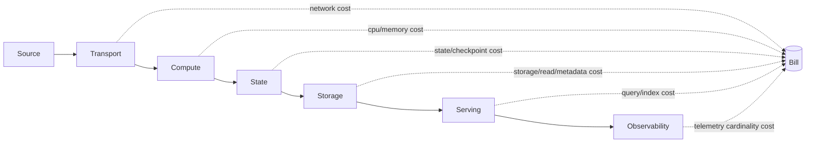
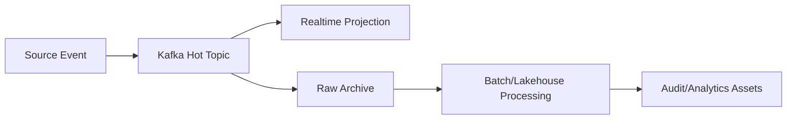

# Part 072 — Cost Engineering

> A pipeline that is correct but economically unbounded is not production-grade.  
> It is a future incident with a cloud bill attached.

Cost engineering is not “use smaller machines”. It is the discipline of understanding where cost is created, which costs are proportional to business value, and which costs are accidental waste.

In data pipelines, the largest cost surprises usually come from:

- replaying more data than expected,
- keeping state longer than needed,
- writing too many small files,
- over-retaining raw topics and snapshots,
- cross-region network transfer,
- over-parallelized Spark/Flink jobs,
- retry storms,
- high-cardinality metrics/logs,
- duplicate materializations,
- expensive joins caused by poor grain design,
- backfill campaigns competing with live workloads.

The objective is not lowest cost. The objective is **cost-aligned correctness**.

A regulatory pipeline may need immutable evidence retention. A recommendation feature pipeline may prefer aggressive downsampling. A real-time fraud pipeline may justify expensive low-latency compute. A daily executive report probably does not.

---

## 1. Cost Is a First-Class Architecture Dimension

Every pipeline decision has a cost shape.



Cost must be designed at the same time as:

- correctness,
- freshness,
- availability,
- auditability,
- security,
- developer productivity.

Otherwise, cost becomes an after-the-fact cleanup project.

---

## 2. Cost Model of a Data Pipeline

A practical cost model:

```text
total_cost = compute_cost
           + storage_cost
           + network_cost
           + state_cost
           + replay_cost
           + orchestration_cost
           + observability_cost
           + operational_cost
           + risk_cost
```

Where:

- **compute cost** is CPU/memory/runtime for jobs and services,
- **storage cost** is raw, intermediate, final, index, backup, and metadata retention,
- **network cost** is data transfer across zones, regions, systems, or public endpoints,
- **state cost** is durable state, checkpoint, changelog, restore time,
- **replay cost** is recomputation during backfill/recovery,
- **orchestration cost** is scheduler/workflow/worker overhead,
- **observability cost** is logs, metrics, traces, lineage, quality result storage,
- **operational cost** is human time to debug, rerun, reconcile, approve,
- **risk cost** is the expected cost of data loss, wrong reports, compliance breach, or delayed detection.

Cheap infrastructure with expensive incidents is not cheap.

---

## 3. Unit Economics

You need unit cost, not just total cost.

Examples:

```text
cost_per_million_events
cost_per_gib_ingested
cost_per_asset_materialization
cost_per_backfill_day
cost_per_replay_hour
cost_per_tenant
cost_per_report
cost_per_quality_check
cost_per_lineage_event
```

Without unit economics, teams cannot compare options.

Example:

| Design | Monthly Cost | Events / Month | Cost / Million Events |
|---|---:|---:|---:|
| Current stream pipeline | $18,000 | 900M | $20 |
| Tuned batching + compression | $13,500 | 900M | $15 |
| Batch-only alternative | $4,000 | 900M | $4.44 |

The cheapest option may violate freshness. But now the trade-off is visible.

---

## 4. Cost Invariants

Production cost engineering needs invariants.

Examples:

```yaml
cost_invariants:
  - live_pipeline_cost_per_million_events <= 25 USD
  - backfill_must_not_consume_more_than_30_percent_live_sink_capacity
  - raw_kafka_retention_days <= 14 unless approved
  - pii_payload_retention_days <= policy_limit
  - small_file_ratio_per_partition <= threshold
  - observability_cardinality_budget_per_pipeline <= threshold
  - replay_cost_estimate_required_before_run: true
```

These are not just finance controls. They protect reliability.

If a backfill consumes all sink capacity, live freshness fails. If logs explode, observability systems throttle exactly when you need them. If raw topics retain everything forever, privacy and compliance risk increase.

---

## 5. Compute Cost

Compute cost is affected by:

- runtime duration,
- instance/container size,
- parallelism,
- CPU efficiency,
- memory pressure,
- autoscaling behavior,
- idle workers,
- scheduling gaps,
- replay/backfill load,
- inefficient transforms.

### Cost smell: permanent peak capacity

If a pipeline is sized for peak but peak happens 30 minutes/day, you may be paying for idle capacity.

Options:

- autoscale worker count,
- separate live and backfill worker pools,
- run batch jobs in scheduled windows,
- use serverless where cold start and cost model fit,
- use reserved/base capacity for steady workloads and burst capacity for backfill.

### Cost smell: over-parallelism

Parallelism can increase cost without increasing throughput.

```text
if sink_capacity < compute_capacity:
    extra_compute = waste
```

Example: 100 Spark executors writing into a database that can handle 20 concurrent writers. The excess executors wait, retry, or create lock contention.

### Cost smell: expensive generic transforms

A generic JSON-map pipeline may be flexible but expensive at scale.

Cost-aware alternatives:

- generated codecs,
- column pruning,
- predicate pushdown,
- precomputed reference data,
- schema-specific fast path,
- avoiding repeated parse/serialize cycles.

---

## 6. Storage Cost

Data pipelines multiply data.

A single source record may exist as:

- raw Kafka event,
- raw object storage file,
- bronze table row,
- parsed silver row,
- rejected/quarantine record,
- gold aggregate,
- search index document,
- cache entry,
- audit log,
- lineage event,
- metric/log/trace attributes,
- checkpoint/state/changelog.

Storage cost model:

```text
stored_bytes = input_bytes
             × replication_factor
             × format_overhead
             × materialization_count
             × retention_duration
```

### Retention design

Retention must be based on purpose.

| Layer | Purpose | Retention Logic |
|---|---|---|
| Kafka raw topic | replay window | operational recovery need |
| Object raw archive | audit/source preservation | legal/regulatory policy |
| Bronze table | parse/reprocess source | source correction horizon |
| Silver table | canonical data product | consumer dependency |
| Gold table | serving/reporting | business/report retention |
| DLQ/quarantine | repair/debug | incident and privacy policy |
| Checkpoints | recovery | restore + rollback window |
| Lineage metadata | impact/audit | governance policy |

Never keep data “just in case” without naming the case.

---

## 7. Network Cost

Network cost is often invisible during design.

High-risk patterns:

- cross-region Kafka replication,
- compute in one region reading storage from another,
- warehouse export/import loops,
- API ingestion through public endpoints,
- repeated reads of same raw data by multiple jobs,
- fan-out from one topic to many external systems,
- verbose payloads and uncompressed transport.

Cost-aware patterns:

- co-locate compute with storage,
- compress at batch/file level,
- avoid repeated cross-region reads,
- materialize shared canonical datasets once,
- use compacted latest-state topics for reference data,
- replicate only required topics/fields,
- separate hot real-time data from cold audit data.

Network cost review question:

> How many times does one source byte cross a paid boundary before it becomes a consumed data product?

---

## 8. State Cost

State costs money in four ways:

1. memory/disk to store it,
2. CPU to access/serialize it,
3. checkpoint bandwidth/storage,
4. restore/recovery time.

State cost formula:

```text
state_cost ≈ key_count × avg_state_size × retention_time × replication/checkpoint_factor
```

### Expensive state smells

- storing full payload when only event ID is needed,
- no TTL,
- key cardinality not bounded,
- state grows during backfill and never shrinks,
- storing derived state that can be recomputed cheaply,
- mixing hot operational state with cold audit state,
- using a global table when keyed lookup would be enough.

### Cost-aware state design

| Need | Cheaper Design |
|---|---|
| Dedupe for 7 days | event ID set with TTL |
| Latest reference lookup | compacted topic / bounded cache |
| Audit history | append-only lakehouse table, not stream state |
| Large enrichment | async lookup with cache, not full broadcast |
| Window aggregate | store aggregate, not all events |
| Replay support | rebuild from source log where feasible |

State is one of the most important places to ask:

> Is this state operationally necessary, or is it cached fear?

---

## 9. Replay and Backfill Cost

Replay is a cost multiplier.

```text
replay_cost = data_volume × transform_cost × sink_cost × validation_cost × number_of_replays
```

Backfill cost is often higher than live cost because:

- historical volume is large,
- old schemas require extra decoding,
- correction logic is versioned,
- sinks need merge/upsert/delete operations,
- reconciliation is stricter,
- operators monitor manually,
- failed backfills are rerun.

### Backfill cost estimate

Before running a backfill, require a manifest:

```yaml
backfill_id: bf-case-sla-v4-2026-07
asset: case_sla_daily
input_range: 2025-01-01..2026-06-30
estimated_input_records: 2_800_000_000
estimated_input_bytes: 3.2TiB
transform_version: sla-v4.1.0
expected_runtime: 9h
expected_compute_cost: 1_400 USD
expected_sink_write_cost: 300 USD
expected_validation_cost: 120 USD
live_capacity_reserved: 70%
rollback_strategy: publish_new_snapshot_only
approval_required: true
```

Backfill without cost estimate is operational gambling.

---

## 10. Kafka Cost Patterns

Kafka cost comes from:

- broker compute,
- broker disk,
- replication factor,
- network throughput,
- retention,
- partition count,
- compression,
- cross-cluster replication,
- consumer fan-out,
- small inefficient messages,
- transactions overhead where used.

### Kafka cost smells

| Smell | Cost Impact |
|---|---|
| Too many tiny messages | broker/network overhead |
| Over-retention of raw high-volume topics | disk cost |
| Over-partitioning | metadata, file handles, controller overhead |
| Under-partitioning | forces oversized consumers elsewhere |
| No compression | network/disk cost |
| Duplicated topics with same semantics | storage and governance cost |
| Fan-out consumers each recompute same view | compute waste |

### Cost-aware Kafka design

- Use compression where CPU budget allows.
- Separate high-retention audit archive from short-retention operational topics.
- Use compacted topics for latest-state/reference data.
- Do not use Kafka as infinite archive unless that is explicitly intended and funded.
- Share canonical topics rather than each team creating private copies.
- Monitor consumer fan-out cost.
- Avoid embedding huge payloads when a reference plus object storage is better.

---

## 11. Flink Cost Patterns

Flink cost comes from:

- TaskManager CPU/memory,
- parallelism,
- state backend storage,
- checkpoint storage and bandwidth,
- restart/recovery time,
- idle resources,
- over-retained state,
- backfill/replay pressure.

### Flink cost smells

| Smell | Cost Impact |
|---|---|
| High parallelism with low utilization | idle compute |
| Large state without TTL | storage/checkpoint cost |
| Broadcast state too large | memory per parallel instance |
| Frequent checkpoints of huge state | storage/network overhead |
| Hot key causing one busy subtask | wasted parallelism |
| Async I/O unbounded | downstream cost and retry storm |

### Cost-aware Flink design

- Right-size parallelism based on busy/backpressured/idle metrics.
- Use TTL for dedupe and temporary state.
- Store only minimal state.
- Separate stateful critical path from stateless heavy transform where useful.
- Tune checkpoint interval based on recovery requirement, not superstition.
- Validate state growth during replay, not only live traffic.
- Keep operator UIDs stable to avoid expensive state migration surprises.

---

## 12. Spark Cost Patterns

Spark cost comes from:

- executor runtime,
- shuffle,
- memory spill,
- skew,
- file listing,
- small files,
- repeated scans,
- wide transformations,
- over-caching,
- over-partitioning,
- expensive output commit.

### Spark cost smells

| Smell | Cost Impact |
|---|---|
| Full table scan for incremental update | unnecessary compute/read cost |
| Shuffle-heavy join | network/disk cost |
| Small file explosion | slow reads and metadata overhead |
| Skewed partition | idle executors + long tail |
| Cache everything | memory cost and eviction |
| Recompute same intermediate in many jobs | duplicate compute |
| UDF instead of native expression | optimizer blocked |

### Cost-aware Spark design

- Use incremental processing by partition/range when correct.
- Prune columns early.
- Filter early.
- Broadcast small reference data.
- Avoid unnecessary repartition/shuffle.
- Compact output files.
- Use table formats that support partition/schema evolution.
- Materialize expensive shared intermediate assets deliberately.
- Inspect physical plan for expensive joins/shuffles.

---

## 13. Lakehouse Cost Patterns

Lakehouse cost is not just storage bytes. It includes metadata, file count, query scans, compaction, snapshot retention, and orphan cleanup.

### Cost smells

- too many small files,
- too many snapshots retained,
- orphan files after failed jobs,
- partition design causing broad scans,
- duplicate bronze/silver/gold tables without distinct purpose,
- high-frequency commits for tiny batches,
- storing verbose JSON where columnar format is better,
- not using delete/correction patterns carefully.

### Cost-aware table design

| Decision | Cost Impact |
|---|---|
| Partition by query/filter grain | reduces scan cost |
| Avoid over-partitioning | reduces metadata/small files |
| Compact small files | improves query performance |
| Expire snapshots safely | controls metadata/storage growth |
| Remove orphan files | avoids invisible storage waste |
| Store raw and canonical separately only with purpose | controls duplication |
| Use columnar format for analytics | reduces scan bytes |

Cost review question:

> Does this table layout match how the data is actually read, corrected, and retained?

---

## 14. Observability Cost

Observability can become a pipeline itself.

Costs come from:

- high-cardinality metrics,
- full-payload logs,
- per-record tracing,
- verbose lineage events,
- quality result explosion,
- long retention of debug telemetry,
- duplicate dashboards/alerts.

### Cost-aware observability

- Use sampling for traces unless per-record audit is required.
- Never log full sensitive payload by default.
- Limit metric label cardinality.
- Aggregate quality results where possible.
- Store detailed failed samples in quarantine, not logs.
- Retain incident telemetry longer than normal debug telemetry when policy requires.
- Emit lineage at run/partition/asset level unless record-level provenance is required.

Bad metric:

```text
pipeline_record_processed_total{case_id="...", user_id="...", event_id="..."}
```

Good metric:

```text
pipeline_record_processed_total{pipeline="case_sla", tenant="gov-a", outcome="ok"}
```

High cardinality is not just expensive. It can break observability during incidents.

---

## 15. Orchestration Cost

Orchestration cost is easy to ignore.

Sources:

- too many tiny tasks,
- scheduler database load,
- workers idle between tasks,
- repeated environment bootstrap,
- dynamic DAG explosion,
- retries of large tasks from the beginning,
- manual rerun coordination,
- lack of run manifest causing investigation time.

Cost-aware orchestration patterns:

- Use task boundaries aligned with recovery boundaries.
- Avoid one task per tiny file if batching is safe.
- Use idempotent partition-level tasks.
- Persist run manifest to support partial rerun.
- Separate readiness checks from heavy compute.
- Use asset-level invalidation rather than rerun everything.
- Cap backfill concurrency.

---

## 16. Data Quality Cost

Quality checks cost compute, but missing quality costs more.

Balance quality checks by severity:

| Check Type | Cost | Use Case |
|---|---:|---|
| Schema validation | low/medium | always at boundary |
| Null/range check | low | common contract gate |
| Uniqueness | medium/high | identity-critical datasets |
| Referential check | medium/high | enrichment/reporting correctness |
| Full reconciliation | high | financial/regulatory outputs |
| Statistical drift | medium | ML/analytics data products |
| Record-level audit | high | compliance-critical flows |

Cost-aware quality design:

- Validate early for cheap structural issues.
- Run expensive reconciliation at publish boundary.
- Use sampling for exploratory checks, not contractual checks.
- Use incremental quality checks where possible.
- Store quality results as assets for reuse.
- Gate only where failure semantics are clear.

---

## 17. Cost-Aware Architecture Patterns

### Pattern: hot/cold split

Separate low-latency operational path from high-retention analytical/audit path.



Benefits:

- Hot path remains small and fast.
- Cold path can be compressed, batched, and cheaper.
- Audit retention does not force expensive stream state.

### Pattern: canonical shared asset

Instead of five teams parsing raw CDC independently, create one canonical silver asset with explicit contract.

Benefits:

- Reduces duplicate compute.
- Improves governance.
- Centralizes quality enforcement.
- Makes consumer impact visible.

Risk:

- Becomes bottleneck if ownership and SLO are weak.

### Pattern: backfill lane

Run backfill through separate compute quota and sink concurrency limit.

Benefits:

- Protects live freshness.
- Makes cost visible.
- Enables approval and scheduling.

### Pattern: cost-aware retention tiers

Use different retention by layer and sensitivity.

```text
Kafka hot topic: 3-14 days
Raw archive: policy-defined
Silver canonical: consumer-defined
Gold outputs: report/regulatory-defined
Debug logs: short retention
Incident evidence: extended retention by approval
```

---

## 18. Java Cost Guardrails

A pipeline platform can enforce cost guardrails in code.

```java
public record CostEstimate(
    String pipelineId,
    long estimatedInputBytes,
    long estimatedInputRecords,
    Duration estimatedRuntime,
    BigDecimal estimatedComputeCost,
    BigDecimal estimatedStorageDelta,
    BigDecimal estimatedNetworkCost,
    boolean approvalRequired
) {}

public interface CostPolicy {
  CostDecision evaluate(CostEstimate estimate, PipelineContext context);
}

public record CostDecision(
    boolean allowed,
    String reason,
    List<String> requiredApprovals,
    Map<String, String> constraints
) {}
```

Example policy:

```java
public final class BackfillCostPolicy implements CostPolicy {
  @Override
  public CostDecision evaluate(CostEstimate estimate, PipelineContext context) {
    if (estimate.estimatedInputBytes() > context.thresholds().maxUnapprovedBackfillBytes()) {
      return new CostDecision(
          false,
          "Backfill exceeds unapproved byte threshold",
          List.of("data-platform-owner", "asset-owner"),
          Map.of("max_live_sink_capacity", "30%")
      );
    }

    return new CostDecision(true, "Within policy", List.of(), Map.of());
  }
}
```

The goal is not bureaucracy. The goal is preventing accidental expensive operations.

---

## 19. Cost Telemetry

Add cost dimensions to pipeline telemetry.

Useful labels:

- pipeline,
- asset,
- environment,
- tenant,
- processing mode,
- run type,
- transform version,
- source system,
- sink system,
- priority class.

Useful metrics:

```text
pipeline_input_bytes_total
pipeline_output_bytes_total
pipeline_records_total
pipeline_compute_seconds_total
pipeline_sink_write_seconds_total
pipeline_storage_bytes_written_total
pipeline_backfill_estimated_cost
pipeline_replay_records_total
pipeline_small_files_created_total
pipeline_state_bytes
pipeline_checkpoint_bytes_total
pipeline_observability_bytes_total
```

Do not add unbounded identifiers like `caseId`, `eventId`, or `userId` as metric labels.

---

## 20. Cost Review Checklist

Before building:

- [ ] What is the expected data volume now and in 12 months?
- [ ] What is the required freshness?
- [ ] Which layers must retain data, and why?
- [ ] What is the replay/backfill horizon?
- [ ] What is the maximum acceptable recovery cost?
- [ ] What is the sink capacity and cost model?
- [ ] Is cross-region transfer involved?
- [ ] Is PII/sensitive data retained longer than needed?

Before launch:

- [ ] Unit cost baseline is measured.
- [ ] Backfill cost estimate exists.
- [ ] Retention policies are configured.
- [ ] Small file monitoring exists.
- [ ] State size monitoring exists.
- [ ] Observability cardinality is reviewed.
- [ ] Live and backfill capacity are isolated.
- [ ] Cost alerts are configured.

After launch:

- [ ] Monthly cost is attributed to pipeline/asset/team.
- [ ] Unit cost trend is tracked.
- [ ] Unused assets are detected.
- [ ] Duplicate materializations are reviewed.
- [ ] Retention exceptions are expired or renewed.
- [ ] Backfill campaigns are reconciled against estimate.

---

## 21. Cost Anti-Patterns

### Anti-pattern: “storage is cheap”

Storage is cheap until multiplied by replication, retention, copies, metadata, scans, privacy obligations, and incident investigation.

### Anti-pattern: infinite raw retention by default

Raw data retention must have a named purpose and owner.

### Anti-pattern: optimizing compute while ignoring sink cost

A faster job that overwhelms the database is not cheaper.

### Anti-pattern: every team builds its own silver layer

Duplicate canonicalization wastes compute and creates semantic drift.

### Anti-pattern: per-record observability everywhere

Per-record observability is expensive and often unsafe. Use it selectively.

### Anti-pattern: backfill as normal job

Backfill is a campaign with cost, risk, approval, and capacity planning.

### Anti-pattern: cost cutting by removing quality gates

This lowers infrastructure cost while increasing correctness risk. Usually a bad trade.

---

## 22. Case Study: Enforcement Lifecycle Cost Model

Imagine a regulatory enforcement lifecycle platform:

- operational case events,
- escalation events,
- assignment changes,
- SLA breach calculations,
- decision audit trail,
- daily/weekly/monthly reporting,
- historical restatement.

Naive design:

- every event retained forever in Kafka,
- every consumer parses raw event independently,
- Flink stores full event payload for dedupe,
- Spark jobs scan full history daily,
- all logs include event payload,
- every report owns its own transformed table,
- backfills run with same priority as live pipeline.

Cost-aware design:

- Kafka hot retention sized for operational replay,
- raw archive retained by audit policy in object storage,
- canonical silver asset shared by downstream consumers,
- Flink state stores minimal dedupe/event identity with TTL,
- Spark incremental jobs process changed partitions,
- quality results stored as reusable assets,
- logs contain identifiers and rejection reason, not full sensitive payload,
- backfill lane has quota and approval,
- gold reports declare grain, owner, retention, and consumer.

The second design is not only cheaper. It is easier to defend.

---

## 23. Final Mental Model

Cost engineering is the economic side of correctness.

You are not trying to minimize every bill line. You are trying to make cost proportional to value and risk.

A mature Java data pipeline platform knows:

- cost per event,
- cost per asset,
- cost per replay,
- cost per backfill,
- cost per quality gate,
- cost per retained layer,
- cost per tenant,
- cost of being wrong.

The final question for every pipeline design:

> If data volume grows 10×, replay happens twice, and a regulator asks for historical evidence, does this architecture scale financially as well as technically?

If the answer is no, the design is incomplete.

---

## References

- Apache Kafka documentation — producer batching, compression, retention, compaction, and topic behavior.
- Apache Flink documentation — state backend, checkpointing, large-state tuning, and backpressure behavior.
- Apache Spark documentation — tuning, serialization, memory, shuffle, and configuration.
- Apache Iceberg documentation — snapshots, manifests, table maintenance, snapshot expiration, and orphan file removal.
- OpenTelemetry documentation — telemetry concepts and signal cost awareness.
