# Part 073 — Security Model for Pipelines

> A data pipeline is not merely code that moves data.  
> It is a chain of privileges, trust assumptions, identities, and side effects.

Security for data pipelines is often misunderstood because teams secure the infrastructure but not the **flow of authority**.

They ask:

- Is the Kafka cluster encrypted?
- Is the database password in a secret manager?
- Does the bucket have a private ACL?
- Does the job run in Kubernetes?

Those are necessary, but not enough.

The deeper questions are:

- Which principal is allowed to read which source?
- Which principal is allowed to publish which dataset?
- Which transform is allowed to downgrade or expose sensitive fields?
- Which runtime may replay historical data?
- Which user can trigger a backfill over regulated data?
- Which workflow can produce an official report?
- Which logs, traces, metrics, DLQs, and debug dumps may contain sensitive payload?
- Which evidence proves that a result was produced by an approved version of code and policy?

A production-grade security model treats the pipeline as a **distributed enforcement system**.

---

## 1. The Core Model

A pipeline security model has four moving parts.

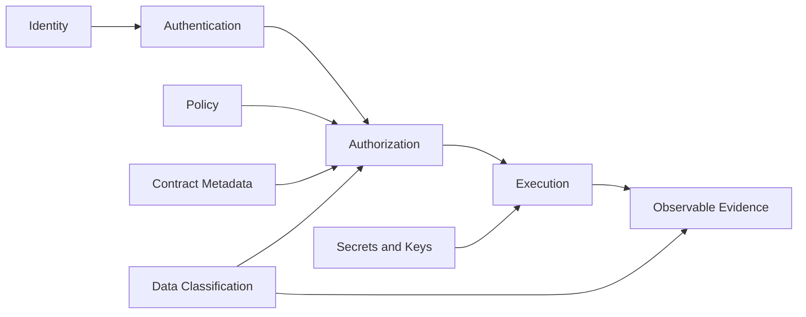

| Element | Question | Example |
|---|---|---|
| Identity | Who or what is acting? | `pipeline-case-cdc-prod`, `airflow-backfill-runner`, `flink-alerts-job` |
| Authentication | How is the actor proven? | mTLS, SASL, workload identity, OIDC token, cloud IAM |
| Authorization | What is the actor allowed to do? | read topic, write table, trigger backfill, decrypt field |
| Evidence | How do we prove what happened? | audit log, lineage event, run manifest, signed deployment metadata |

The security model should be explicit enough that a reviewer can answer this:

> If this pipeline is compromised, what data can it read, what data can it write, what decisions can it influence, and what evidence will remain?

---

## 2. Why Pipeline Security Is Harder Than Service Security

A normal request/response service has a relatively clear security boundary.

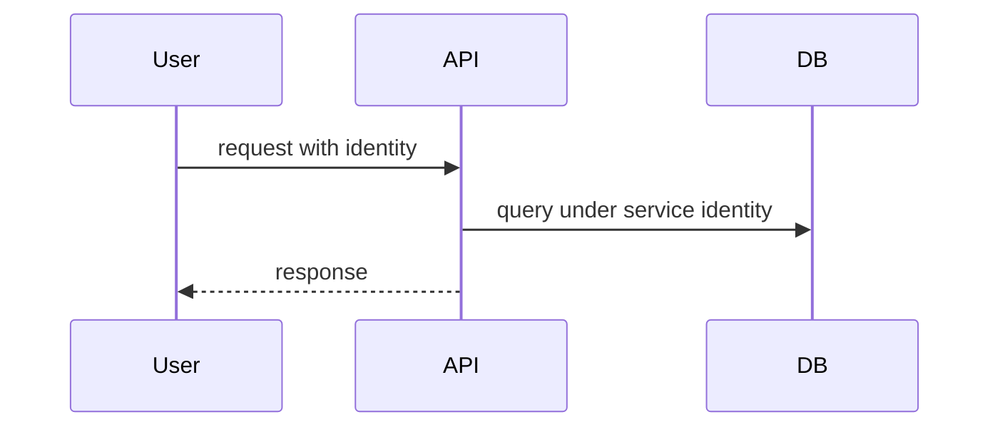

A data pipeline is different.

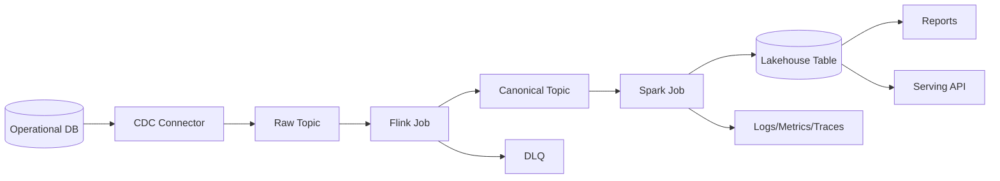

Security becomes harder because:

1. **Data moves through many systems.** A field protected in the source may leak in logs, DLQ, metrics, or derived tables.
2. **The actor changes.** Source DB user, Kafka connector principal, Flink worker identity, object storage IAM role, and BI user are not the same actor.
3. **Data outlives the request.** Topics, files, snapshots, checkpoints, state stores, DLQs, caches, and archives retain data.
4. **Replay changes blast radius.** A job that can replay five years of data has more power than a request path that reads one case.
5. **Derived data can still be sensitive.** Aggregates, embeddings, features, search indexes, and materialized views may reveal source data.
6. **Control actions are security-sensitive.** Triggering backfill, overriding quality gates, or republishing an official dataset is an authorization event.

The pipeline security model must secure both:

- the **data plane**: records, files, events, state, tables, checkpoints;
- the **control plane**: pipeline definitions, schedules, triggers, backfills, policies, promotions, run approvals.

---

## 3. Trust Boundaries

A trust boundary exists wherever an assumption changes.

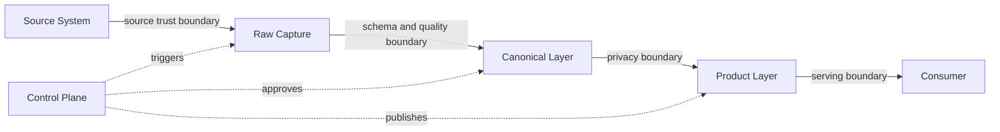

Common pipeline trust boundaries:

| Boundary | Risk |
|---|---|
| Source to ingestion | over-privileged source read, unapproved table capture, schema drift |
| Raw to canonical | invalid parsing, semantic misclassification, sensitive field propagation |
| Canonical to product | incorrect aggregation, unauthorized derived use, hidden re-identification |
| Runtime to storage | leaked credentials, broad bucket/table permissions |
| Control plane to worker | unauthorized job trigger, unapproved backfill, parameter injection |
| Worker to observability | payload in logs/traces/metrics |
| Main path to DLQ | sensitive data copied into lower-control storage |
| Backfill path to production | old code or old policy republishing current assets |

A mature pipeline platform forces each boundary to declare:

```yaml
boundary: canonical_to_gold
producer_asset: case_event_canonical
consumer_asset: enforcement_case_daily_gold
allowed_classifications:
  - internal
  - confidential
forbidden_fields:
  - citizen.national_id
  - complainant.phone_number
required_controls:
  - pii_masking
  - quality_gate
  - lineage_event
  - run_manifest
approval_required_for:
  - backfill
  - policy_override
  - retention_extension
```

Security that is not encoded becomes tribal knowledge.

Tribal security fails during incidents, handovers, and scale.

---

## 4. Threat Model for Data Pipelines

A pipeline threat model should be concrete. Do not start with abstract categories. Start with the ways a pipeline can hurt the organization.

### 4.1 Data Exfiltration

The pipeline reads more data than intended or exposes it in an uncontrolled sink.

Examples:

- CDC connector captures all tables instead of approved tables.
- Spark job writes raw payload to a debug bucket.
- DLQ topic retains full PII payload with broad read access.
- Observability system receives payload attributes.
- A backfill runner can read old sensitive partitions without approval.

### 4.2 Unauthorized Data Mutation

The pipeline writes, republishes, or deletes data it should not control.

Examples:

- A Java batch job overwrites official reporting table partitions outside its asset ownership.
- A retry job republishes corrected events into a canonical topic without review.
- A misconfigured sink can delete search index documents across tenants.
- A staging job writes into production location because environment is passed as a string.

### 4.3 Privilege Escalation Through Control Plane

A user cannot read sensitive data directly but can trigger a pipeline that materializes it somewhere else.

Examples:

- User triggers export pipeline with arbitrary SQL.
- User edits DAG parameter to include sensitive table.
- User triggers a backfill over all tenants.
- User disables masking gate through a runtime flag.

### 4.4 Integrity Attack

The pipeline output is manipulated.

Examples:

- Poison record changes aggregate result.
- Reference data is tampered before enrichment.
- Checkpoint is manipulated to skip records.
- Backfill uses a malicious jar.
- Transform version is not tied to artifact digest.

### 4.5 Evidence Tampering

The output may be correct, but evidence is missing or untrustworthy.

Examples:

- Run manifest can be overwritten.
- Lineage events are best-effort and not reconciled.
- DLQ replay has no approval record.
- Quality gate override is not signed or attributable.

Security is not only about preventing breach. It is about preserving **defensible truth**.

---

## 5. Identity Model

Every pipeline actor needs a stable identity.

Avoid this:

```text
Everything runs as default-worker.
```

Prefer this:

```text
pipeline.case-cdc.prod
pipeline.case-canonicalizer.prod
pipeline.case-alert-detector.prod
pipeline.case-daily-report.prod
pipeline.case-backfill.approved
pipeline.platform-airflow.prod
pipeline.platform-temporal-worker.prod
```

A good identity tells you:

- workload type,
- asset or domain,
- environment,
- privilege scope,
- operational purpose.

### 5.1 Identity Granularity

| Granularity | Example | Risk |
|---|---|---|
| One identity for all pipelines | `data-platform-prod` | impossible least privilege |
| One identity per runtime | `flink-prod` | jobs inherit too much access |
| One identity per domain | `case-pipelines-prod` | acceptable early, weak for regulated assets |
| One identity per pipeline asset | `case-escalation-alert-prod` | good auditability |
| One identity per run | short-lived workload identity | strongest evidence, more platform complexity |

A pragmatic platform often starts with **one identity per pipeline per environment**, then adds run-level tokens for high-risk operations such as backfill and publication.

---

## 6. Authentication Patterns

Authentication proves the actor.

Common pipeline authentication methods:

| Context | Pattern |
|---|---|
| Kafka clients | TLS, SASL, mTLS, cloud-managed identity depending on platform |
| Object storage | cloud IAM role, workload identity, temporary credentials |
| RDBMS | service account with narrow grants, short-lived token if supported |
| Internal APIs | mTLS, OAuth2 client credentials, signed service token |
| Airflow/Temporal worker | workload identity mapped to worker role |
| CI/CD | OIDC federation to cloud/deployment system |

Long-lived static credentials should be treated as a legacy exception, not the default.

The preferred model is:

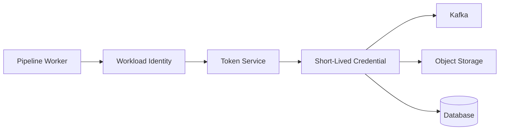

Why short-lived credentials matter:

- leaked credentials expire;
- rotation is easier;
- credentials can be bound to environment and workload;
- audit trail can include issued token context;
- emergency revocation can happen centrally.

---

## 7. Authorization Model

Authorization answers:

> Given this actor, this action, this asset, this environment, this classification, and this run context, is the action allowed?

For pipelines, authorization is not one-dimensional.

```text
allow(actor, action, resource, context)
```

Example:

```java
public record PipelinePrincipal(
    String workloadId,
    String environment,
    String tenantScope,
    Set<String> roles
) {}

public record DataResource(
    String resourceType,      // kafka-topic, table, bucket-prefix, api-endpoint
    String name,
    String domain,
    String classification,
    String owner
) {}

public record AccessContext(
    String runId,
    ProcessingMode mode,      // LIVE, REPLAY, BACKFILL, REPAIR
    boolean qualityOverride,
    boolean emergencyAccess,
    String approvalId
) {}

public enum Action {
    READ, WRITE, DELETE, PUBLISH, REPLAY, BACKFILL, OVERRIDE_GATE, DECRYPT
}

public interface PipelineAuthorizer {
    AuthorizationDecision decide(
        PipelinePrincipal principal,
        Action action,
        DataResource resource,
        AccessContext context
    );
}
```

Notice that `BACKFILL` and `REPLAY` are actions. They are not just job parameters.

A pipeline that can read one hour of data and a pipeline that can replay five years of data do not have the same risk.

---

## 8. Least Privilege for Pipeline Actors

Least privilege means the pipeline receives only the permissions required for its declared responsibility.

### 8.1 Example: CDC Pipeline

The CDC connector should be allowed to:

- read approved source tables or replication stream;
- write approved raw topics;
- write connector offsets/schema history if required;
- emit heartbeat/status metrics.

It should not be allowed to:

- read unrelated source tables;
- write canonical or gold topics;
- delete source rows;
- write arbitrary object storage paths;
- trigger downstream publication.

### 8.2 Example: Canonicalizer Job

The canonicalizer should be allowed to:

- read raw topic;
- read schema/contract registry;
- write canonical topic;
- write DLQ/quarantine topic;
- emit lineage and quality events.

It should not be allowed to:

- read source database;
- write raw topic;
- override quality gate;
- read unrelated tenants;
- access tokenization vault unless required.

### 8.3 Example: Reporting Batch Job

The reporting job should be allowed to:

- read canonical/silver tables;
- write its own staging location;
- publish to its own gold table after quality gate;
- emit reconciliation result.

It should not be allowed to:

- overwrite another report table;
- read raw PII unless explicitly approved;
- publish without run manifest;
- mutate source operational systems.

Least privilege requires asset ownership.

Without ownership, permissions become guesses.

---

## 9. Kafka Security Boundary

Kafka security for pipelines usually involves:

- authentication of clients;
- encryption in transit;
- authorization through ACLs or equivalent platform policy;
- topic-level read/write/admin separation;
- consumer group authorization;
- schema registry authorization;
- connector authorization;
- secrets and config protection;
- auditability of topic and ACL changes.

Kafka ACLs follow the idea that a principal is allowed or denied an operation on a resource pattern. Kafka's documented ACL model expresses rules in terms of principal, operation, host, and resource pattern.

### 9.1 Topic Permission Matrix

| Actor | Source topic | Target topic | DLQ | Consumer group | Admin |
|---|---:|---:|---:|---:|---:|
| CDC connector | no | write raw | write connector DLQ | no | limited connector internals |
| Canonicalizer | read raw | write canonical | write canonical DLQ | read group | no |
| Alert detector | read canonical | write alert | write alert DLQ | read group | no |
| Backfill producer | read archive | write backfill topic | write backfill DLQ | no | no |
| Platform operator | no data read by default | no data write by default | no data read by default | inspect metadata | controlled admin |

The dangerous anti-pattern is giving every pipeline:

```text
READ, WRITE, CREATE, DESCRIBE, ALTER on *
```

That converts an application bug into a platform incident.

### 9.2 Topic Naming Is Security Metadata

Topic naming should encode enough context for policy.

```text
<env>.<domain>.<layer>.<asset>.<version>

prod.case.raw.case_outbox.v1
prod.case.canonical.case_event.v2
prod.case.product.case_sla_breach.v1
prod.case.dlq.case_event_canonicalizer.v1
```

Then policy can say:

```yaml
rules:
  - principal: pipeline.case-canonicalizer.prod
    allow:
      - action: read
        topic: prod.case.raw.case_outbox.v1
      - action: write
        topic: prod.case.canonical.case_event.v2
      - action: write
        topic: prod.case.dlq.case_event_canonicalizer.v1
```

Do not rely on topic names alone for security. But names make policy review possible.

---

## 10. Object Storage Boundary

Object storage is deceptively dangerous because path-level conventions often substitute for security.

```text
s3://company-data/prod/raw/case/
s3://company-data/prod/silver/case/
s3://company-data/prod/gold/enforcement_report/
s3://company-data/prod/tmp/debug/
```

A job that can write to `s3://company-data/prod/` can accidentally or maliciously overwrite many assets.

Use narrow prefixes:

```text
s3://company-data/prod/gold/enforcement_case_daily/_staging/<runId>/
s3://company-data/prod/gold/enforcement_case_daily/_published/
```

A job should usually have:

- read permission on approved inputs;
- write permission only to its staging prefix;
- publish permission only through a controlled commit path;
- no delete permission except for its temporary workspace;
- retention/lifecycle policy managed by platform, not job code.

### 10.1 Staging and Publish Privileges

Split write and publish.

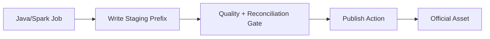

The job may write staging data. The publish step should require:

- successful quality result;
- reconciliation result;
- run manifest;
- lineage event;
- asset ownership match;
- optional approval for high-risk data.

This avoids a common failure:

> A partially successful job writes directly into the official location.

---

## 11. Database Boundary

For source databases, avoid broad application credentials.

A pipeline read identity should have:

- read access only to approved tables/views;
- no write access unless the pipeline explicitly owns an operational table such as outbox/inbox/effect ledger;
- no DDL permissions;
- no access to secrets tables;
- query limits or replica usage where possible;
- explicit statement timeout;
- predictable isolation strategy;
- audit logging.

For sink databases, prefer writing through narrow stored procedures or tables owned by the pipeline.

Do not let a pipeline use a privileged operational application account because it is “already available”.

Credential reuse is not convenience. It is privilege laundering.

---

## 12. Lakehouse and Warehouse Boundary

Lakehouse security needs to cover:

- catalog permissions;
- table permissions;
- object storage permissions;
- metadata file access;
- snapshot/time-travel access;
- branch/tag publication rights;
- delete/update rights;
- row/column policy if served through a query engine;
- retention and snapshot expiration controls.

A user or job that cannot read current table data may still be able to read old snapshots or raw files if storage permissions are too broad.

Security must align catalog and storage.

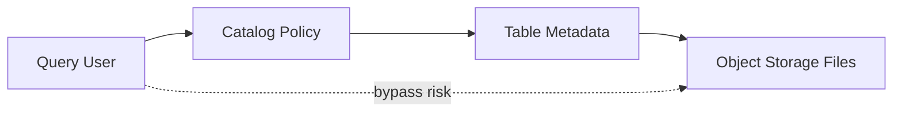

If direct object storage access bypasses catalog policy, row/column permissions become theater.

---

## 13. Secret Handling

Secrets appear in pipelines as:

- database passwords;
- API tokens;
- Kafka SASL credentials;
- TLS private keys;
- encryption keys;
- tokenization vault credentials;
- webhook signing keys;
- cloud temporary credentials;
- third-party API refresh tokens.

Rules:

1. Never store secrets in pipeline definitions.
2. Never log secrets.
3. Never pass secrets through generic job parameters visible in UI.
4. Never copy secrets into run manifests.
5. Never put secrets in Kafka headers or event payload.
6. Prefer short-lived credentials.
7. Rotate regularly and test rotation.
8. Separate secret read permission from data read permission.
9. Keep secret access observable.
10. Fail closed if a required secret is unavailable.

A Java boundary can enforce this:

```java
public interface SecretProvider {
    SecretValue get(SecretRef ref);
}

public record SecretRef(String namespace, String name, String version) {}

public final class SecretValue {
    private final char[] value;

    private SecretValue(char[] value) {
        this.value = value;
    }

    public char[] materialize() {
        return value.clone();
    }

    @Override
    public String toString() {
        return "<secret>";
    }
}
```

The important part is not the class. The important part is preventing accidental stringification.

---

## 14. Encryption Model

Encryption is not a single checkbox.

| Layer | Control |
|---|---|
| Network | TLS/mTLS between clients and brokers/APIs/databases |
| Storage | encryption at rest for topics, state, buckets, tables, checkpoints |
| Field | application-level encryption or tokenization for selected fields |
| Backup/archive | encrypted snapshots and backup storage |
| Logs/DLQ | avoid sensitive data; encrypt if retained |
| Key management | KMS/HSM, rotation, key access audit |

Encrypting the bucket does not solve overbroad access.

Encryption protects against some classes of storage compromise. Authorization determines who can use the data normally.

### 14.1 Field-Level Encryption Boundary

Use field-level encryption when infrastructure-level controls are not enough.

Example cases:

- national IDs,
- health attributes,
- payment details,
- confidential informant identity,
- enforcement evidence notes,
- personally identifying free text.

But field-level encryption complicates:

- joins,
- search,
- dedupe,
- aggregates,
- schema evolution,
- debugging,
- reprocessing,
- key rotation.

Do not encrypt fields blindly. Decide per use case.

---

## 15. Tenant Isolation

Multi-tenant pipelines need tenant isolation in four places:

1. **Input authorization**: which tenants can be read?
2. **Processing isolation**: can one tenant create backpressure for others?
3. **State isolation**: are keyed states and checkpoints tenant-scoped?
4. **Output isolation**: can output for tenant A leak to tenant B?

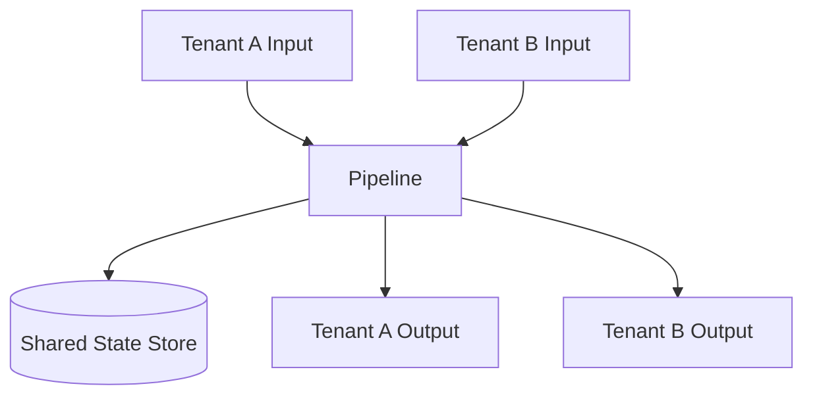

Shared state is often the leak point.

A safe key should include tenant scope when tenant isolation is required:

```java
public record TenantScopedKey(
    String tenantId,
    String entityType,
    String entityId
) {}
```

Avoid global dedupe keys unless the identifier is globally unique and allowed to cross tenant boundaries.

---

## 16. Control Plane Authorization

The control plane needs its own authorization model.

High-risk control actions:

- create pipeline;
- modify source tables;
- modify sink asset;
- change data classification;
- change retention;
- change masking policy;
- disable quality gate;
- trigger replay;
- trigger backfill;
- approve publication;
- replay DLQ;
- change schedule;
- promote code to production;
- modify service identity permissions.

These actions should produce audit events.

```java
public record ControlPlaneAuditEvent(
    String eventId,
    String actor,
    String action,
    String pipelineId,
    String assetId,
    String runId,
    String approvalId,
    Instant occurredAt,
    Map<String, String> before,
    Map<String, String> after
) {}
```

Do not treat backfill as a routine rerun. Backfill can expose, modify, and republish far more data than live processing.

---

## 17. Parameter Injection Risk

Pipeline jobs often accept parameters:

```bash
java -jar report-job.jar \
  --sourceTable case_event \
  --dateFrom 2026-01-01 \
  --dateTo 2026-01-31 \
  --targetTable enforcement_report
```

This looks harmless until someone passes:

```bash
--sourceTable raw_sensitive_all_cases
--targetTable public_export
```

Parameters are not merely strings. They are authorization-bearing inputs.

Use typed, validated parameters:

```java
public record BackfillRequest(
    AssetId sourceAsset,
    AssetId targetAsset,
    DateRange dateRange,
    ProcessingMode mode,
    ApprovalId approvalId
) {
    public BackfillRequest {
        if (dateRange.days() > 31 && approvalId == null) {
            throw new IllegalArgumentException("large backfill requires approval");
        }
    }
}
```

Validate parameters against platform registry:

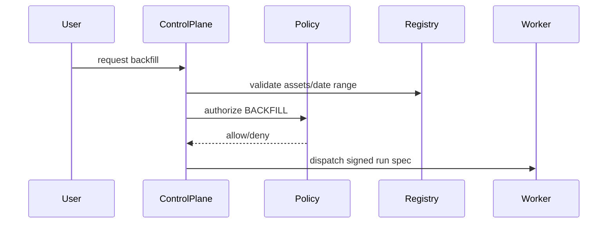

Workers should execute signed run specs, not arbitrary shell parameters.

---

## 18. Secure Run Manifest

A run manifest is security evidence.

It should capture:

- run ID;
- pipeline ID;
- workload identity;
- code artifact digest;
- container image digest;
- config version;
- contract version;
- policy version;
- source assets and positions;
- target assets;
- processing mode;
- trigger actor;
- approval IDs;
- quality gate result;
- reconciliation result;
- publication result;
- lineage event IDs.

Example:

```yaml
runId: run-20260704-0730-001
pipelineId: case-daily-report
identity: pipeline.case-daily-report.prod
mode: BACKFILL
artifact:
  imageDigest: sha256:...
  gitCommit: 7f3a91e
contracts:
  input: case_event_canonical:v2.4.0
  output: enforcement_case_daily:v1.8.0
policy:
  policySet: pipeline-prod-policy:v42
  maskingPolicy: pii-mask:v17
source:
  asset: case_event_canonical
  partitions:
    - date=2026-06-01
    - date=2026-06-02
target:
  asset: enforcement_case_daily
approval:
  id: appr-123
  approver: data-owner.case-reporting
```

If a production dataset cannot tell you which code, policy, source positions, and approval produced it, it is not defensible.

---

## 19. Secure Logging, Metrics, and Traces

Observability can become an exfiltration channel.

Dangerous examples:

```java
log.info("processing payload={}", payload);
span.setAttribute("case.note", noteText);
metrics.counter("invalid_email_" + email).increment();
```

Safer patterns:

```java
log.info(
    "processing record eventId={} source={} classification={}",
    envelope.eventId(),
    envelope.sourcePosition().summary(),
    envelope.classification()
);

span.setAttribute("pipeline.run_id", runId);
span.setAttribute("pipeline.asset", assetName);
span.setAttribute("pipeline.record.classification", classification.name());
```

Rules:

- log identifiers, not payloads;
- use stable opaque IDs where possible;
- redact known sensitive fields before logs/DLQ;
- block high-cardinality sensitive metric labels;
- prevent raw exception messages from leaking payload;
- classify observability stores as sensitive if they can contain sensitive data;
- apply retention limits;
- audit access.

OpenTelemetry explicitly recommends preventing sensitive data collection where possible and managing sensitive data through collector processors when needed. OWASP logging guidance also warns that logs can contain personal or sensitive information and must be protected from unauthorized access and tampering.

---

## 20. DLQ and Quarantine Security

DLQ is often less protected than the main path.

That is backwards.

A DLQ may contain:

- malformed raw payload;
- source metadata;
- stack traces;
- exception messages;
- partially transformed data;
- decrypted sensitive fields;
- headers and trace context;
- tenant IDs;
- business identifiers.

DLQ policy should declare:

```yaml
dlq:
  topic: prod.case.dlq.case_event_canonicalizer.v1
  classification: confidential
  payload_policy: redacted_original_plus_error_summary
  retention_days: 14
  replay_requires_approval: true
  readers:
    - group:data-platform-oncall
    - group:case-data-owner
  forbidden_fields:
    - national_id
    - phone_number
    - free_text_note_raw
```

### 20.1 Do Not Put Everything in DLQ

The lazy pattern:

```text
DLQ = original payload + full headers + stack trace
```

The secure pattern:

```text
DLQ = event id + source position + classification + sanitized payload fragment + error class + replay token
```

If replay requires the original payload, store it in a controlled quarantine asset with explicit retention and access policy.

---

## 21. State Store and Checkpoint Security

State and checkpoints can contain sensitive data.

Examples:

- dedupe keys based on personal identifiers;
- keyed state with customer/case attributes;
- window aggregate with sensitive facts;
- checkpointed operator state;
- RocksDB local state files;
- savepoints in object storage;
- Spark checkpoint/state store files;
- Kafka Streams changelog topics.

Controls:

- encrypt state storage;
- classify state and checkpoint assets;
- restrict savepoint/checkpoint access;
- avoid raw sensitive values as keys;
- hash/tokenize state keys when possible;
- define state retention/TTL;
- prevent state dump in support workflows;
- include state schema in upgrade reviews.

A savepoint can be a copy of sensitive production state. Treat it like production data.

---

## 22. Supply Chain Security for Pipeline Code

A pipeline artifact can transform, expose, or corrupt large volumes of data. Treat it like privileged production code.

Controls:

- dependency scanning;
- artifact signing;
- immutable image digests;
- provenance metadata;
- CI policy gates;
- environment-specific promotion;
- restricted manual jar upload;
- reproducible build where practical;
- separate dev/test/prod credentials;
- code review for policy-affecting changes;
- contract compatibility tests;
- security review for new sinks or new sensitive data flows.

The control plane should record artifact digest in the run manifest.

```text
Do not ask “which version ran?”
Ask “which immutable artifact digest produced this dataset?”
```

---

## 23. Environment Isolation

Development pipelines must not accidentally touch production data.

Minimum controls:

- separate identities per environment;
- separate Kafka topics or clusters;
- separate object storage prefixes/accounts;
- separate catalogs;
- separate secrets;
- production data access requires explicit approval;
- synthetic or masked data in lower environments;
- network segmentation;
- prevent `--env prod` as arbitrary parameter;
- production run specs must be created by production control plane.

A safe environment enum is not enough if the identity can access every environment.

```java
public enum Environment {
    DEV, STAGING, PROD
}
```

This only prevents typo-level mistakes. Authorization must enforce environment boundary externally.

---

## 24. Secure Publication Pattern

Official datasets should not be published by arbitrary writers.

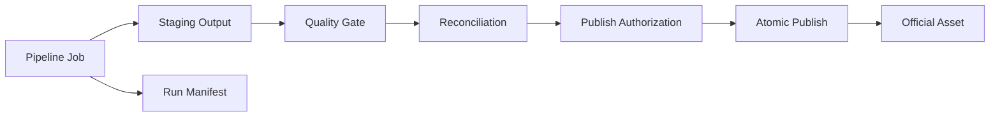

Publication authorization should check:

- target asset ownership;
- identity allowed to publish;
- run mode allowed;
- source assets allowed;
- code artifact approved;
- policy version approved;
- quality gate passed;
- reconciliation passed;
- approval exists for backfill/repair;
- no forbidden classification downgrade.

This turns publish from a filesystem write into a governed state transition.

---

## 25. Policy-as-Code for Pipelines

A policy should be reviewable, versioned, testable, and deployable.

Example policy shape:

```yaml
asset: enforcement_case_daily
classification: confidential
owner: case-reporting-data-owner
inputs:
  - case_event_canonical
  - officer_assignment_snapshot
allowed_writers:
  - pipeline.case-daily-report.prod
allowed_modes:
  live: true
  backfill: approval_required
controls:
  quality_gate: required
  reconciliation: required
  pii_scan: required
  lineage: required
retention:
  published_days: 2555
  staging_days: 7
  dlq_days: 14
forbidden_outputs:
  - national_id
  - complainant_phone
```

Policy tests:

```java
@Test
void largeBackfillRequiresApproval() {
    var decision = authorizer.decide(
        principal("pipeline.case-daily-report.prod"),
        Action.BACKFILL,
        resource("enforcement_case_daily"),
        contextWithoutApproval(ProcessingMode.BACKFILL, 180)
    );

    assertEquals(AuthorizationDecision.deny("approval required"), decision);
}
```

A policy that cannot be tested will drift.

---

## 26. Security Review Checklist

Use this review before moving a pipeline to production.

### 26.1 Identity

- Does each pipeline have a dedicated identity?
- Is identity separated by environment?
- Are high-risk backfill/repair modes separately authorized?
- Is workload identity preferred over static secrets?

### 26.2 Authorization

- Are source, sink, DLQ, checkpoint, and state permissions scoped?
- Can the pipeline write only its owned assets?
- Can it delete data? If yes, why?
- Can it read raw sensitive data? If yes, where is approval recorded?
- Are Kafka consumer groups, topics, and schema registry permissions scoped?

### 26.3 Control Plane

- Who can trigger runs?
- Who can trigger backfills?
- Who can override quality gates?
- Who can replay DLQ?
- Who can publish official assets?
- Are these actions audited?

### 26.4 Sensitive Data

- Is data classification declared at source and output?
- Are logs/traces/metrics payload-safe?
- Are DLQ/quarantine assets protected?
- Are checkpoints/savepoints classified?
- Is masking/tokenization/encryption policy explicit?

### 26.5 Evidence

- Does every run produce a manifest?
- Does the manifest include artifact digest and policy version?
- Does publication require lineage and quality evidence?
- Can an auditor reconstruct source positions and transform version?

### 26.6 Operations

- Are secret rotation and credential revocation tested?
- Are access changes reviewed?
- Are incident runbooks available?
- Is break-glass access time-bound and audited?
- Is retention enforced for staging, DLQ, checkpoint, and temporary data?

---

## 27. Common Anti-Patterns

### Anti-Pattern 1: One Super Service Account

```text
All pipelines run as data-platform-prod-admin.
```

Consequence:

- no least privilege;
- no meaningful audit;
- one compromise becomes platform compromise;
- impossible blast-radius analysis.

### Anti-Pattern 2: Security Only at the Cluster Layer

```text
Kafka is secure, so the pipeline is secure.
```

Consequence:

- DLQ leaks;
- broad topic ACLs;
- replay abuse;
- schema registry bypass;
- derived data exposure.

### Anti-Pattern 3: Debug Payload Logging

```java
log.error("failed record {}", record);
```

Consequence:

- PII in logs;
- observability store becomes sensitive data lake;
- incident responders gain accidental data access.

### Anti-Pattern 4: Backfill as Free Operation

```text
Anyone who can run the DAG can backfill any date range.
```

Consequence:

- massive data exposure;
- accidental overwrite;
- policy bypass;
- expensive unreviewed reprocessing.

### Anti-Pattern 5: Catalog Policy But Open Storage

```text
Warehouse denies table access, but users can read object storage files.
```

Consequence:

- row/column policy bypass;
- snapshot/time-travel exposure;
- raw files leak.

### Anti-Pattern 6: DLQ Without Governance

```text
DLQ is for debugging, everyone on the team can read it.
```

Consequence:

- raw sensitive data copied into uncontrolled retention;
- replay without approval;
- exception messages leak secrets.

---

## 28. Production Blueprint

A secure Java data pipeline platform should converge toward this architecture.

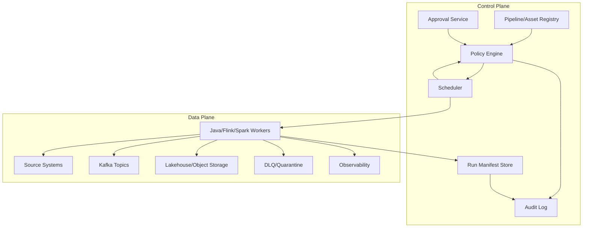

Core rules:

1. The control plane decides what may run.
2. The data plane executes with narrow identity.
3. Every output has a manifest.
4. Every high-risk action has authorization evidence.
5. Every sensitive data movement is classified.
6. Every official publication is gated.
7. Every credential is scoped and rotatable.
8. Every replay/backfill is treated as privileged.
9. Every DLQ/quarantine path is governed.
10. Every security decision is testable.

---

## 29. Final Mental Model

Security is not a layer added after the pipeline works.

Security is the set of constraints that determines whether the pipeline is allowed to exist.

A strong pipeline security model can answer:

- who acted;
- what data they could access;
- what they produced;
- which policy permitted it;
- which approval authorized it;
- which code version executed;
- which sensitive fields were protected;
- which evidence remains;
- what the blast radius would be if the actor was compromised.

If you cannot answer those questions, the pipeline may be functional, but it is not production-grade.

---

## References

- Apache Kafka Documentation — Security, authorization, and ACLs: https://kafka.apache.org/documentation/
- Apache Kafka Authorization and ACLs: https://kafka.apache.org/35/security/authorization-and-acls/
- Confluent Platform Documentation — Kafka ACL concepts: https://docs.confluent.io/platform/current/security/authorization/acls/overview.html
- OpenTelemetry Documentation — Handling sensitive data: https://opentelemetry.io/docs/security/handling-sensitive-data/
- OWASP Logging Cheat Sheet: https://cheatsheetseries.owasp.org/cheatsheets/Logging_Cheat_Sheet.html
- NIST Privacy Framework: https://www.nist.gov/privacy-framework
