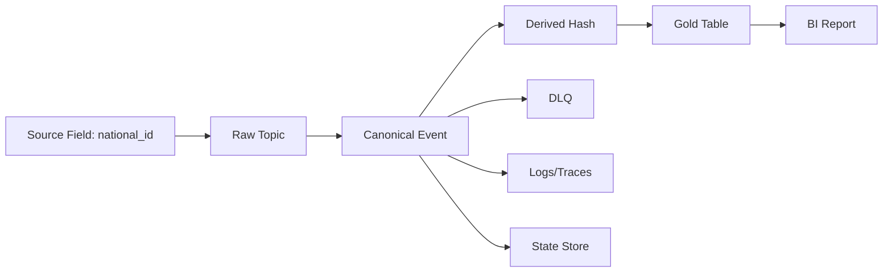
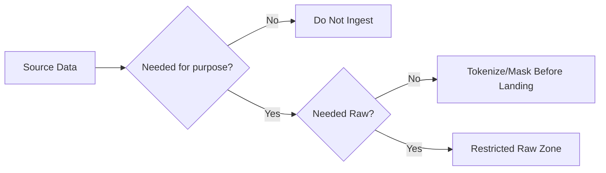
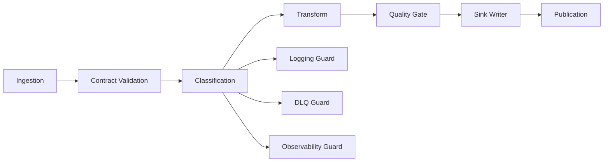
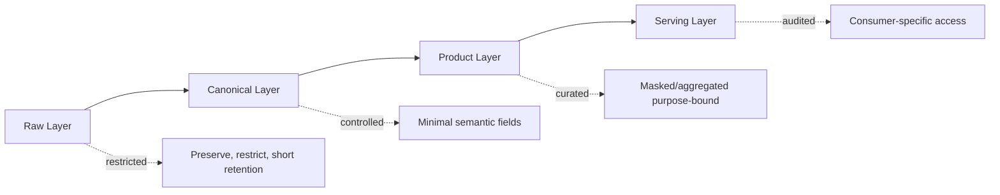
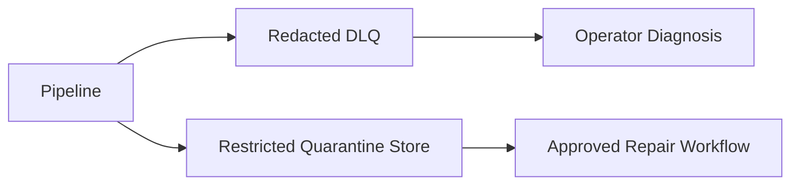
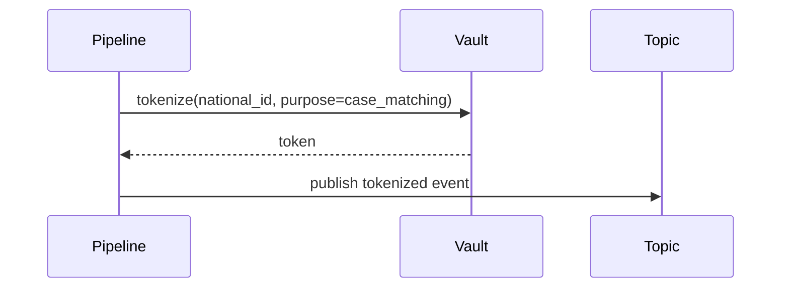
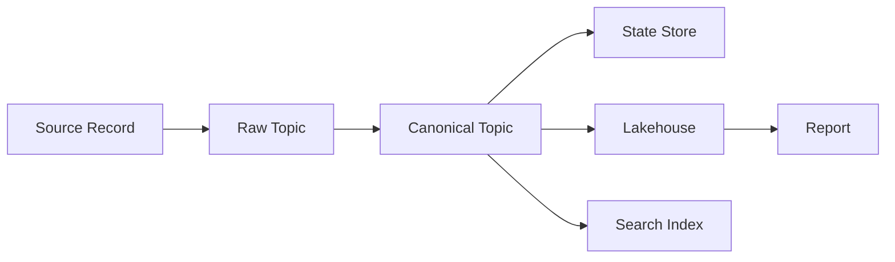
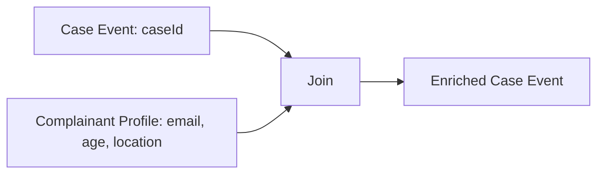
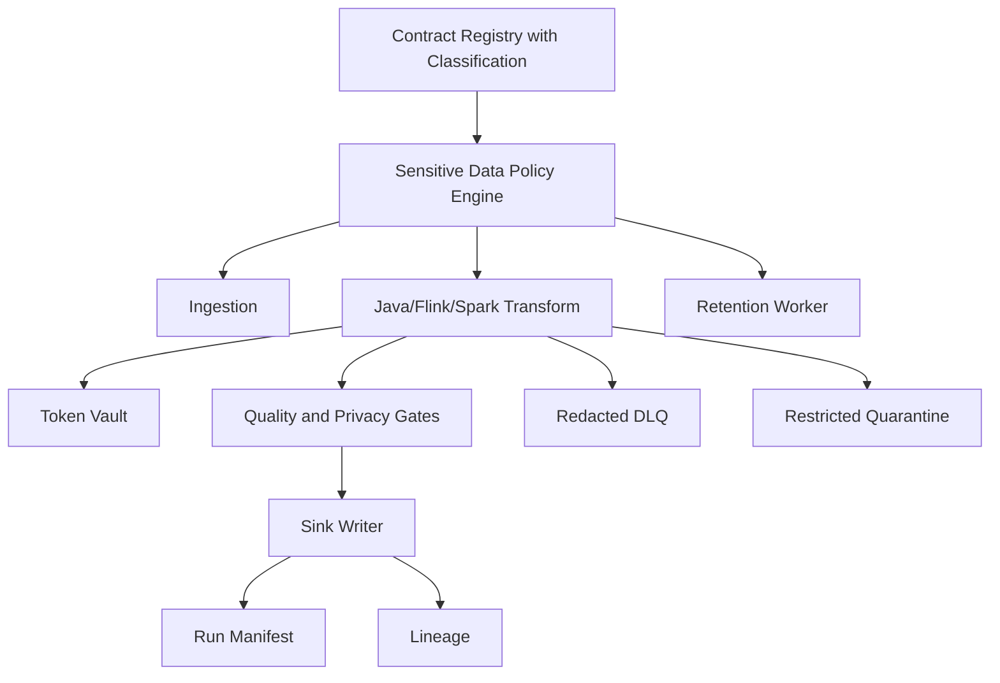

# Part 074 — PII and Sensitive Data Handling

> Sensitive data handling is not a masking function.  
> It is a lifecycle control system.

Many teams reduce PII handling to this:

```java
String masked = mask(email);
```

That is not enough.

The hard questions are:

- Why did this pipeline collect the field at all?
- Which layer is allowed to retain it?
- Which transform may derive from it?
- Which outputs may expose it?
- Which logs, metrics, traces, DLQs, state stores, and checkpoints can contain it?
- How long is it retained?
- Can it be deleted or retracted?
- Can it be re-identified when joined with other datasets?
- Does replay/backfill reintroduce fields that were removed later?
- Can an auditor prove which controls were applied?

A production-grade pipeline treats sensitive data as a **policy-bearing asset** from source to disposal.

---

## 1. Sensitive Data Is a Flow Property

A field is not sensitive only where it is born. It remains sensitive as it flows.



Each arrow is a policy decision.

A proper pipeline asks:

| Location | Could sensitive data exist? | Control |
|---|---:|---|
| Raw topic | yes | restricted access, retention, encryption, classification |
| Canonical topic | maybe | contract-driven field selection |
| Derived table | maybe | re-identification analysis |
| DLQ | often yes | redaction, quarantine, short retention |
| Logs/traces | should not | allowlist attributes only |
| State store | often yes | TTL, encryption, restricted savepoints |
| BI report | maybe | masking, aggregation, row/column security |

Sensitive data handling is not a one-time transform. It is an invariant across the graph.

---

## 2. Taxonomy of Sensitive Data

Do not use one label called `PII` for everything.

That label becomes too vague to enforce.

A more useful taxonomy:

| Category | Example | Risk |
|---|---|---|
| Direct identifier | national ID, passport, email, phone | direct identification |
| Indirect identifier | date of birth, postcode, job title | identification through combination |
| Sensitive attribute | health status, ethnicity, religion, union membership | harm or discrimination |
| Financial data | bank account, card token, payment history | fraud, financial harm |
| Credential/secret | password hash, API key, token | system compromise |
| Location data | GPS, IP-derived location | tracking |
| Free text | complaint narrative, investigation note | hidden PII, secrets, accusations |
| Behavioral data | clicks, case access history, risk score | profiling |
| Regulatory evidence | witness statement, enforcement evidence | legal/audit harm |
| Derived sensitive data | risk score, eligibility label, suspected violation | consequential decisioning |

A field can belong to multiple categories.

```yaml
field: complainant.phone_number
classification:
  level: confidential
  categories:
    - direct_identifier
    - contact_data
controls:
  raw_retention_days: 30
  canonical_allowed: false
  tokenized_allowed: true
  log_allowed: false
  dlq_policy: redacted
```

The goal is to make handling rules computable.

---

## 3. Personal Data, Pseudonymization, and Anonymization

Be precise with language.

- **Personal data** identifies or can reasonably identify a person.
- **Pseudonymized data** replaces direct identifiers with another value but can still be linked back using additional information.
- **Anonymized data** is transformed so the person is no longer identifiable, including when considering reasonably available additional information.

In practice, many datasets called “anonymous” are only pseudonymized.

Example:

```text
Original:    citizen_id = 317-44-9910, postcode = 12345, birth_date = 1989-04-12
Tokenized:   citizen_token = tok_9fe21a, postcode = 12345, birth_date = 1989-04-12
```

This may still be personal data if `citizen_token` can be linked back or if the remaining attributes can identify a person.

Do not declare data anonymized because direct identifiers were removed.

Ask:

- Can it be linked with another dataset?
- Is the token reversible?
- Is the mapping table available?
- Are quasi-identifiers retained?
- Are rare combinations preserved?
- Is free text present?
- Does the dataset represent a small population?

For regulatory-grade systems, use the conservative assumption:

> Pseudonymized data remains sensitive unless proven otherwise.

---

## 4. Data Minimization

The best way to protect sensitive data is not to collect it.



Pipeline minimization questions:

1. Is the field required for the business output?
2. Is the raw value required, or only a derived form?
3. Is the field needed after enrichment?
4. Is it needed for replay/debugging?
5. Can replay use source system instead of retaining raw copy?
6. Can field be dropped before DLQ/log/state?
7. Can access be time-bound?
8. Can retention differ by layer?

Minimization should be encoded at contract level:

```yaml
input_contract: case_created_raw:v1
fields:
  complainantEmail:
    required_for:
      - notification_dedupe
    raw_allowed_layers:
      - raw
    derived_allowed_layers:
      - canonical
    derived_forms:
      - hmac_sha256_lowercase
    forbidden_layers:
      - gold
      - observability
```

If a field has no declared purpose, the pipeline should reject or drop it.

---

## 5. Classification as Code

Classification should not live only in a spreadsheet.

Use classification metadata in schema/contract definitions.

Example:

```yaml
schema: CaseCreatedEvent
version: 2.1.0
fields:
  caseId:
    type: string
    classification: internal
    categories: [business_identifier]
  complainantEmail:
    type: string
    classification: confidential
    categories: [direct_identifier, contact_data]
    controls:
      log: forbidden
      dlq: redacted
      gold: forbidden
      tokenization: required
  allegationText:
    type: string
    classification: restricted
    categories: [free_text, potential_sensitive_attribute]
    controls:
      raw_retention_days: 14
      pii_scan: required
      log: forbidden
      full_text_index: approval_required
```

In Java, make classification part of the model:

```java
public enum SensitivityLevel {
    PUBLIC,
    INTERNAL,
    CONFIDENTIAL,
    RESTRICTED
}

public enum SensitiveCategory {
    DIRECT_IDENTIFIER,
    INDIRECT_IDENTIFIER,
    CONTACT_DATA,
    FINANCIAL_DATA,
    HEALTH_DATA,
    LOCATION_DATA,
    FREE_TEXT,
    CREDENTIAL,
    DERIVED_DECISION_DATA
}

public record FieldClassification(
    String fieldPath,
    SensitivityLevel level,
    Set<SensitiveCategory> categories,
    FieldControls controls
) {}

public record FieldControls(
    boolean logAllowed,
    boolean dlqRawAllowed,
    boolean goldAllowed,
    boolean tokenizationRequired,
    int retentionDays
) {}
```

Do not make classification optional.

Unknown classification should fail closed at sensitive boundaries.

---

## 6. Policy Enforcement Points

Sensitive data policy must be enforced at multiple points.



Policy enforcement points:

| Point | Enforcement |
|---|---|
| Ingestion | reject/drop unapproved sensitive fields |
| Contract validation | require classification metadata |
| Transform | prevent forbidden propagation |
| Sink writer | block writes to unauthorized layer |
| DLQ writer | redact or quarantine payload |
| Logger/tracer | allowlist safe attributes only |
| Publication gate | validate output schema and classification downgrade |
| Backfill runner | apply current policy or declared historical policy |
| Lineage emitter | include classification without leaking values |
| Retention worker | delete/expire according to policy |

The platform should not rely on every developer remembering every rule.

Rules must be embodied in shared libraries and gates.

---

## 7. Masking, Redaction, Tokenization, Hashing, and Encryption

These words are often mixed. They are not interchangeable.

| Technique | Reversible? | Typical use | Caveat |
|---|---:|---|---|
| Redaction | no | remove field from output/log | loses utility |
| Masking | partially | display/debug limited value | still may identify |
| Tokenization | usually yes through vault | join/reference without raw value | token vault becomes high-value system |
| Hashing | no if done well | dedupe/join on normalized value | vulnerable to dictionary attack if unsalted/low entropy |
| HMAC | no without secret key | deterministic secure matching | key management required |
| Encryption | yes | protect stored/transmitted value | authorized readers can still see raw value |
| Generalization | no | reduce precision | may reduce utility |
| Aggregation | no | reporting | small groups can re-identify |
| Differential privacy | no direct row exposure | statistical release | complexity and utility tradeoff |

### 7.1 Redaction

Use redaction when downstream does not need the value.

```java
public final class Redactor {
    public JsonNode redact(JsonNode input, Set<String> forbiddenPaths) {
        ObjectNode copy = input.deepCopy();
        for (String path : forbiddenPaths) {
            removePath(copy, path);
        }
        return copy;
    }

    private void removePath(ObjectNode root, String path) {
        // Implementation detail intentionally simplified.
        // In production, use a tested JSON path library and clear semantics.
    }
}
```

Redaction is the safest default for logs, traces, and DLQ summaries.

### 7.2 Masking

Masking keeps limited information for human use.

```text
email: john.smith@example.com -> j***@example.com
phone: +62-812-3456-7890 -> +62-812-****-7890
national_id: 317449910 -> ********910
```

Masking is not anonymization.

A masked email domain plus event context can still identify someone.

### 7.3 Tokenization

Tokenization replaces a value with a surrogate.

```text
national_id = 317449910
citizen_token = tok_cz_7Yk2M9
```

Use tokenization when:

- downstream must join records by person/entity;
- raw value should not leave controlled boundary;
- reversal is needed by a small approved service;
- token lifecycle and access can be governed.

Design rules:

- token namespace per domain/purpose;
- separate token vault access from pipeline access;
- audit detokenization;
- avoid using the same token across unrelated domains unless approved;
- support token rotation or re-issuance strategy;
- document whether token is deterministic.

### 7.4 Hashing and HMAC

Plain hashing of low-entropy identifiers is often weak.

```text
sha256(email) // vulnerable to dictionary attack over common emails
```

Prefer HMAC with a secret key for deterministic matching:

```java
public final class HmacTokenizer {
    private final Mac mac;

    public HmacTokenizer(SecretKey key) throws NoSuchAlgorithmException, InvalidKeyException {
        this.mac = Mac.getInstance("HmacSHA256");
        this.mac.init(key);
    }

    public String tokenForEmail(String email) {
        String normalized = email.trim().toLowerCase(Locale.ROOT);
        byte[] digest = mac.doFinal(normalized.getBytes(StandardCharsets.UTF_8));
        return Base64.getUrlEncoder().withoutPadding().encodeToString(digest);
    }
}
```

Caveats:

- key rotation is hard;
- deterministic tokens enable linkage;
- normalization must be stable;
- tokens may still be personal data if linkable to a person.

### 7.5 Encryption

Encryption protects confidentiality while preserving reversibility.

Use field encryption when:

- raw value must be stored;
- access must be restricted beyond table/topic-level permission;
- only a small reader set may decrypt;
- key access can be audited.

Avoid encryption when downstream needs broad searching, joining, sorting, or aggregation unless you design specifically for that.

---

## 8. Free Text Is the Hard Mode

Structured fields are easier.

Free text can contain anything:

```text
"The complainant, Maria at +62 812..., said Officer Budi visited her address..."
```

Risks:

- direct identifiers hidden in text;
- names and addresses;
- health/financial/legal allegations;
- secrets pasted by users;
- offensive or harmful content;
- facts about third parties;
- rare events that identify a person.

Controls:

1. classify free text as high risk by default;
2. avoid copying raw free text into canonical events unless necessary;
3. scan for sensitive entities before indexing/searching;
4. separate raw narrative from derived categories;
5. restrict full-text search access;
6. redact before logs/DLQ;
7. define retention shorter than structured facts where possible;
8. review model/AI usage separately if text is used for NLP.

A pipeline that treats free text as `String` has already lost information about risk.

Use a domain type:

```java
public record RestrictedFreeText(String value) {
    @Override
    public String toString() {
        return "<restricted-free-text>";
    }
}
```

This does not solve privacy by itself, but it prevents accidental logging and forces explicit handling.

---

## 9. Layered Handling Policy

Different pipeline layers should have different sensitive-data rules.



| Layer | Rule |
|---|---|
| Raw | preserve source only if needed; high restriction; short retention when possible |
| Canonical | minimize; tokenize identifiers; remove fields not needed for domain facts |
| Silver/curated | enforce semantic and privacy contracts |
| Gold/product | purpose-specific; no raw PII unless explicitly justified |
| Serving | row/column/purpose access control; audit queries |
| Observability | payload-free by default |
| DLQ/quarantine | redacted or restricted with short retention |
| Checkpoint/state | classified, encrypted, TTL-managed |

The common failure is letting raw-layer convenience leak into every layer.

---

## 10. Classification Propagation

If an input field is sensitive, derived fields may also be sensitive.

Example:

```text
birth_date -> age
postcode + age + case_type -> re-identification risk
national_id -> hmac_national_id
free_text -> allegation_category
case_score -> derived decision data
```

Classification propagation needs rules:

```yaml
propagation_rules:
  - from_category: direct_identifier
    transform: hmac
    output_category: pseudonymous_identifier
    output_level: confidential
  - from_category: restricted_free_text
    transform: classify_category
    output_category: derived_decision_data
    output_level: confidential
  - from_fields: [postcode, birth_date, gender]
    transform: combine
    output_level: confidential
    reason: quasi_identifier_combination
```

Do not assume derived means safe.

Derived fields can be more harmful than source fields because they affect decisions.

---

## 11. Java Policy Engine Skeleton

A simple policy engine can block common mistakes.

```java
public enum PipelineLayer {
    RAW, CANONICAL, SILVER, GOLD, SERVING, OBSERVABILITY, DLQ, STATE
}

public enum FieldAction {
    READ, WRITE, LOG, TRACE, METRIC_LABEL, DLQ_RAW, INDEX, DECRYPT, DETOKENIZE
}

public record FieldPolicyRequest(
    String pipelineId,
    String fieldPath,
    SensitivityLevel level,
    Set<SensitiveCategory> categories,
    PipelineLayer targetLayer,
    FieldAction action,
    ProcessingMode mode
) {}

public record FieldPolicyDecision(
    boolean allowed,
    String reason,
    Set<String> requiredTransforms
) {
    public static FieldPolicyDecision deny(String reason) {
        return new FieldPolicyDecision(false, reason, Set.of());
    }

    public static FieldPolicyDecision allow(Set<String> requiredTransforms) {
        return new FieldPolicyDecision(true, "allowed", requiredTransforms);
    }
}

public interface SensitiveDataPolicy {
    FieldPolicyDecision decide(FieldPolicyRequest request);
}
```

Example rule:

```java
public final class DefaultSensitiveDataPolicy implements SensitiveDataPolicy {
    @Override
    public FieldPolicyDecision decide(FieldPolicyRequest request) {
        if (request.action() == FieldAction.LOG || request.action() == FieldAction.TRACE) {
            if (request.level().ordinal() >= SensitivityLevel.CONFIDENTIAL.ordinal()) {
                return FieldPolicyDecision.deny("confidential fields cannot enter observability");
            }
        }

        if (request.targetLayer() == PipelineLayer.GOLD
            && request.categories().contains(SensitiveCategory.DIRECT_IDENTIFIER)) {
            return FieldPolicyDecision.deny("direct identifiers forbidden in gold layer");
        }

        if (request.targetLayer() == PipelineLayer.CANONICAL
            && request.categories().contains(SensitiveCategory.DIRECT_IDENTIFIER)) {
            return FieldPolicyDecision.allow(Set.of("tokenize"));
        }

        return FieldPolicyDecision.allow(Set.of());
    }
}
```

A real engine would use externalized policy. The important point is that policy decisions are made before data crosses boundaries.

---

## 12. Redaction Guard for Logs and Traces

Do not rely on developer discipline.

Wrap logging and tracing.

```java
public final class SafeEventLog {
    private final Logger log;

    public SafeEventLog(Logger log) {
        this.log = log;
    }

    public void recordFailed(Envelope<?> envelope, Throwable error) {
        log.warn(
            "record_failed runId={} eventId={} source={} classification={} errorType={}",
            envelope.runId(),
            envelope.eventId(),
            envelope.sourcePosition().summary(),
            envelope.classification(),
            error.getClass().getSimpleName()
        );
    }
}
```

Avoid:

```java
log.warn("record failed: {}", envelope.payload(), error);
```

Also avoid exception messages that contain payload fragments from parser libraries.

Sanitize error output:

```java
public record SafeError(
    String errorClass,
    String errorCode,
    String safeMessage
) {}
```

OpenTelemetry spans should also use allowlisted attributes.

```java
span.setAttribute("pipeline.run_id", runId);
span.setAttribute("pipeline.asset", assetName);
span.setAttribute("pipeline.error_code", errorCode);
// Do not set payload, email, name, phone, address, document text, etc.
```

---

## 13. DLQ and Quarantine for Sensitive Data

There are two common strategies.

### 13.1 Redacted DLQ

Useful when operators only need enough context to diagnose class of failure.

```json
{
  "eventId": "evt-123",
  "sourcePosition": "case-outbox:partition-3:offset-90012",
  "schemaVersion": "case-created:v2",
  "classification": "restricted",
  "errorCode": "INVALID_EVENT_TIME",
  "safePayloadPreview": {
    "caseId": "case-891",
    "eventType": "CASE_CREATED",
    "complainantEmail": "<redacted>",
    "allegationText": "<redacted>"
  }
}
```

### 13.2 Restricted Quarantine

Useful when original payload is needed for repair/replay.



Quarantine controls:

- restricted readers;
- short retention;
- replay approval;
- audit log;
- encryption;
- no broad search;
- no export by default;
- reason-coded access;
- link from DLQ through replay token, not raw payload.

DLQ is not a trash bin. It is an evidence-bearing risk asset.

---

## 14. Token Vault Pattern

When tokenization is needed, keep the mapping in a controlled service.



Token vault responsibilities:

- normalize input consistently;
- issue deterministic or random tokens depending on purpose;
- store mapping securely if reversible;
- audit tokenization and detokenization;
- separate duties between tokenization and detokenization;
- support purpose-specific namespaces;
- support rotation strategy;
- rate limit access;
- prevent bulk detokenization without approval.

Pipeline responsibility:

- never log raw input;
- never store token vault credentials in code/config;
- never write raw value after tokenization boundary;
- classify token as sensitive if linkable;
- record tokenization policy version in run manifest.

---

## 15. Retention and Disposal

Retention is part of sensitive data handling.

```yaml
retention:
  raw:
    restricted_free_text: 14d
    direct_identifier: 30d
  canonical:
    tokenized_identifier: 2555d
    direct_identifier: forbidden
  dlq:
    redacted: 14d
    raw_quarantine: 7d
  checkpoints:
    live_state: policy_ttl
    savepoints: 30d
  logs:
    safe_logs: 90d
    sensitive_logs: forbidden
```

A retention policy must cover:

- raw topics;
- object storage raw files;
- staging data;
- published tables;
- snapshots and time travel;
- checkpoints/savepoints;
- Kafka Streams changelog topics;
- Flink state backend/checkpoint storage;
- Spark checkpoint/state store;
- DLQ/quarantine;
- logs/traces/metrics;
- caches;
- exported reports;
- backup/archive.

A common failure:

> The published table has retention, but old snapshots, staging files, and DLQs retain the same data forever.

Retention must be graph-wide.

---

## 16. Deletion and Correction

Sensitive data lifecycle includes deletion, correction, and suppression.

In pipelines, deletion is hard because data has propagated.



A deletion request may require:

- source deletion marker;
- CDC tombstone;
- canonical suppression event;
- table delete/update;
- search index delete;
- cache invalidation;
- state cleanup;
- derived aggregate restatement;
- report suppression;
- DLQ/quarantine cleanup;
- backup retention handling;
- evidence record.

Do not model deletion as only a database delete.

Use explicit lifecycle events:

```java
public sealed interface PrivacyLifecycleEvent permits
    SubjectSuppressionRequested,
    SubjectSuppressionApplied,
    SubjectCorrectionRequested,
    SubjectCorrectionApplied {}

public record SubjectSuppressionRequested(
    String requestId,
    String subjectToken,
    String reasonCode,
    Instant requestedAt
) implements PrivacyLifecycleEvent {}
```

For regulated systems, deletion may be constrained by legal retention obligations. The pipeline should support suppression, masking, access restriction, and evidence preservation as distinct actions.

---

## 17. Backfill and Replay Under Current Policy

Backfill is a sensitive-data risk.

Old data may contain fields that are no longer allowed.

Old transform versions may not apply current masking.

Old DLQ logic may write raw payload.

Therefore, every backfill needs a policy decision:

| Choice | Meaning | Risk |
|---|---|---|
| Current policy | apply today's sensitive-data rules | output may differ from historical output |
| Historical policy | reproduce exactly what old pipeline did | may reintroduce unsafe handling |
| Compatibility policy | old semantics with current safety controls | more engineering work |

Default recommendation:

> Reprocessing may use historical business semantics, but sensitive-data controls should fail closed against current policy unless explicitly approved.

Run manifest must record:

- policy version used;
- transform version used;
- masking/tokenization version;
- retention exception if any;
- approval ID;
- affected partitions/subjects;
- output classification.

---

## 18. Re-identification Risk

Removing direct identifiers is insufficient when quasi-identifiers remain.

Example:

```text
age = 47
postcode = 12345
case_type = rare enforcement category
hearing_date = 2026-02-03
```

This combination may identify a person in a small population.

Risk increases with:

- small groups;
- rare categories;
- precise time/location;
- multiple linked datasets;
- stable tokens;
- free text;
- high-dimensional features;
- public external data.

Mitigations:

- generalize location/time;
- suppress rare categories;
- aggregate with minimum group size;
- add noise for statistical release where appropriate;
- limit join keys;
- use purpose-specific tokens;
- perform privacy review for new derived datasets;
- monitor outputs for small-cell counts.

Do not let a pipeline publish a gold report with tiny groups unless the privacy policy allows it.

Example gate:

```java
public record SmallCellCheck(String dimension, long minCount) implements QualityCheck {
    @Override
    public QualityResult evaluate(Dataset dataset) {
        // Conceptual: group by dimension and reject if any group is below minCount.
        return dataset.minGroupSize(dimension) < minCount
            ? QualityResult.fail("small cell risk for " + dimension)
            : QualityResult.pass();
    }
}
```

---

## 19. Sensitive Data in State and Checkpoints

State is often forgotten.

A Flink job may store:

- last event per subject;
- dedupe keys;
- reference data;
- window aggregations;
- pending alerts;
- timer metadata;
- enrichment cache.

A Kafka Streams app may store:

- RocksDB local state;
- changelog topics;
- repartition topics;
- standby replicas.

Spark Structured Streaming may store:

- checkpoint metadata;
- state store files;
- offset logs;
- commit logs.

Classify state as data.

Controls:

- avoid raw sensitive values in keys;
- set TTL where correctness permits;
- encrypt state storage;
- restrict checkpoint/savepoint access;
- include state cleanup in deletion workflow;
- avoid exporting state dumps to support tickets;
- review state schema changes for privacy;
- record state retention policy.

State is not implementation detail when it contains personal data.

---

## 20. Sensitive Data in Joins and Enrichment

Enrichment can silently increase sensitivity.



The output may be more sensitive than both inputs because it combines contexts.

Rules:

1. Join output classification must be recalculated.
2. Reference data classification must propagate.
3. Join keys must not leak raw identifiers.
4. Missing-reference DLQ must not include raw join payload.
5. Enrichment cache must have retention and access control.
6. Derived flags should be classified if used for decisions.

A join is not just a technical operation. It is a privacy amplification point.

---

## 21. Sink-Specific Sensitive Data Controls

### 21.1 Kafka Topics

- topic classification metadata;
- ACLs per topic and consumer group;
- retention by classification;
- compaction/tombstone implications;
- schema registry classification;
- redacted DLQ topics;
- separate raw and sanitized topics;
- backfill topic controls.

### 21.2 Object Storage and Lakehouse

- prefix/table-level classification;
- catalog and storage permission alignment;
- encryption at rest;
- snapshot/time-travel retention;
- delete file handling;
- orphan file cleanup;
- branch/tag access controls;
- staging data retention.

### 21.3 Search Index

Search indexes are high risk because they make data easy to discover.

Controls:

- do not index raw sensitive fields unless required;
- field-level search policy;
- query audit;
- document-level access control;
- deletion propagation;
- no broad wildcard access to restricted index;
- prevent debug index copies.

### 21.4 BI and Reporting

- row/column access;
- small-cell suppression;
- export restrictions;
- dashboard sharing controls;
- aggregate privacy review;
- report snapshot retention;
- audit query access.

### 21.5 Feature Stores and ML Pipelines

- feature classification;
- training data lineage;
- label sensitivity;
- membership inference risk review for sensitive domains;
- model artifact governance;
- online/offline consistency without raw PII leakage;
- feature retention policy.

---

## 22. Testing Sensitive Data Controls

Sensitive-data controls must be tested like business logic.

Test categories:

| Test | Purpose |
|---|---|
| schema classification test | every field has classification |
| forbidden field test | raw PII cannot enter gold output |
| log safety test | pipeline logs do not contain seeded PII |
| DLQ redaction test | failed records are redacted/quarantined |
| policy decision test | backfill of restricted data requires approval |
| tokenization determinism test | same normalized input produces expected token |
| re-identification guard test | small-cell outputs are blocked |
| retention test | staging/DLQ/checkpoint expiration configured |
| deletion propagation test | suppression event reaches derived sinks |
| replay policy test | old raw data cannot bypass current controls |

Example log safety test:

```java
@Test
void logsDoNotContainSensitivePayload() {
    var piiEmail = "alice.private@example.com";
    var envelope = testEnvelopeWithEmail(piiEmail);

    pipeline.process(envelope);

    String logs = testLogAppender.contents();
    assertFalse(logs.contains(piiEmail));
    assertTrue(logs.contains(envelope.eventId()));
}
```

Example output contract test:

```java
@Test
void goldSchemaMustNotContainDirectIdentifiers() {
    var outputContract = contractRegistry.load("enforcement_case_daily:v1");

    var violations = outputContract.fields().stream()
        .filter(f -> f.categories().contains(SensitiveCategory.DIRECT_IDENTIFIER))
        .toList();

    assertTrue(violations.isEmpty(), "gold output contains direct identifiers: " + violations);
}
```

---

## 23. Incident Response for Sensitive Data Leakage

A sensitive-data incident runbook should answer quickly:

1. What field leaked?
2. Which asset contains it?
3. Which runs produced it?
4. Which source positions were involved?
5. Which consumers read it?
6. Which logs/traces/DLQs/checkpoints also contain it?
7. Which snapshots/backups retain it?
8. Can access be revoked immediately?
9. Can asset be quarantined?
10. Can data be deleted, masked, or superseded?
11. Which reports/decisions used the leaked data?
12. Which evidence must be preserved?

Lineage and run manifests are not optional during privacy incidents.

Without them, incident response becomes archaeology.

---

## 24. Production Blueprint

A sensitive-data-aware Java pipeline platform should look like this.



Core invariants:

1. Every field has classification.
2. Unknown classification fails closed at sensitive boundaries.
3. Raw sensitive data is minimized.
4. Direct identifiers do not reach product layers unless explicitly approved.
5. Logs, traces, and metrics are payload-free by default.
6. DLQ/quarantine are governed assets.
7. State/checkpoint/savepoint storage is classified.
8. Backfill/replay applies explicit privacy policy.
9. Retention covers all copies, not just published tables.
10. Lineage proves where sensitive data moved.

---

## 25. Final Mental Model

Sensitive data handling is not about hiding fields at the end.

It is about preserving control over data meaning, movement, visibility, retention, and evidence across the whole pipeline graph.

The senior engineering question is not:

> Did we mask PII?

The real questions are:

- Did we need to ingest it?
- Did we classify it?
- Did we minimize it?
- Did we prevent unauthorized propagation?
- Did we protect every copy?
- Did we avoid observability leakage?
- Did we govern DLQ and state?
- Did we handle replay and backfill safely?
- Did we define retention and deletion behavior?
- Can we prove all of this after the fact?

If yes, you have sensitive-data handling.

If no, you only have masking code.

---

## References

- NIST Privacy Framework: https://www.nist.gov/privacy-framework
- OpenTelemetry Documentation — Handling sensitive data: https://opentelemetry.io/docs/security/handling-sensitive-data/
- OWASP Logging Cheat Sheet: https://cheatsheetseries.owasp.org/cheatsheets/Logging_Cheat_Sheet.html
- GDPR Recital 26 — Personal data, pseudonymisation, and anonymous information: https://gdpr-info.eu/recitals/no-26/
- ICO Guidance — Pseudonymisation: https://ico.org.uk/for-organisations/uk-gdpr-guidance-and-resources/data-sharing/anonymisation/pseudonymisation/
- Apache Kafka Documentation — Security and ACLs: https://kafka.apache.org/documentation/
