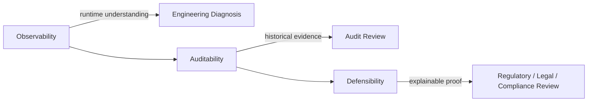
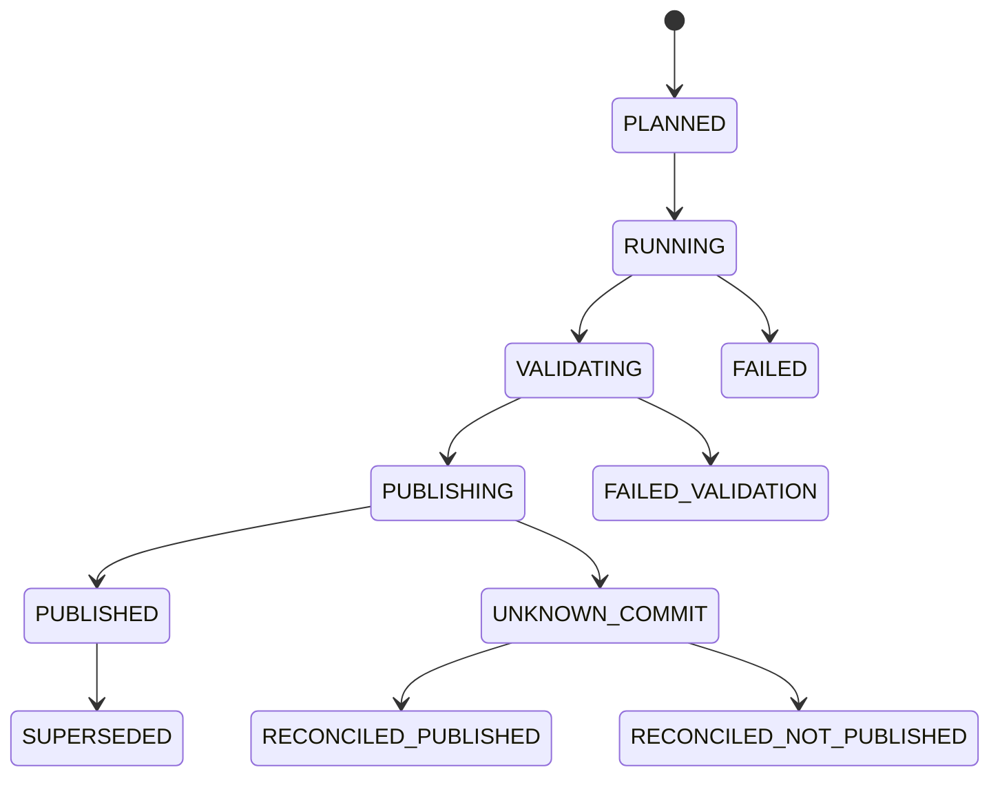
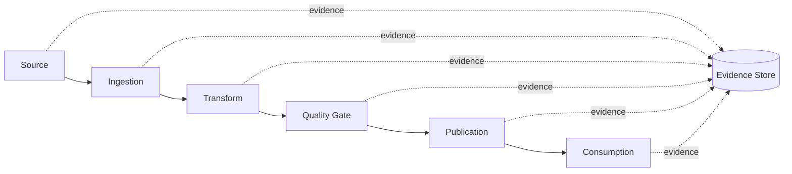
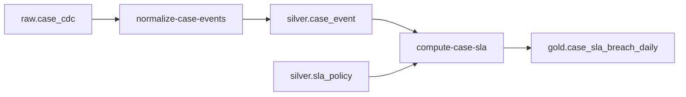
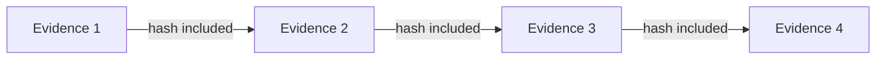
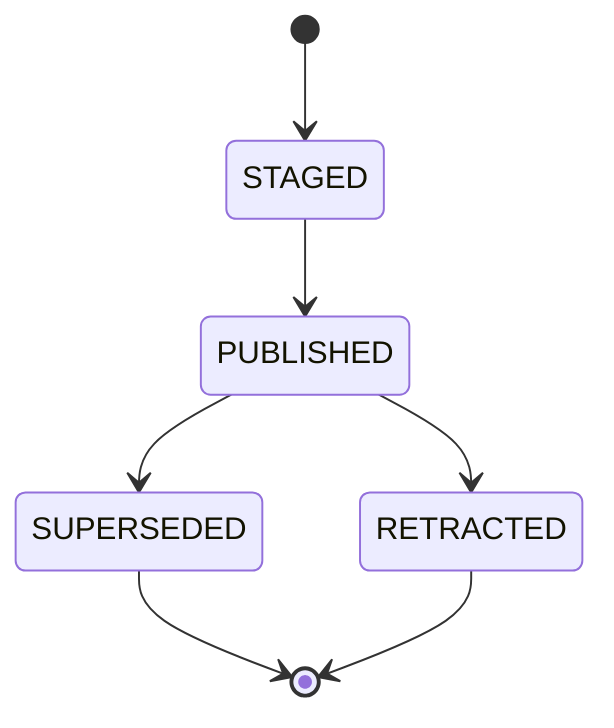
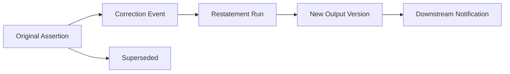
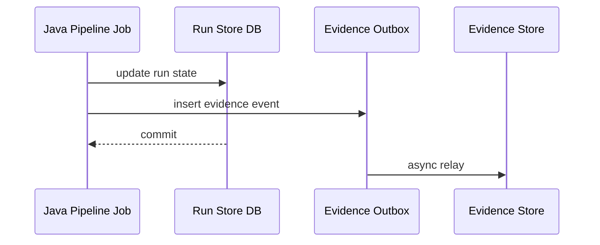
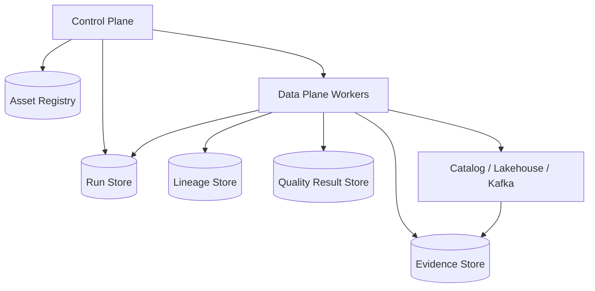

# Part 075 — Auditability and Regulatory Defensibility

> A pipeline is not defensible because it produced the correct answer once.  
> It is defensible when you can prove how, when, from what input, under which rules, and by whom that answer was produced.

In ordinary engineering language, auditability means "we have logs".

In regulated systems, that is too weak.

A regulator, internal audit team, legal reviewer, incident commander, or senior engineering owner may ask:

- What exact input records contributed to this output?
- Which version of the transformation logic was used?
- Which schema and data contract were enforced?
- Which quality checks passed, warned, or failed?
- Was late data included or excluded?
- Was a correction applied after the original publication?
- Who approved the backfill?
- Was sensitive data masked before leaving the controlled zone?
- Can the output be reproduced from retained evidence?
- Did the pipeline violate its freshness, completeness, or accuracy SLO?
- What changed between report version A and report version B?

A production-grade Java data pipeline must be built as an **evidence-generating system**.

The goal is not bureaucracy. The goal is operational truth.

---

## 1. Defensibility Is Stronger Than Observability

Observability answers:

> What is the system doing?

Auditability answers:

> What did the system do?

Regulatory defensibility answers:

> Can we prove that what the system did was authorized, explainable, reproducible, and consistent with policy?



A metric like `records_processed_total=10_000` is useful, but not enough.

A defensible pipeline needs evidence such as:

- run identity
- input dataset identity
- source offsets or file manifests
- schema versions
- transformation version
- configuration version
- quality result set
- publication decision
- output snapshot ID
- approval record for exceptional operations
- correction lineage
- retention policy
- access-control evidence

In other words: the pipeline must leave behind a **chain of custody**.

---

## 2. The Core Invariant

The defensibility invariant is:

> For every published output, the platform can identify its input, logic, policy, runtime context, quality decision, publisher, and replacement history.

That means every output must be traceable to:

```text
Output = f(Input, Transform, Config, ReferenceData, Policy, Runtime)
```

Where each element is versioned or otherwise pinned.

| Element | Evidence Required |
|---|---|
| Input | Source offset, file manifest, table snapshot, API cursor, CDC position |
| Transform | Git commit, artifact checksum, semantic transform version |
| Config | Runtime parameters, feature flags, threshold values |
| Reference data | Lookup table snapshot/version/effective time |
| Policy | data contract, quality policy, access policy, retention policy |
| Runtime | run ID, worker identity, start/end time, retry history |
| Output | sink commit ID, table snapshot, topic offsets, report version |

If any element is missing, the output may still be useful, but it is weaker as evidence.

---

## 3. The Run Manifest Pattern

A **run manifest** is the control-plane record that describes one execution of a pipeline job.

It is not a log line. It is a structured, queryable, immutable-or-append-only record.

```java
public record PipelineRunManifest(
    RunId runId,
    PipelineId pipelineId,
    String pipelineVersion,
    String artifactDigest,
    String gitCommit,
    TriggerInfo trigger,
    ExecutionWindow executionWindow,
    List<InputEvidence> inputs,
    List<OutputEvidence> outputs,
    List<ContractEvidence> contracts,
    List<QualityEvidence> qualityResults,
    List<PolicyEvidence> policies,
    RuntimeEvidence runtime,
    PublicationDecision publicationDecision,
    Optional<RunId> supersedesRunId,
    Instant createdAt
) {}
```

The manifest gives the pipeline a durable memory.

### 3.1 Minimal Manifest State Machine



Do not represent a pipeline run as just `success` or `failed`.

That loses important states:

- validation failed but compute succeeded
- publish started but outcome is unknown
- output was published but later superseded
- output was published with warnings
- output was rolled back or hidden
- output was accepted under exception approval

Those distinctions matter during audit.

---

## 4. Evidence Trail by Pipeline Boundary

A pipeline has several boundaries. Each boundary must produce different evidence.



### 4.1 Source Evidence

Examples:

- Kafka topic, partition, start offset, end offset
- CDC LSN/binlog position
- file URI, size, checksum, manifest ID
- object storage version ID
- API endpoint, cursor, response hash, request window
- database table snapshot time and isolation level
- Iceberg/Delta/Hudi snapshot ID

Source evidence answers:

> What did we read?

### 4.2 Transform Evidence

Examples:

- artifact name
- artifact digest
- Java version
- container image digest
- Git commit
- transform semantic version
- feature flags
- reference-data versions
- schema versions
- UDF version

Transform evidence answers:

> What logic produced the output?

### 4.3 Quality Evidence

Examples:

- rule ID
- rule version
- severity
- evaluated asset
- row count checked
- pass/fail/warn/quarantine result
- sample violation references
- threshold used
- waiver/exception ID

Quality evidence answers:

> Why was the output allowed or blocked?

### 4.4 Publication Evidence

Examples:

- output table snapshot ID
- output object manifest
- Kafka output offsets
- report version
- publication timestamp
- publisher identity
- promotion gate result
- previous version superseded

Publication evidence answers:

> What became visible to consumers?

---

## 5. Immutable Logs Are Useful, But Not Sufficient

Kafka, append-only object stores, versioned table formats, and audit logs are useful building blocks.

But immutability alone does not prove correctness.

A pipeline can immutably store the wrong output.

Defensibility requires both:

1. **Tamper resistance** — evidence cannot be silently changed.
2. **Semantic explanation** — evidence explains what happened.

Bad audit event:

```json
{
  "message": "job succeeded"
}
```

Better audit event:

```json
{
  "eventType": "PIPELINE_OUTPUT_PUBLISHED",
  "runId": "run_20260704_001923",
  "pipelineId": "case-sla-breach-daily",
  "artifactDigest": "sha256:7b1...",
  "inputEvidence": [
    {
      "type": "ICEBERG_SNAPSHOT",
      "table": "silver.case_event",
      "snapshotId": "842998812333"
    }
  ],
  "outputEvidence": {
    "type": "ICEBERG_SNAPSHOT",
    "table": "gold.case_sla_breach_daily",
    "snapshotId": "842998819999"
  },
  "qualityDecision": "PASSED_WITH_WARNINGS",
  "publishedBy": "svc-pipeline-runner",
  "publishedAt": "2026-07-04T08:21:10Z"
}
```

The second event is useful evidence.

---

## 6. Reproducibility Levels

Not every pipeline can be perfectly reproducible forever. A mature platform makes reproducibility level explicit.

| Level | Meaning | Suitable For |
|---|---|---|
| L0 | No reproducibility | throwaway exploration only |
| L1 | Output retained | dashboards, simple analytics |
| L2 | Output + input pointers retained | operational reporting |
| L3 | Input + transform + config retained | regulated reporting |
| L4 | Full deterministic replay possible | enforcement, financial, legal evidence |
| L5 | Full replay plus independent reconciliation | highest scrutiny systems |

For serious Java data pipeline work, target at least **L3** for important outputs and **L4/L5** for regulatory or enforcement outputs.

---

## 7. Deterministic Replay

A replay is defensible only when it produces the same output for the same pinned inputs and pinned logic.

Common replay breakers:

- reading "current" reference data instead of versioned reference data
- using `Instant.now()` inside transformation logic
- relying on non-deterministic ordering
- using random IDs without stable seeds or source IDs
- using mutable external APIs during replay
- writing side effects during replay
- reading from compacted Kafka topics without original history
- using unpinned library versions
- changing timezone/session configuration
- using floating point for exact financial/regulatory values

### 7.1 Make Time an Input

Bad:

```java
if (Instant.now().isAfter(caseDeadline)) {
    emitBreach(caseId);
}
```

Better:

```java
public record EvaluationContext(
    Instant evaluationTime,
    ZoneId businessZone,
    String policyVersion
) {}

if (ctx.evaluationTime().isAfter(caseDeadline)) {
    emitBreach(caseId, ctx.policyVersion());
}
```

The pipeline should not secretly depend on wall-clock time. The evaluation time should be part of the run manifest.

---

## 8. Explainability for Derived Outputs

A data pipeline often produces derived facts.

Example:

```text
case_id = C-2026-1031
sla_status = BREACHED
breach_minutes = 4320
```

A defensible pipeline must explain why.

For each derived output, store enough provenance:

```java
public record DerivationEvidence(
    String outputField,
    String ruleId,
    String ruleVersion,
    List<String> inputFields,
    List<String> inputRecordRefs,
    Map<String, String> parameters,
    String explanation
) {}
```

Example:

```json
{
  "outputField": "sla_status",
  "ruleId": "CASE_SLA_BREACH_RULE",
  "ruleVersion": "2026.07.01",
  "inputFields": [
    "case.opened_at",
    "case.category",
    "sla_policy.max_duration_hours",
    "case.closed_at"
  ],
  "parameters": {
    "category": "HIGH_RISK",
    "max_duration_hours": "72"
  },
  "explanation": "Case remained open beyond 72 business hours under policy version 2026.07.01."
}
```

You do not need record-level provenance for every analytical table if cost is too high. But for regulated decisions, enforcement status, payment, eligibility, sanction, or breach classification, derivation evidence becomes important.

---

## 9. Lineage Is the Evidence Graph

Lineage connects jobs, runs, inputs, and outputs.



Lineage answers:

- What depends on this table?
- Which downstream reports are affected by a schema change?
- Which outputs were produced by a faulty transform version?
- Which reports must be restated after correction event X?
- Which consumers received data containing field Y?

A lineage event should include:

- job identity
- run identity
- input dataset identity
- output dataset identity
- schema metadata
- source position or snapshot metadata
- transformation metadata
- quality metadata

OpenLineage formalizes metadata around jobs, runs, and datasets, with facets for extensibility. That aligns well with a pipeline evidence graph.

---

## 10. The Evidence Store

Do not store evidence only inside logs.

Logs are optimized for search and debugging. Audit evidence is optimized for retention, integrity, and queryability.

A practical platform separates:

| Store | Purpose |
|---|---|
| Log backend | operational debugging |
| Metrics backend | trend and alerting |
| Trace backend | request/run causality |
| Lineage backend | dataset/job graph |
| Run store | execution lifecycle |
| Evidence store | immutable audit evidence |
| Data catalog | asset metadata and ownership |

### 10.1 Evidence Store Table Sketch

```sql
CREATE TABLE pipeline_evidence_event (
  evidence_id           UUID PRIMARY KEY,
  run_id                TEXT NOT NULL,
  pipeline_id           TEXT NOT NULL,
  event_type            TEXT NOT NULL,
  event_time            TIMESTAMPTZ NOT NULL,
  actor                 TEXT NOT NULL,
  asset_id              TEXT,
  evidence_payload      JSONB NOT NULL,
  payload_hash          TEXT NOT NULL,
  previous_hash         TEXT,
  created_at            TIMESTAMPTZ NOT NULL DEFAULT now()
);

CREATE INDEX idx_evidence_run_id ON pipeline_evidence_event(run_id);
CREATE INDEX idx_evidence_asset_id ON pipeline_evidence_event(asset_id);
CREATE INDEX idx_evidence_event_time ON pipeline_evidence_event(event_time);
```

The `payload_hash` and `previous_hash` can support tamper-evident chaining.

This is not a replacement for cryptographic governance, WORM storage, or enterprise audit tooling. It is a useful engineering pattern.

---

## 11. Tamper-Evident Evidence

A simple hash chain:

```java
public record EvidenceEvent(
    UUID evidenceId,
    String runId,
    String eventType,
    Instant eventTime,
    String actor,
    JsonNode payload,
    String previousHash,
    String payloadHash
) {}
```

Hash calculation:

```java
public final class EvidenceHasher {
    public static String hash(EvidenceEvent event) {
        String canonical = canonicalJson(event.payload())
            + "|" + event.runId()
            + "|" + event.eventType()
            + "|" + event.eventTime()
            + "|" + event.actor()
            + "|" + event.previousHash();

        return sha256Hex(canonical);
    }
}
```

This gives you a chain:



If someone mutates a previous event, downstream hashes no longer match.

For stronger controls, integrate with:

- append-only storage
- database audit features
- object lock/WORM policies
- external audit logging
- cryptographic signing
- dedicated GRC/SIEM systems

---

## 12. Audit Record Content

A useful audit record usually answers six questions:

```text
Who did what, when, where, to what, and with what outcome?
```

For pipeline systems, extend that to:

```text
Who/what executed which pipeline, using which version, against which inputs,
under which policy, producing which outputs, with which quality decision?
```

### 12.1 Audit Event Types

Recommended event taxonomy:

| Event Type | Meaning |
|---|---|
| `PIPELINE_RUN_PLANNED` | run created by scheduler/trigger/user |
| `PIPELINE_RUN_STARTED` | worker accepted execution |
| `INPUT_BOUNDARY_CAPTURED` | source offsets/files/snapshots pinned |
| `TRANSFORM_ARTIFACT_RESOLVED` | code artifact pinned |
| `CONTRACT_VALIDATION_COMPLETED` | schema/contract validation done |
| `QUALITY_GATE_COMPLETED` | quality decision available |
| `OUTPUT_STAGED` | output written but not yet visible |
| `OUTPUT_PUBLISHED` | output made visible |
| `OUTPUT_SUPERSEDED` | output replaced by newer/corrected version |
| `BACKFILL_APPROVED` | exceptional reprocessing authorized |
| `POLICY_OVERRIDE_USED` | manual exception applied |
| `RUN_FAILED` | terminal failure |
| `UNKNOWN_COMMIT_DETECTED` | publish outcome uncertain |
| `UNKNOWN_COMMIT_RECONCILED` | uncertainty resolved |

Avoid unstructured strings such as `job ok` or `data loaded`.

---

## 13. Approval and Exception Evidence

Regulated platforms often require exception handling.

Examples:

- backfill of historical case data
- replay with corrected rule version
- publication with non-critical quality warnings
- temporary bypass of a non-blocking data quality rule
- access to sensitive raw data
- emergency rerun after incident

The important rule:

> Exceptions must be explicit, time-bounded, attributable, and visible in the output evidence.

```java
public record PolicyException(
    String exceptionId,
    String policyId,
    String reason,
    String approvedBy,
    Instant approvedAt,
    Instant expiresAt,
    Set<String> allowedRunIds,
    Set<String> allowedAssetIds
) {}
```

Never encode exceptions as hidden config flags like:

```properties
quality.check.enabled=false
```

That destroys auditability.

Better:

```json
{
  "policyOverride": {
    "exceptionId": "EX-2026-0704-019",
    "policyId": "DQ_CASE_STATUS_REFERENTIAL_INTEGRITY",
    "approvedBy": "data-governance-lead",
    "reason": "Temporary source remediation window. Downstream report marked as provisional.",
    "expiresAt": "2026-07-05T00:00:00Z"
  }
}
```

---

## 14. Output Versioning and Supersession

Regulatory systems should avoid silently overwriting outputs.

Use explicit versioning:

```text
report_id: CASE_SLA_DAILY
report_date: 2026-07-04
version: 3
status: PUBLISHED
supersedes: version 2
reason: correction replay included late case closure event
```

### 14.1 Output Lifecycle



Do not just update the same table partition and pretend nothing happened.

For lakehouse outputs, retain:

- previous snapshot ID
- new snapshot ID
- publish event
- supersession reason
- validation result
- approver if required

For Kafka outputs, retain:

- output topic
- partition offset range
- key strategy
- event version
- correction/retraction event references

For reports, retain:

- report version
- generation run ID
- export checksum
- consumer distribution list

---

## 15. Correction and Restatement Evidence

A correction is not just a new value. It is a statement about history.

Example:

```json
{
  "eventType": "CASE_SLA_BREACH_CORRECTED",
  "caseId": "C-2026-1031",
  "oldStatus": "BREACHED",
  "newStatus": "NOT_BREACHED",
  "reason": "Late closure event received from source system",
  "correctedByRunId": "run_20260704_223000",
  "supersedesOutputVersion": "2"
}
```

A defensible correction pipeline records:

- original assertion
- correction event
- reason code
- source of correction
- affected outputs
- restatement run
- downstream notification
- final published state



---

## 16. Access Audit and Data Access Evidence

Pipeline auditability is not only about compute. It also includes access.

You need to know:

- which service account read raw data
- which human accessed sensitive tables
- which job wrote derived outputs
- which token or credential was used
- which policy granted access
- which tenant boundary applied
- whether access was denied

A data platform should collect access evidence from:

- object storage logs
- database audit logs
- Kafka ACL/authorization logs
- lakehouse/catalog audit logs
- secret manager access logs
- pipeline control plane authorization events

### 16.1 Pipeline-Level Authorization Event

```json
{
  "eventType": "PIPELINE_ACCESS_GRANTED",
  "actor": "svc-case-sla-pipeline",
  "action": "READ",
  "asset": "silver.case_event",
  "policyId": "POLICY_CASE_PIPELINE_READ_SILVER",
  "runId": "run_20260704_001923",
  "decision": "ALLOW",
  "decidedAt": "2026-07-04T08:00:01Z"
}
```

This lets audit connect data access to a legitimate run.

---

## 17. Java Implementation: Evidence Emitter

Keep evidence emission explicit, typed, and centralized.

```java
public interface EvidenceEmitter {
    void emit(EvidenceEvent event);
}

public final class EvidenceContext {
    private final RunId runId;
    private final PipelineId pipelineId;
    private final String artifactDigest;
    private final String actor;

    public EvidenceEvent event(String type, JsonNode payload) {
        return EvidenceEvent.create(
            runId.value(),
            pipelineId.value(),
            type,
            Instant.now(),
            actor,
            artifactDigest,
            payload
        );
    }
}
```

Usage:

```java
emitter.emit(ctx.event(
    "INPUT_BOUNDARY_CAPTURED",
    json.objectNode()
        .put("sourceType", "KAFKA")
        .put("topic", "case.events.v1")
        .put("startOffset", 19_221_004L)
        .put("endOffset", 19_229_019L)
));
```

### 17.1 Use Outbox for Evidence

Do not let evidence emission fail silently.

For critical evidence, write it transactionally with the state it describes when possible.



The evidence outbox protects against losing evidence when the evidence sink is temporarily down.

---

## 18. What Not to Log

Auditability does not mean dumping everything.

Never blindly log:

- full payloads containing PII
- secrets
- tokens
- authorization headers
- raw free text with sensitive content
- large record samples without classification
- unbounded stack traces containing payload fragments
- DLQ records into plain application logs

Use references and hashes:

```json
{
  "recordRef": "kafka://case.events.v1/2/19229019",
  "payloadHash": "sha256:...",
  "classification": "CONFIDENTIAL_PERSONAL",
  "sampleStored": false
}
```

Audit evidence must itself obey privacy and security policy.

---

## 19. Regulatory Defensibility Review Checklist

For every critical pipeline, ask:

### Input

- Are source boundaries pinned?
- Are input snapshots/offsets retained long enough?
- Can input evidence survive object/table compaction?
- Is source completeness verified?

### Logic

- Is the transform artifact pinned by digest?
- Is config captured?
- Is reference data versioned?
- Is policy version captured?
- Is time injected as an input?

### Quality

- Are quality rules versioned?
- Are warnings visible to consumers?
- Are exceptions attributable and time-bounded?
- Are failed records quarantined with safe references?

### Output

- Is publication atomic?
- Is output versioned?
- Can outputs be superseded without erasing history?
- Is consumer notification tracked?

### Evidence

- Is evidence tamper-resistant?
- Is evidence queryable by run, asset, case, version, and date?
- Is evidence retained according to policy?
- Is evidence itself protected from unauthorized access?

---

## 20. Case Study: Enforcement SLA Report

Suppose a regulator asks why a case was marked as breached.

A weak platform says:

> The daily job calculated it.

A defensible platform says:

```text
Case C-2026-1031 was marked BREACHED in report CASE_SLA_DAILY version 3,
published at 2026-07-04T08:21:10Z by run run_20260704_001923.

The run used:
- case_event table snapshot 842998812333
- sla_policy table snapshot 842998810111
- transform artifact sha256:7b1...
- rule CASE_SLA_BREACH_RULE version 2026.07.01
- evaluation time 2026-07-04T00:00:00Z
- business timezone Asia/Jakarta

Quality gate DQ_CASE_EVENT_COMPLETENESS passed.
Quality gate DQ_CASE_STATUS_REFERENTIAL_INTEGRITY warned under exception EX-2026-0704-019.

The output superseded version 2 because a late closure event was received.
Lineage shows downstream dashboard DASH_CASE_RISK and export EXP_MONTHLY_COMPLIANCE consumed version 3.
```

That is a different level of engineering.

---

## 21. Anti-Patterns

### 21.1 "Logs Are Our Audit Trail"

Logs expire, are noisy, contain inconsistent schemas, and often lack domain semantics.

Use logs for debugging. Use structured evidence for audit.

### 21.2 "Overwrite the Partition"

Overwriting without supersession metadata destroys history.

### 21.3 "Current Reference Data During Replay"

Replay must use reference data as it existed for the run, unless the run is intentionally a restatement.

### 21.4 "Manual Backfill With No Approval Record"

A backfill can change historical outputs. It needs a reason, scope, approver, and evidence.

### 21.5 "Exception Hidden in Config"

Any policy exception that affects output validity must be visible in evidence.

### 21.6 "Audit Events Contain Raw PII"

Audit evidence can become a second uncontrolled copy of sensitive data. Store references and hashes where possible.

---

## 22. Production Blueprint

A defensible Java pipeline platform should include:



Core APIs:

```java
interface RunStore {
    void transition(RunId runId, RunState expected, RunState next);
}

interface EvidenceStore {
    void append(EvidenceEvent event);
}

interface LineageEmitter {
    void emit(LineageEvent event);
}

interface QualityResultStore {
    void save(QualityEvaluation evaluation);
}

interface PublicationRegistry {
    void publish(OutputPublication publication);
    void supersede(OutputId oldOutput, OutputId newOutput, SupersessionReason reason);
}
```

Keep the platform small at first. The important thing is not tool complexity. The important thing is that evidence exists, is structured, and is used during operations.

---

## 23. Final Mental Model

A defensible pipeline is not merely a data mover.

It is a system that produces:

1. data output
2. operational state
3. quality decision
4. lineage graph
5. policy evidence
6. reproducibility metadata
7. correction history
8. audit trail

The output is what consumers use.

The evidence is what protects the organization when the output is questioned.

