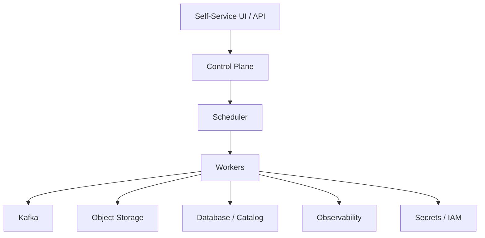
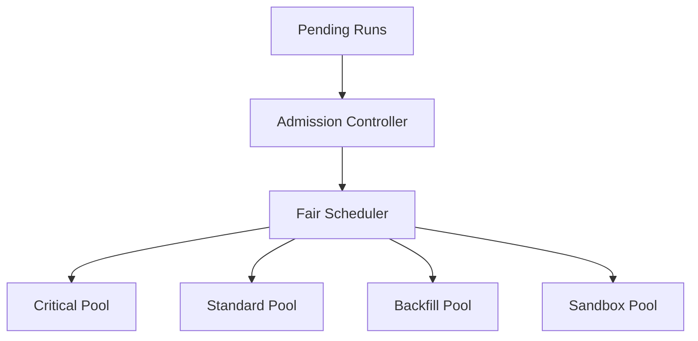
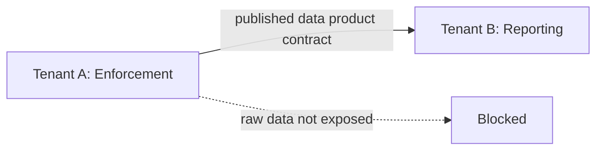

# Part 076 — Multi-Tenant Pipeline Platform

> A multi-tenant pipeline platform is not one cluster shared by many teams.  
> It is a fairness, isolation, governance, and ownership system.

A single-team pipeline can survive with conventions.

A multi-team platform cannot.

Once many teams share Kafka clusters, object storage, orchestration, compute workers, schema registry, catalogs, lakehouse tables, quality infrastructure, and observability budgets, the problem changes.

You are no longer just building pipelines.

You are designing an operating environment where multiple producers and consumers can coexist without accidentally breaking, starving, leaking, or bankrupting each other.

The hard questions are:

- Who owns this pipeline?
- Who is allowed to run it?
- Who pays for it?
- Which tenant may read which data?
- Which pipeline is allowed to consume which topic?
- What happens when one tenant floods Kafka?
- What happens when one backfill consumes all workers?
- What happens when one team writes millions of tiny files?
- What happens when one bad schema change affects twenty consumers?
- What happens when one tenant's DLQ contains sensitive data?
- How do we enforce fair usage without blocking legitimate urgent work?

This part builds the mental model and implementation blueprint.

---

## 1. Define Tenant Precisely

A tenant is not always a customer.

In internal data platforms, a tenant may be:

- product domain
- business unit
- regulatory program
- region
- data product team
- external customer
- environment
- sensitivity zone
- workload class

Examples:

```text
tenant = enforcement-lifecycle
tenant = payments-risk
tenant = consumer-analytics
tenant = regulator-reporting
tenant = sandbox-research
tenant = eu-region
tenant = high-confidentiality-zone
```

The key is that tenant identity must be explicit.

```java
public record TenantId(String value) {
    public TenantId {
        if (value == null || value.isBlank()) {
            throw new IllegalArgumentException("tenant id is required");
        }
    }
}
```

Every pipeline run, asset, secret, topic, table, quality result, lineage event, cost record, and policy decision should carry tenant context.

---

## 2. Multi-Tenancy Is a Boundary Problem

A tenant boundary can exist at many layers.



Each layer needs a tenant policy.

| Layer | Tenant Concern |
|---|---|
| Control plane | who can create/update/run pipelines |
| Scheduler | fair ordering and priority |
| Workers | CPU/memory isolation |
| Kafka | topic ACLs, quotas, partition usage |
| Object storage | path isolation, retention, encryption |
| Lakehouse/catalog | database/table/row/column access |
| Schema registry | subject ownership and compatibility policy |
| Quality platform | rule ownership and publication gates |
| Observability | metric/cardinality/log cost isolation |
| Secrets | secret scoping and access audit |
| Cost system | attribution and chargeback/showback |

A platform is only as isolated as its weakest boundary.

---

## 3. Isolation Spectrum

Multi-tenancy is not binary.

| Model | Description | Pros | Cons |
|---|---|---|---|
| Shared everything | one cluster, logical labels | cheap, simple | weak isolation |
| Shared control plane, isolated workers | central registry with tenant pools | balanced | more ops work |
| Shared platform, isolated data zones | shared services, separated data | good governance | complex policy |
| Dedicated runtime per tenant | separate compute/runtime | strong isolation | higher cost |
| Dedicated platform per tenant | fully separate stack | strongest | expensive, operationally heavy |

A mature platform often combines these.

Example:

```text
low-risk analytics tenants      -> shared workers
regulated reporting tenants     -> isolated worker pool
external customer data tenants  -> isolated data zone
high-confidential workloads     -> dedicated runtime
```

---

## 4. The Tenant Context Object

Do not pass tenant identity as a loose string across the system.

Make it part of execution context.

```java
public record TenantContext(
    TenantId tenantId,
    EnvironmentId environmentId,
    DataZone dataZone,
    SensitivityLevel sensitivityLevel,
    WorkloadClass workloadClass,
    CostCenter costCenter,
    Set<String> entitlements
) {}
```

Pipeline run context:

```java
public record PipelineExecutionContext(
    RunId runId,
    PipelineId pipelineId,
    TenantContext tenant,
    Actor actor,
    Instant evaluationTime,
    Map<String, String> parameters
) {}
```

Every major boundary should require this context.

```java
public interface PipelineLauncher {
    RunId launch(PipelineDefinition definition, PipelineExecutionContext context);
}
```

If tenant is optional, isolation will eventually fail.

---

## 5. Ownership Model

A multi-tenant platform must separate:

- platform owner
- pipeline owner
- data owner
- asset owner
- consumer owner
- policy owner
- incident owner

### 5.1 Ownership Metadata

```java
public record Ownership(
    String owningTeam,
    String technicalOwner,
    String businessOwner,
    String onCallRotation,
    String slackChannel,
    String escalationPolicy,
    String costCenter
) {}
```

Each registered pipeline should have:

```yaml
pipelineId: case-sla-breach-daily
owner:
  owningTeam: enforcement-platform
  technicalOwner: team-enforcement-data
  businessOwner: regulatory-operations
  onCallRotation: enforcement-data-oncall
  escalationPolicy: enforcement-p1-policy
```

No owner, no production pipeline.

This rule sounds harsh. It prevents orphaned systems.

---

## 6. Tenant-Aware Asset Registry

A platform registry should represent assets as tenant-owned resources.

```java
public record DataAsset(
    AssetId assetId,
    TenantId tenantId,
    String name,
    AssetType type,
    SensitivityLevel sensitivity,
    Ownership ownership,
    RetentionPolicy retentionPolicy,
    Set<ConsumerContract> consumers
) {}
```

Important asset metadata:

- tenant
- owner
- sensitivity
- schema subject
- quality policy
- SLO
- retention
- allowed producers
- allowed consumers
- lineage parents
- cost center

Without tenant-aware metadata, governance becomes manual spreadsheet work.

---

## 7. Quotas and Fairness

A shared platform must protect itself.

Quotas are not punishment. They are protection against accidental denial of service.

Quota dimensions:

| Resource | Example Quota |
|---|---|
| pipeline runs | max concurrent runs per tenant |
| CPU | max worker cores per tenant |
| memory | max heap/container memory per tenant |
| Kafka produce | bytes/sec per client/tenant |
| Kafka consume | bytes/sec per client/tenant |
| Kafka partitions | max partitions per tenant |
| state store | max GB state per job |
| object storage | max TB per zone or lifecycle class |
| files | max files/day or max small-file ratio |
| backfill | max historical days per campaign |
| quality checks | max scan cost per rule |
| metrics | max cardinality budget |
| DLQ | max unprocessed DLQ age/volume |
| API ingestion | requests/minute per source/tenant |

### 7.1 Quota Object

```java
public record TenantQuota(
    TenantId tenantId,
    int maxConcurrentRuns,
    int maxBackfillRuns,
    long maxKafkaProduceBytesPerSec,
    long maxKafkaConsumeBytesPerSec,
    long maxDailyOutputBytes,
    long maxStateStoreBytes,
    int maxMetricCardinality,
    int priorityWeight
) {}
```

### 7.2 Admission Control

Do not wait until the worker crashes.

Reject or delay unsafe runs before they start.

```java
public interface AdmissionController {
    AdmissionDecision evaluate(PipelineDefinition pipeline, PipelineExecutionContext ctx);
}

public sealed interface AdmissionDecision {
    record Accepted(ResourceLease lease) implements AdmissionDecision {}
    record Delayed(String reason, Instant retryAfter) implements AdmissionDecision {}
    record Rejected(String reason) implements AdmissionDecision {}
}
```

Admission control should check:

- tenant concurrency
- workload class
- data sensitivity
- required entitlement
- worker pool availability
- backfill scope
- cost estimate
- blast radius
- maintenance window

---

## 8. Noisy Neighbor Failure Model

A noisy neighbor is a tenant or workload that degrades others.

Common cases:

### 8.1 Kafka Noisy Neighbor

One tenant produces too much data and causes:

- broker network saturation
- high produce latency
- replication lag
- consumer lag for unrelated tenants
- controller pressure due to too many partitions

Controls:

- producer/consumer quotas
- tenant-specific client IDs/principals
- topic naming policy
- partition creation review
- separate clusters for critical workloads
- retention guardrails

### 8.2 Compute Noisy Neighbor

One backfill consumes all workers.

Controls:

- tenant worker pools
- max concurrent runs
- weighted fair scheduling
- backfill campaign quota
- priority lanes
- preemption rules for low-priority jobs

### 8.3 Lakehouse Noisy Neighbor

One tenant creates millions of small files.

Controls:

- write-size policy
- compaction budget
- file-count SLO
- table maintenance quota
- publication gate for pathological output

### 8.4 Observability Noisy Neighbor

One job emits metrics with unbounded labels.

Controls:

- metric cardinality budget
- log sampling
- structured logging schema
- payload logging ban
- per-tenant telemetry cost tracking

---

## 9. Tenant-Aware Scheduler

A FIFO scheduler is unfair under mixed workloads.

A production scheduler should consider:

- priority
- tenant quota
- run age
- workload class
- SLO urgency
- backfill vs production
- dependency readiness
- resource estimate
- isolation requirement



### 9.1 Run Classification

```java
public enum WorkloadClass {
    CRITICAL_PRODUCTION,
    STANDARD_PRODUCTION,
    BACKFILL,
    AD_HOC,
    SANDBOX
}
```

Scheduling policy example:

```text
critical production > standard production > urgent correction backfill > normal backfill > ad hoc > sandbox
```

But do not let critical workloads starve all others forever. Use error budgets, windows, and priority aging.

---

## 10. Tenant-Aware Worker Pools

A worker pool is a runtime boundary.

Recommended pattern:

```text
pool-critical-regulated
pool-standard-shared
pool-backfill-bulk
pool-sandbox
pool-high-confidential
```

Each pool has:

- allowed tenants
- allowed sensitivity levels
- max concurrency
- resource limits
- network policy
- secret scope
- logging policy
- runtime image policy

```java
public record WorkerPoolPolicy(
    String poolId,
    Set<TenantId> allowedTenants,
    Set<WorkloadClass> allowedWorkloadClasses,
    Set<SensitivityLevel> allowedSensitivityLevels,
    int maxConcurrentRuns,
    ResourceLimit perRunLimit,
    NetworkPolicy networkPolicy
) {}
```

A pipeline handling high-confidentiality data should not accidentally run in a sandbox pool.

---

## 11. Metadata Isolation

Data isolation is obvious. Metadata isolation is easier to forget.

Metadata may reveal sensitive information:

- table names
- column names
- lineage graph
- run parameters
- error messages
- DLQ reason codes
- row counts
- data quality failures
- customer/region identifiers
- operational incidents

A user who cannot read `raw.investigation_subject` may also need to be restricted from seeing lineage or quality errors that reveal investigation existence.

Policy must cover:

- asset catalog access
- lineage graph access
- run history access
- logs and traces
- quality result details
- DLQ metadata
- schema registry subjects

---

## 12. Tenant-Aware Naming

Naming is not governance by itself, but it helps automation.

Example convention:

```text
<env>.<tenant>.<domain>.<asset>.<version>
```

Kafka topic:

```text
prod.enforcement.case.case-event.v1
```

Object storage path:

```text
s3://company-data-prod/enforcement/silver/case_event/
```

Iceberg table:

```text
prod_enforcement.silver_case_event
```

Schema subject:

```text
prod.enforcement.case.case-event-value
```

A platform should validate names at registration time, not in code review by memory.

---

## 13. Access Control Model

Tenant isolation requires both coarse and fine controls.

Coarse controls:

- tenant membership
- environment access
- workload class access
- data zone access

Fine controls:

- asset read/write
- column access
- row filter
- schema subject update
- pipeline run permission
- backfill approval
- policy override approval
- DLQ replay permission

### 13.1 Policy Decision Interface

```java
public interface PolicyDecisionPoint {
    AuthorizationDecision decide(AuthorizationRequest request);
}

public record AuthorizationRequest(
    Actor actor,
    TenantId tenantId,
    String action,
    String resourceType,
    String resourceId,
    Map<String, String> attributes
) {}

public record AuthorizationDecision(
    boolean allowed,
    String policyId,
    String reason
) {}
```

Every decision should be auditable.

```json
{
  "eventType": "AUTHZ_DECISION",
  "actor": "svc-case-sla-pipeline",
  "tenant": "enforcement",
  "action": "READ",
  "resource": "silver.case_event",
  "decision": "ALLOW",
  "policyId": "POLICY_ENFORCEMENT_SILVER_READ"
}
```

---

## 14. Data Zone Model

A useful platform separates data zones:

```text
raw        -> source-preserving, highly restricted
canonical  -> cleaned domain representation
product    -> consumer-facing data products
sandbox    -> exploration, limited retention
quarantine -> invalid/sensitive failed records
archive    -> long-term controlled retention
```

Each zone has different default policy.

| Zone | Default Access | Mutation | Retention | Evidence |
|---|---|---|---|---|
| raw | very restricted | append-only | long/regulated | high |
| canonical | domain teams | controlled | medium/long | high |
| product | approved consumers | versioned publish | product-specific | high |
| sandbox | limited | disposable | short | medium |
| quarantine | restricted | controlled replay | policy-driven | high |
| archive | restricted | immutable | long | high |

Do not let tenants create arbitrary zones without platform policy.

---

## 15. Cost Attribution

If cost is not visible by tenant, it becomes platform pain.

Track cost drivers:

- compute time
- memory reservation
- Kafka bytes produced/consumed
- Kafka partitions
- object storage bytes
- table snapshots retained
- small files generated
- state store size
- API calls
- observability volume
- backfill/replay cost
- quality scan cost

### 15.1 Cost Event

```java
public record CostUsageEvent(
    TenantId tenantId,
    PipelineId pipelineId,
    RunId runId,
    String resourceType,
    BigDecimal quantity,
    String unit,
    BigDecimal estimatedCost,
    Instant measuredAt
) {}
```

Cost attribution enables:

- showback
- chargeback
- quota negotiation
- architectural review
- anomaly detection
- backfill approval

A mature platform can answer:

> Which tenant created 70% of small files this week?

or:

> Which pipeline caused the Kafka egress cost spike?

---

## 16. Schema Registry Multi-Tenancy

Schema subjects need ownership.

Without ownership, one producer can break many consumers.

Controls:

- tenant prefix enforcement
- subject owner
- compatibility policy per subject
- schema approval for critical assets
- consumer impact analysis
- transitive compatibility for shared contracts
- deletion restrictions
- audit event for schema changes

Schema change event:

```json
{
  "eventType": "SCHEMA_VERSION_REGISTERED",
  "tenant": "enforcement",
  "subject": "prod.enforcement.case.case-event-value",
  "version": 14,
  "compatibility": "BACKWARD_TRANSITIVE",
  "registeredBy": "svc-ci-release",
  "impactAnalysisId": "impact-20260704-18"
}
```

---

## 17. Kafka Multi-Tenancy Patterns

Kafka multi-tenancy can be logical or physical.

Logical isolation:

- tenant-specific principals
- topic naming conventions
- ACLs
- quotas
- client IDs
- retention policy
- separate DLQ topics

Physical isolation:

- separate clusters
- separate network zones
- separate region/account/project

Decision rule:

```text
If failure, cost, compliance, or data leakage impact is unacceptable across tenants,
move from logical to stronger physical isolation.
```

### 17.1 Topic Policy

```yaml
topicPolicy:
  requiredPrefix: prod.<tenant>.
  maxPartitionsDefault: 12
  maxPartitionsWithoutReview: 48
  allowedCleanupPolicies:
    - delete
    - compact
  requireOwner: true
  requireSchemaSubject: true
  requireRetention: true
  requireClassification: true
```

Topic creation should be a governed API call, not a random shell command.

---

## 18. Lakehouse Multi-Tenancy Patterns

Lakehouse multi-tenancy needs controls around:

- catalog namespace
- table ownership
- path ownership
- object storage permissions
- snapshot retention
- compaction ownership
- row/column policies
- cross-tenant joins
- data export
- deletion/retention requests

### 18.1 Table Registration Policy

```yaml
table:
  name: prod_enforcement.gold_case_sla_daily
  tenant: enforcement
  zone: product
  owner: enforcement-data
  sensitivity: confidential
  retention: P7Y
  allowedConsumers:
    - regulatory-reporting
    - enforcement-dashboard
  qualityGate: BLOCK_ON_CRITICAL
  lineageRequired: true
```

If a table is not registered, it should not be considered production.

---

## 19. DLQ and Quarantine in Multi-Tenant Systems

DLQs are dangerous in multi-tenant platforms because they often contain raw failed records.

Controls:

- tenant-specific DLQ
- restricted access by sensitivity
- encryption
- retention policy
- payload redaction where possible
- replay permission
- replay audit
- DLQ SLO
- DLQ owner

DLQ replay should require:

- target pipeline
- run ID
- reason
- actor
- tenant
- max records
- validation policy
- replay mode

```java
public record DlqReplayRequest(
    TenantId tenantId,
    PipelineId pipelineId,
    String dlqAssetId,
    String reason,
    Actor requestedBy,
    int maxRecords,
    ReplayMode replayMode
) {}
```

Never provide a platform-wide "replay all DLQ" button without scoping and approval.

---

## 20. Backfill Governance

Backfill is one of the biggest multi-tenant risks.

A tenant can accidentally:

- consume massive compute
- flood Kafka
- overwrite historical outputs
- trigger downstream reprocessing
- violate retention policy
- reintroduce old sensitive fields
- invalidate reports

Backfill admission should check:

```text
scope * cost * blast radius * policy risk * tenant quota
```

Backfill request:

```java
public record BackfillRequest(
    TenantId tenantId,
    PipelineId pipelineId,
    Instant from,
    Instant to,
    String reason,
    BackfillMode mode,
    boolean publishOutputs,
    Optional<String> approvalId
) {}
```

Backfill modes:

- dry-run
- shadow output
- staged output
- publish new version
- correction/restatement
- destructive replace — require strongest approval

---

## 21. Multi-Tenant Observability

Observability must be tenant-aware but not tenant-leaky.

Metrics should include bounded labels:

```text
tenant
environment
pipeline_id
asset_id
workload_class
status
```

Avoid unbounded labels:

```text
record_id
user_id
case_id
customer_id
exception_message
raw_field_value
```

### 21.1 Tenant Dashboard

Each tenant should see:

- pipeline status
- run history
- SLO compliance
- freshness
- error budget
- DLQ size
- quality results
- cost usage
- quota usage
- backfill campaigns
- incidents

The platform team should see:

- cluster-level saturation
- fairness violations
- quota pressure
- noisy-neighbor candidates
- cross-tenant dependency hotspots
- global cost trends

---

## 22. Cross-Tenant Dependencies

Sometimes one tenant consumes another tenant's data product.

This is allowed only through explicit contracts.



Contract should define:

- asset owner
- consumer tenant
- allowed purpose
- schema compatibility policy
- freshness SLO
- quality SLO
- retention
- privacy restrictions
- support channel
- deprecation policy

Never rely on direct table access as a substitute for a data product contract.

---

## 23. Platform API Design

A multi-tenant platform needs APIs that encode governance.

Example APIs:

```text
POST /pipelines/register
POST /pipelines/{id}/runs
POST /pipelines/{id}/backfills
POST /assets/register
POST /assets/{id}/contracts
POST /schemas/register
POST /quality-policies/register
GET  /tenants/{id}/quota
GET  /tenants/{id}/usage
GET  /runs/{id}/evidence
```

Registration request:

```json
{
  "pipelineId": "case-sla-breach-daily",
  "tenant": "enforcement",
  "owner": "enforcement-data",
  "workloadClass": "CRITICAL_PRODUCTION",
  "inputs": ["silver.case_event", "silver.sla_policy"],
  "outputs": ["gold.case_sla_breach_daily"],
  "sensitivity": "CONFIDENTIAL",
  "slo": {
    "freshnessMinutes": 60,
    "completenessPercent": 99.9
  }
}
```

The API should reject missing ownership, unknown tenant, unsupported sensitivity, and unapproved cross-tenant reads.

---

## 24. Java Enforcement Skeleton

```java
public final class TenantAwarePipelineLauncher implements PipelineLauncher {
    private final PolicyDecisionPoint policy;
    private final AdmissionController admission;
    private final QuotaService quota;
    private final RunStore runStore;
    private final EvidenceEmitter evidence;

    @Override
    public RunId launch(PipelineDefinition definition, PipelineExecutionContext ctx) {
        AuthorizationDecision authz = policy.decide(new AuthorizationRequest(
            ctx.actor(),
            ctx.tenant().tenantId(),
            "PIPELINE_RUN",
            "pipeline",
            definition.pipelineId().value(),
            Map.of("workloadClass", ctx.tenant().workloadClass().name())
        ));

        if (!authz.allowed()) {
            evidence.emit(EvidenceEvents.authorizationDenied(ctx, authz));
            throw new AccessDeniedException(authz.reason());
        }

        AdmissionDecision decision = admission.evaluate(definition, ctx);
        if (decision instanceof AdmissionDecision.Rejected rejected) {
            evidence.emit(EvidenceEvents.runRejected(ctx, rejected.reason()));
            throw new RejectedRunException(rejected.reason());
        }

        if (decision instanceof AdmissionDecision.Delayed delayed) {
            evidence.emit(EvidenceEvents.runDelayed(ctx, delayed.reason(), delayed.retryAfter()));
            throw new DelayedRunException(delayed.reason(), delayed.retryAfter());
        }

        ResourceLease lease = ((AdmissionDecision.Accepted) decision).lease();
        quota.reserve(ctx.tenant().tenantId(), lease);

        RunId runId = runStore.create(definition.pipelineId(), ctx);
        evidence.emit(EvidenceEvents.runPlanned(runId, definition, ctx, lease));
        return runId;
    }
}
```

The point is not this exact code. The point is the order:

```text
authorize -> admit -> reserve quota -> create run -> emit evidence -> dispatch
```

Do not dispatch first and ask governance questions later.

---

## 25. Incident Model

Multi-tenant incidents need tenant impact analysis.

For every incident, answer:

- Which tenants were affected?
- Which assets were affected?
- Was there data leakage?
- Was there starvation/noisy-neighbor impact?
- Were SLOs breached?
- Which outputs were incorrect, late, or unavailable?
- Which downstream consumers were affected?
- Did quota/admission controls work?
- Was there an emergency override?
- Is tenant-level communication required?

Incident evidence should connect to lineage and run history.

---

## 26. Anti-Patterns

### 26.1 Tenant as a Tag Only

If tenant is only a label in logs, it will not protect anything.

Tenant must participate in authorization, scheduling, quotas, cost, lineage, and evidence.

### 26.2 Shared Admin Credentials

Shared service credentials make attribution impossible.

Use tenant-scoped service accounts where practical.

### 26.3 Unlimited Backfill

Backfill without quota is a platform outage waiting to happen.

### 26.4 One Giant Worker Pool

A single shared pool makes noisy-neighbor isolation weak.

### 26.5 Platform Bypasses

If teams can create topics, tables, schemas, or jobs outside the platform, governance becomes advisory.

### 26.6 Hidden Cross-Tenant Reads

A job reading another tenant's raw table without contract is a governance failure.

### 26.7 Unbounded Observability Labels

A single tenant can explode metrics cardinality and observability cost.

---

## 27. Production Readiness Checklist

### Tenant Identity

- Every run has tenant context.
- Every asset has tenant ownership.
- Every topic/table/schema has tenant metadata.
- Tenant is not optional in APIs.

### Isolation

- Sensitive tenants have appropriate runtime isolation.
- Worker pools enforce tenant/workload policies.
- Network and secret boundaries exist.
- Metadata access is controlled.

### Quotas

- Concurrent run quota exists.
- Kafka throughput quota exists where needed.
- Backfill quota exists.
- Storage and small-file usage are tracked.
- Metric/log cardinality is controlled.

### Governance

- Pipeline registration requires owner.
- Asset registration requires sensitivity and retention.
- Cross-tenant consumption requires contract.
- Policy overrides are audited.

### Operations

- Tenant dashboards exist.
- Cost attribution exists.
- Incident impact can be computed by tenant.
- DLQ replay is scoped and audited.
- No orphaned production pipelines exist.

---

## 28. Final Mental Model

A multi-tenant pipeline platform is a resource allocation and trust-boundary system.

It must answer five questions continuously:

1. **Who owns this?**
2. **Who may access this?**
3. **Who is consuming resources?**
4. **Who is affected by failure or change?**
5. **Who pays operationally and financially?**

The difference between a shared cluster and a platform is that a platform has enforceable answers.

