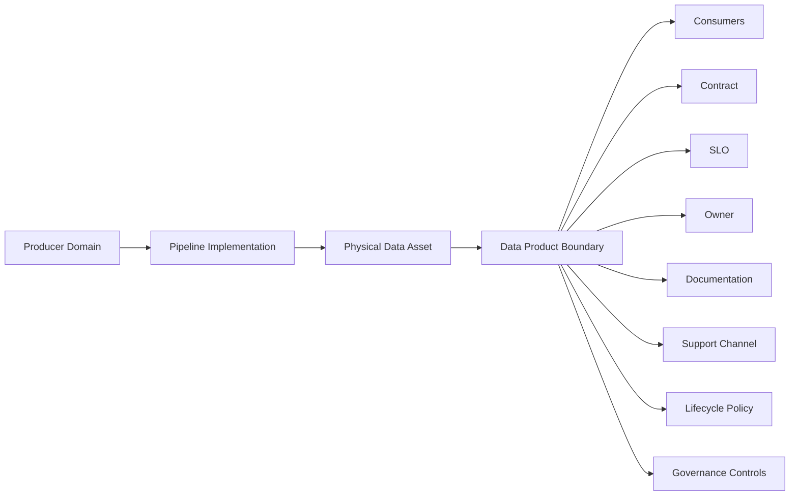
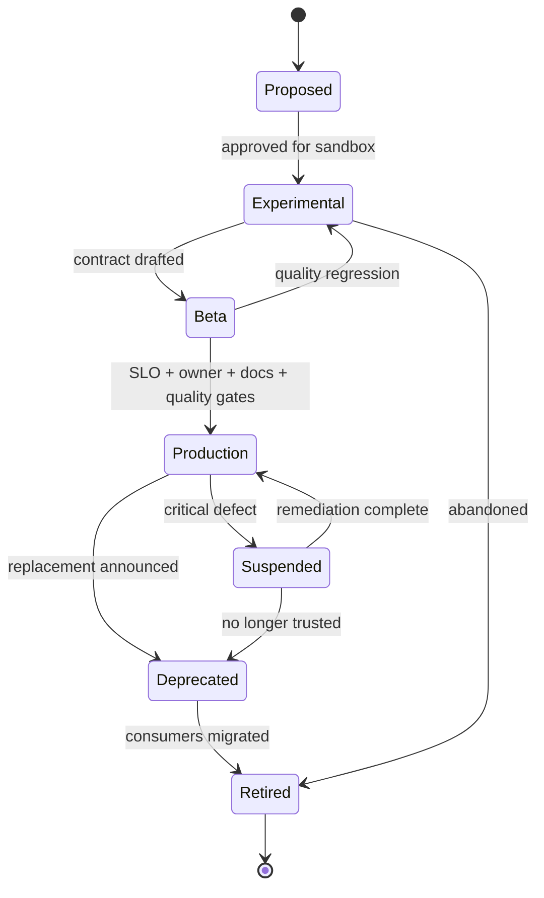
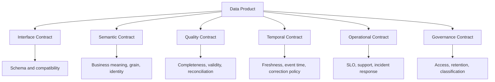
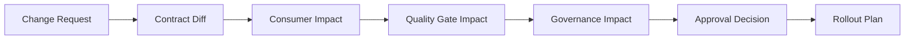

# Part 077 — Data Product Operating Model

> A data product is not a table with a friendly name.  
> It is an owned, documented, supported, governed, versioned, observable interface for data consumption.

A pipeline platform can be technically excellent and still fail if nobody owns the output.

The common failure pattern is simple:

1. A team creates a dataset.
2. Another team consumes it.
3. More consumers appear.
4. The producer changes a field.
5. A dashboard, model, alert, or regulatory report breaks.
6. Nobody knows whether the dataset is an internal by-product or a supported product.

That is not a tooling problem first.

It is an operating model problem.

This part defines how to operate data products in a Java data pipeline platform: ownership, contracts, SLOs, support, lifecycle, governance, change management, and health measurement.

We will intentionally avoid shallow phrases like “treat data as a product” unless they become concrete engineering controls.

---

## 1. The Core Mental Model

A data product is a **stable consumption boundary**.

It may be implemented by:

- Kafka topic
- Iceberg table
- warehouse table
- materialized view
- search index
- API projection
- feature table
- report-ready dataset
- lineage-backed regulatory extract

But the physical form is not the product.

The product is the promise around the data.



A physical asset without ownership is just storage.

A physical asset with ownership, guarantees, and support becomes a product.

---

## 2. Data Product vs Dataset vs Pipeline

Do not collapse these concepts.

| Concept | Meaning | Example |
|---|---|---|
| Dataset | Stored data | `case_escalation_events` Iceberg table |
| Pipeline | Process that produces/updates data | Flink job deriving breach alerts |
| Data product | Supported consumption interface | “Enforcement Case Lifecycle Events v2” |
| Data asset | Cataloged technical object | Kafka topic, table, view, dashboard |
| Data contract | Explicit producer/consumer promise | Schema, quality, freshness, semantics |
| Data domain | Ownership boundary | Enforcement, Licensing, Payments |

A pipeline can produce multiple datasets.

A data product can include multiple assets.

A dataset can exist without being a product.

A data product must not exist without an owner.

---

## 3. Minimum Viable Data Product

A production-grade data product needs at least these fields.

```java
public record DataProductDescriptor(
    DataProductId id,
    String name,
    String description,
    DomainId domain,
    Owner owner,
    SupportModel support,
    LifecycleState lifecycleState,
    List<DataAssetRef> assets,
    DataContractRef contract,
    SloPolicy slo,
    SensitivityClassification sensitivity,
    AccessPolicyRef accessPolicy,
    LineageRef lineage,
    ChangePolicy changePolicy,
    RetentionPolicy retentionPolicy
) {}
```

The key is not the Java record.

The key is that these fields must be enforceable by platform workflows.

For example:

- no production publication without owner
- no external consumer onboarding without contract
- no sensitive product without access policy
- no lifecycle promotion without documentation
- no breaking change without consumer impact review
- no deprecated product without migration path

---

## 4. Ownership Model

Ownership is not just a name in a catalog.

A product owner must be accountable for:

- semantic meaning
- schema evolution
- quality rules
- freshness SLO
- access approval
- lifecycle decisions
- incident response
- correction/restatement policy
- consumer communication

A healthy data product has at least three ownership roles.

| Role | Responsibility |
|---|---|
| Business owner | Meaning, policy, consumer priority, correctness expectation |
| Technical owner | Pipeline implementation, reliability, performance, deployment |
| Data steward/governance owner | classification, retention, access, compliance evidence |

Small teams may combine roles, but the responsibilities still exist.

Do not let ownership become ornamental metadata.

A product is not production-ready until a real team can answer:

```text
If this product is wrong at 02:00, who investigates?
If a consumer wants a new field, who decides?
If the source system changes, who assesses impact?
If data must be restated, who approves publication?
If access must be revoked, who executes it?
```

---

## 5. Product Lifecycle

Data products need lifecycle states.

Without lifecycle state, consumers cannot reason about stability.



Recommended meaning:

| State | Meaning |
|---|---|
| Proposed | Idea exists; not consumable |
| Experimental | Sandbox use only; no stability guarantee |
| Beta | Contract exists; limited consumers; breaking change possible |
| Production | Supported; SLO-backed; governed change management |
| Suspended | Temporarily unsafe or unreliable |
| Deprecated | Still available but migration expected |
| Retired | No longer available for consumption |

The platform should enforce different policies by state.

Example:

```java
public enum LifecycleState {
    PROPOSED,
    EXPERIMENTAL,
    BETA,
    PRODUCTION,
    SUSPENDED,
    DEPRECATED,
    RETIRED
}

public final class ProductLifecyclePolicy {
    public void assertCanAddConsumer(DataProductDescriptor product) {
        switch (product.lifecycleState()) {
            case PRODUCTION, BETA -> { return; }
            case EXPERIMENTAL -> throw new PolicyViolation("Experimental products require explicit risk acceptance.");
            case SUSPENDED -> throw new PolicyViolation("Suspended product cannot onboard new consumers.");
            case DEPRECATED -> throw new PolicyViolation("Deprecated product requires migration exception.");
            default -> throw new PolicyViolation("Product is not consumable.");
        }
    }
}
```

---

## 6. Production Readiness Gate

A data product should not become `PRODUCTION` because a table exists.

It becomes production when it passes readiness gates.

A practical readiness checklist:

- owner exists
- domain exists
- purpose documented
- supported assets registered
- schema contract exists
- semantic contract exists
- data quality checks exist
- freshness SLO exists
- lineage exists
- access policy exists
- retention policy exists
- runbook exists
- support channel exists
- change policy exists
- sample queries or examples exist
- consumer onboarding process exists
- incident escalation path exists

Represent it as code.

```java
public final class ProductionReadinessGate {
    public ReadinessResult evaluate(DataProductDescriptor product) {
        var violations = new ArrayList<String>();

        require(product.owner() != null, "owner is required", violations);
        require(product.contract() != null, "data contract is required", violations);
        require(product.slo() != null, "SLO policy is required", violations);
        require(product.accessPolicy() != null, "access policy is required", violations);
        require(product.retentionPolicy() != null, "retention policy is required", violations);
        require(product.support().channel() != null, "support channel is required", violations);
        require(!product.assets().isEmpty(), "at least one backing asset is required", violations);

        return violations.isEmpty()
            ? ReadinessResult.pass()
            : ReadinessResult.fail(violations);
    }

    private static void require(boolean condition, String message, List<String> violations) {
        if (!condition) violations.add(message);
    }
}
```

This is how an operating model becomes engineering reality.

---

## 7. The Contract Stack

A data product contract has layers.



Do not ship only schema.

A schema says a field exists.

It does not say:

- whether the value is authoritative
- whether null means unknown, not applicable, redacted, or not collected
- whether the event is a fact or correction
- whether `status` is current state or transition target
- whether late data mutates history
- whether consumers may use it for regulatory decisions

For top-tier systems, semantic ambiguity is a production defect.

---

## 8. Product SLOs

Data product SLOs must be consumer-relevant.

Common SLO categories:

| SLO | Question |
|---|---|
| Freshness | How recent is the product relative to source truth? |
| Completeness | Did all expected source records arrive and publish? |
| Accuracy | Does the output match expected business truth? |
| Availability | Can consumers access the product? |
| Stability | How often does schema/semantic behavior break consumers? |
| Correction latency | How fast are known defects corrected/restated? |
| Support response | How fast does the owning team respond to incidents? |

Example SLO descriptor:

```yaml
slo:
  freshness:
    target: "99% of hourly partitions published within 15 minutes after source close"
  completeness:
    target: "99.9% of source case updates represented in canonical product"
  quality:
    target: "zero critical quality gate failures in production publication"
  correctionLatency:
    target: "critical restatements published within 4 business hours after approval"
  support:
    target: "P1 acknowledged within 15 minutes"
```

Avoid fake SLOs like:

```text
pipeline uptime = 99.9%
```

A pipeline can be “up” while publishing stale, incomplete, or semantically wrong data.

---

## 9. Consumer Registry

A product without known consumers cannot manage change safely.

Every production consumer should register:

- consuming system
- owning team
- contact channel
- environment
- use case
- criticality
- access purpose
- consumed fields
- expected freshness
- downstream impact
- regulatory/customer impact
- breakage tolerance

```java
public record ConsumerRegistration(
    ConsumerId id,
    DataProductId productId,
    String consumerName,
    Owner owner,
    ConsumerCriticality criticality,
    Set<String> consumedFields,
    String useCase,
    boolean regulatoryUse,
    Duration freshnessExpectation,
    URI runbook,
    Instant registeredAt
) {}
```

This registry powers:

- schema impact analysis
- deprecation planning
- incident notification
- access review
- cost attribution
- product prioritization
- consumer-driven contract tests

Do not rely on warehouse query logs alone.

Query logs tell you who touched data.

They do not always tell you why, how critical the usage is, or who owns the consumer.

---

## 10. Change Management

A production data product needs explicit change classes.

| Change class | Example | Required process |
|---|---|---|
| Patch | Fix typo in docs | Low-risk publish |
| Compatible schema | Add optional field | Contract test + announcement |
| Semantic extension | Add new event type | Consumer review if critical |
| Quality rule change | Tighten validity threshold | Shadow run + impact review |
| Breaking schema | Rename required field | Versioned product or migration window |
| Breaking semantic | Change meaning of `closedAt` | New product version + consumer migration |
| Historical restatement | Recompute prior months | Approval + evidence + notification |
| Access change | Restrict sensitive column | Governance approval + consumer impact |

Example policy:

```java
public enum ChangeRisk {
    LOW,
    MEDIUM,
    HIGH,
    BREAKING,
    REGULATORY_SIGNIFICANT
}

public record ChangeRequest(
    DataProductId productId,
    ChangeRisk risk,
    String summary,
    List<String> affectedFields,
    List<ConsumerId> affectedConsumers,
    boolean requiresRestatement,
    boolean changesAccessPolicy
) {}
```

The platform should generate impact reports before approval.



---

## 11. Versioning Strategy

Not every change requires a new product.

Use three layers of versioning:

1. **Schema version** — structure changed.
2. **Transformation version** — logic changed.
3. **Product version** — consumer-facing contract changed.

A product version should change when consumer assumptions change.

Examples:

```text
Enforcement Case Events v1
Enforcement Case Events v2
Case Breach Detection Daily Snapshot v3
```

Avoid versioning only file paths or topic names while pretending the contract is unchanged.

A version is a promise boundary.

---

## 12. Support Model

A data product needs support tiers.

| Tier | Suitable for | Support expectation |
|---|---|---|
| Experimental | Sandbox users | Best effort |
| Internal standard | Internal analytics | Business-hours support |
| Critical | Operational decisions | Pager/escalation path |
| Regulatory | Audit/reporting/legal use | Formal runbook and evidence trail |

Support metadata:

```yaml
support:
  tier: regulatory
  channel: "#data-product-enforcement-support"
  escalation: "oncall-enforcement-data-platform"
  incidentSeverityGuide: "https://internal/runbooks/data-product-severity"
  businessOwner: "enforcement-operations"
  technicalOwner: "case-data-platform"
```

A serious platform does not publish critical products with “ask Bob if it breaks.”

---

## 13. Documentation Standard

Good documentation is operational tooling.

A data product page should include:

- purpose
- owner
- lifecycle state
- backing assets
- grain
- identity
- schema
- examples
- quality checks
- freshness SLO
- known limitations
- correction policy
- access policy
- retention policy
- lineage
- consumer onboarding
- support path
- changelog
- deprecation plan

For each field:

```yaml
field: escalationReason
meaning: "Reason code assigned when a case crosses escalation criteria"
type: string
nullable: false
allowedValues:
  - SLA_BREACH
  - MANUAL_ESCALATION
  - RISK_SIGNAL
source: "case_enforcement.escalation_event.reason_code"
qualityRules:
  - "must be one of allowed values"
privacy: non_sensitive
introducedIn: "2.0.0"
```

A field without meaning is a trap.

---

## 14. Health Score

A data product should have a visible health score, but the score must be explainable.

Possible components:

- freshness SLO compliance
- quality gate pass rate
- reconciliation pass rate
- incident frequency
- consumer breakage count
- undocumented field ratio
- stale ownership risk
- unresolved contract violations
- access review overdue status
- deprecation deadline status

Example:

```java
public record ProductHealthScore(
    DataProductId productId,
    int score,
    List<HealthFinding> findings,
    Instant evaluatedAt
) {}
```

Do not hide critical failures behind a weighted score.

A product with PII leak risk is not “85/100 healthy.”

It is blocked.

---

## 15. Data Product as Code

Store the product descriptor in Git.

Example:

```yaml
apiVersion: data.platform/v1
kind: DataProduct
metadata:
  id: enforcement-case-lifecycle-events
  name: Enforcement Case Lifecycle Events
  domain: enforcement
spec:
  lifecycle: production
  owner:
    business: enforcement-operations
    technical: case-data-platform
    steward: data-governance
  assets:
    - type: kafka-topic
      ref: enforcement.case.lifecycle-events.v2
    - type: iceberg-table
      ref: lakehouse.silver.enforcement_case_lifecycle_events
  contract:
    ref: contracts/enforcement-case-lifecycle-events-v2.yaml
  slo:
    ref: slo/enforcement-case-lifecycle-events.yaml
  accessPolicy:
    ref: policies/enforcement-case-lifecycle-access.yaml
  retention:
    duration: P7Y
  support:
    tier: regulatory
    channel: "#data-product-enforcement-support"
```

The platform controller should reconcile this descriptor into:

- catalog entries
- access policies
- quality checks
- lineage expectations
- dashboards
- alert routing
- consumer onboarding forms
- lifecycle state

---

## 16. Java Domain Model

A minimal operating-model domain module might look like this.

```java
public final class DataProductService {
    private final DataProductRepository repository;
    private final ProductionReadinessGate readinessGate;
    private final ConsumerImpactAnalyzer impactAnalyzer;
    private final PolicyEngine policyEngine;
    private final AuditLog auditLog;

    public void promoteToProduction(DataProductId id, Actor actor) {
        var product = repository.get(id);

        policyEngine.assertAllowed(actor, "dataProduct.promote", product);

        var readiness = readinessGate.evaluate(product);
        if (!readiness.passed()) {
            throw new PolicyViolation("Product is not production-ready: " + readiness.violations());
        }

        repository.save(product.withLifecycleState(LifecycleState.PRODUCTION));

        auditLog.append(AuditEvent.dataProductPromoted(id, actor, readiness.evidence()));
    }

    public ImpactReport proposeChange(ChangeRequest request, Actor actor) {
        var product = repository.get(request.productId());
        policyEngine.assertAllowed(actor, "dataProduct.change.propose", product);
        return impactAnalyzer.analyze(product, request);
    }
}
```

This service belongs in the platform control plane, not in every pipeline job.

---

## 17. Anti-Patterns

### Anti-pattern: “All curated tables are products”

No.

A product requires support and guarantees.

Curated but unsupported tables should be labeled as internal assets.

### Anti-pattern: “Owner is the person who created the table”

Creation is not ownership.

Ownership means accountability during change, incident, and lifecycle management.

### Anti-pattern: “Schema is the contract”

Schema is one contract layer.

Semantics, quality, time, access, and support matter just as much.

### Anti-pattern: “Consumers can discover products by browsing tables”

Discovery without trust metadata increases risk.

Consumers need quality, lineage, owner, freshness, and lifecycle state.

### Anti-pattern: “Breaking changes are fine if announced in Slack”

Announcements are not enforcement.

Use contract checks, consumer registry, compatibility gates, and migration windows.

---

## 18. Production Checklist

A data product is production-ready when:

- [ ] it has clear business and technical ownership
- [ ] it has a declared lifecycle state
- [ ] its backing assets are registered
- [ ] its schema and semantic contract are documented
- [ ] its data quality rules are executable
- [ ] its SLOs are measurable
- [ ] its lineage is captured
- [ ] its access policy is enforceable
- [ ] its retention policy is explicit
- [ ] its support path is known
- [ ] its runbook exists
- [ ] its change policy exists
- [ ] its consumers are registered
- [ ] its health is visible
- [ ] its incidents generate evidence

---

## 19. Final Mental Model

A data product operating model answers one question:

> Can this data be safely consumed by people and systems that are not inside the producing team?

If the answer is yes, the platform must know:

- who owns it
- what it means
- how fresh it is
- how reliable it is
- who consumes it
- how it changes
- how it fails
- how it is corrected
- how access is controlled
- how evidence is produced

That is the difference between a dataset and a product.

In the next part, we turn this operating model into **self-service platform APIs**: pipeline templates, scaffolding, registry integration, policy hooks, and developer workflows.

---

## References

- Google Cloud Architecture Center — Design a self-service data platform for a data mesh: https://docs.cloud.google.com/architecture/design-self-service-data-platform-data-mesh
- OpenMetadata — Domains & Data Products: https://docs.open-metadata.org/v1.12.x/how-to-guides/data-governance/domains-%26-data-products
- DataHub — Data Products: https://docs.datahub.com/docs/dataproducts
- OpenLineage — Specification and facets: https://openlineage.io/docs/spec/facets/
