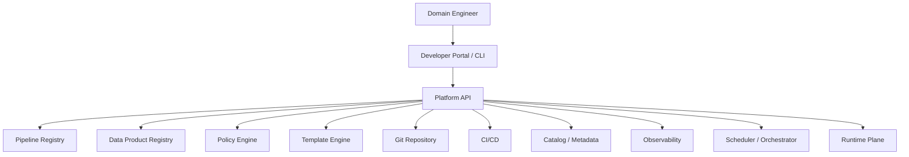
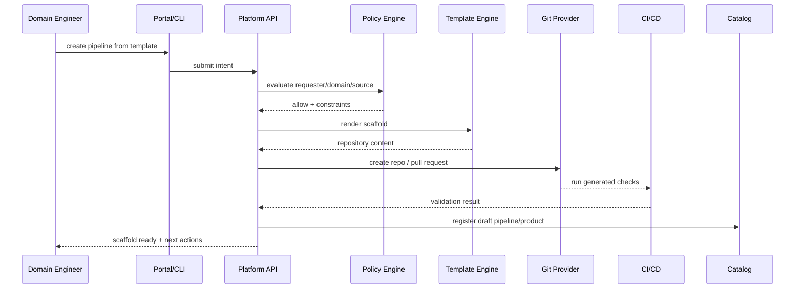
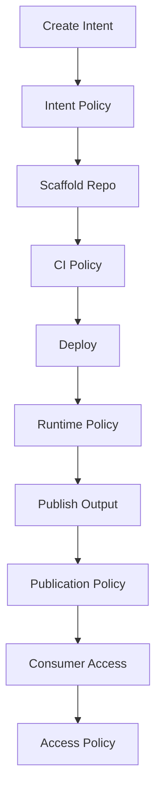
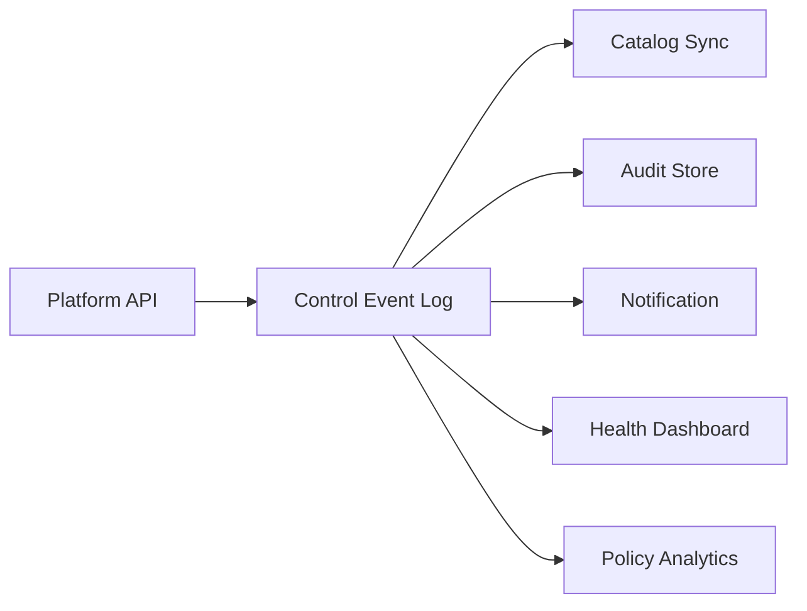

# Part 078 — Platform API and Self-Service

> Self-service does not mean everyone can do anything.  
> It means teams can do the right thing quickly because the platform encodes the rules.

A mature data pipeline platform should reduce the distance between intent and production.

A domain team should be able to say:

```text
I need a CDC-to-Kafka-to-Iceberg pipeline for a new owned data product.
```

The platform should produce:

- repository scaffold
- pipeline descriptor
- data product descriptor
- schema contract template
- quality gate template
- deployment manifest
- observability dashboard
- lineage emitter wiring
- CI checks
- access policy hooks
- runbook skeleton
- production readiness checklist

This is self-service.

But self-service without guardrails becomes chaos.

This part designs a platform API and developer workflow for Java data pipelines.

---

## 1. Self-Service as a Control Plane

Self-service must be part of the control plane.

It is not a collection of wiki pages.



The API is the point where intent is validated.

The platform should ask:

- Is the requester allowed to create this pipeline?
- Is the target data domain valid?
- Is the source system approved?
- Is the sensitivity classification declared?
- Is a data product owner present?
- Is the chosen template suitable for the workload?
- Are required contracts present?
- Are dangerous defaults blocked?

---

## 2. Platform API Responsibilities

A self-service platform API should manage these objects.

| Object | Purpose |
|---|---|
| Pipeline definition | Declares source, transform, sink, runtime, ownership |
| Data product | Declares consumer-facing product boundary |
| Data contract | Declares schema, semantic, quality, temporal, governance rules |
| Runtime environment | Declares compute/runtime target |
| Run | Represents execution attempt and evidence |
| Asset | Represents topic/table/view/index/API output |
| Policy | Governs access, lifecycle, quality, release, privacy |
| Template | Encodes blessed implementation path |
| Backfill campaign | Controls large historical reprocessing |
| Publication | Represents promoted output version |

A common mistake is building only a “run job” API.

That is insufficient.

Production pipeline platforms need lifecycle APIs, product APIs, policy APIs, and evidence APIs.

---

## 3. API Surface

A minimal REST-like API surface:

```text
POST   /pipeline-templates/{templateId}/instantiate
GET    /pipeline-templates

POST   /pipelines
GET    /pipelines/{pipelineId}
PATCH  /pipelines/{pipelineId}
POST   /pipelines/{pipelineId}/validate
POST   /pipelines/{pipelineId}/promote
POST   /pipelines/{pipelineId}/deprecate

POST   /data-products
GET    /data-products/{productId}
POST   /data-products/{productId}/register-consumer
POST   /data-products/{productId}/propose-change
POST   /data-products/{productId}/promote
POST   /data-products/{productId}/deprecate

POST   /runs
GET    /runs/{runId}
POST   /runs/{runId}/cancel
GET    /runs/{runId}/evidence

POST   /backfill-campaigns
GET    /backfill-campaigns/{campaignId}
POST   /backfill-campaigns/{campaignId}/approve
POST   /backfill-campaigns/{campaignId}/start

POST   /quality-gates/evaluate
GET    /lineage/assets/{assetId}/impact
GET    /policies/evaluate
```

This API can be wrapped by:

- CLI
- developer portal
- GitOps controller
- CI plugin
- chatops bot
- internal SDK

The API is the contract. The UI is only one client.

---

## 4. Pipeline Descriptor

A pipeline descriptor should be explicit enough to drive validation, scaffolding, deployment, monitoring, and governance.

```yaml
apiVersion: data.platform/v1
kind: Pipeline
metadata:
  id: enforcement-case-cdc-to-lakehouse
  name: Enforcement Case CDC to Lakehouse
  domain: enforcement
spec:
  owner:
    team: case-data-platform
    email: case-data-platform@example.internal
  type: cdc-to-lakehouse
  runtime:
    engine: flink
    language: java
    jdk: 21
  source:
    type: postgres-cdc
    system: case-management-db
    tables:
      - public.case_record
      - public.case_status_history
  transforms:
    - name: canonicalize-case-event
      version: 1.0.0
  sinks:
    - type: kafka-topic
      ref: enforcement.case.lifecycle-events.v2
    - type: iceberg-table
      ref: lakehouse.silver.enforcement_case_lifecycle_events
  contracts:
    schema: contracts/case-lifecycle-events.avsc
    quality: contracts/case-lifecycle-quality.yaml
  observability:
    sloProfile: regulatory-hourly
  security:
    classification: confidential
    pii: true
  lifecycle:
    state: beta
```

The descriptor should not be decorative.

The platform should use it to generate:

- deployment config
- ACL requests
- quality jobs
- lineage metadata
- dashboards
- run manifests
- catalog entries
- documentation

---

## 5. Template System

Templates are encoded architectural decisions.

Examples:

| Template | Use case |
|---|---|
| `file-to-bronze-java` | Manifest-based file ingestion |
| `api-to-canonical-java` | Cursor/pagination API ingestion |
| `cdc-outbox-to-kafka-java` | Transactional outbox publication |
| `kafka-streams-materialized-view` | Kafka Streams projection |
| `flink-event-time-aggregation` | Stateful event-time stream processing |
| `spark-batch-to-iceberg` | Deterministic batch materialization |
| `iceberg-backfill-campaign` | Controlled partition restatement |
| `quality-gate-java` | Reusable quality validation module |

A good template includes:

- source adapter skeleton
- envelope model
- contract validator
- idempotent sink pattern
- checkpoint pattern
- error handling path
- DLQ/quarantine wiring
- observability wiring
- lineage emitter
- tests
- CI pipeline
- deployment manifest
- runbook skeleton

Template output should be boring.

Boring is good.

Boring means every team starts from safe defaults.

---

## 6. Scaffolding Workflow

A practical self-service flow:



The key step is intent validation before repository creation.

You do not want teams scaffolding forbidden patterns and discovering the problem weeks later.

---

## 7. Intent Model

The platform should collect intent before collecting implementation details.

```java
public record CreatePipelineIntent(
    String name,
    DomainId domain,
    PipelineTemplateId templateId,
    Owner owner,
    SourceIntent source,
    SinkIntent sink,
    SensitivityClassification classification,
    DataProductIntent product,
    RuntimePreference runtimePreference,
    Actor requestedBy
) {}
```

Example policy evaluation:

```java
public final class PipelineIntentPolicy {
    public List<PolicyDecision> evaluate(CreatePipelineIntent intent) {
        var decisions = new ArrayList<PolicyDecision>();

        if (intent.classification().isSensitive() && intent.product().owner() == null) {
            decisions.add(PolicyDecision.deny("Sensitive products require an explicit owner."));
        }

        if (intent.source() instanceof CdcSourceIntent cdc && !cdc.approvedForCdc()) {
            decisions.add(PolicyDecision.deny("Source system is not approved for CDC."));
        }

        if (intent.runtimePreference().engine().equals("custom-java-service")
            && intent.sink().requiresEventTimeState()) {
            decisions.add(PolicyDecision.warn("Stateful event-time workloads should be evaluated for Flink."));
        }

        return decisions;
    }
}
```

Self-service should guide engineers toward safe choices without hiding trade-offs.

---

## 8. Registry as Source of Truth

The platform registry is the source of truth for pipeline/product metadata.

It should store:

- pipeline ID
- descriptor version
- owner
- lifecycle state
- template lineage
- runtime target
- source assets
- sink assets
- contracts
- quality gates
- SLO profile
- access policy
- deployment versions
- active runs
- publications
- incidents
- backfill campaigns

```java
public interface PipelineRegistry {
    PipelineDefinition create(PipelineDefinition definition);
    PipelineDefinition get(PipelineId id);
    PipelineDefinition update(PipelineDefinition definition);
    ValidationReport validate(PipelineId id);
    PromotionResult promote(PipelineId id, Environment target, Actor actor);
    List<PipelineDefinition> findByAsset(DataAssetRef asset);
}
```

The registry must integrate with catalog and lineage systems.

But do not make the catalog the only operational store.

Catalogs are optimized for discovery and metadata.

A platform registry also needs workflow state, policy decisions, run state, approval state, and enforcement evidence.

---

## 9. Policy Hooks

A self-service platform needs policy hooks at multiple points.



Policy hook examples:

| Hook | Example decision |
|---|---|
| Intent | Is this source approved? |
| Scaffold | Which template variant is allowed? |
| CI | Does schema remain compatible? |
| Deploy | Is owner and SLO present? |
| Runtime | Is backfill within quota? |
| Publication | Did quality/reconciliation pass? |
| Access | Can this consumer read this product? |
| Lifecycle | Can this product be deprecated? |

This is how governance becomes fast instead of bureaucratic.

---

## 10. Generated Repository Shape

A generated Java pipeline repository should have predictable structure.

```text
enforcement-case-cdc-to-lakehouse/
  pom.xml
  README.md
  catalog-info.yaml
  pipeline.yaml
  data-product.yaml
  contracts/
    schema/
    quality/
    semantic/
  src/main/java/
    com/acme/enforcement/pipeline/
      Main.java
      envelope/
      source/
      transform/
      sink/
      quality/
      lineage/
      observability/
  src/test/java/
    ...
  src/test/resources/
    golden-datasets/
  deploy/
    dev/
    staging/
    prod/
  runbooks/
    incident.md
    backfill.md
    restatement.md
  docs/
    product.md
    change-policy.md
```

The structure should make the right thing obvious.

Do not generate a blank Maven project and call it self-service.

---

## 11. CI Gates

Generated projects should include default CI gates.

Recommended gates:

- compile
- unit tests
- contract compatibility
- golden dataset test
- quality contract test
- transformation determinism test
- forbidden dependency scan
- secrets scan
- container build
- descriptor validation
- policy evaluation
- lineage metadata validation
- runbook presence check

Example descriptor validation:

```java
public final class DescriptorValidator {
    public ValidationReport validate(PipelineDescriptor descriptor) {
        var findings = new ArrayList<Finding>();

        if (descriptor.metadata().domain() == null) {
            findings.add(Finding.error("domain is required"));
        }

        if (descriptor.spec().owner() == null) {
            findings.add(Finding.error("owner is required"));
        }

        if (descriptor.spec().security().classification().isSensitive()
            && descriptor.spec().contracts().privacy() == null) {
            findings.add(Finding.error("privacy contract is required for sensitive pipeline"));
        }

        return ValidationReport.of(findings);
    }
}
```

CI should fail early before runtime failure becomes data incident.

---

## 12. Run API

The run API creates execution evidence.

```java
public record CreateRunRequest(
    PipelineId pipelineId,
    Environment environment,
    RunMode mode,
    Map<String, String> parameters,
    Actor requestedBy,
    IdempotencyKey idempotencyKey
) {}

public enum RunMode {
    SCHEDULED,
    MANUAL,
    BACKFILL,
    REPLAY,
    VALIDATION,
    DRY_RUN
}
```

Run creation should be idempotent.

```java
public final class RunService {
    public Run createRun(CreateRunRequest request) {
        return runRepository.findByIdempotencyKey(request.idempotencyKey())
            .orElseGet(() -> createNewRun(request));
    }

    private Run createNewRun(CreateRunRequest request) {
        policyEngine.assertCanRun(request);
        var pipeline = registry.get(request.pipelineId());
        var run = Run.newRun(pipeline, request);
        runRepository.save(run);
        dispatcher.dispatch(run);
        return run;
    }
}
```

A run is not merely a job ID.

It is an evidence container.

A good run record includes:

- descriptor version
- code version
- contract version
- input range
- source checkpoint
- output target
- quality result
- reconciliation result
- lineage event
- actor/requester
- approval evidence
- publication decision

---

## 13. Backfill API

Backfill should never be a random shell command.

A backfill campaign needs explicit governance.

```yaml
apiVersion: data.platform/v1
kind: BackfillCampaign
metadata:
  id: enforcement-case-events-2025-restatement
spec:
  pipeline: enforcement-case-cdc-to-lakehouse
  reason: "Correction of escalation effective-time logic"
  mode: partition-replace
  inputRange:
    from: 2025-01-01
    to: 2025-12-31
  transformVersion: 2.3.0
  target:
    type: iceberg-table
    ref: lakehouse.silver.enforcement_case_lifecycle_events
  validation:
    requireReconciliation: true
    requireShadowDiff: true
  approvals:
    - enforcement-data-owner
    - compliance-reviewer
```

The API should support:

- impact estimate
- cost estimate
- affected consumers
- affected partitions
- approval workflow
- dry run
- staged output
- validation
- publication
- rollback/supersession

Backfill is not just compute.

It is controlled mutation of historical truth.

---

## 14. Developer Portal Integration

A developer portal should expose common workflows:

- create pipeline
- create data product
- register consumer
- request access
- view health
- view lineage
- view run history
- start approved backfill
- promote product lifecycle
- deprecate product
- view incidents
- open runbook

Backstage-style scaffolding is useful here because templates can encode metadata, parameters, and actions executed by a scaffolding service.

But the portal must not bypass the platform API.

The portal should be a client of the platform API, not a second source of truth.

---

## 15. CLI Design

A CLI is essential for engineers.

Example commands:

```bash
pipeline templates list
pipeline create --template cdc-outbox-to-kafka-java
pipeline validate enforcement-case-cdc-to-lakehouse
pipeline run enforcement-case-cdc-to-lakehouse --mode dry-run
pipeline promote enforcement-case-cdc-to-lakehouse --env prod

product create --from data-product.yaml
product register-consumer enforcement-case-lifecycle-events --consumer breach-dashboard
product impact enforcement-case-lifecycle-events --change change-request.yaml

backfill estimate enforcement-case-events-2025-restatement.yaml
backfill submit enforcement-case-events-2025-restatement.yaml
backfill approve enforcement-case-events-2025-restatement
backfill start enforcement-case-events-2025-restatement
```

CLI rules:

- every mutation requires idempotency key
- every mutation writes audit event
- every dangerous action supports dry run
- every prod action requires policy evaluation
- every backfill requires explicit reason
- every output should be machine-readable with `--json`

---

## 16. Self-Service Without Losing Architecture Control

The platform should expose choices, not infinite freedom.

Bad self-service:

```text
Pick any language, any sink, any retry policy, any topic name, any schema style.
```

Good self-service:

```text
Choose from approved templates.
Override only explicitly allowed parameters.
Policy engine evaluates exceptions.
Architecture review is required only when outside safe envelope.
```

Safe envelope example:

```yaml
template: flink-event-time-aggregation
allowedOverrides:
  - parallelism
  - watermarkMaxOutOfOrderness
  - checkpointInterval
  - allowedLateness
  - sinkTable
requiresReviewWhen:
  - checkpointingDisabled
  - externalSideEffectSink
  - stateTtlGreaterThan: P30D
  - sensitiveData: true
  - backfillRangeGreaterThan: P180D
```

This is how platforms scale review capacity.

Review the unusual.

Automate the normal.

---

## 17. Platform API Implementation Shape

A Java platform API can be structured as modular services.

```text
platform-api/
  domain/
    pipeline/
    product/
    contract/
    policy/
    run/
    backfill/
    asset/
  application/
    PipelineApplicationService.java
    DataProductApplicationService.java
    RunApplicationService.java
    BackfillApplicationService.java
  infrastructure/
    persistence/
    git/
    catalog/
    lineage/
    orchestrator/
    policy/
    identity/
  api/
    rest/
    cli/
    events/
```

Keep domain rules out of controllers.

Example:

```java
public final class PipelineApplicationService {
    private final PipelineRegistry registry;
    private final TemplateService templateService;
    private final PolicyEngine policyEngine;
    private final GitRepositoryService git;
    private final AuditLog auditLog;

    public ScaffoldResult instantiateTemplate(CreatePipelineIntent intent) {
        var decisions = policyEngine.evaluate(intent);
        decisions.throwIfDenied();

        var template = templateService.get(intent.templateId());
        var rendered = template.render(intent, decisions.constraints());

        var repo = git.createRepository(rendered.repositoryName(), rendered.files());
        var definition = registry.create(rendered.pipelineDefinition());

        auditLog.append(AuditEvent.pipelineScaffolded(definition.id(), intent.requestedBy(), decisions));

        return new ScaffoldResult(definition.id(), repo.url(), decisions);
    }
}
```

---

## 18. Event-Driven Control Plane

The platform API should emit control-plane events.

Examples:

```text
PipelineCreated
PipelineValidated
PipelinePromoted
RunStarted
RunCompleted
RunFailed
ProductPromoted
ConsumerRegistered
QualityGateFailed
BackfillApproved
BackfillPublished
```

These events feed:

- audit log
- notification service
- catalog sync
- lineage sync
- dashboards
- incident automation
- compliance evidence



The control-plane event log is separate from business data streams.

Do not mix `PipelinePromoted` with `CaseEscalated` in the same topic taxonomy.

---

## 19. Anti-Patterns

### Anti-pattern: Self-service means bypassing governance

Wrong.

Self-service means governance is embedded into the workflow.

### Anti-pattern: Templates are copied once and forgotten

Templates should be versioned products.

The platform should know which pipelines were generated from which template version.

### Anti-pattern: Platform API only starts jobs

A serious platform API manages lifecycle, metadata, contracts, policy, runs, evidence, and publication.

### Anti-pattern: Portal is source of truth

The portal is a UI.

The registry and API own truth.

### Anti-pattern: Every exception becomes a custom pipeline

Exceptions should be explicit, approved, and tracked.

Otherwise platform standards collapse.

---

## 20. Production Checklist

A self-service pipeline platform is production-ready when:

- [ ] templates encode approved architecture paths
- [ ] intent validation runs before scaffold
- [ ] descriptors are stored as code
- [ ] pipeline registry is source of truth
- [ ] data product registry is integrated
- [ ] policy hooks exist at intent, CI, deploy, runtime, publication, and access
- [ ] generated repos include tests, contracts, observability, lineage, and runbooks
- [ ] run API creates durable evidence
- [ ] backfill API requires approval and validation
- [ ] portal and CLI use the same API
- [ ] every mutation is audited
- [ ] dangerous operations support dry run
- [ ] platform events feed catalog, audit, and notifications
- [ ] exceptions are tracked and expire

---

## 21. Final Mental Model

Self-service is not the absence of process.

It is process encoded as software.

The platform should let engineers move fast because:

- safe defaults are generated
- policy is evaluated automatically
- contracts are created early
- observability is wired by default
- lineage is not optional
- quality gates are included
- runbooks are scaffolded
- backfill is governed
- publication is evidence-backed

The highest-leverage platform API does not merely run pipelines.

It turns organizational rules into repeatable engineering workflows.

This ends the security/governance/platform concern phase.

Next, we move into the end-to-end production case study: a regulatory enforcement lifecycle data platform.

---

## References

- Google Cloud Architecture Center — Design a self-service data platform for a data mesh: https://docs.cloud.google.com/architecture/design-self-service-data-platform-data-mesh
- Backstage — Software Templates: https://backstage.io/docs/features/software-templates/
- Backstage — Writing Templates: https://backstage.io/docs/features/software-templates/writing-templates/
- Backstage — Authorizing scaffolder tasks, parameters, steps, and actions: https://backstage.io/docs/features/software-templates/authorizing-scaffolder-template-details/
- DataHub — Data Products: https://docs.datahub.com/docs/dataproducts
- OpenMetadata — Domains & Data Products: https://docs.open-metadata.org/v1.12.x/how-to-guides/data-governance/domains-%26-data-products
