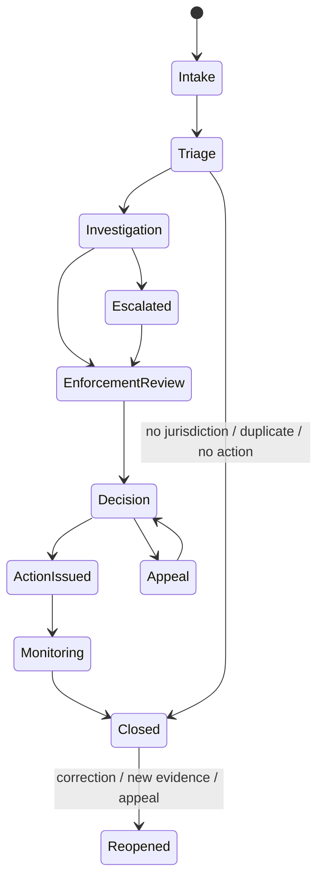
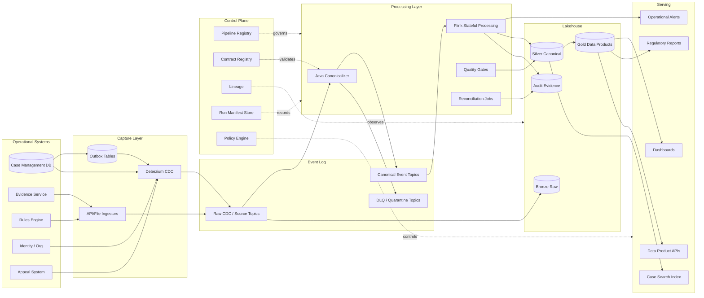
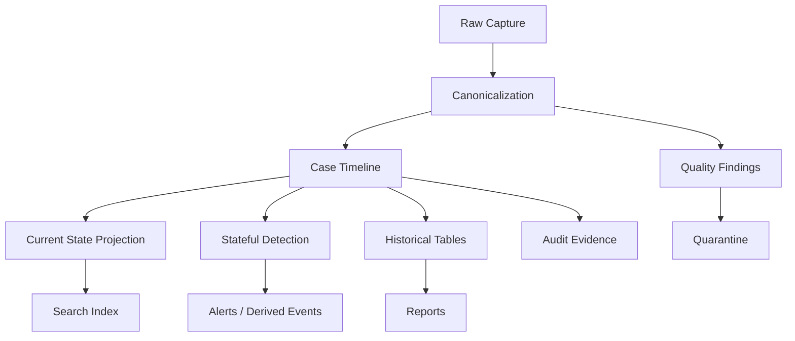
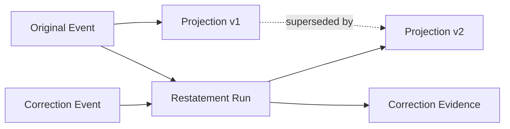

# Part 079 — Case Study Overview

> A production data pipeline is not a pipe.  
> It is a controlled evidence system that moves facts across boundaries without losing meaning.

This part begins the final case study.

We will design a **regulatory enforcement lifecycle data platform**.

The domain is intentionally complex:

- cases evolve over months or years
- assignments change
- evidence arrives late
- deadlines pause and resume
- escalation rules depend on state
- decisions require audit evidence
- corrections must not erase history
- reports must be defensible
- sensitive data must be controlled
- downstream consumers need both real-time signals and historical truth

This is a good case study because it forces the pipeline to handle the hard parts:

- event modeling
- CDC
- outbox
- schema evolution
- temporal semantics
- stream processing
- lakehouse tables
- reconciliation
- lineage
- auditability
- privacy
- reprocessing
- operational failure

The goal is not to build another demo.

The goal is to build the mental model and architecture you would use in a serious internal engineering review.

---

## 1. Domain in One Page

Imagine a regulator manages enforcement cases.

A case may start from:

- complaint
- inspection
- suspicious activity signal
- referral from another agency
- scheduled audit
- automated risk detection

A case then moves through lifecycle states:



The operational platform owns case handling.

The data platform does not own business transactions.

The data platform owns:

- event capture
- derived state
- analytics tables
- dashboards
- SLA breach detection
- escalation feeds
- audit evidence
- lineage
- replay
- correction propagation

That separation is important.

Do not let the pipeline become an unofficial operational database.

---

## 2. Case Study Objective

We will build a platform that supports five major needs:

| Need | Example |
|---|---|
| Operational visibility | Which cases are at risk of breaching SLA today? |
| Regulatory reporting | How many enforcement actions were issued by category and period? |
| Audit defensibility | Why was this case escalated, and what data was used? |
| Data product reuse | Can analytics, search, and alerting consume the same canonical case timeline? |
| Reprocessing safety | Can we replay after rule changes without corrupting external effects? |

This platform must support both **current state** and **historical truth**.

That means we need at least four views of the world:

| View | Meaning |
|---|---|
| Raw captured fact | What the source emitted or what CDC captured |
| Canonical event | What the platform believes happened in business terms |
| Current projection | Latest known state per case/entity |
| Historical assertion ledger | What was believed true at a given recorded/effective time |

If you collapse these into one table, you will eventually lose either accuracy or auditability.

---

## 3. Source Systems

A realistic enforcement platform usually has multiple sources.

| Source | Role | Pipeline Risk |
|---|---|---|
| Case management DB | Operational source of record | CDC ordering, transaction boundary, schema drift |
| Assignment service | Worker/team ownership | rapid changes, duplicate assignment events |
| Evidence repository | document/evidence metadata | late arrival, large payload references, PII |
| Rules engine | escalation and SLA decisions | rule versioning, reproducibility |
| Identity/organization service | officer, team, role metadata | slowly changing dimension, access control |
| Notification service | issued notices and communications | external side effects, delivery status ambiguity |
| Appeal system | appeal and review lifecycle | correction of prior decision state |
| Manual import files | legacy records or bulk correction | partial files, poor quality, provenance gaps |

A strong data pipeline treats each source as a contract boundary.

The first question is not “how do we ingest it?”

The first question is:

```text
What does this source prove, and what does it merely suggest?
```

Example:

- a CDC row update proves a row changed
- an outbox event proves the application committed a business event
- an API response proves the API returned a representation at read time
- a file proves someone submitted a file, not that the contents are valid
- a rule-engine output proves a rule version produced a result from a given input

These are different evidence strengths.

---

## 4. Target Architecture

At a high level:



The architecture has a simple rule:

```text
Operational systems own commands and transactions.
The data platform owns facts, projections, evidence, and derived products.
```

---

## 5. Why Kafka and Lakehouse Together?

Kafka gives us a replayable event log.

Lakehouse tables give us queryable, versioned, historical datasets.

They solve different problems.

| Concern | Kafka | Lakehouse |
|---|---|---|
| Low-latency propagation | strong fit | weak fit |
| Replay recent stream | strong fit while retained | possible but not primary |
| Long-term historical query | weak fit | strong fit |
| Point-in-time table state | limited | strong fit |
| Ad hoc analytics | weak fit | strong fit |
| Stream processing source | strong fit | possible |
| Regulatory evidence archive | part of answer | strong fit |

A mature architecture usually needs both.

Do not use Kafka as your data warehouse.

Do not use object storage as your real-time coordination bus.

---

## 6. Data Products

We will build a small set of data products.

| Data Product | Grain | Main Consumers |
|---|---|---|
| `case_event_timeline` | one canonical event per case event | audit, investigation timeline, replay |
| `case_current_state` | one row per case | dashboards, operational search, alerting |
| `case_assignment_history` | one row per assignment interval | workload reporting, accountability |
| `case_sla_clock_history` | one row per SLA interval | breach analysis, operational alerting |
| `case_escalation_facts` | one row per escalation decision/input | governance, quality review |
| `case_enforcement_decisions` | one row per decision version | statutory reporting, audit |
| `case_correction_ledger` | one row per correction/restatement | regulatory defensibility |
| `case_data_quality_findings` | one row per quality finding | platform ops, data owners |
| `case_lineage_evidence` | one row per run/input/output relation | impact analysis, audit |

These are not merely tables.

They are owned assets with:

- contract
- owner
- SLO
- quality rules
- privacy classification
- lineage
- support model
- lifecycle state
- consumer registry

---

## 7. Core Invariants

For this case study, the platform must preserve these invariants.

### Invariant 1 — Case Timeline Completeness

For a given `caseId`, the canonical timeline should include every accepted business event known to the platform.

Completeness does not mean every raw source row becomes a business event.

Some raw records may be:

- duplicates
- invalid
- incomplete
- technical noise
- rejected
- quarantined
- superseded

But every accepted canonical event must be traceable to source evidence.

```text
canonical_event.sourceEvidenceId must resolve to a raw record, outbox event, file row, API response, or rule execution.
```

### Invariant 2 — Stable Event Identity

Every canonical event must have a stable identity.

A common key shape:

```text
eventId = sourceSystem + sourceEventId
```

or:

```text
eventId = aggregateId + aggregateVersion + eventType
```

The choice depends on source guarantees.

The important rule:

```text
Replaying the same source input must produce the same event identity.
```

If replay creates new IDs, dedupe and audit become fragile.

### Invariant 3 — Case-Local Ordering

For events about the same case, the platform must define ordering.

Ordering may use:

- aggregate version
- source transaction order
- source commit timestamp
- event time
- recorded time
- correction sequence

Never just say “ordered by timestamp” without specifying which timestamp.

A timestamp is not an ordering guarantee.

### Invariant 4 — Effective-Time and Recorded-Time Separation

A decision may be made today but effective from a prior date.

A correction may be recorded today but modify interpretation of a past fact.

Therefore:

```text
effectiveTime != recordedTime != ingestionTime
```

Regulatory systems often need bitemporal reasoning.

### Invariant 5 — Derived Effects Are Reproducible

If an escalation alert was produced, the platform must record:

- input event IDs
- transform/rule version
- reference-data version
- processing run ID
- output event ID
- publication decision
- quality gate result

Without this, you cannot explain why the alert happened.

### Invariant 6 — Sensitive Data Is Classified at Entry

PII classification must happen near ingress.

Do not wait until gold tables.

Every event or table should carry a data classification:

```text
PUBLIC
INTERNAL
CONFIDENTIAL
SENSITIVE_PERSONAL
RESTRICTED_ENFORCEMENT
LEGAL_PRIVILEGED
```

This classification controls:

- logging
- DLQ visibility
- table access
- search indexing
- masking
- retention
- export approval

### Invariant 7 — Corrections Do Not Destroy Evidence

Corrections must create new facts.

They must not silently update old facts.

A correction can supersede prior interpretations, but the platform must retain:

- original fact
- correction fact
- reason
- actor/system
- recorded time
- affected outputs
- restatement run

This is one of the most important auditability rules.

---

## 8. Topic Topology

A possible Kafka topic layout:

| Topic | Purpose | Key |
|---|---|---|
| `raw.case_management.cdc.case` | CDC row changes for case table | `caseId` |
| `raw.case_management.outbox.case_event` | application outbox events | `caseId` |
| `raw.evidence.evidence_registered` | evidence metadata events/API captures | `caseId` or `evidenceId` |
| `raw.identity.officer_cdc` | identity/org CDC | `officerId` |
| `canonical.enforcement.case_event.v1` | accepted canonical case events | `caseId` |
| `canonical.enforcement.assignment_event.v1` | assignment facts | `caseId` |
| `canonical.enforcement.sla_event.v1` | SLA clock and breach events | `caseId` |
| `canonical.enforcement.decision_event.v1` | decision lifecycle events | `caseId` |
| `derived.enforcement.case_alert.v1` | derived operational alerts | `caseId` |
| `dlq.enforcement.case_event.v1` | rejected canonicalization attempts | source-dependent |
| `backfill.enforcement.case_event.v1` | controlled backfill lane | `caseId` |

The topic design separates:

- raw capture
- canonical business facts
- derived facts
- error lanes
- backfill lanes

The key design rule:

```text
Events that require case-local ordering should be keyed by caseId.
```

But not every topic should be keyed by case ID.

For identity reference data, `officerId` may be the correct key.

For evidence lifecycle, `evidenceId` may be correct, unless the primary consumer needs case-local ordering.

---

## 9. Lakehouse Table Topology

A possible table layout:

```text
bronze.raw_case_cdc
bronze.raw_case_outbox
bronze.raw_evidence_capture
bronze.raw_identity_cdc

silver.case_event_timeline
silver.case_current_state
silver.case_assignment_history
silver.case_sla_clock_history
silver.case_decision_history
silver.case_correction_ledger

gold.case_operational_dashboard
gold.case_sla_breach_report
gold.enforcement_action_statutory_report
gold.case_owner_workload_report

audit.pipeline_run_manifest
audit.pipeline_lineage
audit.pipeline_quality_result
audit.pipeline_reconciliation_result
audit.pipeline_publication_event
```

Bronze stores captured evidence.

Silver stores canonical meaning.

Gold stores consumer-oriented products.

Audit stores proof of how outputs were created.

Do not bury audit metadata inside business tables only.

Audit needs its own queryable surface.

---

## 10. Canonical Event Boundary

Raw CDC is not enough.

A row update like this:

```json
{
  "case_id": "CASE-1001",
  "status": "ESCALATED",
  "updated_at": "2026-07-04T08:10:00Z"
}
```

does not fully explain the business fact.

A canonical event should make the business fact explicit:

```json
{
  "eventId": "case-mgmt:outbox:847291",
  "eventType": "CaseEscalated",
  "caseId": "CASE-1001",
  "effectiveTime": "2026-07-04T08:10:00Z",
  "recordedTime": "2026-07-04T08:10:02Z",
  "actor": {
    "type": "SYSTEM",
    "id": "rules-engine"
  },
  "reason": {
    "code": "SLA_RISK",
    "ruleVersion": "sla-escalation/2026.07.01"
  },
  "sourceEvidence": {
    "system": "case-management",
    "kind": "outbox",
    "id": "847291"
  }
}
```

The canonical event is the pipeline’s semantic contract.

---

## 11. Processing Topology

We can divide processing into six lanes.



### Lane 1 — Capture

The capture lane preserves source evidence.

It should avoid aggressive interpretation.

### Lane 2 — Canonicalization

The canonicalizer converts source evidence into business events.

It validates:

- identity
- schema
- required fields
- temporal fields
- classification
- event type
- source trust
- dedupe key

### Lane 3 — Timeline Construction

Timeline construction orders canonical events per case.

It handles:

- event sequence
- correction
- replay
- late event
- invalid ordering
- duplicate event

### Lane 4 — Projection

Projection derives current state.

It must be replay-safe.

### Lane 5 — Stateful Detection

Stateful stream processing detects:

- SLA breach
- escalation candidate
- missing assignment
- dormant case
- high-risk case
- inconsistent decision state

### Lane 6 — Publication

Publication writes to:

- tables
- search indexes
- alert systems
- dashboards
- reports

Publication must be gated by quality and reconciliation.

---

## 12. Java Services in the Case Study

This case study uses Java in several places.

| Component | Java Role |
|---|---|
| Canonicalizer | consumes raw topics, validates contract, emits canonical events |
| Ingestion workers | API/file ingestion, checkpointing, quality capture |
| Outbox producer | application service writes business events transactionally |
| Kafka consumers | projection writer, sink adapter, audit emitter |
| Flink jobs | stateful SLA and escalation detection |
| Spark jobs | large batch/backfill/reporting transformations |
| Temporal workflows | durable backfill and correction campaigns |
| Platform API | pipeline registry, run API, backfill API, policy hooks |
| Test harness | contract tests, replay tests, reconciliation tests |

A strong Java pipeline architecture avoids mixing these concerns in one service.

---

## 13. Run Manifest

Every materialization run should produce a run manifest.

Example:

```json
{
  "runId": "run-20260704-000812",
  "pipelineId": "case-current-state-projection",
  "pipelineVersion": "3.4.0",
  "mode": "STREAMING_CHECKPOINTED",
  "startedAt": "2026-07-04T00:08:12Z",
  "inputs": [
    {
      "dataset": "canonical.enforcement.case_event.v1",
      "fromOffset": 12800021,
      "toOffset": 12849220
    }
  ],
  "outputs": [
    {
      "dataset": "silver.case_current_state",
      "snapshotId": "884921938111"
    }
  ],
  "qualityGate": {
    "result": "PASSED",
    "policyVersion": "case-current-state-quality/2026.07.01"
  },
  "lineageEventId": "ol-evt-829201",
  "gitCommit": "7a1e9f0",
  "containerImage": "registry/pipelines/case-projection:3.4.0"
}
```

This manifest is not administrative decoration.

It is the evidence trail for:

- incident analysis
- audit review
- replay
- impact analysis
- rollback
- cost attribution
- consumer trust

---

## 14. Freshness and SLO Model

Define SLO per product.

| Asset | Freshness SLO | Completeness SLO | Notes |
|---|---:|---:|---|
| `case_current_state` | 2 minutes | 99.9% accepted canonical events projected | operational visibility |
| `case_sla_breach_alerts` | 1 minute | 99.95% eligible SLA windows evaluated | alerting |
| `case_event_timeline` | 5 minutes | 99.99% accepted events persisted | audit |
| `enforcement_action_statutory_report` | daily by 06:00 | 100% for closed reporting period | external reporting |
| `case_lineage_evidence` | 10 minutes | 99.99% pipeline runs recorded | audit/platform |

Different products need different SLOs.

Do not apply one global freshness target to all assets.

That creates unnecessary cost and pressure.

---

## 15. Failure Model for the Case Study

| Failure | Example | Required Response |
|---|---|---|
| Duplicate event | Outbox relay retries publish | dedupe by stable event ID |
| Lost source capture | CDC offset gap | stop publication, reconcile |
| Reordered events | assignment arrives before case opened | buffer, late lane, or quarantine |
| Schema drift | source column changed | contract gate blocks or routes to quarantine |
| Rule version change | SLA rule updated | versioned transform and backfill campaign |
| Partial sink commit | table write succeeded but offset not committed | idempotent sink / manifest recovery |
| Bad correction | correction references unknown event | reject or quarantine |
| Unauthorized field propagation | PII appears in gold table | policy gate fails closed |
| Replay duplicates alerts | backfill emits operational notifications | side-effect suppression in replay mode |
| Search index lag | projection table current but index stale | separate serving freshness signal |

This is why pipeline design is mostly boundary design.

---

## 16. Correction and Restatement Model

Corrections are first-class.



A correction should answer:

- What fact is corrected?
- Why is it corrected?
- Who or what recorded it?
- When was it recorded?
- What effective period is affected?
- Which outputs are impacted?
- Which consumers must be notified?
- Is restatement required?
- Are old reports superseded or amended?

Never model correction as “update the old row and move on.”

---

## 17. Control Plane Objects

The platform should maintain these control objects:

| Object | Purpose |
|---|---|
| `PipelineDefinition` | what pipeline exists and how it runs |
| `PipelineRun` | one execution attempt or continuous run segment |
| `DataAsset` | dataset/data product identity and ownership |
| `DataContract` | schema and semantic constraints |
| `QualityPolicy` | validation and gate rules |
| `LineageRecord` | input-output-run relation |
| `BackfillCampaign` | controlled reprocessing scope |
| `CorrectionCase` | correction/restatement workflow |
| `PublicationEvent` | output visible to consumers |
| `ConsumerRegistration` | who depends on which asset |
| `AccessPolicy` | who can read, operate, or export |

These are not optional once the platform becomes multi-team.

---

## 18. Implementation Roadmap

Build in this order.

### Step 1 — Canonical Event Contract

Define canonical envelope and core event taxonomy.

Do not start with dashboards.

Start with event truth.

### Step 2 — Raw Capture

Capture outbox/CDC/API/file evidence into raw topics and bronze tables.

### Step 3 — Canonicalizer

Build a Java canonicalizer with validation, DLQ, lineage, and deterministic ID generation.

### Step 4 — Timeline Table

Materialize `silver.case_event_timeline`.

This becomes the backbone.

### Step 5 — Current State Projection

Materialize `silver.case_current_state`.

Keep projection logic pure and replayable.

### Step 6 — SLA and Escalation Detection

Add stateful Flink jobs for operational alerts.

### Step 7 — Audit and Lineage

Emit run manifests and lineage from day one.

Do not retrofit auditability.

### Step 8 — Gold Reports

Only after silver assets are stable, build reporting products.

### Step 9 — Backfill and Correction Campaigns

Add durable workflows for controlled replay/restatement.

### Step 10 — Platform Self-Service

Turn repeatable patterns into templates and APIs.

---

## 19. Production Readiness Questions

Before approving this platform, ask:

1. Can every gold row be traced to source evidence?
2. Can every canonical event be replayed deterministically?
3. Can a correction supersede prior output without erasing history?
4. Can a downstream consumer know whether a dataset is stale?
5. Can the platform explain why an SLA alert fired?
6. Can a backfill run without sending duplicate external notifications?
7. Can an officer see only data they are allowed to see?
8. Can a schema change be blocked before it breaks a consumer?
9. Can a case timeline be reconstructed for an audit date?
10. Can a failed sink write be recovered without double-applying effects?
11. Can quarantine be operated without exposing restricted data?
12. Can lineage show blast radius before a change is deployed?

If the answer is no, the platform is not production-grade yet.

---

## 20. What Comes Next

Part 080 designs the operational event model.

That is where the case study becomes concrete.

We will define:

- case lifecycle events
- assignment events
- escalation events
- SLA events
- decision events
- correction events
- envelope shape
- topic keying
- outbox payload
- Java event factory
- projection implications
- replay behavior

The key principle:

```text
The event model is the foundation.
Everything else is a derived consequence.
```
