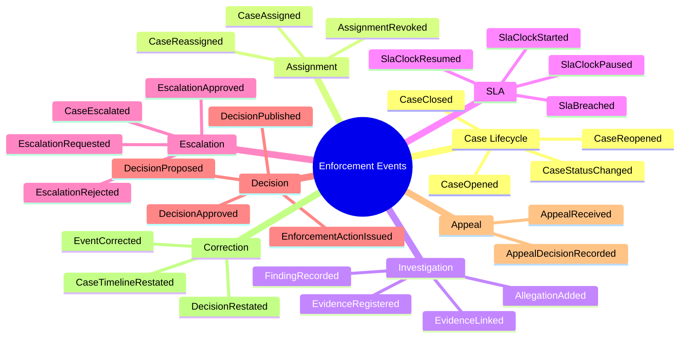
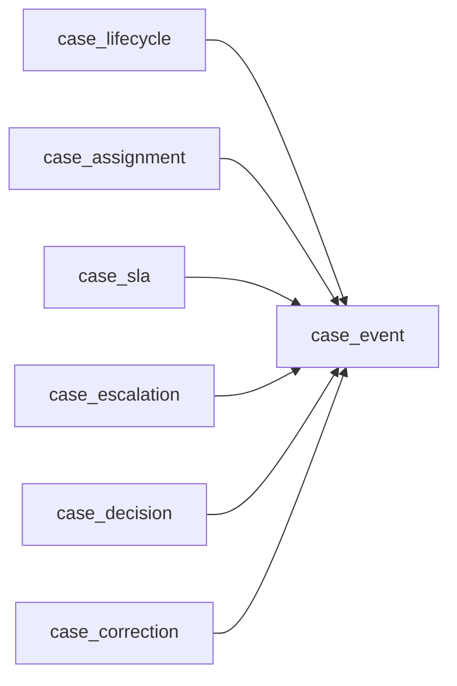
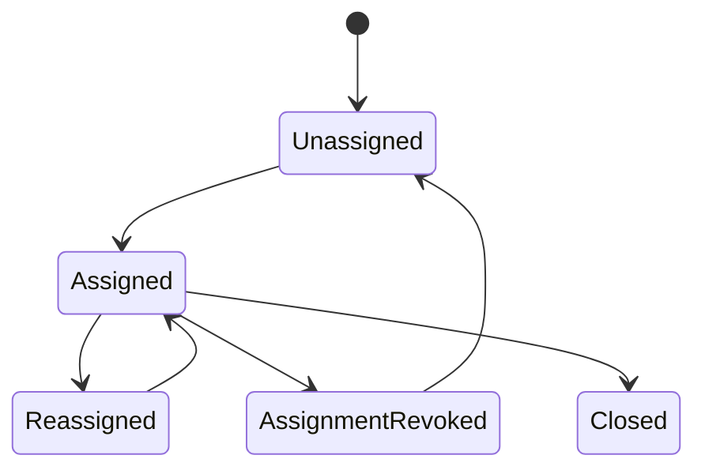
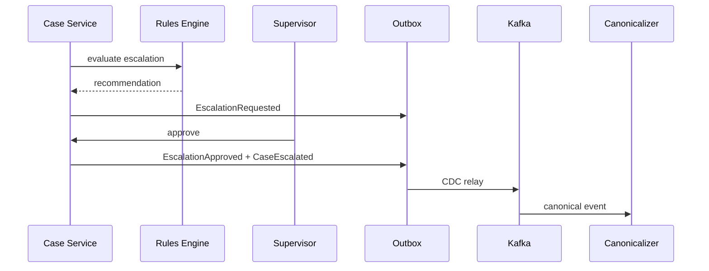
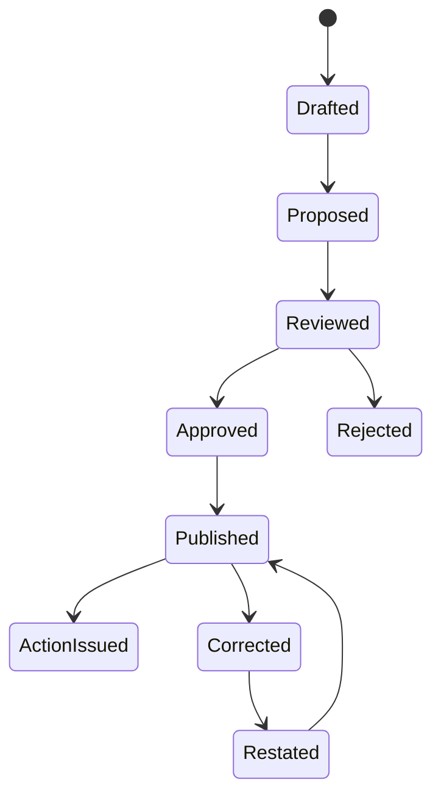
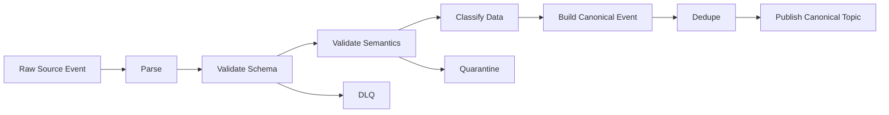

# Part 080 — Case Study Operational Events

> A weak event model turns the pipeline into a forensic guessing machine.  
> A strong event model makes downstream truth explicit.

This part designs the operational events for the regulatory enforcement lifecycle case study.

We are not modeling events for style.

We are modeling events so the platform can answer hard questions:

- What happened?
- When did it happen?
- Who or what caused it?
- What source evidence supports it?
- What rule version was used?
- What state changed?
- What downstream products are affected?
- Can this event be replayed?
- Can this event be corrected?
- Is it safe to expose this event to a consumer?

The event model is the contract between operational systems and the data platform.

---

## 1. Event Modeling Principles

Use these rules.

### Rule 1 — Events Are Facts, Not Requests

Bad:

```text
EscalateCase
```

Better:

```text
CaseEscalationRequested
CaseEscalationApproved
CaseEscalationRejected
CaseEscalated
```

A command asks for something.

An event records something that happened.

Pipelines should prefer facts.

### Rule 2 — Events Must Be Stable Under Replay

If the same source transaction is replayed, it must produce the same canonical event identity.

Do not generate a random UUID during replay unless it is derived from stable source evidence.

### Rule 3 — Events Need Business Meaning

A row update is not necessarily a business event.

Bad:

```text
CaseRowUpdated
```

Better:

```text
CasePriorityChanged
CaseStatusChanged
CaseOwnerChanged
CaseClosed
CaseReopened
```

CDC is evidence.

Canonical events are meaning.

### Rule 4 — Time Must Be Explicit

Every event should distinguish:

| Field | Meaning |
|---|---|
| `eventTime` | when the business thing happened |
| `effectiveTime` | when the fact becomes legally/business effective |
| `recordedTime` | when the source recorded it |
| `ingestedTime` | when the pipeline captured it |
| `processingTime` | when a processor handled it |

Not every event needs all fields, but the model must make the difference explicit.

### Rule 5 — Actor and Causation Matter

A case can be escalated by:

- human officer
- supervisor approval
- automated rule
- external referral
- correction workflow
- appeal outcome

Those are not equivalent.

The event must capture actor and causation.

### Rule 6 — Corrections Are Events

Do not mutate history silently.

Create correction events.

---

## 2. Canonical Envelope

A canonical event has an envelope and payload.

```java
public record EnforcementEvent<T>(
    EventId eventId,
    EventType eventType,
    AggregateId aggregateId,
    AggregateType aggregateType,
    TenantId tenantId,
    long aggregateSequence,
    Instant eventTime,
    Instant effectiveTime,
    Instant recordedTime,
    Instant ingestedTime,
    Actor actor,
    Causation causation,
    SourceEvidence sourceEvidence,
    SchemaRef schema,
    DataClassification classification,
    ProcessingMode processingMode,
    T payload
) {}
```

A simplified JSON shape:

```json
{
  "eventId": "case-mgmt:outbox:847291",
  "eventType": "CaseEscalated",
  "aggregateId": "CASE-1001",
  "aggregateType": "CASE",
  "tenantId": "regulator-id",
  "aggregateSequence": 42,
  "eventTime": "2026-07-04T08:10:00Z",
  "effectiveTime": "2026-07-04T08:10:00Z",
  "recordedTime": "2026-07-04T08:10:02Z",
  "ingestedTime": "2026-07-04T08:10:05Z",
  "actor": {
    "type": "SYSTEM",
    "id": "rules-engine"
  },
  "causation": {
    "correlationId": "corr-882",
    "causationEventId": "case-mgmt:outbox:847280",
    "reasonCode": "SLA_RISK"
  },
  "sourceEvidence": {
    "system": "case-management",
    "kind": "OUTBOX",
    "id": "847291",
    "transactionId": "tx-9911"
  },
  "schema": {
    "name": "enforcement.case-escalated",
    "version": "1.0.0"
  },
  "classification": "RESTRICTED_ENFORCEMENT",
  "processingMode": "LIVE",
  "payload": {}
}
```

The envelope should not be an afterthought.

It is the operational metadata that makes the pipeline trustworthy.

---

## 3. Event Taxonomy

Use event categories.



Taxonomy is not decoration.

It allows consumers to subscribe at the right semantic level.

---

## 4. Topic Strategy

A practical topic layout:

| Topic | Contains | Key |
|---|---|---|
| `canonical.enforcement.case_lifecycle.v1` | case open/status/close/reopen | `caseId` |
| `canonical.enforcement.case_assignment.v1` | assignment interval facts | `caseId` |
| `canonical.enforcement.case_investigation.v1` | allegation/evidence/finding facts | `caseId` |
| `canonical.enforcement.case_sla.v1` | SLA clock and breach events | `caseId` |
| `canonical.enforcement.case_escalation.v1` | escalation facts | `caseId` |
| `canonical.enforcement.case_decision.v1` | decision/action facts | `caseId` |
| `canonical.enforcement.case_correction.v1` | correction/restatement facts | `caseId` |
| `canonical.enforcement.case_event.v1` | unified case timeline copy | `caseId` |

There are two valid patterns.

### Pattern A — Domain-Specific Topics + Timeline Union

Domain-specific topics are easier for focused consumers.

A union topic gives a complete case timeline.



### Pattern B — Single Canonical Topic

A single topic is simpler operationally, but consumers must filter more.

For a complex regulatory domain, Pattern A is usually better once governance matures.

---

## 5. Aggregate Sequence

For case-local ordering, include `aggregateSequence`.

```java
public record AggregateVersion(
    String aggregateId,
    long sequence
) {}
```

The sequence should be assigned by the operational write model or outbox transaction.

If sequence is missing, the platform must use a weaker ordering strategy:

1. source transaction order
2. source commit position
3. recorded time
4. event time
5. deterministic tie-breaker

Do not pretend timestamps are enough.

---

## 6. Case Lifecycle Events

### `CaseOpened`

Payload:

```java
public record CaseOpenedPayload(
    String caseId,
    String caseNumber,
    String intakeChannel,
    String jurisdiction,
    String caseType,
    String priority,
    String openedBy,
    List<String> initialSubjectIds
) {}
```

Validation rules:

- `caseId` required
- `caseNumber` unique within tenant
- `caseType` must be known
- `jurisdiction` must be known
- `eventTime <= recordedTime <= ingestedTime`
- classification must not be lower than source classification

Projection effect:

```text
insert current_case if absent
set status = OPEN
set opened_at = eventTime
set current_priority = priority
```

Replay invariant:

```text
Replaying CaseOpened must not create a second case row.
```

### `CaseStatusChanged`

Payload:

```java
public record CaseStatusChangedPayload(
    String fromStatus,
    String toStatus,
    String reasonCode,
    String reasonText
) {}
```

Validation rules:

- transition must be allowed
- `fromStatus` should match current projection unless replay/correction mode
- reason required for terminal states

This event should not replace richer domain events.

For example, `CaseEscalated` is better than generic `CaseStatusChanged` when escalation has separate business meaning.

---

## 7. Assignment Events

Assignments are interval facts.

Do not store only latest owner.

You need history.

### `CaseAssigned`

```java
public record CaseAssignedPayload(
    String assignmentId,
    String caseId,
    String assigneeType,
    String assigneeId,
    String teamId,
    Instant assignedFrom,
    Instant assignedUntil,
    String reasonCode
) {}
```

Projection effect:

- close prior active assignment interval if needed
- create new assignment interval
- update current owner

Important invariant:

```text
At most one active primary assignment per case at a given effective time.
```

If the domain allows multiple parallel assignments, model role explicitly:

```text
PRIMARY_INVESTIGATOR
SUPERVISOR
LEGAL_REVIEWER
TECHNICAL_SPECIALIST
```

Do not hide role in free text.

### Assignment State Diagram



---

## 8. SLA Clock Events

SLA is not just a deadline field.

It is a clock with transitions.

Events:

- `SlaClockStarted`
- `SlaClockPaused`
- `SlaClockResumed`
- `SlaDeadlineChanged`
- `SlaBreached`
- `SlaBreachAcknowledged`
- `SlaBreachCleared`

### `SlaClockStarted`

```java
public record SlaClockStartedPayload(
    String slaId,
    String policyId,
    String policyVersion,
    Instant clockStart,
    Instant dueAt,
    String basisEventId
) {}
```

### `SlaClockPaused`

```java
public record SlaClockPausedPayload(
    String slaId,
    Instant pausedAt,
    String pauseReason,
    String basisEventId
) {}
```

### `SlaBreached`

`SlaBreached` can be derived by a stream processor.

```java
public record SlaBreachedPayload(
    String slaId,
    Instant dueAt,
    Instant detectedAt,
    String detectingPipelineId,
    String ruleVersion,
    List<String> inputEventIds
) {}
```

This event must record detection metadata.

Otherwise, you cannot explain why the breach alert fired.

---

## 9. Escalation Events

Escalation is a process, not one status flag.

Events:

- `EscalationRequested`
- `EscalationApproved`
- `EscalationRejected`
- `CaseEscalated`
- `EscalationWithdrawn`

### Escalation Flow



### `EscalationRequested`

```java
public record EscalationRequestedPayload(
    String escalationId,
    String caseId,
    String requestedBy,
    String requestReasonCode,
    String ruleVersion,
    List<String> evidenceEventIds,
    String recommendedTargetQueue
) {}
```

### `CaseEscalated`

```java
public record CaseEscalatedPayload(
    String escalationId,
    String caseId,
    String fromQueue,
    String toQueue,
    String approvedBy,
    String approvalEventId,
    String reasonCode
) {}
```

Invariant:

```text
CaseEscalated must reference an approved escalation or authorized emergency escalation reason.
```

This is a semantic validation rule.

---

## 10. Decision Events

Decision events require high auditability.

Events:

- `DecisionDrafted`
- `DecisionProposed`
- `DecisionReviewed`
- `DecisionApproved`
- `DecisionRejected`
- `DecisionPublished`
- `EnforcementActionIssued`
- `DecisionCorrected`
- `DecisionRestated`

### `DecisionApproved`

```java
public record DecisionApprovedPayload(
    String decisionId,
    String caseId,
    String decisionType,
    String approvedBy,
    String approvalAuthority,
    Instant approvedAt,
    String decisionVersion,
    List<String> basisEventIds,
    List<String> evidenceIds,
    String legalBasisCode
) {}
```

This event needs:

- authority
- basis
- version
- evidence references
- effective time
- approval time
- source evidence

A decision without basis references is not defensible.

### Decision State



---

## 11. Correction Events

Corrections must be explicit.

### `EventCorrected`

```java
public record EventCorrectedPayload(
    String correctionId,
    String correctedEventId,
    String correctionType,
    String reasonCode,
    String reasonText,
    String correctedBy,
    Instant correctionEffectiveFrom,
    Map<String, Object> correctedFields
) {}
```

Avoid arbitrary `Map<String, Object>` in the final domain model when possible.

It is shown here only to express conceptually that correction may target fields.

A stronger design uses typed correction events:

- `CasePriorityCorrected`
- `DecisionBasisCorrected`
- `AssignmentIntervalCorrected`
- `SlaDeadlineCorrected`

Typed corrections are easier to validate and replay.

### Correction Invariants

```text
A correction must reference a known target.
A correction must not delete the original event.
A correction must produce a new recorded-time fact.
A correction must declare affected effective time.
A correction must be included in lineage and restatement evidence.
```

---

## 12. Outbox Table Design

The operational service should write business events transactionally.

Example table:

```sql
create table enforcement_outbox (
    outbox_id           uuid primary key,
    aggregate_type      text not null,
    aggregate_id        text not null,
    aggregate_sequence  bigint not null,
    event_type          text not null,
    event_version       text not null,
    event_time          timestamptz not null,
    effective_time      timestamptz not null,
    actor_type          text not null,
    actor_id            text not null,
    correlation_id      text,
    causation_event_id  text,
    classification      text not null,
    payload_json        jsonb not null,
    created_at          timestamptz not null default now()
);
```

Important constraints:

```sql
create unique index uq_outbox_aggregate_sequence
on enforcement_outbox (aggregate_type, aggregate_id, aggregate_sequence);
```

and:

```sql
create unique index uq_outbox_event_identity
on enforcement_outbox (outbox_id);
```

For Kafka partitioning:

```text
message key = aggregate_id
```

For ordering:

```text
aggregate_sequence is inside payload/header.
```

---

## 13. Java Event Factory

Application code should avoid hand-building event maps.

Use factories.

```java
public final class CaseEvents {

    public static OutboxEvent<CaseEscalatedPayload> caseEscalated(
            CaseAggregate caseAggregate,
            EscalationApproval approval,
            Actor actor,
            Clock clock
    ) {
        var payload = new CaseEscalatedPayload(
            approval.escalationId(),
            caseAggregate.caseId(),
            approval.fromQueue(),
            approval.toQueue(),
            approval.approvedBy(),
            approval.approvalEventId(),
            approval.reasonCode()
        );

        return OutboxEvent.of(
            AggregateType.CASE,
            caseAggregate.caseId(),
            caseAggregate.nextSequence(),
            EventType.CASE_ESCALATED,
            SchemaVersion.of("1.0.0"),
            approval.approvedAt(),
            approval.effectiveAt(),
            actor,
            Causation.from(approval),
            DataClassification.RESTRICTED_ENFORCEMENT,
            payload
        );
    }

    private CaseEvents() {}
}
```

This gives you:

- stable event shape
- consistent metadata
- testable construction
- schema version control
- fewer accidental omissions

---

## 14. Transaction Boundary

The operational service should write state and outbox in the same transaction.

```java
@Transactional
public void approveEscalation(ApproveEscalationCommand command) {
    CaseAggregate caseAggregate = caseRepository.getForUpdate(command.caseId());

    EscalationApproval approval = caseAggregate.approveEscalation(command);

    caseRepository.save(caseAggregate);

    OutboxEvent<CaseEscalatedPayload> event =
        CaseEvents.caseEscalated(caseAggregate, approval, command.actor(), clock);

    outboxRepository.insert(event);
}
```

The invariant:

```text
If the case state changes, the event is stored.
If the event is not stored, the case state does not commit.
```

That is the reason to use outbox.

---

## 15. Canonicalizer Rules

The canonicalizer consumes raw outbox/CDC/API/file events and emits canonical events.



Validation includes:

- known event type
- compatible schema version
- valid aggregate ID
- valid aggregate sequence
- valid actor
- valid classification
- valid source evidence
- temporal sanity
- payload-specific constraints

Schema validation is necessary but insufficient.

Semantic validation is where production correctness lives.

---

## 16. Projection Rules

A projection consumes canonical events and writes derived state.

Example current case projection:

```java
public final class CurrentCaseProjector {

    public CurrentCase apply(CurrentCase current, EnforcementEvent<?> event) {
        return switch (event.eventType()) {
            case CASE_OPENED -> onCaseOpened(current, event.cast());
            case CASE_STATUS_CHANGED -> onStatusChanged(current, event.cast());
            case CASE_ASSIGNED -> onAssigned(current, event.cast());
            case CASE_ESCALATED -> onEscalated(current, event.cast());
            case SLA_BREACHED -> onSlaBreached(current, event.cast());
            case DECISION_APPROVED -> onDecisionApproved(current, event.cast());
            case CASE_CLOSED -> onCaseClosed(current, event.cast());
            default -> current;
        };
    }
}
```

Projection rules must be:

- deterministic
- idempotent
- versioned
- replayable
- side-effect-free

Writing to the sink is a separate concern.

---

## 17. Timeline Table

The canonical case timeline should store one row per event.

Example columns:

```text
case_id
event_id
event_type
aggregate_sequence
event_time
effective_time
recorded_time
ingested_time
actor_type
actor_id
reason_code
source_system
source_evidence_id
schema_name
schema_version
classification
payload
processing_mode
run_id
is_correction
corrects_event_id
```

This table is the backbone for:

- audit timeline
- replay
- debugging
- reporting
- correction impact analysis
- current projection rebuild
- consumer trust

Do not skip it and write directly from Kafka to gold reports.

---

## 18. Derived Event Example: SLA Breach Detection

A Flink job can consume:

- lifecycle events
- SLA clock events
- assignment events
- pause/resume events
- decision events

It maintains keyed state per `caseId`.

When watermark passes `dueAt`, it emits `SlaBreached`.

Pseudocode:

```java
if (state.clockActive()
        && !state.completed()
        && watermark.isAfter(state.dueAt())
        && !state.breachAlreadyEmitted()) {

    emit(new SlaBreachedPayload(
        state.slaId(),
        state.dueAt(),
        clock.instant(),
        "sla-breach-detector",
        ruleVersion,
        state.inputEventIds()
    ));

    state.markBreachEmitted();
}
```

Important:

```text
The derived event must include input event IDs and rule version.
```

Otherwise, it cannot be audited.

---

## 19. Replay Modes

Events should behave differently depending on processing mode.

| Mode | Meaning | Side Effect Policy |
|---|---|---|
| `LIVE` | normal operational processing | side effects allowed if authorized |
| `REPLAY` | rebuilding internal state | external side effects suppressed |
| `BACKFILL` | historical materialization | side effects suppressed |
| `RESTATEMENT` | corrected output publication | controlled publication only |
| `SHADOW` | comparing new logic | no consumer-visible publication |

Processing mode must be visible in envelope or run context.

Never let backfill accidentally send real alerts.

---

## 20. Anti-Patterns

Avoid these.

### Anti-Pattern 1 — Generic `CaseUpdated`

A generic update event forces every consumer to infer what changed.

That creates inconsistent business logic downstream.

### Anti-Pattern 2 — Event Without Source Evidence

If an event cannot be traced to source evidence, it is weak for audit.

### Anti-Pattern 3 — Timestamp-Only Ordering

Timestamps collide, drift, and represent different concepts.

Use aggregate sequence or source position where possible.

### Anti-Pattern 4 — Mutating Old Events for Corrections

This destroys auditability.

Corrections should be new events.

### Anti-Pattern 5 — Payload Without Classification

Sensitive data will leak into logs, DLQ, and gold tables.

### Anti-Pattern 6 — Rule Output Without Rule Version

You cannot explain derived decisions without rule version and input references.

### Anti-Pattern 7 — Downstream Consumers Reading Raw CDC Directly

Raw CDC is technical evidence, not stable business meaning.

It couples consumers to operational schema.

---

## 21. Production Review Checklist

Before accepting an event type into production:

- Does it describe a fact, not a command?
- Does it have stable identity?
- Does it have aggregate ID and keying strategy?
- Does it have ordering semantics?
- Does it separate event/effective/recorded/ingested time?
- Does it include actor and causation?
- Does it include source evidence?
- Does it have a schema version?
- Does it have data classification?
- Does it define replay behavior?
- Does it define correction behavior?
- Does it define projection effects?
- Does it define validation rules?
- Does it define ownership?
- Does it define consumer impact?
- Does it have contract tests?
- Does it have sample golden events?
- Does it have DLQ/quarantine policy?
- Does it have lineage emission?
- Does it have observability fields?

This checklist prevents the event model from becoming a pile of JSON messages.

---

## 22. What Comes Next

Part 081 will connect this event model to CDC and Kafka.

We will implement:

- outbox-to-Debezium capture
- Kafka topic strategy
- schema registry usage
- event routing
- partitioning
- dedupe
- raw-to-canonical flow
- source offset tracking
- lineage and run manifest
- failure model
- testing strategy

The event model is now clear.

Next, we make it move safely.
