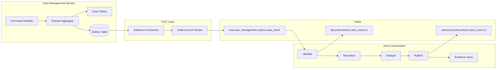
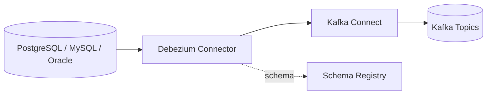
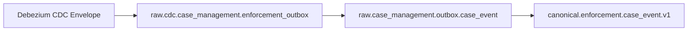
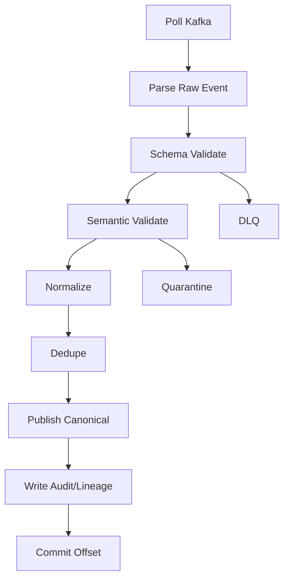

# Part 081 — Case Study CDC to Kafka

> CDC is not the architecture.  
> CDC is a capture mechanism.  
> The architecture is the set of contracts around capture, routing, interpretation, replay, and evidence.

In Part 080, we designed operational events.

Now we make those events move safely from the operational database into Kafka.

This part focuses on:

- transactional outbox
- Debezium CDC
- Kafka topic design
- schema registry usage
- raw-to-canonical flow
- source offset tracking
- dedupe
- partitioning
- lineage
- failure recovery
- Java canonicalizer design
- production testing

The goal is not merely to publish messages.

The goal is to preserve source truth while creating a stable semantic event stream for the rest of the platform.

---

## 1. The Core Problem

The operational case service updates database state.

Downstream systems need events.

The dangerous implementation is:

```java
caseRepository.save(case);
kafkaProducer.send(event);
```

This creates a dual-write problem.

Failure cases:

| Failure | Result |
|---|---|
| DB commit succeeds, Kafka publish fails | state changed, event missing |
| Kafka publish succeeds, DB commit fails | event exists for state that never committed |
| app crashes after DB commit before publish | invisible change |
| publish times out but succeeds | retry may duplicate |
| Kafka transaction works but DB transaction is separate | still not atomic across DB + Kafka |

The outbox pattern solves the local atomicity problem:

```text
Write business state and event record in the same database transaction.
Capture the event record later through CDC.
```

That gives us a durable handoff point.

---

## 2. Target Flow



The system intentionally separates:

1. operational transaction
2. CDC capture
3. raw event preservation
4. canonical interpretation
5. derived processing

Do not collapse these layers early.

---

## 3. Outbox Table as Evidence

A production outbox table is not just a queue.

It is evidence of a committed business transaction.

Example:

```sql
create table enforcement_outbox (
    outbox_id             uuid primary key,
    aggregate_type        text not null,
    aggregate_id          text not null,
    aggregate_sequence    bigint not null,
    event_type            text not null,
    event_version         text not null,
    event_time            timestamptz not null,
    effective_time        timestamptz not null,
    actor_type            text not null,
    actor_id              text not null,
    correlation_id        text,
    causation_event_id    text,
    classification        text not null,
    payload_json          jsonb not null,
    source_service        text not null,
    source_schema_version text not null,
    created_at            timestamptz not null default now()
);
```

Indexes:

```sql
create unique index uq_enforcement_outbox_aggregate_seq
on enforcement_outbox (aggregate_type, aggregate_id, aggregate_sequence);

create index idx_enforcement_outbox_created_at
on enforcement_outbox (created_at);

create index idx_enforcement_outbox_aggregate
on enforcement_outbox (aggregate_type, aggregate_id);
```

Key decisions:

| Field | Why It Matters |
|---|---|
| `outbox_id` | stable event identity seed |
| `aggregate_id` | Kafka partition key |
| `aggregate_sequence` | case-local ordering |
| `event_type` | routing and deserialization |
| `event_version` | compatibility and decoding |
| `event_time` | business time |
| `effective_time` | legal/business effectivity |
| `actor_*` | accountability |
| `classification` | privacy/security control |
| `payload_json` | event-specific data |
| `created_at` | CDC operational trace |

The outbox row must be immutable after insertion.

If a business event was wrong, write a correction event.

---

## 4. Transaction Boundary in Java

A command handler should persist aggregate changes and the outbox event in one transaction.

```java
@Transactional
public void assignCase(AssignCaseCommand command) {
    CaseAggregate caseAggregate =
        caseRepository.getForUpdate(command.caseId());

    Assignment assignment =
        caseAggregate.assignTo(command.assignee(), command.actor(), clock.instant());

    caseRepository.save(caseAggregate);

    OutboxEvent<CaseAssignedPayload> event =
        CaseEventFactory.caseAssigned(caseAggregate, assignment, command.actor(), clock);

    outboxRepository.insert(event);
}
```

The transaction invariant:

```text
case table update committed <=> outbox row committed
```

This does not mean Kafka has the event immediately.

It means the system has a durable source from which Kafka can be repaired.

That is the key.

---

## 5. Outbox Event Factory

Avoid ad hoc JSON creation.

Use a typed event factory.

```java
public final class OutboxEvent<T> {
    private final UUID outboxId;
    private final String aggregateType;
    private final String aggregateId;
    private final long aggregateSequence;
    private final String eventType;
    private final String eventVersion;
    private final Instant eventTime;
    private final Instant effectiveTime;
    private final Actor actor;
    private final Causation causation;
    private final DataClassification classification;
    private final T payload;

    // constructor, getters, static builders
}
```

Factory method:

```java
public static OutboxEvent<CaseAssignedPayload> caseAssigned(
        CaseAggregate aggregate,
        Assignment assignment,
        Actor actor,
        Clock clock
) {
    return OutboxEvent.<CaseAssignedPayload>builder()
        .outboxId(DeterministicIds.from(
            "case-assigned",
            aggregate.caseId(),
            aggregate.sequence()
        ))
        .aggregateType("CASE")
        .aggregateId(aggregate.caseId())
        .aggregateSequence(aggregate.sequence())
        .eventType("CaseAssigned")
        .eventVersion("1.0.0")
        .eventTime(assignment.assignedAt())
        .effectiveTime(assignment.effectiveFrom())
        .actor(actor)
        .causation(Causation.fromCommand(actor.correlationId()))
        .classification(DataClassification.RESTRICTED_ENFORCEMENT)
        .payload(new CaseAssignedPayload(
            assignment.assignmentId(),
            aggregate.caseId(),
            assignment.assigneeType(),
            assignment.assigneeId(),
            assignment.teamId(),
            assignment.effectiveFrom(),
            assignment.effectiveUntil(),
            assignment.reasonCode()
        ))
        .build();
}
```

Deterministic IDs are not always required in the application layer if the database generates the outbox ID before insert.

But replay and duplicate handling become easier if identity is stable and traceable.

---

## 6. Debezium Capture

Debezium captures committed changes from the database transaction log and emits them to Kafka.

The common deployment is:



For outbox, Debezium can capture the outbox table and route it into event topics.

The important idea:

```text
Debezium observes committed DB changes.
It does not participate in the application transaction.
```

This is a strength.

It decouples application latency from Kafka availability.

It is also a risk.

If CDC falls behind, downstream freshness degrades.

---

## 7. Raw Topic Strategy

There are two useful topic levels.

### Raw Debezium Topic

This contains the CDC envelope.

Example topic:

```text
raw.cdc.case_management.enforcement_outbox
```

Use it when you want to preserve exact Debezium source information.

### Routed Outbox Raw Topic

This contains outbox events after routing.

Example topic:

```text
raw.case_management.outbox.case_event
```

Use it as the stable raw business event capture surface.

In a strict platform, keep both:



Why keep both?

| Layer | Purpose |
|---|---|
| Raw CDC | exact capture evidence |
| Routed raw outbox | source business event evidence |
| Canonical | platform semantic contract |

Storage is cheaper than losing evidence.

---

## 8. Debezium Outbox Router Mapping

A typical outbox router maps fields like:

| Outbox Column | Kafka Role |
|---|---|
| `aggregate_id` | message key |
| `event_type` | topic routing / header |
| `payload_json` | message value |
| `event_version` | schema/header |
| `outbox_id` | event id/header |
| `aggregate_sequence` | ordering metadata/header |

Conceptually:

```text
table row -> Kafka record
```

with:

```text
key = aggregate_id
value = payload_json or envelope(payload_json)
headers = event metadata
topic = route(event_type or aggregate_type)
```

A common mistake is putting only payload in Kafka and losing metadata.

Do not do this.

The payload says what changed.

The metadata says why the event can be trusted.

---

## 9. Kafka Message Shape

For the raw outbox topic, use an envelope.

```json
{
  "outboxId": "847291",
  "aggregateType": "CASE",
  "aggregateId": "CASE-1001",
  "aggregateSequence": 42,
  "eventType": "CaseEscalated",
  "eventVersion": "1.0.0",
  "eventTime": "2026-07-04T08:10:00Z",
  "effectiveTime": "2026-07-04T08:10:00Z",
  "actor": {
    "type": "SYSTEM",
    "id": "rules-engine"
  },
  "causation": {
    "correlationId": "corr-882",
    "causationEventId": "case-mgmt:outbox:847280"
  },
  "classification": "RESTRICTED_ENFORCEMENT",
  "source": {
    "service": "case-management",
    "database": "case_db",
    "table": "enforcement_outbox"
  },
  "payload": {
    "escalationId": "ESC-991",
    "caseId": "CASE-1001",
    "fromQueue": "TRIAGE",
    "toQueue": "ENFORCEMENT_REVIEW",
    "reasonCode": "SLA_RISK"
  }
}
```

This is still raw source business evidence.

The canonical event may add or normalize:

- schema reference
- source evidence ID
- normalized actor
- normalized reason code
- tenant context
- platform classification
- validation result
- processing mode
- lineage references

---

## 10. Schema Registry Strategy

For this case study, use schema registry for Kafka event contracts.

You can choose:

- Avro
- Protobuf
- JSON Schema

A practical strategy:

| Stream Type | Suggested Format | Reason |
|---|---|---|
| internal canonical events | Avro or Protobuf | strong compatibility control, compact binary |
| raw JSON outbox payload | JSON Schema or Avro envelope with JSON payload | easier source evolution |
| DLQ/quarantine | JSON envelope with schema reference | inspectability |
| external data product events | Protobuf or JSON Schema | consumer ergonomics |

Do not let each team invent serialization independently.

At platform scale, schema governance is architecture.

---

## 11. Topic Keying

For case events:

```text
key = caseId
```

This gives case-local ordering per partition.

For identity reference data:

```text
key = officerId
```

For evidence documents:

```text
key = evidenceId
```

or:

```text
key = caseId
```

depending on the dominant processing need.

Decision rule:

```text
Choose the key based on the strongest required ordering and state locality.
```

If SLA breach detection is keyed by `caseId`, then all events that affect the SLA state should be keyed by `caseId` before entering that job.

---

## 12. Partition Count Decision

Partition count is hard to change operationally.

Use a capacity model.

Inputs:

```text
peakEventsPerSecond
averageEventSizeBytes
targetConsumerParallelism
hotKeyRisk
retentionRequirement
brokerCapacity
futureGrowthFactor
```

Simple starting rule:

```text
partitions >= max(target parallelism, expected peak throughput / safe throughput per partition)
```

But do not over-partition blindly.

Too many partitions increase:

- metadata overhead
- file handles
- rebalance cost
- consumer coordination cost
- small batch inefficiency
- operational complexity

For case workloads, hot keys may happen when a large case receives many events.

Mitigations:

- detect hot `caseId`
- split some derived computation by sub-key only if semantics allow
- isolate high-volume event types
- use stateful operator scaling carefully
- avoid random keying that breaks case-local ordering

---

## 13. Raw-to-Canonical Canonicalizer

The canonicalizer is a Java service.

Responsibilities:

1. consume raw outbox topic
2. parse envelope
3. validate schema compatibility
4. validate semantic rules
5. normalize reference values
6. map to canonical event
7. dedupe by stable ID
8. write canonical event
9. write quality/audit evidence
10. commit offset after successful effects

Processing loop:



Commit rule:

```text
Commit source offset only after canonical publish and required evidence writes are durable.
```

If audit evidence is best-effort, say so explicitly.

For regulated data, best-effort audit is often unacceptable.

---

## 14. Canonical Event ID

A stable canonical ID can be:

```text
case-management:outbox:<outbox_id>
```

or:

```text
case-management:CASE:<caseId>:<aggregateSequence>:<eventType>
```

Pick based on source guarantees.

Outbox ID is simple.

Aggregate sequence is useful for ordering validation.

A robust event ID object:

```java
public record EventId(String value) {
    public EventId {
        if (value == null || value.isBlank()) {
            throw new IllegalArgumentException("eventId is required");
        }
    }

    public static EventId fromOutbox(String sourceSystem, UUID outboxId) {
        return new EventId(sourceSystem + ":outbox:" + outboxId);
    }
}
```

Do not use random IDs in the canonicalizer.

Random IDs break replay determinism.

---

## 15. Dedupe Ledger

The canonicalizer should have a dedupe ledger.

Table:

```sql
create table canonical_event_ledger (
    event_id          text primary key,
    source_system     text not null,
    source_evidence_id text not null,
    topic             text not null,
    partition_id      int not null,
    offset_id         bigint not null,
    payload_hash      text not null,
    first_seen_at     timestamptz not null,
    last_seen_at      timestamptz not null,
    duplicate_count   bigint not null default 0
);
```

When an event arrives:

```java
DedupeResult result = ledger.claim(eventId, payloadHash, sourcePosition);

switch (result.kind()) {
    case NEW -> publishCanonical(event);
    case DUPLICATE_SAME_PAYLOAD -> skipAndCommit();
    case DUPLICATE_DIFFERENT_PAYLOAD -> quarantine();
}
```

The dangerous duplicate is not duplicate-same-payload.

The dangerous duplicate is same identity with different meaning.

That indicates upstream identity corruption or non-deterministic mapping.

---

## 16. Publishing Canonical Events

Use Kafka producer settings appropriate for durability.

Conceptual settings:

```properties
acks=all
enable.idempotence=true
max.in.flight.requests.per.connection=5
retries=Integer.MAX_VALUE
delivery.timeout.ms=120000
request.timeout.ms=30000
```

For consume-transform-produce, Kafka transactions can atomically commit output records and consumed offsets within Kafka.

But be careful:

```text
Kafka transactions do not make writes to an external DB atomic with Kafka writes.
```

If the canonicalizer writes both:

- canonical Kafka event
- external SQL ledger

then you still need an effect ledger or transactional design around the external write.

A common approach:

1. write canonical event to Kafka
2. use compacted canonical topic as source of truth
3. write audit/ledger asynchronously but reconcile
4. or use DB as primary effect ledger and publish through outbox again

The right answer depends on audit strictness.

For this case study, keep a durable event ledger and reconcile it with Kafka offsets.

---

## 17. Source Position Tracking

Every canonical event should carry source position.

For Debezium/Kafka source:

```json
{
  "sourcePosition": {
    "rawTopic": "raw.case_management.outbox.case_event",
    "partition": 3,
    "offset": 1849921,
    "sourceSystem": "case-management",
    "sourceEvidenceId": "847291"
  }
}
```

This supports:

- replay
- audit
- offset-to-effect reconciliation
- duplicate investigation
- gap detection
- impact analysis
- lineage

Source position is not the same as business identity.

Both are needed.

---

## 18. Handling CDC Gaps and Lag

CDC health metrics:

| Metric | Meaning |
|---|---|
| connector running status | is CDC alive? |
| source lag | how far behind DB log capture is |
| Kafka producer errors | CDC-to-Kafka publish health |
| skipped/errored records | data loss risk |
| heartbeat freshness | connector liveness |
| schema history health | ability to decode changes |
| outbox row growth | downstream capture lag |

If CDC lag grows, consumers may be healthy but stale.

This is why freshness SLO must decompose:

```text
source commit -> CDC capture -> Kafka publish -> canonicalization -> projection -> serving
```

Do not alert only on final table delay.

You need stage-specific lag.

---

## 19. DLQ vs Quarantine

Not all bad records are equal.

| Category | Example | Destination |
|---|---|---|
| Parse failure | invalid JSON | DLQ |
| Schema incompatible | missing required field | DLQ or quarantine |
| Semantic invalid | unknown transition | quarantine |
| Security violation | restricted field in public stream | quarantine + security alert |
| Duplicate same payload | replay duplicate | dedupe ledger |
| Duplicate different payload | identity collision | quarantine |
| Unknown reference | officer ID missing | hold/retry/quarantine depending policy |

DLQ is for technical processing failure.

Quarantine is for data that requires governance or domain intervention.

---

## 20. Lineage Emission

Emit lineage for canonicalization.

Example OpenLineage-like conceptual event:

```json
{
  "run": {
    "runId": "run-canon-20260704-001"
  },
  "job": {
    "namespace": "enforcement",
    "name": "raw-outbox-to-canonical-case-event"
  },
  "inputs": [
    {
      "namespace": "kafka",
      "name": "raw.case_management.outbox.case_event",
      "facets": {
        "offsetRange": {
          "partition": 3,
          "from": 1849900,
          "to": 1849921
        }
      }
    }
  ],
  "outputs": [
    {
      "namespace": "kafka",
      "name": "canonical.enforcement.case_event.v1"
    }
  ]
}
```

Lineage is not only for dashboards.

It is needed for:

- impact analysis
- incident forensics
- backfill scope
- audit evidence
- consumer notification
- data product trust

---

## 21. Offset-to-Effect Reconciliation

Build reconciliation between raw source and canonical output.

Example checks:

```text
raw accepted count == canonical produced count + rejected count + duplicate count
```

Per window:

```sql
select
    date_trunc('minute', ingested_at) as minute,
    count(*) as raw_count
from raw_outbox_events
group by 1;
```

Compare to:

```sql
select
    date_trunc('minute', canonicalized_at) as minute,
    count(*) as canonical_count
from canonical_event_ledger
where status = 'PUBLISHED'
group by 1;
```

But count is not enough.

Also check:

- event ID coverage
- source evidence coverage
- payload hash consistency
- aggregate sequence gaps
- partition/offset gaps
- quality rejection reason distribution
- late-arriving source event volume

Reconciliation should create its own audit record.

---

## 22. Aggregate Sequence Validation

For each `caseId`, canonicalizer can validate sequence progression.

Cases:

| Situation | Meaning |
|---|---|
| sequence = previous + 1 | normal |
| sequence already seen, same payload | duplicate |
| sequence already seen, different payload | critical identity corruption |
| sequence > previous + 1 | gap or out-of-order |
| sequence < previous | late/replay/duplicate |

Sequence gap policy:

```text
If source guarantees in-order per aggregate and gap appears, hold or quarantine.
If source does not guarantee arrival order, buffer within bounded window.
```

Never ignore sequence gaps silently.

They often represent missing business events.

---

## 23. Backfill Lane

Backfill should not use the live canonical topic blindly.

Options:

### Option A — Same topic with processing mode

```json
"processingMode": "BACKFILL"
```

Pros:

- consumers see one stream
- easier complete reconstruction

Cons:

- live consumers may accidentally process historical effects
- requires strict consumer filtering

### Option B — Separate backfill topic

```text
backfill.enforcement.case_event.v1
```

Pros:

- safer operational separation
- easier access control
- easier controlled merge

Cons:

- more topic management
- consumers need merge logic

For regulated operational alerts, prefer separate backfill lane unless the consumer platform has strong mode controls.

---

## 24. Security and Privacy in CDC

CDC can leak everything.

Never assume outbox is safe because it is “just events.”

Controls:

- event classification in outbox
- topic-level ACLs
- schema-level field classification
- DLQ/quarantine access restriction
- log redaction
- encryption in transit
- encryption at rest
- secrets not in payload
- PII minimization
- derived public topics with explicit redaction
- access audit

Bad:

```json
{
  "eventType": "CaseOpened",
  "payload": {
    "fullName": "...",
    "nationalId": "...",
    "freeTextComplaint": "..."
  }
}
```

Better:

```json
{
  "eventType": "CaseOpened",
  "payload": {
    "subjectRef": "SUBJECT-991",
    "complaintSummaryRef": "DOC-1009",
    "riskCategory": "FINANCIAL_MISCONDUCT"
  }
}
```

Reference sensitive records.

Do not broadcast them unless consumers truly need them.

---

## 25. Failure Scenarios

### Scenario 1 — Debezium Connector Down

Effect:

- outbox rows accumulate
- Kafka stream becomes stale
- operational DB remains correct

Response:

- alert on CDC lag
- verify DB log retention
- restart connector
- reconcile outbox rows vs Kafka events
- avoid manual publishing unless runbook controlled

### Scenario 2 — Kafka Publish Timeout from Debezium

Effect:

- connector may retry
- duplicate output possible depending failure point

Response:

- consumers dedupe by event ID
- verify raw topic count
- monitor connector errors

### Scenario 3 — Canonicalizer Crash After Publish Before Offset Commit

Effect:

- source record will be consumed again
- duplicate canonical publish possible if not idempotent

Response:

- stable event ID
- dedupe ledger
- idempotent producer
- compacted/ledger-backed output where appropriate

### Scenario 4 — Schema Change Breaks Canonicalizer

Effect:

- raw events arrive
- canonicalization fails

Response:

- DLQ/quarantine
- contract gate
- source owner alert
- rollback or deploy compatible canonicalizer
- do not skip source records silently

### Scenario 5 — Outbox Payload Bug

Effect:

- committed business event contains wrong payload

Response:

- emit correction event
- restatement workflow
- affected output analysis
- do not mutate old outbox row

---

## 26. Testing Strategy

### Unit Tests

- event factory creates valid outbox events
- aggregate sequence increments
- classification required
- source evidence included
- invalid domain transitions rejected

### Contract Tests

- outbox schema compatibility
- canonical schema compatibility
- consumer assumption tests
- golden event samples

### Integration Tests

Use containers for:

- database
- Kafka
- Kafka Connect/Debezium
- schema registry if used
- canonicalizer

Test:

1. execute command
2. verify DB state
3. verify outbox row
4. wait for Kafka raw event
5. verify canonical event
6. verify ledger
7. restart canonicalizer
8. verify no duplicate effect

### Failure Tests

- kill canonicalizer after publish
- pause Kafka
- restart Debezium
- inject duplicate raw event
- inject out-of-order sequence
- inject schema-incompatible payload
- inject PII violation
- simulate DB log lag
- simulate backfill mode

If you only test happy-path CDC, you did not test the architecture.

---

## 27. Production Checklist

Before going live:

- Outbox writes are transactional with business state.
- Outbox rows are immutable.
- Event ID is stable.
- Aggregate sequence exists for case events.
- Kafka key is correct for required ordering.
- Raw CDC evidence is retained.
- Raw outbox topic is retained.
- Canonical topic has schema compatibility policy.
- Canonicalizer validates schema and semantics.
- DLQ and quarantine are separate.
- Dedupe ledger handles duplicate same/different payload.
- Source position is included in canonical event.
- Lineage is emitted.
- CDC lag is monitored.
- Outbox growth is monitored.
- Offset-to-effect reconciliation exists.
- Backfill mode cannot trigger live external effects.
- Access controls protect restricted topics.
- Contract tests run in CI.
- Failure injection has been performed.
- Runbook exists for CDC lag, schema break, and replay.

---

## 28. What Comes Next

Part 082 uses the canonical stream to build stateful processing.

We will implement:

- case current state projection
- assignment state
- SLA clock state
- breach detection
- escalation candidate detection
- late event handling
- correction handling
- side outputs
- idempotent alert sink
- Flink job structure
- state migration
- test harness
- operational metrics

The CDC pipeline gave us trustworthy events.

Now we use those events to compute trustworthy derived facts.
