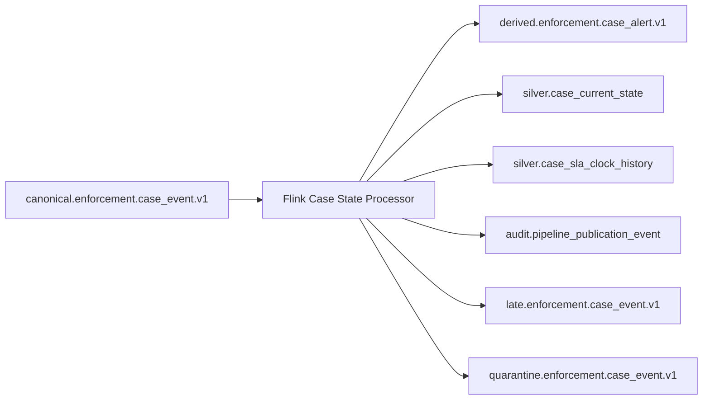
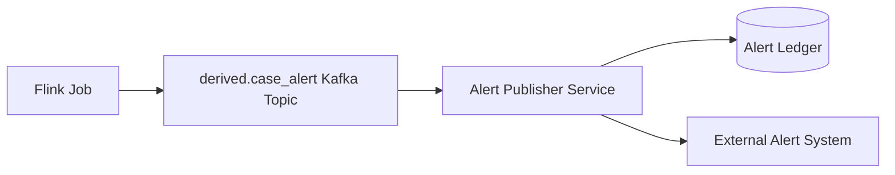

# Part 082 — Case Study Stream Processing

> Stateful stream processing is where the pipeline stops being a transport mechanism and becomes a living model of the business.

In Part 081, we moved trusted canonical events into Kafka.

Now we use those events to compute derived facts:

- current case state
- active assignment
- SLA clock state
- breach detection
- escalation candidates
- dormant case alerts
- inconsistent state alerts
- timeline corrections
- operational alert output

The focus is not on writing a few Flink operators.

The focus is on designing state, time, output, recovery, and audit semantics.

---

## 1. Input Stream

Input topic:

```text
canonical.enforcement.case_event.v1
```

Key:

```text
caseId
```

Event categories:

- case lifecycle
- assignment
- SLA clock
- escalation
- decision
- appeal
- correction
- evidence
- investigation

The Flink job consumes a unified canonical timeline because the derived state depends on multiple event types.



---

## 2. Why Stateful Stream Processing?

You need state because events are not independent.

To decide if an SLA breach happened, the processor needs to know:

- case opened time
- SLA policy
- pause/resume intervals
- current status
- current assignment
- decision completion
- prior breach emission
- correction state
- watermark progress

A stateless consumer cannot reliably compute that.

A database query could compute it periodically, but with trade-offs:

| Approach | Strength | Weakness |
|---|---|---|
| periodic SQL batch | simple, inspectable | delayed, expensive, repeated scanning |
| application trigger | close to source | hard to replay, mixes operational and derived logic |
| Flink stateful stream | low latency, replayable, event-time aware | state design and operations are harder |

For SLA alerting and derived event production, stateful stream processing is a strong fit.

---

## 3. State Model

Keyed by:

```text
caseId
```

State object:

```java
public record CaseProcessingState(
    String caseId,
    CaseStatus status,
    AssignmentState assignment,
    SlaState sla,
    EscalationState escalation,
    DecisionState decision,
    CorrectionState correction,
    EventHistoryIndex history,
    long lastAggregateSequence,
    Instant lastEventTime,
    Instant lastEffectiveTime,
    boolean dirty
) {}
```

This is conceptual.

In Flink, you usually store state in separate `ValueState`, `MapState`, or `ListState` instead of one huge object.

Example:

```java
private transient ValueState<CaseStatus> caseStatus;
private transient ValueState<AssignmentState> assignmentState;
private transient ValueState<SlaState> slaState;
private transient ValueState<DecisionState> decisionState;
private transient MapState<String, ProcessedEventRef> processedEvents;
private transient ValueState<Long> lastAggregateSequence;
```

Separate state helps with:

- TTL
- migration
- readability
- partial updates
- testing
- state size control

---

## 4. Event-Time Configuration

The job should use event time.

Watermark strategy:

```java
WatermarkStrategy<EnforcementEvent> watermarkStrategy =
    WatermarkStrategy
        .<EnforcementEvent>forBoundedOutOfOrderness(Duration.ofMinutes(5))
        .withTimestampAssigner((event, previousTimestamp) ->
            event.eventTime().toEpochMilli()
        )
        .withIdleness(Duration.ofMinutes(2));
```

Design questions:

| Question | Example Decision |
|---|---|
| How late can events arrive normally? | 5 minutes |
| What happens after allowed lateness? | late side output |
| Is event time reliable? | validate per source |
| What if source is idle? | enable idleness |
| Which time drives SLA? | effective time or event time depending policy |
| Which time drives detection timer? | event time watermark for deterministic alerting |

Do not choose watermark delay randomly.

Base it on observed lateness distribution and business tolerance.

---

## 5. Main Operator Shape

A `KeyedProcessFunction` gives control over state and timers.

```java
public final class CaseStateProcessor
        extends KeyedProcessFunction<String, EnforcementEvent<?>, DerivedOutput> {

    private transient ValueState<CaseStatus> status;
    private transient ValueState<SlaState> sla;
    private transient ValueState<AssignmentState> assignment;
    private transient MapState<String, ProcessedEventRef> processedEvents;

    @Override
    public void open(Configuration parameters) {
        status = getRuntimeContext().getState(
            new ValueStateDescriptor<>("case-status", CaseStatus.class));

        sla = getRuntimeContext().getState(
            new ValueStateDescriptor<>("sla-state", SlaState.class));

        assignment = getRuntimeContext().getState(
            new ValueStateDescriptor<>("assignment-state", AssignmentState.class));

        processedEvents = getRuntimeContext().getMapState(
            new MapStateDescriptor<>(
                "processed-events",
                String.class,
                ProcessedEventRef.class
            ));
    }

    @Override
    public void processElement(
            EnforcementEvent<?> event,
            Context ctx,
            Collector<DerivedOutput> out
    ) throws Exception {
        if (isDuplicate(event)) {
            return;
        }

        ValidationResult validation = validateEvent(event);
        if (!validation.accepted()) {
            ctx.output(SideOutputs.QUARANTINE, QuarantineRecord.from(event, validation));
            return;
        }

        applyEvent(event, ctx, out);
        remember(event);
    }

    @Override
    public void onTimer(
            long timestamp,
            OnTimerContext ctx,
            Collector<DerivedOutput> out
    ) throws Exception {
        evaluateTimers(timestamp, ctx, out);
    }
}
```

This skeleton shows the important order:

```text
dedupe -> validate -> apply state transition -> schedule timers -> emit derived output -> remember event
```

---

## 6. Dedupe in Stream State

Use event ID.

```java
private boolean isDuplicate(EnforcementEvent<?> event) throws Exception {
    return processedEvents.contains(event.eventId().value());
}
```

But unbounded event history is dangerous.

Use TTL or compact event history.

Options:

| Strategy | Fit |
|---|---|
| event ID `MapState` with TTL | normal duplicate window |
| external dedupe ledger | long-term audit/dedupe |
| aggregate sequence validation | case-local ordering |
| sink idempotency only | when duplicate processing is acceptable internally |
| Bloom filter-like approach | high volume, probabilistic only |

For regulatory correctness, do not rely only on probabilistic dedupe.

---

## 7. Case Lifecycle State Transition

Example transition:

```java
private void onCaseOpened(EnforcementEvent<CaseOpenedPayload> event) throws Exception {
    CaseStatus current = status.value();

    if (current != null && current != CaseStatus.UNKNOWN) {
        emitInconsistency(event, "CaseOpened received for existing case");
        return;
    }

    status.update(CaseStatus.OPEN);
}
```

Status change:

```java
private void onStatusChanged(
        EnforcementEvent<CaseStatusChangedPayload> event
) throws Exception {
    CaseStatus current = status.value();
    CaseStatus from = CaseStatus.valueOf(event.payload().fromStatus());
    CaseStatus to = CaseStatus.valueOf(event.payload().toStatus());

    if (current != from) {
        emitInconsistency(event, "fromStatus does not match current state");
        // Policy decision: quarantine, warn, or allow correction mode.
    }

    if (!CaseTransitions.allowed(from, to)) {
        emitInconsistency(event, "invalid case status transition");
        return;
    }

    status.update(to);
}
```

The key design point:

```text
Stream processors are not just calculators.
They are runtime invariant checkers.
```

---

## 8. Assignment State

Assignment events create intervals.

```java
public record AssignmentState(
    String activeAssignmentId,
    String assigneeId,
    String teamId,
    String role,
    Instant assignedFrom,
    Instant assignedUntil
) {}
```

On `CaseAssigned`:

```java
private void onCaseAssigned(
        EnforcementEvent<CaseAssignedPayload> event
) throws Exception {
    AssignmentState current = assignment.value();

    if (current != null && current.assignedUntil() == null) {
        // Close prior assignment or emit inconsistency depending domain rule.
        AssignmentState closed = current.withAssignedUntil(event.effectiveTime());
        emitAssignmentIntervalClosed(closed, event);
    }

    AssignmentState next = new AssignmentState(
        event.payload().assignmentId(),
        event.payload().assigneeId(),
        event.payload().teamId(),
        event.payload().assigneeType(),
        event.payload().assignedFrom(),
        event.payload().assignedUntil()
    );

    assignment.update(next);
    emitCurrentAssignmentChanged(next, event);
}
```

Invariant:

```text
A case must not have two active primary assignments at the same effective time.
```

If the source violates this, the stream processor should not silently choose one.

---

## 9. SLA State

SLA is a clock.

```java
public record SlaState(
    String slaId,
    String policyId,
    String policyVersion,
    Instant clockStart,
    Instant dueAt,
    boolean paused,
    Instant pausedAt,
    Duration accumulatedPausedDuration,
    boolean breached,
    boolean completed,
    String basisEventId
) {}
```

On `SlaClockStarted`:

```java
private void onSlaClockStarted(
        EnforcementEvent<SlaClockStartedPayload> event,
        Context ctx
) throws Exception {
    SlaState next = new SlaState(
        event.payload().slaId(),
        event.payload().policyId(),
        event.payload().policyVersion(),
        event.payload().clockStart(),
        event.payload().dueAt(),
        false,
        null,
        Duration.ZERO,
        false,
        false,
        event.payload().basisEventId()
    );

    sla.update(next);

    ctx.timerService().registerEventTimeTimer(next.dueAt().toEpochMilli());
}
```

On `SlaClockPaused`:

```java
private void onSlaClockPaused(
        EnforcementEvent<SlaClockPausedPayload> event
) throws Exception {
    SlaState current = requireSla(event);

    if (current.paused()) {
        emitInconsistency(event, "SLA clock already paused");
        return;
    }

    sla.update(current.withPaused(true).withPausedAt(event.payload().pausedAt()));
}
```

On resume, recompute due time if policy says pause extends deadline.

---

## 10. SLA Timer Evaluation

Timer fires when watermark passes due time.

```java
private void evaluateSlaTimer(
        long timestamp,
        OnTimerContext ctx,
        Collector<DerivedOutput> out
) throws Exception {
    SlaState current = sla.value();

    if (current == null) {
        return;
    }

    if (current.completed() || current.breached() || current.paused()) {
        return;
    }

    if (timestamp >= current.dueAt().toEpochMilli()) {
        SlaBreachedPayload payload = new SlaBreachedPayload(
            current.slaId(),
            current.dueAt(),
            Instant.ofEpochMilli(timestamp),
            "case-sla-breach-detector",
            current.policyVersion(),
            inputEventsFor(current)
        );

        EnforcementEvent<SlaBreachedPayload> breach =
            DerivedEvents.slaBreached(ctx.getCurrentKey(), payload, current);

        out.collect(DerivedOutput.event(breach));

        sla.update(current.withBreached(true));
    }
}
```

Important nuance:

```text
detectedAt should be clearly defined.
```

If detection uses event-time timer, `detectedAt` may represent event-time due crossing.

If operational alerting needs wall-clock detection time, include another field:

```text
processingDetectedAt
```

Do not mix them.

---

## 11. Escalation Candidate Detection

Escalation may be derived from combined state:

- SLA near breach
- high priority
- no assignment
- repeated evidence delay
- high-risk category
- dormant case
- rejected previous escalation
- policy version

Derived event:

```java
public record EscalationCandidateDetectedPayload(
    String caseId,
    String reasonCode,
    String policyVersion,
    int riskScore,
    List<String> inputEventIds,
    Instant detectedAt,
    String recommendedQueue
) {}
```

Decision:

```text
EscalationCandidateDetected is not the same as CaseEscalated.
```

The stream processor may recommend.

The operational workflow approves and records final business action.

This separation avoids the data pipeline becoming the business authority.

---

## 12. Alert Output Model

Operational alerts are derived facts.

```java
public record CaseAlertPayload(
    String alertId,
    String caseId,
    String alertType,
    String severity,
    String reasonCode,
    String policyVersion,
    List<String> inputEventIds,
    Instant effectiveTime,
    Instant detectedAt
) {}
```

Idempotency key:

```text
caseId + alertType + reasonCode + policyVersion + effectiveTime
```

This prevents duplicate alerts on replay.

The sink should reject duplicate idempotency keys.

For Kafka alert topic:

```text
topic = derived.enforcement.case_alert.v1
key = caseId
```

For external notification system, use an alert ledger.

---

## 13. Side Outputs

Flink side outputs help separate lanes.

```java
public final class SideOutputs {
    public static final OutputTag<QuarantineRecord> QUARANTINE =
        new OutputTag<>("quarantine") {};

    public static final OutputTag<LateEventRecord> LATE =
        new OutputTag<>("late-events") {};

    public static final OutputTag<QualityFinding> QUALITY =
        new OutputTag<>("quality-findings") {};

    public static final OutputTag<AuditEvent> AUDIT =
        new OutputTag<>("audit-events") {};
}
```

Use side outputs for:

- late events
- invalid transitions
- unknown references
- duplicate conflict
- quality findings
- audit evidence

Do not mix invalid records into normal output with a flag and hope every consumer filters them correctly.

---

## 14. Late Event Handling

Late event types:

| Type | Meaning |
|---|---|
| slightly late | within allowed lateness; update state normally |
| materially late | after timer emitted; may require correction |
| historical correction | intentionally changes past interpretation |
| replay/backfill event | historical by design |

For a late event after SLA breach emitted:

Possible policies:

1. emit a correction event
2. retract previous alert
3. supersede previous alert
4. write quality finding only
5. trigger restatement workflow

Do not just mutate state silently.

Example:

```java
if (event.eventTime().isBefore(current.lastEvaluatedWatermark())
        && affectsPreviouslyEmittedAlert(event)) {
    emitCorrectionRequired(event, current);
}
```

---

## 15. Correction Handling

Correction events should be explicit.

On `EventCorrected`:

```java
private void onEventCorrected(
        EnforcementEvent<EventCorrectedPayload> event,
        Collector<DerivedOutput> out
) throws Exception {
    EventCorrectedPayload payload = event.payload();

    ProcessedEventRef target =
        processedEvents.get(payload.correctedEventId());

    if (target == null) {
        ctx.output(SideOutputs.QUARANTINE,
            QuarantineRecord.from(event, "Correction target not found"));
        return;
    }

    CorrectionImpact impact =
        correctionAnalyzer.analyze(payload, currentState());

    out.collect(DerivedOutput.correctionImpact(impact));

    markStateRequiresRestatement(impact);
}
```

For complex corrections, do not attempt to patch all state inline.

Trigger a restatement workflow.

That workflow can:

- identify affected case(s)
- replay timeline from known checkpoint
- produce superseding projections
- emit correction evidence
- notify consumers

---

## 16. Enrichment

The stream processor may need reference data:

- officer/team data
- SLA policy data
- jurisdiction rules
- risk category metadata
- working calendar

Enrichment options:

| Option | Fit |
|---|---|
| broadcast state | small, frequently updated reference data |
| async I/O lookup | larger reference data, lower update frequency |
| pre-enriched canonical event | stable data needed by many consumers |
| temporal table join | time-versioned reference correctness |
| local cache | simple but risky without invalidation |

For regulatory systems, versioned reference data matters.

Bad:

```text
join officer team using latest team only
```

Better:

```text
join officer team effective at event.effectiveTime
```

Otherwise historical reports become wrong.

---

## 17. Broadcast Policy State

SLA policies can be broadcast.

```java
BroadcastStream<SlaPolicyEvent> policies =
    policyStream.broadcast(policyStateDescriptor);

caseEvents
    .keyBy(EnforcementEvent::caseId)
    .connect(policies)
    .process(new CaseProcessorWithPolicyBroadcast());
```

State:

```java
MapStateDescriptor<String, SlaPolicy> policyStateDescriptor =
    new MapStateDescriptor<>(
        "sla-policies",
        String.class,
        SlaPolicy.class
    );
```

Policy lookup:

```java
SlaPolicy policy = ctx
    .getBroadcastState(policyStateDescriptor)
    .get(policyId + ":" + policyVersion);
```

Never use an unversioned policy for derived audit events.

---

## 18. Current State Projection Output

The stream job may emit current state updates.

```java
public record CaseCurrentStateUpdate(
    String caseId,
    String status,
    String priority,
    String activeAssigneeId,
    String activeTeamId,
    boolean slaBreached,
    Instant currentSlaDueAt,
    String lastEventId,
    long lastAggregateSequence,
    Instant updatedAt
) {}
```

Sink patterns:

| Sink | Pattern |
|---|---|
| Kafka compacted topic | key by caseId, latest state |
| Iceberg table | upsert/merge or append current snapshots |
| PostgreSQL serving table | idempotent upsert with version check |
| Search index | idempotent document update |
| Cache | derive from compacted topic |

For correctness, include version:

```text
caseId + lastAggregateSequence
```

Sink should reject older updates.

---

## 19. Idempotent Sink for Alerts

External alert sink:

```sql
create table alert_publication_ledger (
    alert_id             text primary key,
    idempotency_key      text not null unique,
    case_id              text not null,
    alert_type           text not null,
    severity             text not null,
    produced_event_id    text not null,
    publication_status   text not null,
    first_published_at   timestamptz,
    last_attempt_at      timestamptz,
    attempt_count        int not null default 0
);
```

Publication algorithm:

```java
AlertPublicationResult publish(AlertEvent alert) {
    if (ledger.exists(alert.idempotencyKey())) {
        return AlertPublicationResult.duplicate();
    }

    try {
        ledger.claim(alert);
        externalAlertApi.publish(alert);
        ledger.markPublished(alert);
        return AlertPublicationResult.published();
    } catch (UnknownOutcomeException e) {
        ledger.markUnknown(alert);
        throw e;
    }
}
```

Do not send external alerts directly from inside a Flink map function without a publication ledger.

---

## 20. Checkpoint and Sink Boundary

Flink checkpointing gives state recovery.

But external effects need sink semantics.

Three cases:

| Output | Safer Pattern |
|---|---|
| Kafka derived topic | transactional/exactly-once capable sink where configured |
| Lakehouse table | checkpoint-aware committer or idempotent append with run manifest |
| External API alert | outbox/ledger and separate publisher |

A common architecture:



This keeps the stream job focused on derived facts.

The publisher handles external side-effect uncertainty.

---

## 21. State TTL

Not all state can live forever.

State categories:

| State | TTL |
|---|---|
| active case state | until case closed + retention |
| SLA state | until closed + appeal/correction period |
| dedupe event ID | duplicate horizon or external ledger |
| assignment state | until case closed + reporting period |
| correction index | long retention |
| policy broadcast state | until superseded + historical use period |

For regulatory domains, retention may be long.

TTL is not just performance tuning.

It is a legal and audit decision.

---

## 22. State Migration

State evolves when code changes.

Examples:

- new SLA state field
- changed alert idempotency key
- new status enum
- new policy versioning model
- assignment role model split

Rules:

1. assign stable operator UIDs
2. avoid incompatible state serializer changes
3. use savepoints for controlled upgrade
4. version state objects
5. test restore from production-like savepoint
6. keep rollback path
7. document migration evidence

State migration failure can corrupt the model.

Treat stream job upgrade as data migration.

---

## 23. Testing with Harness

Use a deterministic test harness.

Test scenario:

```text
CaseOpened at T0
SlaClockStarted due at T0+5d
CaseAssigned at T0+1h
Watermark moves to T0+5d+1s
SlaBreached emitted
Duplicate CaseAssigned replayed
No duplicate assignment output
Late DecisionApproved arrives effective before due
Correction required emitted
```

Expected outputs:

- current case state updated
- assignment update emitted once
- SLA breach emitted once
- late/correction finding emitted
- audit side output emitted

Testing should assert:

- output event IDs
- state transitions
- timers
- watermark behavior
- side outputs
- duplicate handling
- replay determinism

---

## 24. Observability

Metrics:

| Metric | Meaning |
|---|---|
| input records/sec | stream volume |
| output records/sec | derived volume |
| watermark lag | event-time delay |
| Kafka consumer lag | processing delay |
| checkpoint duration | recovery cost |
| checkpoint failures | fault tolerance risk |
| state size | memory/storage risk |
| timer count | pending work |
| late events count | source disorder |
| quarantine count | quality issue |
| duplicate count | replay/source issue |
| alert emitted count | operational signal |
| alert suppressed count | idempotency/replay guard |
| state migration version | upgrade safety |

Logs should include:

- event ID
- case ID
- run/job version
- rule version
- source position
- classification-safe reason code

Never log sensitive payloads by default.

---

## 25. Failure Scenarios

### Scenario 1 — Job Restarts After Breach Output

If output sink is exactly-once or idempotent, no duplicate alert effect.

If not, duplicate alert may be published.

Mitigation:

- output derived alert event with deterministic ID
- downstream alert publisher uses idempotency ledger

### Scenario 2 — Late Pause Event After Breach

A pause event arrives that should have prevented breach.

Mitigation:

- emit correction/restatement required
- do not delete previous alert silently
- produce evidence explaining changed interpretation

### Scenario 3 — Hot Case Key

A very active case creates state and processing bottleneck.

Mitigation:

- monitor key skew
- isolate high-volume event types if semantics allow
- optimize state structure
- avoid blocking external I/O in keyed operator

### Scenario 4 — Bad Policy Broadcast

Wrong SLA policy version broadcast.

Mitigation:

- versioned policy
- policy quality gate
- replay impacted cases
- produce restatement evidence

### Scenario 5 — State Corruption or Serializer Break

Job cannot restore.

Mitigation:

- savepoint test before deployment
- state version migration
- rollback plan
- rebuild from canonical timeline if necessary

---

## 26. Anti-Patterns

### Anti-Pattern 1 — Alerting Directly from Raw CDC

Raw row changes do not encode business semantics reliably.

Use canonical events.

### Anti-Pattern 2 — Unversioned Rules

Derived events without rule version cannot be audited.

### Anti-Pattern 3 — External API Calls Inside Core State Operator

This mixes deterministic state transition with uncertain side effects.

Emit an event; publish externally through a ledgered publisher.

### Anti-Pattern 4 — Ignoring Late Events

Late events are normal in real systems.

They need policy.

### Anti-Pattern 5 — Treating Checkpointing as End-to-End Exactly Once

Flink checkpointing protects managed state and stream position.

External side effects still need compatible sinks or idempotency.

### Anti-Pattern 6 — Infinite Dedupe State

Dedupe state needs horizon, TTL, or external ledger.

### Anti-Pattern 7 — Latest Reference Data for Historical Facts

Use effective-time reference data when output must be historically correct.

---

## 27. Production Checklist

Before deploying the stream job:

- Input topic is canonical, not raw CDC.
- Keying matches state locality.
- Event-time field is validated.
- Watermark delay is justified by observed lateness.
- Late event policy exists.
- State descriptors are named and stable.
- Operator UIDs are stable.
- Dedupe horizon is explicit.
- SLA policy is versioned.
- Derived event IDs are deterministic.
- Alerts have idempotency keys.
- External side effects use a ledger or outbox.
- Checkpointing is enabled and monitored.
- Savepoint upgrade has been tested.
- State size is estimated.
- Hot-key risk is monitored.
- Side outputs exist for quarantine/late/quality/audit.
- Replay mode suppresses live side effects.
- Rule version and input event IDs are included in derived outputs.
- Correction/restatement workflow exists.
- Metrics and dashboards are ready.
- Runbook covers restart, lag, late-data spike, and policy rollback.

---

## 28. What Comes Next

Part 083 will materialize the stream and batch outputs into lakehouse/reporting products.

We will design:

- Iceberg table layout
- bronze/silver/gold mapping
- case event timeline table
- current state table
- correction ledger
- audit replay
- statutory reporting outputs
- search serving projection
- quality and reconciliation tables
- backfill/restatement publication

The stream job produces trustworthy derived facts.

Next, we turn those facts into durable, queryable, auditable data products.
