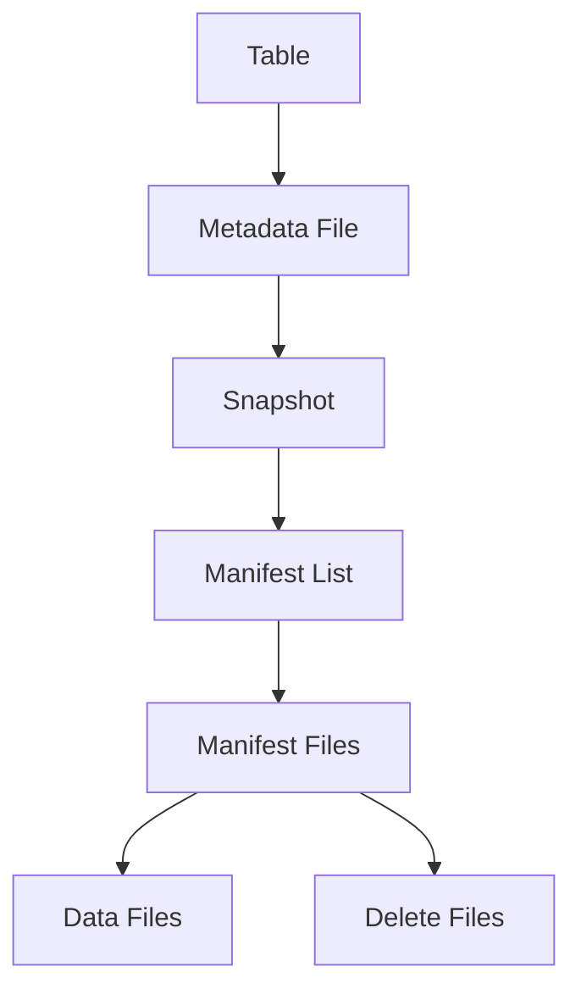
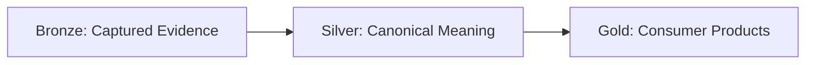
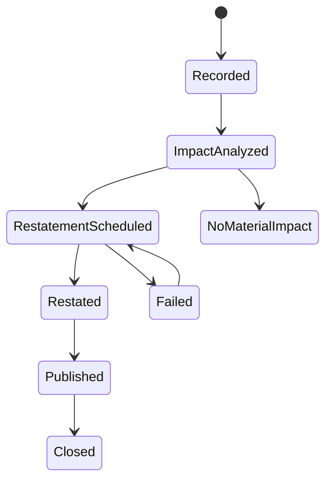
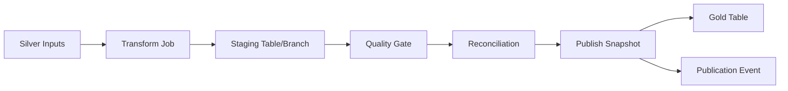
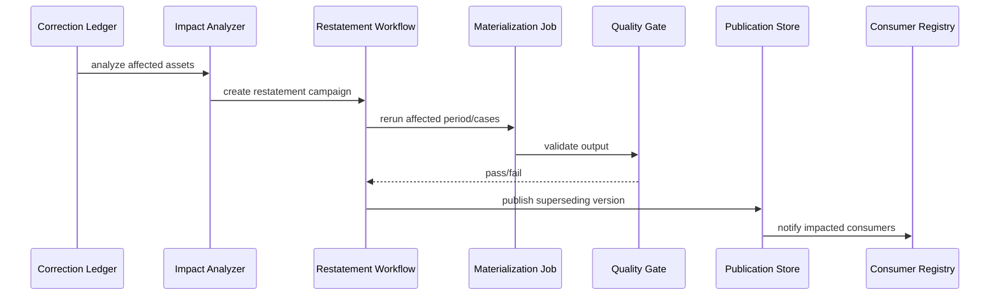

# Part 083 — Case Study Lakehouse and Reporting

> Kafka makes facts move.  
> Stream processing makes facts react.  
> Lakehouse tables make facts durable, queryable, correctable, and defensible.

In Part 081, we moved operational facts from the database to Kafka.

In Part 082, we derived stateful facts using stream processing.

Now we persist those facts into long-lived data products.

This part designs the lakehouse and reporting layer for the regulatory enforcement lifecycle platform.

The focus is:

- table layout
- bronze/silver/gold responsibility
- Iceberg-style snapshot thinking
- case timeline
- current state
- assignment history
- SLA history
- correction ledger
- audit evidence
- statutory reporting
- search projection
- quality and reconciliation
- restatement publication
- Java job boundaries
- production runbooks

The objective is not “write Parquet files”.

The objective is to build durable truth surfaces that can be trusted by operations, analytics, audit, and regulatory reporting.

---

## 1. Lakehouse Role in the Architecture

The lakehouse is the system of durable analytical state.

It is not the real-time transport.

It is not the operational command store.

It is not the workflow engine.

Its role:

| Responsibility | Meaning |
|---|---|
| Preserve raw evidence | keep captured source records in queryable form |
| Store canonical facts | case timeline, assignment facts, decision facts |
| Store derived projections | current state, SLA state, reporting facts |
| Support point-in-time analysis | reconstruct what was known at a time |
| Support backfill/restatement | publish corrected outputs without erasing history |
| Provide audit evidence | connect reports to runs, inputs, and code |
| Serve analytics | dashboards, statutory reports, workload reports |
| Feed serving indexes | search/materialized serving copies |

The lakehouse should be boring.

Boring here means:

- explicit table contracts
- deterministic write protocols
- stable partitioning
- clear ownership
- traceable lineage
- controlled schema evolution
- evidence of publication

A boring lakehouse is a reliable lakehouse.

---

## 2. Table Format Mental Model

A modern lakehouse table format such as Iceberg gives you an abstraction above raw files.

The table is not “a folder full of Parquet”.

Conceptually:



Why this matters:

- a snapshot represents a table state
- commits create new table states
- readers can see consistent snapshots
- schema can evolve under rules
- partitioning can evolve
- old snapshots can support time travel
- maintenance can expire old snapshots and remove orphan files

The platform should treat table commits as publication events.

A report should be able to say:

```text
This report was built from snapshot X of table A and snapshot Y of table B.
```

Without that, “report reproducibility” becomes weak.

---

## 3. Bronze, Silver, Gold as Responsibility Boundaries

The medallion names are less important than the responsibility split.



### Bronze

Bronze answers:

```text
What did we capture?
```

Characteristics:

- append-only where possible
- minimal transformation
- source metadata preserved
- source position preserved
- ingestion timestamp included
- parsing errors recorded
- privacy classification retained
- no consumer business logic

### Silver

Silver answers:

```text
What does the platform believe happened?
```

Characteristics:

- canonical schema
- validated semantics
- dedupe applied
- source evidence linked
- corrections modeled
- bitemporal fields included
- contract enforced
- stable grain

### Gold

Gold answers:

```text
What does this consumer need?
```

Characteristics:

- use-case optimized
- aggregated or denormalized
- SLO-driven
- access controlled
- report versioned
- publication tracked
- consumer registry maintained

Avoid the cargo cult version:

```text
raw -> clean -> business
```

That is too vague.

Define exactly what each layer proves.

---

## 4. Lakehouse Namespace Layout

Example namespace:

```text
bronze.case_management.raw_outbox_event
bronze.case_management.raw_case_cdc
bronze.evidence.raw_evidence_capture
bronze.identity.raw_officer_cdc

silver.enforcement.case_event_timeline
silver.enforcement.case_current_state
silver.enforcement.case_assignment_history
silver.enforcement.case_sla_clock_history
silver.enforcement.case_decision_history
silver.enforcement.case_correction_ledger

gold.enforcement.case_operational_dashboard
gold.enforcement.case_sla_breach_report
gold.enforcement.enforcement_action_statutory_report
gold.enforcement.case_owner_workload_report

audit.pipeline.run_manifest
audit.pipeline.lineage_event
audit.pipeline.quality_result
audit.pipeline.reconciliation_result
audit.pipeline.publication_event
```

Naming rules:

- include domain
- include grain
- avoid vague names like `case_data`
- avoid encoding implementation details in product names
- do not name tables after jobs unless they are audit/control tables
- make versioning explicit when breaking semantics

Bad:

```text
gold.case_final
```

Better:

```text
gold.enforcement.enforcement_action_statutory_report_v1
```

---

## 5. Bronze Raw Outbox Table

Grain:

```text
one row per captured outbox event
```

Table:

```sql
create table bronze.case_management.raw_outbox_event (
    source_system           string,
    source_database         string,
    source_table            string,
    source_transaction_id   string,
    outbox_id               string,
    aggregate_type          string,
    aggregate_id            string,
    aggregate_sequence      bigint,
    event_type              string,
    event_version           string,
    event_time              timestamp,
    effective_time          timestamp,
    actor_type              string,
    actor_id                string,
    classification          string,
    payload_json            string,
    kafka_topic             string,
    kafka_partition         int,
    kafka_offset            bigint,
    captured_at             timestamp,
    ingested_at             timestamp,
    payload_hash            string,
    ingestion_run_id        string
)
partitioned by (days(captured_at), source_system);
```

Design choices:

| Choice | Reason |
|---|---|
| store Kafka position | offset-to-effect reconciliation |
| store payload hash | duplicate/integrity check |
| store source transaction ID | audit and transaction grouping |
| keep payload raw | evidence preservation |
| partition by capture date | operational query and retention |
| keep ingestion run ID | lineage and incident analysis |

Do not overwrite bronze records during correction.

Corrections are new records.

---

## 6. Silver Case Event Timeline

This is the backbone.

Grain:

```text
one row per accepted canonical case event
```

Table:

```sql
create table silver.enforcement.case_event_timeline (
    case_id                 string,
    event_id                string,
    event_type              string,
    aggregate_sequence      bigint,
    event_time              timestamp,
    effective_time          timestamp,
    recorded_time           timestamp,
    ingested_time           timestamp,
    actor_type              string,
    actor_id                string,
    causation_event_id      string,
    correlation_id          string,
    reason_code             string,
    source_system           string,
    source_evidence_id      string,
    source_kafka_topic      string,
    source_kafka_partition  int,
    source_kafka_offset     bigint,
    schema_name             string,
    schema_version          string,
    classification          string,
    processing_mode         string,
    payload                 string,
    payload_hash            string,
    run_id                  string,
    is_correction           boolean,
    corrects_event_id       string,
    superseded_by_event_id  string,
    recorded_date           date
)
partitioned by (bucket(64, case_id), days(recorded_time));
```

Why bucket by `case_id`?

- case timeline queries are common
- distribution is better than date-only partitioning
- one case can span long time
- audit queries often begin with case ID

Why also include recorded date?

- operational reporting by record period
- snapshot/replay windows
- retention and maintenance

This is a logical example. Actual Iceberg partition spec syntax depends on engine/catalog.

The mental model matters more than the exact SQL dialect.

---

## 7. Current State Table

Grain:

```text
one row per case current state
```

Table:

```sql
create table silver.enforcement.case_current_state (
    case_id                 string,
    case_number             string,
    tenant_id               string,
    status                  string,
    priority                string,
    case_type               string,
    jurisdiction            string,
    opened_at               timestamp,
    closed_at               timestamp,
    active_assignee_id      string,
    active_team_id          string,
    active_assignment_id    string,
    sla_policy_id           string,
    sla_policy_version      string,
    sla_due_at              timestamp,
    sla_breached            boolean,
    escalation_state        string,
    latest_decision_id      string,
    latest_decision_status  string,
    last_event_id           string,
    last_aggregate_sequence bigint,
    last_effective_time     timestamp,
    updated_at              timestamp,
    projection_version      string,
    source_run_id           string
)
partitioned by (tenant_id, bucket(64, case_id));
```

Current state is a projection.

It should be rebuildable from `case_event_timeline`.

That is the invariant:

```text
case_event_timeline + projection_version -> case_current_state
```

If you cannot rebuild it, it is not a projection; it is a hidden source of truth.

---

## 8. Assignment History Table

Grain:

```text
one row per assignment interval
```

Table:

```sql
create table silver.enforcement.case_assignment_history (
    assignment_id           string,
    case_id                 string,
    assignee_id             string,
    assignee_type           string,
    team_id                 string,
    assignment_role         string,
    assigned_from           timestamp,
    assigned_until          timestamp,
    is_current              boolean,
    assigned_by             string,
    reason_code             string,
    opened_event_id         string,
    closed_event_id         string,
    source_run_id           string,
    recorded_time           timestamp
)
partitioned by (bucket(64, case_id), days(assigned_from));
```

Invariant:

```text
At most one current primary assignment per case unless the contract explicitly allows parallel primary assignments.
```

This table supports:

- workload reports
- accountability
- case ownership history
- assignment SLA analysis
- team performance reporting
- audit of who owned the case at a given time

---

## 9. SLA Clock History Table

Grain:

```text
one row per SLA clock interval or state transition
```

There are two patterns.

### Pattern A — Event Table

One row per SLA event.

Pros:

- mirrors timeline
- easy audit
- append-friendly

Cons:

- consumers must compute intervals

### Pattern B — Interval Table

One row per active SLA interval.

Pros:

- easier reporting
- easier duration calculation

Cons:

- correction/reprocessing more complex

For this case study, keep both if SLA is regulatory-critical:

```text
silver.enforcement.case_sla_event_history
silver.enforcement.case_sla_interval_history
```

Interval table:

```sql
create table silver.enforcement.case_sla_interval_history (
    sla_interval_id         string,
    case_id                 string,
    sla_id                  string,
    policy_id               string,
    policy_version          string,
    interval_type           string,
    started_at              timestamp,
    ended_at                timestamp,
    due_at                  timestamp,
    breached                boolean,
    breached_at             timestamp,
    completed_at            timestamp,
    pause_reason            string,
    basis_event_id          string,
    closing_event_id        string,
    source_run_id           string
)
partitioned by (bucket(64, case_id), days(started_at));
```

A breach report should not recompute everything from raw status fields.

It should use explicit SLA facts.

---

## 10. Decision History Table

Grain:

```text
one row per decision version
```

Table:

```sql
create table silver.enforcement.case_decision_history (
    decision_id             string,
    decision_version        string,
    case_id                 string,
    decision_type           string,
    decision_status         string,
    proposed_at             timestamp,
    approved_at             timestamp,
    published_at            timestamp,
    effective_time          timestamp,
    approved_by             string,
    approval_authority      string,
    legal_basis_code        string,
    basis_event_ids         array<string>,
    evidence_ids            array<string>,
    source_event_id         string,
    superseded_by_decision_id string,
    correction_id           string,
    source_run_id           string
)
partitioned by (days(approved_at), decision_type);
```

This table is core to statutory reporting.

Do not flatten decision history into current state only.

A regulator needs to answer:

```text
What decision version was approved at the time, based on which evidence?
```

---

## 11. Correction Ledger

Grain:

```text
one row per correction/restatement action
```

Table:

```sql
create table silver.enforcement.case_correction_ledger (
    correction_id           string,
    case_id                 string,
    correction_type         string,
    corrected_event_id      string,
    corrected_asset_name    string,
    correction_reason_code  string,
    correction_reason_text  string,
    correction_recorded_at  timestamp,
    correction_effective_from timestamp,
    corrected_by            string,
    impacted_assets         array<string>,
    impacted_consumers      array<string>,
    restatement_run_id      string,
    publication_event_id    string,
    status                  string,
    evidence_uri            string
)
partitioned by (days(correction_recorded_at), correction_type);
```

A correction has lifecycle:



Corrections are operational data products.

They need owners and SLOs.

---

## 12. Audit Tables

Audit tables are not optional.

### Run Manifest

```sql
create table audit.pipeline.run_manifest (
    run_id                  string,
    pipeline_id             string,
    pipeline_version        string,
    git_commit              string,
    container_image         string,
    processing_mode         string,
    started_at              timestamp,
    finished_at             timestamp,
    status                  string,
    trigger_type            string,
    trigger_id              string,
    input_summary_json      string,
    output_summary_json     string,
    quality_result          string,
    reconciliation_result   string,
    operator                string
)
partitioned by (days(started_at), pipeline_id);
```

### Lineage Event

```sql
create table audit.pipeline.lineage_event (
    lineage_event_id        string,
    run_id                  string,
    job_namespace           string,
    job_name                string,
    input_datasets_json     string,
    output_datasets_json    string,
    facets_json             string,
    emitted_at              timestamp
)
partitioned by (days(emitted_at), job_namespace);
```

### Quality Result

```sql
create table audit.pipeline.quality_result (
    quality_result_id       string,
    run_id                  string,
    asset_name              string,
    check_name              string,
    severity                string,
    result                  string,
    observed_value          string,
    expected_value          string,
    sample_ref              string,
    evaluated_at            timestamp
)
partitioned by (days(evaluated_at), asset_name);
```

### Reconciliation Result

```sql
create table audit.pipeline.reconciliation_result (
    reconciliation_id       string,
    run_id                  string,
    source_asset            string,
    target_asset            string,
    reconciliation_type     string,
    result                  string,
    source_count            bigint,
    target_count            bigint,
    mismatch_count          bigint,
    checksum_source         string,
    checksum_target         string,
    evaluated_at            timestamp
)
partitioned by (days(evaluated_at), source_asset);
```

These tables create the evidence trail.

---

## 13. Publication Event

A publication event records when an output becomes consumer-visible.

```sql
create table audit.pipeline.publication_event (
    publication_event_id    string,
    asset_name              string,
    asset_version           string,
    table_snapshot_id       string,
    run_id                  string,
    publication_time        timestamp,
    publication_mode        string,
    previous_publication_id string,
    supersedes_publication_id string,
    quality_result          string,
    reconciliation_result   string,
    published_by            string,
    consumer_notice_required boolean
)
partitioned by (days(publication_time), asset_name);
```

Publication matters because writing data is not the same as releasing data.

A production system should distinguish:

```text
staged output
validated output
published output
superseded output
withdrawn output
```

---

## 14. Statutory Reporting Product

Example product:

```text
gold.enforcement.enforcement_action_statutory_report
```

Grain:

```text
one row per statutory reporting dimension per reporting period
```

Possible columns:

```sql
create table gold.enforcement.enforcement_action_statutory_report (
    reporting_period        string,
    jurisdiction            string,
    enforcement_category    string,
    decision_type           string,
    action_count            bigint,
    unique_case_count       bigint,
    appealed_count          bigint,
    corrected_count         bigint,
    report_version          string,
    source_publication_id   string,
    generated_run_id        string,
    generated_at            timestamp,
    is_current              boolean,
    superseded_by_version   string
)
partitioned by (reporting_period, jurisdiction);
```

The report should include:

- report version
- source publication ID
- generated run ID
- whether current
- supersession reference

Do not overwrite submitted regulatory reports without versioning.

---

## 15. Operational Dashboard Product

Example:

```text
gold.enforcement.case_operational_dashboard
```

Grain:

```text
one row per case or one row per case/team snapshot
```

Possible fields:

```text
case_id
case_number
status
priority
case_type
jurisdiction
active_team_id
active_assignee_id
days_open
sla_due_at
sla_risk_bucket
sla_breached
escalation_state
latest_decision_status
last_activity_at
dashboard_snapshot_time
source_snapshot_id
```

This table can be refreshed frequently.

But it should not become the only source of current state.

It is a consumer product.

The silver current state remains the reusable projection.

---

## 16. Search Serving Projection

Search systems are not the system of record.

They are serving indexes.

A search document might include:

```json
{
  "caseId": "CASE-1001",
  "caseNumber": "ENF-2026-0001",
  "status": "INVESTIGATION",
  "priority": "HIGH",
  "activeTeam": "TEAM-9",
  "activeAssignee": "OFFICER-42",
  "slaDueAt": "2026-07-09T00:00:00Z",
  "lastEventId": "case-mgmt:outbox:847291",
  "lastAggregateSequence": 42,
  "classification": "RESTRICTED_ENFORCEMENT"
}
```

Indexing rule:

```text
Search index update must be idempotent and version-checked.
```

Use:

```text
caseId + lastAggregateSequence
```

or:

```text
caseId + projectionVersion + lastEventId
```

to reject stale index updates.

Do not put raw sensitive free text into a broad search index without classification and access control.

---

## 17. Materialization Patterns

### Pattern 1 — Append-Only Fact Table

For event timeline:

```text
append canonical events
```

Fit:

- audit
- replay
- immutable facts

### Pattern 2 — Merge/Upsert Projection

For current state:

```text
merge by case_id where incoming sequence is newer
```

Fit:

- latest state
- dashboards
- search feeder

### Pattern 3 — Replace Partition

For batch reports:

```text
write reporting_period to staging
validate
replace reporting_period
publish
```

Fit:

- daily/monthly reporting
- deterministic recomputation

### Pattern 4 — Snapshot Versioned Output

For statutory reports:

```text
insert new report_version
mark previous as superseded
```

Fit:

- regulated reporting
- restatement
- audit

### Pattern 5 — Sidecar Audit Tables

For every materialization:

```text
write run_manifest, quality_result, reconciliation_result, publication_event
```

Fit:

- operational review
- regulatory defensibility

---

## 18. Java Batch Job Boundary

A Java/Spark batch job should have explicit boundaries.

```java
public interface BatchMaterializationJob {
    RunManifest start(RunRequest request);

    MaterializationResult materialize(RunManifest manifest);

    QualityGateResult validate(MaterializationResult result);

    ReconciliationResult reconcile(MaterializationResult result);

    PublicationResult publish(MaterializationResult result);

    void complete(RunManifest manifest, PublicationResult publication);
}
```

The dangerous version:

```java
read();
transform();
write();
```

The production version:

```text
start run -> read bounded inputs -> transform deterministically -> write staged output -> validate -> reconcile -> publish -> record evidence
```

This is the same shape we used throughout the series.

---

## 19. Staging and Publish

Never write directly into consumer-visible tables for important products.

Use:

```text
staging -> validation -> publish
```

Example:



If quality fails, staging can be inspected without corrupting published data.

---

## 20. Quality Gates for Reporting

For statutory reporting:

| Check | Example |
|---|---|
| completeness | all closed cases for period included |
| uniqueness | no duplicate decision ID |
| validity | jurisdiction/code values are valid |
| consistency | counts match silver decision facts |
| reconciliation | output count balances source count |
| correction awareness | corrected decisions included/excluded per policy |
| privacy | restricted fields absent |
| freshness | source silver snapshot within allowed window |
| approval | human approval required before external submission |

Quality gate result should be stored.

A dashboard can tolerate warning-level issues.

A statutory report may need fail-closed behavior.

Different products, different gates.

---

## 21. Reconciliation Examples

### Event Timeline Reconciliation

```text
accepted canonical event count
=
silver timeline inserted count
+
duplicate-same skipped count
+
quarantine count
```

### Current State Reconciliation

```text
count(distinct case_id in timeline)
>=
count(case_id in current_state)
```

depending on whether closed/deleted cases are retained.

### Decision Report Reconciliation

```text
count(decision_id in silver decision history where approved in period)
=
sum(action_count in statutory report grouped by period)
+
excluded_decision_count_with_reason
```

Exclusions must be explicit.

Do not let report numbers differ from silver facts without an exclusion ledger.

---

## 22. Bitemporal Query Support

A case may need to answer:

```text
What did we believe on March 31 about cases effective in Q1?
```

This requires recorded time and effective time.

Example conceptual query:

```sql
select *
from silver.enforcement.case_event_timeline
where case_id = 'CASE-1001'
  and effective_time <= timestamp '2026-03-31 23:59:59'
  and recorded_time <= timestamp '2026-04-01 00:00:00'
  and (superseded_by_event_id is null or superseded_recorded_time > timestamp '2026-04-01 00:00:00')
order by effective_time, aggregate_sequence;
```

The exact SQL depends on table design.

The point is:

```text
effective-time and recorded-time fields must exist before you need them.
```

You cannot reconstruct them reliably later if you never captured them.

---

## 23. Restatement Workflow

When correction impacts published outputs:



Restatement output should not erase prior output.

It should supersede it.

Report versioning should answer:

```text
Which version was current at submission time?
Which version superseded it?
Why?
Which correction caused it?
```

---

## 24. Backfill Without Breaking Reports

Backfill mode should not auto-publish.

Backfill stages:

1. define scope
2. freeze input versions
3. run transformation
4. validate
5. reconcile
6. diff against current published output
7. approval if material
8. publish or discard
9. record evidence

Backfill output should carry:

```text
processing_mode = BACKFILL
backfill_campaign_id
transform_version
input_snapshot_ids
approval_status
```

A common disaster:

```text
Backfill writes into gold table directly and changes dashboard numbers without explanation.
```

Avoid this with staging and publication records.

---

## 25. Data Access and Privacy

Lakehouse access should be layered.

| Layer | Access Pattern |
|---|---|
| Bronze raw | restricted platform/data owner access |
| Silver canonical | domain consumers with policy |
| Gold products | broader but product-specific |
| Audit evidence | platform/audit/security access |
| Quarantine | restricted operational data stewardship |
| PII reference tables | highly restricted |

Data products should declare classification.

Example:

```yaml
asset: silver.enforcement.case_event_timeline
classification: RESTRICTED_ENFORCEMENT
containsPersonalData: true
retention: P7Y
access:
  - role: enforcement-data-engineer
    permission: read
  - role: statutory-reporting
    permission: read_filtered
masking:
  actor_id: tokenized_for_non_privileged
```

Never assume table ACL alone is enough.

You also need:

- column masking
- row filtering
- export controls
- query audit
- retention enforcement
- consumer registration

---

## 26. Lakehouse Maintenance

Production tables need maintenance.

Tasks:

- compact small files
- expire old snapshots according to retention
- remove orphan files
- rewrite manifests if needed
- validate table metadata
- monitor file count
- monitor snapshot count
- monitor query latency
- monitor commit failures
- check schema drift
- check partition skew
- backup critical metadata/catalog

Maintenance is not housekeeping.

It affects cost, performance, and reliability.

For audit-critical datasets, snapshot expiration must respect evidence retention policy.

Do not expire snapshots required to reproduce submitted reports.

---

## 27. Observability for Lakehouse Products

Metrics:

| Metric | Meaning |
|---|---|
| rows written | output volume |
| files written | small-file risk |
| average file size | compaction signal |
| commit duration | write health |
| commit failures | concurrency/conflict risk |
| latest snapshot age | freshness |
| quality gate result | trust |
| reconciliation mismatch | correctness |
| publication age | consumer freshness |
| schema version | compatibility |
| table scan cost | query efficiency |
| restatement count | volatility |
| consumer count | impact risk |

Dashboards should show product health, not just job health.

A job can succeed while the product is untrustworthy.

---

## 28. Failure Scenarios

### Scenario 1 — Job Writes Partial Files Then Crashes

If table commit did not happen, partial files may become orphan files.

Response:

- do not expose uncommitted files
- run orphan cleanup according to policy
- record failed run
- rerun from same input manifest

### Scenario 2 — Quality Gate Fails After Staging Write

Response:

- do not publish
- store quality result
- notify owner
- keep staging for investigation or expire later

### Scenario 3 — Report Published with Wrong Rule Version

Response:

- create correction/restatement record
- identify affected publications
- rerun with correct rule version
- publish superseding report
- notify consumers

### Scenario 4 — Schema Evolution Breaks Consumer Query

Response:

- compatibility gate should catch this
- if missed, roll back/supersede product
- publish consumer notice
- update contract tests

### Scenario 5 — Snapshot Expired Too Early

Response:

- restore from backup if possible
- declare reproducibility degradation
- update retention controls
- prevent future expiration through policy

### Scenario 6 — Search Index Stale but Lakehouse Current

Response:

- expose serving freshness separately
- rebuild index from silver current state
- do not treat search as source of truth

---

## 29. Anti-Patterns

### Anti-Pattern 1 — Gold Tables Built Directly from Raw CDC

Raw CDC is technical evidence, not business meaning.

Use canonical silver assets.

### Anti-Pattern 2 — Overwriting Reports In Place

This destroys regulatory traceability.

Version reports and supersede prior versions.

### Anti-Pattern 3 — One Giant Case Table

Different grains need different tables:

- event timeline
- current state
- assignment interval
- SLA interval
- decision version
- correction ledger

One giant table hides semantics.

### Anti-Pattern 4 — No Publication Boundary

A write is not a publication.

Consumers need to know what version is released.

### Anti-Pattern 5 — No Input Snapshot Record

If a report cannot identify input snapshots, it cannot be reproduced.

### Anti-Pattern 6 — Expiring Audit Evidence Like Temporary Data

Audit evidence has its own retention policy.

### Anti-Pattern 7 — Search Index as Truth

Search index is a serving copy.

Rebuild it from canonical state.

---

## 30. Production Checklist

Before the lakehouse/reporting layer is production-ready:

- Bronze preserves source evidence and source position.
- Silver assets have stable grain.
- Gold assets have explicit consumers and contracts.
- Case event timeline is append-oriented and traceable.
- Current state can be rebuilt from timeline.
- Assignment and SLA are modeled as histories/intervals.
- Decision history preserves versions.
- Correction ledger exists.
- Run manifest is written for every materialization.
- Lineage records input and output datasets.
- Quality results are persisted.
- Reconciliation results are persisted.
- Publication event separates write from release.
- Reports are versioned and supersedable.
- Backfills use staging.
- Restatements notify impacted consumers.
- Snapshot retention respects audit needs.
- PII classification is enforced.
- Query access is audited.
- Search index is idempotently updated.
- Maintenance jobs exist.
- Failure runbooks exist.

---

## 31. What Comes Next

Part 084 is the final blueprint and review.

We will consolidate:

- architecture
- invariants
- decision matrix
- anti-patterns
- implementation roadmap
- production review checklist
- mental model recap
- how to reason like a top-tier engineer when designing Java data pipelines

Part 083 completes the durable data product side.

Part 084 closes the series.
