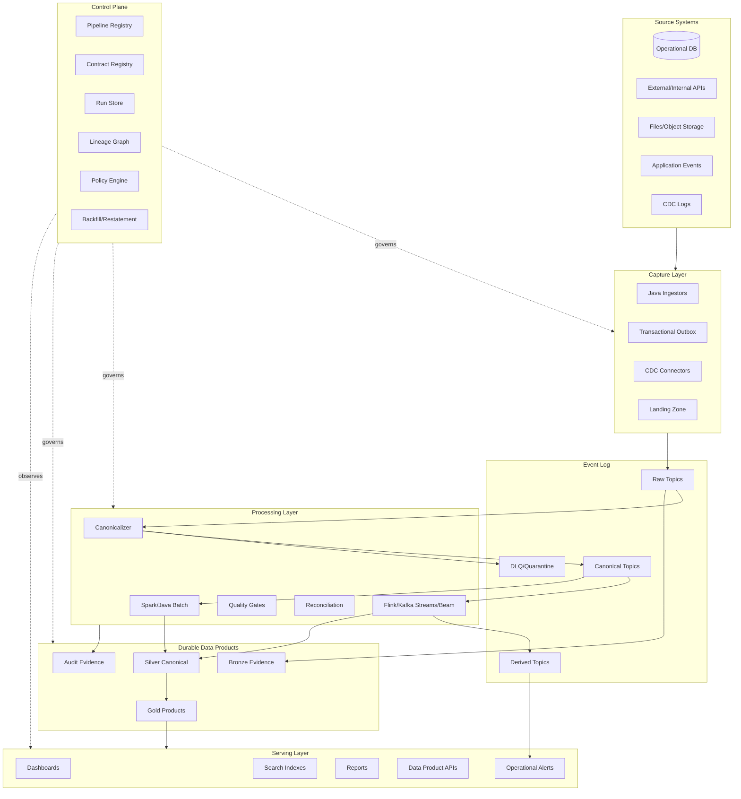
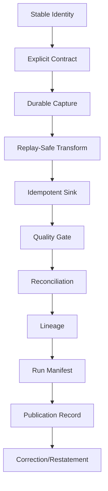
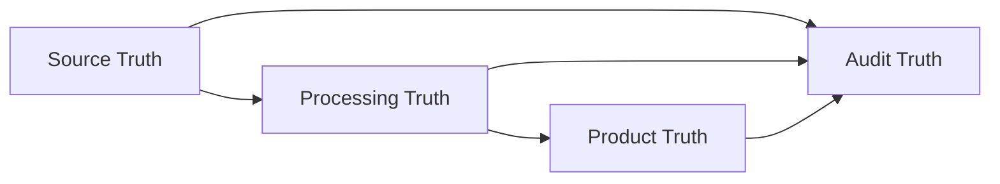

# Part 084 — Final Blueprint and Review

> The difference between a normal pipeline engineer and a top-tier pipeline engineer is not tool knowledge.  
> It is the ability to preserve meaning, correctness, and operability across distributed boundaries.

This is the final part of the series.

We have moved from first principles to implementation patterns to an end-to-end regulatory enforcement case study.

This part consolidates the whole mental model.

It is meant to be used as:

- architecture review guide
- production readiness checklist
- design decision matrix
- failure modeling aid
- implementation roadmap
- interview/self-assessment reference
- internal engineering handbook summary

The series ends here at Part 084.

---

## 1. One-Sentence Definition

A production data pipeline is:

```text
A distributed system that captures source facts, transforms them under explicit contracts, records evidence, publishes derived data products, and remains correct under replay, failure, schema evolution, late data, and operational change.
```

It is not:

```text
source -> transform -> sink
```

That is the shape.

Not the engineering.

---

## 2. The Complete Architecture

The generalized architecture:



This architecture is not mandatory for every system.

It is a reference model.

Small systems can compress layers.

Large systems eventually rediscover most of them.

---

## 3. The Main Boundary Principle

Every serious pipeline decision is a boundary decision.

| Boundary | Question |
|---|---|
| Source boundary | What does this source prove? |
| Contract boundary | What is guaranteed to consumers? |
| Time boundary | Which time dimension drives correctness? |
| State boundary | Where is durable state kept? |
| Commit boundary | When is an effect considered durable? |
| Replay boundary | What happens if this input is seen again? |
| Side-effect boundary | What must not happen during backfill? |
| Security boundary | Who can see which data? |
| Publication boundary | When is output consumer-visible? |
| Audit boundary | What evidence proves this result? |

If a design review does not identify boundaries, it is not finished.

---

## 4. Core Invariants

These invariants appeared throughout the series.

### 4.1 Completeness

Accepted input facts should either:

- produce output
- be rejected with reason
- be quarantined
- be intentionally excluded with evidence

No silent disappearance.

### 4.2 Idempotency

Reprocessing the same accepted input should not duplicate business effects.

Idempotency may exist at:

- event ID
- sink key
- ledger key
- aggregate sequence
- natural key
- publication version

### 4.3 Replayability

A pipeline should define what happens when input is replayed.

Replay is not an exception.

Replay is part of the design.

### 4.4 Determinism

The same input, transform version, reference data version, and processing mode should produce the same output.

If not, record why.

### 4.5 Ordering

Ordering must be scoped.

Examples:

- per case
- per aggregate
- per partition
- per transaction
- per source
- per effective time

Global ordering is usually unrealistic.

### 4.6 Freshness

Freshness must be decomposed.

```text
source commit
-> capture
-> broker
-> canonicalization
-> processing
-> storage commit
-> publication
-> serving index
```

A stale dashboard can be caused by any stage.

### 4.7 Auditability

Important outputs should be traceable to:

- inputs
- run ID
- code version
- schema version
- rule version
- quality result
- reconciliation result
- publication event

### 4.8 Privacy

Sensitive data must be classified, controlled, masked, retained, and audited from ingress onward.

Do not wait until reporting.

---

## 5. Tool Decision Matrix

### Custom Java Service

Use when:

- integration is custom
- ingestion is API/file-heavy
- side-effect boundary is complex
- strict domain validation is needed
- service-like deployment is preferred

Avoid when:

- distributed state/windowing is central
- large-scale batch processing dominates
- existing engine gives strong guarantees

### Kafka Producer/Consumer

Use when:

- you need explicit control over consume/process/write
- transformations are simple
- state is external or minimal
- operational integration matters

Avoid when:

- stateful event-time processing is complex
- joins/windows/timers dominate

### Kafka Streams

Use when:

- Kafka-to-Kafka processing
- local state stores are enough
- topology is moderate
- operational simplicity matters

Avoid when:

- advanced event-time/timer/state scale is needed
- non-Kafka sources/sinks dominate
- heavy batch/backfill semantics dominate

### Flink

Use when:

- stateful stream processing is central
- event time and late data matter
- windows/timers/joins are complex
- low-latency derived facts are needed

Avoid when:

- workload is simple scheduled batch
- team cannot operate state/savepoints/checkpoints
- the job mostly calls external APIs

### Beam

Use when:

- portability across runners matters
- unified batch/stream abstraction helps
- transforms need engine independence

Avoid when:

- team needs tight control over one runtime
- runner-specific optimization dominates

### Spark

Use when:

- large batch or micro-batch transformations dominate
- lakehouse/reporting writes are central
- SQL/DataFrame operations fit the workload

Avoid when:

- low-latency event-time state machines dominate
- tiny continuous events need millisecond response

### Airflow

Use when:

- task orchestration is central
- batch dependencies need scheduling
- external jobs need coordination

Avoid when:

- you need record-level stream processing
- you are trying to make Airflow a data processing engine

### Temporal

Use when:

- durable workflows are needed
- long-running correction/backfill/control workflows exist
- retries/compensation/human interaction matter

Avoid when:

- the problem is high-throughput record processing
- SQL-style data transformation is the main task

---

## 6. Pattern Catalog

### Capture Patterns

| Pattern | Use |
|---|---|
| Transactional Outbox | avoid DB + broker dual-write |
| CDC Snapshot + Stream | replicate database changes |
| File Manifest Ingestion | detect complete file sets |
| API Cursor Ingestion | incremental API sync |
| Webhook + Reconciliation | low latency with correctness repair |
| Landing Zone | isolate raw file capture |
| Import Ledger | track file/API/DB ingestion attempts |

### Processing Patterns

| Pattern | Use |
|---|---|
| Canonicalizer | convert raw evidence to semantic events |
| Stateful Dedupe | suppress duplicate events |
| Stream-Table Join | enrich events with reference state |
| Broadcast State | distribute small reference data |
| Window Aggregation | bounded event-time computation |
| Timer-Based Detection | SLA/breach detection |
| Side Outputs | separate late/invalid/audit lanes |
| Versioned Transform | controlled semantic evolution |
| Shadow Run | compare new logic without publishing |

### Sink Patterns

| Pattern | Use |
|---|---|
| Idempotent Upsert | current-state projection |
| Append-Only Fact | event timeline/history |
| Ledgered External Publish | alerts/notifications/API effects |
| Staging + Publish | reports and critical products |
| Replace Partition | deterministic batch recompute |
| Snapshot Versioning | report restatement |
| Compacted Topic | latest state distribution |

### Governance Patterns

| Pattern | Use |
|---|---|
| Data Contract | producer/consumer guarantee |
| Quality Gate | block/warn/quarantine |
| Lineage Event | impact and audit |
| Run Manifest | reproducibility |
| Consumer Registry | change impact |
| Classification-as-Code | privacy/security |
| Backfill Campaign | controlled reprocessing |
| Correction Ledger | defensible restatement |

---

## 7. Failure Model Summary

A production pipeline must assume these failures.

| Failure | Example | Defense |
|---|---|---|
| Duplicate | retry after unknown outcome | idempotency key, dedupe ledger |
| Loss | skipped CDC event | reconciliation, offset gap detection |
| Reorder | late assignment event | event time, sequence, buffer, correction |
| Poison record | invalid payload | DLQ/quarantine |
| Schema drift | source field change | contract gate, compatibility test |
| Partial commit | sink write succeeds but offset not committed | idempotent sink |
| Unknown outcome | timeout from external API | publication ledger |
| State corruption | bad stream state migration | savepoint testing, rebuild from log |
| Reference drift | latest reference changes history | versioned reference data |
| Privacy leak | PII in DLQ/log | classification and redaction |
| Backfill side effect | replay sends live alerts | processing mode and side-effect suppression |
| Report overwrite | corrected report hides old version | versioned publication |
| Control-plane bug | duplicate run creation | idempotent run request |
| Human error | manual rerun wrong scope | run manifest, approval, blast-radius analysis |

The strongest designs do not pretend these are rare.

They make them normal and survivable.

---

## 8. The Correctness Stack

A pipeline becomes trustworthy in layers.



Skipping lower layers weakens everything above.

For example:

- without stable identity, dedupe is weak
- without contract, quality is ad hoc
- without durable capture, replay is weak
- without idempotent sink, recovery is dangerous
- without lineage, impact analysis is guesswork
- without publication record, reports are hard to defend

---

## 9. Java Implementation Blueprint

A strong Java data pipeline codebase often has this shape:

```text
pipeline-platform/
  contracts/
    schemas/
    quality-policies/
    compatibility-tests/
  common/
    envelope/
    identity/
    time/
    classification/
    errors/
    metrics/
    lineage/
  ingestion/
    file-ingestor/
    api-ingestor/
    cdc-canonicalizer/
  streaming/
    case-sla-flink-job/
    case-projection-kafka-streams/
  batch/
    report-materializer-spark/
    backfill-runner/
  sinks/
    iceberg-writer/
    kafka-publisher/
    search-index-writer/
    alert-publisher/
  control-plane/
    registry-api/
    run-store/
    backfill-service/
    policy-engine/
  tests/
    golden-datasets/
    replay-tests/
    contract-tests/
    chaos-tests/
```

The package structure should reflect boundaries, not framework names only.

Bad:

```text
service/
  KafkaConsumer.java
  Mapper.java
  Utils.java
```

Better:

```text
canonicalization/
  RawOutboxDecoder.java
  CaseEventCanonicalizer.java
  SemanticValidator.java
  CanonicalEventPublisher.java
  CanonicalizationLedger.java
  CanonicalizationLineageEmitter.java
```

Names should reveal responsibility.

---

## 10. The Minimal Production Pipeline Skeleton

For many Java pipelines, the skeleton is:

```java
public final class PipelineApplication {

    public static void main(String[] args) {
        PipelineRuntime runtime = PipelineRuntime.bootstrap(args);

        Source<RawRecord> source = runtime.source();
        Processor<RawRecord, ProcessingResult<OutputCommand>> processor = runtime.processor();
        Sink<OutputCommand> sink = runtime.sink();
        CheckpointStore checkpointStore = runtime.checkpointStore();
        ErrorHandler errorHandler = runtime.errorHandler();
        LineageEmitter lineage = runtime.lineageEmitter();

        PipelineRunner<RawRecord, OutputCommand> runner =
            new PipelineRunner<>(
                source,
                processor,
                sink,
                checkpointStore,
                errorHandler,
                lineage,
                runtime.metrics()
            );

        runner.run();
    }
}
```

And the invariant:

```text
read -> validate -> transform -> write effect -> record evidence -> commit checkpoint
```

Never commit progress before the required effects are durable.

---

## 11. Production Design Review Template

Use this template in architecture reviews.

### 11.1 Purpose

- What business decision or product does this pipeline support?
- Who owns the source?
- Who owns the output?
- Who consumes the output?
- What happens if output is wrong?

### 11.2 Source

- What does the source prove?
- Is capture snapshot, stream, CDC, API, file, or event?
- What is the source position?
- What is the ordering guarantee?
- What is the retention guarantee?
- How are deletes represented?
- How are corrections represented?

### 11.3 Contract

- What is the schema?
- What is the semantic contract?
- What fields are required?
- What compatibility mode is used?
- What is a breaking change?
- Which consumers depend on it?

### 11.4 Time

- Which timestamp drives processing?
- Which timestamp drives reporting?
- Which timestamp drives legal/effective meaning?
- How late can data arrive?
- What happens to late data?

### 11.5 Identity

- What is the event ID?
- What is the idempotency key?
- What is the partition key?
- What is the natural key?
- Can identity be reproduced during replay?

### 11.6 State

- Is state external, broker-backed, engine-managed, or table-backed?
- How is state checkpointed?
- How is state migrated?
- How is state rebuilt?
- What is the TTL?

### 11.7 Sink

- Is sink append, upsert, merge, external side effect, or publication?
- What is the commit boundary?
- Is it idempotent?
- What happens after timeout?
- How is partial commit recovered?

### 11.8 Quality

- What checks run before publication?
- Which checks fail closed?
- Which checks warn?
- Where do invalid records go?
- Who owns remediation?

### 11.9 Observability

- What metrics prove health?
- What metrics prove correctness?
- What logs are safe?
- How is freshness decomposed?
- How is lag measured?
- What alert should wake someone up?

### 11.10 Audit

- Can each output be traced to input?
- Is run manifest recorded?
- Is lineage emitted?
- Are code/schema/rule versions recorded?
- Are publication events recorded?
- Can we reproduce a prior report?

### 11.11 Security

- What classification does data have?
- Who can read raw/silver/gold/quarantine?
- Are sensitive fields masked?
- Are logs safe?
- Are exports controlled?
- Is access audited?

### 11.12 Operations

- How do we backfill?
- How do we replay?
- How do we roll back?
- How do we handle schema break?
- How do we handle source outage?
- How do we handle duplicate/loss/reorder?
- What is the runbook?

If a team cannot answer these questions, the pipeline is not production-ready.

---

## 12. Anti-Pattern Index

### 12.1 “It Works on Happy Path”

A pipeline that works only when every system behaves perfectly is not production-grade.

### 12.2 “Exactly Once Everywhere”

Exactly-once claims are scoped.

External side effects still need idempotency or ledgering.

### 12.3 “Raw CDC Is the Domain Event”

CDC shows data mutation.

A domain event shows business meaning.

### 12.4 “Timestamp Is Ordering”

Timestamps are not enough for ordering unless the source contract says so.

### 12.5 “DLQ Solves Bad Data”

DLQ stores failed records.

It does not solve ownership, remediation, replay, privacy, or consumer impact.

### 12.6 “Backfill Is Just Rerun”

Backfill is a controlled production operation with scope, mode, validation, reconciliation, and publication.

### 12.7 “Reports Can Be Overwritten”

Important reports should be versioned and superseded, not silently overwritten.

### 12.8 “Quality Checks Are Tests Only”

Quality is runtime contract enforcement.

### 12.9 “Airflow Is the Pipeline”

Airflow coordinates jobs.

It is not the record-level processing engine.

### 12.10 “Kafka Is the Database”

Kafka is an event log.

It is not a general-purpose warehouse, query layer, or permanent report archive.

### 12.11 “Lake Is Cheap, Keep Everything Forever”

Retention is policy, cost, audit, and privacy.

Uncontrolled retention is not governance.

### 12.12 “Search Index Is Truth”

Search is a serving projection.

Truth must be rebuildable from canonical stores.

---

## 13. How to Think During Design

The top-tier mental loop:

```text
1. What fact is moving?
2. What proves that fact?
3. What meaning do consumers need?
4. What can fail between source and consumer?
5. What state is created?
6. What side effect is produced?
7. Can it be replayed safely?
8. Can it be corrected?
9. Can it be audited?
10. Can it be operated by someone at 3 AM?
```

This loop is more valuable than memorizing tools.

Tools change.

Invariants stay.

---

## 14. Skill Progression Map

### Level 1 — Can Build

You can:

- read from Kafka/API/file
- transform records
- write to a sink
- deploy a job
- monitor basic logs

This is entry-level pipeline work.

### Level 2 — Can Make Reliable

You can:

- handle retries
- commit checkpoints correctly
- use idempotent sinks
- handle DLQ
- monitor lag
- backfill simple windows

This is solid engineering.

### Level 3 — Can Make Correct

You can:

- model event time
- design contracts
- handle schema evolution
- design replay semantics
- reconcile outputs
- reason about delivery guarantees
- detect ordering issues
- handle correction

This is senior-level.

### Level 4 — Can Make Defensible

You can:

- produce evidence
- explain output lineage
- version reports
- support audit
- control privacy
- manage consumer impact
- operate restatements

This is staff-level for regulated domains.

### Level 5 — Can Build Platform

You can:

- design self-service templates
- build control plane APIs
- enforce policy-as-code
- support multi-tenancy
- expose SLO and health
- manage backfill campaigns
- scale ownership across teams

This is principal/platform-level.

The goal of this series was to push toward Levels 4 and 5.

---

## 15. Practical Roadmap for Applying This

If you are modernizing an existing pipeline platform, do not rebuild everything at once.

Use this sequence.

### Step 1 — Inventory Assets

List:

- sources
- topics
- jobs
- tables
- consumers
- owners
- SLOs
- failure modes

### Step 2 — Add Run Manifest

Before changing logic, improve evidence.

Record:

- run ID
- input range
- output range
- code version
- status
- quality result

### Step 3 — Add Stable Identity

Standardize event IDs, idempotency keys, and source positions.

### Step 4 — Add Data Contracts

Start with high-impact assets.

Define schema and semantic assumptions.

### Step 5 — Add Quality Gates

Use fail/warn/quarantine policy.

### Step 6 — Add Reconciliation

Prove source-to-output coverage.

### Step 7 — Add Lineage

Track input-output-run relationships.

### Step 8 — Separate Publication

Stop writing directly into consumer-visible outputs.

### Step 9 — Formalize Backfill

Introduce backfill campaign object and mode.

### Step 10 — Build Self-Service

Only after patterns stabilize, generate templates and platform APIs.

Automation before understanding creates fast chaos.

---

## 16. Final Production Checklist

Use this as the final master checklist.

### Capture

- Source contract documented.
- Source position captured.
- Capture method selected intentionally.
- Raw evidence retained.
- Deletes and corrections represented.
- Ingestion checkpoint exists.
- Capture lag monitored.

### Contract

- Schema versioned.
- Semantic meaning documented.
- Compatibility mode defined.
- Consumer assumptions known.
- Breaking-change process exists.
- Contract tests run in CI.

### Processing

- Transform versioned.
- Event time defined.
- Late-data policy defined.
- Idempotency key defined.
- Replay mode defined.
- Backfill mode defined.
- Side effects isolated.

### State

- State owner identified.
- State backend selected.
- Checkpointing configured.
- State migration tested.
- TTL/retention defined.
- Rebuild path exists.

### Sink

- Sink grain defined.
- Write mode defined.
- Commit boundary known.
- Idempotency enforced.
- Partial commit recovery defined.
- Publication separated when needed.

### Quality

- Quality rules defined.
- Severity mapped to action.
- Quarantine path exists.
- Quality results stored.
- Owners notified.

### Reconciliation

- Count checks exist.
- Key coverage checks exist.
- Checksum/balance checks where needed.
- Reconciliation result stored.
- Mismatch runbook exists.

### Observability

- Lag decomposed.
- Freshness measured.
- Throughput measured.
- Error rates measured.
- State/checkpoint measured.
- Alerts tied to SLOs.
- Logs are privacy-safe.

### Audit

- Run manifest exists.
- Lineage emitted.
- Code/schema/rule versions recorded.
- Input/output versions recorded.
- Publication events recorded.
- Reproducibility level known.

### Security

- Data classified.
- Access controlled per layer.
- Sensitive data masked/redacted.
- Secrets protected.
- DLQ/quarantine restricted.
- Access audited.
- Retention policy enforced.

### Operations

- Runbook exists.
- Replay procedure exists.
- Backfill procedure exists.
- Restatement procedure exists.
- Rollback procedure exists.
- Incident classification exists.
- Ownership and escalation defined.

---

## 17. Final Mental Model

A pipeline has four truths.

### Source Truth

What the source system committed or emitted.

### Processing Truth

What the pipeline accepted, rejected, transformed, and derived.

### Product Truth

What consumers are allowed to use.

### Audit Truth

What can be proven later.

Production-grade architecture keeps these truths connected but not confused.



When systems fail, audit truth is what lets you recover trust.

---

## 18. Closing Review

You now have the complete map:

- mental model
- invariants
- failure model
- source/transform/sink contracts
- Java core abstractions
- ingestion patterns
- CDC/outbox/inbox
- data contracts
- schema evolution
- Kafka producers/consumers/Streams
- Flink/Beam stateful processing
- Spark/batch/lakehouse
- orchestration/control plane
- SLO/observability/lineage/quality
- reconciliation/chaos/performance/cost
- security/privacy/audit/multi-tenancy
- data product operating model
- platform API/self-service
- regulatory enforcement case study

The final lesson:

```text
Do not optimize for moving data.
Optimize for preserving meaning under change.
```

That is the core of Java Data Pipeline Pattern at production scale.

---

## 19. Series Completion

This is **Part 084**, the final part of the planned series.

The series is complete.
