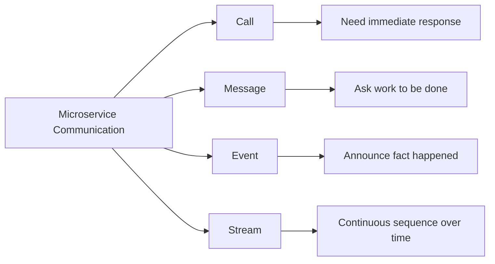
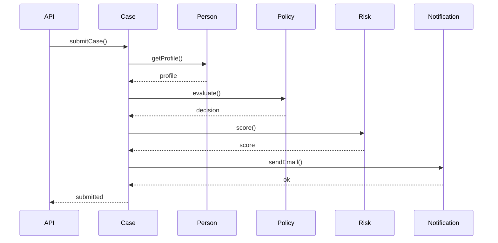
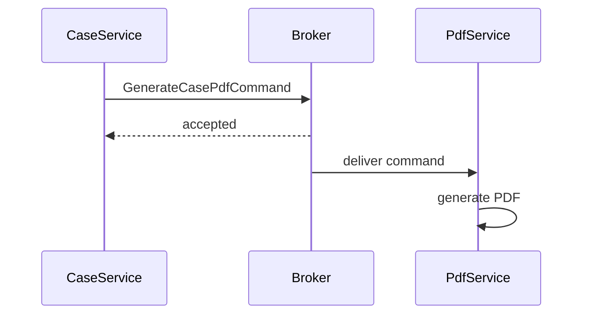
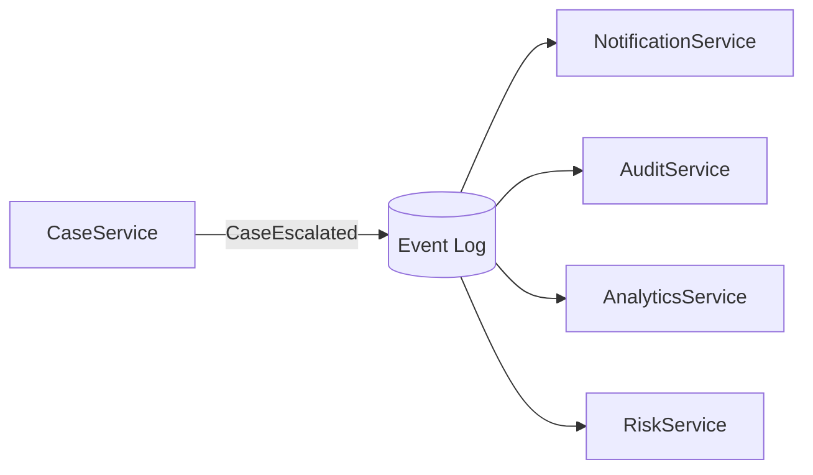
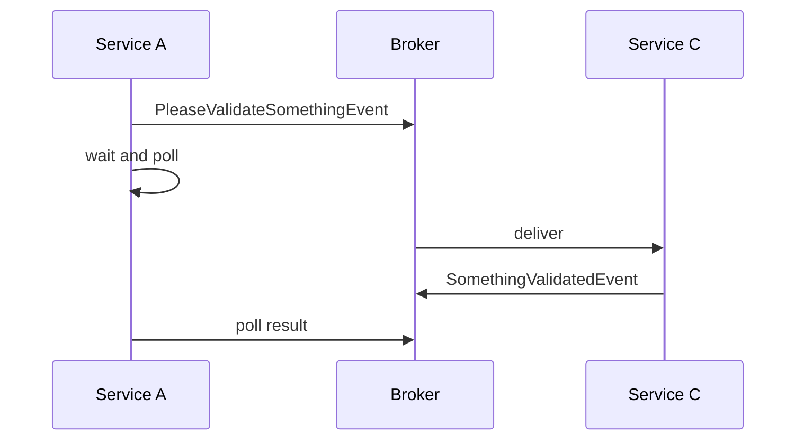
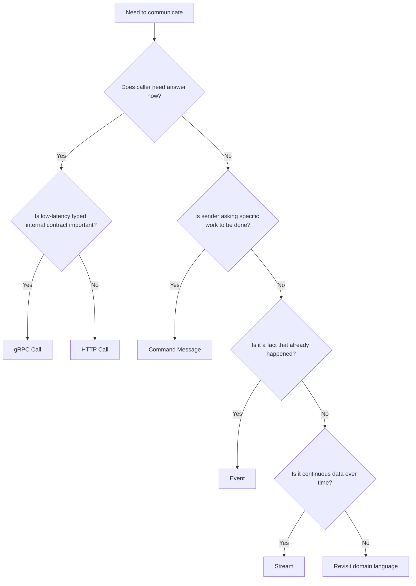
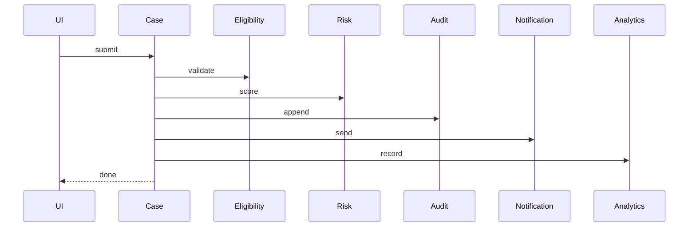
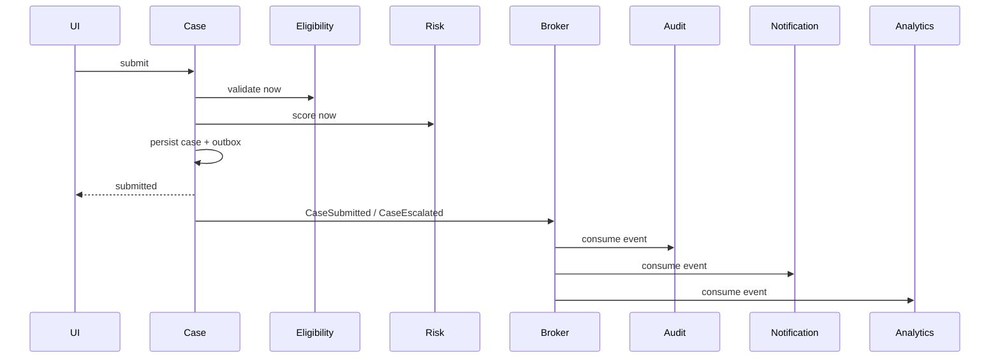

# Part 001 — Communication Mental Model

> Target part ini: membangun cara berpikir yang benar sebelum memilih HTTP, gRPC, Kafka, RabbitMQ, Pulsar, NATS, WebSocket, atau service mesh.
>
> Engineer yang kuat tidak mulai dari pertanyaan _"pakai teknologi apa?"_. Ia mulai dari pertanyaan: _"bentuk ketergantungan apa yang sedang saya ciptakan?"_

---

## 1. Masalah yang Sebenarnya

Microservices tidak menjadi sulit karena Java, Spring, Kafka, gRPC, Kubernetes, atau service mesh. Microservices menjadi sulit karena setiap komunikasi antar service menciptakan **kontrak**, **ketergantungan runtime**, **jalur kegagalan**, dan **biaya operasional**.

Di dalam monolith, pemanggilan method terlihat sederhana:

```java
PaymentResult result = paymentService.authorize(command);
```

Di microservices, bentuk yang sama bisa berarti:

- request HTTP sinkron;
- unary gRPC call;
- command message ke broker;
- event yang dikonsumsi banyak service;
- stream panjang dengan backpressure;
- request yang lewat gateway, mesh, mTLS, retry, timeout, dan telemetry.

Yang berbahaya: kode Java-nya bisa terlihat sama-sama sederhana, padahal semantiknya berbeda total.

```java
PaymentResult result = paymentClient.authorize(command);
```

Baris kedua bukan sekadar method call. Itu adalah operasi jaringan. Ia bisa timeout, berhasil tapi response hilang, gagal sebagian, di-retry dua kali, diproses dua kali, atau sukses di downstream tetapi gagal dicatat di upstream.

**Mental model utama:** komunikasi microservices adalah desain hubungan antar kegagalan.

---

## 2. Definisi Kerja: Communication Boundary

Dalam seri ini, **communication boundary** adalah batas tempat satu service meminta, memberi tahu, mengalirkan, atau menerima informasi dari service lain.

Boundary ini punya beberapa komponen:

| Komponen | Pertanyaan desain |
|---|---|
| Sender | Siapa yang memulai komunikasi? |
| Receiver | Siapa yang diharapkan memproses? Satu service spesifik atau banyak consumer? |
| Intent | Apakah ini meminta aksi, membaca data, memberi tahu fakta, atau mengalirkan data? |
| Contract | Bentuk schema, status, error, metadata, compatibility rule |
| Transport | HTTP, HTTP/2, TCP, broker protocol, WebSocket, SSE |
| Timing | Harus selesai sekarang atau boleh nanti? |
| Failure | Apa yang dianggap gagal? Apa yang boleh diulang? |
| Ownership | Siapa pemilik semantic contract? Siapa yang boleh mengubah? |
| Observability | Bagaimana kita tahu komunikasi ini sehat atau rusak? |

Jika satu boundary tidak mendefinisikan hal-hal di atas, boundary tersebut tetap ada, hanya saja desainnya implisit. Desain implisit hampir selalu menjadi sumber incident.

---

## 3. Empat Bentuk Komunikasi Dasar

Untuk membangun mental model yang stabil, kita mulai dari empat primitive:

1. **Call** — caller meminta jawaban langsung.
2. **Message** — sender mengirim permintaan/proses ke receiver, biasanya tidak menunggu hasil final.
3. **Event** — producer menyatakan fakta yang sudah terjadi.
4. **Stream** — producer/consumer bertukar rangkaian data sepanjang waktu.



Kita akan pakai empat primitive ini berulang-ulang sepanjang seri. Teknologi boleh berubah, primitive-nya tetap.

---

## 4. Primitive 1 — Call

**Call** adalah komunikasi ketika caller mengirim request dan membutuhkan response sebelum melanjutkan alur lokalnya.

Contoh:

```java
EligibilityResult result = eligibilityClient.checkEligibility(caseId, applicantId);

if (!result.eligible()) {
    return Decision.rejected(result.reason());
}
```

Karakteristik call:

| Aspek | Implikasi |
|---|---|
| Temporal coupling | Caller dan callee harus tersedia pada saat yang sama. |
| Runtime coupling | Performa caller tergantung latency callee. |
| Failure propagation | Timeout/error callee bisa menjadi error caller. |
| User-visible impact | Cocok untuk operasi yang memang harus dijawab sekarang. |
| Observability need | Wajib punya trace, latency histogram, status/error classification. |

Call biasanya memakai:

- HTTP/JSON;
- gRPC/Protobuf;
- internal GraphQL dalam kasus tertentu;
- service mesh/gateway sebagai path control.

### Kapan Call Masuk Akal?

Gunakan call ketika:

- caller tidak bisa membuat keputusan tanpa jawaban;
- response dibutuhkan untuk membentuk output user/API;
- operasi cukup cepat dan bounded;
- callee punya ownership kuat atas data/decision;
- konsistensi yang dibutuhkan adalah _read-your-decision-now_, bukan eventual.

Contoh yang masuk akal:

- `FraudService.assess(transaction)` sebelum transaksi disetujui;
- `CasePolicyService.evaluate(case)` sebelum escalation dijalankan;
- `InventoryService.reserve(item)` jika checkout perlu jawaban final;
- `PricingService.quote(order)` untuk menampilkan harga.

### Kapan Call Berbahaya?

Call berbahaya ketika dipakai untuk alur panjang:



Masalahnya bukan diagramnya panjang. Masalahnya adalah semua dependency menjadi bagian dari critical path. Jika `NotificationService` lambat, submit case ikut lambat. Jika `RiskService` timeout, user melihat submit gagal walaupun sebagian state mungkin sudah berubah.

**Rule of thumb:** call chain boleh ada, tetapi setiap hop harus bisa dijustifikasi sebagai bagian dari keputusan sinkron yang tidak bisa ditunda.

---

## 5. Primitive 2 — Message

**Message** adalah komunikasi ketika sender mengirim unit kerja ke receiver. Sender biasanya hanya perlu tahu bahwa pesan berhasil diterima oleh broker atau transport layer, bukan hasil bisnis final.

Contoh:

```java
caseCommandPublisher.publish(new GenerateCasePdfCommand(caseId));
```

Message berbeda dari call karena sender tidak menunggu `PdfGeneratedResult` secara langsung.



Karakteristik message:

| Aspek | Implikasi |
|---|---|
| Temporal decoupling | Sender dan receiver tidak harus hidup bersamaan. |
| Delivery semantics | Harus jelas: at-most-once, at-least-once, atau effectively-once. |
| Duplicate risk | Consumer wajib siap menerima pesan yang sama lebih dari sekali. |
| Queueing | Latency berubah dari request latency menjadi queue delay + processing time. |
| Operational control | Perlu DLQ, retry policy, backoff, replay, poison handling. |

### Command Message vs Generic Message

Message yang sehat punya intent jelas.

Buruk:

```json
{
  "type": "CASE_EVENT",
  "payload": { "anything": "..." }
}
```

Lebih baik:

```json
{
  "messageId": "msg-7a1",
  "type": "GenerateCasePdfCommand",
  "caseId": "CASE-2026-001",
  "requestedBy": "system",
  "requestedAt": "2026-07-05T10:15:30Z"
}
```

Command message menyatakan: _"receiver tertentu diharapkan melakukan sesuatu"_.

### Kapan Message Masuk Akal?

Gunakan message ketika:

- pekerjaan bisa dilakukan nanti;
- caller tidak perlu hasil final saat itu juga;
- proses bisa di-retry;
- ada worker pool;
- beban perlu diratakan;
- operasi mahal atau lambat;
- downstream tidak boleh memperlambat user-facing path.

Contoh:

- generate PDF;
- send email/SMS;
- export report;
- run case enrichment;
- sync ke legacy system;
- perform background compliance check.

### Risiko Message

Message membuat sistem terlihat resilient, tetapi hanya jika consumer-nya benar. Tanpa idempotency, deduplication, DLQ, dan observability, message system hanya memindahkan error dari request path ke operational backlog.

---

## 6. Primitive 3 — Event

**Event** adalah pernyataan bahwa sebuah fakta bisnis sudah terjadi.

Contoh:

```java
eventPublisher.publish(new CaseEscalatedEvent(caseId, previousStage, newStage, escalatedAt));
```

Event bukan instruksi. Event tidak berkata _"tolong kirim email"_. Event berkata _"case sudah dieskalasi"_. Consumer bebas bereaksi sesuai ownership-nya.



Karakteristik event:

| Aspek | Implikasi |
|---|---|
| Producer ownership | Producer hanya memiliki fakta yang ia hasilkan. |
| Consumer autonomy | Producer tidak seharusnya tahu semua consumer. |
| Temporal decoupling | Consumer boleh memproses belakangan. |
| Replay | Event sering perlu bisa dibaca ulang. |
| Schema evolution | Event lama tetap harus bisa dipahami. |

### Event yang Baik

Event yang baik memenuhi tiga syarat:

1. **Past tense** — menyatakan fakta yang sudah terjadi.
2. **Business meaningful** — berarti secara domain, bukan sekadar CRUD teknis.
3. **Stable enough** — tidak berubah setiap kali tabel database berubah.

Buruk:

```json
{
  "type": "CASE_TABLE_UPDATED",
  "row": { "status": "ESCALATED" }
}
```

Lebih baik:

```json
{
  "id": "evt-9182",
  "type": "com.example.case.CaseEscalated",
  "source": "case-service",
  "time": "2026-07-05T10:15:30Z",
  "data": {
    "caseId": "CASE-2026-001",
    "fromStage": "INVESTIGATION",
    "toStage": "ENFORCEMENT_REVIEW",
    "reasonCode": "HIGH_RISK_SCORE"
  }
}
```

Format di atas dekat dengan gaya CloudEvents: event punya metadata standar seperti `id`, `source`, `type`, `time`, dan `data`.

### Kapan Event Masuk Akal?

Gunakan event ketika:

- sesuatu sudah terjadi;
- banyak pihak mungkin perlu bereaksi;
- producer tidak ingin coupling ke consumer;
- audit, analytics, projection, notification, atau integration perlu mengikuti perubahan;
- replay historis penting.

### Kapan Event Tidak Masuk Akal?

Jangan pakai event ketika caller sebenarnya butuh jawaban langsung.

Anti-pattern:



Ini bukan event-driven architecture yang sehat. Ini RPC yang disamarkan sebagai event.

---

## 7. Primitive 4 — Stream

**Stream** adalah komunikasi berupa rangkaian data sepanjang waktu. Stream bisa finite atau infinite, push atau pull, request/response streaming, server-sent, bidirectional, atau log-based.

Contoh Java-ish:

```java
Flux<CaseTimelineEntry> timeline = caseTimelineClient.streamTimeline(caseId);
```

Atau Kafka-style:

```java
consumer.subscribe(List.of("case-events"));

while (running) {
    ConsumerRecords<String, CaseEvent> records = consumer.poll(Duration.ofMillis(500));
    process(records);
    consumer.commitSync();
}
```

Karakteristik stream:

| Aspek | Implikasi |
|---|---|
| Sequence | Data datang sebagai rangkaian. |
| Flow control | Producer tidak boleh membanjiri consumer. |
| Backpressure | Consumer perlu memberi sinyal kapasitas. |
| Ordering | Ordering harus didefinisikan: global, partition, per-key, atau none. |
| Cursor/offset | Consumer perlu posisi baca. |
| Replay | Banyak stream butuh kemampuan baca ulang. |

### Dua Jenis Stream yang Perlu Dibedakan

#### 1. Transport Stream

Contoh:

- gRPC server streaming;
- WebSocket;
- Server-Sent Events;
- RSocket.

Biasanya dipakai untuk koneksi aktif antara client dan server.

#### 2. Log Stream

Contoh:

- Kafka topic;
- Pulsar topic;
- NATS JetStream stream.

Biasanya dipakai sebagai durable event/message log yang bisa dibaca banyak consumer.

Keduanya sama-sama stream, tetapi failure model-nya berbeda.

---

## 8. Decision Model: Memilih Bentuk Komunikasi

Jangan mulai dari tool. Mulai dari constraint.



### Pertanyaan Praktis

Sebelum memilih teknologi, jawab ini:

1. Apakah caller membutuhkan hasil untuk melanjutkan?
2. Apakah receiver-nya satu service spesifik atau consumer terbuka?
3. Apakah payload ini instruksi atau fakta?
4. Apakah operasi boleh diproses lebih dari sekali?
5. Apakah ordering penting?
6. Apakah consumer baru perlu membaca data lama?
7. Apakah user menunggu di depan layar?
8. Apakah kegagalan downstream boleh menggagalkan operasi upstream?
9. Apakah response harus strongly consistent atau boleh eventual?
10. Bagaimana operator tahu sistem ini macet?

Jika jawaban pertanyaan ini tidak jelas, teknologi apa pun akan menghasilkan sistem rapuh.

---

## 9. Coupling Axis

Setiap komunikasi menciptakan coupling. Yang membedakan engineer senior dan junior adalah kemampuan melihat coupling yang tidak terlihat di kode.

| Coupling | Call | Message | Event | Stream |
|---|---:|---:|---:|---:|
| Temporal | Tinggi | Rendah | Rendah | Sedang-tinggi |
| Runtime | Tinggi | Sedang | Rendah | Sedang |
| Schema | Sedang-tinggi | Sedang | Tinggi untuk event publik | Tinggi |
| Deployment | Sedang | Rendah | Rendah | Sedang |
| Operational | Tinggi di request path | Tinggi di broker/consumer | Tinggi di replay/evolution | Tinggi di lag/backpressure |
| Semantic | Tinggi | Tinggi | Sedang | Sedang-tinggi |

Tidak ada bentuk komunikasi yang selalu lebih baik. Setiap bentuk hanya memindahkan coupling.

- Call memindahkan complexity ke runtime latency dan availability.
- Message memindahkan complexity ke delivery, retry, duplicate, dan DLQ.
- Event memindahkan complexity ke schema evolution, replay, dan consumer autonomy.
- Stream memindahkan complexity ke ordering, flow control, offset, dan backpressure.

---

## 10. Failure Model per Primitive

### Call Failure

Kemungkinan failure:

- DNS gagal;
- connection refused;
- TLS handshake gagal;
- timeout;
- callee overload;
- partial response;
- response sukses tetapi caller timeout;
- retry menyebabkan duplicate mutation;
- circuit breaker terbuka;
- fallback mengembalikan data stale.

Pertanyaan desain:

- Berapa timeout total?
- Apakah operasi idempotent?
- Status/error mana yang boleh di-retry?
- Apakah caller harus fail fast?
- Apa fallback yang aman secara domain?

### Message Failure

Kemungkinan failure:

- publish gagal;
- publish sukses tetapi sender tidak tahu;
- consumer crash setelah proses sebelum ack;
- duplicate delivery;
- poison message;
- DLQ penuh;
- retry storm;
- message out of order;
- schema tidak kompatibel.

Pertanyaan desain:

- Siapa yang dedup?
- Apa idempotency key?
- Retry berapa kali?
- Kapan masuk DLQ?
- Bagaimana replay dilakukan tanpa merusak state?

### Event Failure

Kemungkinan failure:

- event tidak terbit padahal state berubah;
- event terbit tetapi transaction database gagal;
- consumer tertinggal;
- event lama tidak bisa dibaca;
- consumer salah menganggap event sebagai command;
- producer mengubah schema tanpa kompatibilitas.

Pertanyaan desain:

- Apakah memakai transactional outbox?
- Apakah event punya stable identity?
- Apakah event versioned?
- Apakah consumer bisa replay dari awal?

### Stream Failure

Kemungkinan failure:

- slow consumer;
- unbounded buffer;
- memory pressure;
- connection drop;
- cursor hilang;
- offset commit salah;
- rebalancing terlalu sering;
- ordering assumption salah.

Pertanyaan desain:

- Apa unit ordering?
- Apa strategi backpressure?
- Di mana cursor disimpan?
- Apakah stream durable atau ephemeral?

---

## 11. Java Mental Model: Jangan Sembunyikan Remote Call sebagai Method Biasa

Salah satu kesalahan paling mahal adalah membuat remote communication terlihat seperti local object call tanpa guardrail.

Buruk:

```java
public interface CustomerService {
    Customer getCustomer(String id);
}
```

Lebih baik:

```java
public interface CustomerClient {
    RemoteResult<CustomerSnapshot> getCustomer(
        CustomerId customerId,
        Deadline deadline,
        CorrelationContext context
    );
}
```

Mengapa lebih baik?

- Nama `Client` memberi sinyal remote boundary.
- `RemoteResult` memaksa caller memikirkan timeout/error.
- `Deadline` membuat budget eksplisit.
- `CorrelationContext` membuat observability dan tracing tidak optional.

Contoh minimal:

```java
public sealed interface RemoteResult<T> {
    record Success<T>(T value) implements RemoteResult<T> {}
    record NotFound<T>(String message) implements RemoteResult<T> {}
    record Rejected<T>(String reasonCode, String message) implements RemoteResult<T> {}
    record Unavailable<T>(String dependency, boolean retryable) implements RemoteResult<T> {}
    record TimedOut<T>(String dependency) implements RemoteResult<T> {}
}
```

Model seperti ini tidak berarti semua codebase harus memakai sealed interface. Intinya: **remote failure harus tampak di desain API internal Java**, bukan disembunyikan sebagai exception acak.

---

## 12. Communication Shape untuk Use Case Regulasi

Misalkan sistem case management memiliki alur:

1. officer submit case;
2. system validasi eligibility;
3. system menghitung risk score;
4. case dieskalasi jika threshold terpenuhi;
5. audit trail dicatat;
6. notification dikirim;
7. analytics menerima fakta.

Desain buruk: semuanya call sinkron.



Desain lebih sehat:



Di sini, eligibility dan risk tetap call karena memengaruhi keputusan submit. Audit, notification, dan analytics menjadi event consumer karena tidak perlu memblokir response user.

---

## 13. Naming: Nama Menentukan Mental Model

Nama buruk membuat arsitektur buruk terlihat normal.

| Nama buruk | Masalah | Nama lebih baik |
|---|---|---|
| `CaseEvent` | Terlalu generik | `CaseEscalatedEvent` |
| `process(data)` | Tidak jelas intent | `generateCasePdf(command)` |
| `send(payload)` | Tidak jelas contract | `publishCaseEscalated(event)` |
| `SyncService` | Teknologi, bukan domain | `LegacyCaseReplicationClient` |
| `NotificationEvent` | Bisa command/event ambigu | `CaseNotificationRequestedCommand` atau `CaseEscalatedEvent` |

Jika nama tidak bisa dibuat jelas, domain intent-nya mungkin belum jelas.

---

## 14. Anti-Patterns Awal

### 14.1 Distributed Monolith by Sync Chain

Semua service kecil, tetapi semua request butuh semua service hidup. Ini bukan autonomy; ini monolith dengan jaringan di tengah.

### 14.2 Event as Remote Procedure Call

Event dipakai untuk meminta jawaban langsung. Hasilnya lebih rumit dari RPC tetapi tanpa clarity RPC.

### 14.3 Generic Payload Platform

Semua pesan memakai bentuk `type + Map<String,Object>`. Ini cepat di awal, mahal saat debugging, evolution, ownership, dan compliance.

### 14.4 Retry Without Idempotency

Retry pada command non-idempotent adalah mesin duplicate.

### 14.5 Queue as Database

Queue dipakai sebagai tempat menyimpan state permanen tanpa ownership, retention, replay, dan query model yang jelas.

### 14.6 Silent Fallback

Fallback mengembalikan data default tanpa memberi sinyal degraded state. Ini berbahaya di sistem regulasi karena keputusan bisa terlihat valid padahal berbasis data tidak lengkap.

---

## 15. Production Checklist Part 001

Sebelum membuat komunikasi antar service, pastikan jawaban berikut eksplisit:

- Apa primitive-nya: call, message, event, atau stream?
- Apa business intent-nya?
- Siapa pemilik contract?
- Apakah caller butuh jawaban sekarang?
- Apakah receiver spesifik atau consumer terbuka?
- Apa semantic idempotency-nya?
- Apa timeout/deadline-nya?
- Apa retry policy-nya?
- Apa failure yang boleh ditoleransi?
- Apa metadata wajib: correlation id, causation id, tenant, actor, request id?
- Apa bentuk observability minimum?
- Bagaimana replay/dedup dilakukan?
- Apa bukti bahwa komunikasi ini tidak membuat distributed monolith?

---

## 16. Latihan Desain

Ambil satu flow di sistemmu, misalnya:

- submit application;
- approve enforcement action;
- escalate case;
- generate report;
- sync to external agency;
- notify officer.

Untuk setiap interaksi antar service, isi tabel ini:

| Interaction | Primitive | Need response now? | Retry safe? | Ordering needed? | Consumer known? | Failure impact |
|---|---|---:|---:|---:|---:|---|
| `Case -> Risk` | Call | Yes | Depends | No | Yes | submit cannot decide |
| `Case -> Audit` | Event | No | Yes | Per case | No | audit lag acceptable, loss not acceptable |
| `Case -> Notification` | Event/Message | No | Yes | No | Yes/No | notification delayed |

Tujuan latihan ini bukan mengisi tabel. Tujuannya melatih mata arsitektur: melihat dependency sebelum dependency itu berubah menjadi incident.

---

## 17. Ringkasan

Komunikasi microservices bukan soal memilih HTTP, gRPC, Kafka, RabbitMQ, atau WebSocket. Itu soal memilih **bentuk ketergantungan**.

- **Call** cocok ketika caller butuh jawaban langsung.
- **Message** cocok ketika sender meminta pekerjaan dilakukan secara async.
- **Event** cocok ketika producer mengumumkan fakta yang sudah terjadi.
- **Stream** cocok ketika data datang sebagai rangkaian waktu.

Tidak ada primitive yang gratis. Setiap primitive memindahkan complexity ke tempat berbeda. Engineer top-level mampu melihat perpindahan itu sebelum sistem masuk production.

---

## References

- RFC 9110 — HTTP Semantics: https://datatracker.ietf.org/doc/html/rfc9110
- gRPC Core Concepts: https://grpc.io/docs/what-is-grpc/core-concepts/
- gRPC Deadlines: https://grpc.io/docs/guides/deadlines/
- gRPC Cancellation: https://grpc.io/docs/guides/cancellation/
- CloudEvents Specification: https://github.com/cloudevents/spec
- CloudEvents project: https://cloudevents.io/
- AWS Builders Library — Timeouts, retries, and backoff with jitter: https://aws.amazon.com/builders-library/timeouts-retries-and-backoff-with-jitter/
- Martin Fowler — Microservices: https://martinfowler.com/articles/microservices.html
- Martin Fowler — Microservice Trade-Offs: https://martinfowler.com/articles/microservice-trade-offs.html
