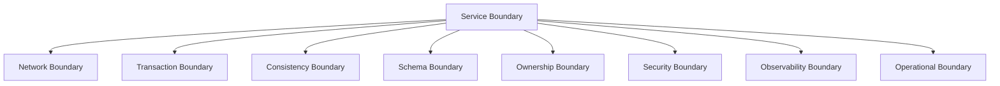
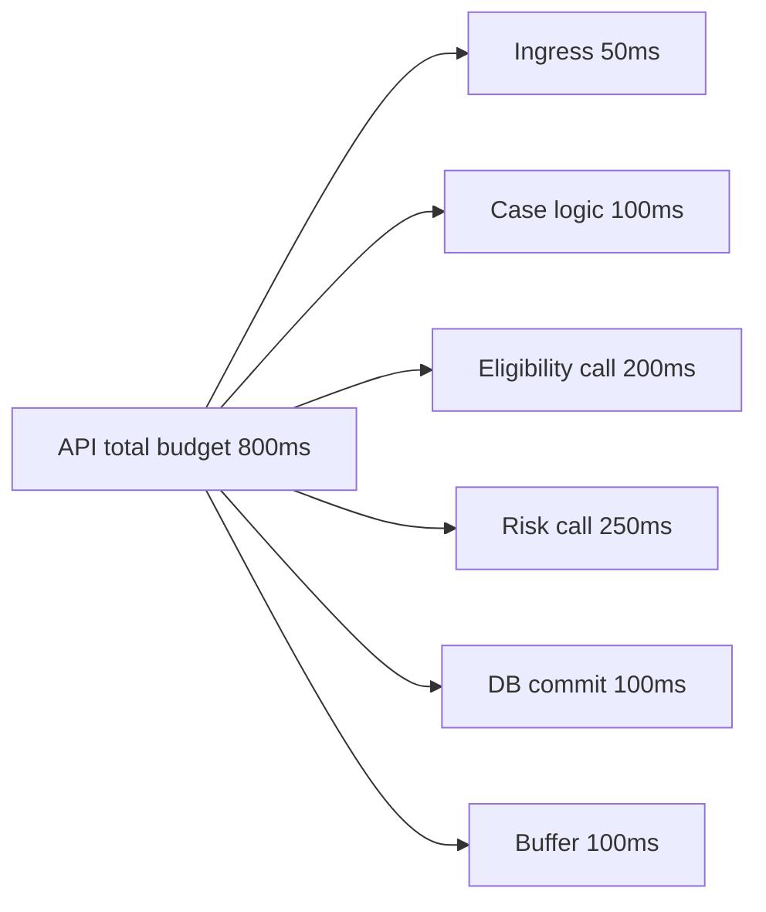
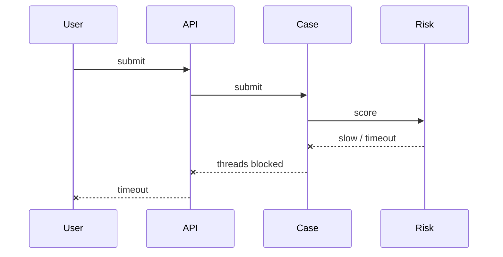
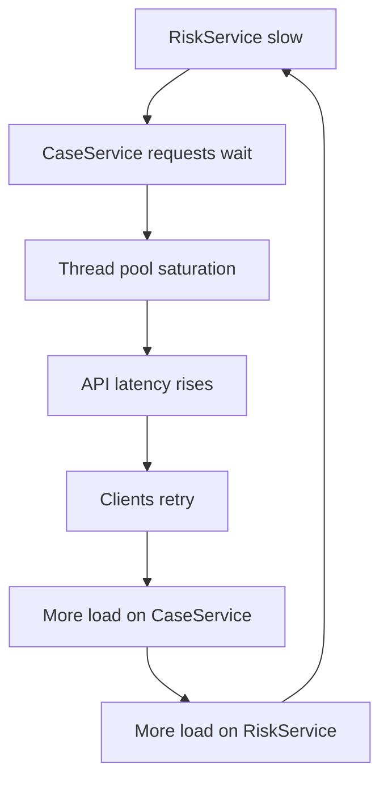
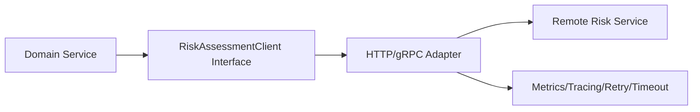
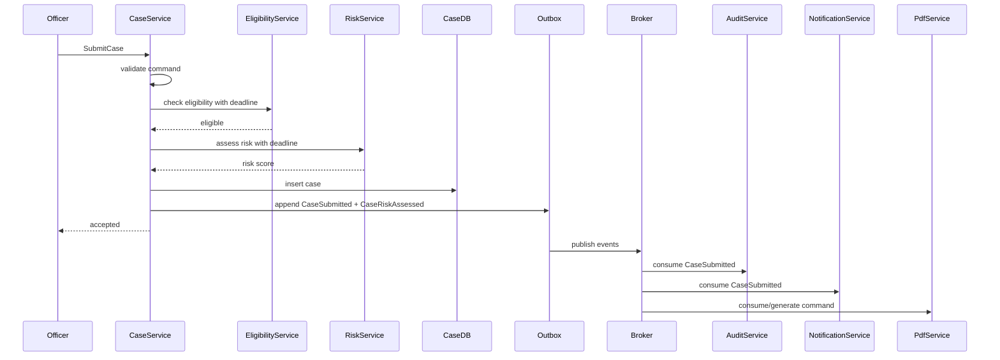

# Part 002 — Distributed Boundary Thinking

> Target part ini: membongkar asumsi keliru bahwa remote call adalah method call yang kebetulan lewat network.
>
> Network bukan transport detail. Network adalah bagian dari domain failure model.

---

## 1. Core Idea

Di microservices, boundary antar service bukan sekadar package boundary yang dipisah deployment. Boundary itu memisahkan:

- process;
- memory;
- transaction;
- clock;
- failure domain;
- deployment lifecycle;
- ownership;
- observability;
- security context;
- operational responsibility.

Karena itu, desain komunikasi antar service harus dimulai dari boundary, bukan dari client library.

Di Java, terlalu mudah membuat remote dependency terlihat seperti local dependency:

```java
riskService.calculate(caseId);
```

Padahal remote dependency punya properti yang tidak dimiliki local method:

- bisa gagal walaupun kode benar;
- bisa lambat walaupun dependency sehat;
- bisa berhasil di callee tetapi gagal terlihat di caller;
- bisa dipanggil ulang oleh retry;
- bisa melewati versi contract yang berbeda;
- bisa terkena DNS, TLS, proxy, mesh, gateway, broker, atau load balancer;
- bisa menimbulkan cascading failure.

**Mental model utama:** remote boundary adalah kontrak antara dua sistem yang bisa gagal secara independen.

---

## 2. Local Call vs Remote Call

| Dimensi | Local method call | Remote service call |
|---|---|---|
| Addressing | Object reference | DNS, service discovery, host, port, route |
| Latency | Nanosecond/microsecond | Millisecond/second/tail latency |
| Failure | Exception karena bug/resource lokal | Timeout, network error, partial failure, overload, protocol error |
| Transaction | Bisa satu transaction/memory context | Terpisah; tidak atomic secara natural |
| Type safety | Compiler-enforced | Contract/schema/runtime compatibility |
| Version | Satu deployment unit | Banyak deployment unit hidup bersamaan |
| Observability | Stack trace lokal | Distributed trace, logs, metrics, correlation id |
| Retry | Jarang perlu | Sering perlu, tetapi berbahaya tanpa idempotency |
| Cancellation | Thread interruption/internal signal | Deadline, cancellation token, context propagation |
| Ownership | Satu codebase/team bisa sama | Sering beda team, beda lifecycle, beda SLO |

Kesalahan desain terjadi ketika kita memperlakukan kolom kanan seperti kolom kiri.

---

## 3. Fallacies sebagai Checklist, Bukan Slogan

Distributed systems memiliki sekumpulan asumsi yang sering salah. Dalam praktik microservices modern, gunakan ini sebagai checklist desain:

| Fallacy | Pertanyaan produksi |
|---|---|
| Network reliable | Apa yang terjadi saat dependency unreachable? |
| Latency zero | Berapa latency budget dan p99 target? |
| Bandwidth infinite | Apakah payload terlalu besar? Apakah compression perlu? |
| Network secure | Apakah identity, mTLS, token propagation, dan authorization jelas? |
| Topology static | Apakah client tahan terhadap scaling, rolling deploy, DNS change? |
| One administrator | Siapa operator dependency? Bagaimana escalation incident? |
| Transport cost zero | Berapa cost request fan-out, serialization, broker, egress? |
| Network homogeneous | Apakah dev, staging, prod, region, dan legacy link berbeda? |

Yang penting bukan menghafal daftar ini. Yang penting adalah memaksa desain menjawab realita production.

---

## 4. Boundary Taxonomy

Satu service boundary sebenarnya terdiri dari banyak boundary sekaligus.



### 4.1 Network Boundary

Network boundary berarti caller tidak mengendalikan jalur komunikasi sepenuhnya.

Risiko:

- DNS stale;
- connection pool rusak;
- TLS handshake mahal;
- packet loss;
- load balancer idle timeout;
- proxy reset;
- service mesh policy berubah;
- latency spike antar zone/region.

Design response:

- timeout eksplisit;
- retry terbatas dengan jitter;
- connection pool tuning;
- circuit breaker;
- observability per dependency;
- fallback yang benar secara domain.

### 4.2 Transaction Boundary

Service lain tidak ikut transaction database service caller.

Buruk:

```java
@Transactional
public void approveCase(CaseId caseId) {
    caseRepository.approve(caseId);
    notificationClient.sendApprovalEmail(caseId); // remote call inside transaction
}
```

Masalah:

- transaction terbuka sambil menunggu network;
- lock database lebih lama;
- jika email berhasil tetapi transaction rollback, dunia luar melihat fakta palsu;
- jika transaction commit tetapi call gagal, efek samping hilang.

Lebih sehat:

```java
@Transactional
public void approveCase(CaseId caseId) {
    caseRepository.approve(caseId);
    outboxRepository.save(CaseApprovedEvent.from(caseId));
}
```

Efek samping eksternal diterbitkan dari outbox setelah state lokal commit.

### 4.3 Consistency Boundary

Setiap boundary memaksa kita memilih consistency model.

Pertanyaan:

- Apakah caller butuh state terbaru sekarang?
- Apakah stale read boleh?
- Berapa lama eventual consistency yang dapat diterima?
- Apakah user interface harus menampilkan status `processing`?
- Apakah audit/regulatory evidence boleh tertunda?

Contoh:

| Use case | Consistency need | Communication shape |
|---|---|---|
| Evaluate eligibility before approval | Strong enough for decision time | Call |
| Send notification after approval | Eventual | Event/message |
| Build analytics projection | Eventual/replayable | Event stream |
| Show case detail page | Often read model/cache acceptable | Query/API/read model |
| Append audit evidence | Must not be lost; may be async if durable | Outbox + event/audit sink |

### 4.4 Schema Boundary

Schema boundary berarti producer dan consumer bisa hidup dengan versi berbeda.

Risiko:

- field dihapus;
- enum value baru tidak dikenali;
- required field ditambah;
- semantic field berubah;
- generated client belum diperbarui;
- event lama tidak bisa dibaca setelah replay.

Design response:

- backward/forward compatibility;
- additive change;
- tolerant reader;
- explicit versioning jika perlu;
- contract test;
- schema registry/validation untuk event stream tertentu.

### 4.5 Ownership Boundary

Remote service punya owner. Owner bisa punya prioritas, deploy cadence, SLO, dan roadmap berbeda.

Pertanyaan penting:

- Siapa yang boleh mengubah contract?
- Siapa yang menerima alert jika dependency lambat?
- Apakah caller boleh bergantung pada detail internal callee?
- Apakah callee menjamin p99 latency tertentu?
- Apa deprecation policy?

Boundary yang tidak punya ownership jelas akan berubah menjadi konflik organisasi.

### 4.6 Security Boundary

Service boundary sering juga security boundary.

Yang perlu dipikirkan:

- service identity;
- caller authentication;
- authorization decision;
- tenant context;
- actor/user context;
- propagation vs re-evaluation;
- auditability;
- data minimization.

Part ini tidak membahas auth/authz secara dalam karena sudah menjadi seri terpisah. Tetapi dalam communication design, metadata security tidak boleh dianggap optional.

### 4.7 Observability Boundary

Remote call tanpa observability adalah black box.

Minimum yang harus ada:

- correlation id;
- trace id/span id;
- dependency name;
- route/method/topic;
- status/error class;
- latency histogram;
- retry count;
- timeout count;
- circuit breaker state;
- queue lag untuk message/stream;
- DLQ count;
- payload size distribution.

Jika tidak bisa diamati, tidak bisa dioperasikan.

---

## 5. Deadline Thinking

Timeout sering diset sebagai angka ajaib:

```yaml
risk-service.timeout: 30s
```

Ini biasanya tanda desain belum matang. Timeout harus berasal dari deadline budget.

Misalnya public API punya SLO internal: p95 harus di bawah 800 ms.

Budget kasar:



Dari sini, `RiskService` tidak boleh diberi timeout 30 detik. Jika caller hanya punya 250 ms budget, timeout 30 detik hanyalah cara menahan thread sampai sistem overload.

### Deadline vs Timeout

- **Timeout**: durasi maksimum untuk satu operasi.
- **Deadline**: batas waktu absolut untuk seluruh pekerjaan.

Deadline lebih kuat karena bisa dipropagasikan lintas hop.

```java
public record Deadline(Instant expiresAt) {
    public Duration remaining(Clock clock) {
        return Duration.between(clock.instant(), expiresAt).isNegative()
            ? Duration.ZERO
            : Duration.between(clock.instant(), expiresAt);
    }
}
```

Client remote harus membaca remaining budget:

```java
Duration remaining = deadline.remaining(clock);

if (remaining.isZero()) {
    return new RemoteResult.TimedOut<>("risk-service");
}

riskHttpClient.call(request, remaining.minusMillis(25));
```

Part berikutnya akan membahas timeout detail. Di sini yang penting: boundary harus punya budget.

---

## 6. Cascading Failure Model

Cascading failure terjadi ketika satu dependency melambat, lalu caller menahan resource, lalu caller ikut melambat, lalu upstream juga melambat.



Jika semua caller melakukan retry agresif, downstream yang sudah overload menerima traffic tambahan.



Desain boundary harus mencegah loop ini dengan:

- timeout pendek sesuai budget;
- retry hanya untuk error transient dan idempotent;
- exponential backoff + jitter;
- circuit breaker;
- bulkhead;
- rate limit;
- fallback/fail-fast;
- load shedding.

---

## 7. Remote Call Contract Harus Memuat Failure Semantics

Contract bukan hanya request/response schema. Contract juga harus menjelaskan failure.

Minimal contract untuk remote API:

| Area | Isi |
|---|---|
| Success semantics | Apa arti sukses? Apakah state berubah? |
| Error classification | Validation, conflict, unavailable, timeout, rate limited, internal |
| Retriability | Error mana yang boleh di-retry? |
| Idempotency | Key apa yang dipakai untuk dedup command? |
| Timeout expectation | p50/p95/p99 latency dan batas maksimum |
| Consistency | Data fresh atau bisa stale? |
| Compatibility | Field mana optional, enum evolution, version policy |
| Observability | Header/context wajib |
| Security | Caller identity, tenant, actor, scope |

Jika contract hanya OpenAPI/proto tanpa failure semantics, consumer akan menebak. Tebakan consumer berubah menjadi bug production.

---

## 8. Boundary Design Method

Gunakan langkah ini sebelum implementasi.

### Step 1 — Nyatakan Outcome

Contoh:

> Saat officer submit case, sistem harus memberi jawaban apakah case diterima untuk diproses. Notification dan analytics boleh tertunda.

Outcome ini langsung memisahkan sync dan async.

### Step 2 — Pisahkan Decision Dependency dan Side Effect

| Interaction | Butuh untuk decision? | Shape |
|---|---:|---|
| Validate case completeness | Yes | Local/domain validation |
| Check applicant eligibility | Yes | Call |
| Calculate risk score | Yes, if escalation immediate | Call |
| Send notification | No | Event/message |
| Append analytics | No | Event |
| Generate PDF | No | Command message |

### Step 3 — Tentukan Failure Policy

| Interaction | Failure policy |
|---|---|
| Eligibility unavailable | Reject with retryable error or mark pending, depending product rule |
| Risk unavailable | Fail fast or fallback to manual review only if policy allows |
| Notification unavailable | Retry async; do not fail submit |
| Analytics unavailable | Buffer/retry; do not fail submit |
| Audit unavailable | If audit is mandatory evidence, persist local outbox before success |

### Step 4 — Tentukan Observability

Untuk setiap boundary:

- metric name;
- trace span name;
- log fields;
- alert condition;
- dashboard slice;
- runbook link.

### Step 5 — Tentukan Evolution Policy

- Bagaimana field baru ditambah?
- Berapa lama version lama didukung?
- Siapa approve breaking change?
- Bagaimana replay event lama diuji?

---

## 9. Java Implementation Boundary Pattern

Buat remote boundary terlihat eksplisit di kode.

### 9.1 Interface Boundary

```java
public interface RiskAssessmentClient {
    RemoteResult<RiskAssessment> assess(
        AssessRiskRequest request,
        Deadline deadline,
        CorrelationContext correlationContext
    );
}
```

### 9.2 Request Object

```java
public record AssessRiskRequest(
    CaseId caseId,
    PersonId subjectId,
    CaseType caseType,
    BigDecimal claimedAmount,
    Instant submittedAt
) {}
```

### 9.3 Correlation Context

```java
public record CorrelationContext(
    String traceId,
    String correlationId,
    String causationId,
    String tenantId,
    String actorId
) {}
```

### 9.4 Dependency Policy

```java
public record DependencyPolicy(
    Duration connectTimeout,
    Duration responseTimeout,
    int maxAttempts,
    Duration baseBackoff,
    boolean circuitBreakerEnabled
) {}
```

### 9.5 Explicit Error Result

```java
public sealed interface RemoteResult<T> {
    record Success<T>(T value) implements RemoteResult<T> {}
    record InvalidRequest<T>(String code, String message) implements RemoteResult<T> {}
    record Conflict<T>(String code, String message) implements RemoteResult<T> {}
    record RateLimited<T>(Duration retryAfter) implements RemoteResult<T> {}
    record DependencyUnavailable<T>(String dependency, boolean retryable) implements RemoteResult<T> {}
    record TimedOut<T>(String dependency) implements RemoteResult<T> {}
    record Unexpected<T>(String dependency, String diagnosticId) implements RemoteResult<T> {}
}
```

Tujuannya bukan memaksa semua project memakai pattern yang sama. Tujuannya adalah menghilangkan ilusi bahwa remote call sama dengan local method.

---

## 10. Jangan Membocorkan Transport ke Domain

Domain service tidak boleh tahu detail HTTP status, Kafka offset, atau gRPC status kecuali memang boundary layer.

Buruk:

```java
public CaseDecision submitCase(SubmitCaseCommand command) {
    ResponseEntity<RiskResponse> response = riskRestClient.post(command);

    if (response.getStatusCode().value() == 503) {
        throw new RuntimeException("Risk unavailable");
    }

    return decide(response.getBody());
}
```

Lebih baik:

```java
public CaseDecision submitCase(SubmitCaseCommand command) {
    RemoteResult<RiskAssessment> result = riskClient.assess(
        AssessRiskRequest.from(command),
        Deadline.after(Duration.ofMillis(250), clock),
        correlation.current()
    );

    return switch (result) {
        case RemoteResult.Success<RiskAssessment> success -> decide(success.value());
        case RemoteResult.TimedOut<RiskAssessment> ignored -> manualReview("RISK_TIMEOUT");
        case RemoteResult.DependencyUnavailable<RiskAssessment> ignored -> manualReview("RISK_UNAVAILABLE");
        case RemoteResult.InvalidRequest<RiskAssessment> invalid -> reject(invalid.code());
        default -> manualReview("RISK_UNKNOWN");
    };
}
```

Transport-specific mapping berada di adapter/client layer.



---

## 11. Boundary Smells

Gunakan daftar ini saat review desain.

### 11.1 Remote Call di Dalam Loop

```java
for (CaseId caseId : caseIds) {
    riskClient.assess(caseId);
}
```

Jika `caseIds` berisi 1000 item, ini bukan loop biasa. Ini 1000 network calls. Solusi bisa berupa batch API, async pipeline, precomputed read model, atau stream.

### 11.2 Remote Call di Dalam Database Transaction

Sudah dibahas: ini memperpanjang lock dan membuat efek samping sulit dikendalikan.

### 11.3 Remote Call untuk Data yang Harusnya Local Projection

Jika page detail selalu memanggil 8 service untuk render, mungkin perlu read model/projection.

### 11.4 Retry di Banyak Layer

Retry bisa terjadi di:

- client code;
- HTTP library;
- service mesh;
- gateway;
- broker;
- SDK;
- job scheduler.

Jika semua layer retry, satu request bisa menjadi puluhan request.

### 11.5 Tidak Ada Deadline Propagation

Setiap service memberi timeout sendiri tanpa tahu budget upstream. Hasilnya request yang sudah tidak berguna tetap diproses downstream.

### 11.6 Error Semantics Kabur

Semua error menjadi `500` atau `RuntimeException`. Caller tidak bisa membedakan invalid input, conflict, rate limit, timeout, dan dependency unavailable.

### 11.7 Contract Mengikuti Database

Jika event/API berubah setiap kali tabel berubah, boundary terlalu dekat dengan persistence model.

---

## 12. Boundary Review Template

Sebelum merge desain komunikasi baru, isi template ini.

```md
## Boundary Review

### 1. Interaction
- Caller:
- Callee/consumer:
- Primitive: Call / Message / Event / Stream
- Business intent:

### 2. Criticality
- User-facing? Yes/No
- In critical path? Yes/No
- Required for decision? Yes/No
- Regulatory/audit impact? Yes/No

### 3. Contract
- Request/event schema:
- Response schema:
- Error model:
- Compatibility rule:
- Owner:

### 4. Failure Policy
- Timeout/deadline:
- Retry policy:
- Idempotency key:
- Fallback:
- DLQ/replay:

### 5. Observability
- Metrics:
- Trace span:
- Required log fields:
- Alert:
- Dashboard:
- Runbook:

### 6. Operational Risk
- Expected QPS/throughput:
- Payload size:
- Fan-out:
- Backpressure strategy:
- Deployment/version risk:
```

Template seperti ini lebih bernilai daripada diagram cantik yang tidak menjelaskan failure.

---

## 13. Example: Submit Enforcement Case

### 13.1 Requirement

Officer submit enforcement case. Sistem harus:

- validasi completeness;
- cek eligibility subject;
- hitung initial risk;
- simpan case;
- catat audit evidence;
- kirim notification;
- update analytics;
- trigger PDF generation.

### 13.2 Boundary Classification

| Interaction | Primitive | Rationale |
|---|---|---|
| `CaseService -> EligibilityService` | Call | Dibutuhkan untuk menerima/menolak submit. |
| `CaseService -> RiskService` | Call | Dibutuhkan jika initial route/escalation ditentukan saat submit. |
| `CaseService -> Audit` | Event/outbox | Evidence wajib tidak hilang, tetapi tidak harus remote call sinkron. |
| `CaseService -> Notification` | Event/message | Tidak boleh menggagalkan submit. |
| `CaseService -> Analytics` | Event stream | Consumer independen dan replayable. |
| `CaseService -> PdfService` | Command message | Pekerjaan async, mahal, retryable. |

### 13.3 Healthy Flow



### 13.4 Failure Policy

| Failure | Response |
|---|---|
| Eligibility timeout | Return retryable submit failure or pending review, depending business rule. |
| Risk timeout | Route to manual review only if policy allows. Do not silently approve. |
| CaseDB failure | Submit fails. No event emitted. |
| Outbox insert failure | Submit fails because evidence/event consistency cannot be guaranteed. |
| Broker down after commit | Outbox retains event; relay retries. |
| Notification fails | Retry async; do not affect submitted case. |
| PDF generation fails | DLQ/parking lot; user sees PDF pending. |

Ini adalah contoh boundary thinking: bukan hanya memilih sync/async, tetapi menentukan efek failure terhadap outcome bisnis.

---

## 14. Production Boundary Invariants

Gunakan invariants berikut sebagai standar minimum.

### Invariant 1 — Remote dependency harus punya timeout eksplisit

Tidak boleh ada remote call tanpa timeout.

### Invariant 2 — Timeout harus berasal dari caller budget

Bukan angka default library.

### Invariant 3 — Retry harus hanya untuk operasi yang aman diulang

Jika mutation tidak idempotent, jangan retry buta.

### Invariant 4 — Remote call tidak boleh berada dalam database transaction kecuali alasan kuat dan terdokumentasi

Mayoritas kasus harus memakai outbox/event/message.

### Invariant 5 — Error harus diklasifikasikan

Caller perlu tahu perbedaan invalid input, conflict, timeout, unavailable, dan unexpected.

### Invariant 6 — Boundary harus observable

Minimal ada metric, trace, log correlation, dan alert untuk dependency penting.

### Invariant 7 — Contract evolution harus direncanakan

Breaking change tanpa migration path adalah incident yang tertunda.

### Invariant 8 — Critical path harus pendek dan bisa dijelaskan

Jika sebuah request user melewati 12 service, desainnya harus dipertanyakan.

---

## 15. Ringkasan

Distributed boundary thinking adalah kemampuan melihat bahwa setiap interaksi antar service memisahkan failure domain. Boundary bukan detail deployment. Boundary mengubah cara kita mendesain transaction, consistency, schema, ownership, security, observability, dan recovery.

Di Java, jangan sembunyikan remote dependency sebagai method biasa. Buat boundary eksplisit melalui client interface, deadline, correlation context, error classification, idempotency, dan dependency policy.

Part berikutnya akan masuk ke taxonomy komunikasi lebih sistematis: request/response, fire-and-forget, pub/sub, queue, log, stream, dan kapan masing-masing benar-benar layak dipakai.

---

## References

- RFC 9110 — HTTP Semantics: https://datatracker.ietf.org/doc/html/rfc9110
- gRPC Deadlines: https://grpc.io/docs/guides/deadlines/
- gRPC Cancellation: https://grpc.io/docs/guides/cancellation/
- AWS Builders Library — Timeouts, retries, and backoff with jitter: https://aws.amazon.com/builders-library/timeouts-retries-and-backoff-with-jitter/
- AWS Architecture Blog — Exponential Backoff and Jitter: https://aws.amazon.com/blogs/architecture/exponential-backoff-and-jitter/
- Martin Fowler — Microservices: https://martinfowler.com/articles/microservices.html
- Martin Fowler — Microservice Trade-Offs: https://martinfowler.com/articles/microservice-trade-offs.html
- OpenTelemetry: https://opentelemetry.io/
