# Part 003 — Communication Taxonomy

> Target part ini: memberi peta yang presisi tentang bentuk-bentuk komunikasi microservices.
>
> Setelah membaca part ini, kamu harus bisa melihat satu interaksi antar service dan langsung menjawab: _ini call, command, event, message, stream, atau campuran?_ Lalu kamu bisa menjelaskan konsekuensi teknisnya: coupling, retry, ordering, idempotency, observability, dan operability.

---

## 1. Kenapa Taxonomy Penting

Masalah komunikasi microservices jarang dimulai dari teknologi. Masalah biasanya dimulai dari **salah memberi nama**.

Contoh percakapan yang sering terjadi:

> "Service A publish event ke Service B untuk membuat payment."

Kalimat itu terdengar biasa, tapi secara desain ambigu.

Apakah "event" tersebut berarti:

1. fakta yang sudah terjadi, misalnya `OrderSubmitted`;
2. perintah agar service lain bekerja, misalnya `AuthorizePayment`;
3. notifikasi agar service lain mengambil data tambahan;
4. data snapshot untuk sinkronisasi read model;
5. sinyal stream berkelanjutan?

Jika semua disebut "event", tim kehilangan kemampuan membedakan konsekuensi desainnya. Hasilnya:

- event dipakai sebagai command tersembunyi;
- consumer menganggap message bisa diproses sekali saja;
- producer mengubah schema tanpa tahu consumer mana yang rusak;
- retry menyebabkan efek bisnis ganda;
- topic menjadi tempat sampah integrasi;
- incident sulit dianalisis karena log hanya berkata "message processed".

**Taxonomy adalah alat untuk menjaga semantik tetap jernih.**

Di level top engineer, komunikasi bukan sekadar "HTTP vs Kafka". Pertanyaannya:

> _Bentuk hubungan apa yang sedang kita ciptakan antara dua atau lebih service?_

---

## 2. Primitive Dasar dari Part 001

Kita sudah punya empat primitive:

| Primitive | Inti | Contoh teknologi |
|---|---|---|
| Call | Caller butuh jawaban langsung | HTTP, gRPC unary |
| Message | Sender meminta kerja dilakukan | Queue, broker, command topic |
| Event | Producer menyatakan fakta sudah terjadi | Kafka topic, Pulsar topic, CloudEvents |
| Stream | Rangkaian data sepanjang waktu | gRPC streaming, WebSocket, SSE, Kafka stream |

Part ini memperluas primitive tersebut menjadi taxonomy operasional.

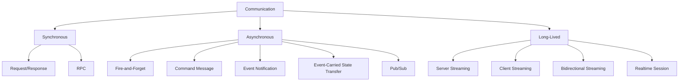

Taxonomy ini bukan akademik. Setiap kategori punya failure model yang berbeda.

---

## 3. Dimensi Taxonomy

Jangan klasifikasikan komunikasi hanya dari transport-nya. Transport adalah bagian bawah. Semantik ada di bagian atas.

Gunakan dimensi berikut.

| Dimensi | Pertanyaan |
|---|---|
| Timing | Apakah pengirim menunggu hasil sekarang? |
| Cardinality | Satu receiver, banyak receiver, atau tidak diketahui? |
| Intent | Membaca data, meminta aksi, menyatakan fakta, atau mengalirkan perubahan? |
| Ownership | Siapa pemilik kontrak? Sender, receiver, atau platform? |
| Coupling | Apakah sender harus tahu receiver? |
| State transfer | Payload membawa semua data atau hanya pointer/id? |
| Ordering | Apakah urutan antar message penting? Pada scope apa? |
| Delivery guarantee | Boleh hilang, minimal sekali, tepat sekali secara efek bisnis? |
| Backpressure | Apa yang terjadi saat receiver lambat? |
| Failure visibility | Siapa tahu kalau processing gagal? |
| Retry authority | Siapa yang boleh mengulang? Client, broker, consumer, orchestrator? |

Satu teknologi bisa menjalankan banyak semantik.

Kafka bisa dipakai untuk event, command, audit log, outbox relay, atau stream processing. HTTP bisa dipakai untuk query, command, polling, callback, webhook, dan streaming response. gRPC bisa dipakai untuk unary call, server streaming, client streaming, atau bidirectional streaming.

**Kesalahan umum:** memilih teknologi lalu memaksa semantik mengikuti teknologi.

**Cara yang benar:** pilih semantik dahulu, baru pilih transport.

---

## 4. Pattern 1 — Request/Response

Request/response adalah komunikasi ketika caller mengirim request dan menunggu response sebelum bisa melanjutkan.

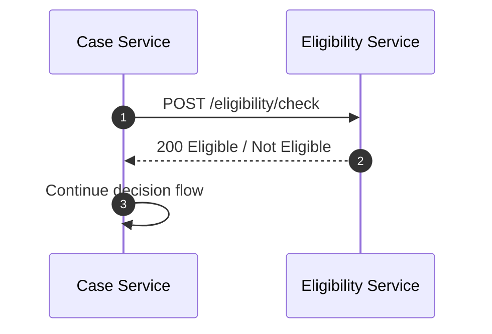

### 4.1 Kapan Cocok

Gunakan request/response ketika:

- caller benar-benar butuh jawaban untuk melanjutkan;
- latency masih masuk budget user/system;
- receiver jelas satu service tertentu;
- operasi punya failure response yang bisa dimengerti caller;
- data harus dibaca dari source of truth saat itu juga;
- caller bisa membuat keputusan lokal berdasarkan response.

Contoh:

```java
EligibilityResult result = eligibilityClient.check(command);

if (!result.eligible()) {
    return CaseDecision.rejected(result.reasonCode());
}

return CaseDecision.continueReview();
```

### 4.2 Konsekuensi

Request/response menciptakan **runtime coupling**.

Jika `Eligibility Service` lambat atau down, `Case Service` ikut terdampak. Ini bukan selalu buruk. Untuk rule yang memang harus real-time, coupling itu sah. Yang berbahaya adalah tidak mengakui coupling tersebut.

| Area | Konsekuensi |
|---|---|
| Latency | Caller membayar latency receiver |
| Availability | Availability end-to-end menjadi hasil gabungan dependency |
| Retry | Bisa memperbaiki transient failure, bisa juga menggandakan load |
| Timeout | Wajib ada; tanpa timeout, caller bisa menggantung resource |
| Error | Error harus punya semantic meaning, bukan sekadar `500` |
| Observability | Perlu trace span across boundary |

### 4.3 Anti-Pattern

Anti-pattern utama:

```java
// Buruk: remote call diperlakukan seperti local method call
PaymentStatus status = paymentService.status(paymentId);
NotificationStatus n = notificationService.status(notificationId);
AuditStatus audit = auditService.status(caseId);
```

Kode terlihat sederhana, tetapi latency menjadi serial:

```text
Total latency = payment + notification + audit + network + retries + queueing
```

Jika ketiganya masing-masing p95 200 ms, path ini bisa menjadi >600 ms sebelum business logic lokal bekerja.

Versi lebih baik:

```java
CompletableFuture<PaymentStatus> payment = paymentClient.statusAsync(paymentId);
CompletableFuture<NotificationStatus> notification = notificationClient.statusAsync(notificationId);
CompletableFuture<AuditStatus> audit = auditClient.statusAsync(caseId);

ServiceSnapshot snapshot = ServiceSnapshot.of(
    payment.get(300, TimeUnit.MILLISECONDS),
    notification.get(300, TimeUnit.MILLISECONDS),
    audit.get(300, TimeUnit.MILLISECONDS)
);
```

Tetapi parallel call pun tidak otomatis benar. Ia memperbesar fan-out dan bisa memperbesar load ke downstream.

---

## 5. Pattern 2 — RPC

RPC adalah bentuk request/response yang membuat operasi remote terlihat seperti procedure/method.

gRPC adalah contoh modern yang umum dipakai di internal service communication. Di gRPC, service dan method didefinisikan dalam `.proto`, lalu client/server stub dihasilkan dari definisi tersebut.

```proto
syntax = "proto3";

service CaseRiskService {
  rpc CalculateRisk(CalculateRiskRequest) returns (CalculateRiskResponse);
}

message CalculateRiskRequest {
  string case_id = 1;
  string applicant_id = 2;
}

message CalculateRiskResponse {
  string risk_band = 1;
  double score = 2;
}
```

### 5.1 Kapan Cocok

RPC cocok ketika:

- komunikasi internal service-to-service;
- butuh schema strongly typed;
- butuh performa dan payload efisien;
- butuh streaming model selain unary;
- tim mampu mengelola protobuf compatibility;
- observability dan load balancing gRPC dipahami.

### 5.2 Risiko Mental Model

RPC berbahaya karena membuat remote call terasa seperti local call.

```java
RiskResponse response = riskClient.calculateRisk(request);
```

Padahal operasi itu memiliki:

- deadline;
- cancellation;
- metadata;
- network error;
- status code gRPC;
- retry policy;
- load balancing;
- flow control;
- serialization boundary.

Karena itu, wrapper client harus menampilkan policy secara eksplisit.

```java
RiskResponse response = riskGateway.calculateRisk(
    request,
    CallPolicy.deadline(Duration.ofMillis(250))
              .retryOnUnavailable(1)
              .withCorrelationId(correlationId)
);
```

Tujuannya bukan membuat kode panjang, tetapi membuat konsekuensi komunikasi terlihat.

---

## 6. Pattern 3 — Fire-and-Forget

Fire-and-forget adalah komunikasi ketika sender mengirim sinyal lalu tidak menunggu hasil processing.

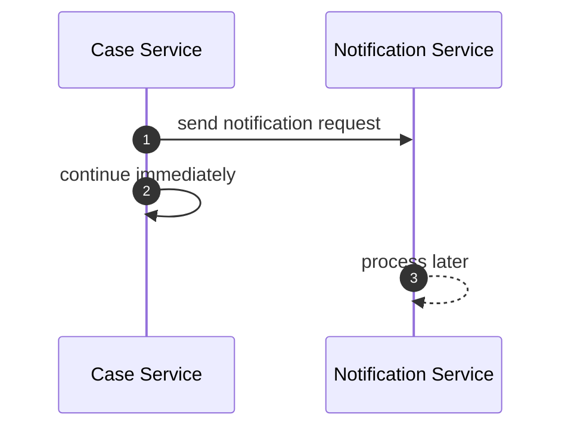

Nama "forget" berbahaya. Dalam sistem produksi, kita hampir tidak pernah benar-benar boleh "forget". Yang benar biasanya:

> _send-and-observe-later_

atau

> _enqueue-and-return_

### 6.1 Kapan Cocok

Cocok ketika:

- hasil tidak diperlukan untuk response utama;
- operasi bisa diproses kemudian;
- caller hanya perlu memastikan intent terkirim atau dicatat;
- duplicate processing bisa ditoleransi atau dideduplicate;
- ada monitoring untuk failure async.

Contoh:

```java
notificationPublisher.publish(
    new SendCaseAssignedEmail(
        caseId,
        officerId,
        correlationId
    )
);

return CaseAssignmentResult.assigned(caseId);
```

### 6.2 Failure yang Sering Dilupakan

| Failure | Dampak |
|---|---|
| Publish gagal | Intent hilang jika tidak ada outbox |
| Publish sukses, DB commit gagal | Downstream melihat sesuatu yang belum benar secara bisnis |
| Consumer gagal | Sender sudah selesai, tapi pekerjaan belum selesai |
| Consumer lambat | Queue backlog meningkat |
| Duplicate delivery | Email terkirim dua kali, status diproses dua kali |

Karena itu fire-and-forget untuk operasi bisnis penting biasanya harus berubah menjadi:

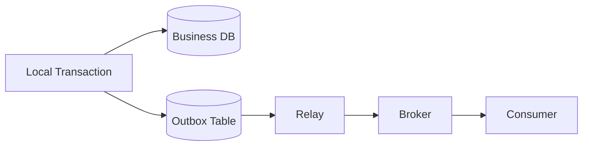

Ini akan dibahas lebih dalam di part transactional outbox.

---

## 7. Pattern 4 — Command Message

Command message adalah message yang meminta receiver melakukan aksi.

Contoh nama yang jelas:

- `AuthorizePayment`
- `GenerateInspectionReport`
- `SendCaseEscalationNotice`
- `RecalculateRiskScore`

Command berbeda dari event.

| Aspek | Command | Event |
|---|---|---|
| Makna | Tolong lakukan sesuatu | Sesuatu sudah terjadi |
| Waktu | Sebelum aksi selesai | Setelah fakta terjadi |
| Receiver | Biasanya target jelas | Consumer bisa banyak/tidak diketahui |
| Failure | Perlu tahu apakah pekerjaan berhasil/gagal | Producer biasanya tidak menunggu consumer |
| Naming | Imperative verb | Past-tense fact |

### 7.1 Contoh Buruk

```json
{
  "eventType": "PaymentAuthorizationRequested",
  "orderId": "ORD-123",
  "amount": 100000
}
```

Secara nama tampak event, tetapi maknanya command. Downstream diharapkan melakukan authorization.

Lebih jujur:

```json
{
  "commandType": "AuthorizePayment",
  "commandId": "cmd-789",
  "orderId": "ORD-123",
  "amount": 100000,
  "idempotencyKey": "order-ORD-123-payment-auth"
}
```

### 7.2 Java Model

```java
public record AuthorizePaymentCommand(
    String commandId,
    String orderId,
    Money amount,
    String idempotencyKey,
    Instant requestedAt,
    String correlationId
) {}
```

Handler:

```java
public final class AuthorizePaymentHandler {
    private final IdempotencyStore idempotencyStore;
    private final PaymentProcessor paymentProcessor;
    private final PaymentEventPublisher publisher;

    public void handle(AuthorizePaymentCommand command) {
        if (idempotencyStore.alreadyProcessed(command.idempotencyKey())) {
            return;
        }

        PaymentAuthorization authorization = paymentProcessor.authorize(
            command.orderId(),
            command.amount()
        );

        idempotencyStore.markProcessed(command.idempotencyKey());
        publisher.publish(PaymentAuthorized.from(authorization, command.correlationId()));
    }
}
```

### 7.3 Rule

Command message wajib punya:

- command id;
- idempotency key;
- target semantic yang jelas;
- retry policy;
- failure channel;
- observability;
- maximum age / expiry bila command menjadi tidak valid setelah waktu tertentu.

---

## 8. Pattern 5 — Event Notification

Event notification adalah event kecil yang memberi tahu bahwa sesuatu terjadi, tetapi tidak membawa semua state.

Contoh:

```json
{
  "type": "case.status.changed",
  "source": "case-service",
  "id": "evt-123",
  "time": "2026-07-05T10:15:30Z",
  "subject": "case/CASE-1001",
  "data": {
    "caseId": "CASE-1001",
    "newStatus": "UNDER_REVIEW"
  }
}
```

Consumer yang butuh detail akan call balik ke source service.

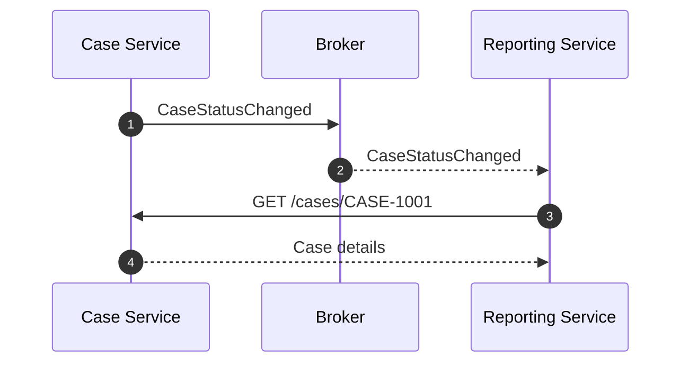

### 8.1 Kapan Cocok

Cocok ketika:

- event payload ingin kecil;
- source of truth tetap satu service;
- consumer tidak selalu butuh semua data;
- data detail sensitif atau besar;
- consumer bisa menoleransi call tambahan.

### 8.2 Risiko

Event notification menciptakan **callback coupling**.

Consumer menerima event, lalu call balik producer. Jika banyak consumer melakukan hal ini, producer bisa terkena thundering herd.

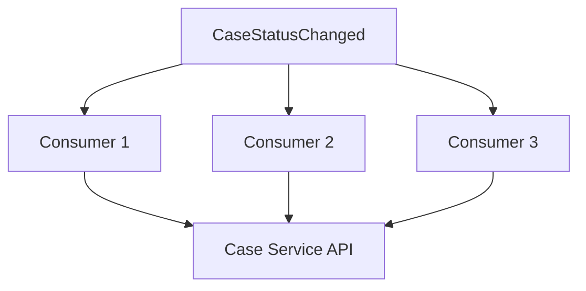

Mitigasi:

- consumer caching;
- event-carried state transfer;
- read replica khusus reporting;
- rate limiting;
- async fetch with backoff;
- payload enrichment terbatas.

---

## 9. Pattern 6 — Event-Carried State Transfer

Event-carried state transfer adalah event yang membawa cukup state agar consumer tidak perlu call balik ke producer.

Contoh:

```json
{
  "type": "case.status.changed",
  "source": "case-service",
  "id": "evt-456",
  "time": "2026-07-05T10:15:30Z",
  "subject": "case/CASE-1001",
  "data": {
    "caseId": "CASE-1001",
    "previousStatus": "SUBMITTED",
    "newStatus": "UNDER_REVIEW",
    "assignedOfficerId": "OFF-17",
    "riskBand": "MEDIUM",
    "jurisdiction": "SG",
    "version": 42
  }
}
```

### 9.1 Kapan Cocok

Cocok ketika:

- banyak consumer butuh data serupa;
- callback ke producer mahal/rapuh;
- consumer membangun local projection/read model;
- eventual consistency diterima;
- producer bisa menjaga compatibility schema.

### 9.2 Trade-Off

| Kelebihan | Biaya |
|---|---|
| Mengurangi call balik | Payload lebih besar |
| Consumer lebih mandiri | Schema evolution lebih sulit |
| Cocok untuk projection | Risiko data sensitif tersebar |
| Lebih tahan producer outage | Consumer bisa membaca state lama |

### 9.3 Rule

Event-carried state transfer harus punya versi.

```java
public record CaseStatusChangedV2(
    String eventId,
    String caseId,
    String previousStatus,
    String newStatus,
    String assignedOfficerId,
    String riskBand,
    String jurisdiction,
    long aggregateVersion,
    Instant occurredAt
) {}
```

Tanpa `aggregateVersion`, consumer sulit mendeteksi event lama yang datang belakangan.

---

## 10. Pattern 7 — Publish/Subscribe

Pub/sub adalah komunikasi ketika producer publish satu message/event dan banyak subscriber bisa menerima.

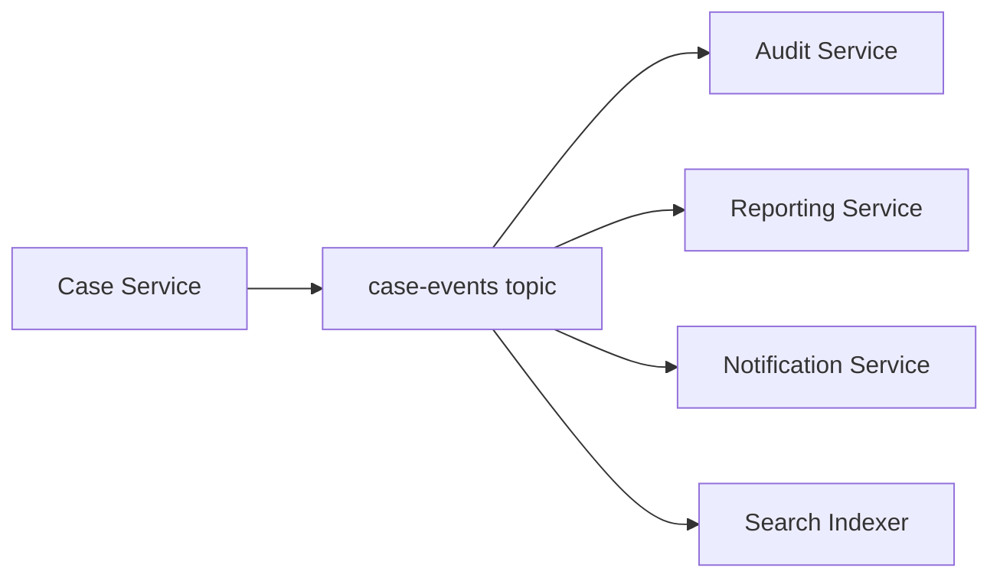

Pub/sub adalah topology, bukan semantik. Payload di pub/sub bisa event, command, notification, atau state transfer.

### 10.1 Kapan Cocok

Cocok ketika:

- producer tidak ingin tahu siapa consumer;
- banyak consumer butuh fakta yang sama;
- consumer bisa berkembang independen;
- processing boleh asynchronous;
- setiap consumer punya failure isolation.

### 10.2 Hidden Cost

Pub/sub mengurangi direct coupling tetapi menambah **semantic coupling**.

Producer mungkin tidak tahu consumer-nya, tetapi tetap tidak bebas mengubah event sembarangan. Event publik internal adalah kontrak.

Anti-pattern:

```text
"Ini cuma internal event, boleh diubah kapan saja."
```

Di organisasi besar, internal event sering lebih sulit diubah daripada public API karena consumer tidak selalu terdaftar rapi.

### 10.3 Consumer Independence

Consumer harus bisa gagal tanpa menghentikan producer.

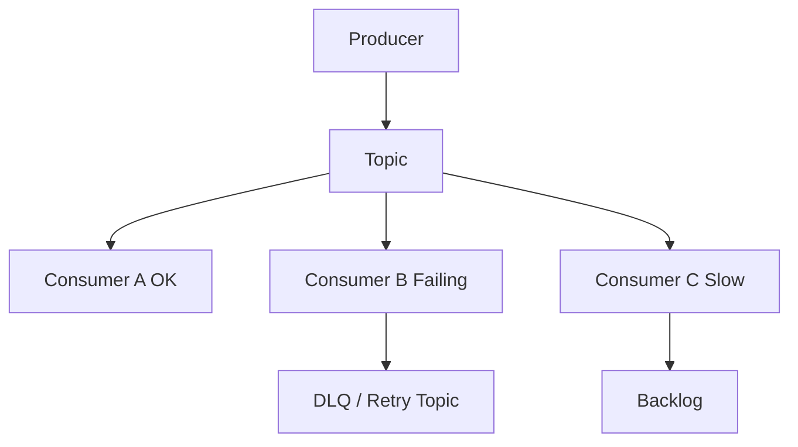

Jika satu consumer gagal dan membuat producer gagal, itu bukan pub/sub yang sehat. Itu synchronous dependency yang disamarkan.

---

## 11. Pattern 8 — Queue / Competing Consumers

Queue pattern mendistribusikan pekerjaan ke beberapa worker. Satu message biasanya diproses oleh satu consumer dari sebuah group/queue.

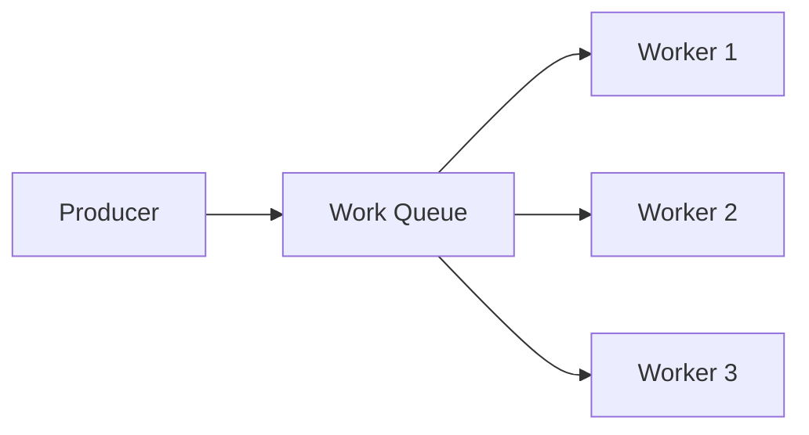

### 11.1 Kapan Cocok

Cocok untuk:

- background jobs;
- workload yang bisa diparalelkan;
- rate smoothing;
- integration dengan sistem lambat;
- operasi yang tidak harus selesai dalam request user;
- isolasi spike traffic.

Contoh:

```java
public record GenerateCasePdfCommand(
    String commandId,
    String caseId,
    String requestedBy,
    String idempotencyKey
) {}
```

### 11.2 Queue Bukan Tempat Sampah

Queue sering dipakai untuk menyembunyikan masalah kapasitas. Itu berbahaya.

Jika arrival rate lebih besar dari processing rate secara terus-menerus, queue hanya mengubah failure dari immediate failure menjadi delayed failure.

```text
Backlog growth = incoming messages per second - processed messages per second
```

Jika backlog naik terus, sistem sedang gagal, walau API masih return `202 Accepted`.

### 11.3 Metrik Wajib

Untuk queue-based communication, minimal ukur:

- publish rate;
- consume rate;
- backlog depth;
- oldest message age;
- retry count;
- DLQ count;
- processing latency;
- end-to-end age from created to completed;
- consumer error rate;
- duplicate detection count.

`queue depth` saja tidak cukup. Queue kecil bisa buruk jika message tertua sudah berumur 3 jam.

---

## 12. Pattern 9 — Streaming

Streaming adalah komunikasi berupa rangkaian data dari waktu ke waktu. Streaming bukan sekadar "banyak message". Yang membedakan adalah adanya dimensi waktu, flow, dan backpressure.

Bentuk streaming:

| Bentuk | Deskripsi | Contoh |
|---|---|---|
| Server streaming | Client request sekali, server mengirim banyak response | gRPC server streaming |
| Client streaming | Client mengirim banyak item, server response sekali | upload batch/telemetry |
| Bidirectional streaming | Dua arah sama-sama mengirim rangkaian data | realtime collaboration, live coordination |
| Log stream | Consumer membaca append-only log | Kafka topic |
| Realtime session | Connection panjang untuk push update | WebSocket, SSE |

### 12.1 Server Streaming

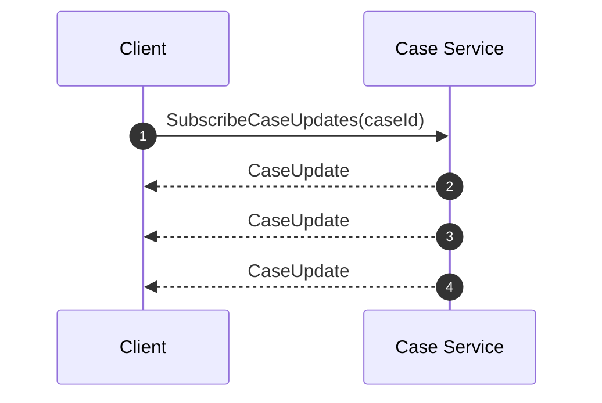

### 12.2 Backpressure

Streaming tanpa backpressure adalah memory leak yang menunggu terjadi.

Pertanyaan wajib:

- siapa yang menentukan rate?
- bagaimana consumer memberi sinyal lambat?
- apakah producer buffer, drop, sample, atau block?
- apa batas memory?
- apa yang terjadi saat client disconnect?
- apakah stream replayable?

Reactive Streams secara eksplisit menargetkan asynchronous stream processing dengan non-blocking backpressure. Di Java ecosystem, konsep ini muncul pada Project Reactor, Akka Streams, Java Flow API, dan library reactive lain.

---

## 13. Pattern 10 — Callback / Webhook Internal

Callback adalah ketika service A memanggil service B, lalu B memanggil balik A atau endpoint yang disediakan A.

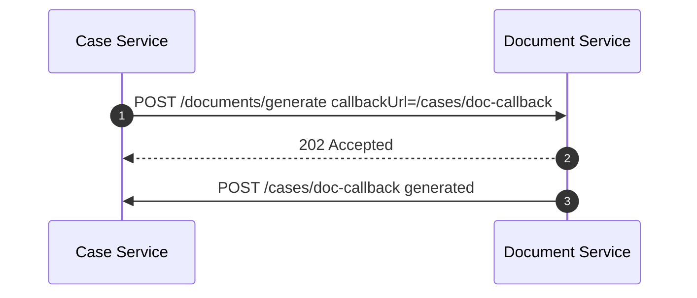

### 13.1 Kapan Cocok

Cocok ketika:

- proses lama;
- caller ingin notifikasi completion;
- broker tidak tersedia atau tidak cocok;
- integrasi lintas boundary organisasi;
- callback endpoint bisa diamankan dan diobservasi.

### 13.2 Risiko

Callback membuat dua arah dependency.

| Risiko | Penjelasan |
|---|---|
| Receiver unavailable | Completion tidak terkirim |
| Duplicate callback | Sender retry karena timeout |
| Security | Endpoint harus validate signature/token |
| Ordering | Callback lama bisa datang setelah callback baru |
| Lifecycle | Callback URL/version bisa kedaluwarsa |

Untuk internal microservices, broker sering lebih baik daripada callback. Tapi callback tetap berguna untuk integrasi dengan pihak eksternal atau workflow tertentu.

---

## 14. Pattern 11 — Polling

Polling adalah client bertanya berulang untuk mengetahui status.

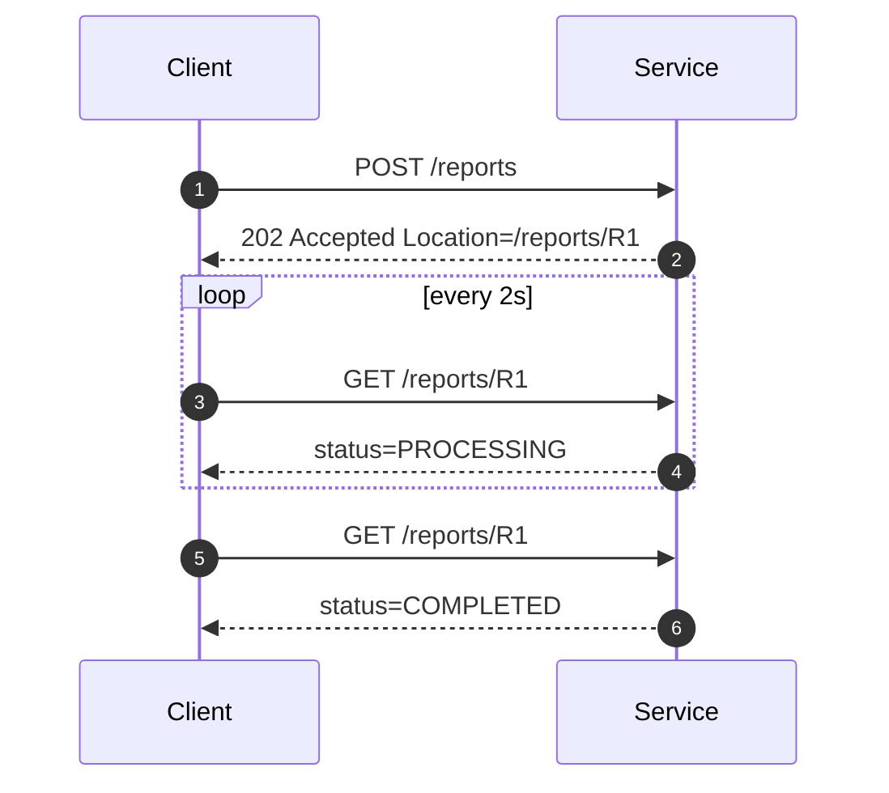

### 14.1 Kapan Cocok

Polling cocok ketika:

- client sederhana;
- update jarang;
- realtime tidak penting;
- server tidak ingin memegang connection panjang;
- proses punya resource/status endpoint yang jelas.

### 14.2 Rule

Polling wajib punya:

- interval yang reasonable;
- exponential backoff atau server-provided `Retry-After`;
- status endpoint idempotent;
- TTL untuk resource;
- rate limit;
- cancellation endpoint jika proses bisa dibatalkan.

Polling bukan dosa. Polling yang tidak punya batas adalah dosa operasional.

---

## 15. Matrix Ringkas

| Pattern | Sender menunggu? | Receiver | Cocok untuk | Risiko utama |
|---|---:|---|---|---|
| Request/Response | Ya | Satu | Query/command cepat | Runtime coupling |
| RPC | Ya | Satu | Internal typed call | Remote terlihat local |
| Fire-and-Forget | Tidak | Satu/tidak langsung | Non-critical async work | Intent hilang |
| Command Message | Tidak langsung | Target jelas | Background action | Duplicate effect |
| Event Notification | Tidak | Banyak | Announce fact ringan | Callback storm |
| Event-Carried State | Tidak | Banyak | Projection/read model | Schema/data spread |
| Pub/Sub | Tidak | Banyak | Fan-out | Unknown consumers |
| Queue | Tidak langsung | Satu worker/group | Work distribution | Backlog blindness |
| Streaming | Selama connection | Satu/banyak | Realtime/flow data | Backpressure |
| Callback | Tidak langsung | Dua arah | Long-running external work | Bi-directional coupling |
| Polling | Ya, berkala | Satu | Simple status tracking | Load amplification |

---

## 16. Java-Oriented Selection Examples

### 16.1 Case Eligibility Check

Requirement:

- user submit case;
- system harus reject jika applicant tidak eligible;
- jawaban dibutuhkan sebelum response;
- latency budget 500 ms.

Pilihan:

```text
Synchronous request/response, HTTP or gRPC
```

Java shape:

```java
public interface EligibilityGateway {
    EligibilityDecision check(EligibilityCheckRequest request, Deadline deadline);
}
```

Kenapa bukan event?

Karena caller tidak bisa melanjutkan tanpa jawaban. Menjadikannya async hanya memindahkan kompleksitas ke state machine `PENDING_ELIGIBILITY`.

### 16.2 Audit Trail

Requirement:

- setiap perubahan case harus terekam;
- audit tidak boleh memperlambat user flow secara signifikan;
- audit service bisa tertinggal sebentar.

Pilihan:

```text
Event via outbox + broker
```

Java shape:

```java
caseRepository.save(caseEntity);
outboxRepository.append(CaseStatusChanged.from(caseEntity));
```

Kenapa bukan synchronous call ke audit?

Karena audit adalah side effect yang penting tetapi tidak seharusnya membuat primary transaction bergantung runtime ke audit service. Namun karena audit penting, tidak boleh sekadar fire-and-forget in-memory.

### 16.3 Generate Large Report

Requirement:

- report bisa memakan waktu 30 detik;
- user tidak perlu menunggu connection terbuka;
- user bisa cek status.

Pilihan:

```text
HTTP 202 + command queue + polling/SSE notification
```

Flow:

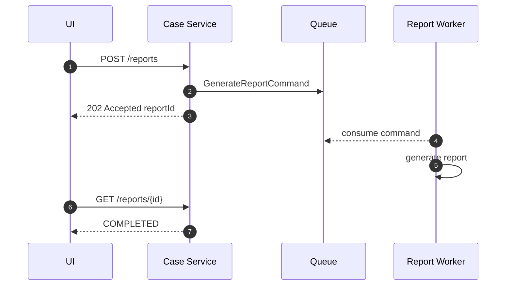

### 16.4 Search Index Update

Requirement:

- search index mengikuti perubahan case;
- boleh eventual consistent;
- perubahan bisa direplay jika index corrupt.

Pilihan:

```text
Event-carried state transfer with replayable log
```

Kenapa replayable?

Karena search index adalah projection. Projection yang sehat harus bisa dibangun ulang dari source event/data stream atau snapshot.

---

## 17. Naming Discipline

Nama adalah bagian dari contract.

### 17.1 Command Naming

Gunakan imperative verb:

```text
AuthorizePayment
GenerateReport
SendNotification
RecalculateRiskScore
AssignOfficer
```

### 17.2 Event Naming

Gunakan fakta lampau:

```text
PaymentAuthorized
ReportGenerated
NotificationSent
RiskScoreRecalculated
OfficerAssigned
```

### 17.3 Query Naming

Gunakan bentuk read:

```text
GetCaseSummary
FindEligibleOfficers
ListPendingReviews
SearchCases
```

### 17.4 Smell

Nama berikut sering menandakan semantik kabur:

```text
ProcessCaseEvent
HandlePaymentMessage
UpdateData
SyncSomething
CaseChanged
DoAction
```

`CaseChanged` terlalu umum. Apa yang berubah? Status? Assignee? Risk band? Document? Jurisdiction?

Nama yang terlalu umum membuat consumer melakukan parsing dan conditional logic yang rapuh.

---

## 18. Contract Surface per Pattern

Setiap pattern punya contract surface yang berbeda.

### 18.1 Request/Response Contract

Minimal:

- endpoint/method;
- request schema;
- response schema;
- status/error model;
- timeout expectation;
- idempotency rule;
- pagination rule jika list;
- compatibility policy.

### 18.2 Command Message Contract

Minimal:

- command type;
- command id;
- idempotency key;
- target aggregate/resource;
- requestedAt;
- expiresAt bila relevan;
- retry policy;
- failure event atau DLQ policy;
- correlation id;
- schema version.

### 18.3 Event Contract

Minimal:

- event id;
- event type;
- source;
- subject/aggregate id;
- occurredAt;
- aggregate version;
- schema version;
- payload;
- compatibility rule;
- retention/replay policy.

### 18.4 Stream Contract

Minimal:

- stream start semantics;
- item schema;
- ordering rule;
- backpressure mechanism;
- cancellation rule;
- heartbeat/keepalive;
- reconnect behavior;
- replay/resume token jika ada;
- max duration.

---

## 19. Decision Heuristic Cepat

Gunakan pertanyaan ini sebelum memilih teknologi:

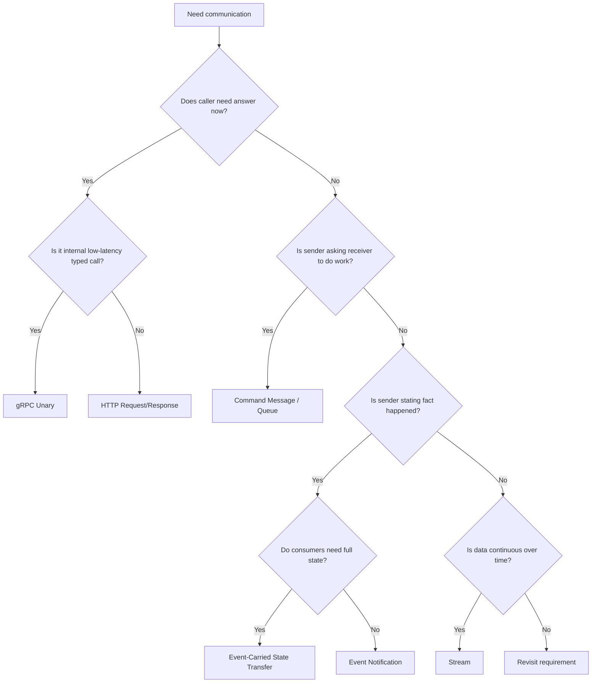

Heuristic ini tidak menggantikan desain, tetapi mencegah keputusan acak.

---

## 20. Smell Catalog

### 20.1 "Kita publish event supaya service lain melakukan aksi"

Kemungkinan itu command, bukan event.

### 20.2 "Queue menyelesaikan masalah reliability"

Queue hanya membantu jika ada idempotency, retry, DLQ, observability, dan kapasitas consumer.

### 20.3 "Kita async-kan supaya lebih scalable"

Async tidak otomatis scalable. Async menambah state, backlog, replay, monitoring, dan eventual consistency.

### 20.4 "gRPC lebih cepat, jadi pakai gRPC semua"

Latency bukan satu-satunya faktor. Debuggability, browser compatibility, gateway, contract evolution, dan team familiarity juga penting.

### 20.5 "Internal API tidak perlu contract jelas"

Internal API justru sering menjadi dependency paling kritis. Internal bukan berarti disposable.

### 20.6 "Consumer bisa call balik producer untuk detail"

Bisa, tetapi hitung fan-out, spike, caching, dan producer availability.

---

## 21. Implementation Skeleton: Communication Type as Code

Di sistem besar, taxonomy bisa dibuat eksplisit dalam code dan documentation.

```java
public enum CommunicationPattern {
    REQUEST_RESPONSE,
    RPC,
    COMMAND_MESSAGE,
    EVENT_NOTIFICATION,
    EVENT_CARRIED_STATE_TRANSFER,
    PUB_SUB,
    WORK_QUEUE,
    STREAM,
    CALLBACK,
    POLLING
}
```

Client registry internal:

```java
public record CommunicationBoundary(
    String name,
    String ownerService,
    String consumerService,
    CommunicationPattern pattern,
    Duration timeoutBudget,
    boolean idempotent,
    boolean replayable,
    String contractLocation
) {}
```

Contoh:

```java
CommunicationBoundary eligibilityCheck = new CommunicationBoundary(
    "case-to-eligibility-check",
    "case-service",
    "eligibility-service",
    CommunicationPattern.REQUEST_RESPONSE,
    Duration.ofMillis(300),
    true,
    false,
    "contracts/openapi/eligibility.yaml"
);
```

Kenapa ini berguna?

Karena boundary yang tertulis sebagai metadata bisa dipakai untuk:

- architecture review;
- dependency map;
- timeout audit;
- contract ownership;
- incident analysis;
- migration planning;
- risk scoring.

---

## 22. Mini Case Study: Regulatory Case Assignment

Bayangkan sistem enforcement lifecycle.

Saat case baru masuk:

1. validate applicant/case metadata;
2. calculate risk band;
3. assign officer;
4. notify officer;
5. write audit trail;
6. update search index;
7. generate initial case packet.

Naifnya semua dilakukan sinkron:

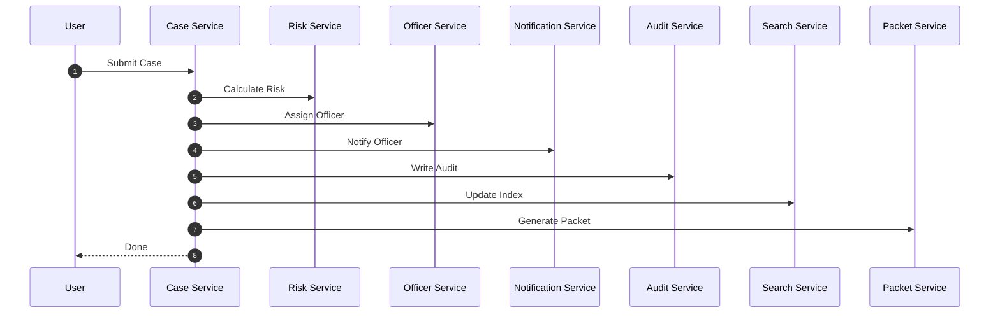

Ini buruk karena user flow bergantung pada terlalu banyak service.

Versi taxonomy-aware:

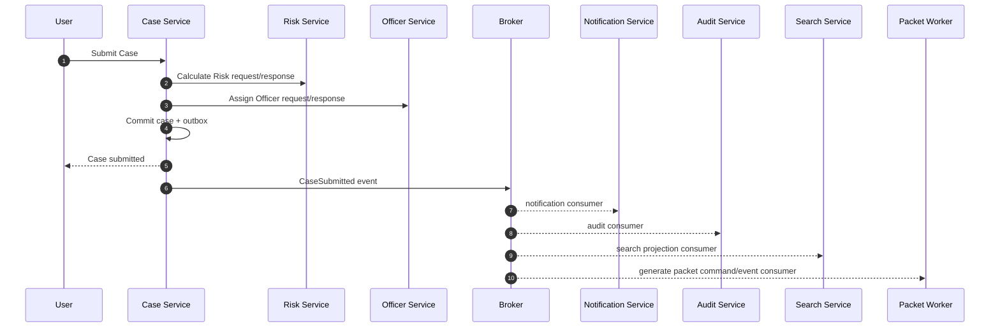

Synchronous tetap ada untuk decision yang wajib. Async dipakai untuk side effects dan projections.

Ini bukan dogma. Ini boundary design.

---

## 23. Checklist Review

Sebelum menyetujui desain komunikasi, jawab:

- Apakah ini call, command, event, stream, callback, atau polling?
- Apakah nama payload sesuai semantik?
- Apakah sender butuh hasil sekarang?
- Siapa receiver yang diketahui?
- Apakah consumer boleh lebih dari satu?
- Apakah duplicate mungkin terjadi?
- Apakah operasi idempotent?
- Siapa yang melakukan retry?
- Bagaimana timeout/deadline ditentukan?
- Bagaimana failure terlihat?
- Bagaimana message lama diproses?
- Apakah urutan penting?
- Apakah event membawa state atau hanya notifikasi?
- Apakah ada replay strategy?
- Apakah ada contract document?
- Apakah observability mencakup end-to-end path?

Jika jawaban tidak jelas, desain belum siap.

---

## 24. Latihan

Ambil satu flow produksi yang kamu kenal. Pecah setiap komunikasi menjadi tabel berikut:

| Step | Sender | Receiver | Intent | Pattern | Sync/Async | Retry? | Idempotent? | Contract |
|---|---|---|---|---|---|---|---|---|
| 1 |  |  |  |  |  |  |  |  |
| 2 |  |  |  |  |  |  |  |  |
| 3 |  |  |  |  |  |  |  |  |

Kemudian cari smell:

- event yang ternyata command;
- sync call yang hanya side effect;
- queue tanpa idempotency;
- callback tanpa retry signature;
- stream tanpa backpressure;
- polling tanpa rate limit;
- pub/sub tanpa owner contract.

---

## 25. Ringkasan

Taxonomy komunikasi adalah cara untuk menjaga desain tetap jujur.

- **Request/response** cocok untuk kebutuhan jawaban langsung.
- **RPC** cocok untuk internal typed call, tetapi jangan sampai remote terasa seperti local.
- **Fire-and-forget** harus diperlakukan sebagai send-and-observe-later.
- **Command message** meminta aksi; jangan disamarkan sebagai event.
- **Event notification** memberi tahu fakta ringan, tetapi bisa memicu callback storm.
- **Event-carried state transfer** mengurangi callback tetapi memperbesar kontrak payload.
- **Pub/sub** mengurangi direct coupling tetapi tetap menciptakan semantic contract.
- **Queue** membantu work distribution, bukan menyelesaikan kapasitas secara ajaib.
- **Streaming** membutuhkan backpressure, cancellation, dan reconnect semantics.
- **Callback** berguna tetapi menciptakan dependency dua arah.
- **Polling** valid jika punya interval, TTL, dan rate limit.

Mental model terpenting:

> Jangan mulai dari teknologi. Mulai dari bentuk ketergantungan.

---

## References

- RFC 9110 — HTTP Semantics: https://www.rfc-editor.org/rfc/rfc9110.html
- gRPC Core Concepts: https://grpc.io/docs/what-is-grpc/core-concepts/
- CloudEvents Specification: https://cloudevents.io/
- AsyncAPI Specification: https://www.asyncapi.com/docs/reference/specification/latest
- Apache Kafka Documentation: https://kafka.apache.org/documentation/
- RabbitMQ AMQP 0-9-1 Model: https://www.rabbitmq.com/tutorials/amqp-concepts
- Reactive Streams: https://www.reactive-streams.org/
