# Part 004 — Sync vs Async Decision Model

> Target part ini: memberi model keputusan yang bisa dipakai di design review.
>
> Setelah membaca part ini, kamu harus bisa menolak kalimat seperti _"pakai async biar scalable"_ atau _"pakai sync biar simple"_ jika tidak didukung oleh invariant, latency budget, consistency requirement, dan failure model.

---

## 1. Masalah yang Sering Salah Dibingkai

Pertanyaan yang sering muncul:

> "Sebaiknya service ini komunikasi sync atau async?"

Pertanyaan ini belum cukup tajam. Versi yang lebih benar:

> _"Pada titik keputusan ini, apakah caller membutuhkan hasil remote sekarang untuk menjaga invariant bisnis, atau intent bisa dicatat lalu diproses terpisah dengan consistency model yang eksplisit?"_

Sync dan async bukan sekadar pilihan performa.

Sync adalah pilihan untuk mempertahankan **kontrol langsung**.

Async adalah pilihan untuk memisahkan **waktu penerimaan intent** dari **waktu penyelesaian efek**.

Keduanya bisa benar. Keduanya bisa salah.

---

## 2. Definisi Operasional

Dalam seri ini:

| Mode | Definisi |
|---|---|
| Synchronous | Caller menunggu response dari dependency sebelum melanjutkan decision lokal |
| Asynchronous | Caller mencatat/mengirim intent/fact dan melanjutkan tanpa menunggu efek final selesai |

Yang penting: async bukan berarti cepat. Async berarti **decoupled in time**.

Sebuah request async bisa selesai lebih lambat secara end-to-end daripada sync. Bedanya, caller tidak menunggu sampai efek akhir selesai.

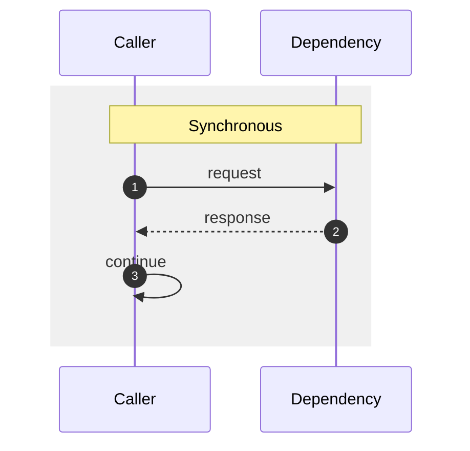

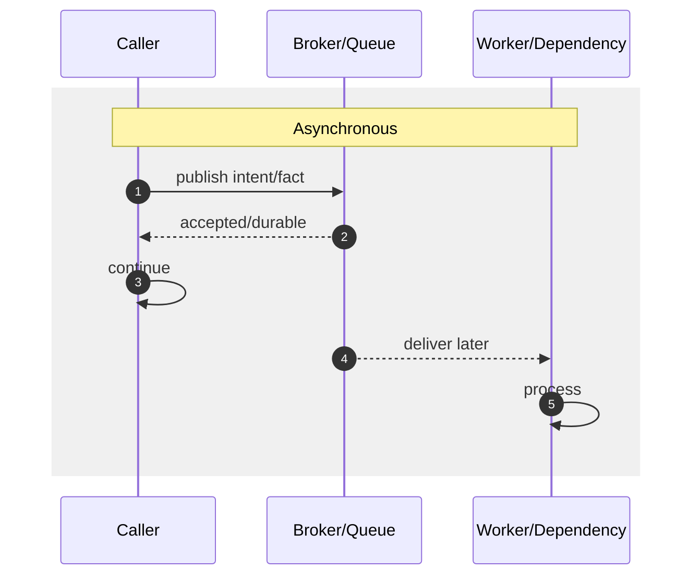

---

## 3. The Core Decision

Gunakan aturan awal ini:

> Jika hasil remote dibutuhkan untuk memutuskan response atau menjaga invariant saat itu juga, mulai dari sync.
>
> Jika yang dibutuhkan hanya memastikan intent/fact tercatat secara durable, mulai dari async.

Tetapi aturan ini hanya titik awal. Keputusan final harus melewati beberapa axis.

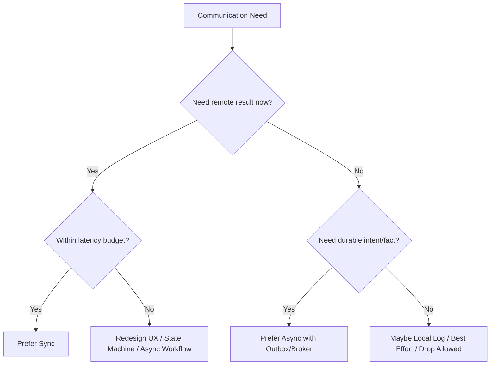

---

## 4. Axis 1 — Business Invariant

Invariant adalah aturan yang tidak boleh dilanggar.

Contoh invariant:

- case tidak boleh disubmit jika applicant tidak eligible;
- payment tidak boleh dicapture sebelum authorized;
- officer tidak boleh assigned jika tidak punya jurisdiction;
- license tidak boleh approved jika mandatory document belum verified;
- enforcement action tidak boleh dieksekusi jika hold order aktif.

Jika invariant membutuhkan data/keputusan dari service lain, sync sering lebih natural.

### 4.1 Sync untuk Invariant Kuat

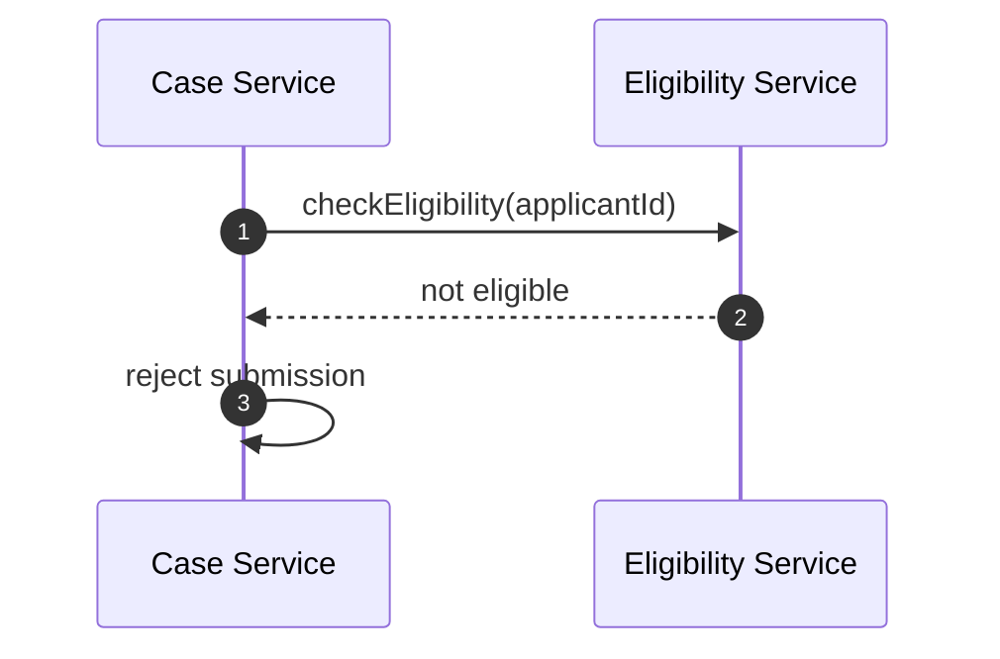

Java shape:

```java
public SubmitCaseResult submit(SubmitCaseCommand command) {
    EligibilityDecision eligibility = eligibilityClient.check(
        command.applicantId(),
        Deadline.after(Duration.ofMillis(250))
    );

    if (!eligibility.eligible()) {
        return SubmitCaseResult.rejected(eligibility.reason());
    }

    CaseEntity entity = CaseEntity.submitted(command);
    repository.save(entity);
    return SubmitCaseResult.accepted(entity.caseId());
}
```

Di sini async akan mengubah domain state menjadi lebih kompleks:

```text
SUBMISSION_RECEIVED -> WAITING_ELIGIBILITY -> ACCEPTED/REJECTED
```

Itu bisa benar jika eligibility lambat, tetapi jangan menyebutnya sederhana.

### 4.2 Async untuk Invariant yang Bisa Ditunda

Jika invariant tidak harus diputuskan saat request awal, async bisa lebih baik.

Contoh:

- case boleh diterima sebagai draft/submitted;
- risk score boleh dihitung setelah submission;
- officer assignment boleh terjadi beberapa detik kemudian;
- notification boleh menyusul.

State model:

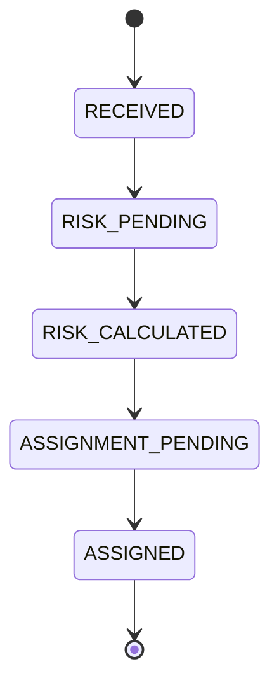

Async bukan menghilangkan invariant. Async memindahkan invariant ke state transition yang eksplisit.

---

## 5. Axis 2 — User Waiting Boundary

Pertanyaan:

> Apakah manusia atau upstream system sedang menunggu hasil ini?

Jika user menunggu di UI, sync panjang memperburuk UX dan reliability. Tetapi async juga menambah kompleksitas status.

### 5.1 Tiga Model UX

| Model | Cocok untuk | Communication |
|---|---|---|
| Immediate answer | Validasi cepat, decision cepat | Sync |
| Accepted + status | Proses lama, report generation | Async command + polling/SSE |
| Background update | Side effects, projection, notification | Event async |

### 5.2 HTTP 202 Pattern

Untuk proses lama:

```http
POST /case-packets HTTP/1.1
Content-Type: application/json

{
  "caseId": "CASE-1001"
}
```

Response:

```http
HTTP/1.1 202 Accepted
Location: /case-packets/PKT-9001
Retry-After: 5
```

Status endpoint:

```http
GET /case-packets/PKT-9001 HTTP/1.1
```

Response:

```json
{
  "packetId": "PKT-9001",
  "status": "PROCESSING",
  "createdAt": "2026-07-05T10:00:00Z",
  "estimatedCompletionSeconds": 20
}
```

Java handler shape:

```java
@PostMapping("/case-packets")
public ResponseEntity<CreatePacketResponse> create(@RequestBody CreatePacketRequest request) {
    PacketJob job = packetApplicationService.requestGeneration(request.caseId());

    URI location = URI.create("/case-packets/" + job.packetId());

    return ResponseEntity.accepted()
        .location(location)
        .header("Retry-After", "5")
        .body(new CreatePacketResponse(job.packetId(), job.status()));
}
```

---

## 6. Axis 3 — Latency Budget

Sync communication harus tunduk pada latency budget.

Budget bukan harapan. Budget adalah batas desain.

Contoh:

```text
User-facing submit API budget: 800 ms p95
- Gateway/security/filter: 50 ms
- Case service local validation: 80 ms
- DB transaction: 120 ms
- Eligibility call: 250 ms
- Risk call: 200 ms
- Serialization/network margin: 100 ms
```

Jika dependency membutuhkan 2 detik, jangan masukkan ke sync path user-facing kecuali memang product requirement menerimanya.

### 6.1 Sequential Call Budget

```java
EligibilityDecision eligibility = eligibilityClient.check(command);
RiskScore risk = riskClient.score(command);
Officer officer = officerClient.assign(command);
```

Total latency kira-kira penjumlahan.

```text
T_total ≈ T_eligibility + T_risk + T_officer + overhead
```

### 6.2 Parallel Call Budget

```java
CompletableFuture<EligibilityDecision> eligibility = eligibilityClient.checkAsync(command);
CompletableFuture<RiskScore> risk = riskClient.scoreAsync(command);

EligibilityDecision e = eligibility.get(250, TimeUnit.MILLISECONDS);
RiskScore r = risk.get(250, TimeUnit.MILLISECONDS);
```

Total latency kira-kira max dependency, tetapi load fan-out tetap bertambah.

```text
T_total ≈ max(T_eligibility, T_risk) + coordination overhead
```

Parallel sync call adalah optimization, bukan pengganti dependency design.

### 6.3 Async untuk Latency Shaping

Jika efek tidak harus selesai dalam response, pindahkan dari sync path.

```java
@Transactional
public SubmitCaseResult submit(SubmitCaseCommand command) {
    CaseEntity entity = CaseEntity.submitted(command);
    repository.save(entity);

    outbox.append(CaseSubmitted.from(entity));

    return SubmitCaseResult.accepted(entity.caseId());
}
```

Response cepat bukan karena pekerjaan hilang, tetapi karena pekerjaan dipisah dari user waiting boundary.

---

## 7. Axis 4 — Consistency Requirement

Sync sering dipilih karena orang ingin consistency kuat. Tetapi sync call antar service tidak otomatis memberi distributed transaction.

Contoh:

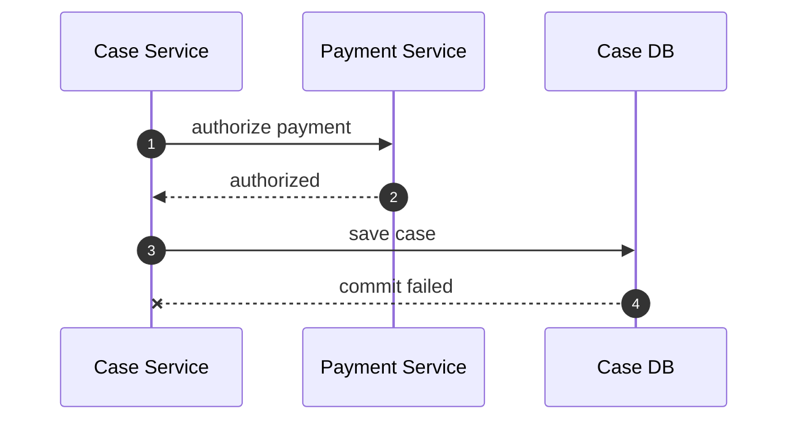

Payment authorized, case gagal disimpan. Sync tidak menyelesaikan atomicity lintas service.

### 7.1 Tiga Pertanyaan Consistency

| Pertanyaan | Implikasi |
|---|---|
| Apakah harus atomic lintas service? | Hindari jika mungkin; butuh saga/compensation bila tidak bisa |
| Apakah boleh eventual consistent? | Async event/message sering cocok |
| Apakah user perlu melihat status intermediate? | Butuh state machine eksplisit |

### 7.2 State Machine Lebih Jujur daripada Sync Palsu

Daripada berpura-pura operasi lintas service atomic:

```text
APPROVED -> PAYMENT_PENDING -> PAYMENT_AUTHORIZED -> ACTIVATED
                         \-> PAYMENT_FAILED -> APPROVAL_REQUIRES_REVIEW
```

Mermaid:

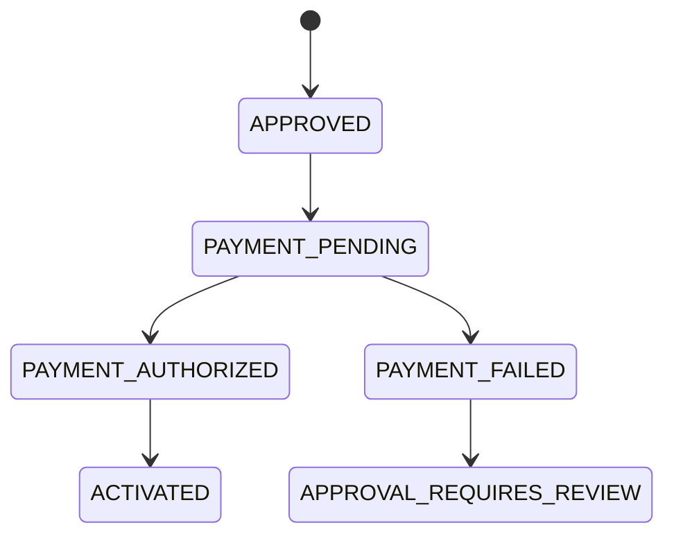

Async memaksa kamu mendesain state. Itu biaya, tapi juga kejujuran.

---

## 8. Axis 5 — Failure Ownership

Dalam sync, caller biasanya memiliki failure handling langsung.

Dalam async, failure handling berpindah ke pipeline: broker, consumer, retry topic, DLQ, reprocessor, atau operator.

### 8.1 Sync Failure

```java
try {
    RiskScore score = riskClient.calculate(command);
    return Decision.withRisk(score);
} catch (TimeoutException e) {
    return Decision.manualReview("RISK_TIMEOUT");
}
```

Caller bisa mengambil fallback segera.

### 8.2 Async Failure

```java
public void handle(CaseSubmitted event) {
    try {
        RiskScore score = riskCalculator.calculate(event.caseId());
        publisher.publish(RiskCalculated.from(event, score));
    } catch (Exception e) {
        throw e; // broker/container retry policy takes over
    }
}
```

Failure tidak terlihat oleh original caller. Maka harus ada:

- retry policy;
- DLQ;
- alerting;
- manual reprocess;
- idempotency;
- poison message strategy;
- business status visibility.

### 8.3 Ownership Matrix

| Failure | Sync owner | Async owner |
|---|---|---|
| Timeout | Caller | Consumer/platform jika during processing |
| Publish failure | Caller | Producer/outbox relay |
| Processing failure | Caller sees error | Consumer retry/DLQ |
| Duplicate | Caller retry policy | Consumer idempotency |
| Slow dependency | Caller timeout/bulkhead | Backlog/backpressure |
| User visibility | Immediate error | Status/projection/notification |

---

## 9. Axis 6 — Backpressure

Backpressure adalah kemampuan sistem lambat memberi sinyal agar upstream tidak terus menambah beban tanpa batas.

### 9.1 Sync Backpressure

Dalam sync, backpressure sering muncul sebagai:

- timeout;
- `429 Too Many Requests`;
- `503 Service Unavailable`;
- connection pool saturation;
- circuit breaker open;
- thread pool rejection.

Caller merasakan gagal atau lambat.

### 9.2 Async Backpressure

Dalam async, backpressure muncul sebagai:

- queue backlog naik;
- consumer lag;
- oldest message age naik;
- broker storage meningkat;
- DLQ meningkat;
- delayed business effect.

Async dapat menyerap spike, tetapi tidak menghapus limit kapasitas.

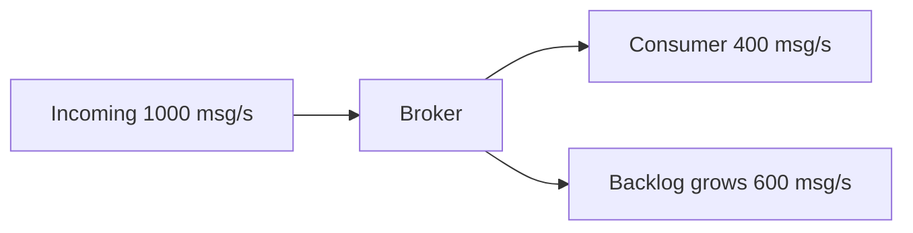

Jika kondisi ini berlangsung terus, backlog menjadi debt.

### 9.3 Rule

Pilih async jika kamu siap mengoperasikan backlog sebagai first-class signal.

Jika tidak ada dashboard untuk oldest message age, retry rate, DLQ, dan consumer lag, async system kamu buta.

---

## 10. Axis 7 — Fan-Out

Fan-out adalah jumlah dependency yang dipanggil dari satu operation.

### 10.1 Sync Fan-Out

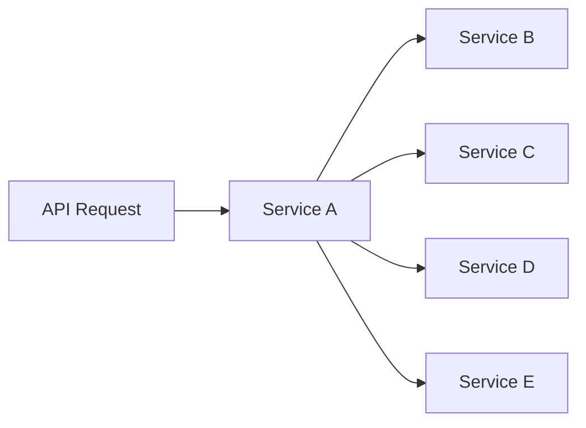

Masalah:

- latency naik;
- availability path turun;
- blast radius besar;
- retry amplification;
- tracing sulit;
- downstream overload.

### 10.2 Async Fan-Out

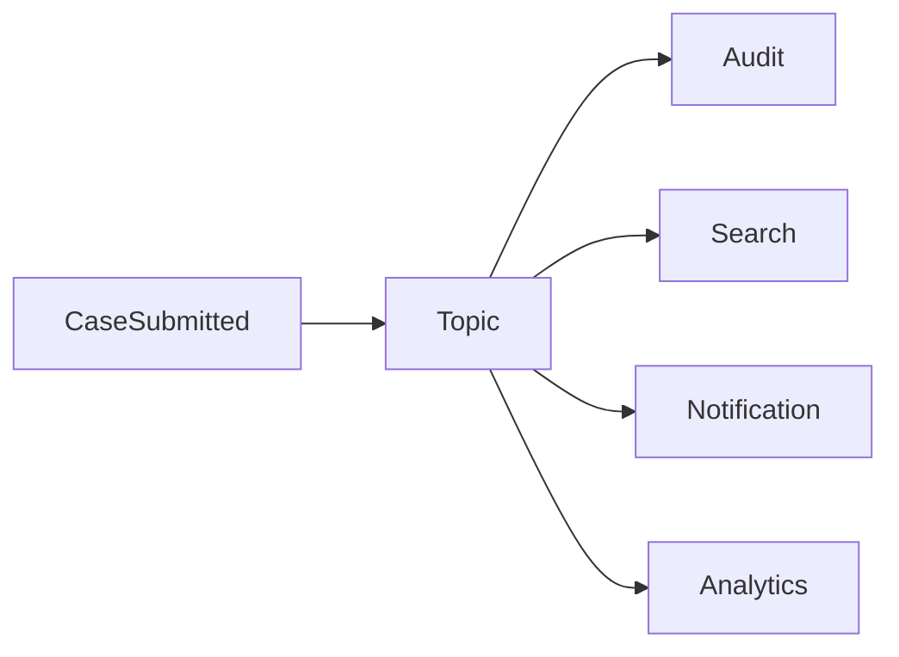

Async fan-out memindahkan coupling ke event contract dan broker.

### 10.3 Rule

Jika satu fakta perlu diketahui banyak service, event/pub-sub biasanya lebih baik daripada caller memanggil semuanya satu per satu.

Buruk:

```java
notificationClient.notify(caseId);
auditClient.record(caseId);
searchClient.update(caseId);
analyticsClient.track(caseId);
```

Lebih baik:

```java
outbox.append(CaseSubmitted.from(caseEntity));
```

Lalu consumer masing-masing melakukan tugasnya.

---

## 11. Axis 8 — Retriability and Idempotency

Sync dan async sama-sama butuh idempotency, tetapi bentuknya berbeda.

### 11.1 Sync Idempotency

Untuk command HTTP:

```http
POST /payments/authorizations HTTP/1.1
Idempotency-Key: order-ORD-1001-payment-auth
```

Server menyimpan hasil untuk key tersebut.

```java
public PaymentAuthorization authorize(AuthorizePaymentRequest request, String idempotencyKey) {
    return idempotencyStore.find(idempotencyKey)
        .orElseGet(() -> {
            PaymentAuthorization result = processor.authorize(request);
            idempotencyStore.save(idempotencyKey, result);
            return result;
        });
}
```

### 11.2 Async Idempotency

Untuk consumer:

```java
public void consume(CaseSubmitted event) {
    if (processedMessageStore.exists(event.eventId())) {
        return;
    }

    projection.apply(event);
    processedMessageStore.markProcessed(event.eventId());
}
```

Masalahnya, `apply` dan `markProcessed` harus dipikirkan transaction boundary-nya. Jika `apply` sukses lalu `markProcessed` gagal, event bisa diproses ulang.

Karena itu idempotency sebaiknya berbasis business key/version juga, bukan hanya message id.

```java
public void apply(CaseStatusChanged event) {
    CaseProjection current = projectionRepository.find(event.caseId());

    if (current.version() >= event.aggregateVersion()) {
        return;
    }

    projectionRepository.updateToVersion(event.caseId(), event.newStatus(), event.aggregateVersion());
}
```

---

## 12. Axis 9 — Operational Complexity

Sync lebih mudah dipahami di code path, tetapi lebih rapuh terhadap runtime dependency.

Async lebih tahan terhadap dependency outage sementara, tetapi lebih rumit di operasi.

| Area | Sync | Async |
|---|---|---|
| Code flow | Lebih linear | Lebih tersebar |
| User feedback | Langsung | Butuh status/projection |
| Failure | Langsung terlihat | Bisa tersembunyi di backlog/DLQ |
| Latency | Caller terdampak | Caller bisa cepat, completion belakangan |
| Debugging | Trace request | Trace + message correlation + replay |
| Capacity | Thread/pool/dependency | Broker + consumer + lag |
| Consistency | Bisa terlihat kuat, tapi tidak atomic otomatis | Eventual consistency eksplisit |
| Recovery | Retry caller/manual | Replay/reprocess/DLQ |

Tidak ada pilihan gratis.

Top engineer tidak bertanya _"mana lebih modern"_. Ia bertanya:

> _"Failure mode mana yang lebih bisa kita kendalikan untuk requirement ini?"_

---

## 13. Decision Table

Gunakan tabel ini sebagai starting point.

| Requirement | Prefer | Kenapa |
|---|---|---|
| Butuh jawaban untuk response user | Sync | Caller tidak bisa lanjut tanpa hasil |
| Proses > latency budget | Async | Jangan tahan request/thread/connection |
| Banyak consumer butuh fakta yang sama | Async event/pub-sub | Hindari sync fan-out |
| Side effect tidak kritis untuk response | Async | Pisahkan primary path dari secondary effect |
| Invariant harus dijaga sekarang | Sync atau local ownership | Perlu decision sebelum commit |
| Downstream sering lambat/tidak stabil | Async dengan durable queue | Isolasi sementara, asal backlog dioperasikan |
| Hasil perlu dilihat user nanti | Async + status resource | Explicit lifecycle |
| Harus strongly typed internal low-latency | gRPC sync | Cocok untuk internal RPC |
| Consumer harus membangun projection | Async event-carried state | Eventual consistency/replay |
| Update realtime ke UI | Stream/SSE/WebSocket | Long-lived delivery |

---

## 14. Decision Tree Produksi

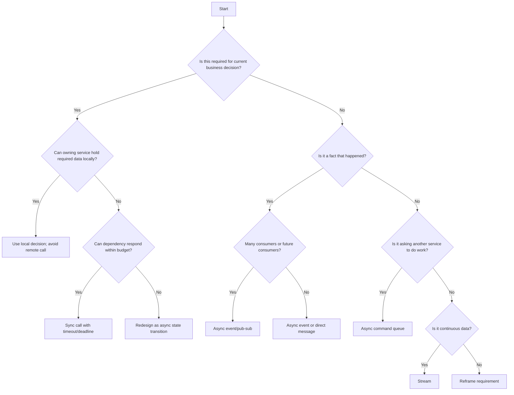

---

## 15. Hybrid Patterns

Real systems sering hybrid. Jangan paksa satu flow menjadi sync semua atau async semua.

### 15.1 Sync Front, Async Tail

Pattern paling umum:

1. validasi wajib secara sync;
2. commit state lokal;
3. publish event via outbox;
4. side effects async.

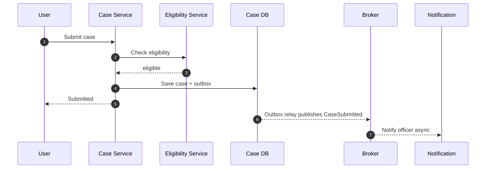

Java application service:

```java
@Transactional
public SubmitCaseResult submit(SubmitCaseCommand command) {
    EligibilityDecision eligibility = eligibilityClient.check(
        command.applicantId(),
        Deadline.after(Duration.ofMillis(250))
    );

    if (!eligibility.eligible()) {
        return SubmitCaseResult.rejected(eligibility.reason());
    }

    CaseEntity caseEntity = CaseEntity.submit(command);
    caseRepository.save(caseEntity);
    outboxRepository.append(CaseSubmitted.from(caseEntity));

    return SubmitCaseResult.submitted(caseEntity.caseId());
}
```

### 15.2 Async Front, Sync Worker

API menerima intent cepat, worker melakukan sync call ke dependency.

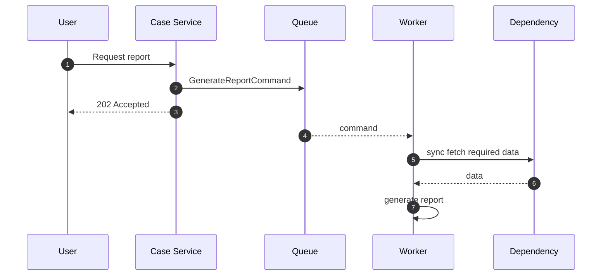

Ini cocok untuk proses lama, tetapi worker tetap butuh timeout/retry/bulkhead.

### 15.3 Sync Ack, Async Completion

Service memberikan ack bahwa pekerjaan diterima, bukan selesai.

```json
{
  "jobId": "JOB-1001",
  "status": "ACCEPTED",
  "statusUrl": "/jobs/JOB-1001"
}
```

Jangan menamai response sebagai `success=true` jika yang sukses hanya penerimaan job.

Lebih jujur:

```json
{
  "accepted": true,
  "completed": false,
  "jobId": "JOB-1001"
}
```

---

## 16. Anti-Patterns

### 16.1 Async untuk Menghindari Desain Domain

Gejala:

```text
"Kita publish event saja, nanti service lain urus."
```

Pertanyaan balasan:

- event apa?
- fakta apa yang sudah terjadi?
- siapa owner state?
- bagaimana jika consumer gagal?
- bagaimana user tahu status?
- apakah ada compensation?

Async tidak menggantikan domain modeling.

### 16.2 Sync untuk Semua Hal Karena Mudah Debug

Gejala:

```text
"Panggil langsung saja biar jelas kalau gagal."
```

Ini bisa membuat primary path bergantung ke audit, notification, reporting, analytics, search, dan PDF generation.

Hasilnya: satu fitur user menjadi rapuh karena side effect non-critical.

### 16.3 Async Tanpa Durable Boundary

Buruk:

```java
repository.save(caseEntity);
eventPublisher.publish(new CaseSubmitted(caseEntity.id()));
```

Jika `save` sukses dan `publish` gagal, event hilang.

Lebih kuat:

```java
@Transactional
public void submit(SubmitCaseCommand command) {
    CaseEntity entity = CaseEntity.submit(command);
    repository.save(entity);
    outbox.save(CaseSubmitted.from(entity));
}
```

Outbox relay publish setelah commit.

### 16.4 Sync Retry Tanpa Budget

Buruk:

```java
@Retryable(maxAttempts = 5)
public RiskScore calculateRisk(String caseId) {
    return riskClient.calculate(caseId);
}
```

Jika timeout per attempt 2 detik, worst case bisa >10 detik plus backoff. Ini bisa menghancurkan thread pool.

Lebih baik:

```java
CallPolicy policy = CallPolicy.builder()
    .totalDeadline(Duration.ofMillis(400))
    .maxAttempts(2)
    .backoff(Duration.ofMillis(30), Duration.ofMillis(80))
    .jitter(true)
    .build();
```

Retry harus tunduk pada total deadline.

### 16.5 Queue Tanpa Expiry

Command lama bisa menjadi berbahaya.

Contoh: `AssignOfficerCommand` yang diproses 2 hari kemudian padahal case sudah closed.

Tambahkan expiry:

```java
public record AssignOfficerCommand(
    String commandId,
    String caseId,
    String officerId,
    Instant requestedAt,
    Instant expiresAt,
    String idempotencyKey
) {}
```

Handler:

```java
if (Instant.now().isAfter(command.expiresAt())) {
    metrics.increment("command.expired", "type", "AssignOfficer");
    return;
}
```

---

## 17. Sync Design Checklist

Jika memilih sync, pastikan:

- caller benar-benar butuh hasil sekarang;
- ada total deadline;
- connect/read/write timeout jelas;
- retry dibatasi dan pakai backoff+jitter;
- operasi retryable secara semantik;
- circuit breaker/bulkhead dipertimbangkan;
- fallback jelas;
- error model membedakan business failure vs technical failure;
- trace context dipropagasikan;
- dependency SLO diketahui;
- fan-out dihitung;
- p95/p99 latency masuk budget;
- load test mencakup downstream lambat;
- response tidak menyembunyikan partial failure.

Template:

```yaml
syncBoundary:
  name: case-to-risk-score
  caller: case-service
  callee: risk-service
  reason: risk score required before review routing
  deadlineMs: 250
  maxAttempts: 2
  retryableErrors:
    - UNAVAILABLE
    - timeout-before-processing
  nonRetryableErrors:
    - validation_failed
    - applicant_not_found
  fallback: route_to_manual_review
  idempotent: true
  observability:
    metrics:
      - latency
      - timeout_count
      - retry_count
      - circuit_open_count
    tracing: required
```

---

## 18. Async Design Checklist

Jika memilih async, pastikan:

- intent/fact disimpan durable;
- producer dan consumer contract jelas;
- message punya id unik;
- idempotency key tersedia;
- ordering requirement didefinisikan;
- retry policy jelas;
- DLQ/parking lot tersedia;
- poison message strategy ada;
- expiry untuk command yang bisa basi;
- backlog/lag/oldest age dimonitor;
- replay procedure tersedia;
- consumer version compatibility dipikirkan;
- user-visible status tersedia jika efek penting;
- duplicate effect dicegah;
- correlation id dipropagasikan;
- schema evolution policy jelas.

Template:

```yaml
asyncBoundary:
  name: case-submitted-event
  producer: case-service
  pattern: event-carried-state-transfer
  broker: kafka
  topic: case.events.v1
  eventType: CaseSubmitted
  key: caseId
  orderingScope: per-case
  delivery: at-least-once
  idempotency: eventId + aggregateVersion
  retention: 7d
  replayable: true
  consumers:
    - audit-service
    - search-indexer
    - notification-service
  observability:
    metrics:
      - publish_rate
      - consumer_lag
      - oldest_message_age
      - dlq_count
      - replay_count
```

---

## 19. Mini Case Study: Enforcement Action Approval

### 19.1 Requirement

Saat officer approve enforcement action:

1. action harus valid untuk jurisdiction;
2. active hold order harus dicek;
3. action disimpan;
4. audit trail wajib tercatat;
5. notification dikirim;
6. search index diperbarui;
7. external regulator feed dikirim.

### 19.2 Naive Sync Design

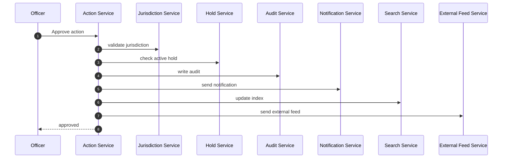

Masalah:

- approval bergantung ke terlalu banyak service;
- external feed bisa membuat approval gagal;
- notification outage menghambat aksi utama;
- audit sync mungkin terlihat aman, tapi jika audit service down approval tidak bisa jalan;
- retry bisa menggandakan external feed.

### 19.3 Better Hybrid Design

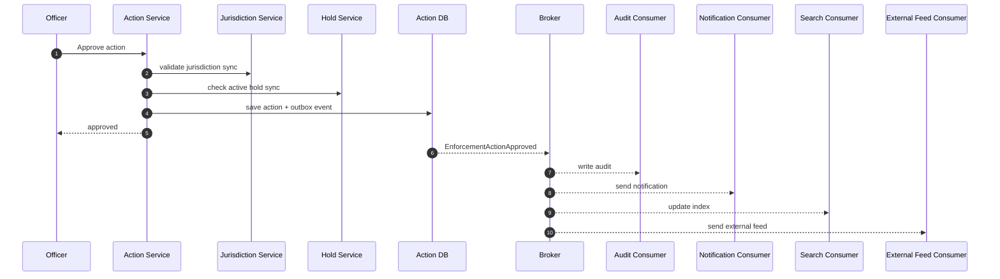

Why:

- jurisdiction dan hold adalah gating invariants;
- audit/search/notification/feed adalah effects setelah fakta approval terjadi;
- event menjadi durable fact;
- consumer failure tidak membatalkan fakta approval;
- external feed bisa retry/reprocess secara terisolasi.

### 19.4 Audit Wajib Bagaimana?

Jika audit benar-benar wajib secara regulatory, jangan langsung simpulkan harus sync ke audit service. Alternatif lebih kuat:

- action service menulis audit record/outbox dalam transaction lokal;
- audit service membangun immutable audit projection dari event;
- ada reconciliation job memastikan semua action punya audit projection;
- approval response hanya keluar setelah local durable audit intent tersimpan.

Invariant-nya bukan "audit service menerima HTTP call".

Invariant-nya:

> _Tidak ada approved action tanpa durable audit fact._

Itu bisa dipenuhi dengan local transaction + outbox.

---

## 20. Java Policy Abstraction

Agar keputusan sync/async tidak tersebar acak, buat boundary policy.

```java
public sealed interface CommunicationMode permits SyncMode, AsyncMode {
    String boundaryName();
}

public record SyncMode(
    String boundaryName,
    Duration deadline,
    int maxAttempts,
    boolean circuitBreakerEnabled
) implements CommunicationMode {}

public record AsyncMode(
    String boundaryName,
    String channel,
    DeliverySemantics deliverySemantics,
    boolean replayable,
    Duration maxMessageAge
) implements CommunicationMode {}

enum DeliverySemantics {
    AT_MOST_ONCE,
    AT_LEAST_ONCE,
    EFFECTIVELY_ONCE_BY_IDEMPOTENCY
}
```

Usage:

```java
SyncMode riskPolicy = new SyncMode(
    "case-to-risk",
    Duration.ofMillis(250),
    2,
    true
);

AsyncMode caseSubmittedPolicy = new AsyncMode(
    "case-submitted-event",
    "case.events.v1",
    DeliverySemantics.AT_LEAST_ONCE,
    true,
    Duration.ofDays(7)
);
```

Policy as code membantu architecture review dan runtime configuration tetap konsisten.

---

## 21. Review Questions for Design Meeting

Gunakan pertanyaan ini saat design review:

1. Apa invariant yang sedang dijaga?
2. Apakah remote result dibutuhkan sebelum commit/response?
3. Berapa latency budget total?
4. Apa yang terjadi jika dependency timeout?
5. Apakah operasi aman di-retry?
6. Apakah duplicate menghasilkan efek bisnis ganda?
7. Jika async, bagaimana user melihat progress/failure?
8. Jika async, apa oldest acceptable message age?
9. Jika sync, berapa fan-out maksimum?
10. Siapa owner contract?
11. Bagaimana schema berubah tanpa merusak consumer?
12. Apakah failure masuk trace/log/metric?
13. Apakah ada manual recovery path?
14. Apakah desain ini tetap benar saat traffic 10x?
15. Apakah desain ini tetap benar saat dependency down 30 menit?

Pertanyaan terakhir penting. Banyak desain hanya benar saat semua service sehat.

---

## 22. Rule of Thumb yang Lebih Tajam

Jangan pakai rule seperti:

```text
Async = scalable
Sync = simple
Kafka = reliable
HTTP = easy
```

Gunakan rule yang lebih jujur:

| Rule | Makna |
|---|---|
| Sync when decision needs remote result now | Cocok untuk gating decision |
| Async when intent/fact can be durable and completed later | Cocok untuk side effect/workflow/projection |
| Local state beats remote call for hot decisions | Kurangi runtime dependency |
| Outbox beats best-effort publish | Hindari lost event |
| Idempotency beats hope | Duplicate pasti terjadi di sistem nyata |
| Status resource beats hidden async failure | User/operator butuh visibility |
| Deadline beats infinite wait | Resource harus punya batas |
| Backlog age beats queue depth alone | Umur pekerjaan lebih penting dari jumlah saja |
| State machine beats fake atomicity | Distributed workflow harus eksplisit |

---

## 23. Latihan

Ambil satu use case: `Approve Case`, `Submit Payment`, `Generate Report`, atau `Assign Officer`.

Isi worksheet berikut:

```yaml
useCase: approve-enforcement-action
primaryInvariant:
  - action cannot be approved under active hold order
syncSteps:
  - name:
    reason:
    deadlineMs:
    fallback:
asyncSteps:
  - name:
    pattern:
    durability:
    idempotency:
    userVisibleStatus:
failureScenarios:
  - dependencyDown:
  - duplicateMessage:
  - delayedProcessing:
  - partialCompletion:
observability:
  metrics:
  traces:
  logs:
  alerts:
```

Kemudian ubah desain dengan constraint:

1. dependency risk service p95 naik dari 100 ms menjadi 2 detik;
2. notification service down 1 jam;
3. broker menerima duplicate event;
4. external regulator endpoint timeout 30% request;
5. user menekan submit dua kali.

Desain yang bagus tidak hanya menjawab happy path.

---

## 24. Ringkasan

Sync vs async bukan pilihan gaya. Itu pilihan failure model.

- Sync memberi kontrol langsung, tetapi menciptakan runtime coupling.
- Async memisahkan waktu, tetapi menambah state, backlog, replay, dan observability burden.
- Sync tidak otomatis atomic lintas service.
- Async tidak otomatis reliable tanpa durable publish, idempotency, retry, DLQ, dan monitoring.
- Keputusan harus dimulai dari invariant, latency budget, consistency requirement, failure ownership, fan-out, dan operability.
- Hybrid pattern sering paling realistis: sync untuk gating decision, async untuk side effect dan projection.

Mental model utama:

> Pilih sync atau async berdasarkan konsekuensi yang siap kamu operasikan, bukan berdasarkan teknologi yang sedang populer.

---

## References

- RFC 9110 — HTTP Semantics: https://www.rfc-editor.org/rfc/rfc9110.html
- AWS Builders Library — Timeouts, retries, and backoff with jitter: https://builder.aws.com/content/3EumjoZascWd1oZiEgL8ORlv3qE/timeouts-retries-and-backoff-with-jitter
- gRPC Core Concepts: https://grpc.io/docs/what-is-grpc/core-concepts/
- gRPC Cancellation: https://grpc.io/docs/guides/cancellation/
- CloudEvents Specification: https://cloudevents.io/
- AsyncAPI Specification: https://www.asyncapi.com/docs/reference/specification/latest
- Reactive Streams: https://www.reactive-streams.org/
