------
title: Learn Java Microservices Communication - Part 005
description: Deep production mental model untuk memahami coupling dalam komunikasi microservices: temporal, schema, runtime, deployment, semantic, operational, dan organizational coupling.
series: learn-java-microservices-communication
seriesTitle: Learn Java Microservices Communication
order: 5
partTitle: Coupling Axis: Temporal, Schema, Runtime, Deployment, Operational
tags:
  - java
  - microservices
  - communication
  - coupling
  - architecture
  - distributed-systems
date: 2026-07-05
---

# Part 005 — Coupling Axis: Temporal, Schema, Runtime, Deployment, Operational

> Microservice communication is not only about *how service A talks to service B*.
> It is about *what kind of dependency service A creates against service B*.

Banyak engineer menilai komunikasi microservices dengan pertanyaan terlalu dangkal:

- “Pakai REST atau gRPC?”
- “Pakai Kafka atau RabbitMQ?”
- “Sync atau async?”
- “Internal API-nya pakai JSON atau protobuf?”

Pertanyaan itu valid, tetapi belum cukup. Engineer yang kuat melihat komunikasi sebagai **desain coupling**.

Transport hanya mekanisme. Coupling adalah konsekuensi.

Dua service bisa memakai HTTP yang sama, tetapi coupling-nya berbeda total:

- `OrderService` memanggil `PaymentService` secara synchronous untuk membuat pembayaran saat checkout.
- `OrderService` mem-publish `OrderPlaced` event, lalu `PaymentService` memprosesnya belakangan.
- `OrderService` menyimpan `paymentStatus` yang berasal dari event `PaymentAuthorized`.
- `OrderService` membaca `PaymentService` untuk menampilkan detail pembayaran di backoffice.

Secara permukaan semuanya “service berkomunikasi”. Secara arsitektur, masing-masing menciptakan bentuk coupling berbeda.

Materi ini membangun model berpikir untuk membaca, mengukur, dan mengurangi coupling komunikasi antar microservice.

---

## 1. Coupling Itu Bukan Selalu Buruk

Kita tidak sedang mengejar sistem tanpa coupling. Itu tidak realistis.

Sistem bisnis memang saling bergantung:

- order bergantung pada customer,
- payment bergantung pada invoice,
- shipment bergantung pada order,
- compliance case bergantung pada evidence,
- enforcement action bergantung pada decision outcome.

Yang berbahaya bukan coupling itu sendiri, melainkan coupling yang:

1. tidak terlihat,
2. tidak disengaja,
3. tidak punya boundary jelas,
4. tidak punya failure behavior,
5. memaksa banyak service berubah bersamaan,
6. membuat satu kegagalan menyebar ke seluruh sistem.

Microservices yang matang bukan sistem tanpa dependency. Microservices yang matang adalah sistem yang **dependency-nya eksplisit, terukur, dan bisa dikendalikan**.

---

## 2. Mental Model: Communication Creates Dependency Vectors

Setiap komunikasi antar service menciptakan dependency vector.

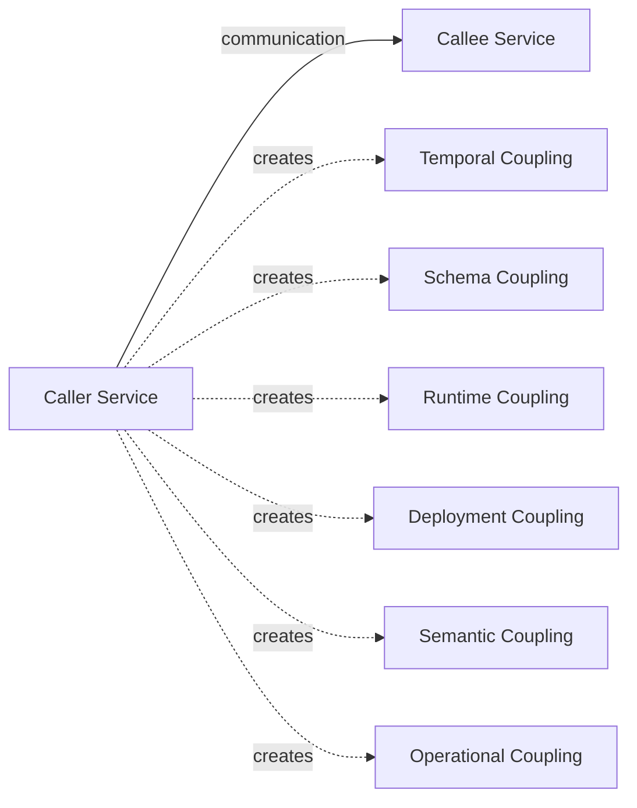

Saat service A berkomunikasi dengan service B, pertanyaannya bukan hanya:

> “Apakah call ini berhasil?”

Pertanyaan yang lebih kuat:

> “A sekarang bergantung pada B dalam dimensi apa saja?”

Dimensi yang akan kita pakai:

| Axis | Pertanyaan Utama |
|---|---|
| Temporal coupling | Apakah kedua service harus available pada saat yang sama? |
| Runtime coupling | Apakah latency/error B langsung memengaruhi runtime A? |
| Schema coupling | Apakah perubahan payload B memaksa A berubah? |
| Semantic coupling | Apakah A memahami makna internal/aturan bisnis B? |
| Deployment coupling | Apakah A dan B harus dirilis bersamaan? |
| Operational coupling | Apakah incident B langsung menjadi incident A? |
| Capacity coupling | Apakah traffic A bisa menekan kapasitas B? |
| Ordering coupling | Apakah A bergantung pada urutan event/message dari B? |
| Consistency coupling | Apakah A butuh state B segera konsisten? |
| Ownership coupling | Apakah perubahan komunikasi butuh koordinasi tim lintas domain? |

Semakin banyak axis yang aktif, semakin mahal komunikasi itu.

---

## 3. Temporal Coupling

Temporal coupling berarti dua pihak harus hidup, reachable, dan mampu merespons pada waktu yang sama.

### 3.1 Contoh Temporal Coupling Tinggi

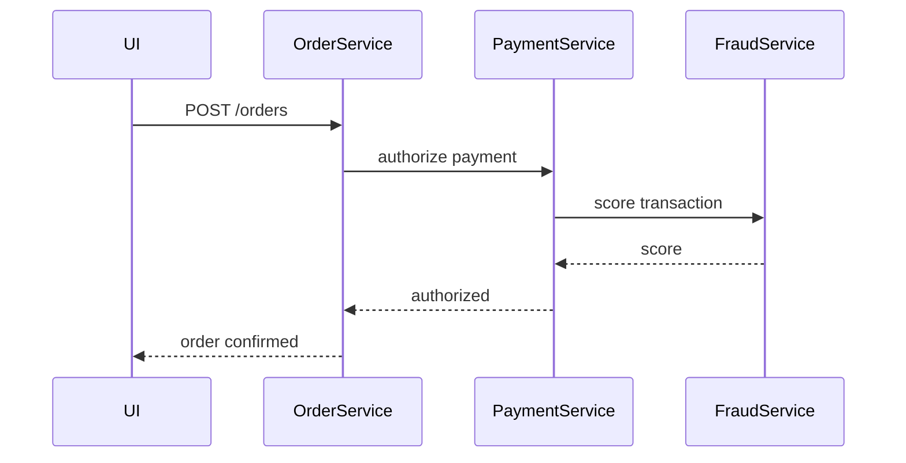

Dalam flow ini, checkout sukses hanya jika:

- `OrderService` hidup,
- `PaymentService` hidup,
- `FraudService` hidup,
- network antar semuanya sehat,
- response masih dalam timeout budget,
- tidak ada pool exhaustion,
- tidak ada retry storm.

Ini bukan salah. Checkout pembayaran memang mungkin butuh keputusan langsung. Tetapi coupling-nya harus disadari.

### 3.2 Contoh Temporal Coupling Rendah

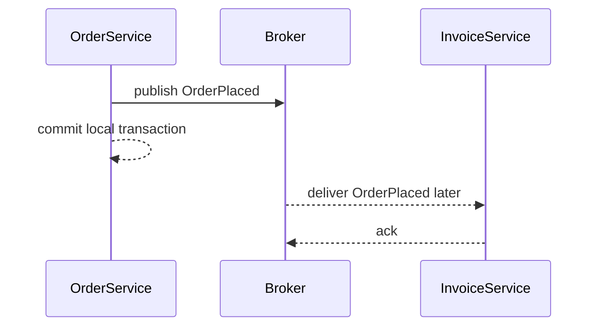

`OrderService` tidak harus menunggu `InvoiceService` hidup saat order dibuat. Ini mengurangi temporal coupling.

Namun bukan berarti sistem menjadi gratis. Async communication memindahkan masalah ke:

- delayed processing,
- duplicate delivery,
- consumer lag,
- replay safety,
- operational visibility,
- user-visible eventual consistency.

### 3.3 Rule of Thumb

Gunakan synchronous communication jika caller benar-benar membutuhkan jawaban sekarang untuk melanjutkan invariant bisnis.

Gunakan asynchronous communication jika caller hanya perlu mengumumkan fakta atau meminta pekerjaan yang bisa diselesaikan kemudian.

Tetapi hati-hati: banyak sistem menggunakan async bukan karena domain-nya async, melainkan karena ingin menyembunyikan buruknya desain dependency. Itu biasanya berakhir sebagai “distributed queue-shaped monolith”.

---

## 4. Runtime Coupling

Runtime coupling berarti performa dan error service B langsung memengaruhi runtime service A.

Synchronous call hampir selalu menciptakan runtime coupling.

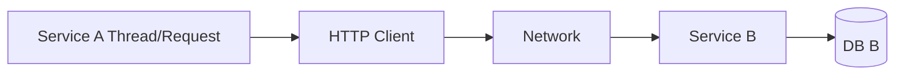

Jika B lambat, A menunggu.

Jika B timeout, A harus memutuskan:

- retry,
- fail fast,
- fallback,
- return partial response,
- enqueue compensating work,
- degrade feature.

Jika B menghasilkan 5xx, A harus memutuskan apakah error itu:

- transient,
- permanent,
- retriable,
- user-visible,
- operator-visible,
- safe untuk retry.

### 4.1 Runtime Coupling Tidak Hanya Latency

Runtime coupling mencakup:

| Runtime Dependency | Contoh |
|---|---|
| Latency | Caller thread menunggu downstream. |
| Error rate | Downstream 5xx menaikkan caller 5xx. |
| Saturation | Downstream lambat membuat caller thread pool penuh. |
| Connection state | Connection pool exhausted. |
| DNS behavior | DNS cache stale, resolver lambat, service endpoint berubah. |
| TLS handshake | Latency handshake atau certificate issue. |
| Retry behavior | Caller menggandakan traffic ke downstream. |
| Payload size | Serialization/deserialization CPU naik. |

Engineer pemula melihat runtime coupling sebagai “call gagal”. Engineer senior melihatnya sebagai *resource dependency graph*.

### 4.2 Runtime Coupling Graph

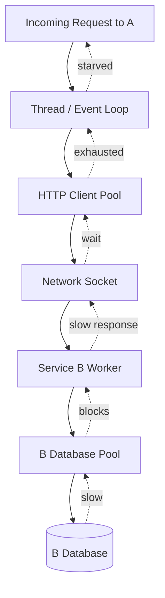

Satu database lambat di service B bisa membuat service A kehabisan thread, walaupun database A sehat.

Itulah mengapa timeout, circuit breaker, bulkhead, dan rate limit bukan “library feature”. Mereka adalah mekanisme untuk membatasi runtime coupling.

---

## 5. Schema Coupling

Schema coupling berarti service A bergantung pada bentuk data service B.

Contoh HTTP JSON:

```json
{
  "customerId": "C-1001",
  "status": "ACTIVE",
  "riskScore": 72
}
```

Jika `CustomerService` menghapus `riskScore`, semua consumer yang bergantung pada field itu bisa rusak.

### 5.1 Bentuk Schema Coupling

| Bentuk | Risiko |
|---|---|
| Required field | Producer tidak boleh menghapus/mengubah field tanpa koordinasi. |
| Enum value | Consumer bisa gagal saat menerima enum baru. |
| Numeric precision | Perubahan `int` ke decimal bisa merusak calculation. |
| Date/time format | Timezone/format drift memicu bug halus. |
| Nested object | Consumer mulai memahami struktur internal producer. |
| Error schema | Caller tidak bisa membedakan retryable vs permanent error. |
| Pagination schema | Perubahan cursor/page behavior merusak client. |

### 5.2 JSON Coupling vs Protobuf Coupling

JSON sering terlihat fleksibel, tetapi fleksibilitas tanpa rule justru berbahaya.

Protobuf terlihat ketat, tetapi bisa lebih aman jika evolusinya disiplin:

- jangan reuse field number,
- jangan rename semantic tanpa migration,
- jangan ubah meaning field diam-diam,
- gunakan reserved field untuk field yang dihapus,
- desain unknown field behavior,
- desain enum evolution.

JSON dan Protobuf bukan otomatis loose atau tight. Yang menentukan adalah **evolution discipline**.

### 5.3 Consumer-Driven Schema Smell

Schema coupling menjadi parah ketika producer mulai menambahkan field bukan karena domain-nya, tetapi karena satu consumer minta convenience.

Contoh buruk:

```json
{
  "customerId": "C-1001",
  "status": "ACTIVE",
  "lastOrderAmountForBackofficeDashboard": 1200000,
  "shipmentEligibilityTextForMobileApp": "Eligible for same-day delivery"
}
```

Ini bukan API domain. Ini API yang bocor ke kebutuhan presentation/consumer tertentu.

Solusi bukan selalu membuat endpoint baru. Solusi adalah memahami tipe kebutuhan:

- Apakah consumer butuh fakta domain?
- Apakah consumer butuh projection/read model?
- Apakah consumer butuh orchestration?
- Apakah consumer butuh denormalized view?
- Apakah consumer seharusnya punya BFF/API composition layer?

---

## 6. Semantic Coupling

Semantic coupling lebih berbahaya daripada schema coupling.

Schema coupling terjadi ketika A tahu bentuk data B.

Semantic coupling terjadi ketika A tahu terlalu banyak tentang makna internal B.

Contoh:

```java
if (customer.status().equals("ACTIVE") && customer.riskScore() < 80) {
    allowCheckout();
}
```

Sekilas normal. Tetapi pertanyaannya:

> Apakah `OrderService` memang boleh menentukan eligibility customer dari status dan risk score mentah?

Mungkin yang benar:

```java
EligibilityDecision decision = customerEligibilityClient.evaluateCheckoutEligibility(customerId);
```

Atau event:

```text
CustomerCheckoutEligibilityChanged
```

### 6.1 Semantic Coupling Smells

| Smell | Contoh |
|---|---|
| Caller menggabungkan beberapa field downstream untuk membuat rule domain | `status == ACTIVE && riskScore < 80` |
| Caller tahu lifecycle internal downstream | `if payment.status == CAPTURE_PENDING_RETRY_2` |
| Caller tahu alasan teknis downstream | `if errorCode == DB_LOCK_TIMEOUT then business retry` |
| Caller membuat keputusan domain milik service lain | Order menentukan fraud eligibility dari raw fraud score |
| Caller menyimpan field downstream lalu membuat rule jangka panjang | Cache customer risk score 30 hari dan pakai untuk enforcement |

Semantic coupling tidak bisa diselesaikan hanya dengan OpenAPI/protobuf. Ia butuh desain boundary.

### 6.2 Rule: Expose Decision When Consumer Needs Decision

Jika consumer butuh keputusan, jangan paksa consumer menyusun keputusan dari raw data.

Buruk:

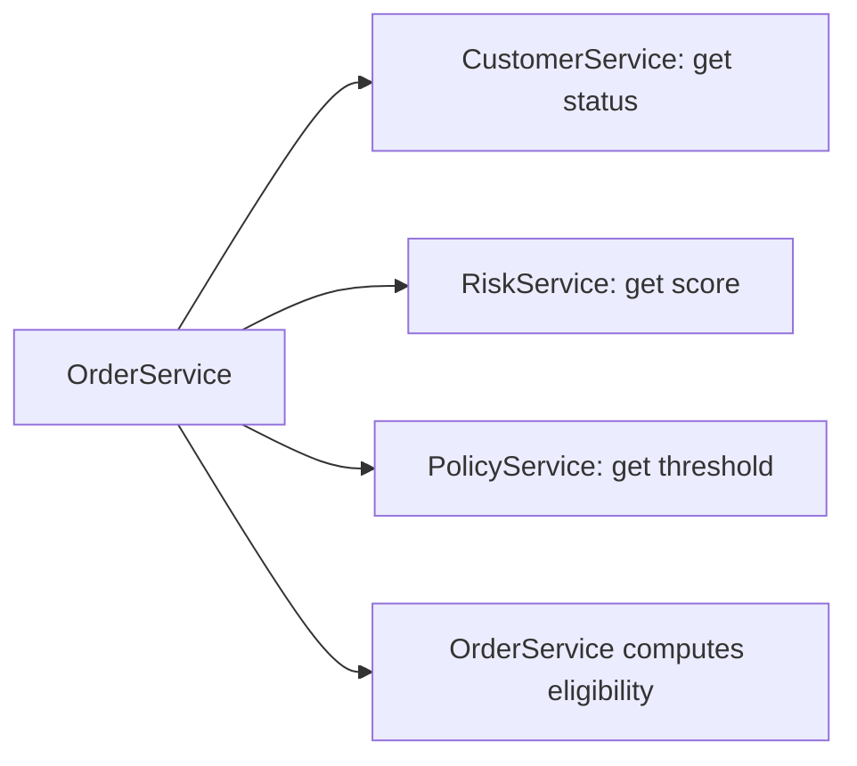

Lebih baik:

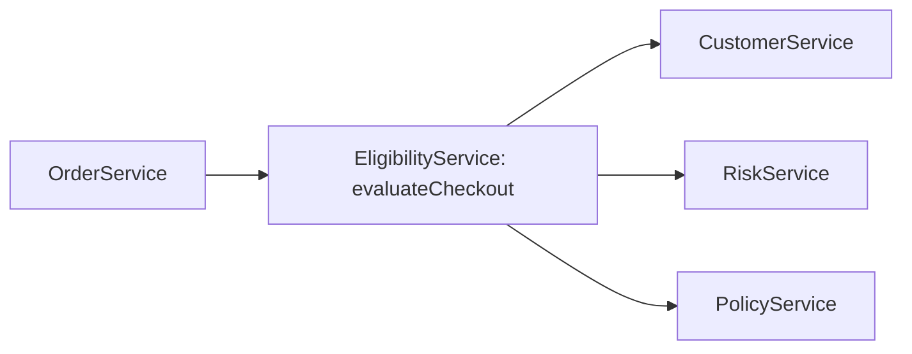

Atau jika keputusan tidak perlu real-time:

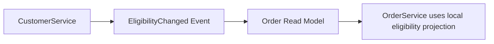

---

## 7. Deployment Coupling

Deployment coupling berarti perubahan service A dan B harus dikoordinasikan dalam release yang sama.

Microservices seharusnya memungkinkan independent deployment. Tetapi komunikasi yang buruk bisa mengembalikan sistem menjadi distributed monolith.

### 7.1 Contoh Deployment Coupling Buruk

Hari Senin:

- `PaymentService` mengubah field `amount` dari integer cents menjadi decimal currency.
- `OrderService` belum disesuaikan.
- `InvoiceService` masih membaca format lama.
- `BackofficeService` gagal deserialize.

Akibatnya release harus diurutkan ketat:

1. deploy shared library,
2. deploy OrderService,
3. deploy InvoiceService,
4. deploy PaymentService,
5. deploy BackofficeService,
6. rollback semua jika satu gagal.

Ini bukan independent deployment. Ini monolith dengan network hop.

### 7.2 Compatibility Window

Desain komunikasi produksi harus punya compatibility window.

Artinya producer dan consumer bisa berjalan dalam kombinasi versi berbeda selama periode tertentu.

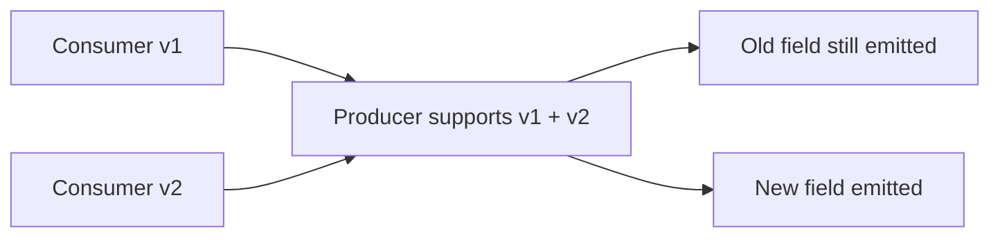

Pattern umum:

1. add optional field,
2. deploy producer that emits both old and new shape,
3. migrate consumers,
4. monitor usage,
5. stop relying on old field,
6. remove old field only after compatibility window.

### 7.3 Backward and Forward Compatibility

| Compatibility | Meaning |
|---|---|
| Backward compatible | New producer can serve old consumers. |
| Forward compatible | Old consumers can tolerate new producer output. |
| Full compatibility | Both old/new producers and old/new consumers can coexist. |

Internal API sering diremehkan karena “consumer-nya tim sendiri”. Ini jebakan. Justru internal API sering punya consumer tersembunyi:

- batch job,
- admin tool,
- data extractor,
- analytics pipeline,
- QA automation,
- migration script,
- partner integration adapter,
- incident debugging script.

Jika compatibility tidak didesain, perubahan kecil menjadi release coordination problem.

---

## 8. Operational Coupling

Operational coupling berarti incident di satu service menciptakan incident di service lain.

Contoh:

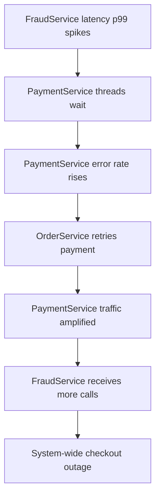

Ini bukan hanya “FraudService down”. Ini cascade.

### 8.1 Operational Coupling Indicators

| Indicator | Meaning |
|---|---|
| Caller p99 follows callee p99 | Runtime dependency is strong. |
| Caller 5xx rises when callee 5xx rises | Error propagation unmanaged. |
| Caller thread pool saturates during callee incident | No bulkhead/deadline boundary. |
| Retry count spikes during downstream degradation | Retry policy may amplify incident. |
| Queue lag grows without alert | Async dependency hidden until backlog explodes. |
| Dashboard only shows local health | Cross-service dependency invisible. |

### 8.2 Incident Blast Radius

Communication design controls blast radius.

Bad blast radius:

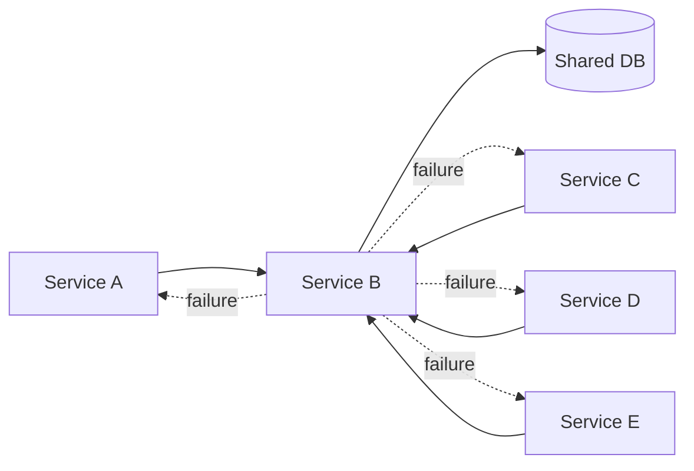

Better blast radius:

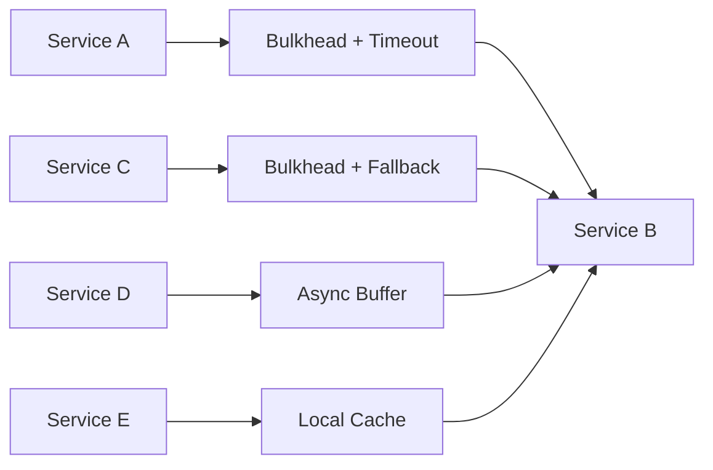

Tujuan reliability engineering bukan membuat B tidak pernah gagal. Tujuannya membuat kegagalan B tidak otomatis menjatuhkan A, C, D, dan E.

---

## 9. Capacity Coupling

Capacity coupling terjadi ketika traffic atau beban service A memengaruhi kapasitas service B.

Synchronous fan-out adalah sumber capacity coupling yang sangat umum.

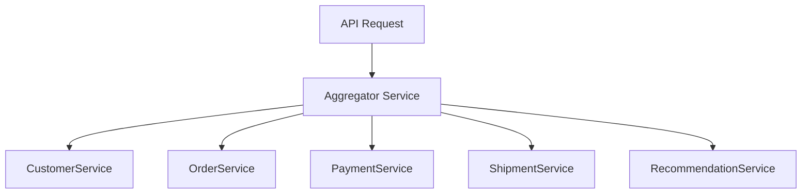

Satu request ke aggregator bisa menjadi lima downstream request.

Jika traffic masuk 1.000 RPS, downstream aggregate bisa menjadi:

- 1.000 RPS ke Customer,
- 1.000 RPS ke Order,
- 1.000 RPS ke Payment,
- 1.000 RPS ke Shipment,
- 1.000 RPS ke Recommendation.

Jika ada retry satu kali pada setiap downstream, beban bisa melonjak menjadi 10.000 downstream attempts per second.

### 9.1 Fan-Out Multiplier

Gunakan model sederhana:

```text
Downstream attempts = incoming RPS × fanout count × average attempts per call
```

Jika:

```text
incoming RPS = 2,000
fanout count = 6
average attempts = 1.5
```

Maka:

```text
2,000 × 6 × 1.5 = 18,000 downstream attempts/second
```

Ini belum termasuk:

- retries by proxies,
- service mesh retries,
- SDK retries,
- browser retries,
- queue redelivery,
- cron replay,
- batch backfill.

### 9.2 Capacity Coupling Controls

| Control | Function |
|---|---|
| Rate limit | Membatasi traffic masuk/keluar. |
| Bulkhead | Memisahkan resource per dependency. |
| Timeout | Mencegah wait tak terbatas. |
| Circuit breaker | Menghentikan calls ke dependency rusak. |
| Cache | Mengurangi repeated calls. |
| Request coalescing | Menggabungkan request identik. |
| Queue | Menyerap burst, dengan konsekuensi latency. |
| Backpressure | Memaksa upstream menyesuaikan laju. |

Capacity coupling harus dimodelkan sebelum traffic produksi, bukan setelah incident.

---

## 10. Ordering Coupling

Ordering coupling berarti consumer bergantung pada urutan event/message/call.

Contoh event lifecycle order:

```text
OrderCreated -> OrderPaid -> OrderPacked -> OrderShipped -> OrderDelivered
```

Jika consumer menerima:

```text
OrderShipped before OrderPaid
```

apa yang harus terjadi?

Banyak sistem tidak punya jawaban jelas. Itu masalah.

### 10.1 Ordering Dependency Questions

Untuk setiap event stream, tanyakan:

1. Apakah consumer butuh total order atau per-entity order?
2. Entity key apa yang menjadi batas ordering?
3. Apa yang terjadi jika event datang terlambat?
4. Apa yang terjadi jika event datang duplikat?
5. Apa yang terjadi jika event hilang?
6. Apa yang terjadi jika event lama di-replay setelah state terbaru ada?
7. Apakah consumer bisa membangun state secara idempotent?

### 10.2 Per-Entity Ordering

Biasanya yang dibutuhkan bukan global ordering, melainkan per-entity ordering.

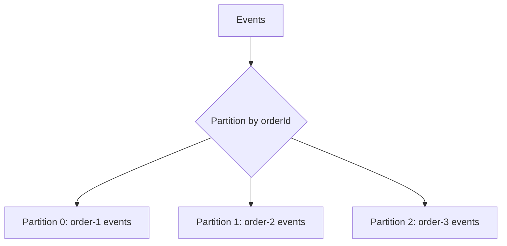

Jika event `order-1` selalu ke partition yang sama, consumer dapat memproses urutan per order.

Tetapi ini menciptakan coupling pada key selection. Salah pilih key bisa membuat:

- hot partition,
- broken ordering,
- poor parallelism,
- hard migration.

Ordering bukan properti gratis dari broker. Ordering adalah design contract.

---

## 11. Consistency Coupling

Consistency coupling terjadi ketika service A membutuhkan state service B segera konsisten.

Contoh:

```text
User clicks Pay -> Payment authorized -> Order status must immediately show PAID everywhere
```

Di sistem distributed, “immediately everywhere” mahal.

Ada beberapa pilihan:

| Model | Karakteristik |
|---|---|
| Strong synchronous consistency | Caller menunggu semua perubahan penting selesai. Latency dan failure coupling tinggi. |
| Local commit + async propagation | Latency rendah di owner, tetapi consumer melihat eventual consistency. |
| Read-your-write projection | User melihat konsistensi pada konteks tertentu saja. |
| Reservation/hold model | State sementara untuk mengurangi race. |
| Saga/process manager | State transisi dikelola eksplisit. |

### 11.1 Jangan Bohongi User dengan Eventual Consistency

Eventual consistency bukan alasan untuk UX membingungkan.

Jika pembayaran sukses tetapi order dashboard belum update, sistem harus bisa mengatakan:

```text
Payment received. Order confirmation is being finalized.
```

Bukan:

```text
Payment failed.
```

atau:

```text
Unknown error.
```

Consistency coupling harus diterjemahkan menjadi state machine dan user journey, bukan hanya event handler.

---

## 12. Ownership Coupling

Ownership coupling terjadi ketika perubahan komunikasi butuh koordinasi banyak tim karena boundary ownership tidak jelas.

Contoh:

- `CustomerService` dimiliki tim Customer.
- `OrderService` dimiliki tim Commerce.
- `RiskService` dimiliki tim Risk.
- `BackofficeService` dimiliki tim Operations.

Jika field `customerSegment` berubah, siapa yang bertanggung jawab memastikan semua consumer aman?

Ownership coupling buruk jika:

- tidak ada owner kontrak,
- tidak ada lifecycle policy,
- tidak ada deprecation window,
- tidak ada consumer registry,
- tidak ada observability per consumer,
- tidak ada migration plan.

### 12.1 Contract Ownership Checklist

Untuk setiap API/event, harus jelas:

- siapa owner contract,
- siapa known consumers,
- compatibility policy,
- deprecation policy,
- versioning strategy,
- rollout strategy,
- incident escalation owner,
- SLO dependency,
- schema registry/documentation location,
- example payloads and fixtures.

Tanpa ownership, komunikasi menjadi tribal knowledge.

---

## 13. Coupling Matrix

Gunakan matrix ini saat review desain komunikasi.

| Pattern | Temporal | Runtime | Schema | Semantic | Deployment | Operational | Notes |
|---|---:|---:|---:|---:|---:|---:|---|
| HTTP synchronous query | High | High | Medium | Medium | Medium | High | Cocok untuk query immediate, tetapi wajib timeout/bulkhead. |
| HTTP command with idempotency key | High | High | Medium | Medium | Medium | High | Cocok jika keputusan harus langsung diketahui. |
| gRPC unary | High | High | High | Medium | Medium | High | Efisien dan typed, tetapi compatibility harus disiplin. |
| gRPC streaming | High | High | High | High | Medium | High | Kuat untuk long-lived flow, sulit dioperasikan. |
| Event publish | Low | Low/Medium | Medium | Low/Medium | Low/Medium | Medium | Decouples time, adds eventual consistency. |
| Queue command | Low | Medium | Medium | Medium | Medium | Medium | Cocok untuk background work; butuh retry/DLQ. |
| Kafka event stream | Low | Medium | Medium/High | Medium | Medium | Medium/High | Replayable, ordering by key, operationally demanding. |
| Shared database | Low apparent | Hidden High | Very High | Very High | Very High | Very High | Biasanya anti-pattern untuk ownership boundary. |
| Shared library DTO | Low apparent | Low | High | High | High | Medium | Bisa menciptakan lockstep release. |

Tidak ada baris yang “selalu benar”. Matrix ini alat berpikir, bukan hukum alam.

---

## 14. Case Study: Checkout Communication Coupling

Bayangkan checkout flow:

1. user membuat order,
2. sistem validasi customer,
3. sistem authorize payment,
4. sistem reserve inventory,
5. sistem create shipment request,
6. sistem send notification,
7. sistem update analytics.

### 14.1 Desain Naif

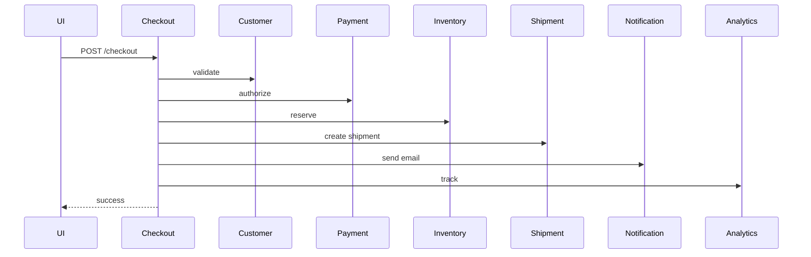

Masalah:

- notification failure bisa menggagalkan checkout,
- analytics latency memengaruhi user latency,
- shipment dependency mungkin belum perlu blocking,
- retry pada checkout bisa menggandakan payment/inventory command,
- seluruh flow temporal dan runtime coupled.

### 14.2 Desain Lebih Baik

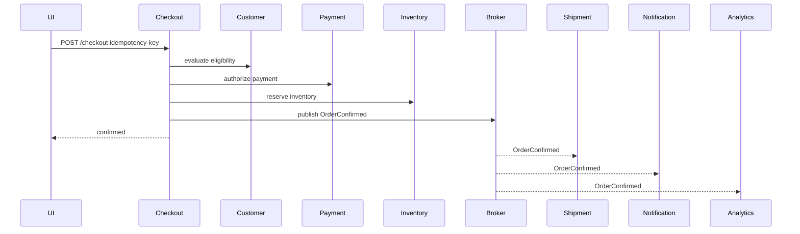

Ini tidak otomatis benar untuk semua bisnis, tetapi dependency-nya lebih eksplisit:

| Dependency | Mode |
|---|---|
| Customer eligibility | synchronous, karena checkout decision butuh jawaban sekarang |
| Payment authorization | synchronous, karena order tidak boleh confirmed tanpa authorization |
| Inventory reservation | synchronous atau reservation-specific depending business invariant |
| Shipment | async, karena physical fulfillment bisa mulai setelah confirmation |
| Notification | async, karena email bukan invariant checkout |
| Analytics | async, karena observability/business intelligence tidak boleh memblokir checkout |

### 14.3 Top 1% Question

Pertanyaan yang matang bukan:

> “Apakah ini sync atau async?”

Pertanyaan yang matang:

> “Dependency mana yang benar-benar berada di critical business invariant, dan dependency mana yang hanya side effect?”

Communication design mengikuti invariant, bukan mengikuti tooling.

---

## 15. Java Implementation: Make Coupling Explicit in Code

Kode Java sering menyembunyikan dependency.

Buruk:

```java
@Service
public class CheckoutService {
    private final RestClient restClient;

    public CheckoutResult checkout(CheckoutCommand command) {
        Customer customer = restClient.get()
                .uri("http://customer-service/customers/{id}", command.customerId())
                .retrieve()
                .body(Customer.class);

        PaymentResult payment = restClient.post()
                .uri("http://payment-service/payments")
                .body(command)
                .retrieve()
                .body(PaymentResult.class);

        return CheckoutResult.confirmed(payment.paymentId());
    }
}
```

Masalah:

- timeout tidak terlihat,
- retry tidak terlihat,
- fallback tidak jelas,
- downstream semantics bocor,
- endpoint tersebar di business service,
- error mapping tidak eksplisit.

Lebih baik:

```java
public interface CustomerEligibilityClient {
    EligibilityDecision evaluate(CustomerId customerId, Deadline deadline);
}

public interface PaymentAuthorizationClient {
    PaymentAuthorization authorize(AuthorizePaymentCommand command, Deadline deadline);
}
```

Business service menjadi jelas:

```java
@Service
public class CheckoutApplicationService {
    private final CustomerEligibilityClient eligibilityClient;
    private final PaymentAuthorizationClient paymentClient;
    private final OrderRepository orderRepository;
    private final OrderEventPublisher eventPublisher;

    public CheckoutResult checkout(CheckoutCommand command, RequestContext context) {
        Deadline deadline = context.deadline().childBudget(Duration.ofMillis(600));

        EligibilityDecision eligibility = eligibilityClient.evaluate(command.customerId(), deadline);
        eligibility.requireAllowed();

        Order order = Order.createPending(command);
        PaymentAuthorization authorization = paymentClient.authorize(
                AuthorizePaymentCommand.from(order, command.paymentMethod()),
                deadline.childBudget(Duration.ofMillis(350))
        );

        order.confirmWithPayment(authorization);
        orderRepository.save(order);
        eventPublisher.publish(OrderConfirmed.from(order));

        return CheckoutResult.confirmed(order.id());
    }
}
```

Infrastructure client menyimpan detail komunikasi:

```java
@Component
class HttpPaymentAuthorizationClient implements PaymentAuthorizationClient {
    private final RestClient restClient;
    private final PaymentClientPolicy policy;

    @Override
    public PaymentAuthorization authorize(AuthorizePaymentCommand command, Deadline deadline) {
        return policy.execute("payment.authorize", deadline, () ->
                restClient.post()
                        .uri("/internal/payments/authorizations")
                        .header("Idempotency-Key", command.idempotencyKey())
                        .body(command)
                        .retrieve()
                        .body(PaymentAuthorizationResponse.class)
                        .toDomain()
        );
    }
}
```

Perhatikan: dependency communication sekarang punya nama domain, policy, dan deadline.

---

## 16. Coupling Review Template

Gunakan template ini sebelum menambah service call baru.

```md
## Communication Review

### 1. Business Need
- Caller:
- Callee:
- Operation:
- Why communication is needed:
- Business invariant involved:

### 2. Coupling Axis
- Temporal coupling: low / medium / high
- Runtime coupling: low / medium / high
- Schema coupling: low / medium / high
- Semantic coupling: low / medium / high
- Deployment coupling: low / medium / high
- Operational coupling: low / medium / high
- Capacity coupling: low / medium / high
- Ordering coupling: low / medium / high
- Consistency coupling: low / medium / high

### 3. Failure Behavior
- If callee is slow:
- If callee returns 4xx:
- If callee returns 5xx:
- If callee times out:
- If duplicate request/message happens:
- If response/event is delayed:

### 4. Policy
- Timeout:
- Retry:
- Circuit breaker:
- Bulkhead:
- Rate limit:
- Idempotency:
- Fallback:

### 5. Evolution
- Contract owner:
- Compatibility requirement:
- Deprecation window:
- Known consumers:
- Observability per consumer:

### 6. Decision
- Selected communication style:
- Why this style:
- Rejected alternatives:
- Open risks:
```

---

## 17. Decision Heuristics

### 17.1 Prefer Sync When

Gunakan synchronous HTTP/gRPC jika:

- caller membutuhkan jawaban sekarang,
- hasil call menentukan invariant langsung,
- user menunggu keputusan,
- operasi harus fail fast,
- callee punya SLO kuat,
- timeout budget realistis,
- fallback semantics jelas.

Contoh:

- payment authorization,
- eligibility decision,
- fraud decision real-time,
- identity token introspection tertentu,
- validation yang benar-benar authoritative.

### 17.2 Prefer Async When

Gunakan message/event jika:

- caller hanya mengumumkan fakta,
- pekerjaan bisa diproses nanti,
- side effect tidak boleh memblokir main transaction,
- consumer bisa mengejar backlog,
- duplicate handling jelas,
- user journey bisa menerima eventual consistency.

Contoh:

- notification,
- audit event,
- analytics,
- read model projection,
- fulfillment workflow setelah order confirmed,
- downstream enrichment.

### 17.3 Prefer Local State When

Gunakan local projection/cache jika:

- call sering terjadi,
- latency harus rendah,
- data berubah lebih jarang daripada dibaca,
- stale data masih bisa diterima,
- event propagation bisa dipercaya,
- ada mekanisme reconciliation.

Contoh:

- customer display name,
- product catalog snapshot,
- eligibility projection,
- organization hierarchy cache,
- feature flag snapshot.

---

## 18. Anti-Patterns

### 18.1 Distributed Getter Chain

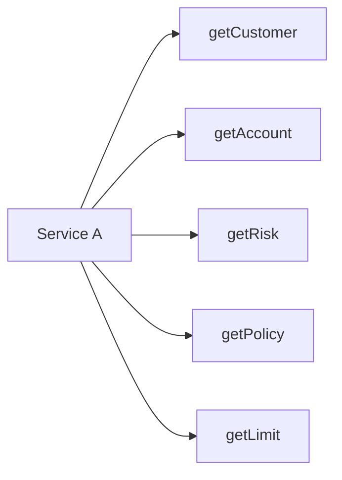

Service A menjadi tempat rule tersembunyi yang menggabungkan data dari banyak owner.

### 18.2 Event as RPC

```text
Service A publishes CalculatePaymentCommand
Service A waits by polling database until PaymentCalculated appears
```

Ini async secara teknologi, synchronous secara niat, dan sering lebih buruk dari RPC biasa.

### 18.3 Shared DTO Library Everywhere

```text
common-dto.jar used by 27 services
```

Awalnya efisien. Lama-lama menjadi global schema lock.

### 18.4 Retry Without Ownership

Caller menambahkan retry karena “kadang timeout”. Mesh juga retry. SDK juga retry. Load balancer juga retry.

Hasilnya bukan resilience, tetapi traffic amplification.

### 18.5 Hidden Critical Dependency

Service terlihat optional, tetapi implementasinya wajib.

```java
try {
    recommendationClient.getRecommendations(userId);
} catch (Exception e) {
    throw new CheckoutFailedException(e);
}
```

Nama dependency optional. Behavior dependency critical.

---

## 19. Practical Checklist

Sebelum menambah komunikasi baru, jawab ini:

1. Apakah caller benar-benar butuh jawaban sekarang?
2. Apa invariant bisnis yang dilindungi call ini?
3. Apa yang terjadi jika callee lambat?
4. Apa yang terjadi jika callee gagal?
5. Apakah retry aman?
6. Apakah operasi idempotent?
7. Apakah schema bisa berubah tanpa lockstep release?
8. Apakah caller tahu terlalu banyak tentang domain callee?
9. Apakah ada known fan-out multiplier?
10. Apakah dependency punya timeout budget?
11. Apakah ada bulkhead per downstream?
12. Apakah ada metric per dependency?
13. Apakah incident callee akan menjatuhkan caller?
14. Apakah event/message bisa duplicate?
15. Apakah ordering dibutuhkan?
16. Apakah stale data boleh?
17. Apakah contract owner jelas?
18. Apakah deprecation policy jelas?
19. Apakah ada replay/migration plan?
20. Apakah desain ini masih masuk akal saat traffic 10x?

---

## 20. What You Should Internalize

Coupling adalah biaya tersembunyi dari komunikasi.

HTTP, gRPC, Kafka, RabbitMQ, Pulsar, NATS, service mesh, gateway, dan client library hanyalah alat. Alat tersebut tidak otomatis membuat sistem decoupled.

Yang menentukan kualitas komunikasi adalah:

- dependency mana yang eksplisit,
- dependency mana yang benar-benar dibutuhkan,
- dependency mana yang bisa dipindah dari runtime ke asynchronous processing,
- dependency mana yang bisa dipindah dari remote call ke local projection,
- dependency mana yang harus tetap synchronous karena invariant bisnis,
- bagaimana failure dibatasi,
- bagaimana kontrak berevolusi,
- bagaimana incident tidak menyebar.

Top engineer tidak bertanya “tool apa yang dipakai?” terlebih dahulu.

Top engineer bertanya:

> “Coupling apa yang sedang kita beli, dan apakah coupling itu layak untuk invariant yang kita lindungi?”

---

## References

- RFC 9110 — HTTP Semantics: https://www.rfc-editor.org/rfc/rfc9110.html
- gRPC Deadlines: https://grpc.io/docs/guides/deadlines/
- AWS Builders Library — Timeouts, retries, and backoff with jitter: https://builder.aws.com/content/3EumjoZascWd1oZiEgL8ORlv3qE/timeouts-retries-and-backoff-with-jitter
- AWS Architecture Blog — Exponential Backoff and Jitter: https://aws.amazon.com/blogs/architecture/exponential-backoff-and-jitter/
- Reactive Streams for the JVM: https://github.com/reactive-streams/reactive-streams-jvm
