------
title: Learn Java Microservices Communication - Part 006
description: Model produksi untuk memahami trade-off latency, throughput, reliability, availability, cost, dan correctness dalam komunikasi Java microservices.
series: learn-java-microservices-communication
seriesTitle: Learn Java Microservices Communication
order: 6
partTitle: Latency, Throughput, Reliability, and Cost Trade-Offs
tags:
  - java
  - microservices
  - communication
  - latency
  - throughput
  - reliability
  - performance
  - architecture
date: 2026-07-05
---

# Part 006 — Latency, Throughput, Reliability, and Cost Trade-Offs

> In distributed systems, communication design is the art of choosing which pain you want to make explicit.

Setiap keputusan komunikasi microservices menukar sesuatu:

- latency vs reliability,
- throughput vs fairness,
- availability vs consistency,
- retry vs overload,
- batching vs tail latency,
- streaming vs operational complexity,
- synchronous simplicity vs failure coupling,
- asynchronous decoupling vs delayed visibility,
- compression vs CPU,
- connection reuse vs stale routing,
- strong typing vs evolution flexibility.

Tidak ada transport yang menang di semua dimensi.

Engineer yang matang tidak menjual teknologi sebagai solusi universal. Ia membaca workload, invariant bisnis, failure mode, dan operational envelope, lalu memilih trade-off yang paling masuk akal.

Materi ini akan membangun mental model untuk membaca trade-off tersebut secara sistematis.

---

## 1. The Four Forces of Communication Design

Dalam microservices communication, empat force paling penting adalah:

1. **Latency** — seberapa cepat satu operasi selesai dari perspektif caller/user.
2. **Throughput** — berapa banyak pekerjaan yang bisa diproses per unit waktu.
3. **Reliability** — seberapa baik sistem menghasilkan outcome yang benar meski ada failure.
4. **Cost** — resource yang dipakai: CPU, memory, network, storage, human operation, complexity.

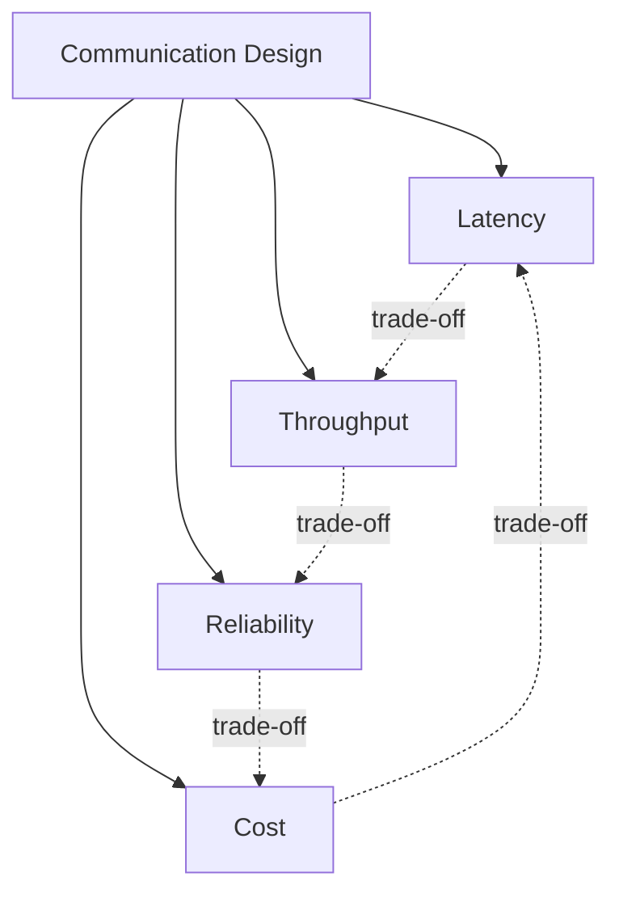

Masalahnya: banyak desain hanya mengoptimalkan satu force.

Contoh:

- “Gunakan async agar cepat” — cepat untuk caller, tetapi outcome bisa tertunda.
- “Tambahkan retry agar reliable” — bisa membuat overload lebih buruk.
- “Gunakan gRPC agar cepat” — bisa meningkatkan schema/deployment discipline cost.
- “Gunakan Kafka agar scalable” — bisa meningkatkan operational complexity dan consistency delay.
- “Gunakan cache agar latency rendah” — bisa memperkenalkan stale data dan invalidation complexity.

Trade-off harus dilihat sebagai sistem, bukan fitur lokal.

---

## 2. Latency: Bukan Hanya Average Response Time

Latency adalah waktu yang dibutuhkan dari permintaan sampai hasil terlihat oleh caller.

Dalam komunikasi microservices, latency tidak cukup dilihat dari average.

Yang penting:

| Metric | Meaning |
|---|---|
| p50 | Typical latency. Berguna untuk baseline. |
| p90 | Latency untuk mayoritas user. |
| p95 | Mulai menangkap slow path. |
| p99 | Tail latency; sering menentukan UX dan timeout. |
| p99.9 | Penting untuk sistem high scale/high reliability. |
| max | Kadang berguna untuk debugging, tetapi sering noisy. |

Average bisa menipu.

Misalnya:

```text
99 requests finish in 20 ms
1 request finishes in 2,000 ms
average = 39.8 ms
```

Average terlihat baik, tetapi satu user menunggu 2 detik. Jika service punya fan-out, tail latency menjadi lebih parah.

---

## 3. Tail Latency Amplification

Jika satu request memanggil banyak downstream secara parallel, latency total biasanya mengikuti downstream paling lambat.

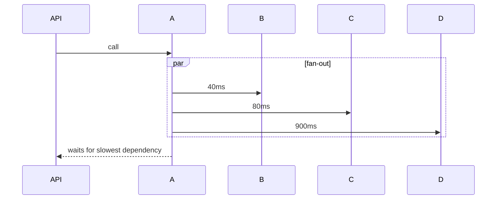

Jika aggregator menunggu semua response, total latency mendekati latency dependency paling lambat.

### 3.1 Probability Model Sederhana

Jika setiap downstream punya 1% kemungkinan lambat, dan request memanggil 10 downstream, kemungkinan setidaknya satu downstream lambat bukan lagi 1%.

Model sederhana:

```text
P(at least one slow) = 1 - P(none slow)
P(at least one slow) = 1 - (0.99 ^ 10)
P(at least one slow) ≈ 9.56%
```

Artinya fan-out mengubah tail event yang jarang menjadi pengalaman yang cukup sering.

### 3.2 Implication

Fan-out bukan hanya menambah jumlah call. Fan-out memperbesar probabilitas tail latency.

Karena itu aggregator service harus punya:

- timeout per dependency,
- total deadline,
- optional dependency handling,
- partial response semantics,
- concurrency limit,
- fallback strategy,
- cache untuk expensive dependency,
- request collapsing untuk duplicate calls.

---

## 4. Timeout: Latency Control, Not Error Handling

Timeout sering dianggap sebagai “cara menangani error”. Lebih tepatnya timeout adalah cara membatasi **berapa lama caller bersedia membayar biaya ketidakpastian**.

Tanpa timeout:

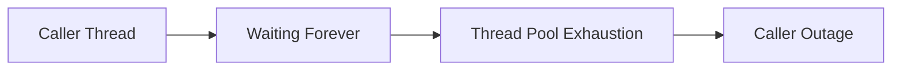

Dengan timeout:

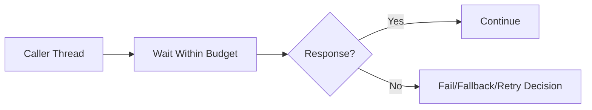

Timeout bukan angka random. Timeout adalah budget.

### 4.1 Timeout Types

| Timeout | Meaning |
|---|---|
| DNS timeout | Waktu resolve name. Sering tersembunyi. |
| Connect timeout | Waktu membuat koneksi TCP/TLS. |
| Connection acquisition timeout | Waktu menunggu connection dari pool. |
| Write timeout | Waktu mengirim request body. |
| Read/response timeout | Waktu menunggu response. |
| Total call timeout | Batas total satu call attempt. |
| End-to-end deadline | Batas seluruh request chain. |

Banyak bug produksi muncul karena engineer hanya mengatur `readTimeout`, tetapi lupa:

- connection pool acquisition,
- DNS,
- TLS handshake,
- retry total time,
- queue wait sebelum request diproses.

### 4.2 Deadline Budgeting

Misalnya endpoint user-facing punya target 1.000 ms.

Budget kasar:

```text
UI/network edge        100 ms
API gateway             50 ms
Service A logic        150 ms
Payment call           300 ms
Inventory call         250 ms
Buffer                 150 ms
Total                1,000 ms
```

Jika `Service A` memberi timeout 900 ms ke `PaymentService`, maka `InventoryService` tidak punya waktu realistis. Ini bukan hanya tuning; ini desain call chain.

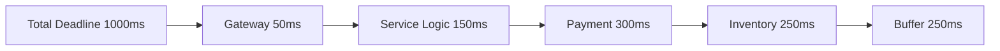

### 4.3 Java Deadline Object

Daripada menyebar angka timeout di banyak client, buat konsep deadline eksplisit.

```java
public final class Deadline {
    private final Instant expiresAt;

    private Deadline(Instant expiresAt) {
        this.expiresAt = expiresAt;
    }

    public static Deadline after(Duration duration, Clock clock) {
        return new Deadline(clock.instant().plus(duration));
    }

    public Duration remaining(Clock clock) {
        Duration remaining = Duration.between(clock.instant(), expiresAt);
        return remaining.isNegative() ? Duration.ZERO : remaining;
    }

    public Deadline childBudget(Duration desired, Clock clock) {
        Duration remaining = remaining(clock);
        return after(remaining.compareTo(desired) < 0 ? remaining : desired, clock);
    }

    public boolean expired(Clock clock) {
        return !remaining(clock).isPositive();
    }
}
```

Client call:

```java
PaymentAuthorization authorize(Command command, Deadline deadline) {
    Duration timeout = deadline.remaining(clock);
    if (timeout.isZero()) {
        throw new DeadlineExceededException("No remaining budget for payment authorization");
    }

    return httpClient.post(command, timeout);
}
```

Deadline membuat latency budget menjadi bagian dari model, bukan magic number.

---

## 5. Throughput: Work per Time, Not Just RPS

Throughput adalah kapasitas sistem menyelesaikan pekerjaan per unit waktu.

RPS adalah salah satu bentuk throughput, tetapi bukan satu-satunya.

Contoh throughput:

- HTTP requests per second,
- Kafka messages per second,
- bytes per second,
- database transactions per second,
- payment authorizations per minute,
- orders fulfilled per hour,
- case transitions per day.

Throughput harus diukur sesuai unit bisnis dan unit teknis.

### 5.1 Little's Law Mental Model

Model kasar:

```text
Concurrency = Throughput × Latency
```

Jika service memproses 1.000 request/second dan tiap request butuh 200 ms:

```text
Concurrency = 1000 × 0.2 = 200 concurrent requests
```

Jika latency naik ke 2 detik dengan throughput sama:

```text
Concurrency = 1000 × 2 = 2000 concurrent requests
```

Artinya latency tinggi menaikkan resource pressure.

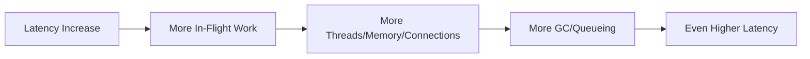

Ini feedback loop klasik saat incident.

### 5.2 Throughput vs Latency

Optimasi throughput sering menambah latency.

Contoh batching:

```text
Without batching:
- 1 message sent immediately
- low latency
- high per-message overhead

With batching:
- wait until 100 messages or 10 ms
- better throughput
- each message may wait before being sent
```

Batching cocok untuk:

- event publishing,
- logging,
- analytics,
- high-volume streaming,
- non-user blocking operations.

Batching berisiko untuk:

- payment authorization,
- fraud decision,
- request-response user flow,
- low-latency API.

### 5.3 Java Tuning Implication

Untuk HTTP/gRPC client, throughput dipengaruhi oleh:

- connection pool size,
- max concurrent streams untuk HTTP/2,
- event loop/thread pool size,
- serializer/deserializer CPU,
- payload size,
- TLS reuse,
- GC behavior,
- retry behavior,
- downstream capacity.

Untuk messaging producer, throughput dipengaruhi oleh:

- batch size,
- linger time,
- compression,
- acks/durability setting,
- partition count,
- key distribution,
- broker throughput,
- network bandwidth,
- serialization format.

Untuk consumer, throughput dipengaruhi oleh:

- poll batch size,
- processing concurrency,
- ack/commit strategy,
- database write capacity,
- idempotency check cost,
- downstream calls from consumer,
- rebalance behavior.

---

## 6. Reliability: Correct Outcome Under Failure

Reliability bukan sekadar “service tidak down”.

Reliability dalam komunikasi berarti sistem tetap menghasilkan outcome yang benar meskipun:

- request timeout,
- response hilang,
- message duplicate,
- consumer restart,
- network partition,
- partial failure,
- broker redelivery,
- downstream slow,
- deploy terjadi di tengah flow,
- schema berubah,
- retry terjadi.

### 6.1 Availability vs Reliability

Availability:

> Apakah sistem merespons?

Reliability:

> Apakah hasilnya benar dan dapat dipercaya?

Sistem bisa highly available tetapi unreliable.

Contoh:

- API selalu return `200 OK`, tetapi payment diproses dua kali.
- Consumer selalu running, tetapi offset di-commit sebelum DB write sukses.
- Notification selalu terkirim, tetapi event order-nya salah.
- Checkout selalu cepat, tetapi order masuk tanpa inventory reservation.

### 6.2 Retry Does Not Equal Reliability

Retry membantu jika failure transient.

Retry merusak jika:

- operasi tidak idempotent,
- downstream sedang overload,
- semua client retry bersamaan,
- retry tidak punya budget,
- retry dilakukan di beberapa layer,
- caller tidak tahu apakah callee sudah melakukan side effect.

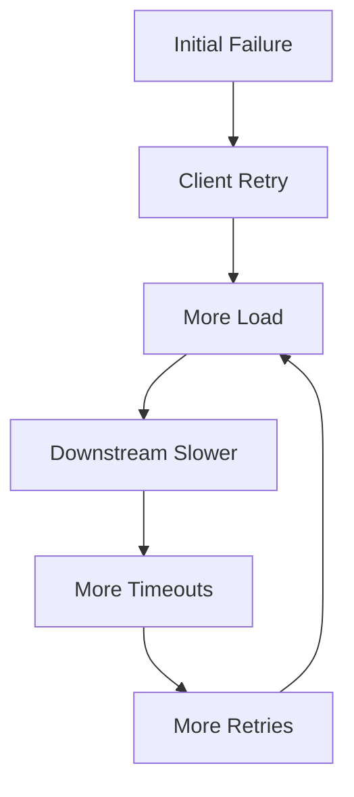

Reliability butuh kombinasi:

- timeout,
- retry with backoff and jitter,
- idempotency key,
- deduplication,
- circuit breaker,
- bulkhead,
- durable messaging,
- reconciliation,
- observability,
- operational runbook.

---

## 7. The Retry Budget Model

Retry harus dibatasi oleh budget.

### 7.1 Bad Retry Policy

```yaml
retry:
  maxAttempts: 5
  timeoutPerAttempt: 2s
```

Jika user request punya total budget 1 second, policy ini tidak masuk akal.

### 7.2 Better Retry Policy

```yaml
client: payment-authorization
operation: authorize
endToEndBudget: 800ms
attempts:
  max: 2
  perAttemptTimeout: 250ms
backoff:
  initial: 50ms
  max: 100ms
  jitter: true
retryOn:
  - connect-timeout
  - 503
  - 429
notRetryOn:
  - validation-error
  - insufficient-funds
  - duplicate-command-with-different-payload
```

### 7.3 Retry Decision Table

| Failure | Retry? | Reason |
|---|---:|---|
| Connection refused during deployment | Maybe | Transient if rollout; use small retry. |
| HTTP 400 validation error | No | Permanent caller error. |
| HTTP 401/403 | No | Auth/authz issue; retry usually useless. |
| HTTP 404 on eventually created resource | Maybe | Depends on read-after-write model. |
| HTTP 409 conflict | Maybe/No | Depends on semantic conflict and idempotency. |
| HTTP 429 | Yes with backoff | Respect server throttling. |
| HTTP 500 | Maybe | Only if operation idempotent/safe. |
| HTTP 503 | Maybe | Backoff/jitter; avoid storm. |
| Deadline exceeded | Usually no further retry | Budget likely exhausted. |
| Unknown response after side effect command | Retry only with idempotency key | Avoid duplicate side effect. |

---

## 8. Cost: CPU, Memory, Network, Storage, Operation, Complexity

Cost tidak hanya cloud bill.

Communication cost meliputi:

| Cost Type | Example |
|---|---|
| CPU | JSON serialization, protobuf encoding, compression, TLS. |
| Memory | Buffers, queues, in-flight requests, consumer batches. |
| Network | Payload bytes, retransmission, cross-zone traffic. |
| Storage | Broker retention, DLQ, replay logs, idempotency table. |
| Latency | Waiting, queueing, handshake, retry. |
| Reliability engineering | Deduplication, replay, reconciliation, runbooks. |
| Cognitive load | More protocols, more failure modes. |
| Operational load | Brokers, mesh, gateway, certs, dashboards. |

### 8.1 Compression Trade-Off

Compression reduces network bytes but increases CPU.

Cocok jika:

- payload besar,
- network mahal/lambat,
- CPU masih cukup,
- batch/streaming volume besar.

Tidak cocok jika:

- payload kecil,
- latency super rendah,
- CPU sudah bottleneck,
- compression ratio rendah.

### 8.2 Binary vs Text Payload

| Format | Strength | Cost/Risk |
|---|---|---|
| JSON | Human-readable, broad tooling, flexible | Larger payload, runtime parsing errors, schema discipline external |
| Protobuf | Compact, typed, fast, good for gRPC | Requires schema discipline, generated code, field evolution rules |
| Avro | Strong for data/event pipelines | Requires schema registry discipline |
| Plain text | Simple | Weak structure, poor evolution |

Format bukan hanya performance decision. Format juga governance decision.

---

## 9. Synchronous Communication Trade-Offs

Synchronous communication memberikan simplicity mental model:

```text
call -> wait -> response -> decide
```

Kelebihan:

- mudah dipahami,
- cocok untuk immediate decision,
- error path langsung,
- user mendapat jawaban cepat jika dependency sehat,
- transaction boundary lebih mudah dibaca.

Biaya:

- temporal coupling tinggi,
- runtime coupling tinggi,
- tail latency amplification,
- cascading failure risk,
- thread/connection pressure,
- retry storm risk,
- availability mengikuti dependency chain.

### 9.1 Availability Chain Model

Jika request membutuhkan tiga downstream synchronous, dan masing-masing availability 99.9%, availability gabungan idealnya kira-kira:

```text
0.999 × 0.999 × 0.999 = 0.997003
≈ 99.7003%
```

Dalam praktik, correlation failure membuatnya bisa lebih buruk.

Artinya menambah mandatory synchronous dependency menurunkan availability end-to-end.

### 9.2 Mandatory vs Optional Dependency

Jangan semua dependency dianggap mandatory.

| Dependency | Treatment |
|---|---|
| Payment authorization during checkout | Mandatory |
| Inventory reservation | Usually mandatory or reservation-specific |
| Recommendation | Optional |
| Analytics | Async side effect |
| Notification | Async side effect |
| Audit | Durable but should not block user path unless regulatory invariant requires it |

Optional dependency harus punya explicit fallback.

```java
ProductRecommendations recommendations;
try {
    recommendations = recommendationClient.forUser(userId, deadline.childBudget(Duration.ofMillis(80)));
} catch (DependencyUnavailableException e) {
    recommendations = ProductRecommendations.empty();
}
```

Namun jangan gunakan fallback untuk menyembunyikan invariant penting. Jika dependency wajib untuk correctness, fail fast lebih baik daripada silently wrong.

---

## 10. Asynchronous Communication Trade-Offs

Asynchronous communication mengubah bentuk masalah.

Dari:

```text
caller waits for callee
```

menjadi:

```text
caller records/publishes intent/fact, consumer processes later
```

Kelebihan:

- temporal coupling lebih rendah,
- caller latency lebih rendah,
- burst bisa diserap queue/broker,
- side effect tidak memblokir main path,
- consumer bisa scale independently,
- replay bisa mendukung recovery/backfill.

Biaya:

- duplicate delivery,
- delayed processing,
- harder debugging,
- eventual consistency,
- poison message handling,
- DLQ management,
- ordering complexity,
- schema evolution across streams,
- replay can trigger old side effects,
- user journey harus menangani pending/intermediate state.

### 10.1 Async Does Not Mean Reliable by Default

Async reliable jika:

- message/event ditulis durable,
- publish tidak hilang saat DB commit sukses,
- consumer idempotent,
- offset/ack dilakukan setelah side effect aman,
- DLQ punya owner,
- replay aman,
- lag dimonitor,
- schema compatible.

Async unreliable jika:

- publish dilakukan setelah DB commit tanpa outbox dan bisa crash,
- consumer commit offset sebelum DB write,
- event handler tidak idempotent,
- DLQ menjadi tempat sampah permanen,
- operator tidak tahu backlog mewakili business impact apa.

### 10.2 Queue as Latency Shifter

Queue tidak menghapus latency. Queue memindahkan latency dari caller ke background processing.

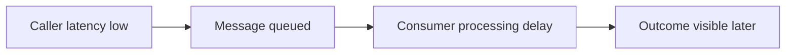

Jika user butuh outcome sekarang, queue bukan solusi. Queue hanya membuat sistem terlihat cepat sambil outcome belum selesai.

---

## 11. Batching Trade-Offs

Batching meningkatkan throughput dengan mengumpulkan beberapa item sebelum diproses/dikirim.

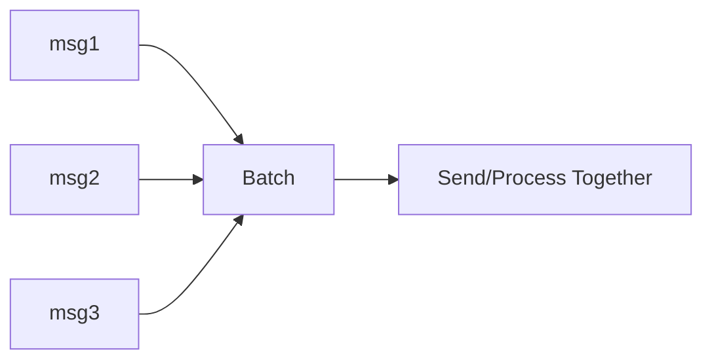

### 11.1 Benefit

- mengurangi per-request overhead,
- meningkatkan compression ratio,
- mengurangi network calls,
- meningkatkan broker/database throughput,
- mengurangi syscall overhead.

### 11.2 Cost

- menambah wait time,
- meningkatkan memory buffer,
- failure satu batch bisa memengaruhi banyak item,
- partial success handling lebih kompleks,
- retry batch bisa menduplikasi item yang sudah sukses,
- p99 latency bisa naik.

### 11.3 Decision Model

Gunakan batching jika:

- throughput lebih penting dari per-item latency,
- operasi idempotent,
- partial failure bisa ditangani,
- ada max batch size dan max linger time,
- memory bound jelas,
- observability per item tetap ada.

Hindari batching jika:

- user menunggu keputusan real-time,
- satu item failure tidak boleh menahan item lain,
- ordering strict dan batch retry membingungkan,
- payload sudah besar.

---

## 12. Backpressure: Preventing Work From Becoming Waste

Backpressure adalah mekanisme agar consumer/downstream dapat memberi sinyal bahwa ia tidak bisa menerima laju kerja saat ini.

Tanpa backpressure:

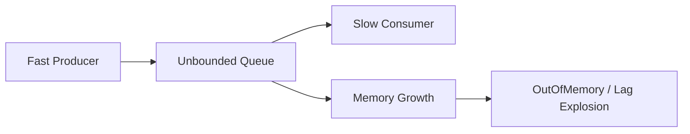

Dengan backpressure:

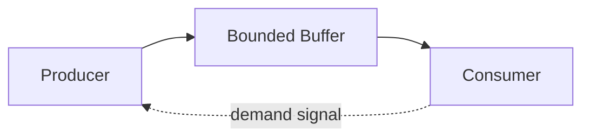

Reactive Streams secara eksplisit menargetkan asynchronous stream processing dengan non-blocking backpressure di JVM.

### 12.1 Backpressure Forms

| Form | Example |
|---|---|
| Bounded queue | Reject/enqueue only up to limit. |
| Semaphore | Limit concurrent calls. |
| Rate limit | Limit request rate. |
| Demand signal | Consumer requests N items. |
| TCP flow control | Network-level backpressure. |
| HTTP 429 | Server asks client to slow down. |
| Kafka consumer lag | Signal that processing cannot keep up. |
| Load shedding | Drop lower-priority work. |

### 12.2 Java Implication

Unbounded queues are almost always a reliability smell.

Bad:

```java
ExecutorService executor = Executors.newFixedThreadPool(32);
// Hidden unbounded queue depending on factory/mode can accumulate too much work.
```

Better explicit bound:

```java
ThreadPoolExecutor executor = new ThreadPoolExecutor(
        16,
        16,
        0L,
        TimeUnit.MILLISECONDS,
        new ArrayBlockingQueue<>(500),
        new ThreadPoolExecutor.AbortPolicy()
);
```

But rejection must be meaningful. Rejecting work without mapping to business behavior is just a different outage shape.

---

## 13. Load Shedding and Graceful Degradation

When system is overloaded, the worst strategy is to accept everything and fail slowly.

Load shedding intentionally rejects or drops work to protect critical capacity.

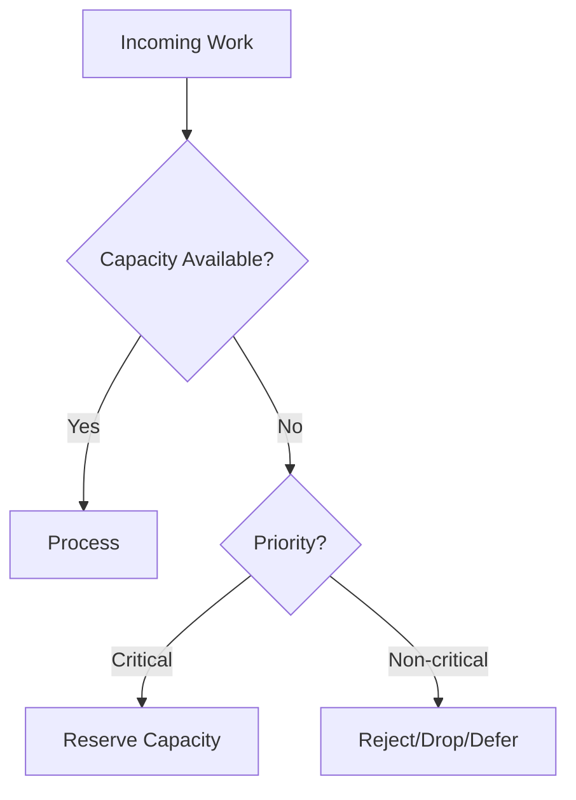

### 13.1 Priority Classes

| Priority | Example | Treatment |
|---|---|---|
| Critical | payment authorization, enforcement deadline submission | preserve capacity |
| Important | case detail query, customer profile update | degrade carefully |
| Optional | recommendation, analytics enrichment | drop/defer |
| Batch | backfill, report generation | pause/throttle |

### 13.2 Communication Design Implication

Client policy should know operation criticality.

```yaml
dependencies:
  payment-service:
    authorize:
      priority: critical
      timeout: 300ms
      bulkhead: payment-critical
    fetch-payment-history:
      priority: important
      timeout: 200ms
      fallback: cached-history
  recommendation-service:
    list-products:
      priority: optional
      timeout: 80ms
      fallback: empty-list
```

Jika semua request diberi priority sama, sistem tidak bisa degrade dengan elegan.

---

## 14. Caching Trade-Offs

Cache mengurangi latency dan load, tetapi memperkenalkan stale data.

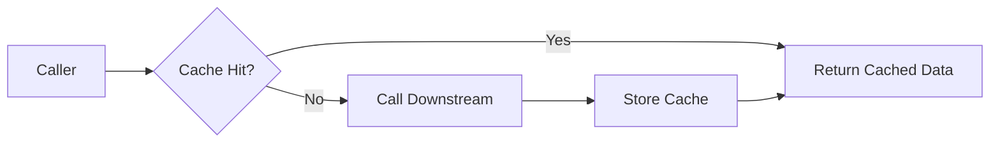

### 14.1 Cache Helps When

- read-heavy workload,
- data relatif stabil,
- stale value acceptable,
- downstream mahal/lambat,
- traffic punya locality,
- invalidation/reconciliation jelas.

### 14.2 Cache Hurts When

- correctness butuh data terbaru,
- invalidation sulit,
- cache stampede terjadi,
- stale value menyebabkan wrong business decision,
- cache menjadi hidden source of truth,
- observability tidak membedakan cache hit/miss.

### 14.3 Cache Stampede

Ketika popular key expired, banyak request memanggil downstream bersamaan.

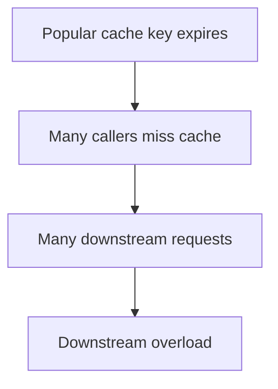

Mitigation:

- request coalescing,
- stale-while-revalidate,
- jittered TTL,
- soft expiration,
- pre-warming,
- per-key lock,
- rate limit misses.

---

## 15. Streaming Trade-Offs

Streaming cocok ketika data banyak, berkelanjutan, atau perlu dikirim seiring waktu.

Contoh:

- live status update,
- long-running job progress,
- market data,
- audit feed,
- event replay,
- file/chunk processing,
- telemetry stream.

### 15.1 Benefits

- avoids waiting for full result,
- lower memory for large result sets,
- natural backpressure if protocol supports it,
- better UX for progressive data,
- efficient for continuous updates.

### 15.2 Costs

- long-lived connection management,
- load balancing complexity,
- cancellation handling,
- partial result semantics,
- retry/resume protocol,
- backpressure correctness,
- observability complexity,
- server resource retention.

### 15.3 Streaming Is Not Pagination

Pagination:

```text
client asks page 1, page 2, page 3
```

Streaming:

```text
server/client maintain a flow of data over time
```

Gunakan pagination untuk browsing bounded data.

Gunakan streaming untuk continuous/unbounded/progressive delivery.

---

## 16. Reliability vs Correctness

Reliability sering disalahartikan sebagai “lebih banyak retry” atau “lebih banyak redundancy”.

Correctness bertanya:

> Apakah hasil bisnis tetap benar?

Contoh: payment command timeout.

Client mengirim:

```text
POST /payments/authorize
```

Timeout terjadi. Apakah payment berhasil di server?

Kemungkinan:

1. request tidak pernah sampai,
2. request sampai tetapi belum diproses,
3. request diproses dan authorization sukses,
4. response sukses hilang,
5. authorization gagal tetapi response hilang.

Tanpa idempotency key dan query-by-command-id, caller tidak tahu.

### 16.1 Correctness Pattern

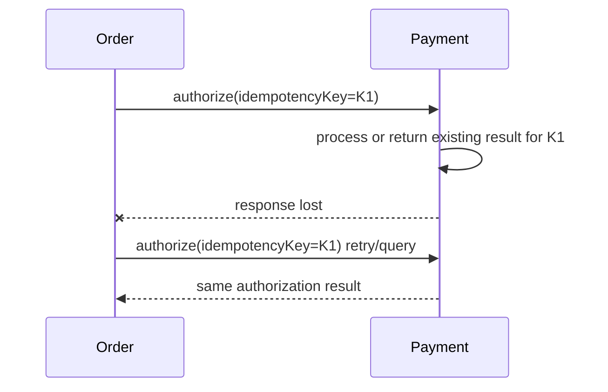

Reliability untuk side-effect command membutuhkan identity untuk command.

---

## 17. Communication SLOs

SLO komunikasi harus spesifik per operation, bukan per service global saja.

Buruk:

```text
PaymentService availability: 99.9%
```

Lebih berguna:

```yaml
payment-service:
  authorize-payment:
    availability: 99.95%
    latency:
      p50: 50ms
      p95: 180ms
      p99: 300ms
    error-budget-policy: protect-checkout
  get-payment-history:
    availability: 99.5%
    latency:
      p95: 400ms
      p99: 800ms
```

Different operations have different business criticality.

### 17.1 Dependency SLO

Caller harus tahu dependency SLO.

Jika caller endpoint menargetkan p99 500 ms, tidak masuk akal bergantung mandatory pada downstream dengan p99 900 ms.

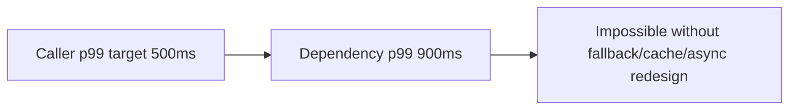

Jika target tidak cocok, pilihan desain:

- ubah requirement latency,
- jadikan dependency optional,
- gunakan cache/projection,
- pindahkan ke async,
- minta downstream memperbaiki SLO,
- split operation,
- precompute decision.

---

## 18. Cost of Observability

Observability bukan gratis, tetapi tanpa observability communication trade-off tidak terlihat.

Minimal metrics per dependency:

- request count,
- success count,
- error count by class,
- timeout count,
- retry count,
- circuit breaker state,
- in-flight requests,
- connection pool usage,
- latency histogram,
- payload size,
- queue lag,
- consumer processing time,
- DLQ count,
- dropped/deferred work.

### 18.1 Correlation

Trace harus menunjukkan:

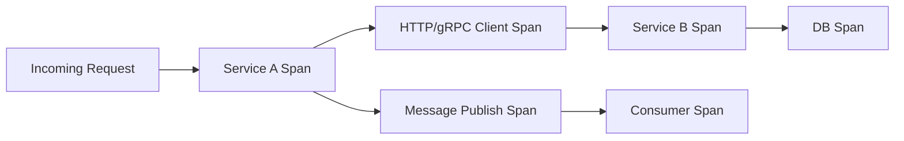

Tanpa trace/correlation, async flow menjadi susah dibuktikan saat incident.

---

## 19. Decision Matrix

Gunakan matrix ini sebagai starting point.

| Workload | Latency Need | Throughput Need | Reliability Need | Suggested Shape |
|---|---:|---:|---:|---|
| Payment authorization | Very high | Medium | Very high correctness | Sync HTTP/gRPC + idempotency + strict timeout |
| Notification email | Low | High | Medium | Async event/queue + retry + DLQ |
| Audit trail | Medium | High | Very high durability | Outbox + durable stream/log |
| Dashboard aggregation | Medium | Medium | Medium | API composition + cache + partial fallback |
| Case state transition | High | Medium | Very high correctness | Sync command or workflow engine + explicit state |
| Analytics enrichment | Low | Very high | Medium | Async stream/batch |
| Search indexing | Low | High | Eventual consistency acceptable | Event-driven projection + reconciliation |
| Inventory reservation | High | High | High correctness | Sync reservation or saga depending invariant |
| File processing | Low immediate, high background | High | High resumability | Async job + chunking + checkpoint |
| Live progress update | Medium | Medium | User-visible | SSE/WebSocket/gRPC streaming with resume strategy |

Matrix ini bukan jawaban final. Ia membantu memperjelas force utama.

---

## 20. Production Design Walkthrough: Order Confirmation

### 20.1 Requirement

User checkout harus mendapat jawaban dalam 1.5 detik p95.

Business invariant:

- order tidak boleh confirmed tanpa payment authorization,
- order tidak boleh confirmed tanpa inventory reservation,
- notification tidak wajib blocking,
- analytics tidak wajib blocking,
- shipment bisa dimulai setelah order confirmed.

### 20.2 Candidate Design A: Fully Synchronous

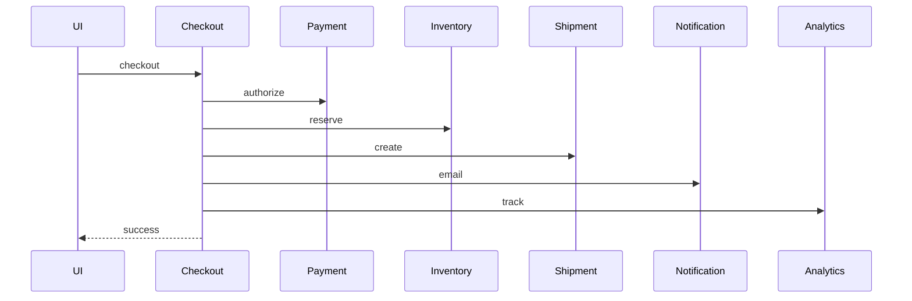

Pros:

- simple flow,
- immediate visibility,
- easy local reasoning.

Cons:

- latency high,
- availability chain poor,
- notification/analytics can break checkout,
- more tail amplification.

### 20.3 Candidate Design B: Hybrid Critical Sync + Async Side Effects

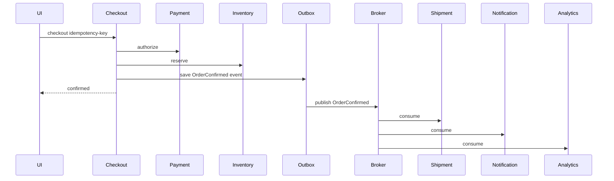

Pros:

- critical invariant remains immediate,
- side effects decoupled,
- lower user latency,
- more resilient to notification/analytics failure.

Cons:

- needs outbox,
- shipment/notification delay possible,
- needs lag monitoring,
- more operational components.

### 20.4 Candidate Design C: Fully Async Checkout

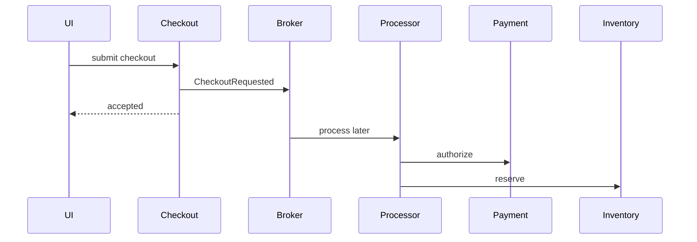

Pros:

- very low initial latency,
- handles burst well,
- decouples user submission from processing.

Cons:

- user does not know final result immediately,
- requires pending state UX,
- harder payment/inventory reservation semantics,
- not suitable if business promises instant confirmation.

### 20.5 Decision

If business requires immediate confirmation, choose Candidate B.

If business allows “order received, confirmation pending”, Candidate C can work.

The technology decision follows the user/business promise.

---

## 21. Java Configuration Template

A practical communication policy should be operation-specific.

```yaml
communication:
  defaults:
    connectTimeout: 100ms
    connectionAcquireTimeout: 50ms
    maxInFlight: 200
    metrics: true
    tracing: true

  dependencies:
    payment-service:
      baseUrl: http://payment-service
      operations:
        authorizePayment:
          criticality: critical
          totalBudget: 400ms
          attempts: 2
          perAttemptTimeout: 160ms
          backoffInitial: 40ms
          backoffMax: 80ms
          jitter: true
          circuitBreaker:
            failureRateThreshold: 30
            slowCallDurationThreshold: 250ms
            minimumNumberOfCalls: 50
          bulkhead:
            maxConcurrentCalls: 80
          idempotency: required

    recommendation-service:
      baseUrl: http://recommendation-service
      operations:
        listRecommendations:
          criticality: optional
          totalBudget: 100ms
          attempts: 1
          fallback: empty
          bulkhead:
            maxConcurrentCalls: 20

    notification-events:
      broker: kafka
      topic: order-events
      producer:
        acks: all
        enableIdempotence: true
        lingerMs: 10
        compression: zstd
      outbox: required
```

Key idea: policy belongs to dependency and operation, not globally to “all HTTP calls”.

---

## 22. Engineering Review Questions

Saat memilih pattern komunikasi, tanyakan:

1. Apa latency target user/business?
2. Apakah outcome harus selesai sebelum response?
3. Dependency mana yang mandatory?
4. Dependency mana yang optional?
5. Apa throughput peak dan burst profile?
6. Apa fan-out multiplier?
7. Apa retry multiplier?
8. Apa p99 downstream dibanding target caller?
9. Apa yang terjadi saat downstream slow, bukan down?
10. Apa yang terjadi saat response hilang setelah side effect?
11. Apakah operasi idempotent?
12. Apakah batching acceptable?
13. Apakah stale data acceptable?
14. Apakah queue delay acceptable?
15. Apakah replay aman?
16. Apakah ordering penting?
17. Apakah consumer bisa catch up setelah downtime?
18. Apa cost observability-nya?
19. Apakah operational team siap mengelola broker/mesh/gateway?
20. Apakah desain ini tetap benar saat traffic 10x dan dependency p99 naik 5x?

---

## 23. Anti-Patterns

### 23.1 Optimizing p50 While Ignoring p99

Sistem terlihat cepat di dashboard average, tetapi user tertentu sering timeout.

### 23.2 Retrying Non-Idempotent Commands

Retry payment/create-order tanpa idempotency key bisa menciptakan duplicate side effect.

### 23.3 Queue Everything

Queue digunakan untuk menyembunyikan dependency yang sebenarnya perlu jawaban immediate.

### 23.4 Sync Everything

Semua side effect dimasukkan ke user request path sampai notification/analytics outage menjatuhkan checkout.

### 23.5 Global Timeout

Satu timeout value untuk semua operation:

```yaml
timeout: 30s
```

Ini hampir pasti salah. Operation punya criticality dan budget berbeda.

### 23.6 Infinite Buffer

Queue/buffer tanpa bound tampak menyelesaikan burst, padahal hanya mengubah overload menjadi memory pressure dan delayed failure.

### 23.7 Observability After Incident

Metric dan trace baru ditambahkan setelah sistem gagal. Ini terlalu terlambat.

---

## 24. What You Should Internalize

Communication design adalah trade-off engineering.

Tidak ada jawaban universal seperti:

- “REST lebih baik dari gRPC.”
- “Kafka lebih scalable dari RabbitMQ.”
- “Async selalu lebih decoupled.”
- “Retry membuat sistem lebih reliable.”
- “Cache membuat sistem lebih cepat.”
- “Batching selalu meningkatkan performa.”

Semua tergantung force yang sedang dominan:

- Apakah latency user penting?
- Apakah throughput batch penting?
- Apakah outcome harus immediately correct?
- Apakah stale data boleh?
- Apakah duplicate side effect bisa diterima?
- Apakah operational complexity layak?
- Apakah failure mode sudah eksplisit?

Top engineer tidak memilih teknologi dari popularitas.

Top engineer memilih trade-off secara sadar, mendesain guardrail, lalu membuat konsekuensinya observable.

---

## References

- RFC 9110 — HTTP Semantics: https://www.rfc-editor.org/rfc/rfc9110.html
- gRPC Deadlines: https://grpc.io/docs/guides/deadlines/
- AWS Builders Library — Timeouts, retries, and backoff with jitter: https://builder.aws.com/content/3EumjoZascWd1oZiEgL8ORlv3qE/timeouts-retries-and-backoff-with-jitter
- AWS Architecture Blog — Exponential Backoff and Jitter: https://aws.amazon.com/blogs/architecture/exponential-backoff-and-jitter/
- Reactive Streams for the JVM: https://github.com/reactive-streams/reactive-streams-jvm
