------
title: Learn Java Microservices Communication - Part 007
description: Failure-first communication design untuk Java microservices: cara mendesain call, message, stream, timeout, retry, backpressure, fallback, dan observability dengan asumsi failure pasti terjadi.
series: learn-java-microservices-communication
seriesTitle: Learn Java Microservices Communication
order: 7
partTitle: Failure-First Communication Design
tags:
  - java
  - microservices
  - communication
  - failure
  - resilience
  - reliability
  - distributed-systems
  - architecture
date: 2026-07-05
---

# Part 007 — Failure-First Communication Design

> Communication design is not about making remote calls look local. It is about making remote failure explicit, bounded, observable, and survivable.

Dalam sistem monolitik, banyak function call gagal dengan cara yang relatif langsung:

- input invalid,
- exception thrown,
- memory error,
- deadlock,
- bug logic,
- process crash.

Dalam microservices, satu operasi bisnis bisa melewati banyak boundary:

- HTTP/gRPC call,
- gateway,
- load balancer,
- service mesh,
- DNS,
- broker,
- database,
- cache,
- queue,
- object storage,
- observability pipeline,
- third-party dependency.

Artinya, komunikasi bukan sekadar “cara service A memanggil service B”. Komunikasi adalah **failure propagation surface**.

Kalau desain komunikasi tidak failure-first, sistem biasanya tetap terlihat benar di local development, staging, dan demo. Masalah baru muncul ketika traffic nyata, latency tail, partial outage, deployment mismatch, network jitter, broker lag, retry storm, dan overload terjadi bersamaan.

Materi ini membangun cara berpikir failure-first untuk komunikasi Java microservices.

---

## 1. The Wrong Mental Model: Remote Call as Function Call

Kesalahan awal banyak engineer adalah memperlakukan remote call seperti function call lokal.

```java
PaymentResult result = paymentClient.charge(command);
```

Kode itu terlihat sederhana. Tetapi secara operasional, baris tersebut bisa berarti:

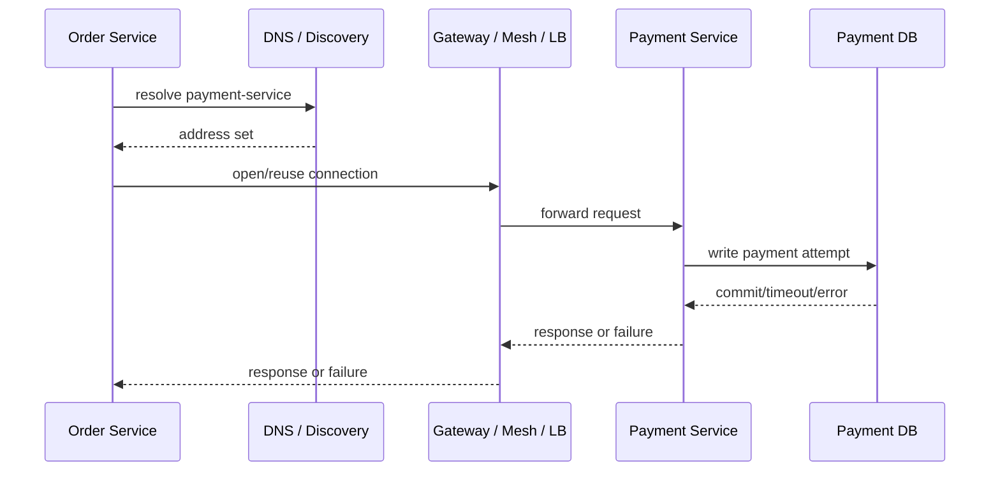

Setiap panah bisa gagal dengan bentuk berbeda.

Function call lokal memiliki karakteristik:

- caller dan callee berada di memory/process yang sama,
- latency relatif kecil dan predictable,
- failure biasanya eksplisit melalui exception/return value,
- tidak ada network partition,
- tidak ada duplicate delivery dari retry network,
- tidak ada independent deployment skew,
- tidak ada partial response di wire,
- tidak ada intermediate proxy yang bisa mengubah behavior.

Remote communication berbeda:

- caller bisa berhasil mengirim request tetapi gagal menerima response,
- callee bisa berhasil commit tetapi response hilang,
- retry bisa membuat operasi terjadi dua kali,
- timeout caller tidak berarti callee berhenti bekerja,
- response 500 tidak selalu berarti state tidak berubah,
- response 200 tidak selalu berarti semua downstream side effect selesai,
- latency bisa melonjak karena queueing, DNS, TLS, GC, CPU steal, broker lag, atau dependency overload.

Karena itu, rule pertama:

> Jangan sembunyikan remote communication di balik abstraction yang membuatnya terasa lokal.

Abstraction boleh ada, tetapi abstraction harus membawa semantics:

- timeout,
- deadline,
- retry policy,
- idempotency,
- error classification,
- correlation id,
- observability,
- fallback behavior,
- degradation mode,
- ownership boundary.

---

## 2. Failure-First Design Definition

**Failure-first communication design** adalah pendekatan mendesain komunikasi dengan urutan pertanyaan seperti ini:

1. Apa outcome bisnis yang harus tetap benar meskipun komunikasi gagal?
2. Failure apa yang mungkin terjadi di setiap boundary?
3. Failure mana yang aman untuk retry?
4. Failure mana yang harus fail fast?
5. Failure mana yang harus diubah menjadi async recovery?
6. Failure mana yang harus terlihat oleh user/operator?
7. Bagaimana sistem membatasi blast radius?
8. Bagaimana kita tahu failure sedang terjadi?
9. Bagaimana kita memulihkan state setelah partial success?
10. Apa invariant yang tidak boleh rusak?

Ini berbeda dari design-by-happy-path:

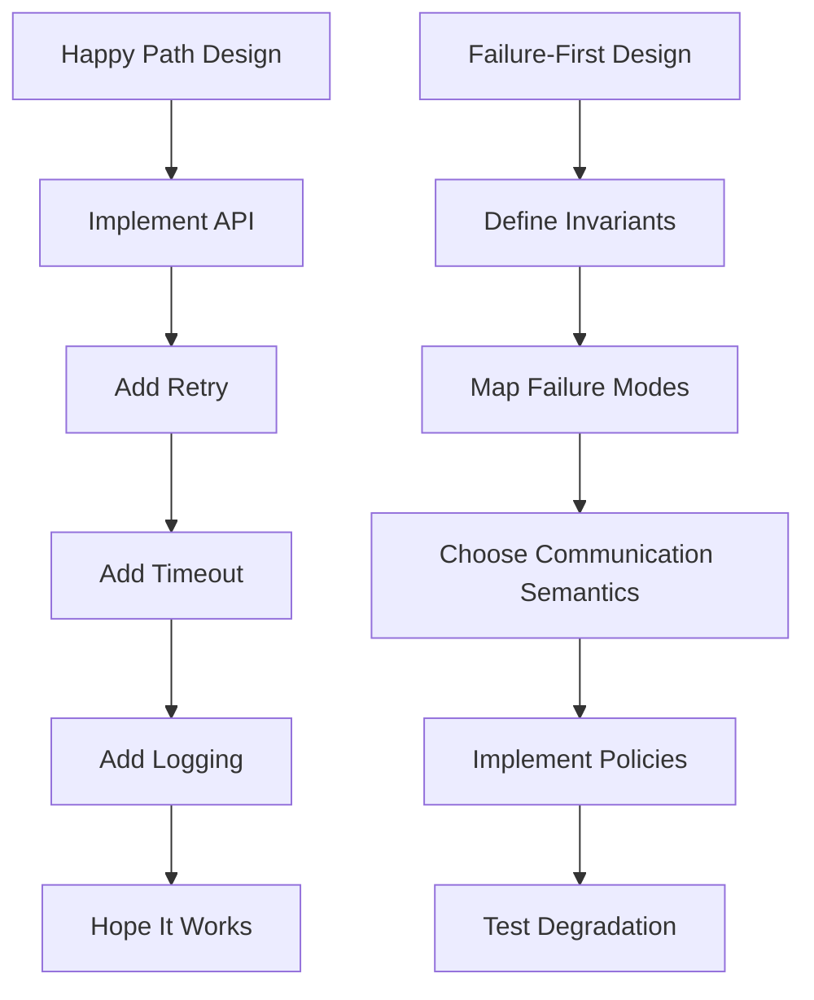

Failure-first bukan pesimisme. Ini bentuk engineering realism.

---

## 3. Communication Failure Taxonomy

Agar bisa mendesain failure handling, kita perlu taxonomy. Tanpa taxonomy, semua failure akan diperlakukan sama: retry, log, atau throw exception.

Itu berbahaya.

### 3.1 Transport Failure

Transport failure terjadi ketika data tidak bisa dikirim/diterima dengan benar.

Contoh:

- connection refused,
- connection reset,
- TLS handshake failure,
- DNS resolution failure,
- socket timeout,
- HTTP/2 stream reset,
- gRPC unavailable,
- broker connection dropped,
- proxy timeout,
- NAT exhaustion.

Ciri penting:

- caller mungkin tidak tahu apakah callee menerima request,
- safe retry tergantung operasi,
- retry tanpa idempotency bisa menyebabkan duplicate side effect.

### 3.2 Protocol Failure

Protocol failure terjadi ketika transport berhasil tetapi semantics tidak sesuai.

Contoh:

- HTTP 400 karena request invalid,
- HTTP 409 karena conflict,
- HTTP 429 karena throttled,
- HTTP 503 karena unavailable,
- gRPC `INVALID_ARGUMENT`,
- gRPC `DEADLINE_EXCEEDED`,
- malformed CloudEvent,
- unsupported schema version,
- missing correlation header,
- unexpected content type.

Ciri penting:

- tidak semua protocol error retryable,
- status code harus punya semantics operasional,
- error body harus machine-readable.

### 3.3 Application Failure

Application failure terjadi ketika business rule atau domain invariant menolak operasi.

Contoh:

- account suspended,
- insufficient balance,
- case already closed,
- payment already captured,
- enforcement action not allowed in current state,
- duplicate command,
- invalid transition,
- stale version.

Ciri penting:

- biasanya tidak boleh diretry secara buta,
- sering perlu diterjemahkan menjadi decision untuk caller,
- harus dibedakan dari infrastructure failure.

### 3.4 Temporal Failure

Temporal failure terjadi karena timing.

Contoh:

- timeout,
- stale read,
- race condition,
- out-of-order event,
- late message,
- clock skew,
- expired token,
- delayed visibility,
- consumer lag.

Ciri penting:

- operasi bisa benar secara individual tetapi salah secara urutan,
- retry bisa memperparah kalau state sudah berubah,
- butuh versioning, ordering key, deadline, dan reconciliation.

### 3.5 Capacity Failure

Capacity failure terjadi ketika sistem tidak lagi punya resource cukup.

Contoh:

- thread pool exhausted,
- connection pool exhausted,
- broker queue depth terlalu tinggi,
- consumer lag meningkat,
- CPU saturated,
- memory pressure,
- GC pause,
- DB pool penuh,
- file descriptor exhausted,
- ephemeral port exhaustion.

Ciri penting:

- retry biasanya memperburuk,
- perlu shedding/throttling/backpressure,
- perlu observability terhadap queue dan resource, bukan hanya error count.

### 3.6 Dependency Failure

Dependency failure terjadi ketika service kita sehat tetapi dependency tidak.

Contoh:

- payment provider down,
- inventory service slow,
- identity provider degraded,
- Kafka cluster under-replicated,
- Redis eviction storm,
- downstream deployment bug,
- schema registry unavailable.

Ciri penting:

- kesehatan service tidak cukup dilihat dari process liveness,
- service harus punya dependency-aware readiness/degradation,
- failure harus dibatasi agar tidak merusak semua endpoint.

### 3.7 Human and Deployment Failure

Banyak communication incident bukan karena algoritma, tetapi karena perubahan.

Contoh:

- deploy client sebelum server support field baru,
- menghapus enum yang masih dipakai consumer,
- salah config timeout,
- retry policy terlalu agresif,
- DNS record salah,
- mTLS certificate expired,
- topic name salah,
- ACL broker berubah,
- gateway route salah,
- service mesh policy memblokir traffic.

Ciri penting:

- butuh compatibility discipline,
- butuh rollout strategy,
- butuh config validation,
- butuh automated smoke test dan canary.

---

## 4. Failure Matrix

Dalam desain komunikasi, setiap integration harus punya failure matrix.

```md
Integration: Order Service -> Payment Service
Transport: HTTP/gRPC
Operation: authorizePayment
Criticality: High
Side effect: Yes
Retryable: Conditional
Idempotency required: Yes
Fallback allowed: No for capture, Yes for status query
User-visible: Yes
Operator-visible: Yes
```

Contoh matrix:

| Failure | Example | Safe retry? | Caller behavior | Operator signal |
|---|---|---:|---|---|
| DNS failure | cannot resolve service | maybe | retry with budget, then fail fast | dependency error |
| connect timeout | no connection | maybe | retry if idempotent | latency/connect metric |
| read timeout | no response | dangerous | retry only with idempotency key | timeout rate |
| HTTP 400 | invalid request | no | bug or validation error | error budget burn if unexpected |
| HTTP 409 | state conflict | no/semantic | refresh/reconcile | business conflict metric |
| HTTP 429 | throttled | yes with backoff | respect retry-after | throttling metric |
| HTTP 500 | unknown server error | maybe | retry with idempotency | downstream 5xx |
| HTTP 503 | unavailable | yes limited | backoff/circuit break | dependency unavailable |
| partial success | commit happened, response lost | no blind retry | query by idempotency key | reconciliation alert |
| slow response | near timeout | maybe no | deadline fail | p95/p99 latency |

Matrix ini bukan dokumentasi mati. Ini harus memengaruhi implementasi.

---

## 5. The Core Failure-First Rule: Unknown Outcome Is the Dangerous State

Remote communication sering menghasilkan tiga outcome, bukan dua.

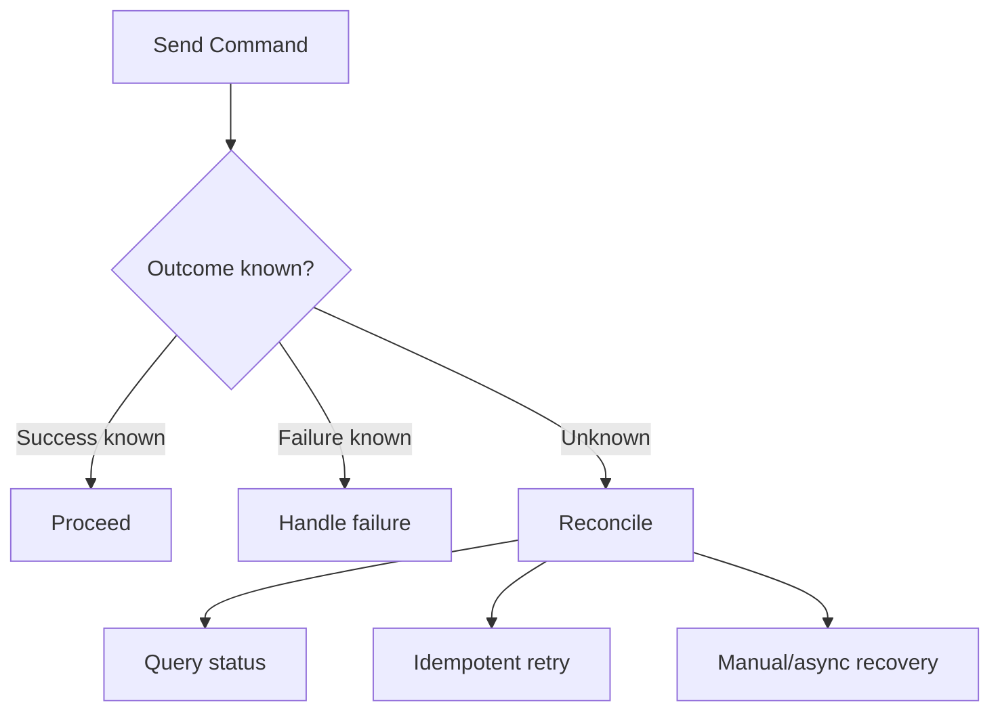

Dalam local function call, kita sering berpikir:

```text
success or failure
```

Dalam distributed communication, model yang lebih benar adalah:

```text
success, rejected, failed-before-effect, failed-after-effect, unknown
```

`unknown` adalah sumber banyak bug produksi.

Contoh payment:

1. Order Service mengirim `authorizePayment`.
2. Payment Service menerima request.
3. Payment Service berhasil menyimpan authorization.
4. Response hilang karena timeout.
5. Order Service menganggap gagal.
6. Order Service retry tanpa idempotency key.
7. Payment ter-authorize dua kali.

Masalahnya bukan timeout. Masalahnya adalah tidak ada desain untuk unknown outcome.

Untuk command yang punya side effect, desain aman biasanya membutuhkan minimal satu dari:

- idempotency key,
- operation id,
- business transaction id,
- deduplication store,
- status query endpoint,
- transactional outbox,
- saga/reconciliation process,
- manual exception queue.

---

## 6. Failure Propagation and Blast Radius

Failure jarang berhenti di tempat pertama.

Satu service lambat bisa membuat caller menunggu. Caller yang menunggu menahan thread. Thread habis. Caller menjadi lambat. Caller dari caller ikut lambat. Akhirnya sistem yang awalnya hanya punya satu dependency bermasalah berubah menjadi incident global.

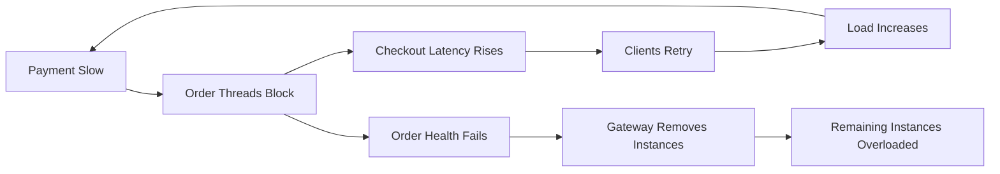

Failure-first design selalu menanyakan:

> Jika dependency ini gagal, apa yang ikut gagal, seberapa cepat, dan seberapa luas?

Blast radius dikendalikan dengan:

- timeout yang lebih pendek dari caller budget,
- per-dependency connection pool,
- per-dependency thread pool/bulkhead,
- circuit breaker,
- bounded queue,
- rate limiting,
- load shedding,
- fallback yang aman,
- cache/stale read bila semantics memperbolehkan,
- async recovery untuk side effect tertentu,
- isolation antar endpoint critical dan non-critical.

---

## 7. Timeout Is Not a Number; Timeout Is a Contract

Timeout bukan angka asal seperti `30s`.

Timeout adalah kontrak antara:

- caller latency budget,
- callee expected processing time,
- network overhead,
- retry strategy,
- user experience,
- resource protection,
- business criticality.

Contoh buruk:

```yaml
paymentClient:
  timeout: 60s
  retry: 3
```

Jika setiap request bisa menunggu 60 detik dan retry 3 kali, satu operasi bisa menahan resource sangat lama.

Contoh lebih baik:

```yaml
checkout:
  totalDeadline: 1500ms
  dependencies:
    paymentAuthorization:
      connectTimeout: 100ms
      responseTimeout: 700ms
      maxAttempts: 2
      backoff: 50ms-150ms
      idempotencyRequired: true
    fraudScore:
      responseTimeout: 250ms
      maxAttempts: 1
      fallback: conservative-review
    promotion:
      responseTimeout: 150ms
      maxAttempts: 1
      fallback: no-promotion
```

Timeout harus mengikuti hirarki:

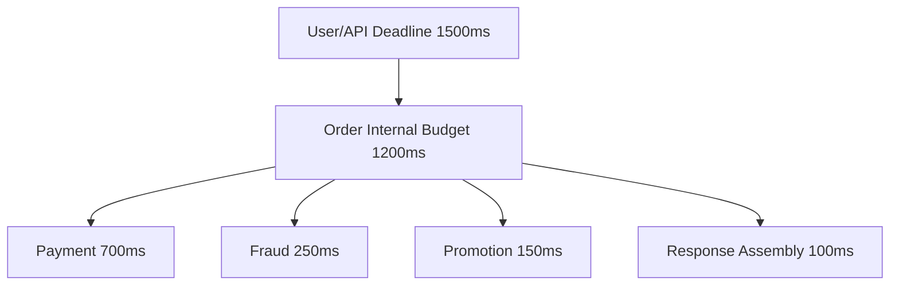

Rule:

> Downstream timeout harus lebih kecil dari upstream deadline, dan retry harus masuk dalam total budget.

---

## 8. Deadline Propagation

Timeout lokal hanya melindungi satu call. Deadline propagation melindungi seluruh call chain.

Tanpa deadline propagation:

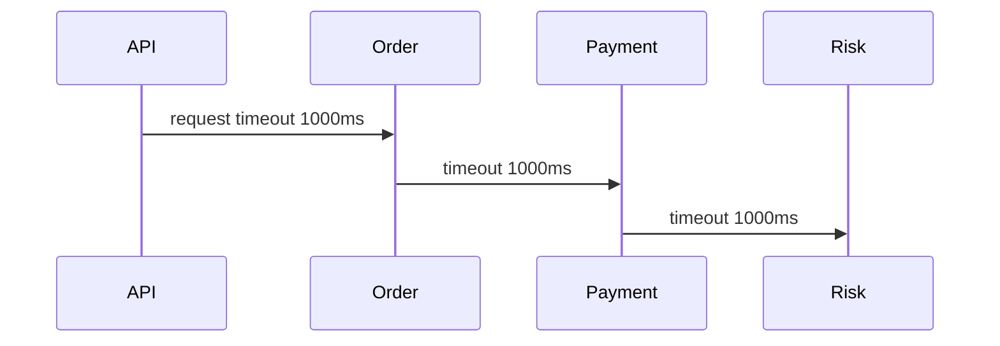

Ini salah karena setiap hop memperlakukan dirinya seolah punya budget penuh.

Dengan deadline propagation:

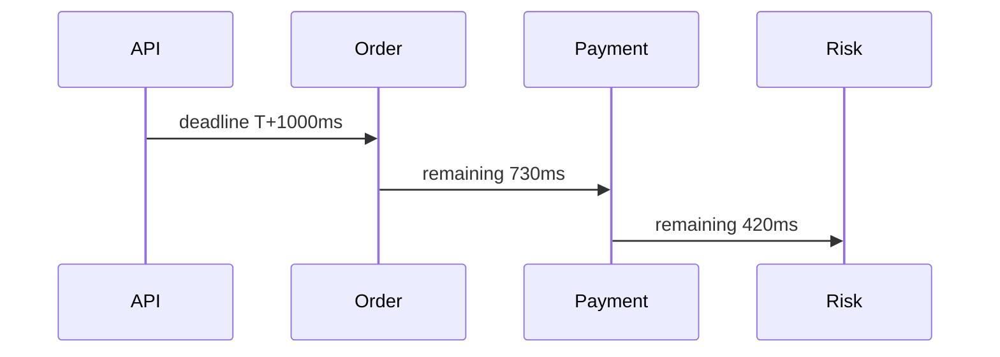

Dalam HTTP internal, deadline bisa dipropagasikan dengan header, misalnya:

```text
X-Request-Deadline: 2026-07-05T10:15:30.250Z
X-Request-Timeout-Ms: 700
```

Dalam gRPC, deadline adalah konsep native yang bisa dipropagasikan via context.

Di Java, abstraction sederhana:

```java
import java.time.Clock;
import java.time.Duration;
import java.time.Instant;
import java.util.Optional;

public final class Deadline {
    private final Instant expiresAt;
    private final Clock clock;

    public Deadline(Instant expiresAt, Clock clock) {
        this.expiresAt = expiresAt;
        this.clock = clock;
    }

    public static Deadline after(Duration duration, Clock clock) {
        return new Deadline(clock.instant().plus(duration), clock);
    }

    public Duration remaining() {
        Duration remaining = Duration.between(clock.instant(), expiresAt);
        return remaining.isNegative() ? Duration.ZERO : remaining;
    }

    public boolean expired() {
        return !clock.instant().isBefore(expiresAt);
    }

    public Optional<Duration> remainingIfEnough(Duration minimumUsefulTime) {
        Duration r = remaining();
        return r.compareTo(minimumUsefulTime) >= 0 ? Optional.of(r) : Optional.empty();
    }

    public Instant expiresAt() {
        return expiresAt;
    }
}
```

Lalu caller:

```java
public PaymentDecision authorizePayment(CheckoutCommand command, Deadline deadline) {
    Duration minimumUsefulTime = Duration.ofMillis(150);

    Duration timeout = deadline.remainingIfEnough(minimumUsefulTime)
            .orElseThrow(() -> new DeadlineTooSmallException("No useful budget for payment authorization"));

    return paymentClient.authorize(command, timeout);
}
```

Prinsipnya:

- jangan mulai remote call jika remaining deadline sudah tidak cukup,
- jangan retry jika retry tidak mungkin selesai dalam deadline,
- jangan biarkan callee terus bekerja setelah caller sudah menyerah,
- bedakan timeout karena dependency lambat vs deadline upstream habis.

---

## 9. Retry Is a Load Multiplier

Retry sering dianggap reliability feature. Dalam kondisi sehat, retry bisa menyembunyikan transient failure. Dalam kondisi overload, retry bisa menjadi amplifier.

Contoh:

```text
1000 request/s
x 3 attempts
= 3000 downstream attempts/s
```

Jika dependency sedang overload pada 1000 request/s, retry menjadikannya semakin overload.

Retry harus punya guardrail:

| Guardrail | Reason |
|---|---|
| retry only retryable errors | jangan retry validation/business error |
| retry only idempotent operation | hindari duplicate side effect |
| bounded attempts | cegah retry storm |
| exponential backoff | beri waktu dependency pulih |
| jitter | cegah semua client retry bersamaan |
| retry budget | batasi total retry sebagai persentase traffic |
| deadline-aware retry | jangan retry jika tidak ada waktu |
| circuit breaker | stop retry ke dependency yang jelas rusak |
| observability | retry count harus terlihat |

Retry policy buruk:

```java
for (int i = 0; i < 3; i++) {
    try {
        return call();
    } catch (Exception ignored) {
    }
}
throw new RuntimeException("failed");
```

Masalah:

- semua exception dianggap sama,
- tidak ada backoff,
- tidak ada jitter,
- tidak ada deadline,
- tidak ada idempotency awareness,
- tidak ada observability,
- error asli hilang,
- interrupt/cancellation bisa tertelan.

Retry policy lebih baik secara konsep:

```java
public final class RetryDecision {
    public enum Action { RETRY, FAIL }

    private final Action action;
    private final Duration delay;
    private final String reason;

    private RetryDecision(Action action, Duration delay, String reason) {
        this.action = action;
        this.delay = delay;
        this.reason = reason;
    }

    public static RetryDecision retryAfter(Duration delay, String reason) {
        return new RetryDecision(Action.RETRY, delay, reason);
    }

    public static RetryDecision fail(String reason) {
        return new RetryDecision(Action.FAIL, Duration.ZERO, reason);
    }

    public boolean shouldRetry() {
        return action == Action.RETRY;
    }

    public Duration delay() {
        return delay;
    }

    public String reason() {
        return reason;
    }
}
```

```java
public RetryDecision classify(Throwable failure, int attempt, Deadline deadline, boolean idempotent) {
    if (attempt >= 2) {
        return RetryDecision.fail("max_attempts_reached");
    }

    if (!idempotent) {
        return RetryDecision.fail("operation_not_idempotent");
    }

    if (deadline.remaining().compareTo(Duration.ofMillis(200)) < 0) {
        return RetryDecision.fail("not_enough_deadline_remaining");
    }

    if (failure instanceof ValidationException) {
        return RetryDecision.fail("non_retryable_validation_error");
    }

    if (failure instanceof RateLimitedException rateLimited) {
        return RetryDecision.retryAfter(rateLimited.retryAfter(), "rate_limited");
    }

    if (failure instanceof TimeoutException || failure instanceof TransientNetworkException) {
        return RetryDecision.retryAfter(jitter(Duration.ofMillis(50), Duration.ofMillis(150)), "transient_failure");
    }

    return RetryDecision.fail("unknown_non_retryable_failure");
}
```

Failure-first retry bukan “coba lagi”. Failure-first retry adalah **controlled re-attempt under semantic safety**.

---

## 10. Idempotency Is the Price of Safe Retry

Idempotency berarti operasi bisa dijalankan lebih dari sekali tanpa mengubah final state lebih dari sekali.

Dalam HTTP semantics, `GET`, `PUT`, dan `DELETE` memiliki idempotency semantics tertentu. Tetapi di microservices command API, banyak operasi memakai `POST` karena membuat action/domain command. Untuk command seperti itu, idempotency harus didesain eksplisit.

Contoh header:

```text
Idempotency-Key: checkout-20260705-user-456-order-789-payment-auth
```

Tapi header saja tidak cukup. Callee harus menyimpan hasil.

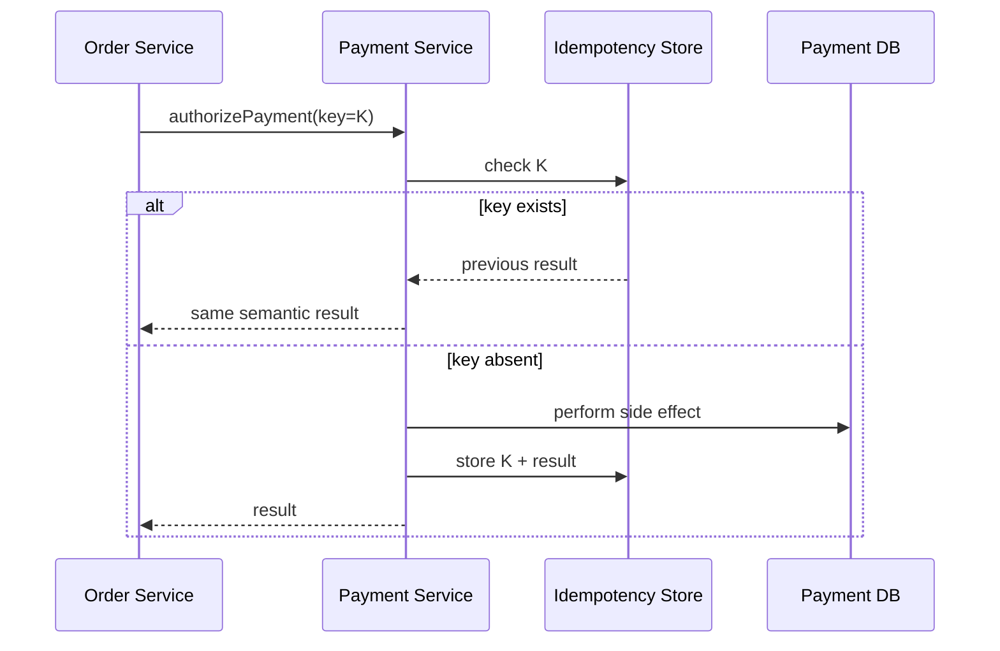

Minimal idempotency record:

```sql
CREATE TABLE idempotency_record (
    key             VARCHAR(200) PRIMARY KEY,
    operation       VARCHAR(100) NOT NULL,
    request_hash    VARCHAR(128) NOT NULL,
    status          VARCHAR(30)  NOT NULL,
    response_code   VARCHAR(50),
    response_body   JSONB,
    created_at      TIMESTAMPTZ NOT NULL,
    expires_at      TIMESTAMPTZ NOT NULL
);
```

Rule penting:

- key harus unik untuk logical operation,
- request hash harus dicek agar key tidak dipakai untuk payload berbeda,
- result harus disimpan cukup lama untuk retry window,
- in-progress state harus ditangani,
- conflict harus eksplisit,
- idempotency tidak boleh hanya disimpan di memory lokal.

---

## 11. Circuit Breaker: Stop Digging

Circuit breaker membatasi call ke dependency yang sedang gagal.

Tanpa circuit breaker:

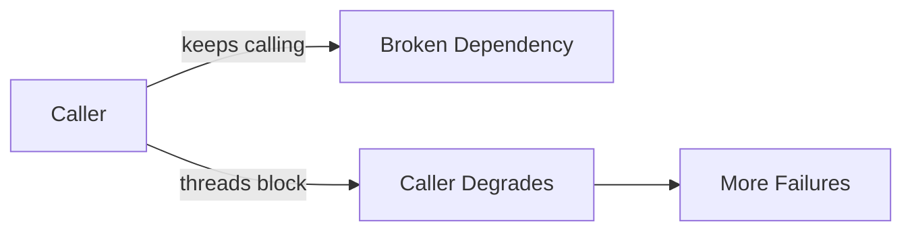

Dengan circuit breaker:

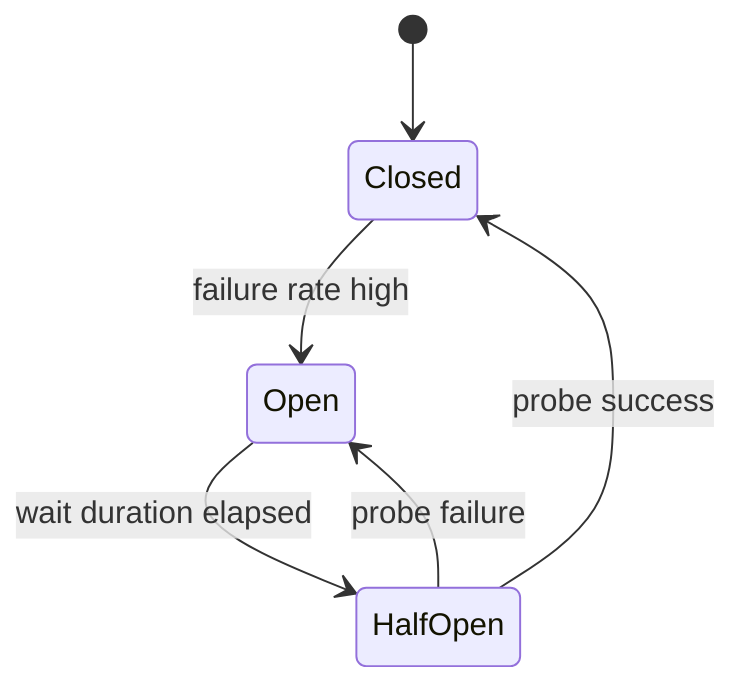

Circuit breaker bukan pengganti timeout. Timeout menentukan kapan satu call dianggap gagal. Circuit breaker menentukan kapan dependency dianggap tidak layak dipanggil sementara.

Circuit breaker harus dipakai hati-hati:

- terlalu sensitif → false open,
- terlalu lambat → tidak melindungi caller,
- shared breaker terlalu luas → satu endpoint failure memblokir endpoint lain,
- breaker tanpa observability → operator tidak tahu dependency ditolak,
- breaker dengan fallback salah → menyembunyikan outage yang seharusnya visible.

Granularity yang umum:

```text
service + operation + criticality
```

Bukan hanya:

```text
service
```

Karena `payment.authorize` dan `payment.getStatus` bisa punya profile berbeda.

---

## 12. Bulkhead: Do Not Let One Dependency Consume the Whole Ship

Bulkhead berasal dari konsep kapal: sekat antar ruang membuat kebocoran tidak menenggelamkan seluruh kapal.

Dalam Java service, bulkhead bisa berupa:

- separate thread pool,
- semaphore limit,
- separate connection pool,
- bounded queue,
- per-endpoint concurrency limit,
- per-tenant resource partition,
- per-dependency client instance.

Contoh bahaya tanpa bulkhead:

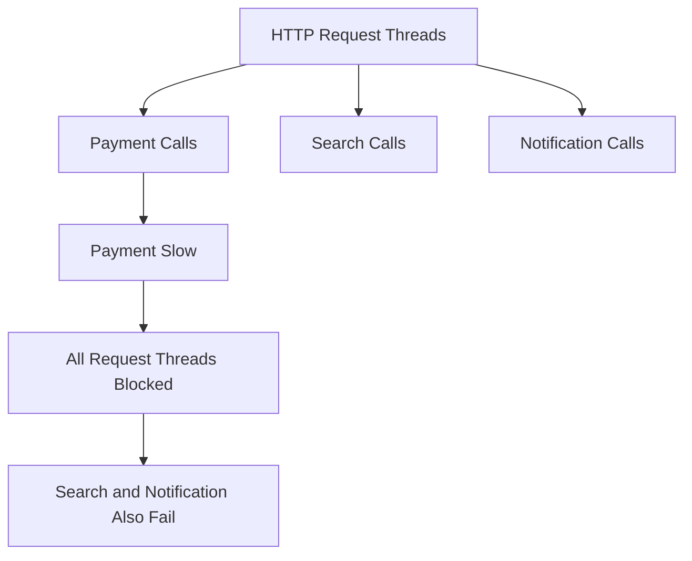

Dengan bulkhead:

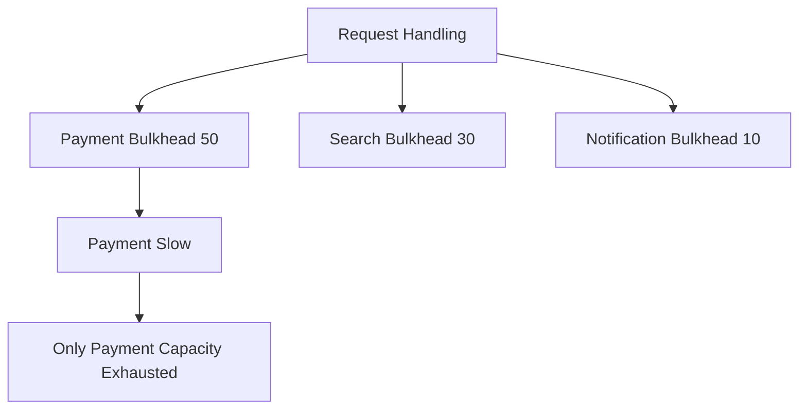

Rule:

> Shared pool is shared fate.

Kalau dependency berbeda memakai pool yang sama, failure satu dependency bisa mencuri resource dependency lain.

---

## 13. Backpressure and Load Shedding

Backpressure adalah sinyal: “saya tidak bisa menerima lebih banyak work secepat ini.”

Load shedding adalah keputusan: “saya akan menolak sebagian work agar sistem tetap hidup.”

Dalam synchronous HTTP:

- return `429 Too Many Requests`,
- return `503 Service Unavailable`,
- include `Retry-After` jika masuk akal,
- reject before expensive work,
- prefer fail fast over queue forever.

Dalam messaging:

- pause consumer,
- reduce max poll records,
- slow down producers,
- apply per-key/per-tenant quotas,
- move poison messages,
- avoid unbounded internal queues.

Dalam streaming:

- use Reactive Streams request-n demand,
- bound buffers,
- cancel slow subscriptions,
- degrade fidelity,
- sample or drop non-critical updates.

Anti-pattern:

```java
BlockingQueue<Event> queue = new LinkedBlockingQueue<>(); // unbounded
```

Lebih aman:

```java
BlockingQueue<Event> queue = new ArrayBlockingQueue<>(10_000);

boolean accepted = queue.offer(event, 50, TimeUnit.MILLISECONDS);
if (!accepted) {
    throw new OverloadedException("internal_queue_full");
}
```

Unbounded queue tidak menghilangkan overload. Ia mengubah overload menjadi latency, memory pressure, dan crash yang lebih lambat.

---

## 14. Fallback: Useful Only If Semantically Honest

Fallback sering disalahgunakan.

Fallback buruk:

```java
try {
    return paymentClient.authorize(command);
} catch (Exception e) {
    return PaymentDecision.approved(); // dangerous
}
```

Fallback aman harus menjawab:

1. Apakah fallback mempertahankan invariant bisnis?
2. Apakah fallback terlihat di telemetry?
3. Apakah fallback terlihat ke caller/user bila perlu?
4. Apakah fallback menghasilkan debt yang perlu direconcile?
5. Apakah fallback boleh dipakai untuk command atau hanya query?

Contoh fallback yang masuk akal:

| Operation | Fallback |
|---|---|
| promotion lookup | proceed without promotion |
| recommendation | empty recommendation |
| fraud score | route to manual review |
| case note search | show stale cached result |
| payment capture | no fallback; fail or async recovery |
| authorization decision | fail closed if risk unknown |

Dalam regulatory/enforcement lifecycle, fallback sering harus konservatif:

- jika audit context tidak tersedia, jangan lanjutkan irreversible action,
- jika authorization context tidak valid, fail closed,
- jika notification gagal, simpan outbox untuk retry,
- jika reporting sink gagal, jangan hilangkan event; buffer/retry dengan bounded policy,
- jika read model stale, label sebagai stale atau block decision kritis.

---

## 15. Async Does Not Remove Failure; It Moves Failure

Mengubah HTTP call menjadi event/message tidak menghapus failure. Ia mengubah bentuk failure.

Synchronous failure:

- caller menunggu,
- user bisa menerima error langsung,
- latency terlihat,
- call chain coupling tinggi,
- outcome cepat diketahui atau unknown.

Asynchronous failure:

- caller tidak menunggu processing selesai,
- user mungkin melihat accepted/pending,
- consumer bisa lag,
- message bisa duplicate,
- ordering bisa berubah,
- poison message bisa memblokir partition/queue,
- outcome perlu status tracking.

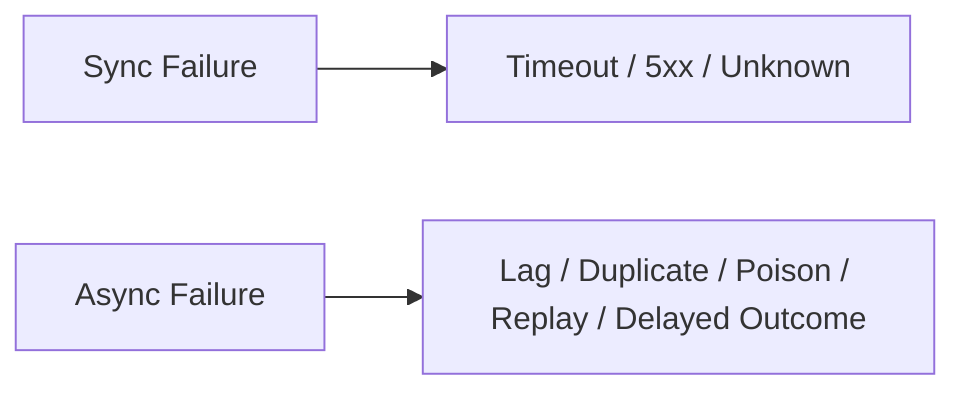

Failure-first async design membutuhkan:

- durable message store/broker,
- idempotent consumer,
- delivery semantics eksplisit,
- ordering key,
- dead-letter strategy,
- replay strategy,
- processing status,
- correlation id,
- monitoring lag,
- alerting on stuck messages,
- reconciliation.

Jangan mengatakan “pakai event agar reliable” tanpa menjawab bagaimana duplicate, order, replay, dan poison message ditangani.

---

## 16. Failure-First API Contract

Setiap operation contract seharusnya tidak hanya punya request/response schema, tetapi juga failure semantics.

Contoh contract snippet:

```yaml
operation: authorizePayment
transport: http
method: POST
path: /internal/payments/authorizations
sideEffect: true
idempotency:
  required: true
  keyHeader: Idempotency-Key
  keyScope: merchantId + orderId + paymentAttemptId
retries:
  callerMayRetry: true
  conditions:
    - connect_timeout
    - 503
    - 429_with_retry_after
  maxRecommendedAttempts: 2
timeouts:
  recommendedClientTimeoutMs: 700
  maxServerProcessingMs: 600
unknownOutcome:
  resolution: GET /internal/payments/authorizations/{paymentAttemptId}
errors:
  validation: non_retryable
  insufficient_funds: non_retryable_business_rejection
  provider_timeout: retryable_if_idempotent
  duplicate_key_different_payload: conflict
observability:
  requiredHeaders:
    - X-Request-Id
    - Traceparent
    - Idempotency-Key
```

Ini lebih berguna daripada hanya schema JSON.

---

## 17. Error Classification Model

Error harus diklasifikasikan berdasarkan tindakan caller.

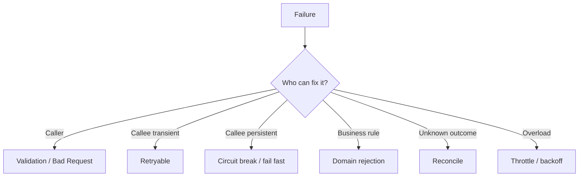

Kategori praktis:

| Category | Meaning | Caller action |
|---|---|---|
| `invalid_request` | caller sent bad data | do not retry |
| `unauthorized_context` | auth/context invalid | refresh/fail closed |
| `business_rejected` | valid request, domain rejects | do not retry blindly |
| `conflict` | state/version conflict | reload/reconcile |
| `rate_limited` | callee protects capacity | backoff respecting hint |
| `dependency_unavailable` | downstream unavailable | retry limited/circuit break |
| `deadline_exceeded` | no useful time left | fail/async recovery |
| `unknown_outcome` | side effect may have happened | query/reconcile |
| `overloaded` | caller/callee capacity exceeded | shed/backoff |

Java exception hierarchy should preserve this classification:

```java
public sealed interface RemoteFailure permits
        InvalidRemoteRequest,
        RemoteBusinessRejection,
        RemoteConflict,
        RemoteRateLimited,
        RemoteUnavailable,
        RemoteDeadlineExceeded,
        RemoteUnknownOutcome,
        RemoteOverloaded {

    String category();
    boolean retryable();
    boolean outcomeKnown();
}
```

Tujuannya bukan membuat hierarchy cantik. Tujuannya agar policy bisa deterministic.

---

## 18. Observability Is Part of Failure Handling

Failure yang tidak terlihat akan berubah menjadi rumor.

Communication observability minimal:

- request rate,
- error rate by category,
- latency p50/p95/p99,
- timeout count,
- retry attempts,
- retry exhausted,
- circuit breaker state,
- bulkhead rejection,
- rate limit rejection,
- queue depth,
- consumer lag,
- DLQ count,
- unknown outcome count,
- fallback count,
- stale response count,
- dependency availability,
- trace with correlation id.

Logging saja tidak cukup.

Metric harus menjawab:

1. Apakah dependency sedang lambat?
2. Apakah caller memperparah dengan retry?
3. Apakah rejection meningkat?
4. Apakah breaker open?
5. Apakah queue mulai menumpuk?
6. Apakah unknown outcome terjadi?
7. Apakah fallback menyembunyikan problem?
8. Apakah ada tenant/client tertentu yang menyebabkan overload?

Trace harus menunjukkan chain:

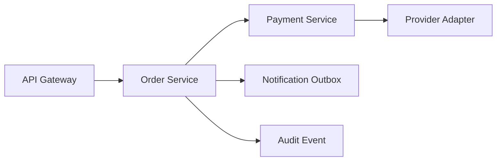

Setiap span harus membawa semantic attributes yang cukup:

- service,
- operation,
- dependency,
- protocol,
- status,
- error category,
- retry attempt,
- idempotency key hash,
- deadline remaining,
- correlation id.

Jangan log full idempotency key atau payload sensitif jika mengandung PII/secret.

---

## 19. Failure-First Design Workflow

Gunakan workflow ini setiap kali membuat integration baru.

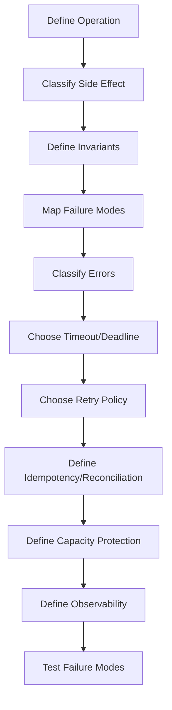

### Step 1 — Define operation

Jelaskan operasi dalam kalimat bisnis.

Buruk:

```text
Call payment service.
```

Baik:

```text
Authorize a payment attempt for a specific checkout session exactly once from the merchant's perspective.
```

### Step 2 — Classify side effect

| Type | Example | Failure implication |
|---|---|---|
| pure query | get case summary | fallback/cache possible |
| state-changing command | close case | idempotency/reconciliation needed |
| external irreversible side effect | capture payment | strict unknown-outcome handling |
| notification | send email | outbox/retry acceptable |
| audit event | record enforcement action | must not silently drop |

### Step 3 — Define invariant

Contoh:

```text
A payment attempt must not be authorized more than once for the same order and provider attempt id.
```

### Step 4 — Map failure modes

Buat failure matrix.

### Step 5 — Choose policy

Jangan copy policy global. Pilih berdasarkan operation.

### Step 6 — Make failure observable

Tambahkan metric/trace/log before production.

### Step 7 — Test failure

Test bukan hanya happy path:

- dependency timeout,
- response lost,
- duplicate request,
- 429,
- 503,
- stale version,
- slow response,
- connection reset,
- circuit breaker open,
- bulkhead full,
- DLQ path,
- replay path.

---

## 20. Production Java Design Skeleton

Berikut skeleton sederhana untuk memperlihatkan struktur, bukan framework final.

```java
public final class RemoteCallPolicy {
    private final Duration connectTimeout;
    private final Duration responseTimeout;
    private final int maxAttempts;
    private final boolean idempotencyRequired;
    private final boolean fallbackAllowed;

    public RemoteCallPolicy(
            Duration connectTimeout,
            Duration responseTimeout,
            int maxAttempts,
            boolean idempotencyRequired,
            boolean fallbackAllowed
    ) {
        this.connectTimeout = connectTimeout;
        this.responseTimeout = responseTimeout;
        this.maxAttempts = maxAttempts;
        this.idempotencyRequired = idempotencyRequired;
        this.fallbackAllowed = fallbackAllowed;
    }

    public Duration responseTimeout() {
        return responseTimeout;
    }

    public int maxAttempts() {
        return maxAttempts;
    }

    public boolean idempotencyRequired() {
        return idempotencyRequired;
    }

    public boolean fallbackAllowed() {
        return fallbackAllowed;
    }
}
```

```java
public final class RemoteOperationContext {
    private final String operation;
    private final String correlationId;
    private final String idempotencyKey;
    private final Deadline deadline;

    public RemoteOperationContext(
            String operation,
            String correlationId,
            String idempotencyKey,
            Deadline deadline
    ) {
        this.operation = operation;
        this.correlationId = correlationId;
        this.idempotencyKey = idempotencyKey;
        this.deadline = deadline;
    }

    public String operation() { return operation; }
    public String correlationId() { return correlationId; }
    public String idempotencyKey() { return idempotencyKey; }
    public Deadline deadline() { return deadline; }
}
```

```java
public final class PaymentGateway {
    private final PaymentHttpClient client;
    private final RemoteCallPolicy policy;
    private final CommunicationMetrics metrics;

    public PaymentGateway(PaymentHttpClient client, RemoteCallPolicy policy, CommunicationMetrics metrics) {
        this.client = client;
        this.policy = policy;
        this.metrics = metrics;
    }

    public PaymentAuthorization authorize(PaymentCommand command, RemoteOperationContext ctx) {
        if (policy.idempotencyRequired() && ctx.idempotencyKey() == null) {
            throw new IllegalStateException("Idempotency key is required for payment authorization");
        }

        Throwable lastFailure = null;

        for (int attempt = 1; attempt <= policy.maxAttempts(); attempt++) {
            if (ctx.deadline().expired()) {
                throw new RemoteDeadlineExceededException("deadline expired before attempt");
            }

            try {
                metrics.recordAttempt(ctx.operation(), attempt);
                return client.authorize(command, ctx, policy.responseTimeout());
            } catch (Throwable failure) {
                lastFailure = failure;
                RetryDecision decision = classify(failure, attempt, ctx.deadline(), true);
                metrics.recordFailure(ctx.operation(), failure, decision.reason());

                if (!decision.shouldRetry()) {
                    throw translate(failure, decision.reason());
                }

                sleepWithinDeadline(decision.delay(), ctx.deadline());
            }
        }

        throw new RemoteUnavailableException("payment authorization failed", lastFailure);
    }
}
```

Catatan penting:

- production code sebaiknya memakai library matang untuk retry/circuit breaker/bulkhead,
- tetapi domain semantics tetap harus eksplisit,
- jangan menyerahkan decision retry sepenuhnya ke library tanpa error classification,
- jangan mengubur idempotency di interceptor tanpa domain awareness.

---

## 21. Failure-First Review Questions

Sebelum integration masuk production, review dengan pertanyaan berikut.

### Operation semantics

- Apakah operasi query atau command?
- Apakah punya side effect eksternal?
- Apakah side effect irreversible?
- Apakah caller perlu outcome immediate?
- Apakah async accepted state cukup?

### Timeout and deadline

- Berapa total user/caller deadline?
- Apakah downstream timeout lebih kecil dari upstream deadline?
- Apakah retry masuk dalam budget?
- Apakah callee bisa cancel work ketika deadline habis?

### Retry

- Error mana yang retryable?
- Error mana yang tidak boleh retry?
- Apakah operasi idempotent?
- Apakah ada jitter?
- Apakah ada retry budget?
- Apakah retry metric terlihat?

### Unknown outcome

- Apa yang terjadi kalau request berhasil tetapi response hilang?
- Apakah ada status query?
- Apakah idempotency key disimpan?
- Apakah reconciliation tersedia?

### Capacity

- Apakah connection pool bounded?
- Apakah thread/semaphore bulkhead ada?
- Apakah queue bounded?
- Apakah overload ditolak cepat?
- Apakah caller menghormati 429/503?

### Observability

- Apakah error diklasifikasikan?
- Apakah timeout/retry/fallback/circuit breaker terlihat?
- Apakah trace context dipropagasikan?
- Apakah dashboard dependency ada?
- Apakah alert berdasarkan user impact dan saturation, bukan hanya CPU?

---

## 22. Common Anti-Patterns

### Anti-pattern 1 — One global timeout

```yaml
httpClient.timeout: 30s
```

Masalah: semua operation dianggap punya criticality dan latency budget sama.

### Anti-pattern 2 — Retry everything

```java
@Retry(name = "default")
public Result call() { ... }
```

Masalah: validation error, business rejection, dan unknown side effect ikut diretry.

### Anti-pattern 3 — Hide failure with fallback

```text
If dependency fails, return success-like default.
```

Masalah: caller membuat keputusan bisnis dari data palsu.

### Anti-pattern 4 — Unbounded queue

```text
Use queue to absorb all traffic.
```

Masalah: queue menyimpan overload sampai memory/latency meledak.

### Anti-pattern 5 — No idempotency for side-effect command

```text
POST /capture-payment with retry enabled and no idempotency key.
```

Masalah: duplicate side effect.

### Anti-pattern 6 — Error code without action semantics

```json
{
  "error": "Something went wrong"
}
```

Masalah: caller tidak tahu retry, fail, reconcile, atau escalate.

### Anti-pattern 7 — Health check ignores dependencies

Service terlihat healthy padahal semua critical dependency down.

### Anti-pattern 8 — Observability after incident

Metric/tracing baru ditambahkan setelah production failure terjadi.

---

## 23. Mini Case Study: Case Closure Communication

Bayangkan regulatory case management system.

Operation:

```text
Close enforcement case and notify downstream audit/reporting systems.
```

Naive design:

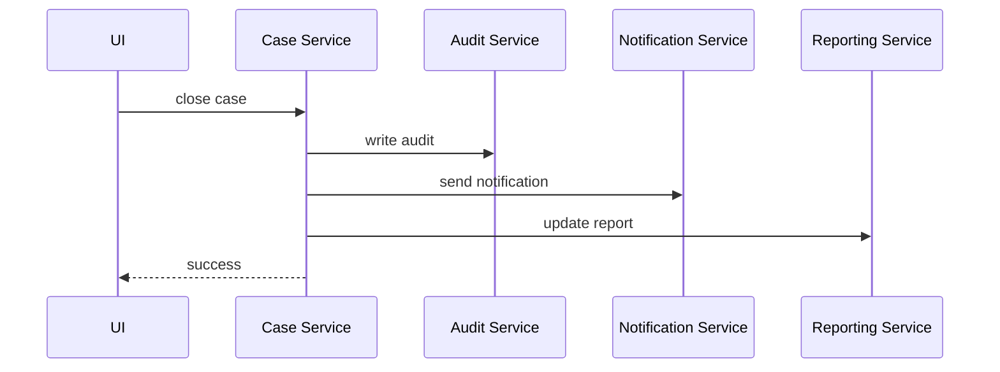

Masalah:

- kalau notification lambat, case closure ikut lambat,
- kalau reporting gagal, apakah close harus gagal?
- kalau audit gagal, apakah close boleh sukses?
- kalau response ke UI timeout, apakah case tertutup atau tidak?
- kalau user retry close, apakah audit double?

Failure-first design:

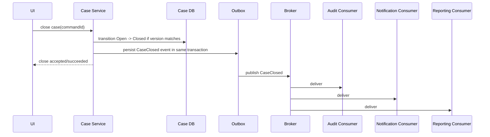

Invariants:

- case transition must be atomic,
- case must not close twice,
- audit event must eventually be produced,
- notification can retry asynchronously,
- reporting can lag but must reconcile,
- duplicate `CaseClosed` event must not duplicate irreversible action.

Failure policies:

| Component | Failure behavior |
|---|---|
| Case DB transition | fail command; no close |
| outbox write | same transaction; fail command if cannot persist |
| broker publish | retry from outbox; UI not blocked |
| audit consumer | idempotent insert; alert if lag |
| notification consumer | retry/DLQ; does not reopen case |
| reporting consumer | replay/rebuild possible |

Ini contoh penting: failure-first design sering mengubah komunikasi dari synchronous fan-out menjadi durable event publication.

---

## 24. What Good Looks Like

Communication design yang matang memiliki ciri:

- setiap remote call punya timeout/deadline eksplisit,
- retry policy operation-specific,
- side-effect command punya idempotency,
- unknown outcome punya reconciliation path,
- error response memberi action semantics,
- dependency failure tidak menghabiskan semua resource,
- overload ditolak cepat,
- fallback jujur secara domain,
- async flow punya DLQ/replay/idempotent consumer,
- trace context konsisten,
- metrics menunjukkan retry, timeout, saturation, lag,
- runbook menjelaskan tindakan operator,
- contract mendokumentasikan failure semantics.

---

## 25. Summary

Failure-first communication design mengubah cara kita mendesain microservices.

Bukan:

```text
How do I call this service?
```

Tetapi:

```text
What can fail, what must remain true, how do we bound damage, and how do we recover?
```

Core ideas:

- remote call bukan function call,
- unknown outcome adalah state berbahaya,
- timeout adalah kontrak,
- retry adalah load multiplier,
- idempotency adalah harga safe retry,
- circuit breaker menghentikan digging,
- bulkhead membatasi blast radius,
- backpressure dan load shedding menjaga sistem tetap hidup,
- fallback harus jujur secara domain,
- async memindahkan failure, bukan menghapusnya,
- observability adalah bagian dari failure handling.

Part berikutnya akan membahas **communication invariants**: cara mendefinisikan hal-hal yang harus selalu benar agar pilihan HTTP, gRPC, event, stream, retry, timeout, dan broker tidak menjadi keputusan lepas tanpa safety model.

---

## References

- RFC 9110 — HTTP Semantics: https://www.rfc-editor.org/rfc/rfc9110.html
- gRPC Deadlines: https://grpc.io/docs/guides/deadlines/
- AWS Builders Library — Timeouts, retries, and backoff with jitter: https://aws.amazon.com/builders-library/timeouts-retries-and-backoff-with-jitter/
- AWS Architecture Blog — Exponential Backoff and Jitter: https://aws.amazon.com/blogs/architecture/exponential-backoff-and-jitter/
- Google SRE Book — Addressing Cascading Failures: https://sre.google/sre-book/addressing-cascading-failures/
- Google SRE Book — Handling Overload: https://sre.google/sre-book/handling-overload/
- CloudEvents Specification: https://cloudevents.io/
- OpenTelemetry Java: https://opentelemetry.io/docs/languages/java/
