------
title: Learn Java Microservices Communication - Part 008
description: Communication invariants untuk Java microservices: cara mendefinisikan correctness, ordering, idempotency, causality, delivery, visibility, observability, dan failure boundaries sebelum memilih transport.
series: learn-java-microservices-communication
seriesTitle: Learn Java Microservices Communication
order: 8
partTitle: Communication Invariants
tags:
  - java
  - microservices
  - communication
  - invariants
  - correctness
  - reliability
  - architecture
  - distributed-systems
date: 2026-07-05
---

# Part 008 — Communication Invariants

> Invariants are the promises your system must keep when the network, timing, retries, deployments, and humans become unreliable.

Part sebelumnya membahas failure-first design. Sekarang kita naik satu layer: **communication invariants**.

Transport bisa berubah:

- HTTP menjadi gRPC,
- sync menjadi async,
- direct call menjadi broker,
- broker A menjadi broker B,
- gateway menjadi service mesh,
- polling menjadi streaming,
- monolith integration menjadi microservice integration.

Tetapi correctness tidak boleh bergantung pada selera transport.

Kalau correctness hanya hidup di kepala engineer atau tersebar di comment, retry config, controller, consumer, dan dashboard, sistem akan rapuh. Communication invariants membuat correctness menjadi eksplisit.

Materi ini menjawab:

- invariant apa yang harus didefinisikan sebelum memilih pola komunikasi,
- bagaimana invariant berbeda dari requirement biasa,
- bagaimana invariant memengaruhi HTTP/gRPC/event/stream,
- bagaimana invariant diterapkan dalam Java code,
- bagaimana invariant diuji dan dioperasikan.

---

## 1. What Is a Communication Invariant?

**Invariant** adalah kondisi yang harus tetap benar di semua keadaan yang dianggap valid.

Dalam communication design, invariant adalah aturan yang harus tetap benar meskipun terjadi:

- retry,
- timeout,
- duplicate request,
- duplicate message,
- delayed response,
- out-of-order event,
- partial failure,
- dependency outage,
- deployment skew,
- stale read,
- broker replay,
- consumer restart,
- concurrent command,
- manual recovery.

Contoh invariant:

```text
A payment capture must be applied at most once for a payment attempt.
```

```text
A case cannot move from Closed back to UnderReview through a late asynchronous event.
```

```text
Every externally visible enforcement decision must have an audit event with the same causation id.
```

```text
A consumer may process the same event more than once, but it must produce the same final state.
```

Invariant bukan sekadar requirement.

Requirement:

```text
Send notification when case is closed.
```

Invariant:

```text
Closing a case must not depend on notification delivery, but the notification intent must be durably recorded and retryable.
```

Requirement menjelaskan fitur. Invariant menjelaskan safety property.

---

## 2. Why Invariants Matter More Than Patterns

Pattern tanpa invariant sering menjadi cargo cult.

Contoh:

- “gunakan Kafka” tetapi consumer tidak idempotent,
- “gunakan retry” tetapi command tidak safe,
- “gunakan circuit breaker” tetapi fallback melanggar domain,
- “gunakan gRPC” tetapi deadline tidak dipropagasikan,
- “gunakan event-driven” tetapi tidak ada replay strategy,
- “gunakan outbox” tetapi event schema tidak punya causation id,
- “gunakan service mesh” tetapi application tidak tahu operation semantics.

Pattern yang sama bisa benar atau salah tergantung invariant.

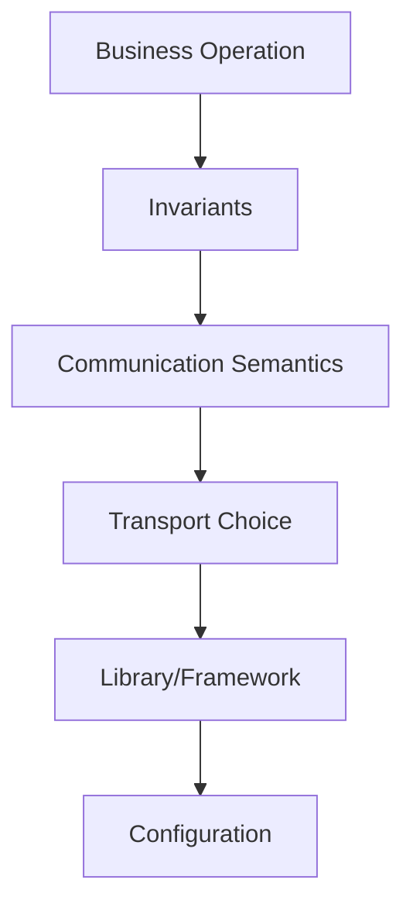

Urutan yang salah:

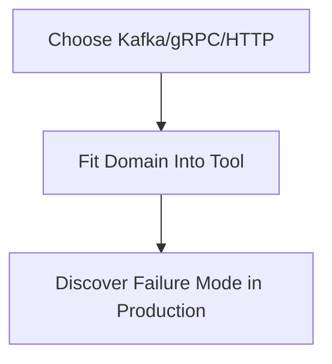

Urutan yang benar:

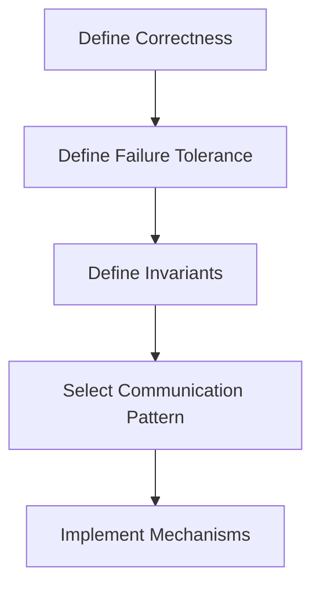

Invariant adalah jembatan antara domain correctness dan technical mechanism.

---

## 3. Invariant Categories

Untuk microservices communication, invariant biasanya jatuh ke beberapa kategori.

| Category | Question |
|---|---|
| Identity | Bagaimana operasi/event dikenali secara unik? |
| Causality | Apa yang menyebabkan operasi/event ini? |
| Idempotency | Apa yang terjadi jika diproses lebih dari sekali? |
| Ordering | Apakah urutan penting? Berdasarkan key apa? |
| Delivery | Apakah pesan boleh hilang, duplicate, terlambat? |
| Visibility | Kapan hasil boleh terlihat ke user/service lain? |
| Consistency | State mana yang harus kuat, mana yang boleh eventual? |
| Retry safety | Error mana yang aman diretry? |
| Unknown outcome | Bagaimana menyelesaikan hasil yang tidak diketahui? |
| Resource protection | Bagaimana sistem tetap hidup saat overload? |
| Compatibility | Bagaimana schema/protocol berevolusi? |
| Observability | Bukti apa yang harus selalu tersedia? |
| Security context | Context apa yang wajib ikut boundary? |
| Auditability | Apa yang harus bisa dijelaskan setelah kejadian? |
| Recovery | Bagaimana replay/rebuild/reconcile dilakukan? |

Kita akan bahas satu per satu.

---

## 4. Identity Invariant

Distributed system membutuhkan identity yang stabil.

Tanpa identity, duplicate tidak bisa dikenali, replay tidak bisa aman, audit sulit, dan reconciliation menjadi tebak-tebakan.

### 4.1 Operation identity

Untuk command:

```text
commandId / operationId / idempotencyKey
```

Contoh:

```json
{
  "commandId": "cmd-01JZ9F8E7N8W9A1B2C3D4E5F6G",
  "caseId": "case-2026-000123",
  "expectedVersion": 17,
  "action": "CLOSE_CASE"
}
```

Invariant:

```text
The same commandId must not produce more than one domain transition.
```

### 4.2 Entity identity

Entity identity harus stabil lintas service.

Buruk:

```text
Use local database auto-increment id and expose it everywhere without ownership clarity.
```

Lebih baik:

```text
caseId, paymentAttemptId, customerId, documentId, enforcementActionId
```

Invariant:

```text
A service must not infer ownership or lifecycle state from another service's local surrogate id.
```

### 4.3 Event identity

Event membutuhkan identity sendiri.

```json
{
  "id": "evt-01JZ9F9KT7V82GH7MK1VA3QK4R",
  "type": "case.closed",
  "source": "case-service",
  "subject": "case-2026-000123",
  "time": "2026-07-05T10:15:30Z",
  "data": {
    "caseId": "case-2026-000123",
    "closedBy": "user-456"
  }
}
```

Invariant:

```text
Event id identifies the occurrence of a fact publication, not merely the entity.
```

Satu case bisa punya banyak event. Jangan pakai `caseId` sebagai `eventId`.

---

## 5. Causality Invariant

Causality menjawab: “kenapa ini terjadi?”

Distributed traces menjawab sebagian secara teknis, tetapi domain causality harus ada di message/command/event.

Field umum:

- `correlationId`: mengelompokkan semua work untuk satu user/request/business flow,
- `causationId`: menunjuk command/event yang menyebabkan event ini,
- `commandId`: identity command,
- `eventId`: identity event,
- `traceId`: observability trace,
- `actorId`: siapa/apa yang memicu,
- `reason`: business reason.

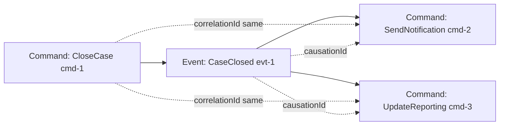

Invariant:

```text
Every domain event produced by a command must carry the command id as causation id and the request/business flow id as correlation id.
```

Tanpa causality:

- audit sulit,
- replay sulit,
- duplicate sulit dibedakan,
- incident sulit dianalisis,
- operator tidak tahu root trigger,
- downstream tidak bisa membuat idempotency yang tepat.

---

## 6. Idempotency Invariant

Idempotency adalah salah satu invariant terpenting dalam communication design.

Generic invariant:

```text
Processing the same logical operation more than once must not create additional business effects.
```

Tetapi detailnya berbeda per operasi.

### 6.1 Command idempotency

Contoh:

```text
Close case command may be submitted multiple times with the same commandId, but the case transition and audit event must happen once.
```

Implementation options:

- command table,
- idempotency table,
- unique constraint on business key,
- optimistic locking,
- dedup cache plus durable record,
- transactional outbox.

Java interface:

```java
public interface IdempotencyStore {
    IdempotencyDecision start(String key, String operation, String requestHash);
    void complete(String key, StoredResult result);
    void fail(String key, StoredFailure failure);
    StoredResult getResult(String key);
}
```

Possible decisions:

```java
public sealed interface IdempotencyDecision permits
        IdempotencyDecision.Started,
        IdempotencyDecision.ReplayPreviousResult,
        IdempotencyDecision.Conflict,
        IdempotencyDecision.InProgress {

    record Started() implements IdempotencyDecision {}
    record ReplayPreviousResult(StoredResult result) implements IdempotencyDecision {}
    record Conflict(String reason) implements IdempotencyDecision {}
    record InProgress(String owner, long ageMillis) implements IdempotencyDecision {}
}
```

### 6.2 Consumer idempotency

Message consumer harus menganggap message bisa datang lebih dari sekali.

Invariant:

```text
A consumer must be safe under duplicate delivery of the same event id.
```

Pattern:

```sql
CREATE TABLE processed_message (
    consumer_name VARCHAR(100) NOT NULL,
    message_id    VARCHAR(200) NOT NULL,
    processed_at  TIMESTAMPTZ NOT NULL,
    PRIMARY KEY (consumer_name, message_id)
);
```

Pseudocode:

```java
@Transactional
public void handle(CaseClosed event) {
    if (!processedMessageRepository.tryMarkProcessing("reporting-consumer", event.eventId())) {
        return;
    }

    reportingProjection.apply(event);
}
```

Catatan: `tryMarkProcessing` dan `apply` harus berada dalam boundary transactional yang sesuai. Kalau marker tersimpan tetapi side effect gagal, bisa terjadi message loss secara semantic.

---

## 7. Ordering Invariant

Ordering sering disalahpahami.

Pertanyaan penting bukan:

```text
Do we need ordered events?
```

Pertanyaan yang benar:

```text
Ordered by what key, for which state, and what happens when order is violated?
```

Contoh invariant:

```text
Events for the same caseId must be applied in aggregate version order.
```

Bukan:

```text
All events in the system must be globally ordered.
```

Global order mahal dan sering tidak perlu.

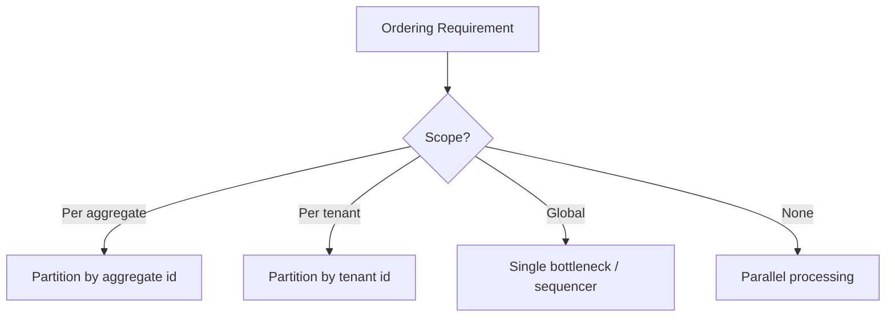

Ordering strategies:

| Strategy | Use when | Cost |
|---|---|---|
| no ordering | independent facts | high parallelism |
| per-aggregate ordering | entity lifecycle matters | partition hot spot risk |
| per-tenant ordering | tenant-level sequence matters | noisy tenant issue |
| global ordering | ledger-like sequence | bottleneck and availability cost |
| version check | consumers tolerate out-of-order arrival | buffering/retry complexity |

Consumer-side version check:

```java
public void apply(CaseEvent event) {
    CaseProjection projection = repository.find(event.caseId());

    long expected = projection.version() + 1;
    if (event.aggregateVersion() < expected) {
        return; // duplicate or old event
    }

    if (event.aggregateVersion() > expected) {
        throw new OutOfOrderEventException(event.caseId(), expected, event.aggregateVersion());
    }

    projection.apply(event);
    repository.save(projection);
}
```

Invariant:

```text
A projection must never apply aggregate version N+1 before N.
```

Jika invariant ini penting, desain harus punya buffering, retry, parking lot, atau rebuild strategy.

---

## 8. Delivery Invariant

Delivery invariant mendefinisikan apa yang boleh terjadi pada pesan.

Pilihan realistik:

- at-most-once: boleh hilang, tidak duplicate,
- at-least-once: tidak hilang jika sistem sehat, tetapi bisa duplicate,
- effectively-once: at-least-once delivery + idempotent processing + transactional boundaries,
- exactly-once dalam scope tertentu: biasanya terbatas pada broker/transaction boundary tertentu, bukan seluruh distributed business process.

Invariant contoh:

```text
Audit events must not be silently lost after a case transition commits.
```

Mekanisme:

- same transaction writes domain state and outbox record,
- outbox publisher retries until published,
- consumer idempotent,
- DLQ monitored,
- replay supported.

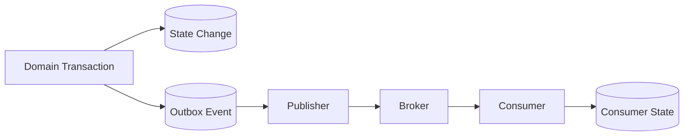

Invariant lebih tepat daripada klaim kosong:

```text
We need exactly-once messaging.
```

Pertanyaan yang harus dijawab:

- exactly once untuk publish?
- exactly once untuk broker write?
- exactly once untuk consumer DB update?
- exactly once untuk external side effect?
- exactly once dari perspektif user/business?

Sering kali invariant yang benar adalah:

```text
Duplicate delivery is allowed, duplicate business effect is not.
```

---

## 9. Visibility Invariant

Visibility invariant menjawab: kapan state boleh terlihat?

Contoh:

```text
A case may be shown as Closed only after the case transition is committed, but downstream reporting may lag and must expose freshness.
```

Dalam async system, visibility sering lebih penting daripada latency.

Anti-pattern:

```text
Return success to user before durable command acceptance.
```

Lebih aman:

```text
Return Accepted only after command is durably recorded.
```

Status model:

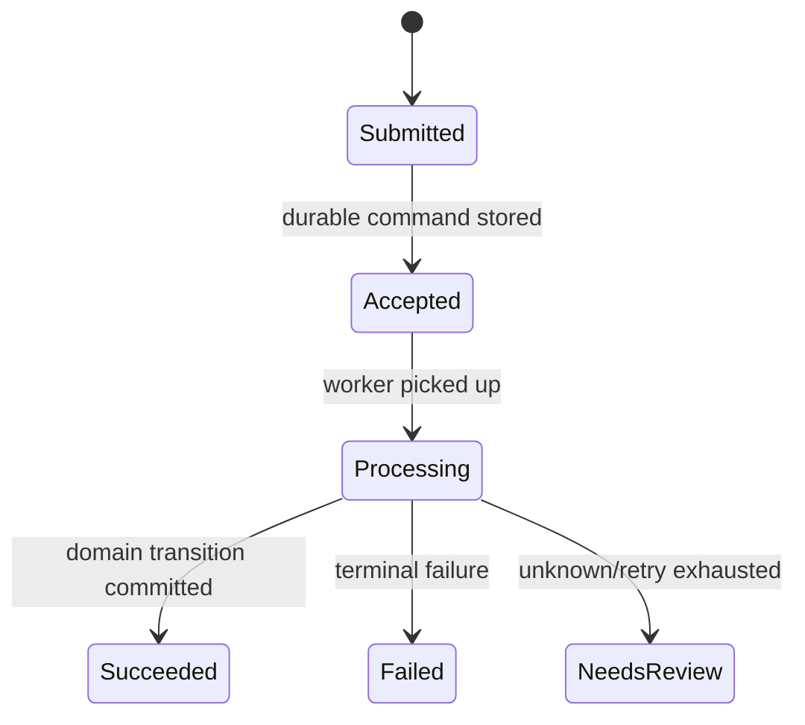

HTTP response semantics:

| Response | Meaning |
|---|---|
| `200 OK` | operation completed and result known |
| `201 Created` | resource created and visible |
| `202 Accepted` | request accepted for processing; not completed yet |
| `409 Conflict` | valid request conflicts with current state/version |
| `422 Unprocessable Content` | domain validation failed |
| `503 Service Unavailable` | infrastructure/dependency unavailable |

Invariant:

```text
The API must not return completion semantics for work that is only queued unless the contract explicitly defines asynchronous completion.
```

---

## 10. Consistency Invariant

Not all state needs the same consistency.

Classify state:

| State | Consistency need | Example |
|---|---|---|
| decision state | strong within aggregate | case status transition |
| financial side effect | strong/idempotent | payment capture |
| audit intent | durable/eventual publish | outbox event |
| reporting projection | eventual | dashboard/report |
| search index | eventual | case search |
| notification | eventual/retryable | email/SMS |
| recommendation | best effort | suggestions |

Invariant example:

```text
The authoritative case status is the Case Service aggregate state. Search and reporting projections must not be used as decision authority.
```

This prevents a common bug:

```text
Service B reads stale projection and performs command based on stale status.
```

Correct model:

- projections are for query/user visibility,
- authoritative service validates command against authoritative state,
- command includes expected version where concurrency matters.

```java
public record CloseCaseCommand(
        String commandId,
        String caseId,
        long expectedVersion,
        String actorId,
        String reason
) {}
```

Invariant:

```text
State-changing commands must validate against authoritative state and expected version, not stale read models.
```

---

## 11. Retry Safety Invariant

Retry must be governed by invariant, not only exception type.

Invariant:

```text
A caller may retry a command only if the operation is idempotent or the previous outcome can be safely resolved.
```

Decision table:

| Operation | Safe retry? | Required invariant/mechanism |
|---|---:|---|
| GET case summary | yes | no side effect |
| PUT replace config | yes if semantic replacement | idempotent resource versioning |
| POST close case | yes with commandId | command dedup + state transition guard |
| POST capture payment | yes only with idempotency key | provider/business idempotency |
| POST send email | usually no blind retry | notification intent/outbox |
| consume event | yes | processed message table/idempotent apply |

Retry invariant should appear in client policy:

```yaml
operation: closeCase
retry:
  allowed: true
  requires:
    - commandId
    - expectedVersion
    - idempotencyStore
  retryableFailures:
    - connect_timeout
    - 503
    - 429
  nonRetryableFailures:
    - validation_error
    - invalid_transition
    - version_conflict
```

---

## 12. Unknown Outcome Invariant

Unknown outcome is not an edge case. It is a normal distributed state.

Invariant:

```text
For every side-effecting remote command, the caller must have a deterministic way to resolve unknown outcome.
```

Resolution mechanisms:

| Mechanism | Example |
|---|---|
| idempotent retry | retry with same idempotency key |
| status query | GET operation by commandId/paymentAttemptId |
| reconciliation job | compare local state with provider state |
| event confirmation | wait for authoritative event |
| manual queue | operator resolves ambiguous case |

Bad design:

```text
If timeout happens, mark failed.
```

Better:

```text
If timeout happens after command may have reached callee, mark outcome unknown and reconcile by operation id.
```

State model:

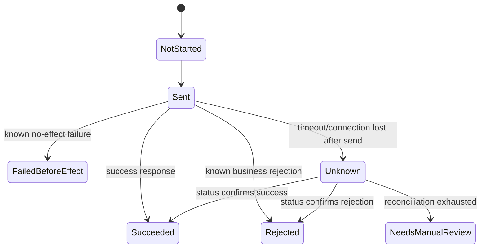

This is one of the most important communication invariants.

---

## 13. Resource Protection Invariant

Correctness is meaningless if the service dies under load.

Resource protection invariant:

```text
A failing or slow dependency must not be able to exhaust all request handling capacity of the caller.
```

Mechanisms:

- per-dependency timeout,
- per-dependency pool,
- semaphore/thread bulkhead,
- bounded queue,
- max in-flight requests,
- circuit breaker,
- rate limiting,
- load shedding,
- backpressure,
- priority isolation.

Invariant examples:

```text
Non-critical notification calls must not consume checkout request threads.
```

```text
Reporting export traffic must not starve enforcement decision traffic.
```

```text
One tenant's large replay must not delay all tenants' real-time messages.
```

Java semaphore guard:

```java
public final class DependencyBulkhead {
    private final Semaphore semaphore;
    private final String dependency;

    public DependencyBulkhead(String dependency, int maxConcurrent) {
        this.dependency = dependency;
        this.semaphore = new Semaphore(maxConcurrent);
    }

    public <T> T execute(Callable<T> task) throws Exception {
        boolean acquired = semaphore.tryAcquire(50, TimeUnit.MILLISECONDS);
        if (!acquired) {
            throw new RemoteOverloadedException(dependency + " bulkhead full");
        }

        try {
            return task.call();
        } finally {
            semaphore.release();
        }
    }
}
```

In production, prefer mature libraries/frameworks, but do not skip the invariant.

---

## 14. Compatibility Invariant

Microservices deploy independently. Therefore, communication contracts must tolerate version skew.

Invariant:

```text
A producer and consumer deployed at different versions must interoperate within the supported compatibility window.
```

For JSON/HTTP:

- consumers ignore unknown fields,
- producers avoid removing/renaming fields abruptly,
- new required fields require versioning or defaulting,
- enum evolution is explicit,
- error codes are stable.

For Protobuf/gRPC:

- do not reuse field numbers,
- reserve removed fields,
- avoid changing field meaning,
- new fields should be optional/backward compatible,
- service/method changes require rollout discipline.

For events:

- event type meaning must be stable,
- event consumers must handle unknown fields,
- event schema must evolve compatibly,
- old events may be replayed into new consumers,
- consumers should not rely on producer-only incidental fields.

Invariant:

```text
Any event stored durably must remain processable by future supported consumers or have a documented migration/replay path.
```

This is easy to forget. Event logs are not just integration messages; they are historical data.

---

## 15. Observability Invariant

Observability is not “nice to have”. It is how invariants are verified at runtime.

Invariant:

```text
Every cross-service operation must be traceable by correlation id, and every failure must be classifiable by action semantics.
```

Minimum metadata:

```text
traceparent
correlation-id
causation-id
operation-id / command-id
idempotency-key hash
tenant-id if applicable
actor/service identity
operation name
protocol
attempt number
error category
```

Do not log secrets or sensitive data.

Metric invariant examples:

```text
Retry attempts must be measurable separately from original attempts.
```

```text
Fallback responses must be visible as fallback, not counted as normal success only.
```

```text
DLQ growth must alert before business SLA is breached.
```

```text
Unknown outcome must be counted and reconciled.
```

A system that returns 200 while silently using fallback may look healthy but be semantically degraded.

---

## 16. Security Context Invariant

Even though this series is not repeating authentication/authorization, communication must preserve security context correctly.

Invariant examples:

```text
A service must not execute a user-initiated command without knowing the authenticated subject or delegated service identity.
```

```text
Internal service calls must distinguish end-user context from service-to-service authority.
```

```text
Audit-relevant operations must carry actor, delegation, and reason context across boundaries.
```

```text
Security context must not be reconstructed from untrusted payload fields.
```

Communication layer implications:

- propagate trace/correlation separately from auth token,
- avoid blindly forwarding user tokens to every downstream,
- define service identity vs user identity,
- include actor context in domain command where audit requires it,
- do not put sensitive token values in logs/traces,
- fail closed when required context is missing.

Example command metadata:

```java
public record CommandMetadata(
        String commandId,
        String correlationId,
        String causationId,
        String actorId,
        String actorType,
        String delegatedBy,
        String reason,
        Instant requestedAt
) {}
```

---

## 17. Auditability Invariant

In regulated systems, auditability is a correctness property.

Invariant:

```text
Every material state transition must be explainable after the fact: who/what caused it, when, based on which command, under which version, and with which outcome.
```

This impacts communication design:

- commands need metadata,
- events need causality,
- retries need idempotency,
- fallbacks need visibility,
- manual interventions need audit trail,
- replay must not create false audit facts,
- correction events must be explicit.

Bad event:

```json
{
  "type": "case.closed",
  "caseId": "case-123"
}
```

Better event:

```json
{
  "id": "evt-01JZ9F9KT7V82GH7MK1VA3QK4R",
  "type": "case.closed",
  "source": "case-service",
  "subject": "case-123",
  "time": "2026-07-05T10:15:30Z",
  "correlationId": "corr-789",
  "causationId": "cmd-456",
  "data": {
    "caseId": "case-123",
    "aggregateVersion": 18,
    "closedBy": "user-456",
    "reasonCode": "RESOLVED_NO_FURTHER_ACTION"
  }
}
```

Audit invariant does not mean every event must contain all details. It means the communication graph must preserve enough evidence to reconstruct the decision.

---

## 18. Recovery Invariant

A production system must know how to recover from communication failure.

Invariant:

```text
For every durable asynchronous communication path, there must be a documented replay, skip, quarantine, or reconcile path.
```

Recovery options:

| Failure | Recovery |
|---|---|
| duplicate message | idempotent ignore |
| poison message | DLQ/parking lot |
| out-of-order event | buffer/retry/rebuild |
| lost publish before broker | outbox retry |
| consumer bug | fix consumer and replay |
| bad event published | compensating event/migration |
| projection corrupt | rebuild from source of truth/event log |
| external side effect unknown | reconcile with provider |

Runbook minimum:

```md
## Recovery: reporting-consumer lag

Symptoms:
- consumer lag > 100k for 15 minutes
- dashboard freshness > 30 minutes

Immediate action:
- check broker health
- check consumer error rate
- check DLQ count
- scale consumer if CPU-bound
- pause replay traffic if real-time traffic is impacted

Data safety:
- do not reset offset unless projection rebuild plan is active
- do not skip messages without recording message ids and reason

Rebuild:
- stop consumer
- truncate projection table
- replay topic from offset X or event store snapshot
- validate counts against source service
```

---

## 19. Communication Invariant Register

A practical artifact is an invariant register.

Example:

```md
# Communication Invariant Register — Case Service

## INV-COMM-001: Case command idempotency
Same commandId must not produce more than one case transition.
Mechanism: command_log unique(command_id), aggregate optimistic lock.
Applies to: closeCase, reopenCase, assignCase.
Violation impact: duplicate audit/event/state transition.
Detection: duplicate_command_conflict metric, command_log audit.
Recovery: inspect command log, reconcile aggregate history.

## INV-COMM-002: Case event causality
Every domain event emitted by Case Service must include correlationId and causationId.
Mechanism: DomainEventFactory requires CommandMetadata.
Applies to: all case events.
Violation impact: broken traceability/audit.
Detection: event validation, schema test, broker quarantine.
Recovery: republish corrected event only if domain policy allows.

## INV-COMM-003: Reporting projection ordering
Reporting consumer must apply events per caseId in aggregateVersion order.
Mechanism: version check and parking lot for future versions.
Applies to: case reporting projection.
Violation impact: incorrect report state.
Detection: out_of_order_event metric.
Recovery: replay caseId from source/event log.
```

This register becomes an engineering artifact that reviewers, developers, SRE, QA, and auditors can understand.

---

## 20. Applying Invariants to HTTP

HTTP operation example:

```http
POST /internal/cases/{caseId}/close
Idempotency-Key: cmd-01JZ9F8E7N8W9A1B2C3D4E5F6G
X-Correlation-Id: corr-789
X-Causation-Id: user-request-123
If-Match: "17"
```

Request:

```json
{
  "reasonCode": "RESOLVED_NO_FURTHER_ACTION",
  "actorId": "user-456",
  "comment": "No further enforcement action required."
}
```

HTTP-specific invariants:

| Invariant | HTTP mechanism |
|---|---|
| command identity | `Idempotency-Key` |
| optimistic concurrency | `If-Match` / version field |
| causality | headers + body metadata |
| known conflict | `409 Conflict` |
| validation failure | `400`/`422` depending API convention |
| accepted async | `202 Accepted` + status URL |
| unknown outcome | status query by command id |
| overload | `429`/`503` + retry hints |
| traceability | `traceparent`, correlation header |

Response example:

```json
{
  "caseId": "case-123",
  "status": "CLOSED",
  "version": 18,
  "commandId": "cmd-01JZ9F8E7N8W9A1B2C3D4E5F6G",
  "occurredAt": "2026-07-05T10:15:30Z"
}
```

Error example:

```json
{
  "type": "https://internal.example/errors/version-conflict",
  "title": "Version conflict",
  "status": 409,
  "code": "case.version_conflict",
  "retryable": false,
  "outcomeKnown": true,
  "expectedVersion": 17,
  "actualVersion": 18,
  "correlationId": "corr-789"
}
```

The point: HTTP contract must expose semantics, not just shape.

---

## 21. Applying Invariants to gRPC

gRPC operation example:

```proto
syntax = "proto3";

package case.v1;

service CaseCommandService {
  rpc CloseCase(CloseCaseRequest) returns (CloseCaseResponse);
}

message RequestMetadata {
  string command_id = 1;
  string correlation_id = 2;
  string causation_id = 3;
  string actor_id = 4;
  string reason = 5;
}

message CloseCaseRequest {
  RequestMetadata metadata = 1;
  string case_id = 2;
  int64 expected_version = 3;
  string reason_code = 4;
  string comment = 5;
}

message CloseCaseResponse {
  string case_id = 1;
  string status = 2;
  int64 version = 3;
  string event_id = 4;
}
```

gRPC-specific invariants:

| Invariant | gRPC mechanism |
|---|---|
| deadline | client deadline/context |
| cancellation | context cancellation respected by server |
| metadata propagation | interceptors/context |
| command identity | request metadata field |
| error classification | status code + rich error details |
| compatibility | protobuf field evolution rules |
| streaming order | stream contract + sequence/version |
| idempotency | application-level store |

Important: gRPC deadline protects resource only if server code cooperates.

Server handler must check cancellation/deadline in long work:

```java
public CloseCaseResponse closeCase(CloseCaseRequest request) {
    Context context = Context.current();

    if (context.isCancelled()) {
        throw Status.CANCELLED.withDescription("request cancelled").asRuntimeException();
    }

    validateMetadata(request.getMetadata());

    CloseCaseResult result = caseApplication.closeCase(toCommand(request));

    if (context.isCancelled()) {
        // Avoid starting additional side effects after caller cancellation if semantics require it.
        throw Status.CANCELLED.withDescription("request cancelled after command handling").asRuntimeException();
    }

    return toResponse(result);
}
```

Do not assume gRPC automatically solves domain invariants. It solves transport/RPC mechanics; idempotency, causality, state transitions, and auditability remain application responsibilities.

---

## 22. Applying Invariants to Events

Event contract example:

```json
{
  "specversion": "1.0",
  "id": "evt-01JZ9F9KT7V82GH7MK1VA3QK4R",
  "type": "com.example.case.closed.v1",
  "source": "/services/case-service",
  "subject": "case/case-123",
  "time": "2026-07-05T10:15:30Z",
  "datacontenttype": "application/json",
  "correlationid": "corr-789",
  "causationid": "cmd-456",
  "data": {
    "caseId": "case-123",
    "aggregateVersion": 18,
    "closedBy": "user-456",
    "reasonCode": "RESOLVED_NO_FURTHER_ACTION"
  }
}
```

Event-specific invariants:

| Invariant | Event mechanism |
|---|---|
| event identity | event id |
| fact type | event type |
| source ownership | source |
| entity subject | subject |
| causality | causation id |
| flow grouping | correlation id |
| ordering | aggregate id + version / partition key |
| duplicate safety | processed message table |
| replay safety | stable schema + idempotent consumer |
| observability | trace/correlation fields |

Producer invariant:

```text
If authoritative state transition commits, corresponding domain event intent must be durably recorded.
```

Consumer invariant:

```text
Consumer must treat events as facts that may arrive late or duplicate, not as commands to blindly execute irreversible side effects.
```

This distinction is crucial.

Event says:

```text
CaseClosed happened.
```

Command says:

```text
Please close this case.
```

Confusing the two causes bad systems.

---

## 23. Applying Invariants to Streaming

Streaming adds long-lived communication and continuous delivery.

Invariants must define:

- session identity,
- subscription scope,
- ordering,
- resumption,
- backpressure,
- replay window,
- disconnect behavior,
- duplicate delivery,
- client acknowledgement if needed,
- slow consumer policy.

Example invariant:

```text
A client subscribed to case updates must never receive updates for a tenant it is not authorized for, even after reconnect/resume.
```

Another:

```text
If a WebSocket client disconnects, the server may drop transient UI updates but must not drop durable domain events required for compliance.
```

Streaming decision table:

| Data | Durable? | Resume needed? | Candidate |
|---|---:|---:|---|
| typing indicator | no | no | WebSocket transient |
| case status update | yes | maybe | event-backed stream/SSE |
| market tick | maybe | windowed | stream with sequence |
| audit event | yes | yes | durable broker/log |
| progress bar | no/maybe | no | SSE/WebSocket |

Do not use WebSocket as a hidden durable queue unless you implement queue semantics explicitly.

---

## 24. Invariant Enforcement in Java Layers

Communication invariants should be enforced in multiple layers.

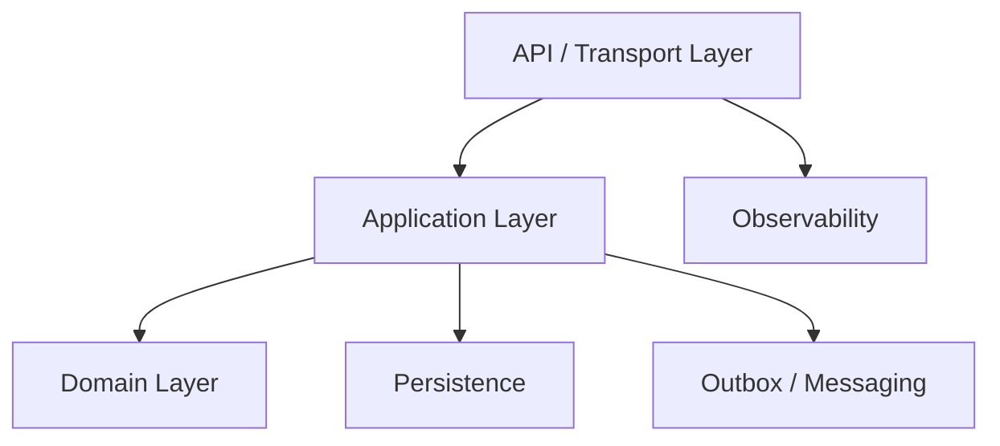

### Transport layer

Responsibilities:

- parse metadata,
- validate required headers,
- map errors,
- set deadline,
- propagate trace context,
- reject oversized/invalid requests.

### Application layer

Responsibilities:

- enforce idempotency,
- coordinate transaction,
- call dependencies with policy,
- persist outbox,
- classify outcome,
- return semantic response.

### Domain layer

Responsibilities:

- enforce state transition invariants,
- validate business rules,
- produce domain events,
- protect aggregate consistency.

### Persistence layer

Responsibilities:

- unique constraints,
- optimistic locking,
- transaction boundaries,
- processed message records,
- outbox atomicity.

### Observability layer

Responsibilities:

- emit metrics/traces/logs,
- include invariant violation signals,
- expose degradation/fallback.

---

## 25. Example: Close Case End-to-End Invariants

Operation:

```text
Close a regulatory case.
```

Invariant register:

| ID | Invariant | Mechanism |
|---|---|---|
| INV-001 | same commandId cannot close case twice | command log unique key |
| INV-002 | case can close only from allowed states | domain state machine |
| INV-003 | expected version must match | optimistic lock |
| INV-004 | closure event recorded atomically | transactional outbox |
| INV-005 | audit event carries causality | event factory metadata |
| INV-006 | notification failure does not rollback closure | async consumer |
| INV-007 | reporting may lag but must expose freshness | projection metadata |
| INV-008 | duplicate event does not duplicate projection | processed message table |
| INV-009 | out-of-order event is parked, not applied | aggregate version check |
| INV-010 | unknown command outcome can be queried | command status endpoint |

Command flow:

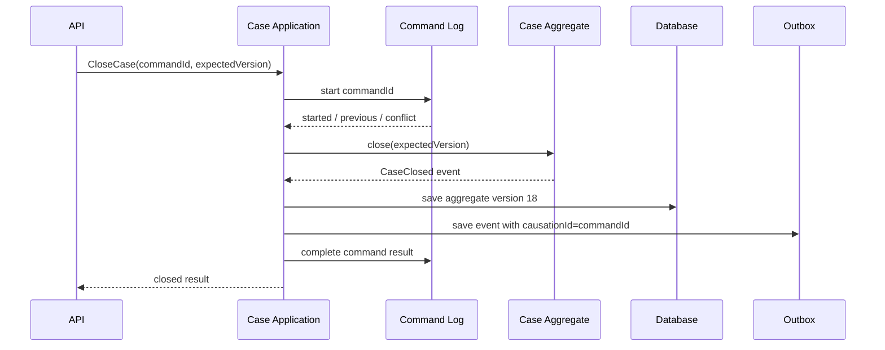

Consumer flow:

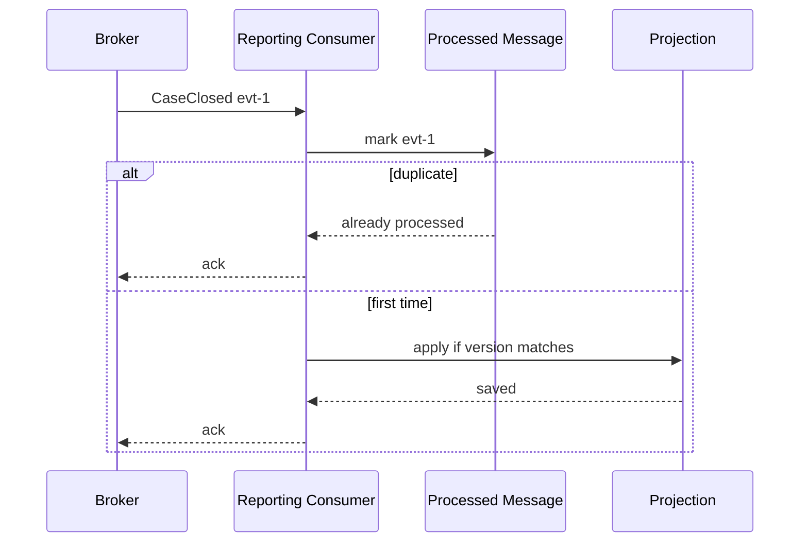

---

## 26. Testing Communication Invariants

Invariant tests are different from ordinary unit tests.

### 26.1 Duplicate command test

```java
@Test
void closeCase_isIdempotentForSameCommandId() {
    CloseCaseCommand command = new CloseCaseCommand(
            "cmd-1",
            "case-123",
            17,
            "user-456",
            "resolved"
    );

    CloseCaseResult first = app.closeCase(command);
    CloseCaseResult second = app.closeCase(command);

    assertEquals(first.caseId(), second.caseId());
    assertEquals(first.version(), second.version());
    assertEquals(1, eventRepository.countByCausationId("cmd-1"));
}
```

### 26.2 Duplicate event test

```java
@Test
void reportingConsumer_ignoresDuplicateEvent() {
    CaseClosed event = fixtures.caseClosed("evt-1", "case-123", 18);

    consumer.handle(event);
    consumer.handle(event);

    assertEquals(1, processedMessageRepository.count("reporting-consumer", "evt-1"));
    assertEquals(18, projectionRepository.get("case-123").version());
}
```

### 26.3 Out-of-order event test

```java
@Test
void reportingConsumer_parksFutureVersion() {
    CaseClosed event = fixtures.caseClosed("evt-2", "case-123", 20);
    projectionRepository.save(new CaseProjection("case-123", 18));

    assertThrows(OutOfOrderEventException.class, () -> consumer.handle(event));

    assertEquals(1, parkingLot.countByCaseId("case-123"));
    assertEquals(18, projectionRepository.get("case-123").version());
}
```

### 26.4 Unknown outcome test

```java
@Test
void paymentTimeout_marksUnknownAndReconciles() {
    paymentClient.stubTimeoutAfterReceivingRequest();

    PaymentResult result = service.authorizePayment(commandWithIdempotencyKey("pay-1"));

    assertEquals(PaymentStatus.UNKNOWN, result.status());
    assertTrue(reconciliationQueue.contains("pay-1"));
}
```

Good invariant tests simulate ugly reality:

- duplicate,
- out-of-order,
- timeout,
- lost response,
- retry,
- stale version,
- partial success,
- replay,
- consumer restart,
- deployment compatibility.

---

## 27. Invariant Violation Handling

Invariant violation should not be treated as ordinary exception.

Examples:

| Violation | Severity | Response |
|---|---|---|
| duplicate command same payload | normal | replay previous result |
| duplicate command different payload | warning/security | reject conflict |
| out-of-order event | recoverable | park/retry/replay |
| missing causation id | contract violation | reject/quarantine |
| duplicate payment capture | critical | incident/reconciliation |
| stale projection used for command | design bug | fix flow |
| fallback used for critical decision | critical | fail closed |

Invariant violation taxonomy:

```java
public enum InvariantViolationSeverity {
    NORMAL_DUPLICATE,
    RECOVERABLE_DELAY,
    CONTRACT_VIOLATION,
    DATA_CORRUPTION_RISK,
    SECURITY_RISK,
    BUSINESS_CRITICAL
}
```

Handling should include:

- structured log,
- metric,
- trace annotation,
- clear error category,
- alert if severity warrants,
- quarantine/recovery path,
- no silent swallowing.

---

## 28. Invariant Review Checklist

Before implementing a new communication path, answer these.

### Identity

- What identifies this command/request/message/event?
- Is the identity stable across retries?
- Is identity globally unique or scoped?
- Is identity persisted durably?

### Causality

- What caused this operation?
- Is correlation id propagated?
- Is causation id preserved?
- Can audit reconstruct the chain?

### Idempotency

- What happens if this is received twice?
- What happens if retry occurs after timeout?
- Is duplicate same payload different from duplicate different payload?
- Where is dedup state stored?

### Ordering

- Does order matter?
- Order by which key?
- What happens if event N+1 arrives before N?
- Can state be rebuilt?

### Delivery

- Can message be lost?
- Can message duplicate?
- Can message be delayed?
- Is DLQ monitored?
- Is replay safe?

### Visibility

- When do we return success?
- Is success complete or accepted?
- Can user observe pending state?
- Is stale data labeled or hidden?

### Consistency

- Which service owns authoritative state?
- Which projections are allowed for decisions?
- Which reads may be stale?
- Which commands require expected version?

### Retry and unknown outcome

- Which failures are retryable?
- Which failures are terminal?
- How is unknown outcome resolved?
- Is retry deadline-aware?

### Resource protection

- Can this dependency exhaust caller capacity?
- Are pools bounded?
- Is there a bulkhead?
- Is overload rejected early?

### Compatibility

- Can old clients talk to new servers?
- Can new producers publish to old consumers?
- Can old events be replayed?
- Are removed fields reserved/deprecated safely?

### Observability

- Are invariant violations measurable?
- Can we trace one business operation across services?
- Can we distinguish fallback success from normal success?
- Can operators see lag, DLQ, retry, timeout, unknown outcome?

---

## 29. What Good Looks Like

A strong communication design has invariants that are:

- explicit,
- reviewable,
- mapped to implementation mechanisms,
- tested under failure,
- observable in production,
- included in runbooks,
- stable across transport changes,
- owned by a team,
- connected to business correctness.

Bad design says:

```text
We use Kafka, so it is reliable.
```

Good design says:

```text
CaseClosed events are written through transactional outbox. Consumers are idempotent by event id and apply events per caseId version order. Reporting can lag but exposes freshness. DLQ growth alerts. Replay is supported from event timestamp or offset. Duplicate event delivery does not duplicate business effect.
```

Bad design says:

```text
We retry failed HTTP calls.
```

Good design says:

```text
Only idempotent commands with operation ids are retried. Retry is limited to transient transport/unavailable/rate-limit failures, bounded by deadline and retry budget. Unknown outcome is resolved by status query or reconciliation.
```

Bad design says:

```text
We have tracing.
```

Good design says:

```text
Every cross-service operation carries trace id, correlation id, causation id, operation id, and error category. Fallback, retry, timeout, DLQ, and unknown outcome are separately measurable.
```

---

## 30. Summary

Communication invariants are the safety rules of distributed microservices.

They prevent communication design from becoming a pile of technology choices.

Core invariants to define:

- identity,
- causality,
- idempotency,
- ordering,
- delivery,
- visibility,
- consistency,
- retry safety,
- unknown outcome resolution,
- resource protection,
- compatibility,
- observability,
- security context,
- auditability,
- recovery.

The key lesson:

> Choose HTTP, gRPC, events, messaging, streaming, gateway, mesh, retry, timeout, and broker only after you know what must remain true when communication fails.

Part berikutnya akan masuk ke Phase 2: **HTTP as Microservice Transport**. Kita akan membedah HTTP bukan sebagai “REST tutorial”, tetapi sebagai communication substrate produksi: semantics, methods, status, headers, connection lifecycle, timeout, idempotency, and operational behavior.

---

## References

- RFC 9110 — HTTP Semantics: https://www.rfc-editor.org/rfc/rfc9110.html
- gRPC Deadlines: https://grpc.io/docs/guides/deadlines/
- CloudEvents Specification: https://cloudevents.io/
- AsyncAPI Specification: https://www.asyncapi.com/docs/reference/specification/latest
- Google SRE Book — Addressing Cascading Failures: https://sre.google/sre-book/addressing-cascading-failures/
- Google SRE Book — Handling Overload: https://sre.google/sre-book/handling-overload/
- AWS Builders Library — Timeouts, retries, and backoff with jitter: https://aws.amazon.com/builders-library/timeouts-retries-and-backoff-with-jitter/
- OpenTelemetry Java: https://opentelemetry.io/docs/languages/java/
