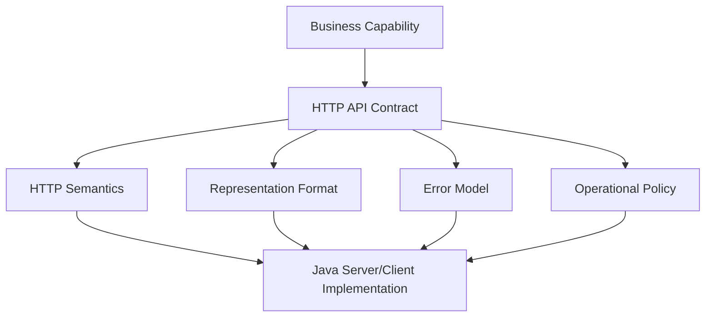
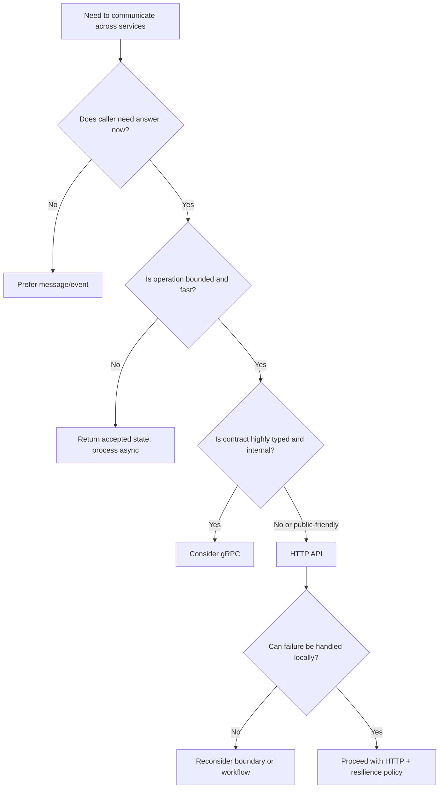
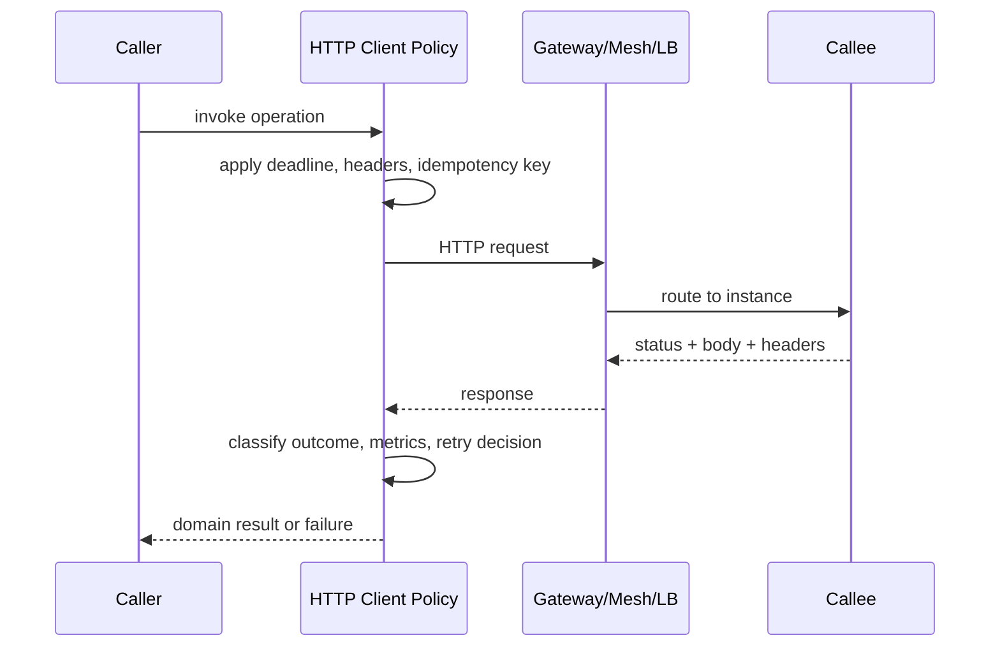
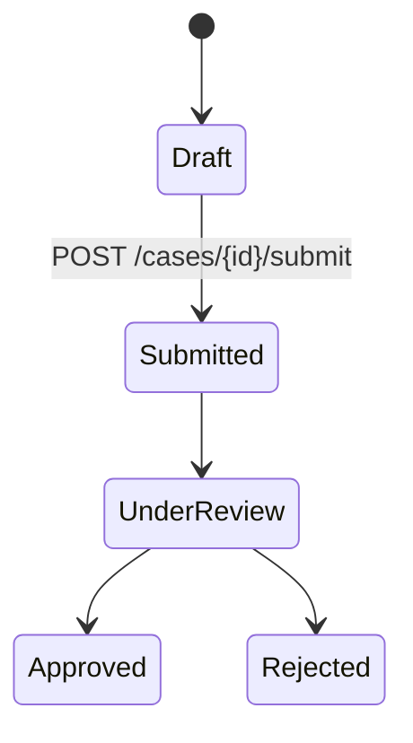
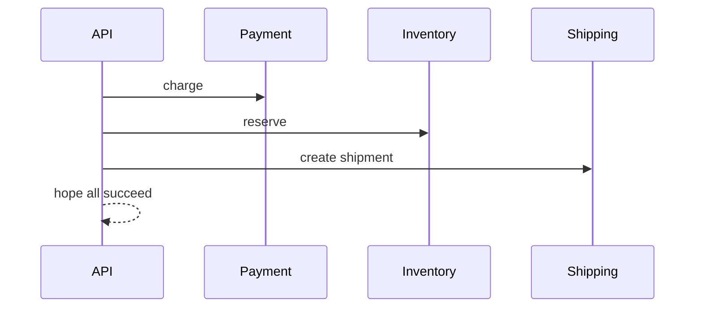
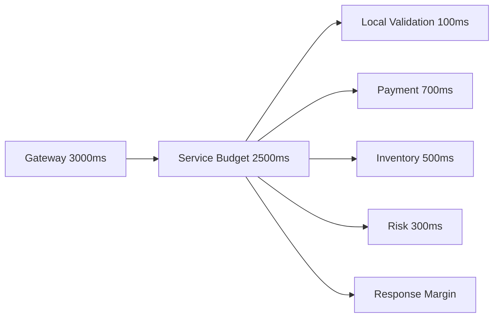
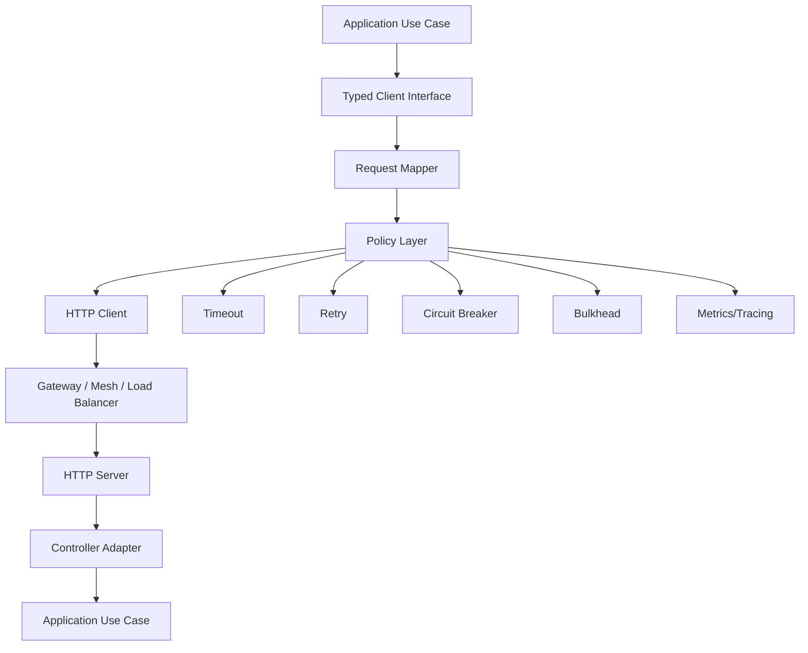
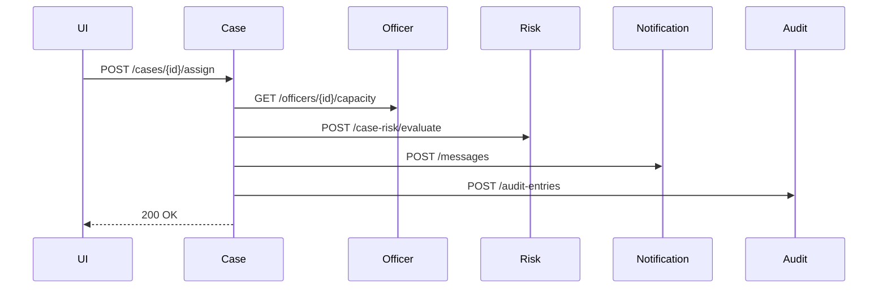
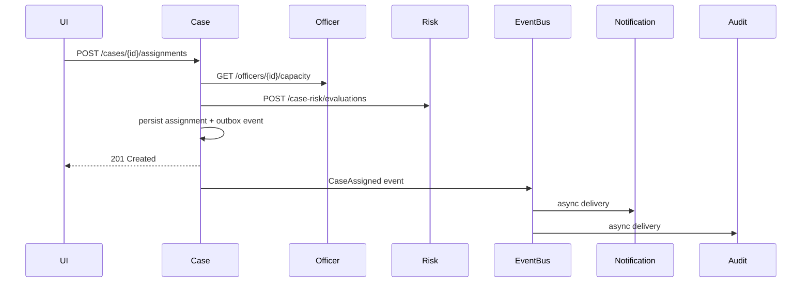

# Part 009 — HTTP as Microservice Transport

HTTP is not just “REST”.

For microservices, HTTP is a **distributed communication substrate** with three separate layers:

1. **Protocol layer** — URI, method, headers, status code, body, connection, cache semantics.
2. **Application contract layer** — what endpoint means, what state transition it triggers, what errors are possible.
3. **Operational control layer** — timeout, retry, load balancing, observability, throttling, graceful degradation.

A top-level engineer does not ask:

> “Should we use REST?”

They ask:

> “Is this interaction safe to model as a synchronous HTTP dependency under our latency, reliability, ownership, and failure-isolation constraints?”

That question is the whole point of this part.

---

## 1. The Correct Mental Model

HTTP is a **stateless application-level protocol**. Stateless does not mean the application has no state. It means each request must carry enough information for the server to understand it without relying on protocol-level conversation state.

For service-to-service communication, treat every HTTP call as:

```text
caller intent + request metadata + payload
  -> remote computation over unreliable network
  -> response metadata + payload + observable outcome
```

That gives us four design surfaces:

| Surface | Question |
|---|---|
| Intent | What does the caller want to happen? |
| Metadata | What context travels with the call? |
| Payload | What data crosses the boundary? |
| Outcome | What can the caller safely conclude? |

A weak HTTP API hides these surfaces. A strong HTTP API makes them explicit.

---

## 2. HTTP as Transport vs HTTP as Architecture

HTTP is the transport. REST is an architectural style. JSON is a representation format. OpenAPI is a contract description. A Java client is an implementation detail.

These are often collapsed into one vague word: “API”. That creates poor debugging and poor ownership.



Example:

```http
POST /payments/authorize
```

The failure might be:

| Layer | Example failure |
|---|---|
| Contract | Endpoint is not idempotent but caller retries it. |
| Protocol | `503` is used for business rejection instead of temporary unavailability. |
| Representation | Response omits machine-readable retry decision. |
| Operational policy | Caller timeout is longer than gateway timeout. |
| Implementation | HTTP client connection pool is exhausted. |

If every issue is called an “API issue”, the team cannot fix the correct layer.

---

## 3. Why HTTP Became the Default Internal Transport

HTTP became common in microservices because it has low organizational friction:

| Reason | Why it matters |
|---|---|
| Ubiquity | Every language, proxy, gateway, service mesh, and observability stack understands it. |
| Human inspectability | Calls can be reproduced with curl, browser tools, or scripts. |
| Intermediary support | Load balancers, gateways, WAFs, meshes, and caches are mature. |
| Contract tooling | OpenAPI, mock servers, validators, and generated clients are widely available. |
| Operational familiarity | Engineers know how to reason about headers, status codes, logs, and latency. |

That does not mean HTTP is always best. It means HTTP is often the cheapest place to start.

A strong default is useful. An unexamined default is expensive.

---

## 4. What HTTP Is Good At

HTTP fits when the interaction is:

1. **Request/response shaped**.
2. **Bounded in time**.
3. **Caller needs immediate answer**.
4. **Payload is moderate**.
5. **Latency budget can tolerate a network round trip**.
6. **The caller can handle failure immediately**.
7. **The operation maps cleanly to resource/action semantics**.

Typical good fits:

| Use case | Why HTTP fits |
|---|---|
| Read user profile | Immediate query; bounded payload. |
| Validate eligibility | Caller needs yes/no before continuing. |
| Reserve inventory | Command with immediate acceptance/rejection. |
| Query case status | Resource-oriented read. |
| Submit application | Command endpoint with idempotency key. |
| Internal admin operation | Human/debug tooling benefits from HTTP. |

HTTP gives a caller a clear immediate response. That is its strength.

But that same immediacy creates coupling.

---

## 5. What HTTP Is Bad At

HTTP is often misused for work that should not be tightly synchronous.

| Use case | Why HTTP is risky |
|---|---|
| Fan-out to 20 services during one user request | Amplifies latency and availability failure. |
| Long-running workflows | Request timeout becomes workflow lifetime boundary. |
| Bulk transfer without chunking/backpressure | Memory pressure and timeout failure. |
| Event notification | Caller waits for something that does not require immediate answer. |
| Cross-domain state propagation | Tight temporal coupling between independent domains. |
| High-volume telemetry ingestion | Streaming/batching protocol may fit better. |
| Exactly-once business side effects | HTTP alone cannot provide distributed exactly-once semantics. |

A common smell:

```text
HTTP endpoint returns 200 only after five downstream systems finish their own side effects.
```

This usually means a synchronous API is pretending to be a workflow engine.

---

## 6. The Most Important HTTP Microservice Question

Before creating an endpoint, ask:

> “What does the caller need to know immediately?”

Not:

> “What can the callee do?”

Example: onboarding a merchant.

Naive design:

```text
POST /merchants
  -> create merchant
  -> validate business registry
  -> provision account
  -> configure billing
  -> send welcome email
  -> return 201
```

This endpoint has a fragile availability equation:

```text
Availability = A_create * A_registry * A_account * A_billing * A_email
```

Better design:

```text
POST /merchants
  -> accept command
  -> create merchant record
  -> emit onboarding requested
  -> return 202 or 201 with onboarding state
```

Then asynchronous workers handle downstream work.

HTTP remains useful, but its synchronous boundary becomes smaller.

---

## 7. HTTP in the Communication Decision Tree

Use HTTP when the caller truly needs an immediate result.



HTTP is not chosen because it is easy. It is chosen because the interaction shape matches.

---

## 8. Service-to-Service HTTP Is Not Browser HTTP

HTTP semantics are shared, but operational expectations differ.

| Concern | Browser/API consumer | Service-to-service |
|---|---|---|
| User tolerance | Human may wait seconds | Often tens to hundreds of milliseconds |
| Retry source | Browser, SDK, user action | Automated callers, queues, schedulers |
| Failure amplification | Limited | Can cascade across fleet |
| Identity | User/browser/session | Workload identity, service identity, delegated user context |
| Observability | User analytics | Trace/span/log/metric correlation |
| Compatibility | Public clients may lag for years | Internal clients can migrate faster, but not instantly |
| Traffic shape | User-driven | Burst, scheduled, batch, fan-out, retry storms |

Internal HTTP is easier to control but easier to abuse.

Because the clients are “ours”, teams often skip discipline. That is backwards. Internal clients can generate far more destructive traffic than external users.

---

## 9. The Anatomy of a Production HTTP Call

A production service-to-service HTTP call is not just:

```java
client.get("http://risk-service/check")
```

It is closer to:

```text
resolve target
  -> acquire connection
  -> attach identity/context/correlation
  -> serialize payload
  -> enforce deadline
  -> send request
  -> observe latency/errors
  -> classify response
  -> maybe retry if safe
  -> decode payload
  -> return domain outcome
  -> record telemetry
```



The policy is part of system design, not plumbing.

---

## 10. HTTP Contract Must Include Operational Semantics

An endpoint contract is incomplete if it only describes payload fields.

It must also describe:

| Contract dimension | Example |
|---|---|
| Method semantics | Is this safe, idempotent, cacheable? |
| Timeout expectation | Expected p50/p95/p99 latency. |
| Retryability | Can caller retry? Under what condition? |
| Idempotency | Is idempotency key required? How long retained? |
| Error taxonomy | Which errors are business vs technical? |
| Rate limits | Per caller? Per tenant? Per user? |
| Consistency | Is response strongly current or eventually consistent? |
| Pagination | Stable ordering? Snapshot? Cursor validity? |
| Versioning | Backward-compatible evolution rules. |
| Observability | Required trace/request/correlation fields. |

A minimal internal endpoint specification should answer:

```text
What does it do?
Who may call it?
How fast should it be?
How can it fail?
Can callers retry?
Can callers cache?
Can callers deduplicate?
What is stable over time?
What should be logged/traced/alerted?
```

OpenAPI can describe shape. The engineering handbook must describe operational meaning.

---

## 11. Resource-Oriented HTTP vs Operation-Oriented HTTP

Not every internal HTTP API has to be textbook REST. But every endpoint should be honest.

### Resource-oriented

```http
GET /cases/CASE-123
PATCH /cases/CASE-123/status
GET /cases?assignee=team-a&state=open
```

Good when the API exposes durable domain objects.

### Operation-oriented

```http
POST /case-eligibility/evaluate
POST /payment-authorizations
POST /documents/render
```

Good when the API exposes a computation or command.

### Bad hybrid

```http
GET /cases/CASE-123/approve
POST /cases/getCaseDetails
PUT /processCase
```

Bad because method and URI semantics are misleading.

A mature API does not need to be ideologically pure. It needs to make failure, retry, and state transition semantics obvious.

---

## 12. HTTP and State Transitions

HTTP APIs often hide state machine transitions behind endpoints.

Example:

```http
POST /cases/CASE-123/submit
```

The endpoint is not “just a POST”. It is a transition:



For every state-changing endpoint, specify:

| Question | Why it matters |
|---|---|
| From which states is this valid? | Prevents invalid transitions. |
| Is the transition idempotent? | Determines retry behavior. |
| What is returned if already transitioned? | Avoids duplicate side effects. |
| What audit entry is created? | Regulatory defensibility. |
| What downstream events are emitted? | Communication contract beyond HTTP. |
| What happens if response is lost? | Caller recovery model. |

If an endpoint changes business state, HTTP status code alone is not enough.

---

## 13. The Request Must Carry Context

A service-to-service call normally needs metadata:

| Metadata | Purpose |
|---|---|
| `traceparent` | Distributed trace propagation. |
| Correlation/request ID | Operational debugging. |
| Idempotency key | Safe command retry/deduplication. |
| Caller/service identity | Authentication and authorization. |
| Tenant/organization context | Multi-tenant scoping. |
| Locale/time zone | User-facing formatting, if needed. |
| Deadline/timeout budget | Avoid wasted work after caller gave up. |
| Causation ID | Link command/event/request lineage. |

Do not smuggle critical context through global variables, thread locals without propagation discipline, or environment-specific assumptions.

The call boundary should be inspectable.

---

## 14. The Response Must Say What the Caller Can Conclude

A response is not just data. It is an assertion.

Weak response:

```json
{ "status": "OK" }
```

Strong response:

```json
{
  "decision": "APPROVED",
  "decisionId": "dec_01J...",
  "evaluatedAt": "2026-07-05T10:32:11Z",
  "validUntil": "2026-07-05T10:37:11Z",
  "basisVersion": "risk-policy-2026.07.01"
}
```

The second response tells the caller:

1. What decision was made.
2. When it was made.
3. How long it can be trusted.
4. Which policy basis produced it.
5. How to correlate it later.

This matters for regulatory, financial, operational, or enforcement workflows.

---

## 15. Status Codes Are Transport-Level Outcome Classes

HTTP status codes are useful, but they are not your whole domain model.

| Status class | Meaning for caller |
|---|---|
| `2xx` | Request accepted or completed according to endpoint semantics. |
| `3xx` | Redirection/cache/navigation behavior; rare internally except gateway cases. |
| `4xx` | Caller request is invalid, unauthorized, forbidden, conflicted, or not applicable. |
| `5xx` | Server/upstream side failed or cannot complete now. |

A bad practice is mapping every failure to `500`.

A worse practice is mapping business rejection to `200 OK` with an error flag inside the body.

A mature API separates:

| Failure type | Example status | Retry? |
|---|---:|---|
| Validation error | `400` | No, unless request changes. |
| Unauthorized | `401` | Maybe after token refresh. |
| Forbidden | `403` | No, unless permissions change. |
| Missing resource | `404` | Usually no. |
| State conflict | `409` | Maybe after read/merge/retry. |
| Rate limited | `429` | Yes, after delay/budget. |
| Dependency unavailable | `503` | Yes, if operation is safe to retry. |
| Timeout gateway | `504` | Unknown outcome; retry only if safe. |

Status codes classify technical interaction outcome; body explains application outcome.

---

## 16. HTTP Does Not Magically Give Idempotency

HTTP defines idempotent methods, but your implementation can still violate the intent.

Example:

```http
PUT /users/123/email
```

Payload:

```json
{ "email": "new@example.com" }
```

This is naturally idempotent if applying it twice leaves the resource in the same state.

But this is not idempotent if implementation also does this every time:

```text
send verification email
append audit entry "email changed"
charge fee
publish duplicate irreversible downstream event
```

Top-level rule:

> Idempotency must include externally visible side effects, not only database row value.

For command-style `POST`, require an idempotency key when duplicate submission would be harmful.

---

## 17. HTTP Has No Built-In Business Transaction Across Services

A single HTTP call can be transactional inside one service boundary. It cannot make multiple services one ACID transaction.



If `Shipping` fails after `Payment` succeeds, HTTP cannot fix the business consistency problem.

Better options:

| Situation | Better pattern |
|---|---|
| Need immediate all-or-nothing inside one aggregate | Keep operation inside one service boundary. |
| Need multi-step cross-service process | Saga/process manager/workflow. |
| Need reliable state publication | Transactional outbox. |
| Need downstream eventual reaction | Event-driven communication. |
| Need compensating action | Explicit compensation command. |

HTTP can trigger a workflow. It should not pretend to be the workflow.

---

## 18. Connection Behavior Is Part of HTTP Design

Most microservice HTTP incidents are not about JSON syntax. They are about connection behavior.

Important operational dimensions:

| Dimension | Failure mode |
|---|---|
| DNS resolution | Stale IP, slow lookup, uneven load. |
| Connection pool | Pool exhaustion, queueing, head-of-line delay. |
| Keep-alive | Reusing stale closed connections. |
| TLS handshake | Latency spikes, certificate failures. |
| HTTP/1.1 | Limited concurrency per connection; head-of-line at connection level. |
| HTTP/2 | Multiplexing helps but introduces stream-level and flow-control concerns. |
| Proxy/gateway | Idle timeout mismatch, max request size, buffering. |
| Server thread pool | Saturation causing latency amplification. |

The HTTP API contract may be correct while production still fails because the transport policy is wrong.

---

## 19. Timeout Budget Must Be Designed End-to-End

A caller should not give a downstream service more time than the caller itself has.

Bad:

```text
API Gateway timeout: 3s
Order service handler budget: 2.5s
Payment client read timeout: 5s
```

If `Payment` takes 4 seconds, the user request is already gone, but work continues.

Better:

```text
Gateway: 3s
Order handler: 2.5s
Payment call total budget: 700ms
Inventory call total budget: 500ms
Risk call total budget: 300ms
Remaining time reserved for local processing and response
```



Timeout is not a number in YAML. It is a resource allocation decision.

---

## 20. Retry Is a Business Decision

Retries are dangerous because they duplicate traffic and may duplicate side effects.

Retry only when all are true:

1. The failure is likely transient.
2. The operation is safe to retry.
3. The caller still has budget.
4. Retry uses backoff and jitter.
5. There is an upper bound.
6. Retry does not violate business semantics.
7. The system can survive retry amplification.

Do not blindly retry every `IOException` or every `5xx`.

A retry policy without idempotency is an incident waiting to happen.

---

## 21. HTTP and Caching in Microservices

Caching is not only CDN/browser caching. Internal service responses can also be cached, but only when semantics allow it.

Potentially cacheable:

| Data | Condition |
|---|---|
| Reference data | Versioned or rarely changing. |
| Policy metadata | Has explicit version/validity. |
| Feature flags | Controlled TTL and fallback behavior. |
| Public configuration | Consistency tolerance known. |
| Expensive deterministic computation | Input-hash keyed; invalidation defined. |

Dangerous to cache:

| Data | Why |
|---|---|
| Authorization decision | Context-sensitive and security-critical. |
| Account balance | High consistency expectations. |
| Case assignment state | Can change by workflow/queue/user action. |
| Fraud/risk score | May be time-sensitive. |
| Anything without freshness semantics | Caller cannot know if stale is acceptable. |

A cache is part of the communication contract because it changes what “read” means.

---

## 22. HTTP Observability Requirements

Every internal HTTP call should produce telemetry at both ends.

Minimum metrics:

| Metric | Why |
|---|---|
| Request count by route/method/status | Traffic and error rate. |
| Latency histogram by route/method/outcome | Tail latency and SLO. |
| Client-side timeout count | Budget failures. |
| Retry count and retry success | Hidden instability. |
| Circuit breaker state | Downstream protection. |
| Pool acquisition latency | Client saturation. |
| In-flight requests | Load and capacity. |
| Payload size | Memory/network pressure. |

Minimum trace fields:

| Field | Purpose |
|---|---|
| HTTP method | Semantics. |
| Route template | Cardinality-safe grouping. |
| Status code | Outcome. |
| Peer service | Dependency graph. |
| Trace ID/span ID | Causality. |
| Error classification | Alert routing. |

Never put unbounded raw URLs with IDs into metric labels. Use route templates:

```text
Good: GET /cases/{caseId}
Bad:  GET /cases/CASE-123456789
```

High-cardinality telemetry breaks observability systems.

---

## 23. Java Server-Side Posture

For Java services, the HTTP server layer must not leak framework convenience into service contract design.

Spring Boot example structure:

```text
controller
  -> request validation
  -> command/query mapping
  -> application service
  -> domain operation
  -> response mapping
  -> error mapping
```

Avoid:

```text
controller
  -> repository
  -> random downstream client
  -> entity returned as JSON
```

A controller is an adapter. It should not become the business transaction script.

### Example controller skeleton

```java
@RestController
@RequestMapping("/case-eligibility")
final class CaseEligibilityController {

    private final EvaluateCaseEligibility useCase;

    CaseEligibilityController(EvaluateCaseEligibility useCase) {
        this.useCase = useCase;
    }

    @PostMapping("/evaluations")
    ResponseEntity<EvaluateEligibilityResponse> evaluate(
            @RequestHeader("Idempotency-Key") String idempotencyKey,
            @Valid @RequestBody EvaluateEligibilityRequest request
    ) {
        var command = request.toCommand(idempotencyKey);
        var result = useCase.evaluate(command);

        return ResponseEntity
                .status(HttpStatus.CREATED)
                .body(EvaluateEligibilityResponse.from(result));
    }
}
```

Notice the boundary:

1. HTTP header is mapped into command metadata.
2. Request DTO is not the domain object.
3. Response DTO is explicit.
4. Endpoint semantics are command-oriented and honest.

---

## 24. Java Client-Side Posture

A Java HTTP client should expose a domain-level API, not raw HTTP mechanics.

Bad caller code:

```java
var response = webClient.post()
        .uri("/risk/check")
        .bodyValue(payload)
        .retrieve()
        .bodyToMono(String.class)
        .block();

if (response.contains("APPROVED")) {
    // continue
}
```

Better:

```java
RiskDecision decision = riskClient.evaluateRisk(command, deadline);

if (decision.isApproved()) {
    // continue
}
```

The client wrapper owns:

| Concern | Owned by client wrapper |
|---|---|
| URL/path | Yes |
| Header propagation | Yes |
| Serialization | Yes |
| Error mapping | Yes |
| Timeout/retry/circuit breaker | Yes |
| Metrics/tracing | Yes |
| Domain result mapping | Yes |

Business code should not know which status code means temporary overload.

---

## 25. HTTP Endpoint Design Checklist

Before shipping a service-to-service HTTP endpoint, answer these:

```text
[ ] What is the operation's immediate caller-visible outcome?
[ ] Is the method semantically correct?
[ ] Is the operation safe, idempotent, or neither?
[ ] Is an idempotency key required?
[ ] What are the valid state transitions?
[ ] What are the expected latency percentiles?
[ ] What is the maximum supported payload size?
[ ] What status codes can be returned?
[ ] Which failures are retryable?
[ ] What problem/error body is returned?
[ ] Are trace/correlation headers propagated?
[ ] Are metrics cardinality-safe?
[ ] Are clients generated, handwritten, or wrapped?
[ ] What is the backward-compatibility policy?
[ ] What happens if the response is lost?
[ ] What happens if the server completes work after caller timeout?
[ ] What downstream side effects are triggered?
[ ] Is the endpoint still correct during partial outage?
```

Distributed communication is expensive. The checklist makes the cost visible before production does.

---

## 26. Common Anti-Patterns

### Anti-pattern 1: HTTP call chain as architecture

```text
A -> B -> C -> D -> E
```

Each hop adds latency and failure probability.

Better:

```text
A calls B for immediate answer.
B publishes event for non-immediate reactions.
```

### Anti-pattern 2: POST everything

```http
POST /getUser
POST /updateUser
POST /deleteUser
```

This discards useful HTTP semantics.

### Anti-pattern 3: 200 with error body

```http
HTTP/1.1 200 OK

{ "success": false, "error": "not found" }
```

This breaks metrics, proxies, client libraries, and human debugging.

### Anti-pattern 4: no timeout

No timeout means caller resources can be held indefinitely.

### Anti-pattern 5: retry without idempotency

Duplicate business actions become possible.

### Anti-pattern 6: leaking persistence model

Returning JPA entities directly couples API to database shape.

### Anti-pattern 7: no route-level SLO

Without route-level latency/error expectations, all endpoints are treated equally even when business impact differs.

---

## 27. Production Reference Shape

A production HTTP communication stack should look like this:



At runtime, this stack has one job:

> Convert a remote interaction into a bounded, observable, semantically correct local outcome.

---

## 28. Practical Rule Set

Use these rules as default until you have a strong reason not to:

1. Use HTTP for bounded request/response interactions.
2. Do not use HTTP as a long-running workflow transport.
3. Make operation semantics explicit through method, URI, status code, headers, and body.
4. Treat timeout as a budget, not a magic constant.
5. Retry only idempotent or explicitly deduplicated commands.
6. Do not hide business failure under `200 OK`.
7. Do not expose database entities as API models.
8. Wrap Java clients behind domain interfaces.
9. Emit route-level metrics and traces.
10. Design for the lost-response case.
11. Avoid synchronous fan-out unless you can prove it fits the SLO.
12. Write operational semantics into the endpoint contract.

---

## 29. Mini Case Study: Enforcement Case Assignment

Suppose an enforcement platform has these services:

| Service | Responsibility |
|---|---|
| Case Service | Owns case lifecycle. |
| Officer Service | Owns officer profile and capacity. |
| Risk Service | Scores enforcement priority. |
| Notification Service | Sends messages. |
| Audit Service | Records audit trail. |

Naive synchronous design:



This makes assignment availability depend on notification and audit service availability.

Better design:



HTTP remains useful for immediate decisions. Events handle reactions.

The communication design follows the real dependency structure.

---

## 30. What You Should Internalize

HTTP is not the simple option. It is the familiar option.

Used well, HTTP gives microservices:

1. Clear request/response semantics.
2. Mature tooling.
3. Debuggable boundaries.
4. Strong interoperability.
5. Operational leverage through gateways, proxies, and observability.

Used poorly, HTTP creates:

1. Synchronous dependency chains.
2. Retry storms.
3. Timeout waste.
4. Duplicate side effects.
5. Hidden distributed transactions.
6. Misleading `200 OK` failures.
7. Fragile service ownership boundaries.

The difference is not the protocol. The difference is whether the team treats communication as architecture.

---

## References

- RFC 9110 — HTTP Semantics: https://www.rfc-editor.org/rfc/rfc9110.html
- RFC 9112 — HTTP/1.1: https://www.rfc-editor.org/rfc/rfc9112.html
- RFC 9457 — Problem Details for HTTP APIs: https://www.rfc-editor.org/rfc/rfc9457.html
- OpenTelemetry HTTP Semantic Conventions: https://opentelemetry.io/docs/specs/semconv/http/
- AWS Builders Library — Timeouts, retries, and backoff with jitter: https://aws.amazon.com/builders-library/timeouts-retries-and-backoff-with-jitter/
