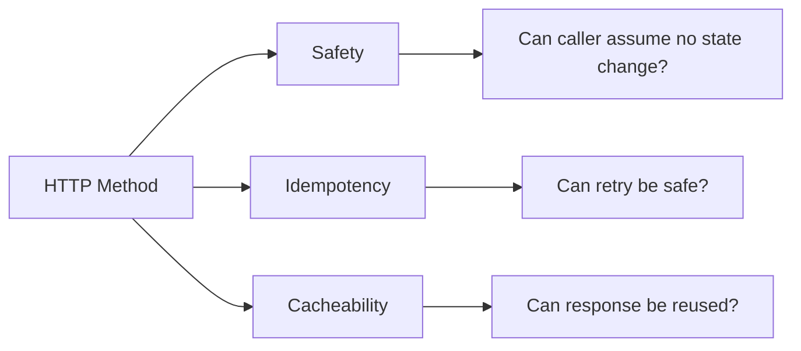
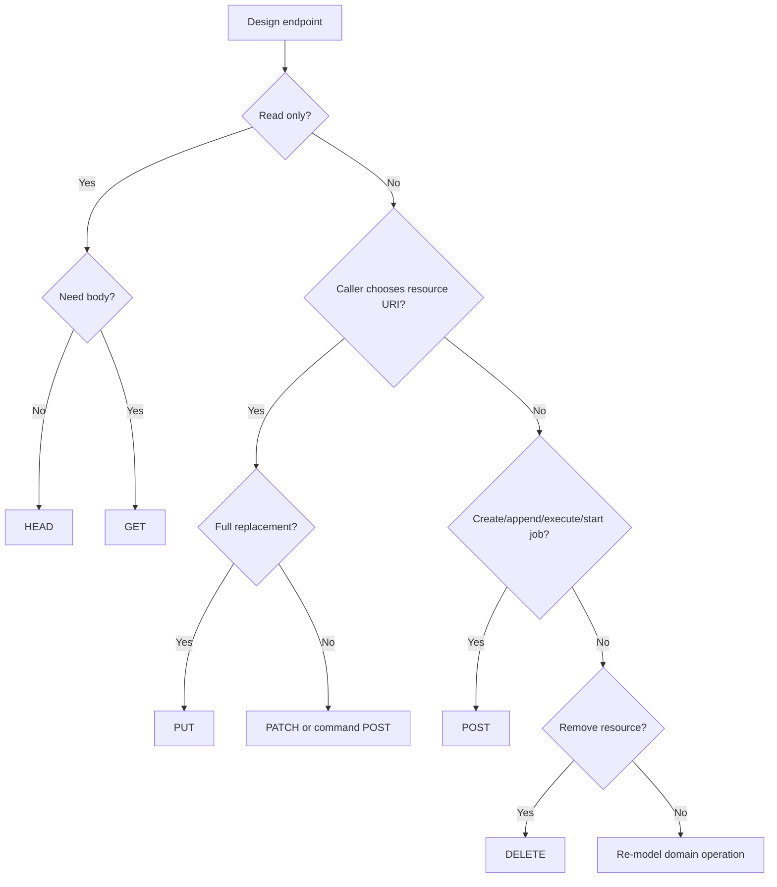
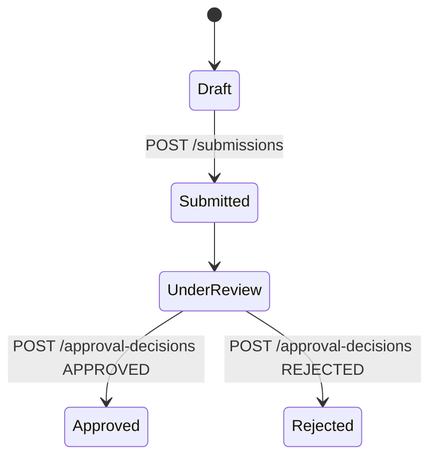
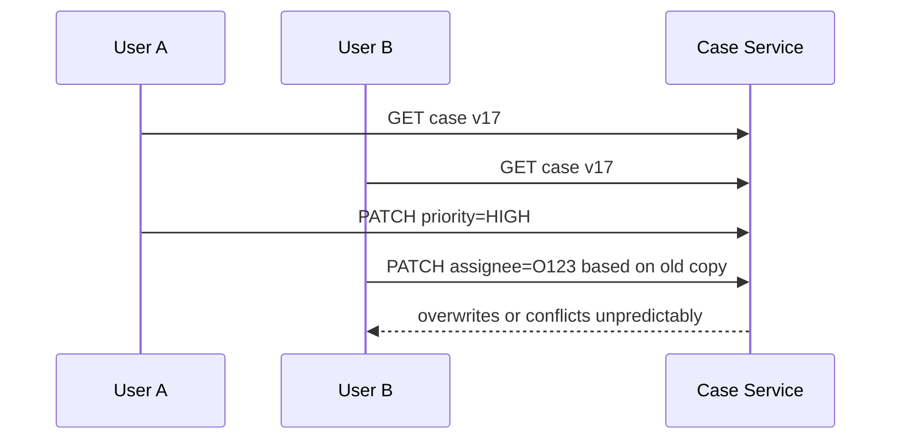
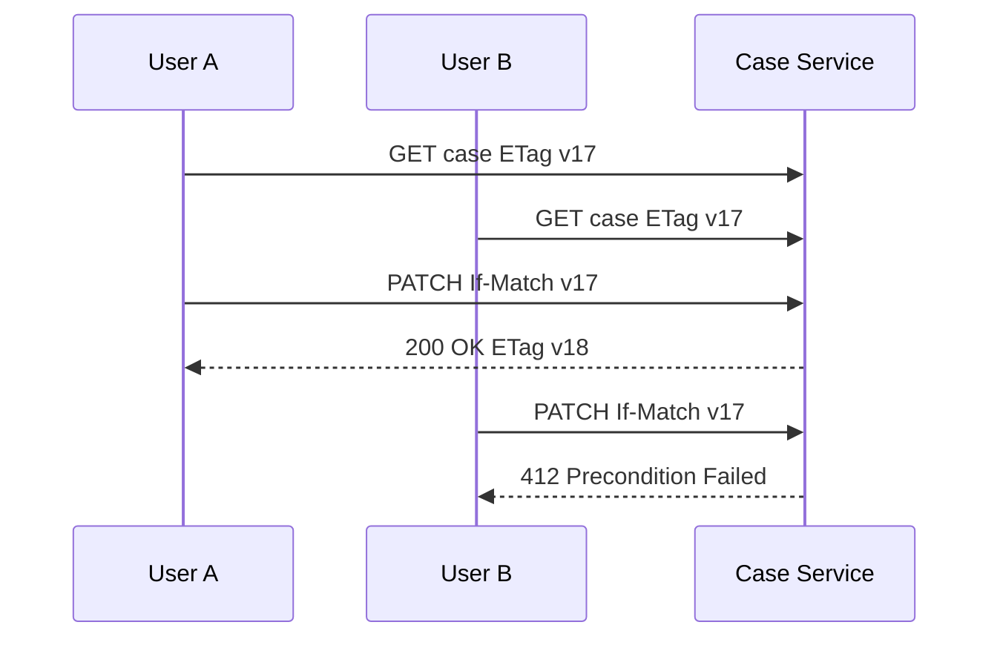
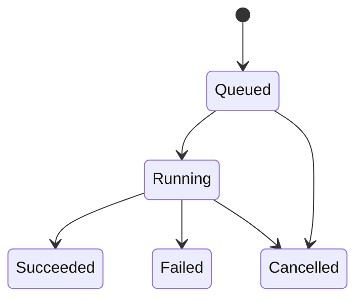

# Part 010 — HTTP Method Semantics: Safety, Idempotency, Cacheability

HTTP methods are not naming conventions. They are **semantic contracts** between caller, server, intermediaries, client libraries, caches, proxies, gateways, observability tools, and humans debugging production.

When a team uses methods casually, the system loses free leverage:

- clients cannot retry safely;
- gateways cannot classify traffic correctly;
- metrics become misleading;
- caches become dangerous;
- audit behavior becomes unclear;
- state transitions become hidden;
- incidents become harder to reason about.

This part gives you a production mental model for method semantics.

---

## 1. The Three Properties That Matter

HTTP method design revolves around three properties:

| Property | Meaning |
|---|---|
| Safe | The request is essentially read-only from the caller's perspective. |
| Idempotent | Repeating the same request has the same intended effect as sending it once. |
| Cacheable | A response is allowed to be stored and reused under HTTP caching rules. |

These are not academic words. They drive operational behavior.



If you choose the wrong method, you lie to your infrastructure.

---

## 2. Safety: The Read-Only Contract

A method is safe when the client does not request a state-changing operation.

Typical safe methods:

| Method | Safe? |
|---|---:|
| `GET` | Yes |
| `HEAD` | Yes |
| `OPTIONS` | Yes |
| `TRACE` | Yes by semantics, rarely used in application APIs |

Unsafe methods:

| Method | Safe? |
|---|---:|
| `POST` | No |
| `PUT` | No |
| `PATCH` | No |
| `DELETE` | No |

Safe does **not** mean the server does absolutely nothing. A `GET` can write access logs, metrics, traces, cache entries, and rate-limit counters. Those are incidental side effects.

Safe means the caller did not ask to change the target resource's application state.

Good:

```http
GET /cases/CASE-123
```

Bad:

```http
GET /cases/CASE-123/approve
```

The second one mutates business state through a safe method. That breaks assumptions for browsers, crawlers, caches, proxies, retries, prefetchers, and human operators.

---

## 3. Idempotency: Same Intended Effect Under Repetition

Idempotency is one of the most important reliability concepts in HTTP microservices.

An operation is idempotent when doing it multiple times has the same intended effect as doing it once.

Typical idempotent methods:

| Method | Idempotent? |
|---|---:|
| `GET` | Yes |
| `HEAD` | Yes |
| `OPTIONS` | Yes |
| `PUT` | Yes |
| `DELETE` | Yes |

Typical non-idempotent or conditional methods:

| Method | Idempotent? |
|---|---:|
| `POST` | No by default |
| `PATCH` | Not guaranteed |

The phrase “intended effect” matters.

Example:

```http
DELETE /sessions/S123
```

First request deletes the session. Second request may return `404 Not Found` or `204 No Content`, depending on API design. The intended end state is the same: the session does not exist.

That is idempotency.

---

## 4. Idempotency Is Not “Same Response”

A repeated idempotent request does not have to return the same response.

Example:

```http
DELETE /documents/D123
```

Possible design A:

```text
First call  -> 204 No Content
Second call -> 404 Not Found
```

Possible design B:

```text
First call  -> 204 No Content
Second call -> 204 No Content
```

Both can be idempotent if the end state is the same.

But operationally, design B is often easier for clients that perform cleanup.

Rule:

> Idempotency is about effect, not byte-identical response.

---

## 5. Cacheability: Reusing Responses Safely

Cacheability means a response may be stored and reused if caching rules allow it.

In microservices, caching is not only a browser concern. It affects:

- client-side caches;
- gateway caches;
- CDN for edge APIs;
- service mesh/proxy behavior;
- in-process reference data caches;
- generated SDK assumptions.

Typical cache-friendly methods:

| Method | Cacheable in principle? |
|---|---:|
| `GET` | Yes |
| `HEAD` | Yes |
| `POST` | Only with explicit caching semantics; uncommon in internal APIs |

Do not rely on accidental caching. If a response is cacheable, say so explicitly through response headers or internal contract rules.

Example:

```http
Cache-Control: max-age=60, stale-while-revalidate=300
ETag: "policy-v42"
```

Never add cache headers just to “improve performance” unless stale behavior is understood.

---

## 6. Method Semantics Summary

| Method | Safe | Idempotent | Cacheable | Typical use |
|---|---:|---:|---:|---|
| `GET` | Yes | Yes | Yes | Read resource/query result. |
| `HEAD` | Yes | Yes | Yes | Read metadata without body. |
| `OPTIONS` | Yes | Yes | Limited practical app use | Discover supported operations/CORS. |
| `POST` | No | No by default | Rare | Create subordinate resource, submit command, trigger computation. |
| `PUT` | No | Yes | No by default | Replace or create resource at known URI. |
| `PATCH` | No | Not guaranteed | No by default | Partially update resource. |
| `DELETE` | No | Yes | No by default | Remove resource or mark as removed. |

This table is easy to memorize. The hard part is applying it to messy business operations.

---

## 7. GET: Read Without Requested Mutation

Use `GET` when the caller asks to retrieve a representation.

Good examples:

```http
GET /cases/CASE-123
GET /cases?state=open&assignee=team-a
GET /officers/O123/capacity
GET /policy-rules/risk-scoring/current
```

A `GET` can return:

- full resource representation;
- filtered collection;
- projection;
- computed read model;
- current state snapshot.

But `GET` must not request business state mutation.

Bad:

```http
GET /payments/P123/capture
GET /cases/CASE-123/assign?officer=O123
GET /notifications/send?userId=U123
```

Why this is dangerous:

1. Preloading or crawling can trigger state changes.
2. Caches may store or replay unexpectedly.
3. Observability classifies mutation as read traffic.
4. Operators using browser links can accidentally mutate data.
5. Retry and timeout behavior becomes unsafe.

---

## 8. GET and Query Complexity

A `GET` query should be stable and bounded.

Good:

```http
GET /cases?state=open&limit=50&cursor=eyJ...
```

Risky:

```http
GET /cases?sql=select%20*%20from%20cases
```

Risky:

```http
GET /reports/huge-regulatory-export
```

If a query is expensive, long-running, or creates an export artifact, model it as a command:

```http
POST /case-export-jobs
```

Then poll or subscribe:

```http
GET /case-export-jobs/JOB-123
```

This keeps `GET` read-oriented and moves expensive asynchronous work into an explicit job resource.

---

## 9. HEAD: Metadata Without Body

`HEAD` is like `GET`, but the server returns headers only.

Possible use cases:

```http
HEAD /documents/D123/content
HEAD /files/F123
HEAD /exports/E123/result
```

Useful for:

- checking existence;
- checking content length;
- checking ETag/version;
- checking last modified time;
- avoiding body transfer.

In internal microservices, `HEAD` is underused. That is acceptable. Do not add it everywhere mechanically.

Use it when metadata-only checks are common and meaningful.

---

## 10. OPTIONS: Capability Discovery

`OPTIONS` describes communication options for a target resource.

Common in browser/CORS contexts. Less common for internal service-to-service APIs.

Possible internal use:

```http
OPTIONS /cases/CASE-123
```

Response might expose allowed methods:

```http
Allow: GET, PATCH, DELETE
```

For internal APIs, capability discovery is often better handled through contracts, OpenAPI, service catalog, or explicit state transition endpoints.

Do not depend on `OPTIONS` as your main business capability model.

---

## 11. POST: Create, Submit, Execute, Append

`POST` is the most flexible method and therefore the easiest to abuse.

Use `POST` for:

| Use | Example |
|---|---|
| Create subordinate resource | `POST /cases` |
| Submit command | `POST /cases/CASE-123/submissions` |
| Trigger computation | `POST /risk-evaluations` |
| Append to collection | `POST /audit-entries` |
| Start async job | `POST /report-generation-jobs` |
| Execute domain action | `POST /payments/P123/captures` |

A good `POST` endpoint should name the thing being created or commanded.

Better:

```http
POST /case-assignments
POST /payment-authorizations
POST /risk-evaluations
```

Worse:

```http
POST /doAssignment
POST /processPayment
POST /runRisk
```

Operation-oriented APIs are fine. Vague verbs are not.

---

## 12. POST and Idempotency Keys

`POST` is not idempotent by default, but you can make a specific `POST` operation idempotent through a deduplication key.

Example:

```http
POST /payment-authorizations
Idempotency-Key: merchant-123:checkout-789:authorize
Content-Type: application/json
```

Request:

```json
{
  "amount": "125.00",
  "currency": "SGD",
  "paymentMethodId": "pm_123"
}
```

Server stores:

```text
caller identity + idempotency key + request hash + result
```

Repeated request with same key and same payload returns same logical result.

Repeated request with same key and different payload should fail, often as conflict.

```http
409 Conflict
```

Problem body:

```json
{
  "type": "https://example.internal/problems/idempotency-key-conflict",
  "title": "Idempotency key conflict",
  "status": 409,
  "detail": "The same idempotency key was previously used with a different request payload."
}
```

Rule:

> For `POST` commands with expensive, irreversible, or externally visible side effects, idempotency key is not optional.

---

## 13. PUT: Replace Resource at Known URI

Use `PUT` when the caller sends the desired representation for a resource at a known URI.

Example:

```http
PUT /officer-preferences/O123/notification-settings
Content-Type: application/json
```

```json
{
  "emailEnabled": true,
  "smsEnabled": false,
  "dailyDigestHour": 8
}
```

If sent twice, the final resource state is the same.

`PUT` is good for:

- replacing configuration;
- upserting resource with caller-known ID;
- deterministic state setting;
- idempotent integration callbacks.

Be careful: `PUT` means replace, not partial update.

Bad:

```http
PUT /users/U123
{ "displayName": "Ari" }
```

If the server treats missing fields as “unchanged”, this is not true replacement. Use `PATCH` or a specific subresource instead.

Better:

```http
PUT /users/U123/display-name
{ "displayName": "Ari" }
```

or:

```http
PATCH /users/U123
{ "displayName": "Ari" }
```

---

## 14. PUT and Create-vs-Replace Semantics

`PUT` can create a resource if the URI is known by the caller and the API allows it.

Example:

```http
PUT /external-cases/agency-a/CASE-9981
```

This is useful when integrating with external IDs.

Possible responses:

| Situation | Status |
|---|---:|
| Created new resource | `201 Created` |
| Replaced existing resource | `200 OK` or `204 No Content` |
| Conflict with immutable existing identity | `409 Conflict` |

Do not use `PUT` if the server chooses the new resource ID. Use `POST /collection` instead.

---

## 15. PATCH: Partial Change

Use `PATCH` when the caller sends a partial modification.

Example:

```http
PATCH /cases/CASE-123
Content-Type: application/merge-patch+json
```

```json
{
  "priority": "HIGH",
  "assigneeId": "O123"
}
```

`PATCH` is not automatically idempotent.

This patch is likely idempotent:

```json
{ "priority": "HIGH" }
```

This patch is not idempotent:

```json
{ "incrementViolationCountBy": 1 }
```

This is the main danger of `PATCH`: the method does not tell you whether repetition is safe.

Document patch semantics explicitly.

---

## 16. PATCH Format Choices

Common patch styles:

| Style | Media type | Character |
|---|---|---|
| JSON Merge Patch | `application/merge-patch+json` | Simple object merge; null often means remove. |
| JSON Patch | `application/json-patch+json` | Operation list: add/remove/replace/test/etc. |
| Custom command patch | API-specific | Domain-friendly but must be documented. |

Example JSON Patch:

```json
[
  { "op": "replace", "path": "/priority", "value": "HIGH" },
  { "op": "test", "path": "/status", "value": "OPEN" }
]
```

The `test` operation is useful for optimistic concurrency.

But for business state transitions, a command endpoint is often clearer than generic patch.

Compare:

```http
PATCH /cases/CASE-123
{ "state": "APPROVED" }
```

with:

```http
POST /cases/CASE-123/approval-decisions
{ "decision": "APPROVED", "reason": "Meets criteria" }
```

The second is more audit-friendly and domain-explicit.

---

## 17. DELETE: Remove or Make Unavailable

Use `DELETE` to remove a resource or make it unavailable through that URI.

Example:

```http
DELETE /sessions/S123
DELETE /draft-cases/D123
```

`DELETE` is idempotent by method semantics.

But be precise about what deletion means:

| Deletion type | Meaning |
|---|---|
| Hard delete | Data physically removed. |
| Soft delete | Marked deleted but retained. |
| Tombstone | Marker retained to prevent recreation/replay issues. |
| Deactivation | Resource remains but not usable. |
| Redaction | Sensitive fields removed while record remains. |

In regulated systems, `DELETE` often does not mean physical removal. It may mean lifecycle transition.

For example:

```http
POST /cases/CASE-123/closure-requests
```

may be more correct than:

```http
DELETE /cases/CASE-123
```

if the domain operation is closure, not deletion.

---

## 18. Method Selection Decision Model

Use this decision tree:



When uncertain between `PATCH` and `POST`, ask:

> “Is this a generic representation update or a named domain decision?”

Generic update → `PATCH`.

Named decision → `POST` to a command/decision resource.

---

## 19. State Transitions Should Not Hide Behind Generic Updates

Bad:

```http
PATCH /applications/A123
{ "status": "APPROVED" }
```

This hides:

- who approved;
- why;
- under what policy;
- from which prior state;
- whether approval can be repeated;
- what audit record is required;
- whether downstream events are emitted.

Better:

```http
POST /applications/A123/approval-decisions
```

```json
{
  "decision": "APPROVED",
  "reasonCode": "MEETS_REQUIREMENTS",
  "policyVersion": "eligibility-2026.07",
  "decidedBy": "officer-123"
}
```

This creates a decision resource and moves the application state through domain logic.



A method can be technically valid but domain-weak. Aim for domain clarity.

---

## 20. Method Semantics and Retry Policy

Retry depends heavily on method semantics.

| Method | Default retry posture |
|---|---|
| `GET` | Retry may be acceptable for transient failures if caller budget remains. |
| `HEAD` | Same as `GET`. |
| `OPTIONS` | Usually safe to retry. |
| `PUT` | Retry may be acceptable because method is idempotent, but side effects must also be idempotent. |
| `DELETE` | Retry may be acceptable, but response handling must tolerate already-deleted state. |
| `POST` | Do not retry unless idempotency key/deduplication exists. |
| `PATCH` | Do not retry unless patch operation is explicitly idempotent or guarded. |

Important:

> HTTP method idempotency is necessary but not sufficient for retry safety.

Your implementation can emit duplicate downstream events, duplicate audit entries, or duplicate notifications even if the resource state ends the same.

---

## 21. Method Semantics and Timeout Unknown Outcome

When a caller times out, it does not know whether the server completed work.

Example:

```text
caller sends POST /payment-authorizations
server charges card
network stalls
caller times out
```

What should caller do?

Without idempotency key:

```text
Retry may double charge.
Do not retry automatically.
Need reconciliation path.
```

With idempotency key:

```text
Retry same request safely.
Server returns stored result or in-progress state.
```

For every unsafe method, design the lost-response case.

Checklist:

```text
[ ] If caller times out, can it query operation status?
[ ] If caller retries, can server deduplicate?
[ ] If server completed work, can caller discover that later?
[ ] If request body differs on retry, does server reject it?
[ ] Is idempotency retention window long enough?
```

---

## 22. Method Semantics and Observability

Metrics should use method semantics.

Useful dimensions:

```text
http.request.method
http.route
http.response.status_code
server.address / peer.service
error.type
```

Example metric grouping:

```text
GET /cases/{caseId}        99.95% success, p95 45ms
POST /case-assignments     99.80% success, p95 220ms
PATCH /cases/{caseId}      99.90% success, p95 90ms
DELETE /sessions/{id}      99.99% success, p95 30ms
```

If your system uses `POST /doEverything`, observability becomes useless:

```text
POST /execute              97.00% success, p95 1700ms
```

You cannot see which operation is failing without parsing request body, which is often unsafe, expensive, and high-cardinality.

Endpoint shape is observability design.

---

## 23. Method Semantics and API Gateway / Service Mesh Behavior

Gateways, proxies, and meshes often apply policy by method and route:

| Policy | Why method matters |
|---|---|
| Rate limiting | `GET` and `POST` may need different limits. |
| Caching | Mostly relevant for `GET`/`HEAD`. |
| Retry | Safer for idempotent methods. |
| Timeout | Writes may need different budgets from reads. |
| Authorization | State-changing methods require stricter controls. |
| Audit | Unsafe methods often require audit. |
| WAF/rules | Methods influence security posture. |
| Routing | Canary may be route/method-specific. |

If everything is `POST`, the platform loses a major policy dimension.

---

## 24. Method Semantics and Authorization

Authorization is not the focus of this series, but method semantics affect enforcement.

Example:

| Endpoint | Permission |
|---|---|
| `GET /cases/{id}` | `case:read` |
| `PATCH /cases/{id}` | `case:update` |
| `POST /cases/{id}/approval-decisions` | `case:approve` |
| `DELETE /draft-cases/{id}` | `case:draft:delete` |

Bad design:

```http
POST /cases/action
```

Body:

```json
{ "action": "APPROVE", "caseId": "CASE-123" }
```

Now authorization must inspect body deeply and routing-level policy becomes weak.

Good endpoint shape makes security simpler.

---

## 25. Method Semantics and Audit

Unsafe methods usually require audit. Safe methods sometimes require access audit in regulated domains.

Audit policy example:

| Method/route | Audit level |
|---|---|
| `GET /cases/{id}` | Access audit if sensitive. |
| `POST /cases/{id}/approval-decisions` | Full decision audit. |
| `PATCH /cases/{id}` | Change audit with diff/reason. |
| `DELETE /documents/{id}` | Deletion/redaction audit. |

If approval is modeled as `PATCH status=APPROVED`, audit loses domain meaning.

If approval is modeled as `POST /approval-decisions`, audit naturally captures a decision object.

---

## 26. Practical Java Controller Examples

### GET example

```java
@RestController
@RequestMapping("/cases")
final class CaseQueryController {

    private final GetCaseQuery getCaseQuery;

    @GetMapping("/{caseId}")
    ResponseEntity<CaseResponse> getCase(@PathVariable String caseId) {
        return getCaseQuery.findById(caseId)
                .map(CaseResponse::from)
                .map(ResponseEntity::ok)
                .orElseGet(() -> ResponseEntity.notFound().build());
    }
}
```

### POST command example

```java
@RestController
@RequestMapping("/cases/{caseId}/approval-decisions")
final class CaseApprovalController {

    private final ApproveCase approveCase;

    @PostMapping
    ResponseEntity<ApprovalDecisionResponse> approve(
            @PathVariable String caseId,
            @RequestHeader("Idempotency-Key") String idempotencyKey,
            @Valid @RequestBody ApprovalDecisionRequest request
    ) {
        var command = request.toCommand(caseId, idempotencyKey);
        var result = approveCase.handle(command);

        URI location = URI.create("/cases/" + caseId + "/approval-decisions/" + result.decisionId());

        return ResponseEntity
                .created(location)
                .body(ApprovalDecisionResponse.from(result));
    }
}
```

### PUT replacement example

```java
@RestController
@RequestMapping("/officers/{officerId}/notification-settings")
final class OfficerNotificationSettingsController {

    private final ReplaceNotificationSettings replaceSettings;

    @PutMapping
    ResponseEntity<Void> replace(
            @PathVariable String officerId,
            @Valid @RequestBody NotificationSettingsRequest request
    ) {
        replaceSettings.handle(request.toCommand(officerId));
        return ResponseEntity.noContent().build();
    }
}
```

### PATCH guarded update example

```java
@RestController
@RequestMapping("/cases")
final class CasePatchController {

    private final PatchCase patchCase;

    @PatchMapping(value = "/{caseId}", consumes = "application/merge-patch+json")
    ResponseEntity<CaseResponse> patch(
            @PathVariable String caseId,
            @RequestHeader("If-Match") String expectedVersion,
            @RequestBody JsonMergePatch patch
    ) {
        var result = patchCase.apply(caseId, expectedVersion, patch);
        return ResponseEntity.ok(CaseResponse.from(result));
    }
}
```

The controller shape communicates semantics before reading implementation.

---

## 27. Choosing Status Codes by Method

### GET

| Situation | Status |
|---|---:|
| Resource found | `200 OK` |
| Resource not found | `404 Not Found` |
| Not allowed to know whether it exists | `404` or `403`, by security policy |
| Conditional GET unchanged | `304 Not Modified` |

### POST

| Situation | Status |
|---|---:|
| New resource created | `201 Created` |
| Command accepted for async processing | `202 Accepted` |
| Command completed without new resource | `200 OK` or `204 No Content` |
| Duplicate idempotency key same payload | Previous equivalent result |
| Duplicate idempotency key different payload | `409 Conflict` |

### PUT

| Situation | Status |
|---|---:|
| Created | `201 Created` |
| Replaced and returns body | `200 OK` |
| Replaced with no body | `204 No Content` |

### PATCH

| Situation | Status |
|---|---:|
| Patch applied and returns representation | `200 OK` |
| Patch applied with no body | `204 No Content` |
| Version/precondition failed | `412 Precondition Failed` |
| State conflict | `409 Conflict` |

### DELETE

| Situation | Status |
|---|---:|
| Deleted/no body | `204 No Content` |
| Accepted for async deletion | `202 Accepted` |
| Already absent | `404` or `204`, depending on contract |

Status choices should be consistent across the organization.

---

## 28. Conditional Requests and Optimistic Concurrency

HTTP supports conditional request headers such as `If-Match` with entity tags.

Example:

```http
GET /cases/CASE-123
```

Response:

```http
ETag: "case-version-17"
```

Update:

```http
PATCH /cases/CASE-123
If-Match: "case-version-17"
```

If the case changed since version 17:

```http
412 Precondition Failed
```

This prevents lost updates.

Without it:



With preconditions:



For regulatory workflows, this is often mandatory. Silent overwrite is indefensible.

---

## 29. POST vs PUT for Create

Use `POST` when the server chooses identity.

```http
POST /cases
```

Response:

```http
201 Created
Location: /cases/CASE-123
```

Use `PUT` when the caller chooses identity.

```http
PUT /cases/agency-a/EXT-9981
```

Both can create resources, but the identity authority differs.

| Who owns ID? | Method |
|---|---|
| Server | `POST /collection` |
| Caller/client/external system | `PUT /resource/{id}` |

This avoids accidental duplicate creation during retries/imports.

---

## 30. POST as Action Resource

For domain operations, prefer creating action/decision resources over verb soup.

Instead of:

```http
POST /cases/CASE-123/approve
```

Prefer:

```http
POST /cases/CASE-123/approval-decisions
```

Why?

Because the operation creates a durable business fact:

```json
{
  "decisionId": "DEC-123",
  "caseId": "CASE-123",
  "decision": "APPROVED",
  "decidedBy": "officer-7",
  "decidedAt": "2026-07-05T11:00:00Z"
}
```

The action becomes queryable, auditable, replayable, and referenceable.

This is especially useful for approvals, assignments, submissions, cancellations, authorizations, escalations, appeals, reviews, and acknowledgements.

---

## 31. Avoid RPC Disguised as HTTP Unless Intentional

Bad accidental RPC:

```http
POST /caseService/approveCase
POST /officerService/calculateCapacity
POST /documentService/generateDocument
```

Sometimes RPC-style HTTP is acceptable for internal computation APIs, but be intentional.

Better operation resources:

```http
POST /case-approval-decisions
POST /officer-capacity-evaluations
POST /document-rendering-jobs
```

The second style gives you resources/results to reason about.

If what you want is strongly typed RPC with streaming and strict internal contracts, consider gRPC in later parts.

---

## 32. Method Semantics for Long-Running Work

Do not keep an HTTP request open for long-running work unless there is a deliberate streaming/long-polling design.

For normal APIs:

```http
POST /report-generation-jobs
```

Response:

```http
202 Accepted
Location: /report-generation-jobs/JOB-123
```

Then:

```http
GET /report-generation-jobs/JOB-123
```

Possible job states:

```text
QUEUED
RUNNING
SUCCEEDED
FAILED
CANCELLED
```



This avoids tying workflow lifetime to request timeout.

---

## 33. Method Semantics for Bulk Operations

Bulk operations need special care.

Bad:

```http
PATCH /cases
```

Body:

```json
{ "state": "CLOSED" }
```

This is too broad and dangerous.

Better:

```http
POST /case-bulk-closure-jobs
```

Body:

```json
{
  "caseIds": ["CASE-1", "CASE-2"],
  "reasonCode": "DUPLICATE_REPORT"
}
```

Bulk operations often need:

- job resource;
- per-item result;
- idempotency key;
- dry run;
- partial failure model;
- audit summary;
- replay/resume behavior.

Generic `PATCH` or `DELETE` rarely expresses that well.

---

## 34. Method Semantics and Content Negotiation

Method tells what operation is requested. Representation headers tell how payload should be interpreted.

| Header | Meaning |
|---|---|
| `Content-Type` | Format of request body. |
| `Accept` | Format caller wants in response. |
| `Content-Encoding` | Compression/encoding. |
| `ETag` | Resource version identifier. |
| `If-Match` | Conditional update guard. |
| `Location` | URI of created/accepted resource. |
| `Retry-After` | Suggested wait for retry/rate-limit/availability. |

Do not overload method semantics into JSON fields when headers already express the protocol concern.

---

## 35. Method Semantics and Problem Details

For errors, use a machine-readable body shape. Problem Details is a strong default.

Example:

```http
409 Conflict
Content-Type: application/problem+json
```

```json
{
  "type": "https://example.internal/problems/invalid-case-state",
  "title": "Invalid case state",
  "status": 409,
  "detail": "Case CASE-123 cannot be approved while it is still in DRAFT.",
  "instance": "/cases/CASE-123/approval-decisions/attempts/ATT-789"
}
```

The method and status code classify the failure. The problem body explains it.

---

## 36. Production Method Design Checklist

For every endpoint, fill this out:

```text
Endpoint:
Method:
Resource/action name:
Safe? yes/no
Idempotent? yes/no/with-key/conditional
Cacheable? yes/no/explicit headers only
Requires idempotency key? yes/no
Requires If-Match/precondition? yes/no
Creates resource? yes/no
Changes business state? yes/no
Emits event? yes/no
Writes audit? yes/no
Retry allowed? yes/no/only after classification
Timeout lost-response handling:
Expected status codes:
Problem types:
Authorization permission:
Observability route name:
```

Example:

```text
Endpoint: POST /cases/{caseId}/approval-decisions
Safe: no
Idempotent: with idempotency key
Cacheable: no
Requires idempotency key: yes
Requires If-Match: optional, depending on state version strategy
Creates resource: yes, approval decision
Changes business state: yes
Emits event: CaseApproved or CaseRejected
Writes audit: yes
Retry allowed: yes, same key and same payload only
Timeout lost-response handling: retry with same idempotency key or GET decision by key
Expected status codes: 201, 400, 401, 403, 404, 409, 412, 422, 429, 503
```

This is the level of clarity production communication needs.

---

## 37. Common Method Anti-Patterns

### Anti-pattern 1: GET changes state

```http
GET /users/U123/activate
```

Fix:

```http
POST /users/U123/activation-requests
```

### Anti-pattern 2: POST for reads

```http
POST /getCase
```

Fix:

```http
GET /cases/CASE-123
```

Exception: complex search with large criteria may use `POST /case-searches` or `POST /case-query-results`, but then model it intentionally.

### Anti-pattern 3: PUT as partial update

```http
PUT /users/U123
{ "phone": "+65..." }
```

Fix:

```http
PATCH /users/U123
```

or:

```http
PUT /users/U123/phone-number
```

### Anti-pattern 4: PATCH for domain decision

```http
PATCH /applications/A123
{ "status": "REJECTED" }
```

Fix:

```http
POST /applications/A123/rejection-decisions
```

### Anti-pattern 5: DELETE for lifecycle transition

```http
DELETE /cases/CASE-123
```

when the real operation is:

```text
close case with reason and audit
```

Fix:

```http
POST /cases/CASE-123/closure-decisions
```

### Anti-pattern 6: method chosen by framework convenience

Do not choose `POST` because body binding is easy. Choose it because the semantics are correct.

---

## 38. A Compact Design Heuristic

Use this heuristic:

```text
GET     = show me what is true now
HEAD    = tell me metadata about what is true now
POST    = accept this command / create subordinate fact / start work
PUT     = make this resource exactly this representation
PATCH   = apply this partial modification
DELETE  = make this resource unavailable/removed
```

Then add production qualifiers:

```text
Can it be retried?
Can it be cached?
Can it be audited?
Can it be repeated safely?
Can it survive timeout unknown outcome?
Can it be authorized at route level?
Can it be observed without body parsing?
```

---

## 39. What You Should Internalize

HTTP method semantics are not “REST purity”. They are distributed systems tools.

They help you encode:

1. Whether a call should change state.
2. Whether retry is safe.
3. Whether stale reuse may be allowed.
4. Whether route-level policy can be applied.
5. Whether state transitions are explicit.
6. Whether audit and authorization can be clean.
7. Whether production incidents are diagnosable.

A method is a promise.

When your service lies through its method choice, every caller and every intermediary pays the price.

---

## References

- RFC 9110 — HTTP Semantics: https://www.rfc-editor.org/rfc/rfc9110.html
- RFC 9111 — HTTP Caching: https://www.rfc-editor.org/rfc/rfc9111.html
- RFC 9457 — Problem Details for HTTP APIs: https://www.rfc-editor.org/rfc/rfc9457.html
- RFC 5789 — PATCH Method for HTTP: https://www.rfc-editor.org/rfc/rfc5789.html
- RFC 7386 — JSON Merge Patch: https://www.rfc-editor.org/rfc/rfc7386.html
- RFC 6902 — JSON Patch: https://www.rfc-editor.org/rfc/rfc6902.html
- OpenTelemetry HTTP Semantic Conventions: https://opentelemetry.io/docs/specs/semconv/http/
