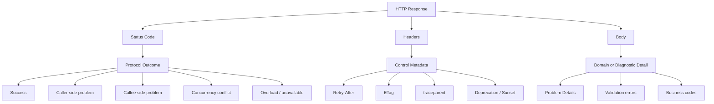
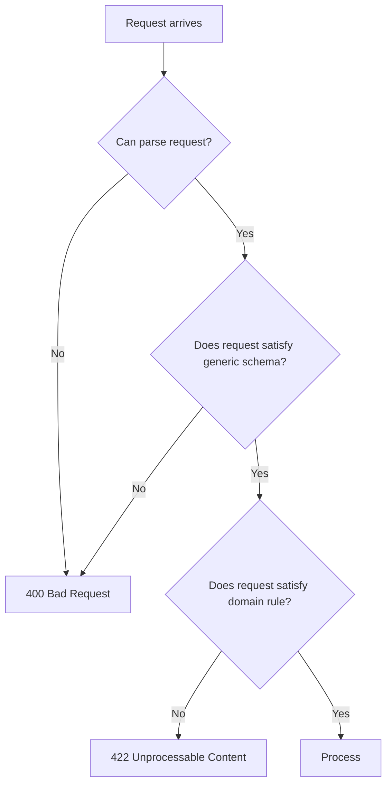
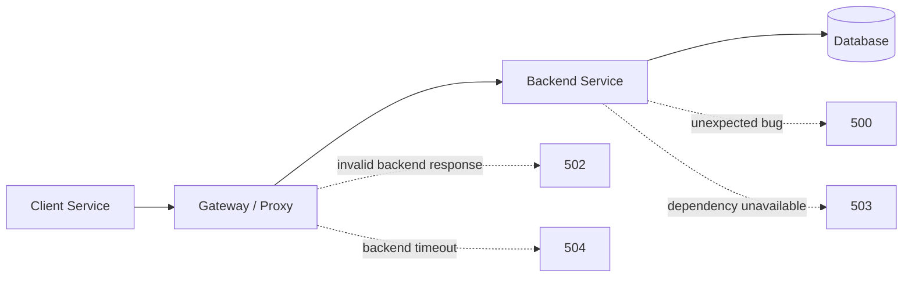
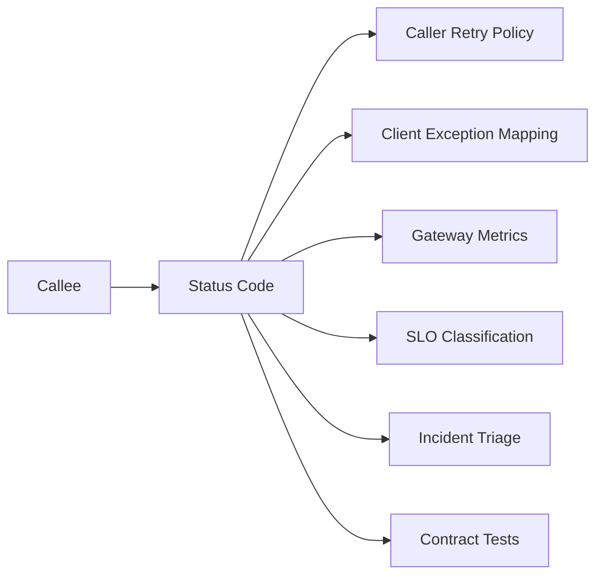

# Part 011 — Status Code Design for Service-to-Service APIs

A status code is not decoration. In service-to-service communication, it is the **first control signal** returned by the callee.

Before the caller parses the body, before it logs the error, before it decides whether to retry, before an SRE looks at dashboards, the status code already says something:

- did the server understand the request?
- was the requested operation accepted, completed, rejected, or deferred?
- is the failure probably caused by the caller or the callee?
- is retry likely safe?
- is this error part of normal business flow or an infrastructure incident?
- should the caller compensate, stop, back off, or page someone?

In weak systems, status codes are treated as a web API convention. In strong systems, status codes are part of the **distributed control plane**.

This part builds a practical status code design model for Java microservices.

---

## 1. The Mental Model

HTTP has a large status code registry, but most internal services only need a small, disciplined subset.

The purpose of a status code is not to encode every domain detail. The purpose is to classify the **protocol-level outcome**.

Domain detail belongs in the response body. Operational classification belongs in the status code.



A good status code answers one question first:

> What class of decision should the caller make next?

Not:

> What exact exception was thrown inside the callee?

That distinction matters.

---

## 2. Status Codes Are Not Exception Names

A common Java microservice failure mode is mapping exceptions directly to status codes:

```text
IllegalArgumentException  -> 400
EntityNotFoundException   -> 404
OptimisticLockException   -> 500
IOException               -> 500
RuntimeException          -> 500
```

This is better than returning `200 OK` for everything, but it is still too mechanical.

The caller does not care whether the server threw `IllegalStateException`, `SQLException`, `TimeoutException`, or `WebClientResponseException` as an implementation detail. The caller cares about **actionability**.

Better mapping starts from outcome categories:

| Outcome | Question | Status family |
|---|---|---|
| Completed | Did the operation finish successfully? | `2xx` |
| Accepted but not complete | Did the service accept responsibility but defer completion? | `202` |
| Invalid request | Did the caller send malformed or semantically invalid input? | `4xx` |
| Authorization/authentication failure | Is the caller not allowed or not authenticated? | `401` / `403` |
| Missing target | Does the requested resource not exist in this API's visible model? | `404` |
| Conflict | Is the request valid but conflicts with current state? | `409` / `412` |
| Overload or dependency failure | Is the service unable to process now? | `503` / sometimes `502` / `504` |
| Bug or unknown server failure | Did the server fail unexpectedly? | `500` |

Think in decisions, not exception names.

---

## 3. The Small Internal Status Code Set

For service-to-service APIs, start with this conservative set.

| Code | Name | Primary meaning in internal APIs |
|---:|---|---|
| `200` | OK | Query or command response completed and returns representation/result. |
| `201` | Created | A new resource was created and can be identified. |
| `202` | Accepted | Request accepted for asynchronous processing; outcome is not final yet. |
| `204` | No Content | Operation completed successfully; no response body is needed. |
| `400` | Bad Request | Malformed syntax, invalid JSON, invalid query parameter shape, unreadable body. |
| `401` | Unauthorized | Caller is unauthenticated or credentials are missing/invalid. |
| `403` | Forbidden | Caller is authenticated but not allowed to perform the action. |
| `404` | Not Found | Target resource is not visible/found in this API boundary. |
| `405` | Method Not Allowed | Resource exists but method is unsupported. |
| `409` | Conflict | Valid request conflicts with current resource/process state. |
| `410` | Gone | Resource used to exist but is intentionally no longer available. |
| `412` | Precondition Failed | Conditional request failed, usually `If-Match` / ETag concurrency control. |
| `413` | Content Too Large | Payload exceeds service limit. |
| `415` | Unsupported Media Type | Content type is unsupported. |
| `422` | Unprocessable Content | Syntactically valid request but semantically invalid domain input. |
| `429` | Too Many Requests | Caller is being rate-limited or quota-limited. |
| `500` | Internal Server Error | Unexpected server failure; do not expose internals. |
| `502` | Bad Gateway | This component is acting as a gateway/proxy and got invalid response upstream. |
| `503` | Service Unavailable | Service is overloaded, unavailable, draining, or dependency path is unavailable. |
| `504` | Gateway Timeout | This component is acting as gateway/proxy and upstream timed out. |

Do not treat this list as a law. Treat it as a default vocabulary.

The goal is not to use more codes. The goal is to make fewer codes mean more.

---

## 4. Never Return `200 OK` for Failed Commands

This is one of the most damaging patterns in internal APIs:

```json
{
  "success": false,
  "errorCode": "INSUFFICIENT_BALANCE"
}
```

with status:

```http
HTTP/1.1 200 OK
```

Why it hurts:

- client libraries classify the response as success;
- metrics show success even though the operation failed;
- retries may not trigger when they should;
- SLO dashboards undercount failure;
- gateways and service meshes cannot reason about traffic;
- incident triage requires parsing custom payloads;
- humans cannot scan logs quickly.

A response may have domain-level denial, but the HTTP layer still needs honest classification.

For example:

| Scenario | Better status |
|---|---:|
| Submitted command violates business rule | `422` or `409` |
| Payment already captured | `409` or `200` depending on idempotency semantics |
| Case already escalated | `409` |
| Resource exists and duplicate create is harmless under same idempotency key | `200` / `201` with idempotent result |
| Duplicate command with different body under same idempotency key | `409` |
| Validation failed | `422` |

A `2xx` response means the HTTP-level operation succeeded. It does not have to mean the business world is happy, but it must mean the request was processed according to the API contract.

---

## 5. Success Codes: Design the Happy Path Precisely

Most internal APIs overuse `200 OK`.

That is not catastrophic, but precise success codes make APIs easier to reason about.

### 5.1 `200 OK`

Use `200` when:

- a query returns a representation;
- a command returns a result body;
- an idempotent create/update returns the existing/current representation;
- a command completed synchronously and the caller needs details.

Example:

```http
HTTP/1.1 200 OK
Content-Type: application/json
ETag: "case-v14"

{
  "caseId": "CASE-1001",
  "state": "UNDER_REVIEW"
}
```

### 5.2 `201 Created`

Use `201` when the request creates a new resource.

Include `Location` when the created resource has a canonical URI.

```http
HTTP/1.1 201 Created
Location: /cases/CASE-1001
Content-Type: application/json

{
  "caseId": "CASE-1001",
  "state": "DRAFT"
}
```

Do not use `201` for every command that creates side effects. Use it when the API contract exposes a newly created resource.

### 5.3 `202 Accepted`

Use `202` when the service accepts responsibility but completion is deferred.

This is common for:

- long-running workflows;
- asynchronous command handling;
- batch ingestion;
- outbox-backed processing;
- workflow engine start commands;
- expensive export generation;
- external integration submissions.

A correct `202` response must answer:

- what was accepted?
- how can the caller observe progress?
- what is the correlation/operation id?
- what states can the operation reach?
- when should the caller poll or expect callback/event?

Bad `202`:

```http
HTTP/1.1 202 Accepted

{}
```

Better `202`:

```http
HTTP/1.1 202 Accepted
Location: /operations/OP-8891
Retry-After: 5
Content-Type: application/json

{
  "operationId": "OP-8891",
  "status": "ACCEPTED",
  "submittedAt": "2026-07-05T02:11:43Z",
  "statusUrl": "/operations/OP-8891"
}
```

`202` is not a shortcut to avoid reliability design. It creates an obligation to expose operation state.

### 5.4 `204 No Content`

Use `204` when the command completed and there is no useful body.

Good examples:

- delete completed;
- status flag updated;
- association removed;
- command completed but caller already has all needed state.

Example:

```http
HTTP/1.1 204 No Content
```

Do not return a JSON body with `204`. If you need a body, use `200`.

---

## 6. Redirect Codes in Internal APIs

Redirects are often useful on the public web, but they should be rare in service-to-service APIs.

Why?

- they hide topology changes from clients;
- they complicate tracing;
- some client libraries change methods on redirects unless configured carefully;
- authorization and header propagation can become dangerous;
- retries and redirect loops become harder to analyze.

For internal APIs, prefer:

- stable service discovery;
- gateway routing;
- explicit version migration;
- canonical identifiers;
- API deprecation headers;
- client configuration updates.

Use `301`, `302`, `307`, or `308` only if your client stack, gateway, and security policy are explicitly designed for it.

---

## 7. `400 Bad Request` vs `422 Unprocessable Content`

This distinction is important.

Use `400` when the service cannot reliably interpret the request as a valid protocol/API message.

Examples:

- invalid JSON syntax;
- wrong query parameter type;
- missing required primitive parameter;
- invalid enum string format;
- unreadable body;
- invalid date format;
- unsupported parameter shape.

Use `422` when the request is syntactically valid but semantically invalid for the domain.

Examples:

- `effectiveDate` is before allowed policy date;
- requested transition is invalid for the submitted case state;
- amount exceeds configured business limit;
- field combination violates domain rule;
- submitted identifier is well-formed but incompatible with the operation.



This distinction helps client teams. `400` usually means the client generated the API message incorrectly. `422` usually means the client sent a valid message that the domain rejected.

---

## 8. `409 Conflict` vs `422 Unprocessable Content`

Both represent valid requests that cannot be completed. The difference is the role of **current server state**.

Use `409` when the request conflicts with current resource/process state.

Examples:

- case is already closed;
- document has already been approved;
- duplicate unique external reference exists;
- transition conflicts with current workflow state;
- idempotency key was reused with different payload;
- order cannot be cancelled because fulfillment already started.

Use `422` when the request is semantically invalid regardless of race/current state.

Examples:

- invalid field combination;
- unsupported business category;
- invalid date range;
- invalid command shape after schema validation.

Decision rule:

```text
If the exact same request might become valid after the resource state changes,
prefer 409.

If the exact same request is invalid as submitted regardless of server state,
prefer 422.
```

In regulatory/workflow systems, `409` is especially useful because process state is often the real constraint.

Example:

```http
HTTP/1.1 409 Conflict
Content-Type: application/problem+json

{
  "type": "https://errors.example.internal/case-state-conflict",
  "title": "Case state conflict",
  "status": 409,
  "detail": "Case CASE-1001 cannot be escalated from CLOSED state.",
  "instance": "/cases/CASE-1001/commands/escalate/REQ-8821",
  "errorCode": "CASE_STATE_CONFLICT",
  "currentState": "CLOSED",
  "allowedStates": ["UNDER_REVIEW", "INVESTIGATION"]
}
```

---

## 9. `404 Not Found` Is a Boundary Statement

`404` does not always mean the row is absent from the database.

It means:

> The requested resource is not visible at this API boundary.

Possible reasons:

- it truly does not exist;
- it exists but belongs to another tenant;
- it exists but caller has no visibility;
- it exists in another bounded context;
- it existed but has been deleted and the API does not expose tombstones;
- it is not yet materialized in a read model.

Do not leak internal existence details unless your security and domain model allow it.

For internal service-to-service APIs, be consistent:

| Scenario | Recommended code |
|---|---:|
| Resource absent and safe to reveal absence | `404` |
| Resource hidden due to permission and caller should know it lacks permission | `403` |
| Resource hidden due to tenancy/security and existence should not be disclosed | `404` |
| Resource permanently removed and clients need to distinguish from unknown | `410` |
| Read model not caught up yet after accepted async command | `202` operation status, or `404` with documented eventual consistency semantics |

A weak `404` policy creates debugging pain. A strong `404` policy documents visibility boundaries.

---

## 10. `401` vs `403`

Keep the distinction simple:

- `401 Unauthorized`: authentication failed or is missing.
- `403 Forbidden`: authentication succeeded, but authorization failed.

Despite the name, `401 Unauthorized` is about authentication challenge/credentials.

For this communication series, we will not go deep into authentication/authorization models because those belong to separate materials. Here, the important point is that status codes should not blur caller identity failures.

For internal APIs:

| Scenario | Code |
|---|---:|
| Missing service token | `401` |
| Expired service token | `401` |
| Invalid token signature | `401` |
| Valid service identity but scope missing | `403` |
| Valid service identity but tenant access denied | `403` or `404`, depending on visibility policy |
| mTLS client cert missing at gateway | gateway-level `401` / `403` depending policy |

Do not return `500` for authentication middleware failure unless the middleware itself failed unexpectedly.

---

## 11. `412 Precondition Failed` and Concurrency Control

`409 Conflict` is broad. `412 Precondition Failed` is precise.

Use `412` when the client supplied a conditional request precondition and the precondition failed.

Classic example: optimistic concurrency with `ETag` and `If-Match`.

Read:

```http
GET /cases/CASE-1001 HTTP/1.1
```

Response:

```http
HTTP/1.1 200 OK
ETag: "case-v14"

{
  "caseId": "CASE-1001",
  "state": "UNDER_REVIEW"
}
```

Update:

```http
PUT /cases/CASE-1001 HTTP/1.1
If-Match: "case-v14"
Content-Type: application/json

{
  "priority": "HIGH"
}
```

If another update already moved the version to `case-v15`:

```http
HTTP/1.1 412 Precondition Failed
Content-Type: application/problem+json

{
  "type": "https://errors.example.internal/precondition-failed",
  "title": "Precondition failed",
  "status": 412,
  "detail": "The supplied version case-v14 is no longer current.",
  "errorCode": "VERSION_MISMATCH",
  "currentETag": "case-v15"
}
```

Use `409` for general state conflicts. Use `412` for explicit conditional-request failures.

---

## 12. Rate Limiting: `429 Too Many Requests`

Use `429` when the caller exceeded quota, rate, or concurrency limits.

`429` should usually include `Retry-After` when the server can provide useful guidance.

```http
HTTP/1.1 429 Too Many Requests
Retry-After: 10
Content-Type: application/problem+json

{
  "type": "https://errors.example.internal/rate-limit-exceeded",
  "title": "Rate limit exceeded",
  "status": 429,
  "detail": "Caller payment-service exceeded 100 requests per second for case-service.",
  "errorCode": "RATE_LIMIT_EXCEEDED",
  "retryable": true,
  "retryAfterSeconds": 10
}
```

Important distinction:

| Code | Meaning |
|---:|---|
| `429` | This caller is limited. The service may still be healthy. |
| `503` | The service or dependency path is unavailable/overloaded more generally. |

If every caller receives failures due to overload, `503` is usually more accurate than `429`.

If one noisy caller is throttled to protect the system, `429` is better.

---

## 13. Server Failure Codes

### 13.1 `500 Internal Server Error`

Use `500` for unexpected server failure.

Examples:

- uncaught bug;
- invariant violation;
- serialization bug;
- null pointer in server code;
- unexpected database error not classified more precisely;
- impossible state reached.

Do not expose internal stack traces or SQL messages in the response.

Bad:

```json
{
  "error": "NullPointerException at CaseService.java:119"
}
```

Better:

```http
HTTP/1.1 500 Internal Server Error
Content-Type: application/problem+json

{
  "type": "https://errors.example.internal/internal-error",
  "title": "Internal server error",
  "status": 500,
  "detail": "The service failed while processing the request.",
  "errorCode": "INTERNAL_ERROR",
  "traceId": "4bf92f3577b34da6a3ce929d0e0e4736"
}
```

The trace id lets operators find the internal cause without leaking details to callers.

### 13.2 `503 Service Unavailable`

Use `503` when the service cannot process requests now but may recover.

Examples:

- service is overloaded;
- service is draining during deployment;
- dependency is unavailable and operation cannot proceed;
- circuit breaker is open;
- database pool exhausted;
- broker unavailable for a command that must publish before returning;
- maintenance window.

Include `Retry-After` when meaningful.

```http
HTTP/1.1 503 Service Unavailable
Retry-After: 30
Content-Type: application/problem+json

{
  "type": "https://errors.example.internal/service-unavailable",
  "title": "Service unavailable",
  "status": 503,
  "detail": "Case service is temporarily unable to process escalation commands.",
  "errorCode": "SERVICE_UNAVAILABLE",
  "retryable": true
}
```

Do not blindly convert every downstream failure to `500`. If your service is healthy but a dependency path is unavailable, `503` often gives the caller a better control signal.

### 13.3 `502 Bad Gateway` and `504 Gateway Timeout`

Use `502` or `504` when the component is acting as a gateway/proxy/intermediary.

If `case-api` directly owns a business operation and its dependency fails, `503` may be more accurate.

If `case-gateway` forwards to `case-service` and receives invalid response, `502` is accurate.

If `case-gateway` waits for `case-service` and times out, `504` is accurate.



Avoid using `502` and `504` from normal application controllers unless the controller is explicitly acting as an intermediary.

---

## 14. Retriability Is Not a Status Code Alone

Status code influences retry, but it is not sufficient.

Retry safety also depends on:

- HTTP method semantics;
- idempotency key;
- operation side effects;
- whether the request reached the server;
- whether the failure happened before or after commit;
- whether the response body marks the error as retryable;
- caller's remaining deadline;
- global retry budget;
- service overload state.

Basic matrix:

| Code | Usually retry? | Notes |
|---:|---|---|
| `400` | No | Client generated invalid request. |
| `401` | No immediate retry | Refresh credentials only if supported. |
| `403` | No | Permission/config issue. |
| `404` | Usually no | Except documented eventual-consistency read-after-write cases. |
| `409` | Usually no automatic retry | Requires state refresh or domain decision. |
| `412` | No blind retry | Re-read latest version, then retry if still desired. |
| `422` | No | Fix request/domain input. |
| `429` | Yes, with backoff and budget | Respect `Retry-After` if present. |
| `500` | Maybe | Only if operation is idempotent or protected by idempotency key. |
| `502` | Maybe | Usually transient at gateway/proxy layer. |
| `503` | Yes, with backoff and budget | Watch for overload amplification. |
| `504` | Maybe | Unknown outcome; retry only if safe/idempotent. |

The dangerous one is `504` or client-side timeout after a command. The caller does not know whether the callee committed.

That is why idempotency design matters.

---

## 15. Problem Details as the Error Body

Use `application/problem+json` for machine-readable error bodies.

Minimum structure:

```json
{
  "type": "https://errors.example.internal/validation-failed",
  "title": "Validation failed",
  "status": 422,
  "detail": "The request contains invalid domain fields.",
  "instance": "/cases/CASE-1001/commands/escalate/REQ-7781"
}
```

Useful internal extensions:

```json
{
  "errorCode": "CASE_STATE_CONFLICT",
  "traceId": "4bf92f3577b34da6a3ce929d0e0e4736",
  "correlationId": "CORR-20260705-00091",
  "retryable": false,
  "severity": "WARN",
  "violatedInvariant": "CASE_CAN_ONLY_ESCALATE_FROM_ACTIVE_STATE",
  "fieldErrors": [
    {
      "field": "effectiveDate",
      "code": "MUST_NOT_BE_IN_PAST",
      "message": "effectiveDate must not be before today."
    }
  ]
}
```

Do not make `detail` the only machine-readable field. `detail` is for humans. Use stable `errorCode` for programmatic handling.

### 15.1 Stable Error Code Design

Error codes should be:

- stable across deployments;
- documented;
- not tied to Java exception class names;
- scoped enough to be useful;
- not so granular that clients encode server internals;
- observable in metrics and logs.

Good:

```text
CASE_STATE_CONFLICT
VERSION_MISMATCH
VALIDATION_FAILED
RATE_LIMIT_EXCEEDED
DEPENDENCY_UNAVAILABLE
```

Bad:

```text
NullPointerException
CaseServiceImplError119
SQL_STATE_23505_USER_TABLE
SomethingWentWrong
```

Error code is a contract. Exception type is implementation.

---

## 16. Java Implementation: Domain Error Classification

Start with an explicit error category model.

```java
public enum ApiErrorCategory {
    BAD_REQUEST,
    UNAUTHENTICATED,
    FORBIDDEN,
    NOT_FOUND,
    CONFLICT,
    PRECONDITION_FAILED,
    VALIDATION_FAILED,
    RATE_LIMITED,
    INTERNAL_ERROR,
    SERVICE_UNAVAILABLE
}
```

Then define an application exception that carries stable semantics.

```java
public class ApiException extends RuntimeException {
    private final ApiErrorCategory category;
    private final String errorCode;
    private final boolean retryable;
    private final Map<String, Object> attributes;

    public ApiException(
            ApiErrorCategory category,
            String errorCode,
            String message,
            boolean retryable,
            Map<String, Object> attributes
    ) {
        super(message);
        this.category = category;
        this.errorCode = errorCode;
        this.retryable = retryable;
        this.attributes = Map.copyOf(attributes);
    }

    public ApiErrorCategory category() {
        return category;
    }

    public String errorCode() {
        return errorCode;
    }

    public boolean retryable() {
        return retryable;
    }

    public Map<String, Object> attributes() {
        return attributes;
    }
}
```

Map category to status code centrally.

```java
public final class ApiStatusMapper {
    private ApiStatusMapper() {}

    public static HttpStatusCode toStatus(ApiErrorCategory category) {
        return switch (category) {
            case BAD_REQUEST -> HttpStatus.BAD_REQUEST;
            case UNAUTHENTICATED -> HttpStatus.UNAUTHORIZED;
            case FORBIDDEN -> HttpStatus.FORBIDDEN;
            case NOT_FOUND -> HttpStatus.NOT_FOUND;
            case CONFLICT -> HttpStatus.CONFLICT;
            case PRECONDITION_FAILED -> HttpStatus.PRECONDITION_FAILED;
            case VALIDATION_FAILED -> HttpStatus.UNPROCESSABLE_ENTITY;
            case RATE_LIMITED -> HttpStatus.TOO_MANY_REQUESTS;
            case SERVICE_UNAVAILABLE -> HttpStatus.SERVICE_UNAVAILABLE;
            case INTERNAL_ERROR -> HttpStatus.INTERNAL_SERVER_ERROR;
        };
    }
}
```

This avoids scattering response decisions across controllers.

---

## 17. Spring Boot `ProblemDetail` Handler

Spring Framework includes `ProblemDetail`, which maps well to RFC 9457-style error bodies.

```java
@RestControllerAdvice
public class ApiExceptionHandler {

    @ExceptionHandler(ApiException.class)
    public ResponseEntity<ProblemDetail> handleApiException(
            ApiException exception,
            HttpServletRequest request
    ) {
        HttpStatusCode status = ApiStatusMapper.toStatus(exception.category());

        ProblemDetail problem = ProblemDetail.forStatusAndDetail(
                status,
                exception.getMessage()
        );

        problem.setTitle(titleFor(exception.category()));
        problem.setType(URI.create("https://errors.example.internal/" +
                exception.errorCode().toLowerCase(Locale.ROOT).replace('_', '-')));
        problem.setInstance(URI.create(request.getRequestURI()));
        problem.setProperty("errorCode", exception.errorCode());
        problem.setProperty("retryable", exception.retryable());

        exception.attributes().forEach(problem::setProperty);

        return ResponseEntity
                .status(status)
                .contentType(MediaType.APPLICATION_PROBLEM_JSON)
                .body(problem);
    }

    @ExceptionHandler(MethodArgumentNotValidException.class)
    public ResponseEntity<ProblemDetail> handleValidation(
            MethodArgumentNotValidException exception,
            HttpServletRequest request
    ) {
        ProblemDetail problem = ProblemDetail.forStatusAndDetail(
                HttpStatus.UNPROCESSABLE_ENTITY,
                "The request contains invalid domain fields."
        );
        problem.setTitle("Validation failed");
        problem.setType(URI.create("https://errors.example.internal/validation-failed"));
        problem.setInstance(URI.create(request.getRequestURI()));
        problem.setProperty("errorCode", "VALIDATION_FAILED");
        problem.setProperty("retryable", false);

        List<Map<String, Object>> fieldErrors = exception.getBindingResult()
                .getFieldErrors()
                .stream()
                .map(error -> Map.<String, Object>of(
                        "field", error.getField(),
                        "code", Objects.requireNonNullElse(error.getCode(), "INVALID"),
                        "message", Objects.requireNonNullElse(error.getDefaultMessage(), "Invalid value")
                ))
                .toList();

        problem.setProperty("fieldErrors", fieldErrors);

        return ResponseEntity
                .status(HttpStatus.UNPROCESSABLE_ENTITY)
                .contentType(MediaType.APPLICATION_PROBLEM_JSON)
                .body(problem);
    }

    @ExceptionHandler(Exception.class)
    public ResponseEntity<ProblemDetail> handleUnexpected(
            Exception exception,
            HttpServletRequest request
    ) {
        ProblemDetail problem = ProblemDetail.forStatusAndDetail(
                HttpStatus.INTERNAL_SERVER_ERROR,
                "The service failed while processing the request."
        );
        problem.setTitle("Internal server error");
        problem.setType(URI.create("https://errors.example.internal/internal-error"));
        problem.setInstance(URI.create(request.getRequestURI()));
        problem.setProperty("errorCode", "INTERNAL_ERROR");
        problem.setProperty("retryable", true);

        return ResponseEntity
                .status(HttpStatus.INTERNAL_SERVER_ERROR)
                .contentType(MediaType.APPLICATION_PROBLEM_JSON)
                .body(problem);
    }

    private static String titleFor(ApiErrorCategory category) {
        return switch (category) {
            case BAD_REQUEST -> "Bad request";
            case UNAUTHENTICATED -> "Unauthenticated";
            case FORBIDDEN -> "Forbidden";
            case NOT_FOUND -> "Not found";
            case CONFLICT -> "Conflict";
            case PRECONDITION_FAILED -> "Precondition failed";
            case VALIDATION_FAILED -> "Validation failed";
            case RATE_LIMITED -> "Rate limit exceeded";
            case SERVICE_UNAVAILABLE -> "Service unavailable";
            case INTERNAL_ERROR -> "Internal server error";
        };
    }
}
```

Key idea: the handler is the only place where exceptions become HTTP.

---

## 18. Controller Example: State Conflict

Do not throw generic exceptions from domain workflows.

```java
@PostMapping("/cases/{caseId}/commands/escalate")
public ResponseEntity<EscalateCaseResponse> escalate(
        @PathVariable String caseId,
        @RequestBody @Valid EscalateCaseRequest request,
        @RequestHeader(name = "Idempotency-Key", required = false) String idempotencyKey
) {
    EscalateCaseResult result = caseCommandService.escalate(caseId, request, idempotencyKey);

    return ResponseEntity.ok(new EscalateCaseResponse(
            result.caseId(),
            result.newState(),
            result.commandId()
    ));
}
```

Domain service:

```java
public EscalateCaseResult escalate(
        String caseId,
        EscalateCaseRequest request,
        String idempotencyKey
) {
    CaseRecord record = caseRepository.findById(caseId)
            .orElseThrow(() -> new ApiException(
                    ApiErrorCategory.NOT_FOUND,
                    "CASE_NOT_FOUND",
                    "Case " + caseId + " was not found.",
                    false,
                    Map.of("caseId", caseId)
            ));

    if (!record.state().canEscalate()) {
        throw new ApiException(
                ApiErrorCategory.CONFLICT,
                "CASE_STATE_CONFLICT",
                "Case " + caseId + " cannot be escalated from " + record.state() + " state.",
                false,
                Map.of(
                        "caseId", caseId,
                        "currentState", record.state().name(),
                        "allowedStates", List.of("UNDER_REVIEW", "INVESTIGATION")
                )
        );
    }

    // perform command under transaction / idempotency policy
    return performEscalation(record, request, idempotencyKey);
}
```

This produces a useful `409`, not an accidental `500`.

---

## 19. Client-Side Status Classification

Callers need a small status classifier.

```java
public enum RemoteOutcomeKind {
    SUCCESS,
    CLIENT_ERROR,
    CONFLICT,
    RATE_LIMITED,
    UNAVAILABLE,
    SERVER_ERROR,
    UNKNOWN
}
```

```java
public final class HttpOutcomeClassifier {
    public RemoteOutcomeKind classify(int status) {
        if (status >= 200 && status <= 299) {
            return RemoteOutcomeKind.SUCCESS;
        }
        return switch (status) {
            case 409, 412 -> RemoteOutcomeKind.CONFLICT;
            case 429 -> RemoteOutcomeKind.RATE_LIMITED;
            case 502, 503, 504 -> RemoteOutcomeKind.UNAVAILABLE;
            default -> {
                if (status >= 400 && status <= 499) {
                    yield RemoteOutcomeKind.CLIENT_ERROR;
                }
                if (status >= 500 && status <= 599) {
                    yield RemoteOutcomeKind.SERVER_ERROR;
                }
                yield RemoteOutcomeKind.UNKNOWN;
            }
        };
    }

    public boolean isPotentiallyRetryable(int status, boolean idempotentOperation) {
        if (!idempotentOperation) {
            return false;
        }
        return status == 408 || status == 429 || status == 500 ||
               status == 502 || status == 503 || status == 504;
    }
}
```

This is intentionally conservative. Retry policy will be covered deeply later, but status code classification starts here.

---

## 20. Status Codes and SLOs

Your SLO/error budget policy must classify HTTP status codes intentionally.

Naive rule:

```text
2xx = success
everything else = failure
```

This can be acceptable for a first dashboard, but high-quality systems need more nuance.

Examples:

| Response | Should it burn server SLO? | Why |
|---|---|---|
| `400` due to malformed caller request | Usually no | Caller bug, not server availability issue. |
| `401` invalid token | Usually no | Auth/caller issue, unless caused by auth outage. |
| `403` permission denied | Usually no | Expected policy enforcement. |
| `404` unknown resource | Usually no | Often expected read behavior. |
| `409` business conflict | Usually no | Expected domain/process conflict. |
| `422` validation failure | Usually no | Expected domain validation. |
| `429` caller quota exceeded | Maybe | If due to protective caller throttling, no; if global overload, maybe. |
| `500` | Yes | Server failure. |
| `503` | Yes | Availability failure/overload. |
| `504` from gateway | Yes | Dependency/path timeout. |

Do not let expected business rejections look like infrastructure failure.

Also do not hide infrastructure failure as business rejection.

---

## 21. Observability Rules

Every non-2xx response should be observable along at least these dimensions:

| Dimension | Example |
|---|---|
| route template | `/cases/{caseId}/commands/escalate` |
| method | `POST` |
| status | `409` |
| error code | `CASE_STATE_CONFLICT` |
| retryable | `false` |
| caller service | `workflow-service` |
| callee service | `case-service` |
| trace id | `4bf92f3577b34da6a3ce929d0e0e4736` |
| latency bucket | `p50`, `p95`, `p99` |

Avoid high-cardinality labels like raw `caseId`, full URL, exception message, or user id in metrics.

Good metric labels:

```text
http.server.requests{
  service="case-service",
  method="POST",
  route="/cases/{caseId}/commands/escalate",
  status="409",
  error_code="CASE_STATE_CONFLICT"
}
```

Bad metric labels:

```text
http.server.requests{
  url="/cases/CASE-1001/commands/escalate",
  exception_message="Case CASE-1001 cannot be escalated from CLOSED state"
}
```

The first supports aggregation. The second explodes cardinality.

---

## 22. Status Code Decision Matrix

Use this during API design reviews.

| Situation | Status | Body |
|---|---:|---|
| Query found resource | `200` | representation |
| Query empty collection | `200` | empty list/page |
| Query missing resource | `404` | Problem Details |
| Command completed with result | `200` | result |
| Command created resource | `201` | representation or creation result |
| Command completed with no result | `204` | none |
| Command accepted async | `202` | operation status/link |
| Malformed JSON | `400` | Problem Details |
| Invalid domain fields | `422` | Problem Details + field errors |
| Invalid state transition | `409` | Problem Details + current state |
| Optimistic concurrency failed | `412` | Problem Details + current version if safe |
| Caller exceeded quota | `429` | Problem Details + Retry-After |
| Service overloaded | `503` | Problem Details + Retry-After if useful |
| Unexpected bug | `500` | Problem Details without internals |
| Gateway upstream timeout | `504` | Problem Details |

Print this matrix into your internal API handbook. The value is not the table itself; the value is consistency across teams.

---

## 23. Common Anti-Patterns

### Anti-pattern 1: `200 OK` with error payload

Already discussed. It breaks infrastructure-level reasoning.

### Anti-pattern 2: Everything is `400`

If every caller-side failure is `400`, clients cannot distinguish malformed syntax, validation, conflict, concurrency, and quota.

### Anti-pattern 3: Everything is `500`

This creates false incidents and hides actionable client errors.

### Anti-pattern 4: Business conflicts as `500`

A case being closed is not a server crash. It is domain state.

### Anti-pattern 5: Infrastructure failure as `409`

A database outage is not a business conflict. Do not hide system failures as domain errors.

### Anti-pattern 6: Retrying all `5xx`

A `500` after a non-idempotent command may already have committed side effects. Retry can duplicate work.

### Anti-pattern 7: Returning stack traces

Never expose stack traces in service-to-service response bodies. Use trace ids.

### Anti-pattern 8: Error codes that change with implementation

`JpaOptimisticLockingFailureException` is not a stable external error code.

---

## 24. Testing Status Code Contracts

Status code behavior should be tested as API contract, not incidental controller behavior.

Example tests:

```java
@Test
void escalateClosedCaseReturns409() throws Exception {
    mockMvc.perform(post("/cases/CASE-1001/commands/escalate")
            .contentType(MediaType.APPLICATION_JSON)
            .content("""
                {"reason":"priority-risk"}
                """))
        .andExpect(status().isConflict())
        .andExpect(content().contentType(MediaType.APPLICATION_PROBLEM_JSON))
        .andExpect(jsonPath("$.errorCode").value("CASE_STATE_CONFLICT"))
        .andExpect(jsonPath("$.retryable").value(false));
}

@Test
void malformedJsonReturns400() throws Exception {
    mockMvc.perform(post("/cases/CASE-1001/commands/escalate")
            .contentType(MediaType.APPLICATION_JSON)
            .content("{"))
        .andExpect(status().isBadRequest())
        .andExpect(jsonPath("$.errorCode").value("BAD_REQUEST"));
}

@Test
void invalidDomainFieldReturns422() throws Exception {
    mockMvc.perform(post("/cases/CASE-1001/commands/escalate")
            .contentType(MediaType.APPLICATION_JSON)
            .content("""
                {"effectiveDate":"1900-01-01"}
                """))
        .andExpect(status().isUnprocessableEntity())
        .andExpect(jsonPath("$.errorCode").value("VALIDATION_FAILED"));
}
```

These tests encode operational semantics.

---

## 25. Production Review Checklist

Before approving a service-to-service API, ask:

- Does every endpoint have documented success statuses?
- Are async commands represented with `202` and operation state?
- Are validation failures separated from malformed requests?
- Are state conflicts separated from validation failures?
- Are concurrency conflicts represented precisely?
- Are server failures not leaked as stack traces?
- Are expected business rejections excluded from availability SLO burn?
- Are rate limits represented with `429` and useful retry guidance?
- Are overload/unavailable paths represented with `503`?
- Are gateway/intermediary errors distinguished from application errors?
- Are error codes stable and documented?
- Does every error include a trace/correlation mechanism?
- Can clients classify retry safety without parsing human text?

If the answer is no, the API is not yet production-grade.

---

## 26. Final Mental Model

Status code design is not about memorizing codes.

It is about **making distributed decisions cheap**.

A strong status code design gives every layer a clean signal:



The best status code strategy is boring, small, consistent, and brutally honest.

If the caller is wrong, say so.

If the domain rejected the command, say so.

If the service is overloaded, say so.

If the server crashed, say so without leaking internals.

That honesty is what makes large microservice systems debuggable.

---

## References

- RFC 9110 — HTTP Semantics
- RFC 9457 — Problem Details for HTTP APIs
- RFC 6585 — Additional HTTP Status Codes, including `429 Too Many Requests`
- OpenTelemetry Semantic Conventions for HTTP spans
- Google SRE materials on overload, error budgets, and cascading failure
