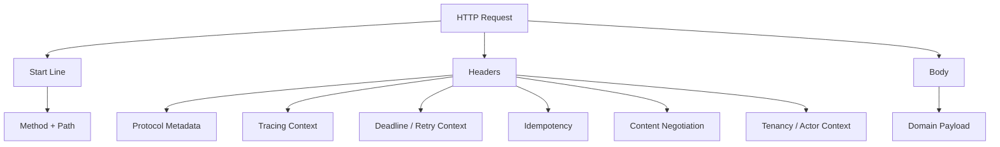
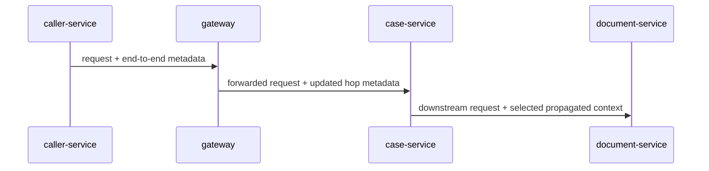
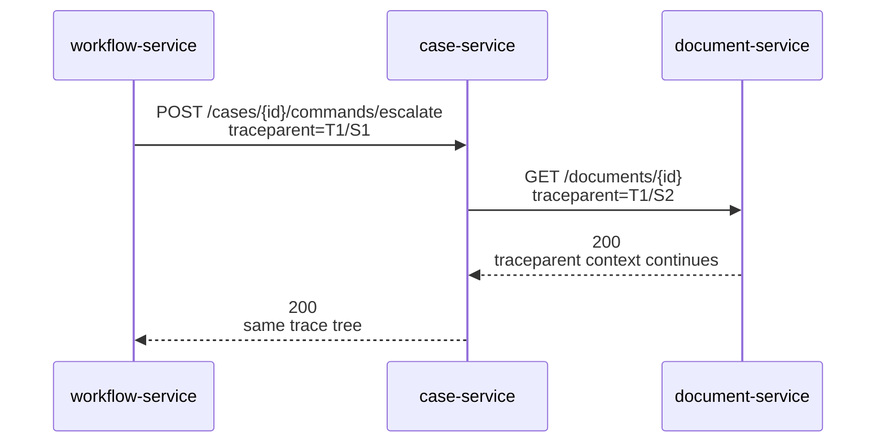
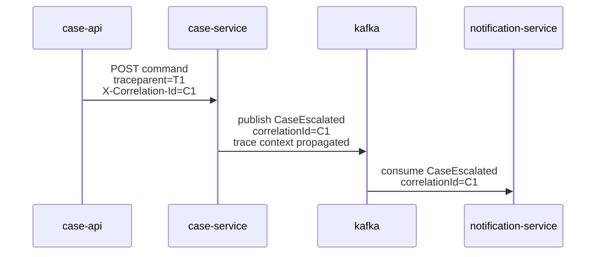
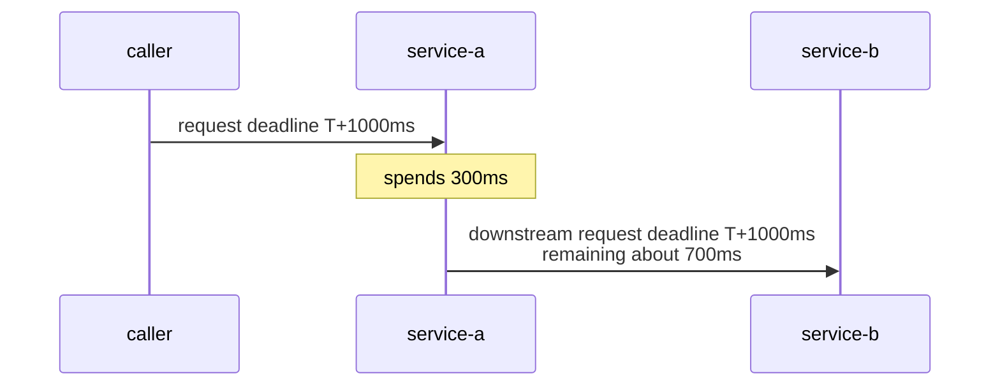
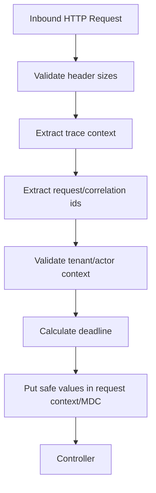
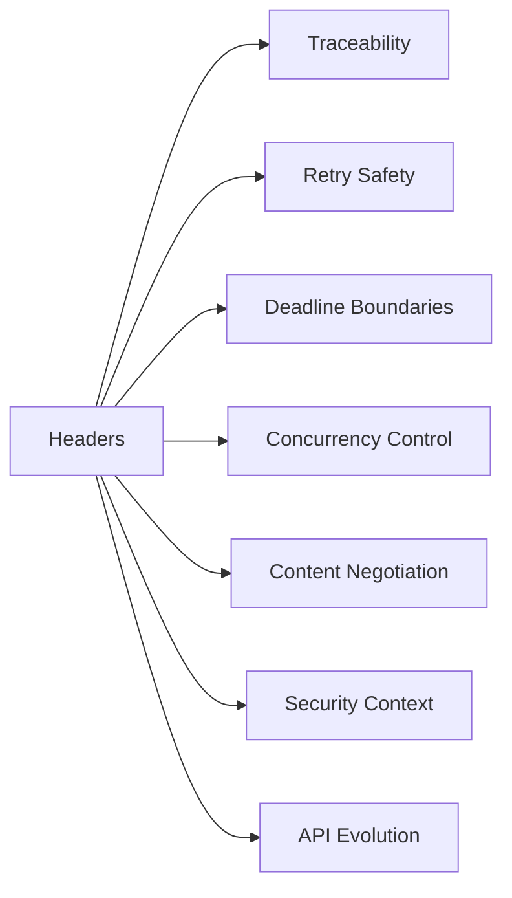

# Part 012 — Headers, Metadata, Correlation, and Context Propagation

HTTP headers are not a dumping ground for random strings.

In service-to-service communication, headers form a **metadata control surface**. They carry information that changes how a request is interpreted, routed, traced, authorized, retried, cached, versioned, diagnosed, or bounded.

A body usually describes the business operation.

Headers describe the communication envelope around that operation.



Weak systems treat headers as incidental. Strong systems treat them as explicit API contract.

This part explains how to design, propagate, and protect headers in Java microservice communication.

---

## 1. The Header Mental Model

A header should exist only if it belongs to one of these categories:

| Category | Purpose | Examples |
|---|---|---|
| Protocol metadata | Standard HTTP behavior | `Content-Type`, `Accept`, `Cache-Control`, `ETag` |
| Observability context | Trace/correlation across services | `traceparent`, `tracestate`, `baggage`, `X-Request-Id` |
| Execution control | Deadline, retry, idempotency | `Idempotency-Key`, `Retry-After`, custom deadline header |
| Routing metadata | Gateway/mesh/internal routing | tenant shard, region hint, canary header |
| Security/audit context | Caller, actor, tenant, delegation | service identity, actor id, tenant id |
| Evolution metadata | Deprecation, sunset, version negotiation | `Deprecation`, `Sunset`, `Accept` media version |
| Concurrency metadata | Conditional updates | `ETag`, `If-Match`, `If-None-Match` |

If a header does not fit one of these categories, question why it exists.

Headers are powerful because they are visible to intermediaries. They are dangerous for the same reason.

---

## 2. Header Design Rules

### Rule 1: Prefer standards before custom headers

Use standard headers when they express the meaning correctly.

Good:

| Need | Prefer |
|---|---|
| request body type | `Content-Type` |
| response body preference | `Accept` |
| conditional update | `If-Match` |
| entity version | `ETag` |
| retry guidance | `Retry-After` |
| tracing | `traceparent`, `tracestate` |
| baggage context | `baggage` |
| API deprecation signal | `Deprecation` |
| API sunset signal | `Sunset` |

Avoid inventing `X-Content-Type`, `X-Retry-Later`, `X-Trace-Id-Vendor-7` unless you have a real gap.

### Rule 2: Use custom headers intentionally

Custom headers are acceptable for internal semantics not covered by standards.

Examples:

```http
Idempotency-Key: 4f43d0b4-9ed3-43cd-87bd-6e730cfd0afd
X-Request-Deadline: 2026-07-05T02:11:47.120Z
X-Tenant-Id: tenant-42
X-Actor-Id: user-991
X-Caller-Service: workflow-service
```

But every custom header needs:

- owner;
- syntax;
- max length;
- trust boundary;
- propagation rule;
- logging rule;
- security classification;
- whether caller may set it;
- whether gateway must overwrite it;
- whether downstream services may forward it.

### Rule 3: Do not put domain payload in headers

Bad:

```http
X-Case-State: UNDER_REVIEW
X-Escalation-Reason: suspicious-activity
X-Decision-Comment: customer submitted docs late
```

This belongs in the body.

Headers are for envelope metadata, not business documents.

### Rule 4: Keep headers small

Large headers cause real production failures:

- proxies may reject requests;
- load balancers may enforce header limits;
- tracing/baggage can exceed limits;
- cookies or tokens can blow up request size;
- repeated propagation multiplies cost;
- logs become noisy or dangerous.

Design with budgets. Example internal policy:

| Header group | Suggested budget |
|---|---:|
| trace context | < 512 bytes |
| baggage | < 1 KB, preferably far less |
| idempotency key | < 128 bytes |
| custom context headers | < 2 KB combined |
| total request headers | service/platform-specific hard limit |

The exact numbers depend on your platform, but the discipline is universal.

### Rule 5: Treat inbound headers as untrusted at the edge

External callers can forge headers.

At the public edge or trust boundary:

- strip or overwrite internal identity headers;
- generate trusted trace/request ids if missing/invalid;
- validate tenant and actor context from token/session, not raw headers;
- do not trust `X-Forwarded-*` unless set by trusted proxies;
- remove unknown sensitive headers;
- normalize propagation policy.

Inside the mesh, headers may still be wrong due to bugs. Trust should be explicit, not assumed.

---

## 3. Header Names and Case

HTTP field names are case-insensitive. Your code must not depend on exact casing.

These are equivalent at the HTTP semantics level:

```http
Traceparent: ...
traceparent: ...
TRACEPARENT: ...
```

However, many ecosystems normalize names differently. HTTP/2 transmits field names in lowercase. Gateways may rewrite casing. Frameworks may present canonical names.

Java rule:

> Always access headers using framework APIs that handle case-insensitivity. Never parse raw header text manually unless writing infrastructure code.

Bad:

```java
String traceparent = rawHeaders.get("TraceParent"); // fragile
```

Better:

```java
String traceparent = request.getHeader("traceparent");
```

or with Spring:

```java
String traceparent = headers.getFirst("traceparent");
```

Also avoid creating two custom headers that differ only by case. That is asking for an incident.

---

## 4. Hop-by-Hop vs End-to-End Headers

Some headers describe one network hop. Others should propagate end-to-end.



End-to-end examples:

- `traceparent`;
- `tracestate`;
- selected `baggage`;
- correlation/request id, if part of policy;
- idempotency key only along the path that needs it;
- tenant/actor context only inside trusted boundaries.

Hop-specific examples:

- connection management metadata;
- local proxy routing internals;
- per-hop timeout implementation details;
- gateway-internal debug headers.

Do not blindly forward all inbound headers. That leaks policy from one boundary into another.

---

## 5. Tracing Context: `traceparent` and `tracestate`

Distributed tracing needs a way to connect spans across services. W3C Trace Context defines standard headers for that.

Typical request:

```http
GET /cases/CASE-1001 HTTP/1.1
traceparent: 00-4bf92f3577b34da6a3ce929d0e0e4736-00f067aa0ba902b7-01
tracestate: vendorname=value
```

Mental model:

| Header | Purpose |
|---|---|
| `traceparent` | Vendor-neutral trace identity: version, trace id, parent id, flags. |
| `tracestate` | Vendor-specific trace-system state. |

Do not invent your own trace propagation format unless you are building observability infrastructure.

### 5.1 Trace ID vs Request ID vs Correlation ID

Teams often confuse these.

| Identifier | Scope | Purpose |
|---|---|---|
| Trace ID | Distributed trace tree | Connect spans across services. |
| Span ID | Single operation/span | Represent a unit of work within trace. |
| Request ID | One inbound request at a boundary | Log lookup and support/debug reference. |
| Correlation ID | Business/process conversation | Connect multiple requests/events belonging to one workflow. |
| Idempotency key | Duplicate command detection | Ensure repeated command is handled safely. |

They are not interchangeable.

Bad design:

```text
Use X-Correlation-Id for tracing, idempotency, audit, and workflow.
```

Better design:

```text
traceparent         -> distributed trace mechanics
X-Request-Id        -> single inbound request identity, optional
X-Correlation-Id    -> business process / external conversation identity, optional
Idempotency-Key     -> duplicate command protection
```

A single id can sometimes serve multiple purposes in a small system, but top-tier engineering separates semantics.

---

## 6. Baggage: Use Carefully

The `baggage` header propagates user-defined key-value pairs across services.

Example:

```http
baggage: tenant.id=tenant-42,region=ap-southeast-1,experiment.caseRouting=v2
```

Baggage is useful for:

- low-cardinality routing hints;
- experiment flags;
- tenant class;
- region/zone context;
- observability correlation beyond trace id.

Baggage is dangerous because it tends to grow.

Rules:

- do not put secrets in baggage;
- do not put raw personal data in baggage;
- do not put high-cardinality identifiers unless policy allows it;
- keep key names stable;
- enforce length limits;
- allowlist keys at boundaries;
- strip unknown baggage at public ingress;
- avoid using baggage as business state.

Bad:

```http
baggage: customer.name=Alice,accessToken=eyJ...,caseComment=full free text...
```

Good:

```http
baggage: tenant.tier=regulated,region=ap-southeast-1
```

Baggage is distributed metadata, not a distributed database.

---

## 7. Context Propagation in Java with OpenTelemetry

In a Spring Boot service, OpenTelemetry instrumentation usually handles `traceparent` propagation automatically when configured correctly.

But you still need a mental model.



If propagation breaks, traces fragment:

```text
workflow-service trace: abc
case-service trace: def
ocument-service trace: xyz
```

Now one logical request looks like three unrelated requests.

### 7.1 Manual propagation with Spring `RestClient`

Most teams should prefer auto-instrumentation, but understanding manual propagation helps.

Pseudo-code:

```java
@Component
public class TraceHeaderInterceptor implements ClientHttpRequestInterceptor {

    @Override
    public ClientHttpResponse intercept(
            HttpRequest request,
            byte[] body,
            ClientHttpRequestExecution execution
    ) throws IOException {
        // In real production, prefer OpenTelemetry propagators instead of hand-building traceparent.
        String traceId = MDC.get("traceId");
        if (traceId != null && !request.getHeaders().containsKey("X-Trace-Id")) {
            request.getHeaders().set("X-Trace-Id", traceId);
        }
        return execution.execute(request, body);
    }
}
```

This example is intentionally labelled as fallback thinking, not the preferred tracing approach.

Preferred OpenTelemetry-style propagation uses the configured `TextMapPropagator`:

```java
public final class HttpHeadersSetter implements TextMapSetter<HttpHeaders> {
    @Override
    public void set(HttpHeaders carrier, String key, String value) {
        carrier.set(key, value);
    }
}
```

```java
propagators.getTextMapPropagator().inject(
        Context.current(),
        headers,
        new HttpHeadersSetter()
);
```

This keeps propagation format vendor-neutral.

---

## 8. Request ID and Log Correlation

A request id identifies one inbound request at a service boundary.

Example policy:

- if trusted upstream provides `X-Request-Id`, validate and reuse;
- otherwise generate a new UUID/ULID;
- put it in MDC;
- include it in response header;
- include it in logs;
- do not use it as idempotency key.

Servlet filter example:

```java
@Component
public class RequestIdFilter extends OncePerRequestFilter {
    private static final String REQUEST_ID = "X-Request-Id";

    @Override
    protected void doFilterInternal(
            HttpServletRequest request,
            HttpServletResponse response,
            FilterChain filterChain
    ) throws ServletException, IOException {
        String requestId = sanitizeOrCreate(request.getHeader(REQUEST_ID));

        MDC.put("requestId", requestId);
        response.setHeader(REQUEST_ID, requestId);

        try {
            filterChain.doFilter(request, response);
        } finally {
            MDC.remove("requestId");
        }
    }

    private static String sanitizeOrCreate(String value) {
        if (value == null || value.isBlank() || value.length() > 128) {
            return UUID.randomUUID().toString();
        }
        if (!value.matches("[A-Za-z0-9._:-]{1,128}")) {
            return UUID.randomUUID().toString();
        }
        return value;
    }
}
```

The sanitization matters. Never let arbitrary header values enter logs unchecked.

---

## 9. Correlation ID for Business Process Flow

A correlation id connects operations that are part of one larger business conversation.

Examples:

- enforcement case lifecycle;
- payment capture and refund workflow;
- customer onboarding flow;
- document review process;
- external agency integration exchange.

Example:

```http
X-Correlation-Id: CASE-1001-ESCALATION-20260705
```

But be careful: a correlation id may become sensitive if it embeds business identifiers.

Safer:

```http
X-Correlation-Id: corr_01J1ZQ62W1R7DM3C7NR91FCX4A
```

Then store the mapping internally.

### 9.1 Correlation across sync and async

Correlation must cross communication styles.



If sync calls use `X-Correlation-Id` but events use `workflowId`, humans lose the chain. Use a unified vocabulary.

---

## 10. Idempotency Key

`Idempotency-Key` protects command retries from duplicate side effects.

It is not a trace id.

It is not a request id.

It is not a business correlation id.

It is a **deduplication key for a specific operation contract**.

Example:

```http
POST /payments/captures HTTP/1.1
Idempotency-Key: 9a92373e-7784-4c81-88dd-2fe948ebb1af
Content-Type: application/json

{
  "authorizationId": "AUTH-991",
  "amount": "100.00",
  "currency": "SGD"
}
```

Server policy should define:

- required or optional;
- scope: caller + endpoint + key, or tenant + endpoint + key;
- retention window;
- body hash matching;
- response replay behavior;
- concurrent duplicate handling;
- mismatch behavior;
- metrics;
- storage consistency.

Example behavior matrix:

| Situation | Response |
|---|---:|
| First request with key | process and store result |
| Same key, same body, completed | replay original result |
| Same key, same body, still processing | `202` or `409`, depending API contract |
| Same key, different body | `409 Conflict` |
| Missing key for unsafe command requiring it | `400` or `428`, depending policy |

Do not propagate the same idempotency key blindly to unrelated downstream commands. A key is scoped to an operation. Downstream operations may need derived keys.

Example:

```text
incoming key: capture-payment:K1
outbox publish key: payment-captured:event:<captureId>
downstream ledger key: ledger-posting:<captureId>
```

---

## 11. Deadline and Timeout Propagation

Timeouts are local. Deadlines are end-to-end.

A caller might have a 1000 ms budget. If service A spends 300 ms before calling service B, service B should not receive a fresh 1000 ms budget. It should receive the remaining budget.



HTTP has no universal standard equivalent to gRPC deadline propagation. Many teams use a custom header.

Example:

```http
X-Request-Deadline: 2026-07-05T02:11:47.120Z
```

or:

```http
X-Request-Timeout-Ms: 700
```

Each has trade-offs.

| Format | Benefit | Risk |
|---|---|---|
| absolute deadline timestamp | stable across hops; clear final boundary | clock skew between nodes |
| remaining timeout duration | easy local calculation | can accidentally reset/inflate per hop |

Practical production approach:

- accept an absolute deadline from trusted upstream;
- cap it to service maximum;
- calculate remaining time locally;
- set downstream client timeout to remaining time minus safety margin;
- never extend a deadline downstream;
- fail fast if remaining time is too small;
- record deadline exceeded separately from generic timeout.

Java sketch:

```java
public record RequestDeadline(Instant deadline) {

    public Duration remaining(Clock clock) {
        Duration remaining = Duration.between(clock.instant(), deadline);
        return remaining.isNegative() ? Duration.ZERO : remaining;
    }

    public RequestDeadline cappedAt(Duration maxFromNow, Clock clock) {
        Instant maxDeadline = clock.instant().plus(maxFromNow);
        return deadline.isAfter(maxDeadline) ? new RequestDeadline(maxDeadline) : this;
    }
}
```

Client usage:

```java
Duration remaining = requestDeadline.remaining(clock);

if (remaining.compareTo(Duration.ofMillis(50)) < 0) {
    throw new ApiException(
            ApiErrorCategory.SERVICE_UNAVAILABLE,
            "DEADLINE_EXCEEDED",
            "Not enough time remaining to call downstream service.",
            true,
            Map.of("remainingMillis", remaining.toMillis())
    );
}

RestClient client = RestClient.builder()
        .requestFactory(timeoutRequestFactory(remaining.minusMillis(25)))
        .build();
```

We will cover timeout budgeting deeply later, but header propagation starts here.

---

## 12. Tenant and Actor Context

Tenant and actor context are not ordinary metadata. They are security- and audit-sensitive.

Examples:

```http
X-Tenant-Id: tenant-42
X-Actor-Id: user-991
X-Actor-Type: HUMAN
X-Caller-Service: workflow-service
```

Danger:

- caller can forge tenant id;
- gateway and service disagree on actor;
- downstream service trusts stale delegation;
- logs leak personal data;
- async events lose actor context;
- support tools act under wrong tenant.

Rules:

1. At external ingress, derive tenant/actor from trusted auth/session mechanism, not raw headers.
2. Inside trusted service-to-service traffic, propagate only signed, verified, or gateway-injected context where needed.
3. Avoid placing rich user profile data in headers.
4. Use stable opaque ids instead of names/emails where possible.
5. Clear actor context when switching from user-initiated work to system-initiated work.
6. Record delegation explicitly.

Example delegation header model:

```http
X-Caller-Service: case-api
X-Actor-Type: HUMAN
X-Actor-Id: user-991
X-On-Behalf-Of: user-991
```

For system jobs:

```http
X-Caller-Service: case-scheduler
X-Actor-Type: SYSTEM
X-Actor-Id: system:case-scheduler
```

Never let a background service accidentally preserve a human actor forever.

---

## 13. Content Negotiation Headers

The two most important content headers are:

```http
Content-Type: application/json
Accept: application/json
```

`Content-Type` describes what the caller sent.

`Accept` describes what the caller wants back.

Common production mistakes:

- missing `Content-Type` on JSON requests;
- accepting any content type implicitly;
- returning JSON while declaring text/plain;
- versioning through random custom headers when media type or path strategy is already chosen;
- using `Accept` inconsistently across clients.

For internal APIs, choose a versioning strategy explicitly.

Example media-type versioning:

```http
Accept: application/vnd.example.case.v2+json
Content-Type: application/vnd.example.case-command.v2+json
```

Example path versioning:

```http
POST /v2/cases/CASE-1001/commands/escalate
Accept: application/json
Content-Type: application/json
```

Do not mix five version strategies in one organization.

---

## 14. Conditional Headers: `ETag` and `If-Match`

For concurrency-sensitive updates, headers can express preconditions cleanly.

Read:

```http
GET /cases/CASE-1001 HTTP/1.1
```

Response:

```http
HTTP/1.1 200 OK
ETag: "case-v14"
```

Update:

```http
PUT /cases/CASE-1001 HTTP/1.1
If-Match: "case-v14"
```

If the version changed, return `412 Precondition Failed`.

This keeps concurrency control in the HTTP envelope rather than inventing body fields like:

```json
{
  "expectedVersion": 14
}
```

Body-based version fields are sometimes fine for command APIs, but HTTP conditional headers are a strong fit for resource updates.

---

## 15. Retry Guidance: `Retry-After`

When returning `429` or `503`, include `Retry-After` if the server has meaningful guidance.

```http
HTTP/1.1 503 Service Unavailable
Retry-After: 30
```

or with HTTP-date:

```http
Retry-After: Sun, 05 Jul 2026 02:15:00 GMT
```

Do not emit fake precision.

If the server does not know when retry is useful, omit the header and let caller-side backoff policy decide.

---

## 16. Deprecation and Sunset Headers

API evolution should not rely only on Slack announcements and tribal memory.

Useful response headers:

```http
Deprecation: @1782864000
Sunset: Wed, 30 Jun 2027 23:59:59 GMT
Link: <https://docs.example.internal/apis/case/v1-migration>; rel="deprecation"
```

Use these when an endpoint or representation is being phased out.

This is especially useful for internal platform teams where many services may depend on a supposedly temporary endpoint.

---

## 17. Header Propagation Policy

Every service should have an explicit propagation policy.

Do not do this:

```java
incomingHeaders.forEach(outgoingHeaders::put);
```

That forwards secrets, cookies, spoofed values, debugging flags, and accidental headers.

Use allowlists.

Example:

```java
public final class PropagatedHeaders {
    private static final Set<String> ALLOWED = Set.of(
            "traceparent",
            "tracestate",
            "baggage",
            "x-correlation-id",
            "x-request-deadline",
            "x-tenant-id",
            "x-actor-id",
            "x-actor-type"
    );

    public static void copyAllowed(HttpHeaders inbound, HttpHeaders outbound) {
        for (String name : ALLOWED) {
            List<String> values = inbound.get(name);
            if (values != null && !values.isEmpty()) {
                outbound.put(name, sanitize(name, values));
            }
        }
    }

    private static List<String> sanitize(String name, List<String> values) {
        return values.stream()
                .filter(Objects::nonNull)
                .map(String::trim)
                .filter(value -> value.length() <= maxLength(name))
                .toList();
    }

    private static int maxLength(String name) {
        return switch (name) {
            case "baggage" -> 1024;
            case "traceparent" -> 128;
            case "tracestate" -> 512;
            default -> 256;
        };
    }
}
```

In real production, some of this should live in shared libraries or gateway/mesh policies, not copy-pasted in every service.

---

## 18. Inbound Context Filter

A service should normalize inbound context early.



Servlet filter sketch:

```java
@Component
public class CommunicationContextFilter extends OncePerRequestFilter {

    @Override
    protected void doFilterInternal(
            HttpServletRequest request,
            HttpServletResponse response,
            FilterChain chain
    ) throws ServletException, IOException {
        CommunicationContext context = CommunicationContext.from(request);

        MDC.put("requestId", context.requestId());
        MDC.put("correlationId", context.correlationId());
        MDC.put("tenantId", context.safeTenantIdForLogs());

        response.setHeader("X-Request-Id", context.requestId());
        response.setHeader("X-Correlation-Id", context.correlationId());

        try {
            CommunicationContextHolder.set(context);
            chain.doFilter(request, response);
        } finally {
            CommunicationContextHolder.clear();
            MDC.remove("requestId");
            MDC.remove("correlationId");
            MDC.remove("tenantId");
        }
    }
}
```

Be careful with thread-locals in asynchronous/reactive code. Thread-local context can disappear or leak across requests if not managed properly.

For Reactor/WebFlux, use Reactor context rather than assuming MDC works automatically.

---

## 19. Outbound Header Injection

Outbound clients should inject safe context consistently.

Spring `RestClient` interceptor sketch:

```java
public class CommunicationContextInterceptor implements ClientHttpRequestInterceptor {

    @Override
    public ClientHttpResponse intercept(
            HttpRequest request,
            byte[] body,
            ClientHttpRequestExecution execution
    ) throws IOException {
        CommunicationContext context = CommunicationContextHolder.getOrNull();

        if (context != null) {
            HttpHeaders headers = request.getHeaders();
            headers.set("X-Request-Id", context.requestId());
            headers.set("X-Correlation-Id", context.correlationId());

            context.deadline().ifPresent(deadline ->
                    headers.set("X-Request-Deadline", deadline.toString())
            );

            context.tenantId().ifPresent(tenantId ->
                    headers.set("X-Tenant-Id", tenantId)
            );
        }

        return execution.execute(request, body);
    }
}
```

But do not inject all context everywhere. Propagation should be based on the downstream need.

Example:

| Downstream | Propagate tenant? | Propagate actor? | Propagate idempotency key? |
|---|---|---|---|
| case-read-service | yes | maybe | no |
| audit-service | yes | yes | no |
| payment-command-service | yes | yes | derived key |
| metrics-ingest-service | no raw actor | no | no |
| public external provider | usually no internal ids | no unless mapped | provider-specific idempotency |

---

## 20. Sensitive Header Handling

Some headers should never be logged or propagated blindly.

Examples:

- `Authorization`;
- `Cookie`;
- `Set-Cookie`;
- API keys;
- session ids;
- signed tokens;
- raw personal identifiers, depending policy;
- internal debug headers;
- CSRF tokens;
- provider credentials.

Logging policy:

```java
private static final Set<String> SENSITIVE_HEADERS = Set.of(
        "authorization",
        "cookie",
        "set-cookie",
        "x-api-key",
        "x-auth-token"
);

public static String safeHeaderValue(String name, String value) {
    if (SENSITIVE_HEADERS.contains(name.toLowerCase(Locale.ROOT))) {
        return "<redacted>";
    }
    if (value.length() > 256) {
        return value.substring(0, 256) + "...<truncated>";
    }
    return value;
}
```

Do not wait for a data incident to add header redaction.

---

## 21. Header Contract Documentation

Every internal API should document headers as part of the contract.

Example:

| Header | Direction | Required | Trust source | Propagate | Description |
|---|---|---:|---|---|---|
| `traceparent` | request | no | gateway/client | yes | Distributed trace context. |
| `tracestate` | request | no | tracing stack | yes | Vendor trace state. |
| `baggage` | request | no | allowlisted only | selected | Low-cardinality observability/routing context. |
| `X-Request-Id` | request/response | no | gateway/service | no/new per boundary | Single request identifier. |
| `X-Correlation-Id` | request/response | no | workflow owner | yes | Business process correlation. |
| `Idempotency-Key` | request | command-dependent | caller | no/derived | Duplicate command protection. |
| `X-Request-Deadline` | request | no | trusted upstream | yes/capped | End-to-end deadline. |
| `X-Tenant-Id` | request | context-dependent | auth/gateway | selected | Tenant execution context. |
| `ETag` | response | resource-dependent | service | n/a | Entity version. |
| `If-Match` | request | update-dependent | caller | n/a | Optimistic concurrency precondition. |

If this table is missing, clients will infer behavior incorrectly.

---

## 22. Header Anti-Patterns

### Anti-pattern 1: Forward everything

Forwarding everything creates security, privacy, and operational risk.

### Anti-pattern 2: Use headers as hidden method parameters

If the business operation needs a field, put it in the body or path/query contract.

### Anti-pattern 3: Put large JSON blobs in headers

This breaks intermediaries and observability tooling.

### Anti-pattern 4: Use one id for everything

Trace id, request id, correlation id, and idempotency key have different semantics.

### Anti-pattern 5: Trust tenant headers from public clients

Derive tenant from trusted identity, then inject trusted internal context.

### Anti-pattern 6: Log all headers

This leaks tokens and personal data.

### Anti-pattern 7: Use baggage as a distributed cache

Baggage is for small propagation metadata, not business state.

### Anti-pattern 8: No deadline propagation

Every downstream call gets a fresh timeout and the call chain exceeds the original caller budget.

---

## 23. Testing Header Behavior

Header behavior needs tests.

### 23.1 Inbound request id generation

```java
@Test
void generatesRequestIdWhenMissing() throws Exception {
    mockMvc.perform(get("/cases/CASE-1001"))
            .andExpect(status().isOk())
            .andExpect(header().exists("X-Request-Id"));
}
```

### 23.2 Preserves valid correlation id

```java
@Test
void preservesCorrelationId() throws Exception {
    mockMvc.perform(get("/cases/CASE-1001")
            .header("X-Correlation-Id", "corr_01J1ZQ62W1R7DM3C7NR91FCX4A"))
            .andExpect(status().isOk())
            .andExpect(header().string("X-Correlation-Id", "corr_01J1ZQ62W1R7DM3C7NR91FCX4A"));
}
```

### 23.3 Rejects or sanitizes oversized headers

```java
@Test
void rejectsOversizedBaggage() throws Exception {
    String hugeBaggage = "x=" + "a".repeat(10_000);

    mockMvc.perform(get("/cases/CASE-1001")
            .header("baggage", hugeBaggage))
            .andExpect(status().isBadRequest());
}
```

### 23.4 Propagates selected headers to downstream stub

```java
@Test
void propagatesCorrelationAndDeadlineToDownstream() {
    stubFor(get(urlEqualTo("/documents/DOC-1"))
            .withHeader("X-Correlation-Id", equalTo("corr-123"))
            .withHeader("X-Request-Deadline", matching(".*Z"))
            .willReturn(okJson("{\"documentId\":\"DOC-1\"}")));

    documentClient.getDocument("DOC-1");

    verify(getRequestedFor(urlEqualTo("/documents/DOC-1"))
            .withHeader("X-Correlation-Id", equalTo("corr-123")));
}
```

Header tests catch the kind of regressions that usually appear only during incidents.

---

## 24. Production Header Baseline

A practical internal HTTP request might look like this:

```http
POST /cases/CASE-1001/commands/escalate HTTP/1.1
Host: case-service.internal
Content-Type: application/json
Accept: application/json
traceparent: 00-4bf92f3577b34da6a3ce929d0e0e4736-00f067aa0ba902b7-01
tracestate: vendor=value
baggage: tenant.tier=regulated,region=ap-southeast-1
X-Request-Id: req_01J1ZQ9M5Z0E5VB37RHXT0VC9B
X-Correlation-Id: corr_01J1ZQ62W1R7DM3C7NR91FCX4A
Idempotency-Key: idem_01J1ZQAQZA9GK4HMYB7A0R8P7H
X-Request-Deadline: 2026-07-05T02:11:47.120Z
X-Caller-Service: workflow-service
X-Tenant-Id: tenant-42
X-Actor-Type: HUMAN
X-Actor-Id: user-991

{
  "reason": "priority-risk",
  "requestedBy": "workflow-service"
}
```

This is not a universal template. It is a demonstration of explicit metadata roles.

---

## 25. Review Checklist

Before approving an API/client, ask:

- Are standard headers used instead of custom headers where possible?
- Are custom headers documented with syntax, ownership, and trust boundary?
- Are header names treated case-insensitively?
- Is trace context propagated through supported instrumentation?
- Are request id, correlation id, and idempotency key semantically separate?
- Is baggage allowlisted and size-limited?
- Are sensitive headers redacted from logs?
- Are inbound headers sanitized at trust boundaries?
- Does outbound propagation use allowlists?
- Are deadlines propagated and capped?
- Are tenant/actor headers derived from trusted context?
- Are conditional headers used for concurrency where appropriate?
- Are deprecation/sunset headers used for API lifecycle communication?
- Are header behaviors covered by tests?

If headers are not designed, they will still exist. They will just exist as accidental architecture.

---

## 26. Final Mental Model

Headers are the **communication envelope** around your business request.

They are where cross-cutting distributed-system semantics live:



A mature service does not merely accept headers. It governs them.

It knows which headers it trusts.

It knows which headers it propagates.

It knows which headers it logs.

It knows which headers it strips.

It knows which headers are part of the API contract.

That discipline is one of the differences between services that merely work in development and services that survive production.

---

## References

- RFC 9110 — HTTP Semantics
- W3C Trace Context Recommendation
- W3C Baggage Specification
- OpenTelemetry Context Propagation documentation
- OpenTelemetry Semantic Conventions for HTTP spans
- RFC 8594 — Sunset HTTP Header Field
- RFC 9745 — Deprecation HTTP Response Header Field
