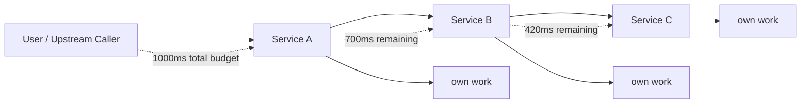
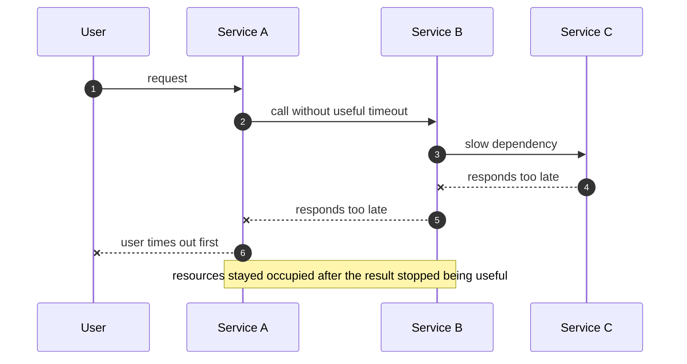
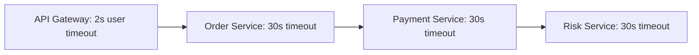
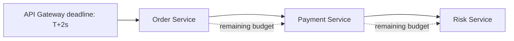
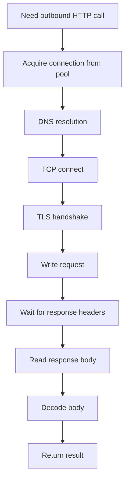
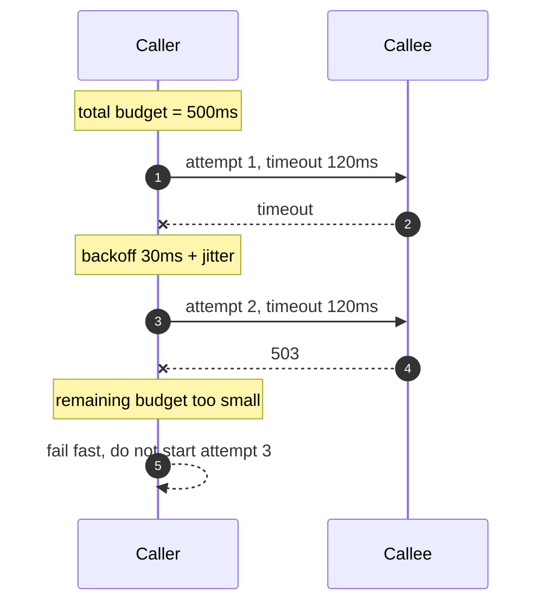
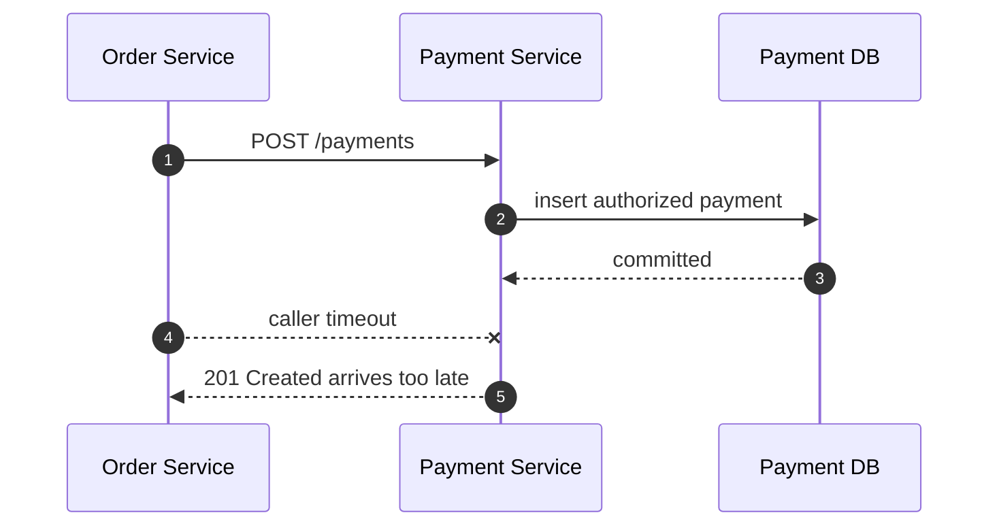
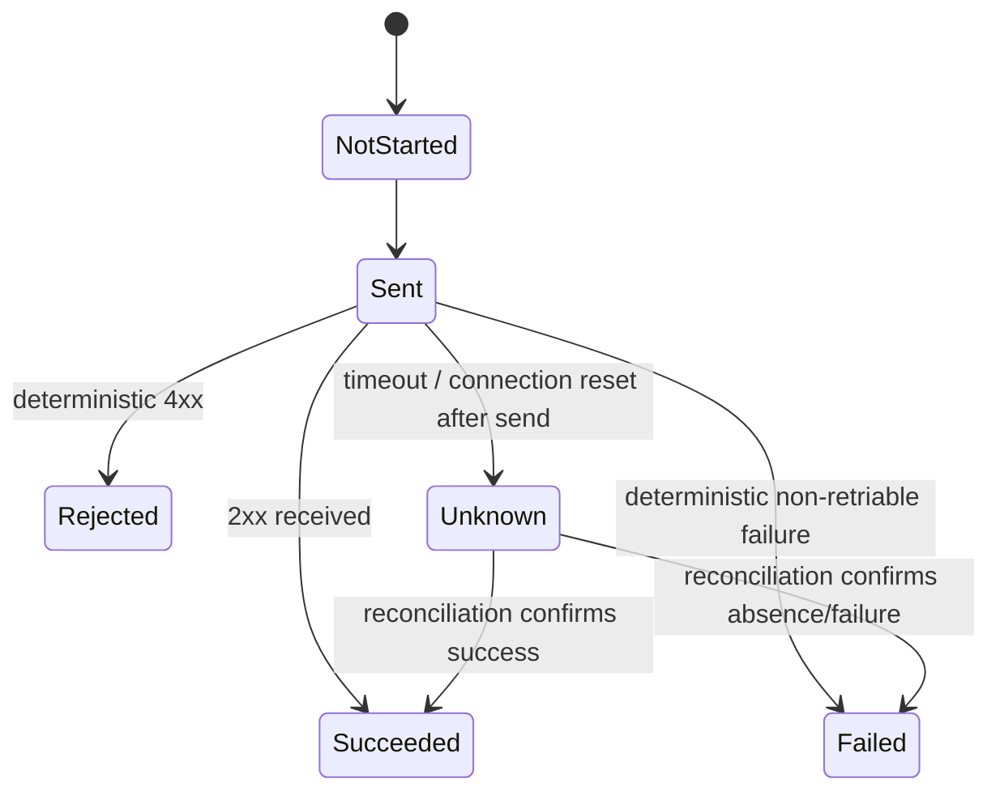
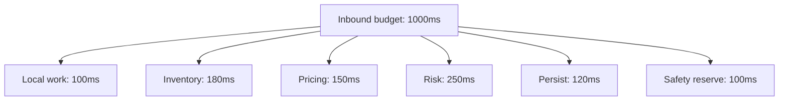
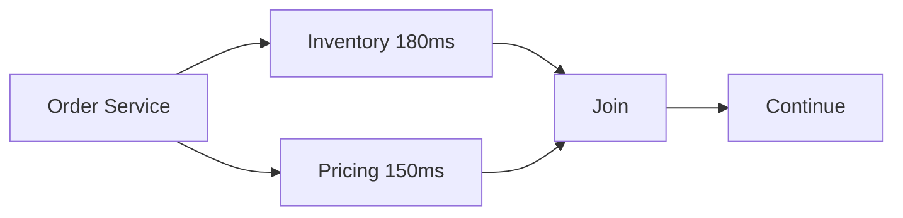

# Part 013 — Timeout Budgeting for HTTP Calls

A timeout is not a number.

A timeout is a **contract about how long this caller is willing to let a dependency consume its remaining execution budget**.

Most systems fail here because they treat timeout as a local client setting:

```properties
client.timeout=30s
```

That looks harmless. It is not.

A timeout that is too long turns dependency slowness into caller saturation. A timeout that is too short creates false failures. A timeout without retry budgeting creates retry storms. A timeout without cancellation creates useless background work. A timeout without observability turns every production incident into guessing.

In microservice communication, timeout design is part of the architecture.



The rule is simple:

> Every outbound call must consume a bounded portion of a larger request budget.

This part explains how to design that budget.

---

## 1. The Real Problem: Slow Is More Dangerous Than Failed

A failed dependency releases resources quickly.

A slow dependency holds:

- request threads;
- virtual threads or event-loop continuations;
- servlet container capacity;
- connection pool slots;
- database transactions;
- memory buffers;
- retry tokens;
- user-facing request budget;
- operator attention.

Slow dependencies create cascading failure because callers keep waiting while new requests arrive.



The key phrase is **after the result stopped being useful**.

A timeout is not merely about avoiding infinite wait. It is about stopping work when the result can no longer influence a useful outcome.

---

## 2. Timeout vs Deadline

These two terms are often mixed. In production design, separate them.

| Concept | Meaning | Example |
|---|---|---|
| Timeout | Relative duration allowed for an operation | `call user-service for at most 150ms` |
| Deadline | Absolute point in time after which result is useless | `complete before 2026-07-05T10:15:30.250Z` |
| Budget | Remaining usable time derived from deadline | `deadline - now - safety margin` |

Timeouts are local.

Deadlines propagate.

A call chain should not independently invent new 30-second timeouts at every hop.

Bad:



This system can still be doing work long after the gateway has already abandoned the client request.

Better:



Each hop computes:

```text
remainingBudget = deadline - now - localSafetyMargin
```

Then each outbound call uses the smaller of:

```text
remainingBudget
serviceSpecificMaxTimeout
```

This prevents a downstream call from consuming time the upstream caller no longer has.

---

## 3. The Timeout Stack

A single HTTP call crosses many phases. A useful timeout model knows which phase timed out.



Different timeouts protect different resources.

| Timeout | Protects | Failure meaning |
|---|---|---|
| Pool acquisition timeout | Caller-side concurrency and pool queue | No connection slot available fast enough |
| DNS timeout | Name resolution path | Cannot resolve target in time |
| Connect timeout | TCP establishment | Cannot establish network path quickly |
| TLS handshake timeout | Security session establishment | Cannot complete TLS negotiation quickly |
| Write timeout | Request body upload | Caller cannot send bytes fast enough |
| Response/header timeout | Upstream processing and first byte | Upstream did not start responding in time |
| Read/body timeout | Response streaming | Upstream started but did not finish fast enough |
| Total request timeout | End-to-end attempt | Whole attempt exceeded allowed duration |
| Idle timeout | Connection lifecycle | Existing connection idle too long |
| Deadline | Whole logical operation | Result no longer useful |

A production system does not always expose all of these as first-class knobs. But your design still needs the mental model.

If a client library only gives you `timeout`, ask:

- Is it connect-only?
- Is it total attempt timeout?
- Does it include DNS?
- Does it include TLS handshake?
- Does it include body streaming?
- Does it apply while waiting for a connection from the pool?
- Does it cancel the underlying operation?
- Does it release the connection safely?

Ambiguous timeout semantics are a production risk.

---

## 4. Timeout Is Not Retry

Timeout answers:

> How long may one operation wait?

Retry answers:

> Should we attempt again after a failure?

Budgeting answers:

> How much total time may all attempts consume?

The bug appears when teams configure both independently.

```yaml
requestTimeout: 2s
retries: 3
```

This may mean:

```text
1 initial attempt + 3 retries = 4 attempts
4 * 2s = 8s before backoff, queueing, and execution overhead
```

If the upstream request budget is 2 seconds, this configuration is already impossible.

Correct model:

```text
totalBudget = 2s
maxAttempts = 3
perAttemptTimeout = dynamic based on remainingBudget
backoff = bounded by remainingBudget
```



A retry that starts when the remaining budget cannot complete useful work is not resilience. It is load amplification.

---

## 5. Timeout Outcome Is Ambiguous

A timeout means the caller stopped waiting.

It does **not** prove the callee did not execute the operation.

Consider a `POST /payments` call:



From the caller's perspective, the outcome is unknown.

Maybe payment was created. Maybe not. Maybe it will be visible after replication delay. Maybe the connection failed after the callee committed but before the response arrived.

Therefore:

- timeout on a query is often safe to retry;
- timeout on a command is only safe to retry if the command is idempotent;
- timeout on a non-idempotent command requires reconciliation;
- timeout metrics must distinguish `caller gave up` from `callee failed`;
- error messages must avoid claiming facts the caller does not know.

Bad error interpretation:

```text
Payment failed.
```

Better:

```text
Payment request outcome is unknown. Check by idempotency key or payment id.
```

For internal systems, encode this distinction in state machines.



---

## 6. Choosing Timeout Values

There is no universal timeout value.

Timeout values depend on:

- user-facing SLO;
- caller concurrency model;
- downstream latency distribution;
- retry policy;
- payload size;
- network distance;
- cold-start behavior;
- TLS/session setup cost;
- deployment topology;
- whether the operation is read, command, stream, or batch;
- whether fallback exists;
- whether the operation is on the critical path.

A practical starting model:

```text
operationBudget = upstreamRemainingBudget - callerLocalWorkBudget - safetyMargin
perAttemptTimeout = min(servicePolicyMax, operationBudget / plannedAttemptCountAdjusted)
```

But this is only a starting point.

### Percentile-based baseline

If the downstream service has reliable latency telemetry, choose timeouts using percentiles.

Example:

| Downstream observed latency | Value |
|---|---:|
| p50 | 18ms |
| p90 | 42ms |
| p99 | 95ms |
| p99.9 | 180ms |

If you can tolerate about 0.1% false timeout under normal conditions, a baseline around p99.9 plus padding may be reasonable.

But be careful.

Percentiles measured inside the callee may exclude:

- DNS;
- connection pool wait;
- TCP connect;
- TLS handshake;
- client-side queueing;
- gateway/mesh hop;
- serialization/deserialization;
- response body transfer.

Caller-side latency is the source of truth for caller timeout design.

### Padding rule

If p99 and p99.9 are close, small variance can create many false timeouts.

Example:

```text
p99   = 92ms
p99.9 = 98ms
```

A timeout of 100ms may be fragile because a tiny regression creates many false positives. Add padding when the distribution is tight near the selected percentile.

If p99.9 is much larger than p99, the dependency has a tail-latency problem. A larger timeout may hide the symptom but damage caller capacity.

---

## 7. Budget Allocation Across a Call Chain

Assume an inbound request has 1000ms budget.

The order service must:

- validate request;
- read order aggregate;
- call inventory;
- call pricing;
- call payment risk;
- persist decision;
- emit an event.

Do not give every dependency 1000ms.

Design a budget map.

| Work item | Budget |
|---|---:|
| Gateway overhead | 50ms |
| Order validation + local fetch | 100ms |
| Inventory call | 180ms |
| Pricing call | 150ms |
| Risk call | 250ms |
| Persist decision | 120ms |
| Response serialization | 50ms |
| Safety reserve | 100ms |
| Total | 1000ms |

Budget maps should be revisited with production telemetry.

The goal is not perfect prediction. The goal is to prevent uncontrolled time consumption.



Parallel calls change the budget model.

If inventory and pricing run in parallel, elapsed time is closer to the maximum of the two, not the sum. But resource consumption is still additive.



Parallelism reduces latency but increases load and failure coordination complexity.

---

## 8. Deadline Propagation Header

HTTP has no universal standard deadline header equivalent to gRPC deadline semantics.

For internal HTTP APIs, many organizations define their own deadline header.

Example:

```http
X-Request-Deadline: 2026-07-05T10:15:30.250Z
```

or:

```http
X-Request-Timeout-Ms: 420
```

Prefer absolute deadline for multi-hop systems:

| Approach | Strength | Weakness |
|---|---|---|
| Relative timeout | Simple at one hop | Accumulates clock/processing ambiguity across hops |
| Absolute deadline | Clear global cutoff | Requires reasonably synchronized clocks |
| Remaining budget millis | Easy to consume | Can be accidentally reset or inflated |

A robust internal policy:

- gateway creates deadline if absent;
- services may reduce deadline, never extend it beyond trust boundary;
- downstream calls compute remaining budget locally;
- invalid deadline header is rejected or ignored according to trust policy;
- deadline is logged and traced;
- deadline is not treated as user-controlled input unless signed/validated;
- internal services never blindly propagate external user-provided deadline headers.

```java
public record RequestDeadline(Instant value) {
    public Duration remaining(Clock clock, Duration safetyMargin) {
        Duration remaining = Duration.between(clock.instant(), value).minus(safetyMargin);
        return remaining.isNegative() ? Duration.ZERO : remaining;
    }

    public boolean expired(Clock clock) {
        return !clock.instant().isBefore(value);
    }
}
```

---

## 9. Java Implementation Model

This section gives a small implementation model. Later parts will go deeper into specific clients.

### 9.1 Deadline context

Keep deadline as an explicit object, not a magic thread-local everywhere.

```java
public record CallBudget(
        Instant deadline,
        Duration safetyMargin,
        Clock clock
) {
    public Duration remaining() {
        Duration value = Duration.between(clock.instant(), deadline).minus(safetyMargin);
        return value.isNegative() ? Duration.ZERO : value;
    }

    public Duration timeoutFor(Duration serviceMaximum) {
        Duration remaining = remaining();
        if (remaining.isZero()) {
            return Duration.ZERO;
        }
        return remaining.compareTo(serviceMaximum) < 0 ? remaining : serviceMaximum;
    }

    public void throwIfExpired() {
        if (remaining().isZero()) {
            throw new DeadlineExceededException("request deadline exceeded before outbound call");
        }
    }
}
```

```java
public final class DeadlineExceededException extends RuntimeException {
    public DeadlineExceededException(String message) {
        super(message);
    }
}
```

### 9.2 JDK HttpClient example

JDK `HttpClient` has client-level connect timeout and request-level timeout via `HttpRequest.Builder#timeout`.

```java
HttpClient client = HttpClient.newBuilder()
        .connectTimeout(Duration.ofMillis(200))
        .build();

public HttpResponse<String> getCustomer(String customerId, CallBudget budget)
        throws IOException, InterruptedException {

    Duration timeout = budget.timeoutFor(Duration.ofMillis(300));
    if (timeout.isZero()) {
        throw new DeadlineExceededException("no budget left for customer-service call");
    }

    HttpRequest request = HttpRequest.newBuilder()
            .uri(URI.create("https://customer-service.internal/customers/" + customerId))
            .timeout(timeout)
            .header("X-Request-Deadline", budget.deadline().toString())
            .GET()
            .build();

    return client.send(request, HttpResponse.BodyHandlers.ofString());
}
```

Do not interpret this as a complete production client. It is the core idea: derive outbound timeout from remaining budget.

### 9.3 CompletableFuture and cancellation

Async APIs need explicit cancellation handling.

```java
CompletableFuture<HttpResponse<String>> future = client.sendAsync(
        request,
        HttpResponse.BodyHandlers.ofString()
);

scheduler.schedule(() -> future.cancel(true), timeout.toMillis(), TimeUnit.MILLISECONDS);
```

But cancellation behavior depends on client implementation and operation phase. Test it. Verify that resources are released and metrics are emitted.

### 9.4 Spring WebClient sketch

```java
Mono<CustomerDto> result = webClient.get()
        .uri("/customers/{id}", customerId)
        .header("X-Request-Deadline", budget.deadline().toString())
        .retrieve()
        .bodyToMono(CustomerDto.class)
        .timeout(budget.timeoutFor(Duration.ofMillis(300)));
```

For reactive clients, remember that `timeout()` may not mean the same as connection timeout, pool acquisition timeout, or TLS handshake timeout. Configure the underlying connector as well.

---

## 10. Server-Side Timeout Awareness

Timeout design is not only client-side.

A server should also know when continuing work is wasteful.

Server-side behavior should include:

- reading propagated deadline;
- rejecting immediately if deadline already expired;
- stopping expensive work if deadline expires;
- propagating remaining deadline to downstream calls;
- avoiding irreversible side effects after caller cancellation unless operation semantics require completion;
- recording whether work was abandoned due to caller deadline.

Example servlet-style filter:

```java
public final class DeadlineFilter implements Filter {
    private final Clock clock;

    public DeadlineFilter(Clock clock) {
        this.clock = clock;
    }

    @Override
    public void doFilter(ServletRequest req, ServletResponse res, FilterChain chain)
            throws IOException, ServletException {

        HttpServletRequest request = (HttpServletRequest) req;
        HttpServletResponse response = (HttpServletResponse) res;

        String rawDeadline = request.getHeader("X-Request-Deadline");
        if (rawDeadline != null) {
            Instant deadline = Instant.parse(rawDeadline);
            if (!clock.instant().isBefore(deadline)) {
                response.setStatus(503);
                response.setHeader("Content-Type", "application/problem+json");
                response.getWriter().write("""
                    {
                      "type":"https://errors.example.com/deadline-exceeded",
                      "title":"Deadline exceeded",
                      "status":503,
                      "detail":"Request deadline was already expired when received."
                    }
                    """);
                return;
            }
        }

        chain.doFilter(req, res);
    }
}
```

Whether to return `503`, `504`, or a domain-specific error depends on where timeout happened:

| Location | Typical interpretation |
|---|---|
| Server received already-expired deadline | Caller/upstream budget exhausted |
| Gateway timed out waiting for upstream | `504 Gateway Timeout` |
| Server intentionally sheds due to overload | `503 Service Unavailable` |
| Client waited too long locally | Client-side timeout exception, not necessarily HTTP status |
| Server did not receive full request in time | `408 Request Timeout` can apply |

Do not flatten all of these into `500`.

---

## 11. Timeout and Idempotency

Timeouts force you to decide whether retry is safe.

| Operation | Timeout outcome | Retry safety |
|---|---|---|
| `GET /customers/123` | unknown response, no intended mutation | usually safe if query is safe/idempotent |
| `PUT /customers/123/address` | update may or may not have happened | safe if full replacement and versioning are correct |
| `POST /payments` without idempotency key | payment may have been created | unsafe |
| `POST /payments` with idempotency key | outcome can be deduplicated/recovered | retryable by key |
| `POST /emails/send` | email may have been sent | unsafe without deduplication |
| `DELETE /resource/123` | deletion may have happened | retry often safe if delete is idempotent |

Timeout budgeting and idempotency must be designed together.

A production command API should expose a recovery handle:

```http
POST /payments
Idempotency-Key: 2f8e04e2-7f6f-4271-b52d-f6416bf9a421
```

Then caller can reconcile:

```http
GET /payments/by-idempotency-key/2f8e04e2-7f6f-4271-b52d-f6416bf9a421
```

The point is not that every command must be retried. The point is that timeout must not leave the caller permanently blind.

---

## 12. Timeout Observability

Every timeout should answer:

- which dependency?
- which endpoint template?
- which phase?
- which attempt?
- what was the configured timeout?
- what was the remaining deadline?
- was this before or after sending request bytes?
- did caller cancel?
- was retry attempted?
- did retry succeed?
- did the callee later complete?

Metrics should use low-cardinality labels.

Good metric labels:

```text
http.client.request.duration{service="payment-service", method="POST", route="/payments", outcome="timeout"}
http.client.timeout.count{service="payment-service", phase="response_headers", attempt="1"}
http.client.retry.count{service="payment-service", reason="timeout"}
call_budget.remaining_ms{service="payment-service", route="/payments"}
```

Bad metric labels:

```text
customerId="991882123"
url="/customers/991882123/orders/2026-07-05T10:33:19.123Z"
exceptionMessage="Read timed out after 312ms for tenant abc..."
```

Logs should include high-value diagnostic fields:

```json
{
  "event": "outbound_http_timeout",
  "dependency": "payment-service",
  "method": "POST",
  "route": "/payments",
  "attempt": 1,
  "phase": "response_headers",
  "configuredTimeoutMs": 250,
  "remainingBudgetMs": 31,
  "idempotencyKeyPresent": true,
  "traceId": "7d1e..."
}
```

Tracing should show timeout as span status/error and include the dependency name and route template, not raw high-cardinality URL.

---

## 13. Timeout Testing

Timeout behavior must be tested as behavior, not just configuration.

### Test cases

| Test | Expected outcome |
|---|---|
| downstream never accepts connection | connect timeout fires |
| pool exhausted | acquisition timeout fires |
| downstream accepts but never responds | response timeout fires |
| downstream sends headers but stalls body | read/body timeout fires |
| deadline already expired before call | client fails fast without network call |
| retry would exceed remaining budget | retry is skipped |
| command timeout after send | state becomes `UNKNOWN`, not `FAILED` |
| cancellation occurs | resources are released |
| gateway timeout shorter than client timeout | client policy is corrected |

### WireMock-style mental model

```java
@Test
void shouldNotStartOutboundCallWhenDeadlineExpired() {
    CallBudget budget = new CallBudget(
            Instant.now().minusMillis(1),
            Duration.ofMillis(10),
            Clock.systemUTC()
    );

    assertThrows(DeadlineExceededException.class,
            () -> customerClient.getCustomer("c-123", budget));

    // Verify stub server received zero requests.
}
```

### Failure injection

A mature team can inject:

- delayed headers;
- delayed body chunks;
- connection resets;
- half-open connections;
- slow TLS handshake;
- DNS failure;
- pool exhaustion;
- gateway upstream timeout;
- callee completes after caller timeout.

This is how timeout policy becomes real, not decorative.

---

## 14. Common Timeout Anti-Patterns

### Anti-pattern 1: One timeout for everything

```yaml
httpTimeout: 30s
```

This hides whether you mean connect, pool acquisition, response, body, or total request.

### Anti-pattern 2: Client timeout longer than upstream gateway timeout

```text
Gateway timeout: 5s
Service client timeout: 30s
```

The service keeps working long after the gateway has abandoned the result.

### Anti-pattern 3: Retry timeout multiplication

```text
timeout=2s, retries=3, user budget=2s
```

This is impossible without violating the user budget.

### Anti-pattern 4: Timeout interpreted as business failure

Timeout is often unknown outcome, not domain rejection.

### Anti-pattern 5: No timeout for background workers

Workers also need bounded calls. Otherwise a stuck dependency can freeze throughput and block partition/queue progress.

### Anti-pattern 6: Infinite pool queue

A short HTTP timeout does not help if the request waits unbounded time before it even gets a connection.

### Anti-pattern 7: Timeout configured but not observed

If you cannot break down timeout by dependency, route, and phase, you cannot operate it.

### Anti-pattern 8: Caller stops waiting but callee continues irreversible work unintentionally

This creates duplicate side effects, delayed writes, and reconciliation bugs.

---

## 15. Production Timeout Policy Template

Use this as a starting template.

```yaml
outboundClients:
  payment-service:
    baseUrl: https://payment-service.internal
    connectTimeout: 100ms
    poolAcquireTimeout: 50ms
    responseTimeout: 250ms
    maxTotalAttemptTimeout: 300ms
    deadlinePropagation: true
    safetyMargin: 25ms
    retry:
      enabled: true
      maxAttempts: 2
      retryableMethods: [GET, PUT, DELETE]
      retryableStatusCodes: [408, 429, 502, 503, 504]
      requireIdempotencyKeyForPost: true
      backoff:
        initial: 25ms
        max: 100ms
        jitter: full
    observability:
      dependencyName: payment-service
      routeTemplating: required
      logTimeoutEvents: true
      emitRemainingBudgetMetric: true
```

Do not copy numbers blindly. Copy the structure.

---

## 16. Review Checklist

Before approving an HTTP client integration, ask:

- What is the caller's total request budget?
- What is the downstream service maximum allowed timeout?
- Is timeout per attempt or total across attempts?
- Is retry bounded by the same deadline?
- Is there a pool acquisition timeout?
- Is connect timeout separate from response timeout?
- Is deadline propagated downstream?
- Can downstream reject already-expired work?
- Does timeout cancel work or only stop waiting?
- If the call is a command, what happens on unknown outcome?
- Is idempotency key required where needed?
- Are timeout events observable by dependency and route?
- Are timeout metrics low-cardinality?
- Is gateway/load-balancer timeout aligned with service client timeout?
- Is the timeout tested with injected slow dependency behavior?

---

## 17. The Top 1% Mental Model

Most engineers ask:

> What timeout should I set?

A stronger engineer asks:

> What is the caller's remaining budget, what work can still produce a useful result, what resources are at risk while waiting, and what state should the system enter if the outcome is unknown?

That question changes the design.

Timeouts are not a defensive afterthought. They are part of the communication protocol between services.

A good timeout policy protects:

- user experience;
- caller capacity;
- callee recovery;
- retry behavior;
- correctness under unknown outcome;
- operator diagnosis;
- system-wide stability.

The invariant is:

> No service may let a dependency consume unbounded or useless time.

Once you enforce that invariant, HTTP communication becomes dramatically safer.

---

## References

- RFC 9110 — HTTP Semantics: status codes, `Retry-After`, method semantics, and HTTP request/response meaning.
- RFC 9112 — HTTP/1.1: persistent connection behavior.
- Oracle Java SE 25 API — `java.net.http.HttpClient` and request/client timeout APIs.
- AWS Builders Library — Timeouts, retries, and backoff with jitter.
- Google SRE Book — Handling overload and cascading failures.
- OpenTelemetry Semantic Conventions — HTTP client/server metrics and trace attributes.
