# Part 014 — Connection Pooling, Keep-Alive, DNS, and Socket Lifecycle

HTTP client performance is often blamed on JSON, serialization, network latency, or the callee.

Often the real issue is simpler:

> The caller does not understand its connection lifecycle.

A service-to-service HTTP call is not just a method invocation. Before a byte of business payload is processed, the system may need to:

- resolve DNS;
- open a TCP connection;
- perform TLS handshake;
- negotiate protocol;
- acquire a connection from a pool;
- serialize request bytes;
- wait for response bytes;
- decide whether the connection can be reused;
- eventually close the socket.

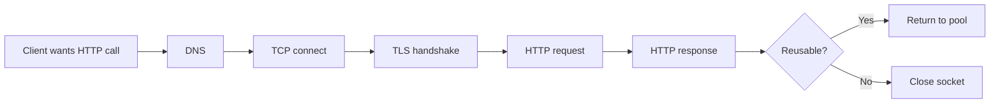

Connection pooling is not a micro-optimization. It is a capacity and failure-containment mechanism.

A bad pool can create latency spikes, connection storms, ephemeral port exhaustion, uneven load balancing, stale connections, and cascading failures.

---

## 1. The Mental Model: Connection Is a Scarce Resource

Every outbound HTTP call needs an execution path to the destination.

With no reuse, every request pays setup cost.

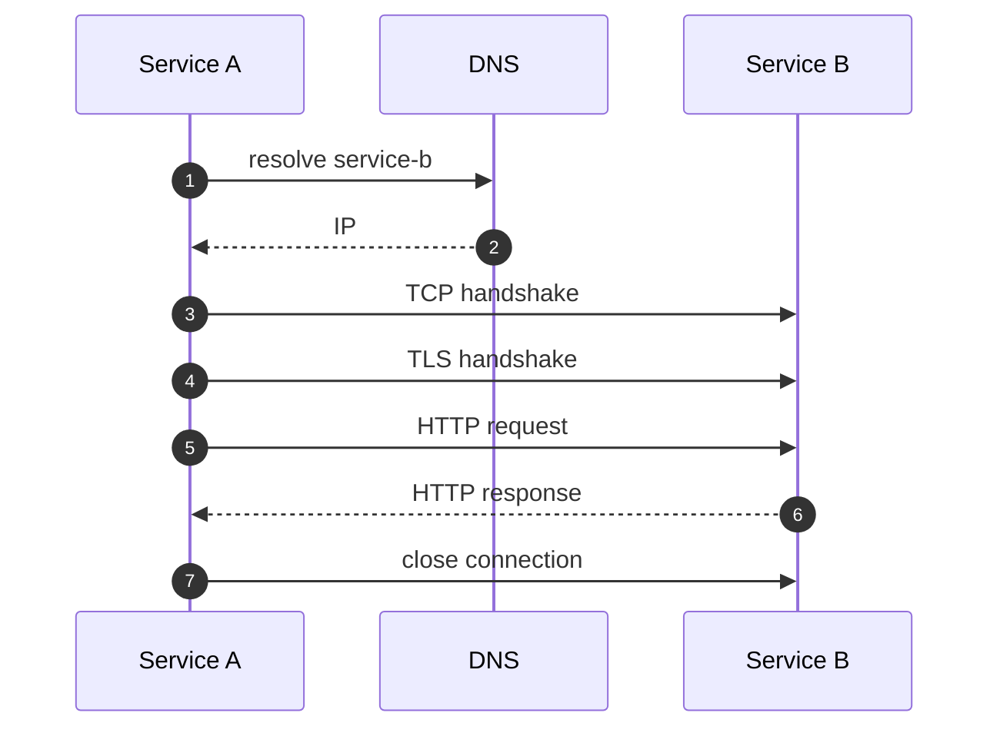

With reuse, the expensive path is amortized.

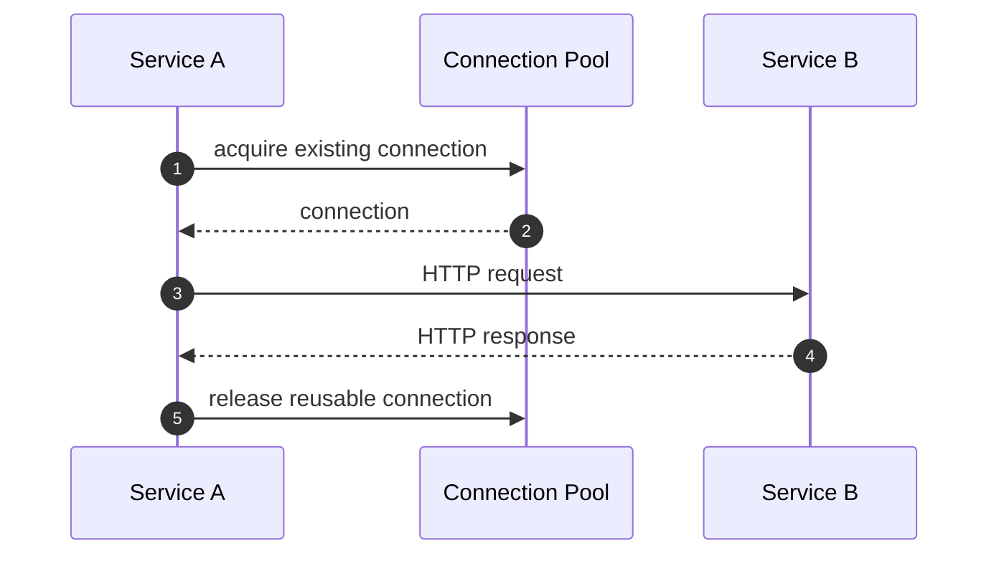

The pool answers four operational questions:

1. How many concurrent connections may this caller open?
2. How long may requests wait for a connection slot?
3. How long may idle connections live?
4. When should connections be retired and refreshed?

If those answers are implicit, production behavior is accidental.

---

## 2. Why Connection Setup Is Expensive

A cold HTTPS request can include multiple round trips before application processing begins.

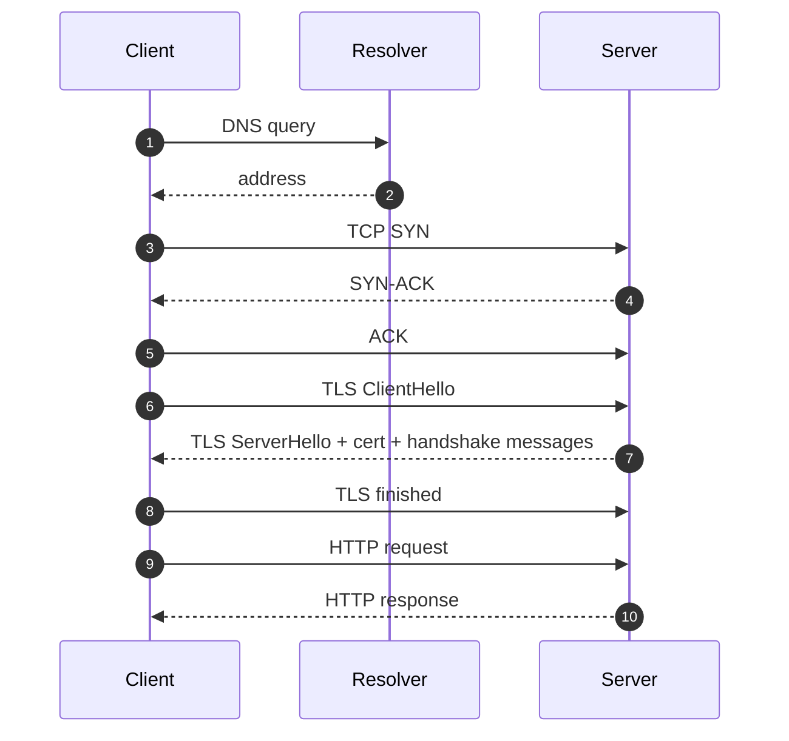

Connection reuse reduces:

- TCP handshake cost;
- TLS handshake cost;
- CPU spent on cryptography;
- packet count;
- latency variance;
- pressure on server accept queues;
- pressure on client ephemeral ports;
- startup spikes after deployment.

But reuse creates its own risks:

- stale connections;
- uneven load distribution;
- hidden dependency on old DNS results;
- connection pool starvation;
- long-lived connections to unhealthy instances;
- idle timeout mismatch between client, proxy, gateway, and server.

You need both reuse and retirement.

---

## 3. HTTP/1.1 Persistent Connections

HTTP/1.1 defaults to persistent connections unless connection metadata says otherwise.

That means multiple request/response exchanges can reuse the same TCP connection, usually sequentially per connection.

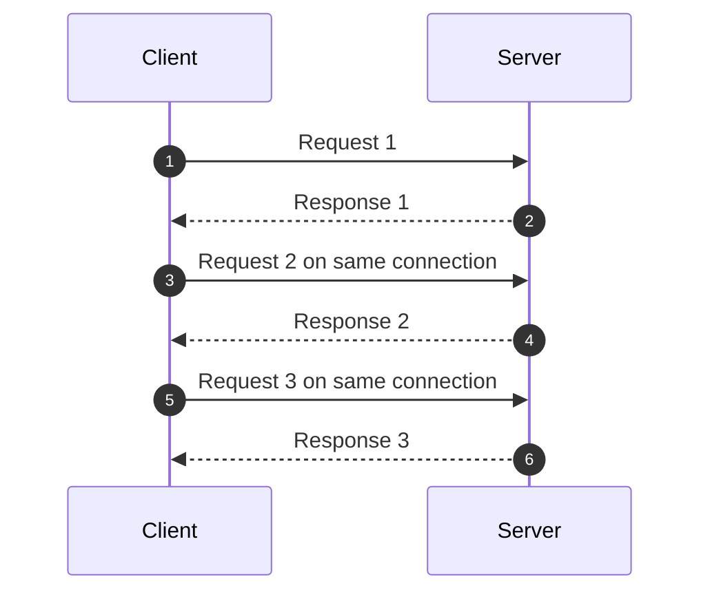

For HTTP/1.1, concurrency usually requires multiple connections per destination.

If you allow only one connection to `payment-service`, requests queue behind each other.

If you allow too many, the caller can overload the callee or exhaust local resources.

So for HTTP/1.1, the key knobs are typically:

- max total connections;
- max connections per route/host;
- connection acquisition timeout;
- idle eviction timeout;
- connection time-to-live;
- stale connection validation;
- pending acquisition queue size.

---

## 4. HTTP/2 Multiplexing Changes the Pool Shape

HTTP/2 allows multiple concurrent streams over a single connection.

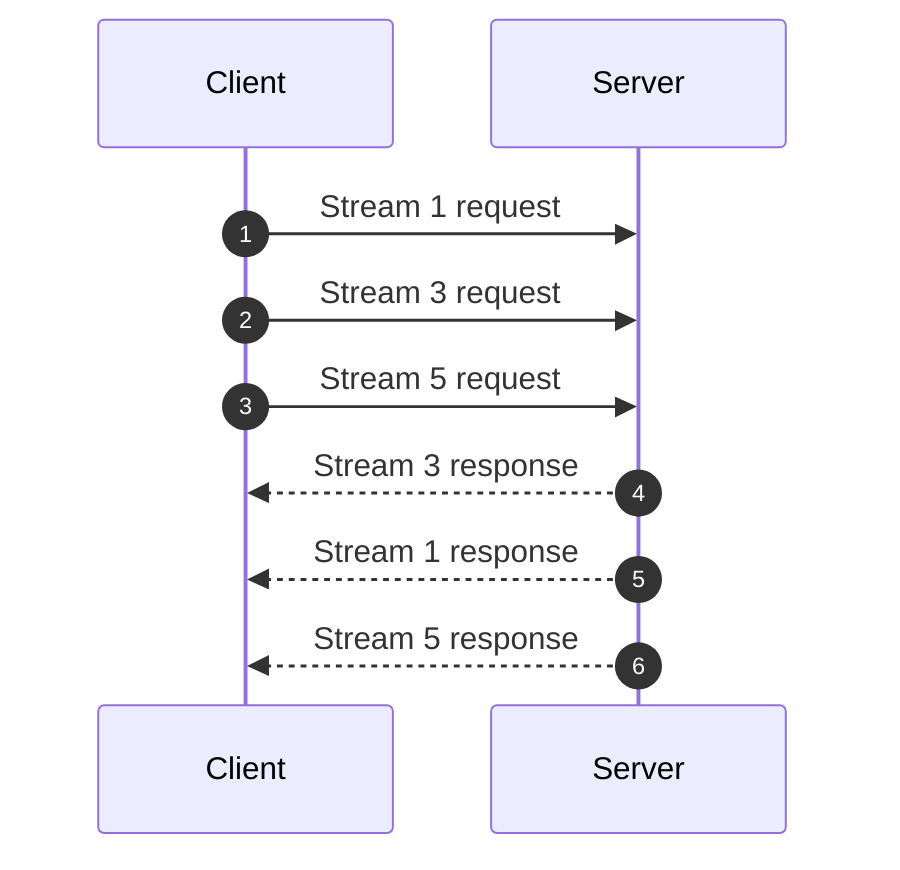

This changes the pool model.

Instead of:

```text
concurrency ~= number_of_connections
```

You get:

```text
concurrency ~= connections * max_concurrent_streams
```

Benefits:

- fewer TCP/TLS connections;
- less handshake overhead;
- better reuse;
- concurrent in-flight requests over one socket;
- lower connection churn.

Risks:

- a single bad connection can affect many streams;
- flow-control behavior matters;
- large responses can interfere with smaller calls;
- load balancing may become sticky if too much traffic rides long-lived connections;
- server/proxy stream limits become a hidden capacity boundary.

HTTP/2 does not eliminate connection management. It changes the unit of concurrency from connection to stream.

---

## 5. Pool Acquisition Is a Timeout Boundary

Many teams configure response timeout but forget pool acquisition timeout.

Bad path:

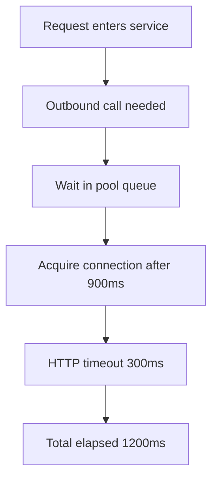

The configured HTTP timeout did not protect the caller from queueing.

A production client needs an acquisition timeout:

```text
max time waiting for a connection slot
```

If no slot is available quickly, failing fast may be safer than allowing unbounded queueing.

Pool acquisition timeout protects:

- request latency;
- caller memory;
- caller thread/continuation count;
- downstream recovery;
- system-wide backpressure.

A saturated pool is a signal. Do not hide it behind infinite queues.

---

## 6. Pool Size Is a Capacity Contract

A connection pool is a local limit on how much pressure this service can place on a dependency.

```text
maxConnectionsToPayment = 100
```

This is not just performance tuning. It is a blast-radius control.

Too small:

- artificial queueing;
- low throughput;
- poor latency;
- head-of-line blocking;
- underused downstream capacity.

Too large:

- downstream overload;
- noisy-neighbor behavior;
- too many open sockets;
- more TLS/CPU overhead;
- harder failover;
- possible ephemeral port exhaustion.

A useful sizing model:

```text
neededConcurrency ≈ targetRequestsPerSecond * averageServiceTimeSeconds
```

Example:

```text
200 rps to inventory-service
average outbound latency = 50ms = 0.05s
needed in-flight concurrency ≈ 200 * 0.05 = 10
```

Then add margin for variance, retries, and tail latency.

But do not blindly multiply by huge safety factors. Pool size is a contract with the dependency.

### Per-route matters

Global max connections alone is not enough.

```yaml
maxTotalConnections: 500
```

If one dependency consumes all 500, others may starve.

Prefer per-dependency or per-route limits:

```yaml
clients:
  payment-service:
    maxConnections: 100
  inventory-service:
    maxConnections: 80
  customer-service:
    maxConnections: 50
```

For shared clients, enforce isolation by destination.

---

## 7. Keep-Alive and Idle Timeout Mismatch

Connection reuse depends on both sides agreeing that the connection is still usable.

Problems appear when timeouts are misaligned:

```text
Client thinks idle connection is valid for 60s
Load balancer closes idle connection after 30s
Client reuses socket at 45s
Request fails with connection reset
```

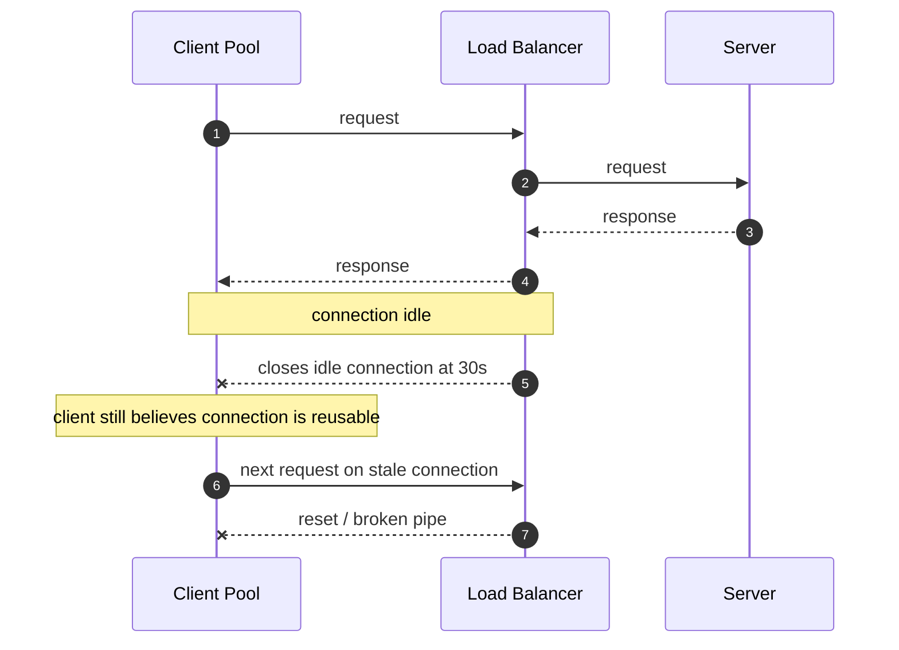

Mitigation options:

- set client idle timeout lower than proxy/load-balancer idle timeout;
- validate connections before reuse;
- retire connections with max lifetime;
- handle connection reset as retryable only when safe;
- monitor stale connection errors;
- avoid keeping idle connections forever.

Do not tune keep-alive in isolation. Align:

- client pool idle timeout;
- service mesh proxy idle timeout;
- gateway idle timeout;
- load balancer idle timeout;
- server keep-alive timeout;
- NAT/firewall idle timeout.

---

## 8. Connection Time-To-Live

Idle timeout answers:

> How long may an unused connection stay in the pool?

Connection TTL answers:

> How old may a connection become, even if actively reused?

TTL matters because long-lived connections can stay attached to:

- old DNS answers;
- old backend instances;
- old load-balancer decisions;
- old TLS sessions;
- degraded network paths;
- pods scheduled before a rolling update.

Without TTL, a hot client may keep using a small set of old connections while new backend instances receive little traffic.

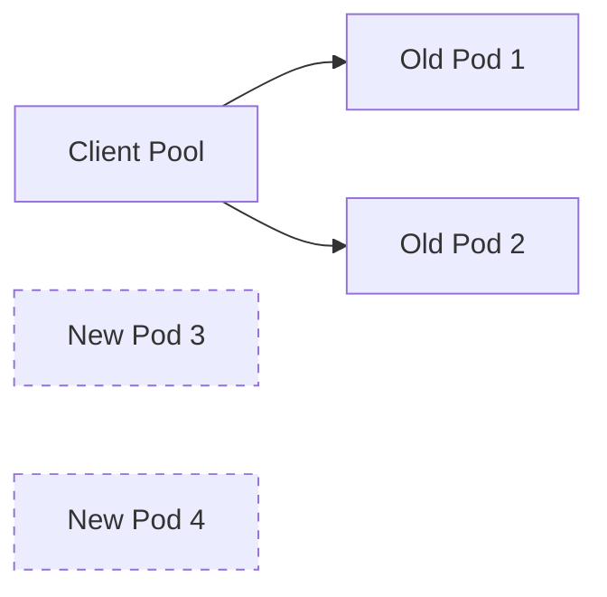

A sane TTL introduces controlled churn.

But TTL must be jittered. If every instance retires connections every exact 5 minutes, you create synchronized reconnect waves.

Better:

```text
connectionTtl = random between 4m and 6m
```

or deterministic jitter per instance/dependency.

---

## 9. DNS Is Not a One-Time Lookup

DNS is part of service communication.

In containerized platforms, service names often resolve to virtual IPs, gateway addresses, or sets of backend addresses depending on configuration.

Questions to ask:

- Does the client cache DNS results?
- For how long?
- Does the JVM cache forever, for a fixed TTL, or according to security properties?
- Does the HTTP client perform its own DNS resolution?
- Does the service mesh intercept DNS or outbound traffic?
- Does the load balancer use DNS-based failover?
- What happens when an IP disappears during a rolling deployment?

DNS-related failures often look like random connect timeouts.

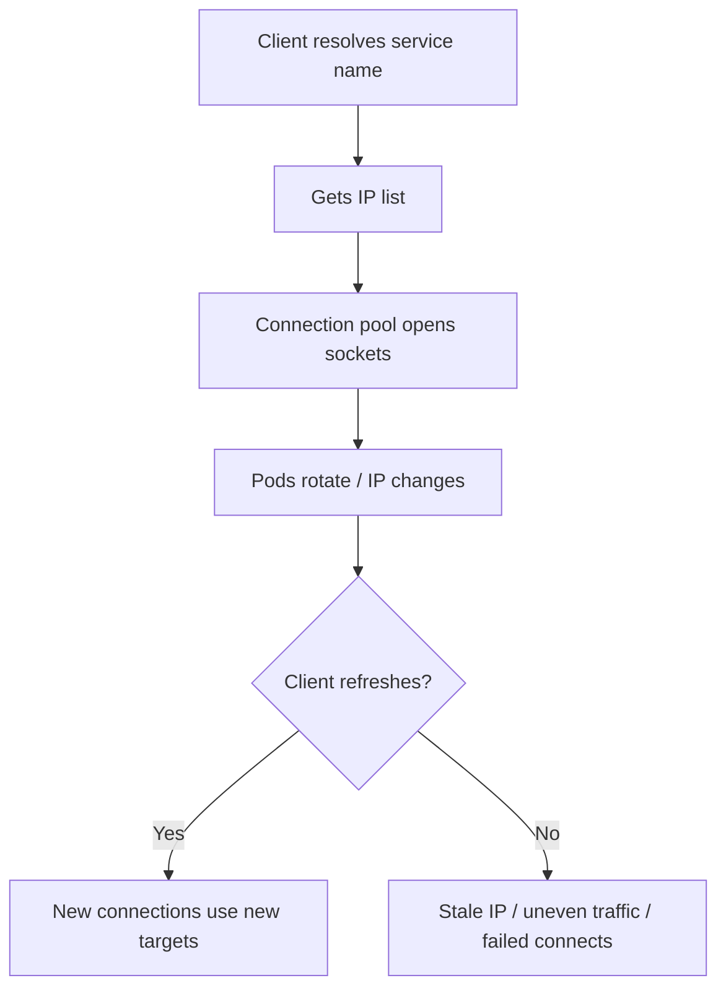

### JVM DNS cache

The JVM has DNS cache controls through security properties such as:

```properties
networkaddress.cache.ttl
networkaddress.cache.negative.ttl
```

Do not assume the default is right for your deployment model. Defaults can be affected by security manager/history, JDK version, and runtime configuration.

For microservices, verify effective behavior in your runtime image.

### DNS TTL vs connection TTL

DNS refresh alone does not move traffic if existing pooled connections remain open forever.

To react to DNS changes, you need:

- DNS TTL behavior;
- connection TTL behavior;
- idle eviction;
- retry/failover behavior;
- load-balancer policy.

Connection management and discovery are inseparable.

---

## 10. Socket Lifecycle and Resource Exhaustion

Every TCP connection consumes resources on client and server.

Client-side resources include:

- file descriptors;
- ephemeral ports;
- kernel socket buffers;
- TLS state;
- client pool bookkeeping;
- application memory;
- threads or continuations waiting on I/O.

Server-side resources include:

- accept backlog;
- file descriptors;
- TLS state;
- worker capacity;
- proxy connection slots;
- load balancer tracking state.

### Ephemeral ports

Outbound TCP connections use local ephemeral ports.

If a service opens and closes connections aggressively, ports can accumulate in `TIME_WAIT` and limit new connections.

Symptoms:

- intermittent connect failures;
- high connection churn;
- many sockets in `TIME_WAIT`;
- high CPU in networking/TLS;
- better behavior after enabling reuse.

Common causes:

- no pooling;
- pool disabled accidentally;
- server sends `Connection: close`;
- load balancer closes connections too aggressively;
- client TTL too short;
- retries create connection storms;
- per-request client instance creation.

Do not create a new HTTP client per request.

Bad:

```java
public Customer getCustomer(String id) {
    HttpClient client = HttpClient.newHttpClient();
    // call
}
```

Better:

```java
public final class CustomerClient {
    private final HttpClient httpClient;

    public CustomerClient(HttpClient httpClient) {
        this.httpClient = httpClient;
    }

    public Customer getCustomer(String id) {
        // reuse configured client
        return null;
    }
}
```

The exact client type varies, but the invariant stands: client lifecycle should usually be application-scoped, not request-scoped.

---

## 11. Connection Storms

A connection storm occurs when many clients open many new connections at once.

Triggers:

- deployment rollout;
- all clients start at the same time;
- DNS failover;
- load balancer restart;
- proxy restart;
- pool TTL synchronized across instances;
- downstream outage clears pools;
- retry policy opens fresh connections aggressively.

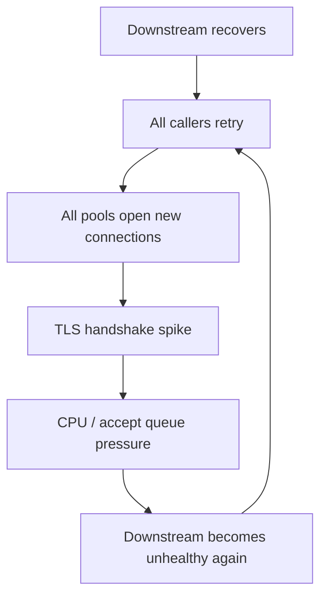

Mitigation:

- jitter connection warmup;
- jitter connection TTL;
- cap connection creation rate;
- bound retry concurrency;
- use token-bucket retry budget;
- pre-warm carefully during startup;
- avoid synchronized scheduled jobs;
- shed load when pool acquisition fails;
- do not instantly restore full traffic after outage.

Connection pool policy and retry policy must be designed together.

---

## 12. Java Client Configuration Patterns

Different Java HTTP stacks expose different knobs. The exact names vary, but the conceptual policy is consistent.

### Policy fields to standardize

```yaml
httpClients:
  inventory-service:
    protocol: HTTP_1_1_OR_HTTP_2
    connectTimeout: 100ms
    poolAcquireTimeout: 50ms
    responseTimeout: 250ms
    maxConnections: 100
    maxPendingAcquires: 200
    idleTimeout: 25s
    connectionTtl: 5m
    connectionTtlJitter: 20%
    validateAfterIdle: 5s
    keepAlive: true
    dns:
      respectTtl: true
      negativeCacheTtl: 5s
    tls:
      enabled: true
      sessionReuse: true
```

Not every client supports every knob directly. If your chosen client cannot express a policy critical to your system, that is an architecture constraint.

### JDK HttpClient

JDK `HttpClient` is built into modern Java and supports client-level connect timeout and request-level timeout. It is convenient and often sufficient for simple clients.

But if you need deep pool acquisition, per-route pool sizing, eviction, and low-level connection policies, verify whether its exposed controls match your production needs.

### Apache HttpClient 5 style

Apache HttpClient is often used when teams need explicit connection management.

Conceptual example:

```java
PoolingHttpClientConnectionManager connectionManager =
        new PoolingHttpClientConnectionManager();

connectionManager.setMaxTotal(500);
connectionManager.setDefaultMaxPerRoute(100);

RequestConfig requestConfig = RequestConfig.custom()
        .setConnectionRequestTimeout(Timeout.ofMilliseconds(50))
        .setConnectTimeout(Timeout.ofMilliseconds(100))
        .setResponseTimeout(Timeout.ofMilliseconds(250))
        .build();

CloseableHttpClient client = HttpClients.custom()
        .setConnectionManager(connectionManager)
        .setDefaultRequestConfig(requestConfig)
        .evictExpiredConnections()
        .evictIdleConnections(TimeValue.ofSeconds(25))
        .build();
```

Treat this as a shape, not copy-paste final code. Production code should wrap lifecycle, metrics, route config, TLS, and shutdown.

### Reactor Netty / WebClient style

For reactive clients, the connection provider is central.

```java
ConnectionProvider provider = ConnectionProvider.builder("inventory-pool")
        .maxConnections(100)
        .pendingAcquireTimeout(Duration.ofMillis(50))
        .maxIdleTime(Duration.ofSeconds(25))
        .maxLifeTime(Duration.ofMinutes(5))
        .build();

HttpClient httpClient = HttpClient.create(provider)
        .responseTimeout(Duration.ofMillis(250));

WebClient webClient = WebClient.builder()
        .clientConnector(new ReactorClientHttpConnector(httpClient))
        .baseUrl("https://inventory-service.internal")
        .build();
```

With event-loop based clients, also protect event loops from blocking work. Pool tuning cannot fix blocking code on the event loop.

---

## 13. Per-Dependency Isolation

One shared global pool sounds efficient. It can be dangerous.

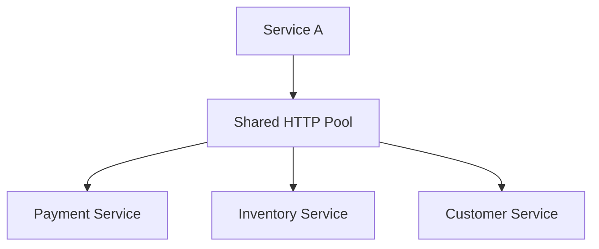

If payment becomes slow and consumes all connections/pending acquisitions, inventory and customer calls may fail even though their dependencies are healthy.

Prefer isolation:

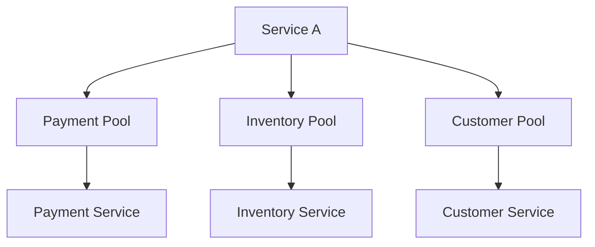

Isolation can be implemented by:

- separate client instances per dependency;
- separate connection providers;
- per-route pool limits;
- bulkheads;
- separate thread pools where applicable;
- independent retry budgets;
- independent circuit breakers.

Communication isolation is a reliability primitive.

---

## 14. Pool Metrics That Matter

If you cannot observe the pool, you cannot tune it.

Track at least:

| Metric | Meaning |
|---|---|
| active connections | connections currently used |
| idle connections | reusable connections waiting |
| pending acquisitions | callers waiting for a connection |
| acquisition duration | how long callers wait for a slot |
| acquisition timeout count | pool saturation signal |
| connection creation count | churn/cold connection rate |
| connection close count | retirement/churn signal |
| connection reset count | stale/mid-flight failure signal |
| TLS handshake duration | cold path cost |
| DNS lookup duration/failure | discovery path health |
| requests per connection | reuse efficiency |
| connection age distribution | TTL behavior |

A healthy dashboard separates:

```text
application latency
pool acquisition latency
connect latency
TLS latency
response latency
body read latency
```

If you only have total HTTP duration, you will misdiagnose incidents.

---

## 15. Failure Diagnosis Patterns

### Symptom: latency spike, downstream CPU normal

Possible causes:

- pool acquisition queueing;
- stale connections and retries;
- DNS slowness;
- TLS handshake spike;
- client-side thread starvation;
- connection storm after rollout.

### Symptom: many connection resets after idle period

Possible causes:

- client idle timeout longer than load balancer idle timeout;
- server closes keep-alive earlier than client expects;
- NAT/firewall idle timeout;
- stale connection validation missing.

### Symptom: new pods receive little traffic

Possible causes:

- long-lived connections pinned to old pods;
- DNS TTL not refreshed;
- connection TTL absent;
- load balancing happens only at connection creation;
- HTTP/2 multiplexing keeps hot connections alive.

### Symptom: connect timeout during incident

Possible causes:

- downstream accept queue full;
- network path issue;
- DNS returning dead IP;
- too many simultaneous reconnects;
- security group/firewall issue;
- ephemeral port exhaustion.

### Symptom: high `TIME_WAIT`

Possible causes:

- connection reuse disabled;
- per-request client creation;
- too aggressive TTL;
- server or proxy closes after every response;
- retry storm creates churn.

---

## 16. Kubernetes and Mesh Considerations

In Kubernetes, the apparent destination may not be the final backend instance.

Possible paths:

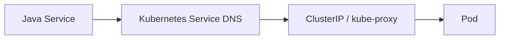

With service mesh:

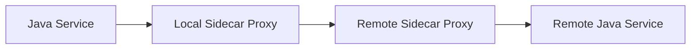

A sidecar changes connection semantics:

- the Java app may pool connections to local proxy;
- the proxy may maintain separate upstream pools;
- app-level timeout and proxy timeout must align;
- retries may exist both in app and mesh;
- connection reuse to proxy may hide upstream connection churn;
- observability must distinguish app-to-proxy and proxy-to-upstream behavior.

Do not configure retries, timeouts, and connection pools independently at app, gateway, and mesh layers. You may accidentally triple the retry load or create conflicting timeout behavior.

---

## 17. Shutdown and Draining

Connection lifecycle includes shutdown.

During deployment, a service instance should:

- stop accepting new inbound work;
- continue processing in-flight requests within grace period;
- stop starting new outbound calls when deadline cannot complete;
- close idle outbound connections;
- let in-flight outbound calls finish or cancel them according to policy;
- release client resources cleanly.

Bad shutdown creates:

- connection resets;
- half-completed commands;
- retry storms;
- duplicate side effects;
- false health-check success;
- traffic sent to terminating pods.

Connection management is part of deployment safety.

---

## 18. Common Anti-Patterns

### Anti-pattern 1: New HTTP client per request

Creates excessive connection churn and defeats pooling.

### Anti-pattern 2: Infinite pending acquisition queue

Turns dependency slowness into caller memory and latency explosion.

### Anti-pattern 3: Pool too large because “more is faster”

Can overload the dependency and amplify incidents.

### Anti-pattern 4: No per-dependency isolation

One slow dependency starves unrelated dependencies.

### Anti-pattern 5: Idle timeout longer than load balancer timeout

Creates stale connection failures.

### Anti-pattern 6: No connection TTL

Traffic sticks to old backend instances and ignores topology changes.

### Anti-pattern 7: Synchronized TTL

All instances reconnect at once.

### Anti-pattern 8: DNS TTL assumed but not verified

Effective JVM/container behavior differs from what the team believes.

### Anti-pattern 9: HTTP/2 treated as “pooling solved”

Multiplexing changes the bottleneck. It does not eliminate it.

### Anti-pattern 10: Pool metrics absent

You cannot distinguish downstream latency from caller-side queueing.

---

## 19. Production Connection Policy Template

```yaml
clients:
  payment-service:
    baseUrl: https://payment-service.internal
    protocolPreference: HTTP_2_THEN_HTTP_1_1
    lifecycle:
      singletonClient: true
      gracefulShutdown: true
    pool:
      isolated: true
      maxConnections: 100
      maxPendingAcquires: 200
      acquisitionTimeout: 50ms
      idleTimeout: 25s
      maxConnectionAge: 5m
      maxConnectionAgeJitter: 20%
      validateAfterIdle: 5s
    timeout:
      connectTimeout: 100ms
      responseTimeout: 250ms
      totalAttemptTimeout: 300ms
      deadlinePropagation: true
    dns:
      verifyEffectiveJvmTtl: true
      negativeCacheTtl: 5s
    retry:
      retryConnectionResetBeforeRequestBodySent: true
      retryAfterRequestBodySentOnlyIfIdempotent: true
      retryBudget: enabled
    observability:
      emitPoolMetrics: true
      emitDnsMetrics: true
      emitConnectMetrics: true
      emitTlsMetrics: true
      routeTemplateRequired: true
```

Again, do not copy the numbers. Copy the structure and force each number to be justified.

---

## 20. Review Checklist

Before approving a production HTTP integration, ask:

- Is the HTTP client reused or accidentally created per request?
- Is the pool isolated per dependency or route?
- What is max connection count?
- What is max pending acquisition count?
- What is acquisition timeout?
- What is idle timeout?
- Is client idle timeout lower than gateway/load-balancer/server idle timeout?
- Is there connection TTL?
- Is TTL jittered?
- Does DNS refresh matter for this topology?
- What is the effective JVM DNS cache behavior?
- Does connection TTL interact with DNS TTL correctly?
- Are connection resets retried only when safe?
- Are pool metrics exported?
- Can dashboards separate acquisition latency from downstream latency?
- Are HTTP/2 stream limits understood?
- Are app, gateway, and mesh connection policies aligned?
- Does shutdown drain connections safely?

---

## 21. The Top 1% Mental Model

Most engineers think connection pooling means:

> Reuse connections so requests are faster.

A stronger engineer thinks:

> Bound how much pressure this caller can put on each dependency, avoid setup churn, prevent hidden queues, refresh topology safely, and make connection lifecycle observable.

That is the real purpose.

A connection pool is not just a cache of sockets. It is a local concurrency controller, a failure boundary, a load-shaping tool, and a topology adaptation mechanism.

The invariant is:

> Every service must make outbound connection lifecycle explicit, bounded, observable, and aligned with platform routing behavior.

Once that invariant holds, HTTP communication becomes much easier to operate under real production failure.

---

## References

- RFC 9112 — HTTP/1.1 persistent connections and connection management.
- RFC 9110 — HTTP request routing, connection establishment, status semantics, and general HTTP behavior.
- Oracle Java SE 25 API — `java.net.http.HttpClient`.
- Apache HttpClient 5 documentation — pooling connection manager and request configuration concepts.
- Reactor Netty documentation — `ConnectionProvider`, response timeout, and connection lifecycle configuration.
- Kubernetes documentation — Service networking and DNS behavior.
- AWS Builders Library — Timeouts, retries, and backoff with jitter.
- OpenTelemetry Semantic Conventions — HTTP and network observability attributes.
