# Part 015 — HTTP/1.1 vs HTTP/2 in Internal Communication

HTTP/2 is often sold as a faster HTTP.

That framing is incomplete.

For microservices, the better question is not:

> Is HTTP/2 faster than HTTP/1.1?

The better question is:

> Does HTTP/2 reduce the specific bottleneck, failure mode, or operational cost in this service-to-service path?

HTTP/2 changes how HTTP messages are transported. It does not change the fundamental HTTP semantics: methods, status codes, header fields, request/response structure, caching concepts, and many application-level contracts remain HTTP semantics. The transport expression changes from mostly textual messages over connections into binary frames multiplexed over a connection.

That matters because most internal HTTP incidents are not caused by the theoretical elegance of the protocol. They are caused by:

- too many connections;
- under-sized or over-sized pools;
- queueing inside the client;
- missing timeout budgets;
- retry amplification;
- overloaded downstreams;
- reverse proxies silently downgrading protocol versions;
- flow-control stalls;
- long-lived streams sharing capacity with short calls;
- lack of per-route metrics.

This part gives you a production mental model for when HTTP/2 helps, when HTTP/1.1 is enough, and how to avoid turning a protocol upgrade into an incident.

---

## 1. Ground Rule: HTTP Semantics Are Above the Wire Version

A common mistake is to treat HTTP/1.1 and HTTP/2 as if they are different API paradigms.

They are not.

HTTP/1.1 and HTTP/2 both carry HTTP semantics.

The same business operation can be expressed as:

```http
POST /internal/payments/commands/authorize HTTP/1.1
Content-Type: application/json
Idempotency-Key: 7b4d...

{"paymentId":"pay_123","amount":10000}
```

or as HTTP/2 headers and data frames carrying the same semantic information.

From the application perspective, you still design:

- method semantics;
- status code semantics;
- idempotency policy;
- error body format;
- request and response schemas;
- headers and metadata;
- timeout and retry policy.

The protocol version changes the transport behavior below that semantic layer.

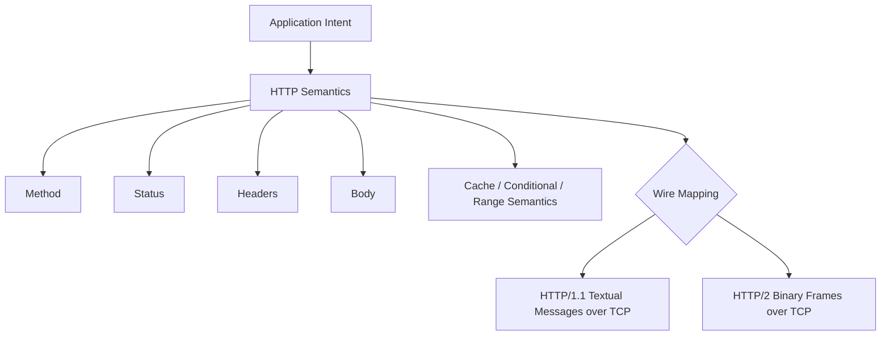

The implication is simple:

> Do not use HTTP/2 as a substitute for good API semantics.

If your endpoint is non-idempotent, retry-unsafe, and lacks deadline handling, HTTP/2 does not fix it.

---

## 2. HTTP/1.1 Mental Model

HTTP/1.1 is simple to reason about operationally.

At the wire level, each connection carries a sequence of request/response exchanges. Persistent connections allow reuse, so the client does not need to perform TCP/TLS setup for every request.

The usual production model is:

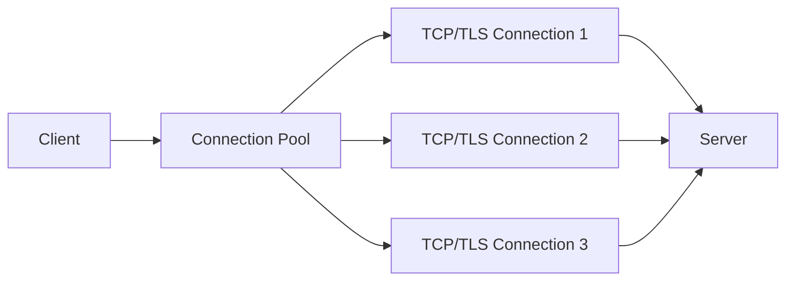

Each connection is mostly occupied by one in-flight request/response at a time in mainstream client/proxy behavior. HTTP/1.1 pipelining exists historically, but it is rarely relied on in modern production service-to-service designs because it creates ordering and head-of-line blocking concerns and has inconsistent support across intermediaries.

So, in practice:

- concurrency is achieved by opening multiple connections;
- pool size controls maximum parallelism per destination;
- each slow response occupies one connection;
- many small requests can create many sockets;
- TLS handshake cost is amortized through keep-alive;
- operational behavior is easy to inspect with classic logs and packet tooling.

HTTP/1.1 is not primitive. It is often the right answer for internal APIs with moderate concurrency and simple request/response flows.

### 2.1 Strengths of HTTP/1.1

HTTP/1.1 is attractive because it has mature, predictable behavior.

| Strength | Why it matters |
|---|---|
| Simplicity | Easier debugging and mental model. |
| Widespread support | Every proxy, gateway, load balancer, servlet container, and client understands it. |
| Failure isolation per connection | A bad connection affects limited in-flight work. |
| Easy pool-based concurrency | Pool size is an intuitive capacity control. |
| Operational familiarity | Mature metrics, logs, tracing, and troubleshooting patterns. |

For many internal Java systems, HTTP/1.1 plus correct timeouts, retries, idempotency keys, and connection pooling is more reliable than a poorly understood HTTP/2 rollout.

### 2.2 Weaknesses of HTTP/1.1

The weaknesses appear when concurrency rises.

| Weakness | Consequence |
|---|---|
| Many parallel requests require many connections | More sockets, TLS state, file descriptors, ephemeral ports, and load balancer state. |
| Per-connection sequential behavior | Slow response can occupy a connection while other work waits for another connection. |
| Repeated headers | Larger overhead for many small calls with rich metadata. |
| Pool pressure | If the pool is exhausted, callers queue before even sending requests. |
| Connection storm risk | Many instances scaling up can open many connections simultaneously. |

The most important production smell is this:

> The service has low business latency, but high client-side pool wait time.

That means the bottleneck is not the callee business logic. The bottleneck is the caller's ability to acquire transport capacity.

---

## 3. HTTP/2 Mental Model

HTTP/2 changes the wire model.

Instead of a textual request/response stream per connection, HTTP/2 uses binary frames. Multiple logical streams can be multiplexed over the same TCP connection.

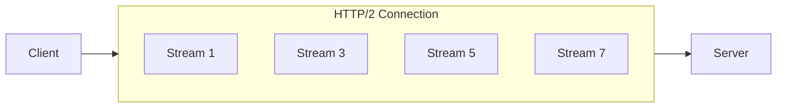

Each request/response exchange is represented as a stream. Frames from different streams can be interleaved on the same connection.

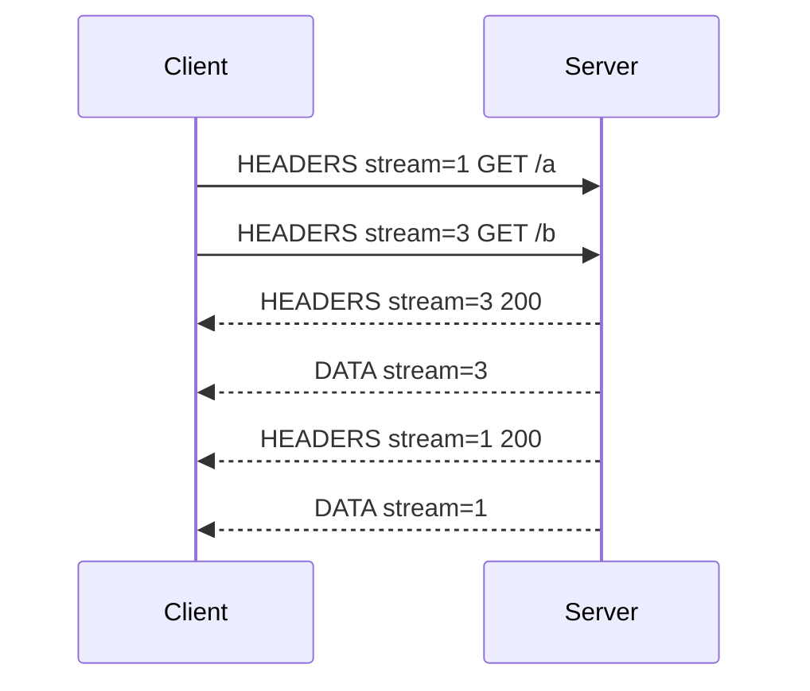

This is the main reason HTTP/2 can reduce connection count and improve latency for concurrent small requests.

### 3.1 What HTTP/2 Adds

HTTP/2 adds several important mechanisms:

| Mechanism | Meaning |
|---|---|
| Binary framing | HTTP messages are split into typed frames. |
| Multiplexed streams | Multiple concurrent request/response exchanges on one connection. |
| Header compression | Header fields are compressed using HPACK. |
| Flow control | Receiver can control how much data is sent on streams and connections. |
| SETTINGS | Peers negotiate protocol parameters such as concurrent stream limits. |
| PING | Liveness and round-trip measurement at protocol level. |
| GOAWAY | Graceful connection shutdown signal. |
| Stream reset | A stream can be cancelled without necessarily closing the connection. |

This makes HTTP/2 more sophisticated than HTTP/1.1.

Sophisticated does not automatically mean safer.

It means more hidden state.

---

## 4. The Biggest Difference: Connection-Level vs Stream-Level Thinking

In HTTP/1.1, you usually think in connections.

In HTTP/2, you must think in streams inside connections.

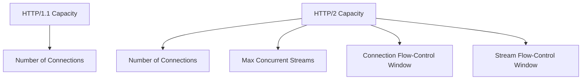

A common production mistake is to migrate to HTTP/2 and keep only the old metric:

```text
http.client.connections.active
```

That is not enough.

For HTTP/2 you also need:

- active streams per connection;
- pending streams waiting for concurrency limit;
- stream reset count;
- GOAWAY count;
- connection-level flow-control stalls;
- stream-level flow-control stalls;
- max concurrent stream limit observed from server;
- protocol version actually negotiated;
- response latency split by route and protocol version.

HTTP/2 moves some bottlenecks from socket count to stream scheduling and flow control.

---

## 5. Head-of-Line Blocking: Be Precise

People often say:

> HTTP/2 fixes head-of-line blocking.

That statement is half true and half dangerous.

HTTP/2 improves HTTP-layer head-of-line blocking because responses from different streams can be interleaved. A slow response on stream 1 does not need to block response frames for stream 3 at the HTTP layer.

But HTTP/2 still runs over TCP. TCP provides ordered byte delivery. If a TCP segment is lost, later bytes on that TCP connection cannot be delivered to the HTTP/2 layer until the missing bytes are retransmitted.

So:

- HTTP/2 reduces application/message-level blocking compared to practical HTTP/1.1 connection usage;
- HTTP/2 does not remove TCP-level head-of-line blocking;
- a single bad TCP connection can affect many multiplexed streams;
- packet loss can hurt many in-flight requests sharing the same connection.

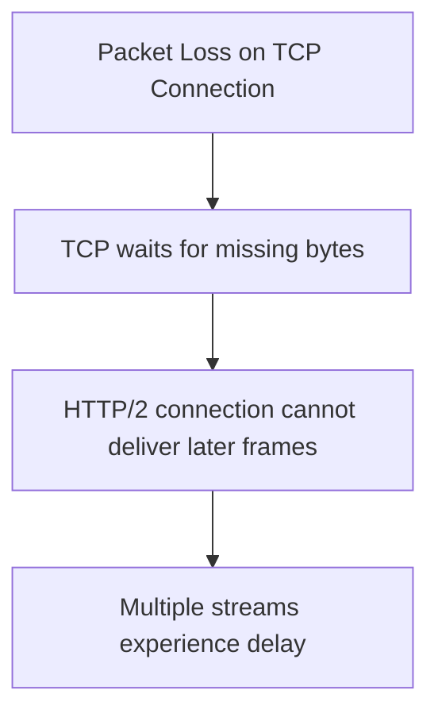

This is one reason HTTP/2 can look excellent inside a clean data-center network but less impressive across lossy links.

For internal microservices inside one cluster or region, packet loss may be low enough that HTTP/2 is a net win. Across unreliable networks, you must measure.

---

## 6. Header Compression: Useful, but Not Free

HTTP/2 compresses headers using HPACK.

This matters because internal microservice calls often carry many headers:

- authorization token;
- correlation ID;
- trace context;
- baggage;
- tenant ID;
- locale;
- request ID;
- idempotency key;
- feature flags;
- client version;
- content type;
- accept type.

In HTTP/1.1, repeated headers are sent as text for each request.

In HTTP/2, header compression can reduce overhead significantly for many small requests.

But header compression introduces state and risk:

- compression tables consume memory;
- large or high-cardinality headers can reduce compression efficiency;
- excessive metadata propagation can become a performance and privacy problem;
- intermediaries may impose header list size limits;
- dynamic header compression state makes debugging less transparent at packet level.

The practical rule:

> Use HTTP/2 header compression as efficiency, not as permission to propagate unbounded metadata.

Keep metadata propagation explicit and minimal.

---

## 7. Flow Control: The Hidden Backpressure Layer

HTTP/2 has flow control at two levels:

1. connection-level flow control;
2. stream-level flow control.

This allows a receiver to avoid being overwhelmed by too much data.

For microservices, this is useful but easy to misunderstand.

Imagine Service A calls Service B with 100 concurrent streams on one HTTP/2 connection. If one response is a large payload and the client is slow to consume it, flow-control windows can influence how data is delivered.

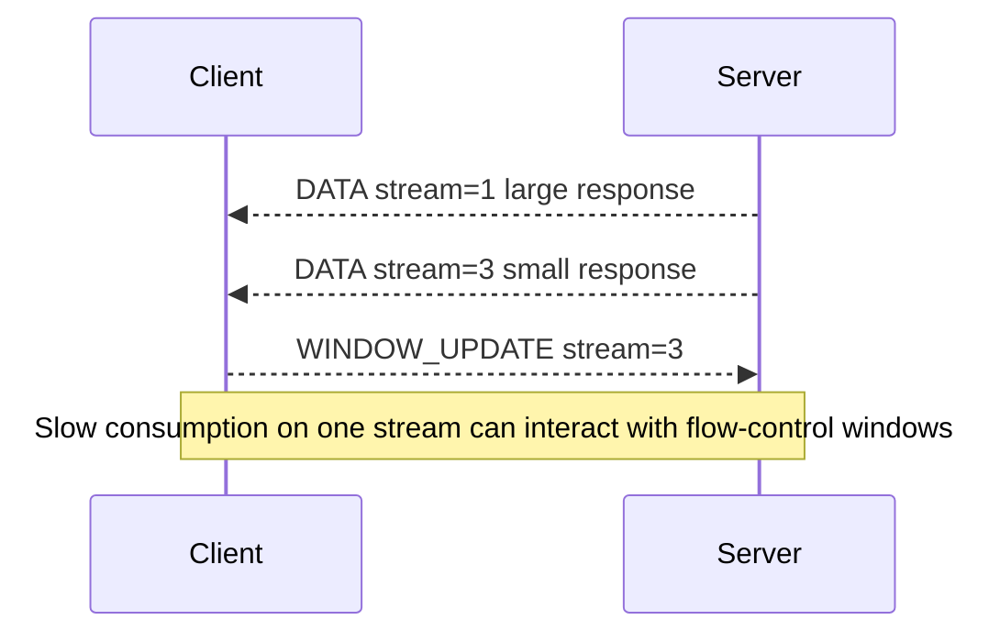

Operationally, flow control means:

- client must consume response bodies promptly;
- streaming responses must not be ignored;
- cancellation must reset streams when work is no longer needed;
- large downloads can interfere with small calls if sharing the same connection and limits are poor;
- observability should distinguish server latency from client read/consume latency.

A common bug:

```java
HttpResponse<InputStream> response = client.send(request, HttpResponse.BodyHandlers.ofInputStream());

// Bug: caller checks status but does not consume or close the body.
if (response.statusCode() == 404) {
    return Optional.empty();
}
```

The body stream must be consumed or closed according to the client library's contract. Otherwise the connection or stream may not be reusable promptly.

A safer pattern:

```java
try (InputStream body = response.body()) {
    if (response.statusCode() == 404) {
        body.transferTo(OutputStream.nullOutputStream());
        return Optional.empty();
    }

    return parse(body);
}
```

For small JSON responses, prefer body handlers that fully consume the body into a bounded representation.

---

## 8. SETTINGS and Max Concurrent Streams

HTTP/2 peers exchange SETTINGS frames.

One important setting is the maximum number of concurrent streams allowed.

This matters because developers sometimes assume:

> HTTP/2 means unlimited concurrency on one connection.

No.

The server may advertise a limit such as 100 concurrent streams. If the client wants 500 concurrent requests, it must either queue streams, open additional connections if the client supports that strategy, or fail fast depending on policy.

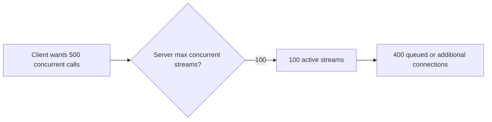

Your capacity model must include:

```text
effective_capacity_per_destination = connections * max_concurrent_streams_per_connection
```

But do not blindly increase both numbers.

Higher concurrency can overload the callee faster.

The right capacity is the amount of concurrency the downstream can handle while staying within SLO and preserving recovery headroom.

---

## 9. GOAWAY: Graceful Shutdown Is Not an Error by Itself

HTTP/2 uses GOAWAY to signal that a connection is being gracefully shut down.

A server or proxy can send GOAWAY to tell the client no new streams should be created on that connection. Existing streams up to a certain stream ID may continue.

In microservices, GOAWAY appears during:

- server deploys;
- proxy reloads;
- connection draining;
- load balancer lifecycle events;
- idle connection management;
- max connection age policies.

A naive client treats GOAWAY as a scary failure.

A production client treats it as a connection lifecycle event:

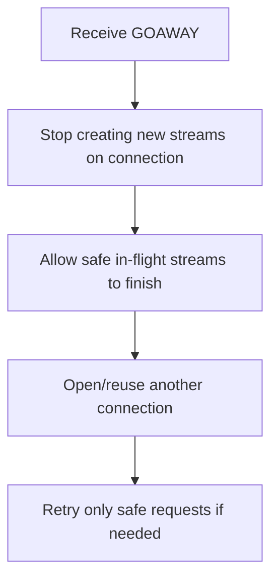

Important:

> GOAWAY handling does not remove the need for idempotency and retry classification.

If a request's outcome is unknown, the client must know whether retry is safe.

---

## 10. PING: Liveness Is Not Readiness

HTTP/2 supports PING frames.

PING can measure whether the connection is alive and estimate round-trip time.

But PING does not prove that the application is healthy.

A server can respond to PING while:

- business thread pools are exhausted;
- database pool is saturated;
- downstream dependency is unavailable;
- request queue is full;
- application-level latency is breaching SLO.

So PING is useful for connection liveness, but it is not a replacement for:

- application health checks;
- route-level latency metrics;
- saturation metrics;
- error budget monitoring;
- overload signals.

---

## 11. Server Push: Usually Avoid for Microservices

HTTP/2 includes server push via PUSH_PROMISE.

For browser workloads, server push was intended to let servers proactively send resources. In service-to-service communication, it is rarely a good fit.

Reasons:

- internal APIs should be explicit;
- pushed data complicates authorization and auditability;
- cache interaction is hard;
- client libraries and intermediaries vary in support;
- it can waste bandwidth if the client does not need the pushed resource;
- many ecosystems have moved away from relying on server push for practical production benefits.

For Java microservices, prefer explicit APIs or event-driven communication instead of HTTP/2 server push.

---

## 12. Protocol Negotiation: What You Think You Use vs What You Actually Use

A production trap:

> The client is configured for HTTP/2, but the actual path uses HTTP/1.1 somewhere.

This can happen because of:

- TLS ALPN negotiation result;
- gateway or load balancer configuration;
- service mesh sidecar behavior;
- ingress/egress proxy downgrade;
- server connector configuration;
- cleartext h2c not supported on the path;
- client fallback behavior.

```mermaid
flowchart LR
  A[Java Client thinks HTTP/2] --> B[Sidecar]
  B --> C[Gateway]
  C --> D[Service]

  A -. negotiated .-> B
  B -. maybe HTTP/1.1 .-> C
  C -. maybe HTTP/2 .-> D
```

You need to observe protocol version at multiple points:

- client metrics/logs;
- proxy access logs;
- gateway telemetry;
- server request attributes;
- trace attributes.

A good HTTP client metric has at least:

```text
http.client.request.duration{method, route, status_code, protocol, outcome}
http.client.connections.active{target, protocol}
http.client.streams.active{target, protocol}
http.client.streams.pending{target, protocol}
```

Without protocol labels, you cannot know if an observed latency improvement or regression is related to HTTP/2.

---

## 13. Java Client Reality

### 13.1 JDK HttpClient

The JDK `java.net.http.HttpClient` supports HTTP/1.1 and HTTP/2 in Java versions commonly used in enterprise services such as Java 17, 21, and 25. A client or request can express a preferred version.

Example:

```java
HttpClient client = HttpClient.newBuilder()
    .version(HttpClient.Version.HTTP_2)
    .connectTimeout(Duration.ofMillis(300))
    .build();

HttpRequest request = HttpRequest.newBuilder()
    .uri(URI.create("https://catalog.internal/items/sku-123"))
    .timeout(Duration.ofMillis(800))
    .GET()
    .build();

HttpResponse<String> response = client.send(
    request,
    HttpResponse.BodyHandlers.ofString()
);
```

Important nuance:

- the selected version is a preference, not a guarantee;
- server and TLS negotiation must support it;
- an intermediary may change protocol between hops;
- the API hides many connection-management details;
- for advanced pool, routing, and resilience policies, teams often wrap the client behind their own client boundary or choose a richer client.

A production wrapper should record the final observed protocol version when the library exposes it.

```java
record DownstreamHttpResult(
    int status,
    HttpClient.Version protocolVersion,
    Duration duration,
    String body
) {}
```

### 13.2 Spring RestClient

Spring `RestClient` is a synchronous HTTP abstraction. Its HTTP/2 behavior depends on the underlying request factory/client configuration.

Do not assume:

```text
Using Spring = using HTTP/2
```

You must verify the underlying client.

### 13.3 Spring WebClient

Spring `WebClient` is commonly backed by Reactor Netty. HTTP/2 support requires explicit server/client/proxy/TLS configuration. It is powerful, but it also means you must understand event loops, backpressure, body consumption, and connection provider settings.

Do not combine:

- unbounded concurrency;
- large response bodies;
- missing timeout budgets;
- shared event-loop starvation;
- no per-route metrics.

That combination can fail impressively.

### 13.4 Apache HttpClient, OkHttp, Jetty Client

Other Java HTTP clients can support HTTP/2, but capability varies by version and configuration.

The selection criteria should not be "supports HTTP/2" alone.

Evaluate:

- timeout model;
- connection pool controls;
- HTTP/2 stream controls;
- TLS/ALPN support;
- observability hooks;
- integration with OpenTelemetry;
- cancellation behavior;
- body streaming behavior;
- maintenance maturity;
- compatibility with your framework.

---

## 14. Server-Side Reality in Java

Java services may run on:

- Tomcat;
- Jetty;
- Undertow;
- Netty;
- Spring Boot embedded containers;
- Quarkus/Vert.x;
- Micronaut/Netty;
- Jakarta EE servers.

HTTP/2 support is not only a framework checkbox. You must verify:

- TLS configuration;
- ALPN support;
- connector settings;
- reverse proxy behavior;
- max concurrent streams;
- initial window size;
- header list size;
- request body limits;
- idle timeout;
- graceful shutdown behavior;
- access log protocol fields.

A common deployment shape:

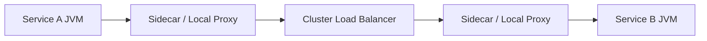

The JVM may not be speaking HTTP/2 directly to the other JVM. It may speak HTTP/1.1 to the sidecar, while the sidecar speaks HTTP/2 or mTLS to another proxy.

That is not necessarily wrong.

It just means you must know which hop owns which policy.

---

## 15. Load Balancing Differences

HTTP/1.1 load balancing is often connection-oriented or request-oriented depending on the proxy.

HTTP/2 multiplexing changes the distribution model. Many requests can ride one connection. If a load balancer assigns one long-lived HTTP/2 connection to one backend, many streams may concentrate on that backend unless the proxy performs request-level balancing upstream.

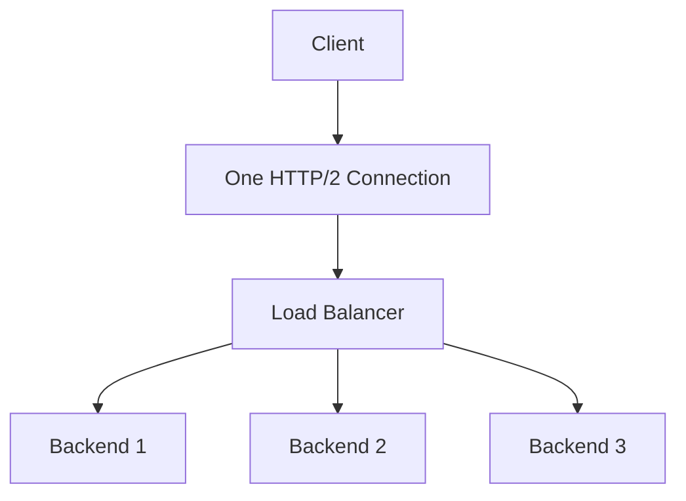

Depending on implementation, streams may not automatically spread the way you expect.

Questions to ask:

- Is balancing per connection or per request/stream?
- Does the proxy terminate HTTP/2 and open separate upstream connections?
- Are upstream connections HTTP/1.1 or HTTP/2?
- Does the mesh/gateway enforce max connection age to rebalance?
- Can endpoint changes drain old connections?
- Are there metrics for backend distribution by route?

HTTP/2 can improve efficiency while making load distribution less intuitive.

---

## 16. Latency Model: When HTTP/2 Helps

HTTP/2 commonly helps when:

- there are many concurrent small requests to the same origin;
- TLS handshake overhead and connection count are meaningful;
- headers are large and repeated;
- network is stable and low-loss;
- the client and server both handle multiplexing well;
- intermediaries preserve HTTP/2 behavior;
- response bodies are small or moderately sized;
- concurrency is controlled.

Example: a profile page aggregator calls a catalog service 30 times for item summaries. With HTTP/1.1, that may require many pooled connections. With HTTP/2, those calls can share fewer connections and multiplex streams.

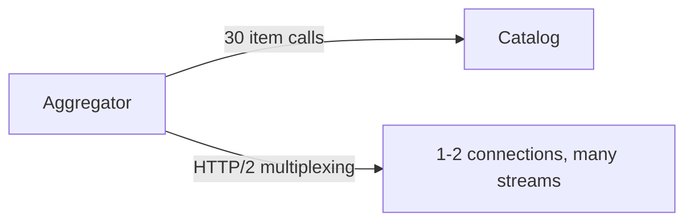

But the better design may be a bulk endpoint, not blindly increasing protocol-level concurrency.

Protocol improvement should not hide API shape problems.

---

## 17. Latency Model: When HTTP/2 May Not Help

HTTP/2 may not improve much when:

- each service performs one request at a time;
- latency is dominated by database or business processing;
- payloads are large;
- there is packet loss on shared TCP connection;
- max concurrent streams is low;
- the client queues streams internally;
- the gateway downgrades to HTTP/1.1;
- connection-level flow control becomes a bottleneck;
- load balancing becomes uneven;
- observability is insufficient.

A bad migration looks like this:

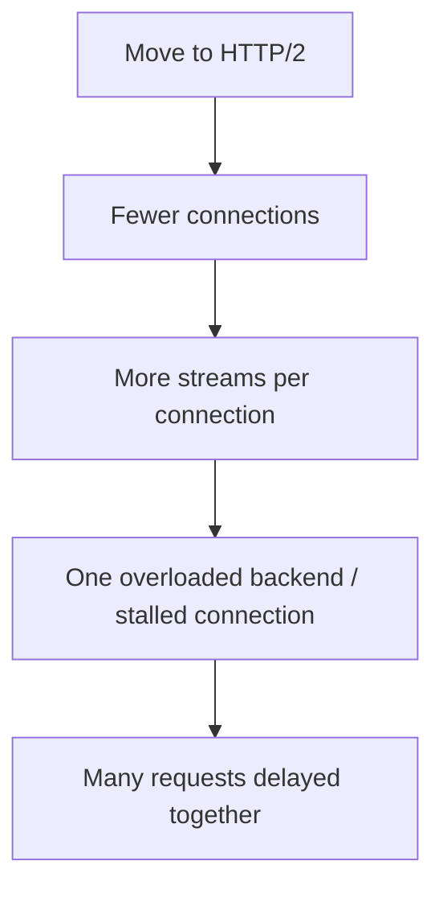

The outcome is not "HTTP/2 is bad".

The outcome is:

> We changed the concurrency and failure-sharing model without updating our capacity and observability model.

---

## 18. HTTP/1.1 vs HTTP/2 Decision Matrix

| Scenario | Prefer | Reason |
|---|---|---|
| Simple internal CRUD with moderate concurrency | HTTP/1.1 is fine | Simpler and easier to operate. |
| High fan-out to same service with many small requests | Consider HTTP/2 | Multiplexing and header compression can reduce connection pressure. |
| Large file transfer mixed with small latency-sensitive calls | Separate clients or routes | Avoid large payloads interfering with small calls. Protocol alone is not enough. |
| Unreliable/lossy network path | Measure carefully | HTTP/2 still shares TCP-level HOL blocking. |
| Strict proxy compatibility required | HTTP/1.1 or validated HTTP/2 | Intermediaries determine actual behavior. |
| Service mesh owns mTLS and upstream protocol | Depends on mesh config | JVM may not need direct HTTP/2. |
| Need bidirectional typed streaming | gRPC may be better | gRPC uses HTTP/2 but gives stronger RPC semantics. |
| Browser-facing edge | Depends | HTTP/2 often useful, but this series focuses internal service calls. |

---

## 19. Practical Rollout Plan

Do not roll out HTTP/2 by flipping a global switch.

Roll it out as an engineering change.

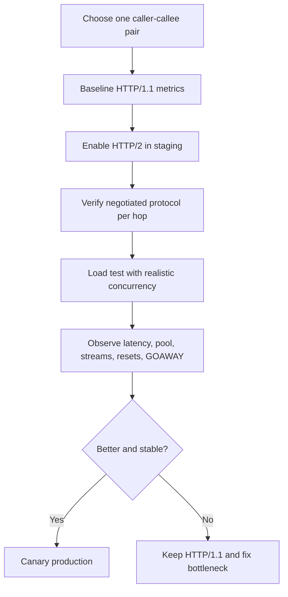

Baseline before migration:

- p50/p95/p99 latency per route;
- connect latency;
- TLS handshake count;
- active connections;
- pending pool acquisition;
- request rate;
- response size;
- error rate;
- retry count;
- downstream saturation;
- backend distribution.

Additional HTTP/2 metrics:

- active streams;
- pending streams;
- stream resets;
- GOAWAY events;
- max concurrent streams;
- protocol negotiation result;
- connection flow-control stalls;
- large response interference.

---

## 20. Java Implementation Pattern: Protocol-Aware Client Boundary

Do not scatter HTTP version decisions across business code.

Create a client boundary.

```java
public interface CatalogClient {
    Optional<CatalogItem> findItem(String sku, RequestContext context);
}
```

Implementation owns protocol behavior:

```java
public final class HttpCatalogClient implements CatalogClient {
    private final HttpClient httpClient;
    private final URI baseUri;
    private final Duration timeout;

    public HttpCatalogClient(URI baseUri, Duration timeout) {
        this.baseUri = baseUri;
        this.timeout = timeout;
        this.httpClient = HttpClient.newBuilder()
            .version(HttpClient.Version.HTTP_2)
            .connectTimeout(Duration.ofMillis(250))
            .build();
    }

    @Override
    public Optional<CatalogItem> findItem(String sku, RequestContext context) {
        HttpRequest request = HttpRequest.newBuilder()
            .uri(baseUri.resolve("/internal/catalog/items/" + URLEncoder.encode(sku, StandardCharsets.UTF_8)))
            .timeout(timeout)
            .header("Accept", "application/json")
            .header("traceparent", context.traceparent())
            .GET()
            .build();

        try {
            long start = System.nanoTime();
            HttpResponse<String> response = httpClient.send(request, HttpResponse.BodyHandlers.ofString());
            Duration elapsed = Duration.ofNanos(System.nanoTime() - start);

            recordMetric(response.version(), response.statusCode(), elapsed);

            if (response.statusCode() == 404) {
                return Optional.empty();
            }
            if (response.statusCode() >= 500) {
                throw new DownstreamUnavailableException("catalog returned " + response.statusCode());
            }
            if (response.statusCode() >= 400) {
                throw new DownstreamRejectedException("catalog rejected request: " + response.statusCode());
            }

            return Optional.of(parseCatalogItem(response.body()));
        } catch (HttpTimeoutException e) {
            throw new DownstreamTimeoutException("catalog timed out", e);
        } catch (IOException e) {
            throw new DownstreamTransportException("catalog transport failure", e);
        } catch (InterruptedException e) {
            Thread.currentThread().interrupt();
            throw new DownstreamInterruptedException("catalog call interrupted", e);
        }
    }
}
```

Notice the boundary records the actual response version.

That lets you answer:

> Did this request actually use HTTP/2?

---

## 21. Separate Clients for Different Workload Shapes

With HTTP/2, one connection can carry many streams. That is powerful, but it can create unfair sharing between workload classes.

Do not necessarily use one client for everything.

Consider separate client instances or connection providers for:

- low-latency small reads;
- large report downloads;
- long polling;
- streaming endpoints;
- high-priority commands;
- background reconciliation traffic.

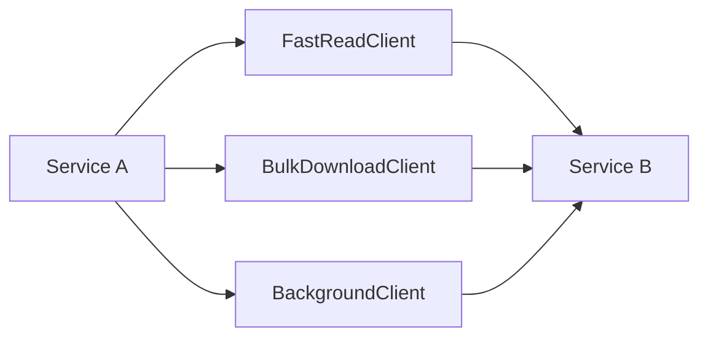

This is not premature complexity. It is workload isolation.

A single shared HTTP/2 connection pool can become a noisy-neighbor mechanism.

---

## 22. HTTP/2 and gRPC

gRPC commonly uses HTTP/2 as its transport.

But HTTP/2 REST-ish JSON APIs and gRPC APIs are not the same operational model.

gRPC adds:

- protobuf service definitions;
- RPC method model;
- unary and streaming call types;
- deadlines;
- cancellation;
- status codes;
- interceptors;
- metadata;
- generated stubs;
- channel behavior.

So do not say:

> We use HTTP/2, therefore we have gRPC-like behavior.

You do not.

HTTP/2 gives transport features. gRPC gives an RPC framework and programming model on top.

This distinction becomes central in Part 049 onward.

---

## 23. Anti-Patterns

### Anti-Pattern 1: HTTP/2 as Performance Magic

Wrong:

```text
Latency is high. Enable HTTP/2.
```

Better:

```text
Find whether latency is caused by connection setup, pool wait, queueing, downstream CPU, downstream DB, payload size, retries, or network loss.
```

### Anti-Pattern 2: No Protocol Observability

Wrong:

```text
We enabled HTTP/2 in config, so we use HTTP/2.
```

Better:

```text
Measure negotiated protocol on client, proxy, and server hops.
```

### Anti-Pattern 3: One Shared Client for Every Workload

Wrong:

```text
All outbound calls use the same HTTP/2 connection provider.
```

Better:

```text
Separate latency-sensitive, streaming, large-payload, and background traffic when needed.
```

### Anti-Pattern 4: Ignoring Max Concurrent Streams

Wrong:

```text
One HTTP/2 connection can handle all concurrency.
```

Better:

```text
Capacity = connection count * stream concurrency, constrained by downstream SLO and overload policy.
```

### Anti-Pattern 5: Treating GOAWAY as Business Failure

Wrong:

```text
GOAWAY means service failed.
```

Better:

```text
GOAWAY is connection lifecycle. Retry only if semantic safety allows it.
```

---

## 24. Checklist: HTTP/2 Readiness for Internal Java Calls

Before enabling HTTP/2 on a service path, answer these:

```text
[ ] Do we know the actual protocol per hop?
[ ] Does the client expose negotiated protocol version?
[ ] Do we have per-route latency metrics?
[ ] Do we have active stream and pending stream metrics?
[ ] Do we know max concurrent streams?
[ ] Are timeout budgets already correct?
[ ] Are retries limited and idempotency-aware?
[ ] Are large payload routes isolated?
[ ] Do proxies preserve or terminate HTTP/2 intentionally?
[ ] Does load balancing remain fair under long-lived connections?
[ ] Do we handle GOAWAY gracefully?
[ ] Do we handle stream reset/cancellation correctly?
[ ] Do we test under realistic concurrency, payload size, and packet loss?
```

If many answers are unknown, HTTP/2 may still be worth adopting, but the work is not only a configuration change.

---

## 25. Production Decision Rule

Use this rule:

```text
Use HTTP/1.1 when simplicity and compatibility dominate.
Use HTTP/2 when connection efficiency, multiplexing, and repeated metadata overhead are real bottlenecks.
Do not use either without explicit timeout, retry, idempotency, and observability policy.
```

More concretely:

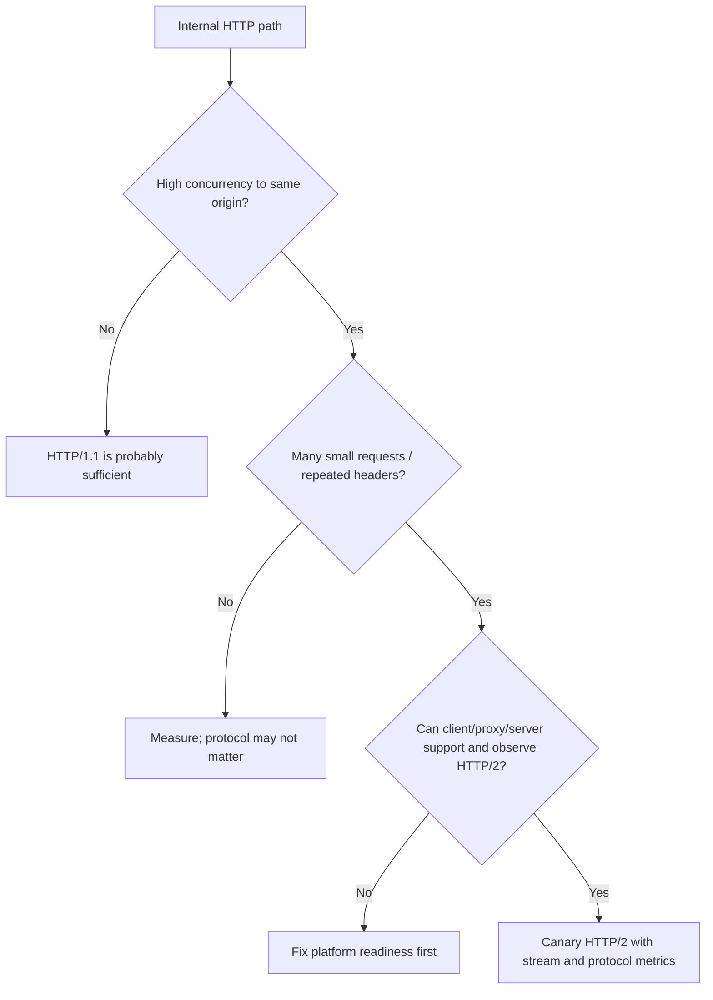

---

## 26. How This Connects to the Next Part

HTTP/2 still runs over TCP.

HTTP/3 changes that by mapping HTTP semantics over QUIC, a UDP-based transport with multiplexed streams, built-in TLS integration, and different connection establishment and loss behavior.

That sounds attractive.

But for internal Java microservices, the HTTP/3 decision is even more context-sensitive than HTTP/2.

The next part explains why.

---

## References

- RFC 9110 — HTTP Semantics: https://www.rfc-editor.org/rfc/rfc9110.html
- RFC 9112 — HTTP/1.1: https://www.rfc-editor.org/rfc/rfc9112.html
- RFC 9113 — HTTP/2: https://www.rfc-editor.org/rfc/rfc9113.html
- Java SE 25 `java.net.http`: https://docs.oracle.com/en/java/javase/25/docs/api/java.net.http/module-summary.html
- OpenJDK HTTP Client introduction: https://openjdk.org/groups/net/httpclient/intro.html
- OpenTelemetry Semantic Conventions — HTTP: https://opentelemetry.io/docs/specs/semconv/http/
