# Part 016 — HTTP/3 and QUIC Considerations for Microservices

HTTP/3 is not "HTTP/2 plus a bigger number".

HTTP/3 maps HTTP semantics over QUIC instead of TCP. QUIC itself runs over UDP and provides streams, flow control, connection establishment, TLS integration, and loss recovery behavior at the transport layer.

That shift matters.

But for internal Java microservices, the decision to adopt HTTP/3 should be conservative and evidence-driven.

The wrong adoption reason is:

> HTTP/3 is newer, therefore internal services should use it.

The better adoption reason is:

> We have a specific communication path where QUIC's properties improve measurable latency, reliability, or connection continuity, and our platform can observe and operate it safely.

This part gives you the mental model and decision framework.

---

## 1. HTTP/3 in One Sentence

HTTP/3 is HTTP semantics mapped onto QUIC.

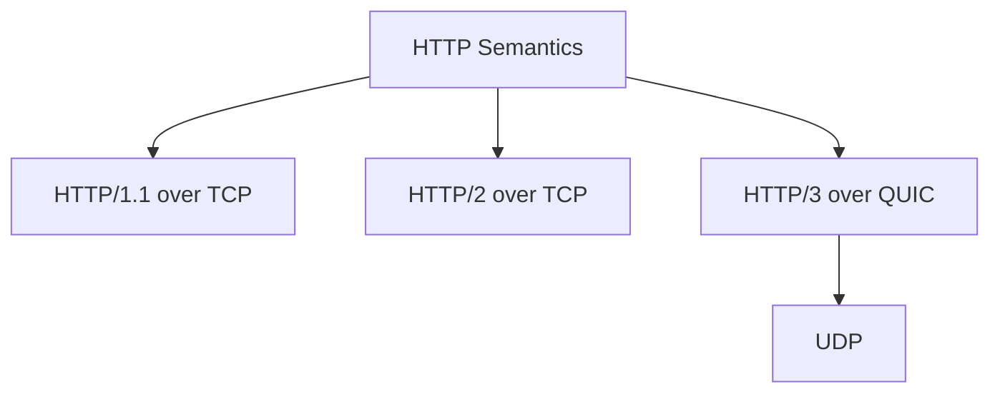

The application still works with familiar HTTP concepts:

- methods;
- status codes;
- headers;
- request bodies;
- response bodies;
- redirects;
- caching semantics;
- error semantics.

The transport changes underneath.

HTTP/3 delegates stream lifetime and flow control to QUIC and uses a binary framing model similar in spirit to HTTP/2, but not identical.

---

## 2. QUIC Mental Model

QUIC is a secure, general-purpose transport protocol over UDP.

It provides:

- connection-oriented communication;
- encrypted transport by design;
- multiplexed streams;
- per-stream reliable ordered delivery;
- flow control;
- low-latency connection establishment;
- connection IDs;
- network path migration;
- loss detection and congestion control.

A simplified model:

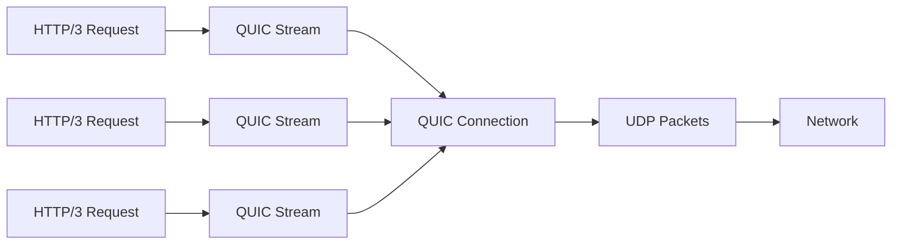

The key idea:

> QUIC gives HTTP/3 multiplexed streams without TCP's connection-wide ordered byte-stream delivery problem.

That does not mean QUIC has no head-of-line blocking anywhere. Each stream still has ordered delivery for that stream. But loss on one stream does not necessarily block delivery of data for other streams in the same way TCP-level byte ordering can affect HTTP/2 streams on one TCP connection.

---

## 3. Why QUIC Uses UDP

QUIC runs over UDP not because UDP is magically faster, but because UDP gives QUIC space to implement transport behavior in user space without waiting for operating system TCP stack changes.

That enables QUIC to provide features such as:

- integrated TLS handshake;
- connection migration;
- stream multiplexing independent of TCP byte-stream ordering;
- faster protocol evolution;
- different packetization and loss recovery behavior.

But UDP also introduces operational realities:

- some networks block or degrade UDP;
- firewalls and corporate networks may treat UDP differently;
- load balancers need explicit UDP support;
- observability tooling may be weaker than for TCP;
- kernel/network tuning differs;
- service meshes and sidecars may not support HTTP/3 end-to-end;
- middleboxes may behave unpredictably.

So the production question is not only:

```text
Does the application library support HTTP/3?
```

It is:

```text
Does the full path support UDP/QUIC observably, securely, and reliably?
```

---

## 4. HTTP/2 vs HTTP/3: The Real Difference

HTTP/2 and HTTP/3 both support multiplexed streams.

The big difference is where multiplexing lives.

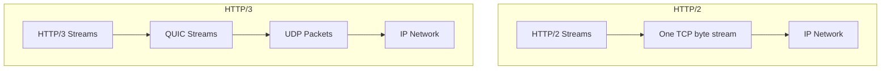

In HTTP/2:

- streams are multiplexed at HTTP/2 layer;
- all stream frames ride one TCP byte stream;
- TCP provides ordered delivery for bytes on the connection;
- packet loss can delay later bytes for all streams on that connection.

In HTTP/3:

- streams are managed by QUIC;
- QUIC packet loss recovery can avoid some cross-stream blocking;
- TLS is integrated into QUIC;
- connection identity can survive some network path changes;
- UDP path support becomes essential.

For browser/mobile/edge workloads, that can be very valuable.

For stable intra-cluster microservice calls, the value is less automatic.

---

## 5. Where HTTP/3 Can Help

HTTP/3 can help when the communication path has one or more of these properties:

| Situation | Why HTTP/3/QUIC may help |
|---|---|
| Mobile clients switching networks | QUIC connection migration can preserve connection identity across path changes. |
| High latency networks | Lower connection establishment overhead can matter. |
| Packet loss affects multiplexed HTTP/2 streams | QUIC's stream handling may reduce cross-stream impact. |
| Edge traffic at internet scale | HTTP/3 is increasingly relevant at CDN and browser edge. |
| Many short-lived secure connections | Faster handshake behavior can help. |
| Platform already has mature QUIC observability | Adoption risk is lower. |

In internal microservices, the most plausible value is usually at boundaries:

- edge gateway to clients;
- API gateway to external consumers;
- mobile or browser-facing APIs;
- cross-region calls over less predictable networks;
- high-latency interconnects;
- traffic where connection setup dominates.

Inside a Kubernetes cluster with low packet loss and persistent connections, HTTP/2 or HTTP/1.1 may already be sufficient.

---

## 6. Where HTTP/3 May Not Help

HTTP/3 may not help when:

- latency is dominated by service processing or database time;
- calls already use persistent connections effectively;
- packet loss is negligible;
- the path is fully inside a reliable data-center network;
- proxies terminate HTTP/3 at the edge and downgrade internally;
- operational tooling cannot inspect QUIC well;
- firewall or network policy makes UDP unreliable;
- the service mesh does not support it end-to-end;
- the team lacks rollout and incident experience with QUIC.

A common mistake:

```text
p99 is high -> use HTTP/3
```

Better:

```text
p99 is high -> decompose latency: queueing, client pool wait, connect, TLS, request send, server processing, response transfer, retries, GC, downstream calls, packet loss.
```

Only choose HTTP/3 if the bottleneck is in the area HTTP/3 can realistically improve.

---

## 7. Connection Establishment

HTTP/1.1 and HTTP/2 over TLS normally require TCP connection setup and TLS negotiation. HTTP/3 uses QUIC with integrated TLS 1.3.

A simplified comparison:

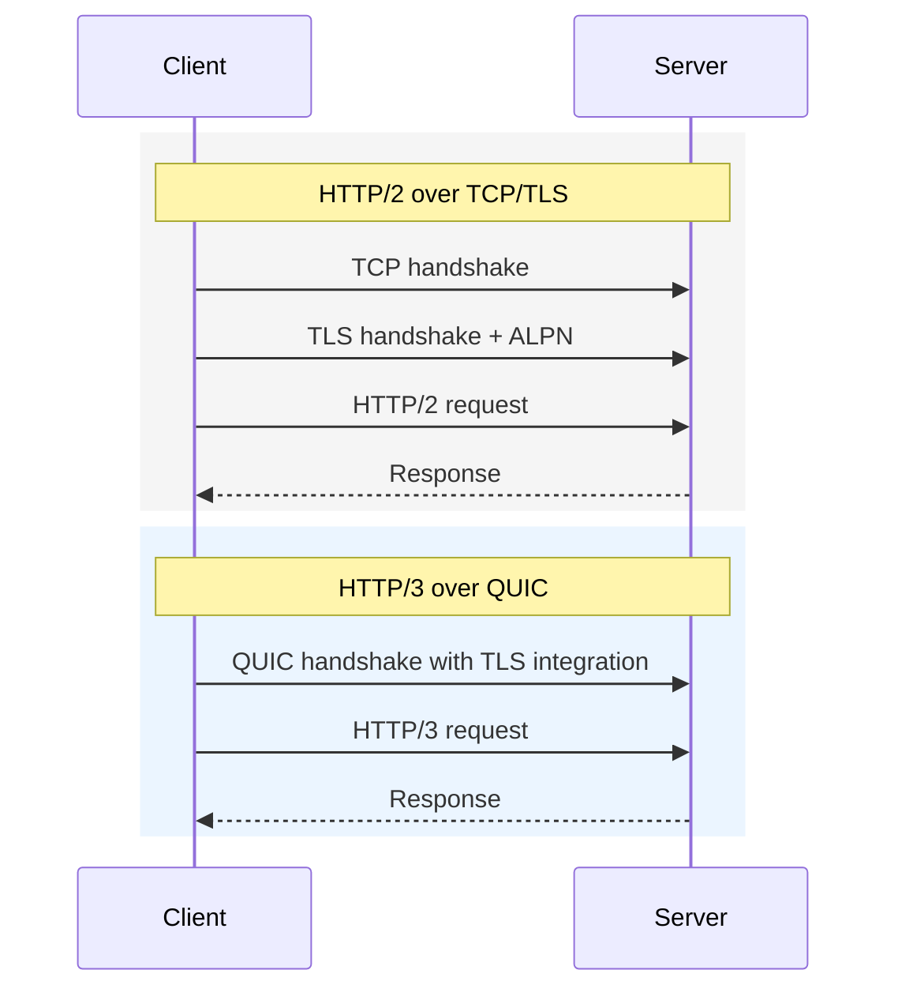

For long-lived internal connections, handshake savings may be irrelevant because connections are reused.

For short-lived or frequently reconnecting clients, handshake behavior matters more.

Production question:

```text
How often do we establish new connections on this path?
```

If the answer is "rarely", HTTP/3 handshake improvements may not move your SLO.

---

## 8. Connection Migration

QUIC uses connection IDs that can allow a connection to survive changes in network path.

This is valuable for clients that move between networks:

- mobile device switches from Wi-Fi to cellular;
- laptop moves between networks;
- NAT rebinding occurs;
- client IP/port changes.

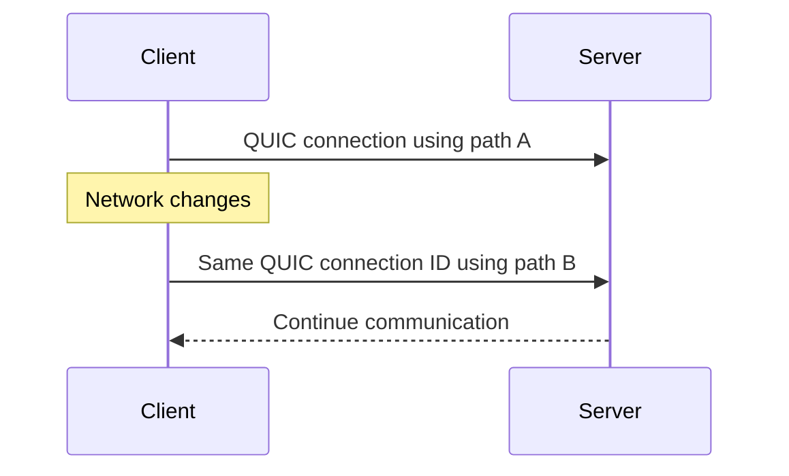

For server-to-server communication inside a cluster, network path migration is usually less valuable. Pods and nodes do move, but service-to-service traffic is typically handled by service discovery, load balancing, connection draining, and retries rather than preserving a single connection identity across client network changes.

So connection migration is a strong argument for client-facing traffic, not automatically for internal JVM-to-JVM calls.

---

## 9. Security Model

HTTP/3 relies on QUIC, and QUIC includes security measures to provide confidentiality and integrity. TLS is not optional in the same way cleartext HTTP/1.1 can exist inside some internal networks.

That is good for security posture, but it changes operations.

You must account for:

- certificate lifecycle;
- ALPN negotiation;
- key logging/debug constraints;
- mTLS termination points;
- service mesh compatibility;
- gateway termination;
- packet capture limitations;
- UDP firewall policy;
- load balancer support.

In service mesh environments, the critical question is:

```text
Where does TLS/QUIC terminate?
```

Possible shapes:

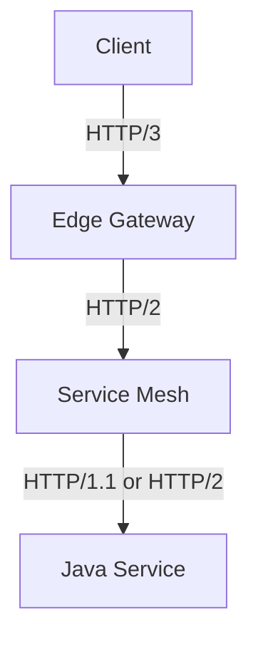

or:

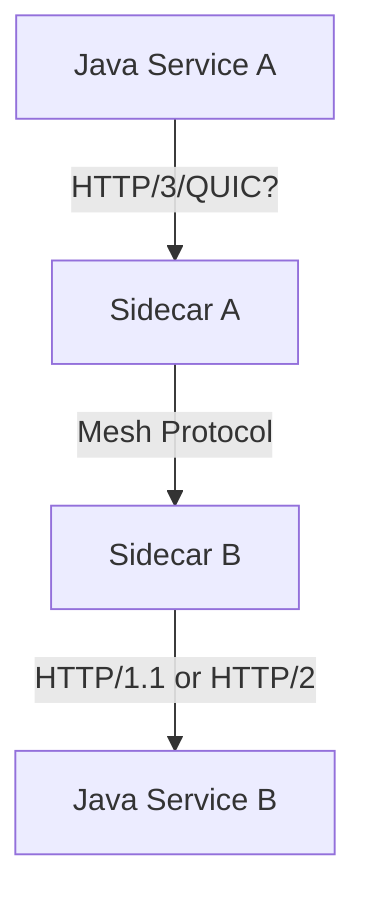

In many deployments, the Java service may never speak HTTP/3 directly even if the edge supports it.

That can be perfectly acceptable.

The goal is not protocol purity. The goal is reliable communication.

---

## 10. Java Support Reality

The Java platform historically introduced the standard HTTP Client API in Java 11 with HTTP/1.1 and HTTP/2 support. HTTP/3 support for the standard HTTP Client API is associated with JDK 26 through JEP 517.

That creates a practical split:

| Runtime baseline | Practical implication |
|---|---|
| Java 17 LTS | Standard JDK client supports HTTP/1.1 and HTTP/2, not standard HTTP/3. |
| Java 21 LTS | Same practical baseline for standard client: HTTP/1.1 and HTTP/2. |
| Java 25 | Standard API still commonly treated as HTTP/1.1/HTTP/2 baseline. |
| Java 26+ | Standard HTTP Client API includes HTTP/3 support according to JEP 517/OpenJDK documentation. |

For organizations standardized on Java 17 or 21, direct HTTP/3 from application code may require:

- upgrading runtime;
- using a third-party HTTP/3-capable client;
- terminating HTTP/3 at a gateway;
- using CDN/edge HTTP/3 only;
- waiting until platform support and operational tooling mature.

Do not force a runtime upgrade solely for protocol fashion.

Upgrade when it fits the platform roadmap and the communication benefit is measurable.

---

## 11. Java Client Sketch with Version Preference

With modern JDK HTTP Client APIs, protocol version can be expressed as a preference.

Conceptually:

```java
HttpClient client = HttpClient.newBuilder()
    .connectTimeout(Duration.ofMillis(300))
    // On JDKs with HTTP/3 support, HTTP_3 may be available.
    // On Java 17/21/25, only HTTP_1_1 and HTTP_2 are available in the standard API.
    .version(HttpClient.Version.HTTP_2)
    .build();
```

The important production point is not the exact enum in one code snippet.

The important point is:

> Protocol choice must be observable and degradable.

A resilient client should know:

- preferred protocol;
- negotiated protocol;
- fallback behavior;
- error classification;
- timeout budget;
- retry eligibility;
- route-level metrics.

```java
record ProtocolObservation(
    String target,
    String preferredProtocol,
    String negotiatedProtocol,
    int statusCode,
    Duration elapsed
) {}
```

If HTTP/3 negotiation fails and the client falls back to HTTP/2, you need to know. Silent fallback is useful for availability, but dangerous for performance analysis.

---

## 12. Gateway Termination Pattern

The most common near-term production pattern is not HTTP/3 everywhere.

It is:

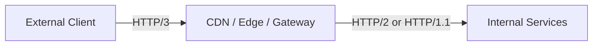

This gives external clients HTTP/3 benefits while keeping internal service communication on mature protocols.

Benefits:

- edge handles UDP/QUIC complexity;
- internal network remains TCP-based;
- Java services can stay on known runtime/client stacks;
- operational responsibility is concentrated at gateway layer;
- fallback to HTTP/2/HTTP/1.1 is easier;
- security termination is centralized.

Trade-off:

- internal hops do not get QUIC benefits;
- gateway becomes protocol translation boundary;
- end-to-end protocol semantics must be observed per hop;
- troubleshooting requires gateway-level telemetry.

This is often the best production compromise.

---

## 13. Service Mesh Implications

Service meshes commonly intercept traffic and add mTLS, routing, retries, timeouts, telemetry, and policy enforcement.

HTTP/3 complicates this because QUIC runs over UDP and encrypts transport metadata differently than classic HTTP over TCP/TLS termination patterns.

Questions to ask before internal HTTP/3:

```text
[ ] Does the mesh support UDP/QUIC traffic?
[ ] Does it terminate, proxy, or pass through HTTP/3?
[ ] Can it apply L7 policy to HTTP/3 traffic?
[ ] Can it emit route-level metrics for HTTP/3?
[ ] Can it trace HTTP/3 requests consistently?
[ ] Does mTLS policy work as expected?
[ ] How does retry/timeout policy interact with QUIC streams?
[ ] How are connection draining and deploys handled?
```

If the mesh treats QUIC as opaque UDP, then many L7 features may disappear.

That may be acceptable for some paths.

It is dangerous if you expected the mesh to enforce communication policy.

---

## 14. Load Balancing with QUIC

QUIC connection IDs allow connection continuity independent of the 4-tuple in some cases. This can help migration, but it also requires load balancers to understand how to route QUIC packets consistently.

Production concerns:

- UDP load balancer support;
- connection ID aware routing;
- stateless reset behavior;
- idle timeout behavior;
- connection draining;
- backend migration;
- NAT rebinding;
- observability per backend;
- failover semantics.

A naive UDP load-balancing setup can break QUIC behavior.

For internal microservices, ask:

> Does our load balancer understand QUIC, or is it just distributing UDP packets?

Those are not equivalent.

---

## 15. Observability Differences

HTTP/3 requires protocol-aware observability.

Classic TCP metrics are not enough.

You need visibility into:

- negotiated protocol;
- QUIC handshake latency;
- connection ID lifecycle;
- stream count;
- stream resets;
- packet loss;
- retransmission/loss recovery signals;
- UDP drops;
- fallback rate to HTTP/2;
- route-level latency;
- gateway termination behavior;
- client-side timeout reasons;
- server-side cancellation reasons.

At minimum, expose:

```text
http.client.request.duration{route, method, status_code, protocol}
http.client.request.errors{route, protocol, error_kind}
http.client.protocol.negotiated{target, protocol}
http.client.protocol.fallbacks{target, from, to}
http.client.connection.handshake.duration{target, protocol}
```

For HTTP/3-specific debugging, platform teams may need QUIC logs, qlog-compatible tooling, gateway metrics, or vendor-specific telemetry.

Without this, HTTP/3 can become a black box.

---

## 16. Failure Modes Specific to HTTP/3 Adoption

### 16.1 UDP Blocked or Degraded

Symptom:

```text
HTTP/3 works in staging but fails or falls back in certain networks.
```

Cause:

- firewall blocks UDP;
- corporate network degrades UDP;
- load balancer not configured for UDP;
- NAT timeout is too aggressive;
- intermediate network device mishandles QUIC.

Mitigation:

- maintain HTTP/2 fallback;
- measure fallback rates;
- test from realistic networks;
- validate firewall/load balancer policy.

### 16.2 Silent Downgrade Hides the Result

Symptom:

```text
We enabled HTTP/3 but no performance changed.
```

Cause:

- clients are falling back to HTTP/2;
- gateway terminates HTTP/3 only at edge;
- upstream remains HTTP/1.1;
- client library default is not HTTP/3;
- ALPN/Alt-Svc discovery not configured.

Mitigation:

- record negotiated protocol;
- inspect gateway logs;
- emit protocol labels in metrics;
- test with explicit protocol tools.

### 16.3 Mesh Policy Disappears

Symptom:

```text
Timeout/retry/authz policy no longer applies as expected.
```

Cause:

- mesh treats QUIC as opaque;
- L7 inspection unavailable;
- policy only applies to HTTP/1.1/HTTP/2 routes;
- mTLS termination changes.

Mitigation:

- validate policy behavior before rollout;
- keep HTTP/3 at gateway if mesh support is immature;
- avoid relying on invisible policy.

### 16.4 Debugging Tooling Gap

Symptom:

```text
Production incident takes longer because tcpdump and HTTP logs are less useful.
```

Cause:

- QUIC encryption and UDP transport change debugging workflow;
- fewer engineers are fluent with QUIC tools;
- vendor/proxy metrics are incomplete.

Mitigation:

- build runbooks;
- enable protocol metrics;
- train platform/on-call engineers;
- keep rollback path simple.

---

## 17. HTTP/3 Decision Matrix for Java Microservices

| Question | If yes | If no |
|---|---|---|
| Is traffic client-facing over the internet? | HTTP/3 at edge may be valuable. | Internal benefit must be proven separately. |
| Are clients mobile or network-switching? | QUIC migration may help. | Migration benefit likely low. |
| Is connection setup a major latency component? | HTTP/3 may help. | Persistent HTTP/2 may be enough. |
| Is packet loss hurting HTTP/2 multiplexing? | HTTP/3 may help; measure. | QUIC benefit may be small. |
| Does the platform support UDP/QUIC end-to-end? | Adoption risk is lower. | Keep HTTP/3 at edge or wait. |
| Can you observe negotiated protocol and fallback? | Safer rollout. | Do not roll out broadly. |
| Are you on Java 26+ or approved third-party client? | Direct Java HTTP/3 is plausible. | Gateway termination is likely better. |
| Does mesh/gateway support policy for HTTP/3? | Internal rollout possible. | Avoid bypassing controls. |

---

## 18. Recommended Adoption Stages

### Stage 1 — Edge Only

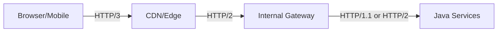

Best for most organizations.

Benefits:

- external users get HTTP/3 where it matters most;
- internal services stay stable;
- rollback is easier;
- platform team owns protocol complexity.

### Stage 2 — Gateway to Selected Internal Service

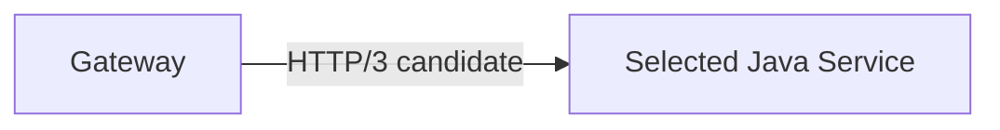

Use only when:

- service has measurable transport bottleneck;
- runtime/client/server supports it;
- observability exists;
- fallback works;
- team owns the path.

### Stage 3 — Service-to-Service HTTP/3

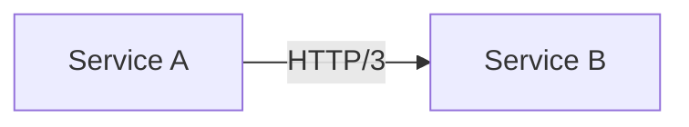

Use selectively.

This requires the highest maturity:

- Java runtime/library support;
- mesh compatibility;
- UDP network policy;
- load balancer support;
- per-route observability;
- incident runbook;
- rollback mechanism.

Do not start here unless you are building a platform-level HTTP/3 program.

---

## 19. Rollout Experiment Design

Treat HTTP/3 as an experiment with a hypothesis.

Bad hypothesis:

```text
HTTP/3 will be faster.
```

Good hypothesis:

```text
For mobile clients in Southeast Asia calling the public account-summary endpoint, HTTP/3 will reduce p95 handshake-included latency by at least 15% and fallback rate will remain below 5%.
```

For internal services:

```text
For cross-region service A -> service B calls, HTTP/3 will reduce p99 latency under 1% packet loss simulation without increasing error rate or reducing observability.
```

Experiment checklist:

```text
[ ] Define candidate route/path.
[ ] Define baseline protocol.
[ ] Capture p50/p95/p99 latency.
[ ] Split connect/handshake/server/transfer latency if possible.
[ ] Measure fallback rate.
[ ] Measure error rate by error kind.
[ ] Measure UDP drops/packet loss where possible.
[ ] Verify gateway/proxy protocol per hop.
[ ] Run load test with realistic concurrency.
[ ] Run packet loss and network impairment tests.
[ ] Validate timeout/retry/idempotency behavior.
[ ] Validate rollback.
```

---

## 20. Engineering Rule: Do Not Bypass the Platform Accidentally

The most dangerous HTTP/3 migration is one that accidentally bypasses platform controls.

For example:

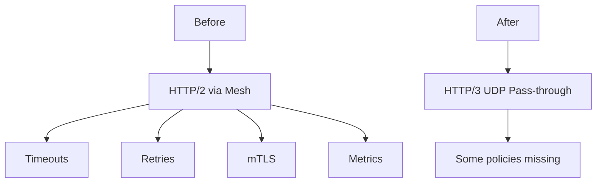

If HTTP/3 traffic bypasses:

- authorization enforcement;
- mTLS expectations;
- rate limiting;
- audit logging;
- tracing;
- timeout policy;
- circuit breaking;
- egress controls;

then the migration is not a protocol improvement. It is a governance regression.

For regulated or audit-sensitive systems, protocol adoption must preserve communication invariants.

---

## 21. Java Service Design Implication

At the application architecture level, your business code should not know whether the transport is HTTP/1.1, HTTP/2, or HTTP/3.

Use a port boundary:

```java
public interface EnforcementCaseDirectoryClient {
    CaseSummary getCaseSummary(CaseId caseId, RequestContext context);
}
```

The implementation can change protocol:

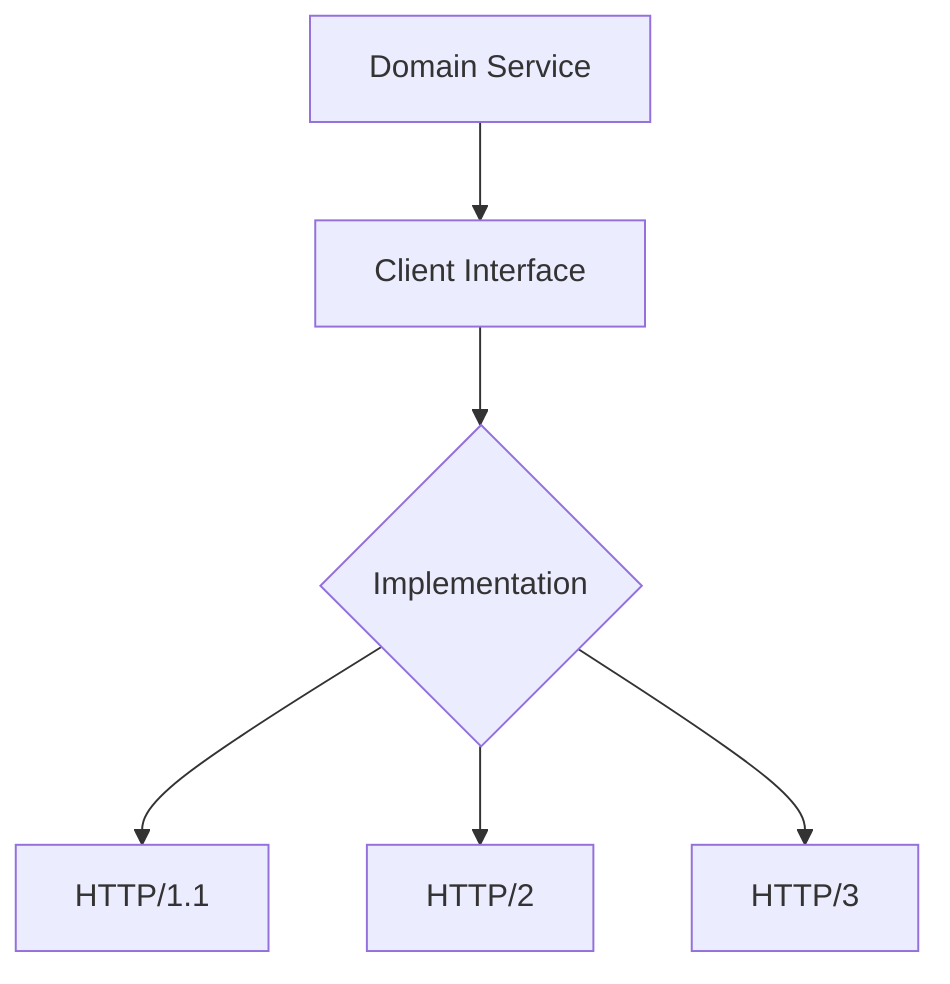

Business logic should depend on semantic outcomes:

- found;
- not found;
- rejected;
- timeout;
- unavailable;
- conflict;
- unknown outcome.

Not on wire protocol details.

The protocol belongs in infrastructure code and platform policy.

---

## 22. Recommended Default for Internal Java Microservices

For most internal Java microservice communication in 2026:

```text
Default to HTTP/1.1 or HTTP/2 depending on platform maturity.
Use HTTP/3 first at the edge.
Adopt service-to-service HTTP/3 only for measured paths with platform support.
```

A sane hierarchy:

1. Fix timeout budgets.
2. Fix retry/idempotency policy.
3. Fix connection pooling.
4. Fix API shape and bulk endpoints.
5. Add HTTP/2 where multiplexing helps.
6. Use gRPC where typed RPC/streaming is a better model.
7. Use HTTP/3 where QUIC's transport properties solve a real measured problem.

Protocol upgrades are late-stage optimizations unless they address a known bottleneck.

---

## 23. Anti-Patterns

### Anti-Pattern 1: Internal HTTP/3 Everywhere

Wrong:

```text
All services should use HTTP/3 because it is modern.
```

Better:

```text
Use HTTP/3 where QUIC properties matter and the platform can operate it.
```

### Anti-Pattern 2: No Fallback Strategy

Wrong:

```text
HTTP/3 only, no fallback.
```

Better:

```text
HTTP/3 with observable fallback to HTTP/2 unless the path is tightly controlled.
```

### Anti-Pattern 3: Ignoring UDP Operations

Wrong:

```text
It is still HTTP, so networking is the same.
```

Better:

```text
QUIC runs over UDP. Validate firewall, load balancer, NAT, mesh, and observability behavior.
```

### Anti-Pattern 4: Treating Edge Success as Internal Proof

Wrong:

```text
HTTP/3 improved browser traffic, so service-to-service should use it.
```

Better:

```text
Edge and internal paths have different bottlenecks and failure modes.
```

### Anti-Pattern 5: Hidden Protocol Translation

Wrong:

```text
We use HTTP/3 because clients connect with HTTP/3.
```

Better:

```text
Observe each hop. The edge may terminate HTTP/3 and use HTTP/2 internally.
```

---

## 24. Production Checklist

Before adopting HTTP/3 on any Java microservice path:

```text
[ ] We know why HTTP/1.1 or HTTP/2 is insufficient.
[ ] The bottleneck is transport-related, not business/database latency.
[ ] The Java runtime/client supports the desired behavior.
[ ] The server/gateway supports HTTP/3 intentionally.
[ ] UDP is allowed and reliable on the path.
[ ] Load balancer supports QUIC correctly.
[ ] Mesh/gateway policy still applies or is intentionally moved.
[ ] mTLS/certificate lifecycle is understood.
[ ] We can observe negotiated protocol and fallback.
[ ] We can observe route-level latency by protocol.
[ ] We can observe errors by transport kind.
[ ] Rollback to HTTP/2 or HTTP/1.1 is tested.
[ ] On-call has a runbook.
```

If you cannot check these boxes, HTTP/3 is not ready for that path.

---

## 25. Summary

HTTP/3 is important, but not automatically important for every internal microservice call.

Its value comes from QUIC:

- UDP-based transport;
- integrated security;
- stream multiplexing;
- reduced TCP-level cross-stream blocking;
- connection migration;
- low-latency connection establishment.

Its cost comes from operations:

- UDP network behavior;
- gateway and mesh support;
- load balancer complexity;
- observability gaps;
- runtime/library maturity;
- team familiarity;
- policy enforcement risk.

The right engineering stance:

> HTTP/3 is an excellent edge and special-path tool. For internal Java microservices, adopt it when measured evidence and platform maturity justify the complexity.

The next part returns from protocol mechanics to payload efficiency: compression, payload shape, and wire-cost control.

---

## References

- RFC 9110 — HTTP Semantics: https://www.rfc-editor.org/rfc/rfc9110.html
- RFC 9113 — HTTP/2: https://www.rfc-editor.org/rfc/rfc9113.html
- RFC 9114 — HTTP/3: https://www.rfc-editor.org/rfc/rfc9114.html
- RFC 9000 — QUIC: A UDP-Based Multiplexed and Secure Transport: https://www.rfc-editor.org/rfc/rfc9000.html
- JEP 517 — HTTP/3 for the HTTP Client API: https://openjdk.org/jeps/517
- OpenJDK HTTP Client introduction: https://openjdk.org/groups/net/httpclient/intro.html
- OpenTelemetry Semantic Conventions — HTTP: https://opentelemetry.io/docs/specs/semconv/http/
