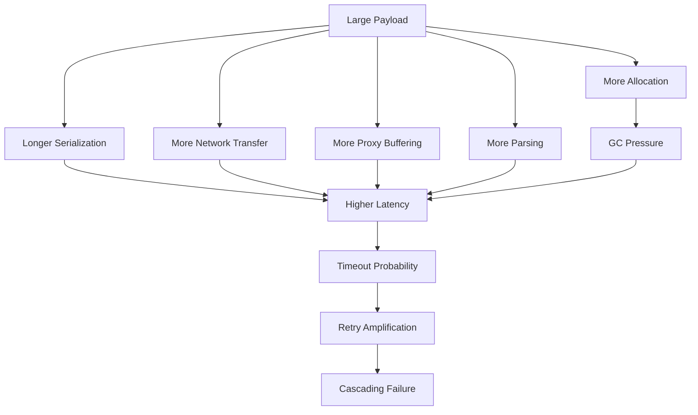
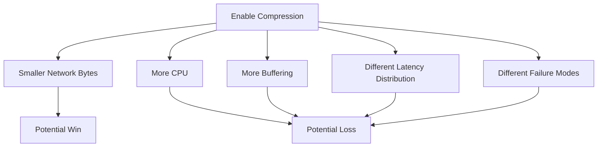
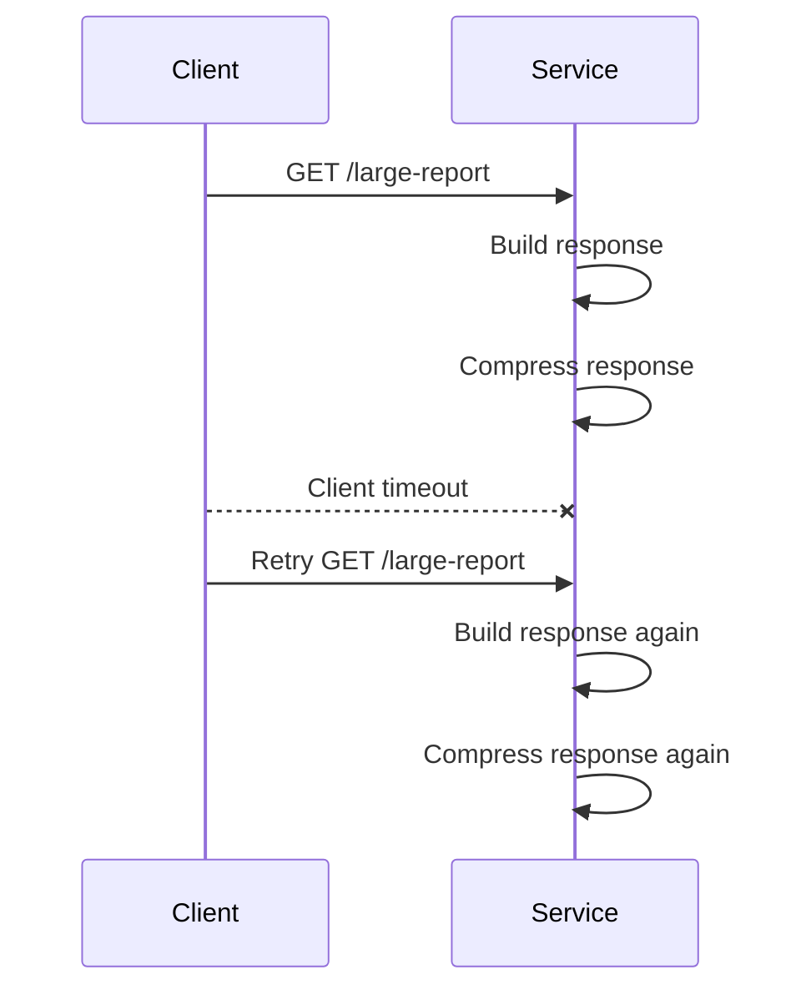
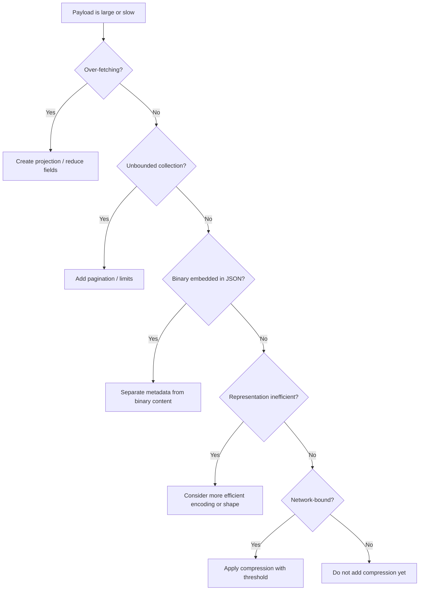

# Part 017 — Compression, Payload Size, and Wire Efficiency

Payload efficiency is not a cosmetic performance topic.

In microservices, payload size affects:

- latency;
- CPU;
- memory allocation;
- garbage collection;
- network saturation;
- proxy buffering;
- timeout probability;
- retry amplification;
- tail latency;
- observability cost;
- incident blast radius.

A badly shaped payload can turn a healthy dependency into a slow dependency.

A slow dependency then triggers timeout.

Timeout triggers retry.

Retry multiplies traffic.

Multiplied traffic saturates connection pools, worker threads, broker consumers, or gateway queues.

So payload efficiency is not about saving a few kilobytes.

It is about controlling the communication envelope.

The core rule:

```text
Optimize representation before compression.
Compress only when the saved network cost is greater than the added CPU, latency, memory, and operational complexity.
```

This part teaches how to reason about that rule in production Java microservices.

---

## 1. The Wire Efficiency Mental Model

Every HTTP call pays several costs.


The payload is not only the bytes on the wire.

A production request has at least five size-related dimensions:

| Dimension | Meaning | Failure mode |
|---|---|---|
| Logical size | Number of domain items/fields | Over-fetching, unstable API contract |
| Serialized size | JSON/Protobuf/XML/Avro bytes | Bandwidth waste, parse latency |
| Compressed size | Bytes after content coding | CPU/latency trade-off |
| In-memory size | Object graph after parsing | GC pressure, heap spikes |
| Observed size | Logs/traces/metrics cost | Expensive telemetry, cardinality explosion |

A common mistake is measuring only serialized size.

For Java services, the in-memory size can be much larger than the wire size because parsed JSON becomes object graphs, strings, collections, buffers, and intermediate parser structures.

That means compression may reduce network cost while leaving the most expensive part untouched: parsing and allocation.

---

## 2. The Three Optimization Layers

Payload efficiency has three layers.

```text
Layer 1: Do not send unnecessary data.
Layer 2: Represent necessary data efficiently.
Layer 3: Compress when it actually wins.
```

The order matters.

If a service returns 200 fields when the caller needs 8, compression only hides the smell.

Better:

```text
Bad: large generic response + gzip
Good: intentionally shaped response + maybe gzip
```

Production teams often jump to layer 3 because it is easy to toggle.

Top-tier engineers start with layer 1.

---

## 3. Payload Size Is a Contract Property

Payload size should not be treated as an incidental runtime detail.

It is part of the communication contract.

A caller depends on the callee not only for schema shape but also for approximate operational envelope.

For example:

```text
GET /accounts/{accountId}/case-summary
```

The caller should be able to assume:

```text
Typical response: < 30 KB
P95 response: < 80 KB
Hard limit: 256 KB
No unbounded arrays
No embedded audit history
No base64 documents
No full child entity expansion by default
```

Without such assumptions, timeout and capacity planning become guesswork.

A schema can be compatible while the payload becomes operationally incompatible.

Example:

```json
{
  "caseId": "CASE-123",
  "status": "UNDER_REVIEW",
  "subjects": [
    {
      "subjectId": "SUB-1",
      "name": "...",
      "addresses": [
        {
          "line1": "...",
          "country": "ID"
        }
      ]
    }
  ]
}
```

Adding a new field may be schema-compatible.

But if the new field is:

```json
"fullAuditTimeline": [ ... thousands of events ... ]
```

then it is not operationally harmless.

Compatibility has two forms:

| Compatibility type | Question |
|---|---|
| Schema compatibility | Can the client parse it? |
| Operational compatibility | Can the client survive it under production load? |

Both matter.

---

## 4. Why Payload Size Impacts Reliability

Payload size affects reliability through time and resource consumption.



This is why payload efficiency belongs in a communication series, not only in a performance tuning series.

A request that returns a huge payload can consume:

- server CPU to serialize;
- server memory to build response;
- network bandwidth to transmit;
- proxy memory to buffer;
- client CPU to parse;
- client heap to materialize;
- tracing/logging budget to observe;
- retry budget if it times out.

The bigger the payload, the more expensive every failed attempt becomes.

---

## 5. First Principle: Avoid Over-Fetching

The cheapest byte is the byte you do not send.

Over-fetching usually comes from API design that exposes domain aggregates instead of use-case-specific representations.

Bad internal API:

```http
GET /cases/{caseId}
```

Returns:

```text
case core
subjects
addresses
documents
attachments
audit timeline
notes
tasks
permissions
risk indicators
workflow history
```

The caller only needs:

```text
caseId
status
assignee
nextActionDueAt
riskLevel
```

Better API:

```http
GET /cases/{caseId}/worklist-card
```

or:

```http
GET /cases/{caseId}?view=worklist-card
```

The point is not whether you prefer sub-resource or view parameter.

The point is that payload shape must match caller intent.

### Design rule

```text
Do not expose one giant representation and expect every caller to ignore unused fields.
```

Unused fields are still paid for by the server, network, proxy, client, and runtime.

---

## 6. Projection APIs

A projection API returns a representation designed for a specific read use case.

Example:

```http
GET /enforcement-cases/{caseId}/summary
GET /enforcement-cases/{caseId}/timeline
GET /enforcement-cases/{caseId}/decision-context
GET /enforcement-cases/{caseId}/worklist-card
```

This is usually better than:

```http
GET /enforcement-cases/{caseId}?include=a,b,c,d,e,f,g,h
```

Why?

Because named projections are stable and observable.

| Approach | Pros | Risks |
|---|---|---|
| Named projection | Clear contract, stable metrics, easier caching | More endpoints |
| Arbitrary include fields | Flexible | Hard to test, hard to cache, combinatorial behavior |
| GraphQL-like selection | Very flexible | Requires strong governance, cost control, query limits |

For internal service-to-service APIs, named projections often give the best operational control.

Example:

```http
GET /cases/CASE-123/worklist-card
Accept: application/json
```

Response:

```json
{
  "caseId": "CASE-123",
  "status": "WAITING_FOR_REVIEW",
  "assignee": "investigator-41",
  "riskLevel": "HIGH",
  "nextActionDueAt": "2026-07-05T10:00:00Z"
}
```

This is small, stable, and purpose-built.

---

## 7. Expansion Must Be Explicit

Implicit expansion creates hidden payload growth.

Bad:

```http
GET /customers/C-123
```

Sometimes returns only customer core.

Sometimes also returns accounts, documents, historical addresses, regulatory flags, and contact attempts depending on server-side configuration.

Better:

```http
GET /customers/C-123
GET /customers/C-123?expand=accounts
GET /customers/C-123?expand=accounts,regulatory-flags
```

But expansion must be constrained.

A production expansion policy should define:

```text
Allowed expansions
Maximum nesting depth
Maximum expanded collection size
Timeout behavior
Partial result behavior
Cacheability
Authorization impact
Telemetry dimensions
```

Never allow unbounded expansion in internal service calls.

Bad:

```http
GET /cases/CASE-123?expand=*
```

That API looks convenient until one caller accidentally turns an OLTP request into a graph export.

---

## 8. Pagination Is a Payload Control Mechanism

Pagination is not only UI convenience.

It is a communication control mechanism.

Any endpoint returning a list must answer:

```text
What is the default limit?
What is the maximum limit?
Is ordering stable?
What cursor represents the next page?
What happens when data changes during pagination?
Can a page become too large because each item is huge?
```

Bad:

```http
GET /case-events?caseId=CASE-123
```

Returns all events.

Better:

```http
GET /case-events?caseId=CASE-123&limit=100&cursor=eyJvZmZzZXQiOjEwMH0
```

Response:

```json
{
  "items": [
    {
      "eventId": "EVT-1",
      "occurredAt": "2026-07-05T08:15:30Z",
      "type": "CASE_ASSIGNED"
    }
  ],
  "nextCursor": "eyJvZmZzZXQiOjIwMH0",
  "hasMore": true
}
```

Limit count alone is not enough.

You also need maximum serialized response size.

```text
Max items: 100
Max response body: 512 KB
```

Why?

Because 100 tiny records and 100 giant records are not equivalent.

---

## 9. Beware of Base64 Payloads

Base64 increases payload size by roughly one third before compression characteristics are considered.

It also encourages embedding binary data into JSON APIs.

Bad:

```json
{
  "documentId": "DOC-123",
  "filename": "evidence.pdf",
  "contentBase64": "JVBERi0xLjQKJ..."
}
```

Better:

```json
{
  "documentId": "DOC-123",
  "filename": "evidence.pdf",
  "downloadUrl": "/documents/DOC-123/content",
  "contentSha256": "...",
  "sizeBytes": 849231
}
```

Then stream binary content separately:

```http
GET /documents/DOC-123/content
Accept: application/pdf
```

Do not mix metadata and large binary content by default.

Separate them because they have different:

- caching behavior;
- authorization checks;
- timeout budgets;
- streaming needs;
- audit requirements;
- retry semantics;
- logging restrictions.

---

## 10. JSON Payload Efficiency

JSON is human-readable and widely supported.

It is also verbose.

That does not automatically make it wrong.

For many internal HTTP APIs, JSON is a good default because it is debuggable, language-neutral, and compatible with OpenAPI tooling.

But JSON must be shaped carefully.

### 10.1 Avoid repeated static metadata

Bad:

```json
{
  "items": [
    {
      "caseType": "ENFORCEMENT_CASE",
      "jurisdiction": "ID",
      "schemaVersion": "2026-07-01",
      "caseId": "CASE-1"
    },
    {
      "caseType": "ENFORCEMENT_CASE",
      "jurisdiction": "ID",
      "schemaVersion": "2026-07-01",
      "caseId": "CASE-2"
    }
  ]
}
```

Better:

```json
{
  "caseType": "ENFORCEMENT_CASE",
  "jurisdiction": "ID",
  "schemaVersion": "2026-07-01",
  "items": [
    {
      "caseId": "CASE-1"
    },
    {
      "caseId": "CASE-2"
    }
  ]
}
```

### 10.2 Do not use deeply nested objects unless the relationship matters

Deep nesting increases parser work and often reflects unclear ownership.

Bad:

```json
{
  "case": {
    "workflow": {
      "stage": {
        "assignment": {
          "user": {
            "id": "u-1"
          }
        }
      }
    }
  }
}
```

Better for a read model:

```json
{
  "caseId": "CASE-123",
  "workflowStage": "LEGAL_REVIEW",
  "assigneeUserId": "u-1"
}
```

Flattening is not always correct for domain persistence.

But communication payloads are not persistence models.

A read response is allowed to be a projection.

### 10.3 Prefer stable identifiers over embedded entities

Bad:

```json
{
  "caseId": "CASE-123",
  "assignee": {
    "userId": "u-1",
    "name": "Ayu",
    "email": "ayu@example.internal",
    "department": {
      "id": "dept-9",
      "name": "Investigation"
    }
  }
}
```

If caller only needs the assignee identity:

```json
{
  "caseId": "CASE-123",
  "assigneeUserId": "u-1"
}
```

If caller needs display data:

```json
{
  "caseId": "CASE-123",
  "assignee": {
    "userId": "u-1",
    "displayName": "Ayu"
  }
}
```

Be intentional.

---

## 11. Nulls, Empty Values, and Field Presence

Payload efficiency is not only about removing bytes.

It is also about preserving meaning.

Consider:

```json
{
  "reviewedAt": null
}
```

This might mean:

```text
Known to be not reviewed.
```

Or:

```text
Server does not know.
```

Or:

```text
Field is unavailable to caller.
```

Or:

```text
Field omitted due to projection.
```

Do not remove nulls blindly if presence carries semantics.

For production APIs, define field presence rules.

Example:

```text
Omitted field: not part of this projection.
null field: part of projection, but value is explicitly absent.
empty array: part of projection, known to have no elements.
```

This prevents clients from over-interpreting missing data.

Compression can make null-heavy payloads smaller, but it cannot fix ambiguous semantics.

---

## 12. Compression Basics in HTTP

HTTP compression is usually represented through content coding.

The client advertises what it accepts:

```http
Accept-Encoding: gzip, br, zstd
```

The server replies with what it applied:

```http
Content-Encoding: gzip
```

The representation is still the same media type:

```http
Content-Type: application/json
Content-Encoding: gzip
```

Meaning:

```text
The payload is JSON after gzip decoding.
```

Do not confuse:

| Header | Meaning |
|---|---|
| `Content-Type` | What the representation means after decoding |
| `Content-Encoding` | How the representation is encoded/compressed |
| `Transfer-Encoding` | Message transfer framing, mainly HTTP/1.1 concern |
| `Accept-Encoding` | What response content codings the client can accept |

For microservices, `Content-Encoding` is the main concept.

---

## 13. Common Content Codings

Common HTTP content codings include:

| Coding | Typical use | Notes |
|---|---|---|
| `gzip` | Default interoperable compression | Widely supported, safe default |
| `br` | Excellent compression ratio, common on web | Often stronger for static/text content |
| `zstd` | Strong ratio and speed trade-off | Increasingly relevant; check platform support |
| `deflate` | Legacy | Avoid unless required |
| `identity` | No compression | Always conceptually available unless refused |

For internal Java microservices, `gzip` is often the baseline because it is easy to operate across proxies, clients, and frameworks.

But the best algorithm is not universal.

You must test against your actual payloads.

Example result patterns:

```text
Small JSON < 1 KB: compression may lose.
Medium repetitive JSON: gzip often wins.
Large text-heavy JSON: br/zstd may win more.
Already compressed binary: compression wastes CPU.
Random/encrypted data: compression does not help.
```

---

## 14. Compression Is Not Free

Compression costs CPU and memory.

Decompression also costs CPU and memory.

In Java, it can also add allocation pressure through buffers and byte arrays.



Compression should be treated as a policy decision, not a universal toggle.

Ask:

```text
What payload sizes are common?
What is the P95/P99 body size?
Is network or CPU the bottleneck?
Does the gateway decompress/recompress?
Are we compressing already compressed content?
Does compression delay first byte?
Does the client stream or buffer compressed responses?
Can decompressed size exceed limits?
```

If you cannot answer these, compression may hide rather than solve the problem.

---

## 15. Compression Thresholds

Most production services should not compress every response.

Compressing tiny payloads can increase latency and CPU without meaningful network savings.

A practical policy:

```text
Do not compress below a minimum response size.
Compress only selected content types.
Never compress already compressed binary.
Measure before and after.
```

Example policy:

```yaml
compression:
  enabled: true
  min-response-size: 2048
  mime-types:
    - application/json
    - application/problem+json
    - text/plain
```

The threshold is workload-specific.

A 2 KB threshold is a reasonable starting point, not a law.

For high-throughput internal APIs, tune with actual measurements.

---

## 16. Compression and Tail Latency

Average latency can improve while tail latency gets worse.

Why?

Compression adds CPU work.

Under normal load, CPU is available and network savings dominate.

Under high load, CPU becomes scarce and compression work competes with request handling.

That can increase P99 latency.

```text
Normal load:
  network saved > CPU cost
  latency improves

High load:
  CPU cost > network saved
  latency worsens
```

This is why compression testing must include:

- normal load;
- peak load;
- CPU pressure;
- GC pressure;
- large payload routes;
- mixed small and large payloads;
- retries under failure.

Compression that passes a happy-path benchmark may fail during an incident.

---

## 17. Compression and Retries

Compression changes retry economics.

If a request times out after the server spent CPU compressing a large response, a retry may force the server to compress again.

This can create CPU amplification.



Mitigations:

```text
Use realistic timeout budgets.
Avoid expensive large response endpoints in synchronous paths.
Cache stable large representations when appropriate.
Use async export for very large results.
Use pagination or streaming.
Use idempotency and request deduplication for commands.
Expose size metrics.
```

For large generated responses, caching compressed variants can help, but only if authorization, personalization, and freshness rules are correct.

---

## 18. Do Not Compress Secrets with Attacker-Controlled Input

Compression can create security risks when secrets and attacker-controlled input are compressed together and response size is observable.

This class of issue is known from attacks against compressed encrypted web traffic.

For internal service-to-service communication, the risk profile is different from browser traffic, but the principle still matters.

Avoid compressing payloads that combine:

```text
secret data + attacker-controlled reflected data + observable compressed length
```

Practical internal rule:

```text
Do not put credentials, tokens, session secrets, or highly sensitive values into compressible reflected responses.
```

Also avoid logging compressed or decompressed sensitive payloads.

Compression is not encryption.

TLS protects transport confidentiality.

Application logs, traces, metrics, and dumps can still leak data.

---

## 19. Decompression Bombs and Response Limits

Compressed payloads can expand to much larger decompressed payloads.

This matters for clients and gateways.

A client that enforces only compressed size may be vulnerable to memory pressure after decompression.

Production clients should enforce:

```text
maximum compressed size
maximum decompressed size
maximum parse depth
maximum array length
maximum object/string length if parser supports it
request timeout
read timeout
```

For service-to-service clients, response size limits are part of dependency safety.

Example policy:

```text
GET /risk-score/{subjectId}
Max compressed response: 64 KB
Max decompressed response: 256 KB
Max timeout: 300 ms
```

If a dependency returns more than that, the caller should fail predictably.

Unbounded reads are a production smell.

---

## 20. Gateway and Proxy Behavior

Compression may be applied at:

- service;
- gateway;
- sidecar proxy;
- ingress proxy;
- CDN;
- client library.

Internal microservices often have more than one hop.


Questions:

```text
Who compresses?
Who decompresses?
Can the proxy buffer the full response before forwarding?
Are Content-Length and Transfer-Encoding changed?
Are ETags generated for compressed or uncompressed representation?
Are metrics recorded before or after compression?
Are body size limits applied to compressed or decompressed bytes?
```

Do not assume enabling compression in the application is the only place compression happens.

A gateway may already compress responses.

A sidecar may decompress for inspection.

A proxy may disable compression for certain content types.

An observability agent may measure different size semantics than the application.

---

## 21. Compression and Caching

Caching compressed responses introduces representation variants.

A cache must respect `Accept-Encoding` negotiation.

The usual mechanism is:

```http
Vary: Accept-Encoding
```

Without correct variant handling, a cache could serve compressed content to a client that cannot decode it, or serve the wrong representation.

For internal microservices, caching is less universal than on the public web, but the same rule applies.

If content negotiation affects response representation, caches must know.

Do not casually add caching and compression together without variant policy.

---

## 22. Content-Length and Streaming

Compression can change whether `Content-Length` is known in advance.

If the server compresses on the fly, it may not know the final compressed length without buffering the entire response.

That can produce chunked transfer in HTTP/1.1 or streamed data frames in HTTP/2.

Operational implication:

```text
Compression can shift memory cost from network to buffering if implementation computes length before sending.
```

For large responses, avoid full buffering just to compute `Content-Length`.

Prefer streaming when possible.

But streaming compressed responses also requires careful cancellation handling.

If the client disconnects mid-stream, the server must stop producing and compressing.

Otherwise, it wastes work.

---

## 23. Payload Efficiency and Observability

You need metrics for payload size.

At minimum:

```text
request body size
response body size
compressed response size if available
decompressed response size if available
serialization time
compression time
deserialization time
route-level distribution
status code distribution by size bucket
```

But avoid high-cardinality labels.

Bad metric tags:

```text
caseId
customerId
documentId
errorMessage
fullPathWithId
```

Good metric tags:

```text
route_template=/cases/{caseId}/summary
method=GET
status_code=200
content_encoding=gzip
size_bucket=64kb_256kb
```

Size histograms are more useful than averages.

Average payload size hides the rare but dangerous giant responses.

Track:

```text
P50
P90
P95
P99
max
count above limit
```

---

## 24. Java Serialization Cost

In Java, serialization cost is not only CPU cycles.

It also includes allocation and object traversal.

For JSON APIs using Jackson-like libraries, the service may allocate:

- DTO objects;
- strings;
- arrays;
- maps;
- byte buffers;
- intermediate serializer state;
- compressed output buffers.

Large payloads can create allocation bursts.

Allocation bursts can create GC pauses.

GC pauses can create timeout bursts.

Timeout bursts can create retry bursts.

So a seemingly harmless DTO expansion can become a reliability problem.

Design implication:

```text
Treat large DTOs as production load-bearing structures.
```

Do not let DTOs grow indefinitely because "only internal services use them".

Internal consumers are often the most latency-sensitive consumers.

---

## 25. Java Example: Response Size Guard

A server-side response size guard is difficult if responses are streamed, but the concept is important.

At the API policy level:

```java
public final class PayloadPolicy {
    public static final long MAX_CASE_SUMMARY_BYTES = 256 * 1024;
    public static final int MAX_CASE_EVENTS_PAGE_SIZE = 100;

    private PayloadPolicy() {
    }
}
```

For list endpoints:

```java
public record PageRequest(int limit, String cursor) {
    public PageRequest {
        if (limit < 1) {
            throw new IllegalArgumentException("limit must be positive");
        }
        if (limit > PayloadPolicy.MAX_CASE_EVENTS_PAGE_SIZE) {
            throw new IllegalArgumentException("limit exceeds maximum page size");
        }
    }
}
```

Do not rely only on documentation.

Enforce payload control in code.

---

## 26. Spring Boot Compression Configuration

A typical Spring Boot service can enable response compression through server configuration.

Example:

```yaml
server:
  compression:
    enabled: true
    min-response-size: 2KB
    mime-types:
      - application/json
      - application/problem+json
      - text/plain
```

This is not enough by itself.

You still need route-level policy:

```text
Which endpoints are allowed to return large payloads?
Which endpoints must never compress?
Which clients support which encodings?
Does gateway override compression?
Are metrics collected before or after compression?
```

Configuration toggles are not architecture.

---

## 27. Client-Side Accept-Encoding Policy

A service client should be explicit about what it can decode.

Example intent:

```http
Accept-Encoding: gzip
```

Do not advertise `br` or `zstd` unless your client, runtime, gateway, and observability tooling handle them correctly.

A mature client abstraction should define:

```text
accepted encodings
maximum compressed size
maximum decompressed size
timeout budget
streaming vs buffering behavior
error handling for unsupported encoding
metrics for actual content encoding
```

The server's `Content-Encoding` must match something the client can decode.

If it does not, the client should fail clearly.

Bad failure:

```text
java.io.IOException: malformed response
```

Better failure:

```text
UnsupportedContentEncodingException: service=risk-service route=/risk-score/{subjectId} contentEncoding=br accepted=[gzip]
```

Error messages are part of operability.

---

## 28. Payload Compression and OpenAPI

OpenAPI can describe media types and response schemas, but compression is usually represented through HTTP headers and operational policy rather than only schema.

Document:

```yaml
responses:
  '200':
    description: Case summary
    headers:
      Content-Encoding:
        schema:
          type: string
        description: Present when response body is compressed.
    content:
      application/json:
        schema:
          $ref: '#/components/schemas/CaseSummaryResponse'
```

But do not stop there.

Also document:

```text
maximum response size
pagination limits
known large fields
projection rules
compression threshold
supported content codings
```

Schema tells the client what fields exist.

Payload policy tells the client what operational envelope to expect.

---

## 29. Wire Efficiency Decision Model

Use this decision model.



Compression is late in the decision tree.

Not because compression is bad.

Because representation mistakes are more fundamental.

---

## 30. When to Consider Protobuf or Binary Encoding

This part focuses on HTTP payload efficiency, not gRPC design.

But binary encoding belongs in the decision model.

Consider Protobuf or another compact format when:

```text
payloads are frequent and high volume;
JSON parsing cost is significant;
schema is stable and strongly governed;
both sides are internal and generated clients are acceptable;
humans do not need to inspect traffic directly;
contract evolution is disciplined;
observability can decode or summarize safely.
```

Do not switch to binary encoding merely because JSON looks verbose.

The trade-off is not only size.

It includes:

- tooling;
- debugging;
- compatibility;
- schema governance;
- generated code lifecycle;
- gateway support;
- tracing/logging visibility;
- partial rollout.

For many service-to-service APIs, well-shaped JSON plus compression is enough.

For high-throughput internal RPC, gRPC/Protobuf may be better.

That is why this series has a dedicated gRPC phase later.

---

## 31. Efficient Payload Checklist

Use this checklist before optimizing with compression.

```text
[ ] Is this endpoint returning only the fields the caller needs?
[ ] Are large child collections paginated?
[ ] Is response ordering stable?
[ ] Are expansion rules explicit and bounded?
[ ] Are binary payloads separated from metadata?
[ ] Is maximum response size documented and enforced?
[ ] Are null/omitted/empty semantics defined?
[ ] Are large fields opt-in rather than default?
[ ] Is serialization/deserialization time measured?
[ ] Are payload size histograms available per route?
[ ] Are compressed and decompressed limits enforced?
[ ] Is compression threshold configured?
[ ] Are supported content codings known to clients?
[ ] Does gateway/proxy compression behavior match application policy?
[ ] Are sensitive payloads protected from unsafe compression scenarios?
```

If the first half fails, compression is premature.

---

## 32. Production Payload Policy Template

A production API should include a payload policy like this.

```md
## Payload Policy

Endpoint: GET /cases/{caseId}/worklist-card

Representation:
- Media type: application/json
- Default compression: gzip when response >= 2 KB and client accepts gzip
- Binary content: not embedded

Size limits:
- Typical response: < 10 KB
- P95 expected: < 25 KB
- Hard limit: 64 KB decompressed

Collections:
- No unbounded collections
- Maximum alerts embedded: 5
- Additional alerts require separate endpoint

Field presence:
- Omitted field: not part of projection
- null field: explicitly absent value
- empty array: known empty collection

Operational behavior:
- Timeout budget: 300 ms total caller-side
- Retry: safe for GET, max 1 retry, only on transient transport failure
- Metrics: response size histogram by route/status/content-encoding
```

This kind of policy prevents accidental payload drift.

---

## 33. Anti-Patterns

### 33.1 Compressing everything

```text
All responses are compressed regardless of size or type.
```

This wastes CPU on tiny responses and already compressed payloads.

### 33.2 Large internal DTO shared by everyone

```text
One DTO serves UI, batch, search, workflow, audit, and reporting.
```

This creates uncontrolled payload coupling.

### 33.3 Infinite include trees

```http
GET /cases/CASE-123?include=subjects.addresses.documents.events.tasks.notes
```

Without depth and size limits, this is a denial-of-service interface.

### 33.4 Logging full payloads to debug size problems

Large payload incidents often tempt teams to log the entire body.

That creates privacy, cost, and performance problems.

Log size, schema version, route, correlation ID, and safe summaries instead.

### 33.5 Treating gzip as a substitute for pagination

Compression reduces bytes.

It does not fix unbounded response semantics.

---

## 34. Practical Engineering Rule

Use this rule in design reviews:

```text
Every synchronous endpoint must have an expected size envelope.
Every collection must be bounded.
Every large representation must be intentional.
Every compression decision must be measured.
```

If an endpoint cannot state its expected size envelope, it is not production-ready.

---

## 35. How This Connects to the Next Part

Payload efficiency controls successful responses.

The next part controls failed responses.

Error responses are also payloads.

They must be:

- machine-readable;
- stable;
- safe to log;
- useful for retry decisions;
- consistent across services;
- aligned with HTTP status semantics.

That is the role of error response modeling.

---

## References

- RFC 9110 — HTTP Semantics: https://www.rfc-editor.org/rfc/rfc9110.html
- IANA HTTP Parameters — HTTP Content Coding Registry: https://www.iana.org/assignments/http-parameters/http-parameters.xhtml
- RFC 9457 — Problem Details for HTTP APIs: https://www.rfc-editor.org/rfc/rfc9457.html
- OpenTelemetry Semantic Conventions — HTTP: https://opentelemetry.io/docs/specs/semconv/http/
- Spring Boot Reference — Response Compression: https://docs.spring.io/spring-boot/reference/how-to/webserver.html
