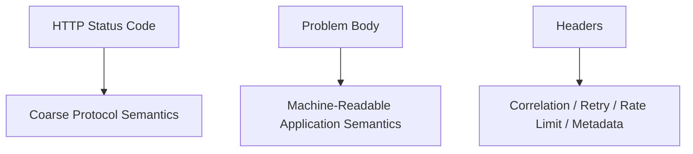
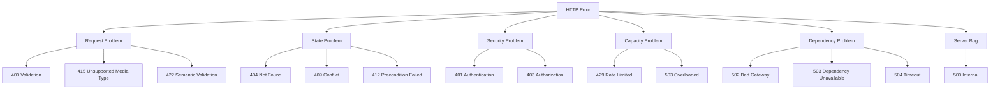
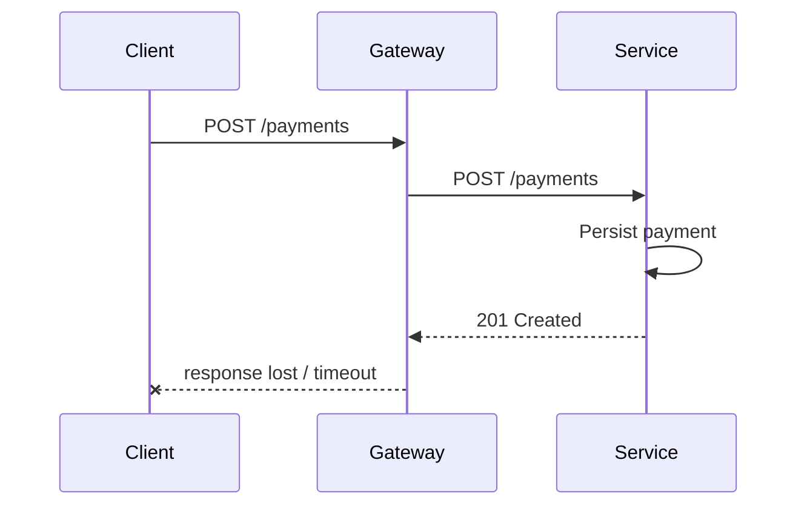
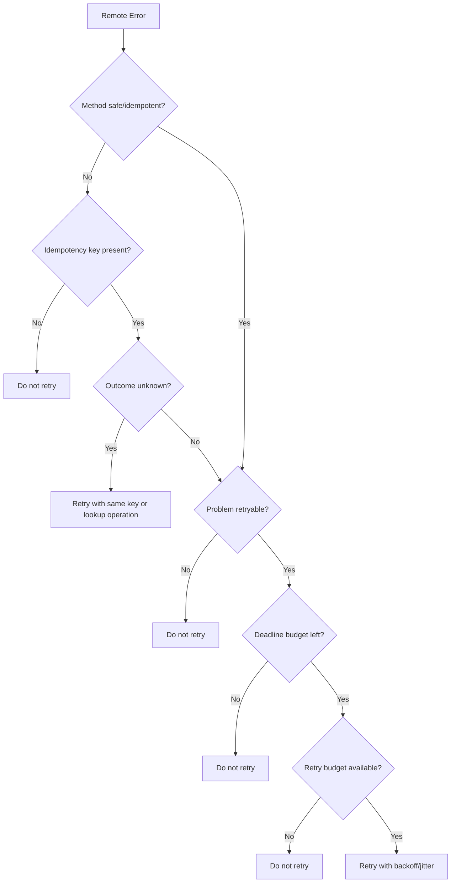

# Part 018 — Error Response Modeling: Problem Details, Retriability, Diagnostics

A good error response is not an apology.

It is a control signal.

In microservices, an error response tells the caller:

```text
What failed?
Was the request accepted?
Can the caller retry?
Should the caller change the request?
Is the dependency unhealthy?
Is this a business/domain rejection?
Is this a security boundary?
How can operators diagnose it?
```

A bad error response hides those answers.

Example:

```json
{
  "message": "Something went wrong"
}
```

This is almost useless for service-to-service communication.

A production-grade error model must be:

- semantically aligned with HTTP status codes;
- machine-readable;
- stable enough for clients;
- safe enough for logs;
- diagnostic enough for operators;
- explicit about retriability;
- compatible with tracing and correlation;
- consistent across services.

This part builds that model.

---

## 1. Status Code Is Necessary but Not Sufficient

HTTP status code is the first error signal.

It is not the whole error contract.

```http
HTTP/1.1 409 Conflict
Content-Type: application/problem+json
```

The status code says:

```text
The request conflicts with current state.
```

But it does not say:

```text
Which state?
Which business invariant?
Can the caller retry?
What is the stable error code?
What should be shown to an operator?
What correlation ID should be used for investigation?
```

That detail belongs in the error body and headers.

Think of HTTP errors as two layers:



A mature service uses all three.

---

## 2. Error Response Is Part of the API Contract

Many teams design success responses carefully but treat error responses as implementation detail.

That is wrong.

For internal microservice communication, errors are part of the dependency contract.

A caller must know how to react to:

- validation failure;
- authorization failure;
- missing resource;
- stale version;
- duplicate command;
- rate limit;
- timeout;
- dependency failure;
- unavailable service;
- unknown outcome.

If those are not modeled, callers invent inconsistent behavior.

One caller retries validation failures.

Another swallows 500.

Another treats 404 as success.

Another pages operators for domain rejection.

That inconsistency becomes a distributed system failure.

---

## 3. RFC 9457 Problem Details

RFC 9457 defines Problem Details for HTTP APIs.

The JSON media type is commonly:

```http
Content-Type: application/problem+json
```

A problem response has standard members:

```json
{
  "type": "https://errors.example.internal/case-version-conflict",
  "title": "Case version conflict",
  "status": 409,
  "detail": "The case was modified by another process.",
  "instance": "/cases/CASE-123/commands/submit-review"
}
```

Core fields:

| Field | Meaning |
|---|---|
| `type` | Stable identifier for the problem type |
| `title` | Short human-readable summary |
| `status` | HTTP status code associated with this occurrence |
| `detail` | Human-readable detail for this occurrence |
| `instance` | URI reference identifying the specific occurrence |

Problem Details also allows extension members.

For internal microservices, extensions are where you add operationally useful but governed fields.

Example:

```json
{
  "type": "https://errors.example.internal/case-version-conflict",
  "title": "Case version conflict",
  "status": 409,
  "detail": "The case was modified by another process.",
  "instance": "/problems/01J0XYZABCD123",
  "errorCode": "CASE_VERSION_CONFLICT",
  "correlationId": "9f9c3a0e3c4b4e6b",
  "retryable": false,
  "currentVersion": 42,
  "expectedVersion": 41
}
```

Do not add random fields per service without governance.

An extension field becomes a contract if clients use it.

---

## 4. Problem Type vs Error Code

Problem Details already has `type`.

So why add `errorCode`?

Because service clients often need a compact stable enum-like value.

Use both with clear semantics.

| Field | Role |
|---|---|
| `type` | Globally unique problem type URI |
| `errorCode` | Compact domain/platform code for client logic and metrics |
| `title` | Short human-readable summary |
| `detail` | Occurrence-specific explanation |

Example:

```json
{
  "type": "https://errors.example.internal/idempotency-key-reuse",
  "title": "Idempotency key reused with different request body",
  "status": 409,
  "errorCode": "IDEMPOTENCY_KEY_REUSE",
  "retryable": false
}
```

`errorCode` should be stable and low-cardinality.

Do not generate codes dynamically.

Bad:

```json
{
  "errorCode": "VALIDATION_FAILED_FIELD_customer.addresses[13].postalCode_2026_07_05_10_21_33"
}
```

Good:

```json
{
  "errorCode": "VALIDATION_FAILED"
}
```

Put field-specific detail in structured violations, not in the code.

---

## 5. Error Classification Model

Every error should belong to a class.



This classification drives response shape, retry policy, alerting, and client behavior.

---

## 6. Status Code Mapping for Internal APIs

Use status codes consistently.

| Status | Use when | Retry? |
|---:|---|---|
| 400 | Syntax/shape request error | No |
| 401 | Missing/invalid authentication | No, unless token refresh path applies |
| 403 | Authenticated but not allowed | No |
| 404 | Resource not found or not visible | Usually no |
| 405 | Method not allowed | No |
| 409 | State conflict | Usually no automatic retry; caller may re-read state |
| 410 | Resource permanently gone | No |
| 412 | Precondition failed | No automatic retry; caller must refresh precondition |
| 415 | Unsupported media type/content encoding | No |
| 422 | Semantically invalid request | No |
| 425 | Too early / unsafe replay concern | Retry only according to protocol/policy |
| 429 | Rate limited | Maybe, after `Retry-After` and budget check |
| 500 | Server bug/unclassified failure | Maybe, but carefully |
| 502 | Bad gateway/upstream invalid response | Maybe |
| 503 | Service unavailable/overloaded/maintenance | Maybe, after budget check |
| 504 | Gateway/upstream timeout | Maybe, but outcome may be unknown |

Do not build client logic from status family alone.

For example:

```text
5xx does not always mean safe to retry.
409 does not always mean fatal forever.
404 may be expected in eventually consistent reads.
429 may be retryable only after delay.
504 may hide unknown server-side outcome.
```

The error body should refine the decision.

---

## 7. Retriability Must Be Explicit but Not Blindly Trusted

Include retriability as part of the error contract.

Example:

```json
{
  "type": "https://errors.example.internal/rate-limited",
  "title": "Rate limit exceeded",
  "status": 429,
  "errorCode": "RATE_LIMITED",
  "retryable": true,
  "retryAfterMillis": 5000
}
```

But the client must still apply its own budget.

```text
Server says retryable.
Client asks: Do I still have deadline budget? Is method safe? Is idempotency guaranteed? Is retry budget available?
```

Retriability has two sides:

| Side | Responsibility |
|---|---|
| Server | Classify the failure accurately |
| Client | Decide whether retry is safe within its own budget |

A server cannot know the caller's end-to-end deadline or business operation context.

So `retryable=true` means:

```text
The server believes retry may succeed later.
```

It does not mean:

```text
The client must retry.
```

---

## 8. Unknown Outcome Errors

Unknown outcome is one of the most important concepts in distributed communication.

A client timeout does not prove the server did nothing.

A gateway timeout does not prove the downstream operation failed.

Example:



The client sees timeout.

But the operation may have succeeded.

For command endpoints, error modeling must distinguish:

```text
Rejected before execution
Failed during execution
Accepted but completion unknown to caller
Completed but response lost
```

HTTP alone cannot always tell you which occurred.

That is why commands need idempotency keys, operation IDs, or status lookup patterns.

Error model example:

```json
{
  "type": "https://errors.example.internal/operation-outcome-unknown",
  "title": "Operation outcome unknown",
  "status": 504,
  "errorCode": "OPERATION_OUTCOME_UNKNOWN",
  "retryable": true,
  "safeToRetryWithSameIdempotencyKey": true,
  "operationId": "OP-789"
}
```

The key is precision.

Do not collapse unknown outcome into generic `INTERNAL_ERROR`.

---

## 9. Validation Errors

Validation errors must be structured.

Bad:

```json
{
  "message": "Invalid request"
}
```

Better:

```json
{
  "type": "https://errors.example.internal/validation-failed",
  "title": "Validation failed",
  "status": 400,
  "errorCode": "VALIDATION_FAILED",
  "retryable": false,
  "violations": [
    {
      "field": "decision.reasonCode",
      "code": "REQUIRED",
      "message": "reasonCode is required"
    },
    {
      "field": "decision.effectiveDate",
      "code": "MUST_BE_FUTURE_OR_PRESENT",
      "message": "effectiveDate must not be in the past"
    }
  ]
}
```

Rules:

```text
Use stable violation codes.
Keep field paths predictable.
Do not put raw user input if sensitive.
Do not expose internal validator class names.
Do not make clients parse human messages.
```

Human messages are for humans.

Codes are for machines.

---

## 10. Business Rule Rejections

A business rule rejection is different from malformed request.

Example:

```text
The request is well-formed, but the case cannot be escalated because it is already closed.
```

Possible status:

```http
409 Conflict
```

Problem body:

```json
{
  "type": "https://errors.example.internal/case-not-escalatable",
  "title": "Case cannot be escalated",
  "status": 409,
  "errorCode": "CASE_NOT_ESCALATABLE",
  "retryable": false,
  "caseId": "CASE-123",
  "currentStatus": "CLOSED"
}
```

Do not use 500 for domain rejections.

A rejected command may be a successful enforcement of invariant.

It is not an incident.

Alerting should not page on expected domain conflicts.

---

## 11. Optimistic Locking and Preconditions

State-changing APIs should often use preconditions.

Example:

```http
POST /cases/CASE-123/commands/submit-review
If-Match: "case-version-41"
```

If the resource changed:

```http
HTTP/1.1 412 Precondition Failed
Content-Type: application/problem+json
```

```json
{
  "type": "https://errors.example.internal/precondition-failed",
  "title": "Precondition failed",
  "status": 412,
  "errorCode": "PRECONDITION_FAILED",
  "retryable": false,
  "expectedVersion": "case-version-41",
  "currentVersion": "case-version-42"
}
```

Use 409 when conflict is domain/state conflict without explicit HTTP precondition.

Use 412 when an explicit precondition such as `If-Match` failed.

This distinction helps callers implement correct read-modify-write flows.

---

## 12. Rate Limit and Overload Errors

Rate limiting and overload should be explicit.

For rate limit:

```http
HTTP/1.1 429 Too Many Requests
Retry-After: 5
Content-Type: application/problem+json
```

```json
{
  "type": "https://errors.example.internal/rate-limited",
  "title": "Rate limit exceeded",
  "status": 429,
  "errorCode": "RATE_LIMITED",
  "retryable": true,
  "retryAfterMillis": 5000,
  "limitName": "risk-score-per-client"
}
```

For overload:

```http
HTTP/1.1 503 Service Unavailable
Retry-After: 2
Content-Type: application/problem+json
```

```json
{
  "type": "https://errors.example.internal/service-overloaded",
  "title": "Service temporarily overloaded",
  "status": 503,
  "errorCode": "SERVICE_OVERLOADED",
  "retryable": true,
  "retryAfterMillis": 2000
}
```

Do not use generic 500 for overload.

Overload is a capacity signal.

It should tell clients to slow down, shed, or retry later.

---

## 13. Dependency Failure Errors

A service may fail because a downstream dependency failed.

But be careful.

Do not leak internal topology unnecessarily.

Bad:

```json
{
  "message": "NullPointerException from com.internal.risk.PostgresRiskRepository line 72"
}
```

Better:

```json
{
  "type": "https://errors.example.internal/dependency-unavailable",
  "title": "Required dependency unavailable",
  "status": 503,
  "errorCode": "DEPENDENCY_UNAVAILABLE",
  "retryable": true,
  "dependencyClass": "risk-data-store",
  "correlationId": "9f9c3a0e3c4b4e6b"
}
```

Expose dependency class, not necessarily concrete hostnames, credentials, table names, or internal stack traces.

For operators, correlation ID and trace ID should lead to deeper details in observability systems.

The API response should not be the full incident report.

---

## 14. Authentication and Authorization Errors

Authentication and authorization errors should be precise but safe.

```http
401 Unauthorized
```

Means authentication is missing or invalid.

```http
403 Forbidden
```

Means caller is authenticated but not allowed.

But do not leak sensitive authorization details.

Bad:

```json
{
  "message": "User lacks REGULATOR_SUPER_ADMIN on tenant central-bank-prod"
}
```

Better:

```json
{
  "type": "https://errors.example.internal/access-denied",
  "title": "Access denied",
  "status": 403,
  "errorCode": "ACCESS_DENIED",
  "retryable": false,
  "correlationId": "9f9c3a0e3c4b4e6b"
}
```

Detailed authorization reasoning belongs in secure audit logs, not necessarily in client-visible response body.

This series will not repeat the full authorization model.

Here the communication rule is simple:

```text
Return enough for the caller to behave correctly, not enough to help an attacker map permissions.
```

---

## 15. Error Body Field Policy

A standard internal problem body can use this shape:

```json
{
  "type": "https://errors.example.internal/example-error",
  "title": "Example error",
  "status": 400,
  "detail": "Human-readable occurrence detail.",
  "instance": "/problems/01J0XYZABCD123",
  "errorCode": "EXAMPLE_ERROR",
  "correlationId": "9f9c3a0e3c4b4e6b",
  "retryable": false
}
```

Recommended standard extensions:

| Field | Type | Cardinality | Purpose |
|---|---|---:|---|
| `errorCode` | string | low | Stable machine-readable error code |
| `correlationId` | string | high but not metric tag | Support investigation |
| `retryable` | boolean | low | Server-side retry classification |
| `retryAfterMillis` | number | low/medium | Delay hint when retryable |
| `violations` | array | bounded | Structured validation issues |
| `operationId` | string | high but not metric tag | Command/outcome tracking |
| `safeToRetryWithSameIdempotencyKey` | boolean | low | Command retry safety |

Do not use high-cardinality fields as metric labels.

Fields such as `correlationId`, `operationId`, `caseId`, and `detail` are useful for logs/traces, not for metric cardinality.

---

## 16. Do Not Expose Stack Traces

Never return stack traces in production service-to-service error responses.

Bad:

```json
{
  "error": "java.lang.NullPointerException",
  "stackTrace": "com.example.CaseService.submit(CaseService.java:87)..."
}
```

Why it is bad:

- leaks internal structure;
- changes whenever code changes;
- creates huge payloads;
- may expose sensitive data;
- encourages clients to depend on implementation detail;
- makes logs and traces noisy.

Return a stable error code and correlation ID.

Keep stack trace in internal logs and tracing systems.

---

## 17. Human Detail vs Machine Detail

Do not make clients parse English text.

Bad client behavior:

```java
if (problem.detail().contains("already closed")) {
    // handle closed case
}
```

Better:

```java
if (problem.errorCode().equals("CASE_ALREADY_CLOSED")) {
    // handle closed case
}
```

Human text can change.

Machine codes must be stable.

Use `detail` for humans and operators.

Use `errorCode`, `type`, and structured fields for clients.

---

## 18. Localization

Service-to-service error responses should usually not localize `title` and `detail`.

Why?

Internal callers need stable diagnostics.

Localized text can make logs harder to aggregate.

If localization is needed for end users, translate at the edge/UI layer using stable error codes.

```text
Internal service returns: CASE_ALREADY_CLOSED
UI maps to localized message for user.
```

Do not push user-facing language concerns deep into internal service communication unless the service explicitly owns user-facing content.

---

## 19. Java Error Model

Define a shared error model intentionally.

Example:

```java
public record ApiProblem(
        String type,
        String title,
        int status,
        String detail,
        String instance,
        String errorCode,
        String correlationId,
        boolean retryable,
        Long retryAfterMillis,
        List<Violation> violations
) {
    public ApiProblem {
        if (type == null || type.isBlank()) {
            throw new IllegalArgumentException("type is required");
        }
        if (title == null || title.isBlank()) {
            throw new IllegalArgumentException("title is required");
        }
        if (status < 400 || status > 599) {
            throw new IllegalArgumentException("status must be 4xx or 5xx");
        }
        if (errorCode == null || errorCode.isBlank()) {
            throw new IllegalArgumentException("errorCode is required");
        }
        violations = violations == null ? List.of() : List.copyOf(violations);
    }
}
```

Violation model:

```java
public record Violation(
        String field,
        String code,
        String message
) {
    public Violation {
        if (code == null || code.isBlank()) {
            throw new IllegalArgumentException("violation code is required");
        }
    }
}
```

This is intentionally boring.

Error models should be boring.

Boring means predictable.

---

## 20. Error Code Registry

Use a registry.

Not necessarily a heavy central service.

A version-controlled document or enum can be enough.

Example:

```java
public enum ErrorCode {
    VALIDATION_FAILED,
    ACCESS_DENIED,
    RESOURCE_NOT_FOUND,
    CASE_ALREADY_CLOSED,
    CASE_VERSION_CONFLICT,
    IDEMPOTENCY_KEY_REUSE,
    RATE_LIMITED,
    SERVICE_OVERLOADED,
    DEPENDENCY_UNAVAILABLE,
    OPERATION_OUTCOME_UNKNOWN,
    INTERNAL_ERROR
}
```

Each code should define:

```text
HTTP status
problem type URI
retryable default
safe-to-log fields
owner team
client handling expectation
alerting classification
```

Example registry entry:

```yaml
- errorCode: CASE_VERSION_CONFLICT
  status: 409
  type: https://errors.example.internal/case-version-conflict
  retryable: false
  owner: case-management-platform
  clientAction: re-read case state before retrying command
  alert: false
```

Without a registry, error codes drift.

Drift kills client correctness.

---

## 21. Spring Boot Example with ProblemDetail

Modern Spring applications can use `ProblemDetail` as a base, then add properties.

Example:

```java
@RestControllerAdvice
public class ApiExceptionHandler {

    @ExceptionHandler(CaseVersionConflictException.class)
    ResponseEntity<ProblemDetail> handleCaseVersionConflict(
            CaseVersionConflictException ex,
            HttpServletRequest request
    ) {
        ProblemDetail problem = ProblemDetail.forStatus(HttpStatus.CONFLICT);
        problem.setType(URI.create("https://errors.example.internal/case-version-conflict"));
        problem.setTitle("Case version conflict");
        problem.setDetail("The case was modified by another process.");
        problem.setInstance(URI.create(request.getRequestURI()));
        problem.setProperty("errorCode", "CASE_VERSION_CONFLICT");
        problem.setProperty("retryable", false);
        problem.setProperty("expectedVersion", ex.expectedVersion());
        problem.setProperty("currentVersion", ex.currentVersion());

        return ResponseEntity
                .status(HttpStatus.CONFLICT)
                .contentType(MediaType.APPLICATION_PROBLEM_JSON)
                .body(problem);
    }
}
```

This centralizes mapping from internal exceptions to API problem contracts.

Do not scatter error response construction across controllers.

---

## 22. JAX-RS Example

For JAX-RS/Jakarta REST style services:

```java
@Provider
public class CaseVersionConflictMapper
        implements ExceptionMapper<CaseVersionConflictException> {

    @Override
    public Response toResponse(CaseVersionConflictException ex) {
        ApiProblem problem = new ApiProblem(
                "https://errors.example.internal/case-version-conflict",
                "Case version conflict",
                409,
                "The case was modified by another process.",
                "/problems/" + ex.problemId(),
                "CASE_VERSION_CONFLICT",
                ex.correlationId(),
                false,
                null,
                List.of()
        );

        return Response
                .status(Response.Status.CONFLICT)
                .type("application/problem+json")
                .entity(problem)
                .build();
    }
}
```

The pattern is the same:

```text
Exception -> stable problem contract -> HTTP response
```

Framework differs.

Architecture does not.

---

## 23. Client-Side Error Parsing

A Java client should parse problem responses into a typed error.

Bad:

```java
if (statusCode == 500) {
    throw new RuntimeException(body);
}
```

Better:

```java
public final class RemoteServiceException extends RuntimeException {
    private final int status;
    private final String service;
    private final String route;
    private final ApiProblem problem;

    public RemoteServiceException(
            int status,
            String service,
            String route,
            ApiProblem problem
    ) {
        super(service + " returned " + status + " " + problem.errorCode());
        this.status = status;
        this.service = service;
        this.route = route;
        this.problem = problem;
    }

    public boolean retryableByServerClassification() {
        return problem.retryable();
    }

    public String errorCode() {
        return problem.errorCode();
    }
}
```

Client code should not need to parse raw JSON everywhere.

Centralize error decoding in the client abstraction.

---

## 24. Client Retry Decision

A robust client retry decision uses multiple inputs.



Never retry solely because status is 500.

Never retry commands without idempotency or outcome strategy.

Never retry if the deadline budget is gone.

---

## 25. Error Observability

Every problem response should connect to observability.

Required response/log/tracing alignment:

```text
correlationId in response
trace ID in telemetry
errorCode in logs
problem type in logs
HTTP status in metrics
route template in metrics
retryable classification in logs/metrics if low-cardinality
```

Avoid logging the entire problem body if it may include sensitive details.

Recommended structured log:

```json
{
  "level": "WARN",
  "event": "http_problem_response",
  "service": "case-service",
  "route": "/cases/{caseId}/commands/submit-review",
  "status": 409,
  "errorCode": "CASE_VERSION_CONFLICT",
  "problemType": "https://errors.example.internal/case-version-conflict",
  "retryable": false,
  "correlationId": "9f9c3a0e3c4b4e6b"
}
```

Do not use `detail` as a metric label.

Do not use `instance` as a metric label.

Do not use raw request path with IDs as a metric label.

---

## 26. Alerting Classification

Not all errors are incidents.

| Error class | Alert? | Notes |
|---|---|---|
| Validation failure | Usually no | Client/request issue |
| Auth failure | Maybe security monitoring | Not service health by default |
| Business conflict | Usually no | Expected domain rejection |
| Rate limit | Maybe if sustained | Capacity/backpressure signal |
| Overload | Yes if sustained | Service health issue |
| Dependency unavailable | Yes if sustained | Dependency or platform issue |
| Internal error | Yes | Bug or unhandled state |
| Timeout/unknown outcome | Yes if elevated | Reliability risk |

If expected domain conflicts page operators, teams learn to ignore alerts.

Error modeling affects alert quality.

---

## 27. Safe Diagnostics

Good diagnostics answer:

```text
What stable class of failure occurred?
Where can I investigate?
What should the caller do?
```

They should not expose:

```text
stack traces
SQL statements
hostnames if sensitive
credentials
tokens
raw personal data
internal authorization rules
unredacted request body
library exception internals
```

Example safe diagnostic response:

```json
{
  "type": "https://errors.example.internal/internal-error",
  "title": "Internal service error",
  "status": 500,
  "errorCode": "INTERNAL_ERROR",
  "retryable": true,
  "correlationId": "9f9c3a0e3c4b4e6b",
  "instance": "/problems/01J0XYZABCD123"
}
```

Operators use correlation ID to inspect logs/traces.

Clients use error code and retryable flag to decide behavior.

---

## 28. Error Response Size

Error responses should be compact.

A failure path is often hot during incidents.

Large error payloads amplify incidents.

Bad:

```text
10 KB stack trace returned for every failed request during outage
```

At 10,000 failed requests per second, that is significant network and logging pressure.

Error response policy:

```text
Keep problem bodies small.
Bound validation violation count.
Truncate safe details.
Do not include stack traces.
Do not include large nested objects.
Do not echo full request payload.
```

For validation, cap violations:

```json
{
  "errorCode": "VALIDATION_FAILED",
  "violations": [
    { "field": "items[0].id", "code": "REQUIRED" }
  ],
  "violationCount": 157,
  "violationsTruncated": true
}
```

Bounded error responses are part of failure containment.

---

## 29. Partial Failure Modeling

Some endpoints aggregate data from multiple dependencies.

A response may be partially successful.

Avoid pretending partial failure is full success without signal.

Example:

```json
{
  "caseId": "CASE-123",
  "status": "UNDER_REVIEW",
  "riskScore": null,
  "warnings": [
    {
      "code": "RISK_SCORE_UNAVAILABLE",
      "message": "Risk score is temporarily unavailable"
    }
  ]
}
```

But use partial responses carefully.

They are appropriate when:

```text
the caller can safely proceed with degraded data;
the response clearly marks missing sections;
the missing data is not required for invariant enforcement;
observability records the degradation;
SLOs define whether degraded success counts as success.
```

If missing data invalidates the operation, return an error instead.

Do not hide critical dependency failure inside a normal 200 response.

---

## 30. 200 with Error Body Is Usually Wrong

Bad:

```http
HTTP/1.1 200 OK
Content-Type: application/json
```

```json
{
  "success": false,
  "error": "CASE_ALREADY_CLOSED"
}
```

This breaks:

- client libraries;
- proxies;
- metrics;
- alerting;
- tracing conventions;
- retry logic;
- caches;
- operational dashboards.

Use HTTP status correctly.

There are narrow exceptions, such as batch APIs where individual items can fail while the batch request itself succeeds.

Example:

```json
{
  "results": [
    {
      "itemId": "A",
      "status": "SUCCESS"
    },
    {
      "itemId": "B",
      "status": "FAILED",
      "errorCode": "CASE_ALREADY_CLOSED"
    }
  ]
}
```

But for a single operation failure, do not return 200.

---

## 31. Batch Error Modeling

Batch endpoints need item-level errors.

Example:

```http
POST /cases/batch-close
```

Response:

```json
{
  "batchId": "BATCH-123",
  "summary": {
    "total": 3,
    "succeeded": 2,
    "failed": 1
  },
  "results": [
    {
      "caseId": "CASE-1",
      "outcome": "CLOSED"
    },
    {
      "caseId": "CASE-2",
      "outcome": "FAILED",
      "problem": {
        "type": "https://errors.example.internal/case-already-closed",
        "title": "Case already closed",
        "status": 409,
        "errorCode": "CASE_ALREADY_CLOSED",
        "retryable": false
      }
    }
  ]
}
```

Batch APIs must define:

```text
Does one item failure abort the batch?
Can items partially succeed?
Are results ordered like input?
How is idempotency handled per item?
How are item-level errors represented?
What status code represents partial success?
```

Do not design batch error semantics casually.

They become hard to change.

---

## 32. Error Contract Versioning

Error contracts evolve.

Safe changes:

```text
Add new optional extension field.
Add new error code if clients have default handling.
Add more specific violation code if clients are tolerant.
```

Risky changes:

```text
Change HTTP status for existing error code.
Rename errorCode.
Change retryable meaning.
Remove field used by clients.
Change field type.
Move machine-readable detail into human text.
```

Clients should implement default handling for unknown error codes.

Example:

```java
switch (problem.errorCode()) {
    case "CASE_VERSION_CONFLICT" -> handleConflict(problem);
    case "RATE_LIMITED" -> handleRateLimit(problem);
    default -> handleUnknownRemoteProblem(problem);
}
```

Unknown does not mean ignore.

Unknown means use safe fallback behavior.

---

## 33. OpenAPI Documentation for Errors

OpenAPI should document common errors.

Example:

```yaml
components:
  schemas:
    ApiProblem:
      type: object
      required:
        - type
        - title
        - status
        - errorCode
        - retryable
      properties:
        type:
          type: string
          format: uri
        title:
          type: string
        status:
          type: integer
        detail:
          type: string
        instance:
          type: string
        errorCode:
          type: string
        correlationId:
          type: string
        retryable:
          type: boolean
        retryAfterMillis:
          type: integer
          format: int64
        violations:
          type: array
          items:
            $ref: '#/components/schemas/Violation'
```

Endpoint response:

```yaml
responses:
  '409':
    description: Case state conflict
    content:
      application/problem+json:
        schema:
          $ref: '#/components/schemas/ApiProblem'
```

Document expected `errorCode` values per endpoint.

Do not only document generic `ApiProblem`.

Clients need to know which problems are expected.

---

## 34. Error Response Testing

Test error responses as contracts.

Minimum tests:

```text
validation error shape
business conflict shape
not found shape
auth failure shape
rate limit shape
dependency unavailable shape
internal error fallback shape
content type application/problem+json
correlation ID propagation
no stack trace leakage
retryable classification
OpenAPI examples stay valid
```

Example unit assertion:

```java
assertThat(problem.errorCode()).isEqualTo("CASE_VERSION_CONFLICT");
assertThat(problem.status()).isEqualTo(409);
assertThat(problem.retryable()).isFalse();
assertThat(problem.detail()).doesNotContain("java.lang");
```

Error path tests are not second-class tests.

Most production incidents are error-path incidents.

---

## 35. Chaos and Failure Injection

Error modeling should be tested under injected failures.

Examples:

```text
Downstream timeout -> 504 or 503 with DEPENDENCY_TIMEOUT
Connection refused -> 503 DEPENDENCY_UNAVAILABLE
Pool acquisition timeout -> 503 SERVICE_OVERLOADED or CLIENT_POOL_EXHAUSTED depending side
Circuit open -> 503 DEPENDENCY_UNAVAILABLE or SERVICE_PROTECTION_ACTIVE
Request body too large -> 413 PAYLOAD_TOO_LARGE
Unsupported content encoding -> 415 UNSUPPORTED_CONTENT_ENCODING
```

The goal is not only to see that requests fail.

The goal is to see that they fail with useful, stable, safe signals.

---

## 36. Production Error Model Template

Use this as a starting template.

```md
## Error Model

Media type:
- application/problem+json

Required fields:
- type
- title
- status
- errorCode
- retryable
- correlationId

Optional fields:
- detail
- instance
- retryAfterMillis
- violations
- operationId
- safeToRetryWithSameIdempotencyKey

Rules:
- Never return stack trace
- Never parse human message in clients
- Never use 200 for single-operation failure
- Bound validation violations
- Document expected error codes per endpoint
- Use Retry-After for 429/503 when delay is known
- Preserve correlation ID across service boundary
- Log errorCode/status/route/correlationId
- Keep high-cardinality values out of metrics

Default client behavior:
- 400/401/403/404/409/412/415/422: no automatic retry
- 429/503: retry only if budget remains and Retry-After/backoff permits
- 500/502/504: retry only for safe/idempotent operations or idempotency-key commands
- unknown errorCode: safe fallback, log, and surface typed RemoteServiceException
```

---

## 37. Anti-Patterns

### 37.1 Generic message-only errors

```json
{
  "message": "Failed"
}
```

No status refinement.

No stable code.

No retry classification.

No diagnostics.

### 37.2 Exception names as API codes

```json
{
  "errorCode": "NullPointerException"
}
```

This leaks implementation detail and creates unstable contracts.

### 37.3 Always returning 500

Validation failure, business conflict, and dependency timeout are different.

If everything is 500, clients cannot behave correctly.

### 37.4 Always retrying 5xx

This causes retry storms.

Retry must consider idempotency, deadline, retry budget, and error classification.

### 37.5 Hiding dependency failure as empty success

```json
{
  "riskScore": null
}
```

without warning or degradation signal.

This creates silent correctness bugs.

---

## 38. Final Mental Model

Good HTTP error modeling is not about pretty JSON.

It is about making distributed failure explicit.

Use this model:

```text
HTTP status = protocol-level classification
Problem type = stable problem identity
Error code = compact machine-readable handling key
Retryable = server-side retry hint
Headers = cross-cutting control metadata
Correlation ID = investigation handle
Logs/traces = detailed internal diagnosis
```

The client should never need to guess.

The operator should never need to scrape random messages.

The platform should never confuse expected domain rejection with service failure.

That is production-grade error communication.

---

## 39. Phase 2 Complete

This part completes the HTTP communication foundation phase.

So far, the series has covered:

```text
HTTP transport semantics
method safety and idempotency
status code design
headers and context propagation
timeout budgeting
connection pooling
HTTP/1.1 vs HTTP/2
HTTP/3 and QUIC considerations
payload efficiency
error response modeling
```

The next phase moves from protocol foundation to Java implementation.

We will start with JDK `HttpClient`, then Spring RestClient, WebClient, OpenFeign, MicroProfile Rest Client, and production-grade client abstraction design.

---

## References

- RFC 9110 — HTTP Semantics: https://www.rfc-editor.org/rfc/rfc9110.html
- RFC 9457 — Problem Details for HTTP APIs: https://www.rfc-editor.org/rfc/rfc9457.html
- RFC 6585 — Additional HTTP Status Codes: https://www.rfc-editor.org/rfc/rfc6585.html
- OpenTelemetry Semantic Conventions — HTTP Spans: https://opentelemetry.io/docs/specs/semconv/http/http-spans/
- OpenTelemetry Semantic Conventions — Error Attributes: https://opentelemetry.io/docs/specs/semconv/registry/attributes/error/
- Spring Framework Reference — Error Responses: https://docs.spring.io/spring-framework/reference/web/webmvc/mvc-ann-rest-exceptions.html
