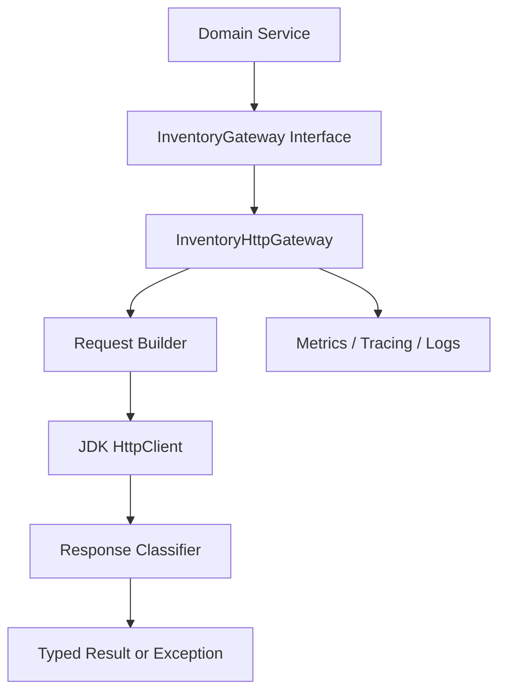

# Part 019 — JDK HttpClient for Microservice Calls

A production Java engineer should understand at least one HTTP client without a framework hiding the mechanics.

That client is `java.net.http.HttpClient`.

It is not always the best ergonomic choice. It is not a full service-client framework. It does not give you automatic service discovery, typed API contracts, retries, circuit breakers, metrics, tracing, or business-aware error handling out of the box.

But it is extremely important because it exposes the real shape of an outbound HTTP call:

```text
URI
method
headers
body publisher
client configuration
request timeout
response body handler
status code
response headers
response body
exception path
```

If you cannot build a safe service-to-service client with this, you probably do not understand the client hidden behind your higher-level abstraction either.

This part uses JDK `HttpClient` as the baseline implementation model for outbound HTTP communication.

---

## 1. What JDK HttpClient Actually Is

`HttpClient` is the standard Java HTTP client API in module `java.net.http`.

Its core types are:

```text
HttpClient
HttpRequest
HttpResponse
HttpRequest.BodyPublisher
HttpResponse.BodyHandler
HttpResponse.BodySubscriber
WebSocket
```

The official API model is simple:

```java
HttpClient client = HttpClient.newBuilder()
    .version(HttpClient.Version.HTTP_2)
    .connectTimeout(Duration.ofMillis(500))
    .followRedirects(HttpClient.Redirect.NEVER)
    .build();

HttpRequest request = HttpRequest.newBuilder()
    .uri(URI.create("https://inventory.internal/v1/items/sku-123"))
    .timeout(Duration.ofSeconds(2))
    .header("Accept", "application/json")
    .GET()
    .build();

HttpResponse<String> response = client.send(
    request,
    HttpResponse.BodyHandlers.ofString()
);
```

But the production interpretation is deeper:

```text
HttpClient  = reusable transport owner
HttpRequest = immutable single outbound attempt description
BodyHandler = response consumption policy
send        = blocking execution path
sendAsync   = CompletableFuture execution path
```

Do not treat `HttpClient` as a convenience object.

Treat it as an outbound transport resource.

---

## 2. The Most Important Rule: Reuse the Client

`HttpClient` instances are immutable after construction and can be reused for multiple requests. The JDK implementation normally owns connection pools and connection reuse for requests sent through that client.

So this is wrong in service code:

```java
public Product fetchProduct(String id) throws Exception {
    HttpClient client = HttpClient.newHttpClient(); // bad
    HttpRequest request = HttpRequest.newBuilder()
        .uri(URI.create("https://catalog.internal/products/" + id))
        .GET()
        .build();
    return parse(client.send(request, BodyHandlers.ofString()).body());
}
```

It looks harmless. It is not.

Creating a client per operation tends to destroy connection reuse, increases TLS handshakes, increases socket churn, amplifies latency, and makes outbound behavior harder to observe.

The safer shape:

```java
public final class CatalogHttpClient {
    private final HttpClient http;
    private final URI baseUri;
    private final ObjectMapper objectMapper;

    public CatalogHttpClient(HttpClient http, URI baseUri, ObjectMapper objectMapper) {
        this.http = Objects.requireNonNull(http);
        this.baseUri = Objects.requireNonNull(baseUri);
        this.objectMapper = Objects.requireNonNull(objectMapper);
    }

    public Product fetchProduct(String productId) {
        // build request, send through shared client
    }
}
```

Application wiring:

```java
HttpClient sharedHttpClient = HttpClient.newBuilder()
    .version(HttpClient.Version.HTTP_2)
    .connectTimeout(Duration.ofMillis(300))
    .followRedirects(HttpClient.Redirect.NEVER)
    .build();
```

The client is shared. Requests are per call.

That one distinction removes many production problems.

---

## 3. Do Not Expose HttpClient Directly to Domain Code

A common mistake is to inject `HttpClient` everywhere.

```java
class OrderService {
    private final HttpClient httpClient;

    public void placeOrder(...) {
        // builds inventory URL
        // builds payment URL
        // knows headers
        // parses status codes
        // parses JSON
        // retries inconsistently
    }
}
```

That leaks communication mechanics into business logic.

A better boundary:

```text
Domain service depends on a capability interface.
Infrastructure implements that interface using HttpClient.
```

Example:

```java
public interface InventoryGateway {
    ReservationResult reserve(ReserveInventoryCommand command, RequestContext context);
}
```

Implementation:

```java
public final class InventoryHttpGateway implements InventoryGateway {
    private final HttpClient http;
    private final URI baseUri;
    private final ObjectMapper json;
    private final Duration timeout;

    public InventoryHttpGateway(
        HttpClient http,
        URI baseUri,
        ObjectMapper json,
        Duration timeout
    ) {
        this.http = http;
        this.baseUri = baseUri;
        this.json = json;
        this.timeout = timeout;
    }

    @Override
    public ReservationResult reserve(ReserveInventoryCommand command, RequestContext context) {
        // HTTP details stay here
    }
}
```

The domain service should not know:

- the remote endpoint path;
- `Content-Type` value;
- correlation header names;
- retry classification;
- JSON parse mechanics;
- HTTP status mapping;
- `HttpTimeoutException` vs `IOException`;
- whether the call uses JDK client, Apache client, gRPC, or a local fake.

The service-client class is the anti-corruption boundary.

---

## 4. Recommended Client Shape

A production outbound client should have this structure:

```text
Typed interface
  ↓
Service-specific client implementation
  ↓
Request builder
  ↓
Transport execution wrapper
  ↓
Response classifier
  ↓
Error mapper
  ↓
Telemetry
```

Mermaid view:



The key point: `HttpClient` is only one small part of a real outbound client.

---

## 5. Configuration Model

Do not scatter timeouts and URLs inside methods.

Use a small service-client configuration object:

```java
public record ServiceClientConfig(
    URI baseUri,
    Duration connectTimeout,
    Duration requestTimeout,
    HttpClient.Version preferredVersion,
    int maxResponseBytes
) {
    public ServiceClientConfig {
        Objects.requireNonNull(baseUri);
        Objects.requireNonNull(connectTimeout);
        Objects.requireNonNull(requestTimeout);
        Objects.requireNonNull(preferredVersion);

        if (connectTimeout.isNegative() || connectTimeout.isZero()) {
            throw new IllegalArgumentException("connectTimeout must be positive");
        }
        if (requestTimeout.isNegative() || requestTimeout.isZero()) {
            throw new IllegalArgumentException("requestTimeout must be positive");
        }
        if (maxResponseBytes <= 0) {
            throw new IllegalArgumentException("maxResponseBytes must be positive");
        }
    }
}
```

Then build the shared transport:

```java
public final class HttpClientFactory {
    public static HttpClient create(ServiceClientConfig config) {
        return HttpClient.newBuilder()
            .connectTimeout(config.connectTimeout())
            .version(config.preferredVersion())
            .followRedirects(HttpClient.Redirect.NEVER)
            .build();
    }
}
```

Why `followRedirects(NEVER)`?

Internal service-to-service clients should not silently follow redirects unless the redirect is part of an explicit contract. A redirect can hide routing mistakes, service mesh misconfiguration, cross-zone calls, or accidental dependency on edge behavior.

If a service returns 301/302/307/308 internally, classify it deliberately.

---

## 6. Connect Timeout vs Request Timeout

JDK `HttpClient` has client-level connect timeout and request-level timeout.

These are not the same.

```text
connect timeout:
  upper bound for establishing a connection

request timeout:
  upper bound for the request/response exchange as represented by the request
```

Example:

```java
HttpClient client = HttpClient.newBuilder()
    .connectTimeout(Duration.ofMillis(300))
    .build();

HttpRequest request = HttpRequest.newBuilder()
    .uri(uri)
    .timeout(Duration.ofSeconds(2))
    .GET()
    .build();
```

Production rule:

```text
Every outbound request must have an explicit request timeout.
```

Do not rely only on `connectTimeout`.

A connection can be established successfully and then the response can hang. A server can accept the request and stall while reading. A proxy can buffer. A peer can stream slowly. A TLS session can succeed and the application can still fail to respond.

A safe outbound client therefore has:

```text
connect timeout
request timeout
caller deadline
retry budget
pool acquisition timeout, if the underlying client exposes one
```

JDK `HttpClient` exposes the first two directly. The others must be implemented around it or handled by a higher-level library/framework.

---

## 7. Timeout Is Not a Retry Policy

A timeout answers:

```text
How long am I willing to wait?
```

It does not answer:

```text
Was the remote operation applied?
Is retry safe?
How many attempts are allowed?
What backoff should I use?
How do I prevent retry storms?
```

This is a dangerous pattern:

```java
try {
    return callRemote();
} catch (HttpTimeoutException e) {
    return callRemote(); // dangerous
}
```

Why dangerous?

Because timeout creates an unknown outcome.

The server may have:

- never received the request;
- received it but not processed it;
- processed it and failed to respond;
- processed it and the response was lost;
- queued it behind slow work;
- committed side effects after the caller gave up.

For non-idempotent commands, retry requires an idempotency key or another deduplication mechanism.

Example safe command header:

```java
String idempotencyKey = context.idempotencyKey().orElseThrow();

HttpRequest request = HttpRequest.newBuilder()
    .uri(baseUri.resolve("/v1/reservations"))
    .timeout(timeout)
    .header("Content-Type", "application/json")
    .header("Accept", "application/json")
    .header("Idempotency-Key", idempotencyKey)
    .POST(HttpRequest.BodyPublishers.ofString(jsonBody))
    .build();
```

No idempotency key, no automatic retry for side-effecting commands.

---

## 8. Request Building Pattern

Do not build URIs by string concatenation.

Bad:

```java
URI uri = URI.create(baseUri + "/v1/products/" + productId + "?expand=" + expand);
```

Problems:

- missing escaping;
- double slash bugs;
- path traversal hazards;
- query encoding errors;
- inconsistent route labels;
- weak testability.

A simple internal URI builder is often enough:

```java
public final class Uris {
    private Uris() {}

    public static URI resolvePath(URI baseUri, String... segments) {
        StringBuilder path = new StringBuilder(baseUri.getPath() == null ? "" : baseUri.getPath());
        for (String segment : segments) {
            if (!path.toString().endsWith("/")) {
                path.append('/');
            }
            path.append(URLEncoder.encode(segment, StandardCharsets.UTF_8).replace("+", "%20"));
        }
        return baseUri.resolve(path.toString());
    }
}
```

For real production systems, prefer a proven URI builder from your framework, but keep the invariant:

```text
The service client owns URI construction.
```

Not the domain service. Not the controller. Not random call sites.

---

## 9. Header Policy

A service client should add only headers that are part of a known propagation policy.

Example request context:

```java
public record RequestContext(
    String traceparent,
    Optional<String> tracestate,
    String correlationId,
    Optional<String> tenantId,
    Optional<String> actorId,
    Optional<String> idempotencyKey,
    Instant deadline
) {}
```

Header application:

```java
private static void applyContext(HttpRequest.Builder builder, RequestContext context) {
    builder.header("traceparent", context.traceparent());
    context.tracestate().ifPresent(value -> builder.header("tracestate", value));
    builder.header("X-Correlation-Id", context.correlationId());
    context.tenantId().ifPresent(value -> builder.header("X-Tenant-Id", value));
    context.actorId().ifPresent(value -> builder.header("X-Actor-Id", value));
    context.idempotencyKey().ifPresent(value -> builder.header("Idempotency-Key", value));

    long remainingMillis = Math.max(0, Duration.between(Instant.now(), context.deadline()).toMillis());
    builder.header("X-Request-Timeout-Ms", Long.toString(remainingMillis));
}
```

Important: do not blindly forward all inbound headers.

Blind forwarding leaks:

- browser headers;
- authorization tokens to the wrong downstream;
- internal routing metadata;
- stale correlation values;
- spoofable tenant/user context;
- excessive baggage;
- headers that break HTTP client restrictions.

Create an allowlist.

---

## 10. BodyPublisher Policy

JDK `HttpRequest.BodyPublishers` gives you body options.

Common choices:

```java
HttpRequest.BodyPublishers.noBody()
HttpRequest.BodyPublishers.ofString(json)
HttpRequest.BodyPublishers.ofByteArray(bytes)
HttpRequest.BodyPublishers.ofFile(path)
HttpRequest.BodyPublishers.fromPublisher(publisher)
```

Production implications:

| Body publisher | Use when | Risk |
|---|---|---|
| `noBody()` | `GET`, `DELETE`, simple commands with no payload | accidentally omitting required command body |
| `ofString()` | small JSON payloads | memory cost if body is large |
| `ofByteArray()` | binary payload already in memory | duplicate memory pressure |
| `ofFile()` | upload from disk | file lifecycle and permission issues |
| `fromPublisher()` | streaming/reactive source | harder error/backpressure handling |

For normal service-to-service JSON calls, `ofString` is acceptable if payload size is bounded.

```java
String jsonBody = objectMapper.writeValueAsString(command);

if (jsonBody.getBytes(StandardCharsets.UTF_8).length > maxRequestBytes) {
    throw new IllegalArgumentException("request body too large");
}

HttpRequest.BodyPublisher body = HttpRequest.BodyPublishers.ofString(jsonBody, StandardCharsets.UTF_8);
```

A production client must define payload limits before a downstream incident defines them for you.

---

## 11. BodyHandler Policy

`BodyHandler` is not just a parser. It is a response consumption strategy.

Common choices:

```java
HttpResponse.BodyHandlers.ofString()
HttpResponse.BodyHandlers.ofByteArray()
HttpResponse.BodyHandlers.ofInputStream()
HttpResponse.BodyHandlers.discarding()
HttpResponse.BodyHandlers.ofFile(path)
```

Defaulting to `ofString()` is fine for bounded JSON responses. It is not fine for unbounded exports, binary files, or accidental huge error bodies.

A safer pattern is to classify status before expensive deserialization.

```java
HttpResponse<String> response = http.send(request, HttpResponse.BodyHandlers.ofString(StandardCharsets.UTF_8));

int status = response.statusCode();
String body = response.body();

if (status >= 200 && status < 300) {
    return json.readValue(body, Product.class);
}

throw mapError(status, response.headers(), body);
```

This still reads the whole body. If responses can be large, use a bounded body subscriber or stream to file.

For most internal JSON APIs, enforce a response-size policy at the server/gateway and client. A client that accepts unlimited body size is not production-grade.

---

## 12. Response Classification

Do not let every call site interpret status codes independently.

Create a classifier:

```java
public enum ResponseKind {
    SUCCESS,
    VALIDATION_FAILURE,
    DOMAIN_CONFLICT,
    NOT_FOUND,
    AUTHENTICATION_FAILURE,
    AUTHORIZATION_FAILURE,
    RATE_LIMITED,
    OVERLOADED,
    DEPENDENCY_FAILURE,
    UNKNOWN_REMOTE_ERROR,
    PROTOCOL_ERROR
}
```

Example:

```java
public final class HttpStatusClassifier {
    public ResponseKind classify(int status) {
        return switch (status) {
            case 200, 201, 202, 204 -> ResponseKind.SUCCESS;
            case 400, 422 -> ResponseKind.VALIDATION_FAILURE;
            case 401 -> ResponseKind.AUTHENTICATION_FAILURE;
            case 403 -> ResponseKind.AUTHORIZATION_FAILURE;
            case 404 -> ResponseKind.NOT_FOUND;
            case 409 -> ResponseKind.DOMAIN_CONFLICT;
            case 429 -> ResponseKind.RATE_LIMITED;
            case 503 -> ResponseKind.OVERLOADED;
            case 502, 504 -> ResponseKind.DEPENDENCY_FAILURE;
            default -> {
                if (status >= 500) yield ResponseKind.UNKNOWN_REMOTE_ERROR;
                yield ResponseKind.PROTOCOL_ERROR;
            }
        };
    }
}
```

Then the client maps response kind to domain-level outcomes.

Example:

```java
private Product parseProductResponse(HttpResponse<String> response) {
    ResponseKind kind = classifier.classify(response.statusCode());

    return switch (kind) {
        case SUCCESS -> read(response.body(), Product.class);
        case NOT_FOUND -> throw new ProductNotFoundException();
        case RATE_LIMITED, OVERLOADED -> throw new DownstreamUnavailableException("catalog overloaded");
        case DEPENDENCY_FAILURE, UNKNOWN_REMOTE_ERROR -> throw new DownstreamFailureException("catalog failed");
        default -> throw new DownstreamProtocolException("unexpected catalog response: " + response.statusCode());
    };
}
```

The caller should not see raw `404` unless raw HTTP is the domain.

---

## 13. Problem Details Parsing

When the server uses `application/problem+json`, parse it into a stable type.

```java
public record ProblemDetails(
    URI type,
    String title,
    int status,
    String detail,
    String instance,
    Map<String, Object> extensions
) {}
```

Then error mapping becomes explicit:

```java
private RuntimeException mapProblem(HttpResponse<String> response) {
    ProblemDetails problem = tryReadProblem(response.body());

    return switch (response.statusCode()) {
        case 409 -> new RemoteConflictException(problem.title(), problem.detail());
        case 422 -> new RemoteValidationException(problem.title(), problem.extensions());
        case 429 -> new RemoteRateLimitedException(problem.title(), retryAfter(response));
        case 503 -> new RemoteUnavailableException(problem.title(), retryAfter(response));
        default -> new RemoteHttpException(response.statusCode(), problem.title());
    };
}
```

But do not make business logic depend on free-form `detail` strings.

For machine decisions, use:

```text
status
problem.type
stable extension fields
headers such as Retry-After
```

Not human messages.

---

## 14. Synchronous Calls

`send` blocks until response or failure.

```java
HttpResponse<String> response;
try {
    response = http.send(request, HttpResponse.BodyHandlers.ofString());
} catch (HttpTimeoutException e) {
    throw new DownstreamTimeoutException("catalog timeout", e);
} catch (InterruptedException e) {
    Thread.currentThread().interrupt();
    throw new DownstreamInterruptedException("catalog call interrupted", e);
} catch (IOException e) {
    throw new DownstreamIoException("catalog I/O failure", e);
}
```

Notice the `InterruptedException` handling.

Do not swallow interruption.

Correct pattern:

```java
catch (InterruptedException e) {
    Thread.currentThread().interrupt();
    throw new DownstreamInterruptedException(..., e);
}
```

A blocking call is not automatically bad.

With platform threads, blocking calls consume scarce carrier threads. With virtual threads, blocking I/O can be much more scalable at the application-thread level. But virtual threads do not remove downstream capacity limits. They make it easier to create more concurrent calls than your dependency can survive.

So even with virtual threads, keep:

```text
timeouts
bulkheads
rate limits
connection limits
concurrency limits
retry budgets
```

Virtual threads improve the calling model. They do not make distributed systems safe.

---

## 15. Asynchronous Calls

`sendAsync` returns `CompletableFuture<HttpResponse<T>>`.

```java
CompletableFuture<Product> future = http
    .sendAsync(request, HttpResponse.BodyHandlers.ofString())
    .thenApply(this::parseProductResponse);
```

This is useful for:

- fan-out calls;
- parallel independent queries;
- non-blocking composition;
- low-level libraries;
- gateway aggregation.

But it introduces new risks:

- unbounded concurrency;
- complicated cancellation;
- error wrapping in `CompletionException`;
- difficult deadline propagation;
- hidden executor behavior;
- lost context if trace/log context is thread-local.

A safe fan-out call must bound concurrency:

```java
public CompletableFuture<List<Product>> fetchProducts(List<String> ids, RequestContext context) {
    Semaphore limit = new Semaphore(20);

    List<CompletableFuture<Product>> futures = ids.stream()
        .map(id -> CompletableFuture.supplyAsync(() -> {
            try {
                limit.acquire();
                return fetchProduct(id, context);
            } catch (InterruptedException e) {
                Thread.currentThread().interrupt();
                throw new CompletionException(e);
            } finally {
                limit.release();
            }
        }))
        .toList();

    return CompletableFuture
        .allOf(futures.toArray(CompletableFuture[]::new))
        .thenApply(ignored -> futures.stream().map(CompletableFuture::join).toList());
}
```

This example uses blocking inside `supplyAsync`, which may or may not be what you want. The point is not the exact style. The point is the invariant:

```text
Parallel HTTP calls must have a concurrency limit.
```

---

## 16. Executor Choice

`HttpClient.Builder.executor(...)` lets you provide an executor.

```java
ExecutorService executor = Executors.newFixedThreadPool(64);

HttpClient client = HttpClient.newBuilder()
    .executor(executor)
    .connectTimeout(Duration.ofMillis(300))
    .build();
```

Be careful.

The executor is not a magic capacity limit for all downstream behavior. It may affect asynchronous and dependent tasks, but you should still model outbound concurrency explicitly.

A production client should answer:

```text
How many calls can be in flight to this dependency?
How many queued calls are allowed?
What happens when the queue is full?
Do calls fail fast or wait?
How is rejection reported?
```

That is a bulkhead policy, not merely an executor setting.

---

## 17. Minimal Production Client Example

Domain interface:

```java
public interface CatalogClient {
    Optional<ProductView> findProduct(String productId, RequestContext context);
}
```

Implementation:

```java
public final class JdkCatalogClient implements CatalogClient {
    private final HttpClient http;
    private final URI baseUri;
    private final ObjectMapper json;
    private final Duration timeout;
    private final HttpStatusClassifier classifier;

    public JdkCatalogClient(
        HttpClient http,
        URI baseUri,
        ObjectMapper json,
        Duration timeout,
        HttpStatusClassifier classifier
    ) {
        this.http = Objects.requireNonNull(http);
        this.baseUri = Objects.requireNonNull(baseUri);
        this.json = Objects.requireNonNull(json);
        this.timeout = Objects.requireNonNull(timeout);
        this.classifier = Objects.requireNonNull(classifier);
    }

    @Override
    public Optional<ProductView> findProduct(String productId, RequestContext context) {
        URI uri = baseUri.resolve("/v1/products/" + encodePath(productId));

        HttpRequest.Builder builder = HttpRequest.newBuilder()
            .uri(uri)
            .timeout(timeout)
            .header("Accept", "application/json")
            .GET();

        applyContext(builder, context);

        HttpRequest request = builder.build();

        HttpResponse<String> response = execute(request, "catalog.findProduct");
        ResponseKind kind = classifier.classify(response.statusCode());

        return switch (kind) {
            case SUCCESS -> Optional.of(read(response.body(), ProductView.class));
            case NOT_FOUND -> Optional.empty();
            case RATE_LIMITED, OVERLOADED -> throw new DownstreamUnavailableException("catalog unavailable");
            case DEPENDENCY_FAILURE, UNKNOWN_REMOTE_ERROR -> throw new DownstreamFailureException("catalog failed");
            default -> throw new DownstreamProtocolException("unexpected catalog response: " + response.statusCode());
        };
    }

    private HttpResponse<String> execute(HttpRequest request, String operation) {
        long started = System.nanoTime();
        try {
            HttpResponse<String> response = http.send(request, HttpResponse.BodyHandlers.ofString(StandardCharsets.UTF_8));
            recordMetrics(operation, response.statusCode(), System.nanoTime() - started, null);
            return response;
        } catch (HttpTimeoutException e) {
            recordMetrics(operation, 0, System.nanoTime() - started, "timeout");
            throw new DownstreamTimeoutException("catalog timeout", e);
        } catch (InterruptedException e) {
            Thread.currentThread().interrupt();
            recordMetrics(operation, 0, System.nanoTime() - started, "interrupted");
            throw new DownstreamInterruptedException("catalog interrupted", e);
        } catch (IOException e) {
            recordMetrics(operation, 0, System.nanoTime() - started, "io_error");
            throw new DownstreamIoException("catalog I/O error", e);
        }
    }

    private <T> T read(String body, Class<T> type) {
        try {
            return json.readValue(body, type);
        } catch (JsonProcessingException e) {
            throw new DownstreamProtocolException("invalid catalog JSON", e);
        }
    }

    private static String encodePath(String value) {
        return URLEncoder.encode(value, StandardCharsets.UTF_8).replace("+", "%20");
    }

    private static void recordMetrics(String operation, int status, long nanos, String error) {
        // integrate with Micrometer/OpenTelemetry in real code
    }
}
```

This is still minimal. Real production code would add:

- tracing span creation;
- bounded response body handling;
- retry policy for safe operations;
- circuit breaker;
- bulkhead;
- structured logs;
- endpoint route labels;
- retry-after handling;
- better URI construction;
- config validation;
- test fixtures.

But the shape is already correct.

---

## 18. Exception Taxonomy

Do not leak raw transport exceptions everywhere.

Define a small exception taxonomy:

```java
public abstract class DownstreamException extends RuntimeException {
    private final String dependency;
    private final boolean retryable;

    protected DownstreamException(String dependency, boolean retryable, String message, Throwable cause) {
        super(message, cause);
        this.dependency = dependency;
        this.retryable = retryable;
    }

    public String dependency() {
        return dependency;
    }

    public boolean retryable() {
        return retryable;
    }
}
```

Subtypes:

```java
public final class DownstreamTimeoutException extends DownstreamException {
    public DownstreamTimeoutException(String message, Throwable cause) {
        super("catalog", true, message, cause);
    }
}

public final class DownstreamProtocolException extends DownstreamException {
    public DownstreamProtocolException(String message) {
        super("catalog", false, message, null);
    }

    public DownstreamProtocolException(String message, Throwable cause) {
        super("catalog", false, message, cause);
    }
}
```

Why not expose `IOException`?

Because `IOException` does not tell the domain layer what to do.

The domain layer needs meaning:

```text
dependency unavailable
dependency rejected command
dependency returned invalid response
dependency timed out
dependency overloaded
caller request invalid
```

Not low-level Java mechanics.

---

## 19. Retry Integration

JDK `HttpClient` has implementation-level behaviors and system properties related to connection retries. Do not treat those as your service reliability strategy.

Production retry must be explicit and semantically aware.

A retry decision requires:

```text
operation type
HTTP method
idempotency key presence
status code
exception type
remaining deadline
attempt count
backoff policy
retry budget
```

Pseudo-code:

```java
public <T> T executeWithRetry(Callable<T> call, RetryPolicy policy, OperationMetadata metadata) {
    int attempt = 0;
    Throwable last = null;

    while (attempt < policy.maxAttempts()) {
        attempt++;
        try {
            return call.call();
        } catch (Throwable e) {
            last = e;
            if (!policy.canRetry(e, metadata, attempt)) {
                break;
            }
            sleep(policy.backoffForAttempt(attempt));
        }
    }

    throw propagate(last);
}
```

Key invariant:

```text
Retries belong outside the raw HTTP call but inside the service-client boundary.
```

Not in controllers. Not in domain workflows. Not randomly at each call site.

---

## 20. Redirects

For internal clients, prefer:

```java
.followRedirects(HttpClient.Redirect.NEVER)
```

Why?

Because internal redirects are rarely normal business semantics. They may indicate:

- wrong base URL;
- moved endpoint without contract migration;
- gateway rewrite bug;
- proxy routing issue;
- accidental HTTP-to-HTTPS mismatch;
- cross-region/cross-cluster traffic;
- edge behavior leaking into internal systems.

If redirects are expected, model them explicitly.

```java
case 307, 308 -> throw new DownstreamProtocolException("unexpected redirect from catalog");
```

Do not silently mutate a `POST` to a redirected target unless you have designed for it.

---

## 21. HTTP Version Selection

JDK `HttpClient` can prefer HTTP/2 or HTTP/1.1.

```java
HttpClient client = HttpClient.newBuilder()
    .version(HttpClient.Version.HTTP_2)
    .build();
```

The request can also express a preferred version:

```java
HttpRequest request = HttpRequest.newBuilder()
    .uri(uri)
    .version(HttpClient.Version.HTTP_1_1)
    .GET()
    .build();
```

Use cases:

| Choice | When useful |
|---|---|
| HTTP/2 preferred | internal high-concurrency calls where peer/proxy supports it well |
| HTTP/1.1 forced | debugging, compatibility, proxy limitations, isolating HTTP/2 flow-control issues |
| request-specific version | one dependency behaves differently from others |

Do not assume HTTP/2 is always better. Measure under your own traffic shape.

Especially check:

- p50/p95/p99 latency;
- connection count;
- TLS handshake rate;
- retry frequency;
- stream reset rate;
- proxy behavior;
- large response interactions;
- flow-control stalls.

---

## 22. System Properties: Powerful but Dangerous

The JDK HTTP client has implementation-specific system properties for things like:

- HTTP/1.1 keep-alive cache size;
- keep-alive timeout;
- internal buffer size;
- HTTP/2 window sizes;
- maximum header size;
- logging;
- restricted headers;
- retry-related behavior.

These are not per-client business configuration knobs.

Treat them as platform-level tuning.

Bad:

```java
System.setProperty("jdk.httpclient.connectionPoolSize", "200");
```

inside application logic.

Better:

```text
document platform-level values
set them at JVM startup if needed
load-test before changing them
avoid relying on implementation internals for business correctness
```

If you need rich per-dependency pool controls, Apache HttpClient, Jetty, Reactor Netty, or a framework-level abstraction may be a better fit.

---

## 23. Observability Wrapper

A production client should emit telemetry per operation, not per raw URL.

Bad metric label:

```text
http.client.duration{url="/v1/products/sku-123"}
```

Good metric label:

```text
http.client.duration{dependency="catalog",operation="find_product",route="/v1/products/{id}",status="200"}
```

Wrapper shape:

```java
private HttpResponse<String> observeAndSend(
    String dependency,
    String operation,
    String route,
    HttpRequest request
) {
    long started = System.nanoTime();
    String outcome = "unknown";
    int status = 0;

    try {
        HttpResponse<String> response = http.send(request, BodyHandlers.ofString(StandardCharsets.UTF_8));
        status = response.statusCode();
        outcome = status >= 200 && status < 500 ? "completed" : "remote_error";
        return response;
    } catch (HttpTimeoutException e) {
        outcome = "timeout";
        throw new DownstreamTimeoutException(dependency + " timeout", e);
    } catch (InterruptedException e) {
        Thread.currentThread().interrupt();
        outcome = "interrupted";
        throw new DownstreamInterruptedException(dependency + " interrupted", e);
    } catch (IOException e) {
        outcome = "io_error";
        throw new DownstreamIoException(dependency + " I/O error", e);
    } finally {
        long elapsedNanos = System.nanoTime() - started;
        recordHttpClientMetric(dependency, operation, route, status, outcome, elapsedNanos);
    }
}
```

Keep labels bounded.

Never use high-cardinality labels such as raw product ID, user ID, tenant ID, request ID, or exception message.

---

## 24. Logging Policy

Log one structured event per failed call, not a wall of text per attempt.

Example fields:

```json
{
  "event": "downstream_http_call_failed",
  "dependency": "catalog",
  "operation": "find_product",
  "route": "/v1/products/{id}",
  "method": "GET",
  "status": 503,
  "outcome": "overloaded",
  "attempt": 1,
  "elapsed_ms": 487,
  "timeout_ms": 700,
  "trace_id": "...",
  "correlation_id": "..."
}
```

Do not log:

- full request body by default;
- full response body by default;
- authorization header;
- cookies;
- raw `baggage`;
- PII-heavy identifiers;
- full URLs with sensitive query params.

Log enough to debug routing, policy, and failure classification.

Not enough to leak production data.

---

## 25. Testing JDK HttpClient Clients

For service-client testing, avoid mocking `HttpClient` unless the logic is trivial.

Mocking `HttpClient` skips the behavior you actually need to test:

- URI construction;
- headers;
- method;
- body encoding;
- timeout behavior;
- status mapping;
- response parsing;
- network exception path.

Prefer a mock HTTP server:

```text
WireMock
OkHttp MockWebServer
MockServer
local test server
```

Test cases:

```text
200 valid JSON -> typed success
404 problem+json -> Optional.empty or not-found outcome
409 problem+json -> conflict exception
422 problem+json -> validation exception
429 Retry-After -> retryable rate-limit exception
503 -> unavailable exception
malformed JSON -> protocol exception
slow response -> timeout exception
connection reset -> I/O exception
unexpected redirect -> protocol exception
missing required header in request -> test failure
```

A useful test should assert the outbound request:

```java
assertThat(recordedRequest.getMethod()).isEqualTo("GET");
assertThat(recordedRequest.getPath()).isEqualTo("/v1/products/sku-123");
assertThat(recordedRequest.getHeader("traceparent")).isNotBlank();
assertThat(recordedRequest.getHeader("Accept")).isEqualTo("application/json");
```

This is contract pressure from the client side.

---

## 26. Anti-Patterns

### Anti-pattern 1: New client per request

```java
HttpClient.newHttpClient().send(request, BodyHandlers.ofString());
```

Consequence:

```text
poor connection reuse
more handshakes
more latency
more resource churn
```

### Anti-pattern 2: No request timeout

```java
HttpRequest.newBuilder(uri).GET().build();
```

Consequence:

```text
hung threads
unbounded latency
pool exhaustion
cascading failure
```

### Anti-pattern 3: Blindly parse success body

```java
Product p = objectMapper.readValue(response.body(), Product.class);
```

without checking status.

Consequence:

```text
misleading JSON errors
lost error semantics
wrong retry behavior
```

### Anti-pattern 4: Blind header propagation

```java
inboundHeaders.forEach((k, v) -> builder.header(k, v));
```

Consequence:

```text
security leaks
header spoofing
protocol errors
context explosion
```

### Anti-pattern 5: Raw URL metrics

```text
url=/v1/orders/9848293482934
```

Consequence:

```text
metric cardinality explosion
observability cost spike
dashboard degradation
```

### Anti-pattern 6: Retrying unsafe commands

```java
POST /payments
retry on timeout
```

without idempotency key.

Consequence:

```text
duplicate payments
duplicate reservations
irreversible side effects
regulatory/audit damage
```

---

## 27. When JDK HttpClient Is a Good Fit

Use it when:

- you want minimal dependencies;
- the client logic is simple;
- you control the service-client wrapper;
- you do not need advanced pool tuning;
- you are comfortable implementing telemetry/resilience around it;
- you want standard Java APIs;
- you have virtual-thread-oriented synchronous code;
- you need a lightweight internal client.

Avoid it or wrap it carefully when:

- you need rich per-route/per-host pool controls;
- you need mature retry/circuit breaker integration out of the box;
- you need complex proxy/TLS customization;
- you need deep metrics hooks from the transport;
- you use Spring and want message converters/interceptors/config integration;
- you need advanced streaming ergonomics.

The rule is not:

```text
Always use JDK HttpClient.
```

The rule is:

```text
Understand JDK HttpClient well enough that higher-level clients stop being magic.
```

---

## 28. Production Checklist

Before approving a JDK `HttpClient` service client, check:

```text
[ ] One shared HttpClient per dependency/config group
[ ] Explicit connect timeout
[ ] Explicit request timeout per request
[ ] Redirect policy is deliberate
[ ] HTTP version preference is deliberate
[ ] Header propagation is allowlisted
[ ] Idempotency key is used for retriable commands
[ ] Status codes are classified centrally
[ ] Problem Details is parsed when present
[ ] Raw transport exceptions are mapped
[ ] Metrics use bounded labels
[ ] Logs do not leak secrets or PII
[ ] Response size is bounded by policy
[ ] Parallel calls have concurrency limits
[ ] Retry policy is explicit, not accidental
[ ] Client is tested against a real mock HTTP server
[ ] Failure cases are tested, not only 200 OK
```

---

## 29. Mental Model Summary

`HttpClient` is not the client architecture.

It is the transport primitive inside the client architecture.

A production-grade Java HTTP client needs five layers:

```text
1. capability interface
2. service-specific implementation
3. request/response mapping
4. resilience policy
5. observability policy
```

JDK `HttpClient` gives you the execution primitive:

```text
send request
receive response
use HTTP/1.1 or HTTP/2
reuse connections
support sync and async calls
```

It does not decide:

```text
what status means
what is retryable
what headers are safe
what body size is acceptable
what timeout budget remains
what operation label to emit
what domain exception to throw
```

That is your engineering job.

A top-tier engineer does not ask, “Which HTTP client should I use?” first.

They ask:

```text
What are the communication invariants?
What is the failure model?
What policy must surround this call?
Can my client implementation enforce those rules every time?
```

Only then does library choice matter.

---

## References

- Oracle Java SE 25 API — `java.net.http.HttpClient`: https://docs.oracle.com/en/java/javase/25/docs/api/java.net.http/java/net/http/HttpClient.html
- Oracle Java SE 25 API — `java.net.http.HttpRequest`: https://docs.oracle.com/en/java/javase/25/docs/api/java.net.http/java/net/http/HttpRequest.html
- Oracle Java SE 25 API — `java.net.http` module summary and system properties: https://docs.oracle.com/en/java/javase/25/docs/api/java.net.http/module-summary.html
- RFC 9110 — HTTP Semantics: https://www.rfc-editor.org/rfc/rfc9110.html
- RFC 9457 — Problem Details for HTTP APIs: https://www.rfc-editor.org/rfc/rfc9457.html
- W3C Trace Context: https://www.w3.org/TR/trace-context/
- OpenTelemetry Semantic Conventions: https://opentelemetry.io/docs/specs/semconv/
