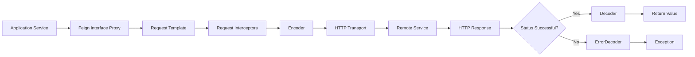

# Part 022 — OpenFeign: Declarative HTTP Clients and Their Hidden Costs

OpenFeign makes HTTP clients look like local Java interfaces.

That is both its strength and its biggest danger.

A Feign client can make remote communication feel clean:

```java
@FeignClient(name = "catalog", url = "${clients.catalog.base-url}")
public interface CatalogFeignClient {

    @GetMapping("/v1/products/{id}")
    ProductView getProduct(@PathVariable("id") String id);
}
```

This is attractive because the application code sees:

```java
ProductView product = catalogFeignClient.getProduct("p-123");
```

But the network did not become local.

This call still has:

```text
latency
partial failure
timeouts
retry ambiguity
unknown outcome
status mapping
serialization failure
connection pool pressure
load balancing behavior
observability requirements
contract drift
```

Spring Cloud OpenFeign integrates Feign into Spring Boot applications through auto-configuration, Spring Environment binding, Spring MVC annotations, encoders, decoders, and common Spring programming idioms. OpenFeign itself is a declarative web service client with pluggable encoders, decoders, annotation support, and error handling.

This part is about using Feign without lying to yourself that remote calls are local calls.

---

## 1. Core Mental Model

Feign is:

```text
Java interface
  + annotations describing HTTP mapping
  + encoder for request body
  + decoder for response body
  + contract parser
  + HTTP transport client
  + error decoder
  + retryer
  + request interceptors
  + optional load balancer / circuit breaker integration
```

In Spring Cloud OpenFeign:

```text
@FeignClient interface
  -> Spring proxy bean
  -> Feign invocation handler
  -> request template
  -> encoder/interceptors
  -> HTTP client
  -> response decoder/error decoder
  -> Java return value or exception
```

Mermaid view:



The interface is declarative.

The runtime behavior is still distributed-systems behavior.

---

## 2. When Feign Is a Good Fit

Feign is a good fit when:

| Need | Why Feign Helps |
|---|---|
| Mostly synchronous HTTP calls | Interface-based client is concise |
| Spring MVC-style annotations are familiar | Reduces client boilerplate |
| Internal APIs are stable | Declarative mapping remains readable |
| Team wants typed client boundaries | Interface acts as clear dependency seam |
| Calls are simple request/response | Feign's abstraction stays aligned |
| You want per-client configuration | Spring Cloud OpenFeign supports named clients/config |

Good examples:

```text
catalog lookup
pricing quote
customer profile read
policy evaluation request
case status query
small command with idempotency key
```

Feign shines when the communication is structurally simple and the operational policy is centralized.

---

## 3. When Feign Is a Bad Fit

Feign becomes awkward when:

| Situation | Why It Hurts |
|---|---|
| Streaming response | Feign is not the natural model |
| Complex reactive composition | WebClient is usually better |
| Large uploads/downloads | Need careful streaming and transport control |
| Per-call dynamic policy is complex | Interface annotations become insufficient |
| Fine-grained response handling | `RestClient.exchange()` or `WebClient.exchangeToMono()` may be clearer |
| You need cancellation-aware async flows | Feign's simple sync model can hide cancellation concerns |
| You need protocol features beyond HTTP | gRPC/messaging may fit better |

Feign is not a universal HTTP strategy.

It is a productivity tool for a specific class of synchronous HTTP APIs.

---

## 4. The Local-Call Illusion

This is the design smell:

```java
public CheckoutView checkout(CheckoutRequest request) {
    Customer customer = customerClient.getCustomer(request.customerId());
    Price price = pricingClient.quote(request.items());
    Inventory inventory = inventoryClient.reserve(request.items());
    Payment payment = paymentClient.authorize(request.payment());

    return CheckoutView.of(customer, price, inventory, payment);
}
```

It looks like local method calls.

Actually it is a distributed call chain:

```text
checkout
  -> customer
  -> pricing
  -> inventory
  -> payment
```

Failure implications:

```text
latency is cumulative if sequential
any dependency can fail
retry can duplicate commands
partial side effects can occur
thread is blocked while waiting
caller capacity is consumed
exception type may hide remote semantics
```

The code should force the reader to see remote boundaries.

Better naming:

```java
Customer customer = customerGateway.fetchCustomer(request.customerId());
Price price = pricingGateway.quote(request.items());
InventoryReservation reservation = inventoryGateway.reserveWithIdempotencyKey(command);
```

Avoid naming remote clients like local repositories.

Bad:

```java
customerRepository.findById(id)
```

Better:

```java
customerServiceClient.getCustomer(id)
customerGateway.fetchCustomer(id)
remoteCustomerClient.getCustomer(id)
```

The naming should preserve architectural honesty.

---

## 5. Basic Spring Cloud OpenFeign Client

A minimal client:

```java
@FeignClient(
    name = "catalogClient",
    url = "${clients.catalog.base-url}",
    configuration = CatalogFeignConfiguration.class
)
public interface CatalogFeignClient {

    @GetMapping(value = "/v1/products/{id}", produces = MediaType.APPLICATION_JSON_VALUE)
    ProductView getProduct(@PathVariable("id") String id);
}
```

Usage:

```java
@Service
public class ProductApplicationService {

    private final CatalogFeignClient catalog;

    public ProductApplicationService(CatalogFeignClient catalog) {
        this.catalog = catalog;
    }

    public ProductView getProduct(String id) {
        return catalog.getProduct(id);
    }
}
```

This is the easy version.

The production version must define:

```text
connect timeout
read timeout
retry policy
error decoder
request interceptor
logger level
underlying HTTP client
observability
idempotency propagation
status-code mapping
```

---

## 6. Do Not Expose Feign Everywhere

A common anti-pattern:

```text
controllers call Feign clients directly
services call Feign clients directly
scheduled jobs call Feign clients directly
event consumers call Feign clients directly
```

This spreads remote semantics across the codebase.

Prefer a gateway wrapper:

```java
public interface CatalogGateway {
    ProductView getProduct(ProductId id);
    Optional<ProductView> findProduct(ProductId id);
}
```

Implementation:

```java
@Component
public final class FeignCatalogGateway implements CatalogGateway {

    private final CatalogFeignClient client;

    public FeignCatalogGateway(CatalogFeignClient client) {
        this.client = client;
    }

    @Override
    public ProductView getProduct(ProductId id) {
        try {
            return client.getProduct(id.value());
        } catch (ProductNotFoundRemoteException e) {
            throw new ProductNotFoundException(id, e);
        } catch (CatalogRemoteUnavailableException e) {
            throw new CatalogUnavailableException(id, e);
        }
    }

    @Override
    public Optional<ProductView> findProduct(ProductId id) {
        try {
            return Optional.of(client.getProduct(id.value()));
        } catch (ProductNotFoundRemoteException e) {
            return Optional.empty();
        }
    }
}
```

The Feign interface should be infrastructure detail.

The application should depend on domain-relevant gateway semantics.

---

## 7. Per-Client Configuration

A production Feign client needs explicit configuration.

Example:

```java
@Configuration
public class CatalogFeignConfiguration {

    @Bean
    public Request.Options catalogRequestOptions() {
        return new Request.Options(
            200, TimeUnit.MILLISECONDS,  // connect timeout
            500, TimeUnit.MILLISECONDS,  // read timeout
            true                         // follow redirects
        );
    }

    @Bean
    public Retryer catalogRetryer() {
        return Retryer.NEVER_RETRY;
    }

    @Bean
    public ErrorDecoder catalogErrorDecoder(ObjectMapper objectMapper) {
        return new CatalogErrorDecoder(objectMapper);
    }

    @Bean
    public RequestInterceptor correlationHeadersInterceptor() {
        return template -> {
            RequestContext ctx = RequestContextHolder.currentOrAnonymous();
            template.header("X-Request-Id", ctx.requestId());
            template.header("X-Correlation-Id", ctx.correlationId());
        };
    }
}
```

Use defaults only after you know what they are and why they are safe for your system.

---

## 8. Timeout Design

Feign timeouts are usually described as:

```text
connect timeout
read timeout
```

But production timeout design also needs:

```text
caller deadline
retry budget
connection pool acquisition behavior
DNS behavior
TLS handshake behavior
load balancer behavior
proxy/gateway timeout
server timeout
```

A Feign method should not have an arbitrary timeout.

It should have a timeout derived from:

```text
operation criticality
user-facing SLO
downstream latency distribution
number of attempts
caller remaining budget
fallback availability
```

Example:

```text
User request SLO: 1000 ms
Checkout service local work: 150 ms
Remaining for downstream required calls: 850 ms
Catalog lookup budget: 200 ms
Pricing quote budget: 250 ms
Inventory reservation budget: 300 ms
Safety margin: 100 ms
```

If all Feign clients use a 5-second read timeout, the service does not have an intentional latency model.

---

## 9. Retryer: Defaulting to Safety

Feign has retry support, but automatic retry is dangerous if not tied to operation semantics.

Safe baseline:

```java
@Bean
public Retryer retryer() {
    return Retryer.NEVER_RETRY;
}
```

Then add retries only for operations that are explicitly safe.

For read-only idempotent lookup:

```java
@Bean
public Retryer catalogLookupRetryer() {
    return new Retryer.Default(
        50,                    // initial period in ms
        TimeUnit.MILLISECONDS.toMillis(200),
        2                      // max attempts
    );
}
```

But even this must be paired with an error decoder that marks only retryable conditions as retryable.

Retry candidates:

```text
connect timeout before request was sent
connection refused
transient 503
429 if policy permits and budget remains
idempotent GET
idempotent command with idempotency key
```

Do not retry:

```text
400 validation error
401/403 auth/authz failure
404 normal absence
409 business conflict
422 semantic validation failure
non-idempotent POST without idempotency key
unknown outcome after command may have been committed
```

---

## 10. ErrorDecoder

Feign's `ErrorDecoder` maps non-2xx responses to exceptions.

A production error decoder should preserve semantics:

```java
public final class CatalogErrorDecoder implements ErrorDecoder {

    private final ObjectMapper objectMapper;

    public CatalogErrorDecoder(ObjectMapper objectMapper) {
        this.objectMapper = objectMapper;
    }

    @Override
    public Exception decode(String methodKey, Response response) {
        RemoteProblem problem = readProblem(response);
        int status = response.status();

        return switch (status) {
            case 400, 422 -> new CatalogValidationRemoteException(problem, methodKey);
            case 404 -> new ProductNotFoundRemoteException(problem, methodKey);
            case 409 -> new CatalogConflictRemoteException(problem, methodKey);
            case 429 -> new CatalogThrottledRemoteException(problem, methodKey, retryAfter(response));
            case 503 -> new CatalogRemoteUnavailableException(problem, methodKey, true);
            default -> {
                if (status >= 500) {
                    yield new CatalogRemoteUnavailableException(problem, methodKey, true);
                }
                yield new CatalogProtocolException(problem, methodKey, status);
            }
        };
    }

    private RemoteProblem readProblem(Response response) {
        if (response.body() == null) {
            return RemoteProblem.unknown();
        }

        try (InputStream input = response.body().asInputStream()) {
            byte[] capped = input.readNBytes(16 * 1024);
            return objectMapper.readValue(capped, RemoteProblem.class);
        } catch (Exception ignored) {
            return RemoteProblem.unknown();
        }
    }

    private Optional<Duration> retryAfter(Response response) {
        Collection<String> values = response.headers().getOrDefault("Retry-After", List.of());
        return values.stream().findFirst().flatMap(RetryAfterParser::parse);
    }
}
```

Important details:

```text
cap error body size
handle missing body
handle invalid JSON
preserve status code
preserve remote error code
include method key / operation
mark retryability explicitly
do not log raw body by default
```

---

## 11. RetryableException and ErrorDecoder

Feign retry typically depends on exceptions that the retryer treats as retryable.

If you want a 503 to retry, the decoder must return a retryable exception or your resilience layer must classify it accordingly.

Conceptual example:

```java
if (response.status() == 503 && isIdempotent(methodKey)) {
    return new RetryableException(
        response.status(),
        "catalog unavailable",
        response.request().httpMethod(),
        cause,
        retryAfterInstant,
        response.request()
    );
}
```

But beware: mapping many errors to retryable exceptions creates retry storms.

A safer architecture is:

```text
Feign retryer disabled by default
resilience policy applied in gateway layer
retry classifier uses operation metadata
idempotency key required for retryable commands
retry budget enforced per request
```

---

## 12. Idempotency with Feign Commands

For command APIs, Feign's method call syntax hides the most important question:

```text
What happens if the request times out after the server commits?
```

Example command:

```java
@PostMapping("/v1/reservations")
ReservationView reserve(
    @RequestHeader("Idempotency-Key") String idempotencyKey,
    @RequestBody ReservationCommand command
);
```

Gateway:

```java
public Reservation reserve(ReserveInventoryCommand command) {
    String key = idempotencyKeyFactory.forCommand(command.commandId());

    try {
        ReservationView view = client.reserve(key, ReservationCommandDto.from(command));
        return ReservationMapper.toDomain(view);
    } catch (InventoryRemoteUnavailableException e) {
        throw new ReservationOutcomeUnknownException(command.commandId(), e);
    }
}
```

Timeout after command submission should often map to:

```text
outcome unknown
```

Not simply:

```text
failed
```

If a command is not idempotent, retries are usually unsafe.

---

## 13. RequestInterceptor

Request interceptors are useful for cross-cutting request metadata.

Example:

```java
@Bean
RequestInterceptor requestContextInterceptor() {
    return template -> {
        RequestContext ctx = RequestContextHolder.currentOrAnonymous();

        template.header("X-Request-Id", ctx.requestId());
        template.header("X-Correlation-Id", ctx.correlationId());
        template.header("X-Deadline-Ms", Long.toString(ctx.deadlineEpochMillis()));

        ctx.idempotencyKey().ifPresent(key ->
            template.header("Idempotency-Key", key)
        );
    };
}
```

Do not use request interceptors for:

```text
hidden remote calls
dynamic blocking token refresh without timeout
large payload mutation
random retry logic
application-specific business branching
```

Interceptors should be fast, deterministic, and observable.

---

## 14. Authentication and Authorization Context

This series does not repeat the authentication/authorization material.

For communication, the important rules are:

```text
propagate only allowed identity/security context
never blindly forward all inbound headers
separate end-user identity from service identity
redact credentials in logs
control token audience and scope
keep auth failure distinct from dependency failure
```

In Feign, this usually means a request interceptor injects a service token or selected propagated token:

```java
@Bean
RequestInterceptor serviceTokenInterceptor(ServiceTokenProvider tokenProvider) {
    return template -> template.header(
        HttpHeaders.AUTHORIZATION,
        "Bearer " + tokenProvider.tokenForAudience("catalog")
    );
}
```

Do not forward `Authorization` automatically across all clients unless the architecture explicitly requires and constrains it.

---

## 15. Underlying HTTP Client

Feign is not the transport itself.

It delegates to an HTTP client implementation.

The chosen transport affects:

```text
connection pooling
TLS behavior
HTTP version support
timeout precision
proxy support
metrics availability
compression behavior
resource cleanup
```

Production design should explicitly choose and configure the transport.

Conceptual decision:

| Transport | Why Choose It |
|---|---|
| Apache HttpClient | Mature pooling and configuration |
| OkHttp | Good client behavior and HTTP/2 support |
| JDK HttpClient | JDK-native, lower dependency footprint |
| Default/simple | Usually insufficient for serious production use |

The exact supported transport options depend on the Spring Cloud OpenFeign version and dependency set. Pin and verify them in your platform baseline.

---

## 16. Load Balancing and Service Discovery

Feign can be used with a fixed URL:

```java
@FeignClient(name = "catalog", url = "${clients.catalog.base-url}")
```

Or with service discovery/load-balancing integration:

```java
@FeignClient(name = "catalog")
```

In the second case, `catalog` is resolved through the configured discovery/load-balancing mechanism.

Questions to answer:

```text
Who resolves service instances?
How often is discovery refreshed?
What happens when an instance is unhealthy?
Is load balancing client-side, gateway-side, or mesh-side?
Are retries aware of instance selection?
Can retry hit a different instance?
How are zones/locality handled?
```

Do not accidentally combine multiple load-balancing layers with conflicting retry policies:

```text
Feign retry
+ client-side load balancer retry
+ service mesh retry
+ gateway retry
= retry amplification
```

Only one layer should own retry for a given call path unless there is a very deliberate policy.

---

## 17. Circuit Breaker Placement

A circuit breaker should protect the caller from a failing dependency.

With Feign, options include:

```text
Spring Cloud circuit breaker integration
Resilience4j around gateway method
service mesh outlier detection
manual wrapper policy
```

A clear gateway-layer approach:

```java
public ProductView getProduct(ProductId id) {
    Supplier<ProductView> supplier = CircuitBreaker.decorateSupplier(
        catalogCircuitBreaker,
        () -> client.getProduct(id.value())
    );

    try {
        return supplier.get();
    } catch (CallNotPermittedException e) {
        throw new CatalogUnavailableException("catalog circuit open", e);
    }
}
```

This makes the communication policy visible at the gateway boundary.

Avoid fallback methods that silently fabricate critical data.

Good fallback:

```text
optional recommendation returns empty recommendation list
```

Bad fallback:

```text
payment authorization returns approved
inventory reservation returns successful
compliance screening returns clear
```

---

## 18. Fallbacks Are Semantic Decisions

Feign makes fallback patterns tempting.

But fallback is not a resilience decoration. It is a product/domain behavior.

Ask:

```text
Is stale data acceptable?
Is missing data acceptable?
Will fallback violate compliance or accounting?
Will the user see degraded result?
How is fallback measured?
How do we avoid hiding dependency incidents?
```

Examples:

| Operation | Fallback Candidate? | Reason |
|---|---:|---|
| Recommendation list | Yes | Empty list can be acceptable |
| Product image metadata | Maybe | Degraded UI possible |
| Pricing quote | Usually no | Wrong price is dangerous |
| Payment authorization | No | Cannot assume approval |
| Regulatory eligibility check | No | Unsafe to assume pass |
| Inventory reservation | No | Can oversell or duplicate |

Fallback must be owned by application semantics, not the HTTP client library.

---

## 19. Logging Levels

Feign supports request/response logging, but full logging is dangerous.

Do not enable verbose body logging in production by default.

Risks:

```text
PII leakage
credential leakage
large log volume
latency impact
sensitive business data exposure
binary/body corruption in logs
```

Prefer structured logs at the gateway:

```text
operation=catalog.getProduct
peer.service=catalog
status=503
latency_ms=242
attempt=1
retryable=true
request_id=...
correlation_id=...
```

If body logging is needed for debugging:

```text
enable temporarily
sample aggressively
redact sensitive fields
cap size
restrict environment
ensure audit trail
```

---

## 20. Observability

Feign clients must be observable as remote dependencies.

Minimum telemetry:

```text
operation
peer.service
http.method
http.route
status code
latency
exception class
retry count
circuit breaker state
fallback used
timeout vs remote error vs local rejection
```

A mature platform should let engineers answer:

```text
Which Feign client is causing tail latency?
Which downstream route returns most 5xx?
Are timeouts increasing?
Are retries amplifying load?
Are circuit breakers opening?
Are fallbacks hiding incidents?
Which caller triggered downstream overload?
```

Avoid metrics keyed by raw path values:

```text
/v1/products/p-123
/v1/products/p-456
```

Use route templates:

```text
/v1/products/{id}
```

---

## 21. Return Types

Feign methods often return DTOs directly:

```java
ProductView getProduct(String id);
```

This is simple, but it collapses several outcomes into exceptions.

For gateway-facing APIs, consider domain result types:

```java
sealed interface ProductLookupResult permits ProductFound, ProductMissing, ProductLookupUnavailable {}
```

Feign interface remains simple:

```java
ProductView getProduct(String id);
```

Gateway converts:

```java
public ProductLookupResult findProduct(ProductId id) {
    try {
        return new ProductFound(client.getProduct(id.value()));
    } catch (ProductNotFoundRemoteException e) {
        return new ProductMissing(id);
    } catch (CatalogRemoteUnavailableException e) {
        return new ProductLookupUnavailable(id, e.retryable());
    }
}
```

This prevents exception-driven domain flow from leaking everywhere.

---

## 22. Header Policy

Every Feign client should have a header policy.

Typical outbound headers:

```text
Accept
Content-Type
Authorization or service identity token
X-Request-Id
X-Correlation-Id
traceparent
tracestate
baggage, if allowed
Idempotency-Key for commands
X-Deadline-Ms or equivalent deadline metadata
```

Do not propagate:

```text
all inbound headers blindly
browser cookies to internal services
hop-by-hop headers
untrusted x-forwarded-* values
large baggage values
PII-bearing custom headers
```

A communication platform should define an allowlist, not a denylist.

---

## 23. Contract Drift

Feign interfaces are handwritten unless generated.

That means they can drift from the server contract:

```text
path changed
query parameter renamed
field removed
enum value added
error shape changed
status code changed
content type changed
pagination semantics changed
```

Controls:

```text
OpenAPI contract published by provider
consumer-side contract tests
generated clients when appropriate
backward compatibility rules
schema diff in CI
staging smoke tests against real provider
versioning policy
```

Feign reduces boilerplate. It does not replace contract governance.

---

## 24. Generated Feign Clients

OpenAPI-generated Feign clients can reduce manual drift.

But generated clients create other risks:

```text
huge generated surface area
transport policy scattered in generated code
awkward exception model
inconsistent date/time mapping
regeneration churn
weak domain boundary
hard-to-review diffs
```

Better pattern:

```text
generated low-level client
wrapped by stable domain gateway
application depends only on gateway
```

Never let generated HTTP DTOs become your domain model by accident.

---

## 25. Threading and Capacity

Feign is usually used synchronously.

That means a calling thread waits while the remote call is in flight.

Capacity implication:

```text
max concurrent inbound requests
x downstream calls per request
x timeout duration
= thread and connection pressure
```

If a service has 200 request threads and every request blocks on a downstream dependency for 2 seconds, the caller can saturate quickly.

Controls:

```text
short timeouts
bulkheads
connection pool limits
rate limits
bounded queues
circuit breakers
load shedding
async/reactive only where actually needed
```

Feign's syntax hides blocking. Capacity planning must make it visible again.

---

## 26. Bulkheads

Do not let one failing dependency consume all caller threads.

Gateway-level semaphore bulkhead example:

```java
public ProductView getProduct(ProductId id) {
    Supplier<ProductView> supplier = Bulkhead.decorateSupplier(
        catalogBulkhead,
        () -> client.getProduct(id.value())
    );

    try {
        return supplier.get();
    } catch (BulkheadFullException e) {
        throw new CatalogUnavailableException("catalog bulkhead full", e);
    }
}
```

Bulkhead policy should be per dependency class:

```text
catalog read pool
pricing quote pool
inventory command pool
payment command pool
optional recommendation pool
```

Critical dependencies and optional dependencies should not share the same exhaustion boundary.

---

## 27. Feign with Problem Details

If your internal HTTP APIs use Problem Details, standardize the decoder.

Remote problem DTO:

```java
public record RemoteProblem(
    String type,
    String title,
    int status,
    String detail,
    String instance,
    String code,
    String correlationId
) {
    static RemoteProblem unknown() {
        return new RemoteProblem(
            "about:blank",
            "Unknown remote error",
            0,
            null,
            null,
            "unknown",
            null
        );
    }
}
```

Decoder output should be typed:

```text
RemoteValidationException
RemoteConflictException
RemoteNotFoundException
RemoteThrottledException
RemoteUnavailableException
RemoteProtocolException
```

Do not throw generic `FeignException` into application services.

---

## 28. Testing Feign Clients

Test at two levels.

### 28.1 Interface Mapping Tests

Verify Feign sends the expected HTTP request:

```text
method
path
query parameters
headers
body
content type
accept type
```

Use a stub server.

Example assertions:

```text
GET /v1/products/p-1
Accept: application/json
X-Correlation-Id present
Authorization present
```

### 28.2 Error Mapping Tests

Verify response handling:

```text
404 problem => ProductNotFoundRemoteException
409 problem => CatalogConflictRemoteException
429 => throttled and retry metadata preserved
503 => unavailable and retryable if policy allows
malformed error body => protocol exception with safe fallback problem
large error body => capped
```

### 28.3 Gateway Semantics Tests

Verify application-facing behavior:

```text
not found maps to Optional.empty
unavailable maps to dependency unavailable result
timeout maps to outcome unknown for commands
non-idempotent command is not retried
fallback only for optional dependency
```

The Feign interface is infrastructure. The gateway is the unit that matters to business logic.

---

## 29. Production Feign Template

Feign interface:

```java
@FeignClient(
    name = "catalogClient",
    url = "${clients.catalog.base-url}",
    configuration = CatalogFeignConfiguration.class
)
public interface CatalogFeignClient {

    @GetMapping(value = "/v1/products/{id}", produces = MediaType.APPLICATION_JSON_VALUE)
    ProductView getProduct(
        @PathVariable("id") String id
    );

    @PostMapping(
        value = "/v1/product-reservations",
        consumes = MediaType.APPLICATION_JSON_VALUE,
        produces = MediaType.APPLICATION_JSON_VALUE
    )
    ReservationView reserveProduct(
        @RequestHeader("Idempotency-Key") String idempotencyKey,
        @RequestBody ReserveProductRequest request
    );
}
```

Configuration:

```java
@Configuration
public class CatalogFeignConfiguration {

    @Bean
    Request.Options requestOptions() {
        return new Request.Options(
            200, TimeUnit.MILLISECONDS,
            500, TimeUnit.MILLISECONDS,
            true
        );
    }

    @Bean
    Retryer retryer() {
        return Retryer.NEVER_RETRY;
    }

    @Bean
    ErrorDecoder errorDecoder(ObjectMapper objectMapper) {
        return new CatalogErrorDecoder(objectMapper);
    }

    @Bean
    RequestInterceptor requestContextInterceptor(ServiceTokenProvider tokenProvider) {
        return template -> {
            RequestContext ctx = RequestContextHolder.currentOrAnonymous();
            template.header(HttpHeaders.AUTHORIZATION,
                "Bearer " + tokenProvider.tokenForAudience("catalog"));
            template.header("X-Request-Id", ctx.requestId());
            template.header("X-Correlation-Id", ctx.correlationId());
            template.header("X-Deadline-Ms", Long.toString(ctx.deadlineEpochMillis()));
        };
    }

    @Bean
    Logger.Level feignLoggerLevel() {
        return Logger.Level.BASIC;
    }
}
```

Gateway:

```java
@Component
public final class CatalogGateway {

    private final CatalogFeignClient client;
    private final CircuitBreaker circuitBreaker;
    private final Bulkhead bulkhead;

    public CatalogGateway(
        CatalogFeignClient client,
        CircuitBreakerRegistry circuitBreakers,
        BulkheadRegistry bulkheads
    ) {
        this.client = client;
        this.circuitBreaker = circuitBreakers.circuitBreaker("catalog");
        this.bulkhead = bulkheads.bulkhead("catalog");
    }

    public Optional<ProductView> findProduct(ProductId id) {
        Supplier<ProductView> supplier = () -> client.getProduct(id.value());

        Supplier<ProductView> protectedSupplier = Decorators.ofSupplier(supplier)
            .withBulkhead(bulkhead)
            .withCircuitBreaker(circuitBreaker)
            .decorate();

        try {
            return Optional.of(protectedSupplier.get());
        } catch (ProductNotFoundRemoteException e) {
            return Optional.empty();
        } catch (CallNotPermittedException | BulkheadFullException e) {
            throw new CatalogUnavailableException("catalog protected call rejected", e);
        } catch (CatalogRemoteUnavailableException e) {
            throw new CatalogUnavailableException("catalog unavailable", e);
        }
    }

    public ReservationView reserveProduct(ReserveProductCommand command) {
        String key = IdempotencyKeys.forCommand(command.commandId());

        try {
            return client.reserveProduct(key, ReserveProductRequest.from(command));
        } catch (CatalogRemoteUnavailableException e) {
            throw new ReservationOutcomeUnknownException(command.commandId(), e);
        }
    }
}
```

---

## 30. Decision Table: Feign vs RestClient vs WebClient

| Question | Feign | RestClient | WebClient |
|---|---:|---:|---:|
| Simple synchronous API | Excellent | Excellent | Usually unnecessary |
| Interface-first ergonomics | Excellent | Good with wrapper | Good with wrapper |
| Fine-grained response handling | Medium | Excellent | Excellent |
| Reactive composition | Poor | Poor | Excellent |
| Streaming | Poor | Limited | Excellent |
| Hidden complexity risk | High | Medium | High |
| Learning curve | Low | Low | High |
| Explicit policy visibility | Medium | High | High if designed well |
| Generated client use | Common | Possible | Possible |
| Best for | Stable sync HTTP dependencies | Explicit sync HTTP gateways | Reactive/streaming/high-concurrency flows |

---

## 31. Feign Review Checklist

Before approving a Feign client:

```text
[ ] Feign interface is not exposed across application layers
[ ] gateway wrapper maps remote semantics into domain semantics
[ ] connect timeout configured
[ ] read timeout configured
[ ] retry disabled by default or explicitly justified
[ ] retries only for safe/idempotent operations
[ ] idempotency key used for retryable commands
[ ] ErrorDecoder maps status codes explicitly
[ ] error body parsing is capped and safe
[ ] correlation/trace headers propagated via allowlist
[ ] Authorization propagation is intentional
[ ] logging level avoids body/PII leakage
[ ] route metrics use templates, not raw ids
[ ] circuit breaker/bulkhead policy exists for critical dependencies
[ ] fallback is domain-approved, not library convenience
[ ] generated clients are wrapped if used
[ ] tests cover request mapping and error mapping
[ ] service discovery/load balancer retry interaction is understood
[ ] mesh/gateway retry does not duplicate Feign retry
```

---

## 32. Mental Model Summary

OpenFeign is a powerful productivity tool because it turns HTTP mapping into Java interfaces.

But the production invariant is:

```text
Declarative syntax must not erase remote-call semantics.
```

Use Feign when:

```text
HTTP API is stable
communication is synchronous
request/response shape is simple
team wants interface-based clients
policy is centralized per client
```

Avoid or wrap carefully when:

```text
streaming is needed
reactive composition is needed
command outcome ambiguity matters
fine-grained response handling dominates
fallback would be semantically dangerous
```

The best Feign architecture is not:

```text
application -> Feign proxy -> remote service
```

It is:

```text
application -> domain gateway -> Feign proxy -> remote service
```

The gateway is where remote reality is translated into application truth.

---

## References

- Spring Cloud OpenFeign Reference Documentation.
- OpenFeign project documentation and GitHub repository.
- OpenFeign custom error handling documentation.
- RFC 9110 — HTTP Semantics.
- RFC 9457 — Problem Details for HTTP APIs.
- AWS Builders Library — Timeouts, retries, and backoff with jitter.
- Resilience4j documentation.
- OpenTelemetry semantic conventions for HTTP client telemetry.
