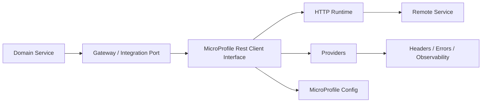
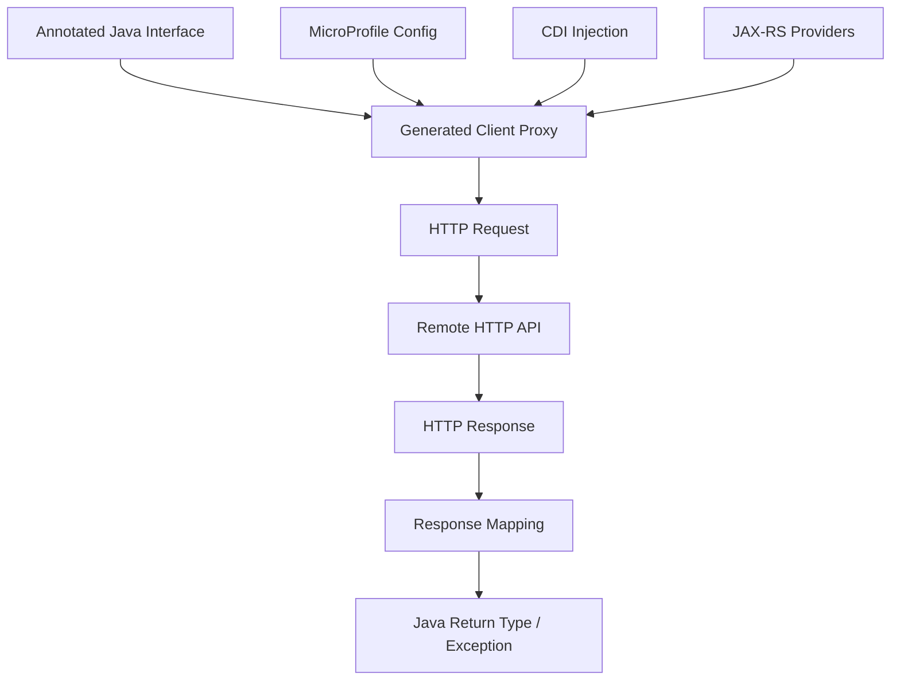
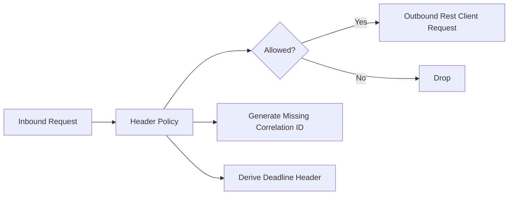
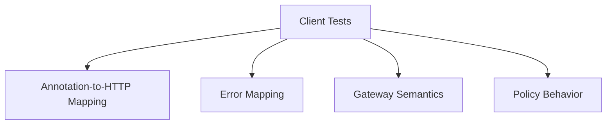
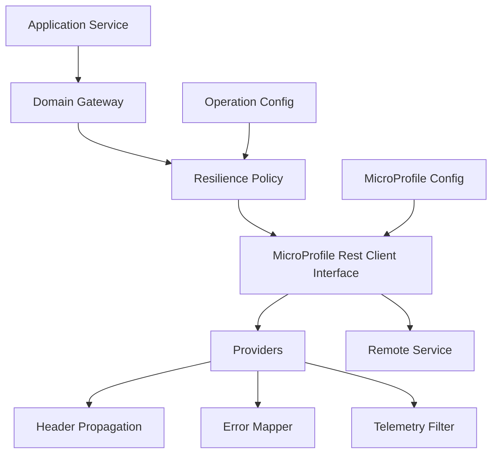

# Part 023 — MicroProfile Rest Client for Jakarta/MicroProfile Systems

MicroProfile Rest Client solves a specific problem:

> How do we call HTTP services from Jakarta/MicroProfile applications without binding the business code to low-level HTTP plumbing?

It is not “Feign but Jakarta”.

It is a **portable, type-safe HTTP client model** built around Jakarta REST-style annotations, CDI injection, MicroProfile Config, and provider extension points.

That distinction matters.

A Spring team may naturally reach for `RestClient`, `WebClient`, or OpenFeign. A Jakarta EE, Quarkus, Open Liberty, Payara, WildFly, Helidon, or mixed MicroProfile team often needs something different:

- JAX-RS/Jakarta REST annotation consistency
- CDI-native injection
- MicroProfile Config-based externalized configuration
- runtime portability across MicroProfile implementations
- provider-based filters, mappers, and interceptors
- less framework-specific coupling in the client boundary

MicroProfile Rest Client is good when you want an HTTP client to behave like a **declared integration port**, not like scattered HTTP code.

But it can also create the same illusion as every declarative client:

> A Java method call is not a local call just because the syntax looks local.

This part explains how to use MicroProfile Rest Client as a production communication boundary, not as syntactic sugar.

---

## 1. What Problem It Actually Solves

Without a structured HTTP client layer, service-to-service code tends to rot into this shape:

```java
URI uri = URI.create(baseUrl + "/v1/accounts/" + accountId);
HttpRequest request = HttpRequest.newBuilder(uri)
    .timeout(Duration.ofSeconds(2))
    .header("Accept", "application/json")
    .GET()
    .build();

HttpResponse<String> response = client.send(request, BodyHandlers.ofString());

if (response.statusCode() == 404) {
    return Optional.empty();
}
if (response.statusCode() >= 500) {
    throw new RemoteServiceUnavailableException("account-service failed");
}

AccountResponse dto = objectMapper.readValue(response.body(), AccountResponse.class);
return Optional.of(dto);
```

That is not bad because it is verbose.

It is bad because communication policy is now spread across call sites:

- URL construction
- timeout behavior
- request headers
- response parsing
- status mapping
- error taxonomy
- observability
- exception boundaries
- retry classification
- contract assumptions

MicroProfile Rest Client moves the HTTP shape into a typed interface:

```java
@Path("/v1/accounts")
@RegisterRestClient(configKey = "account-service")
@Produces(MediaType.APPLICATION_JSON)
@Consumes(MediaType.APPLICATION_JSON)
public interface AccountServiceClient {

    @GET
    @Path("/{accountId}")
    AccountResponse getAccount(@PathParam("accountId") String accountId);
}
```

Then the consuming service injects it:

```java
@ApplicationScoped
public class AccountGateway {

    private final AccountServiceClient client;

    public AccountGateway(@RestClient AccountServiceClient client) {
        this.client = client;
    }

    public AccountSnapshot loadAccount(AccountId accountId) {
        AccountResponse response = client.getAccount(accountId.value());
        return AccountSnapshot.from(response);
    }
}
```

This is cleaner, but the real value is not brevity.

The real value is that the interface becomes a **communication contract adapter**:



The interface declares the wire-level operation. The gateway owns domain meaning. Providers own cross-cutting HTTP behavior. Configuration owns environment-specific policy.

That separation is the point.

---

## 2. Where It Fits Among Java HTTP Clients

MicroProfile Rest Client is not universally better than JDK `HttpClient`, Spring `RestClient`, Spring `WebClient`, or OpenFeign.

It is better in a specific operating model.

| Client | Best fit |
|---|---|
| JDK `HttpClient` | Minimal dependencies, libraries, platform-neutral clients, custom wrappers |
| Spring `RestClient` | Modern synchronous HTTP in Spring MVC/Spring Boot services |
| Spring `WebClient` | Non-blocking composition, streaming, reactive stacks |
| OpenFeign | Declarative HTTP clients in Spring Cloud-heavy environments |
| MicroProfile Rest Client | Jakarta/MicroProfile services needing CDI, config, and runtime portability |

Use MicroProfile Rest Client when:

- your runtime is Jakarta/MicroProfile-oriented
- your service already uses CDI and Jakarta REST APIs
- you want type-safe REST client interfaces
- you need configuration through MicroProfile Config
- portability between MicroProfile runtimes matters
- your organization standardizes around Jakarta EE APIs

Be careful when:

- you need very fine-grained connection pool tuning not exposed by the runtime
- your team expects Spring Cloud behavior such as built-in service discovery integration
- you need advanced reactive streaming semantics
- generated client code is already owned by another platform team
- your provider chain is becoming an implicit framework inside the client

A production-grade team does not choose an HTTP client by taste. It chooses based on:

1. runtime model
2. team ecosystem
3. observability integration
4. config model
5. failure policy control
6. testability
7. portability requirements

---

## 3. The Core Programming Model

A MicroProfile Rest Client usually has four pieces:



### 3.1 Annotated interface

The interface describes HTTP operations using Jakarta REST-style annotations.

```java
@Path("/v1/customers")
@RegisterRestClient(configKey = "customer-service")
@Produces(MediaType.APPLICATION_JSON)
@Consumes(MediaType.APPLICATION_JSON)
public interface CustomerServiceClient {

    @GET
    @Path("/{customerId}")
    CustomerResponse getCustomer(@PathParam("customerId") String customerId);

    @POST
    @Path("/search")
    CustomerSearchResponse search(CustomerSearchRequest request);
}
```

This interface is not the domain boundary yet.

It is a **wire contract interface**.

A domain service should not directly spread this client everywhere. Wrap it behind a gateway:

```java
@ApplicationScoped
public class CustomerLookupGateway {

    private final CustomerServiceClient client;

    public CustomerLookupGateway(@RestClient CustomerServiceClient client) {
        this.client = client;
    }

    public CustomerProfile requireCustomer(CustomerId customerId) {
        try {
            CustomerResponse response = client.getCustomer(customerId.value());
            return CustomerProfile.from(response);
        } catch (RemoteNotFoundException e) {
            throw new CustomerDoesNotExist(customerId);
        } catch (RemoteUnavailableException e) {
            throw new CustomerLookupTemporarilyUnavailable(customerId, e);
        }
    }
}
```

The gateway converts HTTP/integration meaning into domain meaning.

That is the invariant.

### 3.2 CDI injection

The client proxy is injected with `@RestClient`:

```java
@ApplicationScoped
public class PaymentApplicationService {

    @Inject
    @RestClient
    CustomerServiceClient customerClient;

    public PaymentDecision authorize(PaymentCommand command) {
        CustomerResponse customer = customerClient.getCustomer(command.customerId());
        // business decision continues here
        return PaymentDecision.approved();
    }
}
```

For small examples, direct injection is acceptable. For real systems, prefer constructor injection and a gateway wrapper.

### 3.3 Configuration

Configuration usually uses the interface name or `configKey`.

```properties
customer-service/mp-rest/url=http://customer-service.internal
customer-service/mp-rest/connectTimeout=300
customer-service/mp-rest/readTimeout=1200
```

The exact runtime may support additional properties for connection pool, TLS, proxy, HTTP/2, redirects, or provider behavior.

Do not assume all implementation-specific properties are portable.

A practical configuration model separates:

```properties
# Portable-ish client location and basic timeout
customer-service/mp-rest/url=http://customer-service.internal
customer-service/mp-rest/connectTimeout=300
customer-service/mp-rest/readTimeout=1200

# Application-level communication policy
clients.customer.operation.get-customer.total-timeout-ms=1500
clients.customer.operation.get-customer.retry.max-attempts=1
clients.customer.operation.get-customer.circuit-breaker.enabled=true
clients.customer.operation.get-customer.idempotent=true
```

Why keep app-level policy separate?

Because the MicroProfile Rest Client spec gives you a client abstraction. It does not remove the need for explicit communication policy.

---

## 4. Dependency Shape

The exact dependency depends on your runtime.

A MicroProfile runtime often provides the API and implementation. A Quarkus, Open Liberty, Payara, WildFly, or Helidon application may use a runtime-specific extension or feature.

The important engineering point:

> Do not package random client implementations just because the code compiles locally.

In Jakarta/MicroProfile systems, the runtime owns a lot of integration behavior:

- CDI lifecycle
- provider discovery
- JSON binding / JSON-P / Jackson integration depending on runtime
- config loading
- metrics/tracing integration
- TLS and network settings
- native-image constraints in some platforms

A dependency decision is therefore also an operational decision.

A reasonable dependency rule:

| Situation | Dependency strategy |
|---|---|
| Application runs on full MicroProfile runtime | Use runtime-provided feature/extension |
| Application is Quarkus | Use Quarkus REST Client extension aligned with the Quarkus stack |
| Application is Open Liberty | Enable the matching MicroProfile Rest Client feature |
| Library code | Avoid assuming a concrete implementation; expose your own port |
| Spring Boot service | Usually prefer Spring-native clients unless portability is required |

---

## 5. Interface Design Rules

A Rest Client interface looks deceptively simple. Most production damage comes from designing it like a local Java API.

### Rule 1: Name it as a remote client, not a domain service

Bad:

```java
public interface CustomerService {
    Customer getCustomer(String id);
}
```

Better:

```java
public interface CustomerServiceClient {
    CustomerResponse getCustomer(String id);
}
```

Best with boundary wrapper:

```java
public interface CustomerServiceClient {
    CustomerResponse getCustomer(String id);
}

@ApplicationScoped
public class CustomerGateway {
    CustomerProfile load(CustomerId id) { ... }
}
```

The suffix matters less than the mental model.

The interface is not “the customer service”. It is a remote HTTP adapter.

### Rule 2: Keep DTOs separate from domain objects

Bad:

```java
@GET
@Path("/{id}")
Customer getCustomer(@PathParam("id") String id);
```

Better:

```java
@GET
@Path("/{id}")
CustomerResponse getCustomer(@PathParam("id") String id);
```

Then map:

```java
CustomerProfile profile = CustomerProfile.from(response);
```

Why?

Because remote contracts evolve for integration reasons, while domain models evolve for business reasons.

Those should not be the same type.

### Rule 3: Avoid method overloading

Bad:

```java
CustomerResponse getCustomer(String id);
CustomerResponse getCustomer(UUID id);
```

Declarative HTTP clients are about wire mappings. Method overloads make logs, metrics, generated docs, and debugging less clear.

Prefer explicit operation names:

```java
CustomerResponse getCustomerByPublicId(String publicId);
CustomerResponse getCustomerByInternalId(UUID internalId);
```

### Rule 4: Make command semantics explicit

Bad:

```java
@POST
@Path("/{id}/status")
StatusResponse updateStatus(String id, StatusRequest request);
```

Better:

```java
@POST
@Path("/{accountId}/suspensions")
SuspensionResponse suspendAccount(
    @PathParam("accountId") String accountId,
    SuspensionCommandRequest request
);
```

The method should say what domain command is being sent.

### Rule 5: Avoid raw `Response` except at the edge

Returning raw `Response` gives flexibility, but also leaks HTTP details into every caller.

Acceptable in low-level client interface:

```java
@GET
@Path("/{id}")
Response getCustomerRaw(@PathParam("id") String id);
```

But domain-facing gateway should convert it:

```java
public Optional<CustomerProfile> findCustomer(CustomerId id) {
    try (Response response = client.getCustomerRaw(id.value())) {
        if (response.getStatus() == 404) {
            return Optional.empty();
        }
        if (response.getStatus() >= 500) {
            throw new RemoteUnavailableException("customer-service", response.getStatus());
        }
        return Optional.of(response.readEntity(CustomerResponse.class).toDomain());
    }
}
```

Use raw `Response` when status/body/header handling is part of the operation semantics. Do not use it to avoid designing an error model.

---

## 6. Production Example: Customer Service Client

Assume a `payment-service` needs to fetch customer risk attributes before authorizing a payment.

The remote operation:

```http
GET /v1/customers/{customerId}/risk-profile
Accept: application/json
X-Correlation-Id: 9ed6e4d1-...
traceparent: 00-...
```

Possible outcomes:

| Status | Meaning | Caller action |
|---:|---|---|
| 200 | Risk profile found | Continue decision |
| 404 | Customer does not exist | Domain rejection |
| 409 | Customer state incompatible | Domain rejection or workflow escalation |
| 429 | Dependency throttled | Retry only if budget allows |
| 500 | Dependency failed | Fail closed or fallback by policy |
| 503 | Dependency unavailable | Retry/fallback/circuit policy |
| timeout | Unknown outcome | Treat as unavailable, not as negative answer |

Client DTOs:

```java
public record RiskProfileResponse(
    String customerId,
    String riskTier,
    boolean politicallyExposed,
    boolean sanctionsScreeningRequired,
    Instant evaluatedAt
) {}
```

Client interface:

```java
@Path("/v1/customers")
@RegisterRestClient(configKey = "customer-service")
@Produces(MediaType.APPLICATION_JSON)
@Consumes(MediaType.APPLICATION_JSON)
public interface CustomerRiskClient {

    @GET
    @Path("/{customerId}/risk-profile")
    RiskProfileResponse getRiskProfile(@PathParam("customerId") String customerId);
}
```

Gateway:

```java
@ApplicationScoped
public class CustomerRiskGateway {

    private final CustomerRiskClient client;

    public CustomerRiskGateway(@RestClient CustomerRiskClient client) {
        this.client = client;
    }

    public RiskProfile loadRiskProfile(CustomerId customerId) {
        try {
            RiskProfileResponse response = client.getRiskProfile(customerId.value());
            return RiskProfile.from(response);
        } catch (RemoteNotFoundException e) {
            throw new CustomerNotFound(customerId);
        } catch (RemoteConflictException e) {
            throw new CustomerStateConflict(customerId, e.detail());
        } catch (RemoteOverloadedException e) {
            throw new CustomerRiskTemporarilyUnavailable(customerId, e);
        } catch (RemoteUnavailableException e) {
            throw new CustomerRiskTemporarilyUnavailable(customerId, e);
        }
    }
}
```

The gateway is intentionally boring.

That is a good sign.

The complexity is not removed. It is contained.

---

## 7. Error Mapping with `ResponseExceptionMapper`

Declarative clients become dangerous when every non-2xx response becomes a generic exception.

You need a stable error taxonomy.

MicroProfile Rest Client supports response exception mapping through providers such as `ResponseExceptionMapper`.

A simplified mapper:

```java
@Provider
public class RemoteProblemExceptionMapper
        implements ResponseExceptionMapper<RuntimeException> {

    @Override
    public RuntimeException toThrowable(Response response) {
        int status = response.getStatus();

        ProblemDetails problem = null;
        if (response.hasEntity()) {
            try {
                problem = response.readEntity(ProblemDetails.class);
            } catch (RuntimeException ignored) {
                // Do not let bad error bodies hide the real HTTP status.
            }
        }

        return switch (status) {
            case 400 -> new RemoteBadRequestException(problem);
            case 401 -> new RemoteUnauthorizedException(problem);
            case 403 -> new RemoteForbiddenException(problem);
            case 404 -> new RemoteNotFoundException(problem);
            case 409 -> new RemoteConflictException(problem);
            case 422 -> new RemoteValidationException(problem);
            case 429 -> new RemoteOverloadedException(problem);
            case 502, 503, 504 -> new RemoteUnavailableException(problem);
            default -> {
                if (status >= 500) {
                    yield new RemoteServerException(status, problem);
                }
                yield new RemoteUnexpectedStatusException(status, problem);
            }
        };
    }

    @Override
    public boolean handles(int status, MultivaluedMap<String, Object> headers) {
        return status >= 400;
    }
}
```

Register it:

```java
@Path("/v1/customers")
@RegisterRestClient(configKey = "customer-service")
@RegisterProvider(RemoteProblemExceptionMapper.class)
public interface CustomerRiskClient {
    // operations
}
```

Or configure providers externally, depending on runtime support.

The important design point:

> Error mapping should produce communication exceptions, not domain exceptions.

Bad:

```java
case 404 -> new CustomerNotFound(customerId);
```

Why bad?

Because the mapper is generic. It may be used by many operations where `404` means different things.

Better:

```java
case 404 -> new RemoteNotFoundException(problem);
```

Then the gateway maps it:

```java
catch (RemoteNotFoundException e) {
    throw new CustomerNotFound(customerId);
}
```

That keeps HTTP semantics, operation semantics, and domain semantics separate.

---

## 8. Problem Details DTO

For HTTP APIs, a production error body should be machine-readable.

A common shape follows the Problem Details model:

```java
public record ProblemDetails(
    String type,
    String title,
    int status,
    String detail,
    String instance,
    String code,
    String correlationId,
    Map<String, Object> extensions
) {}
```

Example response:

```json
{
  "type": "https://errors.example.com/customer/not-found",
  "title": "Customer not found",
  "status": 404,
  "detail": "Customer cus_123 does not exist.",
  "instance": "/v1/customers/cus_123/risk-profile",
  "code": "CUSTOMER_NOT_FOUND",
  "correlationId": "9ed6e4d1-81d1-4a81-b5c8-7c8e4cfc3e87"
}
```

Do not force every domain error into HTTP status alone.

Status answers: **what class of outcome happened?**

Problem code answers: **which specific error occurred?**

Gateway logic should usually depend on stable status and code, not free-text `detail`.

---

## 9. Header Propagation

Microservices communication requires metadata propagation:

- trace context
- correlation ID
- idempotency key
- deadline/budget
- tenant/account context
- locale or user-agent if relevant
- caller identity token if policy allows it

Do not propagate all inbound headers blindly.

Create an explicit propagation policy.



A MicroProfile Rest Client provider can add headers:

```java
@Provider
public class OutboundContextFilter implements ClientRequestFilter {

    @Inject
    RequestContext requestContext;

    @Override
    public void filter(ClientRequestContext requestContext) {
        requestContext.getHeaders().putSingle(
            "X-Correlation-Id",
            this.requestContext.correlationId()
        );

        this.requestContext.traceparent()
            .ifPresent(value -> requestContext.getHeaders().putSingle("traceparent", value));

        this.requestContext.deadlineEpochMillis()
            .ifPresent(value -> requestContext.getHeaders().putSingle(
                "X-Request-Deadline-Epoch-Millis",
                String.valueOf(value)
            ));
    }
}
```

Register it:

```java
@RegisterProvider(OutboundContextFilter.class)
public interface CustomerRiskClient { ... }
```

The filter should not do business authorization.

It should only apply communication metadata policy.

---

## 10. `ClientHeadersFactory`

MicroProfile Rest Client also has a header factory model that can be used to compute outgoing headers from incoming headers.

A simplified pattern:

```java
@ApplicationScoped
public class SafeHeaderPropagationFactory implements ClientHeadersFactory {

    private static final Set<String> PROPAGATED_HEADERS = Set.of(
        "traceparent",
        "tracestate",
        "baggage",
        "x-correlation-id",
        "x-request-deadline-epoch-millis"
    );

    @Override
    public MultivaluedMap<String, String> update(
        MultivaluedMap<String, String> incomingHeaders,
        MultivaluedMap<String, String> clientOutgoingHeaders
    ) {
        MultivaluedHashMap<String, String> result = new MultivaluedHashMap<>();

        for (String header : PROPAGATED_HEADERS) {
            List<String> values = incomingHeaders.get(header);
            if (values != null && !values.isEmpty()) {
                result.put(header, List.copyOf(values));
            }
        }

        if (!result.containsKey("x-correlation-id")) {
            result.putSingle("x-correlation-id", UUID.randomUUID().toString());
        }

        return result;
    }
}
```

Then:

```java
@RegisterClientHeaders(SafeHeaderPropagationFactory.class)
public interface CustomerRiskClient { ... }
```

Header propagation is a security and reliability boundary.

Never treat it as convenience plumbing.

---

## 11. Timeout Design

MicroProfile Rest Client exposes basic timeout configuration in common runtimes, usually connect timeout and read timeout.

Example:

```properties
customer-service/mp-rest/connectTimeout=300
customer-service/mp-rest/readTimeout=1200
```

But production timeout design needs more than those two values.

You need four layers:

| Layer | Meaning |
|---|---|
| Connect timeout | Time allowed to establish connection |
| Read timeout | Time waiting for response data |
| Total operation budget | Max wall-clock time for the whole operation |
| Upstream deadline | Remaining time inherited from caller |

A safe gateway usually enforces total budget outside the client:

```java
public RiskProfile loadRiskProfile(CustomerId customerId) {
    Deadline deadline = Deadline.after(Duration.ofMillis(1500));

    return deadline.run(() -> {
        try {
            return RiskProfile.from(client.getRiskProfile(customerId.value()));
        } catch (ProcessingException e) {
            throw new RemoteUnavailableException("customer-service", e);
        }
    });
}
```

Pseudo-code aside, the principle is concrete:

> Client read timeout is not the same as business operation deadline.

If the caller has 700 ms remaining, the outbound client must not spend 1200 ms just because its static property says so.

Timeout policy must account for remaining budget.

---

## 12. Retry Design

Do not hide retry inside a generic provider without operation-level semantics.

Retry requires knowing:

- method idempotency
- request body replay safety
- expected side effects
- timeout budget
- status/exception classification
- downstream overload signal
- idempotency key availability

Bad generic retry:

```java
// Retry every IOException three times for every method.
```

Why bad?

Because `POST /payments` and `GET /customers/{id}` are not the same operation.

Better:

```java
public RiskProfile loadRiskProfile(CustomerId customerId) {
    return retryPolicy.forOperation("customer.get-risk-profile")
        .execute(() -> RiskProfile.from(client.getRiskProfile(customerId.value())));
}
```

A simple policy table:

| Operation | Method | Retry? | Conditions |
|---|---|---:|---|
| `get-risk-profile` | GET | Yes | timeout/503/504, within deadline, limited attempts |
| `create-payment` | POST | Only with idempotency key | retry timeout/503 only with dedupe guarantee |
| `submit-evidence` | POST large body | Usually no | body replay and duplicate side effects risky |
| `search-cases` | POST query | Maybe | if semantically read-only and safe to replay |

MicroProfile Rest Client gives you the call interface. It does not absolve you from retry design.

---

## 13. Circuit Breaker and Bulkhead Placement

You can wrap MicroProfile Rest Client calls using MicroProfile Fault Tolerance if your runtime supports it, or using library-level resilience mechanisms such as Resilience4j.

The placement rule:

> Put circuit breaker and bulkhead at the gateway operation boundary, not randomly inside DTO clients.

Example shape:

```java
@ApplicationScoped
public class CustomerRiskGateway {

    private final CustomerRiskClient client;
    private final CircuitBreaker circuitBreaker;
    private final Bulkhead bulkhead;

    public RiskProfile loadRiskProfile(CustomerId customerId) {
        return bulkhead.executeSupplier(() ->
            circuitBreaker.executeSupplier(() ->
                RiskProfile.from(client.getRiskProfile(customerId.value()))
            )
        );
    }
}
```

Why gateway-level?

Because breaker names and metrics should match operation semantics:

- `customer-risk.get-risk-profile`
- `account-service.get-account`
- `case-service.submit-evidence`

not generic client class names only.

A single remote service can have operations with different risk:

| Operation | Cost | Criticality | Policy |
|---|---:|---:|---|
| `getCustomer` | low | high | small timeout, small retry, breaker |
| `searchCustomers` | medium | medium | stricter rate limit |
| `exportCustomerHistory` | high | low | async/offline preferred |

If all operations share one blanket policy, incidents become harder to contain.

---

## 14. Response Body Handling

A declarative interface makes response body handling look invisible.

That invisibility is dangerous for large payloads.

```java
@GET
@Path("/reports/{id}")
ReportResponse downloadReport(@PathParam("id") String id);
```

This looks harmless. But if `ReportResponse` contains a 40 MB payload, the call can:

- allocate large buffers
- trigger GC pressure
- block event loops or worker threads
- exceed gateway limits
- amplify retry cost
- break latency SLOs

Prefer explicit streaming or pre-signed/download handoff for large data:

```java
@GET
@Path("/reports/{id}/download-link")
ReportDownloadLinkResponse createDownloadLink(@PathParam("id") String id);
```

Or use raw streaming response only in a carefully controlled adapter:

```java
@GET
@Path("/reports/{id}/content")
Response downloadReportContent(@PathParam("id") String id);
```

Then enforce:

- max size
- timeout
- streaming copy
- checksum if required
- no blind retry after partial read
- explicit resource closing

MicroProfile Rest Client is excellent for structured JSON APIs. Do not force it to be your file transfer mechanism by accident.

---

## 15. Query Parameter Style

One subtle production issue is how collections are encoded.

Examples:

```http
GET /v1/accounts?status=OPEN&status=SUSPENDED
GET /v1/accounts?status=OPEN,SUSPENDED
GET /v1/accounts?status[]=OPEN&status[]=SUSPENDED
```

All are plausible. They are not equivalent unless both sides agree.

Declare this explicitly in the contract and tests.

Client:

```java
@GET
@Path("/v1/accounts")
AccountSearchResponse searchAccounts(
    @QueryParam("status") List<String> statuses,
    @QueryParam("page") int page,
    @QueryParam("size") int size
);
```

Contract fixture:

```http
GET /v1/accounts?status=OPEN&status=SUSPENDED&page=0&size=50
```

Do not rely on runtime defaults for important query encoding behavior.

Defaults differ across frameworks and versions.

---

## 16. Authentication and Authorization Context

This series does not repeat deep auth/authz material. But MicroProfile Rest Client must handle outbound security context carefully.

Common patterns:

| Pattern | Description | Risk |
|---|---|---|
| Service credential | Caller authenticates as service | Coarse-grained unless scoped |
| Token relay | Caller forwards user token | Leaks caller context unless policy-controlled |
| Token exchange | Caller exchanges inbound token for downstream audience | More secure, more moving parts |
| Signed internal request | Caller signs request metadata | Requires key rotation and verification |

Outbound filter example:

```java
@Provider
public class ServiceTokenFilter implements ClientRequestFilter {

    @Inject
    ServiceTokenProvider tokenProvider;

    @Override
    public void filter(ClientRequestContext requestContext) {
        String token = tokenProvider.tokenForAudience("customer-service");
        requestContext.getHeaders().putSingle("Authorization", "Bearer " + token);
    }
}
```

Do not automatically relay `Authorization` headers from inbound requests.

That creates confused-deputy and audience-mismatch risks.

The safe invariant:

> Every outbound credential must be intentionally selected for the downstream audience and operation.

---

## 17. Observability

A production Rest Client boundary should emit:

- service name
- operation name
- HTTP method
- route template, not raw URL with IDs
- status code
- exception class
- timeout vs remote failure distinction
- retry attempt count
- circuit breaker state if applicable
- duration histogram
- correlation ID and trace linkage

Do not use raw URI as a metric dimension:

Bad:

```text
http.client.duration{url="/v1/customers/cus_123/risk-profile"}
http.client.duration{url="/v1/customers/cus_456/risk-profile"}
```

Better:

```text
http.client.duration{service="customer-service", operation="get-risk-profile", route="/v1/customers/{customerId}/risk-profile"}
```

A provider can capture low-level metadata:

```java
@Provider
public class ClientTimingFilter implements ClientRequestFilter, ClientResponseFilter {

    private static final String START = "client.start.nano";

    @Override
    public void filter(ClientRequestContext requestContext) {
        requestContext.setProperty(START, System.nanoTime());
    }

    @Override
    public void filter(ClientRequestContext requestContext,
                       ClientResponseContext responseContext) {
        long start = (long) requestContext.getProperty(START);
        long durationNanos = System.nanoTime() - start;

        // Record metric with low-cardinality labels.
        // service, operation, method, route template, status family, status code
    }
}
```

But provider-level observability usually lacks operation semantics unless you pass it explicitly.

A gateway wrapper can record operation-level metrics more cleanly:

```java
return metrics.timer("remote.customer.get-risk-profile")
    .record(() -> RiskProfile.from(client.getRiskProfile(customerId.value())));
```

Best practice: combine both.

- provider captures HTTP-level signals
- gateway captures operation-level signals
- tracing connects them

---

## 18. Testing Strategy

Testing a MicroProfile Rest Client must cover three different things.



### 18.1 Mapping tests

Verify that the interface generates the expected HTTP request.

Use a stub server:

```java
stubFor(get(urlEqualTo("/v1/customers/cus_123/risk-profile"))
    .withHeader("Accept", equalTo("application/json"))
    .willReturn(okJson("""
        {
          "customerId": "cus_123",
          "riskTier": "LOW",
          "politicallyExposed": false,
          "sanctionsScreeningRequired": false,
          "evaluatedAt": "2026-07-05T00:00:00Z"
        }
        """)));
```

Then assert the gateway result.

### 18.2 Error mapper tests

Test status-to-exception mapping directly:

| Input | Expected exception |
|---|---|
| 404 Problem Details | `RemoteNotFoundException` |
| 409 Problem Details | `RemoteConflictException` |
| 429 | `RemoteOverloadedException` |
| 503 | `RemoteUnavailableException` |
| malformed error body | exception preserving status |

### 18.3 Gateway semantic tests

The gateway should map communication exceptions into domain/application outcomes.

```java
@Test
void maps404ToCustomerNotFound() {
    when(client.getRiskProfile("cus_missing"))
        .thenThrow(new RemoteNotFoundException(problem("CUSTOMER_NOT_FOUND")));

    assertThrows(CustomerNotFound.class,
        () -> gateway.loadRiskProfile(CustomerId.of("cus_missing")));
}
```

### 18.4 Policy tests

Test timeout/retry/circuit behavior separately.

Do not rely only on happy-path client tests.

Most production incidents live in unhappy-path policy.

---

## 19. Common Failure Modes

### 19.1 Treating the interface as business service

Symptom:

```java
@Inject
@RestClient
CustomerServiceClient customerService;
```

used everywhere.

Consequence:

- HTTP exceptions leak into domain code
- status semantics duplicated
- call policy inconsistent
- tests become fragile

Fix:

Wrap with `CustomerGateway` or `CustomerLookupPort`.

### 19.2 Generic exception mapping

Symptom:

```java
throw new RuntimeException(response.readEntity(String.class));
```

Consequence:

- no retry classification
- no domain mapping
- poor metrics
- impossible incident triage

Fix:

Map status/code into stable communication exception taxonomy.

### 19.3 Configuration hidden by interface name

Symptom:

```properties
com.example.customer.CustomerServiceClient/mp-rest/url=...
```

A refactor renames the package and breaks config.

Fix:

Use stable `configKey`:

```java
@RegisterRestClient(configKey = "customer-service")
```

Then:

```properties
customer-service/mp-rest/url=http://customer-service.internal
```

### 19.4 No operation-level timeout budget

Symptom:

Only `readTimeout` is set.

Consequence:

- retries exceed caller deadline
- thread pools saturate
- upstream times out first
- downstream continues work after caller gave up

Fix:

Model total operation budget and propagate deadline.

### 19.5 Blind header propagation

Symptom:

Forwarding all inbound headers.

Consequence:

- token leakage
- tenant confusion
- cache poisoning risk
- unstable downstream behavior

Fix:

Allow-list propagation.

### 19.6 Runtime-specific tuning assumed portable

Symptom:

The team configures pool behavior on one runtime, then migrates and expects identical behavior.

Consequence:

- performance regressions
- different timeout behavior
- different provider order
- TLS/proxy differences

Fix:

Document runtime-specific properties and test them in deployment-like environments.

---

## 20. A Production Template

A complete production MicroProfile Rest Client boundary has this shape:



Directory:

```text
customer/
  integration/
    CustomerRiskClient.java
    CustomerRiskGateway.java
    CustomerRiskClientConfig.java
    RemoteProblemExceptionMapper.java
    OutboundContextFilter.java
    CustomerRiskMetrics.java
    dto/
      RiskProfileResponse.java
      ProblemDetails.java
  domain/
    CustomerId.java
    RiskProfile.java
    CustomerNotFound.java
```

Client:

```java
@Path("/v1/customers")
@RegisterRestClient(configKey = "customer-service")
@RegisterProvider(RemoteProblemExceptionMapper.class)
@RegisterProvider(OutboundContextFilter.class)
@Produces(MediaType.APPLICATION_JSON)
@Consumes(MediaType.APPLICATION_JSON)
public interface CustomerRiskClient {

    @GET
    @Path("/{customerId}/risk-profile")
    RiskProfileResponse getRiskProfile(@PathParam("customerId") String customerId);
}
```

Gateway:

```java
@ApplicationScoped
public class CustomerRiskGateway {

    private final CustomerRiskClient client;
    private final RemoteCallPolicy policy;

    public CustomerRiskGateway(@RestClient CustomerRiskClient client,
                               RemoteCallPolicyRegistry policies) {
        this.client = client;
        this.policy = policies.get("customer-service.get-risk-profile");
    }

    public RiskProfile loadRiskProfile(CustomerId customerId) {
        return policy.execute(() -> callAndMap(customerId));
    }

    private RiskProfile callAndMap(CustomerId customerId) {
        try {
            return RiskProfile.from(client.getRiskProfile(customerId.value()));
        } catch (RemoteNotFoundException e) {
            throw new CustomerNotFound(customerId);
        } catch (RemoteConflictException e) {
            throw new CustomerStateConflict(customerId, e);
        } catch (RemoteOverloadedException | RemoteUnavailableException e) {
            throw new CustomerRiskTemporarilyUnavailable(customerId, e);
        }
    }
}
```

Configuration:

```properties
customer-service/mp-rest/url=http://customer-service.internal
customer-service/mp-rest/connectTimeout=300
customer-service/mp-rest/readTimeout=1200

clients.customer-service.get-risk-profile.deadline-ms=1500
clients.customer-service.get-risk-profile.retry.max-attempts=1
clients.customer-service.get-risk-profile.circuit-breaker.failure-rate-threshold=50
clients.customer-service.get-risk-profile.bulkhead.max-concurrent-calls=64
```

Policy should be explicit, named, and observable.

---

## 21. Selection Checklist

Before adopting MicroProfile Rest Client for a service, answer:

- Are we already in a Jakarta/MicroProfile runtime?
- Do we need portability across MicroProfile implementations?
- Do we want CDI-native injection?
- Do we have a standard error mapper?
- Do we have a header propagation policy?
- Do we have operation-level timeout/retry/circuit policy?
- Do we understand runtime-specific pool/TLS/proxy tuning?
- Do we have contract fixtures for request mapping?
- Do we have tests for non-2xx and timeout behavior?
- Do we prevent DTOs from leaking into domain code?

If the answer is mostly yes, MicroProfile Rest Client is a strong fit.

If the answer is no, the client interface will only make remote failure look cleaner while remaining just as dangerous.

---

## 22. What Top Engineers Internalize

MicroProfile Rest Client is not about saving lines of code.

It is about making HTTP communication **declared, injectable, configurable, and interceptable** in Jakarta/MicroProfile systems.

The top-level mental model:

```text
MicroProfile Rest Client interface = wire contract adapter
Gateway = operation semantics
Provider = cross-cutting HTTP behavior
Config = environment-specific location and runtime policy
Resilience wrapper = failure containment
DTO mapper = anti-corruption layer
```

A weak implementation says:

> “We use MicroProfile Rest Client, so service calls are easy.”

A strong implementation says:

> “We use MicroProfile Rest Client to centralize the HTTP adapter, but operation policy, domain mapping, retries, deadlines, and observability remain explicit.”

That difference is what separates a demo from a production communication system.

---

## 23. References

- MicroProfile Rest Client 4.0 Specification — Eclipse Foundation
- MicroProfile Rest Client specification page — microprofile.io
- Jakarta RESTful Web Services API model
- MicroProfile Config model
- MicroProfile Fault Tolerance model
- RFC 9110 — HTTP Semantics
- RFC 9457 — Problem Details for HTTP APIs
- W3C Trace Context
- OpenTelemetry Semantic Conventions for HTTP

---

## 24. Next Part

Part 024 closes the Java HTTP client implementation block by stepping above any specific library.

We will design the **client abstraction boundary**:

- where HTTP clients should live
- what the domain is allowed to know
- how to avoid leaky abstractions
- how to create operation-oriented gateways
- how to standardize policy without over-centralizing everything
- how to structure clients for long-term maintainability
