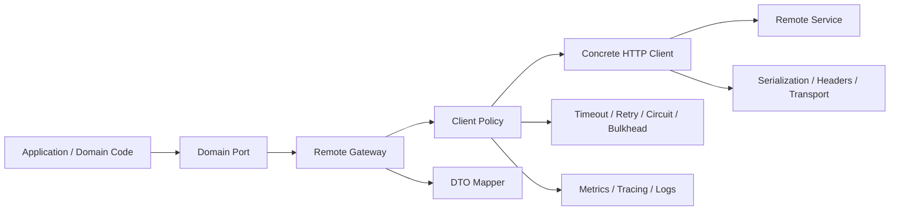
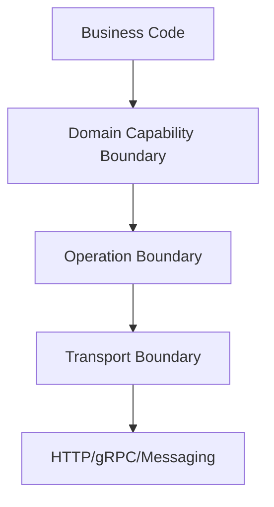
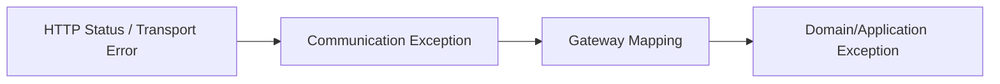
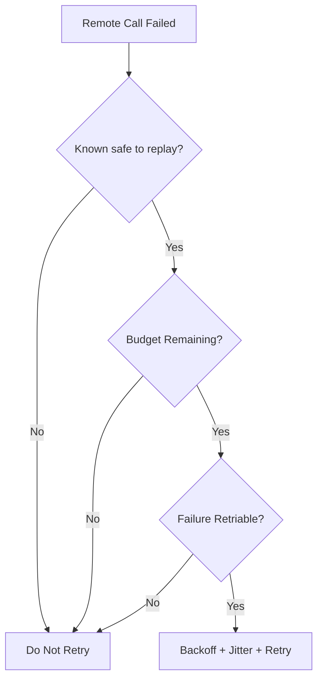
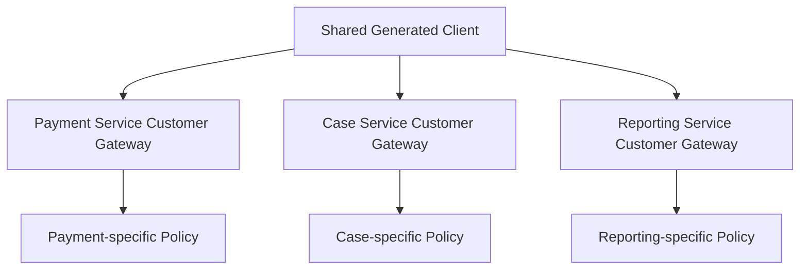
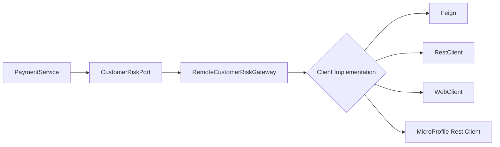

# Part 024 — Designing Client Abstraction Boundaries

Every HTTP client library asks the wrong first question.

- Should we use `HttpClient`?
- Should we use `RestClient`?
- Should we use `WebClient`?
- Should we use Feign?
- Should we use MicroProfile Rest Client?

Those are implementation questions.

The architecture question is:

> Where is the boundary between local business behavior and remote communication behavior?

If that boundary is weak, every client library becomes dangerous.

A remote call will leak into business logic as:

- framework exceptions
- status codes
- DTOs
- raw headers
- timeouts
- retry assumptions
- nullability surprises
- hidden coupling
- unclear ownership

A strong client abstraction boundary does not hide the fact that the network exists. It contains it.

This part explains how to design that boundary.

---

## 1. The Core Problem

A microservice often starts with code like this:

```java
CustomerResponse customer = customerClient.getCustomer(customerId);
if (customer.status().equals("SUSPENDED")) {
    rejectPayment();
}
```

It looks clean.

But several questions are hidden:

- What if the remote service times out?
- What if the customer service returns `404`?
- Is `404` a domain fact or a communication problem?
- Is the request safe to retry?
- How long can this call consume from the parent request budget?
- What if the downstream is overloaded?
- What if the response schema changed?
- What if the remote service returns stale data?
- Should this call fail open or fail closed?
- What metric tells us this dependency is unhealthy?

When those questions are answered at random call sites, the system becomes fragile.

The boundary must make those decisions explicit.

---

## 2. The Boundary Model

Use this mental model:



The layers have different jobs.

| Layer | Owns | Must not own |
|---|---|---|
| Domain/application code | business decision | HTTP status, headers, retry, transport exception |
| Domain port | capability needed by local service | remote URL, framework types |
| Remote gateway | operation semantics and mapping | socket details |
| Client policy | timeout, retry, breaker, bulkhead, metrics | business rules |
| Concrete client | HTTP request/response mechanics | domain meaning |
| Remote service | remote behavior | caller's local business workflow |

The client library should be the smallest part of the design.

---

## 3. Three Boundaries, Not One

Most teams say “we wrapped the client”, but they usually wrap only the HTTP library.

You need three boundaries:



### 3.1 Domain capability boundary

This says what the local service needs.

```java
public interface CustomerRiskPort {
    RiskProfile loadRiskProfile(CustomerId customerId);
}
```

This interface should not expose HTTP concepts.

Bad:

```java
public interface CustomerRiskPort {
    Response getRiskProfile(String customerId);
}
```

Better:

```java
public interface CustomerRiskPort {
    RiskProfile loadRiskProfile(CustomerId customerId);
}
```

### 3.2 Operation boundary

This is the gateway implementation.

```java
@ApplicationScoped
public class RemoteCustomerRiskGateway implements CustomerRiskPort {

    private final CustomerRiskHttpClient client;
    private final RemoteCallPolicy policy;

    @Override
    public RiskProfile loadRiskProfile(CustomerId customerId) {
        return policy.execute("customer-risk.load", () -> {
            try {
                CustomerRiskResponse dto = client.getRiskProfile(customerId.value());
                return RiskProfile.from(dto);
            } catch (RemoteNotFoundException e) {
                throw new CustomerNotFound(customerId);
            } catch (RemoteUnavailableException e) {
                throw new CustomerRiskUnavailable(customerId, e);
            }
        });
    }
}
```

This layer knows the operation and the domain meaning of remote outcomes.

### 3.3 Transport boundary

This is the concrete client.

```java
public interface CustomerRiskHttpClient {
    CustomerRiskResponse getRiskProfile(String customerId);
}
```

This may be implemented using JDK `HttpClient`, Spring `RestClient`, `WebClient`, Feign, or MicroProfile Rest Client.

The application service should not care.

---

## 4. The Anti-Pattern: Framework Client Everywhere

The common anti-pattern:

```java
@Service
public class PaymentService {

    private final CustomerFeignClient customerClient;
    private final AccountFeignClient accountClient;
    private final FraudFeignClient fraudClient;

    public PaymentDecision authorize(PaymentCommand command) {
        CustomerResponse customer = customerClient.getCustomer(command.customerId());
        AccountResponse account = accountClient.getAccount(command.accountId());
        FraudResponse fraud = fraudClient.score(command.toFraudRequest());

        // business logic mixed with remote DTO and failure modes
    }
}
```

This looks productive during implementation.

It becomes expensive during incidents.

Problems:

- `PaymentService` now knows remote DTO shapes
- status semantics are interpreted inside business logic
- retry/circuit policies are disconnected from domain criticality
- fallback decisions become ad hoc
- tests require too many remote mocks
- framework migration touches business logic
- failures are not classified consistently

The better shape:

```java
@Service
public class PaymentService {

    private final CustomerRiskPort customerRisk;
    private final AccountLimitPort accountLimit;
    private final FraudScoringPort fraudScoring;

    public PaymentDecision authorize(PaymentCommand command) {
        RiskProfile risk = customerRisk.loadRiskProfile(command.customerId());
        AccountLimit limit = accountLimit.loadLimit(command.accountId());
        FraudScore score = fraudScoring.score(command.toFraudInput());

        return decisionEngine.decide(command, risk, limit, score);
    }
}
```

Now the service depends on capabilities, not clients.

---

## 5. Naming the Boundary

Names shape thinking.

Avoid names that imply locality:

```java
CustomerService customerService;
AccountService accountService;
FraudService fraudService;
```

Those names hide the remote nature.

Use names that encode the role:

| Name | Meaning |
|---|---|
| `CustomerRiskPort` | local capability needed by application |
| `RemoteCustomerRiskGateway` | remote implementation of that capability |
| `CustomerRiskHttpClient` | transport-specific client |
| `CustomerRiskResponse` | wire DTO |
| `CustomerRiskUnavailable` | domain/application outcome from dependency failure |

A top engineer is obsessive about this because ambiguous names create ambiguous boundaries.

---

## 6. DTO Boundary

Remote DTOs are not domain objects.

They may look similar today. That is a trap.

Remote DTO:

```java
public record CustomerRiskResponse(
    String customerId,
    String riskTier,
    boolean pep,
    boolean sanctionsRequired,
    String evaluatedAt
) {}
```

Domain model:

```java
public record RiskProfile(
    CustomerId customerId,
    RiskTier riskTier,
    boolean politicallyExposed,
    boolean sanctionsScreeningRequired,
    Instant evaluatedAt
) {
    public static RiskProfile from(CustomerRiskResponse dto) {
        return new RiskProfile(
            CustomerId.of(dto.customerId()),
            RiskTier.parse(dto.riskTier()),
            dto.pep(),
            dto.sanctionsRequired(),
            Instant.parse(dto.evaluatedAt())
        );
    }
}
```

Why map if it feels repetitive?

Because mapping is where you enforce invariants:

- required fields
- enum compatibility
- timestamp parsing
- default policy
- unknown values
- semantic conversion
- backward-compatible fallback

Do not let wire data enter your domain unvalidated.

---

## 7. Exception Boundary

Transport exceptions should not leak upward.

Bad:

```java
catch (WebClientResponseException.NotFound e) {
    // business logic
}
```

Bad:

```java
catch (FeignException.ServiceUnavailable e) {
    // business logic
}
```

Bad:

```java
catch (ProcessingException e) {
    // business logic
}
```

A gateway should convert from concrete client exceptions into stable application exceptions.



Example:

```java
public RiskProfile loadRiskProfile(CustomerId customerId) {
    try {
        return RiskProfile.from(client.getRiskProfile(customerId.value()));
    } catch (RemoteNotFoundException e) {
        throw new CustomerNotFound(customerId);
    } catch (RemoteUnauthorizedException | RemoteForbiddenException e) {
        throw new CustomerRiskAccessDenied(customerId, e);
    } catch (RemoteOverloadedException | RemoteUnavailableException e) {
        throw new CustomerRiskTemporarilyUnavailable(customerId, e);
    } catch (RemoteUnexpectedStatusException e) {
        throw new CustomerRiskProtocolViolation(customerId, e);
    }
}
```

The gateway decides what remote outcomes mean locally.

That decision must not be scattered.

---

## 8. Status Code Boundary

HTTP status codes are not domain language.

They are protocol-level outcome classes.

| HTTP outcome | Communication meaning | Possible local meaning |
|---|---|---|
| 404 | remote resource not found | customer missing, account missing, feature disabled, stale reference |
| 409 | conflict | workflow conflict, duplicate command, state transition rejected |
| 422 | semantic validation failed | local bug, user input issue, contract mismatch |
| 429 | downstream throttling | retry later, degrade, shed load |
| 500 | remote defect | fail operation, fallback, alert |
| 503 | remote unavailable | retry/breaker/fallback |
| timeout | unknown remote outcome | do not assume failure or success |

A `404` from `GET /customers/{id}` is different from a `404` from `GET /feature-flags/{key}`.

Only the operation boundary can interpret that safely.

---

## 9. Return Type Boundary

Return types communicate semantics.

Bad:

```java
Customer getCustomer(CustomerId id);
```

What if missing? What if unavailable? What if forbidden?

Better options:

### 9.1 Required remote data

```java
RiskProfile loadRiskProfile(CustomerId id)
    throws CustomerNotFound, CustomerRiskTemporarilyUnavailable;
```

Use when the caller cannot continue without the data.

### 9.2 Optional remote data

```java
Optional<CustomerProfile> findCustomer(CustomerId id)
    throws CustomerLookupUnavailable;
```

Use when absence is a normal domain outcome.

### 9.3 Decision result

```java
CustomerEligibilityResult checkEligibility(CustomerId id);
```

Where:

```java
sealed interface CustomerEligibilityResult {
    record Eligible(CustomerEligibility eligibility) implements CustomerEligibilityResult {}
    record Ineligible(String reasonCode) implements CustomerEligibilityResult {}
    record UnknownDueToDependencyFailure(String dependency) implements CustomerEligibilityResult {}
}
```

Use when the dependency failure is part of decision logic.

### 9.4 Snapshot with freshness

```java
CustomerSnapshot loadCustomerSnapshot(CustomerId id);
```

Where:

```java
public record CustomerSnapshot(
    CustomerId id,
    CustomerStatus status,
    Instant observedAt,
    DataFreshness freshness
) {}
```

Use when stale data may be acceptable.

A mature boundary encodes uncertainty.

---

## 10. Timeout Boundary

Timeouts belong to operations, not just clients.

Bad:

```properties
customer-service.read-timeout=5s
```

Why bad?

Because the customer service has many operations:

| Operation | SLO impact | Timeout |
|---|---:|---:|
| load risk profile | high | 300–800 ms |
| search customers | medium | 1–2 s |
| export history | low | async preferred |

A better model:

```yaml
remoteCalls:
  customer-risk.load-profile:
    totalTimeout: 700ms
    connectTimeout: 100ms
    readTimeout: 500ms
    maxAttempts: 1
  customer-search.search:
    totalTimeout: 1800ms
    connectTimeout: 150ms
    readTimeout: 1200ms
    maxAttempts: 1
```

The boundary should enforce total budget:

```java
public RiskProfile loadRiskProfile(CustomerId id) {
    return policyRegistry.get("customer-risk.load-profile")
        .execute(() -> RiskProfile.from(client.getRiskProfile(id.value())));
}
```

Static client timeout is a lower-level guard. Operation timeout is the real business budget.

---

## 11. Retry Boundary

Retry cannot be purely transport-level.

A retry policy needs operation semantics.



The boundary should know whether the operation is safe to replay.

Examples:

| Operation | Retry stance |
|---|---|
| `getCustomer(id)` | usually safe |
| `searchCases(query)` | safe if read-only and bounded |
| `createPayment(command)` | only with idempotency key and server dedupe |
| `submitEvidence(file)` | usually not blindly retryable |
| `cancelOrder(id)` | retryable only if cancel is idempotent |

Never configure “retry all IO exceptions three times” globally.

That creates retry storms and duplicate side effects.

---

## 12. Idempotency Boundary

For commands, the gateway should own idempotency metadata.

```java
public PaymentSubmissionResult submitPayment(PaymentCommand command) {
    IdempotencyKey key = idempotencyKeys.forCommand(command.commandId());

    return policy.execute(() -> {
        PaymentSubmitRequest request = PaymentSubmitRequest.from(command);
        PaymentSubmitResponse response = client.submitPayment(key.value(), request);
        return PaymentSubmissionResult.from(response);
    });
}
```

Transport client:

```java
@PostExchange("/v1/payments")
PaymentSubmitResponse submitPayment(
    @RequestHeader("Idempotency-Key") String idempotencyKey,
    @RequestBody PaymentSubmitRequest request
);
```

The application service should not manually build headers.

The boundary owns the communication protocol for idempotent commands.

---

## 13. Fallback Boundary

Fallback is not a technical feature. It is a product/business decision.

Bad:

```java
@CircuitBreaker(fallbackMethod = "defaultRisk")
RiskProfile getRiskProfile(String customerId) {
    return client.getRiskProfile(customerId);
}

RiskProfile defaultRisk(String customerId, Throwable t) {
    return RiskProfile.lowRisk(customerId);
}
```

That can be catastrophic in regulated, financial, safety, or enforcement systems.

Fallback must be semantically justified.

| Dependency | Failure fallback | Valid? |
|---|---|---:|
| risk service | assume low risk | usually no |
| feature flag service | use cached flag | maybe |
| recommendation service | return empty recommendations | yes |
| sanctions screening | bypass screening | no |
| pricing service | use last known price | maybe, with freshness cap |

A better design:

```java
public RiskAssessmentResult assess(CustomerId customerId) {
    try {
        RiskProfile profile = riskPort.loadRiskProfile(customerId);
        return RiskAssessmentResult.known(profile);
    } catch (CustomerRiskTemporarilyUnavailable e) {
        return RiskAssessmentResult.manualReviewRequired("RISK_SERVICE_UNAVAILABLE");
    }
}
```

The fallback is expressed as domain outcome, not hidden inside client annotation magic.

---

## 14. Observability Boundary

A client abstraction boundary must make observability consistent.

Every remote operation should have a stable operation name:

```text
customer-risk.load-profile
account-limit.load-limit
fraud-score.calculate
case-command.submit-evidence
```

Metrics:

```text
remote_call_duration_seconds{
  operation="customer-risk.load-profile",
  target_service="customer-service",
  outcome="success",
  status_code="200"
}

remote_call_duration_seconds{
  operation="customer-risk.load-profile",
  target_service="customer-service",
  outcome="timeout"
}

remote_call_attempts_total{
  operation="customer-risk.load-profile",
  attempt="1",
  outcome="remote_unavailable"
}
```

Logs:

```json
{
  "event": "remote_call_failed",
  "operation": "customer-risk.load-profile",
  "targetService": "customer-service",
  "outcome": "remote_unavailable",
  "httpStatus": 503,
  "correlationId": "9ed6e4d1-81d1-4a81-b5c8-7c8e4cfc3e87",
  "durationMs": 412,
  "attempt": 1
}
```

Traces:

```text
POST /v1/payments/{id}/authorize
└── customer-risk.load-profile
    └── HTTP GET /v1/customers/{customerId}/risk-profile
└── account-limit.load-limit
    └── HTTP GET /v1/accounts/{accountId}/limit
└── fraud-score.calculate
    └── HTTP POST /v1/fraud/scores
```

Do not rely on raw client auto-instrumentation alone.

Auto-instrumentation sees HTTP. Your gateway sees business operation.

You need both.

---

## 15. Configuration Boundary

Do not put remote call policy directly into business code.

Bad:

```java
private static final Duration TIMEOUT = Duration.ofMillis(700);
```

Better:

```yaml
remoteCalls:
  customer-risk.load-profile:
    targetService: customer-service
    method: GET
    route: /v1/customers/{customerId}/risk-profile
    totalTimeout: 700ms
    maxAttempts: 1
    circuitBreaker:
      enabled: true
      failureRateThreshold: 50
      slidingWindowSize: 50
    bulkhead:
      maxConcurrentCalls: 64
```

Then bind it:

```java
public record RemoteCallConfig(
    String operation,
    String targetService,
    Duration totalTimeout,
    int maxAttempts,
    CircuitBreakerConfig circuitBreaker,
    BulkheadConfig bulkhead
) {}
```

A mature platform treats remote call policy as first-class configuration.

But beware over-centralization.

Bad platform abstraction:

```java
remoteClient.call("customer-service", "/v1/customers/" + id)
```

This hides operation semantics.

Better:

```java
customerRiskPort.loadRiskProfile(customerId)
```

where the port/gateway is configured by named operation.

---

## 16. Package Structure

A useful package structure:

```text
payment/
  application/
    PaymentAuthorizationService.java
  domain/
    PaymentDecision.java
    RiskProfile.java
    AccountLimit.java
  ports/
    CustomerRiskPort.java
    AccountLimitPort.java
    FraudScoringPort.java
  adapters/
    customer/
      RemoteCustomerRiskGateway.java
      CustomerRiskHttpClient.java
      CustomerRiskResponse.java
      CustomerRiskErrorMapper.java
    account/
      RemoteAccountLimitGateway.java
      AccountLimitHttpClient.java
      AccountLimitResponse.java
    fraud/
      RemoteFraudScoringGateway.java
      FraudHttpClient.java
      FraudScoreResponse.java
  communication/
    RemoteCallPolicy.java
    RemoteCallPolicyRegistry.java
    RemoteCallMetrics.java
    RemoteExceptions.java
```

Do not put all clients in a global `clients` package if it destroys local ownership.

Prefer grouping by adapter/dependency when possible.

The team owning the dependency boundary should own:

- DTOs
- mapper
- gateway
- tests
- config
- runbook notes
- failure policy

---

## 17. Generated Clients Boundary

Generated clients are useful.

They are also dangerous when treated as architecture.

Generated OpenAPI/gRPC clients are transport adapters, not domain ports.

Bad:

```java
public class PaymentService {
    private final CustomerApi generatedCustomerApi;
}
```

Better:

```java
public class RemoteCustomerRiskGateway implements CustomerRiskPort {
    private final CustomerApi generatedCustomerApi;
}
```

Why?

Generated code changes when contracts change. Business code should not churn because a schema generator renamed `CustomerDto` to `CustomerResponseDto`.

Use generated clients behind stable gateways.

---

## 18. Multi-Operation Client Boundary

One remote service often exposes many operations.

Do not automatically create one huge client interface.

Bad:

```java
public interface CustomerServiceClient {
    CustomerResponse getCustomer(String id);
    RiskProfileResponse getRiskProfile(String id);
    CustomerSearchResponse search(CustomerSearchRequest request);
    AddressResponse getAddress(String id);
    MarketingPreferencesResponse getPreferences(String id);
    CustomerHistoryResponse exportHistory(String id);
}
```

Problems:

- one policy for unrelated operations
- huge test surface
- unclear ownership
- hard to reason about criticality

Better split by local capability:

```java
public interface CustomerRiskHttpClient {
    RiskProfileResponse getRiskProfile(String id);
}

public interface CustomerProfileHttpClient {
    CustomerResponse getCustomer(String id);
}

public interface CustomerSearchHttpClient {
    CustomerSearchResponse search(CustomerSearchRequest request);
}
```

This is not about creating more files.

It is about aligning code with operational behavior.

---

## 19. The “Shared Client Library” Trap

Many organizations create shared client libraries for every service.

Example:

```text
customer-service-client.jar
case-service-client.jar
billing-service-client.jar
```

This can help with generated contracts and basic adapters.

But it can also create tight coupling:

- all consumers upgrade together
- domain-specific caller semantics cannot be expressed
- retry/fallback policy becomes one-size-fits-all
- client library becomes a mini distributed platform
- transitive dependencies pollute services
- security patches force large coordinated upgrades

A safer rule:

> Share wire contract types and low-level generated clients only when useful. Keep consumer-specific gateway semantics inside the consuming service.

For example:



The same remote `404` can mean different things to payment, case management, and reporting.

Do not centralize that interpretation too early.

---

## 20. Testing the Boundary

A strong boundary makes testing easier, not harder.

### 20.1 Application service test

Mock the domain port, not the HTTP client.

```java
@Test
void rejectsPaymentWhenRiskProfileRequiresReview() {
    when(customerRisk.loadRiskProfile(customerId))
        .thenReturn(RiskProfile.highRisk(customerId));

    PaymentDecision decision = service.authorize(command);

    assertEquals(PaymentDecision.MANUAL_REVIEW, decision);
}
```

This test does not care whether the client uses Feign, WebClient, or MicroProfile Rest Client.

### 20.2 Gateway test

Stub remote HTTP behavior and test mapping.

```java
@Test
void mapsRemote404ToCustomerNotFound() {
    stubCustomerRisk404(customerId);

    assertThrows(CustomerNotFound.class,
        () -> gateway.loadRiskProfile(customerId));
}
```

### 20.3 Policy test

Simulate timeout, 503, 429, malformed body, slow response.

```java
@Test
void doesNotRetryNonIdempotentCommandWithoutKey() {
    stubPaymentTimeout();

    assertThrows(PaymentSubmissionUnknown.class,
        () -> gateway.submitPayment(commandWithoutIdempotencyKey));

    verifyOnlyOneAttemptWasMade();
}
```

### 20.4 Contract fixture test

Assert the generated or declared client emits the expected request shape.

```http
GET /v1/customers/cus_123/risk-profile
Accept: application/json
X-Correlation-Id: <present>
traceparent: <present>
```

Boundary testing should prove:

- operation path/method/headers are correct
- DTO mapping enforces invariants
- status mapping is stable
- timeout/retry policy behaves as intended
- business code is isolated from transport details

---

## 21. Migration Boundary

A good abstraction lets you change client libraries without rewriting business behavior.

Example migration:



If `PaymentService` depends only on `CustomerRiskPort`, migration is local to the adapter.

If `PaymentService` depends on `FeignException`, migration touches business code.

That is the test:

> If changing HTTP client libraries changes business services, your boundary is leaking.

---

## 22. Boundary Design for Different Call Types

### 22.1 Read dependency

```java
public interface CustomerProfilePort {
    Optional<CustomerProfile> findCustomer(CustomerId id)
        throws CustomerLookupUnavailable;
}
```

Policy:

- short timeout
- small retry if idempotent
- cache maybe
- stale data maybe acceptable

### 22.2 Critical decision dependency

```java
public interface SanctionsScreeningPort {
    ScreeningDecision screen(Subject subject)
        throws ScreeningUnavailable;
}
```

Policy:

- fail closed
- no unsafe fallback
- strong audit trail
- explicit manual review outcome

### 22.3 Command dependency

```java
public interface LedgerPostingPort {
    PostingResult postLedgerEntry(LedgerCommand command)
        throws LedgerPostingUnknown, LedgerUnavailable;
}
```

Policy:

- idempotency key required
- unknown outcome handling
- reconciliation path
- no blind retry without dedupe

### 22.4 Enrichment dependency

```java
public interface RecommendationPort {
    List<Recommendation> recommendFor(CustomerId id);
}
```

Policy:

- fail open
- empty fallback acceptable
- aggressive timeout
- circuit breaker

Same transport. Different boundary semantics.

---

## 23. Abstraction Level: Too Thin vs Too Thick

### Too thin

```java
public CustomerResponse getCustomer(String id) {
    return client.getCustomer(id);
}
```

This wrapper adds no semantic value.

It is just pass-through indirection.

### Too thick

```java
public PaymentDecision authorizePayment(PaymentCommand command) {
    CustomerResponse customer = customerClient.getCustomer(command.customerId());
    AccountResponse account = accountClient.getAccount(command.accountId());
    FraudResponse fraud = fraudClient.score(command);
    // entire business workflow here
}
```

Now the gateway became the application service.

### Just right

```java
public RiskProfile loadRiskProfile(CustomerId customerId) {
    return policy.execute(() -> {
        CustomerRiskResponse response = client.getRiskProfile(customerId.value());
        return RiskProfile.from(response);
    });
}
```

A good gateway owns:

- one remote capability
- remote operation mapping
- DTO conversion
- failure mapping
- communication policy
- observability naming

It does not own the whole business workflow.

---

## 24. Client Boundary Checklist

For every remote dependency, define:

### Identity

- What is the target service?
- What is the operation name?
- Who owns the client boundary?
- Is the operation read, command, query, or stream?

### Contract

- What is the route/method?
- What are request/response DTOs?
- What headers are required?
- What statuses are expected?
- What error body format is expected?

### Semantics

- What does `404` mean locally?
- What does `409` mean locally?
- What does timeout mean locally?
- Can caller continue without this data?
- Is stale data acceptable?

### Policy

- Total timeout?
- Retry allowed?
- Idempotency key required?
- Circuit breaker?
- Bulkhead?
- Rate limit?
- Fallback?

### Observability

- Operation metric name?
- Low-cardinality labels?
- Trace span name?
- Log event names?
- Alert thresholds?

### Testing

- Mapping test?
- Error test?
- Timeout test?
- Retry test?
- Contract fixture?
- Domain service isolation test?

If this checklist feels heavy, that is a signal: remote communication is not free.

The checklist is cheaper than an outage.

---

## 25. A Full Example

### 25.1 Port

```java
public interface AccountLimitPort {
    AccountLimit loadLimit(AccountId accountId)
        throws AccountNotFound, AccountLimitUnavailable;
}
```

### 25.2 HTTP client

```java
public interface AccountLimitHttpClient {
    AccountLimitResponse getLimit(String accountId);
}
```

For Spring `RestClient`:

```java
@Component
class RestClientAccountLimitHttpClient implements AccountLimitHttpClient {

    private final RestClient restClient;

    RestClientAccountLimitHttpClient(RestClient.Builder builder,
                                     AccountClientProperties properties) {
        this.restClient = builder
            .baseUrl(properties.baseUrl())
            .build();
    }

    @Override
    public AccountLimitResponse getLimit(String accountId) {
        return restClient.get()
            .uri("/v1/accounts/{accountId}/limit", accountId)
            .retrieve()
            .body(AccountLimitResponse.class);
    }
}
```

For MicroProfile Rest Client:

```java
@Path("/v1/accounts")
@RegisterRestClient(configKey = "account-service")
public interface AccountLimitRestClient extends AccountLimitHttpClient {

    @Override
    @GET
    @Path("/{accountId}/limit")
    AccountLimitResponse getLimit(@PathParam("accountId") String accountId);
}
```

### 25.3 Gateway

```java
@ApplicationScoped
public class RemoteAccountLimitGateway implements AccountLimitPort {

    private final AccountLimitHttpClient client;
    private final RemoteCallPolicy policy;

    public RemoteAccountLimitGateway(AccountLimitHttpClient client,
                                     RemoteCallPolicyRegistry policies) {
        this.client = client;
        this.policy = policies.get("account-limit.load");
    }

    @Override
    public AccountLimit loadLimit(AccountId accountId) {
        return policy.execute(() -> {
            try {
                AccountLimitResponse response = client.getLimit(accountId.value());
                return AccountLimit.from(response);
            } catch (RemoteNotFoundException e) {
                throw new AccountNotFound(accountId);
            } catch (RemoteUnavailableException e) {
                throw new AccountLimitUnavailable(accountId, e);
            }
        });
    }
}
```

### 25.4 Application service

```java
public class PaymentAuthorizationService {

    private final AccountLimitPort accountLimit;

    public PaymentDecision authorize(PaymentCommand command) {
        AccountLimit limit = accountLimit.loadLimit(command.accountId());
        return limit.canCover(command.amount())
            ? PaymentDecision.approved()
            : PaymentDecision.rejected("LIMIT_EXCEEDED");
    }
}
```

Application code is now stable even if the transport implementation changes.

---

## 26. What Top Engineers Internalize

A client abstraction boundary is not about hiding HTTP.

It is about preventing HTTP from spreading everywhere.

The core invariant:

```text
Business code depends on capabilities.
Gateways translate remote communication into local meaning.
Concrete clients only know transport.
Policies are operation-specific.
DTOs do not become domain objects.
Failures are classified before they reach business logic.
```

Bad abstraction says:

> “I wrapped the client, so we are decoupled.”

Good abstraction says:

> “The application depends on local capabilities; the gateway owns the remote operation semantics, policy, observability, and mapping; the concrete client is replaceable.”

That is the level of abstraction that survives incidents, migrations, framework changes, and service evolution.

---

## 27. References

- RFC 9110 — HTTP Semantics
- RFC 9457 — Problem Details for HTTP APIs
- W3C Trace Context
- OpenTelemetry Semantic Conventions for HTTP
- MicroProfile Rest Client Specification
- Spring Framework HTTP Interface and RestClient documentation
- OpenFeign and Spring Cloud OpenFeign documentation
- gRPC Core Concepts: deadline, cancellation, status model
- AWS Builders Library: timeout, retry, backoff, jitter
- Google SRE: overload and cascading failure patterns

---

## 28. Next Part

Part 025 moves from abstraction design into **client configuration model**:

- connect timeout
- read timeout
- write timeout
- response timeout
- pool acquisition timeout
- retry budget
- circuit breaker configuration
- bulkhead sizing
- per-operation policy
- safe defaults for production Java services
