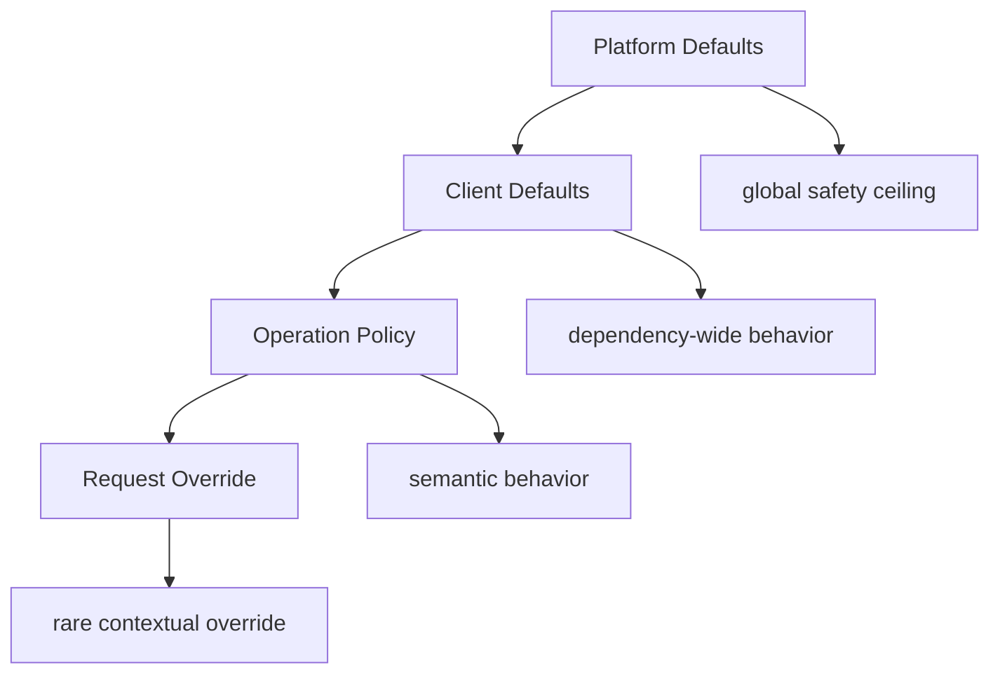
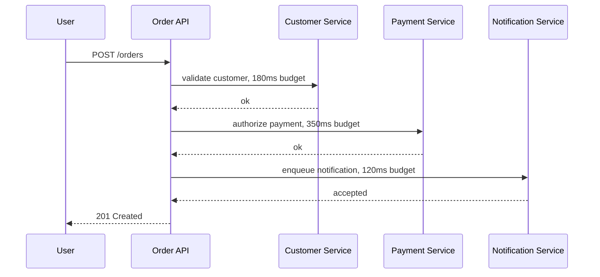
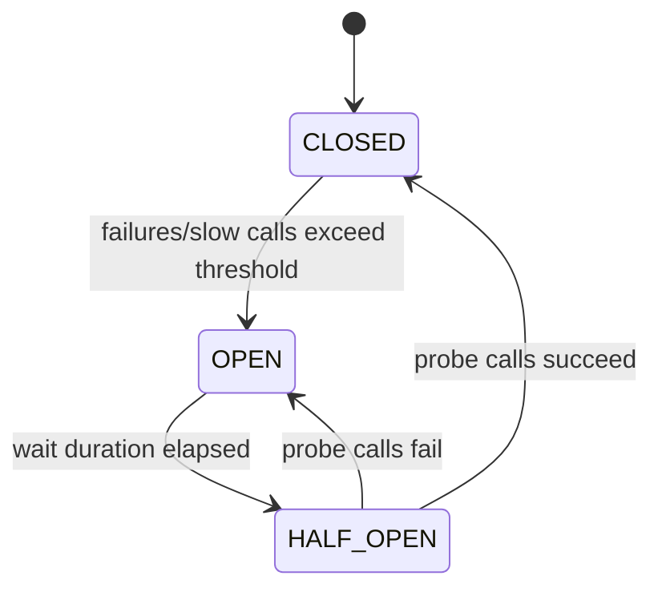
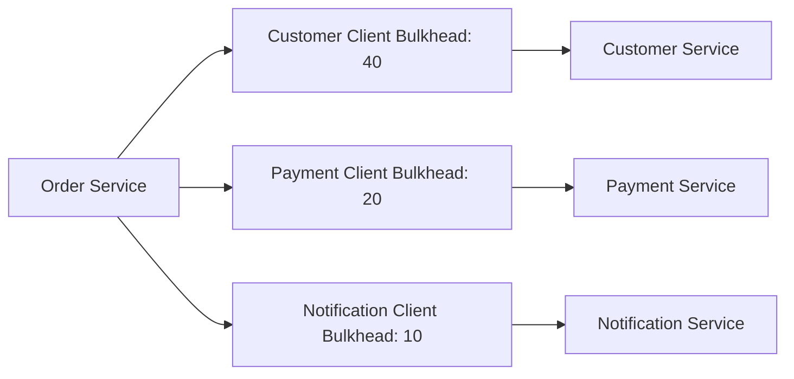
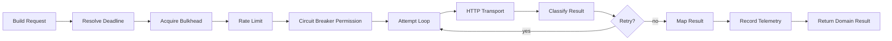

# Part 025 — Client Configuration Model: Timeouts, Pool, Retry, Circuit Breaker

A client without explicit configuration is not a production client.

It is a bet.

The bet usually sounds like this:

> The library defaults are probably fine.

That bet fails because HTTP client defaults are designed to be broadly usable, not specifically safe for your latency budget, downstream capacity, retry semantics, audit requirements, or incident profile.

A production-grade Java microservice client needs a **configuration model**, not scattered properties.

The goal is not to add every knob.

The goal is to make communication behavior deliberate:

- How long can this operation wait?
- How many concurrent calls can it consume?
- Is retry safe?
- Is the result allowed to be stale?
- How is overload handled?
- Which failures open the circuit?
- Which status codes are domain outcomes?
- Which metrics and traces will identify the dependency?
- Which changes can be made safely at runtime?

This part gives you a practical model.

---

## 1. The Core Rule

Treat every outbound dependency as a resource with a policy.

Not as a URL.

Not as a generated client.

Not as a Spring bean.

Not as an interface.

A dependency is a resource that consumes:

- caller request time
- caller threads
- caller heap
- caller sockets
- downstream capacity
- network bandwidth
- retry budget
- observability cardinality
- operational attention

So the configuration unit should be:

```text
client dependency + operation + communication policy
```

Example:

```yaml
clients:
  customer-service:
    base-url: http://customer-service.default.svc.cluster.local
    default-policy: internal-read
    operations:
      getCustomer:
        method: GET
        path-template: /customers/{customerId}
        policy: critical-read
      suspendCustomer:
        method: POST
        path-template: /customers/{customerId}:suspend
        policy: idempotent-command
```

The policy is the key.

The URL is just an address.

---

## 2. Configuration Is Not One Layer

A common mistake is to configure the client at one level only:

```yaml
connect-timeout: 500ms
read-timeout: 2s
retry: 3
```

That looks simple, but it hides four different scopes.



A strong model separates them:

| Scope | Purpose | Example |
|---|---|---|
| Platform default | Maximum guardrail | No HTTP request may run longer than 10s |
| Client default | Dependency baseline | Customer service default timeout 800ms |
| Operation policy | Semantic behavior | `getCustomer` may retry, `createPayment` may not unless idempotent |
| Request override | Contextual constraint | Parent deadline has only 120ms remaining |

The deeper the scope, the more specific it becomes.

But the deeper scope must never violate the safety ceiling.

Bad:

```yaml
platform:
  max-total-timeout: 5s
clients:
  report-service:
    operations:
      generateReport:
        timeout: 60s
```

If one operation needs 60 seconds, it is probably not a normal service-to-service HTTP operation. It may need async job submission, polling, callback, or streaming.

---

## 3. The Minimum Client Policy

A production outbound client policy should at least define:

```yaml
policy:
  timeout:
    connect: 150ms
    request: 700ms
    pool-acquire: 50ms
  retry:
    enabled: true
    max-attempts: 2
    backoff:
      initial: 50ms
      max: 150ms
      jitter: true
    retry-on:
      status: [502, 503, 504]
      exceptions: [connect-timeout, connection-reset]
  circuit-breaker:
    enabled: true
    failure-rate-threshold: 50
    slow-call-rate-threshold: 50
    slow-call-duration-threshold: 500ms
    minimum-calls: 50
  bulkhead:
    max-concurrent-calls: 40
    max-wait: 0ms
  rate-limit:
    enabled: false
  payload:
    max-request-bytes: 262144
    max-response-bytes: 1048576
    compression: response-only
  observability:
    dependency: customer-service
    operation: getCustomer
    slo: 300ms
```

This is not all configuration possible.

It is the minimum operational contract.

---

## 4. Timeout Configuration

Timeouts are the most important client configuration.

They define how much failure the caller is willing to wait through.

### 4.1 Timeout Types

Do not use one number for every timeout.

| Timeout | Meaning | Failure protected |
|---|---|---|
| Connect timeout | Time to establish connection | Bad route, blocked SYN, unreachable host |
| Pool acquire timeout | Time waiting for a reusable connection/thread/permit | Local saturation |
| Request timeout | Total time waiting for operation result | Slow downstream or network |
| Read/write timeout | Idle socket phase timeout where supported | Stalled transfer |
| Deadline | Absolute remaining parent budget | Cascading latency |

In JDK `HttpClient`, the client builder exposes `connectTimeout`, and individual `HttpRequest` instances can set request timeout. Other clients such as Apache HttpClient, OkHttp, Reactor Netty, and underlying Spring request factories may expose additional pool/read/write controls.

The exact knobs differ.

The policy model should not.

### 4.2 Deadline Beats Static Timeout

Static timeout says:

```text
This operation may take 700ms.
```

Deadline says:

```text
This request has 240ms remaining.
```

When both exist, use the smaller budget.

```java
Duration configuredTimeout = Duration.ofMillis(700);
Duration remainingDeadline = deadline.remaining();
Duration effectiveTimeout = min(configuredTimeout, remainingDeadline.minusMillis(20));
```

Why subtract a margin?

Because the caller still needs time to map errors, release resources, write logs, finish response handling, and avoid violating its own upstream deadline.

A simple rule:

```text
effective timeout = min(operation timeout, remaining parent deadline - safety margin)
```

### 4.3 Timeout Budget Example

Suppose an API has 1 second server-side SLO.



If every downstream call independently uses 1 second timeout, the top-level SLO is fake.

Timeouts must be composed.

### 4.4 Bad Timeout Values

These are suspicious:

| Value | Problem |
|---|---|
| Infinite | Caller can hang forever |
| 30s default everywhere | Cascading failure amplifier |
| Same timeout for all dependencies | Ignores dependency semantics |
| Timeout greater than upstream gateway timeout | Wasted work after caller gave up |
| Retry timeout not included in total budget | Retry storm risk |

### 4.5 Timeout Implementation Shape

```java
public record TimeoutPolicy(
        Duration connectTimeout,
        Duration poolAcquireTimeout,
        Duration requestTimeout,
        Duration safetyMargin
) {
    public Duration effectiveRequestTimeout(Deadline deadline) {
        Duration remaining = deadline.remaining().minus(safetyMargin);
        if (remaining.isNegative() || remaining.isZero()) {
            throw new DeadlineExceededBeforeCallException();
        }
        return remaining.compareTo(requestTimeout) < 0 ? remaining : requestTimeout;
    }
}
```

A client should calculate effective timeout per request, not once at startup.

---

## 5. Retry Configuration

Retry is not a generic reliability feature.

Retry is a load multiplier.

If a service receives 10,000 requests per second and every caller retries twice during an outage, the downstream may experience 30,000 attempts per second exactly when it is least able to handle them.

### 5.1 Retry Eligibility

Retry needs three answers:

| Question | Example |
|---|---|
| Is the operation semantically retryable? | GET usually yes; POST command only with idempotency key |
| Is the failure retryable? | `503` maybe; `400` no |
| Is there budget left? | No retry if deadline nearly expired |

Do not configure retries only by status code.

Configure retries by operation semantics.

```yaml
operations:
  getCustomer:
    retry-profile: safe-read
  createPayment:
    retry-profile: idempotent-command-only
  submitAuditRecord:
    retry-profile: no-http-retry
```

### 5.2 Retry Profiles

```yaml
retry-profiles:
  safe-read:
    max-attempts: 2
    retry-on-status: [502, 503, 504]
    retry-on-exceptions: [connect-timeout, connection-reset]
    backoff: exponential-jitter

  idempotent-command-only:
    max-attempts: 2
    requires-idempotency-key: true
    retry-on-status: [409-retryable, 502, 503, 504]
    backoff: bounded-jitter

  no-http-retry:
    max-attempts: 1
```

### 5.3 Backoff and Jitter

Backoff without jitter synchronizes clients.

Jitter breaks synchronization.

```java
static Duration jitteredBackoff(Duration base, double jitterRatio) {
    double min = 1.0 - jitterRatio;
    double max = 1.0 + jitterRatio;
    double factor = min + Math.random() * (max - min);
    return Duration.ofMillis((long) (base.toMillis() * factor));
}
```

For production code, prefer a tested library or centralized utility.

The important part is the invariant:

```text
retry delay must not push the call beyond its deadline
```

### 5.4 Retry Budget

A retry budget caps retry amplification.

Instead of allowing every request to retry, allow only a percentage of total calls to become retries.

Example policy:

```yaml
retry-budget:
  max-retry-ratio: 0.20
  window: 30s
```

Meaning:

```text
At most 20 retry attempts per 100 original calls in a 30-second window.
```

This is especially useful for high-throughput internal clients.

### 5.5 Retry Decision Function

```java
public boolean shouldRetry(ClientAttemptResult result, AttemptContext ctx) {
    if (ctx.attemptNumber() >= ctx.policy().maxAttempts()) return false;
    if (!ctx.deadline().hasEnoughTimeForAnotherAttempt()) return false;
    if (!ctx.retryBudget().tryAcquireRetryPermit()) return false;
    if (!ctx.operation().isSemanticallyRetryable()) return false;
    return ctx.policy().retryClassifier().isRetryable(result);
}
```

This shape is better than scattering retry annotations across clients.

---

## 6. Circuit Breaker Configuration

A circuit breaker protects the caller and downstream from repeated failed attempts.

It is not a retry replacement.

It is a stop mechanism.



### 6.1 What Should Count as Failure?

Not every non-2xx response should count.

| Outcome | Count as circuit failure? | Reason |
|---|---:|---|
| `400 Bad Request` | Usually no | Caller bug, not downstream availability |
| `401/403` | Usually no | Auth/config problem, not capacity failure |
| `404` domain not found | No | Valid domain outcome |
| `408/504` | Yes | Timeout path |
| `429` | Usually yes or special overload class | Downstream throttling |
| `500/502/503` | Yes | Server/dependency failure |
| connection refused/reset | Yes | Transport failure |
| response too large | Usually no for downstream health, yes for operation failure | Contract/payload policy issue |

A circuit breaker must classify failures according to dependency semantics.

### 6.2 Slow Calls Matter

A downstream can be “successful” and still dangerous.

If every call returns `200` after 2 seconds, the caller is still dying.

Configure slow-call thresholds:

```yaml
circuit-breaker:
  sliding-window-size: 100
  minimum-number-of-calls: 50
  failure-rate-threshold: 50
  slow-call-duration-threshold: 500ms
  slow-call-rate-threshold: 60
  wait-duration-in-open-state: 10s
  permitted-calls-in-half-open-state: 5
```

### 6.3 Per Dependency, Not Per Host Instance

Usually the breaker belongs to a logical dependency operation:

```text
customer-service.getCustomer
payment-service.authorizePayment
```

Not:

```text
10.42.1.17:8080
10.42.1.18:8080
```

Instance-level failure handling is usually the job of load balancer, service mesh, endpoint discovery, or connection pool health.

Operation-level circuit breaking answers:

> Is this dependency operation safe to keep calling from this service?

---

## 7. Bulkhead Configuration

Bulkheads prevent one dependency from consuming all local resources.

A timeout limits duration.

A circuit breaker limits repeated failure.

A bulkhead limits concurrency.



If notification service is slow, it should not consume all threads needed to authorize payments.

### 7.1 Semaphore vs Thread-Pool Bulkhead

| Bulkhead type | Use when | Risk |
|---|---|---|
| Semaphore | Caller thread already appropriate; mostly non-blocking or bounded blocking | Caller thread waits if max wait > 0 |
| Thread pool | Need separate execution resource | Queueing, context propagation complexity, more tuning |

In modern Java services, start with explicit concurrency limits and avoid unnecessary thread-pool hopping unless there is a clear reason.

### 7.2 Max Wait

For service-to-service calls, prefer:

```yaml
bulkhead:
  max-wait: 0ms
```

Fail fast when concurrency is exhausted.

Waiting inside a bulkhead queue often hides overload until latency explodes.

If queueing is required, make it very small and observable.

---

## 8. Connection Pool Configuration

The connection pool is part of the bulkhead.

It limits how much socket-level concurrency the caller can create toward a dependency.

### 8.1 Pool Properties

Depending on the HTTP client implementation, you may configure:

- max connections total
- max connections per route/host
- idle connection timeout
- connection time-to-live
- pending acquisition timeout
- HTTP/2 max concurrent streams
- TLS session reuse
- DNS refresh behavior

The JDK `HttpClient` exposes fewer direct pool controls than Apache HttpClient, OkHttp, or Reactor Netty. That does not mean pool behavior is irrelevant. It means your policy model may need either implementation-specific adapters or client choice based on required controls.

### 8.2 Pool Sizing Mental Model

Approximate concurrency needed:

```text
required concurrent calls ≈ request rate × average latency
```

If a client sends 500 requests/second to a dependency and average latency is 40ms:

```text
500 × 0.040 = 20 concurrent calls
```

Then add headroom, but not infinity.

If p95 is 150ms:

```text
500 × 0.150 = 75 concurrent calls at p95 pressure
```

A pool of 500 might hide downstream slowdown and amplify load.

A pool of 10 might throttle normal traffic.

A reasonable first cut might be 50–100 depending on SLO, instances, downstream capacity, and operation criticality.

The number is not universal.

The method matters.

### 8.3 Pool Exhaustion Is a Signal

If pool acquisition fails, do not map it to generic downstream timeout.

It means the caller is locally saturated for that dependency.

Use distinct error classification:

```text
CLIENT_POOL_EXHAUSTED
```

This helps incident response.

A downstream may be fine while caller pool is misconfigured.

---

## 9. Rate Limiter Configuration

Rate limiting can exist at multiple levels:

- gateway rate limit
- service mesh rate limit
- downstream server rate limit
- client-side rate limit
- per-tenant/business quota

Client-side rate limiting is useful when the caller knows it must not exceed a downstream contract.

Example:

```yaml
rate-limit:
  limit-for-period: 500
  refresh-period: 1s
  timeout-duration: 0ms
```

The `timeout-duration` should usually be zero for service-to-service calls.

If the permit is not available, fail fast or degrade.

Waiting inside a rate limiter is another hidden queue.

---

## 10. Payload Configuration

Payload policy belongs in the client configuration.

Not only in JSON mapper code.

```yaml
payload:
  max-request-bytes: 262144
  max-response-bytes: 1048576
  compression:
    request: false
    response: true
  json:
    fail-on-unknown-properties: false
    fail-on-null-for-primitives: true
```

### 10.1 Why Payload Limits Matter

An internal API can still return accidentally huge data:

- missing pagination
- wrong filter
- expanded graph
- recursive serialization
- accidental debug field
- binary payload encoded in JSON
- gzip bomb-like compressed response

Payload size is a reliability concern.

### 10.2 Response Body Strategy

For small JSON:

```java
HttpResponse.BodyHandlers.ofString(StandardCharsets.UTF_8)
```

For large response:

- stream to file/object store
- parse incrementally
- use pagination
- reject if too large

Never let “internal call” mean “unbounded body”.

---

## 11. Redirect, Proxy, TLS, and Security Configuration

Even internal clients need explicit transport security decisions.

| Setting | Production guidance |
|---|---|
| Redirects | Usually disabled for service-to-service unless explicitly needed |
| Proxy | Explicit; avoid accidental environment proxy behavior |
| TLS trust | Use controlled trust store; avoid trust-all clients |
| Hostname verification | Do not disable in production |
| mTLS | Usually platform/mesh-managed or explicitly client-managed |
| Credentials | Inject from secure config; never hardcode |
| Header propagation | Allowlist, not copy-all |

Do not let a generic client follow redirects across trust boundaries.

A redirect can turn an internal call into an unintended external call if misconfigured.

---

## 12. DNS and Discovery Configuration

DNS is not just name lookup.

It affects availability and load distribution.

Important questions:

- Does the client cache DNS?
- How long?
- Does it respect TTL?
- Does the service mesh intercept DNS or route at proxy level?
- Does the client reuse a connection to one resolved endpoint for too long?
- How does it react when endpoints are removed?

A client policy should include discovery assumptions:

```yaml
discovery:
  mode: kubernetes-dns
  expects-mesh-routing: true
  connection-reuse-policy: mesh-friendly
```

The application client does not always need to implement discovery logic.

But it must be aware of the platform doing discovery for it.

---

## 13. Error Mapper Configuration

Error mapping is configuration plus code.

A client should expose domain-safe errors to business logic.

```java
sealed interface CustomerLookupResult permits CustomerFound, CustomerMissing, CustomerLookupUnavailable {}

record CustomerFound(CustomerSnapshot customer) implements CustomerLookupResult {}
record CustomerMissing(CustomerId customerId) implements CustomerLookupResult {}
record CustomerLookupUnavailable(DependencyFailure failure) implements CustomerLookupResult {}
```

Mapping table:

| HTTP outcome | Client result |
|---|---|
| `200` | `CustomerFound` |
| `404` | `CustomerMissing` if the operation semantics define this as domain absence |
| `409` | domain conflict or retryable conflict depending on body type |
| `429` | overload/throttled dependency failure |
| `500/502/503/504` | dependency unavailable |
| timeout | unknown outcome / dependency timeout |
| pool exhausted | local dependency saturation |

This mapping must be consistent with retry and circuit breaker classification.

Do not have retry treat `404` as final while business logic treats it as exceptional in some call paths and valid in others.

---

## 14. Central Policy Registry

Do not duplicate raw values across clients.

Create named profiles.

```yaml
communication-policies:
  profiles:
    low-latency-read:
      timeout:
        connect: 100ms
        request: 300ms
        pool-acquire: 20ms
      retry:
        max-attempts: 2
        backoff: 30ms-jitter
      bulkhead:
        max-concurrent-calls: 80

    critical-command:
      timeout:
        connect: 150ms
        request: 900ms
        pool-acquire: 50ms
      retry:
        max-attempts: 1
      bulkhead:
        max-concurrent-calls: 30

    async-enqueue:
      timeout:
        connect: 100ms
        request: 250ms
      retry:
        max-attempts: 2
        requires-idempotency-key: true
```

Then bind operations to profiles:

```yaml
clients:
  customer-service:
    operations:
      getCustomer:
        profile: low-latency-read
      updateCustomerStatus:
        profile: critical-command
```

Named profiles improve consistency.

Operation overrides remain possible, but visible.

---

## 15. Java Configuration Shape

A useful model is a set of immutable records.

```java
public record ClientConfig(
        String name,
        URI baseUri,
        Map<String, OperationConfig> operations,
        TimeoutPolicy defaultTimeout,
        RetryPolicy defaultRetry,
        CircuitBreakerPolicy defaultCircuitBreaker,
        BulkheadPolicy defaultBulkhead,
        PayloadPolicy defaultPayload
) {}

public record OperationConfig(
        String operationName,
        String method,
        String pathTemplate,
        TimeoutPolicy timeout,
        RetryPolicy retry,
        CircuitBreakerPolicy circuitBreaker,
        BulkheadPolicy bulkhead,
        PayloadPolicy payload,
        ObservabilityPolicy observability
) {}
```

Avoid passing raw `Duration` and integer properties everywhere.

Strong types reveal intent.

### 15.1 Retry Policy Type

```java
public record RetryPolicy(
        int maxAttempts,
        Duration initialBackoff,
        Duration maxBackoff,
        boolean jitterEnabled,
        boolean requiresIdempotencyKey,
        Set<Integer> retryableStatuses,
        Set<Class<? extends Throwable>> retryableExceptions
) {
    public boolean enabled() {
        return maxAttempts > 1;
    }
}
```

### 15.2 Bulkhead Policy Type

```java
public record BulkheadPolicy(
        int maxConcurrentCalls,
        Duration maxWaitDuration
) {
    public boolean failFast() {
        return maxWaitDuration.isZero();
    }
}
```

### 15.3 Payload Policy Type

```java
public record PayloadPolicy(
        long maxRequestBytes,
        long maxResponseBytes,
        boolean requestCompressionEnabled,
        boolean responseCompressionEnabled
) {}
```

---

## 16. Spring Boot Binding Example

```java
@ConfigurationProperties(prefix = "communication")
public record CommunicationProperties(
        Map<String, ClientProperties> clients,
        Map<String, PolicyProfile> profiles
) {}

public record ClientProperties(
        URI baseUrl,
        String defaultProfile,
        Map<String, OperationProperties> operations
) {}

public record OperationProperties(
        String method,
        String pathTemplate,
        String profile,
        TimeoutProperties timeoutOverride,
        RetryProperties retryOverride
) {}
```

Example YAML:

```yaml
communication:
  profiles:
    low-latency-read:
      timeout:
        connect: 100ms
        request: 300ms
        pool-acquire: 20ms
      retry:
        max-attempts: 2
        initial-backoff: 25ms
        max-backoff: 100ms
        jitter-enabled: true

  clients:
    customer-service:
      base-url: http://customer-service.default.svc.cluster.local
      default-profile: low-latency-read
      operations:
        getCustomer:
          method: GET
          path-template: /customers/{customerId}
          profile: low-latency-read
```

Bind configuration early at startup.

Validate aggressively.

Invalid communication policy should fail startup, not fail during an incident.

---

## 17. Configuration Validation

Add validation rules.

```java
public final class CommunicationPolicyValidator {
    public void validate(OperationConfig operation) {
        requirePositive(operation.timeout().requestTimeout(), "request timeout");
        requirePositive(operation.timeout().connectTimeout(), "connect timeout");

        if (operation.retry().maxAttempts() > 1 && !operation.isRetrySafe()) {
            throw new IllegalArgumentException(
                    operation.operationName() + " retries but is not retry-safe");
        }

        if (operation.timeout().connectTimeout().compareTo(operation.timeout().requestTimeout()) >= 0) {
            throw new IllegalArgumentException("connect timeout must be smaller than request timeout");
        }

        if (operation.bulkhead().maxConcurrentCalls() <= 0) {
            throw new IllegalArgumentException("bulkhead maxConcurrentCalls must be positive");
        }
    }
}
```

Validation examples:

| Rule | Why |
|---|---|
| `connectTimeout < requestTimeout` | Otherwise no useful request budget remains |
| `maxAttempts >= 1` | Attempt count includes first try |
| Retry command requires idempotency key | Prevent duplicate side effects |
| Bulkhead max wait <= request timeout | Avoid hidden wait exceeding operation budget |
| Response size max configured | Prevent unbounded memory usage |
| Operation name present | Required for metrics/tracing cardinality control |

---

## 18. Combining Policies in the Call Pipeline

The order matters.

A typical synchronous pipeline:



### 18.1 Why Bulkhead Before HTTP?

Because you want to reject before consuming transport resources.

### 18.2 Why Circuit Breaker Before Attempt?

Because when the circuit is open, no attempt should be made.

### 18.3 Why Retry Inside Deadline?

Because retry must obey the original operation budget.

### 18.4 Why Telemetry Around Everything?

Because pool exhaustion, circuit open, and rate-limit rejection are client outcomes even when no HTTP request was sent.

---

## 19. Example: Policy Executor

```java
public final class HttpOperationExecutor {
    private final HttpTransport transport;
    private final RetryDecider retryDecider;
    private final Telemetry telemetry;

    public <T> T execute(OperationConfig operation, HttpCall<T> call, Deadline parentDeadline) {
        Deadline deadline = Deadline.min(
                parentDeadline,
                Deadline.after(operation.timeout().requestTimeout())
        );

        return telemetry.observe(operation, () -> {
            try (BulkheadPermit ignored = acquireBulkhead(operation, deadline)) {
                checkCircuitBreaker(operation);
                return executeAttempts(operation, call, deadline);
            }
        });
    }

    private <T> T executeAttempts(OperationConfig operation, HttpCall<T> call, Deadline deadline) {
        int attempt = 1;
        while (true) {
            ClientAttemptResult<T> result = transport.send(call, operation, deadline, attempt);
            if (!retryDecider.shouldRetry(result, operation, deadline, attempt)) {
                return result.orThrowMappedException();
            }
            sleepWithinDeadline(operation.retry().backoffFor(attempt), deadline);
            attempt++;
        }
    }
}
```

The code is intentionally schematic.

The point is the design:

- deadline is explicit
- policy is operation-specific
- retry is centralized
- telemetry surrounds client-side outcomes
- result mapping happens after classification

---

## 20. Resilience4j Integration Shape

Resilience4j provides decorators for CircuitBreaker, Retry, RateLimiter, Bulkhead, and TimeLimiter. That makes it useful for building a consistent outbound client policy.

But do not blindly stack annotations.

Be clear about order.

Example with decorators:

```java
Supplier<CustomerSnapshot> supplier = () -> customerTransport.getCustomer(customerId, deadline);

Supplier<CustomerSnapshot> guarded = Decorators.ofSupplier(supplier)
        .withBulkhead(customerBulkhead)
        .withCircuitBreaker(customerCircuitBreaker)
        .withRetry(customerRetry)
        .decorate();

return guarded.get();
```

The exact order should be tested and documented.

For many teams, a custom executor around Resilience4j primitives is easier to reason about than annotation composition scattered across classes.

---

## 21. Dynamic Configuration

Dynamic config is powerful and dangerous.

You may want to change:

- timeout
- circuit breaker threshold
- retry attempts
- rate limit
- bulkhead limit

without redeploying.

But some changes can destabilize the system.

### 21.1 Safe Dynamic Changes

Usually safe:

- lower retry attempts
- lower timeout
- open circuit manually
- reduce rate limit
- reduce max response size

Potentially risky:

- increase retry attempts
- increase timeout massively
- increase bulkhead concurrency
- disable circuit breaker
- enable request compression for all calls

Runtime changes should pass validation and audit.

```text
config change = production event
```

It should be visible in logs, metrics annotations, dashboards, and incident timelines.

---

## 22. Configuration Ownership

Who owns the client config?

Bad answer:

> Everyone edits YAML when they need to.

Better answer:

| Config area | Owner |
|---|---|
| Operation semantics | Consuming service team |
| Retry safety | Consuming and providing teams agree |
| Downstream capacity limit | Providing service team publishes guidance |
| Timeout/SLO budget | Consuming service owns, aligned with platform SLO |
| Circuit threshold | Consuming service owns, platform advises |
| Gateway/mesh policy | Platform team owns |
| Global safety ceiling | Platform/SRE owns |

The client is in the caller process.

But the dependency contract is shared.

---

## 23. Configuration Drift

Configuration drift happens when different services call the same dependency with wildly different assumptions.

Example:

| Caller | Timeout | Retry | Bulkhead |
|---|---:|---:|---:|
| Order Service | 300ms | 1 retry | 50 |
| Billing Service | 5s | 3 retries | 500 |
| Report Service | 30s | 5 retries | unlimited |

During dependency slowdown, the aggressive callers dominate capacity.

Prevent this with:

- shared policy profiles
- dependency owner guidance
- config linting
- runtime dashboards by caller/dependency/operation
- incident review on retry/timeout behavior

---

## 24. Anti-Patterns

### 24.1 One Client Bean for Everything

```java
@Bean
RestClient restClient() {
    return RestClient.create();
}
```

This encourages all dependencies to share behavior.

Instead, create dependency-specific clients or policy-specific builders.

### 24.2 Retry Annotation on Interface Method

```java
@Retry(name = "default")
Customer getCustomer(String id);
```

This hides operation semantics.

The annotation does not explain whether the operation is idempotent, how deadline is enforced, or whether retry budget exists.

### 24.3 Infinite Queue Behind Bulkhead

A queue turns overload into latency.

Latency then creates more concurrency.

Concurrency creates more latency.

That is a positive feedback loop.

### 24.4 Same Timeout Everywhere

A single timeout means no design happened.

### 24.5 Copy-All Headers

Propagating all inbound headers to downstream services leaks security, privacy, routing, and observability problems.

Use allowlists.

### 24.6 Generated Client Owns Policy

Generated clients should know paths and schemas.

They should not own resilience behavior.

Wrap them.

---

## 25. Production Checklist

Before approving an outbound client, ask:

- [ ] Is the logical dependency named?
- [ ] Is each operation named?
- [ ] Is base URL/discovery mode explicit?
- [ ] Are connect, request, and pool-acquire timeouts defined?
- [ ] Is parent deadline respected?
- [ ] Is retry configured by operation semantics?
- [ ] Are command retries protected by idempotency keys?
- [ ] Is backoff jittered?
- [ ] Is retry budget enforced for high-volume calls?
- [ ] Is circuit breaker failure classification documented?
- [ ] Are slow calls counted?
- [ ] Is bulkhead concurrency bounded?
- [ ] Is queueing avoided or tiny?
- [ ] Are payload limits defined?
- [ ] Are redirects disabled unless intentionally enabled?
- [ ] Is TLS/proxy behavior explicit?
- [ ] Are propagated headers allowlisted?
- [ ] Are status codes mapped to domain/communication outcomes?
- [ ] Are metrics/traces/logs emitted for no-attempt failures too?
- [ ] Is the config validated at startup?
- [ ] Are risky runtime changes controlled?

---

## 26. Reference Configuration Template

```yaml
communication:
  global:
    max-request-timeout: 5s
    default-safety-margin: 25ms
    max-response-bytes: 1048576

  profiles:
    internal-read:
      timeout:
        connect: 100ms
        pool-acquire: 20ms
        request: 300ms
        safety-margin: 25ms
      retry:
        max-attempts: 2
        initial-backoff: 25ms
        max-backoff: 100ms
        jitter: true
        retry-on-status: [502, 503, 504]
      circuit-breaker:
        enabled: true
        sliding-window-size: 100
        minimum-calls: 50
        failure-rate-threshold: 50
        slow-call-duration-threshold: 250ms
        slow-call-rate-threshold: 60
      bulkhead:
        max-concurrent-calls: 80
        max-wait: 0ms
      payload:
        max-request-bytes: 65536
        max-response-bytes: 262144

    idempotent-command:
      timeout:
        connect: 150ms
        pool-acquire: 50ms
        request: 800ms
        safety-margin: 30ms
      retry:
        max-attempts: 2
        requires-idempotency-key: true
        initial-backoff: 50ms
        max-backoff: 150ms
        jitter: true
        retry-on-status: [502, 503, 504]
      circuit-breaker:
        enabled: true
        sliding-window-size: 100
        minimum-calls: 30
        failure-rate-threshold: 40
      bulkhead:
        max-concurrent-calls: 30
        max-wait: 0ms

  clients:
    customer-service:
      base-url: http://customer-service.default.svc.cluster.local
      default-profile: internal-read
      discovery:
        mode: kubernetes-dns
        expects-mesh-routing: true
      operations:
        getCustomer:
          method: GET
          path-template: /customers/{customerId}
          profile: internal-read
        updateCustomerStatus:
          method: PUT
          path-template: /customers/{customerId}/status
          profile: idempotent-command
          idempotency-key:
            required: true
```

This is not meant to be copied blindly.

It is a shape.

Adapt the numbers to your SLO, load, client library, platform, and downstream contract.

---

## 27. Exercises

### Exercise 1 — Classify Operations

For each operation in one of your services, classify:

| Operation | Safe? | Idempotent? | Retryable? | Timeout | Bulkhead |
|---|---:|---:|---:|---:|---:|
| `getCustomer` | yes | yes | yes | ? | ? |
| `createPayment` | no | only with key | maybe | ? | ? |
| `sendNotification` | no | only with message id | maybe | ? | ? |

If you cannot answer, the client is not production-ready.

### Exercise 2 — Find Hidden Queues

Look for queues in:

- servlet thread pool
- WebClient/Reactor scheduler
- connection pool pending acquisition
- bulkhead
- rate limiter
- retry executor
- service mesh proxy
- downstream queue

Every hidden queue should have:

- max size
- wait time
- metric
- owner
- failure mode

### Exercise 3 — Rewrite a Generic Client

Take a generic client method:

```java
CustomerDto getCustomer(String id);
```

Rewrite it as:

```java
CustomerLookupResult getCustomer(CustomerId id, RequestContext context);
```

Then define:

- timeout policy
- retry policy
- circuit breaker classifier
- error mapping
- observability attributes

---

## 28. Summary

A Java HTTP client is not production-grade because it can send a request.

It becomes production-grade when communication behavior is explicit.

The minimum useful configuration model defines:

- dependency and operation names
- timeout and deadline behavior
- retry eligibility, backoff, jitter, and budget
- circuit breaker classification
- bulkhead and pool limits
- rate limiting
- payload bounds
- redirect/TLS/proxy/header policy
- error mapping
- observability labels
- validation and ownership

The most important mental shift:

> Do not configure clients by library knobs. Configure them by dependency behavior.

Part 026 builds the next layer: **client-side observability**.

A policy you cannot observe is a policy you cannot trust.
