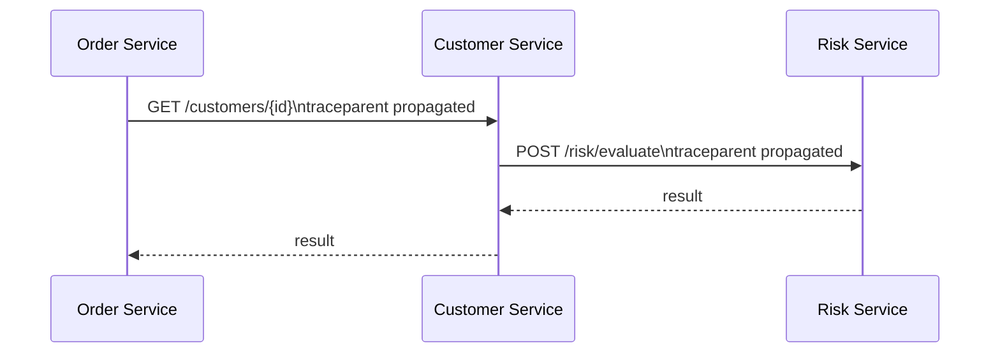
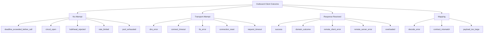
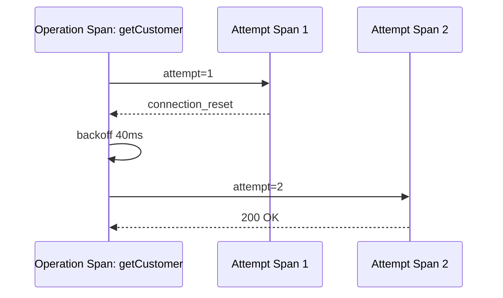
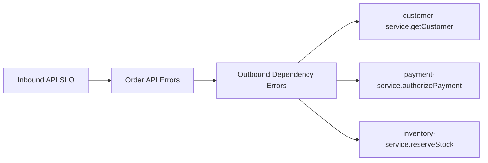

# Part 026 — Client-Side Observability: Metrics, Logs, Traces

Most teams observe inbound traffic better than outbound traffic.

That is backwards for microservices.

In a distributed system, your service often fails because of something it calls:

- dependency timeout
- dependency overload
- bad status mapping
- pool exhaustion
- retry storm
- circuit breaker open
- DNS failure
- TLS handshake issue
- payload too large
- schema mismatch
- wrong route through proxy/mesh

If outbound calls are not observable, every incident becomes guesswork.

Client-side observability answers three questions:

1. What did we call?
2. What happened?
3. How did it affect our caller?

This part gives you a production model for observing Java microservice clients.

---

## 1. The Core Principle

Observe the logical operation, not only the wire request.

Bad telemetry:

```text
GET http://customer-service.default.svc.cluster.local/customers/123 took 812ms
```

Better telemetry:

```text
dependency=customer-service
operation=getCustomer
method=GET
route=/customers/{customerId}
outcome=timeout
attempt=2
retry_count=1
circuit_state=closed
duration=812ms
parent_deadline_remaining=0ms
```

The first line tells you a request happened.

The second model tells you why the system behaved the way it did.

---

## 2. Client-Side Telemetry Is Not Just Tracing

You need three layers:

| Layer | Purpose | Good for |
|---|---|---|
| Metrics | Aggregated behavior over time | SLO, alerting, capacity, trend |
| Traces | Causal path across services | Debugging request path and latency |
| Logs | Detailed discrete event evidence | Error explanation, audit, rare failure details |

Do not force one layer to do all jobs.

A trace is bad for aggregate alerting.

A metric is bad for single-request causality.

A log is bad for high-cardinality time-series analysis.

They should correlate.

They should not duplicate everything.

---

## 3. What Must Be Observable

A production client should emit telemetry for these outcomes:

| Outcome | HTTP attempt made? | Must be observable? |
|---|---:|---:|
| Success | yes | yes |
| HTTP error response | yes | yes |
| Timeout | maybe | yes |
| Connection failure | maybe | yes |
| DNS failure | no/partial | yes |
| TLS failure | no/partial | yes |
| Pool acquisition timeout | no | yes |
| Bulkhead rejected | no | yes |
| Rate limit rejected | no | yes |
| Circuit breaker open | no | yes |
| Retry exhausted | yes | yes |
| Payload too large | yes/partial | yes |
| Response mapping error | yes | yes |
| Deadline exceeded before call | no | yes |

This is the main reason auto-instrumentation alone is not enough.

Auto-instrumentation can observe HTTP attempts.

Your client abstraction must observe **communication outcomes**.

---

## 4. Naming Model

Use stable names.

```text
service.name=order-service
dependency.name=customer-service
dependency.operation=getCustomer
http.request.method=GET
http.route=/customers/{customerId}
```

Do not use raw URLs as metric labels.

Bad:

```text
url=/customers/123
url=/customers/456
url=/customers/789
```

This creates high-cardinality telemetry.

Use route templates:

```text
route=/customers/{customerId}
```

### 4.1 Operation Name vs Route

Route says wire shape.

Operation says business/client intent.

Both matter.

| Field | Example | Why |
|---|---|---|
| `dependency.name` | `customer-service` | Logical dependency |
| `dependency.operation` | `getCustomer` | Client abstraction operation |
| `http.request.method` | `GET` | Protocol method |
| `http.route` | `/customers/{customerId}` | Stable route grouping |

A single route can support different operations in poor API designs.

A single operation can migrate routes over time.

Keep both.

---

## 5. Trace Context Propagation

Distributed tracing depends on context propagation.

For HTTP, the standard propagation model is W3C Trace Context:

```text
traceparent: 00-4bf92f3577b34da6a3ce929d0e0e4736-00f067aa0ba902b7-01
tracestate: vendor-specific-state
```

You do not need to manually invent correlation headers if your telemetry stack already supports W3C propagation.

But you still need to understand the boundary.



Each service creates spans that share a trace id.

The trace id connects the causal path.

### 5.1 Correlation ID vs Trace ID

A trace id is generated by tracing infrastructure.

A correlation id may be business or platform defined.

Do not confuse them.

| ID | Purpose | Lifetime |
|---|---|---|
| Trace ID | Observability causal path | Usually one request/workflow trace |
| Span ID | One operation within trace | One unit of work |
| Correlation ID | Business/process correlation | May span many requests/events |
| Idempotency key | Duplicate side-effect prevention | One command semantic boundary |
| Request ID | Edge/request identity | Often one inbound HTTP request |

A single outbound call may carry several identifiers.

Each has different semantics.

---

## 6. Baggage Propagation

Baggage propagates key-value context across services.

It is useful.

It is dangerous.

Good baggage examples:

```text
tenant=t-123
traffic_class=gold
region=ap-southeast-3
```

Bad baggage examples:

```text
email=alice@example.com
jwt=eyJhbGciOi...
full_customer_name=Alice Tan
large_debug_blob=...
```

Baggage is copied to downstream requests.

So baggage policy must define:

- allowed keys
- value size limit
- privacy classification
- propagation boundary
- whether external egress strips it
- logging rules

Do not use baggage as a distributed global variable.

---

## 7. Span Design for HTTP Clients

A client span should represent the outbound operation.

Example span attributes:

```text
span.name=GET /customers/{customerId}
span.kind=CLIENT
server.address=customer-service.default.svc.cluster.local
http.request.method=GET
http.route=/customers/{customerId}
http.response.status_code=200
dependency.name=customer-service
dependency.operation=getCustomer
retry.attempt=1
```

OpenTelemetry defines semantic conventions for HTTP spans. Use standard attributes where they exist, then add carefully controlled custom attributes for dependency and operation semantics.

### 7.1 Do Not Add High-Cardinality Attributes

Avoid:

```text
customer.id=123
email=alice@example.com
raw.url=/customers/123?include=everything
jwt.subject=user-928381
```

High-cardinality attributes increase cost and can make metrics unusable.

For traces, high-cardinality is less dangerous than metrics but still risky for storage, search, privacy, and sampling.

### 7.2 Span Status

A span status should represent operation failure, not merely HTTP status class.

For example:

| HTTP/status | Span status | Reason |
|---|---|---|
| `200` | OK | Success |
| `404` for lookup absence | OK or unset | Valid domain outcome if expected |
| `409` domain conflict | OK or error depending operation | Must be semantic |
| `503` | ERROR | Dependency unavailable |
| timeout | ERROR | Communication failure |
| circuit open | ERROR | Client-side dependency unavailable |

If `404 customer not found` is a normal result, marking it as error pollutes traces and metrics.

---

## 8. Metrics Design

Metrics answer aggregate questions:

- Is dependency latency increasing?
- Is error rate above threshold?
- Are retries increasing?
- Are circuits opening?
- Are pools saturated?
- Are bulkheads rejecting calls?
- Which dependency is hurting our SLO?

### 8.1 Core Client Metrics

A good minimum set:

| Metric | Type | Labels |
|---|---|---|
| `client.request.duration` | histogram/timer | dependency, operation, method, route, outcome |
| `client.request.attempts` | counter | dependency, operation, outcome |
| `client.retry.count` | counter | dependency, operation, reason |
| `client.circuit.open` | gauge | dependency, operation |
| `client.bulkhead.rejected` | counter | dependency, operation |
| `client.pool.acquire.duration` | histogram | dependency |
| `client.pool.exhausted` | counter | dependency |
| `client.deadline.exceeded.before_call` | counter | dependency, operation |
| `client.payload.rejected` | counter | dependency, operation, direction |

### 8.2 Outcome Labels

Use bounded outcome categories.

```text
success
domain_not_found
domain_conflict
client_error
server_error
timeout
connection_error
dns_error
tls_error
pool_exhausted
bulkhead_rejected
rate_limited
circuit_open
mapping_error
payload_rejected
cancelled
unknown
```

Do not use exception class as a high-cardinality metric label unless strictly controlled.

### 8.3 HTTP Status Labels

You can label by status class:

```text
status_class=2xx
status_class=4xx
status_class=5xx
```

Use exact status code only if the metric backend and cardinality budget allow it.

For most services, exact status code is still bounded and acceptable.

But avoid labels like:

```text
error_message="Connection reset by peer from 10.42.1.17 after 213ms"
```

That belongs in logs, not metrics.

---

## 9. RED and USE for Clients

For outbound dependencies, use a variation of RED:

| RED | Client meaning |
|---|---|
| Rate | Calls per second by dependency/operation |
| Errors | Failed outcomes by dependency/operation/reason |
| Duration | Latency distribution by dependency/operation |

Also use USE for client resources:

| USE | Client resource meaning |
|---|---|
| Utilization | Connection pool usage, bulkhead permits used |
| Saturation | Pending acquisition, queued calls |
| Errors | Pool acquisition failures, rejected calls |

A dependency can look healthy by RED while local client resources are saturated.

You need both.

---

## 10. Logs Design

Logs should explain discrete failure events.

Do not log every successful outbound call at info level in high-throughput services.

Log failures and unusual outcomes with structured fields.

Example:

```json
{
  "event": "outbound_http_call_failed",
  "service": "order-service",
  "dependency": "customer-service",
  "operation": "getCustomer",
  "method": "GET",
  "route": "/customers/{customerId}",
  "outcome": "timeout",
  "attempt": 2,
  "maxAttempts": 2,
  "durationMs": 702,
  "configuredTimeoutMs": 700,
  "remainingDeadlineMs": 0,
  "traceId": "4bf92f3577b34da6a3ce929d0e0e4736",
  "spanId": "00f067aa0ba902b7"
}
```

### 10.1 Log Level Guidance

| Event | Suggested level |
|---|---|
| Single retryable attempt failure that later succeeds | debug or trace, maybe metric only |
| Final dependency failure | warn |
| Caller bug / invalid request mapping | error or warn depending severity |
| Circuit opened | warn |
| Circuit remains open under known outage | metric/trace, avoid log spam |
| Bulkhead rejection spike | warn with rate limit |
| Payload policy rejection | warn |
| Sensitive header stripped | debug/security audit depending policy |

Do not let a downstream outage create a logging outage.

Rate-limit repetitive logs.

---

## 11. Error Taxonomy

A useful taxonomy separates where failure happened.



This taxonomy helps with:

- metrics labels
- alert routing
- incident diagnosis
- retry decisions
- circuit breaker classification
- SLO reports

Avoid a single bucket called `exception`.

---

## 12. Observability Around Retry

A retried call has two levels:

1. operation-level outcome
2. attempt-level outcomes

Example:

```text
operation: getCustomer
operation outcome: success_after_retry
operation duration: 180ms
attempt 1: connection_reset, 20ms
attempt 2: success, 120ms
retry delay: 40ms
```

Trace shape:



Whether attempts become child spans depends on volume and sampling policy.

At minimum, expose attempt count as metric and operation span attribute.

Important metrics:

```text
client.retry.count{dependency,operation,reason}
client.request.duration{outcome="success_after_retry"}
client.request.attempts{attempt="1",outcome="connection_error"}
```

Retry that succeeds is still important.

It means the system consumed extra capacity to deliver success.

---

## 13. Observability Around Circuit Breaker

Circuit breaker telemetry must answer:

- Is the circuit open?
- Why did it open?
- Which dependency/operation?
- Are half-open probes succeeding?
- How many calls are rejected without attempt?

Metrics:

```text
client.circuit.state{dependency,operation,state}
client.circuit.opened.count{dependency,operation,reason}
client.circuit.calls.rejected{dependency,operation}
client.circuit.half_open.probe{dependency,operation,outcome}
```

Logs:

```json
{
  "event": "client_circuit_opened",
  "dependency": "payment-service",
  "operation": "authorizePayment",
  "failureRate": 64.0,
  "slowCallRate": 72.0,
  "windowSize": 100,
  "minimumCalls": 50
}
```

Do not only log “CallNotPermittedException”.

That is an implementation symptom, not an operational explanation.

---

## 14. Observability Around Bulkhead and Pool

Bulkhead and pool issues are caller-local.

If you only monitor downstream HTTP status, you miss them.

Track:

```text
client.bulkhead.available_permits
client.bulkhead.max_permits
client.bulkhead.rejected
client.pool.active_connections
client.pool.idle_connections
client.pool.pending_acquire
client.pool.acquire.duration
client.pool.acquire.timeout
```

Exact availability depends on client library.

If your chosen HTTP client cannot expose the pool signals you need, compensate with wrapper metrics or choose a client library with stronger operational visibility.

### 14.1 Saturation Interpretation

| Signal | Meaning |
|---|---|
| high latency, low pool usage | downstream slow or network path issue |
| high pool usage, high pending acquire | local client saturation or downstream slow causing connection retention |
| high bulkhead rejection | caller protecting itself |
| high circuit open rejection | caller has stopped attempting failed dependency |
| high retry count and rising latency | partial outage or unstable dependency |

---

## 15. OpenTelemetry Java Agent vs Manual Instrumentation

The OpenTelemetry Java agent can automatically instrument many libraries and frameworks.

This is very useful.

But it does not know all your business operation semantics.

Use both layers:

| Layer | Responsibility |
|---|---|
| Auto-instrumentation | HTTP spans, common libraries, propagation |
| Manual/client wrapper instrumentation | dependency name, operation name, retry count, circuit outcome, domain mapping |

Example:

```text
OpenTelemetry Java agent observes: HTTP GET span
Client wrapper observes: customer-service.getCustomer outcome=success_after_retry
```

The wrapper should enrich, not fight, the auto-instrumentation.

---

## 16. Manual Span Example

```java
public CustomerLookupResult getCustomer(CustomerId customerId, RequestContext context) {
    Span span = tracer.spanBuilder("customer-service.getCustomer")
            .setSpanKind(SpanKind.CLIENT)
            .setAttribute("dependency.name", "customer-service")
            .setAttribute("dependency.operation", "getCustomer")
            .setAttribute("http.request.method", "GET")
            .setAttribute("http.route", "/customers/{customerId}")
            .startSpan();

    try (Scope ignored = span.makeCurrent()) {
        CustomerLookupResult result = executor.execute(GET_CUSTOMER, customerId, context.deadline());
        span.setAttribute("client.outcome", result.outcomeName());
        return result;
    } catch (Exception ex) {
        span.recordException(ex);
        span.setStatus(StatusCode.ERROR);
        throw ex;
    } finally {
        span.end();
    }
}
```

This is illustrative.

In real services, avoid wrapping a span around another identical HTTP client span unless you intentionally want both logical and transport spans.

A useful trace often has:

```text
logical client span
  -> transport HTTP span
```

But high-volume services may prefer fewer spans.

Choose intentionally.

---

## 17. Micrometer Timer Example

For Spring services, Micrometer often provides the metric facade.

A client wrapper can record operation-level timing:

```java
public <T> T observeClientCall(OperationConfig operation, Supplier<T> call) {
    Timer.Sample sample = Timer.start(meterRegistry);
    String outcome = "unknown";

    try {
        T result = call.get();
        outcome = classifyResult(result);
        return result;
    } catch (ClientCommunicationException ex) {
        outcome = ex.outcome();
        throw ex;
    } finally {
        sample.stop(Timer.builder("client.request.duration")
                .tag("dependency", operation.dependencyName())
                .tag("operation", operation.operationName())
                .tag("method", operation.method())
                .tag("route", operation.routeTemplate())
                .tag("outcome", outcome)
                .publishPercentileHistogram()
                .register(meterRegistry));
    }
}
```

This example shows the shape.

In production, avoid dynamically creating meters on every call. Register through stable operation configuration or use a controlled meter provider.

---

## 18. Spring RestClient Interceptor Shape

A Spring `RestClient` interceptor can capture transport-level data.

```java
public final class OutboundTelemetryInterceptor implements ClientHttpRequestInterceptor {
    private final ClientTelemetry telemetry;

    @Override
    public ClientHttpResponse intercept(
            HttpRequest request,
            byte[] body,
            ClientHttpRequestExecution execution
    ) throws IOException {
        long start = System.nanoTime();
        String route = routeTemplateFromAttributeOrFallback(request);

        try {
            ClientHttpResponse response = execution.execute(request, body);
            telemetry.recordHttpAttempt(request, response.getStatusCode(), route, elapsed(start));
            return response;
        } catch (IOException ex) {
            telemetry.recordTransportFailure(request, route, ex, elapsed(start));
            throw ex;
        }
    }
}
```

The interceptor sees HTTP details.

The higher-level client wrapper should still record semantic outcomes such as `domain_not_found`, `success_after_retry`, or `circuit_open`.

---

## 19. WebClient Filter Shape

For `WebClient`, use an `ExchangeFilterFunction`.

```java
ExchangeFilterFunction telemetryFilter = (request, next) -> {
    long start = System.nanoTime();
    String route = request.attribute("routeTemplate")
            .map(Object::toString)
            .orElse("unknown");

    return next.exchange(request)
            .doOnSuccess(response -> telemetry.recordHttpAttempt(
                    request.method().name(), route, response.statusCode().value(), elapsed(start)))
            .doOnError(error -> telemetry.recordTransportFailure(
                    request.method().name(), route, error, elapsed(start)));
};
```

Reactive telemetry must preserve context.

Do not assume ThreadLocal MDC automatically works across reactive boundaries.

Use framework-supported context propagation.

---

## 20. JDK HttpClient Wrapper Shape

JDK `HttpClient` has no built-in Spring-style interceptor.

Wrap it.

```java
public final class ObservableHttpClient {
    private final HttpClient delegate;
    private final ClientTelemetry telemetry;

    public <T> HttpResponse<T> send(
            OperationConfig operation,
            HttpRequest request,
            HttpResponse.BodyHandler<T> bodyHandler
    ) throws IOException, InterruptedException {
        long start = System.nanoTime();
        try {
            HttpResponse<T> response = delegate.send(request, bodyHandler);
            telemetry.recordHttpAttempt(operation, response.statusCode(), elapsed(start));
            return response;
        } catch (HttpTimeoutException ex) {
            telemetry.recordOutcome(operation, "timeout", elapsed(start));
            throw ex;
        } catch (IOException ex) {
            telemetry.recordTransportFailure(operation, ex, elapsed(start));
            throw ex;
        }
    }
}
```

The wrapper becomes the enforcement point for:

- route template
- dependency name
- operation name
- timeout outcome
- body limit outcome
- mapping outcome

---

## 21. MDC and Structured Logging

MDC is useful for correlation in thread-per-request code.

Typical MDC fields:

```text
trace_id
span_id
request_id
correlation_id
tenant_id
```

Do not put unbounded or sensitive data into MDC.

For reactive or asynchronous code, MDC propagation needs explicit support.

If MDC disappears during async execution, logs become misleading.

### 21.1 Good Failure Log

```json
{
  "level": "WARN",
  "event": "dependency_call_failed",
  "dependency": "inventory-service",
  "operation": "reserveStock",
  "outcome": "server_error",
  "httpStatus": 503,
  "attempts": 2,
  "durationMs": 412,
  "traceId": "4bf92f3577b34da6a3ce929d0e0e4736",
  "correlationId": "case-2026-000812"
}
```

### 21.2 Bad Failure Log

```text
Error calling service: java.lang.RuntimeException
```

This contains almost no operational information.

---

## 22. Sampling Strategy

Tracing every request may be too expensive.

But sampling blindly can hide rare dependency failures.

Useful strategy:

- sample normal success at low rate
- keep all errors above threshold if possible
- keep slow calls
- keep retries
- keep circuit open events
- keep rare status codes
- preserve high-value tenant/traffic class if policy allows

Tail-based sampling can help retain traces after knowing the outcome.

Head-based sampling is simpler but may drop the trace before failure is known.

The right answer depends on tooling and cost.

The principle:

```text
sampling policy must preserve failure evidence
```

---

## 23. Dashboard Model

A useful client dashboard is organized by dependency.

### 23.1 Dependency Overview

For each dependency:

- request rate
- success/error rate
- p50/p95/p99 latency
- timeout rate
- retry rate
- circuit state
- bulkhead rejection
- pool saturation
- top failing operations

### 23.2 Operation Drilldown

For each operation:

- latency histogram
- outcome breakdown
- attempt count distribution
- retry reasons
- status code distribution
- payload rejection count
- deadline remaining distribution

### 23.3 Caller Impact

Connect outbound failures to inbound user-visible failures:



The dashboard should answer:

> Which dependency is currently causing our user-facing SLO burn?

---

## 24. Alerting Model

Do not alert on every dependency blip.

Alert when dependency behavior threatens caller SLO or violates known contracts.

Examples:

| Alert | Condition |
|---|---|
| Dependency error burn | `client.request.error_rate` for critical operation exceeds threshold and inbound SLO burn increases |
| Timeout spike | timeout outcome exceeds baseline for N minutes |
| Retry storm | retry ratio exceeds budget |
| Circuit open | circuit remains open for critical dependency beyond grace period |
| Bulkhead saturation | rejection rate above threshold |
| Pool exhaustion | acquire timeout count > 0 for critical dependency |
| Payload rejection | any sudden spike after deploy |

Prefer multi-signal alerts.

Example:

```text
payment-service.authorizePayment timeout_rate > 5%
AND order checkout error_rate > 2%
FOR 5 minutes
```

This reduces noise.

---

## 25. Cardinality Budget

Telemetry cardinality is a production constraint.

High cardinality can make observability slow, expensive, or unavailable.

### 25.1 Safe Labels

Usually safe:

- dependency name
- operation name
- HTTP method
- route template
- outcome class
- status code/status class
- retry reason bounded enum
- traffic class bounded enum

### 25.2 Dangerous Labels

Usually dangerous:

- user id
- customer id
- account id
- email
- full URL
- query string
- raw exception message
- dynamic host IP if many
- idempotency key
- request body field

### 25.3 Rule

```text
If a label can grow with users, requests, tenants, entities, or timestamps, it is probably not a metric label.
```

Put it in logs or traces only if allowed by privacy/security policy.

---

## 26. Privacy and Security

Client observability often touches sensitive data because outbound calls include headers and payloads.

Rules:

- never log authorization headers
- never log cookies
- never log full tokens
- never put PII in metric labels
- redact request/response body by default
- allow body logging only in controlled non-production or secure sampling
- strip baggage at external egress if not allowed
- classify correlation IDs before logging

Internal traffic is not automatically safe to log.

Observability data often has broader access than production databases.

Treat it as sensitive.

---

## 27. Release and Deployment Correlation

Outbound client metrics should correlate with deploys and config changes.

When a new version changes:

- timeout
- retry
- route
- client library
- serialization
- compression
- circuit threshold
- base URL

mark it.

Useful event:

```json
{
  "event": "communication_policy_changed",
  "dependency": "customer-service",
  "operation": "getCustomer",
  "oldTimeoutMs": 500,
  "newTimeoutMs": 300,
  "oldMaxAttempts": 2,
  "newMaxAttempts": 1,
  "version": "order-service-2026.07.05-1"
}
```

During incidents, this is gold.

---

## 28. Observability Test Cases

Do not trust telemetry until tested.

Test that these scenarios emit expected signals:

- `200 OK`
- `404 domain not found`
- `400 caller bug`
- `503 downstream failure`
- timeout
- connection refused
- DNS failure
- circuit open
- bulkhead rejected
- retry then success
- retry exhausted
- response body too large
- malformed JSON
- parent deadline exceeded before call

Example assertion idea:

```java
@Test
void recordsTimeoutOutcome() {
    stubCustomerService.delaysResponse(Duration.ofSeconds(2));

    assertThrows(CustomerLookupUnavailable.class,
            () -> client.getCustomer(customerId, contextWithDeadline(300)));

    assertThat(metrics.counter("client.request.attempts",
            "dependency", "customer-service",
            "operation", "getCustomer",
            "outcome", "timeout").count()).isEqualTo(1.0);
}
```

Telemetry is part of client behavior.

Test it like behavior.

---

## 29. Incident Walkthrough

Scenario:

```text
Checkout error rate increases from 0.2% to 8%.
```

Bad observability gives you:

```text
Order service has errors.
```

Good client-side observability shows:

```text
order-service inbound POST /checkout p95 latency: 900ms -> 4.5s
payment-service.authorizePayment timeout_rate: 0.1% -> 18%
payment-service.authorizePayment retry_ratio: 0.02 -> 0.45
payment-service.authorizePayment circuit_state: open intermittently
bulkhead rejected: rising
customer-service dependency healthy
inventory-service dependency healthy
```

Conclusion:

- payment dependency is primary contributor
- retry amplification is worsening caller latency
- circuit breaker is protecting intermittently
- mitigation may include reducing retry, lowering timeout, opening circuit, or switching to degraded payment flow

The telemetry supports action.

That is the point.

---

## 30. Production Checklist

Before approving a client, verify:

- [ ] Logical dependency name is emitted.
- [ ] Operation name is emitted.
- [ ] Route template is used instead of raw path.
- [ ] HTTP method and status are emitted.
- [ ] Outcome taxonomy is bounded and documented.
- [ ] No-attempt outcomes are observable.
- [ ] Retry attempts and final outcome are distinguishable.
- [ ] Circuit breaker state and rejection are observable.
- [ ] Bulkhead rejection is observable.
- [ ] Pool acquisition saturation is observable where supported.
- [ ] Timeout, DNS, TLS, connection, mapping errors are separated.
- [ ] Trace context propagates through outbound calls.
- [ ] Baggage propagation is allowlisted.
- [ ] Logs include trace/correlation IDs.
- [ ] Metrics avoid high-cardinality labels.
- [ ] Sensitive headers/body data are redacted.
- [ ] Dashboards connect outbound dependency failures to inbound SLO impact.
- [ ] Alerts are tied to caller impact, not isolated noise.
- [ ] Telemetry behavior is tested.

---

## 31. Summary

Client-side observability is the evidence layer of microservice communication.

Without it, timeout/retry/circuit/bulkhead policies are invisible.

A production Java client should observe:

- logical dependency
- logical operation
- stable route template
- attempts and final outcome
- timeout and deadline behavior
- retry behavior
- circuit breaker state
- bulkhead/pool saturation
- error taxonomy
- trace context
- correlation context
- privacy-safe logs
- cardinality-safe metrics

The most important rule:

> Observe communication outcomes, not just HTTP attempts.

Part 027 will use this foundation to discuss **HTTP client testing with stubs, fakes, and contract fixtures**.
