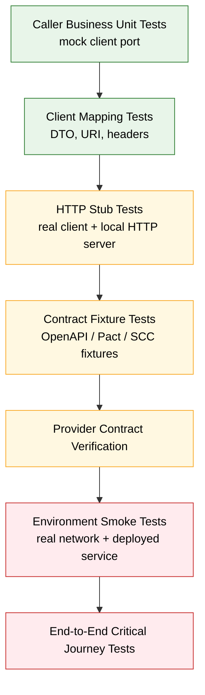
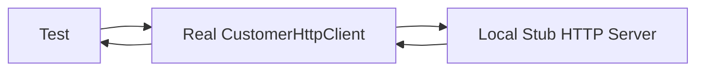
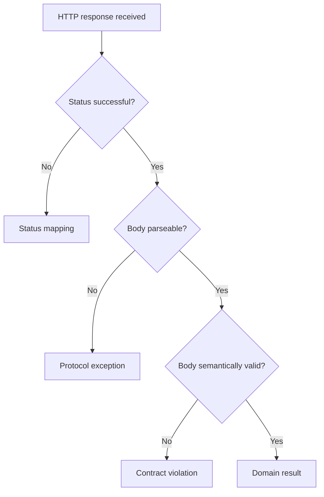
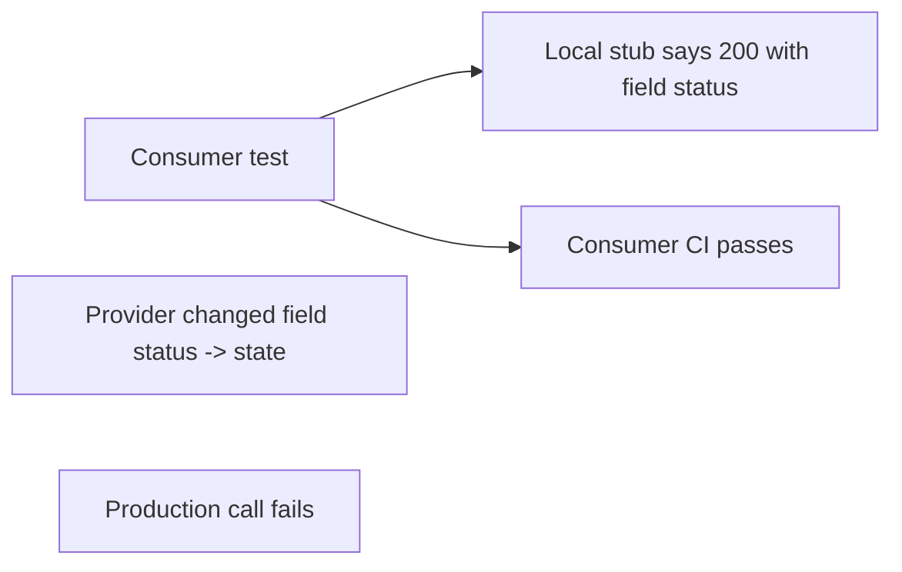
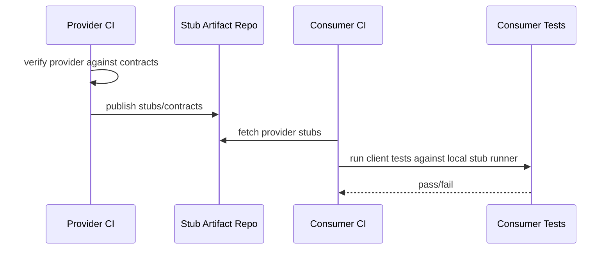
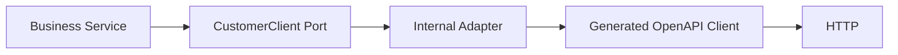
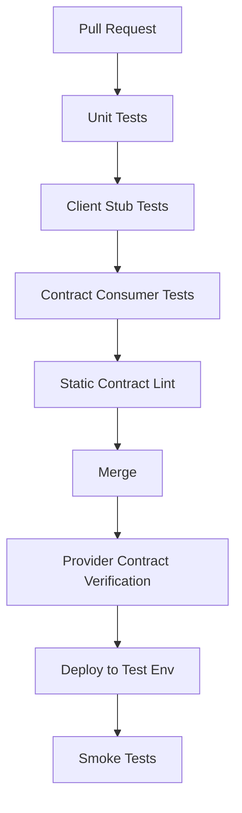
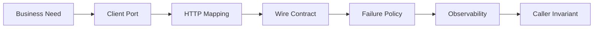

# Part 027 — HTTP Client Testing with Stubs, Fakes, and Contract Fixtures

A Java HTTP client is not production-ready just because the happy path test passes.

The real question is narrower and harder:

> Can this client preserve the caller's business invariant when the network, callee, gateway, schema, status code, timeout, retry, and observability path behave imperfectly?

Most teams test HTTP clients too shallowly. They mock a Java interface and verify that `getCustomer()` returns a DTO. That test proves almost nothing about the communication boundary. It bypasses URI construction, headers, encoding, timeout behavior, status mapping, body parsing, retry eligibility, idempotency, and trace propagation.

For microservice communication, the useful test target is not only “method returns value”. The useful target is the **wire contract plus client policy**.

This part gives you a production-grade testing model for HTTP clients in Java.

---

## 1. The Problem: Mocking the Client Is Usually the Wrong Boundary

Suppose a service has this dependency:

```java
public interface CustomerClient {
    CustomerSnapshot getCustomer(CustomerId id);
}
```

A shallow unit test might do this:

```java
when(customerClient.getCustomer(new CustomerId("C-100")))
    .thenReturn(new CustomerSnapshot("C-100", "ACTIVE"));
```

That test is useful for testing the caller's business logic. It is not a test of the HTTP client.

The real HTTP client must answer questions like:

- Did it call `/internal/customers/{id}` or `/customers?id={id}`?
- Did it encode path variables correctly?
- Did it send `Accept: application/json`?
- Did it propagate `traceparent` but not leak `Authorization` across trust boundaries?
- Did it respect connect/read/total timeout?
- Did it map `404` to a domain-level `CustomerNotFound` or to a dependency failure?
- Did it avoid retrying non-idempotent commands?
- Did it stop retrying when the deadline expired?
- Did it parse unknown JSON fields safely?
- Did it emit a metric with low-cardinality route name instead of raw URL?

A Java mock of `CustomerClient` answers none of those.

The correct testing boundary depends on what you are trying to prove.

---

## 2. Testing Pyramid for Microservice Communication

Communication tests need a more specific pyramid than generic unit/integration/e2e language.



The core idea:

- Use **mocks** to isolate caller business logic.
- Use **local HTTP stubs** to test the real client boundary.
- Use **contract fixtures** to prevent consumer/provider drift.
- Use **deployed smoke tests** to validate environment wiring.
- Use **e2e tests sparingly** for critical journeys.

Do not force one test type to prove everything.

---

## 3. What an HTTP Client Test Must Prove

For a production client, the minimum test surface is larger than request/response DTO parsing.

| Capability | What to prove | Example failure |
|---|---|---|
| URI construction | Path/query encoding is correct | `C/100` breaks path routing |
| Method semantics | Correct HTTP method per operation | `GET` accidentally mutates state |
| Header policy | Required headers present; dangerous headers not leaked | caller token forwarded to wrong trust zone |
| Content negotiation | `Accept` and `Content-Type` correct | callee returns XML or vendor type not supported |
| Status mapping | Status codes become meaningful domain/dependency outcomes | `404` treated as retryable infra failure |
| Body parsing | Unknown fields tolerated; missing required fields rejected | schema evolution breaks old client |
| Timeout behavior | timeout is bounded and classified | thread waits indefinitely |
| Retry behavior | retry only when safe and within budget | duplicate command execution |
| Idempotency | command retry has idempotency key | retry creates two payments/orders |
| Observability | trace/metric/log includes operation identity | incident cannot identify failing dependency |
| Resource control | pool/bulkhead protects caller | downstream slowness consumes all threads |
| Failure simulation | client handles reset, delay, malformed response | production failure path untested |

Treat these as test requirements, not optional polish.

---

## 4. Five Test Doubles and When to Use Them

The word “mock” is often used too broadly. Communication needs sharper language.

### 4.1 Mock

A mock replaces a Java dependency in memory.

Use it when testing caller business logic:

```java
CustomerClient client = mock(CustomerClient.class);
```

Good for:

- business branching
- orchestration logic
- domain fallback decision
- caller-side transaction behavior

Bad for:

- HTTP correctness
- status mapping
- serialization
- timeout
- retry
- headers

### 4.2 Fake

A fake is a lightweight working implementation.

Example:

```java
final class InMemoryCustomerClient implements CustomerClient {
    private final Map<CustomerId, CustomerSnapshot> data = new ConcurrentHashMap<>();

    @Override
    public CustomerSnapshot getCustomer(CustomerId id) {
        CustomerSnapshot snapshot = data.get(id);
        if (snapshot == null) {
            throw new CustomerNotFoundException(id);
        }
        return snapshot;
    }
}
```

Good for:

- component tests where HTTP is irrelevant
- local developer workflows
- deterministic domain state

Bad for:

- wire compatibility
- HTTP failure modes

### 4.3 Stub HTTP Server

A local HTTP server returns controlled HTTP responses.

This is the normal boundary for testing the real client.



Good for:

- URI/header/body verification
- status mapping
- latency/fault simulation
- retry verification
- malformed body handling

Examples: WireMock, MockWebServer, MockServer.

### 4.4 Contract Fixture

A contract fixture is a durable machine-readable example of an allowed interaction.

It can come from:

- OpenAPI examples
- Pact interactions
- Spring Cloud Contract DSL/YAML/Groovy
- captured WireMock mappings
- manually curated JSON fixtures

Good for:

- consumer/provider alignment
- CI drift detection
- reusable stubs
- compatibility governance

Bad for:

- proving all business flows
- proving production network behavior

### 4.5 Real Service

A deployed service in an integration/staging environment.

Good for:

- environment wiring
- TLS/service discovery/gateway/routing
- actual provider behavior
- smoke-level confidence

Bad for:

- fast feedback
- deterministic failure simulation
- exhaustive edge cases

---

## 5. Recommended Test Matrix

A top-tier team avoids both extremes: no “mock everything”, no “e2e everything”.

| Test type | Runs in | Uses real HTTP client? | Uses real provider? | Main purpose |
|---|---|---:|---:|---|
| Business unit test | JVM | No | No | caller business logic |
| Client mapping test | JVM | Partially | No | DTO/URI/header construction |
| Stub server test | JVM/testcontainer | Yes | No | HTTP boundary and policy |
| Contract consumer test | JVM/CI | Yes | No | consumer expectations |
| Provider contract test | Provider CI | No/Yes | Yes | provider satisfies contracts |
| Smoke test | deployed env | Yes | Yes | routing/config/security/env |
| E2E test | deployed env | Yes | Yes | critical cross-service journey |

The strongest practical coverage usually comes from:

1. many fast client stub tests,
2. contract verification in CI,
3. a small number of deployed smoke tests.

---

## 6. Baseline Java Client Under Test

Assume this client boundary:

```java
public interface CustomerClient {
    CustomerSnapshot getCustomer(CustomerId id, RequestContext context);
}
```

Implementation skeleton:

```java
public final class CustomerHttpClient implements CustomerClient {
    private final HttpClient httpClient;
    private final URI baseUri;
    private final ObjectMapper objectMapper;
    private final Duration timeout;

    public CustomerHttpClient(
            HttpClient httpClient,
            URI baseUri,
            ObjectMapper objectMapper,
            Duration timeout
    ) {
        this.httpClient = Objects.requireNonNull(httpClient);
        this.baseUri = Objects.requireNonNull(baseUri);
        this.objectMapper = Objects.requireNonNull(objectMapper);
        this.timeout = Objects.requireNonNull(timeout);
    }

    @Override
    public CustomerSnapshot getCustomer(CustomerId id, RequestContext context) {
        URI uri = baseUri.resolve("/internal/customers/" + encodePathSegment(id.value()));

        HttpRequest request = HttpRequest.newBuilder(uri)
                .timeout(timeout)
                .header("Accept", "application/json")
                .header("X-Request-Id", context.requestId())
                .GET()
                .build();

        try {
            HttpResponse<String> response = httpClient.send(
                    request,
                    HttpResponse.BodyHandlers.ofString(StandardCharsets.UTF_8)
            );

            return switch (response.statusCode()) {
                case 200 -> decodeCustomer(response.body());
                case 404 -> throw new CustomerNotFoundException(id);
                case 429, 503 -> throw new CustomerServiceOverloadedException(id, response.statusCode());
                default -> throw new CustomerServiceException(id, response.statusCode(), response.body());
            };
        } catch (HttpTimeoutException e) {
            throw new CustomerServiceTimeoutException(id, e);
        } catch (IOException e) {
            throw new CustomerServiceTransportException(id, e);
        } catch (InterruptedException e) {
            Thread.currentThread().interrupt();
            throw new CustomerServiceInterruptedException(id, e);
        }
    }

    private CustomerSnapshot decodeCustomer(String body) {
        try {
            return objectMapper.readValue(body, CustomerSnapshot.class);
        } catch (JsonProcessingException e) {
            throw new CustomerServiceProtocolException("Invalid customer response body", e);
        }
    }

    private static String encodePathSegment(String value) {
        return URLEncoder.encode(value, StandardCharsets.UTF_8).replace("+", "%20");
    }
}
```

This implementation has many testable decisions.

---

## 7. WireMock-Style Stub Test

WireMock is useful because it runs a real HTTP server and lets you stub responses, match requests, verify interactions, and simulate delays/faults.

A basic client test:

```java
class CustomerHttpClientTest {

    private WireMockServer server;
    private CustomerHttpClient client;

    @BeforeEach
    void setUp() {
        server = new WireMockServer(options().dynamicPort());
        server.start();

        HttpClient httpClient = HttpClient.newBuilder()
                .connectTimeout(Duration.ofMillis(200))
                .build();

        client = new CustomerHttpClient(
                httpClient,
                URI.create(server.baseUrl()),
                new ObjectMapper(),
                Duration.ofMillis(500)
        );
    }

    @AfterEach
    void tearDown() {
        server.stop();
    }

    @Test
    void returnsCustomerWhenProviderReturns200() {
        server.stubFor(get(urlEqualTo("/internal/customers/C-100"))
                .withHeader("Accept", equalTo("application/json"))
                .willReturn(okJson("""
                    {
                      "id": "C-100",
                      "status": "ACTIVE"
                    }
                    """)));

        CustomerSnapshot result = client.getCustomer(
                new CustomerId("C-100"),
                new RequestContext("req-001")
        );

        assertThat(result.id()).isEqualTo("C-100");
        assertThat(result.status()).isEqualTo("ACTIVE");

        server.verify(getRequestedFor(urlEqualTo("/internal/customers/C-100"))
                .withHeader("X-Request-Id", equalTo("req-001")));
    }
}
```

What this test proves:

- the real client constructs the expected URL,
- the real client sends expected headers,
- the real client parses the response,
- the response mapping returns the expected domain object.

This is already stronger than mocking the Java interface.

---

## 8. Test Status Mapping Explicitly

Status mapping is part of the client contract. Do not leave it implicit.

```java
@Test
void maps404ToCustomerNotFound() {
    server.stubFor(get(urlEqualTo("/internal/customers/C-404"))
            .willReturn(notFound().withHeader("Content-Type", "application/problem+json")
                    .withBody("""
                    {
                      "type": "https://errors.example.com/customer-not-found",
                      "title": "Customer not found",
                      "status": 404,
                      "detail": "Customer C-404 does not exist"
                    }
                    """)));

    assertThatThrownBy(() -> client.getCustomer(
            new CustomerId("C-404"),
            new RequestContext("req-404")
    )).isInstanceOf(CustomerNotFoundException.class);
}
```

Use a status mapping table in the client test suite:

| Status | Expected client outcome | Retry? |
|---:|---|---:|
| 200 | success | no |
| 400 | caller bug / invalid request | no |
| 401/403 | auth/security dependency failure | no by default |
| 404 | domain not found, if endpoint defines it | no |
| 409 | domain conflict / concurrency conflict | no by default |
| 408 | timeout-like remote failure | maybe |
| 429 | throttled/overloaded | maybe with `Retry-After` |
| 500 | provider failure | maybe only if safe |
| 502/503/504 | gateway/dependency unavailable | maybe only if safe |

The retry column is not universal. It depends on operation semantics and idempotency.

---

## 9. Test Unknown Outcome Separately

A timeout does not mean “nothing happened”. It means the caller stopped waiting.

For `GET`, retry may be safe. For `POST /payments`, retry may duplicate unless an idempotency key or operation identifier is enforced.

Test timeout handling as its own failure class:

```java
@Test
void mapsSlowResponseToTimeout() {
    server.stubFor(get(urlEqualTo("/internal/customers/C-100"))
            .willReturn(aResponse()
                    .withFixedDelay(1_000)
                    .withStatus(200)
                    .withHeader("Content-Type", "application/json")
                    .withBody("""
                    { "id": "C-100", "status": "ACTIVE" }
                    """)));

    assertThatThrownBy(() -> client.getCustomer(
            new CustomerId("C-100"),
            new RequestContext("req-timeout")
    )).isInstanceOf(CustomerServiceTimeoutException.class);
}
```

Do not collapse timeout into a generic `RuntimeException`. The caller may need to choose between fail-fast, fallback, stale read, or retry.

---

## 10. Test Malformed and Incompatible Bodies

A production client must not assume every `200` response is parseable.

```java
@Test
void mapsInvalidJsonBodyToProtocolException() {
    server.stubFor(get(urlEqualTo("/internal/customers/C-100"))
            .willReturn(okJson("{ invalid-json")));

    assertThatThrownBy(() -> client.getCustomer(
            new CustomerId("C-100"),
            new RequestContext("req-invalid-json")
    )).isInstanceOf(CustomerServiceProtocolException.class);
}
```

Test these cases:

- invalid JSON,
- valid JSON but missing required field,
- unknown extra fields,
- wrong enum value,
- wrong content type,
- empty body with `200`,
- HTML error body from gateway,
- compressed response if compression is enabled.

A useful client distinguishes:



---

## 11. Test URI Encoding and Query Stability

Most client bugs hide in URI construction.

```java
@ParameterizedTest
@CsvSource({
        "C-100,/internal/customers/C-100",
        "C 100,/internal/customers/C%20100",
        "C/100,/internal/customers/C%2F100"
})
void encodesPathSegment(String input, String expectedPath) {
    server.stubFor(get(urlEqualTo(expectedPath))
            .willReturn(okJson("""
            { "id": "C-100", "status": "ACTIVE" }
            """)));

    client.getCustomer(new CustomerId(input), new RequestContext("req-encoding"));

    server.verify(getRequestedFor(urlEqualTo(expectedPath)));
}
```

Test query parameters too:

- spaces,
- commas,
- repeated query params,
- enum casing,
- date/time format,
- pagination cursor encoding,
- null/empty optional fields.

Do not let `String.format()` become your URI builder for complex APIs.

---

## 12. Test Header Propagation Policy

Headers are part of the communication contract.

Test required propagation:

```java
@Test
void propagatesTraceAndRequestHeaders() {
    server.stubFor(get(urlEqualTo("/internal/customers/C-100"))
            .willReturn(okJson("""
            { "id": "C-100", "status": "ACTIVE" }
            """)));

    RequestContext context = new RequestContext(
            "req-123",
            "00-4bf92f3577b34da6a3ce929d0e0e4736-00f067aa0ba902b7-01"
    );

    client.getCustomer(new CustomerId("C-100"), context);

    server.verify(getRequestedFor(urlEqualTo("/internal/customers/C-100"))
            .withHeader("X-Request-Id", equalTo("req-123"))
            .withHeader("traceparent", equalTo(context.traceparent())));
}
```

Test forbidden propagation:

```java
@Test
void doesNotLeakInboundAuthorizationHeaderToInternalDependency() {
    // Arrange context with inbound user token.
    // Client policy should use service credential or omit auth depending on trust boundary.
    // Verify Authorization is absent or contains service credential, not user token.
}
```

For internal platforms, define a header classification table:

| Header | Propagate? | Notes |
|---|---:|---|
| `traceparent` | yes | distributed tracing |
| `tracestate` | conditional | only trusted vendors/systems |
| `baggage` | restricted | privacy/cardinality risk |
| `X-Request-Id` | yes | if used as platform correlation ID |
| `Authorization` | usually no across trust boundaries | avoid token confusion/leakage |
| `Cookie` | no | almost never valid service-to-service |
| `Idempotency-Key` | yes for commands | only if semantic owner agrees |
| `X-Forwarded-*` | edge/platform-owned | do not let app forge blindly |

Tests should enforce this policy.

---

## 13. Test Retry Behavior by Counting Requests

Retry tests must verify **number of attempts**, **eligible status**, and **budget stop condition**.

Example: retry a safe `GET` once after `503`, then succeed.

```java
@Test
void retriesSafeGetOnceOn503ThenSucceeds() {
    server.stubFor(get(urlEqualTo("/internal/customers/C-100"))
            .inScenario("retry")
            .whenScenarioStateIs(STARTED)
            .willReturn(serviceUnavailable())
            .willSetStateTo("second-attempt"));

    server.stubFor(get(urlEqualTo("/internal/customers/C-100"))
            .inScenario("retry")
            .whenScenarioStateIs("second-attempt")
            .willReturn(okJson("""
            { "id": "C-100", "status": "ACTIVE" }
            """)));

    CustomerSnapshot result = client.getCustomer(
            new CustomerId("C-100"),
            new RequestContext("req-retry")
    );

    assertThat(result.status()).isEqualTo("ACTIVE");
    server.verify(2, getRequestedFor(urlEqualTo("/internal/customers/C-100")));
}
```

Also test the negative case:

```java
@Test
void doesNotRetryNonIdempotentCommandWithoutIdempotencyKey() {
    // POST command returns 503.
    // Verify exactly one request.
}
```

A retry test that does not count requests is incomplete.

---

## 14. Test Idempotency-Key for Commands

For command-like operations, retry safety depends on operation identity.

```java
@Test
void sendsIdempotencyKeyForCreateOrderCommand() {
    server.stubFor(post(urlEqualTo("/internal/orders"))
            .withHeader("Idempotency-Key", matching("[a-zA-Z0-9._:-]+"))
            .willReturn(created()
                    .withHeader("Content-Type", "application/json")
                    .withBody("""
                    { "orderId": "O-100", "status": "ACCEPTED" }
                    """)));

    orderClient.createOrder(new CreateOrderCommand(...), new RequestContext("req-001"));

    server.verify(postRequestedFor(urlEqualTo("/internal/orders"))
            .withHeader("Idempotency-Key", matching(".+")));
}
```

For command clients, test:

- idempotency key exists,
- key is stable across retries,
- key is unique across different logical commands,
- key is logged/observable without exposing sensitive payload,
- client maps `409`/duplicate response according to provider semantics.

---

## 15. Contract Testing: Consumer-Driven vs Provider-Driven

Contract testing exists because stub tests can lie.

A local stub may pass while the real provider changed:



Contract tests reduce this drift.

### Consumer-driven contract

The consumer records expectations:

- request method/path/query/header/body,
- expected response status/header/body shape,
- matching rules,
- examples.

The provider CI verifies that the provider still satisfies those expectations.

This works well when:

- consumers know exactly what they use,
- provider has multiple consumers,
- independent deployability matters,
- provider wants safe evolution.

### Provider-driven contract

The provider publishes API description/stubs:

- OpenAPI spec,
- generated stubs,
- example fixtures,
- schema compatibility rules.

Consumers test against published artifacts.

This works well when:

- provider controls a platform API,
- consumers are many and standardized,
- API governance is centralized,
- examples are curated and versioned.

Many mature organizations use both.

---

## 16. Pact-Style Consumer Contract Shape

A Pact-style interaction is usually code-first and consumer-owned.

Conceptually:

```java
@Pact(consumer = "billing-service", provider = "customer-service")
RequestResponsePact getActiveCustomer(PactDslWithProvider builder) {
    return builder
            .given("customer C-100 exists and is active")
            .uponReceiving("a request for customer C-100")
                .path("/internal/customers/C-100")
                .method("GET")
                .headers(Map.of("Accept", "application/json"))
            .willRespondWith()
                .status(200)
                .headers(Map.of("Content-Type", "application/json"))
                .body(newJsonBody(body -> {
                    body.stringType("id", "C-100");
                    body.stringMatcher("status", "ACTIVE|SUSPENDED|CLOSED", "ACTIVE");
                }).build())
            .toPact();
}
```

The important engineering point is not the DSL. It is ownership:

- The consumer declares what it depends on.
- The provider verifies that behavior before deployment.
- The broker/history can answer whether a provider version is safe for known consumers.

Contract testing is not a replacement for OpenAPI. It answers a different question:

> Does this provider version satisfy the interactions that real consumers currently rely on?

---

## 17. Spring Cloud Contract-Style Stub Flow

Spring Cloud Contract is commonly used when the provider publishes stubs that consumers can run locally.

Typical flow:



This is strong when:

- the provider team owns canonical contracts,
- artifacts are versioned,
- consumers can choose compatible stub versions,
- CI can run without deployed provider.

But the danger is stale stubs. Treat stubs as versioned artifacts, not random test data.

---

## 18. OpenAPI Fixtures and Generated Clients

OpenAPI helps describe HTTP APIs in a machine-readable way. For client tests, useful artifacts include:

- schema definitions,
- examples,
- response status documentation,
- content types,
- request/response body contracts,
- generated clients,
- generated mock servers.

But generated clients are not automatically production-safe.

Test generated clients for:

- timeout policy,
- retry policy,
- exception mapping,
- auth/header propagation,
- observability,
- base URL configuration,
- connection pooling,
- compatibility with internal DTO boundary.

A generated client is a transport adapter. It should usually sit behind your own domain client port.



This avoids generated-code leakage into business logic.

---

## 19. Fixture Design Rules

Fixtures are executable communication knowledge. Treat them like source code.

### Good fixture

```json
{
  "id": "C-100",
  "status": "ACTIVE",
  "profileVersion": 7
}
```

### Bad fixture

```json
{
  "foo": "bar"
}
```

A production fixture should include:

- realistic IDs,
- valid timestamps,
- representative enum values,
- optional fields present in some fixtures and absent in others,
- unknown fields for forward compatibility tests,
- realistic error bodies,
- boundary cases,
- schema version examples if relevant.

Recommended directory shape:

```text
src/test/resources/contracts/customer-service/
  get-customer-200-active.json
  get-customer-200-suspended.json
  get-customer-404-problem.json
  get-customer-429-problem.json
  get-customer-503-problem.json
  get-customer-200-with-extra-field.json
  get-customer-200-invalid-missing-id.json
```

Do not store only happy-path examples.

---

## 20. Failure Simulation Checklist

Every critical HTTP client should have tests for failure behavior.

| Failure | Why it matters | Expected client behavior |
|---|---|---|
| connection refused | service unavailable / wrong route | transport exception, maybe retry if safe |
| connect timeout | network/path issue | connect timeout classification |
| read timeout | callee slow / unknown outcome | timeout classification |
| delayed response | budget exhaustion | no unbounded wait |
| malformed JSON | protocol mismatch | protocol exception |
| unexpected content type | gateway/provider error | protocol exception/status mapping |
| 429 | rate limiting | respect retry policy and possibly `Retry-After` |
| 503 | overload/unavailable | retry only if safe |
| 500 | provider bug | no blind retry for commands |
| connection reset | transient network failure | retry only if safe |
| duplicate retry response | idempotency handling | stable command outcome |

The goal is not to simulate every possible TCP edge case. The goal is to make the client policy explicit and executable.

---

## 21. Testing Observability

Observability is part of the client contract because incidents are inevitable.

For an HTTP client, test that telemetry contains operation identity, not raw high-cardinality values.

Good metric attributes:

```text
http.request.method=GET
http.route=/internal/customers/{id}
server.address=customer-service
client.operation=CustomerClient.getCustomer
error.type=timeout
```

Bad metric attributes:

```text
url.full=/internal/customers/C-100
request.body={...}
exception.message=Customer C-100 not found for tenant T-999
```

A simple log assertion can be useful:

```java
@Test
void logsDependencyFailureWithOperationAndRequestId() {
    // Use a test appender or structured log capture.
    // Trigger 503.
    // Assert operation=CustomerClient.getCustomer, dependency=customer-service,
    // requestId=req-001, status=503.
    // Assert no PII fields from response body are logged.
}
```

For traces, verify:

- outgoing span is created,
- `traceparent` is propagated,
- span name uses low-cardinality operation/route,
- error status is set for failures,
- baggage is restricted.

---

## 22. CI Gate Strategy

Use layered CI gates:



Recommended pull request gate:

- business unit tests,
- client stub tests,
- contract consumer tests,
- generated client compilation,
- contract linting,
- fixture schema validation.

Recommended provider gate:

- provider satisfies contracts,
- breaking change detection,
- generated stubs published only after verification,
- compatibility matrix updated.

Recommended deployment gate:

- service discovery works,
- TLS/auth works,
- gateway route works,
- one smoke call per critical dependency,
- telemetry visible.

---

## 23. Common Anti-Patterns

### Anti-pattern: Mocking the HTTP client wrapper and calling it done

This misses the whole communication boundary.

### Anti-pattern: One giant integration test for all clients

Slow, flaky, hard to diagnose. Prefer many focused stub tests.

### Anti-pattern: Recording production traffic blindly

Captured fixtures may contain PII, unstable values, auth tokens, and accidental behavior.

### Anti-pattern: Treating contract tests as business tests

Contract tests prove compatibility, not all business correctness.

### Anti-pattern: Verifying exact JSON everywhere

Overly strict JSON equality can block safe provider evolution. Use matchers where fields are intentionally flexible.

### Anti-pattern: Ignoring negative contracts

If only `200` is contracted, every failure path becomes undocumented tribal knowledge.

### Anti-pattern: Sharing a giant client test base class across all services

Shared test infrastructure is useful. Shared hidden policy is dangerous. Keep service-specific semantics explicit.

---

## 24. Production-Grade HTTP Client Test Checklist

Before approving a Java HTTP client, check:

- [ ] all public client operations have stub tests,
- [ ] URI path/query encoding is tested,
- [ ] required headers are tested,
- [ ] forbidden header propagation is tested,
- [ ] status mapping is explicitly tested,
- [ ] timeout is tested,
- [ ] retry count and eligibility are tested,
- [ ] command idempotency is tested,
- [ ] invalid body behavior is tested,
- [ ] unknown field compatibility is tested,
- [ ] telemetry is tested or covered by instrumentation tests,
- [ ] fixtures are versioned and meaningful,
- [ ] contract tests exist for shared provider APIs,
- [ ] generated clients are wrapped behind a stable domain port,
- [ ] deployed smoke test exists for critical dependencies.

---

## 25. Mental Model

A good HTTP client test suite is not a pile of mocks.

It is an executable specification for the dependency boundary:



The invariant is the real goal.

If the provider is slow, unavailable, malformed, overloaded, or incompatible, the client must fail in a way the caller can reason about. Tests should prove that.

---

## 26. Summary

HTTP client testing in microservices is about proving communication semantics.

Use mocks for caller business logic, not for validating HTTP behavior. Use a local stub server for real client tests. Use contract artifacts to prevent provider/consumer drift. Use deployed smoke tests to prove environment wiring. Explicitly test failure, timeout, retry, idempotency, status mapping, header propagation, and observability.

A production client is not trusted because it can parse a `200` response.

It is trusted because its behavior is bounded, explicit, observable, and compatible under failure.

