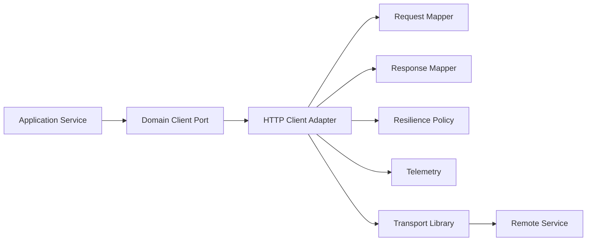
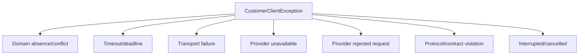
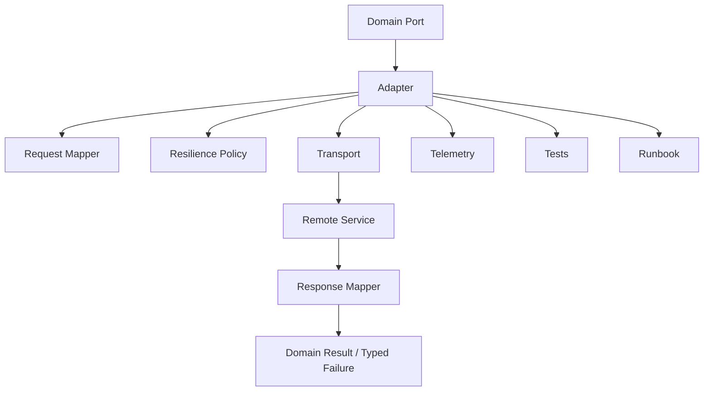

# Part 028 — Production-Grade HTTP Client Template

This part gives a concrete template for building Java HTTP clients in production.

The goal is not to standardize on one library. You may use JDK `HttpClient`, Spring `RestClient`, Spring `WebClient`, OpenFeign, MicroProfile Rest Client, Apache HttpClient, OkHttp, or a generated OpenAPI client.

The deeper rule is this:

> The application should depend on a stable domain client boundary. The HTTP library is only the transport adapter behind it.

A production client is a small system. It has configuration, policy, resource limits, failure mapping, telemetry, compatibility rules, and tests.

---

## 1. Target Architecture

A clean HTTP client boundary looks like this:



The caller should not know:

- which HTTP library is used,
- the exact URL shape,
- raw status codes unless semantically relevant,
- JSON parsing details,
- retry implementation,
- metric/tracing internals,
- generated client class names.

The caller should know:

- operation semantics,
- domain result,
- meaningful failure types,
- whether fallback/stale data is possible,
- whether unknown outcome can happen.

---

## 2. Recommended Package Structure

Use package boundaries to prevent accidental leakage.

```text
com.example.billing.customerclient/
  CustomerClient.java
  CustomerSnapshot.java
  CustomerClientException.java
  CustomerNotFoundException.java
  CustomerUnavailableException.java
  CustomerTimeoutException.java

com.example.billing.customerclient.http/
  CustomerHttpClient.java
  CustomerHttpClientConfig.java
  CustomerHttpClientFactory.java
  CustomerHttpRequestMapper.java
  CustomerHttpResponseMapper.java
  CustomerHttpErrorMapper.java
  CustomerHttpTelemetry.java
  CustomerHttpHeaders.java

com.example.billing.customerclient.http.dto/
  CustomerResponseDto.java
  ProblemDetailsDto.java
```

Rules:

- The application imports `CustomerClient`, not `CustomerHttpClient` directly.
- HTTP DTOs stay inside the HTTP adapter package.
- Exceptions are domain/dependency meaningful, not raw library exceptions.
- Configuration is explicit and validated.
- Generated clients, if used, are wrapped inside the adapter package.

---

## 3. Domain Port

The domain port should express business intent, not HTTP mechanics.

```java
public interface CustomerClient {
    CustomerSnapshot getCustomer(CustomerId customerId, RequestContext context);

    Optional<CustomerSnapshot> findCustomer(CustomerId customerId, RequestContext context);

    CustomerEligibility checkEligibility(CustomerId customerId, EligibilityRequest request, RequestContext context);
}
```

Avoid this:

```java
ResponseEntity<CustomerResponseDto> getCustomer(String rawUrl, HttpHeaders headers);
```

That leaks transport concerns upward.

The port should make semantics obvious:

| Method shape | Meaning |
|---|---|
| `getCustomer(...)` | customer must exist; not found is exceptional/domain failure |
| `findCustomer(...)` | absence is expected and represented as `Optional` |
| `createOrder(command)` | command; may need idempotency key |
| `checkEligibility(query)` | query; retry may be safe if idempotent |

Do not hide domain semantics behind generic HTTP abstractions.

---

## 4. Request Context

A client needs operation context, but context must be controlled.

```java
public record RequestContext(
        String requestId,
        String traceparent,
        Instant deadline,
        String tenantId,
        Optional<String> idempotencyKey
) {
    public Duration remainingBudget(Clock clock) {
        return Duration.between(Instant.now(clock), deadline);
    }
}
```

Recommended context fields:

| Field | Purpose | Propagation |
|---|---|---|
| request ID | log correlation | yes |
| trace context | distributed tracing | yes |
| deadline | bounded waiting | yes or converted to timeout |
| tenant ID | routing/authorization/audit | only when contract allows |
| idempotency key | command deduplication | command-only |
| user token | end-user security | restricted; do not blindly forward |
| baggage | cross-cutting metadata | restricted and size-limited |

Context is not a dumping ground. Each field needs an owner and propagation rule.

---

## 5. Configuration Object

Never scatter magic numbers across client code.

```java
public record CustomerHttpClientConfig(
        URI baseUri,
        Duration connectTimeout,
        Duration requestTimeout,
        Duration poolAcquireTimeout,
        int maxRetries,
        Duration retryBaseDelay,
        Duration retryMaxDelay,
        int maxResponseBytes,
        boolean compressionEnabled,
        String dependencyName,
        String serviceRouteName
) {
    public CustomerHttpClientConfig {
        requirePositive(connectTimeout, "connectTimeout");
        requirePositive(requestTimeout, "requestTimeout");
        requirePositive(poolAcquireTimeout, "poolAcquireTimeout");
        requireNonNegative(maxRetries, "maxRetries");
        requirePositive(retryBaseDelay, "retryBaseDelay");
        requirePositive(retryMaxDelay, "retryMaxDelay");
        if (retryMaxDelay.compareTo(retryBaseDelay) < 0) {
            throw new IllegalArgumentException("retryMaxDelay must be >= retryBaseDelay");
        }
        if (maxResponseBytes <= 0) {
            throw new IllegalArgumentException("maxResponseBytes must be positive");
        }
        Objects.requireNonNull(baseUri, "baseUri");
        Objects.requireNonNull(dependencyName, "dependencyName");
        Objects.requireNonNull(serviceRouteName, "serviceRouteName");
    }

    private static void requirePositive(Duration value, String name) {
        if (value == null || value.isZero() || value.isNegative()) {
            throw new IllegalArgumentException(name + " must be positive");
        }
    }

    private static void requireNonNegative(int value, String name) {
        if (value < 0) {
            throw new IllegalArgumentException(name + " must be non-negative");
        }
    }
}
```

Configuration should be validated at startup. A misconfigured dependency should fail fast during deployment, not during a customer request.

---

## 6. Default Policy Baseline

Start conservative.

```yaml
customer-client:
  base-uri: http://customer-service.internal
  connect-timeout: 200ms
  request-timeout: 800ms
  pool-acquire-timeout: 100ms
  max-retries: 1
  retry-base-delay: 30ms
  retry-max-delay: 150ms
  max-response-bytes: 1048576
  compression-enabled: true
  dependency-name: customer-service
  service-route-name: /internal/customers/{id}
```

These are not universal values. They are a shape.

A correct policy is derived from:

- caller SLO,
- callee SLO,
- call graph depth,
- p99 latency distribution,
- retry amplification risk,
- business criticality,
- idempotency semantics,
- capacity budget,
- failure isolation strategy.

Do not copy timeout values blindly.

---

## 7. Client Factory

Build and reuse the underlying HTTP client.

For JDK `HttpClient`:

```java
public final class CustomerHttpClientFactory {

    public static CustomerClient create(
            CustomerHttpClientConfig config,
            ObjectMapper objectMapper,
            Clock clock,
            MeterRegistry meterRegistry,
            Tracer tracer
    ) {
        HttpClient transport = HttpClient.newBuilder()
                .connectTimeout(config.connectTimeout())
                .followRedirects(HttpClient.Redirect.NEVER)
                .version(HttpClient.Version.HTTP_2)
                .build();

        CustomerHttpTelemetry telemetry = new CustomerHttpTelemetry(
                meterRegistry,
                tracer,
                config.dependencyName()
        );

        return new CustomerHttpClient(
                transport,
                config,
                objectMapper,
                clock,
                telemetry
        );
    }

    private CustomerHttpClientFactory() {
    }
}
```

Rules:

- Create the HTTP client once and reuse it.
- Do not create a new transport client per request.
- Disable redirects by default for service-to-service clients.
- Choose HTTP version deliberately.
- Inject `Clock` for testable deadline behavior.
- Inject telemetry components instead of logging ad hoc.

---

## 8. Adapter Implementation Shape

Keep the adapter small and explicit.

```java
public final class CustomerHttpClient implements CustomerClient {
    private final HttpClient httpClient;
    private final CustomerHttpClientConfig config;
    private final ObjectMapper objectMapper;
    private final Clock clock;
    private final CustomerHttpTelemetry telemetry;

    public CustomerHttpClient(
            HttpClient httpClient,
            CustomerHttpClientConfig config,
            ObjectMapper objectMapper,
            Clock clock,
            CustomerHttpTelemetry telemetry
    ) {
        this.httpClient = Objects.requireNonNull(httpClient);
        this.config = Objects.requireNonNull(config);
        this.objectMapper = Objects.requireNonNull(objectMapper);
        this.clock = Objects.requireNonNull(clock);
        this.telemetry = Objects.requireNonNull(telemetry);
    }

    @Override
    public CustomerSnapshot getCustomer(CustomerId customerId, RequestContext context) {
        ClientOperation operation = ClientOperation.of(
                "CustomerClient.getCustomer",
                "GET",
                config.serviceRouteName()
        );

        return telemetry.record(operation, () -> executeGetCustomer(customerId, context, operation));
    }

    private CustomerSnapshot executeGetCustomer(
            CustomerId customerId,
            RequestContext context,
            ClientOperation operation
    ) {
        HttpRequest request = CustomerHttpRequestMapper.getCustomerRequest(
                config.baseUri(),
                customerId,
                context,
                effectiveTimeout(context)
        );

        HttpResponse<String> response = send(request, operation);
        return CustomerHttpResponseMapper.mapGetCustomer(customerId, response, objectMapper);
    }

    private HttpResponse<String> send(HttpRequest request, ClientOperation operation) {
        try {
            return httpClient.send(request, HttpResponse.BodyHandlers.ofString(StandardCharsets.UTF_8));
        } catch (HttpTimeoutException e) {
            throw new CustomerTimeoutException(operation.name(), e);
        } catch (IOException e) {
            throw new CustomerTransportException(operation.name(), e);
        } catch (InterruptedException e) {
            Thread.currentThread().interrupt();
            throw new CustomerInterruptedException(operation.name(), e);
        }
    }

    private Duration effectiveTimeout(RequestContext context) {
        Duration remaining = context.remainingBudget(clock);
        if (remaining.isNegative() || remaining.isZero()) {
            throw new CustomerDeadlineExceededException("No remaining deadline budget");
        }
        return min(config.requestTimeout(), remaining);
    }

    private static Duration min(Duration a, Duration b) {
        return a.compareTo(b) <= 0 ? a : b;
    }
}
```

This code intentionally separates:

- operation identity,
- request mapping,
- sending,
- response mapping,
- telemetry,
- timeout calculation.

Separation prevents the common “500-line client method” failure.

---

## 9. Request Mapper

Request mapping must be deterministic and testable.

```java
final class CustomerHttpRequestMapper {

    static HttpRequest getCustomerRequest(
            URI baseUri,
            CustomerId customerId,
            RequestContext context,
            Duration timeout
    ) {
        URI uri = baseUri.resolve("/internal/customers/" + encodePathSegment(customerId.value()));

        HttpRequest.Builder builder = HttpRequest.newBuilder(uri)
                .timeout(timeout)
                .header("Accept", "application/json")
                .header("X-Request-Id", context.requestId())
                .GET();

        if (context.traceparent() != null && !context.traceparent().isBlank()) {
            builder.header("traceparent", context.traceparent());
        }

        if (context.tenantId() != null && !context.tenantId().isBlank()) {
            builder.header("X-Tenant-Id", context.tenantId());
        }

        return builder.build();
    }

    private static String encodePathSegment(String value) {
        return URLEncoder.encode(value, StandardCharsets.UTF_8).replace("+", "%20");
    }

    private CustomerHttpRequestMapper() {
    }
}
```

Rules:

- Never concatenate unencoded user/domain input into URLs.
- Do not propagate all inbound headers.
- Set `Accept` explicitly.
- Set `Content-Type` only when sending a body.
- Use stable operation-specific route names for telemetry.
- Use idempotency keys only where semantically valid.

---

## 10. Response Mapper

Map HTTP to dependency/domain semantics in one place.

```java
final class CustomerHttpResponseMapper {

    static CustomerSnapshot mapGetCustomer(
            CustomerId customerId,
            HttpResponse<String> response,
            ObjectMapper objectMapper
    ) {
        int status = response.statusCode();

        if (status == 200) {
            return decodeCustomer(response.body(), objectMapper);
        }

        if (status == 404) {
            throw new CustomerNotFoundException(customerId);
        }

        if (status == 429) {
            throw new CustomerThrottledException(customerId, retryAfter(response));
        }

        if (status == 503 || status == 502 || status == 504) {
            throw new CustomerUnavailableException(customerId, status, safeProblem(response.body(), objectMapper));
        }

        if (status >= 500) {
            throw new CustomerProviderException(customerId, status, safeProblem(response.body(), objectMapper));
        }

        if (status >= 400) {
            throw new CustomerRejectedRequestException(customerId, status, safeProblem(response.body(), objectMapper));
        }

        throw new CustomerProtocolException("Unexpected HTTP status: " + status);
    }

    private static CustomerSnapshot decodeCustomer(String body, ObjectMapper objectMapper) {
        try {
            CustomerResponseDto dto = objectMapper.readValue(body, CustomerResponseDto.class);
            return new CustomerSnapshot(dto.id(), CustomerStatus.valueOf(dto.status()));
        } catch (Exception e) {
            throw new CustomerProtocolException("Invalid customer response body", e);
        }
    }

    private static Optional<Duration> retryAfter(HttpResponse<String> response) {
        return response.headers().firstValue("Retry-After").flatMap(CustomerHttpResponseMapper::parseRetryAfter);
    }

    private static Optional<Duration> parseRetryAfter(String value) {
        try {
            return Optional.of(Duration.ofSeconds(Long.parseLong(value)));
        } catch (NumberFormatException ignored) {
            return Optional.empty();
        }
    }

    private static Optional<ProblemDetailsDto> safeProblem(String body, ObjectMapper objectMapper) {
        if (body == null || body.isBlank()) {
            return Optional.empty();
        }
        try {
            return Optional.of(objectMapper.readValue(body, ProblemDetailsDto.class));
        } catch (Exception ignored) {
            return Optional.empty();
        }
    }

    private CustomerHttpResponseMapper() {
    }
}
```

Rules:

- `2xx` does not automatically mean success if body is invalid.
- `404` semantics are endpoint-specific.
- `429` deserves separate handling.
- `5xx` means dependency failure, not caller validation failure.
- Gateway HTML error bodies must not crash error mapping.
- Response body logging must be sanitized and bounded.

---

## 11. Exception Taxonomy

Expose exceptions the caller can reason about.

```java
public abstract class CustomerClientException extends RuntimeException {
    protected CustomerClientException(String message, Throwable cause) {
        super(message, cause);
    }

    protected CustomerClientException(String message) {
        super(message);
    }
}

public final class CustomerNotFoundException extends CustomerClientException {
    public CustomerNotFoundException(CustomerId id) {
        super("Customer not found: " + id.value());
    }
}

public final class CustomerTimeoutException extends CustomerClientException {
    public CustomerTimeoutException(String operation, Throwable cause) {
        super("Customer dependency timed out during " + operation, cause);
    }
}

public final class CustomerUnavailableException extends CustomerClientException {
    public CustomerUnavailableException(CustomerId id, int status, Optional<ProblemDetailsDto> problem) {
        super("Customer dependency unavailable. customerId=" + id.value() + ", status=" + status);
    }
}

public final class CustomerProtocolException extends CustomerClientException {
    public CustomerProtocolException(String message, Throwable cause) {
        super(message, cause);
    }

    public CustomerProtocolException(String message) {
        super(message);
    }
}
```

A useful exception taxonomy separates:



This lets the caller make policy decisions:

- fallback on timeout,
- fail fast on validation/configuration bug,
- return not-found domain result,
- trip circuit breaker on unavailable,
- alert on protocol violation.

---

## 12. Resilience Wrapper

You can implement resilience with Resilience4j, a service mesh, an API gateway, or custom wrapper code. The application should still know the semantics.

Conceptual wrapper:

```java
public final class ResilientCustomerClient implements CustomerClient {
    private final CustomerClient delegate;
    private final Retry retry;
    private final CircuitBreaker circuitBreaker;
    private final Bulkhead bulkhead;

    public ResilientCustomerClient(
            CustomerClient delegate,
            Retry retry,
            CircuitBreaker circuitBreaker,
            Bulkhead bulkhead
    ) {
        this.delegate = delegate;
        this.retry = retry;
        this.circuitBreaker = circuitBreaker;
        this.bulkhead = bulkhead;
    }

    @Override
    public CustomerSnapshot getCustomer(CustomerId customerId, RequestContext context) {
        Supplier<CustomerSnapshot> supplier = () -> delegate.getCustomer(customerId, context);

        Supplier<CustomerSnapshot> decorated = Decorators.ofSupplier(supplier)
                .withBulkhead(bulkhead)
                .withCircuitBreaker(circuitBreaker)
                .withRetry(retry)
                .decorate();

        return decorated.get();
    }
}
```

But policy must be operation-specific.

| Operation | Retry? | Circuit breaker? | Bulkhead? | Notes |
|---|---:|---:|---:|---|
| `getCustomer` | yes, bounded | yes | yes | safe query if no side effect |
| `createPayment` | only with idempotency key | yes | yes | unknown outcome risk |
| `submitCaseAction` | maybe no | yes | yes | may mutate regulatory case state |
| `checkEligibility` | yes | yes | yes | stale fallback may be possible |

Do not apply one global retry policy to every client method.

---

## 13. Retry Eligibility Function

Retry needs explicit classification.

```java
final class CustomerRetryPolicy {

    static boolean shouldRetry(Throwable throwable) {
        return throwable instanceof CustomerTimeoutException
                || throwable instanceof CustomerTransportException
                || throwable instanceof CustomerUnavailableException
                || throwable instanceof CustomerThrottledException;
    }

    static boolean shouldRetryStatus(int status) {
        return status == 408
                || status == 429
                || status == 502
                || status == 503
                || status == 504;
    }

    private CustomerRetryPolicy() {
    }
}
```

But this is only half the rule.

Full retry eligibility is:

```text
retryable = operation_is_safe_or_idempotent
         AND failure_is_transient
         AND deadline_has_remaining_budget
         AND retry_budget_available
         AND circuit_allows_attempt
         AND caller_still_needs_result
```

This should be written down and tested.

---

## 14. Observability Template

A client without telemetry is an incident amplifier.

```java
public final class CustomerHttpTelemetry {
    private final MeterRegistry meterRegistry;
    private final Tracer tracer;
    private final String dependencyName;

    public <T> T record(ClientOperation operation, Supplier<T> call) {
        long start = System.nanoTime();
        Span span = tracer.spanBuilder(operation.name())
                .setAttribute("dependency.name", dependencyName)
                .setAttribute("http.request.method", operation.httpMethod())
                .setAttribute("http.route", operation.route())
                .startSpan();

        try (Scope ignored = span.makeCurrent()) {
            T result = call.get();
            recordMetric(operation, "success", System.nanoTime() - start);
            return result;
        } catch (RuntimeException e) {
            span.recordException(e);
            span.setStatus(StatusCode.ERROR);
            recordMetric(operation, errorType(e), System.nanoTime() - start);
            throw e;
        } finally {
            span.end();
        }
    }

    private void recordMetric(ClientOperation operation, String outcome, long nanos) {
        Timer.builder("dependency.client.duration")
                .tag("dependency", dependencyName)
                .tag("operation", operation.name())
                .tag("method", operation.httpMethod())
                .tag("route", operation.route())
                .tag("outcome", outcome)
                .register(meterRegistry)
                .record(nanos, TimeUnit.NANOSECONDS);
    }

    private String errorType(RuntimeException e) {
        if (e instanceof CustomerTimeoutException) return "timeout";
        if (e instanceof CustomerUnavailableException) return "unavailable";
        if (e instanceof CustomerProtocolException) return "protocol";
        return "other";
    }
}
```

Keep telemetry low-cardinality.

Good:

```text
operation=CustomerClient.getCustomer
route=/internal/customers/{id}
dependency=customer-service
outcome=timeout
```

Bad:

```text
url=/internal/customers/C-100928381
tenant=tenant-918273
exception_message=Customer C-100928381 failed for user alice@example.com
```

---

## 15. Logging Template

Logs should explain dependency failure without leaking sensitive data.

```java
log.warn(
    "dependency_call_failed operation={} dependency={} route={} status={} errorType={} requestId={}",
    operation.name(),
    config.dependencyName(),
    operation.route(),
    status,
    errorType,
    context.requestId()
);
```

Rules:

- Log operation, dependency, route template, status/error type, request ID.
- Do not log full URL with IDs if IDs are sensitive.
- Do not log request/response bodies by default.
- Do not log tokens, cookies, secrets, or raw baggage.
- Do not log the same failure at every layer; choose ownership.

---

## 16. Header Policy Template

Make header policy explicit.

```java
public final class CustomerHttpHeaders {
    static final String ACCEPT = "Accept";
    static final String CONTENT_TYPE = "Content-Type";
    static final String REQUEST_ID = "X-Request-Id";
    static final String TRACEPARENT = "traceparent";
    static final String IDEMPOTENCY_KEY = "Idempotency-Key";
    static final String TENANT_ID = "X-Tenant-Id";

    static void applyCommonHeaders(HttpRequest.Builder builder, RequestContext context) {
        builder.header(ACCEPT, "application/json");
        builder.header(REQUEST_ID, context.requestId());

        if (context.traceparent() != null && !context.traceparent().isBlank()) {
            builder.header(TRACEPARENT, context.traceparent());
        }

        if (context.tenantId() != null && !context.tenantId().isBlank()) {
            builder.header(TENANT_ID, context.tenantId());
        }
    }

    static void applyCommandHeaders(HttpRequest.Builder builder, RequestContext context) {
        context.idempotencyKey().ifPresent(value -> builder.header(IDEMPOTENCY_KEY, value));
    }

    private CustomerHttpHeaders() {
    }
}
```

Never implement “copy all inbound headers to outbound request” as a default. That creates security, privacy, and coupling problems.

---

## 17. Payload Policy Template

A client should protect itself from unexpected payload size and shape.

Policy decisions:

- maximum response size,
- allowed content types,
- compression enabled/disabled,
- charset handling,
- unknown JSON fields allowed/disallowed,
- enum compatibility strategy,
- date/time format,
- null handling,
- streaming vs buffering.

For most internal JSON clients:

```java
ObjectMapper mapper = JsonMapper.builder()
        .disable(DeserializationFeature.FAIL_ON_UNKNOWN_PROPERTIES)
        .enable(DeserializationFeature.FAIL_ON_NULL_FOR_PRIMITIVES)
        .disable(SerializationFeature.WRITE_DATES_AS_TIMESTAMPS)
        .build();
```

Be careful: allowing unknown fields helps forward compatibility, but missing required fields should still fail if the client needs them.

---

## 18. Generated Client Wrapper Template

If you generate a client from OpenAPI, wrap it.

```java
public final class GeneratedCustomerClientAdapter implements CustomerClient {
    private final GeneratedCustomerApi api;
    private final CustomerGeneratedMapper mapper;

    @Override
    public CustomerSnapshot getCustomer(CustomerId customerId, RequestContext context) {
        try {
            GeneratedCustomerResponse response = api.getCustomer(customerId.value());
            return mapper.toSnapshot(response);
        } catch (GeneratedApiException e) {
            throw CustomerGeneratedErrorMapper.map(customerId, e);
        }
    }
}
```

Rules:

- Generated classes do not leak into application services.
- Generated exceptions are mapped.
- Generated configuration is overridden with production policy.
- Regeneration is safe because local wrapper is stable.
- Generated DTOs are mapped to domain/client DTOs.

This costs a little code and saves a lot of coupling.

---

## 19. Spring RestClient Variant

For Spring synchronous clients, the same shape applies.

```java
@Bean
CustomerClient customerClient(
        RestClient.Builder builder,
        CustomerHttpClientConfig config,
        ObjectMapper objectMapper,
        CustomerHttpTelemetry telemetry
) {
    RestClient restClient = builder
            .baseUrl(config.baseUri().toString())
            .defaultHeader(HttpHeaders.ACCEPT, MediaType.APPLICATION_JSON_VALUE)
            .requestInterceptor(new TraceAndRequestIdInterceptor())
            .build();

    return new CustomerRestClientAdapter(restClient, config, objectMapper, telemetry);
}
```

Adapter method:

```java
public CustomerSnapshot getCustomer(CustomerId customerId, RequestContext context) {
    return telemetry.record(operation, () -> restClient.get()
            .uri(uriBuilder -> uriBuilder
                    .path("/internal/customers/{id}")
                    .build(customerId.value()))
            .header("X-Request-Id", context.requestId())
            .retrieve()
            .onStatus(HttpStatusCode::is4xxClientError, (request, response) -> {
                throw map4xx(customerId, response);
            })
            .onStatus(HttpStatusCode::is5xxServerError, (request, response) -> {
                throw map5xx(customerId, response);
            })
            .body(CustomerResponseDto.class)
            .toDomain());
}
```

Do not let framework convenience remove explicit operation-level policy.

---

## 20. Spring WebClient Variant

For reactive/non-blocking clients:

```java
public Mono<CustomerSnapshot> getCustomer(CustomerId customerId, RequestContext context) {
    return webClient.get()
            .uri(uriBuilder -> uriBuilder
                    .path("/internal/customers/{id}")
                    .build(customerId.value()))
            .header("X-Request-Id", context.requestId())
            .retrieve()
            .onStatus(HttpStatusCode::is4xxClientError,
                    response -> map4xx(customerId, response))
            .onStatus(HttpStatusCode::is5xxServerError,
                    response -> map5xx(customerId, response))
            .bodyToMono(CustomerResponseDto.class)
            .map(CustomerResponseDto::toDomain)
            .timeout(effectiveTimeout(context))
            .name("CustomerClient.getCustomer")
            .tag("dependency", "customer-service")
            .tag("route", "/internal/customers/{id}");
}
```

Rules:

- Do not call `.block()` inside event-loop code.
- Apply timeout explicitly.
- Keep backpressure and streaming behavior visible.
- Map errors into domain/dependency exceptions.
- Test with stub server and virtual time where appropriate.

---

## 21. OpenFeign Variant

Feign can be productive, but hide policy.

```java
@FeignClient(
        name = "customer-service",
        url = "${customer-client.base-uri}",
        configuration = CustomerFeignConfiguration.class
)
interface CustomerFeignApi {
    @GetMapping(value = "/internal/customers/{id}", produces = "application/json")
    CustomerResponseDto getCustomer(@PathVariable("id") String id,
                                    @RequestHeader("X-Request-Id") String requestId);
}
```

Wrap it:

```java
public final class CustomerFeignClientAdapter implements CustomerClient {
    private final CustomerFeignApi api;

    @Override
    public CustomerSnapshot getCustomer(CustomerId customerId, RequestContext context) {
        try {
            CustomerResponseDto dto = api.getCustomer(customerId.value(), context.requestId());
            return dto.toDomain();
        } catch (FeignException.NotFound e) {
            throw new CustomerNotFoundException(customerId);
        } catch (FeignException.ServiceUnavailable e) {
            throw new CustomerUnavailableException(customerId, 503, Optional.empty());
        } catch (FeignException e) {
            throw new CustomerProviderException(customerId, e.status(), Optional.empty());
        }
    }
}
```

Do not inject Feign interfaces directly into business services unless the service is very small and you consciously accept the coupling.

---

## 22. Testing Template

A production client should have tests shaped like this:

```text
CustomerHttpClientTest
  returns_customer_on_200
  maps_404_to_customer_not_found
  maps_429_to_throttled
  maps_503_to_unavailable
  maps_timeout_to_timeout_exception
  rejects_invalid_json
  tolerates_unknown_response_fields
  encodes_path_segment
  sends_required_headers
  does_not_leak_forbidden_headers
  retries_safe_get_on_transient_failure_with_budget
  does_not_retry_command_without_idempotency_key
  emits_low_cardinality_telemetry
```

Example stub test:

```java
@Test
void maps503ToUnavailable() {
    server.stubFor(get(urlEqualTo("/internal/customers/C-100"))
            .willReturn(serviceUnavailable()
                    .withHeader("Content-Type", "application/problem+json")
                    .withBody("""
                    {
                      "type": "https://errors.example.com/dependency-unavailable",
                      "title": "Service unavailable",
                      "status": 503
                    }
                    """)));

    assertThatThrownBy(() -> client.getCustomer(
            new CustomerId("C-100"),
            new RequestContext("req-001", traceparent, deadline, "tenant-a", Optional.empty())
    )).isInstanceOf(CustomerUnavailableException.class);
}
```

---

## 23. Operational Runbook Template

Every critical client should have a runbook entry.

```md
# Customer Service Dependency Runbook

## Dependency
- Name: customer-service
- Owner: Customer Platform Team
- Slack: #team-customer-platform
- Dashboard: dependency/customer-service
- Logs: service=billing dependency=customer-service

## Client Operations
| Operation | Route | Timeout | Retry | Fallback |
|---|---|---:|---:|---|
| getCustomer | GET /internal/customers/{id} | 800ms | 1 | stale cache if enabled |
| checkEligibility | POST /internal/customers/{id}/eligibility-checks | 1200ms | 0/1 with idempotency | deny-safe/manual review |

## Alerts
- High timeout rate > 5% for 5 minutes
- High 5xx rate > 2% for 5 minutes
- Circuit breaker open
- Pool acquisition timeout > 1%

## Failure Actions
1. Check caller saturation.
2. Check dependency dashboard.
3. Check gateway/service mesh errors.
4. Disable non-critical feature flag if available.
5. Increase fallback/stale-read mode if approved.
6. Escalate to dependency owner.
```

Runbooks are part of the communication design. Without one, every incident becomes archaeology.

---

## 24. Dashboard Template

Minimum dashboard panels:

| Panel | Breakdown |
|---|---|
| request rate | operation, dependency |
| latency p50/p95/p99 | operation, dependency |
| error rate | operation, error type |
| timeout rate | operation |
| retry attempts | operation, result |
| circuit breaker state | dependency, operation |
| pool acquisition latency | dependency |
| response status distribution | route/status class |
| payload size | operation |
| top caller endpoints impacted | inbound route + outbound dependency |

Avoid raw URL and customer ID labels. Use route templates.

---

## 25. Readiness Review Checklist

Before a new HTTP dependency goes live:

- [ ] domain client port exists,
- [ ] HTTP adapter isolated,
- [ ] generated client wrapped if used,
- [ ] base URI externalized,
- [ ] connect/request/pool timeout configured,
- [ ] retry policy operation-specific,
- [ ] idempotency policy documented,
- [ ] circuit breaker/bulkhead/rate limit considered,
- [ ] status mapping table documented,
- [ ] Problem Details or error body policy defined,
- [ ] header propagation policy defined,
- [ ] trace propagation tested,
- [ ] no token/cookie/header leakage,
- [ ] max payload size defined,
- [ ] compression policy defined,
- [ ] client tests cover failure paths,
- [ ] contract tests exist for shared API,
- [ ] dashboard exists,
- [ ] alert rules exist,
- [ ] runbook exists,
- [ ] dependency owner known,
- [ ] deprecation/versioning policy known.

This is the difference between “it works locally” and “it is safe to operate”.

---

## 26. Template Decision Record

Use a small ADR for every critical dependency.

```md
# ADR: Billing -> Customer Service HTTP Client

## Context
Billing needs customer status and eligibility during invoice generation.

## Decision
Billing will call customer-service over internal HTTP using `CustomerClient` domain port and `CustomerHttpClient` adapter.

## Operation Semantics
- `getCustomer`: query, safe to retry once on transient failures.
- `checkEligibility`: command-like query with audit side effects; no retry unless idempotency key is supplied.

## Policies
- Connect timeout: 200ms
- Request timeout: 800ms for getCustomer, 1200ms for checkEligibility
- Retry: one retry for getCustomer on timeout/502/503/504/429 with jitter
- Circuit breaker: enabled per operation
- Bulkhead: separate dependency pool
- Fallback: stale customer status up to 5 minutes for invoice preview only

## Error Mapping
- 404 -> CustomerNotFoundException
- 429 -> CustomerThrottledException
- 502/503/504 -> CustomerUnavailableException
- timeout -> CustomerTimeoutException
- invalid 200 body -> CustomerProtocolException

## Observability
Metrics and traces use operation name and route template. Raw customer IDs are not metric labels.

## Consequences
Billing remains coupled to customer-service availability for final invoice posting. Preview flow can degrade using stale cache.
```

The ADR should be short, but it should force explicit choices.

---

## 27. Final Reference Template

A production HTTP client can be summarized as:



If one of these boxes is missing, the client is probably under-designed.

---

## 28. Summary

A production-grade Java HTTP client is not a `RestClient`, `WebClient`, `FeignClient`, or `HttpClient` call sprinkled inside an application service.

It is a bounded adapter with explicit policy:

- domain port,
- configuration,
- request mapping,
- response mapping,
- error taxonomy,
- timeout/deadline,
- retry/idempotency,
- circuit breaker/bulkhead/rate limit,
- header propagation,
- payload constraints,
- telemetry,
- tests,
- dashboard,
- runbook.

The specific library matters less than whether the communication semantics are visible, testable, and operable.

This closes Phase 3: Java HTTP clients in production. The next phase moves from clients to **HTTP API shape for service-to-service communication**.

