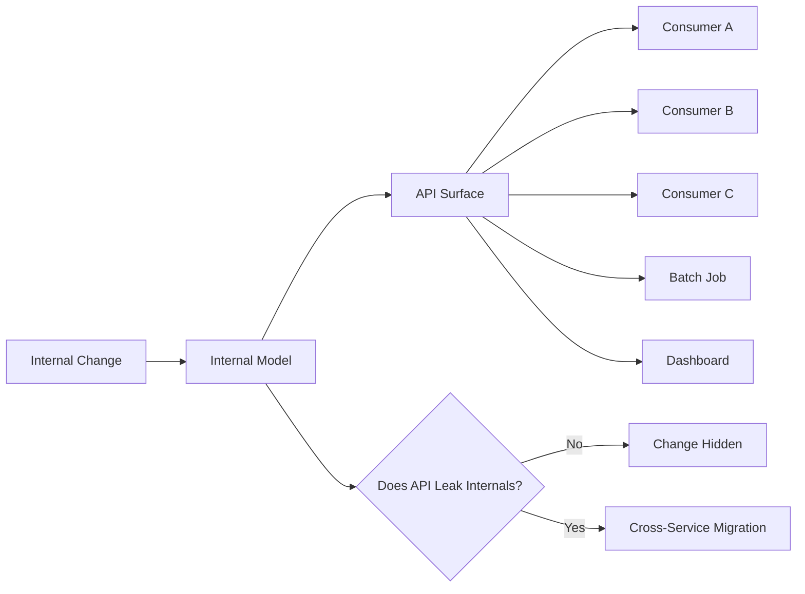
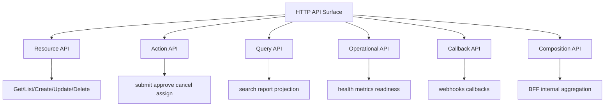
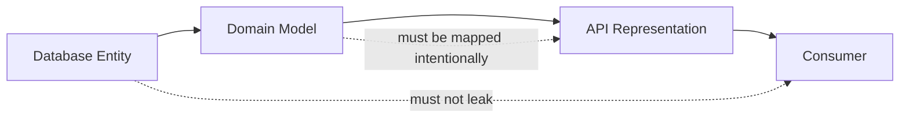
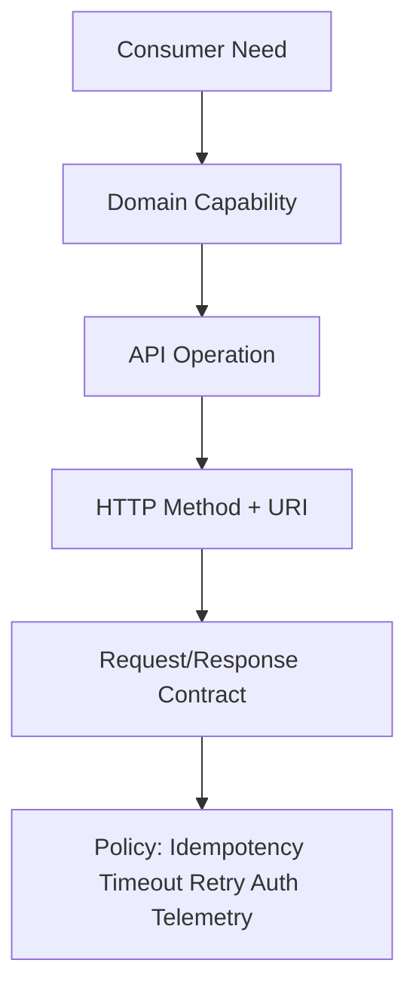
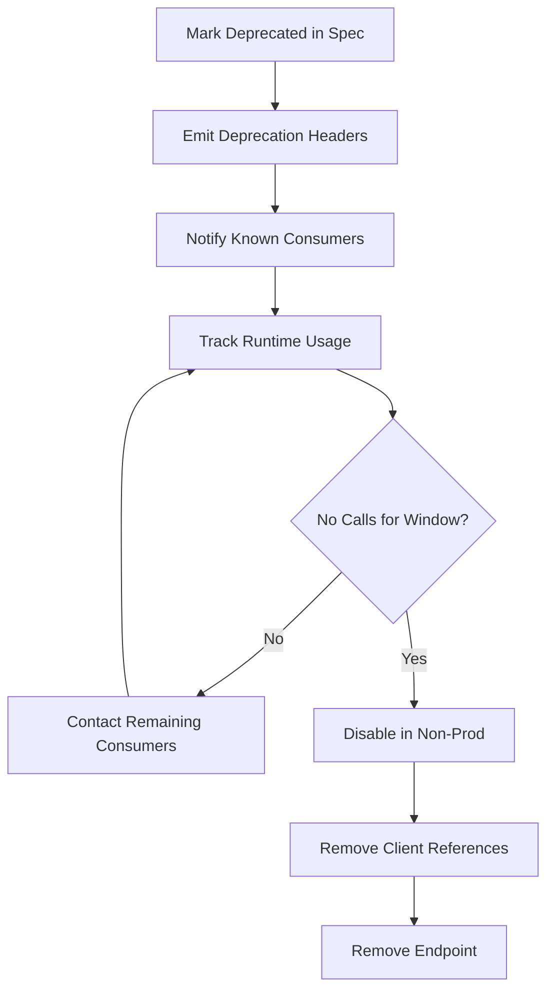

# Part 029 — API Surface Area Control

This part opens Phase 4: **HTTP API shape for service-to-service communication**.

Up to this point, we treated HTTP clients as production components: timeout, retry, pool, resilience, observability, error taxonomy, and tests.

Now we move to the other side of the boundary:

> What shape should the HTTP API expose so other services can call it safely for years?

The dangerous assumption is this:

> "An endpoint is just a function exposed over HTTP."

In a microservice system, that assumption is expensive.

An endpoint is not only code. It is a public dependency surface. Every endpoint creates expectations around:

- URI stability,
- request shape,
- response shape,
- status code semantics,
- retry behavior,
- idempotency,
- latency,
- authorization context,
- error taxonomy,
- pagination semantics,
- lifecycle state,
- operational ownership,
- version compatibility,
- monitoring and support.

If you expose endpoints casually, you are not increasing service capability. You are increasing distributed coupling.

---

## 1. The Core Rule

A microservice API should expose **capabilities**, not implementation convenience.

Bad API design starts from local code:

```java
class CaseService {
    List<CaseEntity> findCases(...)
    void assign(...)
    void validate(...)
    void recalculate(...)
    void save(...)
    void sync(...)
}
```

Then someone maps those methods into endpoints:

```text
GET  /case/findCases
POST /case/assign
POST /case/validate
POST /case/recalculate
POST /case/save
POST /case/sync
```

This is not an API. It is a remote service class.

A better design starts from the consumer's stable business need:

```text
GET    /cases/{caseId}
GET    /cases?status=OPEN&assigneeId=...
POST   /cases/{caseId}:assign
POST   /cases/{caseId}:submit-for-review
GET    /cases/{caseId}/communication-summary
```

The API describes externally meaningful capabilities. It does not leak the internal method layout.

---

## 2. Why Surface Area Matters

Each endpoint has a carrying cost.

That cost is not visible when the endpoint is created. It appears later when you need to:

- change a field,
- split a service,
- move data ownership,
- change validation rules,
- add pagination,
- add audit metadata,
- change error behavior,
- introduce a cache,
- migrate to gRPC or messaging,
- deprecate old flows,
- support unknown consumers,
- investigate production incidents.

A small API surface gives you room to evolve.

A large API surface turns every internal change into a distributed migration.



The goal is not to make APIs tiny for aesthetic reasons.

The goal is to make **changes local**.

---

## 3. The API Surface Area Equation

Surface area is not only endpoint count.

A useful equation is:

```text
API Surface Area
  = endpoints
  × methods
  × request variants
  × response variants
  × error variants
  × consumer assumptions
  × operational promises
```

Two endpoints can create more coupling than twenty endpoints if they expose unstable internal structures.

Example:

```http
GET /cases/{caseId}/full-internal-snapshot
```

This endpoint looks small, but it may expose:

- internal database IDs,
- internal state names,
- intermediate validation flags,
- storage-specific timestamps,
- implementation-specific nested objects,
- workflow engine details,
- fields owned by other services.

That is large surface area hidden behind one route.

A safer alternative may expose explicit views:

```http
GET /cases/{caseId}
GET /cases/{caseId}/review-summary
GET /cases/{caseId}/communication-summary
GET /cases/{caseId}/compliance-snapshot
```

More routes, but less accidental coupling.

---

## 4. Endpoint Count Is a Weak Metric

Teams often ask:

> "How many endpoints should a microservice have?"

That is the wrong first question.

A better question:

> "How many stable capabilities does this service own?"

One service may need many endpoints if it owns a rich domain capability. Another service may need few endpoints if it is only a narrow policy service.

Endpoint count becomes dangerous only when endpoints are generated from:

- database tables,
- repository methods,
- internal Java service methods,
- frontend screen needs,
- temporary integration shortcuts,
- batch job convenience,
- reporting convenience,
- "just expose it for now" pressure.

The invariant is:

> Every endpoint must have a clear consumer-visible reason to exist.

---

## 5. Surface Area Smells

These are common signs that an HTTP API surface is growing without design control.

### Smell 1 — Verb Soup

```text
POST /cases/validate
POST /cases/check
POST /cases/process
POST /cases/execute
POST /cases/doReview
POST /cases/updateStatus
POST /cases/changeState
```

The problem is not that verbs exist. Action endpoints can be valid.

The problem is that the vocabulary is not grounded in domain capability.

A consumer cannot tell:

- which action is authoritative,
- which is idempotent,
- which changes state,
- which can be retried,
- which has audit effect,
- which action supersedes another.

### Smell 2 — Query Kitchen Sink

```http
GET /cases?status=&type=&risk=&from=&to=&owner=&team=&region=&product=&sort=&include=&expand=&mode=&legacyFlag=&screenId=
```

A query endpoint becomes a remote database when it supports every possible consumer need.

The API is no longer a domain capability. It is an unstable ad hoc query gateway.

### Smell 3 — Internal Field Leakage

```json
{
  "caseId": "C-100",
  "workflowExecutionId": "camunda-777",
  "taskDefinitionKey": "ReviewTaskV3",
  "dbVersion": 14,
  "legacyMigrationFlag": true,
  "recalcRequired": false
}
```

Internal fields become external contracts once consumers depend on them.

### Smell 4 — Multiple Names for the Same Concept

```text
/cases/{id}/submit
/cases/{id}/send
/cases/{id}/forward
/cases/{id}/start-review
```

If these mean the same thing, the API is inconsistent.

If they mean different things, the domain language is unclear.

### Smell 5 — Screen-Shaped APIs

```text
GET /dashboard/case-page-data
GET /case-detail-tab-1
GET /case-detail-tab-2
GET /supervisor-grid
```

Screen-specific APIs can be valid at a BFF layer. They are risky inside core service-to-service APIs.

Core APIs should usually model domain capabilities, not UI composition.

### Smell 6 — Everything Is `POST`

```text
POST /cases/search
POST /cases/get
POST /cases/list
POST /cases/update
POST /cases/delete
```

Sometimes `POST` is justified for complex search, commands, or large request bodies.

But using `POST` everywhere destroys useful HTTP semantics:

- safe reads become indistinguishable from commands,
- retry policy becomes harder,
- caching becomes harder,
- observability loses intent,
- gateway policy becomes less precise.

### Smell 7 — Missing Lifecycle

Endpoints are added but never deprecated.

There is no owner, no compatibility policy, no migration plan, no usage tracking.

This creates API sediment.

---

## 6. Surface Area Categories

Not all endpoints are equal. Classify them before designing them.



Each category has different rules.

### Resource APIs

Expose durable domain objects or subresources.

Examples:

```text
GET  /cases/{caseId}
GET  /cases/{caseId}/documents
POST /cases/{caseId}/documents
```

Resource APIs are good when the main concept has identity and lifecycle.

### Action APIs

Expose meaningful domain operations.

Examples:

```text
POST /cases/{caseId}:assign
POST /cases/{caseId}:submit-for-review
POST /payments/{paymentId}:capture
```

Action APIs are good when the operation is not naturally represented as simple CRUD.

### Query APIs

Expose search/projection capabilities.

Examples:

```text
GET  /cases?status=OPEN&assigneeId=A-10
POST /case-searches
GET  /case-searches/{searchId}/results
```

Query APIs need strict limits, pagination, filter semantics, and stability rules.

### Operational APIs

Expose health, readiness, diagnostics, or admin capabilities.

Examples:

```text
GET /actuator/health/readiness
GET /actuator/metrics
POST /internal/reindex-jobs
```

Operational APIs should not be confused with business APIs.

### Callback APIs

Allow another system to notify this service.

Examples:

```text
POST /callbacks/payment-provider-events
POST /webhooks/document-verification
```

Callbacks need authenticity, replay protection, idempotency, and raw payload audit.

### Composition APIs

Aggregate multiple backend calls for a specific consumer.

Examples:

```text
GET /case-page/{caseId}
GET /supervisor-dashboard
```

Composition APIs usually belong in a BFF, gateway, or experience layer, not a core domain service.

---

## 7. The Producer-Controlled Contract Trap

A common failure mode:

> The producer exposes whatever is easy. Consumers adapt. Years later, the producer cannot change anything.

This creates producer-controlled API shape but consumer-controlled evolution.

The producer owns the route. The consumer owns the assumptions.

For example:

```http
GET /cases/{caseId}
```

Response:

```json
{
  "id": "C-100",
  "status": "PENDING_L2_REVIEW",
  "workflowTaskKey": "L2_REVIEW_V4",
  "createdAt": "2026-07-05T03:00:00Z"
}
```

Consumer logic:

```java
if (caseDto.workflowTaskKey().startsWith("L2_")) {
    showEscalationBanner();
}
```

Now `workflowTaskKey` cannot be changed without breaking a consumer.

The field was not intended as business contract, but it became one.

A safer response:

```json
{
  "id": "C-100",
  "status": "UNDER_REVIEW",
  "reviewLevel": "LEVEL_2",
  "createdAt": "2026-07-05T03:00:00Z"
}
```

Expose business semantics, not workflow engine internals.

---

## 8. API Surface Must Hide Internal Models

The internal model changes for reasons consumers should not care about:

- database normalization,
- aggregate refactoring,
- workflow engine migration,
- caching strategy,
- event sourcing adoption,
- permission model changes,
- table splitting,
- service decomposition,
- legacy migration.

The API model changes only when consumer-visible semantics change.



Never return JPA entities from service-to-service APIs.

Never let `@Entity` become `@JsonSerialize` by accident.

Never allow Lombok-generated entity shape to become distributed contract.

---

## 9. Internal API Is Still Public to Your Organization

Teams sometimes say:

> "It is internal, so we can change it anytime."

This is false in a microservice architecture.

Internal APIs can be harder to change than public APIs because:

- consumer ownership is spread across teams,
- usage may not be documented,
- generated clients may be pinned to old versions,
- batch jobs may call old routes,
- dashboards may scrape fields,
- support tooling may depend on response details,
- incident playbooks may rely on behavior.

An internal API is not private just because it is inside the network.

It is private only if:

- all consumers are owned by the same deployable unit, or
- usage is fully controlled and automatically migrated, or
- compatibility is explicitly not promised and technically enforced.

Most service-to-service APIs are organization-public.

---

## 10. Surface Area Ownership

Every endpoint needs an owner.

Not only a team owner. A semantic owner.

For each endpoint, answer:

```text
Who owns the business meaning?
Who owns the API contract?
Who owns operational SLOs?
Who owns breaking-change approval?
Who owns consumer migration?
Who owns incident response?
```

A mature service catalog should record:

| Field | Example |
|---|---|
| Service | `case-service` |
| Endpoint | `POST /cases/{caseId}:submit-for-review` |
| Capability | Submit case into review lifecycle |
| Owner | Case Workflow Team |
| Consumers | `supervisor-ui-bff`, `case-batch-ingestor` |
| Compatibility | Backward compatible for 12 months |
| Idempotency | Required with `Idempotency-Key` |
| Retry | Safe only on timeout/network failure with same key |
| SLO | p95 < 250 ms excluding dependency outage |
| Deprecation | Requires consumer usage check |

The table looks bureaucratic until the first incident.

Then it becomes cheap insurance.

---

## 11. Design API Around Consumer Intent

Consumer intent is more stable than producer internals.

Bad endpoint:

```http
GET /cases/{caseId}/workflow-variables
```

Consumer intent:

> "I need to know whether this case can be escalated."

Better endpoint:

```http
GET /cases/{caseId}/escalation-eligibility
```

Response:

```json
{
  "caseId": "C-100",
  "eligible": false,
  "reasons": [
    {
      "code": "PENDING_REQUIRED_DOCUMENT",
      "message": "A required document is still missing."
    }
  ]
}
```

This API exposes a stable decision, not raw workflow machinery.

But be careful: do not create a separate endpoint for every tiny screen decision.

The right question is:

> Is this a durable domain capability or a temporary consumer convenience?

---

## 12. Capability-Based API Design

A capability is a meaningful thing the service can do or answer.

Examples:

```text
Retrieve a case summary.
List open cases assigned to an officer.
Assign a case.
Submit a case for review.
Check escalation eligibility.
Create a review decision.
Cancel a scheduled action.
```

Capabilities map to endpoints after their semantics are clear.



Do not start from the URI.

Start from the capability.

---

## 13. The Endpoint Admission Checklist

Before adding an endpoint, ask:

```text
1. What durable consumer need does this endpoint serve?
2. Which service owns the capability?
3. Is this read, command, query, action, callback, or operational?
4. Can an existing endpoint satisfy it without overloading semantics?
5. Does the endpoint expose internal implementation details?
6. What are the idempotency semantics?
7. What happens if the caller times out after the server commits?
8. Which errors are retriable?
9. What is the maximum payload size?
10. What is the pagination strategy?
11. What is the expected latency envelope?
12. What telemetry will identify this operation?
13. How will we know who uses it?
14. How will we deprecate it?
15. What will make this endpoint obsolete?
```

This checklist is intentionally heavy.

Creating a distributed dependency should not be frictionless.

---

## 14. Stable Names Beat Clever Names

API names should be boring.

Bad:

```text
POST /cases/{id}:kickoff
POST /cases/{id}:goNext
POST /cases/{id}:doMagic
POST /cases/{id}:recomputeStuff
```

Better:

```text
POST /cases/{caseId}:submit-for-review
POST /cases/{caseId}:assign
POST /cases/{caseId}:recalculate-risk-score
```

Names should make the following visible:

- target resource,
- business action,
- lifecycle intent,
- expected side effect,
- audit meaning.

Avoid names that describe implementation mechanics:

```text
POST /cases/{caseId}:triggerWorkflow
POST /cases/{caseId}:sendKafkaEvent
POST /cases/{caseId}:updateDb
```

An API should say what business thing happens, not how the service performs it.

---

## 15. Route Design Principles

Good route design is not about beauty. It is about predictability.

### Use plural collections

```text
GET /cases
GET /cases/{caseId}
GET /cases/{caseId}/documents
```

### Use stable identifiers

```text
GET /cases/C-100
```

Do not expose database row IDs if they are not durable business identifiers.

### Keep nesting shallow

Usually good:

```text
GET /cases/{caseId}/documents/{documentId}
```

Suspicious:

```text
GET /regions/{regionId}/teams/{teamId}/officers/{officerId}/cases/{caseId}/documents/{documentId}
```

Deep nesting often leaks ownership hierarchy that may change.

### Avoid route parameters that encode workflow state

Bad:

```text
GET /cases/open/{caseId}
GET /cases/escalated/{caseId}
```

Better:

```text
GET /cases/{caseId}
GET /cases?status=OPEN
GET /cases?status=ESCALATED
```

Workflow state changes. Identity should not.

### Prefer route templates that make metrics stable

Use route templates in telemetry:

```text
http.route = /cases/{caseId}/documents/{documentId}
```

Do not use raw paths as metric labels:

```text
/cases/C-100/documents/D-200
```

That creates cardinality problems.

---

## 16. Response Shape Control

Response shape is part of surface area.

A response should be designed as a representation, not a dump.

Bad:

```json
{
  "caseId": "C-100",
  "caseType": "REGULATORY",
  "status": "OPEN",
  "assignedOfficer": {
    "id": "O-10",
    "name": "Ayu",
    "team": {
      "id": "T-7",
      "region": {
        "id": "R-2",
        "country": "ID"
      }
    }
  },
  "documents": [...],
  "auditLogs": [...],
  "workflow": {...},
  "risk": {...},
  "permissions": {...}
}
```

This endpoint is probably too broad.

Better:

```json
{
  "caseId": "C-100",
  "type": "REGULATORY",
  "status": "OPEN",
  "assignedOfficerId": "O-10",
  "riskLevel": "HIGH",
  "createdAt": "2026-07-05T03:00:00Z",
  "updatedAt": "2026-07-05T04:00:00Z"
}
```

Then expose focused subresources/projections:

```text
GET /cases/{caseId}/documents
GET /cases/{caseId}/audit-events
GET /cases/{caseId}/risk-summary
GET /cases/{caseId}/available-actions
```

Do not include everything because one consumer asked once.

---

## 17. `include` and `expand` Need Discipline

Expansion is useful but dangerous.

Example:

```http
GET /cases/C-100?include=documents,riskSummary,availableActions
```

This can reduce chattiness.

But uncontrolled expansion turns a resource API into a graph traversal API.

Rules:

```text
1. Enumerate allowed expansions.
2. Keep expansion depth shallow.
3. Define latency impact.
4. Define authorization behavior per expansion.
5. Define failure behavior if expansion dependency fails.
6. Include expanded fields in contract tests.
7. Monitor expansion combinations.
```

Avoid:

```http
GET /cases/C-100?include=*
GET /cases/C-100?expand=assignedOfficer.team.region.permissions.auditLogs.documents.comments.attachments
```

A wildcard expand is a contract grenade.

---

## 18. Read Surface vs Write Surface

Reads and writes age differently.

Read APIs often grow because consumers need more views.

Write APIs must be stricter because writes create side effects.

A read endpoint may support projection:

```http
GET /cases/{caseId}/summary
GET /cases/{caseId}/review-context
GET /cases/{caseId}/audit-events
```

A write endpoint should express a command:

```http
POST /cases/{caseId}:assign
```

Command body:

```json
{
  "assigneeId": "O-10",
  "reason": "Supervisor reassignment",
  "expectedVersion": 8
}
```

The command body should not be a partial entity dump:

```json
{
  "status": "ASSIGNED",
  "assigneeId": "O-10",
  "updatedAt": "...",
  "version": 8,
  "internalWorkflowState": "..."
}
```

Write APIs should preserve invariants, not let consumers mutate fields freely.

---

## 19. API Surface and Domain Invariants

A service boundary exists to protect invariants.

If your API lets another service bypass invariants, the boundary is fake.

Bad:

```http
PATCH /cases/{caseId}
```

Body:

```json
{
  "status": "CLOSED",
  "closedAt": "2026-07-05T05:00:00Z",
  "closureReason": "DONE"
}
```

This allows the consumer to decide the lifecycle transition.

Better:

```http
POST /cases/{caseId}:close
```

Body:

```json
{
  "reasonCode": "RESOLVED",
  "comment": "All required checks completed.",
  "expectedVersion": 12
}
```

The service owns the transition.

It validates:

- current state,
- required documents,
- review decisions,
- authorization,
- audit rule,
- notification side effects.

Consumers request intent. The service enforces invariants.

---

## 20. Avoid Remote Table APIs

A remote table API exposes CRUD for database records:

```text
GET    /case_records/{id}
POST   /case_records
PATCH  /case_records/{id}
DELETE /case_records/{id}
```

This is tempting because it is easy to generate.

It is also one of the fastest ways to turn microservices into a distributed monolith.

Remote table APIs leak:

- table names,
- row ownership,
- join structure,
- nullability,
- persistence constraints,
- internal lifecycle,
- implementation-level IDs.

Domain APIs expose capabilities:

```text
POST /cases
POST /cases/{caseId}:assign
POST /cases/{caseId}:submit-for-review
GET  /cases/{caseId}/review-context
```

The database is not the contract.

---

## 21. Avoid Remote Workflow Engine APIs

A workflow engine is an implementation detail unless your service explicitly sells workflow as a capability.

Bad:

```text
POST /workflow/tasks/{taskId}/complete
GET  /workflow/process-instances/{id}/variables
POST /workflow/messages/correlate
```

This exposes engine semantics to other services.

Better:

```text
POST /cases/{caseId}:approve-review
POST /cases/{caseId}:request-more-information
GET  /cases/{caseId}/available-actions
```

The workflow engine may still exist internally.

But consumers speak domain language, not engine language.

---

## 22. API Surface and Authorization

Even though this series does not repeat authorization design, API shape affects authorization clarity.

A vague endpoint is hard to authorize:

```http
POST /cases/{caseId}:process
```

What permission does that require?

A precise endpoint is easier:

```http
POST /cases/{caseId}:approve-review
POST /cases/{caseId}:reject-review
POST /cases/{caseId}:assign
POST /cases/{caseId}:escalate
```

Each action maps to a meaningful permission, audit event, and operational metric.

Surface area control is not always about fewer endpoints.

Sometimes a slightly larger API is safer because each operation has clearer semantics.

---

## 23. API Surface and Observability

Endpoints are operational dimensions.

For each API operation, you should know:

```text
request rate
error rate
latency distribution
payload size distribution
retry rate
timeout rate
consumer identity
status code distribution
dependency contribution
saturation signal
business outcome rate
```

If you cannot monitor the endpoint as a distinct operation, it is not production-ready.

A vague route causes bad observability:

```text
POST /cases/action
```

Everything becomes one metric.

A better route:

```text
POST /cases/{caseId}:assign
POST /cases/{caseId}:submit-for-review
POST /cases/{caseId}:close
```

Now you can see which capability is failing.

---

## 24. API Surface and Caching

Caching depends on stable semantics.

Good read endpoint:

```http
GET /cases/{caseId}/summary
```

It has a clear representation and can support:

- `ETag`,
- `Last-Modified`,
- conditional requests,
- gateway cache,
- local cache,
- stale fallback.

Bad read endpoint:

```http
POST /cases/getEverythingForScreen
```

It hides read semantics behind `POST`, making caching harder and policy less transparent.

Not every internal API should be cached.

But the API should not destroy cacheability accidentally.

---

## 25. API Surface and Retry Safety

Retry safety is not only client configuration.

The endpoint design must support it.

Reads are usually safe to retry if timeout/network failure occurs.

Writes need explicit design.

Example command:

```http
POST /cases/C-100:assign
Idempotency-Key: 0a4f3bb8-0c44-41df-9a90-3c88606ac001
Content-Type: application/json

{
  "assigneeId": "O-10",
  "reason": "Supervisor reassignment",
  "expectedVersion": 8
}
```

Server behavior:

```text
If key not seen: execute and store result.
If same key + same request: return original result.
If same key + different request: return conflict.
```

Without this, the client cannot safely retry unknown outcomes.

Surface area includes idempotency semantics.

---

## 26. API Surface and Long-Running Operations

Some operations should not pretend to be synchronous.

Bad:

```http
POST /cases/{caseId}:generate-full-compliance-report
```

Response after 45 seconds:

```http
200 OK
```

This creates:

- long client timeouts,
- gateway timeout risk,
- stuck threads,
- ambiguous retry behavior,
- poor progress visibility.

Better:

```http
POST /cases/{caseId}/report-generation-jobs
```

Response:

```http
202 Accepted
Location: /cases/{caseId}/report-generation-jobs/J-900
```

Then:

```http
GET /cases/{caseId}/report-generation-jobs/J-900
```

Response:

```json
{
  "jobId": "J-900",
  "status": "RUNNING",
  "progress": 0.42,
  "startedAt": "2026-07-05T04:30:00Z"
}
```

When complete:

```json
{
  "jobId": "J-900",
  "status": "SUCCEEDED",
  "resultLocation": "/cases/C-100/reports/R-777"
}
```

Surface area should make asynchronous reality visible.

---

## 27. Control Consumer-Specific Variants

A common pressure:

> "Consumer A needs field X, consumer B needs field Y, consumer C needs different sorting."

Bad response:

```json
{
  "fieldForConsumerA": "...",
  "fieldForConsumerB": "...",
  "fieldForLegacyBatch": "...",
  "fieldForDashboard": "..."
}
```

Better options:

### Option 1 — Stable projection endpoints

```text
GET /cases/{caseId}/summary
GET /cases/{caseId}/review-context
GET /cases/{caseId}/audit-context
```

### Option 2 — Explicit field projection

```http
GET /cases/{caseId}?fields=caseId,status,riskLevel
```

Use carefully. It complicates caching, testing, and compatibility.

### Option 3 — BFF/composition layer

```text
GET /supervisor-case-page/{caseId}
```

Use when the shape is consumer-experience-specific.

### Option 4 — Event/read model

For heavy read variation, an event-fed read model may be better than making the source service answer every query shape.

---

## 28. Avoid Backdoor APIs

Backdoor APIs are endpoints created for operational convenience but later used as business APIs.

Examples:

```text
POST /internal/cases/{caseId}/force-status
POST /admin/cases/recalculate-all
GET  /debug/cases/{caseId}/raw
```

These may be necessary for support or repair.

But they need strict controls:

- separate route namespace,
- strong authentication,
- fine-grained authorization,
- audit logging,
- rate limits,
- environment restrictions,
- no normal consumer access,
- clear runbook,
- not included in public client libraries.

Backdoor APIs should not become integration APIs.

---

## 29. API Lifecycle States

Every endpoint should have a lifecycle state.

```text
DRAFT
EXPERIMENTAL
ACTIVE
DEPRECATED
REMOVED
```

Example metadata:

```yaml
x-lifecycle:
  state: ACTIVE
  owner: case-workflow-team
  introduced: 2026-07-05
  compatibility: backward-compatible
  deprecationPolicy: 180-days-notice
```

Lifecycle is part of surface area control.

If you do not mark deprecation, old endpoints live forever.

---

## 30. Usage Tracking Is Mandatory

You cannot reduce surface area if you do not know who uses it.

Track at least:

```text
consumer service identity
route template
method
status code
latency
request count
last seen timestamp
version/header/client library version
```

Example metric dimensions:

```text
http.server.request.duration{
  service="case-service",
  http.request.method="POST",
  http.route="/cases/{caseId}:assign",
  consumer.service="supervisor-bff",
  http.response.status_code="200"
}
```

Do not use high-cardinality IDs.

Do not label by raw URL.

Do not label by full user ID unless explicitly designed and controlled.

---

## 31. The Consumer Registry Pattern

A lightweight consumer registry can prevent surprises.

```yaml
api: case-service
operation: POST /cases/{caseId}:assign
consumers:
  - service: supervisor-bff
    owner: workflow-experience-team
    purpose: manual assignment
    criticality: high
  - service: case-auto-router
    owner: case-automation-team
    purpose: automated assignment
    criticality: medium
```

This registry does not need to be a complex platform on day one.

It can start as:

- OpenAPI extension,
- service catalog metadata,
- repository file,
- Backstage entity annotation,
- runtime telemetry-derived report.

The key is that endpoint ownership and consumer usage must be visible.

---

## 32. The API Review Board Anti-Pattern

Surface area control does not mean every endpoint needs a committee.

A heavy review board often creates:

- slow delivery,
- rubber-stamp reviews,
- architecture theater,
- local workarounds,
- hidden APIs.

A better model:

```text
Clear design principles
Small endpoint admission checklist
Automated linting
Template examples
Ownership metadata
Lightweight review for high-risk changes
Telemetry-based cleanup
```

Review should be proportional to risk.

High-risk endpoint:

```text
New write API used by multiple services with money/compliance impact.
```

Low-risk endpoint:

```text
New read-only projection for one internal consumer with bounded payload and lifecycle tag.
```

Do not make all changes equally expensive.

---

## 33. API Surface Control in Java Code

API surface is not only URI design. Your Java code should enforce it.

### Separate API DTOs from domain/entity models

```java
public record CaseSummaryResponse(
        String caseId,
        String status,
        String riskLevel,
        String assignedOfficerId,
        Instant updatedAt
) {}
```

Do not do this:

```java
@GetMapping("/cases/{caseId}")
public CaseEntity getCase(@PathVariable String caseId) {
    return repository.findById(caseId).orElseThrow();
}
```

### Use operation-specific request types

```java
public record AssignCaseRequest(
        String assigneeId,
        String reason,
        Long expectedVersion
) {}
```

Not:

```java
public record UpdateCaseRequest(
        String status,
        String assigneeId,
        String priority,
        String workflowState,
        Boolean closed,
        Boolean deleted
) {}
```

### Keep controllers thin

```java
@RestController
@RequestMapping("/cases")
final class CaseCommandController {

    private final AssignCaseUseCase assignCase;

    @PostMapping("/{caseId}:assign")
    ResponseEntity<AssignCaseResponse> assign(
            @PathVariable String caseId,
            @RequestHeader("Idempotency-Key") String idempotencyKey,
            @Valid @RequestBody AssignCaseRequest request
    ) {
        var command = new AssignCaseCommand(
                caseId,
                request.assigneeId(),
                request.reason(),
                request.expectedVersion(),
                idempotencyKey
        );

        var result = assignCase.handle(command);

        return ResponseEntity.ok(AssignCaseResponse.from(result));
    }
}
```

The controller maps HTTP to use case. It does not decide domain policy.

---

## 34. Package Structure Example

A practical structure:

```text
case-service/
  src/main/java/com/acme/caseapp/
    api/
      http/
        CaseQueryController.java
        CaseCommandController.java
        dto/
          CaseSummaryResponse.java
          AssignCaseRequest.java
          AssignCaseResponse.java
          ErrorResponse.java
        mapper/
          CaseApiMapper.java
    application/
      command/
        AssignCaseUseCase.java
        SubmitForReviewUseCase.java
      query/
        GetCaseSummaryQuery.java
        ListCasesQuery.java
    domain/
      Case.java
      CaseStatus.java
      CasePolicy.java
    infrastructure/
      persistence/
      messaging/
```

The API layer depends inward.

The domain does not know HTTP exists.

---

## 35. OpenAPI as Surface Area Inventory

OpenAPI should be more than documentation.

It should be the inventory of your HTTP surface.

Use it to record:

- operation ID,
- summary,
- description,
- request schema,
- response schema,
- error schema,
- status codes,
- idempotency header,
- authentication requirements,
- deprecation status,
- lifecycle metadata,
- owner metadata,
- retry guidance.

Example:

```yaml
paths:
  /cases/{caseId}:assign:
    post:
      operationId: assignCase
      summary: Assign a case to an officer
      x-owner: case-workflow-team
      x-lifecycle: ACTIVE
      x-idempotency-required: true
      parameters:
        - name: caseId
          in: path
          required: true
          schema:
            type: string
        - name: Idempotency-Key
          in: header
          required: true
          schema:
            type: string
      responses:
        '200':
          description: Case assignment accepted and applied
        '409':
          description: Version conflict or invalid lifecycle transition
        '422':
          description: Semantically invalid assignment request
```

If an endpoint is not in the spec, it does not exist as a supported contract.

---

## 36. Endpoint Deletion Strategy

Removing endpoints is harder than adding them.

A safe deprecation flow:



A deprecation should include:

- replacement endpoint,
- migration guide,
- sunset date,
- compatibility risk,
- owner contact,
- usage telemetry.

Never remove an internal endpoint based only on source-code search.

Runtime usage matters.

---

## 37. Endpoint Compatibility Rules

Backward-compatible changes usually include:

```text
Adding optional response field.
Adding optional request field with default.
Adding new enum value only if consumers tolerate unknown values.
Adding new error code only if clients handle unknown codes.
Increasing documented max page size? Usually risky.
Relaxing validation? Usually compatible but may affect assumptions.
```

Breaking changes include:

```text
Removing field.
Renaming field.
Changing field type.
Changing status code semantics.
Changing idempotency behavior.
Changing pagination token semantics.
Changing default sort order.
Changing nullability.
Changing enum meaning.
Changing authorization requirements.
Changing route identity.
```

The most dangerous breaking changes are semantic, not syntactic.

Example:

```text
status = CLOSED used to mean final.
Now CLOSED can reopen.
```

No schema diff will fully protect you from semantic breakage.

---

## 38. Surface Area and Enum Evolution

Enums are compact but risky.

Bad assumption:

```java
switch (response.status()) {
    case OPEN -> ...;
    case CLOSED -> ...;
}
```

Then producer adds:

```text
SUSPENDED
```

Consumer breaks or misclassifies.

Safer response design:

```json
{
  "status": "SUSPENDED",
  "statusCategory": "ACTIVE",
  "availableActions": ["RESUME", "CLOSE"]
}
```

Consumers can rely on stable categories or capabilities instead of exhaustive internal states.

Rule:

> Expose detailed states only when consumers need them. Otherwise expose stable categories and available capabilities.

---

## 39. Surface Area and State Machines

In regulatory or case-management systems, state machines are central.

Do not expose every internal state as API contract unless external services truly need it.

Internal states:

```text
DRAFT
SUBMITTED
AUTO_VALIDATION_PENDING
AUTO_VALIDATION_FAILED
L1_REVIEW_PENDING
L1_REVIEW_IN_PROGRESS
L2_REVIEW_PENDING
L2_REVIEW_IN_PROGRESS
LEGAL_REVIEW_REQUIRED
CLOSURE_PENDING
CLOSED
ARCHIVED
```

External representation may be:

```json
{
  "caseId": "C-100",
  "lifecycleStatus": "UNDER_REVIEW",
  "reviewLevel": "LEVEL_2",
  "availableActions": ["APPROVE", "REQUEST_MORE_INFORMATION", "ESCALATE"]
}
```

This preserves flexibility to refactor internal workflow states.

Expose detailed audit trail separately if required:

```http
GET /cases/{caseId}/audit-events
```

---

## 40. Surface Area and Cross-Service Ownership

A response should not casually include data owned by other services.

Bad:

```json
{
  "caseId": "C-100",
  "assignee": {
    "officerId": "O-10",
    "name": "Ayu",
    "email": "ayu@example.test",
    "teamName": "Enforcement East"
  }
}
```

If officer data is owned by `identity-service`, `case-service` now becomes a replication or proxy source.

Better options:

### Option 1 — Return reference only

```json
{
  "caseId": "C-100",
  "assigneeOfficerId": "O-10"
}
```

### Option 2 — Return documented snapshot

```json
{
  "caseId": "C-100",
  "assigneeSnapshot": {
    "officerId": "O-10",
    "displayName": "Ayu",
    "capturedAt": "2026-07-05T04:00:00Z"
  }
}
```

### Option 3 — Composition layer joins data

```text
supervisor-bff calls case-service and identity-service.
```

The correct choice depends on ownership, freshness, latency, and consistency requirements.

---

## 41. Surface Area Budgeting

Large organizations sometimes use API governance. Smaller teams can use a simpler technique: surface area budget.

For each service, define:

```text
Maximum supported business operations before review.
Maximum custom query endpoints.
Maximum unowned endpoints: zero.
Maximum experimental endpoints with unknown consumers: zero.
Maximum endpoints without telemetry: zero.
```

This is not a hard architectural law. It is a forcing function.

The budget makes people ask:

> "Is this endpoint worth its future maintenance cost?"

---

## 42. API Surface Review Template

Use this template for new endpoints.

```markdown
# API Surface Review: POST /cases/{caseId}:assign

## Capability
Assign a case to an officer while enforcing lifecycle, authorization, and version constraints.

## Consumers
- supervisor-bff: manual assignment
- case-auto-router: automated assignment

## Why Existing APIs Are Insufficient
PATCH /cases/{caseId} would expose mutable fields and bypass assignment policy.

## Request Semantics
- Method: POST
- Idempotency-Key: required
- expectedVersion: required
- Side effect: assignment changes, audit event, notification event

## Failure Semantics
- 400 malformed request
- 401/403 auth failure
- 404 case not found
- 409 version conflict or invalid transition
- 422 semantically invalid assignee
- 503 dependency unavailable

## Retry Semantics
Safe to retry with the same Idempotency-Key if the client gets timeout/network error.

## Observability
Metric route: /cases/{caseId}:assign
Trace span: CaseApi.assign
Business metric: case.assignment.applied

## Lifecycle
ACTIVE. Owner: case-workflow-team.
```

The review is short, but it captures the contract.

---

## 43. Decision Matrix: Add, Extend, Split, or Reject

When a new need appears:

| Situation | Decision |
|---|---|
| Same capability, optional output field | Extend existing response carefully |
| Same capability, different consumer-specific view | Consider projection endpoint or BFF |
| New domain command | Add action endpoint |
| New durable entity/subresource | Add resource endpoint |
| Temporary operational need | Add restricted operational endpoint with lifecycle |
| Raw database access request | Reject; design capability instead |
| Heavy analytical query | Use read model/reporting path, not core transactional API |
| Long-running operation | Model job/operation resource |
| Cross-service aggregation for UI | Use BFF/composition layer |
| Consumer wants internal workflow variables | Reject; expose domain decision/projection |

---

## 44. Minimal API Surface Does Not Mean Underpowered API

Minimal does not mean missing capabilities.

It means every exposed capability is intentional.

A weak service says:

```text
Tell me what field you need and I will expose it.
```

A strong service says:

```text
Tell me what decision or operation you need, and I will expose the stable domain capability.
```

That is the difference between being a database wrapper and being a service boundary.

---

## 45. Production Checklist

Before an endpoint is considered production-ready:

```text
[ ] It has a named domain capability.
[ ] It has an owner.
[ ] It has documented consumers or a discovery mechanism.
[ ] It does not expose entities or internal workflow details.
[ ] It has stable route naming.
[ ] It has clear HTTP method semantics.
[ ] It has documented status codes.
[ ] It has structured error response.
[ ] It has idempotency semantics if it writes.
[ ] It has timeout and retry guidance.
[ ] It has payload size limits.
[ ] It has pagination if it returns collections.
[ ] It has telemetry dimensions.
[ ] It has security and audit requirements.
[ ] It appears in OpenAPI.
[ ] It has tests for compatibility and failure behavior.
[ ] It has lifecycle metadata.
[ ] It has a deprecation strategy.
```

No checklist prevents bad design automatically.

But missing answers reveal design debt before production traffic does.

---

## 46. Summary

API surface area is distributed coupling.

Every endpoint is a promise. Every field is a possible dependency. Every status code is a control signal. Every route is an operational dimension. Every command is a failure/retry/idempotency problem.

Control surface area by designing around:

- durable capabilities,
- explicit ownership,
- stable domain language,
- separation between read and write models,
- hidden internals,
- endpoint lifecycle,
- consumer tracking,
- observability,
- compatibility discipline.

Do not expose local code as remote API.

Do not expose tables as services.

Do not expose workflow internals as business contract.

Expose stable capabilities with explicit semantics.

That is how HTTP APIs remain evolvable as the system grows.

The next part compares **resource APIs vs action APIs** and gives a practical decision model for when each shape is the right communication contract.
