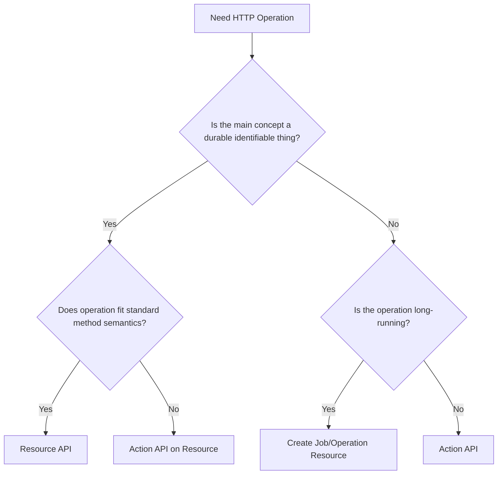
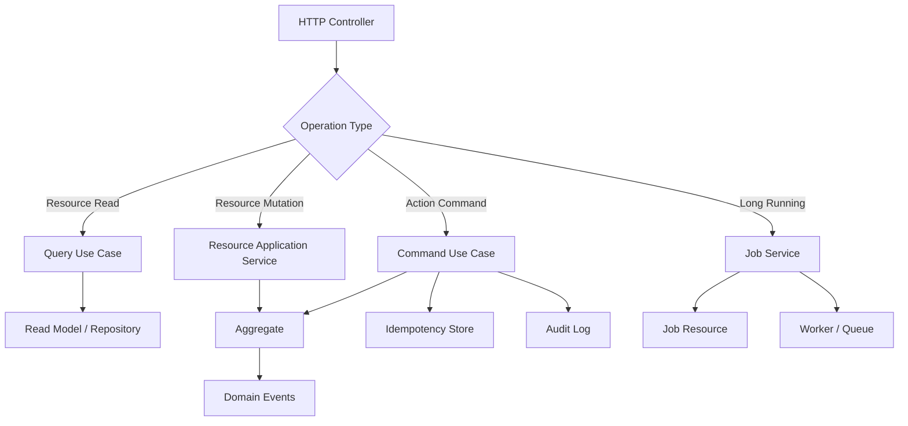

# Part 030 — Resource APIs vs Action APIs

This part answers a deceptively simple design question:

> Should this HTTP API be modeled as a resource operation or an action?

Many teams turn this into a religious debate:

- "Everything must be RESTful resources."
- "REST is too rigid; just use RPC over HTTP."
- "POST everything and move on."
- "Never use verbs in URLs."

All four positions are too shallow for production microservices.

The useful answer is:

> Model stable things as resources. Model meaningful domain operations as actions. Do not hide business commands behind generic CRUD, and do not create arbitrary verbs for every internal method.

A mature HTTP API can contain both resource APIs and action APIs.

The key is to make the semantics explicit.

---

## 1. Resource API Mental Model

A resource API exposes identifiable things.

A resource has:

- identity,
- representation,
- lifecycle,
- ownership,
- stable URI,
- operations that fit HTTP method semantics.

Examples:

```text
/cases/{caseId}
/cases/{caseId}/documents/{documentId}
/officers/{officerId}
/review-decisions/{decisionId}
/report-generation-jobs/{jobId}
```

Typical operations:

```http
GET    /cases/{caseId}
GET    /cases
POST   /cases
PUT    /cases/{caseId}
PATCH  /cases/{caseId}
DELETE /cases/{caseId}
```

Resource APIs are excellent when the domain concept has durable identity and consumers care about its representation.

---

## 2. Action API Mental Model

An action API exposes an operation.

An action has:

- intent,
- side effect,
- preconditions,
- business meaning,
- audit meaning,
- failure semantics,
- idempotency semantics.

Examples:

```http
POST /cases/{caseId}:assign
POST /cases/{caseId}:submit-for-review
POST /cases/{caseId}:approve-review
POST /payments/{paymentId}:capture
POST /documents/{documentId}:verify
```

Action APIs are excellent when the consumer wants to request a business operation, not mutate a representation directly.

---

## 3. The Wrong Question

The wrong question is:

> "Is this RESTful?"

A better question:

> "What contract best preserves the service's invariants while giving consumers a stable capability?"

For example, this looks resource-oriented:

```http
PATCH /cases/{caseId}

{
  "status": "APPROVED"
}
```

But it may be bad because it lets the caller control lifecycle state directly.

This looks action-oriented:

```http
POST /cases/{caseId}:approve-review

{
  "decisionReason": "All checks passed",
  "expectedVersion": 8
}
```

It may be better because the service owns the transition and validates the invariant.

The second API is more honest.

---

## 4. The Core Decision Rule

Use a **resource API** when the primary concept is a durable thing the client reads or manages.

Use an **action API** when the primary concept is a domain operation whose rules belong inside the service.



This rule is simple, but it prevents many mistakes.

---

## 5. Standard Resource Operations

Resource APIs are strongest when they use standard HTTP method semantics clearly.

### Read one resource

```http
GET /cases/C-100
```

Response:

```json
{
  "caseId": "C-100",
  "status": "UNDER_REVIEW",
  "riskLevel": "HIGH",
  "assignedOfficerId": "O-10",
  "updatedAt": "2026-07-05T04:00:00Z"
}
```

### List resources

```http
GET /cases?status=UNDER_REVIEW&pageSize=50&pageToken=eyJwYWdlIjoyfQ
```

Response:

```json
{
  "items": [
    {
      "caseId": "C-100",
      "status": "UNDER_REVIEW"
    }
  ],
  "nextPageToken": "eyJwYWdlIjozfQ"
}
```

### Create resource

```http
POST /cases
Content-Type: application/json

{
  "type": "REGULATORY_ENFORCEMENT",
  "subjectId": "S-900",
  "initialRiskLevel": "MEDIUM"
}
```

Response:

```http
201 Created
Location: /cases/C-100
```

### Replace resource

```http
PUT /case-drafts/D-100
```

Use carefully. Full replacement is less common for complex domain aggregates.

### Partial update

```http
PATCH /case-drafts/D-100
```

Use carefully. Patch is best for simple mutable resources or drafts, not invariant-heavy lifecycle transitions.

### Delete resource

```http
DELETE /case-drafts/D-100
```

Use carefully. Many business resources are closed, cancelled, archived, or revoked rather than physically deleted.

---

## 6. Where Resource APIs Work Well

Resource APIs work well for:

```text
Reference data
Configuration objects
Drafts
Documents
Jobs/operations
Search resources
Saved filters
Reports
Attachments
Comments
Review decisions
Audit event reads
```

Example: document upload.

```http
POST /cases/C-100/documents
Content-Type: application/json

{
  "documentType": "EVIDENCE",
  "fileName": "inspection-report.pdf",
  "contentRef": "blob://upload/abc"
}
```

Response:

```http
201 Created
Location: /cases/C-100/documents/D-200
```

This is a natural resource operation.

The client creates a document resource under a case.

---

## 7. Where Resource APIs Become Dangerous

Resource APIs become dangerous when they let clients mutate invariant-heavy domain state directly.

Example:

```http
PATCH /cases/C-100

{
  "status": "CLOSED",
  "closedAt": "2026-07-05T05:00:00Z",
  "closureReason": "RESOLVED"
}
```

This looks simple, but the service must ask:

```text
Is the case allowed to close?
Were all required reviews completed?
Are there pending enforcement actions?
Is the caller allowed to close this case?
Should audit events be produced?
Should notification events be emitted?
Should downstream reports update?
What if this request is retried?
What if expected version is stale?
```

A generic patch hides a business command.

A better operation:

```http
POST /cases/C-100:close
Content-Type: application/json
Idempotency-Key: 1ea6cc4f-2f5f-49e0-b9af-8e32789b95a8

{
  "reasonCode": "RESOLVED",
  "comment": "All required checks completed.",
  "expectedVersion": 12
}
```

Now the command is visible.

---

## 8. Action APIs Are Not a Failure

Some engineers treat action endpoints as design failure.

That is too simplistic.

Domain systems contain operations:

- approve,
- reject,
- assign,
- escalate,
- submit,
- cancel,
- capture,
- refund,
- verify,
- recalculate,
- publish,
- archive,
- reopen.

Forcing these into CRUD can create worse APIs.

Bad resource disguise:

```http
PATCH /payments/P-100

{
  "status": "CAPTURED"
}
```

Better action:

```http
POST /payments/P-100:capture

{
  "amount": "150.00",
  "currency": "USD",
  "idempotencyKey": "..."
}
```

The action exposes business intent.

---

## 9. Action APIs Must Be Disciplined

Action APIs are powerful, but they can devolve into RPC soup.

Bad:

```text
POST /cases/{caseId}:process
POST /cases/{caseId}:handle
POST /cases/{caseId}:execute
POST /cases/{caseId}:doNext
POST /cases/{caseId}:change
POST /cases/{caseId}:run
```

Good:

```text
POST /cases/{caseId}:assign
POST /cases/{caseId}:submit-for-review
POST /cases/{caseId}:approve-review
POST /cases/{caseId}:request-more-information
POST /cases/{caseId}:close
```

An action name should be:

- domain-specific,
- auditable,
- permission-mappable,
- operationally observable,
- understandable without reading code.

If the action name is generic, the endpoint is probably hiding too much.

---

## 10. Colon Actions vs Subresource Actions

There are two common shapes:

```http
POST /cases/{caseId}:assign
```

or:

```http
POST /cases/{caseId}/assignments
```

Both can be valid.

Choose based on whether the operation produces a durable resource.

### Use colon-style action when the operation is a command

```http
POST /cases/{caseId}:submit-for-review
```

The main result is a state transition.

### Use subresource when the operation creates a durable thing

```http
POST /cases/{caseId}/assignments
```

This is good if assignments are first-class resources with identity:

```http
GET /cases/{caseId}/assignments/A-100
```

Decision rule:

```text
If consumers later need to read, list, cancel, audit, or reference the thing created by the operation, model it as a resource.
Otherwise, model the operation as an action.
```

---

## 11. Action Result Shapes

An action response should not be arbitrary.

Common result patterns:

### Return updated resource representation

```http
200 OK

{
  "caseId": "C-100",
  "status": "ASSIGNED",
  "assignedOfficerId": "O-10",
  "version": 9
}
```

Good when the action completes synchronously and the consumer needs current state.

### Return command result

```http
200 OK

{
  "caseId": "C-100",
  "assignmentId": "A-900",
  "status": "APPLIED",
  "version": 9
}
```

Good when the result itself matters.

### Return accepted operation

```http
202 Accepted
Location: /cases/C-100/operations/OP-900
```

Good when the operation is long-running.

### Return no content

```http
204 No Content
```

Good only when the consumer does not need result details and observability/audit exists elsewhere.

In business systems, `204` after commands is often under-informative.

---

## 12. Resource Creation vs Action Command

Consider case assignment.

Option A:

```http
POST /cases/C-100:assign
```

Option B:

```http
POST /cases/C-100/assignments
```

Option A is better if there is only one current assignment and consumers care about the case state.

Option B is better if assignment history is a first-class domain concept:

```http
GET /cases/C-100/assignments
GET /cases/C-100/assignments/A-777
POST /cases/C-100/assignments/A-777:cancel
```

Do not choose based on taste. Choose based on domain identity.

---

## 13. State Transition Design

Most action APIs are state transitions.

A robust transition command should include:

```text
target resource ID
command intent
actor/context from auth/session
reason/comment if auditable
expected version or precondition
idempotency key if retryable
request timestamp if relevant
client request ID for diagnostics
```

Example:

```http
POST /cases/C-100:submit-for-review
Idempotency-Key: 1efbe3cc-e076-4611-9786-4d58188dba7c
Content-Type: application/json

{
  "expectedVersion": 7,
  "submissionNote": "Ready for supervisor review."
}
```

The server decides:

```text
current state valid?
required fields complete?
caller allowed?
version current?
side effects needed?
events to emit?
audit entry required?
```

The client requests intent. The service owns the transition.

---

## 14. Use Preconditions for Resource Updates

For resource updates, avoid lost updates.

Option 1: entity tag.

```http
GET /case-drafts/D-100
```

Response:

```http
ETag: "v7"
```

Then:

```http
PUT /case-drafts/D-100
If-Match: "v7"
```

Option 2: expected version in body.

```json
{
  "expectedVersion": 7,
  "title": "Updated draft title"
}
```

For service-to-service internal APIs, either can work.

The deeper invariant is:

> Writes must not silently overwrite concurrent changes unless the domain explicitly allows it.

---

## 15. Resource API Example: Case Draft

A draft is often a good resource.

It has identity, mutable representation, and simple lifecycle.

```http
POST /case-drafts
```

Request:

```json
{
  "subjectId": "S-900",
  "caseType": "REGULATORY_ENFORCEMENT"
}
```

Response:

```http
201 Created
Location: /case-drafts/D-100
```

Patch draft:

```http
PATCH /case-drafts/D-100
If-Match: "v2"
Content-Type: application/json

{
  "summary": "Updated inspection summary",
  "priority": "HIGH"
}
```

Submit draft:

```http
POST /case-drafts/D-100:submit
Idempotency-Key: 8c0f6316-f68e-4c10-8d61-fdbb5bcb733e
```

The draft itself is a resource. Submission is an action.

This hybrid is clean.

---

## 16. Action API Example: Review Decision

A review decision may be modeled two ways.

### As action

```http
POST /cases/C-100:approve-review
```

Good if the only important result is the case transition.

### As resource

```http
POST /cases/C-100/review-decisions
```

Request:

```json
{
  "decision": "APPROVED",
  "reasonCode": "CHECKS_PASSED",
  "comment": "No outstanding issues."
}
```

Response:

```http
201 Created
Location: /cases/C-100/review-decisions/RD-700
```

Good if review decisions are auditable first-class records.

Which is better?

In regulated systems, the second is often stronger because the decision itself has evidentiary value.

But the resource creation should still trigger domain transition inside the service.

---

## 17. The Command Resource Pattern

Sometimes a command deserves a resource of its own.

Example:

```http
POST /case-assignment-requests
```

Request:

```json
{
  "caseId": "C-100",
  "assigneeId": "O-10",
  "reason": "Workload balancing"
}
```

Response:

```http
201 Created
Location: /case-assignment-requests/AR-900
```

Then:

```http
GET /case-assignment-requests/AR-900
```

This is useful when:

- the request has lifecycle,
- approval may be needed,
- processing is asynchronous,
- the command can be cancelled,
- the command must be audited independently,
- multiple systems coordinate around it.

Do not overuse it. It adds complexity.

---

## 18. Long-Running Operations as Resources

A long-running action should usually return an operation/job resource.

Bad:

```http
POST /cases/C-100:generate-report
```

Waits 60 seconds.

Better:

```http
POST /cases/C-100/report-generation-jobs
```

Response:

```http
202 Accepted
Location: /cases/C-100/report-generation-jobs/J-900
Retry-After: 5
```

Poll:

```http
GET /cases/C-100/report-generation-jobs/J-900
```

Response:

```json
{
  "jobId": "J-900",
  "status": "RUNNING",
  "progress": 0.35
}
```

When complete:

```json
{
  "jobId": "J-900",
  "status": "SUCCEEDED",
  "reportId": "R-100"
}
```

Here, the operation is a resource because consumers need to observe its lifecycle.

---

## 19. Search: Resource, Query, or Action?

Search is often mishandled.

Simple list:

```http
GET /cases?status=OPEN&assigneeId=O-10
```

Good for bounded filter sets.

Complex search with large body:

```http
POST /case-searches
```

Request:

```json
{
  "filters": [
    { "field": "riskLevel", "op": "IN", "values": ["HIGH", "CRITICAL"] },
    { "field": "createdAt", "op": "GTE", "value": "2026-01-01T00:00:00Z" }
  ],
  "sort": [
    { "field": "createdAt", "direction": "DESC" }
  ]
}
```

Response:

```http
201 Created
Location: /case-searches/S-900
```

Then:

```http
GET /case-searches/S-900/results?pageSize=50
```

Use this when search is heavy, auditable, asynchronous, or reused.

Avoid:

```http
POST /cases/search
```

with unbounded semantics and no lifecycle.

That is usually a query kitchen sink.

---

## 20. Recalculation APIs

Recalculation is often an implementation smell.

Bad:

```http
POST /cases/C-100:recalculate
```

What is being recalculated? Why? Is the result observable? Is it safe to retry? Does it change state?

Better names:

```http
POST /cases/C-100:rerun-risk-assessment
POST /cases/C-100:refresh-eligibility-decision
POST /cases/C-100/recalculation-jobs
```

Even better, ask whether the recalculation should be event-driven instead:

```text
DocumentUploaded event -> Risk projection refreshes automatically.
OfficerChanged event -> Assignment eligibility refreshes automatically.
PolicyChanged event -> impacted cases scheduled for reassessment.
```

An HTTP action is appropriate when a consumer explicitly requests the operation.

It is not appropriate as a backdoor fix for missing reactive propagation.

---

## 21. Available Actions Endpoint

For stateful domains, exposing available actions can reduce coupling.

```http
GET /cases/C-100/available-actions
```

Response:

```json
{
  "caseId": "C-100",
  "version": 8,
  "actions": [
    {
      "name": "APPROVE_REVIEW",
      "method": "POST",
      "href": "/cases/C-100:approve-review",
      "requiresReason": true
    },
    {
      "name": "REQUEST_MORE_INFORMATION",
      "method": "POST",
      "href": "/cases/C-100:request-more-information",
      "requiresComment": true
    }
  ]
}
```

This is useful when:

- lifecycle is complex,
- UI/BFF needs action enablement,
- authorization and state jointly determine allowed operations,
- consumers should not encode state transition rules.

But do not make every API hypermedia-heavy if the consumers do not benefit.

Use it where it removes duplicated decision logic.

---

## 22. Action APIs and Idempotency

Actions with side effects need idempotency design.

Example:

```http
POST /payments/P-100:capture
Idempotency-Key: 0d64f6e1-9274-4217-83dc-1f82c1e13ae2
```

Server rule:

```text
same key + same semantic request -> same result
same key + different semantic request -> conflict
key expired -> documented behavior
```

This applies to:

- assign,
- close,
- submit,
- approve,
- capture,
- refund,
- create once commands,
- external side-effect triggers.

An action API without idempotency may force clients into unsafe retry behavior.

---

## 23. Action APIs and Status Codes

Do not return `200 OK` for everything.

Useful mappings:

| Case | Status |
|---|---:|
| Action completed and returns result | `200 OK` |
| Action completed and no response body needed | `204 No Content` |
| Action created resource | `201 Created` |
| Action accepted for async processing | `202 Accepted` |
| Malformed request | `400 Bad Request` |
| Authentication missing/invalid | `401 Unauthorized` |
| Authenticated but not allowed | `403 Forbidden` |
| Target resource missing | `404 Not Found` |
| Version conflict / invalid state transition | `409 Conflict` |
| Semantically invalid request | `422 Unprocessable Content` |
| Too many requests | `429 Too Many Requests` |
| Dependency/temporary unavailable | `503 Service Unavailable` |

Status code is a control signal for clients and gateways.

It should align with retry and error handling policy.

---

## 24. Action APIs and Error Body

An action error should be machine-readable.

Example:

```json
{
  "type": "https://api.example.test/problems/invalid-case-transition",
  "title": "Invalid case transition",
  "status": 409,
  "detail": "Case C-100 cannot be approved while required documents are missing.",
  "instance": "/cases/C-100:approve-review/requests/REQ-900",
  "code": "CASE_TRANSITION_NOT_ALLOWED",
  "retriable": false,
  "currentStatus": "UNDER_REVIEW",
  "missingRequirements": [
    "INSPECTION_REPORT"
  ]
}
```

The body should answer:

```text
What failed?
Is it retriable?
Is the failure due to state, validation, auth, dependency, or overload?
What can the client do next?
How can support trace the request?
```

---

## 25. Do Not Expose Internal Commands

Bad:

```http
POST /cases/C-100:sendKafkaEvent
POST /cases/C-100:updateWorkflowVariable
POST /cases/C-100:flushCache
POST /cases/C-100:runRuleEngine
```

These are implementation actions, not domain actions.

Better:

```http
POST /cases/C-100:submit-for-review
POST /cases/C-100:reopen
POST /cases/C-100:request-more-information
```

The service may send Kafka events, update workflow variables, flush cache, or run rules internally.

The API should expose why, not how.

---

## 26. Do Not Abuse PATCH for Commands

`PATCH` is not wrong. It is wrong when used to hide commands.

Good `PATCH` example:

```http
PATCH /case-drafts/D-100

{
  "priority": "HIGH",
  "summary": "Updated summary"
}
```

Bad `PATCH` example:

```http
PATCH /cases/C-100

{
  "status": "APPROVED",
  "reviewedBy": "O-10",
  "reviewedAt": "2026-07-05T04:00:00Z"
}
```

Approval is not a field update. It is a command with rules.

Use:

```http
POST /cases/C-100:approve-review
```

---

## 27. Do Not Abuse POST for Reads

Sometimes `POST` for read is valid:

- request body too complex for query string,
- search is expensive and creates a search resource,
- query needs privacy constraints,
- query is asynchronous.

But avoid:

```http
POST /cases/get
POST /cases/list
POST /cases/find
```

If it is a simple safe read, use `GET`.

Good:

```http
GET /cases/C-100
GET /cases?status=OPEN
```

This keeps read semantics clear for clients, proxies, observability, and operations.

---

## 28. Domain Command DTO Design

Action request DTOs should express command intent.

```java
public record ApproveReviewRequest(
        String reasonCode,
        String comment,
        long expectedVersion
) {}
```

Not:

```java
public record UpdateCaseStatusRequest(
        String status,
        String reviewedBy,
        Instant reviewedAt,
        String workflowTaskId,
        boolean sendNotification
) {}
```

The second DTO lets the consumer control internals.

A good command DTO:

- contains business inputs,
- avoids server-derived fields,
- avoids implementation flags,
- includes precondition/version when needed,
- is small enough to validate clearly,
- maps cleanly to an application command.

---

## 29. Java Controller Example: Resource API

Example resource read controller:

```java
@RestController
@RequestMapping("/cases")
final class CaseQueryController {

    private final GetCaseSummaryUseCase getCaseSummary;
    private final ListCasesUseCase listCases;

    @GetMapping("/{caseId}")
    ResponseEntity<CaseSummaryResponse> getCase(
            @PathVariable String caseId
    ) {
        var summary = getCaseSummary.handle(new GetCaseSummaryQuery(caseId));
        return ResponseEntity.ok(CaseSummaryResponse.from(summary));
    }

    @GetMapping
    ResponseEntity<ListCasesResponse> listCases(
            @RequestParam(required = false) String status,
            @RequestParam(defaultValue = "50") int pageSize,
            @RequestParam(required = false) String pageToken
    ) {
        var result = listCases.handle(new ListCasesQuery(status, pageSize, pageToken));
        return ResponseEntity.ok(ListCasesResponse.from(result));
    }
}
```

The controller exposes resource reads.

No state transition rules are encoded here.

---

## 30. Java Controller Example: Action API

Example action controller:

```java
@RestController
@RequestMapping("/cases")
final class CaseCommandController {

    private final ApproveReviewUseCase approveReview;

    @PostMapping("/{caseId}:approve-review")
    ResponseEntity<ApproveReviewResponse> approveReview(
            @PathVariable String caseId,
            @RequestHeader("Idempotency-Key") String idempotencyKey,
            @Valid @RequestBody ApproveReviewRequest request
    ) {
        var command = new ApproveReviewCommand(
                caseId,
                request.reasonCode(),
                request.comment(),
                request.expectedVersion(),
                idempotencyKey
        );

        var result = approveReview.handle(command);

        return ResponseEntity.ok(ApproveReviewResponse.from(result));
    }
}
```

The action endpoint maps to an application command.

The use case enforces the invariant.

---

## 31. Application Command Example

```java
public record ApproveReviewCommand(
        String caseId,
        String reasonCode,
        String comment,
        long expectedVersion,
        String idempotencyKey
) {}
```

```java
@Service
final class ApproveReviewUseCase {

    private final CaseRepository caseRepository;
    private final IdempotencyStore idempotencyStore;
    private final DomainEventPublisher eventPublisher;

    @Transactional
    ApproveReviewResult handle(ApproveReviewCommand command) {
        return idempotencyStore.execute(
                command.idempotencyKey(),
                command,
                () -> approve(command)
        );
    }

    private ApproveReviewResult approve(ApproveReviewCommand command) {
        var caseAggregate = caseRepository.getForUpdate(command.caseId());

        caseAggregate.assertVersion(command.expectedVersion());
        caseAggregate.approveReview(command.reasonCode(), command.comment());

        caseRepository.save(caseAggregate);
        eventPublisher.publish(caseAggregate.pullEvents());

        return ApproveReviewResult.from(caseAggregate);
    }
}
```

The HTTP action is thin. The domain operation is protected.

---

## 32. Mapping Domain Failures to HTTP

Action APIs need clear failure mapping.

```java
@RestControllerAdvice
final class ApiExceptionHandler {

    @ExceptionHandler(CaseNotFoundException.class)
    ResponseEntity<ProblemDetail> notFound(CaseNotFoundException ex) {
        var problem = ProblemDetail.forStatus(HttpStatus.NOT_FOUND);
        problem.setTitle("Case not found");
        problem.setDetail(ex.getMessage());
        problem.setProperty("code", "CASE_NOT_FOUND");
        problem.setProperty("retriable", false);
        return ResponseEntity.status(HttpStatus.NOT_FOUND).body(problem);
    }

    @ExceptionHandler(InvalidTransitionException.class)
    ResponseEntity<ProblemDetail> invalidTransition(InvalidTransitionException ex) {
        var problem = ProblemDetail.forStatus(HttpStatus.CONFLICT);
        problem.setTitle("Invalid case transition");
        problem.setDetail(ex.getMessage());
        problem.setProperty("code", "CASE_TRANSITION_NOT_ALLOWED");
        problem.setProperty("retriable", false);
        return ResponseEntity.status(HttpStatus.CONFLICT).body(problem);
    }
}
```

The client should not parse random exception messages.

It should receive a stable problem type/code.

---

## 33. OpenAPI Example: Resource + Action

```yaml
paths:
  /cases/{caseId}:
    get:
      operationId: getCase
      summary: Get case summary
      parameters:
        - name: caseId
          in: path
          required: true
          schema:
            type: string
      responses:
        '200':
          description: Case summary
        '404':
          description: Case not found

  /cases/{caseId}:approve-review:
    post:
      operationId: approveCaseReview
      summary: Approve review for a case
      x-idempotency-required: true
      parameters:
        - name: caseId
          in: path
          required: true
          schema:
            type: string
        - name: Idempotency-Key
          in: header
          required: true
          schema:
            type: string
      requestBody:
        required: true
      responses:
        '200':
          description: Review approved
        '409':
          description: Invalid transition or version conflict
        '422':
          description: Semantic validation failed
```

Resource and action can coexist cleanly in one API.

---

## 34. Security and Audit Difference

Resource read:

```http
GET /cases/C-100
```

Permission:

```text
case.read
```

Audit:

```text
Maybe access audit depending on sensitivity.
```

Action command:

```http
POST /cases/C-100:approve-review
```

Permission:

```text
case.review.approve
```

Audit:

```text
Required: who approved, when, reason, previous state, new state, request ID.
```

Action APIs usually have stronger audit requirements.

That is another reason not to hide commands behind generic updates.

---

## 35. Metrics Difference

Resource endpoint metrics:

```text
http.server.request.duration{http.route="/cases/{caseId}", method="GET"}
```

Action endpoint metrics:

```text
http.server.request.duration{http.route="/cases/{caseId}:approve-review", method="POST"}
case.review.approved.count
case.review.approval.failed.count{reason="missing_document"}
```

Business action metrics matter.

If all commands are hidden behind `PATCH /cases/{caseId}`, you lose domain-level operational visibility.

---

## 36. Consumer SDK Shape

Generated clients for resource APIs often look fine:

```java
CaseSummaryResponse getCase(String caseId);
ListCasesResponse listCases(ListCasesRequest request);
```

For action APIs, avoid generic method names:

```java
ApproveReviewResponse approveReview(String caseId, ApproveReviewRequest request);
AssignCaseResponse assignCase(String caseId, AssignCaseRequest request);
```

Do not generate:

```java
Object postCaseAction(String caseId, String action, Object body);
```

That destroys type safety and hides the contract.

---

## 37. Resource vs Action Decision Table

| Requirement | Prefer |
|---|---|
| Read current representation of an identifiable thing | Resource API |
| List/search finite collection with simple filters | Resource API |
| Create a durable object | Resource API |
| Replace or patch a simple mutable object | Resource API |
| Request domain state transition | Action API |
| Enforce invariant-heavy command | Action API |
| Operation produces first-class durable record | Resource creation |
| Operation is long-running | Job/operation resource |
| Command needs approval/cancellation/lifecycle | Command resource |
| UI-specific data composition | BFF/composition API |
| Raw internal method exposure | Neither; redesign |
| Raw table mutation | Neither; redesign |

---

## 38. Anti-Patterns

### Anti-pattern 1 — CRUD over aggregate root for everything

```http
PATCH /cases/{caseId}
```

Used for:

- assign,
- approve,
- close,
- escalate,
- reopen,
- request information.

This hides commands and weakens invariants.

### Anti-pattern 2 — RPC soup

```http
POST /cases/doAssignment
POST /cases/doApproval
POST /cases/doClose
POST /cases/runCaseStuff
```

This loses resource context and consistent naming.

### Anti-pattern 3 — Status field mutation

```http
PATCH /orders/O-100

{
  "status": "CANCELLED"
}
```

Should often be:

```http
POST /orders/O-100:cancel
```

### Anti-pattern 4 — Hidden long-running operation

```http
POST /reports/generate
```

No operation resource, no progress, no retry story.

### Anti-pattern 5 — Verb-only endpoint

```http
POST /approve
```

Approve what? Under which resource? With what permission? With what audit trail?

---

## 39. The Practical Naming Convention

A good internal convention:

```text
Resource collection:
/cases

Resource item:
/cases/{caseId}

Subresource collection:
/cases/{caseId}/documents

Subresource item:
/cases/{caseId}/documents/{documentId}

Action on resource:
/cases/{caseId}:submit-for-review

Action creates durable resource:
/cases/{caseId}/review-decisions

Long-running operation:
/cases/{caseId}/report-generation-jobs/{jobId}
```

This convention is not the only possible one.

The important thing is consistency.

---

## 40. Testing Resource APIs

Resource API tests should verify:

```text
GET does not mutate state.
List pagination is stable.
Unknown filters are rejected or ignored consistently.
ETag/version behavior works.
PATCH cannot change forbidden fields.
Representation does not expose internal fields.
404 vs 403 behavior follows security policy.
Response schema remains backward-compatible.
```

Example test:

```java
@Test
void getCaseDoesNotExposeWorkflowInternals() {
    webTestClient.get()
            .uri("/cases/C-100")
            .exchange()
            .expectStatus().isOk()
            .expectBody()
            .jsonPath("$.workflowExecutionId").doesNotExist()
            .jsonPath("$.taskDefinitionKey").doesNotExist();
}
```

---

## 41. Testing Action APIs

Action API tests should verify:

```text
valid transition succeeds.
invalid transition returns 409.
stale expectedVersion returns 409.
missing idempotency key is rejected.
same idempotency key returns same result.
same idempotency key with different body returns conflict.
side effects happen once.
audit event is written.
domain event is emitted once.
permission failure is mapped correctly.
unknown outcome can be retried safely.
```

Example test:

```java
@Test
void approveReviewIsIdempotent() {
    var key = UUID.randomUUID().toString();

    var first = approveReview("C-100", key);
    var second = approveReview("C-100", key);

    assertThat(second.body()).isEqualTo(first.body());
    assertThat(auditRepository.countByCaseIdAndType("C-100", "REVIEW_APPROVED"))
            .isEqualTo(1);
}
```

---

## 42. Migration Example: Bad CRUD to Explicit Commands

Original API:

```http
PATCH /cases/{caseId}

{
  "status": "APPROVED"
}
```

Problems:

```text
Caller controls state.
No reason code.
No idempotency key.
No domain-specific metric.
Hard to distinguish approval from other updates.
Hard to audit.
```

Migration:

```http
POST /cases/{caseId}:approve-review
```

Request:

```json
{
  "reasonCode": "CHECKS_PASSED",
  "comment": "All checks completed.",
  "expectedVersion": 8
}
```

Plan:

```text
1. Add new action endpoint.
2. Mark status PATCH path deprecated for lifecycle transitions.
3. Log warnings when PATCH changes status.
4. Migrate consumers.
5. Reject status changes via PATCH after sunset.
6. Keep PATCH only for safe mutable draft fields, if still needed.
```

This is how API shape improves without breaking everything immediately.

---

## 43. When to Reject Both Resource and Action

Sometimes the requested API should not exist.

Examples:

```text
GET /cases/{id}/raw-database-row
POST /cases/{id}:skipValidation
POST /cases/{id}:forceWorkflowState
GET /cases/{id}/allInternalVariables
POST /cases/{id}:publishKafkaEvent
```

These requests usually indicate:

- missing domain capability,
- missing operational runbook,
- poor ownership boundary,
- consumer trying to bypass service invariants,
- data/reporting requirement better served by read model,
- integration trying to compensate for missing events.

Rejecting an endpoint is sometimes the best architecture work.

---

## 44. Resource + Action Reference Architecture



The architecture separates:

- reads,
- simple resource mutation,
- domain commands,
- long-running operations.

Do not force all four into one controller method style.

---

## 45. Production Checklist

For a resource API:

```text
[ ] Resource has stable identity.
[ ] Representation hides internal model.
[ ] HTTP method semantics are correct.
[ ] Collection endpoints are paginated.
[ ] Updates protect against lost updates.
[ ] Partial updates cannot bypass invariants.
[ ] Delete semantics are explicit.
[ ] Response schema is backward-compatible.
```

For an action API:

```text
[ ] Action name is domain-specific.
[ ] Target resource is clear.
[ ] Side effects are documented.
[ ] Preconditions are explicit.
[ ] Idempotency is defined.
[ ] Retry behavior is defined.
[ ] Domain failures map to stable error codes.
[ ] Audit behavior is defined.
[ ] Metrics identify the action.
[ ] Action does not expose implementation mechanics.
```

For both:

```text
[ ] Owner is known.
[ ] Consumers are known or observable.
[ ] Contract is in OpenAPI.
[ ] Operational runbook exists for failures.
[ ] Deprecation strategy exists.
```

---

## 46. Summary

Resource APIs and action APIs are both valid.

The mistake is using the wrong shape for the wrong semantic.

Use resource APIs when the consumer interacts with identifiable things and their representations.

Use action APIs when the consumer requests a domain operation with rules, side effects, preconditions, audit meaning, and retry semantics.

Do not hide commands behind generic patch/update.

Do not turn every Java method into a remote action.

Do not expose database tables, workflow engine commands, or implementation mechanics.

The best API shape is the one that keeps business invariants inside the service while giving consumers a stable, observable, evolvable capability.

The next part will split HTTP APIs into **command and query APIs**, showing how different read/write semantics affect latency, consistency, retries, caching, and service ownership.
