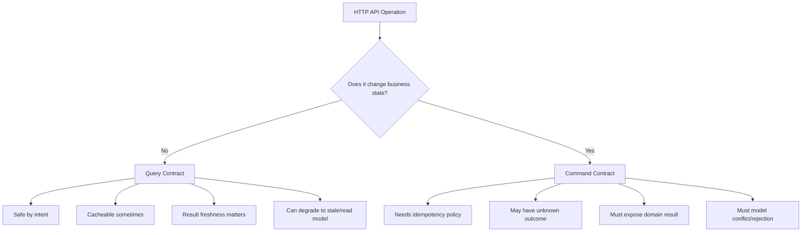
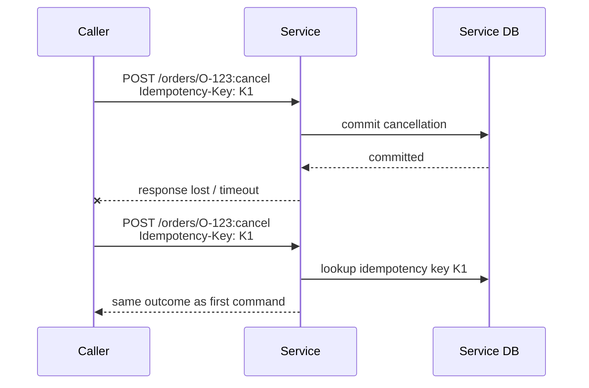

# Part 031 — Command/Query Split in Internal HTTP APIs

This part is about one design move that prevents a large class of API ambiguity:

> Separate **commands** that change system state from **queries** that read system state.

This is not the same as saying every system must implement full CQRS, separate databases, event sourcing, or read models.

For internal HTTP APIs, the practical idea is simpler:

- a **query endpoint** answers a question;
- a **command endpoint** asks the callee to perform a domain operation;
- their HTTP method, request shape, response shape, timeout, retry policy, error model, telemetry, and operational expectations should be different.

When teams blur this line, they get APIs that are hard to retry, hard to cache, hard to observe, hard to evolve, and hard to reason about during incidents.

---

## 1. The Core Problem

A service-to-service HTTP call usually looks innocent:

```text
Order Service  --->  Payment Service
```

But the caller is not merely "calling another service".

The caller is asking one of two different things:

```text
Question: "What is the current payment status for order O-123?"
Command:  "Authorize payment for order O-123."
```

Those two calls have different distributed-system properties.

| Dimension | Query | Command |
|---|---|---|
| Primary purpose | Read information | Change state |
| Expected side effect | None from client's perspective | Yes |
| Natural HTTP method | `GET` or sometimes `POST` for complex search | `POST`, `PUT`, `PATCH`, `DELETE` depending on semantics |
| Retry safety | Usually safer if read-only | Requires idempotency design |
| Caching | Sometimes possible | Usually no |
| Timeout outcome | Usually no state ambiguity | May produce unknown outcome |
| Observability | read latency, cache hit, result size | state transition, outcome, duplicate suppression |
| Error model | unavailable / not found / invalid query | invalid command / conflict / duplicate / dependency failure |

If these are not separated, the API surface starts lying.

A `GET /payments/{id}/authorize` lies because `GET` is expected to be safe.

A `POST /payments/search` may be acceptable for a complex query, but it must not be treated like a state-changing command.

A `PUT /orders/{id}` that sometimes recalculates price, reserves inventory, cancels a shipment, and emits events is not a resource replacement. It is a bundle of hidden commands.

---

## 2. Command/Query Split Is a Communication Contract

Command/query split is often presented as an internal application design principle. In microservices, it is also a **wire-level contract**.

A caller needs to know:

- Can I retry this request?
- Can I hedge it?
- Can I cache it?
- Can I collapse duplicate calls?
- Can I treat a timeout as no-op?
- Can I call it from a read path?
- Can I fan it out to many dependencies?
- Can I call it under degraded dependency state?
- Can I show stale data if it fails?

The answer is different for commands and queries.



A production API should make this split visible in its design.

---

## 3. Do Not Confuse CQS, CQRS, and HTTP Shape

Three terms often get mixed together.

### 3.1 Command Query Separation

Command Query Separation says a method should either perform an action or answer a question, not both.

In HTTP API design, this becomes:

```text
GET /orders/{orderId}
POST /orders/{orderId}:cancel
```

The query reads.

The command changes state.

### 3.2 CQRS

CQRS usually means separating command and query models, sometimes with separate storage, projections, asynchronous replication, or event sourcing.

You do **not** need full CQRS to design clean HTTP APIs.

You can implement command/query split with:

```text
same service
same database
same deployment
same codebase
different endpoint semantics
```

### 3.3 Resource-Oriented HTTP Design

HTTP resource design asks how operations map to resources and methods.

Command/query split asks whether the operation is a read or write.

They complement each other.

| API shape | Example | Query or command? |
|---|---|---|
| Resource read | `GET /orders/{id}` | Query |
| Resource list | `GET /orders?status=OPEN` | Query |
| Resource creation | `POST /orders` | Command |
| Resource replacement | `PUT /customer-profiles/{id}` | Command |
| Partial update | `PATCH /customer-profiles/{id}` | Command |
| Domain action | `POST /orders/{id}:cancel` | Command |
| Complex search | `POST /orders:search` | Query by semantics, despite POST |

The operation semantics matter more than the URL style alone.

---

## 4. The Query Endpoint Contract

A query endpoint answers a question without intentionally changing business state.

Typical examples:

```http
GET /customers/C-123
GET /orders/O-123
GET /orders?customerId=C-123&status=OPEN
GET /payment-authorizations?orderId=O-123
POST /orders:search
```

A production query contract should define at least these properties:

```yaml
operation: getOrder
kind: query
method: GET
safe: true
idempotent: true
freshness:
  model: read-your-writes-not-guaranteed
  maxStalenessMs: 3000
latencyBudgetMs: 80
resultLimit:
  defaultPageSize: 50
  maxPageSize: 200
failurePolicy:
  timeout: fail-fast-or-stale-if-allowed
  retry: allowed-for-transient-transport-failure
  fallback: stale-cache-allowed-for-non-regulatory-view
observability:
  metricName: http.client.duration
  lowCardinalityRoute: /orders/{orderId}
```

### 4.1 Queries should not mutate business state

A query may update technical metadata like access logs, metrics, cache fill, or trace data. That does not make it a business command.

But it must not:

- approve a payment,
- allocate inventory,
- cancel a case,
- advance workflow state,
- mark a regulatory notice as served,
- permanently acknowledge a domain event,
- trigger external irreversible effects.

If a `GET` changes business state, callers and intermediaries cannot reason about it safely.

### 4.2 Queries should expose freshness expectations

A query can read from:

- primary database,
- replica,
- search index,
- materialized view,
- cache,
- external system,
- stream-derived projection.

The caller needs to know what freshness means.

Examples:

```text
strong: reads current committed state from authoritative store
read-your-writes: caller can observe its own previous command outcome
bounded-stale: result may lag by <= N seconds under normal conditions
eventual: result is projection-based and may lag without strict bound
snapshot: result reflects a specific point in time
```

This should influence endpoint naming and documentation.

```http
GET /cases/{caseId}
GET /case-search-results?query=...
GET /case-projections/{caseId}
```

Do not let a search projection pretend to be an authoritative command decision source.

### 4.3 Queries need result bounds

Unbounded queries are distributed denial-of-service bugs disguised as convenience.

Every query endpoint should define:

- default page size,
- maximum page size,
- maximum filter complexity,
- maximum sort fields,
- response body size limit,
- timeout budget,
- index expectations,
- stable ordering behavior.

Example:

```http
GET /orders?customerId=C-123&pageSize=100&pageToken=eyJrIjoi..."
```

A service-to-service query is still a public contract inside your platform. It should not expose arbitrary database power unless that is explicitly the product.

---

## 5. The Command Endpoint Contract

A command endpoint asks the service to perform an operation.

Typical examples:

```http
POST /orders
POST /orders/O-123:cancel
POST /payments/P-123:authorize
POST /cases/C-123:escalate
PATCH /customer-profiles/C-123
DELETE /sessions/S-123
```

A production command contract should define:

```yaml
operation: cancelOrder
kind: command
method: POST
idempotency:
  required: true
  keyHeader: Idempotency-Key
  dedupeWindow: PT24H
stateModel:
  allowedFrom:
    - SUBMITTED
    - CONFIRMED
  terminalOutcomes:
    - CANCELLED
    - REJECTED
latencyBudgetMs: 500
retryPolicy:
  transportTimeout: allowedWithSameIdempotencyKey
  conflict: noRetryWithoutStateRefresh
  validation: noRetry
response:
  synchronousOutcome: accepted-or-final
  unknownOutcomeHandling: query-command-result
observability:
  commandName: cancelOrder
  duplicateSuppressedMetric: true
```

Commands should be designed around **outcome**, not merely status code.

### 5.1 Commands create unknown outcomes

When a command times out, the caller cannot automatically know whether the callee:

- never received the request,
- received it but rejected it,
- performed the operation but failed before responding,
- committed the operation but timed out during response writing,
- is still processing asynchronously,
- crashed after partial external side effect.

This is the core reason command endpoints need idempotency and result lookup.



The retry must use the same idempotency key.

Without that, retry becomes duplicate execution.

### 5.2 Commands should return domain outcome, not vague success

Bad:

```json
{
  "success": true
}
```

Better:

```json
{
  "commandId": "cmd_01JZ...",
  "orderId": "O-123",
  "outcome": "CANCELLED",
  "previousStatus": "CONFIRMED",
  "currentStatus": "CANCELLED",
  "effectiveAt": "2026-07-05T04:12:39Z"
}
```

A command response should answer:

- What operation was requested?
- What entity was affected?
- What final or accepted state resulted?
- Was this a new execution or duplicate replay?
- What can the caller safely do next?

For asynchronous commands, return an operation resource:

```http
HTTP/1.1 202 Accepted
Location: /operations/op_01JZ...
Content-Type: application/json

{
  "operationId": "op_01JZ...",
  "status": "ACCEPTED",
  "submittedAt": "2026-07-05T04:12:39Z"
}
```

Then expose:

```http
GET /operations/op_01JZ...
```

The command should not force the caller to guess by polling unrelated resources.

---

## 6. HTTP Method Mapping

The HTTP method is not just syntax. It communicates safety and idempotency expectations.

| Use case | Preferred shape | Reason |
|---|---|---|
| Fetch one resource | `GET /orders/{id}` | Safe read |
| List/search simple collection | `GET /orders?...` | Safe read, URL query manageable |
| Complex search body | `POST /orders:search` | Query semantics with body; document as non-mutating |
| Create subordinate resource | `POST /orders` | Server assigns identity or creation command |
| Replace resource representation | `PUT /profiles/{id}` | Idempotent replacement |
| Partial update | `PATCH /profiles/{id}` | Partial modification semantics |
| Delete resource | `DELETE /sessions/{id}` | Idempotent intended effect when designed properly |
| Domain action | `POST /orders/{id}:cancel` | Command not cleanly represented by resource replacement |
| Long-running command | `POST /imports` returning `202` and operation link | Command accepted, result later |

The key is to avoid accidental semantics.

Do not use `GET` for commands.

Do not use `POST` for every query unless the query truly needs a body, high complexity, or sensitive parameters that should not appear in URL logs.

Do not use `PUT` unless repeated identical requests have the same intended effect.

Do not use `PATCH` if the patch document is really a domain command with hidden rules.

---

## 7. Command Endpoint Shapes

There are three common command shapes.

### 7.1 Collection command

Used when creating a new resource or submitting a command to a collection.

```http
POST /orders
```

Request:

```json
{
  "customerId": "C-123",
  "items": [
    { "sku": "SKU-1", "quantity": 2 }
  ]
}
```

Response:

```http
HTTP/1.1 201 Created
Location: /orders/O-123
```

```json
{
  "orderId": "O-123",
  "status": "SUBMITTED"
}
```

Use this when the command creates a durable resource.

### 7.2 Resource action command

Used when the operation is about an existing resource but is not a simple representation update.

```http
POST /orders/O-123:cancel
```

Request:

```json
{
  "reasonCode": "CUSTOMER_REQUEST",
  "requestedBy": "service:customer-support"
}
```

Response:

```json
{
  "orderId": "O-123",
  "outcome": "CANCELLED",
  "currentStatus": "CANCELLED"
}
```

Use this when the command has domain semantics.

### 7.3 Operation resource command

Used when the operation is long-running.

```http
POST /imports
```

Response:

```http
HTTP/1.1 202 Accepted
Location: /operations/op_123
```

```json
{
  "operationId": "op_123",
  "status": "ACCEPTED"
}
```

Then:

```http
GET /operations/op_123
```

Use this when synchronous completion would exceed the caller's reasonable deadline.

---

## 8. Query Endpoint Shapes

There are also three common query shapes.

### 8.1 Resource lookup

```http
GET /orders/O-123
```

Response:

```json
{
  "orderId": "O-123",
  "status": "CONFIRMED",
  "version": 17
}
```

This should be boring, bounded, and stable.

### 8.2 Collection list

```http
GET /orders?customerId=C-123&status=OPEN&pageSize=50
```

Response:

```json
{
  "items": [
    { "orderId": "O-123", "status": "OPEN" }
  ],
  "nextPageToken": "eyJ..."
}
```

This must be bounded and index-aware.

### 8.3 Complex search

```http
POST /orders:search
```

Request:

```json
{
  "customerId": "C-123",
  "status": ["OPEN", "CONFIRMED"],
  "createdAt": {
    "from": "2026-07-01T00:00:00Z",
    "to": "2026-07-05T00:00:00Z"
  },
  "pageSize": 50
}
```

Despite `POST`, this is still a query by semantics.

Document explicitly:

```yaml
x-operation-kind: query
x-safe-by-contract: true
x-business-side-effects: false
```

Why allow `POST` for query?

Because sometimes:

- filter payload is too complex for query string,
- body structure is easier to validate,
- URL length limits matter,
- sensitive filters should not be placed in logs as query params,
- the query language needs nested structures.

But do not make `POST /search` a backdoor for mutation.

---

## 9. Retry Policy Difference

A query retry answers: "Can I ask the same question again?"

A command retry answers: "Can I ask for the same state change again without double-applying it?"

They are not equivalent.

### 9.1 Query retry

A query may be retried when:

- transport connection failed before response,
- `502`, `503`, `504`, or comparable transient failure occurred,
- timeout happened before application response,
- retry budget remains,
- caller deadline remains,
- duplicate read load is acceptable.

But query retry can still be harmful if it amplifies overload.

### 9.2 Command retry

A command may be retried only when:

- the command is idempotent by resource semantics, or
- an idempotency key is provided and honored, or
- the command has a natural unique business key, or
- the caller can reconcile unknown outcome before retrying.

Bad:

```text
Timeout on POST /payments/P-123:capture
Retry with a new request id
```

Good:

```text
Timeout on POST /payments/P-123:capture
Retry with same Idempotency-Key
Receive same command result or duplicate-suppressed result
```

---

## 10. Response Code Difference

Command/query split also changes status code design.

### 10.1 Query status codes

| Status | Query meaning |
|---|---|
| `200 OK` | Query returned representation/result |
| `304 Not Modified` | Cached conditional query remains valid |
| `400 Bad Request` | Invalid filter/sort/page token |
| `404 Not Found` | Resource not found or not visible to caller |
| `408 Request Timeout` | Server timed out waiting for request |
| `409 Conflict` | Rare for query; possibly inconsistent cursor/snapshot state |
| `412 Precondition Failed` | Conditional query precondition failed |
| `422 Unprocessable Content` | Valid syntax but invalid query semantic, if adopted |
| `429 Too Many Requests` | Query throttled |
| `503 Service Unavailable` | Query dependency/unavailable/overloaded |

### 10.2 Command status codes

| Status | Command meaning |
|---|---|
| `200 OK` | Command completed and response contains outcome |
| `201 Created` | Command created resource |
| `202 Accepted` | Command accepted but not completed |
| `204 No Content` | Command completed, no body, only when outcome is obvious |
| `400 Bad Request` | Invalid command syntax |
| `401/403` | Authentication/authorization failure |
| `404 Not Found` | Target resource not found or inaccessible |
| `409 Conflict` | Command conflicts with current state |
| `412 Precondition Failed` | Version/precondition failed |
| `422 Unprocessable Content` | Command understood but rejected by domain validation, if adopted |
| `429 Too Many Requests` | Command throttled |
| `503 Service Unavailable` | Callee cannot process command now |

For commands, `409` and `412` are especially important. They separate "try again later" from "refresh state and decide again".

---

## 11. Version and Preconditions

Commands often need protection against stale caller decisions.

Example:

```http
POST /cases/C-123:escalate
If-Match: "case-version-17"
Idempotency-Key: esc-C-123-17-risk-01
```

If the case changed since the caller read it:

```http
HTTP/1.1 412 Precondition Failed
Content-Type: application/problem+json
```

```json
{
  "type": "https://api.example.com/problems/precondition-failed",
  "title": "Case version is stale",
  "status": 412,
  "detail": "Expected case version 17 but current version is 18.",
  "currentVersion": 18
}
```

This is not a transport failure.

It is a decision invalidation.

The caller must read fresh state and decide again.

---

## 12. Java Controller Shape

A Spring-style controller should make command/query split obvious.

```java
@RestController
@RequestMapping("/orders")
final class OrderHttpController {

    private final GetOrderQueryHandler getOrder;
    private final SearchOrdersQueryHandler searchOrders;
    private final CancelOrderCommandHandler cancelOrder;

    OrderHttpController(
            GetOrderQueryHandler getOrder,
            SearchOrdersQueryHandler searchOrders,
            CancelOrderCommandHandler cancelOrder) {
        this.getOrder = getOrder;
        this.searchOrders = searchOrders;
        this.cancelOrder = cancelOrder;
    }

    @GetMapping("/{orderId}")
    OrderResponse getOrder(@PathVariable String orderId) {
        return OrderHttpMapper.toResponse(getOrder.handle(new GetOrderQuery(orderId)));
    }

    @GetMapping
    SearchOrdersResponse listOrders(SearchOrdersRequest request) {
        return OrderHttpMapper.toResponse(searchOrders.handle(request.toQuery()));
    }

    @PostMapping("/{orderId}:cancel")
    ResponseEntity<CancelOrderResponse> cancelOrder(
            @PathVariable String orderId,
            @RequestHeader("Idempotency-Key") String idempotencyKey,
            @RequestHeader(value = "If-Match", required = false) String expectedVersion,
            @RequestBody CancelOrderRequest request) {

        CancelOrderResult result = cancelOrder.handle(new CancelOrderCommand(
                orderId,
                idempotencyKey,
                expectedVersion,
                request.reasonCode(),
                request.requestedBy()
        ));

        return ResponseEntity.ok(OrderHttpMapper.toResponse(result));
    }
}
```

Notice the separation:

```text
GetOrderQueryHandler
SearchOrdersQueryHandler
CancelOrderCommandHandler
```

This is not ceremony.

It prevents mutation logic from leaking into query paths.

---

## 13. Java Application Boundary

A better internal structure:

```text
com.example.order
  application
    command
      CancelOrderCommand.java
      CancelOrderCommandHandler.java
      CancelOrderResult.java
    query
      GetOrderQuery.java
      GetOrderQueryHandler.java
      SearchOrdersQuery.java
      SearchOrdersQueryHandler.java
  domain
    Order.java
    OrderStatus.java
    OrderPolicy.java
  adapter
    http
      OrderHttpController.java
      OrderHttpMapper.java
      ProblemDetailsAdvice.java
    persistence
      OrderRepository.java
```

Command handler properties:

- validates command intent,
- loads aggregate/state,
- checks preconditions,
- applies transition,
- persists atomically,
- writes idempotency record,
- emits outbox event if needed,
- returns domain outcome.

Query handler properties:

- validates filter/page/sort,
- reads from source/read model,
- applies projection/field shape,
- returns bounded result,
- does not mutate domain state.

---

## 14. Command Handler Skeleton

```java
public final class CancelOrderCommandHandler {

    private final OrderRepository orders;
    private final IdempotencyStore idempotencyStore;
    private final Clock clock;

    public CancelOrderResult handle(CancelOrderCommand command) {
        return idempotencyStore.executeOnce(
                command.idempotencyKey(),
                command.semanticFingerprint(),
                () -> execute(command)
        );
    }

    private CancelOrderResult execute(CancelOrderCommand command) {
        Order order = orders.findForUpdate(command.orderId())
                .orElseThrow(() -> new OrderNotFound(command.orderId()));

        if (command.expectedVersion().isPresent()
                && !order.versionTag().equals(command.expectedVersion().get())) {
            throw new StaleOrderVersion(order.id(), order.versionTag());
        }

        OrderStatus previous = order.status();
        order.cancel(command.reasonCode(), command.requestedBy(), clock.instant());
        orders.save(order);

        return new CancelOrderResult(
                order.id(),
                previous,
                order.status(),
                order.versionTag(),
                false
        );
    }
}
```

The important details:

- idempotency is outside the domain transition;
- command semantic fingerprint protects against key reuse with different payload;
- command loads state with concurrency control;
- conflict/precondition failures are explicit;
- result includes previous/current state;
- duplicate suppression can return the original result.

---

## 15. Query Handler Skeleton

```java
public final class SearchOrdersQueryHandler {

    private final OrderReadRepository readRepository;
    private final SearchOrdersPolicy policy;

    public SearchOrdersResult handle(SearchOrdersQuery query) {
        SearchOrdersQuery normalized = policy.normalizeAndValidate(query);
        return readRepository.search(normalized);
    }
}
```

A query handler should not call command handlers.

A query handler may call a read repository, search service, projection store, or cache.

It should make boundedness obvious:

```java
public record SearchOrdersQuery(
        Optional<String> customerId,
        Set<OrderStatus> statuses,
        Optional<Instant> createdAfter,
        Optional<Instant> createdBefore,
        PageRequest page,
        SortOrder sort
) {}
```

No arbitrary string map unless you are deliberately exposing a query language.

---

## 16. Observability Split

Do not observe all endpoints as generic HTTP calls only.

Add operation kind.

```text
http.route=/orders/{orderId}:cancel
service.operation=cancelOrder
operation.kind=command
command.outcome=CANCELLED
idempotency.replayed=false
```

For query:

```text
http.route=/orders
service.operation=searchOrders
operation.kind=query
query.page_size=50
query.result_count=47
query.source=read_model
query.staleness_ms=820
```

Metrics should answer different questions.

### Query dashboard

- latency by query endpoint,
- error rate by status,
- timeout rate,
- page size distribution,
- result count distribution,
- cache hit ratio,
- read model lag,
- filter rejection count,
- slow query count.

### Command dashboard

- command rate,
- accepted/completed/rejected count,
- conflict count,
- precondition failure count,
- duplicate replay count,
- unknown outcome rate,
- dependency failure rate,
- command duration,
- queue/operation lag if async.

A command incident and a query incident are different operational events.

---

## 17. Security and Audit Split

Queries and commands also differ in audit requirements.

A query may require access logging:

```text
who read what, from where, for what purpose
```

A command requires decision audit:

```text
who requested what state change, with what input, under which policy version, producing what outcome
```

For regulatory systems, this difference matters.

A command audit record should include:

- command id,
- idempotency key,
- actor/service identity,
- tenant/jurisdiction/case context,
- target resource,
- previous state,
- new state,
- policy/rule version,
- request timestamp,
- effective timestamp,
- correlation/trace id,
- outcome and rejection reason.

A query audit record may include:

- actor/service identity,
- requested resource/filter,
- purpose code,
- result count or representation class,
- data sensitivity class,
- correlation/trace id.

Do not confuse access audit with mutation audit.

---

## 18. Concurrency Model

Commands interact with concurrency.

Two callers may attempt:

```text
cancel order
ship order
```

at the same time.

Your API must define the winning behavior.

Patterns:

| Pattern | Mechanism | Best for |
|---|---|---|
| Optimistic version check | `If-Match`, version column | User/workflow decisions based on prior state |
| Pessimistic lock | DB lock or serialized command handler | High-conflict aggregate transitions |
| Idempotency record | key + fingerprint + outcome | Retry safety |
| Command queue | serialize per aggregate key | Hot aggregates, long transitions |
| State machine guard | allowed transitions | Explicit domain lifecycle |

Command/query split makes this visible.

Queries can tolerate stale reads if documented.

Commands cannot blindly operate on stale assumptions.

---

## 19. Anti-Patterns

### 19.1 Query that mutates state

```http
GET /notifications/N-1?markRead=true
```

Better:

```http
GET /notifications/N-1
POST /notifications/N-1:mark-read
```

### 19.2 Command hidden behind update resource

```http
PATCH /orders/O-123

{
  "status": "CANCELLED"
}
```

If cancellation has rules, side effects, refund behavior, inventory release, notification, or audit semantics, make it a command:

```http
POST /orders/O-123:cancel
```

### 19.3 Generic command endpoint

```http
POST /commands

{
  "type": "CancelOrder",
  "payload": { ... }
}
```

This hides API surface from HTTP routing, documentation, authorization, observability, and gateway policy.

Generic command buses are useful inside a service. They are usually bad as HTTP API surfaces unless you are building a deliberate command platform.

### 19.4 Query endpoint with arbitrary database access

```http
POST /orders/query

{
  "where": "status = 'OPEN' OR amount > 1000",
  "orderBy": "created_at desc"
}
```

This exposes persistence internals and destroys index governance.

### 19.5 Boolean command response

```json
{ "success": true }
```

This forces callers to make follow-up queries.

Return domain outcome.

---

## 20. Decision Checklist

Before adding an endpoint, answer these questions.

### 20.1 Operation classification

```text
Does this change business state?
Does this trigger external side effects?
Does this transition a lifecycle/state machine?
Does this need idempotency?
Does this have unknown outcome on timeout?
Does this need audit as a decision?
```

If yes, it is a command.

### 20.2 Query classification

```text
Is this safe by business semantics?
Can the result be stale?
What is the maximum result size?
What filters are supported?
What ordering is stable?
What source is authoritative?
Can it be cached?
Can it be retried?
```

If these are the key questions, it is a query.

### 20.3 HTTP shape

```text
Can it be represented as standard resource read/write?
Does the domain operation need an explicit action name?
Is it long-running?
Does it need an operation resource?
Does it need precondition headers?
Does it need idempotency key?
```

---

## 21. Review Heuristics

During API review, look for these red flags:

| Red flag | Likely issue |
|---|---|
| `GET` endpoint with verbs like `approve`, `cancel`, `send` | Unsafe query |
| `PATCH` that changes `status` directly | Hidden domain command |
| `POST /search` undocumented as safe | Ambiguous query/command semantics |
| No idempotency story for command | Duplicate execution risk |
| No result lookup for long-running command | Unknown outcome risk |
| Generic `success: true` response | Caller cannot reason about outcome |
| Query without page limit | Unbounded read path |
| Command without conflict/precondition model | Stale decision risk |
| Same endpoint used for UI search and workflow decision | Freshness ambiguity |

---

## 22. Production Template

Use this as a compact design template.

```yaml
operationId: cancelOrder
kind: command
http:
  method: POST
  path: /orders/{orderId}:cancel
request:
  headers:
    Idempotency-Key: required
    If-Match: optional
  body:
    reasonCode: required
    requestedBy: required
response:
  success:
    status: 200
    body: CancelOrderResponse
  accepted:
    status: 202
    location: /operations/{operationId}
errors:
  400: invalid request syntax
  404: order not found
  409: current state does not allow cancellation
  412: version precondition failed
  429: command rate limited
  503: temporarily unavailable
reliability:
  timeoutMs: 500
  retry: same idempotency key only
  duplicateSuppression: required
observability:
  operationKind: command
  metrics:
    - command.duration
    - command.conflict.count
    - command.duplicate_replay.count
```

Query template:

```yaml
operationId: searchOrders
kind: query
http:
  method: GET
  path: /orders
request:
  queryParams:
    customerId: optional
    status: optional repeated enum
    pageSize: optional max 200
    pageToken: optional opaque
response:
  status: 200
  body: SearchOrdersResponse
freshness:
  source: read_model
  maxNormalLagMs: 3000
reliability:
  timeoutMs: 80
  retry: transient failure only within caller deadline
  fallback: stale cache allowed for dashboard only
observability:
  operationKind: query
  metrics:
    - query.duration
    - query.result_count
    - query.page_size
    - query.read_model_lag_ms
```

---

## 23. Mental Model

A command is a request to make the world different.

A query is a request to describe the world.

That difference must appear in:

- endpoint naming,
- HTTP method,
- request body,
- response body,
- status codes,
- retry policy,
- timeout interpretation,
- idempotency,
- concurrency control,
- observability,
- audit,
- documentation,
- tests.

When your API makes this explicit, callers can make correct decisions under failure.

When your API hides it, the system depends on tribal knowledge.

Tribal knowledge does not survive incidents.

---

## 24. What Comes Next

The next part goes deeper into query endpoint design:

- pagination,
- filtering,
- sorting,
- cursor tokens,
- stable ordering,
- index-aware API shape,
- result size governance,
- query freshness,
- Java implementation patterns.

That is where query APIs either become production-safe or become accidental database exposure.

---

## References

- RFC 9110 — HTTP Semantics: https://datatracker.ietf.org/doc/html/rfc9110
- Google AIP-132 — Standard methods: List: https://google.aip.dev/132
- Google AIP-136 — Custom methods: https://google.aip.dev/136
- Google AIP-155 — Request identification and idempotency: https://google.aip.dev/155
- Google AIP-151 — Long-running operations: https://google.aip.dev/151
- RFC 9457 — Problem Details for HTTP APIs: https://www.rfc-editor.org/rfc/rfc9457.html
